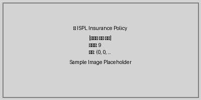
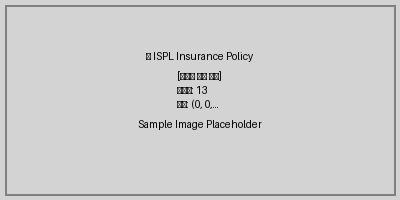
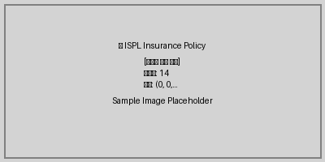
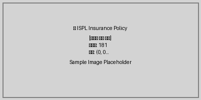

---
document_statistics:
  average_text_length: 173.81
  content_types:
    image: 50
    list_item: 14
    paragraph: 488
    subheader: 2930
  total_elements: 3482
  total_pages: 334
generated_at: '2025-09-24T20:01:58.200544'
generator: ISPL PDF Processor
language: ko
source_format: PDF
title: 1758710950 무배당 Axa초간편건강보험갱신형2501
---

## 목차

- [제 01 조 01
무배당 AXA
초간편
건강보험(갱신형)(2501)
보험 약관
적용일자](#제-01-조-01-무배당-axa-초간편-건강보험갱신형2501-보험-약관-적용일자) (페이지 1)
- [제 01 조 01
제작일자](#제-01-조-01-제작일자) (페이지 1)
- [본 약관 내용 중 특별약관은 보험증권에 기재된
특약에 한하여 보상받으실 수 있습니다.](#본-약관-내용-중-특별약관은-보험증권에-기재된-특약에-한하여-보상받으실-수-있습니다) (페이지 2)
- [제 1 절 보통약관 36
제 1 관 목적 및 용어의 정의 37](#제-1-절-보통약관-36-제-1-관-목적-및-용어의-정의-37) (페이지 3)
- [제 2 조(용어의 정의)
제 2 관 보험금의 지급 38](#제-2-조용어의-정의-제-2-관-보험금의-지급-38) (페이지 3)
- [제 3 조(보험금의 지급사유)](#제-3-조보험금의-지급사유) (페이지 3)
- [제 4 조(보험금 지급에 관한 세부규정)](#제-4-조보험금-지급에-관한-세부규정) (페이지 3)
- [제 5 조(보험금을 지급하지 않는 사유)](#제-5-조보험금을-지급하지-않는-사유) (페이지 3)
- [제 6 조(보험금 지급사유의 통지)](#제-6-조보험금-지급사유의-통지) (페이지 3)
- [제 7 조(보험금의 청구)](#제-7-조보험금의-청구) (페이지 3)
- [제 8 조(보험금의 지급절차)](#제-8-조보험금의-지급절차) (페이지 3)
- [제 9 조(보험금 받는 방법의 변경)](#제-9-조보험금-받는-방법의-변경) (페이지 3)
- [제 10 조(주소변경통지)](#제-10-조주소변경통지) (페이지 3)
- [제 11 조(보험수익자의 지정)](#제-11-조보험수익자의-지정) (페이지 3)
- [제 12 조(대표자의 지정)
제 3 관 계약자의 계약 전 알릴 의무 등 41](#제-12-조대표자의-지정-제-3-관-계약자의-계약-전-알릴-의무-등-41) (페이지 3)
- [제 13 조(계약 전 알릴 의무)](#제-13-조계약-전-알릴-의무) (페이지 3)
- [제 14 조(상해보험계약 후 알릴 의무)](#제-14-조상해보험계약-후-알릴-의무) (페이지 3)
- [제 15 조(알릴 의무 위반의 효과)](#제-15-조알릴-의무-위반의-효과) (페이지 3)
- [제 16 조(사기에 의한 계약)
제 4 관 보험계약의 성립과 유지 44](#제-16-조사기에-의한-계약-제-4-관-보험계약의-성립과-유지-44) (페이지 3)
- [제 17 조(보험계약의 성립)](#제-17-조보험계약의-성립) (페이지 3)
- [제 18 조(청약의 철회)](#제-18-조청약의-철회) (페이지 3)
- [제 19 조(약관교부 및 설명의무 등)](#제-19-조약관교부-및-설명의무-등) (페이지 3)
- [제 20 조(계약의 무효)](#제-20-조계약의-무효) (페이지 3)
- [제 21 조(계약내용의 변경 등)](#제-21-조계약내용의-변경-등) (페이지 3)
- [제 22 조(보험나이 등)](#제-22-조보험나이-등) (페이지 3)
- [제 23 조(계약의 자동갱신)](#제-23-조계약의-자동갱신) (페이지 3)
- [제 24 조(계약의 소멸)
제 5 관 보험료의 납입 49](#제-24-조계약의-소멸-제-5-관-보험료의-납입-49) (페이지 3)
- [제 25 조(제 1 회 보험료 및 회사의 보장개시)](#제-25-조제-1-회-보험료-및-회사의-보장개시) (페이지 3)
- [제 26 조(제 2 회 이후 보험료의 납입)](#제-26-조제-2-회-이후-보험료의-납입) (페이지 3)
- [제 27 조(보험료의 자동대출납입)](#제-27-조보험료의-자동대출납입) (페이지 4)
- [제 28 조(보험료의 납입이 연체되는 경우 납입최고(독촉)와 계약의 해지)](#제-28-조보험료의-납입이-연체되는-경우-납입최고독촉와-계약의-해지) (페이지 4)
- [제 29 조(보험료의 납입을 연체하여 해지된 계약의 부활(효력회복))](#제-29-조보험료의-납입을-연체하여-해지된-계약의-부활효력회복) (페이지 4)
- [제 30 조(강제집행 등으로 인하여 해지된 계약의 특별부활(효력회복))
제 6 관 계약의 해지 및 해약환급금 등 52](#제-30-조강제집행-등으로-인하여-해지된-계약의-특별부활효력회복-제-6-관-계약의-해지-및-해약환급금-등-52) (페이지 4)
- [제 31 조(계약자의 임의해지 및 피보험자의 서면동의 철회)](#제-31-조계약자의-임의해지-및-피보험자의-서면동의-철회) (페이지 4)
- [제 31 조의 2(위법계약의 해지)](#제-31-조의-2위법계약의-해지) (페이지 4)
- [제 32 조(중대사유로 인한 해지)](#제-32-조중대사유로-인한-해지) (페이지 4)
- [제 33 조(회사의 파산선고와 해지)](#제-33-조회사의-파산선고와-해지) (페이지 4)
- [제 34 조(해약환급금)](#제-34-조해약환급금) (페이지 4)
- [제 35 조(보험계약대출)](#제-35-조보험계약대출) (페이지 4)
- [제 36 조(배당금의 지급)
제 7 관 분쟁의 조정 등 54](#제-36-조배당금의-지급-제-7-관-분쟁의-조정-등-54) (페이지 4)
- [제 37 조(분쟁의 조정)](#제-37-조분쟁의-조정) (페이지 4)
- [제 38 조(관할법원)](#제-38-조관할법원) (페이지 4)
- [제 39 조(소멸시효)](#제-39-조소멸시효) (페이지 4)
- [제 40 조(약관의 해석)](#제-40-조약관의-해석) (페이지 4)
- [제 41 조(설명서 교부 및 보험안내자료 등의 효력)](#제-41-조설명서-교부-및-보험안내자료-등의-효력) (페이지 4)
- [제 42 조(회사의 손해배상책임)](#제-42-조회사의-손해배상책임) (페이지 4)
- [제 43 조(개인정보보호)](#제-43-조개인정보보호) (페이지 4)
- [제 44 조(준거법)](#제-44-조준거법) (페이지 4)
- [제 45 조(예금보험에 의한 지급보장)](#제-45-조예금보험에-의한-지급보장) (페이지 4)
- [제 2 절 특별약관 56](#제-2-절-특별약관-56) (페이지 4)
- [제 1 조 질병 관련 특별약관 57
1-](#제-1-조-질병-관련-특별약관-57-1) (페이지 4)
- [제 1 조 (갱신형)암진단금(초간편고지) 특별약관 58
1-](#제-1-조-갱신형암진단금초간편고지-특별약관-58-1) (페이지 4)
- [제 2 조 (갱신형)5 대고액치료비암진단금(초간편고지) 특별약관 62
1-](#제-2-조-갱신형5-대고액치료비암진단금초간편고지-특별약관-62-1) (페이지 4)
- [제 3 조 (갱신형)3 대특정암진단금(초간편고지) 특별약관 65
1-](#제-3-조-갱신형3-대특정암진단금초간편고지-특별약관-65-1) (페이지 4)
- [제 4 조 (갱신형)뇌출혈진단금(초간편고지) 특별약관 68
1-](#제-4-조-갱신형뇌출혈진단금초간편고지-특별약관-68-1) (페이지 4)
- [제 5 조 (갱신형)급성심근경색증진단금(초간편고지) 특별약관 70
1-](#제-5-조-갱신형급성심근경색증진단금초간편고지-특별약관-70-1) (페이지 4)
- [제 6 조 (갱신형)암수술(초간편고지) 특별약관 72
1-](#제-6-조-갱신형암수술초간편고지-특별약관-72-1) (페이지 4)
- [제 7 조 (갱신형)뇌출혈수술(초간편고지) 특별약관 77
1-](#제-7-조-갱신형뇌출혈수술초간편고지-특별약관-77-1) (페이지 4)
- [제 8 조 (갱신형)급성심근경색증수술(초간편고지) 특별약관 79
1-](#제-8-조-갱신형급성심근경색증수술초간편고지-특별약관-79-1) (페이지 4)
- [제 9 조 (갱신형)항암방사선 약물치료비(초간편고지) 특별약관 81
1-](#제-9-조-갱신형항암방사선-약물치료비초간편고지-특별약관-81-1) (페이지 4)
- [제 10 조 (갱신형)표적항암약물허가치료비(초간편고지) 특별약관 85](#제-10-조-갱신형표적항암약물허가치료비초간편고지-특별약관-85) (페이지 4)
- [제 3 절 제도성 특별약관 91](#제-3-절-제도성-특별약관-91) (페이지 4)
- [제 1 조 이륜자동차운전및탑승중상해부담보 특별약관 92](#제-1-조-이륜자동차운전및탑승중상해부담보-특별약관-92) (페이지 4)
- [제 2 조 보험료자동이체납입 특별약관 93](#제-2-조-보험료자동이체납입-특별약관-93) (페이지 4)
- [제 3 조 제재위반 부담보 특별약관 94](#제-3-조-제재위반-부담보-특별약관-94) (페이지 4)
- [제 4 조 지정대리청구서비스 특별약관 95](#제-4-조-지정대리청구서비스-특별약관-95) (페이지 4)
- [제 5 조 장애인전용보험전환 특별약관 97 별표 1 장해분류표 101 별표 2 악성신생물(암) 분류표 120](#제-5-조-장애인전용보험전환-특별약관-97-별표-1-장해분류표-101-별표-2-악성신생물암-분류표-120) (페이지 4)
- [별표 3 제자리신생물 분류표 121 별표 4 행동양식 불명 또는 미상의 신생물 분류표 122 별표 5 불명확한, 이차성 및 상세불명 부위의 악성신생물(암) 분류표 123 별표 6 5 대고액치료비암 분류표 124 별표 7 3 대특정암 분류표 125 별표 8 뇌출혈 분류표 126 별표 9 급성심근경색증 분류표 127 별표 10 특정신체부위 및 질병분류표 128 별표 11 보험금을 지급할 때의 적립이율 계산 130 별표 12 약관에서 인용된 법ㆍ규정 131 부록 표적항암제 해당 의약품명 및 성분명 안내 155 AXA 건강지킴이 서비스 안내문 160 보험용어 해설 165](#별표-3-제자리신생물-분류표-121-별표-4-행동양식-불명-또는-미상의-신생물-분류표-122-별표-5-불명확한-이차성-및-상세불명-부위의-악성신생물암-분류표-123-별표-6-5-대고액치료비암-분류표-124-별표-7-3-대특정암-분류표-125-별표-8-뇌출혈-분류표-126-별표-9-급성심근경색증-분류표-127-별표-10-특정신체부위-및-질병분류표-128-별표-11-보험금을-지급할-때의-적립이율-계산-130-별표-12-약관에서-인용된-법ㆍ규정-131-부록-표적항암제-해당-의약품명-및-성분명-안내-155-axa-건강지킴이-서비스-안내문-160-보험용어-해설-165) (페이지 5)
- [6 무배당 AXA 초간편건강보험(갱신형)2501 약관
이 약관은 법령 및 내부통제기준에 따른 절차를 거쳐 제공됩니다.](#6-무배당-axa-초간편건강보험갱신형2501-약관-이-약관은-법령-및-내부통제기준에-따른-절차를-거쳐-제공됩니다) (페이지 6)
- [약관을 쉽게 이용할 수 있는
약관 이용 Guide Book 同 guidebook 은 보험규정의 개념 및 구성 등을 간략하게 소개하고,
소비자 관점에서 약관 주요 내용 등을 쉽게 찾고
이해할 방법을 안내하는 그것을 목적으로 함](#약관을-쉽게-이용할-수-있는-약관-이용-guide-book-同-guidebook-은-보험규정의-개념-및-구성-등을-간략하게-소개하고-소비자-관점에서-약관-주요-내용-등을-쉽게-찾고-이해할-방법을-안내하는-그것을-목적으로-함) (페이지 7)
- [8 무배당 AXA 초간편건강보험(갱신형)2501 약관
보험계약자와 보험회사의 권리 및 의무를 규정하고 있습니다 특히, 청약철회, 계약취소, 보험금 지급 및 지급제한 사항 등
보험계약의 중요사항에 대한 설명이 들어 있으니 반드시 확인하셔야 합니다](#8-무배당-axa-초간편건강보험갱신형2501-약관-보험계약자와-보험회사의-권리-및-의무를-규정하고-있습니다-특히-청약철회-계약취소-보험금-지급-및-지급제한-사항-등-보험계약의-중요사항에-대한-설명이-들어-있으니-반드시-확인하셔야-합니다) (페이지 8)
- [한 눈에 보는 약관의 구성
약관 이용
약관을 쉽게 잘 이용할 수 있도록
가이드 북
약관의 구성, 쉽게 찾는 방법 등의 내용을 담고 있는 지침서
시각화된
약관을 쉽게 이해할 수 있도록
약관 요약서
계약 주요내용 및 유의사항 등을 시각적 방법을 이용하여 간단 요약한 약관 주계약(보통약관): 기본계약을 포함한 공통 사항을 정한 기본약관
(주계약&특약) 특약(특별약관): 보통약관에 정한 사항 외 선택가입한 보장내용 등 필요한 사항을 정한 약관
용어해설 및
관련 법규 등을 소비자에게 안내
QR 코드를 통한 편리한 정보 이용
QR 코드란](#한-눈에-보는-약관의-구성-약관-이용-약관을-쉽게-잘-이용할-수-있도록-가이드-북-약관의-구성-쉽게-찾는-방법-등의-내용을-담고-있는-지침서-시각화된-약관을-쉽게-이해할-수-있도록-약관-요약서-계약-주요내용-및-유의사항-등을-시각적-방법을-이용하여-간단-요약한-약관-주계약보통약관-기본계약을-포함한-공통-사항을-정한-기본약관-주계약특약-특약특별약관-보통약관에-정한-사항-외-선택가입한-보장내용-등-필요한-사항을-정한-약관-용어해설-및-관련-법규-등을-소비자에게-안내-qr-코드를-통한-편리한-정보-이용-qr-코드란) (페이지 8)
- [제 3 조(보험금의 지급사유) P. 38
보험금 지급 및](#제-3-조보험금의-지급사유-p-38-보험금-지급-및) (페이지 9)
- [제 5 조(보험금을 지급하지 않는 사유) P. 39
지급제한 사항
영상 자료
* 본인이 가입한 특약을 확인하여 가입특약별 보험금 지급사유 및 미지급사유 도 반드시 확인할 필요
2](#제-5-조보험금을-지급하지-않는-사유-p-39-지급제한-사항-영상-자료-본인이-가입한-특약을-확인하여-가입특약별-보험금-지급사유-및-미지급사유-도-반드시-확인할-필요-2) (페이지 9)
- [제 18 조(청약의 철회) P. 45
청약 철회
영상 자료
3](#제-18-조청약의-철회-p-45-청약-철회-영상-자료-3) (페이지 9)
- [제 19 조(약관교부 및 설명의무 등) P. 45
계약 취소
영상 자료
4](#제-19-조약관교부-및-설명의무-등-p-45-계약-취소-영상-자료-4) (페이지 9)
- [제 20 조(계약의 무효) P. 46
계약 무효
영상 자료](#제-20-조계약의-무효-p-46-계약-무효-영상-자료) (페이지 9)
- [제 13 조(계약 전 알릴 의무) P. 41
계약 前 알릴 의무](#제-13-조계약-전-알릴-의무-p-41-계약-前-알릴-의무) (페이지 9)
- [제 15 조(알릴 의무 위반의 효과) P. 43
및 위반효과
영상 자료](#제-15-조알릴-의무-위반의-효과-p-43-및-위반효과-영상-자료) (페이지 9)
- [제 14 조(상해보험계약 후 알릴 의무) P. 42
계약 後 알릴 의무](#제-14-조상해보험계약-후-알릴-의무-p-42-계약-後-알릴-의무) (페이지 9)
- [제 15 조(알릴 의무 위반의 효과) P. 43
및 위반효과
영상 자료](#제-15-조알릴-의무-위반의-효과-p-43-및-위반효과-영상-자료) (페이지 9)
- [제 28 조(보험료의 납입이 연체되는 경우 납입최고
7 P. 50
(독촉)와 계약의 해지)
보험료 연체 및 해지
영상 자료](#제-28-조보험료의-납입이-연체되는-경우-납입최고-7-p-50-독촉와-계약의-해지-보험료-연체-및-해지-영상-자료) (페이지 9)
- [제 29 조(보험료의 납입을 연체하여 해지된 계약의
8 P. 51
부활(효력회복))
부활(효력회복)
영상 자료](#제-29-조보험료의-납입을-연체하여-해지된-계약의-8-p-51-부활효력회복-부활효력회복-영상-자료) (페이지 9)
- [제 31 조(계약자의 임의해지 및 피보험자의 서면동
P. 52
9 의 철회)
해약환급금](#제-31-조계약자의-임의해지-및-피보험자의-서면동-p-52-9-의-철회-해약환급금) (페이지 9)
- [제 34 조(해약환급금) P. 53
영상 자료](#제-34-조해약환급금-p-53-영상-자료) (페이지 9)
- [제 35 조(보험계약대출) P. 53
보험계약대출
영상 자료](#제-35-조보험계약대출-p-53-보험계약대출-영상-자료) (페이지 9)
- [제 1566 조 제 1566 항)로 문의 가능 보험상품 거래단계별 필요한 금융꿀팁 또는 핵심정보 등은
금융감독원 금융소비자정보 포탈(FINE, fine.fss.or.kr)에서 확인 가능](#제-1566-조-제-1566-항로-문의-가능-보험상품-거래단계별-필요한-금융꿀팁-또는-핵심정보-등은-금융감독원-금융소비자정보-포탈fine-finefssorkr에서-확인-가능) (페이지 10)
- [쉽게
이해하는
약관요약서
이 요약서는 그림 도표 아이콘 삽화 등 시각화된 자료를 바탕으로 보험상품 및
약관의 핵심내용을 알기 쉽게 작성한 것입니다 보다 자세한 사항은 상품설명서 및 약관을 반드시 확인하시기 바랍니다 이 요약서의 내용을 이해하지 못하고 보험에 가입할 경우 불이익을 받을 수
있으므로, 동 내용을 반드시 이해하시고 계약체결 여부를 결정하시기 바랍니다.](#쉽게-이해하는-약관요약서-이-요약서는-그림-도표-아이콘-삽화-등-시각화된-자료를-바탕으로-보험상품-및-약관의-핵심내용을-알기-쉽게-작성한-것입니다-보다-자세한-사항은-상품설명서-및-약관을-반드시-확인하시기-바랍니다-이-요약서의-내용을-이해하지-못하고-보험에-가입할-경우-불이익을-받을-수-있으므로-동-내용을-반드시-이해하시고-계약체결-여부를-결정하시기-바랍니다) (페이지 11)
- [제 01 조 상품의 주요 특징
3 가지 질문 통과 시 과거 병력이 있거나 나이가 많은 분도 쉽게 가입 가능
일반상해로 인한 후유장해 뿐만 아니라 특약가입시 3 대 질병 진단금 보장
특약가입시 표적항암약물허가치료비 보장
목표 걸음수 및 목표 복약률 달성에 따른 보험료 할인(만성질환 헬스케어)](#제-01-조-상품의-주요-특징-3-가지-질문-통과-시-과거-병력이-있거나-나이가-많은-분도-쉽게-가입-가능-일반상해로-인한-후유장해-뿐만-아니라-특약가입시-3-대-질병-진단금-보장-특약가입시-표적항암약물허가치료비-보장-목표-걸음수-및-목표-복약률-달성에-따른-보험료-할인만성질환-헬스케어) (페이지 12)
- [제 02 조 상품명 으로 상품의 특징 이해하기
무배당 AXA 초간편건강보험(갱신형)2501(1 종 초간편고지형, 2 종 일반고지형)
❶ 무배당 : 계약자에게 배당을 하지 않는 상품입니다.
❷ 상해 및 질병보험 : 상해, 질병 등으로 인한 진단 입원 수술 등의 위험을 보장하는
상품입니다.
❸ 갱신형 : 보험계약 갱신 시 연령의 증가, 위험률 변동 등으로 보험료가 인상될 수
있습니다.](#제-02-조-상품명-으로-상품의-특징-이해하기-무배당-axa-초간편건강보험갱신형25011-종-초간편고지형-2-종-일반고지형-❶-무배당-계약자에게-배당을-하지-않는-상품입니다-❷-상해-및-질병보험-상해-질병-등으로-인한-진단-입원-수술-등의-위험을-보장하는-상품입니다-❸-갱신형-보험계약-갱신-시-연령의-증가-위험률-변동-등으로-보험료가-인상될-수-있습니다) (페이지 12)
- [제 01 조 보험금 지급제한사항
이 보험에는 면책기간, 감액지급, 보장한도 및 자기부담금 등 보험금 지급제한 조건이 부가되어 있습니다 보다 자세한 사항은 상품설명서 및 약관을 참조하시기 바랍니다 면책기간
이 보험에는 보험금이 지급되지 않는 기간(면책기간)이 설정된 담보가 있습니다 면책기간 적용 담보 [ * 초간편고지형, 일반고지형 모두 적용됩니다](#제-01-조-보험금-지급제한사항-이-보험에는-면책기간-감액지급-보장한도-및-자기부담금-등-보험금-지급제한-조건이-부가되어-있습니다-보다-자세한-사항은-상품설명서-및-약관을-참조하시기-바랍니다-면책기간-이-보험에는-보험금이-지급되지-않는-기간면책기간이-설정된-담보가-있습니다-면책기간-적용-담보-초간편고지형-일반고지형-모두-적용됩니다) (페이지 13)
- [보장한도 적용 담보 [ * 초간편고지형, 일반고지형 모두 적용됩니다](#보장한도-적용-담보-초간편고지형-일반고지형-모두-적용됩니다) (페이지 14)
- [제 02 조 해약환급금에 관한 사항 보험계약자가 보험계약을 중도에 해지할 경우 보험회사는 해약환급금을 지급합니다.
해약환급금
① 해약환급금은 납입한 보험료 보다 적거나 없을 수도 있습니다.
* 해약환급금 : 납입한 보험료에서 계약체결 유지관리 등에 소요되는 경비 및 경과된
기간의 위험 보장에 사용된 보험료를 차감하여 지급
)
해약환급금](#제-02-조-해약환급금에-관한-사항-보험계약자가-보험계약을-중도에-해지할-경우-보험회사는-해약환급금을-지급합니다-해약환급금-①-해약환급금은-납입한-보험료-보다-적거나-없을-수도-있습니다-해약환급금-납입한-보험료에서-계약체결-유지관리-등에-소요되는-경비-및-경과된-기간의-위험-보장에-사용된-보험료를-차감하여-지급-해약환급금) (페이지 15)
- [제 03 조 갱신 시 보험료 인상 가능성 이 보험에는 갱신 시 보험료가 변동되는 갱신형 계약이 포함되어 있습니다 갱신형 계약은 갱신할 때 마다 연령의 증가, 위험률 변동 등으로 보험료가 인상될 수 있으니
주의하시기 바랍니다](#제-03-조-갱신-시-보험료-인상-가능성-이-보험에는-갱신-시-보험료가-변동되는-갱신형-계약이-포함되어-있습니다-갱신형-계약은-갱신할-때-마다-연령의-증가-위험률-변동-등으로-보험료가-인상될-수-있으니-주의하시기-바랍니다) (페이지 16)
- [갱신시 보험료가 인상될 수 있는 계약
[ 1 종 초간편고지형 ] [ 2 종 일반고지형 ]
(갱신형)일반상해 80%이상후유장해(초간편고지) (갱신형)일반상해 80%이상후유장해 보통약관
보통약관 (갱신형)암진단금 특별약관
(갱신형)암진단금(초간편고지) 특별약관 (갱신형)5 대고액치료비암진단금 특별약관
(갱신형)5 대고액치료비암진단금(초간편고지) 특별약관 (갱신형)3 대특정암진단금 특별약관
(갱신형)3 대특정암진단금(초간편고지) 특별약관 (갱신형)뇌출혈진단금 특별약관
(갱신형)뇌출혈진단금(초간편고지) 특별약관 (갱신형)급성심근경색증진단금 특별약관
(갱신형)급성심근경색증진단금(초간편고지) 특별약관 (갱신형)암수술 특별약관
(갱신형)암수술(초간편고지) 특별약관 (갱신형)뇌출혈수술 특별약관
(갱신형)뇌출혈수술(초간편고지) 특별약관 (갱신형)급성심근경색증수술 특별약관
(갱신형)급성심근경색증수술(초간편고지) 특별약관 (갱신형)항암방사선 약물치료비 특별약관
(갱신형)항암방사선 약물치료비(초간편고지) 특별약관 (갱신형)표적항암약물허가치료비 특별약관
(갱신형)표적항암약물허가치료비(초간편고지) 특별약관](#갱신시-보험료가-인상될-수-있는-계약-1-종-초간편고지형-2-종-일반고지형-갱신형일반상해-80이상후유장해초간편고지-갱신형일반상해-80이상후유장해-보통약관-보통약관-갱신형암진단금-특별약관-갱신형암진단금초간편고지-특별약관-갱신형5-대고액치료비암진단금-특별약관-갱신형5-대고액치료비암진단금초간편고지-특별약관-갱신형3-대특정암진단금-특별약관-갱신형3-대특정암진단금초간편고지-특별약관-갱신형뇌출혈진단금-특별약관-갱신형뇌출혈진단금초간편고지-특별약관-갱신형급성심근경색증진단금-특별약관-갱신형급성심근경색증진단금초간편고지-특별약관-갱신형암수술-특별약관-갱신형암수술초간편고지-특별약관-갱신형뇌출혈수술-특별약관-갱신형뇌출혈수술초간편고지-특별약관-갱신형급성심근경색증수술-특별약관-갱신형급성심근경색증수술초간편고지-특별약관-갱신형항암방사선-약물치료비-특별약관-갱신형항암방사선-약물치료비초간편고지-특별약관-갱신형표적항암약물허가치료비-특별약관-갱신형표적항암약물허가치료비초간편고지-특별약관) (페이지 16)
- [제 04 조 실손보상형 담보/실손의료보험 이 보험에는 실제 발생한 손해를 보상(실손보상)하는 담보가 포함되어 있습니다.
① 동일한 위험을 보장하는 2 개 이상의 계약에 중복 가입하더라도 실제 발생한 손해(비용)을
초과하여 보험금을 지급하지 않습니다. (중복 가입 시 비례 보상)
② 동일한 위험을 보장하는 여러 개의 실손보상형 담보(또는 실손의료보험)에 가입하여
불필요하게 보험료를 납입하지 않도록 주의하시기 바랍니다.
실손보상형 담보
해당사항 없음](#제-04-조-실손보상형-담보실손의료보험-이-보험에는-실제-발생한-손해를-보상실손보상하는-담보가-포함되어-있습니다-①-동일한-위험을-보장하는-2-개-이상의-계약에-중복-가입하더라도-실제-발생한-손해비용을-초과하여-보험금을-지급하지-않습니다-중복-가입-시-비례-보상-②-동일한-위험을-보장하는-여러-개의-실손보상형-담보또는-실손의료보험에-가입하여-불필요하게-보험료를-납입하지-않도록-주의하시기-바랍니다-실손보상형-담보-해당사항-없음) (페이지 16)
- [제 05 조 소비자가 반드시 알아두어야 할 상품의 주요 특성
① 보장성보험
① 이 보험은 상해, 질병 보장을 주목적으로 하는 보장성보험이며, 저축이나 연금수령을
목적으로 가입하시기에 적합하지 않습니다 ② 만기 또는 중도해지 시 납입한 보험료보다 환급금이 적을 수 있습니다](#제-05-조-소비자가-반드시-알아두어야-할-상품의-주요-특성-①-보장성보험-①-이-보험은-상해-질병-보장을-주목적으로-하는-보장성보험이며-저축이나-연금수령을-목적으로-가입하시기에-적합하지-않습니다-②-만기-또는-중도해지-시-납입한-보험료보다-환급금이-적을-수-있습니다) (페이지 17)
- [제 01 조 청약을 철회할 수 있는 권리
주계약(보통보험) 약관 P 45 보험계약자는 보험증권을 받은 날부터 15 일 이내에 보험계약의 청약을 철회할 수 있으며,
이 경우 회사는 청약 철회를 접수한 날부터 3 영업일 이내에 납입한 보험료를 돌려드립니다](#제-01-조-청약을-철회할-수-있는-권리-주계약보통보험-약관-p-45-보험계약자는-보험증권을-받은-날부터-15-일-이내에-보험계약의-청약을-철회할-수-있으며-이-경우-회사는-청약-철회를-접수한-날부터-3-영업일-이내에-납입한-보험료를-돌려드립니다) (페이지 18)
- [청약철회 기간
청약일 보험증권을 받은 날 보험증권을 받은 날 +15 일
[ 청약철회가 불가한 경우 ]
① 청약일부터 30 일(만 65 세 이상 보험계약자 & 전화로 체결한 계약의 경우 45 일)을 초과한 경우
② 진단계약, 보장기간이 90 일 미만인 계약 또는 전문금융소비자가 체결한 계약](#청약철회-기간-청약일-보험증권을-받은-날-보험증권을-받은-날-15-일-청약철회가-불가한-경우-①-청약일부터-30-일만-65-세-이상-보험계약자-전화로-체결한-계약의-경우-45-일을-초과한-경우-②-진단계약-보장기간이-90-일-미만인-계약-또는-전문금융소비자가-체결한-계약) (페이지 18)
- [제 02 조 보험계약을 취소할 수 있는 권리
주계약(보통보험) 약관 P. 45 보험계약자는 다음의 경우 계약이 성립한 날부터 3 개월 이내에 계약을 취소할 수 있습니다.
보험계약자가 청약서에 자필서명을 하지 않은 경우
< 계약 취소 시 지급하는 금액 >
납입한 보험료 이자
계약취소 기간
계약이 성립한 날 계약이 성립한 날 + 3 개월](#제-02-조-보험계약을-취소할-수-있는-권리-주계약보통보험-약관-p-45-보험계약자는-다음의-경우-계약이-성립한-날부터-3-개월-이내에-계약을-취소할-수-있습니다-보험계약자가-청약서에-자필서명을-하지-않은-경우-계약-취소-시-지급하는-금액-납입한-보험료-이자-계약취소-기간-계약이-성립한-날-계약이-성립한-날-3-개월) (페이지 18)
- [제 03 조 보험계약의 무효
주계약(보통보험) 약관 P. 46 보험회사는 다음의 경우 보험계약을 무효로 하며, 이미 납입한 보험료를 돌려드립니다.
타인의 사망을 보험금 지급사유로 하는 보험계약에서 피보험자의 서면 동의를 얻지 않은 경우
만 15 세 미만자, 심신상실자 또는 심신박약자의 사망을 보험금 지급사유(피보험자 지정)로 한 경우
보험계약 체결 시 계약에서 정한 피보험자의 나이에 미달되었거나 초과되었을 경우](#제-03-조-보험계약의-무효-주계약보통보험-약관-p-46-보험회사는-다음의-경우-보험계약을-무효로-하며-이미-납입한-보험료를-돌려드립니다-타인의-사망을-보험금-지급사유로-하는-보험계약에서-피보험자의-서면-동의를-얻지-않은-경우-만-15-세-미만자-심신상실자-또는-심신박약자의-사망을-보험금-지급사유피보험자-지정로-한-경우-보험계약-체결-시-계약에서-정한-피보험자의-나이에-미달되었거나-초과되었을-경우) (페이지 18)
- [제 04 조 보험계약前 알릴의무 및 위반시 효과
주계약(보통보험) 약관 P. 41/P. 43 보험계약자 또는 피보험자는 보험계약을 청약할 때 청약서의 질문사항(중요사항)에 대하여
사실대로 알려야 합니다.
① 청약서의 질문사항에 대하여 보험설계사에게만 구두로 알렸을 경우 보험계약前 알릴의무를 이행한
것으로 볼 수 없습니다.
② 전화 등 통신수단을 통한 보험계약의 경우 보험회사 상담원의 질문이 청약서의 질문사항을 대신하므로
상담원의 질문에 사실대로 답변하여야 합니다.](#제-04-조-보험계약前-알릴의무-및-위반시-효과-주계약보통보험-약관-p-41p-43-보험계약자-또는-피보험자는-보험계약을-청약할-때-청약서의-질문사항중요사항에-대하여-사실대로-알려야-합니다-①-청약서의-질문사항에-대하여-보험설계사에게만-구두로-알렸을-경우-보험계약前-알릴의무를-이행한-것으로-볼-수-없습니다-②-전화-등-통신수단을-통한-보험계약의-경우-보험회사-상담원의-질문이-청약서의-질문사항을-대신하므로-상담원의-질문에-사실대로-답변하여야-합니다) (페이지 19)
- [제 05 조 보험계약後 알릴의무 및 위반시 효과
주계약(보통보험) 약관 P. 42/P. 43 보험계약자 등은 피보험자의 직업 직무 변경 등이 발생한 경우 지체없이 보험회사에 알려야 하며,
이를 위반하는 경우 보험금 지급이 제한될 수 있습니다.
보험회사는 피보험자의 직업 직무 변경 등으로
① 위험이 감소한 경우 보험료를 감액하고 정산금액을 환급하여 드리며,
② 위험이 증가한 경우 보험료가 증액되고 정산금액의 추가 납입이 필요할 수 있습니다.](#제-05-조-보험계약後-알릴의무-및-위반시-효과-주계약보통보험-약관-p-42p-43-보험계약자-등은-피보험자의-직업-직무-변경-등이-발생한-경우-지체없이-보험회사에-알려야-하며-이를-위반하는-경우-보험금-지급이-제한될-수-있습니다-보험회사는-피보험자의-직업-직무-변경-등으로-①-위험이-감소한-경우-보험료를-감액하고-정산금액을-환급하여-드리며-②-위험이-증가한-경우-보험료가-증액되고-정산금액의-추가-납입이-필요할-수-있습니다) (페이지 20)
- [제 06 조 보험료 납입연체 및 보험계약의 해지
주계약(보통보험) 약관 P. 50 보험료 납입이 연체 중인 경우 보험회사는 납입을 독촉하는 안내를 하며, 납입최고(독촉) 기간 내에
보험료를 납입하지 않으면 보험계약이 해지됩니다.
* 납입최고(독촉) 기간 : 14 일 이상(보험기간 1 년 미만인 경우 7 일 이상)
[ ] [ ] [ ]
납입연체 : ① 보험료 납입이 연체 중이거나 ② 유니버셜 상품에서 월대체보험료를 충당할 수 없는 경우](#제-06-조-보험료-납입연체-및-보험계약의-해지-주계약보통보험-약관-p-50-보험료-납입이-연체-중인-경우-보험회사는-납입을-독촉하는-안내를-하며-납입최고독촉-기간-내에-보험료를-납입하지-않으면-보험계약이-해지됩니다-납입최고독촉-기간-14-일-이상보험기간-1-년-미만인-경우-7-일-이상-납입연체-①-보험료-납입이-연체-중이거나-②-유니버셜-상품에서-월대체보험료를-충당할-수-없는-경우) (페이지 20)
- [제 07 조 해지된 보험계약의 부활 (효력회복)
주계약(보통보험) 약관 P. 51 보험료 납입연체로 보험계약이 해지되었으나 해약환급금을 받지 않은 경우 해지된 날부터 3 년 이내에
보험계약의 부활(효력회복)을 청약할 수 있습니다.
보험회사는 피보험자의 건강상태, 직업 등에 따라 승낙여부를 결정하며, 부활(효력회복)을 거절하거나
보장의 일부를 제한할 수 있습니다.
사
절
해약환급금
미수령
한](#제-07-조-해지된-보험계약의-부활-효력회복-주계약보통보험-약관-p-51-보험료-납입연체로-보험계약이-해지되었으나-해약환급금을-받지-않은-경우-해지된-날부터-3-년-이내에-보험계약의-부활효력회복을-청약할-수-있습니다-보험회사는-피보험자의-건강상태-직업-등에-따라-승낙여부를-결정하며-부활효력회복을-거절하거나-보장의-일부를-제한할-수-있습니다-사-절-해약환급금-미수령-한) (페이지 21)
- [제 08 조 보험계약대출
주계약(보통보험) 약관 P. 53 보험계약자는 보험계약의 해약환급금 범위 내에서 보험계약대출을 받을 수 있습니다.
① 상환하지 않은 보험계약대출금 및 이자는 해약환급금 또는 보험금에서 차감될 수 있습니다.
② 순수보장성보험 등 보험상품 종류에 따라 보험계약대출이 제한될 수 있습니다.
③ 보험계약자는 대출신청 전에 보험계약대출이율을 반드시 확인하시기 바랍니다.
해약환급금
해약환급금](#제-08-조-보험계약대출-주계약보통보험-약관-p-53-보험계약자는-보험계약의-해약환급금-범위-내에서-보험계약대출을-받을-수-있습니다-①-상환하지-않은-보험계약대출금-및-이자는-해약환급금-또는-보험금에서-차감될-수-있습니다-②-순수보장성보험-등-보험상품-종류에-따라-보험계약대출이-제한될-수-있습니다-③-보험계약자는-대출신청-전에-보험계약대출이율을-반드시-확인하시기-바랍니다-해약환급금-해약환급금) (페이지 21)
- [제 09 조 보험금 청구절차 및 서류
주계약(보통보험) 약관 P 27~31 보험금은 청구서류 접수일부터 3 영업일 이내에 지급하는 것이 원칙입니다](#제-09-조-보험금-청구절차-및-서류-주계약보통보험-약관-p-2731-보험금은-청구서류-접수일부터-3-영업일-이내에-지급하는-것이-원칙입니다) (페이지 22)
- [보험금 청구서류
구분 진단서 입퇴원확인서 수술확인서 통원확인서 진단사실 확인서류 공통
사망
(사망진단서)
장해
(장해진단서)
진단 (검사결과지 등)
청구서
신분증
입원 수술 청구 접수일부터 지급일까지 3 영업일 이내
(조사 등이 필요한 경우 최대 30 일)
실손 (입원시) (수술시) (통원시)
주) 보험사고의 종류, 내용 등에 따라 진료비 세부내역서 등 추가서류가 필요할 수 있습니다.](#보험금-청구서류-구분-진단서-입퇴원확인서-수술확인서-통원확인서-진단사실-확인서류-공통-사망-사망진단서-장해-장해진단서-진단-검사결과지-등-청구서-신분증-입원-수술-청구-접수일부터-지급일까지-3-영업일-이내-조사-등이-필요한-경우-최대-30-일-실손-입원시-수술시-통원시-주-보험사고의-종류-내용-등에-따라-진료비-세부내역서-등-추가서류가-필요할-수-있습니다) (페이지 22)
- [제 1 조 보험계약 관련 유의사항 보험계약 전 알릴 의무 위반
전화 등 통신수단을 통해 보험에 가입하는 경우에는 별도의 서면질의서 없이 안내원의 질
문에 답하고 이를 녹음하는 방식으로 계약 전 알릴 의무를 이행하여야 하므로 답변에 특히
신중하여야 합니다](#제-1-조-보험계약-관련-유의사항-보험계약-전-알릴-의무-위반-전화-등-통신수단을-통해-보험에-가입하는-경우에는-별도의-서면질의서-없이-안내원의-질-문에-답하고-이를-녹음하는-방식으로-계약-전-알릴-의무를-이행하여야-하므로-답변에-특히-신중하여야-합니다) (페이지 23)
- [갱신계약
- 회사는 자동갱신 적용대상 계약의 보험기간이 끝나기 15 일 이전까지 해당 피보험자의 갱
신계약 보험료를 서면 등으로 통보합니다](#갱신계약-회사는-자동갱신-적용대상-계약의-보험기간이-끝나기-15-일-이전까지-해당-피보험자의-갱-신계약-보험료를-서면-등으로-통보합니다) (페이지 23)
- [제 2 조 해약환급금 관련 유의사항
- 보험은 은행의 저축과는 달리 위험보장과 저축을 겸한 제도로서 계약자가 납입한 보험료 중
일부는 불의의 사고를 당한 다른 가입자에게 보험금으로 지급되며, 또 다른 일부는 회사 운
영에 필요한 경비(모집수수료, 계약유지관리비용 등)로 사용되므로 중도 해지시 지급되는 해
약환급금은 납입한 보험료보다 적거나 없을 수도 있습니다.](#제-2-조-해약환급금-관련-유의사항-보험은-은행의-저축과는-달리-위험보장과-저축을-겸한-제도로서-계약자가-납입한-보험료-중-일부는-불의의-사고를-당한-다른-가입자에게-보험금으로-지급되며-또-다른-일부는-회사-운-영에-필요한-경비모집수수료-계약유지관리비용-등로-사용되므로-중도-해지시-지급되는-해-약환급금은-납입한-보험료보다-적거나-없을-수도-있습니다) (페이지 23)
- [제 3 조 보험계약대출 관련 유의사항
- 계약자는 이 계약의 해약환급금 범위 내에서 회사가 정한 방법에 따라 대출( 보험계약대출 이라 합니다)을 받을 수 있습니다. 그러나, 순수보장성보험 등 보험상품의 종류에 따라 보험
계약대출이 제한될 수도 있습니다. 보험금 지급관련 특히 유의할 사항](#제-3-조-보험계약대출-관련-유의사항-계약자는-이-계약의-해약환급금-범위-내에서-회사가-정한-방법에-따라-대출-보험계약대출-이라-합니다을-받을-수-있습니다-그러나-순수보장성보험-등-보험상품의-종류에-따라-보험-계약대출이-제한될-수도-있습니다-보험금-지급관련-특히-유의할-사항) (페이지 23)
- [제 1 조 암 관련 담보
- 보험계약일로부터 90 일 이내에 암으로 진단받은 경우에는 보험금을 지급하지 않습니다 - 90 일이 지난 이후에도 암진단일이 보험계약일로부터 일정기간(예: 1 년 등)이내인 경우 보험
금이 삭감될 수 있습니다](#제-1-조-암-관련-담보-보험계약일로부터-90-일-이내에-암으로-진단받은-경우에는-보험금을-지급하지-않습니다-90-일이-지난-이후에도-암진단일이-보험계약일로부터-일정기간예-1-년-등이내인-경우-보험-금이-삭감될-수-있습니다) (페이지 23)
- [최초 보험가입 최초 보험가입 후 정해진 기간
담보명 또는 부활(효력회복) 미만에 보험금 지급사유가 발생한
후 면책기간 경우 50% 감액 지급
암 90 일
기타피부암
갑상선암
암진단금 O (1 년)
대장점막내암 X
제자리암
경계성종양
5 대고액치료비암진단금 90 일 O (1 년)
3 대특정암진단금 90 일 O (1 년)](#최초-보험가입-최초-보험가입-후-정해진-기간-담보명-또는-부활효력회복-미만에-보험금-지급사유가-발생한-후-면책기간-경우-50-감액-지급-암-90-일-기타피부암-갑상선암-암진단금-o-1-년-대장점막내암-x-제자리암-경계성종양-5-대고액치료비암진단금-90-일-o-1-년-3-대특정암진단금-90-일-o-1-년) (페이지 23)
- [제 2 조 특정질병 관련 담보
- 뇌출혈, 급성심근경색증 등을 보장하는 보험은 보험계약일로부터 1 년 미만에 보험금 지급사
유 발생 시 보험가입금액의 50%를 지급합니다 - 뇌출혈, 급성심근경색증 등 특정 질병을 보장하는 보험은 약관이나 별표에 나열되어 있는
질병만 보험금을 지급합니다](#제-2-조-특정질병-관련-담보-뇌출혈-급성심근경색증-등을-보장하는-보험은-보험계약일로부터-1-년-미만에-보험금-지급사-유-발생-시-보험가입금액의-50를-지급합니다-뇌출혈-급성심근경색증-등-특정-질병을-보장하는-보험은-약관이나-별표에-나열되어-있는-질병만-보험금을-지급합니다) (페이지 24)
- [제 3 조 수술 관련 담보
- 약관상 수술의 정의에 포함되지 않는 조작의 경우(예: 주사기 등으로 빨아들이는 처치, 바늘
등을 통해 체액을 뽑아내거나 약물을 주입하는 것 등) 보험금을 지급하지 않습니다.
이 가입자 유의사항은 약관의 주요내용을 요약 발췌한 것이므로 기타 자세한 사항은
해당약관(보통약관, 특별약관)의 내용을 따릅니다.](#제-3-조-수술-관련-담보-약관상-수술의-정의에-포함되지-않는-조작의-경우예-주사기-등으로-빨아들이는-처치-바늘-등을-통해-체액을-뽑아내거나-약물을-주입하는-것-등-보험금을-지급하지-않습니다-이-가입자-유의사항은-약관의-주요내용을-요약-발췌한-것이므로-기타-자세한-사항은-해당약관보통약관-특별약관의-내용을-따릅니다) (페이지 24)
- [제 1 조 자필서명
계약자와 피보험자가 자필서명을 하지 않으신 경우에는 보장을 받지 못할 수 있습니다.
다만, 전화를 이용하여 가입할 때 일정요건이 충족되면 자필서명을 생략할 수 있으며,
인터넷을 이용한 사이버 몰에서는 전자서명으로 대체할 수 있습니다.](#제-1-조-자필서명-계약자와-피보험자가-자필서명을-하지-않으신-경우에는-보장을-받지-못할-수-있습니다-다만-전화를-이용하여-가입할-때-일정요건이-충족되면-자필서명을-생략할-수-있으며-인터넷을-이용한-사이버-몰에서는-전자서명으로-대체할-수-있습니다) (페이지 25)
- [제 2 조 청약철회
계약자는 보험증권을 받은 날부터 15 일 이내(다만, 청약한 날부터 30 일을 한도로 합니
다)에 그 청약을 철회할 수 있습니다. 다만, 회사가 건강상태 진단을 지원하는 계약, 보험
기간이 90 일 이내인 계약 또는 전문금융소비자가 체결한 계약은 청약을 철회할 수 없습니다.](#제-2-조-청약철회-계약자는-보험증권을-받은-날부터-15-일-이내다만-청약한-날부터-30-일을-한도로-합니-다에-그-청약을-철회할-수-있습니다-다만-회사가-건강상태-진단을-지원하는-계약-보험-기간이-90-일-이내인-계약-또는-전문금융소비자가-체결한-계약은-청약을-철회할-수-없습니다) (페이지 25)
- [제 3 조 계약취소
내용을 설명 받지 못한 때 또는 청약서에 자필서명을 하지 않은 때에는 계약자는 계약
이 성립한 날부터 3 개월 이내에 계약을 취소할 수 있으며, 이 경우 회사는 이미 납입한
보험료를 돌려 드리며, 보험료를 받은 기간에 대하여 소정의 이자를 더하여 지급합니다.](#제-3-조-계약취소-내용을-설명-받지-못한-때-또는-청약서에-자필서명을-하지-않은-때에는-계약자는-계약-이-성립한-날부터-3-개월-이내에-계약을-취소할-수-있으며-이-경우-회사는-이미-납입한-보험료를-돌려-드리며-보험료를-받은-기간에-대하여-소정의-이자를-더하여-지급합니다) (페이지 25)
- [제 4 조 계약의 무효(신체 관련)
다음 중 한 가지에 해당하는 경우 회사는 계약을 무효로 할 수 있으며 이 경우 회사는
이미 납입한 보험료를 돌려 드립니다.
- 타인의 사망을 보장하는 계약에서 피보험자의 서면(전자서명법](#제-4-조-계약의-무효신체-관련-다음-중-한-가지에-해당하는-경우-회사는-계약을-무효로-할-수-있으며-이-경우-회사는-이미-납입한-보험료를-돌려-드립니다-타인의-사망을-보장하는-계약에서-피보험자의-서면전자서명법) (페이지 25)
- [제 2 조 제 2 호에 따른
전자서명이 있는 경우로서 상법 시행령](#제-2-조-제-2-호에-따른-전자서명이-있는-경우로서-상법-시행령) (페이지 25)
- [제 44 조의 2 에 정하는 바에 따라 본인 확인 및
위조 변조 방지에 대한 신뢰성을 갖춘 전자문서를 포함)에 의한 동의를 얻지 않은 경
우
- 만 15 세 미만자, 심신상실자 또는 심신박약자를 피보험자로 하여 사망을 보험금 지급
사유로 한 경우. 다만, 심신박약자가 계약을 체결하거나 소속 단체의 규약에 따라 단
체보험의 피보험자가 될 때에 의사능력이 있는 경우에는 계약이 유효합니다.
- 계약을 체결할 때 계약에서 정한 피보험자의 나이에 미달되었거나 초과되었을 경우](#제-44-조의-2-에-정하는-바에-따라-본인-확인-및-위조-변조-방지에-대한-신뢰성을-갖춘-전자문서를-포함에-의한-동의를-얻지-않은-경-우-만-15-세-미만자-심신상실자-또는-심신박약자를-피보험자로-하여-사망을-보험금-지급-사유로-한-경우-다만-심신박약자가-계약을-체결하거나-소속-단체의-규약에-따라-단-체보험의-피보험자가-될-때에-의사능력이-있는-경우에는-계약이-유효합니다-계약을-체결할-때-계약에서-정한-피보험자의-나이에-미달되었거나-초과되었을-경우) (페이지 25)
- [제 5 조 계약의 소멸(신체 관련)
이 보험계약은 피보험자의 사망으로 인하여 보험금 지급사유가 더 이상 발생할 수 없는
경우, 그때부터 효력이 없습니다.](#제-5-조-계약의-소멸신체-관련-이-보험계약은-피보험자의-사망으로-인하여-보험금-지급사유가-더-이상-발생할-수-없는-경우-그때부터-효력이-없습니다) (페이지 25)
- [제 6 조 보험료의 납입이 연체되는 경우 납입최고(독촉)와 계약의 해지
계약자가 제 2 회 이후의 보험료를 납입기일까지 납입하지 않아 보험료 납입이 연체 중인
경우에 회사는 14 일 이상의 기간을 납입최고(독촉)기간으로 정하여 아래 사항에 대하여
서면(등기우편 등), 전화(음성녹음) 또는 전자문서 등으로 알려드립니다](#제-6-조-보험료의-납입이-연체되는-경우-납입최고독촉와-계약의-해지-계약자가-제-2-회-이후의-보험료를-납입기일까지-납입하지-않아-보험료-납입이-연체-중인-경우에-회사는-14-일-이상의-기간을-납입최고독촉기간으로-정하여-아래-사항에-대하여-서면등기우편-등-전화음성녹음-또는-전자문서-등으로-알려드립니다) (페이지 25)
- [다만, 해지 전에
발생한 보험금 지급사유에 대하여 회사는 보상하여 드립니다](#다만-해지-전에-발생한-보험금-지급사유에-대하여-회사는-보상하여-드립니다) (페이지 25)
- [제 7 조 해지 계약의 부활(효력회복)
보험료 납입연체로 보험계약이 해지되었으나 해약환급금을 받지 않은 경우 계약자는 해
지된 날부터 3 년 이내에 회사가 정한 절차에 따라 보험계약의 부활(효력회복)을 청약할
수 있습니다. 회사는 계약자 또는 피보험자의 건강상태, 직업, 직종 등에 따라 승낙여부
를 결정하며, 합리적인 사유가 있는 경우 부활(효력회복)을 거절하거나 보장의 일부를 제
한할 수 있습니다.](#제-7-조-해지-계약의-부활효력회복-보험료-납입연체로-보험계약이-해지되었으나-해약환급금을-받지-않은-경우-계약자는-해-지된-날부터-3-년-이내에-회사가-정한-절차에-따라-보험계약의-부활효력회복을-청약할-수-있습니다-회사는-계약자-또는-피보험자의-건강상태-직업-직종-등에-따라-승낙여부-를-결정하며-합리적인-사유가-있는-경우-부활효력회복을-거절하거나-보장의-일부를-제-한할-수-있습니다) (페이지 26)
- [제 8 조 계약 전 후 알릴 의무
1) 계약 전 알릴 의무
계약자, 피보험자는 보험에 가입하실 때 청약서의 질문사항에 사실대로 기재하고 자
필서명(전자서명 포함)을 하셔야 합니다.(단, 전화를 이용하여 계약을 체결하는 경우
에는 음성녹음으로 대체합니다)
2) 계약 후 알릴 의무
계약자 또는 피보험자는 보험계약을 맺은 후 아래와 같은 경우 지체 없이 회사에 알
려야 합니다](#제-8-조-계약-전-후-알릴-의무-1-계약-전-알릴-의무-계약자-피보험자는-보험에-가입하실-때-청약서의-질문사항에-사실대로-기재하고-자-필서명전자서명-포함을-하셔야-합니다단-전화를-이용하여-계약을-체결하는-경우-에는-음성녹음으로-대체합니다-2-계약-후-알릴-의무-계약자-또는-피보험자는-보험계약을-맺은-후-아래와-같은-경우-지체-없이-회사에-알-려야-합니다) (페이지 26)
- [계약자 또는 보험수익자는 주소 또는 연락처가 변경된 경우 즉시 변경내용을 회사
에 알리셔야 합니다.](#계약자-또는-보험수익자는-주소-또는-연락처가-변경된-경우-즉시-변경내용을-회사-에-알리셔야-합니다) (페이지 26)
- [제 9 조 보험금의 지급
보험금 청구서류를 접수한 때에는 접수증을 드리고 그 서류를 접수한 날로부터 신체손
해에 대한 보험금은 3 영업일, 배상책임에 대한 보험금 및 재산손해에 대한 보험금은 지
급보험금 결정 후 7 일 이내에 지급하여 드립니다](#제-9-조-보험금의-지급-보험금-청구서류를-접수한-때에는-접수증을-드리고-그-서류를-접수한-날로부터-신체손-해에-대한-보험금은-3-영업일-배상책임에-대한-보험금-및-재산손해에-대한-보험금은-지-급보험금-결정-후-7-일-이내에-지급하여-드립니다) (페이지 26)
- [다만, 회사가 보험금 지급사유의 조사,
확인을 위하여 위 지급기일을 초과할 것이 명백히 예상되는 경우 구체적인 사유와 지급
예정일 및 보험금 가지급제도(회사가 추정하는 보험금의 50% 이내를 지급)에 대하여 피
보험자 또는 보험수익자에게 즉시 통지합니다](#다만-회사가-보험금-지급사유의-조사-확인을-위하여-위-지급기일을-초과할-것이-명백히-예상되는-경우-구체적인-사유와-지급-예정일-및-보험금-가지급제도회사가-추정하는-보험금의-50-이내를-지급에-대하여-피-보험자-또는-보험수익자에게-즉시-통지합니다) (페이지 26)
- [만약 지급기일내에 보험금을 지급하지 않았을 때에는 그 다음날부터 지급일까지의 기간
에 대하여 소정의 이자를 더하여 드립니다 이 주요내용 요약서는 약관의 주요내용을 요약 발췌한 것이므로 기타 자세한 사항은
해당약관(보통약관, 특별약관)의 내용을 따릅니다.](#만약-지급기일내에-보험금을-지급하지-않았을-때에는-그-다음날부터-지급일까지의-기간-에-대하여-소정의-이자를-더하여-드립니다-이-주요내용-요약서는-약관의-주요내용을-요약-발췌한-것이므로-기타-자세한-사항은-해당약관보통약관-특별약관의-내용을-따릅니다) (페이지 26)
- [보험금 청구 시 구비서류 안내
질병/상해
구분 구비서류 발급처
보험금 청구서
개인(신용)정보처리동의서
보험회사
청구인 신분증 사본 (앞면)
통장사본 가족관계 확인이 필요한 경우
주민센터
가족관계 확인서류(가족관계증명서, 혼인관계증명서 등) 타인에게 보험금 위임하는 경우
위임장 (인감 날인 혹은 서명)
보험금 청구권자의 인감증명서 또는 본인서명사실확인서(안전성과 신뢰성이 확보된
보험회사
전자적 수단을 활용한 보험수익자 의사표시의 확인방법 포함)
주민센터
공통 위임받는 자의 개인(신용)정보처리동의서
위임받는 자의 신분증 앞면 사본
위임받는 자의 통장사본 상해사고시 유형별 사고입증서류
교통사고 사고사실확인서 또는 자동차보험 지급결의서(보상처리확인서) 보험회사
산재사고 산재재해처리내역서 또는 보험급여지급확인서 근로복지공단
군인재해 공무상병인증서 군부대
공공기관
공공기관(경찰서, 소방서 등) 사고사실확인서
기타 상해사고 (경찰서,소방서)
병원 초진차트 또는 진료기록지 등 사고 증명서류 병원
사망진단서(시체검안서) 원본 의료기관
사망진단서(시체검안서) 사본(원본대조필 포함) 및 피보험자 기본증명서(사망사실 기재) 주민센터 수익자 미지정 (상속관계 확인서류 제출)
사망 상속관계 확인서류 : 기본증명서(상세), 가족관계증명서(상세), 혼인관계증명서(상세) 상속인이 다수인 경우 1 인에게 위임 시 주민센터
상속인 각각의 위임장 및 인감증명서 또는 본인서명사실확인서(안전성과 신뢰성이 확
보된 전자적 수단을 활용한 보험수익자 의사표시의 확인방법 포함)
후유장해진단서 일반진단서로 대체
만성신부전 : 최초 혈액투석일, 환자상태 기재
후유장해 의료기관
사지절단 : 절단부위, 환자상태 기재, X-ray 필름 첨부
인공관절치환술 : 수술명, 수술일자 기재
비장, 신장적출 : 비장, 신장적출 수술일 기재
진단서 (진단명, 질병분류코드, 진단일 포함)
조직검사결과지
암 - 백혈병 : 골수검사지, 혈액검사지
- 뇌암/폐암/췌장암(조직검사 미시행) : 방사선 판독결과지
- 간암(조직검사 미시행) : 방사선 판독결과지 및 혈액검사지
진단서 (진단명, 질병분류코드, 진단일 포함)
뇌질환
CT, MRI, MRA 등 방사선 판독결과지
진단 의료기관
진단서 (진단명, 질병분류코드, 진단일 포함)
심장질환 각종검사 결과지(관상동맥조영술, 심전도검사, 심장초음파, 심근효소
검사 등)
진단서 (진단명, 질병분류코드, 진단일 포함)
골절
추정진단의 경우 X-ray 필름 또는 방사선판독지
진단서 (진단명, 질병분류코드, 진단일 포함)
화상
심재성 여부 기재
입원 입원기간이 포함된 진단서 또는 진단명이 포함된 입원확인서 의료기관
통원 통원기간이 포함된 진단서 또는 진단명이 포함된 통원확인서 의료기관
진단명(질병분류코드), 수술명, 수술일자가 포함된 서류
수술 의료기관
수술기록지
치과치료 확인서(당사양식) 보험회사
치아
진단서 의료기관](#보험금-청구-시-구비서류-안내-질병상해-구분-구비서류-발급처-보험금-청구서-개인신용정보처리동의서-보험회사-청구인-신분증-사본-앞면-통장사본-가족관계-확인이-필요한-경우-주민센터-가족관계-확인서류가족관계증명서-혼인관계증명서-등-타인에게-보험금-위임하는-경우-위임장-인감-날인-혹은-서명-보험금-청구권자의-인감증명서-또는-본인서명사실확인서안전성과-신뢰성이-확보된-보험회사-전자적-수단을-활용한-보험수익자-의사표시의-확인방법-포함-주민센터-공통-위임받는-자의-개인신용정보처리동의서-위임받는-자의-신분증-앞면-사본-위임받는-자의-통장사본-상해사고시-유형별-사고입증서류-교통사고-사고사실확인서-또는-자동차보험-지급결의서보상처리확인서-보험회사-산재사고-산재재해처리내역서-또는-보험급여지급확인서-근로복지공단-군인재해-공무상병인증서-군부대-공공기관-공공기관경찰서-소방서-등-사고사실확인서-기타-상해사고-경찰서소방서-병원-초진차트-또는-진료기록지-등-사고-증명서류-병원-사망진단서시체검안서-원본-의료기관-사망진단서시체검안서-사본원본대조필-포함-및-피보험자-기본증명서사망사실-기재-주민센터-수익자-미지정-상속관계-확인서류-제출-사망-상속관계-확인서류-기본증명서상세-가족관계증명서상세-혼인관계증명서상세-상속인이-다수인-경우-1-인에게-위임-시-주민센터-상속인-각각의-위임장-및-인감증명서-또는-본인서명사실확인서안전성과-신뢰성이-확-보된-전자적-수단을-활용한-보험수익자-의사표시의-확인방법-포함-후유장해진단서-일반진단서로-대체-만성신부전-최초-혈액투석일-환자상태-기재-후유장해-의료기관-사지절단-절단부위-환자상태-기재-xray-필름-첨부-인공관절치환술-수술명-수술일자-기재-비장-신장적출-비장-신장적출-수술일-기재-진단서-진단명-질병분류코드-진단일-포함-조직검사결과지-암-백혈병-골수검사지-혈액검사지-뇌암폐암췌장암조직검사-미시행-방사선-판독결과지-간암조직검사-미시행-방사선-판독결과지-및-혈액검사지-진단서-진단명-질병분류코드-진단일-포함-뇌질환-ct-mri-mra-등-방사선-판독결과지-진단-의료기관-진단서-진단명-질병분류코드-진단일-포함-심장질환-각종검사-결과지관상동맥조영술-심전도검사-심장초음파-심근효소-검사-등-진단서-진단명-질병분류코드-진단일-포함-골절-추정진단의-경우-xray-필름-또는-방사선판독지-진단서-진단명-질병분류코드-진단일-포함-화상-심재성-여부-기재-입원-입원기간이-포함된-진단서-또는-진단명이-포함된-입원확인서-의료기관-통원-통원기간이-포함된-진단서-또는-진단명이-포함된-통원확인서-의료기관-진단명질병분류코드-수술명-수술일자가-포함된-서류-수술-의료기관-수술기록지-치과치료-확인서당사양식-보험회사-치아-진단서-의료기관) (페이지 27)
- [28 무배당 AXA 초간편건강보험(갱신형)2501 약관
진료기록사본
치료 전 후 치아 X-Ray(파노라마) 사진
진료비계산영수증 및 진료비세부내역서
항암 방사선
약물치료비 /
진단서 (진단명, 질병분류코드, 진단일 포함)
항암세기조절
조직검사결과지
방사선치료비 /
항암치료 확인되는 치료기록지 또는 진료비세부내역서
항암양성자
방사선치료비
치료비 의료기관
진단서 (진단명, 질병분류코드, 진단일 포함)
표적항암약물 조직검사결과지
허가치료비 약물치료확인서 (당사 양식)
진료비세부내역서
진단서 (진단명, 질병분류코드, 진단일 포함)
깁스치료비
통깁스(Cast) 시행한 치료일자의 진료비세부내역서 또는 진료기록지
교통상해
구분 구비서류 발급처
보험금 청구서
개인(신용)정보처리동의서
보험회사
청구인 신분증 사본 (앞면)
통장사본 가족관계 확인이 필요한 경우
주민센터
가족관계 확인서류(가족관계증명서, 혼인관계증명서 등) 타인에게 보험금 위임하는 경우
위임장 (인감 날인 혹은 서명)
보험금 청구권자의 인감증명서 또는 본인서명사실확인서(안전성과 신뢰성이 확보된
보험회사
전자적 수단을 활용한 보험수익자 의사표시의 확인방법 포함)
주민센터
위임받는 자의 개인(신용)정보처리동의서
공통
위임받는 자의 신분증 앞면 사본
위임받는 자의 통장사본 상해사고시 유형별 사고입증서류
교통사고 사고사실확인서 또는 자동차보험 지급결의서(보상처리확인서) 보험회사
산재사고 산재재해처리내역서 또는 보험급여지급확인서 근로복지공단
군인재해 공무상병인증서 군부대
공공기관
공공기관(경찰서, 소방서 등) 사고사실확인서
기타 상해사고 (경찰서,소방서)
병원 초진차트 또는 진료기록지 등 사고 증명서류 병원
사망진단서(시체검안서) 원본 의료기관
사망진단서(시체검안서) 사본(원본대조필 포함) 및 피보험자 기본증명서(사망사실 기재) 주민센터 수익자 미지정 (상속관계 확인서류 제출)
사망 상속관계 확인서류 : 기본증명서(상세), 가족관계증명서(상세), 혼인관계증명서(상세) 상속인이 다수인 경우 1 인에게 위임 시 주민센터
상속인 각각의 위임장 및 인감증명서 또는 본인서명사실확인서(안전성과 신뢰성이 확
보된 전자적 수단을 활용한 보험수익자 의사표시의 확인방법 포함)
후유장해진단서 일반진단서로 대체
만성신부전 : 최초 혈액투석일, 환자상태 기재
후유장해 의료기관
사지절단 : 절단부위, 환자상태 기재, X-ray 필름 첨부
인공관절치환술 : 수술명, 수술일자 기재
비장, 신장적출 : 비장, 신장적출 수술일 기재
법원 판결문, 약식명령문
벌금 법원
벌금납부영수증
경찰서 또는 법원에 제출된 피해자진단서
경찰서
교통사고 경찰에 제출된 형사합의서 (합의금액 명시)
처리지원금
공소장 법원](#28-무배당-axa-초간편건강보험갱신형2501-약관-진료기록사본-치료-전-후-치아-xray파노라마-사진-진료비계산영수증-및-진료비세부내역서-항암-방사선-약물치료비-진단서-진단명-질병분류코드-진단일-포함-항암세기조절-조직검사결과지-방사선치료비-항암치료-확인되는-치료기록지-또는-진료비세부내역서-항암양성자-방사선치료비-치료비-의료기관-진단서-진단명-질병분류코드-진단일-포함-표적항암약물-조직검사결과지-허가치료비-약물치료확인서-당사-양식-진료비세부내역서-진단서-진단명-질병분류코드-진단일-포함-깁스치료비-통깁스cast-시행한-치료일자의-진료비세부내역서-또는-진료기록지-교통상해-구분-구비서류-발급처-보험금-청구서-개인신용정보처리동의서-보험회사-청구인-신분증-사본-앞면-통장사본-가족관계-확인이-필요한-경우-주민센터-가족관계-확인서류가족관계증명서-혼인관계증명서-등-타인에게-보험금-위임하는-경우-위임장-인감-날인-혹은-서명-보험금-청구권자의-인감증명서-또는-본인서명사실확인서안전성과-신뢰성이-확보된-보험회사-전자적-수단을-활용한-보험수익자-의사표시의-확인방법-포함-주민센터-위임받는-자의-개인신용정보처리동의서-공통-위임받는-자의-신분증-앞면-사본-위임받는-자의-통장사본-상해사고시-유형별-사고입증서류-교통사고-사고사실확인서-또는-자동차보험-지급결의서보상처리확인서-보험회사-산재사고-산재재해처리내역서-또는-보험급여지급확인서-근로복지공단-군인재해-공무상병인증서-군부대-공공기관-공공기관경찰서-소방서-등-사고사실확인서-기타-상해사고-경찰서소방서-병원-초진차트-또는-진료기록지-등-사고-증명서류-병원-사망진단서시체검안서-원본-의료기관-사망진단서시체검안서-사본원본대조필-포함-및-피보험자-기본증명서사망사실-기재-주민센터-수익자-미지정-상속관계-확인서류-제출-사망-상속관계-확인서류-기본증명서상세-가족관계증명서상세-혼인관계증명서상세-상속인이-다수인-경우-1-인에게-위임-시-주민센터-상속인-각각의-위임장-및-인감증명서-또는-본인서명사실확인서안전성과-신뢰성이-확-보된-전자적-수단을-활용한-보험수익자-의사표시의-확인방법-포함-후유장해진단서-일반진단서로-대체-만성신부전-최초-혈액투석일-환자상태-기재-후유장해-의료기관-사지절단-절단부위-환자상태-기재-xray-필름-첨부-인공관절치환술-수술명-수술일자-기재-비장-신장적출-비장-신장적출-수술일-기재-법원-판결문-약식명령문-벌금-법원-벌금납부영수증-경찰서-또는-법원에-제출된-피해자진단서-경찰서-교통사고-경찰에-제출된-형사합의서-합의금액-명시-처리지원금-공소장-법원) (페이지 28)
- [공탁서 및 공탁금출급확인서 (미합의시)
형사합의금 입금내역 금융기관
판결문
구속영장 (재소 출소증명서) 법원
변호사선임비용
공소장 (교통사고처리지원금 담보의 경우 약식기소 제외)
변호사가 발행한 세금계산서 변호사사무소
면허정지확인원 (교정교육 이수 후)
면허정지위로금 운전경력증명서 경찰서
면허정지 행정처분 확인서
운전경력증명서
면허취소위로금 경찰서
면허정지 취소처분 결정통지서 또는 면허취소행정처분확인원
재물/배상책임
구분 구비서류 발급처
보험금 청구서
개인(신용)정보처리동의서
주민등록등본 보험회사
사고경위서
통장사본 가족관계 확인이 필요한 경우
주민센터
가족관계 확인서류(가족관계증명서, 혼인관계증명서 등)
공통 타인에게 보험금 위임하는 경우
위임장 (인감 날인 혹은 서명)
보험금 청구권자의 인감증명서 또는 본인서명사실확인서(안전성과 신뢰성이 확보된
보험회사
전자적 수단을 활용한 보험수익자 의사표시의 확인방법 포함)
주민센터
위임받는 자의 개인(신용)정보처리동의서
위임받는 자의 신분증 앞면 사본
위임받는 자의 통장사본
화재사고증명서(화재증명원, 사건사고사실확인원)
공공기관
건물등기부등본 (소방서,경찰서)
건물 건축물관리대장 등기소
임대차계약서 (임대차 있는 경우) 주민센터
수리업체
공사견적서, 세금계산서 또는 수리비 영수증
화재
화재사고증명서(화재증명원, 사건사고사실확인원)
공공기관
주민등록등본 (소방서,경찰서)
가재도구 가재도구 명세서 주민센터
구입영수증 또는 세금계산서 보험회사
구입업체
수리비견적서, 세금계산서 또는 수리비 영수증
사고사실확인서류
피해자 진단서 및 치료비명세서 (치료비영수증 등)
보험회사
대인 진료비계산서 영수증
의료기관
진료기록지
손해배상금 및 기타비용지급 증빙서류
배상책임
사고사실확인서류
피해물품 사진 보험회사
대물 수리비견적서 또는 수리내역서 수리업체
피해물내역서 및 구입증빙서류 구입처
손해배상금 및 기타비용지급 증빙서류
공공기관
피해신고확인서 (사건사고사실확인원)
(경찰서,
지급정지요청서
보이스피싱손해 금융감독원)
피해환급금 결정통지서
금융기관
계좌이체내역서(피해금액 입증서류)
(은행)
도난손해 사건사고사실확인원 (또는 도난사고사실확인서) 공공기관](#공탁서-및-공탁금출급확인서-미합의시-형사합의금-입금내역-금융기관-판결문-구속영장-재소-출소증명서-법원-변호사선임비용-공소장-교통사고처리지원금-담보의-경우-약식기소-제외-변호사가-발행한-세금계산서-변호사사무소-면허정지확인원-교정교육-이수-후-면허정지위로금-운전경력증명서-경찰서-면허정지-행정처분-확인서-운전경력증명서-면허취소위로금-경찰서-면허정지-취소처분-결정통지서-또는-면허취소행정처분확인원-재물배상책임-구분-구비서류-발급처-보험금-청구서-개인신용정보처리동의서-주민등록등본-보험회사-사고경위서-통장사본-가족관계-확인이-필요한-경우-주민센터-가족관계-확인서류가족관계증명서-혼인관계증명서-등-공통-타인에게-보험금-위임하는-경우-위임장-인감-날인-혹은-서명-보험금-청구권자의-인감증명서-또는-본인서명사실확인서안전성과-신뢰성이-확보된-보험회사-전자적-수단을-활용한-보험수익자-의사표시의-확인방법-포함-주민센터-위임받는-자의-개인신용정보처리동의서-위임받는-자의-신분증-앞면-사본-위임받는-자의-통장사본-화재사고증명서화재증명원-사건사고사실확인원-공공기관-건물등기부등본-소방서경찰서-건물-건축물관리대장-등기소-임대차계약서-임대차-있는-경우-주민센터-수리업체-공사견적서-세금계산서-또는-수리비-영수증-화재-화재사고증명서화재증명원-사건사고사실확인원-공공기관-주민등록등본-소방서경찰서-가재도구-가재도구-명세서-주민센터-구입영수증-또는-세금계산서-보험회사-구입업체-수리비견적서-세금계산서-또는-수리비-영수증-사고사실확인서류-피해자-진단서-및-치료비명세서-치료비영수증-등-보험회사-대인-진료비계산서-영수증-의료기관-진료기록지-손해배상금-및-기타비용지급-증빙서류-배상책임-사고사실확인서류-피해물품-사진-보험회사-대물-수리비견적서-또는-수리내역서-수리업체-피해물내역서-및-구입증빙서류-구입처-손해배상금-및-기타비용지급-증빙서류-공공기관-피해신고확인서-사건사고사실확인원-경찰서-지급정지요청서-보이스피싱손해-금융감독원-피해환급금-결정통지서-금융기관-계좌이체내역서피해금액-입증서류-은행-도난손해-사건사고사실확인원-또는-도난사고사실확인서-공공기관) (페이지 29)
- [30 무배당 AXA 초간편건강보험(갱신형)2501 약관
피해물(품) 내역서 (당사 양식) (경찰서)
구입영수증 또는 세금계산서 구입처 보험금 청구서류 외에 추가/대체 서류를 요청할 수 있으며, 필요에 따라서는 원본서류를 요청할 수 있습니다 반드시 담당자와 필요서류에 대하여 상의하시기 바랍니다.](#30-무배당-axa-초간편건강보험갱신형2501-약관-피해물품-내역서-당사-양식-경찰서-구입영수증-또는-세금계산서-구입처-보험금-청구서류-외에-추가대체-서류를-요청할-수-있으며-필요에-따라서는-원본서류를-요청할-수-있습니다-반드시-담당자와-필요서류에-대하여-상의하시기-바랍니다) (페이지 30)
- [제 1 조 콜센터 접수 :](#제-1-조-콜센터-접수) (페이지 31)
- [제 1566 조 제 1566 항(5 번)](#제-1566-조-제-1566-항5-번) (페이지 31)
- [제 2 조 인터넷 접수 : 홈페이지 www.axa.co.kr](#제-2-조-인터넷-접수-홈페이지-wwwaxacokr) (페이지 31)
- [제 3 조 스마트폰 앱 접수
Ⅱ 서류접수(우편/FAX)
Ⅲ 담당자 배정
Ⅳ 보험금 지급여부 결정 및 면책/부책 여부 통보
- 면책의 경우 : 부지급 사유 안내
- 부책의 경우 : 보험금 지급 안내
Ⅴ 보험금 지급 보험금 청구 소멸시효
- 보험금 청구서류를 사고발생일로부터 3 년 이내에 접수하지 않으면 청구권이 소멸됩니다](#제-3-조-스마트폰-앱-접수-ⅱ-서류접수우편fax-ⅲ-담당자-배정-ⅳ-보험금-지급여부-결정-및-면책부책-여부-통보-면책의-경우-부지급-사유-안내-부책의-경우-보험금-지급-안내-ⅴ-보험금-지급-보험금-청구-소멸시효-보험금-청구서류를-사고발생일로부터-3-년-이내에-접수하지-않으면-청구권이-소멸됩니다) (페이지 31)
- [보험금 지급심사 위탁
- 보험업감독규정(금융기관의 업무위탁 등에 관한 규정)에 의하면 금융기관의 업무위탁은 금융업
을 영위하기 위하여 제 3 자에게 업무를 위탁하거나 제 3 자의 업무를 수탁할 수 있다 라고 명시
하고 있습니다](#보험금-지급심사-위탁-보험업감독규정금융기관의-업무위탁-등에-관한-규정에-의하면-금융기관의-업무위탁은-금융업-을-영위하기-위하여-제-3-자에게-업무를-위탁하거나-제-3-자의-업무를-수탁할-수-있다-라고-명시-하고-있습니다) (페이지 31)
- [손해사정사 선임 및 조사
- 보험금 지급여부 결정을 위해 사고 현장조사, 병원 방문조사 등이 필요한 경우 보험업법에 따
라 공인된 손해사정법인에게 조사 업무를 위탁할 수 있습니다 손해사정법인: 보험업법에 따라 공정한 보험금 지급심사에 대한 인가를 받은 업체
- 회사가 손해사정법인을 선임하는 경우 비용은 회사가 부담합니다](#손해사정사-선임-및-조사-보험금-지급여부-결정을-위해-사고-현장조사-병원-방문조사-등이-필요한-경우-보험업법에-따-라-공인된-손해사정법인에게-조사-업무를-위탁할-수-있습니다-손해사정법인-보험업법에-따라-공정한-보험금-지급심사에-대한-인가를-받은-업체-회사가-손해사정법인을-선임하는-경우-비용은-회사가-부담합니다) (페이지 31)
- [의료심사
- 상해 질병보험 등에서는 약관에 따른 보험금 지급여부와 지급금액 결정을 위해 진단서, 치료
관련 기록 등 제출하여 주신 서류를 기초로 해당 과별 전문의에 의한 의료심사가 시행될 수
있으며, 이 경우 비용은 회사가 부담합니다.](#의료심사-상해-질병보험-등에서는-약관에-따른-보험금-지급여부와-지급금액-결정을-위해-진단서-치료-관련-기록-등-제출하여-주신-서류를-기초로-해당-과별-전문의에-의한-의료심사가-시행될-수-있으며-이-경우-비용은-회사가-부담합니다) (페이지 31)
- [제 651 조(고지의무위반으로 인한 계약해지)에서 정하고
있는 의무사항으로 임의 판단으로 누락시에는 보험계약의 해지 또는 보험금 부지급 등 불이익을
당할 수 있습니다.](#제-651-조고지의무위반으로-인한-계약해지에서-정하고-있는-의무사항으로-임의-판단으로-누락시에는-보험계약의-해지-또는-보험금-부지급-등-불이익을-당할-수-있습니다) (페이지 32)
- [제 1 조 금융서비스의 이용 범위
고객의 개인신용정보는 금융거래의 설정 유지여부 판단 목적 및 고객이 동의한 목적만으로 이용
되며, 고객은 금융거래를 체결하거나 금융서비스를 제공받는 과정에서 1) 금융회사가 본인의 개
인신용정보(이하 본인정보 라 합니다)를 제휴 부가서비스 등을 위해 제휴회사 등에 제공하는 것
및 2) 당해 금융회사가 금융상품 소개 및 구매권유(이하 마케팅 이라 합니다) 목적으로 이용하는
것에 대해 동의를 하지 않는 경우에도 금융거래를 체결하거나 금융서비스를 이용하실 수 있습니](#제-1-조-금융서비스의-이용-범위-고객의-개인신용정보는-금융거래의-설정-유지여부-판단-목적-및-고객이-동의한-목적만으로-이용-되며-고객은-금융거래를-체결하거나-금융서비스를-제공받는-과정에서-1-금융회사가-본인의-개-인신용정보이하-본인정보-라-합니다를-제휴-부가서비스-등을-위해-제휴회사-등에-제공하는-것-및-2-당해-금융회사가-금융상품-소개-및-구매권유이하-마케팅-이라-합니다-목적으로-이용하는-것에-대해-동의를-하지-않는-경우에도-금융거래를-체결하거나-금융서비스를-이용하실-수-있습니) (페이지 33)
- [다. 다만 이러한 동의를 하지 않으신 경우에는 제휴 부가서비스 및 신상품 서비스 등을 제공받지
못할 수도 있습니다.](#다-다만-이러한-동의를-하지-않으신-경우에는-제휴-부가서비스-및-신상품-서비스-등을-제공받지-못할-수도-있습니다) (페이지 33)
- [제 2 조 신용정보의 이용 및 보호에 관한 법률 상의 고객 권리
1) 본인정보의 이용 및 제 3 자 제공사실 통지 요구
고객은 신용정보의 이용 및 보호에 관한 법률](#제-2-조-신용정보의-이용-및-보호에-관한-법률-상의-고객-권리-1-본인정보의-이용-및-제-3-자-제공사실-통지-요구-고객은-신용정보의-이용-및-보호에-관한-법률) (페이지 33)
- [제 35 조에 따라 회사가 본인정보를 이용하거나
전국은행연합회, 손해보험협회, 신용조회회사, 타 금융회사 등 제 3 자에게 제공한 본인정보의
주요 내용 등을 알려주도록 회사에 요구할 수 있습니다.
2) 금융거래 거절근거 신용정보 고지의무
고객은 신용정보의 이용 및 보호에 관한 법률](#제-35-조에-따라-회사가-본인정보를-이용하거나-전국은행연합회-손해보험협회-신용조회회사-타-금융회사-등-제-3-자에게-제공한-본인정보의-주요-내용-등을-알려주도록-회사에-요구할-수-있습니다-2-금융거래-거절근거-신용정보-고지의무-고객은-신용정보의-이용-및-보호에-관한-법률) (페이지 33)
- [제 36 조에 따라 회사가 전국은행연합회, 신용조
회회사 등으로부터 제공받은 연체정보, 신용등급 등에 근거하여 금융거래를 거절 중지하는 경
우에는 그 거절 중지의 근거가 된 신용정보와 정보를 제공한 기관의 명칭 주소 연락처 등을 고
지해 줄 것을 회사에 요구할 수 있습니다.
3) 본인정보의 제 3 자 제공 및 마케팅 목적의 전화 등의 중단 요구
고객은 신용정보의 이용 및 보호에 관한 법률](#제-36-조에-따라-회사가-전국은행연합회-신용조-회회사-등으로부터-제공받은-연체정보-신용등급-등에-근거하여-금융거래를-거절-중지하는-경-우에는-그-거절-중지의-근거가-된-신용정보와-정보를-제공한-기관의-명칭-주소-연락처-등을-고-지해-줄-것을-회사에-요구할-수-있습니다-3-본인정보의-제-3-자-제공-및-마케팅-목적의-전화-등의-중단-요구-고객은-신용정보의-이용-및-보호에-관한-법률) (페이지 33)
- [제 37 조에 따라 가입 신청시 동의를 한 경우에
도 본인정보를 제 3 자에게 제공하는 것 및 당해 회사가 마케팅 목적으로 본인에게 연락하는
것을 전체 또는 사안별로 중단시킬 수 있습니다. (다만, 고객의 신용도 등을 평가하기 위해
전국은행연합회 또는 신용조회회사 등에 제공하는 것에 대해서는 중단시킬 수 없습니다.)
4) 본인정보의 열람 및 정정 요구
고객은 신용정보의 이용 및 보호에 관한 법률](#제-37-조에-따라-가입-신청시-동의를-한-경우에-도-본인정보를-제-3-자에게-제공하는-것-및-당해-회사가-마케팅-목적으로-본인에게-연락하는-것을-전체-또는-사안별로-중단시킬-수-있습니다-다만-고객의-신용도-등을-평가하기-위해-전국은행연합회-또는-신용조회회사-등에-제공하는-것에-대해서는-중단시킬-수-없습니다-4-본인정보의-열람-및-정정-요구-고객은-신용정보의-이용-및-보호에-관한-법률) (페이지 33)
- [제 38 조에 따라 전국은행연합회, 신용조회회사,
금융회사 등이 보유한 본인정보에 대해 열람 청구가 가능하며 본인정보가 사실과 다른 경우
에는 이의 정정 및 삭제를 요구할 수 있으며, 그 처리결과에 이의가 있는 경우에는 금융위원
회에 시정을 요청할 수 있습니다.
5) 본인정보의 무료 열람 요구
고객은 신용정보의 이용 및 보호에 관한 법률](#제-38-조에-따라-전국은행연합회-신용조회회사-금융회사-등이-보유한-본인정보에-대해-열람-청구가-가능하며-본인정보가-사실과-다른-경우-에는-이의-정정-및-삭제를-요구할-수-있으며-그-처리결과에-이의가-있는-경우에는-금융위원-회에-시정을-요청할-수-있습니다-5-본인정보의-무료-열람-요구-고객은-신용정보의-이용-및-보호에-관한-법률) (페이지 33)
- [제 39 조에 따라 본인정보를 신용조회회사를 통
하여 연간 일정 범위 내에서 무료로 열람할 수 있습니다. 자세한 사항은 각 신용조회회사에
문의하시기 바랍니다. NICE 신용평가정보(주) :](#제-39-조에-따라-본인정보를-신용조회회사를-통-하여-연간-일정-범위-내에서-무료로-열람할-수-있습니다-자세한-사항은-각-신용조회회사에-문의하시기-바랍니다-nice-신용평가정보주) (페이지 33)
- [제 02 조 제 2122 항-4000 (www.nice.co.kr) 서울신용평가정보(주) :](#제-02-조-제-2122-항4000-wwwnicecokr-서울신용평가정보주) (페이지 33)
- [제 1577 조 제 1006 항 (www.sci.co.kr) 코리아크레딧뷰로(주) :](#제-1577-조-제-1006-항-wwwscicokr-코리아크레딧뷰로주) (페이지 33)
- [제 02 조 제 708 항-1000 (www.koreacb.com)](#제-02-조-제-708-항1000-wwwkoreacbcom) (페이지 33)
- [제 3 조 개인정보 유출 시 피해보상
당사의 귀책사유로 인한 개인정보 유출로 고객님에게 발생한 손해에 대해 관계 법령 등에 따라
보상 받으실 수 있습니다.
위의 권리행사와 관련하여 불편함을 느끼시거나 애로가 있으신 경우 아래의 담당자 앞으로 연락
하여 주시기 바랍니다.](#제-3-조-개인정보-유출-시-피해보상-당사의-귀책사유로-인한-개인정보-유출로-고객님에게-발생한-손해에-대해-관계-법령-등에-따라-보상-받으실-수-있습니다-위의-권리행사와-관련하여-불편함을-느끼시거나-애로가-있으신-경우-아래의-담당자-앞으로-연락-하여-주시기-바랍니다) (페이지 33)
- [제 1566 조 제 1566 항 (서울 용산구 한강대로 71 길 4) 협회 개인신용정보 보호담당자 :](#제-1566-조-제-1566-항-서울-용산구-한강대로-71-길-4-협회-개인신용정보-보호담당자) (페이지 34)
- [제 02 조 제 3702 항-8500 (서울 종로구 종로 1 길 50, 15,16 층) 금융감독원 개인신용정보 보호담당자 : 1322 (서울 영등포구 여의대로 38)](#제-02-조-제-3702-항8500-서울-종로구-종로-1-길-50-1516-층-금융감독원-개인신용정보-보호담당자-1322-서울-영등포구-여의대로-38) (페이지 34)
- [제 1 절
보 통 약 관](#제-1-절-보-통-약-관) (페이지 36)
- [제 1 조(목적)
이 보험계약(이하 계약 이라 합니다)은 보험계약자(이하 계약자 라 합니다)와 보험회사(이하 회사 라
합니다) 사이에 피보험자의 질병이나 상해에 대한 위험을 보장하기 위하여 체결됩니다.](#제-1-조목적-이-보험계약이하-계약-이라-합니다은-보험계약자이하-계약자-라-합니다와-보험회사이하-회사-라-합니다-사이에-피보험자의-질병이나-상해에-대한-위험을-보장하기-위하여-체결됩니다) (페이지 37)
- [제 2 조(용어의 정의)
이 계약에서 사용되는 용어의 정의는, 이 계약의 다른 조항에서 달리 정의되지 않는 한 다음과 같습
니다.](#제-2-조용어의-정의-이-계약에서-사용되는-용어의-정의는-이-계약의-다른-조항에서-달리-정의되지-않는-한-다음과-같습-니다) (페이지 37)
- [제 1 조 계약관계 관련 용어](#제-1-조-계약관계-관련-용어) (페이지 37)
- [가. 계약자: 회사와 계약을 체결하고 보험료를 납입할 의무를 지는 사람을 말합니다.](#가-계약자-회사와-계약을-체결하고-보험료를-납입할-의무를-지는-사람을-말합니다) (페이지 37)
- [나. 보험수익자: 보험금 지급사유가 발생하는 때에 회사에 보험금을 청구하여 받을 수 있는 사
람을 말합니다.](#나-보험수익자-보험금-지급사유가-발생하는-때에-회사에-보험금을-청구하여-받을-수-있는-사-람을-말합니다) (페이지 37)
- [다. 보험증권: 계약의 성립과 그 내용을 증명하기 위하여 회사가 계약자에게 드리는 증서를 말
합니다.](#다-보험증권-계약의-성립과-그-내용을-증명하기-위하여-회사가-계약자에게-드리는-증서를-말-합니다) (페이지 37)
- [라. 진단계약: 계약을 체결하기 위하여 피보험자가 건강진단을 받아야 하는 계약을 말합니다.](#라-진단계약-계약을-체결하기-위하여-피보험자가-건강진단을-받아야-하는-계약을-말합니다) (페이지 37)
- [마. 피보험자: 보험사고의 대상이 되는 사람을 말합니다.](#마-피보험자-보험사고의-대상이-되는-사람을-말합니다) (페이지 37)
- [제 2 조 지급사유 관련 용어](#제-2-조-지급사유-관련-용어) (페이지 37)
- [가. 상해: 보험기간 중에 발생한 급격하고도 우연한 외래의 사고로 신체(의수, 의족, 의안, 의치
등 신체보조장구는 제외하나, 인공장기나 부분 의치 등 신체에 이식되어 그 기능을 대신할
경우는 포함합니다)에 입은 상해를 말합니다.](#가-상해-보험기간-중에-발생한-급격하고도-우연한-외래의-사고로-신체의수-의족-의안-의치-등-신체보조장구는-제외하나-인공장기나-부분-의치-등-신체에-이식되어-그-기능을-대신할-경우는-포함합니다에-입은-상해를-말합니다) (페이지 37)
- [나. 장해: 장해분류표( 별표 1 참조)에서 정한 기준에 따른 장해상태를 말합니다.](#나-장해-장해분류표-별표-1-참조에서-정한-기준에-따른-장해상태를-말합니다) (페이지 37)
- [다. 중요한 사항: 계약 전 알릴 의무와 관련하여 회사가 그 사실을 알았더라면 계약의 청약을
거절하거나 보험가입금액 한도 제한, 일부 보장 제외, 보험금 삭감, 보험료 할증과 같이 조
건부로 승낙하는 등 계약 승낙에 영향을 미칠 수 있는 사항을 말합니다.](#다-중요한-사항-계약-전-알릴-의무와-관련하여-회사가-그-사실을-알았더라면-계약의-청약을-거절하거나-보험가입금액-한도-제한-일부-보장-제외-보험금-삭감-보험료-할증과-같이-조-건부로-승낙하는-등-계약-승낙에-영향을-미칠-수-있는-사항을-말합니다) (페이지 37)
- [제 3 조 지급금과 이자율 관련 용어](#제-3-조-지급금과-이자율-관련-용어) (페이지 37)
- [가. 연단위 복리: 회사가 지급할 금전에 이자를 줄 때 1 년마다 마지막 날에 그 이자를 원금에
더한 금액을 다음 1 년의 원금으로 하는 이자 계산방법을 말합니다. 연단위 복리 계산 예시: 원금 100 원을 10% 이자율로 2 년간 저축하는 경우 1 년 후 : 100 원(원금) + 100 원 10%(1 년차 이자) = 110 원
2 년 후 : 110 원(1 년차 금액) + 110 원 10%(2 년차 이자) = 121 원](#가-연단위-복리-회사가-지급할-금전에-이자를-줄-때-1-년마다-마지막-날에-그-이자를-원금에-더한-금액을-다음-1-년의-원금으로-하는-이자-계산방법을-말합니다-연단위-복리-계산-예시-원금-100-원을-10-이자율로-2-년간-저축하는-경우-1-년-후-100-원원금-100-원-101-년차-이자-110-원-2-년-후-110-원1-년차-금액-110-원-102-년차-이자-121-원) (페이지 37)
- [나. 평균공시이율: 전체 보험회사 공시이율의 평균으로, 이 계약 체결 시점의 이율을 말합니다. 평균공시이율 평균공시이율은 금융감독원 홈페이지(www.fss.or.kr) 업무자료 보험상품자료 평균공시이율 에
서 확인할 수 있습니다.](#나-평균공시이율-전체-보험회사-공시이율의-평균으로-이-계약-체결-시점의-이율을-말합니다-평균공시이율-평균공시이율은-금융감독원-홈페이지wwwfssorkr-업무자료-보험상품자료-평균공시이율-에-서-확인할-수-있습니다) (페이지 37)
- [다 보험계약대출이율: 보험계약대출에 적용되는 이율로써 회사에서 별도로 정한 방법에 따라
결정됩니다 보험계약대출이율 계약자는 해당 계약의 해약환급금 범위내에서 회사가 정한 방법에 따라 대출을 받을 수 있는데,
이를 보험계약대출 이라 합니다 이 때 적용되는 이율을 보험계약대출이율 이라 하며, 회사에서
별도로 정한 방법에 따라 결정합니다](#다-보험계약대출이율-보험계약대출에-적용되는-이율로써-회사에서-별도로-정한-방법에-따라-결정됩니다-보험계약대출이율-계약자는-해당-계약의-해약환급금-범위내에서-회사가-정한-방법에-따라-대출을-받을-수-있는데-이를-보험계약대출-이라-합니다-이-때-적용되는-이율을-보험계약대출이율-이라-하며-회사에서-별도로-정한-방법에-따라-결정합니다) (페이지 37)
- [보험계약대출은 순수보장성 상품 등 보험상품의 종류 및
보험계약 경과기간에 따라 제한 될 수 있습니다 보험계약대출이율은 AXA 손해보험 홈페이지(www.axa.co.kr) 공시실 보험상품공시 적용이율 상품별 보험계약대출이율 에서 확인할 수 있습니다.](#보험계약대출은-순수보장성-상품-등-보험상품의-종류-및-보험계약-경과기간에-따라-제한-될-수-있습니다-보험계약대출이율은-axa-손해보험-홈페이지wwwaxacokr-공시실-보험상품공시-적용이율-상품별-보험계약대출이율-에서-확인할-수-있습니다) (페이지 37)
- [라. 해약환급금: 계약이 해지되는 때에 회사가 계약자에게 돌려주는 금액을 말합니다.](#라-해약환급금-계약이-해지되는-때에-회사가-계약자에게-돌려주는-금액을-말합니다) (페이지 37)
- [제 4 조 기간과 날짜 관련 용어](#제-4-조-기간과-날짜-관련-용어) (페이지 37)
- [가. 보험기간: 계약에 따라 보장을 받는 기간을 말합니다.](#가-보험기간-계약에-따라-보장을-받는-기간을-말합니다) (페이지 38)
- [나. 영업일: 회사가 영업점에서 정상적으로 영업하는 날을 말하며, 토요일, 관공서의 공휴일에
관한 규정 에 따른 공휴일과 근로자의 날을 제외합니다.
제 2 관 보험금의 지급](#나-영업일-회사가-영업점에서-정상적으로-영업하는-날을-말하며-토요일-관공서의-공휴일에-관한-규정-에-따른-공휴일과-근로자의-날을-제외합니다-제-2-관-보험금의-지급) (페이지 38)
- [제 3 조(보험금의 지급사유)
회사는 피보험자가 보험기간 중에 발생한 상해의 직접결과로써 장해분류표( 별표 1 참조)에서 정한
장해지급률이 80%이상에 해당하는 장해상태가 되었을 때, 최초 1 회에 한하여 보험수익자에게 보험
증권에 기재된 이 보통약관의 보험가입금액을 일반상해 80%이상후유장해보험금으로 지급합니다.](#제-3-조보험금의-지급사유-회사는-피보험자가-보험기간-중에-발생한-상해의-직접결과로써-장해분류표-별표-1-참조에서-정한-장해지급률이-80이상에-해당하는-장해상태가-되었을-때-최초-1-회에-한하여-보험수익자에게-보험-증권에-기재된-이-보통약관의-보험가입금액을-일반상해-80이상후유장해보험금으로-지급합니다) (페이지 38)
- [제 4 조(보험금 지급에 관한 세부규정)
①](#제-4-조보험금-지급에-관한-세부규정-①) (페이지 38)
- [제 3 조(보험금의 지급사유)에서 장해지급률이 상해 발생일부터 180 일 이내에 확정되지 않는 경우
에는 상해 발생일부터 180 일이 되는 날의 의사 진단에 기초하여 고정될 것으로 인정되는 상태를
장해지급률로 결정합니다 다만, 장해분류표( 별표 1 참조)에 장해판정시기를 별도로 정한 경우에
는 그에 따릅니다](#제-3-조보험금의-지급사유에서-장해지급률이-상해-발생일부터-180-일-이내에-확정되지-않는-경우-에는-상해-발생일부터-180-일이-되는-날의-의사-진단에-기초하여-고정될-것으로-인정되는-상태를-장해지급률로-결정합니다-다만-장해분류표-별표-1-참조에-장해판정시기를-별도로-정한-경우에-는-그에-따릅니다) (페이지 38)
- [다만, 장해분류표( 별표 1 참조)의 각 장해분류별 최저 지급률 장해정도에 이르지 않는
후유장해에 대하여는 일반상해 80%이상후유장해보험금을 지급하지 않습니다 ④ 보험수익자와 회사가](#다만-장해분류표-별표-1-참조의-각-장해분류별-최저-지급률-장해정도에-이르지-않는-후유장해에-대하여는-일반상해-80이상후유장해보험금을-지급하지-않습니다-④-보험수익자와-회사가) (페이지 38)
- [제 3 조(보험금의 지급사유)의 보험금 지급사유에 대해 합의하지 못할 때는
보험수익자와 회사가 함께 제 3 자를 정하고 그 제 3 자의 의견에 따를 수 있습니다. 제 3 자는 의료법](#제-3-조보험금의-지급사유의-보험금-지급사유에-대해-합의하지-못할-때는-보험수익자와-회사가-함께-제-3-자를-정하고-그-제-3-자의-의견에-따를-수-있습니다-제-3-자는-의료법) (페이지 38)
- [제 3 조(의료기관)( 별표 12 참조)에 규정한 종합병원 소속 전문의 중에 정하며, 보험금 지급사유
판정에 드는 의료비용은 회사가 전액 부담합니다 ⑤ 같은 상해로 두 가지 이상의 후유장해가 생긴 경우에는 후유장해 지급률을 합산하여 지급합니다 다만, 장해분류표( 별표 1 참조)의 각 신체부위별 판정기준에 별도로 정한 경우에는 그 기준에 따
릅니다](#제-3-조의료기관-별표-12-참조에-규정한-종합병원-소속-전문의-중에-정하며-보험금-지급사유-판정에-드는-의료비용은-회사가-전액-부담합니다-⑤-같은-상해로-두-가지-이상의-후유장해가-생긴-경우에는-후유장해-지급률을-합산하여-지급합니다-다만-장해분류표-별표-1-참조의-각-신체부위별-판정기준에-별도로-정한-경우에는-그-기준에-따-릅니다) (페이지 38)
- [다만, 장해분류표( 별표 1 참조)의 각 신
체부위별 판정기준에서 별도로 정한 경우에는 그 기준에 따릅니다](#다만-장해분류표-별표-1-참조의-각-신-체부위별-판정기준에서-별도로-정한-경우에는-그-기준에-따릅니다) (페이지 38)
- [제 5 조(보험금을 지급하지 않는 사유)
① 회사는 다음 중 어느 한가지로 보험금 지급사유가 발생한 때에는 보험금을 지급하지 않습니다.](#제-5-조보험금을-지급하지-않는-사유-①-회사는-다음-중-어느-한가지로-보험금-지급사유가-발생한-때에는-보험금을-지급하지-않습니다) (페이지 39)
- [제 1 조 피보험자가 고의로 자신을 해친 경우. 다만, 피보험자가 심신상실 등으로 자유로운 의사결정을
할 수 없는 상태에서 자신을 해친 경우에는 보험금을 지급합니다.](#제-1-조-피보험자가-고의로-자신을-해친-경우-다만-피보험자가-심신상실-등으로-자유로운-의사결정을-할-수-없는-상태에서-자신을-해친-경우에는-보험금을-지급합니다) (페이지 39)
- [제 2 조 보험수익자가 고의로 피보험자를 해친 경우. 다만, 그 보험수익자가 보험금의 일부 보험수익자
인 경우에는 다른 보험수익자에 대한 보험금은 지급합니다.](#제-2-조-보험수익자가-고의로-피보험자를-해친-경우-다만-그-보험수익자가-보험금의-일부-보험수익자-인-경우에는-다른-보험수익자에-대한-보험금은-지급합니다) (페이지 39)
- [제 3 조 계약자가 고의로 피보험자를 해친 경우](#제-3-조-계약자가-고의로-피보험자를-해친-경우) (페이지 39)
- [제 4 조 피보험자의 임신, 출산(제왕절개를 포함합니다), 산후기. 그러나 회사가 보장하는 보험금 지급
사유와 보장개시일부터 2 년이 지난 후에 발생한 습관성 유산, 불임 및 인공수정 관련 합병증
으로 인한 경우에는 보험금을 지급합니다.](#제-4-조-피보험자의-임신-출산제왕절개를-포함합니다-산후기-그러나-회사가-보장하는-보험금-지급-사유와-보장개시일부터-2-년이-지난-후에-발생한-습관성-유산-불임-및-인공수정-관련-합병증-으로-인한-경우에는-보험금을-지급합니다) (페이지 39)
- [제 5 조 전쟁, 외국의 무력행사, 혁명, 내란, 사변, 폭동 심신상실자(心神喪失者) 또는 심신박약자(心神薄弱者) 심신상실자(心神喪失者) 또는 심신박약자(心神薄弱者)라 함은 정신병, 정신박약, 심한 의식장애 등
의 심신장애로 인하여 사물 변별 능력 또는 의사 결정 능력이 없거나 부족한 자를 말합니다. 단,
정신병, 정신박약, 심한 의식장애 등의 심신장애라 하더라도 상법](#제-5-조-전쟁-외국의-무력행사-혁명-내란-사변-폭동-심신상실자心神喪失者-또는-심신박약자心神薄弱者-심신상실자心神喪失者-또는-심신박약자心神薄弱者라-함은-정신병-정신박약-심한-의식장애-등-의-심신장애로-인하여-사물-변별-능력-또는-의사-결정-능력이-없거나-부족한-자를-말합니다-단-정신병-정신박약-심한-의식장애-등의-심신장애라-하더라도-상법) (페이지 39)
- [제 732 조( 별표 12 참조) 상의
심신박약자로 단정하는 것은 아니며, 상법상의 유효한 서면동의를 할 수 있는지 여부 등을 기준
으로 하여 판단합니다. 습관성 유산, 불임 및 인공수정 제 8 차 개정 한국표준질병 사인분류상의 N96~N98 에 해당하는 질병을 말합니다.
② 회사는 다른 약정이 없으면 피보험자가 직업, 직무 또는 동호회 활동목적으로 아래에 열거된 행
위로 인하여](#제-732-조-별표-12-참조-상의-심신박약자로-단정하는-것은-아니며-상법상의-유효한-서면동의를-할-수-있는지-여부-등을-기준-으로-하여-판단합니다-습관성-유산-불임-및-인공수정-제-8-차-개정-한국표준질병-사인분류상의-n96n98-에-해당하는-질병을-말합니다-②-회사는-다른-약정이-없으면-피보험자가-직업-직무-또는-동호회-활동목적으로-아래에-열거된-행-위로-인하여) (페이지 39)
- [제 3 조(보험금의 지급사유)의 상해 관련 보험금 지급사유가 발생한 때에는 해당 보험
금을 지급하지 않습니다.](#제-3-조보험금의-지급사유의-상해-관련-보험금-지급사유가-발생한-때에는-해당-보험-금을-지급하지-않습니다) (페이지 39)
- [제 1 조 전문등반(전문적인 등산용구를 사용하여 암벽 또는 빙벽을 오르내리거나 특수한 기술, 경험,
사전훈련을 필요로 하는 등반을 말합니다), 글라이더 조종, 스카이다이빙, 스쿠버다이빙, 행글
라이딩, 수상보트, 패러글라이딩](#제-1-조-전문등반전문적인-등산용구를-사용하여-암벽-또는-빙벽을-오르내리거나-특수한-기술-경험-사전훈련을-필요로-하는-등반을-말합니다-글라이더-조종-스카이다이빙-스쿠버다이빙-행글-라이딩-수상보트-패러글라이딩) (페이지 39)
- [제 2 조 모터보트, 자동차 또는 오토바이에 의한 경기, 시범, 흥행(이를 위한 연습을 포함합니다) 또는
시운전(다만, 공용도로상에서 시운전을 하는 동안 보험금 지급사유가 발생한 경우에는 보장합
니다)](#제-2-조-모터보트-자동차-또는-오토바이에-의한-경기-시범-흥행이를-위한-연습을-포함합니다-또는-시운전다만-공용도로상에서-시운전을-하는-동안-보험금-지급사유가-발생한-경우에는-보장합-니다) (페이지 39)
- [제 3 조 선박에 탑승하는 것을 직무로 하는 사람이 직무상 선박에 탑승하고 있는 동안](#제-3-조-선박에-탑승하는-것을-직무로-하는-사람이-직무상-선박에-탑승하고-있는-동안) (페이지 39)
- [제 6 조(보험금 지급사유의 통지)
계약자 또는 피보험자나 보험수익자는](#제-6-조보험금-지급사유의-통지-계약자-또는-피보험자나-보험수익자는) (페이지 39)
- [제 3 조(보험금의 지급사유)에서 정한 보험금 지급사유의 발생
을 안 때에는 지체 없이 그 사실을 회사에 알려야 합니다.](#제-3-조보험금의-지급사유에서-정한-보험금-지급사유의-발생-을-안-때에는-지체-없이-그-사실을-회사에-알려야-합니다) (페이지 39)
- [제 7 조(보험금의 청구)
① 보험수익자는 다음의 서류를 제출하고 보험금을 청구하여야 합니다.](#제-7-조보험금의-청구-①-보험수익자는-다음의-서류를-제출하고-보험금을-청구하여야-합니다) (페이지 39)
- [제 1 조 청구서(회사 양식)](#제-1-조-청구서회사-양식) (페이지 39)
- [제 2 조 사고증명서(진료비계산서, 사망진단서, 장해진단서, 입원치료확인서, 의사처방전(처방조제비) 등)](#제-2-조-사고증명서진료비계산서-사망진단서-장해진단서-입원치료확인서-의사처방전처방조제비-등) (페이지 39)
- [제 3 조 신분증(주민등록증이나 운전면허증 등 사진이 붙은 정부기관발행 신분증, 본인이 아닌 경우에](#제-3-조-신분증주민등록증이나-운전면허증-등-사진이-붙은-정부기관발행-신분증-본인이-아닌-경우에) (페이지 39)
- [제 4 조 기타 보험수익자가 보험금의 수령에 필요하여 제출하는 서류
② 제 1 항 제 2 호의 사고증명서는 의료법](#제-4-조-기타-보험수익자가-보험금의-수령에-필요하여-제출하는-서류-②-제-1-항-제-2-호의-사고증명서는-의료법) (페이지 40)
- [제 3 조(의료기관)( 별표 12 참조)에서 규정한 국내의 병원이
나 의원 또는 국외의 의료관련법에서 정한 의료기관에서 발급한 것이어야 합니다.](#제-3-조의료기관-별표-12-참조에서-규정한-국내의-병원이-나-의원-또는-국외의-의료관련법에서-정한-의료기관에서-발급한-것이어야-합니다) (페이지 40)
- [제 8 조(보험금의 지급절차)
① 회사는](#제-8-조보험금의-지급절차-①-회사는) (페이지 40)
- [제 7 조(보험금의 청구)에서 정한 서류를 접수한 때에는 접수증을 드리고 휴대전화 문자메
시지 또는 전자우편 등으로도 송부하며, 그 서류를 접수한 날부터 3 영업일 이내에 보험금을 지급
합니다.
② 회사가 보험금 지급사유를 조사 확인하기 위해 필요한 기간이 제 1 항의 지급기일을 초과할 것이
명백히 예상되는 경우에는 그 구체적인 사유와 지급예정일 및 보험금 가지급제도(회사가 추정하
는 보험금의 50% 이내를 지급)에 대하여 피보험자 또는 보험수익자에게 즉시 통지합니다. 다만,
지급예정일은 다음 각 호의 어느 하나에 해당하는 경우를 제외하고는](#제-7-조보험금의-청구에서-정한-서류를-접수한-때에는-접수증을-드리고-휴대전화-문자메-시지-또는-전자우편-등으로도-송부하며-그-서류를-접수한-날부터-3-영업일-이내에-보험금을-지급-합니다-②-회사가-보험금-지급사유를-조사-확인하기-위해-필요한-기간이-제-1-항의-지급기일을-초과할-것이-명백히-예상되는-경우에는-그-구체적인-사유와-지급예정일-및-보험금-가지급제도회사가-추정하-는-보험금의-50-이내를-지급에-대하여-피보험자-또는-보험수익자에게-즉시-통지합니다-다만-지급예정일은-다음-각-호의-어느-하나에-해당하는-경우를-제외하고는) (페이지 40)
- [제 7 조(보험금의 청구)에서
정한 서류를 접수한 날부터 30 영업일 이내에서 정합니다.](#제-7-조보험금의-청구에서-정한-서류를-접수한-날부터-30-영업일-이내에서-정합니다) (페이지 40)
- [제 1 조 소송제기](#제-1-조-소송제기) (페이지 40)
- [제 2 조 분쟁조정 신청](#제-2-조-분쟁조정-신청) (페이지 40)
- [제 3 조 수사기관의 조사](#제-3-조-수사기관의-조사) (페이지 40)
- [제 4 조 해외에서 발생한 보험사고에 대한 조사](#제-4-조-해외에서-발생한-보험사고에-대한-조사) (페이지 40)
- [제 5 조 제 6 항에 따른 회사의 조사요청에 대한 동의 거부 등 계약자, 피보험자 또는 보험수익자의 책
임있는 사유로 보험금 지급사유의 조사와 확인이 지연되는 경우](#제-5-조-제-6-항에-따른-회사의-조사요청에-대한-동의-거부-등-계약자-피보험자-또는-보험수익자의-책-임있는-사유로-보험금-지급사유의-조사와-확인이-지연되는-경우) (페이지 40)
- [제 4 조(보험금 지급에 관한 세부규정) 제 4 항에 따라 보험금 지급사유에 대해 제 3 자의 의견에
따르기로 한 경우 분쟁조정 신청 분쟁조정 신청은 이 약관의](#제-4-조보험금-지급에-관한-세부규정-제-4-항에-따라-보험금-지급사유에-대해-제-3-자의-의견에-따르기로-한-경우-분쟁조정-신청-분쟁조정-신청은-이-약관의) (페이지 40)
- [제 37 조(분쟁의 조정) 조항에 따르며 분쟁조정 신청 대상기관은 금융
감독원의 금융분쟁조정위원회를 말합니다](#제-37-조분쟁의-조정-조항에-따르며-분쟁조정-신청-대상기관은-금융-감독원의-금융분쟁조정위원회를-말합니다) (페이지 40)
- [보험금 가지급제도 지급기한 내에 보험금이 지급될 수 없는 사유가 있는 경우, 예상되는 보험금의 50%를 한도로 그
범위 내에서 보험금의 일부를 먼저 지급하는 제도
③ 제 2 항에 의하여 장해지급률의 판정 및 지급할 보험금의 결정과 관련하여 확정된 장해지급률에
따른 보험금을 초과한 부분에 대한 분쟁으로 보험금 지급이 늦어지는 경우에는 보험수익자의 청
구에 따라 이미 확정된 보험금을 먼저 가지급합니다](#보험금-가지급제도-지급기한-내에-보험금이-지급될-수-없는-사유가-있는-경우-예상되는-보험금의-50를-한도로-그-범위-내에서-보험금의-일부를-먼저-지급하는-제도-③-제-2-항에-의하여-장해지급률의-판정-및-지급할-보험금의-결정과-관련하여-확정된-장해지급률에-따른-보험금을-초과한-부분에-대한-분쟁으로-보험금-지급이-늦어지는-경우에는-보험수익자의-청-구에-따라-이미-확정된-보험금을-먼저-가지급합니다) (페이지 40)
- [그러나 계약자, 피보험자 또는 보험수익자의 책임 있는 사유로 지급이 지연된 때에는
그 해당기간에 대한 이자는 더하여 지급하지 않습니다 ⑥ 계약자, 피보험자 또는 보험수익자는](#그러나-계약자-피보험자-또는-보험수익자의-책임-있는-사유로-지급이-지연된-때에는-그-해당기간에-대한-이자는-더하여-지급하지-않습니다-⑥-계약자-피보험자-또는-보험수익자는) (페이지 40)
- [제 15 조(알릴 의무 위반의 효과) 및 제 2 항의 보험금 지급사유
조사와 관련하여 의료기관, 국민건강보험공단, 경찰서 등 관공서에 대한 회사의 서면에 의한 조사
요청에 동의하여야 합니다. 다만, 정당한 사유 없이 이에 동의하지 않을 경우 사실 확인이 끝날
때까지 회사는 보험금 지급지연에 따른 이자를 지급하지 않습니다.
⑦ 회사는 제 6 항의 서면조사에 대한 동의 요청 시 조사목적, 사용처 등을 명시하고 설명합니다.](#제-15-조알릴-의무-위반의-효과-및-제-2-항의-보험금-지급사유-조사와-관련하여-의료기관-국민건강보험공단-경찰서-등-관공서에-대한-회사의-서면에-의한-조사-요청에-동의하여야-합니다-다만-정당한-사유-없이-이에-동의하지-않을-경우-사실-확인이-끝날-때까지-회사는-보험금-지급지연에-따른-이자를-지급하지-않습니다-⑦-회사는-제-6-항의-서면조사에-대한-동의-요청-시-조사목적-사용처-등을-명시하고-설명합니다) (페이지 40)
- [제 9 조(보험금 받는 방법의 변경)
① 계약자(보험금 지급사유 발생 후에는 보험수익자)는 회사의 사업방법서에서 정한 바에 따라 보험](#제-9-조보험금-받는-방법의-변경-①-계약자보험금-지급사유-발생-후에는-보험수익자는-회사의-사업방법서에서-정한-바에-따라-보험) (페이지 40)
- [다. 사업방법서 회사가 보험사업의 허가를 신청할 때 첨부해야 하는 기초서류의 하나로서, 피보험자의 범위, 보
험금액 및 보험기간에 대한 제한 등이 기재된 서류를 말합니다. 각 상품별 사업방법서 별지는 당
사 인터넷홈페이지의 상품공시실에서 확인하실 수 있습니다.
② 회사는 제 1 항에 따라 일시에 지급할 금액을 나누어 지급하는 경우에는 나중에 지급할 금액에 대
하여 평균공시이율을 연단위 복리로 계산한 금액을 더하며, 나누어 지급할 금액을 일시에 지급하
는 경우에는 평균공시이율을 연단위 복리로 할인한 금액을 지급합니다.](#다-사업방법서-회사가-보험사업의-허가를-신청할-때-첨부해야-하는-기초서류의-하나로서-피보험자의-범위-보-험금액-및-보험기간에-대한-제한-등이-기재된-서류를-말합니다-각-상품별-사업방법서-별지는-당-사-인터넷홈페이지의-상품공시실에서-확인하실-수-있습니다-②-회사는-제-1-항에-따라-일시에-지급할-금액을-나누어-지급하는-경우에는-나중에-지급할-금액에-대-하여-평균공시이율을-연단위-복리로-계산한-금액을-더하며-나누어-지급할-금액을-일시에-지급하-는-경우에는-평균공시이율을-연단위-복리로-할인한-금액을-지급합니다) (페이지 41)
- [제 10 조(주소변경통지)
① 계약자(보험수익자가 계약자와 다른 경우 보험수익자를 포함합니다)는 주소 또는 연락처가 변경
된 경우에는 지체 없이 그 변경내용을 회사에 알려야 합니다.
② 제 1 항에서 정한대로 계약자 또는 보험수익자가 변경내용을 알리지 않은 경우에는 계약자 또는
보험수익자가 회사에 알린 최종의 주소 또는 연락처로 등기우편 등 우편물에 대한 기록이 남는
방법으로 회사가 알린 사항은 일반적으로 도달에 필요한 기간이 지난 때에 계약자 또는 보험수
익자에게 도달된 것으로 봅니다.](#제-10-조주소변경통지-①-계약자보험수익자가-계약자와-다른-경우-보험수익자를-포함합니다는-주소-또는-연락처가-변경-된-경우에는-지체-없이-그-변경내용을-회사에-알려야-합니다-②-제-1-항에서-정한대로-계약자-또는-보험수익자가-변경내용을-알리지-않은-경우에는-계약자-또는-보험수익자가-회사에-알린-최종의-주소-또는-연락처로-등기우편-등-우편물에-대한-기록이-남는-방법으로-회사가-알린-사항은-일반적으로-도달에-필요한-기간이-지난-때에-계약자-또는-보험수-익자에게-도달된-것으로-봅니다) (페이지 41)
- [제 11 조(보험수익자의 지정)
보험수익자를 지정하지 않은 때에는 보험수익자를 사망보험금의 경우는 피보험자의 법정상속인, 그
이외의 경우는 피보험자로 합니다. 법정상속인 피상속인의 사망에 의하여 민법( 별표 12 참조)의 규정에 의한 상속순위에 따라 상속받는 자를
말합니다.](#제-11-조보험수익자의-지정-보험수익자를-지정하지-않은-때에는-보험수익자를-사망보험금의-경우는-피보험자의-법정상속인-그-이외의-경우는-피보험자로-합니다-법정상속인-피상속인의-사망에-의하여-민법-별표-12-참조의-규정에-의한-상속순위에-따라-상속받는-자를-말합니다) (페이지 41)
- [제 12 조(대표자의 지정)
① 계약자 또는 보험수익자가 2 명 이상인 경우에는 각 대표자를 1 명 지정하여야 합니다 이 경우 그
대표자는 각각 다른 계약자 또는 보험수익자를 대리하는 것으로 합니다](#제-12-조대표자의-지정-①-계약자-또는-보험수익자가-2-명-이상인-경우에는-각-대표자를-1-명-지정하여야-합니다-이-경우-그-대표자는-각각-다른-계약자-또는-보험수익자를-대리하는-것으로-합니다) (페이지 41)
- [계약자가 2 명 이상인 경우 계약자가 2 명 이상인 경우, 계약 전 알릴 의무, 보험료 납입의무 등 보험계약체결에 따른 계약자
의 의무를 연대*로 합니다 * 연대(連帶) : 어떠한 행위의 이행에 있어서, 두 사람 이상이 공동으로 책임지는 것을 뜻하며, 각
자가 해당 의무를 이행할 의무가 있음 제 3 관 계약자의 계약 전 알릴 의무 등](#계약자가-2-명-이상인-경우-계약자가-2-명-이상인-경우-계약-전-알릴-의무-보험료-납입의무-등-보험계약체결에-따른-계약자-의-의무를-연대로-합니다-연대連帶-어떠한-행위의-이행에-있어서-두-사람-이상이-공동으로-책임지는-것을-뜻하며-각-자가-해당-의무를-이행할-의무가-있음-제-3-관-계약자의-계약-전-알릴-의무-등) (페이지 41)
- [제 13 조(계약 전 알릴 의무)
계약자, 피보험자 또는 이들의 대리인은 청약할 때(진단계약의 경우에는 건강진단할 때를 말합니다)
청약서에서 질문한 사항에 대하여 알고 있는 사실을 반드시 사실대로 알려야(이하 계약 전 알릴 의
무 라 하며, 상법상 고지의무 와 같습니다) 합니다. 다만, 진단계약의 경우 의료법](#제-13-조계약-전-알릴-의무-계약자-피보험자-또는-이들의-대리인은-청약할-때진단계약의-경우에는-건강진단할-때를-말합니다-청약서에서-질문한-사항에-대하여-알고-있는-사실을-반드시-사실대로-알려야이하-계약-전-알릴-의-무-라-하며-상법상-고지의무-와-같습니다-합니다-다만-진단계약의-경우-의료법) (페이지 41)
- [제 3 조(의료기관)
( 별표 12 참조)의 규정에 따른 종합병원과 병원에서 직장 또는 개인이 실시한 건강진단서 사본 등](#제-3-조의료기관-별표-12-참조의-규정에-따른-종합병원과-병원에서-직장-또는-개인이-실시한-건강진단서-사본-등) (페이지 41)
- [제 14 조(상해보험계약 후 알릴 의무)
① 계약자 또는 피보험자는 보험기간 중에 피보험자에게 다음 각 호의 변경이 발생한 경우에는 우
편, 전화, 방문 등의 방법으로 지체 없이 회사에 알려야 합니다.](#제-14-조상해보험계약-후-알릴-의무-①-계약자-또는-피보험자는-보험기간-중에-피보험자에게-다음-각-호의-변경이-발생한-경우에는-우-편-전화-방문-등의-방법으로-지체-없이-회사에-알려야-합니다) (페이지 42)
- [제 1 조 보험증권 등에 기재된 직업 또는 직무의 변경](#제-1-조-보험증권-등에-기재된-직업-또는-직무의-변경) (페이지 42)
- [가. 현재의 직업 또는 직무가 변경된 경우](#가-현재의-직업-또는-직무가-변경된-경우) (페이지 42)
- [나. 직업이 없는 자가 취직한 경우](#나-직업이-없는-자가-취직한-경우) (페이지 42)
- [다. 현재의 직업을 그만둔 경우 직업 1) 생계유지 등을 위하여 일정한 기간동안(예: 6 개월 이상) 계속하여 종사하는 일
2) 1)에 해당하지 않는 경우에는 개인의 사회적 신분에 따르는 위치나 자리를 말함
예) 학생, 미취학아동, 무직 등 직무 직책이나 직업상 책임을 지고 담당하여 맡은 일](#다-현재의-직업을-그만둔-경우-직업-1-생계유지-등을-위하여-일정한-기간동안예-6-개월-이상-계속하여-종사하는-일-2-1에-해당하지-않는-경우에는-개인의-사회적-신분에-따르는-위치나-자리를-말함-예-학생-미취학아동-무직-등-직무-직책이나-직업상-책임을-지고-담당하여-맡은-일) (페이지 42)
- [제 2 조 보험증권 등에 기재된 피보험자의 운전 목적이 변경된 경우
예) 자가용에서 영업용으로 변경, 영업용에서 자가용으로 변경 등](#제-2-조-보험증권-등에-기재된-피보험자의-운전-목적이-변경된-경우-예-자가용에서-영업용으로-변경-영업용에서-자가용으로-변경-등) (페이지 42)
- [제 3 조 보험증권 등에 기재된 피보험자의 운전여부가 변경된 경우
예) 비운전자에서 운전자로 변경, 운전자에서 비운전자로 변경 등](#제-3-조-보험증권-등에-기재된-피보험자의-운전여부가-변경된-경우-예-비운전자에서-운전자로-변경-운전자에서-비운전자로-변경-등) (페이지 42)
- [제 4 조 이륜자동차 또는 원동기장치 자전거(전동킥보드, 전동이륜평행차, 전동기의 동력만으로 움직일
수 있는 자전거 등 개인형 이동장치를 포함)를 계속적으로 사용(직업, 직무 또는 동호회 활동
과 출퇴근용도 등으로 주로 사용하는 경우에 한함)하게 된 경우(다만, 전동휠체어, 의료용 스쿠
터 등 보행보조용 의자차는 제외합니다.)
② 회사는 제 1 항의 통지로 인하여 위험의 변동이 발생한 경우에는](#제-4-조-이륜자동차-또는-원동기장치-자전거전동킥보드-전동이륜평행차-전동기의-동력만으로-움직일-수-있는-자전거-등-개인형-이동장치를-포함를-계속적으로-사용직업-직무-또는-동호회-활동-과-출퇴근용도-등으로-주로-사용하는-경우에-한함하게-된-경우다만-전동휠체어-의료용-스쿠-터-등-보행보조용-의자차는-제외합니다-②-회사는-제-1-항의-통지로-인하여-위험의-변동이-발생한-경우에는) (페이지 42)
- [제 21 조(계약내용의 변경 등)에 따
라 계약내용을 변경할 수 있습니다](#제-21-조계약내용의-변경-등에-따-라-계약내용을-변경할-수-있습니다) (페이지 42)
- [위험변경에 따른 계약변경 절차 위험변경사항 통지
(우편, 전화, 방문 등)
계약자, 피보험자의 계약변경사항 확인 후 청약
계약변경사항 인수 심사
정산금액 처리
(환급 또는 추가납입)
계약변경 완료
③ 회사는 제 2 항에 따라 계약내용을 변경할 때 위험이 감소된 경우에는 보험료를 감액하고, 이후 기
간 보장을 위한 재원인 계약자적립액 등의 차이로 인하여 발생한 정산금액(이하 정산금액 이라
합니다)을 환급하여 드립니다](#위험변경에-따른-계약변경-절차-위험변경사항-통지-우편-전화-방문-등-계약자-피보험자의-계약변경사항-확인-후-청약-계약변경사항-인수-심사-정산금액-처리-환급-또는-추가납입-계약변경-완료-③-회사는-제-2-항에-따라-계약내용을-변경할-때-위험이-감소된-경우에는-보험료를-감액하고-이후-기-간-보장을-위한-재원인-계약자적립액-등의-차이로-인하여-발생한-정산금액이하-정산금액-이라-합니다을-환급하여-드립니다) (페이지 42)
- [한편 위험이 증가된 경우에는 보험료의 증액 및 정산금액의 추가
납입을 요구할 수 있으며, 계약자는 일시납 또는 잔여 보험료 납입기간과 5 년 중 큰 기간(단, 잔
여 보험기간을 초과할 수 없음) 동안의 분납 중 선택하여 정산금액을 납입하여야 합니다 다만,
보험료 갱신형 계약 등 일부 보험계약의 경우 분납이 제한될 수 있습니다](#한편-위험이-증가된-경우에는-보험료의-증액-및-정산금액의-추가-납입을-요구할-수-있으며-계약자는-일시납-또는-잔여-보험료-납입기간과-5-년-중-큰-기간단-잔-여-보험기간을-초과할-수-없음-동안의-분납-중-선택하여-정산금액을-납입하여야-합니다-다만-보험료-갱신형-계약-등-일부-보험계약의-경우-분납이-제한될-수-있습니다) (페이지 42)
- [다만, 증가된 위험과 관계없](#다만-증가된-위험과-관계없) (페이지 42)
- [제 0 조 3 변경후 위험에 대한 보험요율 :](#제-0-조-3-변경후-위험에-대한-보험요율) (페이지 43)
- [제 0 조 5
증가된 위험에 대한 보험료를 납입하지 않고 상해로 사망한 경우
-> 고객이 수령하는 상해사망 보험금 = 1 억원 (](#제-0-조-5-증가된-위험에-대한-보험료를-납입하지-않고-상해로-사망한-경우-고객이-수령하는-상해사망-보험금-1-억원) (페이지 43)
- [제 0 조 5) = 6 천만원
⑤ 계약자 또는 피보험자가 고의 또는 중대한 과실로 제 1 항 각 호의 변경사실을 회사에 알리지 않
았을 경우 변경후 요율이 변경전 요율보다 높을 때에는 회사는 그 변경사실을 안 날부터 1 개월
이내에 계약자 또는 피보험자에게 제 4 항에 따라 보장됨을 통보하고 이에 따라 보험금을 지급합
니다](#제-0-조-5-6-천만원-⑤-계약자-또는-피보험자가-고의-또는-중대한-과실로-제-1-항-각-호의-변경사실을-회사에-알리지-않-았을-경우-변경후-요율이-변경전-요율보다-높을-때에는-회사는-그-변경사실을-안-날부터-1-개월-이내에-계약자-또는-피보험자에게-제-4-항에-따라-보장됨을-통보하고-이에-따라-보험금을-지급합-니다) (페이지 43)
- [고의 자기의 행위가 불법구성요건을 실현함을 인식하고 인용하는 행위자의 심적 태도를 말합니다 중대한 과실 주의의무의 위반이 중대한 과실, 즉 현저한 부주의, 태만의 경우로서 조금만 주의를 하였다면 충
분히 피해의 발생을 막을 수 있었음에도 그 주의조차 태만히 한 높은 강도의 주의의무위반을 말
합니다.](#고의-자기의-행위가-불법구성요건을-실현함을-인식하고-인용하는-행위자의-심적-태도를-말합니다-중대한-과실-주의의무의-위반이-중대한-과실-즉-현저한-부주의-태만의-경우로서-조금만-주의를-하였다면-충-분히-피해의-발생을-막을-수-있었음에도-그-주의조차-태만히-한-높은-강도의-주의의무위반을-말-합니다) (페이지 43)
- [제 15 조(알릴 의무 위반의 효과)
① 회사는 아래와 같은 사실이 있을 경우에는 손해의 발생여부에 관계없이 이 계약을 해지할 수 있
습니다.](#제-15-조알릴-의무-위반의-효과-①-회사는-아래와-같은-사실이-있을-경우에는-손해의-발생여부에-관계없이-이-계약을-해지할-수-있-습니다) (페이지 43)
- [제 1 조 계약자 또는 피보험자가 고의 또는 중대한 과실로](#제-1-조-계약자-또는-피보험자가-고의-또는-중대한-과실로) (페이지 43)
- [제 13 조(계약 전 알릴 의무)를 위반하고 그
의무가 중요한 사항에 해당하는 경우](#제-13-조계약-전-알릴-의무를-위반하고-그-의무가-중요한-사항에-해당하는-경우) (페이지 43)
- [제 2 조 뚜렷한 위험의 증가와 관련된](#제-2-조-뚜렷한-위험의-증가와-관련된) (페이지 43)
- [제 14 조(상해보험계약 후 알릴 의무) 제 1 항에서 정한 계약 후 알
릴 의무를 계약자 또는 피보험자의 고의 또는 중대한 과실로 이행하지 않았을 때
② 제 1 항 제 1 호의 경우에도 불구하고 다음 중 하나에 해당하는 경우에는 회사는 계약을 해지할 수
없습니다.](#제-14-조상해보험계약-후-알릴-의무-제-1-항에서-정한-계약-후-알-릴-의무를-계약자-또는-피보험자의-고의-또는-중대한-과실로-이행하지-않았을-때-②-제-1-항-제-1-호의-경우에도-불구하고-다음-중-하나에-해당하는-경우에는-회사는-계약을-해지할-수-없습니다) (페이지 43)
- [제 1 조 회사가 계약 당시에 그 사실을 알았거나 과실로 인하여 알지 못하였을 때](#제-1-조-회사가-계약-당시에-그-사실을-알았거나-과실로-인하여-알지-못하였을-때) (페이지 43)
- [제 2 조 회사가 그 사실을 안 날부터 1 개월 이상 지났거나 또는 제 1 회 보험료를 받은 때부터 보험금
지급사유가 발생하지 않고 2 년(진단계약의 경우 질병에 대하여는 1 년)이 지났을 때](#제-2-조-회사가-그-사실을-안-날부터-1-개월-이상-지났거나-또는-제-1-회-보험료를-받은-때부터-보험금-지급사유가-발생하지-않고-2-년진단계약의-경우-질병에-대하여는-1-년이-지났을-때) (페이지 43)
- [제 3 조 계약을 체결한 날(갱신 계약의 경우 최초계약해당일을 말합니다)부터 3 년이 지났을 때](#제-3-조-계약을-체결한-날갱신-계약의-경우-최초계약해당일을-말합니다부터-3-년이-지났을-때) (페이지 43)
- [제 4 조 회사가 이 계약을 청약할 때 피보험자의 건강상태를 판단할 수 있는 기초자료(건강진단서 사
본 등)에 따라 승낙한 경우에 건강진단서 사본 등에 명기되어 있는 사항으로 보험금 지급사유
가 발생하였을 때(계약자 또는 피보험자가 회사에 제출한 기초자료의 내용 중 중요사항을 고
의로 사실과 다르게 작성한 때에는 계약을 해지할 수 있습니다)](#제-4-조-회사가-이-계약을-청약할-때-피보험자의-건강상태를-판단할-수-있는-기초자료건강진단서-사-본-등에-따라-승낙한-경우에-건강진단서-사본-등에-명기되어-있는-사항으로-보험금-지급사유-가-발생하였을-때계약자-또는-피보험자가-회사에-제출한-기초자료의-내용-중-중요사항을-고-의로-사실과-다르게-작성한-때에는-계약을-해지할-수-있습니다) (페이지 43)
- [제 5 조 보험설계사 등이 계약자 또는 피보험자에게 고지할 기회를 주지 않았거나 계약자 또는 피보험
자가 사실대로 고지하는 것을 방해한 경우, 계약자 또는 피보험자에게 사실대로 고지하지 않
게 하였거나 부실한 고지를 권유했을 때. 다만, 보험설계사 등의 행위가 없었다 하더라도 계약
자 또는 피보험자가 사실대로 고지하지 않거나 부실한 고지를 했다고 인정되는 경우에는 계약
을 해지할 수 있습니다.
③ 제 1 항에 따라 계약을 해지하였을 때에는](#제-5-조-보험설계사-등이-계약자-또는-피보험자에게-고지할-기회를-주지-않았거나-계약자-또는-피보험-자가-사실대로-고지하는-것을-방해한-경우-계약자-또는-피보험자에게-사실대로-고지하지-않-게-하였거나-부실한-고지를-권유했을-때-다만-보험설계사-등의-행위가-없었다-하더라도-계약-자-또는-피보험자가-사실대로-고지하지-않거나-부실한-고지를-했다고-인정되는-경우에는-계약-을-해지할-수-있습니다-③-제-1-항에-따라-계약을-해지하였을-때에는) (페이지 43)
- [제 34 조(해약환급금) 제 1 항에 따른 해약환급금을 계약자
에게 지급합니다.
④ 제 1 항 제 1 호에 의한 계약의 해지가 보험금 지급사유 발생 후에 이루어진 경우에 회사는 보험금
을 지급하지 않으며, 계약 전 알릴 의무 위반사실(계약해지 등의 원인이 되는 위반사실을 구체적
으로 명시)뿐만 아니라 계약 전 알릴 의무사항이 중요한 사항에 해당되는 사유를 반대증거가 있
는 경우 이의를 제기할 수 있습니다 라는 문구와 함께 계약자에게 서면 또는 전자문서 등으로 알
려 드립니다. 회사가 전자문서로 안내하고자 할 경우에는 계약자에게 서면 또는 전자서명법 제 2](#제-34-조해약환급금-제-1-항에-따른-해약환급금을-계약자-에게-지급합니다-④-제-1-항-제-1-호에-의한-계약의-해지가-보험금-지급사유-발생-후에-이루어진-경우에-회사는-보험금-을-지급하지-않으며-계약-전-알릴-의무-위반사실계약해지-등의-원인이-되는-위반사실을-구체적-으로-명시뿐만-아니라-계약-전-알릴-의무사항이-중요한-사항에-해당되는-사유를-반대증거가-있-는-경우-이의를-제기할-수-있습니다-라는-문구와-함께-계약자에게-서면-또는-전자문서-등으로-알-려-드립니다-회사가-전자문서로-안내하고자-할-경우에는-계약자에게-서면-또는-전자서명법-제-2) (페이지 43)
- [다.
⑤ 제 1 항 제 2 호에 의한 계약의 해지가 보험금 지급사유 발생 후에 이루어진 경우에는](#다-⑤-제-1-항-제-2-호에-의한-계약의-해지가-보험금-지급사유-발생-후에-이루어진-경우에는) (페이지 44)
- [제 14 조(상해
보험계약 후 알릴 의무) 제 4 항 또는 제 5 항에 따라 보험금을 지급합니다.
⑥ 제 1 항에도 불구하고 알릴 의무를 위반한 사실이 보험금 지급사유 발생에 영향을 미쳤음을 회사
가 증명하지 못한 경우에는 제 4 항 및 제 5 항에 관계없이 약정한 보험금을 지급합니다.
⑦ 회사는 다른 보험가입내역에 대한 계약 전 알릴 의무 위반을 이유로 계약을 해지하거나 보험금
지급을 거절하지 않습니다.](#제-14-조상해-보험계약-후-알릴-의무-제-4-항-또는-제-5-항에-따라-보험금을-지급합니다-⑥-제-1-항에도-불구하고-알릴-의무를-위반한-사실이-보험금-지급사유-발생에-영향을-미쳤음을-회사-가-증명하지-못한-경우에는-제-4-항-및-제-5-항에-관계없이-약정한-보험금을-지급합니다-⑦-회사는-다른-보험가입내역에-대한-계약-전-알릴-의무-위반을-이유로-계약을-해지하거나-보험금-지급을-거절하지-않습니다) (페이지 44)
- [제 16 조(사기에 의한 계약)
계약자, 피보험자 또는 이들의 대리인은 대리진단, 약물사용을 수단으로 진단절차를 통과하거나 진단
서 위 변조 또는 청약일 이전에 암 또는 인간면역결핍바이러스(HIV) 감염의 진단확정을 받은 후 이를
숨기고 가입하는 등 사기에 의하여 계약이 성립되었음을 회사가 증명하는 경우에는 계약일부터 5 년
이내(사기사실을 안 날부터 1 개월 이내)에 계약을 취소할 수 있습니다.
제 4 관 보험계약의 성립과 유지](#제-16-조사기에-의한-계약-계약자-피보험자-또는-이들의-대리인은-대리진단-약물사용을-수단으로-진단절차를-통과하거나-진단-서-위-변조-또는-청약일-이전에-암-또는-인간면역결핍바이러스hiv-감염의-진단확정을-받은-후-이를-숨기고-가입하는-등-사기에-의하여-계약이-성립되었음을-회사가-증명하는-경우에는-계약일부터-5-년-이내사기사실을-안-날부터-1-개월-이내에-계약을-취소할-수-있습니다-제-4-관-보험계약의-성립과-유지) (페이지 44)
- [제 17 조(보험계약의 성립)
① 계약은 계약자의 청약과 회사의 승낙으로 이루어집니다 ② 회사는 피보험자가 계약에 적합하지 않은 경우에는 승낙을 거절하거나 별도의 조건(보험가입금액
제한, 일부보장 제외, 보험금 삭감, 보험료 할증 등)을 붙여 승낙할 수 있습니다](#제-17-조보험계약의-성립-①-계약은-계약자의-청약과-회사의-승낙으로-이루어집니다-②-회사는-피보험자가-계약에-적합하지-않은-경우에는-승낙을-거절하거나-별도의-조건보험가입금액-제한-일부보장-제외-보험금-삭감-보험료-할증-등을-붙여-승낙할-수-있습니다) (페이지 44)
- [청약 계약상에 계약자가 보험자인 회사에 대하여 일정한 계약을 맺을 것을 목적으로 하여 행하는 일
방적 의사표시를 청약이라고 합니다 승낙 계약자의 청약에 대하여 회사가 그 계약의 성립을 목적으로 하여 행하는 의사표시를 계약의 승
낙이라 합니다 승낙을 하게 되면 회사는 보험증권을 계약자에게 교부합니다 제 1 회 보험료 계약은 계약자의 청약에 대해 회사가 승낙함으로써 성립합니다](#청약-계약상에-계약자가-보험자인-회사에-대하여-일정한-계약을-맺을-것을-목적으로-하여-행하는-일-방적-의사표시를-청약이라고-합니다-승낙-계약자의-청약에-대하여-회사가-그-계약의-성립을-목적으로-하여-행하는-의사표시를-계약의-승-낙이라-합니다-승낙을-하게-되면-회사는-보험증권을-계약자에게-교부합니다-제-1-회-보험료-계약은-계약자의-청약에-대해-회사가-승낙함으로써-성립합니다) (페이지 44)
- [계약이 성립하면 계약자는 보험
료 납입의무를 지는데 이 의무에 의해 최초로 납입하는 보험료를 말합니다](#계약이-성립하면-계약자는-보험-료-납입의무를-지는데-이-의무에-의해-최초로-납입하는-보험료를-말합니다) (페이지 44)
- [제 28 조(보험료의 납입이 연체되는
경우 납입최고(독촉)와 계약의 해지)에서 정한 계약의 해지가 발생하지 않은 경우를 말합니다.
⑦ 이 약관](#제-28-조보험료의-납입이-연체되는-경우-납입최고독촉와-계약의-해지에서-정한-계약의-해지가-발생하지-않은-경우를-말합니다-⑦-이-약관) (페이지 45)
- [제 29 조(보험료의 납입을 연체하여 해지된 계약의 부활(효력회복))에서 정한 계약의 부활
이 이루어진 경우 부활을 청약한 날을 제 5 항의 청약일로 하여 적용합니다.](#제-29-조보험료의-납입을-연체하여-해지된-계약의-부활효력회복에서-정한-계약의-부활-이-이루어진-경우-부활을-청약한-날을-제-5-항의-청약일로-하여-적용합니다) (페이지 45)
- [제 18 조(청약의 철회)
① 계약자는 보험증권을 받은 날부터 15 일 이내에 그 청약을 철회할 수 있습니다. 다만, 회사가 건
강상태 진단을 지원하는 계약, 보험기간이 90 일 이내인 계약 또는 전문금융소비자가 체결한 계약
은 청약을 철회할 수 없습니다. 전문금융소비자 보험계약에 관한 전문성, 자산규모 등에 비추어 보험계약에 따른 위험감수능력이 있는 자로서,
국가, 지방자치단체, 한국은행, 금융회사, 주권상장법인 등을 포함하며 금융소비자 보호에 관한 법
률](#제-18-조청약의-철회-①-계약자는-보험증권을-받은-날부터-15-일-이내에-그-청약을-철회할-수-있습니다-다만-회사가-건-강상태-진단을-지원하는-계약-보험기간이-90-일-이내인-계약-또는-전문금융소비자가-체결한-계약-은-청약을-철회할-수-없습니다-전문금융소비자-보험계약에-관한-전문성-자산규모-등에-비추어-보험계약에-따른-위험감수능력이-있는-자로서-국가-지방자치단체-한국은행-금융회사-주권상장법인-등을-포함하며-금융소비자-보호에-관한-법-률) (페이지 45)
- [제 2 조(정의) 제 9 호( 별표 12 참조)에서 정하는 전문금융소비자를 말합니다 일반금융소비자 전문금융소비자가 아닌 계약자를 말합니다 철회 효력이 발생하지 않은 법률행위의 효력을 장래에 향하여 저지하는 것을 말합니다 거래의 취소는
한 번 효력이 발생한 후에 그 효력을 소멸시키는 행위이므로 철회와 취소는 구별하여야 합니다](#제-2-조정의-제-9-호-별표-12-참조에서-정하는-전문금융소비자를-말합니다-일반금융소비자-전문금융소비자가-아닌-계약자를-말합니다-철회-효력이-발생하지-않은-법률행위의-효력을-장래에-향하여-저지하는-것을-말합니다-거래의-취소는-한-번-효력이-발생한-후에-그-효력을-소멸시키는-행위이므로-철회와-취소는-구별하여야-합니다) (페이지 45)
- [다만, 계약자가 제 1 회 보험료를 신용카드로 납입한
계약의 청약을 철회하는 경우에 회사는 청약의 철회를 접수한 날부터 3 영업일 이내에 해당 신용
카드회사로 하여금 대금청구를 하지 않도록 해야 하며, 이 경우 회사는 보험료를 반환한 것으로
봅니다](#다만-계약자가-제-1-회-보험료를-신용카드로-납입한-계약의-청약을-철회하는-경우에-회사는-청약의-철회를-접수한-날부터-3-영업일-이내에-해당-신용-카드회사로-하여금-대금청구를-하지-않도록-해야-하며-이-경우-회사는-보험료를-반환한-것으로-봅니다) (페이지 45)
- [제 19 조(약관교부 및 설명의무 등)
① 회사는 계약자가 청약할 때에 계약자에게 약관의 중요한 내용을 설명하여야 하며, 청약 후에 다
음 각 호의 방법 중 계약자가 원하는 방법을 확인하여 지체 없이 약관 및 계약자 보관용 청약서
를 제공하여 드립니다. 만약 회사가 전자우편 및 전자적 의사표시로 제공한 경우 계약자 또는 그
대리인이 약관 및 계약자 보관용 청약서 등을 수신하였을 때에는 해당 문서를 드린 것으로 봅니](#제-19-조약관교부-및-설명의무-등-①-회사는-계약자가-청약할-때에-계약자에게-약관의-중요한-내용을-설명하여야-하며-청약-후에-다-음-각-호의-방법-중-계약자가-원하는-방법을-확인하여-지체-없이-약관-및-계약자-보관용-청약서-를-제공하여-드립니다-만약-회사가-전자우편-및-전자적-의사표시로-제공한-경우-계약자-또는-그-대리인이-약관-및-계약자-보관용-청약서-등을-수신하였을-때에는-해당-문서를-드린-것으로-봅니) (페이지 45)
- [제 2 조 우편 또는 전자우편](#제-2-조-우편-또는-전자우편) (페이지 45)
- [제 3 조 휴대전화 문자메시지 또는 이에 준하는 전자적 의사표시](#제-3-조-휴대전화-문자메시지-또는-이에-준하는-전자적-의사표시) (페이지 45)
- [제 19 조(설명의무) 등에서 정한 다음의 내용을 말합니다](#제-19-조설명의무-등에서-정한-다음의-내용을-말합니다) (페이지 46)
- [청약의 철회에 관한 사항 지급한도, 면책사항, 감액지급 사항 등 보험금 지급제한 조건 계약 전 알릴 의무(고지의무) 위반의 효과 계약의 취소 및 무효에 관한 사항 해약환급금에 관한 사항 분쟁조정절차에 관한 사항 만기시 자동갱신되는 보험계약의 경우 자동갱신의 조건 저축성 보험계약의 공시이율 유배당 보험계약의 경우 계약자 배당에 관한 사항 그 밖에 약관에 기재된 보험계약의 중요사항
② 제 1 항과 관련하여 통신판매계약의 경우, 회사는 계약자가 가입한 특약만 포함한 약관을 드리며,
전화를 이용하여 체결하는 계약은 계약자의 동의를 얻어 다음의 방법으로 약관의 중요한 내용을
설명할 수 있습니다.](#청약의-철회에-관한-사항-지급한도-면책사항-감액지급-사항-등-보험금-지급제한-조건-계약-전-알릴-의무고지의무-위반의-효과-계약의-취소-및-무효에-관한-사항-해약환급금에-관한-사항-분쟁조정절차에-관한-사항-만기시-자동갱신되는-보험계약의-경우-자동갱신의-조건-저축성-보험계약의-공시이율-유배당-보험계약의-경우-계약자-배당에-관한-사항-그-밖에-약관에-기재된-보험계약의-중요사항-②-제-1-항과-관련하여-통신판매계약의-경우-회사는-계약자가-가입한-특약만-포함한-약관을-드리며-전화를-이용하여-체결하는-계약은-계약자의-동의를-얻어-다음의-방법으로-약관의-중요한-내용을-설명할-수-있습니다) (페이지 46)
- [제 1 조 전화를 이용하여 청약내용, 보험료납입, 보험기간, 계약 전 알릴 의무, 약관의 중요한 내용 등
계약을 체결하는 데 필요한 사항을 질문 또는 설명하는 방법 이 경우 계약자의 답변과 확인
내용을 음성 녹음함으로써 약관의 중요한 내용을 설명한 것으로 봅니다 통신판매계약 전화 우편 인터넷 등 통신수단을 이용하여 체결하는 계약을 말합니다](#제-1-조-전화를-이용하여-청약내용-보험료납입-보험기간-계약-전-알릴-의무-약관의-중요한-내용-등-계약을-체결하는-데-필요한-사항을-질문-또는-설명하는-방법-이-경우-계약자의-답변과-확인-내용을-음성-녹음함으로써-약관의-중요한-내용을-설명한-것으로-봅니다-통신판매계약-전화-우편-인터넷-등-통신수단을-이용하여-체결하는-계약을-말합니다) (페이지 46)
- [제 2 조 제 2 호( 별표 12 참조)에 따른 전자서명을 포함합니
다)을 하지 않은 때에는 계약자는 계약이 성립한 날부터 3 개월 이내에 계약을 취소할 수 있습니](#제-2-조-제-2-호-별표-12-참조에-따른-전자서명을-포함합니-다을-하지-않은-때에는-계약자는-계약이-성립한-날부터-3-개월-이내에-계약을-취소할-수-있습니) (페이지 46)
- [다. 취소 일단 유효하게 성립한 법률행위의 효력을 의사표시의 결함을 이유로 취소권자가 그 효력을 소멸
시키는 것을 말합니다. 취소된 법률행위는 처음부터 무효인 것으로 봅니다.
④ 제 3 항에도 불구하고 전화를 이용하여 계약을 체결하는 경우 다음의 각 호의 어느 하나를 충족하
는 때에는 자필서명을 생략할 수 있으며, 제 2 항의 규정에 따른 음성녹음 내용을 문서화한 확인서
를 계약자에게 드림으로써 계약자 보관용 청약서를 전달한 것으로 봅니다.](#다-취소-일단-유효하게-성립한-법률행위의-효력을-의사표시의-결함을-이유로-취소권자가-그-효력을-소멸-시키는-것을-말합니다-취소된-법률행위는-처음부터-무효인-것으로-봅니다-④-제-3-항에도-불구하고-전화를-이용하여-계약을-체결하는-경우-다음의-각-호의-어느-하나를-충족하-는-때에는-자필서명을-생략할-수-있으며-제-2-항의-규정에-따른-음성녹음-내용을-문서화한-확인서-를-계약자에게-드림으로써-계약자-보관용-청약서를-전달한-것으로-봅니다) (페이지 46)
- [제 1 조 계약자, 피보험자 및 보험수익자가 동일한 계약의 경우](#제-1-조-계약자-피보험자-및-보험수익자가-동일한-계약의-경우) (페이지 46)
- [제 2 조 계약자, 피보험자가 동일하고 보험수익자가 계약자의 법정상속인인 계약일 경우
⑤ 제 3 항에 따라 계약이 취소된 경우에는 회사는 이미 납입한 보험료를 계약자에게 돌려 드리며, 보
험료를 받은 기간에 대하여 보험계약대출이율을 연단위 복리로 계산한 금액을 더하여 지급합니](#제-2-조-계약자-피보험자가-동일하고-보험수익자가-계약자의-법정상속인인-계약일-경우-⑤-제-3-항에-따라-계약이-취소된-경우에는-회사는-이미-납입한-보험료를-계약자에게-돌려-드리며-보-험료를-받은-기간에-대하여-보험계약대출이율을-연단위-복리로-계산한-금액을-더하여-지급합니) (페이지 46)
- [제 20 조(계약의 무효)
다음 중 한 가지에 해당되는 경우에는 계약을 무효로 하며 이미 납입한 보험료를 돌려드립니다. 다
만, 회사의 고의 또는 과실로 계약이 무효로 된 경우와 회사가 승낙 전에 무효임을 알았거나 알 수
있었음에도 보험료를 반환하지 않은 경우에는 보험료를 납입한 날의 다음날부터 반환일까지의 기간
에 대하여 회사는 이 계약의 보험계약대출이율을 연단위 복리로 계산한 금액을 더하여 돌려 드립니](#제-20-조계약의-무효-다음-중-한-가지에-해당되는-경우에는-계약을-무효로-하며-이미-납입한-보험료를-돌려드립니다-다-만-회사의-고의-또는-과실로-계약이-무효로-된-경우와-회사가-승낙-전에-무효임을-알았거나-알-수-있었음에도-보험료를-반환하지-않은-경우에는-보험료를-납입한-날의-다음날부터-반환일까지의-기간-에-대하여-회사는-이-계약의-보험계약대출이율을-연단위-복리로-계산한-금액을-더하여-돌려-드립니) (페이지 46)
- [제 1 조 타인의 사망을 보험금 지급사유로 하는 계약에서 계약을 체결할 때까지 피보험자의 서면(전자
서명법](#제-1-조-타인의-사망을-보험금-지급사유로-하는-계약에서-계약을-체결할-때까지-피보험자의-서면전자-서명법) (페이지 46)
- [제 2 조 제 2 호( 별표 12 참조)에 따른 전자서명이 있는 경우로서 상법 시행령](#제-2-조-제-2-호-별표-12-참조에-따른-전자서명이-있는-경우로서-상법-시행령) (페이지 46)
- [제 44 조의 2
( 별표 12 참조)에 정하는 바에 따라 본인 확인 및 위조 변조 방지에 대한 신뢰성을 갖춘 전자
문서를 포함)에 의한 동의를 얻지 않은 경우. 다만, 단체가 규약에 따라 구성원의 전부 또는 일](#제-44-조의-2-별표-12-참조에-정하는-바에-따라-본인-확인-및-위조-변조-방지에-대한-신뢰성을-갖춘-전자-문서를-포함에-의한-동의를-얻지-않은-경우-다만-단체가-규약에-따라-구성원의-전부-또는-일) (페이지 46)
- [제 2 조 만 15 세 미만자, 심신상실자 또는 심신박약자를 피보험자로 하여 사망을 보험금 지급사유로 한
경우 다만, 심신박약자가 계약을 체결하거나 소속 단체의 규약에 따라 단체보험의 피보험자가
될 때에 의사능력이 있는 경우에는 계약이 유효합니다](#제-2-조-만-15-세-미만자-심신상실자-또는-심신박약자를-피보험자로-하여-사망을-보험금-지급사유로-한-경우-다만-심신박약자가-계약을-체결하거나-소속-단체의-규약에-따라-단체보험의-피보험자가-될-때에-의사능력이-있는-경우에는-계약이-유효합니다) (페이지 47)
- [심신상실자(心神喪失者) 또는 심신박약자(心神薄弱者) 심신상실자(心神喪失者) 또는 심신박약자(心神薄弱者)라 함은 정신병, 정신박약, 심한 의식장애 등
의 심신장애로 인하여 사물 변별 능력 또는 의사 결정 능력이 없거나 부족한 자를 말합니다 단,
정신병, 정신박약, 심한 의식장애 등의 심신장애라 하더라도 상법](#심신상실자心神喪失者-또는-심신박약자心神薄弱者-심신상실자心神喪失者-또는-심신박약자心神薄弱者라-함은-정신병-정신박약-심한-의식장애-등-의-심신장애로-인하여-사물-변별-능력-또는-의사-결정-능력이-없거나-부족한-자를-말합니다-단-정신병-정신박약-심한-의식장애-등의-심신장애라-하더라도-상법) (페이지 47)
- [제 732 조( 별표 12 참조) 상의
심신박약자로 단정하는 것은 아니며, 상법상의 유효한 서면동의를 할 수 있는지 여부 등을 기준
으로 하여 판단합니다. 무효 법률행위가 성립한 때부터 법률상 당연히 효력이 없는 것으로 확정된 것을 말합니다. 따라서 당
사자가 의도한 법률상의 효과는 발생하지 않습니다.](#제-732-조-별표-12-참조-상의-심신박약자로-단정하는-것은-아니며-상법상의-유효한-서면동의를-할-수-있는지-여부-등을-기준-으로-하여-판단합니다-무효-법률행위가-성립한-때부터-법률상-당연히-효력이-없는-것으로-확정된-것을-말합니다-따라서-당-사자가-의도한-법률상의-효과는-발생하지-않습니다) (페이지 47)
- [제 3 조 계약을 체결할 때 계약에서 정한 피보험자의 나이에 미달되었거나 초과되었을 경우. 다만, 회
사가 나이의 착오를 발견하였을 때 이미 계약나이에 도달한 경우에는 유효한 계약으로 보나,
제 2 호의 만 15 세 미만자에 관한 예외가 인정되는 것은 아닙니다.](#제-3-조-계약을-체결할-때-계약에서-정한-피보험자의-나이에-미달되었거나-초과되었을-경우-다만-회-사가-나이의-착오를-발견하였을-때-이미-계약나이에-도달한-경우에는-유효한-계약으로-보나-제-2-호의-만-15-세-미만자에-관한-예외가-인정되는-것은-아닙니다) (페이지 47)
- [제 21 조(계약내용의 변경 등)
① 계약자는 회사의 승낙을 얻어 다음의 사항을 변경할 수 있습니다. 이 경우 승낙을 서면 등으로
알리거나 보험증권의 뒷면에 기재하여 드립니다.](#제-21-조계약내용의-변경-등-①-계약자는-회사의-승낙을-얻어-다음의-사항을-변경할-수-있습니다-이-경우-승낙을-서면-등으로-알리거나-보험증권의-뒷면에-기재하여-드립니다) (페이지 47)
- [제 1 조 보험종목](#제-1-조-보험종목) (페이지 47)
- [제 2 조 보험기간](#제-2-조-보험기간) (페이지 47)
- [제 3 조 보험료 납입주기, 납입방법 및 납입기간](#제-3-조-보험료-납입주기-납입방법-및-납입기간) (페이지 47)
- [제 4 조 계약자, 피보험자](#제-4-조-계약자-피보험자) (페이지 47)
- [제 5 조 보험가입금액, 보험료 등 기타 계약의 내용
② 계약자는 보험수익자를 변경할 수 있으며 이 경우에는 회사의 승낙이 필요하지 않습니다 다만,
변경된 보험수익자가 회사에 권리를 대항하기 위해서는 계약자가 보험수익자가 변경되었음을 회
사에 통지하여야 합니다](#제-5-조-보험가입금액-보험료-등-기타-계약의-내용-②-계약자는-보험수익자를-변경할-수-있으며-이-경우에는-회사의-승낙이-필요하지-않습니다-다만-변경된-보험수익자가-회사에-권리를-대항하기-위해서는-계약자가-보험수익자가-변경되었음을-회-사에-통지하여야-합니다) (페이지 47)
- [유의사항 계약자가 회사에 보험수익자가 변경되었음을 통지하기 전에 보험금 지급사유가 발생한 경우 회
사는 변경 전 보험수익자에게 보험금을 지급할 수 있습니다 회사가 변경 전 보험수익자에게 보
험금을 지급한 경우 변경된 보험수익자에게는 별도로 보험금을 지급하지 않습니다](#유의사항-계약자가-회사에-보험수익자가-변경되었음을-통지하기-전에-보험금-지급사유가-발생한-경우-회-사는-변경-전-보험수익자에게-보험금을-지급할-수-있습니다-회사가-변경-전-보험수익자에게-보-험금을-지급한-경우-변경된-보험수익자에게는-별도로-보험금을-지급하지-않습니다) (페이지 47)
- [제 34 조(해약환급금)
제 1 항에 따른 해약환급금을 계약자에게 지급합니다.
⑤ 계약자가 제 2 항에 따라 보험수익자를 변경하고자 할 경우에는 보험금 지급사유가 발생하기 전에
피보험자가 서면으로 동의하여야 합니다.
⑥ 회사는 제 1 항에 따라 계약자를 변경한 경우, 변경된 계약자에게 보험증권 및 약관을 교부하고 변
경된 계약자가 요청하는 경우 약관의 중요한 내용을 설명하여 드립니다.](#제-34-조해약환급금-제-1-항에-따른-해약환급금을-계약자에게-지급합니다-⑤-계약자가-제-2-항에-따라-보험수익자를-변경하고자-할-경우에는-보험금-지급사유가-발생하기-전에-피보험자가-서면으로-동의하여야-합니다-⑥-회사는-제-1-항에-따라-계약자를-변경한-경우-변경된-계약자에게-보험증권-및-약관을-교부하고-변-경된-계약자가-요청하는-경우-약관의-중요한-내용을-설명하여-드립니다) (페이지 47)
- [제 22 조(보험나이 등)
① 이 약관에서의 피보험자의 나이는 보험나이를 기준으로 합니다. 다만,](#제-22-조보험나이-등-①-이-약관에서의-피보험자의-나이는-보험나이를-기준으로-합니다-다만) (페이지 47)
- [제 20 조(계약의 무효) 제 2 호
의 경우에는 실제 만 나이를 적용합니다.](#제-20-조계약의-무효-제-2-호-의-경우에는-실제-만-나이를-적용합니다) (페이지 47)
- [제 23 조(계약의 자동갱신)
① 계약이 다음 각 호의 조건을 충족하고, 계약이 만기되는 날의 전일까지 계약자로부터 별도의 의
사표시가 없을 때에는 종전의 계약(이하 갱신전 계약 이라 합니다)이 만기되는 날의 다음날(이하 갱신일 이라 합니다)에 갱신전 계약과 동일한 보장내용으로 계약이 갱신되는 것으로 합니다.](#제-23-조계약의-자동갱신-①-계약이-다음-각-호의-조건을-충족하고-계약이-만기되는-날의-전일까지-계약자로부터-별도의-의-사표시가-없을-때에는-종전의-계약이하-갱신전-계약-이라-합니다이-만기되는-날의-다음날이하-갱신일-이라-합니다에-갱신전-계약과-동일한-보장내용으로-계약이-갱신되는-것으로-합니다) (페이지 48)
- [제 1 조 갱신될 계약(이하 갱신계약 이라 합니다)의 만기일이 회사가 정한 기간 내 일 것](#제-1-조-갱신될-계약이하-갱신계약-이라-합니다의-만기일이-회사가-정한-기간-내-일-것) (페이지 48)
- [제 2 조 갱신일에 있어서 피보험자의 나이가 회사가 정한 나이의 범위 내 일 것](#제-2-조-갱신일에-있어서-피보험자의-나이가-회사가-정한-나이의-범위-내-일-것) (페이지 48)
- [제 3 조 갱신전 계약의 보험료가 정상적으로 납입완료 되었을 것](#제-3-조-갱신전-계약의-보험료가-정상적으로-납입완료-되었을-것) (페이지 48)
- [제 4 조 갱신전 계약이 소멸되지 않을 것
② 갱신계약의 보험기간은 갱신전 계약의 보험기간과 동일한 것으로 합니다 다만, 갱신일의 피보험
자의 보험나이로부터 갱신종료보험나이(갱신시점의 갱신종료보험나이를 말합니다)까지의 기간이
갱신전 계약의 보험기간 미만인 경우에는 그 잔여기간을 보험기간으로 합니다](#제-4-조-갱신전-계약이-소멸되지-않을-것-②-갱신계약의-보험기간은-갱신전-계약의-보험기간과-동일한-것으로-합니다-다만-갱신일의-피보험-자의-보험나이로부터-갱신종료보험나이갱신시점의-갱신종료보험나이를-말합니다까지의-기간이-갱신전-계약의-보험기간-미만인-경우에는-그-잔여기간을-보험기간으로-합니다) (페이지 48)
- [제 24 조(계약의 소멸)
① 피보험자의 사망으로 인하여 이 약관에서 규정하는 보험금 지급사유가 더 이상 발생할 수 없는
경우에는 이 계약은 그 때부터 효력이 없습니다. 이 때 사망을 보험금 지급사유로 하지 않는 경
우에는 보험료 및 해약환급금 산출방법서 에서 정하는 바에 따라 회사가 적립한 사망 당시의 계
약자적립액을 지급합니다.](#제-24-조계약의-소멸-①-피보험자의-사망으로-인하여-이-약관에서-규정하는-보험금-지급사유가-더-이상-발생할-수-없는-경우에는-이-계약은-그-때부터-효력이-없습니다-이-때-사망을-보험금-지급사유로-하지-않는-경-우에는-보험료-및-해약환급금-산출방법서-에서-정하는-바에-따라-회사가-적립한-사망-당시의-계-약자적립액을-지급합니다) (페이지 48)
- [제 3 조(보험금의 지급사유)에 따라 보험금을 지급한 때에는 이 계약의 보통약관은 소멸되며 그 때
부터 효력이 없습니다. 이 경우 회사는 계약자적립액을 지급하지 않습니다.
③ 제 1 항에서 정한 계약자적립액 지급사유가 발생한 경우 계약자는](#제-3-조보험금의-지급사유에-따라-보험금을-지급한-때에는-이-계약의-보통약관은-소멸되며-그-때-부터-효력이-없습니다-이-경우-회사는-계약자적립액을-지급하지-않습니다-③-제-1-항에서-정한-계약자적립액-지급사유가-발생한-경우-계약자는) (페이지 49)
- [제 7 조(보험금의 청구) 제 1 항의
서류 중 해당 지급과 관련된 서류를 제출하고 계약자적립액을 청구하여야 합니다. 계약자적립액
의 지급절차는](#제-7-조보험금의-청구-제-1-항의-서류-중-해당-지급과-관련된-서류를-제출하고-계약자적립액을-청구하여야-합니다-계약자적립액-의-지급절차는) (페이지 49)
- [제 8 조(보험금의 지급절차)를 따르며, 지급기일의 다음날부터 지급일까지의 기간에
대한 이자의 계산은 보험금을 지급할 때의 적립이율 계산( 별표 11 참조)을 따릅니다.
④ 제 1 항의 사망 에는 보험기간 중에 다음 중 어느 하나의 사유가 발생한 경우를 포함합니다.](#제-8-조보험금의-지급절차를-따르며-지급기일의-다음날부터-지급일까지의-기간에-대한-이자의-계산은-보험금을-지급할-때의-적립이율-계산-별표-11-참조을-따릅니다-④-제-1-항의-사망-에는-보험기간-중에-다음-중-어느-하나의-사유가-발생한-경우를-포함합니다) (페이지 49)
- [제 1 조 실종선고를 받은 경우: 법원에서 인정한 실종기간이 끝나는 때에 사망한 것으로 봅니다.](#제-1-조-실종선고를-받은-경우-법원에서-인정한-실종기간이-끝나는-때에-사망한-것으로-봅니다) (페이지 49)
- [제 2 조 관공서에서 수해, 화재나 그 밖의 재난을 조사하고 사망한 것으로 통보하는 경우: 가족관계등
록부에 기재된 사망연월일을 기준으로 합니다. 실종선고 어떤 사람의 생사불명의 상태가 일정기간 이상 계속될 때 이해관계가 있는 사람의 청구에 의해
사망한 것으로 간주하는 법원의 결정을 말합니다.
⑤ 제 1 항에도 불구하고 계약자, 피보험자 또는 보험수익자의 고의로 인해 계약이 소멸되는 경우에는](#제-2-조-관공서에서-수해-화재나-그-밖의-재난을-조사하고-사망한-것으로-통보하는-경우-가족관계등-록부에-기재된-사망연월일을-기준으로-합니다-실종선고-어떤-사람의-생사불명의-상태가-일정기간-이상-계속될-때-이해관계가-있는-사람의-청구에-의해-사망한-것으로-간주하는-법원의-결정을-말합니다-⑤-제-1-항에도-불구하고-계약자-피보험자-또는-보험수익자의-고의로-인해-계약이-소멸되는-경우에는) (페이지 49)
- [제 32 조(중대사유로 인한 해지)를 따릅니다.
⑥ 제 1 항 및 제 5 항에 따라 계약이 소멸되는 경우](#제-32-조중대사유로-인한-해지를-따릅니다-⑥-제-1-항-및-제-5-항에-따라-계약이-소멸되는-경우) (페이지 49)
- [제 35 조(보험계약대출)에서 정한 보험계약대출이 있
을 때에는 회사가 지급하여야 할 금액에서 보험계약대출원금과 이자의 합계액을 차감한 후 지급
합니다.
제 5 관 보험료의 납입](#제-35-조보험계약대출에서-정한-보험계약대출이-있-을-때에는-회사가-지급하여야-할-금액에서-보험계약대출원금과-이자의-합계액을-차감한-후-지급-합니다-제-5-관-보험료의-납입) (페이지 49)
- [제 25 조(제 1 회 보험료 및 회사의 보장개시)
① 회사는 계약의 청약을 승낙하고 제 1 회 보험료를 받은 때부터 이 약관이 정한 바에 따라 보장을
합니다. 또한, 회사가 청약과 함께 제 1 회 보험료를 받은 후 승낙한 경우에도 제 1 회 보험료를 받
은 때부터 보장이 개시됩니다. 자동이체 또는 신용카드로 납입하는 경우에는 자동이체신청 또는
신용카드매출승인에 필요한 정보를 제공한 때를 제 1 회 보험료를 받은 때로 하며, 계약자의 책임
있는 사유로 자동이체 또는 매출승인이 불가능한 경우에는 보험료가 납입되지 않은 것으로 봅니](#제-25-조제-1-회-보험료-및-회사의-보장개시-①-회사는-계약의-청약을-승낙하고-제-1-회-보험료를-받은-때부터-이-약관이-정한-바에-따라-보장을-합니다-또한-회사가-청약과-함께-제-1-회-보험료를-받은-후-승낙한-경우에도-제-1-회-보험료를-받-은-때부터-보장이-개시됩니다-자동이체-또는-신용카드로-납입하는-경우에는-자동이체신청-또는-신용카드매출승인에-필요한-정보를-제공한-때를-제-1-회-보험료를-받은-때로-하며-계약자의-책임-있는-사유로-자동이체-또는-매출승인이-불가능한-경우에는-보험료가-납입되지-않은-것으로-봅니) (페이지 49)
- [다.
② 회사가 청약과 함께 제 1 회 보험료를 받고 청약을 승낙하기 전에 보험금 지급사유가 발생하였을
때에도 보장개시일부터 이 약관이 정하는 바에 따라 보장을 합니다. 보장개시일 회사가 보장을 개시하는 날로서 계약이 성립되고 제 1 회 보험료를 받은 날을 말하나, 회사가 승낙
하기 전이라도 청약과 함께 제 1 회 보험료를 받은 경우에는 제 1 회 보험료를 받은 날을 말합니다.
또한, 보장개시일을 계약일로 봅니다.
③ 회사는 제 2 항에도 불구하고 다음 중 한 가지에 해당되는 경우에는 보장을 하지 않습니다.](#다-②-회사가-청약과-함께-제-1-회-보험료를-받고-청약을-승낙하기-전에-보험금-지급사유가-발생하였을-때에도-보장개시일부터-이-약관이-정하는-바에-따라-보장을-합니다-보장개시일-회사가-보장을-개시하는-날로서-계약이-성립되고-제-1-회-보험료를-받은-날을-말하나-회사가-승낙-하기-전이라도-청약과-함께-제-1-회-보험료를-받은-경우에는-제-1-회-보험료를-받은-날을-말합니다-또한-보장개시일을-계약일로-봅니다-③-회사는-제-2-항에도-불구하고-다음-중-한-가지에-해당되는-경우에는-보장을-하지-않습니다) (페이지 49)
- [제 13 조(계약 전 알릴 의무)에 따라 계약자 또는 피보험자가 회사에 알린 내용이나 건강진단
내용이 보험금 지급사유의 발생에 영향을 미쳤음을 회사가 증명하는 경우](#제-13-조계약-전-알릴-의무에-따라-계약자-또는-피보험자가-회사에-알린-내용이나-건강진단-내용이-보험금-지급사유의-발생에-영향을-미쳤음을-회사가-증명하는-경우) (페이지 49)
- [제 15 조(알릴 의무 위반의 효과)를 준용하여 회사가 보장을 하지 않을 수 있는 경우](#제-15-조알릴-의무-위반의-효과를-준용하여-회사가-보장을-하지-않을-수-있는-경우) (페이지 49)
- [제 3 조 진단계약에서 보험금 지급사유가 발생할 때까지 진단을 받지 않은 경우. 다만, 진단계약에서
진단을 받지 않은 경우라도 상해로 보험금 지급사유가 발생하는 경우에는 보장을 해드립니다.](#제-3-조-진단계약에서-보험금-지급사유가-발생할-때까지-진단을-받지-않은-경우-다만-진단계약에서-진단을-받지-않은-경우라도-상해로-보험금-지급사유가-발생하는-경우에는-보장을-해드립니다) (페이지 50)
- [제 26 조(제 2 회 이후 보험료의 납입)
계약자는 제 2 회 이후의 보험료를 납입기일까지 납입하여야 하며, 회사는 계약자가 보험료를 납입한
경우에는 영수증을 발행하여 드립니다. 다만, 금융회사(우체국을 포함합니다)를 통하여 보험료를 납
입한 경우에는 그 금융회사 발행 증빙서류를 영수증으로 대신합니다. 납입기일 계약자가 제 2 회 이후의 보험료를 납입하기로 한 날을 말합니다.](#제-26-조제-2-회-이후-보험료의-납입-계약자는-제-2-회-이후의-보험료를-납입기일까지-납입하여야-하며-회사는-계약자가-보험료를-납입한-경우에는-영수증을-발행하여-드립니다-다만-금융회사우체국을-포함합니다를-통하여-보험료를-납-입한-경우에는-그-금융회사-발행-증빙서류를-영수증으로-대신합니다-납입기일-계약자가-제-2-회-이후의-보험료를-납입하기로-한-날을-말합니다) (페이지 50)
- [제 27 조(보험료의 자동대출납입)
① 계약자는](#제-27-조보험료의-자동대출납입-①-계약자는) (페이지 50)
- [제 28 조(보험료의 납입이 연체되는 경우 납입최고(독촉)와 계약의 해지)에 따른 보험료의
납입최고(독촉)기간이 지나기 전까지 회사가 정한 방법에 따라 보험료의 자동대출납입을 신청할
수 있으며, 이 경우](#제-28-조보험료의-납입이-연체되는-경우-납입최고독촉와-계약의-해지에-따른-보험료의-납입최고독촉기간이-지나기-전까지-회사가-정한-방법에-따라-보험료의-자동대출납입을-신청할-수-있으며-이-경우) (페이지 50)
- [제 35 조(보험계약대출) 제 1 항에 따른 보험계약대출금으로 보험료가 자동으로
납입되어 계약은 유효하게 지속됩니다 다만, 계약자가 서면 이외에 인터넷 또는 전화(음성녹음)
등으로 자동대출납입을 신청할 경우 회사는 자동대출납입 신청내역을 서면 또는 전화(음성녹음)
등으로 계약자에게 알려드립니다](#제-35-조보험계약대출-제-1-항에-따른-보험계약대출금으로-보험료가-자동으로-납입되어-계약은-유효하게-지속됩니다-다만-계약자가-서면-이외에-인터넷-또는-전화음성녹음-등으로-자동대출납입을-신청할-경우-회사는-자동대출납입-신청내역을-서면-또는-전화음성녹음-등으로-계약자에게-알려드립니다) (페이지 50)
- [해설: 보험료의 자동대출납입 계약자는 회사가 정한 방법에 따라 보험료의 자동대출납입을 신청할 수 있으나, 보험계약대출금
과 보험계약대출이자를 더한 금액이 해약환급금(해당 보험료가 납입된 것으로 계산한 금액을 말
합니다)을 초과하는 때에는 보험료의 자동대출납입을 더는 할 수 없습니다](#해설-보험료의-자동대출납입-계약자는-회사가-정한-방법에-따라-보험료의-자동대출납입을-신청할-수-있으나-보험계약대출금-과-보험계약대출이자를-더한-금액이-해약환급금해당-보험료가-납입된-것으로-계산한-금액을-말-합니다을-초과하는-때에는-보험료의-자동대출납입을-더는-할-수-없습니다) (페이지 50)
- [제 34 조(해약환급금) 제 1 항에 따른 해약환급금을 지급합니다.
⑤ 회사는 보험료의 자동대출납입 기간이 종료되거나 제 2 항에 따라 자동대출 납입을 더 이상 할 수
없는 경우, 이를 최초 도래하는 납입일 15 일 이전까지 서면, 전화 또는 전자문서(SMS 포함) 등으
로 계약자에게 알려 드립니다.](#제-34-조해약환급금-제-1-항에-따른-해약환급금을-지급합니다-⑤-회사는-보험료의-자동대출납입-기간이-종료되거나-제-2-항에-따라-자동대출-납입을-더-이상-할-수-없는-경우-이를-최초-도래하는-납입일-15-일-이전까지-서면-전화-또는-전자문서sms-포함-등으-로-계약자에게-알려-드립니다) (페이지 50)
- [제 28 조(보험료의 납입이 연체되는 경우 납입최고(독촉)와 계약의 해지)
① 계약자가 제 2 회 이후의 보험료를 납입기일까지 납입하지 않아 보험료 납입이 연체 중인 경우에
회사는 14 일(보험기간이 1 년 미만인 경우에는 7 일) 이상의 기간을 납입최고(독촉)기간(납입최고(독
촉)기간의 마지막 날이 영업일이 아닌 때에는 최고(독촉)기간은 그 다음 날까지로 합니다)으로 정
하여 아래 사항에 대하여 서면(등기우편 등), 전화(음성녹음) 또는 전자문서 등으로 알려드립니다.
다만, 해지 전에 발생한 보험금 지급사유에 대하여 회사는 보상하여 드립니다.](#제-28-조보험료의-납입이-연체되는-경우-납입최고독촉와-계약의-해지-①-계약자가-제-2-회-이후의-보험료를-납입기일까지-납입하지-않아-보험료-납입이-연체-중인-경우에-회사는-14-일보험기간이-1-년-미만인-경우에는-7-일-이상의-기간을-납입최고독촉기간납입최고독-촉기간의-마지막-날이-영업일이-아닌-때에는-최고독촉기간은-그-다음-날까지로-합니다으로-정-하여-아래-사항에-대하여-서면등기우편-등-전화음성녹음-또는-전자문서-등으로-알려드립니다-다만-해지-전에-발생한-보험금-지급사유에-대하여-회사는-보상하여-드립니다) (페이지 50)
- [제 1 조 계약자(보험수익자와 계약자가 다른 경우 보험수익자를 포함합니다)에게 납입최고(독촉)기간
내에 연체보험료를 납입하여야 한다는 내용](#제-1-조-계약자보험수익자와-계약자가-다른-경우-보험수익자를-포함합니다에게-납입최고독촉기간-내에-연체보험료를-납입하여야-한다는-내용) (페이지 50)
- [제 2 조 납입최고(독촉)기간이 끝나는 날까지 보험료를 납입하지 않을 경우 납입최고(독촉)기간이 끝나
는 날의 다음날에 계약이 해지된다는 내용(이 경우 계약이 해지되는 때에는 즉시 해약환급금
에서 보험계약대출원금과 이자가 차감된다는 내용을 포함합니다)](#제-2-조-납입최고독촉기간이-끝나는-날까지-보험료를-납입하지-않을-경우-납입최고독촉기간이-끝나-는-날의-다음날에-계약이-해지된다는-내용이-경우-계약이-해지되는-때에는-즉시-해약환급금-에서-보험계약대출원금과-이자가-차감된다는-내용을-포함합니다) (페이지 50)
- [제 2 조 제 2 호( 별표 12 참조)에 따른 전자서명으로 동의를 얻어 수신확인을 조건
으로 전자문서를 송신하여야 하며, 계약자가 전자문서에 대하여 수신을 확인하기 전까지는 그 전
자문서는 송신되지 않은 것으로 봅니다. 회사는 전자문서가 수신되지 않은 것을 확인한 경우에는
제 1 항에서 정한 내용을 서면(등기우편 등) 또는 전화(음성녹음)로 다시 알려 드립니다.
③ 제 1 항에 따라 계약이 해지된 경우에는](#제-2-조-제-2-호-별표-12-참조에-따른-전자서명으로-동의를-얻어-수신확인을-조건-으로-전자문서를-송신하여야-하며-계약자가-전자문서에-대하여-수신을-확인하기-전까지는-그-전-자문서는-송신되지-않은-것으로-봅니다-회사는-전자문서가-수신되지-않은-것을-확인한-경우에는-제-1-항에서-정한-내용을-서면등기우편-등-또는-전화음성녹음로-다시-알려-드립니다-③-제-1-항에-따라-계약이-해지된-경우에는) (페이지 51)
- [제 34 조(해약환급금) 제 1 항에 따른 해약환급금을 계약자에
게 지급합니다.](#제-34-조해약환급금-제-1-항에-따른-해약환급금을-계약자에-게-지급합니다) (페이지 51)
- [제 29 조(보험료의 납입을 연체하여 해지된 계약의 부활(효력회복))
①](#제-29-조보험료의-납입을-연체하여-해지된-계약의-부활효력회복-①) (페이지 51)
- [제 28 조(보험료의 납입이 연체되는 경우 납입최고(독촉)와 계약의 해지)에 따라 계약이 해지되었으나
해약환급금을 받지 않은 경우(보험계약대출 등에 따라 해약환급금이 차감되었으나 받지 않은 경우
또는 해약환급금이 없는 경우를 포함합니다) 계약자는 해지된 날부터 3 년 이내에 회사가 정한 절차
에 따라 계약의 부활(효력회복)을 청약할 수 있습니다](#제-28-조보험료의-납입이-연체되는-경우-납입최고독촉와-계약의-해지에-따라-계약이-해지되었으나-해약환급금을-받지-않은-경우보험계약대출-등에-따라-해약환급금이-차감되었으나-받지-않은-경우-또는-해약환급금이-없는-경우를-포함합니다-계약자는-해지된-날부터-3-년-이내에-회사가-정한-절차-에-따라-계약의-부활효력회복을-청약할-수-있습니다) (페이지 51)
- [회사가 부활(효력회복)을 승낙한 때에 계약
자는 부활(효력회복)을 청약한 날까지의 연체된 보험료에 평균공시이율 + 1% 범위내에서 각 상품
별로 회사가 정하는 이율로 계산한 금액을 더하여 납입하여야 합니다 ② 제 1 항에 따라 해지계약을 부활(효력회복)하는 경우에는](#회사가-부활효력회복을-승낙한-때에-계약-자는-부활효력회복을-청약한-날까지의-연체된-보험료에-평균공시이율-1-범위내에서-각-상품-별로-회사가-정하는-이율로-계산한-금액을-더하여-납입하여야-합니다-②-제-1-항에-따라-해지계약을-부활효력회복하는-경우에는) (페이지 51)
- [제 13 조(계약 전 알릴 의무),](#제-13-조계약-전-알릴-의무) (페이지 51)
- [제 15 조(알릴
의무 위반의 효과),](#제-15-조알릴-의무-위반의-효과) (페이지 51)
- [제 16 조(사기에 의한 계약),](#제-16-조사기에-의한-계약) (페이지 51)
- [제 17 조(보험계약의 성립) 및](#제-17-조보험계약의-성립-및) (페이지 51)
- [제 25 조(제 1 회 보험료
및 회사의 보장개시)를 준용합니다. 이 때 회사는 해지 전 발생한 보험금 지급사유를 이유로 부
활(효력회복)을 거절하지 않습니다. 부활 계약자가 계속보험료를 납입하지 않아 계약이 실효된 경우에 계약자가 일정한 기간 내에 연체보
험료와 약정이자의 지급 등 소정의 절차를 밟아 회사가 이를 승낙하면 계약을 실효전의 상태로
회복시키는 제도를 말합니다.
③ 제 1 항에서 정한 계약의 부활이 이루어진 경우라도 계약자 또는 피보험자가 최초 혹은 종전계약
청약시](#제-25-조제-1-회-보험료-및-회사의-보장개시를-준용합니다-이-때-회사는-해지-전-발생한-보험금-지급사유를-이유로-부-활효력회복을-거절하지-않습니다-부활-계약자가-계속보험료를-납입하지-않아-계약이-실효된-경우에-계약자가-일정한-기간-내에-연체보-험료와-약정이자의-지급-등-소정의-절차를-밟아-회사가-이를-승낙하면-계약을-실효전의-상태로-회복시키는-제도를-말합니다-③-제-1-항에서-정한-계약의-부활이-이루어진-경우라도-계약자-또는-피보험자가-최초-혹은-종전계약-청약시) (페이지 51)
- [제 13 조(계약 전 알릴 의무)를 위반한 경우에는](#제-13-조계약-전-알릴-의무를-위반한-경우에는) (페이지 51)
- [제 15 조(알릴 의무 위반의 효과)가 적용됩니](#제-15-조알릴-의무-위반의-효과가-적용됩니) (페이지 51)
- [제 30 조(강제집행 등으로 인하여 해지된 계약의 특별부활(효력회복))
① 회사는 계약자의 해약환급금 청구권에 대한 강제집행, 담보권실행, 국세 및 지방세 체납처분절차
에 따라 계약이 해지된 경우 해지 당시의 보험수익자가 계약자의 동의를 얻어 계약 해지로 회사
가 채권자에게 지급한 금액을 회사에 지급하고](#제-30-조강제집행-등으로-인하여-해지된-계약의-특별부활효력회복-①-회사는-계약자의-해약환급금-청구권에-대한-강제집행-담보권실행-국세-및-지방세-체납처분절차-에-따라-계약이-해지된-경우-해지-당시의-보험수익자가-계약자의-동의를-얻어-계약-해지로-회사-가-채권자에게-지급한-금액을-회사에-지급하고) (페이지 51)
- [제 21 조(계약내용의 변경 등) 제 1 항의 절차에 따라
계약자 명의를 보험수익자로 변경하여 계약의 특별부활(효력회복)을 청약할 수 있음을 보험수익
자에게 통지하여야 합니다.](#제-21-조계약내용의-변경-등-제-1-항의-절차에-따라-계약자-명의를-보험수익자로-변경하여-계약의-특별부활효력회복을-청약할-수-있음을-보험수익-자에게-통지하여야-합니다) (페이지 51)
- [제 31 조(계약자의 임의해지 및 피보험자의 서면동의 철회)
① 계약자는 계약이 소멸하기 전에는 언제든지 계약을 해지할 수 있으며, 이 경우 회사는](#제-31-조계약자의-임의해지-및-피보험자의-서면동의-철회-①-계약자는-계약이-소멸하기-전에는-언제든지-계약을-해지할-수-있으며-이-경우-회사는) (페이지 52)
- [제 34 조(해
약환급금) 제 1 항에 따른 해약환급금을 계약자에게 지급합니다.
②](#제-34-조해-약환급금-제-1-항에-따른-해약환급금을-계약자에게-지급합니다-②) (페이지 52)
- [제 20 조(계약의 무효)에 따라 사망을 보험금 지급사유로 하는 계약에서 서면으로 동의를 한 피보
험자는 계약의 효력이 유지되는 기간에는 언제든지 서면동의를 장래를 향하여 철회할 수 있으며,
서면동의 철회로 계약이 해지되어 회사가 지급하여야 할 해약환급금이 있을 때에는](#제-20-조계약의-무효에-따라-사망을-보험금-지급사유로-하는-계약에서-서면으로-동의를-한-피보-험자는-계약의-효력이-유지되는-기간에는-언제든지-서면동의를-장래를-향하여-철회할-수-있으며-서면동의-철회로-계약이-해지되어-회사가-지급하여야-할-해약환급금이-있을-때에는) (페이지 52)
- [제 34 조(해약
환급금) 제 1 항에 따른 해약환급금을 계약자에게 지급합니다.](#제-34-조해약-환급금-제-1-항에-따른-해약환급금을-계약자에게-지급합니다) (페이지 52)
- [제 31 조의 2(위법계약의 해지)
① 계약자는 금융소비자 보호에 관한 법률](#제-31-조의-2위법계약의-해지-①-계약자는-금융소비자-보호에-관한-법률) (페이지 52)
- [제 47 조( 별표 12 참조) 및 관련규정이 정하는 바에 따라
계약체결에 대한 회사의 법위반사항이 있는 경우 계약체결일부터 5 년 이내의 범위에서 계약자가
위반사항을 안 날부터 1 년 이내에 계약해지요구서에 증빙서류를 첨부하여 위법계약의 해지를 요
구할 수 있습니다.
② 회사는 해지요구를 받은 날부터 10 일 이내에 수락여부를 계약자에 통지하여야 하며, 거절할 때에
는 거절 사유를 함께 통지하여야 합니다.
③ 계약자는 회사가 정당한 사유 없이 제 1 항의 요구를 따르지 않는 경우 해당 계약을 해지할 수 있
습니다.
④ 제 1 항 및 제 3 항에 따라 계약이 해지된 경우 회사는](#제-47-조-별표-12-참조-및-관련규정이-정하는-바에-따라-계약체결에-대한-회사의-법위반사항이-있는-경우-계약체결일부터-5-년-이내의-범위에서-계약자가-위반사항을-안-날부터-1-년-이내에-계약해지요구서에-증빙서류를-첨부하여-위법계약의-해지를-요-구할-수-있습니다-②-회사는-해지요구를-받은-날부터-10-일-이내에-수락여부를-계약자에-통지하여야-하며-거절할-때에-는-거절-사유를-함께-통지하여야-합니다-③-계약자는-회사가-정당한-사유-없이-제-1-항의-요구를-따르지-않는-경우-해당-계약을-해지할-수-있-습니다-④-제-1-항-및-제-3-항에-따라-계약이-해지된-경우-회사는) (페이지 52)
- [제 34 조(해약환급금) 제 4 항에 따른 해약환급금
을 계약자에게 지급합니다.
⑤ 계약자는 제 1 항에 따른 제척기간에도 불구하고 민법 등 관계 법령에서 정하는 바에 따라 법률상](#제-34-조해약환급금-제-4-항에-따른-해약환급금-을-계약자에게-지급합니다-⑤-계약자는-제-1-항에-따른-제척기간에도-불구하고-민법-등-관계-법령에서-정하는-바에-따라-법률상) (페이지 52)
- [제 32 조(중대사유로 인한 해지)
① 회사는 아래와 같은 사실이 있을 경우에는 안 날부터 1 개월 이내에 계약을 해지할 수 있습니다.](#제-32-조중대사유로-인한-해지-①-회사는-아래와-같은-사실이-있을-경우에는-안-날부터-1-개월-이내에-계약을-해지할-수-있습니다) (페이지 53)
- [제 1 조 계약자, 피보험자 또는 보험수익자가 보험금을 지급받을 목적으로 고의로 보험금 지급사유를
발생시킨 경우](#제-1-조-계약자-피보험자-또는-보험수익자가-보험금을-지급받을-목적으로-고의로-보험금-지급사유를-발생시킨-경우) (페이지 53)
- [제 2 조 계약자, 피보험자 또는 보험수익자가 보험금 청구에 관한 서류에 고의로 사실과 다른 것을 기
재하였거나 그 서류 또는 증거를 위조 또는 변조한 경우 다만, 이미 보험금 지급사유가 발생
한 경우에는 보험금 지급에 영향을 미치지 않습니다](#제-2-조-계약자-피보험자-또는-보험수익자가-보험금-청구에-관한-서류에-고의로-사실과-다른-것을-기-재하였거나-그-서류-또는-증거를-위조-또는-변조한-경우-다만-이미-보험금-지급사유가-발생-한-경우에는-보험금-지급에-영향을-미치지-않습니다) (페이지 53)
- [이미 발생한 보험금 지급사유에 대한 보험금의 지급 계약자, 피보험자 또는 보험수익자가 보험금 청구에 관한 서류를 변조하여 보험금을 청구한 경
우, 회사는 그 사실을 안 날부터 1 개월 이내에 계약을 해지할 수 있습니다 다만, 이 경우에도 회
사는 실제 발생한 보험금 지급사유에 대해서는 보험금을 지급합니다](#이미-발생한-보험금-지급사유에-대한-보험금의-지급-계약자-피보험자-또는-보험수익자가-보험금-청구에-관한-서류를-변조하여-보험금을-청구한-경-우-회사는-그-사실을-안-날부터-1-개월-이내에-계약을-해지할-수-있습니다-다만-이-경우에도-회-사는-실제-발생한-보험금-지급사유에-대해서는-보험금을-지급합니다) (페이지 53)
- [제 34 조(해약환
급금) 제 1 항에 따른 해약환급금을 지급합니다.](#제-34-조해약환-급금-제-1-항에-따른-해약환급금을-지급합니다) (페이지 53)
- [제 33 조(회사의 파산선고와 해지)
① 회사가 파산의 선고를 받은 때에는 계약자는 계약을 해지할 수 있습니다.
② 제 1 항의 규정에 따라 해지하지 않은 계약은 파산선고 후 3 개월이 지난 때에는 그 효력을 잃습니](#제-33-조회사의-파산선고와-해지-①-회사가-파산의-선고를-받은-때에는-계약자는-계약을-해지할-수-있습니다-②-제-1-항의-규정에-따라-해지하지-않은-계약은-파산선고-후-3-개월이-지난-때에는-그-효력을-잃습니) (페이지 53)
- [다.
③ 제 1 항의 규정에 따라 계약이 해지되거나 제 2 항의 규정에 따라 계약이 효력을 잃는 경우에 회사
는](#다-③-제-1-항의-규정에-따라-계약이-해지되거나-제-2-항의-규정에-따라-계약이-효력을-잃는-경우에-회사-는) (페이지 53)
- [제 34 조(해약환급금) 제 1 항에 의한 해약환급금을 계약자에게 지급합니다.](#제-34-조해약환급금-제-1-항에-의한-해약환급금을-계약자에게-지급합니다) (페이지 53)
- [제 34 조(해약환급금)
① 이 약관에 따른 해약환급금은 보험료 및 해약환급금 산출방법서 에 따라 계산합니다.
② 해약환급금의 지급사유가 발생한 경우 계약자는 회사에 해약환급금을 청구하여야 하며, 회사는
청구를 접수한 날부터 3 영업일 이내에 해약환급금을 지급합니다. 해약환급금 지급일까지의 기간
에 대한 이자의 계산은 보험금을 지급할 때의 적립이율 계산( 별표 11 참조)에 따릅니다.
③ 회사는 경과기간별 해약환급금에 관한 표를 계약자에게 제공하여 드립니다.
④](#제-34-조해약환급금-①-이-약관에-따른-해약환급금은-보험료-및-해약환급금-산출방법서-에-따라-계산합니다-②-해약환급금의-지급사유가-발생한-경우-계약자는-회사에-해약환급금을-청구하여야-하며-회사는-청구를-접수한-날부터-3-영업일-이내에-해약환급금을-지급합니다-해약환급금-지급일까지의-기간-에-대한-이자의-계산은-보험금을-지급할-때의-적립이율-계산-별표-11-참조에-따릅니다-③-회사는-경과기간별-해약환급금에-관한-표를-계약자에게-제공하여-드립니다-④) (페이지 53)
- [제 31 조의 2(위법계약의 해지)에 따라 위법계약이 해지되는 경우 회사가 적립한 해지 당시의 계약
자적립액을 반환하여 드립니다.](#제-31-조의-2위법계약의-해지에-따라-위법계약이-해지되는-경우-회사가-적립한-해지-당시의-계약-자적립액을-반환하여-드립니다) (페이지 53)
- [제 35 조(보험계약대출)
① 계약자는 이 계약의 해약환급금 범위 내에서 회사가 정한 방법에 따라 대출(이하 보험계약대출 이라 합니다)을 받을 수 있습니다. 그러나, 순수보장성보험 등 보험상품의 종류에 따라 보험계약
대출이 제한될 수도 있습니다.
② 계약자는 제 1 항에 따른 보험계약대출금과 그 이자를 언제든지 상환할 수 있으며 상환하지 않은
때에는 회사는 보험금, 해약환급금 등의 지급사유가 발생한 날에 지급금에서 보험계약대출의 원
금과 이자를 차감할 수 있습니다.
③ 제 2 항의 규정에도 불구하고 회사는](#제-35-조보험계약대출-①-계약자는-이-계약의-해약환급금-범위-내에서-회사가-정한-방법에-따라-대출이하-보험계약대출-이라-합니다을-받을-수-있습니다-그러나-순수보장성보험-등-보험상품의-종류에-따라-보험계약-대출이-제한될-수도-있습니다-②-계약자는-제-1-항에-따른-보험계약대출금과-그-이자를-언제든지-상환할-수-있으며-상환하지-않은-때에는-회사는-보험금-해약환급금-등의-지급사유가-발생한-날에-지급금에서-보험계약대출의-원-금과-이자를-차감할-수-있습니다-③-제-2-항의-규정에도-불구하고-회사는) (페이지 53)
- [제 28 조(보험료의 납입이 연체되는 경우 납입최고(독촉)와 계
약의 해지)에 따라 계약이 해지되는 때에는 즉시 해약환급금에서 보험계약대출의 원금과 이자를
차감합니다.
④ 회사는 보험수익자에게 보험계약대출 사실을 통지할 수 있습니다.](#제-28-조보험료의-납입이-연체되는-경우-납입최고독촉와-계-약의-해지에-따라-계약이-해지되는-때에는-즉시-해약환급금에서-보험계약대출의-원금과-이자를-차감합니다-④-회사는-보험수익자에게-보험계약대출-사실을-통지할-수-있습니다) (페이지 53)
- [제 36 조(배당금의 지급)
회사는 이 보험에 대하여 계약자에게 배당금을 지급하지 않습니다.](#제-36-조배당금의-지급-회사는-이-보험에-대하여-계약자에게-배당금을-지급하지-않습니다) (페이지 53)
- [제 37 조(분쟁의 조정)
① 계약에 관하여 분쟁이 있는 경우 분쟁 당사자 또는 기타 이해관계인과 회사는 금융감독원장에게
조정을 신청할 수 있으며, 분쟁조정 과정에서 계약자는 관계 법령이 정하는 바에 따라 회사가 기
록 및 유지 관리하는 자료의 열람(사본의 제공 또는 청취를 포함한다)을 요구할 수 있습니다.
② 회사는 일반금융소비자인 계약자가 조정을 통하여 주장하는 권리나 이익의 가액이 금융소비자
보호에 관한 법률](#제-37-조분쟁의-조정-①-계약에-관하여-분쟁이-있는-경우-분쟁-당사자-또는-기타-이해관계인과-회사는-금융감독원장에게-조정을-신청할-수-있으며-분쟁조정-과정에서-계약자는-관계-법령이-정하는-바에-따라-회사가-기-록-및-유지-관리하는-자료의-열람사본의-제공-또는-청취를-포함한다을-요구할-수-있습니다-②-회사는-일반금융소비자인-계약자가-조정을-통하여-주장하는-권리나-이익의-가액이-금융소비자-보호에-관한-법률) (페이지 54)
- [제 42 조( 별표 12 참조)에서 정하는 일정 금액 이내인 분쟁사건에 대하여 조정
절차가 개시된 경우에는 관계 법령이 정하는 경우를 제외하고는 소를 제기하지 않습니다.](#제-42-조-별표-12-참조에서-정하는-일정-금액-이내인-분쟁사건에-대하여-조정-절차가-개시된-경우에는-관계-법령이-정하는-경우를-제외하고는-소를-제기하지-않습니다) (페이지 54)
- [제 38 조(관할법원)
이 계약에 관한 소송 및 민사조정은 계약자의 주소지를 관할하는 법원으로 합니다. 다만, 회사와 계
약자가 합의하여 관할법원을 달리 정할 수 있습니다.](#제-38-조관할법원-이-계약에-관한-소송-및-민사조정은-계약자의-주소지를-관할하는-법원으로-합니다-다만-회사와-계-약자가-합의하여-관할법원을-달리-정할-수-있습니다) (페이지 54)
- [제 39 조(소멸시효)
보험금청구권, 보험료 반환청구권, 해약환급금청구권 및 계약자적립액 반환청구권은 3 년간 행사하지
않으면 소멸시효가 완성됩니다 소멸시효 주어진 권리를 행사하지 않을 때 그 권리가 없어지게 되는 기간으로 보험금 지급사유가 발생한
후 3 년간 보험금을 청구하지 않는 경우 보험금을 지급받지 못할 수 있습니다](#제-39-조소멸시효-보험금청구권-보험료-반환청구권-해약환급금청구권-및-계약자적립액-반환청구권은-3-년간-행사하지-않으면-소멸시효가-완성됩니다-소멸시효-주어진-권리를-행사하지-않을-때-그-권리가-없어지게-되는-기간으로-보험금-지급사유가-발생한-후-3-년간-보험금을-청구하지-않는-경우-보험금을-지급받지-못할-수-있습니다) (페이지 54)
- [소멸시효는 해당 청구권을 행사할 수 있는 때부터 진행합니다 보험금 지급사유가 2021 년 7 월 1
일에 발생하였음에도 2024 년 7 월 1 일까지 보험금을 청구하지 않는 경우 소멸시효가 완성되어 보
험금 등을 지급받지 못할 수 있습니다.](#소멸시효는-해당-청구권을-행사할-수-있는-때부터-진행합니다-보험금-지급사유가-2021-년-7-월-1-일에-발생하였음에도-2024-년-7-월-1-일까지-보험금을-청구하지-않는-경우-소멸시효가-완성되어-보-험금-등을-지급받지-못할-수-있습니다) (페이지 54)
- [제 40 조(약관의 해석)
① 회사는 신의성실의 원칙에 따라 공정하게 약관을 해석하여야 하며 계약자에 따라 다르게 해석하
지 않습니다. 신의성실의 원칙 권리의 행사나 의무의 이행은 신의 에 좇아 성실 히 하여야 한다는 근대 민법의 수정원리로서
공공복리, 거래안전, 권리남용의 금지와 함께 우리 민법의 기본원리를 이루고 있습니다.
② 회사는 약관의 뜻이 명백하지 않은 경우에는 계약자에게 유리하게 해석합니다.
③ 회사는 보험금을 지급하지 않는 사유 등 계약자나 피보험자에게 불리하거나 부담을 주는 내용은
확대하여 해석하지 않습니다.](#제-40-조약관의-해석-①-회사는-신의성실의-원칙에-따라-공정하게-약관을-해석하여야-하며-계약자에-따라-다르게-해석하-지-않습니다-신의성실의-원칙-권리의-행사나-의무의-이행은-신의-에-좇아-성실-히-하여야-한다는-근대-민법의-수정원리로서-공공복리-거래안전-권리남용의-금지와-함께-우리-민법의-기본원리를-이루고-있습니다-②-회사는-약관의-뜻이-명백하지-않은-경우에는-계약자에게-유리하게-해석합니다-③-회사는-보험금을-지급하지-않는-사유-등-계약자나-피보험자에게-불리하거나-부담을-주는-내용은-확대하여-해석하지-않습니다) (페이지 54)
- [제 41 조(설명서 교부 및 보험안내자료 등의 효력)
① 회사는 일반금융소비자에게 청약을 권유하거나 일반금융소비자가 설명을 요청하는 경우 보험상
품에 관한 중요한 사항을 계약자가 이해할 수 있도록 설명하고 계약자가 이해하였음을 서명(전자
서명법](#제-41-조설명서-교부-및-보험안내자료-등의-효력-①-회사는-일반금융소비자에게-청약을-권유하거나-일반금융소비자가-설명을-요청하는-경우-보험상-품에-관한-중요한-사항을-계약자가-이해할-수-있도록-설명하고-계약자가-이해하였음을-서명전자-서명법) (페이지 54)
- [제 2 조 제 2 호( 별표 12 참조)에 따른 전자서명을 포함), 기명날인 또는 녹취 등을 통해 확
인받아야 하며, 설명서를 제공하여야 합니다.
② 설명서, 약관, 계약자 보관용 청약서 및 보험증권의 제공 사실에 관하여 계약자와 회사간에 다툼
이 있는 경우에는 회사가 이를 증명하여야 합니다.](#제-2-조-제-2-호-별표-12-참조에-따른-전자서명을-포함-기명날인-또는-녹취-등을-통해-확-인받아야-하며-설명서를-제공하여야-합니다-②-설명서-약관-계약자-보관용-청약서-및-보험증권의-제공-사실에-관하여-계약자와-회사간에-다툼-이-있는-경우에는-회사가-이를-증명하여야-합니다) (페이지 54)
- [제 42 조(회사의 손해배상책임)
① 회사는 계약과 관련하여 임직원, 보험설계사 및 대리점의 책임있는 사유로 계약자, 피보험자 및
보험수익자에게 발생된 손해에 대하여 관계 법령 등에 따라 손해배상의 책임을 집니다](#제-42-조회사의-손해배상책임-①-회사는-계약과-관련하여-임직원-보험설계사-및-대리점의-책임있는-사유로-계약자-피보험자-및-보험수익자에게-발생된-손해에-대하여-관계-법령-등에-따라-손해배상의-책임을-집니다) (페이지 55)
- [제 43 조(개인정보보호)
① 회사는 이 계약과 관련된 개인정보를 이 계약의 체결, 유지, 보험금 지급 등을 위하여 개인정보 보
호법, 신용정보의 이용 및 보호에 관한 법률 등 관계 법령에 정한 경우를 제외하고 계약자, 피보험
자 또는 보험수익자의 동의없이 수집, 이용, 조회 또는 제공하지 않습니다. 다만, 회사는 이 계약의
체결, 유지, 보험금 지급 등을 위하여 위 관계 법령에 따라 계약자 및 피보험자의 동의를 받아 다
른 보험회사 및 보험관련단체 등에 개인정보를 제공할 수 있습니다.
② 회사는 계약과 관련된 개인정보를 안전하게 관리하여야 합니다.](#제-43-조개인정보보호-①-회사는-이-계약과-관련된-개인정보를-이-계약의-체결-유지-보험금-지급-등을-위하여-개인정보-보-호법-신용정보의-이용-및-보호에-관한-법률-등-관계-법령에-정한-경우를-제외하고-계약자-피보험-자-또는-보험수익자의-동의없이-수집-이용-조회-또는-제공하지-않습니다-다만-회사는-이-계약의-체결-유지-보험금-지급-등을-위하여-위-관계-법령에-따라-계약자-및-피보험자의-동의를-받아-다-른-보험회사-및-보험관련단체-등에-개인정보를-제공할-수-있습니다-②-회사는-계약과-관련된-개인정보를-안전하게-관리하여야-합니다) (페이지 55)
- [제 44 조(준거법)
이 계약은 대한민국 법에 따라 규율되고 해석되며, 약관에서 정하지 않은 사항은 금융소비자 보호에
관한 법률, 상법, 민법 등 관계 법령을 따릅니다.](#제-44-조준거법-이-계약은-대한민국-법에-따라-규율되고-해석되며-약관에서-정하지-않은-사항은-금융소비자-보호에-관한-법률-상법-민법-등-관계-법령을-따릅니다) (페이지 55)
- [제 45 조(예금보험에 의한 지급보장)
회사가 파산 등으로 인하여 보험금 등을 지급하지 못할 경우에는 예금자보호법에서 정하는 바에 따
라 그 지급을 보장합니다](#제-45-조예금보험에-의한-지급보장-회사가-파산-등으로-인하여-보험금-등을-지급하지-못할-경우에는-예금자보호법에서-정하는-바에-따-라-그-지급을-보장합니다) (페이지 55)
- [예금자보호제도 예금자보호제도란 예금보험공사에서 금융기관 등으로부터 미리 보험료를 받아 적립해 두었다가
금융기관이 경영악화나 파산 등으로 예금을 지급할 수 없는 경우 해당 금융기관을 대신하여 예
금자에게 보험금 또는 환급금을 지급함으로써 예금자를 보호하는 제도를 말합니다](#예금자보호제도-예금자보호제도란-예금보험공사에서-금융기관-등으로부터-미리-보험료를-받아-적립해-두었다가-금융기관이-경영악화나-파산-등으로-예금을-지급할-수-없는-경우-해당-금융기관을-대신하여-예-금자에게-보험금-또는-환급금을-지급함으로써-예금자를-보호하는-제도를-말합니다) (페이지 55)
- [이 보험계약
은 예금자보호법에 따라 해약환급금(또는 만기시 보험금)에 기타지급금을 합한 금액이 1 인당 5
천만원까지 (본 보험회사의 여타 보호상품과 합산) 보호됩니다 이와 별도로 본 보험회사 보호상
품의 사고보험금을 합산한 금액이 1 인당 5 천만원까지 보호됩니다.](#이-보험계약-은-예금자보호법에-따라-해약환급금또는-만기시-보험금에-기타지급금을-합한-금액이-1-인당-5-천만원까지-본-보험회사의-여타-보호상품과-합산-보호됩니다-이와-별도로-본-보험회사-보호상-품의-사고보험금을-합산한-금액이-1-인당-5-천만원까지-보호됩니다) (페이지 55)
- [제 2 절
특 별 약 관](#제-2-절-특-별-약-관) (페이지 56)
- [제 1 조 질병 관련 특별약관](#제-1-조-질병-관련-특별약관) (페이지 57)
- [제 1 조 (갱신형)암진단금(초간편고지) 특별약관](#제-1-조-갱신형암진단금초간편고지-특별약관) (페이지 58)
- [제 1 조(보험금의 지급사유)
① 회사는 피보험자가 이 특별약관의 보험기간 중에](#제-1-조보험금의-지급사유-①-회사는-피보험자가-이-특별약관의-보험기간-중에) (페이지 58)
- [제 9 조(회사의 보장개시)에서 정한 보장개시일
이후에 암 , 기타피부암 , 갑상선암 , 대장점막내암 , 제자리암 또는 경계성종양 으로 진단확
정된 경우에는 각각 최초 1 회에 한하여 아래의 금액을 보험수익자에게 지급합니다](#제-9-조회사의-보장개시에서-정한-보장개시일-이후에-암-기타피부암-갑상선암-대장점막내암-제자리암-또는-경계성종양-으로-진단확-정된-경우에는-각각-최초-1-회에-한하여-아래의-금액을-보험수익자에게-지급합니다) (페이지 58)
- [제 1 절 보통약관](#제-1-절-보통약관) (페이지 58)
- [제 23 조(계약의 자동갱신)에 따라 보장이 자동갱신되는 경우
피보험자가 암 , 기타피부암 , 갑상선암 , 대장점막내암 , 제자리암 또는 경계성종양 으로 진
단확정된 경우에는 각각 최초 1 회에 한하여 아래의 금액을 보험수익자에게 지급합니다.
[갱신계약시]
구분 지급금액 암 진단시 보험가입금액의 100% 기타피부암 , 갑상선암 , 대장점막내암 ,
보험가입금액의 20% 제자리암 , 경계성종양 진단시
③ 피보험자가](#제-23-조계약의-자동갱신에-따라-보장이-자동갱신되는-경우-피보험자가-암-기타피부암-갑상선암-대장점막내암-제자리암-또는-경계성종양-으로-진-단확정된-경우에는-각각-최초-1-회에-한하여-아래의-금액을-보험수익자에게-지급합니다-갱신계약시-구분-지급금액-암-진단시-보험가입금액의-100-기타피부암-갑상선암-대장점막내암-보험가입금액의-20-제자리암-경계성종양-진단시-③-피보험자가) (페이지 58)
- [제 9 조(회사의 보장개시)에서 정한 보장개시일 이후에 사망하고 그 후에 암 , 기타피
부암 , 갑상선암 , 대장점막내암 , 제자리암 또는 경계성종양 으로 사망한 사실이 확인된 경우
에는 제 1 항 및 제 2 항의 진단금을 지급합니다. 다만,](#제-9-조회사의-보장개시에서-정한-보장개시일-이후에-사망하고-그-후에-암-기타피-부암-갑상선암-대장점막내암-제자리암-또는-경계성종양-으로-사망한-사실이-확인된-경우-에는-제-1-항-및-제-2-항의-진단금을-지급합니다-다만) (페이지 58)
- [제 8 조(특별약관의 소멸) 제 3 항에 따라 이 특
별약관의 계약자적립액을 지급한 경우에는, 이미 지급된 계약자적립액을 차감하고 그 차액을 지
급합니다.
④ 호스피스 완화의료 및 임종과정에 있는 환자의 연명의료결정에 관한 법률( 별표 12 참조)에 따른
연명의료중단 등 결정 및 그 이행으로 피보험자가 사망하는 경우 연명의료중단 등 결정 및 그
이행은 제 3 항 사망 의 원인에 영향을 미치지 않습니다.](#제-8-조특별약관의-소멸-제-3-항에-따라-이-특-별약관의-계약자적립액을-지급한-경우에는-이미-지급된-계약자적립액을-차감하고-그-차액을-지-급합니다-④-호스피스-완화의료-및-임종과정에-있는-환자의-연명의료결정에-관한-법률-별표-12-참조에-따른-연명의료중단-등-결정-및-그-이행으로-피보험자가-사망하는-경우-연명의료중단-등-결정-및-그-이행은-제-3-항-사망-의-원인에-영향을-미치지-않습니다) (페이지 58)
- [제 2 조( 암 , 기타피부암 , 갑상선암 및 대장점막내암 의 정의 및 진단확정)
① 이 특별약관에서 암 이라 함은 제 8 차 개정 한국표준질병 사인분류에서 암 으로 분류되는 질병으
로 악성신생물(암) 분류표( 별표 2 참조)에서 정한 질병 중 분류번호 C44(기타 피부의 악성신생
물(암))에 해당하는 질병 및 분류번호 C73(갑상선의 악성신생물(암))에 해당하는 질병 을 제외한
질병을 말합니다. 또한, 대장점막내암 및 전암 상태(Premalignant condition or condition with
malignant potential, 암으로 변하기 이전 상태) 도 제외합니다.](#제-2-조-암-기타피부암-갑상선암-및-대장점막내암-의-정의-및-진단확정-①-이-특별약관에서-암-이라-함은-제-8-차-개정-한국표준질병-사인분류에서-암-으로-분류되는-질병으-로-악성신생물암-분류표-별표-2-참조에서-정한-질병-중-분류번호-c44기타-피부의-악성신생-물암에-해당하는-질병-및-분류번호-c73갑상선의-악성신생물암에-해당하는-질병-을-제외한-질병을-말합니다-또한-대장점막내암-및-전암-상태premalignant-condition-or-condition-with-malignant-potential-암으로-변하기-이전-상태-도-제외합니다) (페이지 58)
- [다 이 경우 암 , 기타피부암 , 갑상선암 또는 대장점막내암 의 진단확정 시점은 상기 검사에
의한 결과보고 시점으로 합니다 ⑦ 제 6 항에 따른 진단이 가능하지 않을 때에는 보험기간 중에 피보험자가 암 , 기타피부암 , 갑상
선암 또는 대장점막내암 으로 진단 또는 치료를 받고 있었음을 증명할 수 있는 문서화된 기록
또는 증거가 있어야 합니다](#다-이-경우-암-기타피부암-갑상선암-또는-대장점막내암-의-진단확정-시점은-상기-검사에-의한-결과보고-시점으로-합니다-⑦-제-6-항에-따른-진단이-가능하지-않을-때에는-보험기간-중에-피보험자가-암-기타피부암-갑상-선암-또는-대장점막내암-으로-진단-또는-치료를-받고-있었음을-증명할-수-있는-문서화된-기록-또는-증거가-있어야-합니다) (페이지 59)
- [진단이 가능하지 않을 때 예시 피보험자가 조직검사 등 병리학적 검사를 받을 여유없이 급속한 병증 악화로 사망한 경우 종양의 발생부위 및 피보험자의 신체상태 등의 이유로 조직을 추출하는 경우 생명의 위험을
초래할 수 있어 병리학적 검사를 시행할 수 없는 경우](#진단이-가능하지-않을-때-예시-피보험자가-조직검사-등-병리학적-검사를-받을-여유없이-급속한-병증-악화로-사망한-경우-종양의-발생부위-및-피보험자의-신체상태-등의-이유로-조직을-추출하는-경우-생명의-위험을-초래할-수-있어-병리학적-검사를-시행할-수-없는-경우) (페이지 59)
- [제 3 조( 제자리암 의 정의 및 진단확정)
① 이 특별약관에서 제자리암 이라 함은 제 8 차 개정 한국표준질병 사인분류에서 제자리암 으로 분
류되는 질병으로 제자리신생물 분류표( 별표 3 참조)에서 정한 질병을 말합니다. 다만,](#제-3-조-제자리암-의-정의-및-진단확정-①-이-특별약관에서-제자리암-이라-함은-제-8-차-개정-한국표준질병-사인분류에서-제자리암-으로-분-류되는-질병으로-제자리신생물-분류표-별표-3-참조에서-정한-질병을-말합니다-다만) (페이지 60)
- [제 2 조( 암 , 기타피부암 , 갑상선암 및 대장점막내암 의 정의 및 진단확정) 제 4 항에서 정한 대장점막
내암 은 제외합니다](#제-2-조-암-기타피부암-갑상선암-및-대장점막내암-의-정의-및-진단확정-제-4-항에서-정한-대장점막-내암-은-제외합니다) (페이지 60)
- [진단이 가능하지 않을 때 예시 피보험자가 조직검사 등 병리학적 검사를 받을 여유없이 급속한 병증 악화로 사망한 경우 종양의 발생부위 및 피보험자의 신체상태 등의 이유로 조직을 추출하는 경우 생명의 위험을
초래할 수 있어 병리학적 검사를 시행할 수 없는 경우](#진단이-가능하지-않을-때-예시-피보험자가-조직검사-등-병리학적-검사를-받을-여유없이-급속한-병증-악화로-사망한-경우-종양의-발생부위-및-피보험자의-신체상태-등의-이유로-조직을-추출하는-경우-생명의-위험을-초래할-수-있어-병리학적-검사를-시행할-수-없는-경우) (페이지 60)
- [제 4 조( 경계성종양 의 정의 및 진단확정)
① 이 특별약관에서 경계성종양 이라 함은 제 8 차 개정 한국표준질병 사인분류에서 경계성종양 으로
분류되는 질병으로 행동양식 불명 또는 미상의 신생물 분류표( 별표 4 참조)에서 정한 질병을 말
합니다](#제-4-조-경계성종양-의-정의-및-진단확정-①-이-특별약관에서-경계성종양-이라-함은-제-8-차-개정-한국표준질병-사인분류에서-경계성종양-으로-분류되는-질병으로-행동양식-불명-또는-미상의-신생물-분류표-별표-4-참조에서-정한-질병을-말-합니다) (페이지 60)
- [진단이 가능하지 않을 때 예시 피보험자가 조직검사 등 병리학적 검사를 받을 여유없이 급속한 병증 악화로 사망한 경우 종양의 발생부위 및 피보험자의 신체상태 등의 이유로 조직을 추출하는 경우 생명의 위험을
초래할 수 있어 병리학적 검사를 시행할 수 없는 경우](#진단이-가능하지-않을-때-예시-피보험자가-조직검사-등-병리학적-검사를-받을-여유없이-급속한-병증-악화로-사망한-경우-종양의-발생부위-및-피보험자의-신체상태-등의-이유로-조직을-추출하는-경우-생명의-위험을-초래할-수-있어-병리학적-검사를-시행할-수-없는-경우) (페이지 60)
- [제 5 조(보험금 지급에 관한 세부규정)
① 피보험자가](#제-5-조보험금-지급에-관한-세부규정-①-피보험자가) (페이지 60)
- [제 2 조( 암 , 기타피부암 , 갑상선암 및 대장점막내암 의 정의 및 진단확정) 제 1 항에
서 정한 암 으로 진단확정되어 암진단금을 지급 받은 이후에 기타피부암 , 갑상선암 , 대장점
막내암 , 제자리암 또는 경계성종양 으로 진단확정된 경우에는 기타피부암 , 갑상선암 , 대장
점막내암 , 제자리암 또는 경계성종양 의 진단금은 지급하지 않습니다.
② 보험수익자와 회사가](#제-2-조-암-기타피부암-갑상선암-및-대장점막내암-의-정의-및-진단확정-제-1-항에-서-정한-암-으로-진단확정되어-암진단금을-지급-받은-이후에-기타피부암-갑상선암-대장점-막내암-제자리암-또는-경계성종양-으로-진단확정된-경우에는-기타피부암-갑상선암-대장-점막내암-제자리암-또는-경계성종양-의-진단금은-지급하지-않습니다-②-보험수익자와-회사가) (페이지 60)
- [제 1 조(보험금의 지급사유)의 보험금 지급사유에 대해 합의하지 못할 때는
보험수익자와 회사가 함께 제 3 자를 정하고 그 제 3 자의 의견에 따를 수 있습니다. 제 3 자는 의료법](#제-1-조보험금의-지급사유의-보험금-지급사유에-대해-합의하지-못할-때는-보험수익자와-회사가-함께-제-3-자를-정하고-그-제-3-자의-의견에-따를-수-있습니다-제-3-자는-의료법) (페이지 60)
- [제 3 조(의료기관)( 별표 12 참조)에 규정한 종합병원 소속 전문의 중에 정하며, 보험금 지급사유
판정에 드는 의료비용은 회사가 전액 부담합니다.
③](#제-3-조의료기관-별표-12-참조에-규정한-종합병원-소속-전문의-중에-정하며-보험금-지급사유-판정에-드는-의료비용은-회사가-전액-부담합니다-③) (페이지 60)
- [제 1 조(보험금의 지급사유)에서 정한 보험금 지급사유가 발생한 후 갱신되는 경우라도, 갱신 전 계
약에서 지급된 보험금 지급사유에 대하여 보상하여 드리지 않습니다.](#제-1-조보험금의-지급사유에서-정한-보험금-지급사유가-발생한-후-갱신되는-경우라도-갱신-전-계-약에서-지급된-보험금-지급사유에-대하여-보상하여-드리지-않습니다) (페이지 60)
- [제 6 조(보험금을 지급하지 않는 사유)
이 특별약관에서 보험금을 지급하지 않는 사유는](#제-6-조보험금을-지급하지-않는-사유-이-특별약관에서-보험금을-지급하지-않는-사유는) (페이지 60)
- [제 1 절 보통약관](#제-1-절-보통약관) (페이지 60)
- [제 5 조(보험금을 지급하지 않는 사
유) 제 1 항의 규정을 따릅니다.](#제-5-조보험금을-지급하지-않는-사-유-제-1-항의-규정을-따릅니다) (페이지 60)
- [제 7 조(특별약관의 무효)
다음 중 한 가지에 해당되는 경우에는 이 특별약관은 무효로 하며 이미 납입한 이 특별약관의 보험
료를 돌려드립니다. 다만, 회사의 고의 또는 과실로 이 특별약관이 무효로 된 경우와 회사가 승낙 전
에 무효임을 알았거나 알 수 있었음에도 보험료를 반환하지 않은 경우에는 보험료를 납입한 날의
다음날부터 반환일까지의 기간에 대하여 회사는 이 계약의 보험계약대출이율을 연단위 복리로 계산
한 금액을 더하여 돌려 드립니다.](#제-7-조특별약관의-무효-다음-중-한-가지에-해당되는-경우에는-이-특별약관은-무효로-하며-이미-납입한-이-특별약관의-보험-료를-돌려드립니다-다만-회사의-고의-또는-과실로-이-특별약관이-무효로-된-경우와-회사가-승낙-전-에-무효임을-알았거나-알-수-있었음에도-보험료를-반환하지-않은-경우에는-보험료를-납입한-날의-다음날부터-반환일까지의-기간에-대하여-회사는-이-계약의-보험계약대출이율을-연단위-복리로-계산-한-금액을-더하여-돌려-드립니다) (페이지 61)
- [제 1 절 보통약관](#제-1-절-보통약관) (페이지 61)
- [제 20 조(계약의 무효)](#제-20-조계약의-무효) (페이지 61)
- [제 2 조 피보험자가 이 특별약관의 계약일로부터](#제-2-조-피보험자가-이-특별약관의-계약일로부터) (페이지 61)
- [제 9 조(회사의 보장개시) 제 1 항에서 정한 보장개시일
의 전일 이전에](#제-9-조회사의-보장개시-제-1-항에서-정한-보장개시일-의-전일-이전에) (페이지 61)
- [제 2 조( 암 , 기타피부암 , 갑상선암 및 대장점막내암 의 정의 및 진단확정)
제 1 항에서 정한 암 으로 진단확정된 경우](#제-2-조-암-기타피부암-갑상선암-및-대장점막내암-의-정의-및-진단확정-제-1-항에서-정한-암-으로-진단확정된-경우) (페이지 61)
- [제 8 조(특별약관의 소멸)
① 피보험자가](#제-8-조특별약관의-소멸-①-피보험자가) (페이지 61)
- [제 2 조( 암 , 기타피부암 , 갑상선암 및 대장점막내암 의 정의 및 진단확정) 제 1 항에
서 정한 암 으로 진단확정되어 보험금을 지급한 경우에는 이 특별약관은 그 때부터 효력이 없습
니다 ② 제 1 항에 따라 이 특별약관이 소멸된 경우에는 회사는 이 특별약관의 계약자적립액을 지급하지
않습니다](#제-2-조-암-기타피부암-갑상선암-및-대장점막내암-의-정의-및-진단확정-제-1-항에-서-정한-암-으로-진단확정되어-보험금을-지급한-경우에는-이-특별약관은-그-때부터-효력이-없습-니다-②-제-1-항에-따라-이-특별약관이-소멸된-경우에는-회사는-이-특별약관의-계약자적립액을-지급하지-않습니다) (페이지 61)
- [제 1 절 보통약관](#제-1-절-보통약관) (페이지 61)
- [제 7 조(보험금의
청구) 제 1 항의 서류 중 해당 지급과 관련된 서류를 제출하고 계약자적립액을 청구하여야 합니다.
계약자적립액의 지급절차는](#제-7-조보험금의-청구-제-1-항의-서류-중-해당-지급과-관련된-서류를-제출하고-계약자적립액을-청구하여야-합니다-계약자적립액의-지급절차는) (페이지 61)
- [제 1 절 보통약관](#제-1-절-보통약관) (페이지 61)
- [제 8 조(보험금의 지급절차)를 따르며, 지급기일의 다음
날부터 지급일까지의 기간에 대한 이자의 계산은 보험금을 지급할 때의 적립이율 계산( 별표 11 참조)을 따릅니다.
⑤ 제 3 항에도 불구하고 계약자, 피보험자 또는 보험수익자의 고의로 인해 이 특별약관이 소멸되는
경우에는](#제-8-조보험금의-지급절차를-따르며-지급기일의-다음-날부터-지급일까지의-기간에-대한-이자의-계산은-보험금을-지급할-때의-적립이율-계산-별표-11-참조을-따릅니다-⑤-제-3-항에도-불구하고-계약자-피보험자-또는-보험수익자의-고의로-인해-이-특별약관이-소멸되는-경우에는) (페이지 61)
- [제 1 절 보통약관](#제-1-절-보통약관) (페이지 61)
- [제 32 조(중대사유로 인한 해지)를 따릅니다.](#제-32-조중대사유로-인한-해지를-따릅니다) (페이지 61)
- [제 9 조(회사의 보장개시)
①](#제-9-조회사의-보장개시-①) (페이지 61)
- [제 1 절 보통약관](#제-1-절-보통약관) (페이지 61)
- [제 25 조(제 1 회 보험료 및 회사의 보장개시)에도 불구하고, 이 특별약관](#제-25-조제-1-회-보험료-및-회사의-보장개시에도-불구하고-이-특별약관) (페이지 61)
- [제 2 조( 암 , 기타피부암 , 갑상선암 및 대장점막내암 의 정의 및 진단확정) 제 1 항에서 정한 암 에 대한 회
사의 보장개시일은 계약일부터 그 날을 포함하여 90 일이 지난날의 다음날로 합니다. 단, 갱신 계
약의 암 에 대한 회사의 보장개시일은 갱신일로 합니다.
② 기타피부암 , 갑상선암 , 대장점막내암 , 제자리암 , 경계성종양 에 대한 보장개시일은 계약일
로 합니다.](#제-2-조-암-기타피부암-갑상선암-및-대장점막내암-의-정의-및-진단확정-제-1-항에서-정한-암-에-대한-회-사의-보장개시일은-계약일부터-그-날을-포함하여-90-일이-지난날의-다음날로-합니다-단-갱신-계-약의-암-에-대한-회사의-보장개시일은-갱신일로-합니다-②-기타피부암-갑상선암-대장점막내암-제자리암-경계성종양-에-대한-보장개시일은-계약일-로-합니다) (페이지 61)
- [제 10 조(보험료의 납입을 연체하여 해지된 계약의 부활(효력회복))
① 해지계약을 부활(효력회복)하는 경우](#제-10-조보험료의-납입을-연체하여-해지된-계약의-부활효력회복-①-해지계약을-부활효력회복하는-경우) (페이지 61)
- [제 1 절 보통약관](#제-1-절-보통약관) (페이지 61)
- [제 29 조(보험료의 납입을 연체하여 해지된
계약의 부활(효력회복))를 따릅니다.
② 제 1 항에 따라 부활(효력회복)하는 경우의 보장개시일은 아래와 같이 적용합니다.](#제-29-조보험료의-납입을-연체하여-해지된-계약의-부활효력회복를-따릅니다-②-제-1-항에-따라-부활효력회복하는-경우의-보장개시일은-아래와-같이-적용합니다) (페이지 61)
- [제 2 조( 암 , 기타피부암 , 갑상선암 및 대장점막내암 의 정의 및 진단확정) 제 1 항에서 정한 암 의 보장개시일 : 부활(효력회복)일부터 그 날을 포함하여 90 일이 지난날의 다음날](#제-2-조-암-기타피부암-갑상선암-및-대장점막내암-의-정의-및-진단확정-제-1-항에서-정한-암-의-보장개시일-부활효력회복일부터-그-날을-포함하여-90-일이-지난날의-다음날) (페이지 61)
- [제 2 조 기타피부암 , 갑상선암 , 대장점막내암 , 제자리암 , 경계성종양 의 보장개시일 : 부활(효력
회복)일](#제-2-조-기타피부암-갑상선암-대장점막내암-제자리암-경계성종양-의-보장개시일-부활효력-회복일) (페이지 61)
- [제 11 조(준용규정)
이 특별약관에 정하지 않은 사항은](#제-11-조준용규정-이-특별약관에-정하지-않은-사항은) (페이지 61)
- [제 1 절 보통약관을 따릅니다. 단, 이 특별약관에서는 제 1 절 보통
약관에서 정한](#제-1-절-보통약관을-따릅니다-단-이-특별약관에서는-제-1-절-보통-약관에서-정한) (페이지 61)
- [제 24 조(계약의 소멸)는 적용하지 않습니다.](#제-24-조계약의-소멸는-적용하지-않습니다) (페이지 61)
- [제 2 조 (갱신형)5 대고액치료비암진단금(초간편고지) 특별약관](#제-2-조-갱신형5-대고액치료비암진단금초간편고지-특별약관) (페이지 62)
- [제 1 조(보험금의 지급사유)
① 회사는 피보험자가 이 특별약관의 보험기간 중에](#제-1-조보험금의-지급사유-①-회사는-피보험자가-이-특별약관의-보험기간-중에) (페이지 62)
- [제 7 조(회사의 보장개시)에서 정한 보장개시일
이후에 5 대고액치료비암 으로 진단확정된 경우에는 최초 1 회에 한하여 아래의 금액을 보험수익
자에게 5 대고액치료비암진단금으로 지급합니다.
[최초계약시]
지급금액
구분 계약일로부터 계약일로부터 계약일로부터
90 일 이하 90 일 초과 1 년 미만 1 년 이상 5 대고액치료비암 보험가입금액의 0% 보험가입금액의 50% 보험가입금액의 100%
진단시
② 제 1 항에도 불구하고](#제-7-조회사의-보장개시에서-정한-보장개시일-이후에-5-대고액치료비암-으로-진단확정된-경우에는-최초-1-회에-한하여-아래의-금액을-보험수익-자에게-5-대고액치료비암진단금으로-지급합니다-최초계약시-지급금액-구분-계약일로부터-계약일로부터-계약일로부터-90-일-이하-90-일-초과-1-년-미만-1-년-이상-5-대고액치료비암-보험가입금액의-0-보험가입금액의-50-보험가입금액의-100-진단시-②-제-1-항에도-불구하고) (페이지 62)
- [제 1 절 보통약관](#제-1-절-보통약관) (페이지 62)
- [제 23 조(계약의 자동갱신)에 따라 보장이 자동갱신되는 경우
피보험자가 5 대고액치료비암 으로 진단확정된 경우에는 최초 1 회에 한하여 아래의 금액을 보험
수익자에게 5 대고액치료비암진단금으로 지급합니다.
[갱신계약시]
구분 지급금액 5 대고액치료비암 보험가입금액의 100%
진단시
③ 피보험자가](#제-23-조계약의-자동갱신에-따라-보장이-자동갱신되는-경우-피보험자가-5-대고액치료비암-으로-진단확정된-경우에는-최초-1-회에-한하여-아래의-금액을-보험-수익자에게-5-대고액치료비암진단금으로-지급합니다-갱신계약시-구분-지급금액-5-대고액치료비암-보험가입금액의-100-진단시-③-피보험자가) (페이지 62)
- [제 7 조(회사의 보장개시)에서 정한 보장개시일 이후에 사망하고 그 후에 5 대고액치료
비암 으로 사망한 사실이 확인된 경우에는 제 1 항 및 제 2 항의 5 대고액치료비암진단금을 지급합니](#제-7-조회사의-보장개시에서-정한-보장개시일-이후에-사망하고-그-후에-5-대고액치료-비암-으로-사망한-사실이-확인된-경우에는-제-1-항-및-제-2-항의-5-대고액치료비암진단금을-지급합니) (페이지 62)
- [제 6 조(특별약관의 소멸) 제 3 항에 따라 이 특별약관의 계약자적립액을 지급한 경우에는,
이미 지급된 계약자적립액을 차감하고 그 차액을 지급합니다.
④ 호스피스 완화의료 및 임종과정에 있는 환자의 연명의료결정에 관한 법률( 별표 12 참조)에 따른
연명의료중단 등 결정 및 그 이행으로 피보험자가 사망하는 경우 연명의료중단 등 결정 및 그
이행은 제 3 항 사망 의 원인에 영향을 미치지 않습니다.](#제-6-조특별약관의-소멸-제-3-항에-따라-이-특별약관의-계약자적립액을-지급한-경우에는-이미-지급된-계약자적립액을-차감하고-그-차액을-지급합니다-④-호스피스-완화의료-및-임종과정에-있는-환자의-연명의료결정에-관한-법률-별표-12-참조에-따른-연명의료중단-등-결정-및-그-이행으로-피보험자가-사망하는-경우-연명의료중단-등-결정-및-그-이행은-제-3-항-사망-의-원인에-영향을-미치지-않습니다) (페이지 62)
- [제 2 조( 5 대고액치료비암 의 정의 및 진단확정)
① 이 특별약관에서 5 대고액치료비암 이라 함은 제 8 차 개정 한국표준질병 사인분류에서 아래의 악
성신생물(암)로 분류되는 질병으로 5 대고액치료비암 분류표( 별표 6 참조)에서 정한 질병을 말합
니다 다만 전암 상태(Premalignant condition or condition with malignant potential, 암으로 변
하기 이전 상태) 는 제외합니다](#제-2-조-5-대고액치료비암-의-정의-및-진단확정-①-이-특별약관에서-5-대고액치료비암-이라-함은-제-8-차-개정-한국표준질병-사인분류에서-아래의-악-성신생물암로-분류되는-질병으로-5-대고액치료비암-분류표-별표-6-참조에서-정한-질병을-말합-니다-다만-전암-상태premalignant-condition-or-condition-with-malignant-potential-암으로-변-하기-이전-상태-는-제외합니다) (페이지 62)
- [5 대고액치료비암 식도의 악성신생물
췌장의 악성신생물
골 및 관절연골의 악성신생물
뇌 및 중추신경계통의 기타부분의 악성신생물
림프, 조혈 및 관련조직의 악성신생물
② 5 대고액치료비암 의 진단확정은 병리 또는 진단검사의학의 전문의 자격을 가진 자에 의하여 내
려져야 하며, 이 진단은 조직(fixed tissue)검사, 미세바늘흡인검사(fine needle aspiration) 또는 혈
액(hemic system)검사에 대한 현미경소견을 기초로 하여야 합니다](#5-대고액치료비암-식도의-악성신생물-췌장의-악성신생물-골-및-관절연골의-악성신생물-뇌-및-중추신경계통의-기타부분의-악성신생물-림프-조혈-및-관련조직의-악성신생물-②-5-대고액치료비암-의-진단확정은-병리-또는-진단검사의학의-전문의-자격을-가진-자에-의하여-내-려져야-하며-이-진단은-조직fixed-tissue검사-미세바늘흡인검사fine-needle-aspiration-또는-혈-액hemic-system검사에-대한-현미경소견을-기초로-하여야-합니다) (페이지 62)
- [이 경우 5 대고액치료비암 의
진단확정 시점은 상기 검사에 의한 결과보고 시점으로 합니다 ③ 제 2 항에 따른 진단이 가능하지 않을 때에는 보험기간 중에 피보험자가 5 대고액치료비암 으로 진
단 또는 치료를 받고 있었음을 증명할 수 있는 문서화된 기록 또는 증거가 있어야 합니다.](#이-경우-5-대고액치료비암-의-진단확정-시점은-상기-검사에-의한-결과보고-시점으로-합니다-③-제-2-항에-따른-진단이-가능하지-않을-때에는-보험기간-중에-피보험자가-5-대고액치료비암-으로-진-단-또는-치료를-받고-있었음을-증명할-수-있는-문서화된-기록-또는-증거가-있어야-합니다) (페이지 62)
- [제 3 조(보험금 지급에 관한 세부규정)
보험수익자와 회사가](#제-3-조보험금-지급에-관한-세부규정-보험수익자와-회사가) (페이지 63)
- [제 1 조(보험금의 지급사유)의 보험금 지급사유에 대해 합의하지 못할 때는 보험
수익자와 회사가 함께 제 3 자를 정하고 그 제 3 자의 의견에 따를 수 있습니다. 제 3 자는 의료법](#제-1-조보험금의-지급사유의-보험금-지급사유에-대해-합의하지-못할-때는-보험-수익자와-회사가-함께-제-3-자를-정하고-그-제-3-자의-의견에-따를-수-있습니다-제-3-자는-의료법) (페이지 63)
- [제 3 조
(의료기관)( 별표 12 참조)에 규정한 종합병원 소속 전문의 중에 정하며, 보험금 지급사유 판정에 드
는 의료비용은 회사가 전액 부담합니다.](#제-3-조-의료기관-별표-12-참조에-규정한-종합병원-소속-전문의-중에-정하며-보험금-지급사유-판정에-드-는-의료비용은-회사가-전액-부담합니다) (페이지 63)
- [제 4 조(보험금을 지급하지 않는 사유)
이 특별약관에서 보험금을 지급하지 않는 사유는](#제-4-조보험금을-지급하지-않는-사유-이-특별약관에서-보험금을-지급하지-않는-사유는) (페이지 63)
- [제 1 절 보통약관](#제-1-절-보통약관) (페이지 63)
- [제 5 조(보험금을 지급하지 않는 사
유) 제 1 항의 규정을 따릅니다.](#제-5-조보험금을-지급하지-않는-사-유-제-1-항의-규정을-따릅니다) (페이지 63)
- [제 5 조(특별약관의 무효)
다음 중 한 가지에 해당되는 경우에는 이 특별약관은 무효로 하며 이미 납입한 이 특별약관의 보험
료를 돌려드립니다. 다만, 회사의 고의 또는 과실로 이 특별약관이 무효로 된 경우와 회사가 승낙 전
에 무효임을 알았거나 알 수 있었음에도 보험료를 반환하지 않은 경우에는 보험료를 납입한 날의
다음날부터 반환일까지의 기간에 대하여 회사는 이 계약의 보험계약대출이율을 연단위 복리로 계산
한 금액을 더하여 돌려 드립니다.](#제-5-조특별약관의-무효-다음-중-한-가지에-해당되는-경우에는-이-특별약관은-무효로-하며-이미-납입한-이-특별약관의-보험-료를-돌려드립니다-다만-회사의-고의-또는-과실로-이-특별약관이-무효로-된-경우와-회사가-승낙-전-에-무효임을-알았거나-알-수-있었음에도-보험료를-반환하지-않은-경우에는-보험료를-납입한-날의-다음날부터-반환일까지의-기간에-대하여-회사는-이-계약의-보험계약대출이율을-연단위-복리로-계산-한-금액을-더하여-돌려-드립니다) (페이지 63)
- [제 1 절 보통약관](#제-1-절-보통약관) (페이지 63)
- [제 20 조(계약의 무효)](#제-20-조계약의-무효) (페이지 63)
- [제 2 조 피보험자가 이 특별약관의 계약일로부터](#제-2-조-피보험자가-이-특별약관의-계약일로부터) (페이지 63)
- [제 7 조(회사의 보장개시)에서 정한 보장개시일의 전일
이전에](#제-7-조회사의-보장개시에서-정한-보장개시일의-전일-이전에) (페이지 63)
- [제 2 조( 5 대고액치료비암 의 정의 및 진단확정)에서 정한 5 대고액치료비암 으로 진단확
정된 경우](#제-2-조-5-대고액치료비암-의-정의-및-진단확정에서-정한-5-대고액치료비암-으로-진단확-정된-경우) (페이지 63)
- [제 6 조(특별약관의 소멸)
①](#제-6-조특별약관의-소멸-①) (페이지 63)
- [제 1 조(보험금의 지급사유)에서 정한 보험금 지급사유가 발생한 경우에는 이 특별약관은 그 때부
터 효력이 없습니다 ② 제 1 항에 따라 이 특별약관이 소멸된 경우에는 회사는 이 특별약관의 계약자적립액을 지급하지
않습니다](#제-1-조보험금의-지급사유에서-정한-보험금-지급사유가-발생한-경우에는-이-특별약관은-그-때부-터-효력이-없습니다-②-제-1-항에-따라-이-특별약관이-소멸된-경우에는-회사는-이-특별약관의-계약자적립액을-지급하지-않습니다) (페이지 63)
- [제 1 절 보통약관](#제-1-절-보통약관) (페이지 63)
- [제 7 조(보험금의
청구) 제 1 항의 서류 중 해당 지급과 관련된 서류를 제출하고 계약자적립액을 청구하여야 합니다.
계약자적립액의 지급절차는](#제-7-조보험금의-청구-제-1-항의-서류-중-해당-지급과-관련된-서류를-제출하고-계약자적립액을-청구하여야-합니다-계약자적립액의-지급절차는) (페이지 63)
- [제 1 절 보통약관](#제-1-절-보통약관) (페이지 63)
- [제 8 조(보험금의 지급절차)를 따르며, 지급기일의 다음
날부터 지급일까지의 기간에 대한 이자의 계산은 보험금을 지급할 때의 적립이율 계산( 별표 11 참조)을 따릅니다.
⑤ 제 3 항에도 불구하고 계약자, 피보험자 또는 보험수익자의 고의로 인해 이 특별약관이 소멸되는
경우에는](#제-8-조보험금의-지급절차를-따르며-지급기일의-다음-날부터-지급일까지의-기간에-대한-이자의-계산은-보험금을-지급할-때의-적립이율-계산-별표-11-참조을-따릅니다-⑤-제-3-항에도-불구하고-계약자-피보험자-또는-보험수익자의-고의로-인해-이-특별약관이-소멸되는-경우에는) (페이지 63)
- [제 1 절 보통약관](#제-1-절-보통약관) (페이지 63)
- [제 32 조(중대사유로 인한 해지)를 따릅니다.](#제-32-조중대사유로-인한-해지를-따릅니다) (페이지 63)
- [제 7 조(회사의 보장개시)](#제-7-조회사의-보장개시) (페이지 63)
- [제 1 절 보통약관](#제-1-절-보통약관) (페이지 63)
- [제 25 조(제 1 회 보험료 및 회사의 보장개시)에도 불구하고, 이 특별약관](#제-25-조제-1-회-보험료-및-회사의-보장개시에도-불구하고-이-특별약관) (페이지 63)
- [제 2 조( 5 대고
액치료비암 의 정의 및 진단확정) 제 1 항에서 정한 5 대고액치료비암 에 대한 회사의 보장개시일은
계약일부터 그 날을 포함하여 90 일이 지난날의 다음날로 합니다. 단, 갱신 계약의 5 대고액치료비암 에 대한 회사의 보장개시일은 갱신일로 합니다.](#제-2-조-5-대고-액치료비암-의-정의-및-진단확정-제-1-항에서-정한-5-대고액치료비암-에-대한-회사의-보장개시일은-계약일부터-그-날을-포함하여-90-일이-지난날의-다음날로-합니다-단-갱신-계약의-5-대고액치료비암-에-대한-회사의-보장개시일은-갱신일로-합니다) (페이지 63)
- [제 8 조(보험료의 납입을 연체하여 해지된 계약의 부활(효력회복))](#제-8-조보험료의-납입을-연체하여-해지된-계약의-부활효력회복) (페이지 63)
- [제 1 절 보통약관](#제-1-절-보통약관) (페이지 64)
- [제 29 조(보험료의 납입을 연체하여 해지된
계약의 부활(효력회복))를 따릅니다.
② 제 1 항에 따라 부활(효력회복)하는 경우 5 대고액치료비암 에 대한 보장개시일은 부활(효력회복)일
부터 그 날을 포함하여 90 일이 지난날의 다음날로 적용합니다.](#제-29-조보험료의-납입을-연체하여-해지된-계약의-부활효력회복를-따릅니다-②-제-1-항에-따라-부활효력회복하는-경우-5-대고액치료비암-에-대한-보장개시일은-부활효력회복일-부터-그-날을-포함하여-90-일이-지난날의-다음날로-적용합니다) (페이지 64)
- [제 9 조(준용규정)
이 특별약관에 정하지 않은 사항은](#제-9-조준용규정-이-특별약관에-정하지-않은-사항은) (페이지 64)
- [제 1 절 보통약관을 따릅니다. 단, 이 특별약관에서는 제 1 절 보통
약관에서 정한](#제-1-절-보통약관을-따릅니다-단-이-특별약관에서는-제-1-절-보통-약관에서-정한) (페이지 64)
- [제 24 조(계약의 소멸)는 적용하지 않습니다.](#제-24-조계약의-소멸는-적용하지-않습니다) (페이지 64)
- [제 3 조 (갱신형)3 대특정암진단금(초간편고지) 특별약관](#제-3-조-갱신형3-대특정암진단금초간편고지-특별약관) (페이지 65)
- [제 1 조(보험금의 지급사유)
① 회사는 피보험자가 이 특별약관의 보험기간 중에](#제-1-조보험금의-지급사유-①-회사는-피보험자가-이-특별약관의-보험기간-중에) (페이지 65)
- [제 7 조(회사의 보장개시)에서 정한 보장개시일
이후에 3 대특정암 으로 진단확정된 경우에는 최초 1 회에 한하여 아래의 금액을 보험수익자에게
3 대특정암진단금으로 지급합니다.
[최초계약시]
지급금액
구분 계약일로부터 계약일로부터 계약일로부터
90 일 이하 90 일 초과 1 년 미만 1 년 이상
보험가입금액의 3 대특정암 진단시 보험가입금액의 0% 보험가입금액의 50%
100%
② 제 1 항에도 불구하고](#제-7-조회사의-보장개시에서-정한-보장개시일-이후에-3-대특정암-으로-진단확정된-경우에는-최초-1-회에-한하여-아래의-금액을-보험수익자에게-3-대특정암진단금으로-지급합니다-최초계약시-지급금액-구분-계약일로부터-계약일로부터-계약일로부터-90-일-이하-90-일-초과-1-년-미만-1-년-이상-보험가입금액의-3-대특정암-진단시-보험가입금액의-0-보험가입금액의-50-100-②-제-1-항에도-불구하고) (페이지 65)
- [제 1 절 보통약관](#제-1-절-보통약관) (페이지 65)
- [제 23 조(계약의 자동갱신)에 따라 보장이 자동갱신되는 경우
피보험자가 3 대특정암 으로 진단확정된 경우에는 최초 1 회에 한하여 아래의 금액을 보험수익자
에게 3 대특정암진단금으로 지급합니다.
[갱신계약시]
구분 지급금액 3 대특정암 진단시 보험가입금액의 100%
③ 피보험자가](#제-23-조계약의-자동갱신에-따라-보장이-자동갱신되는-경우-피보험자가-3-대특정암-으로-진단확정된-경우에는-최초-1-회에-한하여-아래의-금액을-보험수익자-에게-3-대특정암진단금으로-지급합니다-갱신계약시-구분-지급금액-3-대특정암-진단시-보험가입금액의-100-③-피보험자가) (페이지 65)
- [제 7 조(회사의 보장개시)에서 정한 보장개시일 이후에 사망하고 그 후에 3 대특정암 으
로 사망한 사실이 확인된 경우에는 제 1 항 및 제 2 항의 3 대특정암진단금을 지급합니다. 다만,](#제-7-조회사의-보장개시에서-정한-보장개시일-이후에-사망하고-그-후에-3-대특정암-으-로-사망한-사실이-확인된-경우에는-제-1-항-및-제-2-항의-3-대특정암진단금을-지급합니다-다만) (페이지 65)
- [제 6
조(특별약관의 소멸) 제 3 항에 따라 이 특별약관의 계약자적립액을 지급한 경우에는, 이미 지급된
계약자적립액을 차감하고 그 차액을 지급합니다.
④ 호스피스 완화의료 및 임종과정에 있는 환자의 연명의료결정에 관한 법률( 별표 12 참조)에 따른
연명의료중단 등 결정 및 그 이행으로 피보험자가 사망하는 경우 연명의료중단 등 결정 및 그
이행은 제 3 항 사망 의 원인에 영향을 미치지 않습니다.](#제-6-조특별약관의-소멸-제-3-항에-따라-이-특별약관의-계약자적립액을-지급한-경우에는-이미-지급된-계약자적립액을-차감하고-그-차액을-지급합니다-④-호스피스-완화의료-및-임종과정에-있는-환자의-연명의료결정에-관한-법률-별표-12-참조에-따른-연명의료중단-등-결정-및-그-이행으로-피보험자가-사망하는-경우-연명의료중단-등-결정-및-그-이행은-제-3-항-사망-의-원인에-영향을-미치지-않습니다) (페이지 65)
- [제 2 조( 3 대특정암 의 정의 및 진단확정)
① 이 특별약관에서 3 대특정암 이라 함은 제 8 차 개정 한국표준질병 사인분류에서 아래의 악성신생
물(암)로 분류되는 질병으로 3 대특정암 분류표( 별표 7 참조)에서 정한 질병을 말합니다 다만 전
암 상태(Premalignant condition or condition with malignant potential, 암으로 변하기 이전 상
태) 는 제외합니다](#제-2-조-3-대특정암-의-정의-및-진단확정-①-이-특별약관에서-3-대특정암-이라-함은-제-8-차-개정-한국표준질병-사인분류에서-아래의-악성신생-물암로-분류되는-질병으로-3-대특정암-분류표-별표-7-참조에서-정한-질병을-말합니다-다만-전-암-상태premalignant-condition-or-condition-with-malignant-potential-암으로-변하기-이전-상-태-는-제외합니다) (페이지 65)
- [3 대특정암 남자 여자
유방의 악성신생물
위의 악성신생물
외음, 질의 악성신생물
간 및 간내 담관의 악성신생물
자궁경부, 자궁체부의 악성신생물
담낭의 악성신생물
자궁의 상세불명 부분의 악성신생물
담도의 기타 및 상세불명 부분의 악성신생물
난소의 악성신생물
기관의 악성신생물
기타 및 상세불명의 여성생식기관의 악성신생물
기관지 및 폐의 악성신생물
태반의 악성신생물
② 3 대특정암 의 진단확정은 병리 또는 진단검사의학의 전문의 자격을 가진 자에 의하여 내려져야
하며, 이 진단은 조직(fixed tissue)검사, 미세바늘흡인검사(fine needle aspiration) 또는 혈액
(hemic system)검사에 대한 현미경소견을 기초로 하여야 합니다](#3-대특정암-남자-여자-유방의-악성신생물-위의-악성신생물-외음-질의-악성신생물-간-및-간내-담관의-악성신생물-자궁경부-자궁체부의-악성신생물-담낭의-악성신생물-자궁의-상세불명-부분의-악성신생물-담도의-기타-및-상세불명-부분의-악성신생물-난소의-악성신생물-기관의-악성신생물-기타-및-상세불명의-여성생식기관의-악성신생물-기관지-및-폐의-악성신생물-태반의-악성신생물-②-3-대특정암-의-진단확정은-병리-또는-진단검사의학의-전문의-자격을-가진-자에-의하여-내려져야-하며-이-진단은-조직fixed-tissue검사-미세바늘흡인검사fine-needle-aspiration-또는-혈액-hemic-system검사에-대한-현미경소견을-기초로-하여야-합니다) (페이지 65)
- [이 경우 3 대특정암 의 진단확
정 시점은 상기 검사에 의한 결과보고 시점으로 합니다 ③ 제 2 항에 따른 진단이 가능하지 않을 때에는 보험기간 중에 피보험자가 3 대특정암 으로 진단 또
는 치료를 받고 있었음을 증명할 수 있는 문서화된 기록 또는 증거가 있어야 합니다.](#이-경우-3-대특정암-의-진단확-정-시점은-상기-검사에-의한-결과보고-시점으로-합니다-③-제-2-항에-따른-진단이-가능하지-않을-때에는-보험기간-중에-피보험자가-3-대특정암-으로-진단-또-는-치료를-받고-있었음을-증명할-수-있는-문서화된-기록-또는-증거가-있어야-합니다) (페이지 65)
- [제 3 조(보험금 지급에 관한 세부규정)
보험수익자와 회사가](#제-3-조보험금-지급에-관한-세부규정-보험수익자와-회사가) (페이지 66)
- [제 1 조(보험금의 지급사유)의 보험금 지급사유에 대해 합의하지 못할 때는 보험
수익자와 회사가 함께 제 3 자를 정하고 그 제 3 자의 의견에 따를 수 있습니다. 제 3 자는 의료법](#제-1-조보험금의-지급사유의-보험금-지급사유에-대해-합의하지-못할-때는-보험-수익자와-회사가-함께-제-3-자를-정하고-그-제-3-자의-의견에-따를-수-있습니다-제-3-자는-의료법) (페이지 66)
- [제 3 조
(의료기관)( 별표 12 참조)에 규정한 종합병원 소속 전문의 중에 정하며, 보험금 지급사유 판정에 드
는 의료비용은 회사가 전액 부담합니다.](#제-3-조-의료기관-별표-12-참조에-규정한-종합병원-소속-전문의-중에-정하며-보험금-지급사유-판정에-드-는-의료비용은-회사가-전액-부담합니다) (페이지 66)
- [제 4 조(보험금을 지급하지 않는 사유)
이 특별약관에서 보험금을 지급하지 않는 사유는](#제-4-조보험금을-지급하지-않는-사유-이-특별약관에서-보험금을-지급하지-않는-사유는) (페이지 66)
- [제 1 절 보통약관](#제-1-절-보통약관) (페이지 66)
- [제 5 조(보험금을 지급하지 않는 사
유) 제 1 항의 규정을 따릅니다.](#제-5-조보험금을-지급하지-않는-사-유-제-1-항의-규정을-따릅니다) (페이지 66)
- [제 5 조(특별약관의 무효)
다음 중 한 가지에 해당되는 경우에는 이 특별약관은 무효로 하며 이미 납입한 이 특별약관의 보험
료를 돌려드립니다. 다만, 회사의 고의 또는 과실로 이 특별약관이 무효로 된 경우와 회사가 승낙 전
에 무효임을 알았거나 알 수 있었음에도 보험료를 반환하지 않은 경우에는 보험료를 납입한 날의
다음날부터 반환일까지의 기간에 대하여 회사는 이 계약의 보험계약대출이율을 연단위 복리로 계산
한 금액을 더하여 돌려 드립니다.](#제-5-조특별약관의-무효-다음-중-한-가지에-해당되는-경우에는-이-특별약관은-무효로-하며-이미-납입한-이-특별약관의-보험-료를-돌려드립니다-다만-회사의-고의-또는-과실로-이-특별약관이-무효로-된-경우와-회사가-승낙-전-에-무효임을-알았거나-알-수-있었음에도-보험료를-반환하지-않은-경우에는-보험료를-납입한-날의-다음날부터-반환일까지의-기간에-대하여-회사는-이-계약의-보험계약대출이율을-연단위-복리로-계산-한-금액을-더하여-돌려-드립니다) (페이지 66)
- [제 1 절 보통약관](#제-1-절-보통약관) (페이지 66)
- [제 20 조(계약의 무효)](#제-20-조계약의-무효) (페이지 66)
- [제 2 조 피보험자가 이 특별약관의 계약일로부터](#제-2-조-피보험자가-이-특별약관의-계약일로부터) (페이지 66)
- [제 7 조(회사의 보장개시)에서 정한 보장개시일의 전일
이전에](#제-7-조회사의-보장개시에서-정한-보장개시일의-전일-이전에) (페이지 66)
- [제 2 조( 3 대특정암 의 정의 및 진단확정)에서 정한 3 대특정암 으로 진단확정된 경우](#제-2-조-3-대특정암-의-정의-및-진단확정에서-정한-3-대특정암-으로-진단확정된-경우) (페이지 66)
- [제 6 조(특별약관의 소멸)
①](#제-6-조특별약관의-소멸-①) (페이지 66)
- [제 1 조(보험금의 지급사유)에서 정한 보험금 지급사유가 발생한 경우에는 이 특별약관은 그 때부
터 효력이 없습니다 ② 제 1 항에 따라 이 특별약관이 소멸된 경우에는 회사는 이 특별약관의 계약자적립액을 지급하지
않습니다](#제-1-조보험금의-지급사유에서-정한-보험금-지급사유가-발생한-경우에는-이-특별약관은-그-때부-터-효력이-없습니다-②-제-1-항에-따라-이-특별약관이-소멸된-경우에는-회사는-이-특별약관의-계약자적립액을-지급하지-않습니다) (페이지 66)
- [제 1 절 보통약관](#제-1-절-보통약관) (페이지 66)
- [제 7 조(보험금의
청구) 제 1 항의 서류 중 해당 지급과 관련된 서류를 제출하고 계약자적립액을 청구하여야 합니다.
계약자적립액의 지급절차는](#제-7-조보험금의-청구-제-1-항의-서류-중-해당-지급과-관련된-서류를-제출하고-계약자적립액을-청구하여야-합니다-계약자적립액의-지급절차는) (페이지 66)
- [제 1 절 보통약관](#제-1-절-보통약관) (페이지 66)
- [제 8 조(보험금의 지급절차)를 따르며, 지급기일의 다음
날부터 지급일까지의 기간에 대한 이자의 계산은 보험금을 지급할 때의 적립이율 계산( 별표 11 참조)을 따릅니다.
⑤ 제 3 항에도 불구하고 계약자, 피보험자 또는 보험수익자의 고의로 인해 이 특별약관이 소멸되는
경우에는](#제-8-조보험금의-지급절차를-따르며-지급기일의-다음-날부터-지급일까지의-기간에-대한-이자의-계산은-보험금을-지급할-때의-적립이율-계산-별표-11-참조을-따릅니다-⑤-제-3-항에도-불구하고-계약자-피보험자-또는-보험수익자의-고의로-인해-이-특별약관이-소멸되는-경우에는) (페이지 66)
- [제 1 절 보통약관](#제-1-절-보통약관) (페이지 66)
- [제 32 조(중대사유로 인한 해지)를 따릅니다.](#제-32-조중대사유로-인한-해지를-따릅니다) (페이지 66)
- [제 7 조(회사의 보장개시)](#제-7-조회사의-보장개시) (페이지 66)
- [제 1 절 보통약관](#제-1-절-보통약관) (페이지 66)
- [제 25 조(제 1 회 보험료 및 회사의 보장개시)에도 불구하고, 이 특별약관](#제-25-조제-1-회-보험료-및-회사의-보장개시에도-불구하고-이-특별약관) (페이지 66)
- [제 2 조( 3 대특
정암 의 정의 및 진단확정) 제 1 항에서 정한 3 대특정암 에 대한 회사의 보장개시일은 계약일부터 그
날을 포함하여 90 일이 지난날의 다음날로 합니다. 단, 갱신 계약의 3 대특정암 에 대한 회사의 보장
개시일은 갱신일로 합니다.](#제-2-조-3-대특-정암-의-정의-및-진단확정-제-1-항에서-정한-3-대특정암-에-대한-회사의-보장개시일은-계약일부터-그-날을-포함하여-90-일이-지난날의-다음날로-합니다-단-갱신-계약의-3-대특정암-에-대한-회사의-보장-개시일은-갱신일로-합니다) (페이지 66)
- [제 8 조(보험료의 납입을 연체하여 해지된 계약의 부활(효력회복))](#제-8-조보험료의-납입을-연체하여-해지된-계약의-부활효력회복) (페이지 66)
- [제 1 절 보통약관](#제-1-절-보통약관) (페이지 67)
- [제 29 조(보험료의 납입을 연체하여 해지된
계약의 부활(효력회복))를 따릅니다.
② 제 1 항에 따라 부활(효력회복)하는 경우 3 대특정암 에 대한 보장개시일은 부활(효력회복)일부터
그 날을 포함하여 90 일이 지난날의 다음날로 적용합니다.](#제-29-조보험료의-납입을-연체하여-해지된-계약의-부활효력회복를-따릅니다-②-제-1-항에-따라-부활효력회복하는-경우-3-대특정암-에-대한-보장개시일은-부활효력회복일부터-그-날을-포함하여-90-일이-지난날의-다음날로-적용합니다) (페이지 67)
- [제 9 조(준용규정)
이 특별약관에 정하지 않은 사항은](#제-9-조준용규정-이-특별약관에-정하지-않은-사항은) (페이지 67)
- [제 1 절 보통약관을 따릅니다. 단, 이 특별약관에서는 제 1 절 보통
약관에서 정한](#제-1-절-보통약관을-따릅니다-단-이-특별약관에서는-제-1-절-보통-약관에서-정한) (페이지 67)
- [제 24 조(계약의 소멸)는 적용하지 않습니다.](#제-24-조계약의-소멸는-적용하지-않습니다) (페이지 67)
- [제 4 조 (갱신형)뇌출혈진단금(초간편고지) 특별약관](#제-4-조-갱신형뇌출혈진단금초간편고지-특별약관) (페이지 68)
- [제 1 조(보험금의 지급사유)
① 회사는 피보험자가 이 특별약관의 보험기간 중에 뇌출혈 로 진단확정된 경우에는 최초 1 회에 한
하여 아래의 금액을 보험수익자에게 뇌출혈진단금으로 지급합니다.
[최초계약시]
지급금액
구분
계약일로부터 1 년 미만 계약일로부터 1 년 이상 뇌출혈 진단시 보험가입금액의 50% 보험가입금액의 100%
② 제 1 항에도 불구하고](#제-1-조보험금의-지급사유-①-회사는-피보험자가-이-특별약관의-보험기간-중에-뇌출혈-로-진단확정된-경우에는-최초-1-회에-한-하여-아래의-금액을-보험수익자에게-뇌출혈진단금으로-지급합니다-최초계약시-지급금액-구분-계약일로부터-1-년-미만-계약일로부터-1-년-이상-뇌출혈-진단시-보험가입금액의-50-보험가입금액의-100-②-제-1-항에도-불구하고) (페이지 68)
- [제 1 절 보통약관](#제-1-절-보통약관) (페이지 68)
- [제 23 조(계약의 자동갱신)에 따라 보장이 자동갱신되는 경우
피보험자가 뇌출혈 로 진단확정된 경우에는 최초 1 회에 한하여 아래의 금액을 보험수익자에게
뇌출혈진단금으로 지급합니다.
[갱신계약시]
구분 지급금액 뇌출혈 진단시 보험가입금액의 100%
③ 피보험자가 보장개시일 이후에 사망하고 그 후에 뇌출혈 로 사망한 사실이 확인된 경우에는 제 1
항 및 제 2 항의 뇌출혈진단금을 지급합니다. 다만,](#제-23-조계약의-자동갱신에-따라-보장이-자동갱신되는-경우-피보험자가-뇌출혈-로-진단확정된-경우에는-최초-1-회에-한하여-아래의-금액을-보험수익자에게-뇌출혈진단금으로-지급합니다-갱신계약시-구분-지급금액-뇌출혈-진단시-보험가입금액의-100-③-피보험자가-보장개시일-이후에-사망하고-그-후에-뇌출혈-로-사망한-사실이-확인된-경우에는-제-1-항-및-제-2-항의-뇌출혈진단금을-지급합니다-다만) (페이지 68)
- [제 5 조(특별약관의 소멸) 제 3 항에 따라 이 특별
약관의 계약자적립액을 지급한 경우에는, 이미 지급된 계약자적립액을 차감하고 그 차액을 지급
합니다.
④ 호스피스 완화의료 및 임종과정에 있는 환자의 연명의료결정에 관한 법률( 별표 12 참조)에 따른
연명의료중단 등 결정 및 그 이행으로 피보험자가 사망하는 경우 연명의료중단 등 결정 및 그
이행은 제 3 항 사망 의 원인에 영향을 미치지 않습니다.](#제-5-조특별약관의-소멸-제-3-항에-따라-이-특별-약관의-계약자적립액을-지급한-경우에는-이미-지급된-계약자적립액을-차감하고-그-차액을-지급-합니다-④-호스피스-완화의료-및-임종과정에-있는-환자의-연명의료결정에-관한-법률-별표-12-참조에-따른-연명의료중단-등-결정-및-그-이행으로-피보험자가-사망하는-경우-연명의료중단-등-결정-및-그-이행은-제-3-항-사망-의-원인에-영향을-미치지-않습니다) (페이지 68)
- [제 2 조( 뇌출혈 의 정의 및 진단확정)
① 이 특별약관에서 뇌출혈 이라 함은 제 8 차 개정 한국표준질병 사인분류에서 뇌출혈 로 분류되는
질병으로 뇌출혈 분류표( 별표 8 참조)에서 정한 질병을 말합니다.
② 뇌출혈 의 진단확정은 의료법](#제-2-조-뇌출혈-의-정의-및-진단확정-①-이-특별약관에서-뇌출혈-이라-함은-제-8-차-개정-한국표준질병-사인분류에서-뇌출혈-로-분류되는-질병으로-뇌출혈-분류표-별표-8-참조에서-정한-질병을-말합니다-②-뇌출혈-의-진단확정은-의료법) (페이지 68)
- [제 3 조(의료기관)( 별표 12 참조)에서 정한 국내의 병원이나 의원
또는 국외의 의료관련법에서 정한 의료기관의 의사(치과의사 제외) 면허를 가진 자에 의하여 내
려져야 하며, 이 진단은 병력, 신경학적 검진과 함께 뇌전산화단층촬영(brain CT scan), 자기공명
영상(MRI), 뇌혈관조영술, 양전자방출단층술(PET), 단일광자방출 전산화 단층술(SPECT), 뇌척수액검
사 등을 기초로 하여야 합니다](#제-3-조의료기관-별표-12-참조에서-정한-국내의-병원이나-의원-또는-국외의-의료관련법에서-정한-의료기관의-의사치과의사-제외-면허를-가진-자에-의하여-내-려져야-하며-이-진단은-병력-신경학적-검진과-함께-뇌전산화단층촬영brain-ct-scan-자기공명-영상mri-뇌혈관조영술-양전자방출단층술pet-단일광자방출-전산화-단층술spect-뇌척수액검-사-등을-기초로-하여야-합니다) (페이지 68)
- [그러나 피보험자가 사망하여 위에 따라 진단이 가능하지 않을 때
에는 다음 각 호의 어느 하나에 해당하는 경우 진단확정이 있는 것으로 볼 수 있습니다.](#그러나-피보험자가-사망하여-위에-따라-진단이-가능하지-않을-때-에는-다음-각-호의-어느-하나에-해당하는-경우-진단확정이-있는-것으로-볼-수-있습니다) (페이지 68)
- [제 1 조 보험기간 중에 피보험자가 뇌출혈 로 진단 또는 치료를 받고 있었음을 증명할 수 있는 문서
화된 기록 또는 증거가 있는 경우](#제-1-조-보험기간-중에-피보험자가-뇌출혈-로-진단-또는-치료를-받고-있었음을-증명할-수-있는-문서-화된-기록-또는-증거가-있는-경우) (페이지 68)
- [제 2 조 부검감정서상 사인이 뇌출혈 로 확정되거나 추정되는 경우](#제-2-조-부검감정서상-사인이-뇌출혈-로-확정되거나-추정되는-경우) (페이지 68)
- [제 3 조(보험금 지급에 관한 세부규정)
보험수익자와 회사가](#제-3-조보험금-지급에-관한-세부규정-보험수익자와-회사가) (페이지 68)
- [제 1 조(보험금의 지급사유)의 보험금 지급사유에 대해 합의하지 못할 때는 보험
수익자와 회사가 함께 제 3 자를 정하고 그 제 3 자의 의견에 따를 수 있습니다. 제 3 자는 의료법](#제-1-조보험금의-지급사유의-보험금-지급사유에-대해-합의하지-못할-때는-보험-수익자와-회사가-함께-제-3-자를-정하고-그-제-3-자의-의견에-따를-수-있습니다-제-3-자는-의료법) (페이지 68)
- [제 3 조
(의료기관)( 별표 12 참조)에 규정한 종합병원 소속 전문의 중에 정하며, 보험금 지급사유 판정에 드
는 의료비용은 회사가 전액 부담합니다.](#제-3-조-의료기관-별표-12-참조에-규정한-종합병원-소속-전문의-중에-정하며-보험금-지급사유-판정에-드-는-의료비용은-회사가-전액-부담합니다) (페이지 68)
- [제 4 조(보험금을 지급하지 않는 사유)
이 특별약관에서 보험금을 지급하지 않는 사유는](#제-4-조보험금을-지급하지-않는-사유-이-특별약관에서-보험금을-지급하지-않는-사유는) (페이지 69)
- [제 1 절 보통약관](#제-1-절-보통약관) (페이지 69)
- [제 5 조(보험금을 지급하지 않는 사
유) 제 1 항의 규정을 따릅니다.](#제-5-조보험금을-지급하지-않는-사-유-제-1-항의-규정을-따릅니다) (페이지 69)
- [제 5 조(특별약관의 소멸)
①](#제-5-조특별약관의-소멸-①) (페이지 69)
- [제 1 조(보험금의 지급사유)에서 정한 보험금 지급사유가 발생한 경우에는 이 특별약관은 그 때부
터 효력이 없습니다 ② 제 1 항에 따라 이 특별약관이 소멸된 경우에는 회사는 이 특별약관의 계약자적립액을 지급하지
않습니다](#제-1-조보험금의-지급사유에서-정한-보험금-지급사유가-발생한-경우에는-이-특별약관은-그-때부-터-효력이-없습니다-②-제-1-항에-따라-이-특별약관이-소멸된-경우에는-회사는-이-특별약관의-계약자적립액을-지급하지-않습니다) (페이지 69)
- [제 1 절 보통약관](#제-1-절-보통약관) (페이지 69)
- [제 7 조(보험금의
청구) 제 1 항의 서류 중 해당 지급과 관련된 서류를 제출하고 계약자적립액을 청구하여야 합니다.
계약자적립액의 지급절차는](#제-7-조보험금의-청구-제-1-항의-서류-중-해당-지급과-관련된-서류를-제출하고-계약자적립액을-청구하여야-합니다-계약자적립액의-지급절차는) (페이지 69)
- [제 1 절 보통약관](#제-1-절-보통약관) (페이지 69)
- [제 8 조(보험금의 지급절차)를 따르며, 지급기일의 다음
날부터 지급일까지의 기간에 대한 이자의 계산은 보험금을 지급할 때의 적립이율 계산( 별표 11 참조)을 따릅니다.
⑤ 제 3 항에도 불구하고 계약자, 피보험자 또는 보험수익자의 고의로 인해 이 특별약관이 소멸되는
경우에는](#제-8-조보험금의-지급절차를-따르며-지급기일의-다음-날부터-지급일까지의-기간에-대한-이자의-계산은-보험금을-지급할-때의-적립이율-계산-별표-11-참조을-따릅니다-⑤-제-3-항에도-불구하고-계약자-피보험자-또는-보험수익자의-고의로-인해-이-특별약관이-소멸되는-경우에는) (페이지 69)
- [제 1 절 보통약관](#제-1-절-보통약관) (페이지 69)
- [제 32 조(중대사유로 인한 해지)를 따릅니다.](#제-32-조중대사유로-인한-해지를-따릅니다) (페이지 69)
- [제 6 조(준용규정)
이 특별약관에 정하지 않은 사항은](#제-6-조준용규정-이-특별약관에-정하지-않은-사항은) (페이지 69)
- [제 1 절 보통약관을 따릅니다. 단, 이 특별약관에서는 제 1 절 보통
약관에서 정한](#제-1-절-보통약관을-따릅니다-단-이-특별약관에서는-제-1-절-보통-약관에서-정한) (페이지 69)
- [제 24 조(계약의 소멸)는 적용하지 않습니다.](#제-24-조계약의-소멸는-적용하지-않습니다) (페이지 69)
- [제 5 조 (갱신형)급성심근경색증진단금(초간편고지) 특별약관](#제-5-조-갱신형급성심근경색증진단금초간편고지-특별약관) (페이지 70)
- [제 1 조(보험금의 지급사유)
① 회사는 피보험자가 이 특별약관의 보험기간 중에 급성심근경색증 으로 진단확정된 경우에는 최
초 1 회에 한하여 아래의 금액을 보험수익자에게 급성심근경색증진단금으로 지급합니다.
[최초계약시]
지급금액
구분
계약일로부터 1 년 미만 계약일로부터 1 년 이상 급성심근경색증 진단시 보험가입금액의 50% 보험가입금액의 100%
② 제 1 항에도 불구하고](#제-1-조보험금의-지급사유-①-회사는-피보험자가-이-특별약관의-보험기간-중에-급성심근경색증-으로-진단확정된-경우에는-최-초-1-회에-한하여-아래의-금액을-보험수익자에게-급성심근경색증진단금으로-지급합니다-최초계약시-지급금액-구분-계약일로부터-1-년-미만-계약일로부터-1-년-이상-급성심근경색증-진단시-보험가입금액의-50-보험가입금액의-100-②-제-1-항에도-불구하고) (페이지 70)
- [제 1 절 보통약관](#제-1-절-보통약관) (페이지 70)
- [제 23 조(계약의 자동갱신)에 따라 보장이 자동갱신되는 경우
피보험자가 급성심근경색증 으로 진단확정된 경우에는 최초 1 회에 한하여 아래의 금액을 보험수
익자에게 급성심근경색증진단금으로 지급합니다.
[갱신계약시]
구분 지급금액 급성심근경색증 진단시 보험가입금액의 100%
③ 피보험자가 보장개시일 이후에 사망하고 그 후에 급성심근경색증 으로 사망한 사실이 확인된 경
우에는 제 1 항 및 제 2 항의 급성심근경색증진단금을 지급합니다. 다만,](#제-23-조계약의-자동갱신에-따라-보장이-자동갱신되는-경우-피보험자가-급성심근경색증-으로-진단확정된-경우에는-최초-1-회에-한하여-아래의-금액을-보험수-익자에게-급성심근경색증진단금으로-지급합니다-갱신계약시-구분-지급금액-급성심근경색증-진단시-보험가입금액의-100-③-피보험자가-보장개시일-이후에-사망하고-그-후에-급성심근경색증-으로-사망한-사실이-확인된-경-우에는-제-1-항-및-제-2-항의-급성심근경색증진단금을-지급합니다-다만) (페이지 70)
- [제 5 조(특별약관의 소멸) 제 3
항에 따라 이 특별약관의 계약자적립액을 지급한 경우에는, 이미 지급된 계약자적립액을 차감하
고 그 차액을 지급합니다.
④ 호스피스 완화의료 및 임종과정에 있는 환자의 연명의료결정에 관한 법률( 별표 12 참조)에 따른
연명의료중단 등 결정 및 그 이행으로 피보험자가 사망하는 경우 연명의료중단 등 결정 및 그
이행은 제 3 항 사망 의 원인에 영향을 미치지 않습니다.](#제-5-조특별약관의-소멸-제-3-항에-따라-이-특별약관의-계약자적립액을-지급한-경우에는-이미-지급된-계약자적립액을-차감하-고-그-차액을-지급합니다-④-호스피스-완화의료-및-임종과정에-있는-환자의-연명의료결정에-관한-법률-별표-12-참조에-따른-연명의료중단-등-결정-및-그-이행으로-피보험자가-사망하는-경우-연명의료중단-등-결정-및-그-이행은-제-3-항-사망-의-원인에-영향을-미치지-않습니다) (페이지 70)
- [제 2 조( 급성심근경색증 의 정의 및 진단확정)
① 이 특별약관에서 급성심근경색증 이라 함은 제 8 차 개정 한국표준질병 사인분류에서 급성심근경
색증 으로 분류되는 질병으로 급성심근경색증 분류표( 별표 9 참조)에서 정한 급성심근경색증, 후
속 심근경색증, 급성심근경색증 후 특정 현존 합병증을 말합니다.
② 급성심근경색증 의 진단확정은 의료법](#제-2-조-급성심근경색증-의-정의-및-진단확정-①-이-특별약관에서-급성심근경색증-이라-함은-제-8-차-개정-한국표준질병-사인분류에서-급성심근경-색증-으로-분류되는-질병으로-급성심근경색증-분류표-별표-9-참조에서-정한-급성심근경색증-후-속-심근경색증-급성심근경색증-후-특정-현존-합병증을-말합니다-②-급성심근경색증-의-진단확정은-의료법) (페이지 70)
- [제 3 조(의료기관)( 별표 12 참조)에서 정한 국내의 병원이
나 의원 또는 국외의 의료관련법에서 정한 의료기관의 의사(치과의사 제외) 면허를 가진 자에 의
하여 내려져야 하며, 이 진단은 병력과 함께 심전도, 심장초음파, 관상동맥(심장동맥)촬영술, 혈액
중 심장 효소검사 등을 기초로 하여야 합니다. 그러나 피보험자가 사망하여 위에 따라 진단이 가
능하지 않을 때에는 다음 각 호의 어느 하나에 해당하는 경우 진단확정이 있는 것으로 볼 수 있
습니다.](#제-3-조의료기관-별표-12-참조에서-정한-국내의-병원이-나-의원-또는-국외의-의료관련법에서-정한-의료기관의-의사치과의사-제외-면허를-가진-자에-의-하여-내려져야-하며-이-진단은-병력과-함께-심전도-심장초음파-관상동맥심장동맥촬영술-혈액-중-심장-효소검사-등을-기초로-하여야-합니다-그러나-피보험자가-사망하여-위에-따라-진단이-가-능하지-않을-때에는-다음-각-호의-어느-하나에-해당하는-경우-진단확정이-있는-것으로-볼-수-있-습니다) (페이지 70)
- [제 1 조 보험기간 중에 피보험자가 급성심근경색증 으로 진단 또는 치료를 받고 있었음을 증명할 수
있는 문서화된 기록 또는 증거가 있는 경우](#제-1-조-보험기간-중에-피보험자가-급성심근경색증-으로-진단-또는-치료를-받고-있었음을-증명할-수-있는-문서화된-기록-또는-증거가-있는-경우) (페이지 70)
- [제 2 조 부검감정서상 사인이 급성심근경색증 으로 확정되거나 추정되는 경우](#제-2-조-부검감정서상-사인이-급성심근경색증-으로-확정되거나-추정되는-경우) (페이지 70)
- [제 3 조(보험금 지급에 관한 세부규정)
보험수익자와 회사가](#제-3-조보험금-지급에-관한-세부규정-보험수익자와-회사가) (페이지 70)
- [제 1 조(보험금의 지급사유)의 보험금 지급사유에 대해 합의하지 못할 때는 보험
수익자와 회사가 함께 제 3 자를 정하고 그 제 3 자의 의견에 따를 수 있습니다. 제 3 자는 의료법](#제-1-조보험금의-지급사유의-보험금-지급사유에-대해-합의하지-못할-때는-보험-수익자와-회사가-함께-제-3-자를-정하고-그-제-3-자의-의견에-따를-수-있습니다-제-3-자는-의료법) (페이지 70)
- [제 3 조
(의료기관)( 별표 12 참조)에 규정한 종합병원 소속 전문의 중에 정하며, 보험금 지급사유 판정에 드
는 의료비용은 회사가 전액 부담합니다.](#제-3-조-의료기관-별표-12-참조에-규정한-종합병원-소속-전문의-중에-정하며-보험금-지급사유-판정에-드-는-의료비용은-회사가-전액-부담합니다) (페이지 70)
- [제 4 조(보험금을 지급하지 않는 사유)
이 특별약관에서 보험금을 지급하지 않는 사유는](#제-4-조보험금을-지급하지-않는-사유-이-특별약관에서-보험금을-지급하지-않는-사유는) (페이지 70)
- [제 1 절 보통약관](#제-1-절-보통약관) (페이지 70)
- [제 5 조(보험금을 지급하지 않는 사](#제-5-조보험금을-지급하지-않는-사) (페이지 70)
- [제 5 조(특별약관의 소멸)
①](#제-5-조특별약관의-소멸-①) (페이지 71)
- [제 1 조(보험금의 지급사유)에서 정한 보험금 지급사유가 발생한 경우에는 이 특별약관은 그 때부
터 효력이 없습니다 ② 제 1 항에 따라 이 특별약관이 소멸된 경우에는 회사는 이 특별약관의 계약자적립액을 지급하지
않습니다](#제-1-조보험금의-지급사유에서-정한-보험금-지급사유가-발생한-경우에는-이-특별약관은-그-때부-터-효력이-없습니다-②-제-1-항에-따라-이-특별약관이-소멸된-경우에는-회사는-이-특별약관의-계약자적립액을-지급하지-않습니다) (페이지 71)
- [제 1 절 보통약관](#제-1-절-보통약관) (페이지 71)
- [제 7 조(보험금의
청구) 제 1 항의 서류 중 해당 지급과 관련된 서류를 제출하고 계약자적립액을 청구하여야 합니다.
계약자적립액의 지급절차는](#제-7-조보험금의-청구-제-1-항의-서류-중-해당-지급과-관련된-서류를-제출하고-계약자적립액을-청구하여야-합니다-계약자적립액의-지급절차는) (페이지 71)
- [제 1 절 보통약관](#제-1-절-보통약관) (페이지 71)
- [제 8 조(보험금의 지급절차)를 따르며, 지급기일의 다음
날부터 지급일까지의 기간에 대한 이자의 계산은 보험금을 지급할 때의 적립이율 계산( 별표 11 참조)을 따릅니다.
⑤ 제 3 항에도 불구하고 계약자, 피보험자 또는 보험수익자의 고의로 인해 이 특별약관이 소멸되는
경우에는](#제-8-조보험금의-지급절차를-따르며-지급기일의-다음-날부터-지급일까지의-기간에-대한-이자의-계산은-보험금을-지급할-때의-적립이율-계산-별표-11-참조을-따릅니다-⑤-제-3-항에도-불구하고-계약자-피보험자-또는-보험수익자의-고의로-인해-이-특별약관이-소멸되는-경우에는) (페이지 71)
- [제 1 절 보통약관](#제-1-절-보통약관) (페이지 71)
- [제 32 조(중대사유로 인한 해지)를 따릅니다.](#제-32-조중대사유로-인한-해지를-따릅니다) (페이지 71)
- [제 6 조(준용규정)
이 특별약관에 정하지 않은 사항은](#제-6-조준용규정-이-특별약관에-정하지-않은-사항은) (페이지 71)
- [제 1 절 보통약관을 따릅니다. 단, 이 특별약관에서는 제 1 절 보통
약관에서 정한](#제-1-절-보통약관을-따릅니다-단-이-특별약관에서는-제-1-절-보통-약관에서-정한) (페이지 71)
- [제 24 조(계약의 소멸)는 적용하지 않습니다.](#제-24-조계약의-소멸는-적용하지-않습니다) (페이지 71)
- [제 6 조 (갱신형)암수술(초간편고지) 특별약관](#제-6-조-갱신형암수술초간편고지-특별약관) (페이지 72)
- [제 1 조(보험금의 지급사유)
① 회사는 피보험자가 이 특별약관의 보험기간 중에](#제-1-조보험금의-지급사유-①-회사는-피보험자가-이-특별약관의-보험기간-중에) (페이지 72)
- [제 10 조(회사의 보장개시)에서 정한 보장개시일
이후에 암 , 기타피부암 , 갑상선암 , 제자리암 또는 경계성종양 으로 진단확정되고 그 치료를
직접적인 목적으로 수술을 받은 경우에는 매 수술시마다 아래의 금액을 보험수익자에게 지급합
니다](#제-10-조회사의-보장개시에서-정한-보장개시일-이후에-암-기타피부암-갑상선암-제자리암-또는-경계성종양-으로-진단확정되고-그-치료를-직접적인-목적으로-수술을-받은-경우에는-매-수술시마다-아래의-금액을-보험수익자에게-지급합-니다) (페이지 72)
- [제 1 절 보통약관](#제-1-절-보통약관) (페이지 72)
- [제 23 조(계약의 자동갱신)에 따라 보장이 자동갱신되는 경우
피보험자가 암 , 기타피부암 , 갑상선암 , 제자리암 또는 경계성종양 으로 진단확정되고 그 치
료를 직접적인 목적으로 수술을 받은 경우에는 매 수술시마다 아래의 금액을 보험수익자에게 지
급합니다.
[갱신계약시]
구분 지급금액 암 으로 수술시 보험가입금액의 100% 기타피부암 , 갑상선암 , 제자리암 , 보험가입금액의 10% 경계성종양 으로
수술시](#제-23-조계약의-자동갱신에-따라-보장이-자동갱신되는-경우-피보험자가-암-기타피부암-갑상선암-제자리암-또는-경계성종양-으로-진단확정되고-그-치-료를-직접적인-목적으로-수술을-받은-경우에는-매-수술시마다-아래의-금액을-보험수익자에게-지-급합니다-갱신계약시-구분-지급금액-암-으로-수술시-보험가입금액의-100-기타피부암-갑상선암-제자리암-보험가입금액의-10-경계성종양-으로-수술시) (페이지 72)
- [제 2 조( 암 , 기타피부암 및 갑상선암 의 정의 및 진단확정)
① 이 특별약관에서 암 이라 함은 제 8 차 개정 한국표준질병 사인분류에서 암 으로 분류되는 질병으
로 악성신생물(암) 분류표( 별표 2 참조)에서 정한 질병 중 분류번호 C44(기타 피부의 악성신생
물(암))에 해당하는 질병 및 분류번호 C73(갑상선의 악성신생물(암))에 해당하는 질병 을 제외한
질병을 말합니다](#제-2-조-암-기타피부암-및-갑상선암-의-정의-및-진단확정-①-이-특별약관에서-암-이라-함은-제-8-차-개정-한국표준질병-사인분류에서-암-으로-분류되는-질병으-로-악성신생물암-분류표-별표-2-참조에서-정한-질병-중-분류번호-c44기타-피부의-악성신생-물암에-해당하는-질병-및-분류번호-c73갑상선의-악성신생물암에-해당하는-질병-을-제외한-질병을-말합니다) (페이지 72)
- [또한, 전암 상태(Premalignant condition or condition with malignant
potential, 암으로 변하기 이전 상태) 도 제외합니다 ② 이 특별약관에서 기타피부암 이라 함은 제 8 차 개정 한국표준질병 사인분류에서 "기타피부암"으로
분류되는 질병으로 악성신생물(암) 분류표( 별표 2 참조)의 분류번호 C44(기타 피부의 악성신생
물(암)) 에 해당하는 질병을 말합니다](#또한-전암-상태premalignant-condition-or-condition-with-malignant-potential-암으로-변하기-이전-상태-도-제외합니다-②-이-특별약관에서-기타피부암-이라-함은-제-8-차-개정-한국표준질병-사인분류에서-기타피부암으로-분류되는-질병으로-악성신생물암-분류표-별표-2-참조의-분류번호-c44기타-피부의-악성신생-물암-에-해당하는-질병을-말합니다) (페이지 72)
- [다만, 전암 상태(Premalignant condition or condition with
malignant potential, 암으로 변하기 이전 상태) 는 제외합니다 ③ 이 특별약관에서 갑상선암 이라 함은 제 8 차 개정 한국표준질병 사인분류에서 "갑상선암"으로 분
류되는 질병으로 악성신생물(암) 분류표( 별표 2 참조)의 분류번호 C73(갑상선의 악성신생물
(암)) 에 해당하는 질병을 말합니다](#다만-전암-상태premalignant-condition-or-condition-with-malignant-potential-암으로-변하기-이전-상태-는-제외합니다-③-이-특별약관에서-갑상선암-이라-함은-제-8-차-개정-한국표준질병-사인분류에서-갑상선암으로-분-류되는-질병으로-악성신생물암-분류표-별표-2-참조의-분류번호-c73갑상선의-악성신생물-암-에-해당하는-질병을-말합니다) (페이지 72)
- [다만, 전암 상태(Premalignant condition or condition with
malignant potential, 암으로 변하기 이전 상태) 는 제외합니다 ④ 한국표준질병 사인분류의 사망 및 질병이환의 분류번호부여를 위한 선정준칙과 지침 에 따라 불](#다만-전암-상태premalignant-condition-or-condition-with-malignant-potential-암으로-변하기-이전-상태-는-제외합니다-④-한국표준질병-사인분류의-사망-및-질병이환의-분류번호부여를-위한-선정준칙과-지침-에-따라-불) (페이지 72)
- [제 3 조( 제자리암 의 정의 및 진단확정)
① 이 특별약관에서 제자리암 이라 함은 제 8 차 개정 한국표준질병 사인분류에서 제자리암 으로 분
류되는 질병으로 제자리신생물 분류표( 별표 3 참조)에서 정한 질병을 말합니다](#제-3-조-제자리암-의-정의-및-진단확정-①-이-특별약관에서-제자리암-이라-함은-제-8-차-개정-한국표준질병-사인분류에서-제자리암-으로-분-류되는-질병으로-제자리신생물-분류표-별표-3-참조에서-정한-질병을-말합니다) (페이지 73)
- [진단이 가능하지 않을 때 예시 피보험자가 조직검사 등 병리학적 검사를 받을 여유없이 급속한 병증 악화로 사망한 경우 종양의 발생부위 및 피보험자의 신체상태 등의 이유로 조직을 추출하는 경우 생명의 위험을
초래할 수 있어 병리학적 검사를 시행할 수 없는 경우](#진단이-가능하지-않을-때-예시-피보험자가-조직검사-등-병리학적-검사를-받을-여유없이-급속한-병증-악화로-사망한-경우-종양의-발생부위-및-피보험자의-신체상태-등의-이유로-조직을-추출하는-경우-생명의-위험을-초래할-수-있어-병리학적-검사를-시행할-수-없는-경우) (페이지 73)
- [제 4 조( 경계성종양 의 정의 및 진단확정)
① 이 특별약관에서 경계성종양 이라 함은 제 8 차 개정 한국표준질병 사인분류에서 경계성종양 으로
분류되는 질병으로 행동양식 불명 또는 미상의 신생물 분류표( 별표 4 참조)에서 정한 질병을 말
합니다](#제-4-조-경계성종양-의-정의-및-진단확정-①-이-특별약관에서-경계성종양-이라-함은-제-8-차-개정-한국표준질병-사인분류에서-경계성종양-으로-분류되는-질병으로-행동양식-불명-또는-미상의-신생물-분류표-별표-4-참조에서-정한-질병을-말-합니다) (페이지 73)
- [제 5 조(보험금 지급에 관한 세부규정)
① 항암방사선치료 및 항암약물치료 는 암수술보험금이 지급되지 않습니다 ② 제 1 항의 항암방사선치료 라 함은 치료방사선과 또는 방사선종양학과 전문의 자격을 가진 자가
피보험자의 악성신생물(암)의 직접적인 치료를 목적으로 고에너지 전리방사선(ionizing radiation)
을 이용하는 치료법을 말합니다](#제-5-조보험금-지급에-관한-세부규정-①-항암방사선치료-및-항암약물치료-는-암수술보험금이-지급되지-않습니다-②-제-1-항의-항암방사선치료-라-함은-치료방사선과-또는-방사선종양학과-전문의-자격을-가진-자가-피보험자의-악성신생물암의-직접적인-치료를-목적으로-고에너지-전리방사선ionizing-radiation-을-이용하는-치료법을-말합니다) (페이지 74)
- [다만, 암세포가 없는 상태에서 면역력을 증가시키는 약물(압노바, 헬릭소, 셀레나제 등)
치료는 항암면역요법으로 보지 않으며,](#다만-암세포가-없는-상태에서-면역력을-증가시키는-약물압노바-헬릭소-셀레나제-등-치료는-항암면역요법으로-보지-않으며) (페이지 74)
- [제 6 조(수술의 정의와 장소) 제 1 항의 수술에서도 제외합니](#제-6-조수술의-정의와-장소-제-1-항의-수술에서도-제외합니) (페이지 74)
- [다.
④ 보험수익자와 회사가](#다-④-보험수익자와-회사가) (페이지 74)
- [제 1 조(보험금의 지급사유)의 보험금 지급사유에 대해 합의하지 못할 때는
보험수익자와 회사가 함께 제 3 자를 정하고 그 제 3 자의 의견에 따를 수 있습니다. 제 3 자는 의료법](#제-1-조보험금의-지급사유의-보험금-지급사유에-대해-합의하지-못할-때는-보험수익자와-회사가-함께-제-3-자를-정하고-그-제-3-자의-의견에-따를-수-있습니다-제-3-자는-의료법) (페이지 74)
- [제 3 조(의료기관)( 별표 12 참조)에 규정한 종합병원 소속 전문의 중에 정하며, 보험금 지급사유
판정에 드는 의료비용은 회사가 전액 부담합니다.](#제-3-조의료기관-별표-12-참조에-규정한-종합병원-소속-전문의-중에-정하며-보험금-지급사유-판정에-드는-의료비용은-회사가-전액-부담합니다) (페이지 74)
- [제 6 조(수술의 정의와 장소)
① 이 특별약관에서 "수술"이라 함은 병원 또는 의원의 의사, 치과의사의 면허를 가진 자(이하 의사 라 합니다)에 의하여 치료가 필요하다고 인정된 경우로서 자택 등에서 치료가 곤란하여 의료법](#제-6-조수술의-정의와-장소-①-이-특별약관에서-수술이라-함은-병원-또는-의원의-의사-치과의사의-면허를-가진-자이하-의사-라-합니다에-의하여-치료가-필요하다고-인정된-경우로서-자택-등에서-치료가-곤란하여-의료법) (페이지 74)
- [제 3 조(의료기관)( 별표 12 참조)에 정한 국내의 병원, 의원 또는 국외의 의료관련법에서 정한 의
료기관에서 의사의 관리 하에 치료를 직접적인 목적으로 의료기구를 사용하여 생체(生體)에 절단
(切斷, 특정부위를 잘라내는 것), 절제(切除, 특정부위를 잘라 없애는 것) 등의 조작을 가하는 것을
말합니다](#제-3-조의료기관-별표-12-참조에-정한-국내의-병원-의원-또는-국외의-의료관련법에서-정한-의-료기관에서-의사의-관리-하에-치료를-직접적인-목적으로-의료기구를-사용하여-생체生體에-절단-切斷-특정부위를-잘라내는-것-절제切除-특정부위를-잘라-없애는-것-등의-조작을-가하는-것을-말합니다) (페이지 74)
- [제 54 조(신의료기술평가위원회의 설치 등)( 별표 12 참조)에 의거 설치된 위원회로서 신의
료기술에 관한 최고의 심의기구를 말합니다.
③ 제 1 항의 수술에서 아래에 정한 사항은 제외합니다.](#제-54-조신의료기술평가위원회의-설치-등-별표-12-참조에-의거-설치된-위원회로서-신의-료기술에-관한-최고의-심의기구를-말합니다-③-제-1-항의-수술에서-아래에-정한-사항은-제외합니다) (페이지 74)
- [제 1 조 흡인(吸引, 주사기 등으로 빨아들이는 것)](#제-1-조-흡인吸引-주사기-등으로-빨아들이는-것) (페이지 74)
- [제 2 조 천자(穿刺, 바늘 또는 관을 꽂아 체액ㆍ조직을 뽑아내거나 약물을 주입하는 것)등의 조치](#제-2-조-천자穿刺-바늘-또는-관을-꽂아-체액ㆍ조직을-뽑아내거나-약물을-주입하는-것등의-조치) (페이지 74)
- [제 3 조 신경(神經) Block(신경의 차단)](#제-3-조-신경神經-block신경의-차단) (페이지 74)
- [제 4 조 미용성형 목적의 수술](#제-4-조-미용성형-목적의-수술) (페이지 74)
- [제 5 조 피임(避妊) 목적의 수술](#제-5-조-피임避妊-목적의-수술) (페이지 74)
- [제 6 조 검사 및 진단을 위한 수술(생검(生檢), 복강경검사(腹腔鏡檢査) 등)](#제-6-조-검사-및-진단을-위한-수술생검生檢-복강경검사腹腔鏡檢査-등) (페이지 74)
- [제 7 조 기타 수술의 정의에 해당되지 않는 시술 기타 수술의 정의에 해당하지 않는 시술(예시) - 체외 충격파 쇄석술
- 변연절제를 동반하지 않은 단순 창상봉합술
- 절개, 배농 또는 도관삽입술](#제-7-조-기타-수술의-정의에-해당되지-않는-시술-기타-수술의-정의에-해당하지-않는-시술예시-체외-충격파-쇄석술-변연절제를-동반하지-않은-단순-창상봉합술-절개-배농-또는-도관삽입술) (페이지 74)
- [제 7 조(보험금을 지급하지 않는 사유)
이 특별약관에서 보험금을 지급하지 않는 사유는](#제-7-조보험금을-지급하지-않는-사유-이-특별약관에서-보험금을-지급하지-않는-사유는) (페이지 75)
- [제 1 절 보통약관](#제-1-절-보통약관) (페이지 75)
- [제 5 조(보험금을 지급하지 않는 사
유) 제 1 항의 규정을 따릅니다.](#제-5-조보험금을-지급하지-않는-사-유-제-1-항의-규정을-따릅니다) (페이지 75)
- [제 8 조(특별약관의 무효)
다음 중 한 가지에 해당되는 경우에는 이 특별약관은 무효로 하며 이미 납입한 이 특별약관의 보험
료를 돌려드립니다. 다만, 회사의 고의 또는 과실로 이 특별약관이 무효로 된 경우와 회사가 승낙 전
에 무효임을 알았거나 알 수 있었음에도 보험료를 반환하지 않은 경우에는 보험료를 납입한 날의
다음날부터 반환일까지의 기간에 대하여 회사는 이 계약의 보험계약대출이율을 연단위 복리로 계산
한 금액을 더하여 돌려 드립니다.](#제-8-조특별약관의-무효-다음-중-한-가지에-해당되는-경우에는-이-특별약관은-무효로-하며-이미-납입한-이-특별약관의-보험-료를-돌려드립니다-다만-회사의-고의-또는-과실로-이-특별약관이-무효로-된-경우와-회사가-승낙-전-에-무효임을-알았거나-알-수-있었음에도-보험료를-반환하지-않은-경우에는-보험료를-납입한-날의-다음날부터-반환일까지의-기간에-대하여-회사는-이-계약의-보험계약대출이율을-연단위-복리로-계산-한-금액을-더하여-돌려-드립니다) (페이지 75)
- [제 1 절 보통약관](#제-1-절-보통약관) (페이지 75)
- [제 20 조(계약의 무효)](#제-20-조계약의-무효) (페이지 75)
- [제 2 조 피보험자가 이 특별약관의 계약일로부터](#제-2-조-피보험자가-이-특별약관의-계약일로부터) (페이지 75)
- [제 10 조(회사의 보장개시) 제 1 항에서 정한 보장개시일
의 전일 이전에](#제-10-조회사의-보장개시-제-1-항에서-정한-보장개시일-의-전일-이전에) (페이지 75)
- [제 2 조( 암 , 기타피부암 및 갑상선암 의 정의 및 진단확정) 제 1 항에서 정한 암 으로 진단확정된 경우](#제-2-조-암-기타피부암-및-갑상선암-의-정의-및-진단확정-제-1-항에서-정한-암-으로-진단확정된-경우) (페이지 75)
- [제 9 조(특별약관의 소멸)
① 피보험자의 사망으로 인하여 이 특별약관에서 규정하는 보험금 지급사유가 더 이상 발생할 수
없는 경우에는 이 특별약관은 그 때부터 효력을 가지지 않습니다.
② 이 특별약관이 소멸되는 경우 회사는 보험료 및 해약환급금 산출방법서 에서 정하는 바에 따라
회사가 그 때까지 적립한 이 특별약관의 계약자적립액을 계약자에게 지급하여 드립니다.
③ 제 2 항에서 정한 계약자적립액 지급사유가 발생한 경우 계약자는](#제-9-조특별약관의-소멸-①-피보험자의-사망으로-인하여-이-특별약관에서-규정하는-보험금-지급사유가-더-이상-발생할-수-없는-경우에는-이-특별약관은-그-때부터-효력을-가지지-않습니다-②-이-특별약관이-소멸되는-경우-회사는-보험료-및-해약환급금-산출방법서-에서-정하는-바에-따라-회사가-그-때까지-적립한-이-특별약관의-계약자적립액을-계약자에게-지급하여-드립니다-③-제-2-항에서-정한-계약자적립액-지급사유가-발생한-경우-계약자는) (페이지 75)
- [제 1 절 보통약관](#제-1-절-보통약관) (페이지 75)
- [제 7 조(보험금의
청구) 제 1 항의 서류 중 해당 지급과 관련된 서류를 제출하고 계약자적립액을 청구하여야 합니다.
계약자적립액의 지급절차는](#제-7-조보험금의-청구-제-1-항의-서류-중-해당-지급과-관련된-서류를-제출하고-계약자적립액을-청구하여야-합니다-계약자적립액의-지급절차는) (페이지 75)
- [제 1 절 보통약관](#제-1-절-보통약관) (페이지 75)
- [제 8 조(보험금의 지급절차)를 따르며, 지급기일의 다음
날부터 지급일까지의 기간에 대한 이자의 계산은 보험금을 지급할 때의 적립이율 계산( 별표 11 참조)을 따릅니다.
④ 제 2 항에도 불구하고 계약자, 피보험자 또는 보험수익자의 고의로 인해 이 특별약관이 소멸되는
경우에는](#제-8-조보험금의-지급절차를-따르며-지급기일의-다음-날부터-지급일까지의-기간에-대한-이자의-계산은-보험금을-지급할-때의-적립이율-계산-별표-11-참조을-따릅니다-④-제-2-항에도-불구하고-계약자-피보험자-또는-보험수익자의-고의로-인해-이-특별약관이-소멸되는-경우에는) (페이지 75)
- [제 1 절 보통약관](#제-1-절-보통약관) (페이지 75)
- [제 32 조(중대사유로 인한 해지)를 따릅니다.](#제-32-조중대사유로-인한-해지를-따릅니다) (페이지 75)
- [제 10 조(회사의 보장개시)
①](#제-10-조회사의-보장개시-①) (페이지 75)
- [제 1 절 보통약관](#제-1-절-보통약관) (페이지 75)
- [제 25 조(제 1 회 보험료 및 회사의 보장개시)에도 불구하고, 이 특별약관](#제-25-조제-1-회-보험료-및-회사의-보장개시에도-불구하고-이-특별약관) (페이지 75)
- [제 2 조( 암 , 기타피부암 및 갑상선암 의 정의 및 진단확정) 제 1 항에서 정한 암 에 대한 회사의 보장개시일
은 계약일부터 그 날을 포함하여 90 일이 지난날의 다음날로 합니다. 단, 갱신 계약의 암 에 대한
회사의 보장개시일은 갱신일로 합니다.
② 기타피부암 , 갑상선암 , 제자리암 , 경계성종양 에 대한 보장개시일은 계약일로 합니다.](#제-2-조-암-기타피부암-및-갑상선암-의-정의-및-진단확정-제-1-항에서-정한-암-에-대한-회사의-보장개시일-은-계약일부터-그-날을-포함하여-90-일이-지난날의-다음날로-합니다-단-갱신-계약의-암-에-대한-회사의-보장개시일은-갱신일로-합니다-②-기타피부암-갑상선암-제자리암-경계성종양-에-대한-보장개시일은-계약일로-합니다) (페이지 75)
- [제 11 조(보험료의 납입을 연체하여 해지된 계약의 부활(효력회복))
① 해지계약을 부활(효력회복)하는 경우](#제-11-조보험료의-납입을-연체하여-해지된-계약의-부활효력회복-①-해지계약을-부활효력회복하는-경우) (페이지 75)
- [제 1 절 보통약관](#제-1-절-보통약관) (페이지 75)
- [제 29 조(보험료의 납입을 연체하여 해지된
계약의 부활(효력회복))를 따릅니다.
② 제 1 항에 따라 부활(효력회복)하는 경우의 보장개시일은 아래와 같이 적용합니다.](#제-29-조보험료의-납입을-연체하여-해지된-계약의-부활효력회복를-따릅니다-②-제-1-항에-따라-부활효력회복하는-경우의-보장개시일은-아래와-같이-적용합니다) (페이지 75)
- [제 2 조( 암 , 기타피부암 및 갑상선암 의 정의 및 진단확정) 제 1 항에서 정한 암 의 보장개시
일 : 부활(효력회복)일부터 그 날을 포함하여 90 일이 지난날의 다음날](#제-2-조-암-기타피부암-및-갑상선암-의-정의-및-진단확정-제-1-항에서-정한-암-의-보장개시-일-부활효력회복일부터-그-날을-포함하여-90-일이-지난날의-다음날) (페이지 75)
- [제 2 조 기타피부암 , 갑상선암 , 제자리암 , 경계성종양 의 보장개시일 : 부활(효력회복)일](#제-2-조-기타피부암-갑상선암-제자리암-경계성종양-의-보장개시일-부활효력회복일) (페이지 75)
- [제 12 조(준용규정)
이 특별약관에 정하지 않은 사항은](#제-12-조준용규정-이-특별약관에-정하지-않은-사항은) (페이지 76)
- [제 1 절 보통약관을 따릅니다. 단, 이 특별약관에서는 제 1 절 보통
약관에서 정한](#제-1-절-보통약관을-따릅니다-단-이-특별약관에서는-제-1-절-보통-약관에서-정한) (페이지 76)
- [제 24 조(계약의 소멸)는 적용하지 않습니다.](#제-24-조계약의-소멸는-적용하지-않습니다) (페이지 76)
- [제 7 조 (갱신형)뇌출혈수술(초간편고지) 특별약관](#제-7-조-갱신형뇌출혈수술초간편고지-특별약관) (페이지 77)
- [제 1 조(보험금의 지급사유)
① 회사는 피보험자가 이 특별약관의 보험기간 중에 뇌출혈 로 진단확정되고 그 치료를 직접적인
목적으로 수술을 받은 경우에는 매 수술시마다 아래의 금액을 보험수익자에게 뇌출혈수술보험금
으로 지급합니다.
[최초계약시]
지급금액
구분 계약일로부터
계약일로부터 1 년 미만
1 년 이상 뇌출혈 로 수술시 보험가입금액의 50% 보험가입금액의 100%
② 제 1 항에도 불구하고](#제-1-조보험금의-지급사유-①-회사는-피보험자가-이-특별약관의-보험기간-중에-뇌출혈-로-진단확정되고-그-치료를-직접적인-목적으로-수술을-받은-경우에는-매-수술시마다-아래의-금액을-보험수익자에게-뇌출혈수술보험금-으로-지급합니다-최초계약시-지급금액-구분-계약일로부터-계약일로부터-1-년-미만-1-년-이상-뇌출혈-로-수술시-보험가입금액의-50-보험가입금액의-100-②-제-1-항에도-불구하고) (페이지 77)
- [제 1 절 보통약관](#제-1-절-보통약관) (페이지 77)
- [제 23 조(계약의 자동갱신)에 따라 보장이 자동갱신되는 경우
피보험자가 뇌출혈 로 진단확정되고 그 치료를 직접적인 목적으로 수술을 받은 경우에는 매 수
술시마다 아래의 금액을 보험수익자에게 뇌출혈수술보험금으로 지급합니다.
[갱신계약시]
구분 지급금액 뇌출혈 로 수술시 보험가입금액의 100%](#제-23-조계약의-자동갱신에-따라-보장이-자동갱신되는-경우-피보험자가-뇌출혈-로-진단확정되고-그-치료를-직접적인-목적으로-수술을-받은-경우에는-매-수-술시마다-아래의-금액을-보험수익자에게-뇌출혈수술보험금으로-지급합니다-갱신계약시-구분-지급금액-뇌출혈-로-수술시-보험가입금액의-100) (페이지 77)
- [제 2 조( 뇌출혈 의 정의 및 진단확정)
① 이 특별약관에서 뇌출혈 이라 함은 제 8 차 개정 한국표준질병 사인분류에서 뇌출혈 로 분류되는
질병으로 뇌출혈 분류표( 별표 8 참조)에서 정한 질병을 말합니다.
② 뇌출혈 의 진단확정은 의료법](#제-2-조-뇌출혈-의-정의-및-진단확정-①-이-특별약관에서-뇌출혈-이라-함은-제-8-차-개정-한국표준질병-사인분류에서-뇌출혈-로-분류되는-질병으로-뇌출혈-분류표-별표-8-참조에서-정한-질병을-말합니다-②-뇌출혈-의-진단확정은-의료법) (페이지 77)
- [제 3 조(의료기관)( 별표 12 참조)에서 정한 국내의 병원이나 의원
또는 국외의 의료관련법에서 정한 의료기관의 의사(치과의사 제외) 면허를 가진 자에 의하여 내
려져야 하며, 이 진단은 병력, 신경학적 검진과 함께 뇌전산화단층촬영(brain CT scan), 자기공명
영상(MRI), 뇌혈관조영술, 양전자방출단층술(PET), 단일광자방출 전산화 단층술(SPECT), 뇌척수액검
사 등을 기초로 하여야 합니다](#제-3-조의료기관-별표-12-참조에서-정한-국내의-병원이나-의원-또는-국외의-의료관련법에서-정한-의료기관의-의사치과의사-제외-면허를-가진-자에-의하여-내-려져야-하며-이-진단은-병력-신경학적-검진과-함께-뇌전산화단층촬영brain-ct-scan-자기공명-영상mri-뇌혈관조영술-양전자방출단층술pet-단일광자방출-전산화-단층술spect-뇌척수액검-사-등을-기초로-하여야-합니다) (페이지 77)
- [그러나 피보험자가 사망하여 위에 따라 진단이 가능하지 않을 때
에는 다음 각 호의 어느 하나에 해당하는 경우 진단확정이 있는 것으로 볼 수 있습니다.](#그러나-피보험자가-사망하여-위에-따라-진단이-가능하지-않을-때-에는-다음-각-호의-어느-하나에-해당하는-경우-진단확정이-있는-것으로-볼-수-있습니다) (페이지 77)
- [제 1 조 보험기간 중에 피보험자가 뇌출혈 로 진단 또는 치료를 받고 있었음을 증명할 수 있는 문서
화된 기록 또는 증거가 있는 경우](#제-1-조-보험기간-중에-피보험자가-뇌출혈-로-진단-또는-치료를-받고-있었음을-증명할-수-있는-문서-화된-기록-또는-증거가-있는-경우) (페이지 77)
- [제 2 조 부검감정서상 사인이 뇌출혈 로 확정되거나 추정되는 경우](#제-2-조-부검감정서상-사인이-뇌출혈-로-확정되거나-추정되는-경우) (페이지 77)
- [제 3 조(보험금 지급에 관한 세부규정)
보험수익자와 회사가](#제-3-조보험금-지급에-관한-세부규정-보험수익자와-회사가) (페이지 77)
- [제 1 조(보험금의 지급사유)의 보험금 지급사유에 대해 합의하지 못할 때는 보험
수익자와 회사가 함께 제 3 자를 정하고 그 제 3 자의 의견에 따를 수 있습니다. 제 3 자는 의료법](#제-1-조보험금의-지급사유의-보험금-지급사유에-대해-합의하지-못할-때는-보험-수익자와-회사가-함께-제-3-자를-정하고-그-제-3-자의-의견에-따를-수-있습니다-제-3-자는-의료법) (페이지 77)
- [제 3 조
(의료기관)( 별표 12 참조)에 규정한 종합병원 소속 전문의 중에 정하며, 보험금 지급사유 판정에 드
는 의료비용은 회사가 전액 부담합니다.](#제-3-조-의료기관-별표-12-참조에-규정한-종합병원-소속-전문의-중에-정하며-보험금-지급사유-판정에-드-는-의료비용은-회사가-전액-부담합니다) (페이지 77)
- [제 4 조(수술의 정의와 장소)
① 이 특별약관에서 "수술"이라 함은 병원 또는 의원의 의사, 치과의사의 면허를 가진 자(이하 의사 라 합니다)에 의하여 치료가 필요하다고 인정된 경우로서 자택 등에서 치료가 곤란하여 의료법](#제-4-조수술의-정의와-장소-①-이-특별약관에서-수술이라-함은-병원-또는-의원의-의사-치과의사의-면허를-가진-자이하-의사-라-합니다에-의하여-치료가-필요하다고-인정된-경우로서-자택-등에서-치료가-곤란하여-의료법) (페이지 77)
- [제 3 조(의료기관)( 별표 12 참조)에 정한 국내의 병원, 의원 또는 국외의 의료관련법에서 정한 의
료기관에서 의사의 관리 하에 치료를 직접적인 목적으로 의료기구를 사용하여 생체(生體)에 절단
(切斷, 특정부위를 잘라내는 것), 절제(切除, 특정부위를 잘라 없애는 것) 등의 조작을 가하는 것을
말합니다.
② 제 1 항의 수술은 보건복지부 산하 신의료기술평가위원회(향후 제도변경시에는 동 위원회와 동일한](#제-3-조의료기관-별표-12-참조에-정한-국내의-병원-의원-또는-국외의-의료관련법에서-정한-의-료기관에서-의사의-관리-하에-치료를-직접적인-목적으로-의료기구를-사용하여-생체生體에-절단-切斷-특정부위를-잘라내는-것-절제切除-특정부위를-잘라-없애는-것-등의-조작을-가하는-것을-말합니다-②-제-1-항의-수술은-보건복지부-산하-신의료기술평가위원회향후-제도변경시에는-동-위원회와-동일한) (페이지 77)
- [제 54 조(신의료기술평가위원회의 설치 등)( 별표 12 참조)에 의거 설치된 위원회로서 신의
료기술에 관한 최고의 심의기구를 말합니다.
③ 제 1 항의 수술에서 아래에 정한 사항은 제외합니다.](#제-54-조신의료기술평가위원회의-설치-등-별표-12-참조에-의거-설치된-위원회로서-신의-료기술에-관한-최고의-심의기구를-말합니다-③-제-1-항의-수술에서-아래에-정한-사항은-제외합니다) (페이지 78)
- [제 1 조 흡인(吸引, 주사기 등으로 빨아들이는 것)](#제-1-조-흡인吸引-주사기-등으로-빨아들이는-것) (페이지 78)
- [제 2 조 천자(穿刺, 바늘 또는 관을 꽂아 체액ㆍ조직을 뽑아내거나 약물을 주입하는 것)등의 조치](#제-2-조-천자穿刺-바늘-또는-관을-꽂아-체액ㆍ조직을-뽑아내거나-약물을-주입하는-것등의-조치) (페이지 78)
- [제 3 조 신경(神經) Block(신경의 차단)](#제-3-조-신경神經-block신경의-차단) (페이지 78)
- [제 4 조 미용성형 목적의 수술](#제-4-조-미용성형-목적의-수술) (페이지 78)
- [제 5 조 피임(避妊) 목적의 수술](#제-5-조-피임避妊-목적의-수술) (페이지 78)
- [제 6 조 검사 및 진단을 위한 수술(생검(生檢), 복강경검사(腹腔鏡檢査) 등)](#제-6-조-검사-및-진단을-위한-수술생검生檢-복강경검사腹腔鏡檢査-등) (페이지 78)
- [제 7 조 기타 수술의 정의에 해당되지 않는 시술 기타 수술의 정의에 해당하지 않는 시술(예시) - 체외 충격파 쇄석술
- 변연절제를 동반하지 않은 단순 창상봉합술
- 절개, 배농 또는 도관삽입술
- 중이내튜브유치술(중이내 환기관 삽입술)
- 추간판 관련 경막외 신경차단술
- 치, 치수, 치은, 치근, 치조골의 처치 본 시술들은 수술의 정의에 해당하지 않는 시술의 예시로, 예시에 기재되어 있지 않다 하더라
도 수술의 정의에 해당하지 않는 경우 보상되지 않습니다.](#제-7-조-기타-수술의-정의에-해당되지-않는-시술-기타-수술의-정의에-해당하지-않는-시술예시-체외-충격파-쇄석술-변연절제를-동반하지-않은-단순-창상봉합술-절개-배농-또는-도관삽입술-중이내튜브유치술중이내-환기관-삽입술-추간판-관련-경막외-신경차단술-치-치수-치은-치근-치조골의-처치-본-시술들은-수술의-정의에-해당하지-않는-시술의-예시로-예시에-기재되어-있지-않다-하더라-도-수술의-정의에-해당하지-않는-경우-보상되지-않습니다) (페이지 78)
- [제 5 조(보험금을 지급하지 않는 사유)
이 특별약관에서 보험금을 지급하지 않는 사유는](#제-5-조보험금을-지급하지-않는-사유-이-특별약관에서-보험금을-지급하지-않는-사유는) (페이지 78)
- [제 1 절 보통약관](#제-1-절-보통약관) (페이지 78)
- [제 5 조(보험금을 지급하지 않는 사
유) 제 1 항의 규정을 따릅니다.](#제-5-조보험금을-지급하지-않는-사-유-제-1-항의-규정을-따릅니다) (페이지 78)
- [제 6 조(특별약관의 소멸)
① 피보험자의 사망으로 인하여 이 특별약관에서 규정하는 보험금 지급사유가 더 이상 발생할 수
없는 경우에는 이 특별약관은 그 때부터 효력을 가지지 않습니다.
② 이 특별약관이 소멸되는 경우 회사는 보험료 및 해약환급금 산출방법서 에서 정하는 바에 따라
회사가 그 때까지 적립한 이 특별약관의 계약자적립액을 계약자에게 지급하여 드립니다.
③ 제 2 항에서 정한 계약자적립액 지급사유가 발생한 경우 계약자는](#제-6-조특별약관의-소멸-①-피보험자의-사망으로-인하여-이-특별약관에서-규정하는-보험금-지급사유가-더-이상-발생할-수-없는-경우에는-이-특별약관은-그-때부터-효력을-가지지-않습니다-②-이-특별약관이-소멸되는-경우-회사는-보험료-및-해약환급금-산출방법서-에서-정하는-바에-따라-회사가-그-때까지-적립한-이-특별약관의-계약자적립액을-계약자에게-지급하여-드립니다-③-제-2-항에서-정한-계약자적립액-지급사유가-발생한-경우-계약자는) (페이지 78)
- [제 1 절 보통약관](#제-1-절-보통약관) (페이지 78)
- [제 7 조(보험금의
청구) 제 1 항의 서류 중 해당 지급과 관련된 서류를 제출하고 계약자적립액을 청구하여야 합니다.
계약자적립액의 지급절차는](#제-7-조보험금의-청구-제-1-항의-서류-중-해당-지급과-관련된-서류를-제출하고-계약자적립액을-청구하여야-합니다-계약자적립액의-지급절차는) (페이지 78)
- [제 1 절 보통약관](#제-1-절-보통약관) (페이지 78)
- [제 8 조(보험금의 지급절차)를 따르며, 지급기일의 다음
날부터 지급일까지의 기간에 대한 이자의 계산은 보험금을 지급할 때의 적립이율 계산( 별표 11 참조)을 따릅니다.
④ 제 2 항에도 불구하고 계약자, 피보험자 또는 보험수익자의 고의로 인해 이 특별약관이 소멸되는
경우에는](#제-8-조보험금의-지급절차를-따르며-지급기일의-다음-날부터-지급일까지의-기간에-대한-이자의-계산은-보험금을-지급할-때의-적립이율-계산-별표-11-참조을-따릅니다-④-제-2-항에도-불구하고-계약자-피보험자-또는-보험수익자의-고의로-인해-이-특별약관이-소멸되는-경우에는) (페이지 78)
- [제 1 절 보통약관](#제-1-절-보통약관) (페이지 78)
- [제 32 조(중대사유로 인한 해지)를 따릅니다.](#제-32-조중대사유로-인한-해지를-따릅니다) (페이지 78)
- [제 7 조(준용규정)
이 특별약관에 정하지 않은 사항은](#제-7-조준용규정-이-특별약관에-정하지-않은-사항은) (페이지 78)
- [제 1 절 보통약관을 따릅니다. 단, 이 특별약관에서는 제 1 절 보통
약관에서 정한](#제-1-절-보통약관을-따릅니다-단-이-특별약관에서는-제-1-절-보통-약관에서-정한) (페이지 78)
- [제 24 조(계약의 소멸)는 적용하지 않습니다.](#제-24-조계약의-소멸는-적용하지-않습니다) (페이지 78)
- [제 8 조 (갱신형)급성심근경색증수술(초간편고지) 특별약관](#제-8-조-갱신형급성심근경색증수술초간편고지-특별약관) (페이지 79)
- [제 1 조(보험금의 지급사유)
① 회사는 피보험자가 이 특별약관의 보험기간 중에 급성심근경색증 으로 진단확정되고 그 치료를
직접적인 목적으로 수술을 받은 경우에는 매 수술시마다 아래의 금액을 보험수익자에게 급성심
근경색증수술보험금으로 지급합니다.
[최초계약시]
지급금액
구분 계약일로부터
계약일로부터 1 년 미만
1 년 이상 급성심근경색증 보험가입금액의 50% 보험가입금액의 100%
으로 수술시
② 제 1 항에도 불구하고](#제-1-조보험금의-지급사유-①-회사는-피보험자가-이-특별약관의-보험기간-중에-급성심근경색증-으로-진단확정되고-그-치료를-직접적인-목적으로-수술을-받은-경우에는-매-수술시마다-아래의-금액을-보험수익자에게-급성심-근경색증수술보험금으로-지급합니다-최초계약시-지급금액-구분-계약일로부터-계약일로부터-1-년-미만-1-년-이상-급성심근경색증-보험가입금액의-50-보험가입금액의-100-으로-수술시-②-제-1-항에도-불구하고) (페이지 79)
- [제 1 절 보통약관](#제-1-절-보통약관) (페이지 79)
- [제 23 조(계약의 자동갱신)에 따라 보장이 자동갱신되는 경우
피보험자가 급성심근경색증 으로 진단확정되고 그 치료를 직접적인 목적으로 수술을 받은 경우
에는 매 수술시마다 아래의 금액을 보험수익자에게 급성심근경색증수술보험금으로 지급합니다.
[갱신계약시]
구분 지급금액 급성심근경색증 보험가입금액의 100%
으로 수술시](#제-23-조계약의-자동갱신에-따라-보장이-자동갱신되는-경우-피보험자가-급성심근경색증-으로-진단확정되고-그-치료를-직접적인-목적으로-수술을-받은-경우-에는-매-수술시마다-아래의-금액을-보험수익자에게-급성심근경색증수술보험금으로-지급합니다-갱신계약시-구분-지급금액-급성심근경색증-보험가입금액의-100-으로-수술시) (페이지 79)
- [제 2 조( 급성심근경색증 의 정의 및 진단확정)
① 이 특별약관에서 급성심근경색증 이라 함은 제 8 차 개정 한국표준질병 사인분류에서 급성심근경
색증 으로 분류되는 질병으로 급성심근경색증 분류표( 별표 9 참조)에서 정한 급성심근경색증, 후
속 심근경색증, 급성심근경색증 후 특정 현존 합병증을 말합니다.
② 급성심근경색증 의 진단확정은 의료법](#제-2-조-급성심근경색증-의-정의-및-진단확정-①-이-특별약관에서-급성심근경색증-이라-함은-제-8-차-개정-한국표준질병-사인분류에서-급성심근경-색증-으로-분류되는-질병으로-급성심근경색증-분류표-별표-9-참조에서-정한-급성심근경색증-후-속-심근경색증-급성심근경색증-후-특정-현존-합병증을-말합니다-②-급성심근경색증-의-진단확정은-의료법) (페이지 79)
- [제 3 조(의료기관)( 별표 12 참조)에서 정한 국내의 병원이
나 의원 또는 국외의 의료관련법에서 정한 의료기관의 의사(치과의사 제외) 면허를 가진 자에 의
하여 내려져야 하며, 이 진단은 병력과 함께 심전도, 심장초음파, 관상동맥(심장동맥)촬영술, 혈액
중 심장 효소검사 등을 기초로 하여야 합니다. 그러나 피보험자가 사망하여 위에 따라 진단이 가
능하지 않을 때에는 다음 각 호의 어느 하나에 해당하는 경우 진단확정이 있는 것으로 볼 수 있
습니다.](#제-3-조의료기관-별표-12-참조에서-정한-국내의-병원이-나-의원-또는-국외의-의료관련법에서-정한-의료기관의-의사치과의사-제외-면허를-가진-자에-의-하여-내려져야-하며-이-진단은-병력과-함께-심전도-심장초음파-관상동맥심장동맥촬영술-혈액-중-심장-효소검사-등을-기초로-하여야-합니다-그러나-피보험자가-사망하여-위에-따라-진단이-가-능하지-않을-때에는-다음-각-호의-어느-하나에-해당하는-경우-진단확정이-있는-것으로-볼-수-있-습니다) (페이지 79)
- [제 1 조 보험기간 중에 피보험자가 급성심근경색증 으로 진단 또는 치료를 받고 있었음을 증명할 수
있는 문서화된 기록 또는 증거가 있는 경우](#제-1-조-보험기간-중에-피보험자가-급성심근경색증-으로-진단-또는-치료를-받고-있었음을-증명할-수-있는-문서화된-기록-또는-증거가-있는-경우) (페이지 79)
- [제 2 조 부검감정서상 사인이 급성심근경색증 으로 확정되거나 추정되는 경우](#제-2-조-부검감정서상-사인이-급성심근경색증-으로-확정되거나-추정되는-경우) (페이지 79)
- [제 3 조(보험금 지급에 관한 세부규정)
보험수익자와 회사가](#제-3-조보험금-지급에-관한-세부규정-보험수익자와-회사가) (페이지 79)
- [제 1 조(보험금의 지급사유)의 보험금 지급사유에 대해 합의하지 못할 때는 보험
수익자와 회사가 함께 제 3 자를 정하고 그 제 3 자의 의견에 따를 수 있습니다. 제 3 자는 의료법](#제-1-조보험금의-지급사유의-보험금-지급사유에-대해-합의하지-못할-때는-보험-수익자와-회사가-함께-제-3-자를-정하고-그-제-3-자의-의견에-따를-수-있습니다-제-3-자는-의료법) (페이지 79)
- [제 3
조(의료기관)( 별표 12 참조)에 규정한 종합병원 소속 전문의 중에 정하며, 보험금 지급사유 판정
에 드는 의료비용은 회사가 전액 부담합니다.](#제-3-조의료기관-별표-12-참조에-규정한-종합병원-소속-전문의-중에-정하며-보험금-지급사유-판정-에-드는-의료비용은-회사가-전액-부담합니다) (페이지 79)
- [제 4 조(수술의 정의와 장소)
① 이 특별약관에서 "수술"이라 함은 병원 또는 의원의 의사, 치과의사의 면허를 가진 자(이하 의사 라 합니다)에 의하여 치료가 필요하다고 인정된 경우로서 자택 등에서 치료가 곤란하여 의료법](#제-4-조수술의-정의와-장소-①-이-특별약관에서-수술이라-함은-병원-또는-의원의-의사-치과의사의-면허를-가진-자이하-의사-라-합니다에-의하여-치료가-필요하다고-인정된-경우로서-자택-등에서-치료가-곤란하여-의료법) (페이지 79)
- [제 3 조(의료기관)( 별표 12 참조)에 정한 국내의 병원, 의원 또는 국외의 의료관련법에서 정한 의
료기관에서 의사의 관리 하에 치료를 직접적인 목적으로 의료기구를 사용하여 생체(生體)에 절단
(切斷, 특정부위를 잘라내는 것), 절제(切除, 특정부위를 잘라 없애는 것) 등의 조작을 가하는 것을
말합니다.](#제-3-조의료기관-별표-12-참조에-정한-국내의-병원-의원-또는-국외의-의료관련법에서-정한-의-료기관에서-의사의-관리-하에-치료를-직접적인-목적으로-의료기구를-사용하여-생체生體에-절단-切斷-특정부위를-잘라내는-것-절제切除-특정부위를-잘라-없애는-것-등의-조작을-가하는-것을-말합니다) (페이지 79)
- [제 54 조(신의료기술평가위원회의 설치 등)( 별표 12 참조)에 의거 설치된 위원회로서 신의
료기술에 관한 최고의 심의기구를 말합니다.
③ 제 1 항의 수술에서 아래에 정한 사항은 제외합니다.](#제-54-조신의료기술평가위원회의-설치-등-별표-12-참조에-의거-설치된-위원회로서-신의-료기술에-관한-최고의-심의기구를-말합니다-③-제-1-항의-수술에서-아래에-정한-사항은-제외합니다) (페이지 80)
- [제 1 조 흡인(吸引, 주사기 등으로 빨아들이는 것)](#제-1-조-흡인吸引-주사기-등으로-빨아들이는-것) (페이지 80)
- [제 2 조 천자(穿刺, 바늘 또는 관을 꽂아 체액ㆍ조직을 뽑아내거나 약물을 주입하는 것)등의 조치](#제-2-조-천자穿刺-바늘-또는-관을-꽂아-체액ㆍ조직을-뽑아내거나-약물을-주입하는-것등의-조치) (페이지 80)
- [제 3 조 신경(神經) Block(신경의 차단)](#제-3-조-신경神經-block신경의-차단) (페이지 80)
- [제 4 조 미용성형 목적의 수술](#제-4-조-미용성형-목적의-수술) (페이지 80)
- [제 5 조 피임(避妊) 목적의 수술](#제-5-조-피임避妊-목적의-수술) (페이지 80)
- [제 6 조 검사 및 진단을 위한 수술(생검(生檢), 복강경검사(腹腔鏡檢査) 등)](#제-6-조-검사-및-진단을-위한-수술생검生檢-복강경검사腹腔鏡檢査-등) (페이지 80)
- [제 7 조 기타 수술의 정의에 해당되지 않는 시술 기타 수술의 정의에 해당하지 않는 시술(예시) - 체외 충격파 쇄석술
- 변연절제를 동반하지 않은 단순 창상봉합술
- 절개, 배농 또는 도관삽입술
- 중이내튜브유치술(중이내 환기관 삽입술)
- 추간판 관련 경막외 신경차단술
- 치, 치수, 치은, 치근, 치조골의 처치 본 시술들은 수술의 정의에 해당하지 않는 시술의 예시로, 예시에 기재되어 있지 않다 하더라
도 수술의 정의에 해당하지 않는 경우 보상되지 않습니다.](#제-7-조-기타-수술의-정의에-해당되지-않는-시술-기타-수술의-정의에-해당하지-않는-시술예시-체외-충격파-쇄석술-변연절제를-동반하지-않은-단순-창상봉합술-절개-배농-또는-도관삽입술-중이내튜브유치술중이내-환기관-삽입술-추간판-관련-경막외-신경차단술-치-치수-치은-치근-치조골의-처치-본-시술들은-수술의-정의에-해당하지-않는-시술의-예시로-예시에-기재되어-있지-않다-하더라-도-수술의-정의에-해당하지-않는-경우-보상되지-않습니다) (페이지 80)
- [제 5 조(보험금을 지급하지 않는 사유)
이 특별약관에서 보험금을 지급하지 않는 사유는](#제-5-조보험금을-지급하지-않는-사유-이-특별약관에서-보험금을-지급하지-않는-사유는) (페이지 80)
- [제 1 절 보통약관](#제-1-절-보통약관) (페이지 80)
- [제 5 조(보험금을 지급하지 않는 사
유) 제 1 항의 규정을 따릅니다.](#제-5-조보험금을-지급하지-않는-사-유-제-1-항의-규정을-따릅니다) (페이지 80)
- [제 6 조(특별약관의 소멸)
① 피보험자의 사망으로 인하여 이 특별약관에서 규정하는 보험금 지급사유가 더 이상 발생할 수
없는 경우에는 이 특별약관은 그 때부터 효력을 가지지 않습니다.
② 이 특별약관이 소멸되는 경우 회사는 보험료 및 해약환급금 산출방법서 에서 정하는 바에 따라
회사가 그 때까지 적립한 이 특별약관의 계약자적립액을 계약자에게 지급하여 드립니다.
③ 제 2 항에서 정한 계약자적립액 지급사유가 발생한 경우 계약자는](#제-6-조특별약관의-소멸-①-피보험자의-사망으로-인하여-이-특별약관에서-규정하는-보험금-지급사유가-더-이상-발생할-수-없는-경우에는-이-특별약관은-그-때부터-효력을-가지지-않습니다-②-이-특별약관이-소멸되는-경우-회사는-보험료-및-해약환급금-산출방법서-에서-정하는-바에-따라-회사가-그-때까지-적립한-이-특별약관의-계약자적립액을-계약자에게-지급하여-드립니다-③-제-2-항에서-정한-계약자적립액-지급사유가-발생한-경우-계약자는) (페이지 80)
- [제 1 절 보통약관](#제-1-절-보통약관) (페이지 80)
- [제 7 조(보험금의
청구) 제 1 항의 서류 중 해당 지급과 관련된 서류를 제출하고 계약자적립액을 청구하여야 합니다.
계약자적립액의 지급절차는](#제-7-조보험금의-청구-제-1-항의-서류-중-해당-지급과-관련된-서류를-제출하고-계약자적립액을-청구하여야-합니다-계약자적립액의-지급절차는) (페이지 80)
- [제 1 절 보통약관](#제-1-절-보통약관) (페이지 80)
- [제 8 조(보험금의 지급절차)를 따르며, 지급기일의 다음
날부터 지급일까지의 기간에 대한 이자의 계산은 보험금을 지급할 때의 적립이율 계산( 별표 11 참조)을 따릅니다.
④ 제 2 항에도 불구하고 계약자, 피보험자 또는 보험수익자의 고의로 인해 이 특별약관이 소멸되는
경우에는](#제-8-조보험금의-지급절차를-따르며-지급기일의-다음-날부터-지급일까지의-기간에-대한-이자의-계산은-보험금을-지급할-때의-적립이율-계산-별표-11-참조을-따릅니다-④-제-2-항에도-불구하고-계약자-피보험자-또는-보험수익자의-고의로-인해-이-특별약관이-소멸되는-경우에는) (페이지 80)
- [제 1 절 보통약관](#제-1-절-보통약관) (페이지 80)
- [제 32 조(중대사유로 인한 해지)를 따릅니다.](#제-32-조중대사유로-인한-해지를-따릅니다) (페이지 80)
- [제 7 조(준용규정)
이 특별약관에 정하지 않은 사항은](#제-7-조준용규정-이-특별약관에-정하지-않은-사항은) (페이지 80)
- [제 1 절 보통약관을 따릅니다. 단, 이 특별약관에서는 제 1 절 보통
약관에서 정한](#제-1-절-보통약관을-따릅니다-단-이-특별약관에서는-제-1-절-보통-약관에서-정한) (페이지 80)
- [제 24 조(계약의 소멸)는 적용하지 않습니다.](#제-24-조계약의-소멸는-적용하지-않습니다) (페이지 80)
- [제 9 조 (갱신형)항암방사선 약물치료비(초간편고지) 특별약관](#제-9-조-갱신형항암방사선-약물치료비초간편고지-특별약관) (페이지 81)
- [제 1 조(보험금의 지급사유)
① 회사는 피보험자가 이 특별약관의 보험기간 중에](#제-1-조보험금의-지급사유-①-회사는-피보험자가-이-특별약관의-보험기간-중에) (페이지 81)
- [제 7 조(회사의 보장개시)에서 정한 보장개시일
이후에 암 으로 진단 확정되고 그 치료를 직접적인 목적으로 항암방사선치료 또는 항암약물치료
를 받은 경우에는 최초 1 회에 한하여 아래의 금액을 보험수익자에게 항암방사선 약물치료비로 지
급합니다](#제-7-조회사의-보장개시에서-정한-보장개시일-이후에-암-으로-진단-확정되고-그-치료를-직접적인-목적으로-항암방사선치료-또는-항암약물치료-를-받은-경우에는-최초-1-회에-한하여-아래의-금액을-보험수익자에게-항암방사선-약물치료비로-지-급합니다) (페이지 81)
- [제 1 조 이 특별약관의 보험기간 중에](#제-1-조-이-특별약관의-보험기간-중에) (페이지 81)
- [제 7 조(회사의 보장개시)에서 정한 보장개시일 이후에 기타피부
암 으로 진단 확정되고 그 치료를 직접적인 목적으로 항암방사선치료 또는 항암약물치료를 받
은 경우](#제-7-조회사의-보장개시에서-정한-보장개시일-이후에-기타피부-암-으로-진단-확정되고-그-치료를-직접적인-목적으로-항암방사선치료-또는-항암약물치료를-받-은-경우) (페이지 81)
- [제 2 조 이 특별약관의 보험기간 중에](#제-2-조-이-특별약관의-보험기간-중에) (페이지 81)
- [제 7 조(회사의 보장개시)에서 정한 보장개시일 이후에 갑상선암 으로 진단 확정되고 그 치료를 직접적인 목적으로 항암방사선치료 또는 항암약물치료를 받은
경우
[최초계약시]
지급금액
구분 계약일로부터 계약일로부터 계약일로부터
90 일 이하 90 일 초과 1 년 미만 1 년 이상 기타피부암 , 갑상선암 으로
보험가입금액의 10% 보험가입금액의 20%
항암방사선 약물
치료시
③ 제 1 항에도 불구하고](#제-7-조회사의-보장개시에서-정한-보장개시일-이후에-갑상선암-으로-진단-확정되고-그-치료를-직접적인-목적으로-항암방사선치료-또는-항암약물치료를-받은-경우-최초계약시-지급금액-구분-계약일로부터-계약일로부터-계약일로부터-90-일-이하-90-일-초과-1-년-미만-1-년-이상-기타피부암-갑상선암-으로-보험가입금액의-10-보험가입금액의-20-항암방사선-약물-치료시-③-제-1-항에도-불구하고) (페이지 81)
- [제 1 절 보통약관](#제-1-절-보통약관) (페이지 81)
- [제 23 조(계약의 자동갱신)에 따라 보장이 자동갱신되는 경우
피보험자가 암 으로 진단확정되고 그 치료를 직접적인 목적으로 항암방사선치료 또는 항암약물
치료를 받은 경우에는 최초 1 회에 한하여 아래의 금액을 보험수익자에게 항암방사선 약물치료비
로 지급합니다.
[갱신계약시]
구분 지급금액 암 으로
항암방사선 약물 보험가입금액의 100%
치료시
④ 제 2 항에도 불구하고](#제-23-조계약의-자동갱신에-따라-보장이-자동갱신되는-경우-피보험자가-암-으로-진단확정되고-그-치료를-직접적인-목적으로-항암방사선치료-또는-항암약물-치료를-받은-경우에는-최초-1-회에-한하여-아래의-금액을-보험수익자에게-항암방사선-약물치료비-로-지급합니다-갱신계약시-구분-지급금액-암-으로-항암방사선-약물-보험가입금액의-100-치료시-④-제-2-항에도-불구하고) (페이지 81)
- [제 1 절 보통약관](#제-1-절-보통약관) (페이지 81)
- [제 23 조(계약의 자동갱신)에 따라 보장이 자동갱신되는 경우
피보험자가 다음 어느 하나의 사유가 발생한 경우에는 기타피부암 또는 갑상선암 각각 최초
1 회에 한하여 아래의 금액을 보험수익자에게 항암방사선 약물치료비로 지급합니다.](#제-23-조계약의-자동갱신에-따라-보장이-자동갱신되는-경우-피보험자가-다음-어느-하나의-사유가-발생한-경우에는-기타피부암-또는-갑상선암-각각-최초-1-회에-한하여-아래의-금액을-보험수익자에게-항암방사선-약물치료비로-지급합니다) (페이지 81)
- [제 1 조 피보험자가 기타피부암 으로 진단 확정되고 그 치료를 직접적인 목적으로 항암방사선치료 또
는 항암약물치료를 받은 경우](#제-1-조-피보험자가-기타피부암-으로-진단-확정되고-그-치료를-직접적인-목적으로-항암방사선치료-또-는-항암약물치료를-받은-경우) (페이지 81)
- [제 2 조 피보험자가 갑상선암 으로 진단 확정되고 그 치료를 직접적인 목적으로 항암방사선치료 또는](#제-2-조-피보험자가-갑상선암-으로-진단-확정되고-그-치료를-직접적인-목적으로-항암방사선치료-또는) (페이지 81)
- [제 2 조( 암 , 기타피부암 및 갑상선암 의 정의 및 진단확정)
① 이 특별약관에서 암 이라 함은 제 8 차 개정 한국표준질병 사인분류에서 암 으로 분류되는 질병으
로 악성신생물(암) 분류표( 별표 2 참조)에서 정한 질병 중 분류번호 C44(기타 피부의 악성신생
물(암))에 해당하는 질병 및 분류번호 C73(갑상선의 악성신생물(암))에 해당하는 질병 을 제외한
질병을 말합니다](#제-2-조-암-기타피부암-및-갑상선암-의-정의-및-진단확정-①-이-특별약관에서-암-이라-함은-제-8-차-개정-한국표준질병-사인분류에서-암-으로-분류되는-질병으-로-악성신생물암-분류표-별표-2-참조에서-정한-질병-중-분류번호-c44기타-피부의-악성신생-물암에-해당하는-질병-및-분류번호-c73갑상선의-악성신생물암에-해당하는-질병-을-제외한-질병을-말합니다) (페이지 82)
- [또한, 전암 상태(Premalignant condition or condition with malignant
potential, 암으로 변하기 이전 상태) 도 제외합니다 ② 이 특별약관에서 기타피부암 이라 함은 제 8 차 개정 한국표준질병 사인분류에서 "기타피부암"으로
분류되는 질병으로 악성신생물(암) 분류표( 별표 2 참조)의 분류번호 C44(기타 피부의 악성신생
물(암)) 에 해당하는 질병을 말합니다](#또한-전암-상태premalignant-condition-or-condition-with-malignant-potential-암으로-변하기-이전-상태-도-제외합니다-②-이-특별약관에서-기타피부암-이라-함은-제-8-차-개정-한국표준질병-사인분류에서-기타피부암으로-분류되는-질병으로-악성신생물암-분류표-별표-2-참조의-분류번호-c44기타-피부의-악성신생-물암-에-해당하는-질병을-말합니다) (페이지 82)
- [다만, 전암 상태(Premalignant condition or condition with
malignant potential, 암으로 변하기 이전 상태) 는 제외합니다 ③ 이 특별약관에서 갑상선암 이라 함은 제 8 차 개정 한국표준질병 사인분류에서 "갑상선암"으로 분
류되는 질병으로 악성신생물(암) 분류표( 별표 2 참조)의 분류번호 C73(갑상선의 악성신생물
(암)) 에 해당하는 질병을 말합니다](#다만-전암-상태premalignant-condition-or-condition-with-malignant-potential-암으로-변하기-이전-상태-는-제외합니다-③-이-특별약관에서-갑상선암-이라-함은-제-8-차-개정-한국표준질병-사인분류에서-갑상선암으로-분-류되는-질병으로-악성신생물암-분류표-별표-2-참조의-분류번호-c73갑상선의-악성신생물-암-에-해당하는-질병을-말합니다) (페이지 82)
- [다만, 전암 상태(Premalignant condition or condition with
malignant potential, 암으로 변하기 이전 상태) 는 제외합니다](#다만-전암-상태premalignant-condition-or-condition-with-malignant-potential-암으로-변하기-이전-상태-는-제외합니다) (페이지 82)
- [다만, 이 경우에도 이차성 및 상세불명 부위의 악성신생물(암)(C77~C80)의 진단 확정
시점은 원발암 진단확정 시점으로 변경되지 않습니다 원발부위(최초 발생한 부위) 기준에 대한 예시 C73(갑상선의 악성신생물)이 림프절로 전이되어 C77(림프절의 이차성 및 상세불명의 악성신생
물)로 진단된 경우에도 C73(갑상선의 악성신생물)에 해당하는 질병으로 봅니다](#다만-이-경우에도-이차성-및-상세불명-부위의-악성신생물암c77c80의-진단-확정-시점은-원발암-진단확정-시점으로-변경되지-않습니다-원발부위최초-발생한-부위-기준에-대한-예시-c73갑상선의-악성신생물이-림프절로-전이되어-c77림프절의-이차성-및-상세불명의-악성신생-물로-진단된-경우에도-c73갑상선의-악성신생물에-해당하는-질병으로-봅니다) (페이지 82)
- [이 경우 암 , 기타피부암 또는 갑상선암 의 진단확정 시점은 상기 검사에 의한 결과보고 시점으로 합
니다 ⑥ 제 5 항에 따른 진단이 가능하지 않을 때에는 보험기간 중에 피보험자가 암 , 기타피부암 또는 갑상선암 으로 진단 또는 치료를 받고 있었음을 증명할 수 있는 문서화된 기록 또는 증거가 있
어야 합니다](#이-경우-암-기타피부암-또는-갑상선암-의-진단확정-시점은-상기-검사에-의한-결과보고-시점으로-합-니다-⑥-제-5-항에-따른-진단이-가능하지-않을-때에는-보험기간-중에-피보험자가-암-기타피부암-또는-갑상선암-으로-진단-또는-치료를-받고-있었음을-증명할-수-있는-문서화된-기록-또는-증거가-있-어야-합니다) (페이지 82)
- [진단이 가능하지 않을 때 예시 피보험자가 조직검사 등 병리학적 검사를 받을 여유없이 급속한 병증 악화로 사망한 경우 종양의 발생부위 및 피보험자의 신체상태 등의 이유로 조직을 추출하는 경우 생명의 위험을
초래할 수 있어 병리학적 검사를 시행할 수 없는 경우](#진단이-가능하지-않을-때-예시-피보험자가-조직검사-등-병리학적-검사를-받을-여유없이-급속한-병증-악화로-사망한-경우-종양의-발생부위-및-피보험자의-신체상태-등의-이유로-조직을-추출하는-경우-생명의-위험을-초래할-수-있어-병리학적-검사를-시행할-수-없는-경우) (페이지 82)
- [제 3 조(보험금 지급에 관한 세부규정)
① 피보험자가](#제-3-조보험금-지급에-관한-세부규정-①-피보험자가) (페이지 83)
- [제 2 조( 암 , 기타피부암 및 갑상선암 의 정의 및 진단확정) 제 1 항에서 정한 암 으로
진단확정되어 항암방사선 약물치료비를 지급받은 이후에 기타피부암 또는 갑상선암 으로 항암
방사선치료 또는 항암약물치료를 받은 경우에는 기타피부암 또는 갑상선암 에 대한 항암방사
선 약물치료비는 지급하지 않습니다](#제-2-조-암-기타피부암-및-갑상선암-의-정의-및-진단확정-제-1-항에서-정한-암-으로-진단확정되어-항암방사선-약물치료비를-지급받은-이후에-기타피부암-또는-갑상선암-으로-항암-방사선치료-또는-항암약물치료를-받은-경우에는-기타피부암-또는-갑상선암-에-대한-항암방사-선-약물치료비는-지급하지-않습니다) (페이지 83)
- [다만, 암세포가 없는 상태에서 면역력을 증가시키는 약물(압노바, 헬릭소, 셀레
나제 등) 치료는 제외합니다 ④ 보험수익자와 회사가](#다만-암세포가-없는-상태에서-면역력을-증가시키는-약물압노바-헬릭소-셀레-나제-등-치료는-제외합니다-④-보험수익자와-회사가) (페이지 83)
- [제 1 조(보험금의 지급사유)의 보험금 지급사유에 대해 합의하지 못할 때는
보험수익자와 회사가 함께 제 3 자를 정하고 그 제 3 자의 의견에 따를 수 있습니다. 제 3 자는 의료법](#제-1-조보험금의-지급사유의-보험금-지급사유에-대해-합의하지-못할-때는-보험수익자와-회사가-함께-제-3-자를-정하고-그-제-3-자의-의견에-따를-수-있습니다-제-3-자는-의료법) (페이지 83)
- [제 3 조(의료기관)( 별표 12 참조)에 규정한 종합병원 소속 전문의 중에 정하며, 보험금 지급사유
판정에 드는 의료비용은 회사가 전액 부담합니다.
⑤](#제-3-조의료기관-별표-12-참조에-규정한-종합병원-소속-전문의-중에-정하며-보험금-지급사유-판정에-드는-의료비용은-회사가-전액-부담합니다-⑤) (페이지 83)
- [제 1 조(보험금의 지급사유)에서 정한 보험금 지급사유가 발생한 후 갱신되는 경우라도, 갱신 전 계
약에서 지급된 보험금 지급사유에 대하여 보상하여 드리지 않습니다.](#제-1-조보험금의-지급사유에서-정한-보험금-지급사유가-발생한-후-갱신되는-경우라도-갱신-전-계-약에서-지급된-보험금-지급사유에-대하여-보상하여-드리지-않습니다) (페이지 83)
- [제 4 조(보험금을 지급하지 않는 사유)
이 특별약관에서 보험금을 지급하지 않는 사유는](#제-4-조보험금을-지급하지-않는-사유-이-특별약관에서-보험금을-지급하지-않는-사유는) (페이지 83)
- [제 1 절 보통약관](#제-1-절-보통약관) (페이지 83)
- [제 5 조(보험금을 지급하지 않는 사
유) 제 1 항의 규정을 따릅니다.](#제-5-조보험금을-지급하지-않는-사-유-제-1-항의-규정을-따릅니다) (페이지 83)
- [제 5 조(특별약관의 무효)
다음 중 한 가지에 해당되는 경우에는 이 특별약관은 무효로 하며 이미 납입한 이 특별약관의 보험
료를 돌려드립니다. 다만, 회사의 고의 또는 과실로 이 특별약관이 무효로 된 경우와 회사가 승낙 전
에 무효임을 알았거나 알 수 있었음에도 보험료를 반환하지 않은 경우에는 보험료를 납입한 날의
다음날부터 반환일까지의 기간에 대하여 회사는 이 계약의 보험계약대출이율을 연단위 복리로 계산
한 금액을 더하여 돌려 드립니다.](#제-5-조특별약관의-무효-다음-중-한-가지에-해당되는-경우에는-이-특별약관은-무효로-하며-이미-납입한-이-특별약관의-보험-료를-돌려드립니다-다만-회사의-고의-또는-과실로-이-특별약관이-무효로-된-경우와-회사가-승낙-전-에-무효임을-알았거나-알-수-있었음에도-보험료를-반환하지-않은-경우에는-보험료를-납입한-날의-다음날부터-반환일까지의-기간에-대하여-회사는-이-계약의-보험계약대출이율을-연단위-복리로-계산-한-금액을-더하여-돌려-드립니다) (페이지 83)
- [제 1 절 보통약관](#제-1-절-보통약관) (페이지 83)
- [제 20 조(계약의 무효)](#제-20-조계약의-무효) (페이지 83)
- [제 2 조 피보험자가 이 특별약관의 계약일로부터](#제-2-조-피보험자가-이-특별약관의-계약일로부터) (페이지 83)
- [제 7 조(회사의 보장개시) 제 1 항에서 정한 보장개시일
의 전일 이전에](#제-7-조회사의-보장개시-제-1-항에서-정한-보장개시일-의-전일-이전에) (페이지 83)
- [제 2 조( 암 , 기타피부암 및 갑상선암 의 정의 및 진단확정) 제 1 항에서 정한 암 으로 진단확정된 경우](#제-2-조-암-기타피부암-및-갑상선암-의-정의-및-진단확정-제-1-항에서-정한-암-으로-진단확정된-경우) (페이지 83)
- [제 6 조(특별약관의 소멸)
① 피보험자가](#제-6-조특별약관의-소멸-①-피보험자가) (페이지 83)
- [제 2 조( 암 , 기타피부암 및 갑상선암 의 정의 및 진단확정) 제 1 항에서 정한 암 으로
진단확정되어 이 특별약관에 기재된 보험금을 지급한 경우에는 이 특별약관은 그 때부터 효력이
없습니다 ② 제 1 항에 따라 이 특별약관이 소멸된 경우에는 회사는 이 특별약관의 계약자적립액을 지급하지
않습니다](#제-2-조-암-기타피부암-및-갑상선암-의-정의-및-진단확정-제-1-항에서-정한-암-으로-진단확정되어-이-특별약관에-기재된-보험금을-지급한-경우에는-이-특별약관은-그-때부터-효력이-없습니다-②-제-1-항에-따라-이-특별약관이-소멸된-경우에는-회사는-이-특별약관의-계약자적립액을-지급하지-않습니다) (페이지 83)
- [제 1 절 보통약관](#제-1-절-보통약관) (페이지 83)
- [제 7 조(보험금의
청구) 제 1 항의 서류 중 해당 지급과 관련된 서류를 제출하고 계약자적립액을 청구하여야 합니다.
계약자적립액의 지급절차는](#제-7-조보험금의-청구-제-1-항의-서류-중-해당-지급과-관련된-서류를-제출하고-계약자적립액을-청구하여야-합니다-계약자적립액의-지급절차는) (페이지 83)
- [제 1 절 보통약관](#제-1-절-보통약관) (페이지 83)
- [제 8 조(보험금의 지급절차)를 따르며, 지급기일의 다음
날부터 지급일까지의 기간에 대한 이자의 계산은 보험금을 지급할 때의 적립이율 계산( 별표 11 참조)을 따릅니다.](#제-8-조보험금의-지급절차를-따르며-지급기일의-다음-날부터-지급일까지의-기간에-대한-이자의-계산은-보험금을-지급할-때의-적립이율-계산-별표-11-참조을-따릅니다) (페이지 83)
- [제 1 절 보통약관](#제-1-절-보통약관) (페이지 84)
- [제 32 조(중대사유로 인한 해지)를 따릅니다.](#제-32-조중대사유로-인한-해지를-따릅니다) (페이지 84)
- [제 7 조(회사의 보장개시)
①](#제-7-조회사의-보장개시-①) (페이지 84)
- [제 1 절 보통약관](#제-1-절-보통약관) (페이지 84)
- [제 25 조(제 1 회 보험료 및 회사의 보장개시)에도 불구하고, 이 특별약관](#제-25-조제-1-회-보험료-및-회사의-보장개시에도-불구하고-이-특별약관) (페이지 84)
- [제 2 조( 암 , 기타피부암 및 갑상선암 의 정의 및 진단확정) 제 1 항에서 정한 암 에 대한 회사의 보장개시일
은 계약일부터 그 날을 포함하여 90 일이 지난날의 다음날로 합니다. 단, 갱신 계약의 암 에 대한
회사의 보장개시일은 갱신일로 합니다.
② 기타피부암 , 갑상선암 에 대한 보장개시일은 계약일로 합니다.](#제-2-조-암-기타피부암-및-갑상선암-의-정의-및-진단확정-제-1-항에서-정한-암-에-대한-회사의-보장개시일-은-계약일부터-그-날을-포함하여-90-일이-지난날의-다음날로-합니다-단-갱신-계약의-암-에-대한-회사의-보장개시일은-갱신일로-합니다-②-기타피부암-갑상선암-에-대한-보장개시일은-계약일로-합니다) (페이지 84)
- [제 8 조(보험료의 납입을 연체하여 해지된 계약의 부활(효력회복))
① 해지계약을 부활(효력회복)하는 경우](#제-8-조보험료의-납입을-연체하여-해지된-계약의-부활효력회복-①-해지계약을-부활효력회복하는-경우) (페이지 84)
- [제 1 절 보통약관](#제-1-절-보통약관) (페이지 84)
- [제 29 조(보험료의 납입을 연체하여 해지된
계약의 부활(효력회복))를 따릅니다.
② 제 1 항에 따라 부활(효력회복)하는 경우의 보장개시일은 아래와 같이 적용합니다.](#제-29-조보험료의-납입을-연체하여-해지된-계약의-부활효력회복를-따릅니다-②-제-1-항에-따라-부활효력회복하는-경우의-보장개시일은-아래와-같이-적용합니다) (페이지 84)
- [제 2 조( 암 , 기타피부암 및 갑상선암 의 정의 및 진단확정) 제 1 항에서 정한 암 의 보장개시
일 : 부활(효력회복)일부터 그 날을 포함하여 90 일이 지난날의 다음날](#제-2-조-암-기타피부암-및-갑상선암-의-정의-및-진단확정-제-1-항에서-정한-암-의-보장개시-일-부활효력회복일부터-그-날을-포함하여-90-일이-지난날의-다음날) (페이지 84)
- [제 2 조 기타피부암 , 갑상선암 의 보장개시일 : 부활(효력회복)일](#제-2-조-기타피부암-갑상선암-의-보장개시일-부활효력회복일) (페이지 84)
- [제 9 조(준용규정)
이 특별약관에 정하지 않은 사항은](#제-9-조준용규정-이-특별약관에-정하지-않은-사항은) (페이지 84)
- [제 1 절 보통약관을 따릅니다. 단, 이 특별약관에서는 제 1 절 보통
약관에서 정한](#제-1-절-보통약관을-따릅니다-단-이-특별약관에서는-제-1-절-보통-약관에서-정한) (페이지 84)
- [제 24 조(계약의 소멸)는 적용하지 않습니다.](#제-24-조계약의-소멸는-적용하지-않습니다) (페이지 84)
- [제 10 조 (갱신형)표적항암약물허가치료비(초간편고지) 특별약관](#제-10-조-갱신형표적항암약물허가치료비초간편고지-특별약관) (페이지 85)
- [제 1 조(보험금의 지급사유)
① 회사는 피보험자가 이 특별약관의 보험기간 중에](#제-1-조보험금의-지급사유-①-회사는-피보험자가-이-특별약관의-보험기간-중에) (페이지 85)
- [제 9 조(회사의 보장개시)에서 정한 보장개시일
이후에 암 , 기타피부암 또는 갑상선암 으로 진단확정되고 그 치료를 직접적인 목적으로 표적
항암약물허가치료를 받은 경우에는 각각 최초 1 회에 한하여 아래의 금액을 보험수익자에게 표적
항암약물허가치료비로 지급합니다](#제-9-조회사의-보장개시에서-정한-보장개시일-이후에-암-기타피부암-또는-갑상선암-으로-진단확정되고-그-치료를-직접적인-목적으로-표적-항암약물허가치료를-받은-경우에는-각각-최초-1-회에-한하여-아래의-금액을-보험수익자에게-표적-항암약물허가치료비로-지급합니다) (페이지 85)
- [제 1 절 보통약관](#제-1-절-보통약관) (페이지 85)
- [제 23 조(계약의 자동갱신)에 따라 보장이 자동갱신되는 경우
피보험자가 암 , 기타피부암 또는 갑상선암 으로 진단확정되고 그 치료를 직접적인 목적으로
표적항암약물허가치료를 받은 경우에는 각각 최초 1 회에 한하여 아래의 금액을 보험수익자에게
표적항암약물허가치료비로 지급합니다.
[갱신계약시]
구분 지급금액 암 으로
보험가입금액의 100%
표적항암약물허가치료시 기타피부암 , 갑상선암 으로 보험가입금액의 20%
표적항암약물허가치료시](#제-23-조계약의-자동갱신에-따라-보장이-자동갱신되는-경우-피보험자가-암-기타피부암-또는-갑상선암-으로-진단확정되고-그-치료를-직접적인-목적으로-표적항암약물허가치료를-받은-경우에는-각각-최초-1-회에-한하여-아래의-금액을-보험수익자에게-표적항암약물허가치료비로-지급합니다-갱신계약시-구분-지급금액-암-으로-보험가입금액의-100-표적항암약물허가치료시-기타피부암-갑상선암-으로-보험가입금액의-20-표적항암약물허가치료시) (페이지 85)
- [제 2 조( 암 , 기타피부암 및 갑상선암 의 정의 및 진단확정)
① 이 특별약관에서 암 이라 함은 제 8 차 개정 한국표준질병 사인분류에서 암 으로 분류되는 질병으
로 악성신생물(암) 분류표( 별표 2 참조)에서 정한 질병 중 분류번호 C44(기타 피부의 악성신생
물(암))에 해당하는 질병 및 분류번호 C73(갑상선의 악성신생물(암))에 해당하는 질병 을 제외한
질병을 말합니다](#제-2-조-암-기타피부암-및-갑상선암-의-정의-및-진단확정-①-이-특별약관에서-암-이라-함은-제-8-차-개정-한국표준질병-사인분류에서-암-으로-분류되는-질병으-로-악성신생물암-분류표-별표-2-참조에서-정한-질병-중-분류번호-c44기타-피부의-악성신생-물암에-해당하는-질병-및-분류번호-c73갑상선의-악성신생물암에-해당하는-질병-을-제외한-질병을-말합니다) (페이지 85)
- [또한, 전암 상태(Premalignant condition or condition with malignant
potential, 암으로 변하기 이전 상태) 도 제외합니다 ② 이 특별약관에서 기타피부암 이라 함은 악성신생물(암) 분류표( 별표 2 참조)의 분류번호 C44
(기타 피부의 악성신생물(암)) 에 해당하는 질병을 말합니다 다만, 전암 상태(Premalignant
condition or condition with malignant potential, 암으로 변하기 이전 상태) 는 제외합니다](#또한-전암-상태premalignant-condition-or-condition-with-malignant-potential-암으로-변하기-이전-상태-도-제외합니다-②-이-특별약관에서-기타피부암-이라-함은-악성신생물암-분류표-별표-2-참조의-분류번호-c44-기타-피부의-악성신생물암-에-해당하는-질병을-말합니다-다만-전암-상태premalignant-condition-or-condition-with-malignant-potential-암으로-변하기-이전-상태-는-제외합니다) (페이지 85)
- [다만, 이 경우에도 이차성 및 상세불명 부위의 악성신생물(암)(C77~C80)의 진단 확정
시점은 원발암 진단확정 시점으로 변경되지 않습니다.](#다만-이-경우에도-이차성-및-상세불명-부위의-악성신생물암c77c80의-진단-확정-시점은-원발암-진단확정-시점으로-변경되지-않습니다) (페이지 85)
- [제 3 조( 항암약물치료 의 정의)
이 특별약관에서 항암약물치료 라 함은 해당 진료과목의 전문의 자격을 가진 자가 피보험자의 악성
신생물(암)의 직접적인 치료를 목적으로 항암화학요법 또는 항암면역요법에 의해 항암 약물을 투여
하여 치료하는 것을 말하며, 항암면역요법이란 면역기전을 이용해서 암세포를 제거하는 치료를 말합
니다. 다만, 암세포가 없는 상태에서 면역력을 증가시키는 약물(압노바, 헬릭소, 셀레나제 등) 치료는
제외합니다.](#제-3-조-항암약물치료-의-정의-이-특별약관에서-항암약물치료-라-함은-해당-진료과목의-전문의-자격을-가진-자가-피보험자의-악성-신생물암의-직접적인-치료를-목적으로-항암화학요법-또는-항암면역요법에-의해-항암-약물을-투여-하여-치료하는-것을-말하며-항암면역요법이란-면역기전을-이용해서-암세포를-제거하는-치료를-말합-니다-다만-암세포가-없는-상태에서-면역력을-증가시키는-약물압노바-헬릭소-셀레나제-등-치료는-제외합니다) (페이지 86)
- [제 4 조( 표적항암제 및 표적항암약물허가치료 의 정의)
① 이 특별약관에서 표적항암제 란 식품의약품안전처 예규 의약품 등 분류번호에 관한 규정에 의하
여 의약품 분류번호 421(항악성종양제) (예규 개정에 따라 분류번호가 변경되는 경우 항악성종
양제 에 준하는 분류번호)로 분류되는 의약품 중, 종양의 성장, 진행 및 확산에 직접 관여하여 특
정한 분자의 기능을 방해함으로써 암세포의 성장과 확산을 억제하는 치료제를 말합니다](#제-4-조-표적항암제-및-표적항암약물허가치료-의-정의-①-이-특별약관에서-표적항암제-란-식품의약품안전처-예규-의약품-등-분류번호에-관한-규정에-의하-여-의약품-분류번호-421항악성종양제-예규-개정에-따라-분류번호가-변경되는-경우-항악성종-양제-에-준하는-분류번호로-분류되는-의약품-중-종양의-성장-진행-및-확산에-직접-관여하여-특-정한-분자의-기능을-방해함으로써-암세포의-성장과-확산을-억제하는-치료제를-말합니다) (페이지 86)
- [다만, 호
르몬 관련 치료제는 표적항암제 의 범위에서 제외됩니다 추가설명 - 호르몬 관련 치료제 호르몬 관련 치료제란, 항암치료에 사용되는 호르몬제제, 암세포에 있는 호르몬 수용체에 작용하
는 약제, 암을 성장시키는데 기여하는 호르몬이 생성되는 해당 장기에 작용하는 약제 등을 말합니](#다만-호-르몬-관련-치료제는-표적항암제-의-범위에서-제외됩니다-추가설명-호르몬-관련-치료제-호르몬-관련-치료제란-항암치료에-사용되는-호르몬제제-암세포에-있는-호르몬-수용체에-작용하-는-약제-암을-성장시키는데-기여하는-호르몬이-생성되는-해당-장기에-작용하는-약제-등을-말합니) (페이지 86)
- [다. 표적항암제 해당 의약품명 및 성분명 안내 표적항암제 에 대한 보험가입자의 이해를 돕기 위하여, 2019 년 8 월 기준 표적항암제 에 해당하
을 확인하시기 바랍니다.
② 이 특별약관에서 표적항암약물허가치료 라 함은](#다-표적항암제-해당-의약품명-및-성분명-안내-표적항암제-에-대한-보험가입자의-이해를-돕기-위하여-2019-년-8-월-기준-표적항암제-에-해당하-을-확인하시기-바랍니다-②-이-특별약관에서-표적항암약물허가치료-라-함은) (페이지 86)
- [제 3 조( 항암약물치료 의 정의)에서 정한 항암약
물치료 중, 의료법](#제-3-조-항암약물치료-의-정의에서-정한-항암약-물치료-중-의료법) (페이지 86)
- [제 3 조(의료기관)( 별표 12 참조)에 의거 해당 진료과목의 전문의 자격을 가진
자가 피보험자의 암 , 기타피부암 또는 갑상선암 의 치료를 목적으로 제 1 항에서 정한 표적항
암제 를 안전성과 유효성 인정 범위 내에서 투여하여 치료하는 것을 말합니다.
③ 제 2 항의 안전성과 유효성 인정 범위 라 함은 다음 각 호에 해당하는 경우를 말하며, 투약 처방](#제-3-조의료기관-별표-12-참조에-의거-해당-진료과목의-전문의-자격을-가진-자가-피보험자의-암-기타피부암-또는-갑상선암-의-치료를-목적으로-제-1-항에서-정한-표적항-암제-를-안전성과-유효성-인정-범위-내에서-투여하여-치료하는-것을-말합니다-③-제-2-항의-안전성과-유효성-인정-범위-라-함은-다음-각-호에-해당하는-경우를-말하며-투약-처방) (페이지 86)
- [제 1 조 식품의약품안전처에서 허가된 효능효과 범위 내로 사용된 경우](#제-1-조-식품의약품안전처에서-허가된-효능효과-범위-내로-사용된-경우) (페이지 87)
- [제 2 조 식품의약품안전처에서 허가된 효능효과 범위 외 사용이지만, 암질환심의위원회를 거쳐 건강
보험심사평가원이 승인한 요법(다만, 해당 의약품의 사용을 신청 또는 신고한 요양기관에 한합
니다) 으로 사용된 경우 추가설명 - 암질환심의위원회(중증질환심의위원회) 국민건강보험 요양급여의 기준에 관한 규칙](#제-2-조-식품의약품안전처에서-허가된-효능효과-범위-외-사용이지만-암질환심의위원회를-거쳐-건강-보험심사평가원이-승인한-요법다만-해당-의약품의-사용을-신청-또는-신고한-요양기관에-한합-니다-으로-사용된-경우-추가설명-암질환심의위원회중증질환심의위원회-국민건강보험-요양급여의-기준에-관한-규칙) (페이지 87)
- [제 5 조의 2 제 1 항( 별표 12 참조)에 따라, 암환자(중증
환자)에게 처방 투여되는 약제에 대한 요양급여 적용기준 및 방법에 대하여 심의하기 위해 건강
보험심사평가원에서 운영하는 보건의료계 전문가들로 구성된 위원회를 말합니다](#제-5-조의-2-제-1-항-별표-12-참조에-따라-암환자중증-환자에게-처방-투여되는-약제에-대한-요양급여-적용기준-및-방법에-대하여-심의하기-위해-건강-보험심사평가원에서-운영하는-보건의료계-전문가들로-구성된-위원회를-말합니다) (페이지 87)
- [안정성과 유효성 인정 범위 확인방법 식품의약품안전처 허가 내 효능효과 확인
: 식품의약품안전처 의약품통합정보시스템(https://nedrug.mfds.go.kr) 의약품 검색 식품의약품안전처 허가 외 효능효과 , 암질환심의위원회를 거쳐 건강보험심사평가원이 승인한
요법(다만, 해당 의약품의 사용을 신청 또는 신고한 요양기관에 한함) 확인
: 건강보험심사평가원(https://www.hira.or.kr) 의료정보 의약품정보 암질환사용약제및요법 항암화학요법 허가초과 항암요법 인정되고 있는 허가초과 항암요법(용법용량포함)
④ 식품의약품안전처 예규 의약품 등 분류번호에 관한 규정에서 표적항암제의 분류번호를 특정하여
발령하는 경우, 제 1 항에서 정한 표적항암제 이외에 추가로 해당하는 의약품 또한 포함하는 것
으로 합니다.](#안정성과-유효성-인정-범위-확인방법-식품의약품안전처-허가-내-효능효과-확인-식품의약품안전처-의약품통합정보시스템httpsnedrugmfdsgokr-의약품-검색-식품의약품안전처-허가-외-효능효과-암질환심의위원회를-거쳐-건강보험심사평가원이-승인한-요법다만-해당-의약품의-사용을-신청-또는-신고한-요양기관에-한함-확인-건강보험심사평가원httpswwwhiraorkr-의료정보-의약품정보-암질환사용약제및요법-항암화학요법-허가초과-항암요법-인정되고-있는-허가초과-항암요법용법용량포함-④-식품의약품안전처-예규-의약품-등-분류번호에-관한-규정에서-표적항암제의-분류번호를-특정하여-발령하는-경우-제-1-항에서-정한-표적항암제-이외에-추가로-해당하는-의약품-또한-포함하는-것-으로-합니다) (페이지 87)
- [제 5 조(보험금 지급에 관한 세부규정)
① 피보험자가](#제-5-조보험금-지급에-관한-세부규정-①-피보험자가) (페이지 87)
- [제 2 조( 암 , 기타피부암 및 갑상선암 의 정의 및 진단확정) 제 1 항에서 정한 암 으로
진단확정되어 표적항암약물허가치료비를 지급받은 이후에 기타피부암 또는 갑상선암 으로 표
적항암약물허가치료를 받은 경우에는 기타피부암 또는 갑상선암 에 대한 표적항암약물허가치
료비는 지급하지 않습니다.
②](#제-2-조-암-기타피부암-및-갑상선암-의-정의-및-진단확정-제-1-항에서-정한-암-으로-진단확정되어-표적항암약물허가치료비를-지급받은-이후에-기타피부암-또는-갑상선암-으로-표-적항암약물허가치료를-받은-경우에는-기타피부암-또는-갑상선암-에-대한-표적항암약물허가치-료비는-지급하지-않습니다-②) (페이지 87)
- [제 1 조(보험금의 지급사유)의 표적항암약물허가치료비 는 표적항암제 를 식품의약품안전처에서
허가된 효능효과 범위 내에서 사용된 경우에 한하여 보장합니다](#제-1-조보험금의-지급사유의-표적항암약물허가치료비-는-표적항암제-를-식품의약품안전처에서-허가된-효능효과-범위-내에서-사용된-경우에-한하여-보장합니다) (페이지 87)
- [다만, 식품의약품안전처에서
허가된 효능효과 범위 외 사용이지만 암질환심의위원회를 거쳐 건강보험심사평가원(향후 제도
변경 시에는 동 기관과 동일한 기능을 수행하는 기관)이 승인한 요법(다만, 해당 의약품의 사용을
신청 또는 신고한 요양기관에 한합니다) 으로 사용된 경우에는 보장합니다](#다만-식품의약품안전처에서-허가된-효능효과-범위-외-사용이지만-암질환심의위원회를-거쳐-건강보험심사평가원향후-제도-변경-시에는-동-기관과-동일한-기능을-수행하는-기관이-승인한-요법다만-해당-의약품의-사용을-신청-또는-신고한-요양기관에-한합니다-으로-사용된-경우에는-보장합니다) (페이지 87)
- [추가설명 표적항암의 안정성 및 유효성 인정 범위 식품의약품안전처 효능효과 범위 내 인정 암질환심의위원회를 거쳐
건강보험심사평가원이 승인한요법 표적항암제 인정
식품의약품안전처 효능효과 불인정
범위 외 암질환심의위원회를 거쳐
건강보험심사평가원이 승인한요법 ③](#추가설명-표적항암의-안정성-및-유효성-인정-범위-식품의약품안전처-효능효과-범위-내-인정-암질환심의위원회를-거쳐-건강보험심사평가원이-승인한요법-표적항암제-인정-식품의약품안전처-효능효과-불인정-범위-외-암질환심의위원회를-거쳐-건강보험심사평가원이-승인한요법-③) (페이지 87)
- [제 1 조(보험금의 지급사유)의 보험금 지급사유 중 표적항암약물허가치료를 받았을 때 는 표적항
암제 를 처방 받고 약물이 투여되었을 때를 말하며, 최초처방일자를 기준으로 합니다. 다만,](#제-1-조보험금의-지급사유의-보험금-지급사유-중-표적항암약물허가치료를-받았을-때-는-표적항-암제-를-처방-받고-약물이-투여되었을-때를-말하며-최초처방일자를-기준으로-합니다-다만) (페이지 87)
- [제 4
조( 표적항암제 및 표적항암약물허가치료 의 정의) 제 3 항에서 정한 안전성과 유효성 인정 범위 가 변경(추가 또는 삭제)된 경우에는 변경된 안전성과 유효성 인정 범위 적용 후 최초로 도래하
는 처방일자를 기준으로 합니다.](#제-4-조-표적항암제-및-표적항암약물허가치료-의-정의-제-3-항에서-정한-안전성과-유효성-인정-범위-가-변경추가-또는-삭제된-경우에는-변경된-안전성과-유효성-인정-범위-적용-후-최초로-도래하-는-처방일자를-기준으로-합니다) (페이지 87)
- [제 01 조 (처방일)](#제-01-조-처방일) (페이지 88)
- [제 01 조 (처방일)
위암진단 및 위암의 치료목적 위암의 치료목적 표적항암제 처방 투약 2 차 표적항암제 처방 투약 표적항암약물허가치료 해당 표적항암약물허가치료 해당 안정성과 유효성 인정 범위 변경(삭제) 예시 : 의약품의 효능효과 허가 취
소 의약품 품목허가 효능효과 허가 취소
- 분류번호:421(항악성종양제) - 효능효과: 유방암의 치료
보장제외
- 효능효과: 유방암,위암의 치료 (위암의 치료 허가 취소)](#제-01-조-처방일-위암진단-및-위암의-치료목적-위암의-치료목적-표적항암제-처방-투약-2-차-표적항암제-처방-투약-표적항암약물허가치료-해당-표적항암약물허가치료-해당-안정성과-유효성-인정-범위-변경삭제-예시-의약품의-효능효과-허가-취-소-의약품-품목허가-효능효과-허가-취소-분류번호421항악성종양제-효능효과-유방암의-치료-보장제외-효능효과-유방암위암의-치료-위암의-치료-허가-취소) (페이지 88)
- [제 01 조 (처방일)
위암의 치료목적
1 차 표적항암제 처방 투약 표적항암약물허가치료 해당 ④ 보험수익자와 회사가](#제-01-조-처방일-위암의-치료목적-1-차-표적항암제-처방-투약-표적항암약물허가치료-해당-④-보험수익자와-회사가) (페이지 88)
- [제 1 조(보험금의 지급사유)의 보험금 지급사유에 대해 합의하지 못할 때는
보험수익자와 회사가 함께 제 3 자를 정하고 그 제 3 자의 의견에 따를 수 있습니다. 제 3 자는 의료법](#제-1-조보험금의-지급사유의-보험금-지급사유에-대해-합의하지-못할-때는-보험수익자와-회사가-함께-제-3-자를-정하고-그-제-3-자의-의견에-따를-수-있습니다-제-3-자는-의료법) (페이지 88)
- [제 3 조(의료기관)( 별표 12 참조)에 규정한 종합병원 소속 전문의 중에 정하며, 보험금 지급사유
판정에 드는 의료비용은 회사가 전액 부담합니다.
⑤](#제-3-조의료기관-별표-12-참조에-규정한-종합병원-소속-전문의-중에-정하며-보험금-지급사유-판정에-드는-의료비용은-회사가-전액-부담합니다-⑤) (페이지 88)
- [제 1 조(보험금의 지급사유)에서 정한 보험금 지급사유가 발생한 후 갱신되는 경우라도, 갱신 전 계
약에서 지급된 보험금 지급사유에 대하여 보상하여 드리지 않습니다.](#제-1-조보험금의-지급사유에서-정한-보험금-지급사유가-발생한-후-갱신되는-경우라도-갱신-전-계-약에서-지급된-보험금-지급사유에-대하여-보상하여-드리지-않습니다) (페이지 88)
- [제 6 조(보험금을 지급하지 않는 사유)
이 특별약관에서 보험금을 지급하지 않는 사유는](#제-6-조보험금을-지급하지-않는-사유-이-특별약관에서-보험금을-지급하지-않는-사유는) (페이지 88)
- [제 1 절 보통약관](#제-1-절-보통약관) (페이지 88)
- [제 5 조(보험금을 지급하지 않는 사
유) 제 1 항의 규정을 따릅니다.](#제-5-조보험금을-지급하지-않는-사-유-제-1-항의-규정을-따릅니다) (페이지 88)
- [제 7 조(보험금의 청구)
① 보험수익자는 다음의 서류를 제출하고 보험금을 청구하여야 합니다.](#제-7-조보험금의-청구-①-보험수익자는-다음의-서류를-제출하고-보험금을-청구하여야-합니다) (페이지 88)
- [제 1 조 청구서(회사 양식)](#제-1-조-청구서회사-양식) (페이지 88)
- [제 2 조 사고증명서(진료비계산서, 사망진단서, 입원치료확인서, 의사처방전(처방조제비) 등)](#제-2-조-사고증명서진료비계산서-사망진단서-입원치료확인서-의사처방전처방조제비-등) (페이지 88)
- [제 3 조 표적항암약물허가치료 증명서](#제-3-조-표적항암약물허가치료-증명서) (페이지 88)
- [가. 표적항암약물허가치료 진단서 또는 표적항암약물허가치료 확인서(회사양식) (이하의 내용이
포함되어야 합니다)
. 진단명
. 투약한 약제의 제품명
. 식품의약품안전처에서 허가된 효능효과 범위 내 사용 여부
. 식품의약품안전처에서 허가된 효능효과 범위 외 사용의 경우, 암질환심의위원회를 거
쳐 건강보험심사평가원이 승인한 요법 사용 여부](#가-표적항암약물허가치료-진단서-또는-표적항암약물허가치료-확인서회사양식-이하의-내용이-포함되어야-합니다-진단명-투약한-약제의-제품명-식품의약품안전처에서-허가된-효능효과-범위-내-사용-여부-식품의약품안전처에서-허가된-효능효과-범위-외-사용의-경우-암질환심의위원회를-거-쳐-건강보험심사평가원이-승인한-요법-사용-여부) (페이지 88)
- [나. 입원처방조제의 경우 진료비세부산정내역서, 외래처방조제의 경우 의사 처방전 및 약제비
계산서](#나-입원처방조제의-경우-진료비세부산정내역서-외래처방조제의-경우-의사-처방전-및-약제비-계산서) (페이지 89)
- [제 4 조 신분증(주민등록증이나 운전면허증 등 사진이 붙은 정부기관발행 신분증, 본인이 아닌 경우에
는 본인의 인감증명서 또는 본인서명사실확인서 또는 안전성과 신뢰성이 확보된 전자적 수단
을 활용한 보험수익자 의사표시의 확인방법 포함)](#제-4-조-신분증주민등록증이나-운전면허증-등-사진이-붙은-정부기관발행-신분증-본인이-아닌-경우에-는-본인의-인감증명서-또는-본인서명사실확인서-또는-안전성과-신뢰성이-확보된-전자적-수단-을-활용한-보험수익자-의사표시의-확인방법-포함) (페이지 89)
- [제 5 조 기타 보험수익자가 보험금의 수령에 필요하여 제출하는 서류
② 제 1 항 제 2 호의 사고증명서는 의료법](#제-5-조-기타-보험수익자가-보험금의-수령에-필요하여-제출하는-서류-②-제-1-항-제-2-호의-사고증명서는-의료법) (페이지 89)
- [제 3 조(의료기관)( 별표 12 참조)에서 규정한 국내의 병원이
나 의원 또는 국외의 의료관련법에서 정한 의료기관에서 발급한 것이어야 합니다.](#제-3-조의료기관-별표-12-참조에서-규정한-국내의-병원이-나-의원-또는-국외의-의료관련법에서-정한-의료기관에서-발급한-것이어야-합니다) (페이지 89)
- [제 8 조(특별약관의 무효)
다음 중 한 가지에 해당되는 경우에는 이 특별약관은 무효로 하며 이미 납입한 이 특별약관의 보험
료를 돌려드립니다. 다만, 회사의 고의 또는 과실로 이 특별약관이 무효로 된 경우와 회사가 승낙 전
에 무효임을 알았거나 알 수 있었음에도 보험료를 반환하지 않은 경우에는 보험료를 납입한 날의
다음날부터 반환일까지의 기간에 대하여 회사는 이 계약의 보험계약대출이율을 연단위 복리로 계산
한 금액을 더하여 돌려 드립니다.](#제-8-조특별약관의-무효-다음-중-한-가지에-해당되는-경우에는-이-특별약관은-무효로-하며-이미-납입한-이-특별약관의-보험-료를-돌려드립니다-다만-회사의-고의-또는-과실로-이-특별약관이-무효로-된-경우와-회사가-승낙-전-에-무효임을-알았거나-알-수-있었음에도-보험료를-반환하지-않은-경우에는-보험료를-납입한-날의-다음날부터-반환일까지의-기간에-대하여-회사는-이-계약의-보험계약대출이율을-연단위-복리로-계산-한-금액을-더하여-돌려-드립니다) (페이지 89)
- [제 1 절 보통약관](#제-1-절-보통약관) (페이지 89)
- [제 20 조(계약의 무효)](#제-20-조계약의-무효) (페이지 89)
- [제 2 조 피보험자가 이 특별약관의 계약일로부터](#제-2-조-피보험자가-이-특별약관의-계약일로부터) (페이지 89)
- [제 9 조(회사의 보장개시)에서 정한 보장개시일의 전일
이전에](#제-9-조회사의-보장개시에서-정한-보장개시일의-전일-이전에) (페이지 89)
- [제 2 조( 암 , 기타피부암 및 갑상선암 의 정의 및 진단확정) 제 1 항에서 정한 암 으로
진단확정된 경우](#제-2-조-암-기타피부암-및-갑상선암-의-정의-및-진단확정-제-1-항에서-정한-암-으로-진단확정된-경우) (페이지 89)
- [제 9 조(회사의 보장개시)
①](#제-9-조회사의-보장개시-①) (페이지 89)
- [제 1 절 보통약관](#제-1-절-보통약관) (페이지 89)
- [제 25 조(제 1 회 보험료 및 회사의 보장개시)에도 불구하고, 이 특별약관](#제-25-조제-1-회-보험료-및-회사의-보장개시에도-불구하고-이-특별약관) (페이지 89)
- [제 2 조( 암 , 기타피부암 및 갑상선암 의 정의 및 진단확정) 제 1 항에서 정한 암 에 대한 회사의 보장개시일
은 계약일부터 그 날을 포함하여 90 일이 지난날의 다음날로 합니다. 단, 갱신 계약의 암 에 대한
회사의 보장개시일은 갱신일로 합니다.
② 기타피부암 , 갑상선암 에 대한 보장개시일은 계약일로 합니다.](#제-2-조-암-기타피부암-및-갑상선암-의-정의-및-진단확정-제-1-항에서-정한-암-에-대한-회사의-보장개시일-은-계약일부터-그-날을-포함하여-90-일이-지난날의-다음날로-합니다-단-갱신-계약의-암-에-대한-회사의-보장개시일은-갱신일로-합니다-②-기타피부암-갑상선암-에-대한-보장개시일은-계약일로-합니다) (페이지 89)
- [제 10 조(보험료의 납입을 연체하여 해지된 계약의 부활(효력회복))
① 해지계약을 부활(효력회복)하는 경우](#제-10-조보험료의-납입을-연체하여-해지된-계약의-부활효력회복-①-해지계약을-부활효력회복하는-경우) (페이지 89)
- [제 1 절 보통약관](#제-1-절-보통약관) (페이지 89)
- [제 29 조(보험료의 납입을 연체하여 해지된
계약의 부활(효력회복))를 따릅니다.
② 제 1 항에 따라 부활(효력회복)하는 경우의 보장개시일은 아래와 같이 적용합니다.](#제-29-조보험료의-납입을-연체하여-해지된-계약의-부활효력회복를-따릅니다-②-제-1-항에-따라-부활효력회복하는-경우의-보장개시일은-아래와-같이-적용합니다) (페이지 89)
- [제 2 조( 암 , 기타피부암 및 갑상선암 의 정의 및 진단확정) 제 1 항에서 정한 암 의 보장개시
일 : 부활(효력회복)일부터 그 날을 포함하여 90 일이 지난날의 다음날](#제-2-조-암-기타피부암-및-갑상선암-의-정의-및-진단확정-제-1-항에서-정한-암-의-보장개시-일-부활효력회복일부터-그-날을-포함하여-90-일이-지난날의-다음날) (페이지 89)
- [제 2 조 기타피부암 , 갑상선암 의 보장개시일 : 부활(효력회복)일](#제-2-조-기타피부암-갑상선암-의-보장개시일-부활효력회복일) (페이지 89)
- [제 11 조(특별약관의 소멸)
① 피보험자가](#제-11-조특별약관의-소멸-①-피보험자가) (페이지 89)
- [제 2 조( 암 , 기타피부암 및 갑상선암 의 정의 및 진단확정) 제 1 항에서 정한 암 으로
진단확정되어 표적항암약물허가치료비를 지급한 경우에는 이 특별약관은 그 때부터 효력이 없습
니다 ② 제 1 항에 따라 이 특별약관이 소멸된 경우에는 회사는 이 특별약관의 계약자적립액을 지급하지
않습니다](#제-2-조-암-기타피부암-및-갑상선암-의-정의-및-진단확정-제-1-항에서-정한-암-으로-진단확정되어-표적항암약물허가치료비를-지급한-경우에는-이-특별약관은-그-때부터-효력이-없습-니다-②-제-1-항에-따라-이-특별약관이-소멸된-경우에는-회사는-이-특별약관의-계약자적립액을-지급하지-않습니다) (페이지 89)
- [제 1 절 보통약관](#제-1-절-보통약관) (페이지 89)
- [제 7 조(보험금의
청구) 제 1 항의 서류 중 해당 지급과 관련된 서류를 제출하고 계약자적립액을 청구하여야 합니다.
계약자적립액의 지급절차는](#제-7-조보험금의-청구-제-1-항의-서류-중-해당-지급과-관련된-서류를-제출하고-계약자적립액을-청구하여야-합니다-계약자적립액의-지급절차는) (페이지 89)
- [제 1 절 보통약관](#제-1-절-보통약관) (페이지 89)
- [제 8 조(보험금의 지급절차)를 따르며, 지급기일의 다음
날부터 지급일까지의 기간에 대한 이자의 계산은 보험금을 지급할 때의 적립이율 계산( 별표 11 참조)을 따릅니다.](#제-8-조보험금의-지급절차를-따르며-지급기일의-다음-날부터-지급일까지의-기간에-대한-이자의-계산은-보험금을-지급할-때의-적립이율-계산-별표-11-참조을-따릅니다) (페이지 89)
- [제 1 절 보통약관](#제-1-절-보통약관) (페이지 90)
- [제 32 조(중대사유로 인한 해지)를 따릅니다.](#제-32-조중대사유로-인한-해지를-따릅니다) (페이지 90)
- [제 12 조(준용규정)
이 특별약관에 정하지 않은 사항은](#제-12-조준용규정-이-특별약관에-정하지-않은-사항은) (페이지 90)
- [제 1 절 보통약관을 따릅니다. 단, 이 특별약관에서는 제 1 절 보통
약관에서 정한](#제-1-절-보통약관을-따릅니다-단-이-특별약관에서는-제-1-절-보통-약관에서-정한) (페이지 90)
- [제 24 조(계약의 소멸)는 적용하지 않습니다.](#제-24-조계약의-소멸는-적용하지-않습니다) (페이지 90)
- [제 3 절 제도성 특별약관](#제-3-절-제도성-특별약관) (페이지 91)
- [제 1 조 이륜자동차운전및탑승중상해부담보 특별약관](#제-1-조-이륜자동차운전및탑승중상해부담보-특별약관) (페이지 92)
- [제 1 조(특별약관의 체결 및 효력)
니다. 이하 보험계약 이라 합니다)을 체결할 때 계약자의 청약과 회사의 승낙으로 보험계약에 부
가하여 이루어집니다.
② 이 특별약관에 대한 회사의 보장개시일은](#제-1-조특별약관의-체결-및-효력-니다-이하-보험계약-이라-합니다을-체결할-때-계약자의-청약과-회사의-승낙으로-보험계약에-부-가하여-이루어집니다-②-이-특별약관에-대한-회사의-보장개시일은) (페이지 92)
- [제 1 절 보통약관](#제-1-절-보통약관) (페이지 92)
- [제 25 조(제 1 회 보험료 및 회사의 보장
개시)에서 정한 보장개시일과 동일합니다.
③ 보험계약이 해지, 기타사유에 의하여 효력을 가지지 않게 된 경우에는 이 특별약관도 더 이상 효
력을 가지지 않습니다.
④ 이 특별약관은 피보험자가 이륜자동차를 소유, 사용(직업, 직무 또는 동호회 활동 등으로 주기적
으로 운전하는 경우에 한하며 일회적인 사용은 제외), 관리하는 경우에 한하여 부가하여 이루어
집니다.](#제-25-조제-1-회-보험료-및-회사의-보장-개시에서-정한-보장개시일과-동일합니다-③-보험계약이-해지-기타사유에-의하여-효력을-가지지-않게-된-경우에는-이-특별약관도-더-이상-효-력을-가지지-않습니다-④-이-특별약관은-피보험자가-이륜자동차를-소유-사용직업-직무-또는-동호회-활동-등으로-주기적-으로-운전하는-경우에-한하며-일회적인-사용은-제외-관리하는-경우에-한하여-부가하여-이루어-집니다) (페이지 92)
- [제 2 조(보험금을 지급하지 않는 사유)
① 회사는 보험계약의 내용에도 불구하고 피보험자가 보험기간 중에 이륜자동차를 운전(탑승을 포함
합니다. 이하 같습니다)하는 중에 발생한 급격하고도 우연한 외래의 상해사고를 직접적인 원인으
로 보험계약에서 정한 보험금 지급사유가 발생한 경우에 보험금을 지급하지 않습니다. 다만, 피보
험자가 이륜자동차를 직업, 직무 또는 동호회 활동 등 주기적으로 운전(탑승을 포함합니다)하는
사실을 회사가 입증하지 못한 때에는 보험금을 지급합니다.
② 제 1 항의 이륜자동차라 함은 자동차관리법 시행규칙](#제-2-조보험금을-지급하지-않는-사유-①-회사는-보험계약의-내용에도-불구하고-피보험자가-보험기간-중에-이륜자동차를-운전탑승을-포함-합니다-이하-같습니다하는-중에-발생한-급격하고도-우연한-외래의-상해사고를-직접적인-원인으-로-보험계약에서-정한-보험금-지급사유가-발생한-경우에-보험금을-지급하지-않습니다-다만-피보-험자가-이륜자동차를-직업-직무-또는-동호회-활동-등-주기적으로-운전탑승을-포함합니다하는-사실을-회사가-입증하지-못한-때에는-보험금을-지급합니다-②-제-1-항의-이륜자동차라-함은-자동차관리법-시행규칙) (페이지 92)
- [제 2 조( 별표 12 참조)에 정한 이륜자동차로
총배기량 또는 정격출력의 크기와 관계없이 1 인 또는 2 인의 사람을 운송하기에 적합하게 제작된
이륜의 자동차 및 그와 유사한 구조로 되어 있는 자동차를 말합니다.
③ 제 2 항에서 그와 유사한 구조로 되어 있는 자동차 는 승용자동차에 해당하지 않는 자동차로서 다
음 각 호에 해당하는 자동차를 포함합니다.](#제-2-조-별표-12-참조에-정한-이륜자동차로-총배기량-또는-정격출력의-크기와-관계없이-1-인-또는-2-인의-사람을-운송하기에-적합하게-제작된-이륜의-자동차-및-그와-유사한-구조로-되어-있는-자동차를-말합니다-③-제-2-항에서-그와-유사한-구조로-되어-있는-자동차-는-승용자동차에-해당하지-않는-자동차로서-다-음-각-호에-해당하는-자동차를-포함합니다) (페이지 92)
- [제 1 조 이륜인 자동차에 측차를 붙인 자동차](#제-1-조-이륜인-자동차에-측차를-붙인-자동차) (페이지 92)
- [제 2 조 내연기관을 이용한 동력발생장치를 사용하고, 조향장치의 조작방식, 동력전달방식 또는 냉각방
식 등이 이륜자동차와 유사한 구조로 되어 있는 삼륜 또는 사륜의 자동차](#제-2-조-내연기관을-이용한-동력발생장치를-사용하고-조향장치의-조작방식-동력전달방식-또는-냉각방-식-등이-이륜자동차와-유사한-구조로-되어-있는-삼륜-또는-사륜의-자동차) (페이지 92)
- [제 3 조 전동기를 이용한 동력발생장치를 사용하는 삼륜 또는 사륜의 자동차
④ 제 2 항 및 제 3 항에서 자동차관리법 시행규칙 변경시 변경된 내용을 적용합니다.
⑤ 피보험자에게 보험사고가 발생했을 경우 그 사고가 이륜자동차를 운전하는 도중에 발생한 사고
인가 아닌가는 계약자 또는 피보험자가 거주하는 관할 경찰서에서 발행한 사고처리 확인원 등을
주된 판단자료로 하여 결정합니다.](#제-3-조-전동기를-이용한-동력발생장치를-사용하는-삼륜-또는-사륜의-자동차-④-제-2-항-및-제-3-항에서-자동차관리법-시행규칙-변경시-변경된-내용을-적용합니다-⑤-피보험자에게-보험사고가-발생했을-경우-그-사고가-이륜자동차를-운전하는-도중에-발생한-사고-인가-아닌가는-계약자-또는-피보험자가-거주하는-관할-경찰서에서-발행한-사고처리-확인원-등을-주된-판단자료로-하여-결정합니다) (페이지 92)
- [제 3 조(해지된 특별약관의 부활(효력회복))
회사는 이 특별약관의 부활(효력회복)청약을 받은 경우에는](#제-3-조해지된-특별약관의-부활효력회복-회사는-이-특별약관의-부활효력회복청약을-받은-경우에는) (페이지 92)
- [제 1 절 보통약관의 부활(효력회복)을 승낙
한 경우에 한하여](#제-1-절-보통약관의-부활효력회복을-승낙-한-경우에-한하여) (페이지 92)
- [제 1 절 보통약관의 부활(효력회복) 규정에 따라 제 1 절 보통약관과 동시에 이 특별
약관의 부활(효력회복)을 취급합니다.](#제-1-절-보통약관의-부활효력회복-규정에-따라-제-1-절-보통약관과-동시에-이-특별-약관의-부활효력회복을-취급합니다) (페이지 92)
- [제 4 조(준용규정)
이 특별약관에 정하지 않은 사항은](#제-4-조준용규정-이-특별약관에-정하지-않은-사항은) (페이지 92)
- [제 1 절 보통약관 및 제 2 절의 해당 특별약관을 따릅니다.](#제-1-절-보통약관-및-제-2-절의-해당-특별약관을-따릅니다) (페이지 92)
- [제 2 조 보험료자동이체납입 특별약관](#제-2-조-보험료자동이체납입-특별약관) (페이지 93)
- [제 1 조(보험료의 납입)
① 계약자는 제 2 회 이후의 보험료부터 이 특별약관에 따라 계약자가 지정하는 계좌(신용카드 포함)
또는 피보험자의 거래은행(우체국을 포함합니다 이하 같습니다) 지정계좌(신용카드 포함)를 이용
하여 보험료를 자동납입 합니다](#제-1-조보험료의-납입-①-계약자는-제-2-회-이후의-보험료부터-이-특별약관에-따라-계약자가-지정하는-계좌신용카드-포함-또는-피보험자의-거래은행우체국을-포함합니다-이하-같습니다-지정계좌신용카드-포함를-이용-하여-보험료를-자동납입-합니다) (페이지 93)
- [제 1 절 보통약관](#제-1-절-보통약관) (페이지 93)
- [제 17 조(보험계약의 성립)의 규정을 적용합니다.](#제-17-조보험계약의-성립의-규정을-적용합니다) (페이지 93)
- [제 2 조(보험료의 영수)
자동납입일자는 이 보험계약 청약서에 기재된 보험료납입 해당일에도 불구하고 회사와 계약자가 별
도로 약정한 일자로 합니다.](#제-2-조보험료의-영수-자동납입일자는-이-보험계약-청약서에-기재된-보험료납입-해당일에도-불구하고-회사와-계약자가-별-도로-약정한-일자로-합니다) (페이지 93)
- [제 3 조(계약 후 알릴 의무)
계약자는 지정계좌의 번호가 변경되거나 폐쇄 또는 거래 정지된 경우에는 이 사실을 회사에 알려야
합니다.](#제-3-조계약-후-알릴-의무-계약자는-지정계좌의-번호가-변경되거나-폐쇄-또는-거래-정지된-경우에는-이-사실을-회사에-알려야-합니다) (페이지 93)
- [제 4 조(보험료 자동납입의 해지)
①](#제-4-조보험료-자동납입의-해지-①) (페이지 93)
- [제 1 조(보험료의 납입)에 따라 보험료를 자동납입하는 경우 해당 계좌(신용카드 포함)의 예금주는
계약자의 동의 없이도 보험료의 자동납입을 해지할 수 있습니다.
② 보험료 자동납입의 해지 후 보험료가 납입기일까지 납입되지 않아 보험료 납입이 연체 중인 경
우에는](#제-1-조보험료의-납입에-따라-보험료를-자동납입하는-경우-해당-계좌신용카드-포함의-예금주는-계약자의-동의-없이도-보험료의-자동납입을-해지할-수-있습니다-②-보험료-자동납입의-해지-후-보험료가-납입기일까지-납입되지-않아-보험료-납입이-연체-중인-경-우에는) (페이지 93)
- [제 1 절 보통약관](#제-1-절-보통약관) (페이지 93)
- [제 28 조(보험료의 납입이 연체되는 경우 납입최고(독촉)와 계약의 해지)를
따릅니다.](#제-28-조보험료의-납입이-연체되는-경우-납입최고독촉와-계약의-해지를-따릅니다) (페이지 93)
- [제 5 조(준용규정)
이 특별약관에 정하지 않은 사항은](#제-5-조준용규정-이-특별약관에-정하지-않은-사항은) (페이지 93)
- [제 1 절 보통약관 및 제 2 절의 해당 특별약관을 따릅니다.](#제-1-절-보통약관-및-제-2-절의-해당-특별약관을-따릅니다) (페이지 93)
- [제 3 조 제재위반 부담보 특별약관
보험회사는 담보, 보험금, 보상의 제공 또는 그러한 혜택을 제공함으로써 UN 결의안, 무역/경제 제
재, EU 나 영국 또는 미국의 법률이나 규정에 의한 제재나 금지 또는 제한을 받게 될 경우에는, 보험
금을 지급하거나 어떤 혜택을 제공할 책임이 없습니다.](#제-3-조-제재위반-부담보-특별약관-보험회사는-담보-보험금-보상의-제공-또는-그러한-혜택을-제공함으로써-un-결의안-무역경제-제-재-eu-나-영국-또는-미국의-법률이나-규정에-의한-제재나-금지-또는-제한을-받게-될-경우에는-보험-금을-지급하거나-어떤-혜택을-제공할-책임이-없습니다) (페이지 94)
- [제 4 조 지정대리청구서비스 특별약관](#제-4-조-지정대리청구서비스-특별약관) (페이지 95)
- [제 1 조(적용대상)
이 특별약관은 계약자, 피보험자 및 보험수익자가 모두 동일한](#제-1-조적용대상-이-특별약관은-계약자-피보험자-및-보험수익자가-모두-동일한) (페이지 95)
- [제 1 절 보통약관 및 제 2 절 특별약관에
적용됩니다.](#제-1-절-보통약관-및-제-2-절-특별약관에-적용됩니다) (페이지 95)
- [제 2 조(특별약관의 체결 및 소멸)
②](#제-2-조특별약관의-체결-및-소멸-②) (페이지 95)
- [제 1 조(적용대상)의 보험계약이 해지(解止) 또는 기타 사유에 의하여 효력을 가지지 않게 되는 경
우에는 이 특별약관은 더 이상 효력을 가지지 않습니다.](#제-1-조적용대상의-보험계약이-해지解止-또는-기타-사유에-의하여-효력을-가지지-않게-되는-경-우에는-이-특별약관은-더-이상-효력을-가지지-않습니다) (페이지 95)
- [제 3 조(지정대리청구인의 지정)
① 계약자는](#제-3-조지정대리청구인의-지정-①-계약자는) (페이지 95)
- [제 1 절 보통약관 또는 제 2 절 특별약관에서 정한 보험금을 직접 청구할 수 없는 특별한
사정이 있을 경우를 대비하여 계약체결시 또는 계약체결 이후 다음 중 어느 하나에 해당하는 자
중 1 인을 보험금의 대리청구인(이하 지정대리청구인 이라 합니다)으로 지정(](#제-1-절-보통약관-또는-제-2-절-특별약관에서-정한-보험금을-직접-청구할-수-없는-특별한-사정이-있을-경우를-대비하여-계약체결시-또는-계약체결-이후-다음-중-어느-하나에-해당하는-자-중-1-인을-보험금의-대리청구인이하-지정대리청구인-이라-합니다으로-지정) (페이지 95)
- [제 4 조(지정대리청구인
의 변경지정)에 의한 변경지정을 포함합니다)할 수 있습니다. 다만, 지정대리청구인은 보험금 청
구시에도 다음 중 어느 하나에 해당하여야 합니다.](#제-4-조지정대리청구인-의-변경지정에-의한-변경지정을-포함합니다할-수-있습니다-다만-지정대리청구인은-보험금-청-구시에도-다음-중-어느-하나에-해당하여야-합니다) (페이지 95)
- [제 1 조 피보험자와 동거하거나 피보험자와 생계를 같이 하고 있는 피보험자의 가족관계등록부상 또는
주민등록상의 배우자](#제-1-조-피보험자와-동거하거나-피보험자와-생계를-같이-하고-있는-피보험자의-가족관계등록부상-또는-주민등록상의-배우자) (페이지 95)
- [제 2 조 피보험자와 동거하거나 피보험자와 생계를 같이 하고 있는 피보험자의 3 촌 이내의 친족(민법](#제-2-조-피보험자와-동거하거나-피보험자와-생계를-같이-하고-있는-피보험자의-3-촌-이내의-친족민법) (페이지 95)
- [제 777 조( 별표 12 참조))
② 제 1 항에도 불구하고, 지정대리청구인이 지정된 이후에](#제-777-조-별표-12-참조-②-제-1-항에도-불구하고-지정대리청구인이-지정된-이후에) (페이지 95)
- [제 1 조(적용대상)의 보험수익자가 변경되는
경우에는 이미 지정된 지정대리청구인의 자격은 자동적으로 상실된 것으로 봅니다.](#제-1-조적용대상의-보험수익자가-변경되는-경우에는-이미-지정된-지정대리청구인의-자격은-자동적으로-상실된-것으로-봅니다) (페이지 95)
- [제 4 조(지정대리청구인의 변경지정)
계약자는 다음의 서류를 제출하고 지정대리청구인을 변경 지정할 수 있습니다. 이 경우 회사는 변경
지정을 서면으로 알리거나 보험증권의 뒷면에 기재하여 드립니다.](#제-4-조지정대리청구인의-변경지정-계약자는-다음의-서류를-제출하고-지정대리청구인을-변경-지정할-수-있습니다-이-경우-회사는-변경-지정을-서면으로-알리거나-보험증권의-뒷면에-기재하여-드립니다) (페이지 95)
- [제 1 조 지정대리청구인 변경신청서(회사양식)](#제-1-조-지정대리청구인-변경신청서회사양식) (페이지 95)
- [제 2 조 보험증권](#제-2-조-보험증권) (페이지 95)
- [제 3 조 지정대리청구인의 주민등록등본, 가족관계등록부(기본증명서 등)](#제-3-조-지정대리청구인의-주민등록등본-가족관계등록부기본증명서-등) (페이지 95)
- [제 4 조 신분증(주민등록증 또는 운전면허증 등 사진이 부착된 정부기관 발행 신분증, 본인이 아닌 경
우에는 본인의 인감증명서 또는 본인서명사실확인서 또는 안전성과 신뢰성이 확보된 전자적
수단을 활용한 보험수익자 의사표시의 확인방법 포함)](#제-4-조-신분증주민등록증-또는-운전면허증-등-사진이-부착된-정부기관-발행-신분증-본인이-아닌-경-우에는-본인의-인감증명서-또는-본인서명사실확인서-또는-안전성과-신뢰성이-확보된-전자적-수단을-활용한-보험수익자-의사표시의-확인방법-포함) (페이지 95)
- [제 5 조(보험금 지급 등의 절차)
① 지정대리청구인은](#제-5-조보험금-지급-등의-절차-①-지정대리청구인은) (페이지 95)
- [제 6 조(보험금의 청구)에 정한 구비서류 및](#제-6-조보험금의-청구에-정한-구비서류-및) (페이지 95)
- [제 1 조(적용대상)의 보험수익자가 보
험금을 직접 청구할 수 없는 특별한 사정이 있음을 증명하는 서류를 제출하고 회사의 승낙을 얻
어](#제-1-조적용대상의-보험수익자가-보-험금을-직접-청구할-수-없는-특별한-사정이-있음을-증명하는-서류를-제출하고-회사의-승낙을-얻-어) (페이지 95)
- [제 1 조(적용대상)의 보험수익자의 대리인으로서 보험금(사망보험금 제외)을 청구하고 수령할 수
있습니다.
② 회사가 보험금을 지정대리청구인에게 지급한 경우에는 그 이후 보험금 청구를 받더라도 회사는
이를 지급하지 않습니다.](#제-1-조적용대상의-보험수익자의-대리인으로서-보험금사망보험금-제외을-청구하고-수령할-수-있습니다-②-회사가-보험금을-지정대리청구인에게-지급한-경우에는-그-이후-보험금-청구를-받더라도-회사는-이를-지급하지-않습니다) (페이지 95)
- [제 6 조(보험금의 청구)
지정대리청구인은 회사가 정하는 방법에 따라 다음의 서류를 제출하고 보험금을 청구하여야 합니다.](#제-6-조보험금의-청구-지정대리청구인은-회사가-정하는-방법에-따라-다음의-서류를-제출하고-보험금을-청구하여야-합니다) (페이지 95)
- [제 1 조 청구서(회사양식)](#제-1-조-청구서회사양식) (페이지 95)
- [제 2 조 사고증명서](#제-2-조-사고증명서) (페이지 95)
- [제 3 조 신분증(주민등록증이나 운전면허증 등 사진이 붙은 정부기관 발행 신분증, 본인이 아닌 경우에
는 본인의 인감증명서 또는 본인서명사실확인서 또는 안전성과 신뢰성이 확보된 전자적 수단](#제-3-조-신분증주민등록증이나-운전면허증-등-사진이-붙은-정부기관-발행-신분증-본인이-아닌-경우에-는-본인의-인감증명서-또는-본인서명사실확인서-또는-안전성과-신뢰성이-확보된-전자적-수단) (페이지 95)
- [제 4 조 피보험자 및 지정대리청구인의 가족관계등록부(가족관계증명서) 및 주민등록등본](#제-4-조-피보험자-및-지정대리청구인의-가족관계등록부가족관계증명서-및-주민등록등본) (페이지 96)
- [제 5 조 기타 지정대리청구인이 보험금 등의 수령에 필요하여 제출하는 서류](#제-5-조-기타-지정대리청구인이-보험금-등의-수령에-필요하여-제출하는-서류) (페이지 96)
- [제 7 조(준용규정)
이 특별약관에 정하지 않은 사항은](#제-7-조준용규정-이-특별약관에-정하지-않은-사항은) (페이지 96)
- [제 1 절 보통약관 및 제 2 절의 해당 특별약관을 따릅니다.](#제-1-절-보통약관-및-제-2-절의-해당-특별약관을-따릅니다) (페이지 96)
- [제 5 조 장애인전용보험전환 특별약관](#제-5-조-장애인전용보험전환-특별약관) (페이지 97)
- [제 1 조(특별약관의 적용범위)
① 이 특별약관은 회사가 정한 방법에 따라 계약자가 청약하고 회사가 승낙함으로써 다음 각 호의
조건을 모두 만족하는 보험계약(이하 전환대상계약 이라 합니다)에 대하여 장애인전용보험으로
전환을 청약하는 경우에 적용합니다.](#제-1-조특별약관의-적용범위-①-이-특별약관은-회사가-정한-방법에-따라-계약자가-청약하고-회사가-승낙함으로써-다음-각-호의-조건을-모두-만족하는-보험계약이하-전환대상계약-이라-합니다에-대하여-장애인전용보험으로-전환을-청약하는-경우에-적용합니다) (페이지 97)
- [제 1 조 소득세법](#제-1-조-소득세법) (페이지 97)
- [제 59 조의 4(특별세액공제) 제 1 항 제 2 호( 별표 12 참조)에 따라 보험료가 특별세액공제
의 대상이 되는 보험](#제-59-조의-4특별세액공제-제-1-항-제-2-호-별표-12-참조에-따라-보험료가-특별세액공제-의-대상이-되는-보험) (페이지 97)
- [제 2 조 모든 피보험자 또는 모든 보험수익자가 소득세법 시행령](#제-2-조-모든-피보험자-또는-모든-보험수익자가-소득세법-시행령) (페이지 97)
- [제 107 조(장애인의 범위) 제 1 항( 별표
12 참조)에서 규정한 장애인인 보험 소득세법](#제-107-조장애인의-범위-제-1-항-별표-12-참조에서-규정한-장애인인-보험-소득세법) (페이지 97)
- [제 59 조의 4(특별세액공제) ① 근로소득이 있는 거주자(일용근로자는 제외한다. 이하 이 조에서 같다)가 해당 과세기간에 만
기에 환급되는 금액이 납입보험료를 초과하지 아니하는 보험의 보험계약에 따라 지급하는 다
음 각 호의 보험료를 지급한 경우 그 금액의 100 분의 12(제 1 호의 경우에는 100 분의 15)에 해
당하는 금액을 해당 과세기간의 종합소득산출세액에서 공제한다. 다만, 다음 각 호의 보험료
별로 그 합계액이 각각 연 100 만원을 초과하는 경우 그 초과하는 금액은 각각 없는 것으로
한다.](#제-59-조의-4특별세액공제-①-근로소득이-있는-거주자일용근로자는-제외한다-이하-이-조에서-같다가-해당-과세기간에-만-기에-환급되는-금액이-납입보험료를-초과하지-아니하는-보험의-보험계약에-따라-지급하는-다-음-각-호의-보험료를-지급한-경우-그-금액의-100-분의-12제-1-호의-경우에는-100-분의-15에-해-당하는-금액을-해당-과세기간의-종합소득산출세액에서-공제한다-다만-다음-각-호의-보험료-별로-그-합계액이-각각-연-100-만원을-초과하는-경우-그-초과하는-금액은-각각-없는-것으로-한다) (페이지 97)
- [제 1 조 기본공제대상자 중 장애인을 피보험자 또는 수익자로 하는 장애인전용보험으로서 대통령령
으로 정하는 장애인전용보장성보험료](#제-1-조-기본공제대상자-중-장애인을-피보험자-또는-수익자로-하는-장애인전용보험으로서-대통령령-으로-정하는-장애인전용보장성보험료) (페이지 97)
- [제 2 조 기본공제대상자를 피보험자로 하는 대통령령으로 정하는 보험료(제 1 호에 따른 장애인전용
보장성보험료는 제외한다) 소득세법 시행령](#제-2-조-기본공제대상자를-피보험자로-하는-대통령령으로-정하는-보험료제-1-호에-따른-장애인전용-보장성보험료는-제외한다-소득세법-시행령) (페이지 97)
- [제 107 조(장애인의 범위) ① 소득세법](#제-107-조장애인의-범위-①-소득세법) (페이지 97)
- [제 51 조 제 1 항 제 2 호에 따른 장애인은 다음 각호의 어느 하나에 해당하는 자로 한](#제-51-조-제-1-항-제-2-호에-따른-장애인은-다음-각호의-어느-하나에-해당하는-자로-한) (페이지 97)
- [제 1 조 장애인복지법에 따른 장애인 및 장애아동 복지지원법에 따른 장애아동 중 기획재정부령으
로 정하는 사람](#제-1-조-장애인복지법에-따른-장애인-및-장애아동-복지지원법에-따른-장애아동-중-기획재정부령으-로-정하는-사람) (페이지 97)
- [제 2 조 국가유공자 등 예우 및 지원에 관한 법률에 의한 상이자 및 이와 유사한 사람으로서 근로
능력이 없는 사람](#제-2-조-국가유공자-등-예우-및-지원에-관한-법률에-의한-상이자-및-이와-유사한-사람으로서-근로-능력이-없는-사람) (페이지 97)
- [제 4 조 제 1 호 및 제 2 호 외에 항시 치료를 요하는 중증환자
② 전환대상계약이 해지 또는 기타 사유로 효력이 없게 된 경우 또는 전환대상계약이 제 1 항에서 정
한 조건을 만족하지 않게 된 경우 이 특별약관은 그 때부터 효력이 없습니다.
③](#제-4-조-제-1-호-및-제-2-호-외에-항시-치료를-요하는-중증환자-②-전환대상계약이-해지-또는-기타-사유로-효력이-없게-된-경우-또는-전환대상계약이-제-1-항에서-정-한-조건을-만족하지-않게-된-경우-이-특별약관은-그-때부터-효력이-없습니다-③) (페이지 97)
- [제 2 조(제출서류) 제 1 항에 따라 제출된 장애인증명서상 장애예상기간(또는 장애기간)이 종료된 경
우에는](#제-2-조제출서류-제-1-항에-따라-제출된-장애인증명서상-장애예상기간또는-장애기간이-종료된-경-우에는) (페이지 97)
- [제 3 조(장애인전용보험으로의 전환) 제 1 항에도 불구하고 이 특별약관은 그때부터 효력이
없습니다.](#제-3-조장애인전용보험으로의-전환-제-1-항에도-불구하고-이-특별약관은-그때부터-효력이-없습니다) (페이지 97)
- [제 2 조(제출서류)
① 이 특별약관에 가입하고자 하는 계약자는 모든 피보험자 또는 모든 보험수익자의 소득세법 시행
규칙 별지 제 38 호 서식에 의한 장애인증명서의 원본 또는 사본(이하, 장애인증명서 라 합니다)을
제출하여](#제-2-조제출서류-①-이-특별약관에-가입하고자-하는-계약자는-모든-피보험자-또는-모든-보험수익자의-소득세법-시행-규칙-별지-제-38-호-서식에-의한-장애인증명서의-원본-또는-사본이하-장애인증명서-라-합니다을-제출하여) (페이지 98)
- [제 1 조(특별약관의 적용범위) 제 1 항 제 2 호에서 정한 조건에 해당함을 회사에 알려야 합
니다](#제-1-조특별약관의-적용범위-제-1-항-제-2-호에서-정한-조건에-해당함을-회사에-알려야-합-니다) (페이지 98)
- [제 3 조(장애인전용보험으로의 전환)
① 회사는 이 특별약관이 부가된 전환대상계약을 소득세법](#제-3-조장애인전용보험으로의-전환-①-회사는-이-특별약관이-부가된-전환대상계약을-소득세법) (페이지 98)
- [제 59 조의 4(특별세액공제) 제 1 항 제 1 호
( 별표 12 참조)에 해당하는 장애인전용보험으로 전환하여 드립니다 ② 제 1 항에 따라 전환대상계약이 장애인전용보험으로 전환된 후부터 납입된 전환대상계약 보험료는
보험료 납입영수증에 장애인전용 보장성보험료로 표시됩니다](#제-59-조의-4특별세액공제-제-1-항-제-1-호-별표-12-참조에-해당하는-장애인전용보험으로-전환하여-드립니다-②-제-1-항에-따라-전환대상계약이-장애인전용보험으로-전환된-후부터-납입된-전환대상계약-보험료는-보험료-납입영수증에-장애인전용-보장성보험료로-표시됩니다) (페이지 98)
- [예시 2019 년 1 월 15 일에 전환대상계약에 가입한 계약자가 2019 년 6 월 1 일에 이 특별약관을 청약하고
회사가 승낙하여 전환대상계약이 장애인전용보험으로 전환된 경우, 이 특별약관을 청약하기 전
(2019 년 1 월 15 일 ~ 2019 년 5 월 31 일)에 납입된 보험료는 당해 연도 보험료 납입영수증에 장애
인전용 보장성 보험료로 표시되지 않고 특별세액공제 대상에 포함되지 않으며, 장애인전용보험으
로 전환된 이후(2019 년 6 월 1 일 ~ 2019 년 12 월 31 일) 납입된 보험료만 2019 년 특별세액공제 대
상이 됩니다](#예시-2019-년-1-월-15-일에-전환대상계약에-가입한-계약자가-2019-년-6-월-1-일에-이-특별약관을-청약하고-회사가-승낙하여-전환대상계약이-장애인전용보험으로-전환된-경우-이-특별약관을-청약하기-전-2019-년-1-월-15-일-2019-년-5-월-31-일에-납입된-보험료는-당해-연도-보험료-납입영수증에-장애-인전용-보장성-보험료로-표시되지-않고-특별세액공제-대상에-포함되지-않으며-장애인전용보험으-로-전환된-이후2019-년-6-월-1-일-2019-년-12-월-31-일-납입된-보험료만-2019-년-특별세액공제-대-상이-됩니다) (페이지 98)
- [제 4 조(전환 취소)에
따라 전환을 취소하는 경우에는 당해 연도에 납입한 모든 전환대상계약보험료가 보험료 납입영
수증에 장애인 전용 보장성보험료로 표시되지 않습니다. 다만,](#제-4-조전환-취소에-따라-전환을-취소하는-경우에는-당해-연도에-납입한-모든-전환대상계약보험료가-보험료-납입영-수증에-장애인-전용-보장성보험료로-표시되지-않습니다-다만) (페이지 98)
- [제 2 조(제출서류) 제 1 항에 따라 제
출된 장애인증명서상 장애예상기간(또는 장애기간)이 종료됨에 따라](#제-2-조제출서류-제-1-항에-따라-제-출된-장애인증명서상-장애예상기간또는-장애기간이-종료됨에-따라) (페이지 98)
- [제 1 조(특별약관의 적용범위)
제 1 항 제 2 호에서 정한 조건을 만족하지 않게 된 경우에는 이 조항이 적용되지 않습니다.](#제-1-조특별약관의-적용범위-제-1-항-제-2-호에서-정한-조건을-만족하지-않게-된-경우에는-이-조항이-적용되지-않습니다) (페이지 98)
- [제 4 조(전환 취소)에 따라 전환을 취소한 경우 또는
전환대상계약이](#제-4-조전환-취소에-따라-전환을-취소한-경우-또는-전환대상계약이) (페이지 99)
- [제 1 조(특별약관의 적용범위) 제 1 항 제 2 호에서 정한 조건을 만족하지 않아 이 특
별약관의 효력이 없어진 경우, 해당 전환대상계약에는 이 특별약관을 다시 부가할 수 없습니다.
다만,](#제-1-조특별약관의-적용범위-제-1-항-제-2-호에서-정한-조건을-만족하지-않아-이-특-별약관의-효력이-없어진-경우-해당-전환대상계약에는-이-특별약관을-다시-부가할-수-없습니다-다만) (페이지 99)
- [제 2 조(제출서류) 제 1 항에 따라 제출된 장애인증명서상 장애예상기간(또는 장애기간)이 종료
됨에 따라 전환대상계약이](#제-2-조제출서류-제-1-항에-따라-제출된-장애인증명서상-장애예상기간또는-장애기간이-종료-됨에-따라-전환대상계약이) (페이지 99)
- [제 1 조(특별약관의 적용범위) 제 1 항 제 2 호에서 정한 조건을 만족하지
않게 된 경우에는 이 조항이 적용되지 않습니다.](#제-1-조특별약관의-적용범위-제-1-항-제-2-호에서-정한-조건을-만족하지-않게-된-경우에는-이-조항이-적용되지-않습니다) (페이지 99)
- [제 4 조(전환 취소)
계약자는 전환대상계약에 대하여 장애인전용보험으로의 전환을 취소할 수 있으며, 이 경우 전환취소
신청서를 회사에 제출하여야 합니다.](#제-4-조전환-취소-계약자는-전환대상계약에-대하여-장애인전용보험으로의-전환을-취소할-수-있으며-이-경우-전환취소-신청서를-회사에-제출하여야-합니다) (페이지 99)
- [제 5 조(준용규정)
① 이 특별약관에서 정하지 않은 사항에 대하여는 전환대상계약 약관, 소득세법 등 관련법규에서 정
하는 바에 따릅니다.
② 소득세법 등 관련법규가 제 개정 또는 폐지되는 경우 변경된 법령을 따릅니다.](#제-5-조준용규정-①-이-특별약관에서-정하지-않은-사항에-대하여는-전환대상계약-약관-소득세법-등-관련법규에서-정-하는-바에-따릅니다-②-소득세법-등-관련법규가-제-개정-또는-폐지되는-경우-변경된-법령을-따릅니다) (페이지 99)
- [100 무배당 AXA 초간편건강보험(갱신형)2501 약관
[1 종 2 종] 공통](#100-무배당-axa-초간편건강보험갱신형2501-약관-1-종-2-종-공통) (페이지 100)
- [제 1 조 장해의 정의
1) 장해 라 함은 상해 또는 질병에 대하여 치유된 후 신체에 남아 있는 영구적인 정신 또는 육
체의 훼손상태 및 기능상실 상태를 말한다 다만, 질병과 부상의 주증상과 합병증상 및 이에
대한 치료를 받는 과정에서 일시적으로 나타나는 증상은 장해에 포함되지 않는다](#제-1-조-장해의-정의-1-장해-라-함은-상해-또는-질병에-대하여-치유된-후-신체에-남아-있는-영구적인-정신-또는-육-체의-훼손상태-및-기능상실-상태를-말한다-다만-질병과-부상의-주증상과-합병증상-및-이에-대한-치료를-받는-과정에서-일시적으로-나타나는-증상은-장해에-포함되지-않는다) (페이지 101)
- [2) 영구적 이라 함은 원칙적으로 치유하는 때 장래 회복할 가망이 없는 상태로서 정신적 또는
육체적 훼손상태임이 의학적으로 인정되는 경우를 말한다 3) 치유된 후 라 함은 상해 또는 질병에 대한 치료의 효과를 기대할 수 없게 되고 또한 그 증상
이 고정된 상태를 말한다](#2-영구적-이라-함은-원칙적으로-치유하는-때-장래-회복할-가망이-없는-상태로서-정신적-또는-육체적-훼손상태임이-의학적으로-인정되는-경우를-말한다-3-치유된-후-라-함은-상해-또는-질병에-대한-치료의-효과를-기대할-수-없게-되고-또한-그-증상-이-고정된-상태를-말한다) (페이지 101)
- [4) 다만, 영구히 고정된 증상은 아니지만 치료 종결 후 한시적으로 나타나는 장해에 대하여는 그
기간이 5 년 이상인 경우 해당 장해지급률의 20%를 장해지급률로 한다](#4-다만-영구히-고정된-증상은-아니지만-치료-종결-후-한시적으로-나타나는-장해에-대하여는-그-기간이-5-년-이상인-경우-해당-장해지급률의-20를-장해지급률로-한다) (페이지 101)
- [5) 위 4)에 따라 장해지급률이 결정되었으나 그 이후 보장받을 수 있는 기간(계약의 효력이 없어
진 경우에는 보험기간이 10 년 이상인 계약은 상해 발생일 또는 질병의 진단확정일부터 2 년
이내로 하고, 보험기간이 10 년 미만인 계약은 상해 발생일 또는 질병의 진단확정일부터 1 년
이내)에 장해상태가 더 악화된 때에는 그 악화된 장해상태를 기준으로 장해지급률을 결정한](#5-위-4에-따라-장해지급률이-결정되었으나-그-이후-보장받을-수-있는-기간계약의-효력이-없어-진-경우에는-보험기간이-10-년-이상인-계약은-상해-발생일-또는-질병의-진단확정일부터-2-년-이내로-하고-보험기간이-10-년-미만인-계약은-상해-발생일-또는-질병의-진단확정일부터-1-년-이내에-장해상태가-더-악화된-때에는-그-악화된-장해상태를-기준으로-장해지급률을-결정한) (페이지 101)
- [제 2 조 신체부위 신체부위 라 함은 ① 눈 ② 귀 ③ 코 ④ 씹어먹거나 말하는 기능 ⑤ 외모 ⑥ 척추(등뼈) ⑦ 체간
골 ⑧ 팔 ⑨ 다리 ⑩ 손가락 ⑪ 발가락 ⑫ 흉 복부장기 및 비뇨생식기 ⑬ 신경계 정신행동의 13
개 부위를 말하며, 이를 각각 동일한 신체부위라 한다. 다만, 좌 우의 눈, 귀, 팔, 다리, 손가락, 발
가락은 각각 다른 신체부위로 본다.](#제-2-조-신체부위-신체부위-라-함은-①-눈-②-귀-③-코-④-씹어먹거나-말하는-기능-⑤-외모-⑥-척추등뼈-⑦-체간-골-⑧-팔-⑨-다리-⑩-손가락-⑪-발가락-⑫-흉-복부장기-및-비뇨생식기-⑬-신경계-정신행동의-13-개-부위를-말하며-이를-각각-동일한-신체부위라-한다-다만-좌-우의-눈-귀-팔-다리-손가락-발-가락은-각각-다른-신체부위로-본다) (페이지 101)
- [제 3 조 기타
1) 하나의 장해가 관찰 방법에 따라서 장해분류표상 2 가지 이상의 신체부위에서 장해로 평가되
는 경우에는 그 중 높은 지급률을 적용한다 2) 동일한 신체부위에 2 가지 이상의 장해가 발생한 경우에는 합산하지 않고 그중 높은 지급률을
적용함을 원칙으로 한다 그러나 각 신체부위별 판정기준에서 별도로 정한 경우에는 그 기준
에 따른다](#제-3-조-기타-1-하나의-장해가-관찰-방법에-따라서-장해분류표상-2-가지-이상의-신체부위에서-장해로-평가되-는-경우에는-그-중-높은-지급률을-적용한다-2-동일한-신체부위에-2-가지-이상의-장해가-발생한-경우에는-합산하지-않고-그중-높은-지급률을-적용함을-원칙으로-한다-그러나-각-신체부위별-판정기준에서-별도로-정한-경우에는-그-기준-에-따른다) (페이지 101)
- [3) 하나의 장해가 다른 장해와 통상 파생하는 관계에 있는 경우에는 그중 높은 지급률만을 적용
하며, 하나의 장해로 둘 이상의 파생장해가 발생하는 경우 각 파생장해의 지급률을 합산한 지
급률과 최초 장해의 지급률을 비교하여 그 중 높은 지급률을 적용한다](#3-하나의-장해가-다른-장해와-통상-파생하는-관계에-있는-경우에는-그중-높은-지급률만을-적용-하며-하나의-장해로-둘-이상의-파생장해가-발생하는-경우-각-파생장해의-지급률을-합산한-지-급률과-최초-장해의-지급률을-비교하여-그-중-높은-지급률을-적용한다) (페이지 101)
- [4) 의학적으로 뇌사판정을 받고 호흡기능과 심장박동기능을 상실하여 인공심박동기 등 장치에
의존하여 생명을 연장하고 있는 뇌사상태는 장해의 판정대상에 포함되지 않는다 다만, 뇌사
판정을 받은 경우가 아닌 식물인간상태(의식이 전혀 없고 사지의 자발적인 움직임이 불가능하
여 일상생활에서 항시 간호가 필요한 상태)는 각 신체부위별 판정기준에 따라 평가한다](#4-의학적으로-뇌사판정을-받고-호흡기능과-심장박동기능을-상실하여-인공심박동기-등-장치에-의존하여-생명을-연장하고-있는-뇌사상태는-장해의-판정대상에-포함되지-않는다-다만-뇌사-판정을-받은-경우가-아닌-식물인간상태의식이-전혀-없고-사지의-자발적인-움직임이-불가능하-여-일상생활에서-항시-간호가-필요한-상태는-각-신체부위별-판정기준에-따라-평가한다) (페이지 101)
- [5) 장해진단서에는 ① 장해진단명 및 발생시기 ② 장해의 내용과 그 정도 ③ 사고와의 인과관계
및 사고의 관여도 ④ 향후 치료의 문제 및 호전도를 필수적으로 기재해야 한다 다만, 신경계 정신행동 장해의 경우 ① 개호(장해로 혼자서 활동이 어려운 사람을 곁에서 돌보는 것) 여부
② 객관적 이유 및 개호의 내용을 추가로 기재하여야 한다.](#5-장해진단서에는-①-장해진단명-및-발생시기-②-장해의-내용과-그-정도-③-사고와의-인과관계-및-사고의-관여도-④-향후-치료의-문제-및-호전도를-필수적으로-기재해야-한다-다만-신경계-정신행동-장해의-경우-①-개호장해로-혼자서-활동이-어려운-사람을-곁에서-돌보는-것-여부-②-객관적-이유-및-개호의-내용을-추가로-기재하여야-한다) (페이지 101)
- [제 1 조 눈의 장해](#제-1-조-눈의-장해) (페이지 102)
- [가. 장해의 분류
장해의 분류 지급률(%)
1) 두 눈이 멀었을 때
2) 한 눈이 멀었을 때
3) 한 눈의 교정시력이](#가-장해의-분류-장해의-분류-지급률-1-두-눈이-멀었을-때-2-한-눈이-멀었을-때-3-한-눈의-교정시력이) (페이지 102)
- [제 0 조 02 이하로 된 때
4) 한 눈의 교정시력이](#제-0-조-02-이하로-된-때-4-한-눈의-교정시력이) (페이지 102)
- [제 0 조 06 이하로 된 때
5) 한 눈의 교정시력이](#제-0-조-06-이하로-된-때-5-한-눈의-교정시력이) (페이지 102)
- [제 0 조 1 이하로 된 때
6) 한 눈의 교정시력이](#제-0-조-1-이하로-된-때-6-한-눈의-교정시력이) (페이지 102)
- [제 0 조 2 이하로 된 때
7) 한 눈의 안구(눈동자)에 뚜렷한 운동장해나 뚜렷한 조절기능장해를 남긴
때
8) 한 눈에 뚜렷한 시야장해를 남긴 때
9) 한 눈의 눈꺼풀에 뚜렷한 결손을 남긴 때
10) 한 눈의 눈꺼풀에 뚜렷한 운동장해를 남긴 때](#제-0-조-2-이하로-된-때-7-한-눈의-안구눈동자에-뚜렷한-운동장해나-뚜렷한-조절기능장해를-남긴-때-8-한-눈에-뚜렷한-시야장해를-남긴-때-9-한-눈의-눈꺼풀에-뚜렷한-결손을-남긴-때-10-한-눈의-눈꺼풀에-뚜렷한-운동장해를-남긴-때) (페이지 102)
- [나. 장해판정기준
1) 시력장해의 경우 공인된 시력검사표에 따라 최소 3 회 이상 측정한다.
2) 교정시력 이라 함은 안경(콘택트렌즈를 포함한 모든 종류의 시력 교정수단)으로 교정한 원거
리 최대교정시력을 말한다. 다만, 각막이식술을 받은 환자인 경우 각막이식술 이전의 시력상
태를 기준으로 평가한다.
3) 한 눈이 멀었을 때 라 함은 안구의 적출은 물론 명암을 가리지 못하거나( 광각무 ) 겨우 가릴
수 있는 경우( 광각유 )를 말한다.
4) 한눈의 교정시력이](#나-장해판정기준-1-시력장해의-경우-공인된-시력검사표에-따라-최소-3-회-이상-측정한다-2-교정시력-이라-함은-안경콘택트렌즈를-포함한-모든-종류의-시력-교정수단으로-교정한-원거-리-최대교정시력을-말한다-다만-각막이식술을-받은-환자인-경우-각막이식술-이전의-시력상-태를-기준으로-평가한다-3-한-눈이-멀었을-때-라-함은-안구의-적출은-물론-명암을-가리지-못하거나-광각무-겨우-가릴-수-있는-경우-광각유-를-말한다-4-한눈의-교정시력이) (페이지 102)
- [제 0 조 02 이하로 된 때 라 함은 안전수동(Hand Movement)주 1), 안전수지(Finger
Counting)주 2) 상태를 포함한다](#제-0-조-02-이하로-된-때-라-함은-안전수동hand-movement주-1-안전수지finger-counting주-2-상태를-포함한다) (페이지 102)
- [주 1) 안전수동: 물체를 감별할 정도의 시력상태가 아니며 눈앞에서 손의 움직임을 식별할
수 있을 정도의 시력상태
주 2) 안전수지: 시표의 가장 큰 글씨를 읽을 수 있는 정도의 시력은 아니나 눈 앞 30cm 이
내에서 손가락의 개수를 식별할 수 있을 정도의 시력상태
5) 안구(눈동자)운동장해의 판정은 질병의 진단 또는 외상 후 1 년 이상이 지난 뒤 그 장해 정도
를 평가한다](#주-1-안전수동-물체를-감별할-정도의-시력상태가-아니며-눈앞에서-손의-움직임을-식별할-수-있을-정도의-시력상태-주-2-안전수지-시표의-가장-큰-글씨를-읽을-수-있는-정도의-시력은-아니나-눈-앞-30cm-이-내에서-손가락의-개수를-식별할-수-있을-정도의-시력상태-5-안구눈동자운동장해의-판정은-질병의-진단-또는-외상-후-1-년-이상이-지난-뒤-그-장해-정도-를-평가한다) (페이지 102)
- [6) 안구(눈동자)의 뚜렷한 운동장해 라 함은 아래의 두 경우 중 하나에 해당하는 경우를 말한다](#6-안구눈동자의-뚜렷한-운동장해-라-함은-아래의-두-경우-중-하나에-해당하는-경우를-말한다) (페이지 102)
- [가) 한 눈의 안구(눈동자)의 주시야(머리를 움직이지 않고 눈만을 움직여서 볼 수 있는 범위)
의 운동범위가 정상의 1/2 이하로 감소된 경우
나) 중심 20 도 이내에서 복시(물체가 둘로 보이거나 겹쳐 보임)를 남긴 경우
7) 안구(눈동자)의 뚜렷한 조절기능장해 라 함은 조절력이 정상의 1/2 이하로 감소된 경우를 말
한다](#가-한-눈의-안구눈동자의-주시야머리를-움직이지-않고-눈만을-움직여서-볼-수-있는-범위-의-운동범위가-정상의-12-이하로-감소된-경우-나-중심-20-도-이내에서-복시물체가-둘로-보이거나-겹쳐-보임를-남긴-경우-7-안구눈동자의-뚜렷한-조절기능장해-라-함은-조절력이-정상의-12-이하로-감소된-경우를-말-한다) (페이지 102)
- [다만, 조절력의 감소를 무시할 수 있는 50 세 이상(장해진단시 연령 기준)의 경우에는 제
외한다 8) 뚜렷한 시야 장해 라 함은 한 눈의 시야 범위가 정상시야 범위의 60% 이하로 제한된 경우를
말한다 이 경우 시야검사는 공인된 시야검사방법으로 측정하며, 시야장해 평가 시 자동시야
검사계(골드만 시야검사)를 이용하여 8 방향 시야범위 합계를 정상범위와 비교하여 평가한다](#다만-조절력의-감소를-무시할-수-있는-50-세-이상장해진단시-연령-기준의-경우에는-제-외한다-8-뚜렷한-시야-장해-라-함은-한-눈의-시야-범위가-정상시야-범위의-60-이하로-제한된-경우를-말한다-이-경우-시야검사는-공인된-시야검사방법으로-측정하며-시야장해-평가-시-자동시야-검사계골드만-시야검사를-이용하여-8-방향-시야범위-합계를-정상범위와-비교하여-평가한다) (페이지 102)
- [9) 눈꺼풀에 뚜렷한 결손을 남긴 때 라 함은 눈꺼풀의 결손으로 눈을 감았을 때 각막(검은 자위)
이 완전히 덮이지 않는 경우를 말한다 10) 눈꺼풀에 뚜렷한 운동장해를 남긴 때 라 함은 눈을 떴을 때 동공을 1/2 이상 덮거나 또는
눈을 감았을 때 각막을 완전히 덮을 수 없는 경우를 말한다](#9-눈꺼풀에-뚜렷한-결손을-남긴-때-라-함은-눈꺼풀의-결손으로-눈을-감았을-때-각막검은-자위-이-완전히-덮이지-않는-경우를-말한다-10-눈꺼풀에-뚜렷한-운동장해를-남긴-때-라-함은-눈을-떴을-때-동공을-12-이상-덮거나-또는-눈을-감았을-때-각막을-완전히-덮을-수-없는-경우를-말한다) (페이지 102)
- [11) 외상이나 화상 등으로 안구의 적출이 불가피한 경우에는 외모의 추상(추한 모습)이 가산된다 이 경우 안구가 적출되어 눈자위의 조직요몰(凹沒) 등으로 의안마저 끼워 넣을 수 없는 상태](#11-외상이나-화상-등으로-안구의-적출이-불가피한-경우에는-외모의-추상추한-모습이-가산된다-이-경우-안구가-적출되어-눈자위의-조직요몰凹沒-등으로-의안마저-끼워-넣을-수-없는-상태) (페이지 102)
- [제 2 조 귀의 장해](#제-2-조-귀의-장해) (페이지 103)
- [가. 장해의 분류
장해의 분류 지급률(%)
1) 두 귀의 청력을 완전히 잃었을 때 80
2) 한 귀의 청력을 완전히 잃고, 다른 귀의 청력에 심한 장해를 남긴 때 45
3) 한 귀의 청력을 완전히 잃었을 때 25
4) 한 귀의 청력에 심한 장해를 남긴 때 15
5) 한 귀의 청력에 약간의 장해를 남긴 때 5
6) 한 귀의 귓바퀴의 대부분이 결손된 때 10
7) 평형기능에 장해를 남긴 때 10](#가-장해의-분류-장해의-분류-지급률-1-두-귀의-청력을-완전히-잃었을-때-80-2-한-귀의-청력을-완전히-잃고-다른-귀의-청력에-심한-장해를-남긴-때-45-3-한-귀의-청력을-완전히-잃었을-때-25-4-한-귀의-청력에-심한-장해를-남긴-때-15-5-한-귀의-청력에-약간의-장해를-남긴-때-5-6-한-귀의-귓바퀴의-대부분이-결손된-때-10-7-평형기능에-장해를-남긴-때-10) (페이지 103)
- [나 장해판정기준
1) 청력장해는 순음청력검사 결과에 따라 데시벨(dB: decibel)로서 표시하고 3 회 이상 청력검사를
실시한 후 적용한다 다만, 각 측정치의 결과값 차이가 10dB 이상인 경우 청성뇌간반응검사
(ABR)를 통해 객관적인 장해 상태를 재평가하여야 한다](#나-장해판정기준-1-청력장해는-순음청력검사-결과에-따라-데시벨db-decibel로서-표시하고-3-회-이상-청력검사를-실시한-후-적용한다-다만-각-측정치의-결과값-차이가-10db-이상인-경우-청성뇌간반응검사-abr를-통해-객관적인-장해-상태를-재평가하여야-한다) (페이지 103)
- [2) 한 귀의 청력을 완전히 잃었을 때 라 함은 순음청력검사 결과 평균순음역치가 90dB 이상인
경우를 말한다 3) 심한 장해를 남긴 때 라 함은 순음청력검사 결과 평균순음역치가 80dB 이상인 경우에 해당되
어, 귀에다 대고 말하지 않고는 큰 소리를 알아듣지 못하는 경우를 말한다](#2-한-귀의-청력을-완전히-잃었을-때-라-함은-순음청력검사-결과-평균순음역치가-90db-이상인-경우를-말한다-3-심한-장해를-남긴-때-라-함은-순음청력검사-결과-평균순음역치가-80db-이상인-경우에-해당되-어-귀에다-대고-말하지-않고는-큰-소리를-알아듣지-못하는-경우를-말한다) (페이지 103)
- [4) 약간의 장해를 남긴 때 라 함은 순음청력검사 결과 평균순음역치가 70dB 이상인 경우에 해당
되어, 50cm 이상의 거리에서는 보통의 말소리를 알아듣지 못하는 경우를 말한다](#4-약간의-장해를-남긴-때-라-함은-순음청력검사-결과-평균순음역치가-70db-이상인-경우에-해당-되어-50cm-이상의-거리에서는-보통의-말소리를-알아듣지-못하는-경우를-말한다) (페이지 103)
- [5) 순음청력검사를 실시하기 곤란하거나(청력의 감소가 의심되지만 의사소통이 되지 않는 경우,
만 3 세 미만의 소아 포함) 검사결과에 대한 검증이 필요한 경우에는 언어청력검사, 임피던스
청력검사, 청성뇌간반응검사(ABR), 이음향방사검사 등을 추가실시 후 장해를 평가한다.](#5-순음청력검사를-실시하기-곤란하거나청력의-감소가-의심되지만-의사소통이-되지-않는-경우-만-3-세-미만의-소아-포함-검사결과에-대한-검증이-필요한-경우에는-언어청력검사-임피던스-청력검사-청성뇌간반응검사abr-이음향방사검사-등을-추가실시-후-장해를-평가한다) (페이지 103)
- [다. 귓바퀴의 결손
1) 귓바퀴의 대부분이 결손된 때 라 함은 귓바퀴의 연골부가 1/2 이상 결손된 경우를 말한다.
2) 귓바퀴의 연골부가 1/2 미만 결손이고 청력에 이상이 없으면 외모의 추상(추한 모습)장해로만
평가한다.](#다-귓바퀴의-결손-1-귓바퀴의-대부분이-결손된-때-라-함은-귓바퀴의-연골부가-12-이상-결손된-경우를-말한다-2-귓바퀴의-연골부가-12-미만-결손이고-청력에-이상이-없으면-외모의-추상추한-모습장해로만-평가한다) (페이지 103)
- [라. 평형기능의 장해
1) 평형기능에 장해를 남긴 때 라 함은 전정기관 이상으로 보행 등 일상생활이 어려운 상태로
아래의 평형장해 평가항목별 합산점수가 30 점 이상인 경우를 말한다.](#라-평형기능의-장해-1-평형기능에-장해를-남긴-때-라-함은-전정기관-이상으로-보행-등-일상생활이-어려운-상태로-아래의-평형장해-평가항목별-합산점수가-30-점-이상인-경우를-말한다) (페이지 103)
- [제 3 조 코의 장해](#제-3-조-코의-장해) (페이지 104)
- [가. 장해의 분류
장해의 분류 지급률(%)
1) 코의 호흡기능을 완전히 잃었을 때 15
2) 코의 후각기능을 완전히 잃었을 때 5](#가-장해의-분류-장해의-분류-지급률-1-코의-호흡기능을-완전히-잃었을-때-15-2-코의-후각기능을-완전히-잃었을-때-5) (페이지 104)
- [나 장해판정기준
1) 코의 호흡기능을 완전히 잃었을 때 라 함은 일상생활에서 구강호흡의 보조를 받지 않는 상태
에서 코로 숨쉬는 것만으로 정상적인 호흡을 할 수 없다는 것이 비강통기도검사 등 의학적으
로 인정된 검사로 확인되는 경우를 말한다](#나-장해판정기준-1-코의-호흡기능을-완전히-잃었을-때-라-함은-일상생활에서-구강호흡의-보조를-받지-않는-상태-에서-코로-숨쉬는-것만으로-정상적인-호흡을-할-수-없다는-것이-비강통기도검사-등-의학적으-로-인정된-검사로-확인되는-경우를-말한다) (페이지 104)
- [2) 코의 후각기능을 완전히 잃었을 때 라 함은 후각신경의 손상으로 양쪽 코의 후각기능을 완전
히 잃은 경우를 말하며, 후각감퇴는 장해의 대상으로 하지 않는다 3) 양쪽 코의 후각기능은 후각인지검사, 후각역치검사 등을 통해 6 개월 이상 고정된 후각의 완전
손실이 확인되어야 한다](#2-코의-후각기능을-완전히-잃었을-때-라-함은-후각신경의-손상으로-양쪽-코의-후각기능을-완전-히-잃은-경우를-말하며-후각감퇴는-장해의-대상으로-하지-않는다-3-양쪽-코의-후각기능은-후각인지검사-후각역치검사-등을-통해-6-개월-이상-고정된-후각의-완전-손실이-확인되어야-한다) (페이지 104)
- [4) 코의 추상(추한 모습)장해를 수반한 때에는 기능장해의 지급률과 추상장해의 지급률을 합산한
다.](#4-코의-추상추한-모습장해를-수반한-때에는-기능장해의-지급률과-추상장해의-지급률을-합산한-다) (페이지 104)
- [제 4 조 씹어먹거나 말하는 장해](#제-4-조-씹어먹거나-말하는-장해) (페이지 105)
- [장해의 분류
장해의 분류 지급률(%)
1) 씹어먹는 기능과 말하는 기능 모두에 심한 장해를 남긴 때 100
2) 씹어먹는 기능에 심한 장해를 남긴 때 80
3) 말하는 기능에 심한 장해를 남긴 때 60
4) 씹어먹는 기능과 말하는 기능 모두에 뚜렷한 장해를 남긴 때 40
5) 씹어먹는 기능 또는 말하는 기능에 뚜렷한 장해를 남긴 때 20
6) 씹어먹는 기능과 말하는 기능 모두에 약간의 장해를 남긴 때 10
7) 씹어먹는 기능 또는 말하는 기능에 약간의 장해를 남긴 때 5
8) 치아에 14 개 이상의 결손이 생긴 때 20
9) 치아에 7 개 이상의 결손이 생긴 때 10
10) 치아에 5 개 이상의 결손이 생긴 때 5](#장해의-분류-장해의-분류-지급률-1-씹어먹는-기능과-말하는-기능-모두에-심한-장해를-남긴-때-100-2-씹어먹는-기능에-심한-장해를-남긴-때-80-3-말하는-기능에-심한-장해를-남긴-때-60-4-씹어먹는-기능과-말하는-기능-모두에-뚜렷한-장해를-남긴-때-40-5-씹어먹는-기능-또는-말하는-기능에-뚜렷한-장해를-남긴-때-20-6-씹어먹는-기능과-말하는-기능-모두에-약간의-장해를-남긴-때-10-7-씹어먹는-기능-또는-말하는-기능에-약간의-장해를-남긴-때-5-8-치아에-14-개-이상의-결손이-생긴-때-20-9-치아에-7-개-이상의-결손이-생긴-때-10-10-치아에-5-개-이상의-결손이-생긴-때-5) (페이지 105)
- [나 장해의 평가기준
1) 씹어먹는 기능의 장해는 윗니(상악치아)와 아랫니(하악치아)의 맞물림(교합), 배열상태 및 아래
턱의 개구운동, 삼킴(연하)운동 등에 따라 종합적으로 판단하여 결정한다 2) 씹어먹는 기능에 심한 장해를 남긴 때 라 함은 심한 개구운동 제한이나 저작운동 제한으로
물이나 이에 준하는 음료 이외는 섭취하지 못하는 경우를 말한다](#나-장해의-평가기준-1-씹어먹는-기능의-장해는-윗니상악치아와-아랫니하악치아의-맞물림교합-배열상태-및-아래-턱의-개구운동-삼킴연하운동-등에-따라-종합적으로-판단하여-결정한다-2-씹어먹는-기능에-심한-장해를-남긴-때-라-함은-심한-개구운동-제한이나-저작운동-제한으로-물이나-이에-준하는-음료-이외는-섭취하지-못하는-경우를-말한다) (페이지 105)
- [3) 씹어먹는 기능에 뚜렷한 장해를 남긴 때 라 함은 아래의 경우 중 하나 이상에 해당되는 때를
말한다](#3-씹어먹는-기능에-뚜렷한-장해를-남긴-때-라-함은-아래의-경우-중-하나-이상에-해당되는-때를-말한다) (페이지 105)
- [가) 뚜렷한 개구운동 제한 또는 뚜렷한 저작운동 제한으로 미음 또는 이에 준하는 정도의 음
식물(죽 등)이외는 섭취하지 못하는 경우
나) 위 아래턱(상 하악)의 가운데 앞니(중절치)간 최대 개구운동이 1cm 이하로 제한되는 경우
다) 위 아래턱(상 하악)의 부정교합(전방, 측방)이](#가-뚜렷한-개구운동-제한-또는-뚜렷한-저작운동-제한으로-미음-또는-이에-준하는-정도의-음-식물죽-등이외는-섭취하지-못하는-경우-나-위-아래턱상-하악의-가운데-앞니중절치간-최대-개구운동이-1cm-이하로-제한되는-경우-다-위-아래턱상-하악의-부정교합전방-측방이) (페이지 105)
- [제 1 조 5cm 이상인 경우
라) 1 개 이하의 치아만 교합되는 상태
마) 연하기능검사(비디오 투시검사)상 연하장애가 있고, 유동식 섭취 시 흡인이 발생하고 연식
외에는 섭취가 불가능한 상태
4) 씹어먹는 기능에 약간의 장해를 남긴 때 라 함은 아래의 경우 중 하나 이상에 해당되는 때를
말한다](#제-1-조-5cm-이상인-경우-라-1-개-이하의-치아만-교합되는-상태-마-연하기능검사비디오-투시검사상-연하장애가-있고-유동식-섭취-시-흡인이-발생하고-연식-외에는-섭취가-불가능한-상태-4-씹어먹는-기능에-약간의-장해를-남긴-때-라-함은-아래의-경우-중-하나-이상에-해당되는-때를-말한다) (페이지 105)
- [가) 약간의 개구운동 제한 또는 약간의 저작운동 제한으로 부드러운 고형식(밥, 빵 등)만 섭취
가능한 경우
나) 위 아래턱(상 하악)의 가운데 앞니(중절치)간 최대 개구운동이 2cm 이하로 제한되는 경우
다) 위 아래턱(상 하악)의 부정교합(전방, 측방)이 1cm 이상인 경우
라) 양측 각 1 개 또는 편측 2 개 이하의 치아만 교합되는 상태
마) 연하기능검사(비디오 투시검사)상 연하장애가 있고, 유동식 섭취 시 간헐적으로 흡인이 발
생하고 부드러운 고형식 외에는 섭취가 불가능한 상태
5) 개구장해는 턱관절의 이상으로 개구운동 제한이 있는 상태를 말하며, 최대 개구상태에서 위 아래턱(상 하악)의 가운데 앞니(중절치)간 거리를 기준으로 한다](#가-약간의-개구운동-제한-또는-약간의-저작운동-제한으로-부드러운-고형식밥-빵-등만-섭취-가능한-경우-나-위-아래턱상-하악의-가운데-앞니중절치간-최대-개구운동이-2cm-이하로-제한되는-경우-다-위-아래턱상-하악의-부정교합전방-측방이-1cm-이상인-경우-라-양측-각-1-개-또는-편측-2-개-이하의-치아만-교합되는-상태-마-연하기능검사비디오-투시검사상-연하장애가-있고-유동식-섭취-시-간헐적으로-흡인이-발-생하고-부드러운-고형식-외에는-섭취가-불가능한-상태-5-개구장해는-턱관절의-이상으로-개구운동-제한이-있는-상태를-말하며-최대-개구상태에서-위-아래턱상-하악의-가운데-앞니중절치간-거리를-기준으로-한다) (페이지 105)
- [단, 가운데 앞니(중절치)가 없
는 경우에는 측정가능한 인접치아간 거리의 최대치를 기준으로 한다 6) 부정교합은 위턱(상악)과 아래턱(하악)의 부조화로 윗니(상악치아)와 아랫니(하악치아)가 전방
및 측방으로 맞물림에 제한이 있는 상태를 말한다 7) 말하는 기능에 심한 장해를 남긴 때 라 함은 아래의 경우 중 하나 이상에 해당되는 때를 말
한다](#단-가운데-앞니중절치가-없-는-경우에는-측정가능한-인접치아간-거리의-최대치를-기준으로-한다-6-부정교합은-위턱상악과-아래턱하악의-부조화로-윗니상악치아와-아랫니하악치아가-전방-및-측방으로-맞물림에-제한이-있는-상태를-말한다-7-말하는-기능에-심한-장해를-남긴-때-라-함은-아래의-경우-중-하나-이상에-해당되는-때를-말-한다) (페이지 105)
- [가) 언어평가상 자음정확도가 30%미만인 경우
나) 전실어증, 운동성실어증(브로카실어증)으로 의사소통이 불가한 경우
8) 말하는 기능에 뚜렷한 장해를 남긴 때 라 함은 아래의 경우 중 하나 이상에 해당되는 때를
말한다.](#가-언어평가상-자음정확도가-30미만인-경우-나-전실어증-운동성실어증브로카실어증으로-의사소통이-불가한-경우-8-말하는-기능에-뚜렷한-장해를-남긴-때-라-함은-아래의-경우-중-하나-이상에-해당되는-때를-말한다) (페이지 105)
- [다 13) 보철치료를 위해 발치한 정상치아, 노화로 인해 자연 발치된 치아, 보철(복합레진, 인레이, 온
레이 등)한 치아, 기존 의치(틀니, 임플란트 등)의 결손은 치아의 상실로 인정하지 않는다 14) 상실된 치아의 크기가 크든지 또는 치간의 간격이나 치아 배열구조 등의 문제로 사고와 관
계없이 새로운 치아가 결손된 경우에는 사고로 결손된 치아 수에 따라 지급률을 결정한다](#다-13-보철치료를-위해-발치한-정상치아-노화로-인해-자연-발치된-치아-보철복합레진-인레이-온-레이-등한-치아-기존-의치틀니-임플란트-등의-결손은-치아의-상실로-인정하지-않는다-14-상실된-치아의-크기가-크든지-또는-치간의-간격이나-치아-배열구조-등의-문제로-사고와-관-계없이-새로운-치아가-결손된-경우에는-사고로-결손된-치아-수에-따라-지급률을-결정한다) (페이지 106)
- [15) 어린이의 유치는 향후에 영구치로 대체되므로 후유장해의 대상이 되지 않으나, 선천적으로
영구치 결손이 있는 경우에는 유치의 결손을 후유장해로 평가한다 16) 가철성 보철물(신체의 일부에 붙였다 떼었다 할 수 있는 틀니 등)의 파손은 후유장해의 대상
이 되지 않는다.](#15-어린이의-유치는-향후에-영구치로-대체되므로-후유장해의-대상이-되지-않으나-선천적으로-영구치-결손이-있는-경우에는-유치의-결손을-후유장해로-평가한다-16-가철성-보철물신체의-일부에-붙였다-떼었다-할-수-있는-틀니-등의-파손은-후유장해의-대상-이-되지-않는다) (페이지 106)
- [제 5 조 외모의 추상(추한 모습)장해](#제-5-조-외모의-추상추한-모습장해) (페이지 106)
- [가. 장해의 분류
장해의 분류 지급률(%)
1) 외모에 뚜렷한 추상(추한 모습)을 남긴 때 15
2) 외모에 약간의 추상(추한 모습)을 남긴 때 5](#가-장해의-분류-장해의-분류-지급률-1-외모에-뚜렷한-추상추한-모습을-남긴-때-15-2-외모에-약간의-추상추한-모습을-남긴-때-5) (페이지 106)
- [나 장해판정기준
1) 외모 란 얼굴(눈, 코, 귀, 입 포함), 머리, 목을 말한다 2) 추상(추한 모습)장해 라 함은 성형수술(반흔성형술, 레이저치료 등 포함)을 시행한 후에도 영구
히 남게 되는 상태의 추상(추한 모습)을 말한다](#나-장해판정기준-1-외모-란-얼굴눈-코-귀-입-포함-머리-목을-말한다-2-추상추한-모습장해-라-함은-성형수술반흔성형술-레이저치료-등-포함을-시행한-후에도-영구-히-남게-되는-상태의-추상추한-모습을-말한다) (페이지 106)
- [3) 추상(추한 모습)을 남긴 때 라 함은 상처의 흔적, 화상 등으로 피부의 변색, 모발의 결손, 조직
(뼈, 피부 등)의 결손 및 함몰 등으로 성형수술을 하여도 더 이상 추상(추한 모습)이 없어지지
않는 경우를 말한다 4) 다발성 반흔 발생시 각 판정부위(얼굴, 머리, 목) 내의 다발성 반흔의 길이 또는 면적은 합산
하여 평가한다](#3-추상추한-모습을-남긴-때-라-함은-상처의-흔적-화상-등으로-피부의-변색-모발의-결손-조직-뼈-피부-등의-결손-및-함몰-등으로-성형수술을-하여도-더-이상-추상추한-모습이-없어지지-않는-경우를-말한다-4-다발성-반흔-발생시-각-판정부위얼굴-머리-목-내의-다발성-반흔의-길이-또는-면적은-합산-하여-평가한다) (페이지 106)
- [단, 길이가 5mm 미만의 반흔은 합산대상에서 제외한다 5) 추상(추한 모습)이 얼굴과 머리 또는 목 부위에 걸쳐 있는 경우에는 머리 또는 목에 있는 흉
터의 길이 또는 면적의 1/2 을 얼굴의 추상(추한 모습)으로 보아 산정한다.](#단-길이가-5mm-미만의-반흔은-합산대상에서-제외한다-5-추상추한-모습이-얼굴과-머리-또는-목-부위에-걸쳐-있는-경우에는-머리-또는-목에-있는-흉-터의-길이-또는-면적의-12-을-얼굴의-추상추한-모습으로-보아-산정한다) (페이지 106)
- [다. 뚜렷한 추상(추한 모습)
1) 얼굴
가) 손바닥 크기 1/2 이상의 추상(추한 모습)
나) 길이 10cm 이상의 추상 반흔(추한 모습의 흉터)
다) 지름 5cm 이상의 조직함몰
라) 코의 1/2 이상 결손
2) 머리](#다-뚜렷한-추상추한-모습-1-얼굴-가-손바닥-크기-12-이상의-추상추한-모습-나-길이-10cm-이상의-추상-반흔추한-모습의-흉터-다-지름-5cm-이상의-조직함몰-라-코의-12-이상-결손-2-머리) (페이지 106)
- [라. 약간의 추상(추한 모습)
1) 얼굴
가) 손바닥 크기 1/4 이상의 추상(추한 모습)
나) 길이 5cm 이상의 추상반흔(추한 모습의 흉터)
다) 지름 2cm 이상의 조직함몰
라) 코의 1/4 이상 결손
2) 머리
가) 손바닥 크기 1/2 이상의 반흔(흉터) 및 모발결손
나) 머리뼈의 손바닥 크기 1/2 이상의 손상 및 결손
3) 목
손바닥 크기 1/2 이상의 추상(추한 모습)](#라-약간의-추상추한-모습-1-얼굴-가-손바닥-크기-14-이상의-추상추한-모습-나-길이-5cm-이상의-추상반흔추한-모습의-흉터-다-지름-2cm-이상의-조직함몰-라-코의-14-이상-결손-2-머리-가-손바닥-크기-12-이상의-반흔흉터-및-모발결손-나-머리뼈의-손바닥-크기-12-이상의-손상-및-결손-3-목-손바닥-크기-12-이상의-추상추한-모습) (페이지 107)
- [마. 손바닥 크기 손바닥 크기 라 함은 해당 환자의 손가락을 제외한 손바닥의 크기를 말하며, 12 세 이상의 성인
에서는 8 10 (1/2 크기는 40 , 1/4 크기는 20 ), 6 11 세의 경우는 6 8 (1/2 크기는 24 ,
1/4 크기는 12 ), 6 세 미만의 경우는 4 6 (1/2 크기는 12 , 1/4 크기는 6 )로 간주한다.](#마-손바닥-크기-손바닥-크기-라-함은-해당-환자의-손가락을-제외한-손바닥의-크기를-말하며-12-세-이상의-성인-에서는-8-10-12-크기는-40-14-크기는-20-6-11-세의-경우는-6-8-12-크기는-24-14-크기는-12-6-세-미만의-경우는-4-6-12-크기는-12-14-크기는-6-로-간주한다) (페이지 107)
- [제 6 조 척추(등뼈)의 장해](#제-6-조-척추등뼈의-장해) (페이지 107)
- [가. 장해의 분류
장해의 분류 지급률(%)
1) 척추(등뼈)에 심한 운동장해를 남긴 때 40
2) 척추(등뼈)에 뚜렷한 운동장해를 남긴 때 30
3) 척추(등뼈)에 약간의 운동장해를 남긴 때 10
4) 척추(등뼈)에 심한 기형을 남긴 때 50
5) 척추(등뼈)에 뚜렷한 기형을 남긴 때 30
6) 척추(등뼈)에 약간의 기형을 남긴 때 15
7) 추간판탈출증으로 인한 심한 신경 장해 20
8) 추간판탈출증으로 인한 뚜렷한 신경 장해 15
9) 추간판탈출증으로 인한 약간의 신경 장해 10](#가-장해의-분류-장해의-분류-지급률-1-척추등뼈에-심한-운동장해를-남긴-때-40-2-척추등뼈에-뚜렷한-운동장해를-남긴-때-30-3-척추등뼈에-약간의-운동장해를-남긴-때-10-4-척추등뼈에-심한-기형을-남긴-때-50-5-척추등뼈에-뚜렷한-기형을-남긴-때-30-6-척추등뼈에-약간의-기형을-남긴-때-15-7-추간판탈출증으로-인한-심한-신경-장해-20-8-추간판탈출증으로-인한-뚜렷한-신경-장해-15-9-추간판탈출증으로-인한-약간의-신경-장해-10) (페이지 107)
- [나 장해판정기준
1) 척추(등뼈)는 경추에서 흉추, 요추, 제 1 천추까지를 동일한 부위로 한다 제 2 천추 이하의 천골
및 미골은 체간골의 장해로 평가한다 2) 척추(등뼈)의 기형장해는 척추체(척추뼈 몸통을 말하며, 횡돌기 및 극돌기는 제외한다](#나-장해판정기준-1-척추등뼈는-경추에서-흉추-요추-제-1-천추까지를-동일한-부위로-한다-제-2-천추-이하의-천골-및-미골은-체간골의-장해로-평가한다-2-척추등뼈의-기형장해는-척추체척추뼈-몸통을-말하며-횡돌기-및-극돌기는-제외한다) (페이지 107)
- [이하 이
신체부위에서 같다)의 압박률 또는 척추체(척추뼈 몸통)의 만곡 정도에 따라 평가한다 가) 척추체(척추뼈 몸통)의 만곡변화는 객관적인 측정방법(Cobb's Angle)에 따라 골절이 발생
한 척추체(척추뼈 몸통)의 상 하 인접 정상 척추체(척추뼈 몸통)를 포함하여 측정하며, 생
리적 정상만곡을 고려하여 평가한다](#이하-이-신체부위에서-같다의-압박률-또는-척추체척추뼈-몸통의-만곡-정도에-따라-평가한다-가-척추체척추뼈-몸통의-만곡변화는-객관적인-측정방법cobbs-angle에-따라-골절이-발생-한-척추체척추뼈-몸통의-상-하-인접-정상-척추체척추뼈-몸통를-포함하여-측정하며-생-리적-정상만곡을-고려하여-평가한다) (페이지 107)
- [나) 척추(등뼈)의 기형장해는 척추체(척추뼈 몸통)의 압박률, 골절의 부위 등을 기준으로 판정
한다](#나-척추등뼈의-기형장해는-척추체척추뼈-몸통의-압박률-골절의-부위-등을-기준으로-판정-한다) (페이지 107)
- [척추체(척추뼈 몸통)의 압박률은 인접 상 하부[인접 상 하부 척추체(척추뼈 몸통)에
진구성 골절이 있거나, 다발성 척추골절이 있는 경우에는 골절된 척추와 가장 인접한 상 하부] 정상 척추체(척추뼈 몸통)의 전방 높이의 평균에 대한 골절된 척추체(척추뼈 몸통)
전방 높이의 감소비를 압박률로 정한다.](#척추체척추뼈-몸통의-압박률은-인접-상-하부인접-상-하부-척추체척추뼈-몸통에-진구성-골절이-있거나-다발성-척추골절이-있는-경우에는-골절된-척추와-가장-인접한-상-하부-정상-척추체척추뼈-몸통의-전방-높이의-평균에-대한-골절된-척추체척추뼈-몸통-전방-높이의-감소비를-압박률로-정한다) (페이지 107)
- [108 무배당 AXA 초간편건강보험(갱신형)2501 약관
다) 척추(등뼈)의 기형장해는 산업재해보상보험법 시행규칙 상 경추부, 흉추부, 요추부로 구분
하여 각각을 하나의 운동단위로 보며, 하나의 운동단위 내에서 여러 개의 척추체(척추뼈
몸통)에 압박골절이 발생한 경우에는 각 척추체(척추뼈 몸통)의 압박률을 합산하고, 두 개
이상의 운동단위에서 장해가 발생한 경우에는 그 중 가장 높은 지급률을 적용한다](#108-무배당-axa-초간편건강보험갱신형2501-약관-다-척추등뼈의-기형장해는-산업재해보상보험법-시행규칙-상-경추부-흉추부-요추부로-구분-하여-각각을-하나의-운동단위로-보며-하나의-운동단위-내에서-여러-개의-척추체척추뼈-몸통에-압박골절이-발생한-경우에는-각-척추체척추뼈-몸통의-압박률을-합산하고-두-개-이상의-운동단위에서-장해가-발생한-경우에는-그-중-가장-높은-지급률을-적용한다) (페이지 108)
- [3) 척추(등뼈)의 장해는 퇴행성 기왕증 병변과 사고가 그 증상을 악화시킨 부분만큼, 즉 이 사고
와의 관여도를 산정하여 평가한다 4) 추간판탈출증으로 인한 신경 장해는 수술 또는 시술(비수술적 치료) 후 6 개월 이상 지난 후에
평가한다](#3-척추등뼈의-장해는-퇴행성-기왕증-병변과-사고가-그-증상을-악화시킨-부분만큼-즉-이-사고-와의-관여도를-산정하여-평가한다-4-추간판탈출증으로-인한-신경-장해는-수술-또는-시술비수술적-치료-후-6-개월-이상-지난-후에-평가한다) (페이지 108)
- [5) 신경학적 검사상 나타난 저린감이나 방사통 등 신경자극증상의 원인으로 CT, MRI 등 영상검
사에서 추간판탈출증이 확인된 경우를 추간판탈출증으로 진단하며, 수술 여부에 관계없이 운
동장해 및 기형장해로 평가하지 않는다 6) 심한 운동장해란 다음 중 어느 하나에 해당하는 경우를 말한다](#5-신경학적-검사상-나타난-저린감이나-방사통-등-신경자극증상의-원인으로-ct-mri-등-영상검-사에서-추간판탈출증이-확인된-경우를-추간판탈출증으로-진단하며-수술-여부에-관계없이-운-동장해-및-기형장해로-평가하지-않는다-6-심한-운동장해란-다음-중-어느-하나에-해당하는-경우를-말한다) (페이지 108)
- [가) 척추체(척추뼈 몸통)에 골절 또는 탈구로 4 개 이상의 척추체(척추뼈 몸통)를 유합(아물어
붙음) 또는 고정한 상태
나)머리뼈(두개골), 제 1 경추, 제 2 경추를 모두 유합 또는 고정한 상태
7) 뚜렷한 운동장해란 다음 중 어느 하나에 해당하는 경우를 말한다](#가-척추체척추뼈-몸통에-골절-또는-탈구로-4-개-이상의-척추체척추뼈-몸통를-유합아물어-붙음-또는-고정한-상태-나머리뼈두개골-제-1-경추-제-2-경추를-모두-유합-또는-고정한-상태-7-뚜렷한-운동장해란-다음-중-어느-하나에-해당하는-경우를-말한다) (페이지 108)
- [가) 척추체(척추뼈 몸통)에 골절 또는 탈구로 3 개의 척추체(척추뼈 몸통)를 유합(아물어 붙음)
또는 고정한 상태
나)머리뼈(두개골)와 제 1 경추 또는 제 1 경추와 제 2 경추를 유합 또는 고정한 상태
다) 머리뼈(두개골)와 상위목뼈(상위경추: 제 1, 2 경추) 사이에 CT 검사 상, 두개 대후두공의 기
저점(basion)과 축추 치돌기 상단사이의 거리(BDI: Basion-Dental Interval)에 뚜렷한 이상전
위가 있는 상태
라) 상위목뼈(상위경추: 제 1, 2 경추) CT 검사상, 환추 전방 궁(arch)의 후방과 치상돌기의 전면
과의 거리(ADI: Atlanto-Dental Interval)에 뚜렷한 이상전위가 있는 상태
8) 약간의 운동장해
머리뼈(두개골)와 상위목뼈(상위경추: 제 1, 2 경추)를 제외한 척추체(척추뼈 몸통)에 골절 또는
탈구로 2 개의 척추체(척추뼈 몸통)를 유합(아물어 붙음) 또는 고정한 상태
9) 심한 기형이란 다음 중 어느 하나에 해당하는 경우를 말한다](#가-척추체척추뼈-몸통에-골절-또는-탈구로-3-개의-척추체척추뼈-몸통를-유합아물어-붙음-또는-고정한-상태-나머리뼈두개골와-제-1-경추-또는-제-1-경추와-제-2-경추를-유합-또는-고정한-상태-다-머리뼈두개골와-상위목뼈상위경추-제-1-2-경추-사이에-ct-검사-상-두개-대후두공의-기-저점basion과-축추-치돌기-상단사이의-거리bdi-basiondental-interval에-뚜렷한-이상전-위가-있는-상태-라-상위목뼈상위경추-제-1-2-경추-ct-검사상-환추-전방-궁arch의-후방과-치상돌기의-전면-과의-거리adi-atlantodental-interval에-뚜렷한-이상전위가-있는-상태-8-약간의-운동장해-머리뼈두개골와-상위목뼈상위경추-제-1-2-경추를-제외한-척추체척추뼈-몸통에-골절-또는-탈구로-2-개의-척추체척추뼈-몸통를-유합아물어-붙음-또는-고정한-상태-9-심한-기형이란-다음-중-어느-하나에-해당하는-경우를-말한다) (페이지 108)
- [가)척추(등뼈)의 골절 또는 탈구 등으로 35 이상의 척추전만증(척추가 앞으로 휘어지는 증
상), 척추후만증(척추가 뒤로 휘어지는 증상) 또는 20 이상의 척추측만증(척추가 옆으로
휘어지는 증상) 변형이 있을 때
나)척추체(척추뼈 몸통) 한 개의 압박률이 60%이상인 경우 또는 한 운동단위 내에 두 개 이
상 척추체(척추뼈 몸통)의 압박골절로 각 척추체(척추뼈 몸통)의 압박률의 합이 90% 이상
일 때
10) 뚜렷한 기형이란 다음 중 어느 하나에 해당하는 경우를 말한다](#가척추등뼈의-골절-또는-탈구-등으로-35-이상의-척추전만증척추가-앞으로-휘어지는-증-상-척추후만증척추가-뒤로-휘어지는-증상-또는-20-이상의-척추측만증척추가-옆으로-휘어지는-증상-변형이-있을-때-나척추체척추뼈-몸통-한-개의-압박률이-60이상인-경우-또는-한-운동단위-내에-두-개-이-상-척추체척추뼈-몸통의-압박골절로-각-척추체척추뼈-몸통의-압박률의-합이-90-이상-일-때-10-뚜렷한-기형이란-다음-중-어느-하나에-해당하는-경우를-말한다) (페이지 108)
- [가)척추(등뼈)의 골절 또는 탈구 등으로 15 이상의 척추전만증(척추가 앞으로 휘어지는 증
상), 척추후만증(척추가 뒤로 휘어지는 증상) 또는 10 이상의 척추측만증(척추가 옆으로
휘어지는 증상) 변형이 있을 때
나)척추체(척추뼈 몸통) 한 개의 압박률이 40%이상인 경우 또는 한 운동단위 내에 두 개 이
상 척추체(척추뼈 몸통)의 압박골절로 각 척추체(척추뼈 몸통)의 압박률의 합이 60% 이상
일 때
11) 약간의 기형이란 다음 중 어느 하나에 해당하는 경우를 말한다](#가척추등뼈의-골절-또는-탈구-등으로-15-이상의-척추전만증척추가-앞으로-휘어지는-증-상-척추후만증척추가-뒤로-휘어지는-증상-또는-10-이상의-척추측만증척추가-옆으로-휘어지는-증상-변형이-있을-때-나척추체척추뼈-몸통-한-개의-압박률이-40이상인-경우-또는-한-운동단위-내에-두-개-이-상-척추체척추뼈-몸통의-압박골절로-각-척추체척추뼈-몸통의-압박률의-합이-60-이상-일-때-11-약간의-기형이란-다음-중-어느-하나에-해당하는-경우를-말한다) (페이지 108)
- [가) 1 개 이상의 척추(등뼈)의 골절 또는 탈구로 경도(가벼운 정도)의 척추전만증(척추가 앞으
로 휘어지는 증상), 척추후만증(척추가 뒤로 휘어지는 증상) 또는 척추측만증(척추가 옆으
로 휘어지는 증상) 변형이 있을 때
나) 척추체(척추뼈 몸통) 한 개의 압박률이 20%이상인 경우 또는 한 운동단위 내에 두 개 이
상 척추체(척추뼈 몸통)의 압박골절로 각 척추체(척추뼈 몸통)의 압박률의 합이 40% 이상
일 때
12) 추간판탈출증으로 인한 심한 신경 장해 란 추간판탈출증으로 추간판을 2 마디 이상(또는 1 마
디 추간판에 대해 2 회 이상) 수술하고도 마미신경증후군이 발생하여 하지의 현저한 마비 또](#가-1-개-이상의-척추등뼈의-골절-또는-탈구로-경도가벼운-정도의-척추전만증척추가-앞으-로-휘어지는-증상-척추후만증척추가-뒤로-휘어지는-증상-또는-척추측만증척추가-옆으-로-휘어지는-증상-변형이-있을-때-나-척추체척추뼈-몸통-한-개의-압박률이-20이상인-경우-또는-한-운동단위-내에-두-개-이-상-척추체척추뼈-몸통의-압박골절로-각-척추체척추뼈-몸통의-압박률의-합이-40-이상-일-때-12-추간판탈출증으로-인한-심한-신경-장해-란-추간판탈출증으로-추간판을-2-마디-이상또는-1-마-디-추간판에-대해-2-회-이상-수술하고도-마미신경증후군이-발생하여-하지의-현저한-마비-또) (페이지 108)
- [제 7 조 체간골의 장해](#제-7-조-체간골의-장해) (페이지 109)
- [가. 장해의 분류
장해의 분류 지급률(%)
1) 어깨뼈(견갑골)나 골반뼈(장골, 제 2 천추 이하의 천골, 미골, 좌골 포함)에 15
뚜렷한 기형을 남긴 때
2) 빗장뼈(쇄골), 가슴뼈(흉골), 갈비뼈(늑골)에 뚜렷한 기형을 남긴 때 10](#가-장해의-분류-장해의-분류-지급률-1-어깨뼈견갑골나-골반뼈장골-제-2-천추-이하의-천골-미골-좌골-포함에-15-뚜렷한-기형을-남긴-때-2-빗장뼈쇄골-가슴뼈흉골-갈비뼈늑골에-뚜렷한-기형을-남긴-때-10) (페이지 109)
- [나. 장해판정기준
1) 체간골 이라 함은 어깨뼈(견갑골), 골반뼈(장골, 제 2 천추 이하의 천골, 미골, 좌골 포함), 빗장뼈
(쇄골), 가슴뼈(흉골), 갈비뼈(늑골)를 말하며 이를 모두 동일한 부위로 본다.
2) 골반뼈의 뚜렷한 기형 이라 함은 아래의 경우 중 하나에 해당하는 때를 말한다.
가) 천장관절 또는 치골문합부가 분리된 상태로 치유되었거나 좌골이](#나-장해판정기준-1-체간골-이라-함은-어깨뼈견갑골-골반뼈장골-제-2-천추-이하의-천골-미골-좌골-포함-빗장뼈-쇄골-가슴뼈흉골-갈비뼈늑골를-말하며-이를-모두-동일한-부위로-본다-2-골반뼈의-뚜렷한-기형-이라-함은-아래의-경우-중-하나에-해당하는-때를-말한다-가-천장관절-또는-치골문합부가-분리된-상태로-치유되었거나-좌골이) (페이지 109)
- [제 2 조 5cm 이상 분리된 부정
유합 상태
나) 육안으로 변형(결손을 포함)을 명백하게 알 수 있을 정도로 방사선 검사로 측정한 각(角)
변형이 20 이상인 경우
다) 미골의 기형은 골절이나 탈구로 방사선 검사로 측정한 각(角) 변형이 70 이상 남은 상태
3) 빗장뼈(쇄골), 가슴뼈(흉골), 갈비뼈(늑골), 어깨뼈(견갑골)에 뚜렷한 기형이 남은 때 라 함은 방
사선 검사로 측정한 각(角) 변형이 20 이상인 경우를 말한다](#제-2-조-5cm-이상-분리된-부정-유합-상태-나-육안으로-변형결손을-포함을-명백하게-알-수-있을-정도로-방사선-검사로-측정한-각角-변형이-20-이상인-경우-다-미골의-기형은-골절이나-탈구로-방사선-검사로-측정한-각角-변형이-70-이상-남은-상태-3-빗장뼈쇄골-가슴뼈흉골-갈비뼈늑골-어깨뼈견갑골에-뚜렷한-기형이-남은-때-라-함은-방-사선-검사로-측정한-각角-변형이-20-이상인-경우를-말한다) (페이지 109)
- [4) 갈비뼈(늑골)의 기형은 그 개수와 정도, 부위 등에 관계없이 전체를 일괄하여 하나의 장해로
취급한다 다발성늑골 기형의 경우 각각의 각(角) 변형을 합산하지 않고 그 중 가장 높은 각
(角) 변형을 기준으로 평가한다 가슴뼈 골반뼈](#4-갈비뼈늑골의-기형은-그-개수와-정도-부위-등에-관계없이-전체를-일괄하여-하나의-장해로-취급한다-다발성늑골-기형의-경우-각각의-각角-변형을-합산하지-않고-그-중-가장-높은-각-角-변형을-기준으로-평가한다-가슴뼈-골반뼈) (페이지 109)
- [제 8 조 팔의 장해](#제-8-조-팔의-장해) (페이지 110)
- [장해의 분류
장해의 분류 지급률(%)
1) 두 팔의 손목 이상을 잃었을 때 100
2) 한 팔의 손목 이상을 잃었을 때 60
3) 한 팔의 3 대 관절 중 관절 하나의 기능을 완전히 잃었을 때 30
4) 한 팔의 3 대 관절 중 관절 하나의 기능에 심한 장해를 남긴 때 20
5) 한 팔의 3 대 관절 중 관절 하나의 기능에 뚜렷한 장해를 남긴 때 10
6) 한 팔의 3 대 관절 중 관절 하나의 기능에 약간의 장해를 남긴 때 5
7) 한 팔에 가관절이 남아 뚜렷한 장해를 남긴 때 20
8) 한 팔에 가관절이 남아 약간의 장해를 남긴 때 10
9) 한 팔의 뼈에 기형을 남긴 때 5](#장해의-분류-장해의-분류-지급률-1-두-팔의-손목-이상을-잃었을-때-100-2-한-팔의-손목-이상을-잃었을-때-60-3-한-팔의-3-대-관절-중-관절-하나의-기능을-완전히-잃었을-때-30-4-한-팔의-3-대-관절-중-관절-하나의-기능에-심한-장해를-남긴-때-20-5-한-팔의-3-대-관절-중-관절-하나의-기능에-뚜렷한-장해를-남긴-때-10-6-한-팔의-3-대-관절-중-관절-하나의-기능에-약간의-장해를-남긴-때-5-7-한-팔에-가관절이-남아-뚜렷한-장해를-남긴-때-20-8-한-팔에-가관절이-남아-약간의-장해를-남긴-때-10-9-한-팔의-뼈에-기형을-남긴-때-5) (페이지 110)
- [나 장해판정기준
1) 골절부에 금속내고정물 등을 사용하였기 때문에 그것이 기능장해의 원인이 되는 때에는 그
내고정물 등이 제거된 후 장해를 평가한다 단, 제거가 불가능한 경우에는 고정물 등이 있는
상태에서 장해를 평가한다 2) 관절을 사용하지 않아 발생한 일시적인 기능장해(예를 들면 캐스트로 환부를 고정시켰기 때문
에 치유 후의 관절에 기능장해가 발생한 경우)는 장해로 평가하지 않는다](#나-장해판정기준-1-골절부에-금속내고정물-등을-사용하였기-때문에-그것이-기능장해의-원인이-되는-때에는-그-내고정물-등이-제거된-후-장해를-평가한다-단-제거가-불가능한-경우에는-고정물-등이-있는-상태에서-장해를-평가한다-2-관절을-사용하지-않아-발생한-일시적인-기능장해예를-들면-캐스트로-환부를-고정시켰기-때문-에-치유-후의-관절에-기능장해가-발생한-경우는-장해로-평가하지-않는다) (페이지 110)
- [3) 팔 이라 함은 어깨관절(견관절)부터 손목관절(완관절)까지를 말한다 4) 팔의 3 대 관절 이라 함은 어깨관절(견관절), 팔꿈치관절(주관절), 손목관절(완관절)을 말한다](#3-팔-이라-함은-어깨관절견관절부터-손목관절완관절까지를-말한다-4-팔의-3-대-관절-이라-함은-어깨관절견관절-팔꿈치관절주관절-손목관절완관절을-말한다) (페이지 110)
- [5) 한 팔의 손목 이상을 잃었을 때 라 함은 손목관절(완관절)부터(손목관절 포함) 심장에 가까운
쪽에서 절단된 때를 말하며, 팔꿈치관절(주관절) 상부에서 절단된 경우도 포함한다 6) 팔의 관절기능장해 평가는 팔의 3 대 관절의 관절운동범위 제한 등으로 평가한다 가) 각 관절의 운동범위 측정은 장해평가시점의 산업재해보상보험법 시행규칙](#5-한-팔의-손목-이상을-잃었을-때-라-함은-손목관절완관절부터손목관절-포함-심장에-가까운-쪽에서-절단된-때를-말하며-팔꿈치관절주관절-상부에서-절단된-경우도-포함한다-6-팔의-관절기능장해-평가는-팔의-3-대-관절의-관절운동범위-제한-등으로-평가한다-가-각-관절의-운동범위-측정은-장해평가시점의-산업재해보상보험법-시행규칙) (페이지 110)
- [제 47 조 제 1
항 및 제 3 항의 정상인의 신체 각 관절에 대한 평균 운동가능영역을 기준으로 정상각도 및
측정방법 등을 따른다.
나) 관절기능장해를 표시할 경우 장해부위의 장해각도와 정상부위의 측정치를 동시에 판단하
여 장해상태를 명확히 한다. 단, 관절기능장해가 신경손상으로 인한 경우에는 운동범위 측
정이 아닌 근력 및 근전도 검사를 기준으로 평가한다.
7) 관절 하나의 기능을 완전히 잃었을 때 라 함은 아래의 경우 중 하나에 해당하는 경우를 말한](#제-47-조-제-1-항-및-제-3-항의-정상인의-신체-각-관절에-대한-평균-운동가능영역을-기준으로-정상각도-및-측정방법-등을-따른다-나-관절기능장해를-표시할-경우-장해부위의-장해각도와-정상부위의-측정치를-동시에-판단하-여-장해상태를-명확히-한다-단-관절기능장해가-신경손상으로-인한-경우에는-운동범위-측-정이-아닌-근력-및-근전도-검사를-기준으로-평가한다-7-관절-하나의-기능을-완전히-잃었을-때-라-함은-아래의-경우-중-하나에-해당하는-경우를-말한) (페이지 110)
- [다 가) 완전 강직(관절굳음)
나) 근전도 검사상 완전손상(complete injury) 소견이 있으면서 도수근력검사(MMT)에서 근력
이 0 등급(zero) 인 경우
8) 관절 하나의 기능에 심한 장해를 남긴 때 라 함은 아래의 경우 중 하나에 해당하는 경우를
말한다](#다-가-완전-강직관절굳음-나-근전도-검사상-완전손상complete-injury-소견이-있으면서-도수근력검사mmt에서-근력-이-0-등급zero-인-경우-8-관절-하나의-기능에-심한-장해를-남긴-때-라-함은-아래의-경우-중-하나에-해당하는-경우를-말한다) (페이지 110)
- [가) 해당 관절의 운동범위 합계가 정상 운동범위의 1/4 이하로 제한된 경우
나) 인공관절이나 인공골두를 삽입한 경우
다) 근전도 검사상 완전손상(complete injury) 소견이 있으면서 도수근력검사(MMT)에서 근력
이 1 등급(Trace) 인 경우
9) 관절 하나의 기능에 뚜렷한 장해를 남긴 때 라 함은 아래의 경우 중 하나에 해당하는 경우를
말한다](#가-해당-관절의-운동범위-합계가-정상-운동범위의-14-이하로-제한된-경우-나-인공관절이나-인공골두를-삽입한-경우-다-근전도-검사상-완전손상complete-injury-소견이-있으면서-도수근력검사mmt에서-근력-이-1-등급trace-인-경우-9-관절-하나의-기능에-뚜렷한-장해를-남긴-때-라-함은-아래의-경우-중-하나에-해당하는-경우를-말한다) (페이지 110)
- [가) 해당 관절의 운동범위 합계가 정상 운동범위의 1/2 이하로 제한된 경우
나) 근전도 검사상 불완전한 손상(incomplete injury) 소견이 있으면서 도수근력검사(MMT)에
서 근력이 2 등급(poor)인 경우
10) 관절 하나의 기능에 약간의 장해를 남긴 때 라 함은 아래의 경우 중 하나에 해당하는 때를
말한다.](#가-해당-관절의-운동범위-합계가-정상-운동범위의-12-이하로-제한된-경우-나-근전도-검사상-불완전한-손상incomplete-injury-소견이-있으면서-도수근력검사mmt에-서-근력이-2-등급poor인-경우-10-관절-하나의-기능에-약간의-장해를-남긴-때-라-함은-아래의-경우-중-하나에-해당하는-때를-말한다) (페이지 110)
- [다. 지급률의 결정
1) 한 팔의 3 대 관절 중 관절 하나에 기능장해가 생기고 다른 관절 하나에 기능장해가 발생한
경우 지급률은 각각 적용하여 합산한다.
2) 1 상지(팔과 손가락)의 후유장해지급률은 원칙적으로 각각 합산하되, 지급률은 60% 한도로 한](#다-지급률의-결정-1-한-팔의-3-대-관절-중-관절-하나에-기능장해가-생기고-다른-관절-하나에-기능장해가-발생한-경우-지급률은-각각-적용하여-합산한다-2-1-상지팔과-손가락의-후유장해지급률은-원칙적으로-각각-합산하되-지급률은-60-한도로-한) (페이지 111)
- [제 9 조 다리의 장해](#제-9-조-다리의-장해) (페이지 111)
- [장해의 분류
장해의 분류 지급률(%)
1) 두 다리의 발목 이상을 잃었을 때 100
2) 한 다리의 발목 이상을 잃었을 때 60
3) 한 다리의 3 대 관절 중 관절 하나의 기능을 완전히 잃었을 때 30
4) 한 다리의 3 대 관절 중 관절 하나의 기능에 심한 장해를 남긴 때 20
5) 한 다리의 3 대 관절 중 관절 하나의 기능에 뚜렷한 장해를 남긴 때 10
6) 한 다리의 3 대 관절 중 관절 하나의 기능에 약간의 장해를 남긴 때 5
7) 한 다리에 가관절이 남아 뚜렷한 장해를 남긴 때 20
8) 한 다리에 가관절이 남아 약간의 장해를 남긴 때 10
9) 한 다리의 뼈에 기형을 남긴 때 5
10) 한 다리가 5cm 이상 짧아지거나 길어진 때 30
11) 한 다리가 3cm 이상 짧아지거나 길어진 때 15
12) 한 다리가 1cm 이상 짧아지거나 길어진 때 5](#장해의-분류-장해의-분류-지급률-1-두-다리의-발목-이상을-잃었을-때-100-2-한-다리의-발목-이상을-잃었을-때-60-3-한-다리의-3-대-관절-중-관절-하나의-기능을-완전히-잃었을-때-30-4-한-다리의-3-대-관절-중-관절-하나의-기능에-심한-장해를-남긴-때-20-5-한-다리의-3-대-관절-중-관절-하나의-기능에-뚜렷한-장해를-남긴-때-10-6-한-다리의-3-대-관절-중-관절-하나의-기능에-약간의-장해를-남긴-때-5-7-한-다리에-가관절이-남아-뚜렷한-장해를-남긴-때-20-8-한-다리에-가관절이-남아-약간의-장해를-남긴-때-10-9-한-다리의-뼈에-기형을-남긴-때-5-10-한-다리가-5cm-이상-짧아지거나-길어진-때-30-11-한-다리가-3cm-이상-짧아지거나-길어진-때-15-12-한-다리가-1cm-이상-짧아지거나-길어진-때-5) (페이지 111)
- [나 장해판정기준
1) 골절부에 금속내고정물 등을 사용하였기 때문에 그것이 기능장해의 원인이 되는 때에는 그
내고정물 등이 제거된 후 장해를 평가한다 단, 제거가 불가능한 경우에는 고정물 등이 있는
상태에서 장해를 평가한다 2) 관절을 사용하지 않아 발생한 일시적인 기능장해(예를 들면 캐스트로 환부를 고정시켰기 때문
에 치유 후의 관절에 기능장해가 발생한 경우)는 장해로 평가하지 않는다](#나-장해판정기준-1-골절부에-금속내고정물-등을-사용하였기-때문에-그것이-기능장해의-원인이-되는-때에는-그-내고정물-등이-제거된-후-장해를-평가한다-단-제거가-불가능한-경우에는-고정물-등이-있는-상태에서-장해를-평가한다-2-관절을-사용하지-않아-발생한-일시적인-기능장해예를-들면-캐스트로-환부를-고정시켰기-때문-에-치유-후의-관절에-기능장해가-발생한-경우는-장해로-평가하지-않는다) (페이지 111)
- [3) 다리 라 함은 엉덩이관절(고관절)부터 발목관절(족관절)까지를 말한다 4) 다리의 3 대 관절 이라 함은 엉덩이관절(고관절), 무릎관절(슬관절), 발목관절(족관절)을 말한다](#3-다리-라-함은-엉덩이관절고관절부터-발목관절족관절까지를-말한다-4-다리의-3-대-관절-이라-함은-엉덩이관절고관절-무릎관절슬관절-발목관절족관절을-말한다) (페이지 111)
- [5) 한 다리의 발목 이상을 잃었을 때 라 함은 발목관절(족관절)부터(발목관절 포함) 심장에 가까
운 쪽에서 절단된 때를 말하며, 무릎관절(슬관절)의 상부에서 절단된 경우도 포함한다 6) 다리의 관절기능장해 평가는 다리의 3 대 관절의 관절운동범위 제한 및 무릎관절(슬관절)의 동
요성 등으로 평가한다](#5-한-다리의-발목-이상을-잃었을-때-라-함은-발목관절족관절부터발목관절-포함-심장에-가까-운-쪽에서-절단된-때를-말하며-무릎관절슬관절의-상부에서-절단된-경우도-포함한다-6-다리의-관절기능장해-평가는-다리의-3-대-관절의-관절운동범위-제한-및-무릎관절슬관절의-동-요성-등으로-평가한다) (페이지 111)
- [가) 각 관절의 운동범위 측정은 장해평가시점의 산업재해보상보험법 시행규칙](#가-각-관절의-운동범위-측정은-장해평가시점의-산업재해보상보험법-시행규칙) (페이지 111)
- [다. 지급률의 결정
1) 한 다리의 3 대 관절 중 관절 하나에 기능장해가 생기고 다른 관절 하나에 기능장해가 발생한
경우 지급률은 각각 적용하여 합산한다.
2) 1 하지(다리와 발가락)의 후유장해지급률은 원칙적으로 각각 합산하되, 지급률은 60% 한도로
한다.](#다-지급률의-결정-1-한-다리의-3-대-관절-중-관절-하나에-기능장해가-생기고-다른-관절-하나에-기능장해가-발생한-경우-지급률은-각각-적용하여-합산한다-2-1-하지다리와-발가락의-후유장해지급률은-원칙적으로-각각-합산하되-지급률은-60-한도로-한다) (페이지 112)
- [제 10 조 손가락의 장해](#제-10-조-손가락의-장해) (페이지 113)
- [장해의 분류
장해의 분류 지급률(%)
1) 한 손의 5 개 손가락을 모두 잃었을 때 55
2) 한 손의 첫째 손가락을 잃었을 때 15
3) 한 손의 첫째 손가락 이외의 손가락을 잃었을 때(손가락 하나마다) 10
4) 한 손의 5 개 손가락 모두의 손가락뼈 일부를 잃었을 때 또는 뚜렷한 장 30
해를 남긴 때
5) 한 손의 첫째 손가락의 손가락뼈 일부를 잃었을 때 또는 뚜렷한 장해를 10
남긴 때
6) 한 손의 첫째 손가락 이외의 손가락의 손가락뼈 일부를 잃었을 때 또는 5
뚜렷한 장해를 남긴 때(손가락 하나마다)](#장해의-분류-장해의-분류-지급률-1-한-손의-5-개-손가락을-모두-잃었을-때-55-2-한-손의-첫째-손가락을-잃었을-때-15-3-한-손의-첫째-손가락-이외의-손가락을-잃었을-때손가락-하나마다-10-4-한-손의-5-개-손가락-모두의-손가락뼈-일부를-잃었을-때-또는-뚜렷한-장-30-해를-남긴-때-5-한-손의-첫째-손가락의-손가락뼈-일부를-잃었을-때-또는-뚜렷한-장해를-10-남긴-때-6-한-손의-첫째-손가락-이외의-손가락의-손가락뼈-일부를-잃었을-때-또는-5-뚜렷한-장해를-남긴-때손가락-하나마다) (페이지 113)
- [나 장해판정기준
1) 골절부에 금속내고정물 등을 사용하였기 때문에 그것이 기능장해의 원인이 되는 때에는 그
내고정물 등이 제거된 후에 장해를 평가한다 단, 제거가 불가능한 경우에는 고정물 등이 있
는 상태에서 장해를 평가한다 2) 관절을 사용하지 않아 발생한 일시적인 기능장해(예를 들면 캐스트로 환부를 고정시켰기 때문
에 치유 후의 관절에 기능장해가 발생한 경우)는 장해로 평가하지 않는다](#나-장해판정기준-1-골절부에-금속내고정물-등을-사용하였기-때문에-그것이-기능장해의-원인이-되는-때에는-그-내고정물-등이-제거된-후에-장해를-평가한다-단-제거가-불가능한-경우에는-고정물-등이-있-는-상태에서-장해를-평가한다-2-관절을-사용하지-않아-발생한-일시적인-기능장해예를-들면-캐스트로-환부를-고정시켰기-때문-에-치유-후의-관절에-기능장해가-발생한-경우는-장해로-평가하지-않는다) (페이지 113)
- [3) 손가락에는 첫째 손가락에 2 개의 손가락관절이 있다 그 중 심장에서 가까운 쪽부터 중수지관
절, 지관절이라 한다 4) 다른 네 손가락에는 3 개의 손가락관절이 있다 그 중 심장에서 가까운 쪽부터 중수지관절, 제
1 지관절(근위지관절) 및 제 2 지관절(원위지관절)이라 부른다](#3-손가락에는-첫째-손가락에-2-개의-손가락관절이-있다-그-중-심장에서-가까운-쪽부터-중수지관-절-지관절이라-한다-4-다른-네-손가락에는-3-개의-손가락관절이-있다-그-중-심장에서-가까운-쪽부터-중수지관절-제-1-지관절근위지관절-및-제-2-지관절원위지관절이라-부른다) (페이지 113)
- [5) 손가락을 잃었을 때 라 함은 첫째 손가락에서는 지관절부터 심장에서 가까운 쪽에서, 다른 네
손가락에서는 제 1 지관절(근위지관절)부터(제 1 지관절 포함) 심장에서 가까운 쪽으로 손가락이
절단되었을 때를 말한다](#5-손가락을-잃었을-때-라-함은-첫째-손가락에서는-지관절부터-심장에서-가까운-쪽에서-다른-네-손가락에서는-제-1-지관절근위지관절부터제-1-지관절-포함-심장에서-가까운-쪽으로-손가락이-절단되었을-때를-말한다) (페이지 113)
- [6) 손가락뼈 일부를 잃었을 때 라 함은 첫째 손가락의 지관절, 다른 네 손가락의 제 1 지관절(근위
지관절)부터 심장에서 먼 쪽으로 손가락 뼈의 일부가 절단된 경우를 말하며, 뼈 단면이 불규
칙해진 상태나 손가락 길이의 단축 없이 골편만 떨어진 상태는 해당하지 않는다](#6-손가락뼈-일부를-잃었을-때-라-함은-첫째-손가락의-지관절-다른-네-손가락의-제-1-지관절근위-지관절부터-심장에서-먼-쪽으로-손가락-뼈의-일부가-절단된-경우를-말하며-뼈-단면이-불규-칙해진-상태나-손가락-길이의-단축-없이-골편만-떨어진-상태는-해당하지-않는다) (페이지 113)
- [7) 손가락에 뚜렷한 장해를 남긴 때 라 함은 첫째 손가락의 경우 중수지관절 또는 지관절의 굴
신(굽히고 펴기)운동영역이 정상 운동영역의 1/2 이하인 경우를 말하며, 다른 네 손가락에 있
어서는 제 1, 제 2 지관절의 굴신운동영역을 합산하여 정상운동영역의 1/2 이하이거나 중수지관
절의 굴신(굽히고 펴기)운동영역이 정상운동영역의 1/2 이하인 경우를 말한다](#7-손가락에-뚜렷한-장해를-남긴-때-라-함은-첫째-손가락의-경우-중수지관절-또는-지관절의-굴-신굽히고-펴기운동영역이-정상-운동영역의-12-이하인-경우를-말하며-다른-네-손가락에-있-어서는-제-1-제-2-지관절의-굴신운동영역을-합산하여-정상운동영역의-12-이하이거나-중수지관-절의-굴신굽히고-펴기운동영역이-정상운동영역의-12-이하인-경우를-말한다) (페이지 113)
- [8) 한 손가락에 장해가 생기고 다른 손가락에 장해가 발생한 경우, 지급률은 각각 적용하여 합산
한다 9) 손가락의 관절기능장해 평가는 손가락 관절의 관절운동범위 제한 등으로 평가한다 각 관절의
운동범위 측정은 장해평가시점의 산업재해보상보험법 시행규칙](#8-한-손가락에-장해가-생기고-다른-손가락에-장해가-발생한-경우-지급률은-각각-적용하여-합산-한다-9-손가락의-관절기능장해-평가는-손가락-관절의-관절운동범위-제한-등으로-평가한다-각-관절의-운동범위-측정은-장해평가시점의-산업재해보상보험법-시행규칙) (페이지 113)
- [제 47 조 제 1 항 및 제 3 항의
정상인의 신체 각 관절에 대한 평균 운동가능영역을 기준으로 정상각도 및 측정방법 등을 따
른다.](#제-47-조-제-1-항-및-제-3-항의-정상인의-신체-각-관절에-대한-평균-운동가능영역을-기준으로-정상각도-및-측정방법-등을-따-른다) (페이지 113)
- [제 11 조 발가락의 장해](#제-11-조-발가락의-장해) (페이지 114)
- [장해의 분류
장해의 분류 지급률(%)
1) 한 발의 리스프랑관절 이상을 잃었을 때 40
2) 한 발의 5 개 발가락을 모두 잃었을 때 30
3) 한 발의 첫째 발가락을 잃었을 때 10
4) 한 발의 첫째 발가락 이외의 발가락을 잃었을 때(발가락 하나마다) 5
5) 한 발의 5 개 발가락 모두의 발가락뼈 일부를 잃었을 때 또는 뚜렷한 장 20
해를 남긴 때
6) 한 발의 첫째 발가락의 발가락뼈 일부를 잃었을 때 또는 뚜렷한 장해를 8
남긴 때
7) 한 발의 첫째 발가락 이외의 발가락의 발가락뼈 일부를 잃었을 때 또는 3
뚜렷한 장해를 남긴 때(발가락 하나마다)](#장해의-분류-장해의-분류-지급률-1-한-발의-리스프랑관절-이상을-잃었을-때-40-2-한-발의-5-개-발가락을-모두-잃었을-때-30-3-한-발의-첫째-발가락을-잃었을-때-10-4-한-발의-첫째-발가락-이외의-발가락을-잃었을-때발가락-하나마다-5-5-한-발의-5-개-발가락-모두의-발가락뼈-일부를-잃었을-때-또는-뚜렷한-장-20-해를-남긴-때-6-한-발의-첫째-발가락의-발가락뼈-일부를-잃었을-때-또는-뚜렷한-장해를-8-남긴-때-7-한-발의-첫째-발가락-이외의-발가락의-발가락뼈-일부를-잃었을-때-또는-3-뚜렷한-장해를-남긴-때발가락-하나마다) (페이지 114)
- [나 장해판정기준
1) 골절부에 금속내고정물 등을 사용하였기 때문에 그것이 기능장해의 원인이 되는 때에는 그
내고정물 등이 제거된 후에 장해를 평가한다 단, 제거가 불가능한 경우에는 고정물 등이 있
는 상태에서 장해를 평가한다 2) 관절을 사용하지 않아 발생한 일시적인 기능장해(예를 들면 캐스트로 환부를 고정시켰기 때문
에 치유 후의 관절에 기능장해가 발생한 경우)는 장해로 평가하지 않는다](#나-장해판정기준-1-골절부에-금속내고정물-등을-사용하였기-때문에-그것이-기능장해의-원인이-되는-때에는-그-내고정물-등이-제거된-후에-장해를-평가한다-단-제거가-불가능한-경우에는-고정물-등이-있-는-상태에서-장해를-평가한다-2-관절을-사용하지-않아-발생한-일시적인-기능장해예를-들면-캐스트로-환부를-고정시켰기-때문-에-치유-후의-관절에-기능장해가-발생한-경우는-장해로-평가하지-않는다) (페이지 114)
- [3) 발가락을 잃었을 때 라 함은 첫째 발가락에서는 지관절부터 심장에 가까운 쪽을, 나머지 네
발가락에서는 제 1 지관절(근위지관절)부터(제 1 지관절 포함) 심장에서 가까운 쪽을 잃었을 때를
말한다 4) 리스프랑 관절 이상에서 잃은 때라 함은 족근-중족골간 관절 이상에서 절단된 경우를 말한다](#3-발가락을-잃었을-때-라-함은-첫째-발가락에서는-지관절부터-심장에-가까운-쪽을-나머지-네-발가락에서는-제-1-지관절근위지관절부터제-1-지관절-포함-심장에서-가까운-쪽을-잃었을-때를-말한다-4-리스프랑-관절-이상에서-잃은-때라-함은-족근중족골간-관절-이상에서-절단된-경우를-말한다) (페이지 114)
- [5) 발가락뼈 일부를 잃었을 때 라 함은 첫째 발가락의 지관절, 다른 네 발가락의 제 1 지관절(근위
지관절)부터 심장에서 먼 쪽으로 발가락 뼈 일부가 절단된 경우를 말하며, 뼈 단면이 불규칙
해진 상태나 발가락 길이의 단축 없이 골편만 떨어진 상태는 해당하지 않는다](#5-발가락뼈-일부를-잃었을-때-라-함은-첫째-발가락의-지관절-다른-네-발가락의-제-1-지관절근위-지관절부터-심장에서-먼-쪽으로-발가락-뼈-일부가-절단된-경우를-말하며-뼈-단면이-불규칙-해진-상태나-발가락-길이의-단축-없이-골편만-떨어진-상태는-해당하지-않는다) (페이지 114)
- [6) 발가락에 뚜렷한 장해를 남긴 때 라 함은 첫째 발가락의 경우에 중족지관절과 지관절의 굴신
(굽히고 펴기)운동범위 합계가 정상 운동 가능영역의 1/2 이하가 된 경우를 말하며, 다른 네 발
가락에 있어서는 중족지관절의 신전운동범위만을 평가하여 정상운동범위의 1/2 이하로 제한된
경우를 말한다](#6-발가락에-뚜렷한-장해를-남긴-때-라-함은-첫째-발가락의-경우에-중족지관절과-지관절의-굴신-굽히고-펴기운동범위-합계가-정상-운동-가능영역의-12-이하가-된-경우를-말하며-다른-네-발-가락에-있어서는-중족지관절의-신전운동범위만을-평가하여-정상운동범위의-12-이하로-제한된-경우를-말한다) (페이지 114)
- [7) 한 발가락에 장해가 생기고 다른 발가락에 장해가 발생한 경우, 지급률은 각각 적용하여 합산
한다.](#7-한-발가락에-장해가-생기고-다른-발가락에-장해가-발생한-경우-지급률은-각각-적용하여-합산-한다) (페이지 114)
- [제 47 조 제 1
항 및 제 3 항의 정상인의 신체 각 관절에 대한 평균 운동가능영역을 기준으로 정상각도 및 측
정방법 등을 따른다. 발가락](#제-47-조-제-1-항-및-제-3-항의-정상인의-신체-각-관절에-대한-평균-운동가능영역을-기준으로-정상각도-및-측-정방법-등을-따른다-발가락) (페이지 115)
- [제 12 조 흉 복부장기 및 비뇨생식기의 장해](#제-12-조-흉-복부장기-및-비뇨생식기의-장해) (페이지 115)
- [가. 장해의 분류
장해의 분류 지급률(%)
1) 심장 기능을 잃었을 때 100
2) 흉복부장기 또는 비뇨생식기 기능을 잃었을 때 75
3) 흉복부장기 또는 비뇨생식기 기능에 심한 장해를 남긴 때 50
4) 흉복부장기 또는 비뇨생식기 기능에 뚜렷한 장해를 남긴 때 30
5) 흉복부장기 또는 비뇨생식기 기능에 약간의 장해를 남긴 때 15](#가-장해의-분류-장해의-분류-지급률-1-심장-기능을-잃었을-때-100-2-흉복부장기-또는-비뇨생식기-기능을-잃었을-때-75-3-흉복부장기-또는-비뇨생식기-기능에-심한-장해를-남긴-때-50-4-흉복부장기-또는-비뇨생식기-기능에-뚜렷한-장해를-남긴-때-30-5-흉복부장기-또는-비뇨생식기-기능에-약간의-장해를-남긴-때-15) (페이지 115)
- [나 장해의 판정기준
1) 심장 기능을 잃었을 때 라 함은 심장 이식을 한 경우를 말한다 2) 흉복부장기 또는 비뇨생식기 기능을 잃었을 때 라 함은 아래의 경우 중 하나에 해당하는 때
를 말한다](#나-장해의-판정기준-1-심장-기능을-잃었을-때-라-함은-심장-이식을-한-경우를-말한다-2-흉복부장기-또는-비뇨생식기-기능을-잃었을-때-라-함은-아래의-경우-중-하나에-해당하는-때-를-말한다) (페이지 115)
- [가) 폐, 신장, 또는 간장의 장기이식을 한 경우
나) 장기이식을 하지 않고서는 생명유지가 불가능하여 혈액투석, 복막투석 등 의료처치를 평
생토록 받아야 할 때
다) 방광의 저장기능과 배뇨기능을 완전히 상실한 때
3) 흉복부장기 또는 비뇨생식기 기능에 심한 장해를 남긴 때 라 함은 아래의 경우 중 하나에 해
당하는 때를 말한다](#가-폐-신장-또는-간장의-장기이식을-한-경우-나-장기이식을-하지-않고서는-생명유지가-불가능하여-혈액투석-복막투석-등-의료처치를-평-생토록-받아야-할-때-다-방광의-저장기능과-배뇨기능을-완전히-상실한-때-3-흉복부장기-또는-비뇨생식기-기능에-심한-장해를-남긴-때-라-함은-아래의-경우-중-하나에-해-당하는-때를-말한다) (페이지 115)
- [가) 위, 대장(결장~직장) 또는 췌장의 전부를 잘라내었을 때
나) 소장을 3/4 이상 잘라내었을 때 또는 잘라낸 소장의 길이가 3m 이상일 때
다) 간장의 3/4 이상을 잘라내었을 때
라) 양쪽 고환 또는 양쪽 난소를 모두 잃었을 때
4) 흉복부장기 또는 비뇨생식기 기능에 뚜렷한 장해를 남긴 때 라 함은 아래의 경우 중 하나에
해당하는 때를 말한다](#가-위-대장결장직장-또는-췌장의-전부를-잘라내었을-때-나-소장을-34-이상-잘라내었을-때-또는-잘라낸-소장의-길이가-3m-이상일-때-다-간장의-34-이상을-잘라내었을-때-라-양쪽-고환-또는-양쪽-난소를-모두-잃었을-때-4-흉복부장기-또는-비뇨생식기-기능에-뚜렷한-장해를-남긴-때-라-함은-아래의-경우-중-하나에-해당하는-때를-말한다) (페이지 115)
- [가) 한쪽 폐 또는 한쪽 신장을 전부 잘라내었을 때
나) 방광 기능상실로 영구적인 요도루, 방광루, 요관 장문합 상태
다) 위, 췌장을 50% 이상 잘라내었을 때
라) 대장절제, 항문 괄약근 등의 기능장해로 영구적으로 장루, 인공항문을 설치한 경우(치료과
정에서 일시적으로 발생하는 경우는 제외)
마) 심장기능 이상으로 인공심박동기를 영구적으로 삽입한 경우](#가-한쪽-폐-또는-한쪽-신장을-전부-잘라내었을-때-나-방광-기능상실로-영구적인-요도루-방광루-요관-장문합-상태-다-위-췌장을-50-이상-잘라내었을-때-라-대장절제-항문-괄약근-등의-기능장해로-영구적으로-장루-인공항문을-설치한-경우치료과-정에서-일시적으로-발생하는-경우는-제외-마-심장기능-이상으로-인공심박동기를-영구적으로-삽입한-경우) (페이지 115)
- [제 13 조 신경계 정신행동 장해](#제-13-조-신경계-정신행동-장해) (페이지 116)
- [장해의 분류
장해의 분류 지급률(%)
1) 신경계에 장해가 남아 일상생활 기본동작에 제한을 남긴 때 10~100
2) 정신행동에 극심한 장해를 남긴 때 100
3) 정신행동에 심한 장해를 남긴 때 75
4) 정신행동에 뚜렷한 장해를 남긴 때 50
5) 정신행동에 약간의 장해를 남긴 때 25
6) 정신행동에 경미한 장해를 남긴 때 10
7) 극심한 치매: CDR 척도 5 점 100
8) 심한 치매: CDR 척도 4 점 80
9) 뚜렷한 치매: CDR 척도 3 점 60
10) 약간의 치매: CDR 척도 2 점 40
11) 심한 간질발작이 남았을 때 70
12) 뚜렷한 간질발작이 남았을 때 40
13) 약간의 간질발작이 남았을 때 10](#장해의-분류-장해의-분류-지급률-1-신경계에-장해가-남아-일상생활-기본동작에-제한을-남긴-때-10100-2-정신행동에-극심한-장해를-남긴-때-100-3-정신행동에-심한-장해를-남긴-때-75-4-정신행동에-뚜렷한-장해를-남긴-때-50-5-정신행동에-약간의-장해를-남긴-때-25-6-정신행동에-경미한-장해를-남긴-때-10-7-극심한-치매-cdr-척도-5-점-100-8-심한-치매-cdr-척도-4-점-80-9-뚜렷한-치매-cdr-척도-3-점-60-10-약간의-치매-cdr-척도-2-점-40-11-심한-간질발작이-남았을-때-70-12-뚜렷한-간질발작이-남았을-때-40-13-약간의-간질발작이-남았을-때-10) (페이지 116)
- [나 장해판정기준
1) 신경계
가) 신경계에 장해를 남긴 때 라 함은 뇌, 척수 및 말초신경계 손상으로 <붙임> 일상생활
기본동작(ADLs) 제한 장해평가표 의 5 가지 기본동작 중 하나 이상의 동작이 제한되었을
때를 말한다 나) 위 가)의 경우 <붙임> 일상생활 기본동작(ADLs) 제한 장해평가표 상 지급률이 10% 미만
인 경우에는 보장대상이 되는 장해로 인정하지 않는다](#나-장해판정기준-1-신경계-가-신경계에-장해를-남긴-때-라-함은-뇌-척수-및-말초신경계-손상으로-붙임-일상생활-기본동작adls-제한-장해평가표-의-5-가지-기본동작-중-하나-이상의-동작이-제한되었을-때를-말한다-나-위-가의-경우-붙임-일상생활-기본동작adls-제한-장해평가표-상-지급률이-10-미만-인-경우에는-보장대상이-되는-장해로-인정하지-않는다) (페이지 116)
- [다) 신경계의 장해로 발생하는 다른 신체부위의 장해(눈, 귀, 코, 팔, 다리 등)는 해당 장해로도
평가하고 그 중 높은 지급률을 적용한다 라) 뇌졸중, 뇌손상, 척수 및 신경계의 질환 등은 발병 또는 외상 후 12 개월 동안 지속적으로
치료한 후에 장해를 평가한다](#다-신경계의-장해로-발생하는-다른-신체부위의-장해눈-귀-코-팔-다리-등는-해당-장해로도-평가하고-그-중-높은-지급률을-적용한다-라-뇌졸중-뇌손상-척수-및-신경계의-질환-등은-발병-또는-외상-후-12-개월-동안-지속적으로-치료한-후에-장해를-평가한다) (페이지 116)
- [그러나, 12 개월이 지났다고 하더라도 뚜렷하게 기능 향상이
진행되고 있는 경우 또는 단기간 내에 사망이 예상되는 경우는 6 개월의 범위에서 장해 평
가를 유보한다.](#그러나-12-개월이-지났다고-하더라도-뚜렷하게-기능-향상이-진행되고-있는-경우-또는-단기간-내에-사망이-예상되는-경우는-6-개월의-범위에서-장해-평-가를-유보한다) (페이지 116)
- [마) 장해진단 전문의는 재활의학과, 신경외과 또는 신경과 전문의로 한다 2) 정신행동
가) 정신행동장해는 보험기간중에 발생한 뇌의 질병 또는 상해를 입은 후 18 개월이 지난 후에
판정함을 원칙으로 한다 단, 질병발생 또는 상해를 입은 후 의식상실이 1 개월 이상 지속
된 경우에는 질병발생 또는 상해를 입은 후 12 개월이 지난 후에 판정할 수 있다](#마-장해진단-전문의는-재활의학과-신경외과-또는-신경과-전문의로-한다-2-정신행동-가-정신행동장해는-보험기간중에-발생한-뇌의-질병-또는-상해를-입은-후-18-개월이-지난-후에-판정함을-원칙으로-한다-단-질병발생-또는-상해를-입은-후-의식상실이-1-개월-이상-지속-된-경우에는-질병발생-또는-상해를-입은-후-12-개월이-지난-후에-판정할-수-있다) (페이지 117)
- [나) 정신행동장해는 장해판정 직전 1 년 이상 충분한 정신건강의학과의 전문적 치료를 받은 후
치료에도 불구하고 장해가 고착되었을 때 판정하여야 하며, 그렇지 않은 경우에는 그로써
고정되거나 중하게 된 장해에 대해서는 인정하지 않는다](#나-정신행동장해는-장해판정-직전-1-년-이상-충분한-정신건강의학과의-전문적-치료를-받은-후-치료에도-불구하고-장해가-고착되었을-때-판정하여야-하며-그렇지-않은-경우에는-그로써-고정되거나-중하게-된-장해에-대해서는-인정하지-않는다) (페이지 117)
- [다) 정신행동에 극심한 장해를 남긴 때 라 함은 장해판정 직전 1 년 이상 지속적인 정신건강의
학과의 치료를 받았으며 GAF 30 점 이하인 상태를 말한다 라) 정신행동에 심한 장해를 남긴 때 라 함은 장해판정 직전 1 년 이상 지속적인 정신건강의학
과의 치료를 받았으며 GAF 40 점 이하인 상태를 말한다](#다-정신행동에-극심한-장해를-남긴-때-라-함은-장해판정-직전-1-년-이상-지속적인-정신건강의-학과의-치료를-받았으며-gaf-30-점-이하인-상태를-말한다-라-정신행동에-심한-장해를-남긴-때-라-함은-장해판정-직전-1-년-이상-지속적인-정신건강의학-과의-치료를-받았으며-gaf-40-점-이하인-상태를-말한다) (페이지 117)
- [마) 정신행동에 뚜렷한 장해를 남긴 때 라 함은 장해판정 직전 1 년 이상 지속적인 정신건강의
학과의 치료를 받았으며, 보건복지부고시 장애정도판정기준 의 능력장애측정기준 주) 상
6 개 항목 중 3 개 항목 이상에서 독립적 수행이 불가능하여 타인의 도움이 필요하고 GAF
50 점 이하인 상태를 말한다](#마-정신행동에-뚜렷한-장해를-남긴-때-라-함은-장해판정-직전-1-년-이상-지속적인-정신건강의-학과의-치료를-받았으며-보건복지부고시-장애정도판정기준-의-능력장애측정기준-주-상-6-개-항목-중-3-개-항목-이상에서-독립적-수행이-불가능하여-타인의-도움이-필요하고-gaf-50-점-이하인-상태를-말한다) (페이지 117)
- [주) 능력장애측정기준의 항목: 적절한 음식섭취, 대소변관리, 세면, 목욕, 청소 등
의 청결 유지, 적절한 대화기술 및 협조적인 대인관계, 규칙적인 통원 약물
복용, 소지품 및 금전관리나 적절한 구매행위, 대중교통이나 일반공공시설의
이용
바) 정신행동에 약간의 장해를 남긴 때 라 함은 장해판정 직전 1 년 이상 지속적인 정신건강의
학과의 치료를 받았으며, 보건복지부고시 장애정도판정기준 의 능력장애측정기준 상 6
개 항목 중 2 개 항목 이상에서 독립적 수행이 불가능하여 타인의 도움이 필요하고 GAF
60 점 이하인 상태를 말한다](#주-능력장애측정기준의-항목-적절한-음식섭취-대소변관리-세면-목욕-청소-등-의-청결-유지-적절한-대화기술-및-협조적인-대인관계-규칙적인-통원-약물-복용-소지품-및-금전관리나-적절한-구매행위-대중교통이나-일반공공시설의-이용-바-정신행동에-약간의-장해를-남긴-때-라-함은-장해판정-직전-1-년-이상-지속적인-정신건강의-학과의-치료를-받았으며-보건복지부고시-장애정도판정기준-의-능력장애측정기준-상-6-개-항목-중-2-개-항목-이상에서-독립적-수행이-불가능하여-타인의-도움이-필요하고-gaf-60-점-이하인-상태를-말한다) (페이지 117)
- [사) 정신행동에 경미한 장해를 남긴 때 라 함은 장해판정 직전 1 년 이상 지속적인 정신건강의
학과의 치료를 받았으며, 보건복지부고시 장애정도판정기준 의 능력장애측정기준 상 6
개 항목 중 2 개 항목 이상에서 독립적 수행이 불가능하여 타인의 도움이 필요하고 GAF
70 점 이하인 상태를 말한다](#사-정신행동에-경미한-장해를-남긴-때-라-함은-장해판정-직전-1-년-이상-지속적인-정신건강의-학과의-치료를-받았으며-보건복지부고시-장애정도판정기준-의-능력장애측정기준-상-6-개-항목-중-2-개-항목-이상에서-독립적-수행이-불가능하여-타인의-도움이-필요하고-gaf-70-점-이하인-상태를-말한다) (페이지 117)
- [아) 지속적인 정신건강의학과의 치료란 3 개월 이상 약물치료가 중단되지 않았음을 의미한다 자) 심리학적 평가보고서는 정신건강의학과 의료기관에서 실시되어져야 하며, 자격을 갖춘 임
상심리전문가가 시행하고 작성하여야 한다 차) 정신행동장해 진단 전문의는 정신건강의학과 전문의를 말한다](#아-지속적인-정신건강의학과의-치료란-3-개월-이상-약물치료가-중단되지-않았음을-의미한다-자-심리학적-평가보고서는-정신건강의학과-의료기관에서-실시되어져야-하며-자격을-갖춘-임-상심리전문가가-시행하고-작성하여야-한다-차-정신행동장해-진단-전문의는-정신건강의학과-전문의를-말한다) (페이지 117)
- [카) 정신행동장해는 뇌의 기능 및 결손을 입증할 수 있는 뇌자기공명촬영, 뇌전산화촬영, 뇌파
등 객관적 근거를 기초로 평가한다 다만, 보호자나 환자의 진술, 감정의의 추정 혹은 인
정, 한국표준화가 이루어지지 않고 신빙성이 적은 검사들(뇌 SPECT 등)은 객관적 근거로
인정하지 않는다 타) 각종 기질성 정신장해와 외상후 간질에 한하여 보상한다](#카-정신행동장해는-뇌의-기능-및-결손을-입증할-수-있는-뇌자기공명촬영-뇌전산화촬영-뇌파-등-객관적-근거를-기초로-평가한다-다만-보호자나-환자의-진술-감정의의-추정-혹은-인-정-한국표준화가-이루어지지-않고-신빙성이-적은-검사들뇌-spect-등은-객관적-근거로-인정하지-않는다-타-각종-기질성-정신장해와-외상후-간질에-한하여-보상한다) (페이지 117)
- [파) 외상후 스트레스장애, 우울증(반응성) 등의 질환, 정신분열증(조현병), 편집증, 조울증(양극
성장애), 불안장애, 전환장애, 공포장애, 강박장애 등 각종 신경증 및 각종 인격장애는 보
상의 대상이 되지 않는다](#파-외상후-스트레스장애-우울증반응성-등의-질환-정신분열증조현병-편집증-조울증양극-성장애-불안장애-전환장애-공포장애-강박장애-등-각종-신경증-및-각종-인격장애는-보-상의-대상이-되지-않는다) (페이지 117)
- [3) 치매
가) 치매 라 함은 정상적으로 성숙한 뇌가 질병이나 외상 후 기질성 손상으로 파괴되어 한번
획득한 지적기능이 지속적 또는 전반적으로 저하되는 것을 말한다 나) 치매의 장해평가는 임상적인 증상 뿐 아니라 뇌영상검사(CT 및 MRI, SPECT 등)를 기초로
진단되어져야 하며, 18 개월 이상 지속적인 치료 후 평가한다](#3-치매-가-치매-라-함은-정상적으로-성숙한-뇌가-질병이나-외상-후-기질성-손상으로-파괴되어-한번-획득한-지적기능이-지속적-또는-전반적으로-저하되는-것을-말한다-나-치매의-장해평가는-임상적인-증상-뿐-아니라-뇌영상검사ct-및-mri-spect-등를-기초로-진단되어져야-하며-18-개월-이상-지속적인-치료-후-평가한다) (페이지 117)
- [다만, 진단시점에 이미 극심
한 치매 또는 심한 치매로 진행된 경우에는 6 개월간 지속적인 치료 후 평가한다 다) 치매의 장해평가는 전문의(정신건강의학과, 신경과)에 의한 임상치매척도(한국판 Expanded
Clinical Dementia Rating) 검사결과에 따른다](#다만-진단시점에-이미-극심-한-치매-또는-심한-치매로-진행된-경우에는-6-개월간-지속적인-치료-후-평가한다-다-치매의-장해평가는-전문의정신건강의학과-신경과에-의한-임상치매척도한국판-expanded-clinical-dementia-rating-검사결과에-따른다) (페이지 117)
- [4) 뇌전증(간질)
가) 뇌전증(간질) 이라 함은 돌발적 뇌파이상을 나타내는 뇌질환으로 발작(경련, 의식장해 등)](#4-뇌전증간질-가-뇌전증간질-이라-함은-돌발적-뇌파이상을-나타내는-뇌질환으로-발작경련-의식장해-등) (페이지 117)
- [118 무배당 AXA 초간편건강보험(갱신형)2501 약관
을 반복하는 것을 말한다 나) 간질발작의 빈도 및 양상은 지속적인 항간질제(항전간제) 약물로도 조절되지 않는 간질을
말하며, 진료기록에 기재되어 객관적으로 확인되는 간질발작의 빈도 및 양상을 기준으로
한다](#118-무배당-axa-초간편건강보험갱신형2501-약관-을-반복하는-것을-말한다-나-간질발작의-빈도-및-양상은-지속적인-항간질제항전간제-약물로도-조절되지-않는-간질을-말하며-진료기록에-기재되어-객관적으로-확인되는-간질발작의-빈도-및-양상을-기준으로-한다) (페이지 118)
- [다) 심한 간질 발작 이라 함은 월 8 회 이상의 중증발작이 연 6 개월 이상의 기간에 걸쳐 발생
하고, 발작할 때 유발된 호흡장애, 흡인성 폐렴, 심한 탈진, 구역질, 두통, 인지장해 등으로
요양관리가 필요한 상태를 말한다 라) 뚜렷한 간질 발작 이라 함은 월 5 회 이상의 중증발작 또는 월 10 회 이상의 경증발작이
연 6 개월 이상의 기간에 걸쳐 발생하는 상태를 말한다](#다-심한-간질-발작-이라-함은-월-8-회-이상의-중증발작이-연-6-개월-이상의-기간에-걸쳐-발생-하고-발작할-때-유발된-호흡장애-흡인성-폐렴-심한-탈진-구역질-두통-인지장해-등으로-요양관리가-필요한-상태를-말한다-라-뚜렷한-간질-발작-이라-함은-월-5-회-이상의-중증발작-또는-월-10-회-이상의-경증발작이-연-6-개월-이상의-기간에-걸쳐-발생하는-상태를-말한다) (페이지 118)
- [마) 약간의 간질 발작 이라 함은 월 1 회 이상의 중증발작 또는 월 2 회 이상의 경증발작이 연
6 개월 이상의 기간에 걸쳐 발생하는 상태를 말한다 바) 중증발작 이라 함은 전신경련을 동반하는 발작으로써 신체의 균형을 유지하지 못하고 쓰
러지는 발작 또는 의식장해가 3 분 이상 지속되는 발작을 말한다](#마-약간의-간질-발작-이라-함은-월-1-회-이상의-중증발작-또는-월-2-회-이상의-경증발작이-연-6-개월-이상의-기간에-걸쳐-발생하는-상태를-말한다-바-중증발작-이라-함은-전신경련을-동반하는-발작으로써-신체의-균형을-유지하지-못하고-쓰-러지는-발작-또는-의식장해가-3-분-이상-지속되는-발작을-말한다) (페이지 118)
- [사) 경증발작 이라 함은 운동장해가 발생하나 스스로 신체의 균형을 유지할 수 있는 발작 또
는 3 분 이내에 정상으로 회복되는 발작을 말한다.](#사-경증발작-이라-함은-운동장해가-발생하나-스스로-신체의-균형을-유지할-수-있는-발작-또-는-3-분-이내에-정상으로-회복되는-발작을-말한다) (페이지 118)
- [제 2020 조 제 175 항호,](#제-2020-조-제-175-항호) (페이지 120)
- [제 1 조 시행) 중 다음에 적은 상병을 말하며, 이후 한국표준질병 사인분류가 개정
되는 경우는 개정된 기준에 따라 이 약관에서 보장하는 상병 해당 여부를 판단합니다.
대 상 질 병 분 류 코 드](#제-1-조-시행-중-다음에-적은-상병을-말하며-이후-한국표준질병-사인분류가-개정-되는-경우는-개정된-기준에-따라-이-약관에서-보장하는-상병-해당-여부를-판단합니다-대-상-질-병-분-류-코-드) (페이지 120)
- [제 1 조 입술, 구강 및 인두의 악성 신생물 C00~C14](#제-1-조-입술-구강-및-인두의-악성-신생물-c00c14) (페이지 120)
- [제 2 조 소화기관의 악성 신생물 C15~C26](#제-2-조-소화기관의-악성-신생물-c15c26) (페이지 120)
- [제 3 조 호흡기 및 흉곽내기관의 악성 신생물 C30~C39](#제-3-조-호흡기-및-흉곽내기관의-악성-신생물-c30c39) (페이지 120)
- [제 4 조 골 및 관절연골의 악성 신생물 C40~C41](#제-4-조-골-및-관절연골의-악성-신생물-c40c41) (페이지 120)
- [제 5 조 흑색종 및 기타 피부의 악성 신생물 C43~C44](#제-5-조-흑색종-및-기타-피부의-악성-신생물-c43c44) (페이지 120)
- [제 6 조 중피성 및 연조직의 악성 신생물 C45~C49](#제-6-조-중피성-및-연조직의-악성-신생물-c45c49) (페이지 120)
- [제 7 조 유방의 악성 신생물 C50](#제-7-조-유방의-악성-신생물-c50) (페이지 120)
- [제 8 조 여성생식기관의 악성 신생물 C51~C58](#제-8-조-여성생식기관의-악성-신생물-c51c58) (페이지 120)
- [제 9 조 남성생식기관의 악성 신생물 C60~C63](#제-9-조-남성생식기관의-악성-신생물-c60c63) (페이지 120)
- [제 10 조 요로의 악성 신생물 C64~C68](#제-10-조-요로의-악성-신생물-c64c68) (페이지 120)
- [제 11 조 눈, 뇌 및 중추신경계통의 기타 부분의 악성 신생물 C69~C72](#제-11-조-눈-뇌-및-중추신경계통의-기타-부분의-악성-신생물-c69c72) (페이지 120)
- [제 12 조 갑상선 및 기타 내분비선의 악성 신생물 C73~C75](#제-12-조-갑상선-및-기타-내분비선의-악성-신생물-c73c75) (페이지 120)
- [제 13 조 불명확한, 이차성 및 상세불명 부위의 악성 신생물 C76~C80](#제-13-조-불명확한-이차성-및-상세불명-부위의-악성-신생물-c76c80) (페이지 120)
- [제 14 조 림프, 조혈 및 관련 조직의 악성 신생물 C81~C96](#제-14-조-림프-조혈-및-관련-조직의-악성-신생물-c81c96) (페이지 120)
- [제 15 조 독립된(원발성) 여러 부위의 악성 신생물 C97](#제-15-조-독립된원발성-여러-부위의-악성-신생물-c97) (페이지 120)
- [제 16 조 진성 적혈구증가증 D45](#제-16-조-진성-적혈구증가증-d45) (페이지 120)
- [제 17 조 골수형성이상증후군 D46](#제-17-조-골수형성이상증후군-d46) (페이지 120)
- [제 18 조 만성 골수증식질환 D47.1](#제-18-조-만성-골수증식질환-d471) (페이지 120)
- [제 19 조 본태성(출혈성) 혈소판혈증 D47.3](#제-19-조-본태성출혈성-혈소판혈증-d473) (페이지 120)
- [제 20 조 골수섬유증 D47.4](#제-20-조-골수섬유증-d474) (페이지 120)
- [제 21 조 만성 호산구성 백혈병[과호산구증후군] D47.5
주 1) 제 9 차 개정 이후 이 약관에서 보장하는 상병 해당여부는 피보험자가 진단된 당시 시행되고 있
는 한국표준질병 사인분류에 따라 판단합니다.
주 2) 대상질병 분류표의 분류번호와 연관성이 있어, 분류번호를 동시에 부여 가능한 경우 대상질병
분류에 포함합니다.
② 진단 당시의 한국표준질병 사인분류에 따라 이 약관에서 보장하는 상병에 대한 보험금 지급여부
가 판단된 경우, 이후 한국표준질병 사인분류 개정으로 질병분류가 변경되더라도 이 약관에서 보
장하는 상병 해당 여부를 다시 판단하지 않습니다.](#제-21-조-만성-호산구성-백혈병과호산구증후군-d475-주-1-제-9-차-개정-이후-이-약관에서-보장하는-상병-해당여부는-피보험자가-진단된-당시-시행되고-있-는-한국표준질병-사인분류에-따라-판단합니다-주-2-대상질병-분류표의-분류번호와-연관성이-있어-분류번호를-동시에-부여-가능한-경우-대상질병-분류에-포함합니다-②-진단-당시의-한국표준질병-사인분류에-따라-이-약관에서-보장하는-상병에-대한-보험금-지급여부-가-판단된-경우-이후-한국표준질병-사인분류-개정으로-질병분류가-변경되더라도-이-약관에서-보-장하는-상병-해당-여부를-다시-판단하지-않습니다) (페이지 120)
- [제 2020 조 제 175 항호,](#제-2020-조-제-175-항호) (페이지 121)
- [제 1 조 시행) 중 다음에 적은 상병을 말하며, 이후 한국표준질병 사인분류가 개
정되는 경우는 개정된 기준에 따라 이 약관에서 보장하는 상병 해당 여부를 판단합니다.
대 상 질 병 분 류 코 드](#제-1-조-시행-중-다음에-적은-상병을-말하며-이후-한국표준질병-사인분류가-개-정되는-경우는-개정된-기준에-따라-이-약관에서-보장하는-상병-해당-여부를-판단합니다-대-상-질-병-분-류-코-드) (페이지 121)
- [제 1 조 구강, 식도 및 위의 제자리암종 D00](#제-1-조-구강-식도-및-위의-제자리암종-d00) (페이지 121)
- [제 2 조 기타 및 상세불명의 소화기관의 제자리암종 D01](#제-2-조-기타-및-상세불명의-소화기관의-제자리암종-d01) (페이지 121)
- [제 3 조 중이 및 호흡계통의 제자리암종 D02](#제-3-조-중이-및-호흡계통의-제자리암종-d02) (페이지 121)
- [제 4 조 제자리흑색종 D03](#제-4-조-제자리흑색종-d03) (페이지 121)
- [제 5 조 피부의 제자리암종 D04](#제-5-조-피부의-제자리암종-d04) (페이지 121)
- [제 6 조 유방의 제자리암종 D05](#제-6-조-유방의-제자리암종-d05) (페이지 121)
- [제 7 조 자궁경부의 제자리암종 D06](#제-7-조-자궁경부의-제자리암종-d06) (페이지 121)
- [제 8 조 기타 및 상세불명의 생식기관의 제자리암종 D07](#제-8-조-기타-및-상세불명의-생식기관의-제자리암종-d07) (페이지 121)
- [제 9 조 기타 및 상세불명 부위의 제자리암종 D09
주 1) 제 9 차 개정 이후 이 약관에서 보장하는 상병 해당여부는 피보험자가 진단된 당시 시행되고 있
는 한국표준질병 사인분류에 따라 판단합니다.
주 2) 대상질병 분류표의 분류번호와 연관성이 있어, 분류번호를 동시에 부여 가능한 경우 대상질병
분류에 포함합니다.
② 진단 당시의 한국표준질병 사인분류에 따라 이 약관에서 보장하는 상병에 대한 보험금 지급여부
가 판단된 경우, 이후 한국표준질병 사인분류 개정으로 질병분류가 변경되더라도 이 약관에서 보
장하는 상병 해당 여부를 다시 판단하지 않습니다.](#제-9-조-기타-및-상세불명-부위의-제자리암종-d09-주-1-제-9-차-개정-이후-이-약관에서-보장하는-상병-해당여부는-피보험자가-진단된-당시-시행되고-있-는-한국표준질병-사인분류에-따라-판단합니다-주-2-대상질병-분류표의-분류번호와-연관성이-있어-분류번호를-동시에-부여-가능한-경우-대상질병-분류에-포함합니다-②-진단-당시의-한국표준질병-사인분류에-따라-이-약관에서-보장하는-상병에-대한-보험금-지급여부-가-판단된-경우-이후-한국표준질병-사인분류-개정으로-질병분류가-변경되더라도-이-약관에서-보-장하는-상병-해당-여부를-다시-판단하지-않습니다) (페이지 121)
- [제 2020 조 제 175 항호,](#제-2020-조-제-175-항호) (페이지 122)
- [제 1 조 시행) 중 다음에 적은 상병을 말하며, 이후 한국표준질병 사인분류가
개정되는 경우는 개정된 기준에 따라 이 약관에서 보장하는 상병 해당 여부를 판단합니다.
대 상 질 병 분 류 코 드](#제-1-조-시행-중-다음에-적은-상병을-말하며-이후-한국표준질병-사인분류가-개정되는-경우는-개정된-기준에-따라-이-약관에서-보장하는-상병-해당-여부를-판단합니다-대-상-질-병-분-류-코-드) (페이지 122)
- [제 1 조 구강 및 소화기관의 행동양식 불명 또는 미상의 신생물 D37](#제-1-조-구강-및-소화기관의-행동양식-불명-또는-미상의-신생물-d37) (페이지 122)
- [제 2 조 중이, 호흡기관, 흉곽내기관의 행동양식 불명 또는 미상의 신생물 D38](#제-2-조-중이-호흡기관-흉곽내기관의-행동양식-불명-또는-미상의-신생물-d38) (페이지 122)
- [제 3 조 여성생식기관의 행동양식 불명 또는 미상의 신생물 D39](#제-3-조-여성생식기관의-행동양식-불명-또는-미상의-신생물-d39) (페이지 122)
- [제 4 조 남성생식기관의 행동양식 불명 또는 미상의 신생물 D40](#제-4-조-남성생식기관의-행동양식-불명-또는-미상의-신생물-d40) (페이지 122)
- [제 5 조 비뇨기관의 행동양식 불명 또는 미상의 신생물 D41](#제-5-조-비뇨기관의-행동양식-불명-또는-미상의-신생물-d41) (페이지 122)
- [제 6 조 수막의 행동양식 불명 또는 미상의 신생물 D42](#제-6-조-수막의-행동양식-불명-또는-미상의-신생물-d42) (페이지 122)
- [제 7 조 뇌 및 중추신경계통의 행동양식 불명 또는 미상의 신생물 D43](#제-7-조-뇌-및-중추신경계통의-행동양식-불명-또는-미상의-신생물-d43) (페이지 122)
- [제 8 조 내분비선의 행동양식 불명 또는 미상의 신생물 D44](#제-8-조-내분비선의-행동양식-불명-또는-미상의-신생물-d44) (페이지 122)
- [제 9 조 행동양식 불명 및 미상의 조직구 및 비만세포 종양 D47.0](#제-9-조-행동양식-불명-및-미상의-조직구-및-비만세포-종양-d470) (페이지 122)
- [제 10 조 미결정의 단클론감마글로불린병증 D47.2](#제-10-조-미결정의-단클론감마글로불린병증-d472) (페이지 122)
- [제 11 조 기타 명시된 림프, 조혈 및 관련 조직의 행동양식 불명 또는 미상 D47.7
의 신생물](#제-11-조-기타-명시된-림프-조혈-및-관련-조직의-행동양식-불명-또는-미상-d477-의-신생물) (페이지 122)
- [제 12 조 림프, 조혈 및 관련 조직의 행동양식 불명 또는 미상의 상세불명 D47.9
신생물](#제-12-조-림프-조혈-및-관련-조직의-행동양식-불명-또는-미상의-상세불명-d479-신생물) (페이지 122)
- [제 13 조 기타 및 상세불명 부위의 행동양식 불명 또는 미상의 신생물 D48
주 1) 제 9 차 개정 이후 이 약관에서 보장하는 상병 해당여부는 피보험자가 진단된 당시 시행되고 있
는 한국표준질병 사인분류에 따라 판단합니다 주 2) 대상질병 분류표의 분류번호와 연관성이 있어, 분류번호를 동시에 부여 가능한 경우 대상질병
분류에 포함합니다](#제-13-조-기타-및-상세불명-부위의-행동양식-불명-또는-미상의-신생물-d48-주-1-제-9-차-개정-이후-이-약관에서-보장하는-상병-해당여부는-피보험자가-진단된-당시-시행되고-있-는-한국표준질병-사인분류에-따라-판단합니다-주-2-대상질병-분류표의-분류번호와-연관성이-있어-분류번호를-동시에-부여-가능한-경우-대상질병-분류에-포함합니다) (페이지 122)
- [제 2020 조 제 175 항호,](#제-2020-조-제-175-항호) (페이지 123)
- [제 1 조 시행) 중 다음에 적은 상병
을 말하며, 이후 한국표준질병 사인분류가 개정되는 경우는 개정된 기준에 따라 이 약관에서 보장
하는 상병 해당 여부를 판단합니다](#제-1-조-시행-중-다음에-적은-상병-을-말하며-이후-한국표준질병-사인분류가-개정되는-경우는-개정된-기준에-따라-이-약관에서-보장-하는-상병-해당-여부를-판단합니다) (페이지 123)
- [대 상 질 병 분 류 코 드
림프절의 이차성 및 상세불명의 악성신생물 C77
호흡 및 소화기관의 이차성 악성신생물 C78
기타 및 상세불명 부위의 이차성 악성신생물 C79
신장 및 신우의 이차성 악성신생물 C79.0
방광과 기타 상세불명의 비뇨기관의 이차성 악성신생물 C79.1
피부의 이차성 악성신생물 C79.2
뇌 및 뇌막의 이차성 악성신생물 C79.3
신경계통의 기타 및 상세불명 부분의 이차성 악성신생물 C79.4
골 및 골수의 이차성 악성신생물 C79.5
난소의 이차성 악성신생물 C79.6
부신의 이차성 악성신생물 C79.7
기타 명시된 부위의 이차성 악성신생물 C79.8
부위의 명시가 없는 악성신생물 C80
주 1) 제 9 차 개정 이후 이 약관에서 보장하는 상병 해당여부는 피보험자가 진단된 당시 시행되고 있
는 한국표준질병 사인분류에 따라 판단합니다](#대-상-질-병-분-류-코-드-림프절의-이차성-및-상세불명의-악성신생물-c77-호흡-및-소화기관의-이차성-악성신생물-c78-기타-및-상세불명-부위의-이차성-악성신생물-c79-신장-및-신우의-이차성-악성신생물-c790-방광과-기타-상세불명의-비뇨기관의-이차성-악성신생물-c791-피부의-이차성-악성신생물-c792-뇌-및-뇌막의-이차성-악성신생물-c793-신경계통의-기타-및-상세불명-부분의-이차성-악성신생물-c794-골-및-골수의-이차성-악성신생물-c795-난소의-이차성-악성신생물-c796-부신의-이차성-악성신생물-c797-기타-명시된-부위의-이차성-악성신생물-c798-부위의-명시가-없는-악성신생물-c80-주-1-제-9-차-개정-이후-이-약관에서-보장하는-상병-해당여부는-피보험자가-진단된-당시-시행되고-있-는-한국표준질병-사인분류에-따라-판단합니다) (페이지 123)
- [주 2) 대상질병 분류표의 분류번호와 연관성이 있어, 분류번호를 동시에 부여 가능한 경우 대상질병
분류에 포함합니다 주 3) 한국표준질병 사인분류 지침서의 "사망 및 질병이환의 분류번호부여를 위한 선정준칙과 지침"에
따라 C77~C80 의 경우 일차성 악성신생물(암)이 확인되는 경우에는 원발부위(최초 발생한 부위)
를 기준으로 분류합니다](#주-2-대상질병-분류표의-분류번호와-연관성이-있어-분류번호를-동시에-부여-가능한-경우-대상질병-분류에-포함합니다-주-3-한국표준질병-사인분류-지침서의-사망-및-질병이환의-분류번호부여를-위한-선정준칙과-지침에-따라-c77c80-의-경우-일차성-악성신생물암이-확인되는-경우에는-원발부위최초-발생한-부위-를-기준으로-분류합니다) (페이지 123)
- [다만, 이 경우에도 이차성 및 상세불명 부위의 악성신생물
(암)(C77~C80)의 진단 확정 시점은 원발암 진단확정 시점으로 변경되지 않습니다 원발부위(최초 발생한 부위) 기준에 대한 예시 C73(갑상선의 악성신생물)이 림프절로 전이되어 C77(림프절의 이차성 및 상세불명의 악성신생
물)로 진단된 경우에도 C73(갑상선의 악성신생물)에 해당하는 질병으로 봅니다](#다만-이-경우에도-이차성-및-상세불명-부위의-악성신생물-암c77c80의-진단-확정-시점은-원발암-진단확정-시점으로-변경되지-않습니다-원발부위최초-발생한-부위-기준에-대한-예시-c73갑상선의-악성신생물이-림프절로-전이되어-c77림프절의-이차성-및-상세불명의-악성신생-물로-진단된-경우에도-c73갑상선의-악성신생물에-해당하는-질병으로-봅니다) (페이지 123)
- [제 2020 조 제 175 항호,](#제-2020-조-제-175-항호) (페이지 124)
- [제 1 조 1 시행) 중 다음에 적은 상병을 말하며, 이후 한국표준질병 사인분
류가 개정되는 경우는 개정된 기준에 따라 이 약관에서 보장하는 상병 해당 여부를 판단합니다.
대 상 질 병 분 류 코 드](#제-1-조-1-시행-중-다음에-적은-상병을-말하며-이후-한국표준질병-사인분-류가-개정되는-경우는-개정된-기준에-따라-이-약관에서-보장하는-상병-해당-여부를-판단합니다-대-상-질-병-분-류-코-드) (페이지 124)
- [제 1 조 식도의 악성신생물 C15](#제-1-조-식도의-악성신생물-c15) (페이지 124)
- [제 2 조 췌장의 악성신생물 C25](#제-2-조-췌장의-악성신생물-c25) (페이지 124)
- [제 3 조 골 및 관절연골의 악성신생물 C](#제-3-조-골-및-관절연골의-악성신생물-c) (페이지 124)
- [제 40 조 제 41 항
- 사지의 골 및 관절연골의 악성신생물 C40
- 기타 및 상세불명 부위의 골 및 관절연골의 악성신생물 C41](#제-40-조-제-41-항-사지의-골-및-관절연골의-악성신생물-c40-기타-및-상세불명-부위의-골-및-관절연골의-악성신생물-c41) (페이지 124)
- [제 4 조 뇌 및 중추신경계통의 기타부분의 악성신생물 C](#제-4-조-뇌-및-중추신경계통의-기타부분의-악성신생물-c) (페이지 124)
- [제 70 조 제 72 항
- 수막의 악성신생물 C70
- 뇌의 악성신생물 C71
- 척수, 뇌신경 및 중추 신경계통의 기타 부분의 악성신생물 C72](#제-70-조-제-72-항-수막의-악성신생물-c70-뇌의-악성신생물-c71-척수-뇌신경-및-중추-신경계통의-기타-부분의-악성신생물-c72) (페이지 124)
- [제 5 조 림프, 조혈 및 관련 조직의 악성신생물 C](#제-5-조-림프-조혈-및-관련-조직의-악성신생물-c) (페이지 124)
- [제 81 조 제 96 항, D47.1, D47.5
- 호지킨림프종 C81
- 소포성 림프종 C82
- 비소포성 림프종 C83
- 성숙 T/NK-세포림프종 C84
- 기타 및 상세불명 유형의 비호지킨림프종 C85
- T/NK-세포림프종의 기타 명시된 형태 C86
- 악성 면역증식성 질환 C88
- 다발골수종 및 악성 형질세포신생물 C90
- 림프성 백혈병 C91
- 골수성 백혈병 C92
- 단핵구성 백혈병 C93
- 명시된 세포형의 기타 백혈병 C94
- 상세불명 세포형의 백혈병 C95
- 림프, 조혈 및 관련 조직의 기타 및 상세불명의 악성신생물 C96
- 만성 골수증식질환 D47.1
- 만성 호산구성 백혈병[과호산구증후군] D47.5
주 1) 제 9 차 개정 이후 이 약관에서 보장하는 상병 해당여부는 피보험자가 진단된 당시 시행되고 있
는 한국표준질병 사인분류에 따라 판단합니다](#제-81-조-제-96-항-d471-d475-호지킨림프종-c81-소포성-림프종-c82-비소포성-림프종-c83-성숙-tnk세포림프종-c84-기타-및-상세불명-유형의-비호지킨림프종-c85-tnk세포림프종의-기타-명시된-형태-c86-악성-면역증식성-질환-c88-다발골수종-및-악성-형질세포신생물-c90-림프성-백혈병-c91-골수성-백혈병-c92-단핵구성-백혈병-c93-명시된-세포형의-기타-백혈병-c94-상세불명-세포형의-백혈병-c95-림프-조혈-및-관련-조직의-기타-및-상세불명의-악성신생물-c96-만성-골수증식질환-d471-만성-호산구성-백혈병과호산구증후군-d475-주-1-제-9-차-개정-이후-이-약관에서-보장하는-상병-해당여부는-피보험자가-진단된-당시-시행되고-있-는-한국표준질병-사인분류에-따라-판단합니다) (페이지 124)
- [주 2) 대상질병 분류표의 분류번호와 연관성이 있어, 분류번호를 동시에 부여 가능한 경우 대상질병
분류에 포함합니다 ② 진단 당시의 한국표준질병 사인분류에 따라 이 약관에서 보장하는 상병에 대한 보험금 지급여부
가 판단된 경우, 이후 한국표준질병 사인분류 개정으로 질병분류가 변경되더라도 이 약관에서 보
장하는 상병 해당 여부를 다시 판단하지 않습니다.](#주-2-대상질병-분류표의-분류번호와-연관성이-있어-분류번호를-동시에-부여-가능한-경우-대상질병-분류에-포함합니다-②-진단-당시의-한국표준질병-사인분류에-따라-이-약관에서-보장하는-상병에-대한-보험금-지급여부-가-판단된-경우-이후-한국표준질병-사인분류-개정으로-질병분류가-변경되더라도-이-약관에서-보-장하는-상병-해당-여부를-다시-판단하지-않습니다) (페이지 124)
- [제 2020 조 제 175 항호,](#제-2020-조-제-175-항호) (페이지 125)
- [제 1 조 1 시행) 중 다음에 적은 상병을 말하며, 이후 한국표준질병 사인분류가
개정되는 경우는 개정된 기준에 따라 이 약관에서 보장하는 상병 해당 여부를 판단합니다.
대 상 질 병 분 류 코 드](#제-1-조-1-시행-중-다음에-적은-상병을-말하며-이후-한국표준질병-사인분류가-개정되는-경우는-개정된-기준에-따라-이-약관에서-보장하는-상병-해당-여부를-판단합니다-대-상-질-병-분-류-코-드) (페이지 125)
- [제 1 조 위의 악성신생물 C16](#제-1-조-위의-악성신생물-c16) (페이지 125)
- [제 2 조 간 및 간내 담관의 악성신생물 C22
남성 3 대](#제-2-조-간-및-간내-담관의-악성신생물-c22-남성-3-대) (페이지 125)
- [제 3 조 담낭의 악성신생물 C23
특정암](#제-3-조-담낭의-악성신생물-c23-특정암) (페이지 125)
- [제 4 조 담도의 기타 및 상세불명 부분의 악성신생물 C24](#제-4-조-담도의-기타-및-상세불명-부분의-악성신생물-c24) (페이지 125)
- [제 5 조 기관의 악성신생물 C33](#제-5-조-기관의-악성신생물-c33) (페이지 125)
- [제 6 조 기관지 및 폐의 악성신생물 C34](#제-6-조-기관지-및-폐의-악성신생물-c34) (페이지 125)
- [제 1 조 유방의 악성신생물 C50](#제-1-조-유방의-악성신생물-c50) (페이지 125)
- [제 2 조 외음의 악성신생물 C51](#제-2-조-외음의-악성신생물-c51) (페이지 125)
- [제 3 조 질의 악성신생물 C52](#제-3-조-질의-악성신생물-c52) (페이지 125)
- [제 4 조 자궁경부의 악성신생물 C53
여성 3 대](#제-4-조-자궁경부의-악성신생물-c53-여성-3-대) (페이지 125)
- [제 5 조 자궁체부의 악성신생물 C54
특정암](#제-5-조-자궁체부의-악성신생물-c54-특정암) (페이지 125)
- [제 6 조 자궁의 상세불명 부분의 악성신생물 C55](#제-6-조-자궁의-상세불명-부분의-악성신생물-c55) (페이지 125)
- [제 7 조 난소의 악성신생물 C56](#제-7-조-난소의-악성신생물-c56) (페이지 125)
- [제 8 조 기타 및 상세불명의 여성생식기관의 악성신생물 C57](#제-8-조-기타-및-상세불명의-여성생식기관의-악성신생물-c57) (페이지 125)
- [제 9 조 태반의 악성신생물 C58
주 1) 제 9 차 개정 이후 이 약관에서 보장하는 상병 해당여부는 피보험자가 진단된 당시 시행되고 있
는 한국표준질병 사인분류에 따라 판단합니다.
주 2) 대상질병 분류표의 분류번호와 연관성이 있어, 분류번호를 동시에 부여 가능한 경우 대상질병
분류에 포함합니다.
② 진단 당시의 한국표준질병 사인분류에 따라 이 약관에서 보장하는 상병에 대한 보험금 지급여부
가 판단된 경우, 이후 한국표준질병 사인분류 개정으로 질병분류가 변경되더라도 이 약관에서 보
장하는 상병 해당 여부를 다시 판단하지 않습니다.](#제-9-조-태반의-악성신생물-c58-주-1-제-9-차-개정-이후-이-약관에서-보장하는-상병-해당여부는-피보험자가-진단된-당시-시행되고-있-는-한국표준질병-사인분류에-따라-판단합니다-주-2-대상질병-분류표의-분류번호와-연관성이-있어-분류번호를-동시에-부여-가능한-경우-대상질병-분류에-포함합니다-②-진단-당시의-한국표준질병-사인분류에-따라-이-약관에서-보장하는-상병에-대한-보험금-지급여부-가-판단된-경우-이후-한국표준질병-사인분류-개정으로-질병분류가-변경되더라도-이-약관에서-보-장하는-상병-해당-여부를-다시-판단하지-않습니다) (페이지 125)
- [제 2020 조 제 175 항호,](#제-2020-조-제-175-항호) (페이지 126)
- [제 1 조 1 시행) 중 다음에 적은 상병을 말하며, 이후 한국표준질병 사인분류가 개정
되는 경우는 개정된 기준에 따라 이 약관에서 보장하는 상병 해당 여부를 판단합니다.
대 상 질 병 분 류 코 드](#제-1-조-1-시행-중-다음에-적은-상병을-말하며-이후-한국표준질병-사인분류가-개정-되는-경우는-개정된-기준에-따라-이-약관에서-보장하는-상병-해당-여부를-판단합니다-대-상-질-병-분-류-코-드) (페이지 126)
- [제 1 조 거미막하 출혈 I60](#제-1-조-거미막하-출혈-i60) (페이지 126)
- [제 2 조 뇌내출혈 I61](#제-2-조-뇌내출혈-i61) (페이지 126)
- [제 3 조 기타 비외상성 두개내출혈 I62
주 1) 제 9 차 개정 이후 이 약관에서 보장하는 상병 해당여부는 피보험자가 진단된 당시 시행되고 있
는 한국표준질병 사인분류에 따라 판단합니다.
주 2) 대상질병 분류표의 분류번호와 연관성이 있어, 분류번호를 동시에 부여 가능한 경우 대상질병
분류에 포함합니다.
② 진단 당시의 한국표준질병 사인분류에 따라 이 약관에서 보장하는 상병에 대한 보험금 지급여부
가 판단된 경우, 이후 한국표준질병 사인분류 개정으로 질병분류가 변경되더라도 이 약관에서 보
장하는 상병 해당 여부를 다시 판단하지 않습니다.](#제-3-조-기타-비외상성-두개내출혈-i62-주-1-제-9-차-개정-이후-이-약관에서-보장하는-상병-해당여부는-피보험자가-진단된-당시-시행되고-있-는-한국표준질병-사인분류에-따라-판단합니다-주-2-대상질병-분류표의-분류번호와-연관성이-있어-분류번호를-동시에-부여-가능한-경우-대상질병-분류에-포함합니다-②-진단-당시의-한국표준질병-사인분류에-따라-이-약관에서-보장하는-상병에-대한-보험금-지급여부-가-판단된-경우-이후-한국표준질병-사인분류-개정으로-질병분류가-변경되더라도-이-약관에서-보-장하는-상병-해당-여부를-다시-판단하지-않습니다) (페이지 126)
- [제 2020 조 제 175 항호,](#제-2020-조-제-175-항호) (페이지 127)
- [제 1 조 1 시행) 중 다음에 적은 상병을 말하며, 이후 한국표준질병 사인분
류가 개정되는 경우는 개정된 기준에 따라 이 약관에서 보장하는 상병 해당 여부를 판단합니다.
대 상 질 병 분 류 코 드](#제-1-조-1-시행-중-다음에-적은-상병을-말하며-이후-한국표준질병-사인분-류가-개정되는-경우는-개정된-기준에-따라-이-약관에서-보장하는-상병-해당-여부를-판단합니다-대-상-질-병-분-류-코-드) (페이지 127)
- [제 1 조 급성 심근경색증 I21](#제-1-조-급성-심근경색증-i21) (페이지 127)
- [제 2 조 후속심근경색증 I22](#제-2-조-후속심근경색증-i22) (페이지 127)
- [제 3 조 급성 심근경색증 후 특정 현존 합병증 I23
주 1) 제 9 차 개정 이후 이 약관에서 보장하는 상병 해당여부는 피보험자가 진단된 당시 시행되고 있
는 한국표준질병 사인분류에 따라 판단합니다.
주 2) 대상질병 분류표의 분류번호와 연관성이 있어, 분류번호를 동시에 부여 가능한 경우 대상질병
분류에 포함합니다.
② 진단 당시의 한국표준질병 사인분류에 따라 이 약관에서 보장하는 상병에 대한 보험금 지급여부
가 판단된 경우, 이후 한국표준질병 사인분류 개정으로 질병분류가 변경되더라도 이 약관에서 보
장하는 상병 해당 여부를 다시 판단하지 않습니다.](#제-3-조-급성-심근경색증-후-특정-현존-합병증-i23-주-1-제-9-차-개정-이후-이-약관에서-보장하는-상병-해당여부는-피보험자가-진단된-당시-시행되고-있-는-한국표준질병-사인분류에-따라-판단합니다-주-2-대상질병-분류표의-분류번호와-연관성이-있어-분류번호를-동시에-부여-가능한-경우-대상질병-분류에-포함합니다-②-진단-당시의-한국표준질병-사인분류에-따라-이-약관에서-보장하는-상병에-대한-보험금-지급여부-가-판단된-경우-이후-한국표준질병-사인분류-개정으로-질병분류가-변경되더라도-이-약관에서-보-장하는-상병-해당-여부를-다시-판단하지-않습니다) (페이지 127)
- [128 무배당 AXA 초간편건강보험(갱신형)2501 약관 별표 10 특정신체부위 및 질병분류표
Ⅰ](#128-무배당-axa-초간편건강보험갱신형2501-약관-별표-10-특정신체부위-및-질병분류표-ⅰ) (페이지 128)
- [특정신체부위
구분 특정신체부위
1 위.십이지장
2 공장(빈창자), 회장(돌창자), 맹장(충수돌기 포함)
3 대장(맹장, 직장 제외)
4 직장
5 항문
6 간
7 담낭(쓸개) 및 담관
8 췌장
9 비장
10 기관, 기관지, 폐, 흉막 및 흉곽(늑골 포함)
11 코[외비(코 바깥), 비강(코 안) 및 부비강(코 곁굴) 포함]
12 인두 및 후두(편도 포함)
13 식도
14 구강, 치아, 혀, 악하선(턱밑샘), 이하선(귀밑샘) 및 설하선(혀밑샘)
15 귀[외이(바깥 귀), 고막, 중이(가운데귀), 내이(속귀), 청신경 및 유양돌기(꼭지돌기)포함]
16 안구 및 안구부속기[안검(눈꺼풀), 결막, 누기(눈물샘), 안근 및 안와내조직 포함]
17 신장
18 부신
19 요관, 방광 및 요도
20 음경
21 질 및 외음부
22 전립선
23 유방(유선 포함)
24 자궁[자궁체부(자궁몸통) 포함]
25 자궁체부(자궁몸통)(제왕절개술을 받은 경우에 한함)
26 난소 및 난관
27 고환[고환초막(고환집막) 포함], 부고환, 정관, 정삭 및 정낭
28 갑상선
29 부갑상선
30 서혜부(넓적다리 부위의 위쪽 주변)(서혜 탈장, 음낭 탈장 또는 대퇴 탈장이 생긴 경우에 한함)
31 피부(두피 및 입술 포함)
32 경추부(해당신경 포함)
33 흉추부(해당신경 포함)
34 요추부(해당신경 포함)
35 천골(엉치뼈)부 및 미골(꼬리뼈)부(해당 신경 포함)
36 왼쪽 어깨
37 오른쪽 어깨
38 왼팔(왼쪽 어깨 제외, 왼손 포함)
39 오른팔(오른쪽 어깨 제외, 오른손 포함)
40 왼손(왼쪽 손목 관절 이하)
41 오른손(오른쪽 손목 관절 이하)
42 왼쪽 고관절
43 오른쪽 고관절
44 왼쪽 다리(왼쪽 고관절 제외, 왼발 포함)
45 오른쪽 다리(오른쪽 고관절 제외, 오른발 포함)
46 왼발(왼쪽 발목 관절 이하)
47 오른발(오른쪽 발목 관절 이하)
48 상 하악골(위 아래턱뼈)
49 쇄골
50 늑골(갈비뼈)](#특정신체부위-구분-특정신체부위-1-위십이지장-2-공장빈창자-회장돌창자-맹장충수돌기-포함-3-대장맹장-직장-제외-4-직장-5-항문-6-간-7-담낭쓸개-및-담관-8-췌장-9-비장-10-기관-기관지-폐-흉막-및-흉곽늑골-포함-11-코외비코-바깥-비강코-안-및-부비강코-곁굴-포함-12-인두-및-후두편도-포함-13-식도-14-구강-치아-혀-악하선턱밑샘-이하선귀밑샘-및-설하선혀밑샘-15-귀외이바깥-귀-고막-중이가운데귀-내이속귀-청신경-및-유양돌기꼭지돌기포함-16-안구-및-안구부속기안검눈꺼풀-결막-누기눈물샘-안근-및-안와내조직-포함-17-신장-18-부신-19-요관-방광-및-요도-20-음경-21-질-및-외음부-22-전립선-23-유방유선-포함-24-자궁자궁체부자궁몸통-포함-25-자궁체부자궁몸통제왕절개술을-받은-경우에-한함-26-난소-및-난관-27-고환고환초막고환집막-포함-부고환-정관-정삭-및-정낭-28-갑상선-29-부갑상선-30-서혜부넓적다리-부위의-위쪽-주변서혜-탈장-음낭-탈장-또는-대퇴-탈장이-생긴-경우에-한함-31-피부두피-및-입술-포함-32-경추부해당신경-포함-33-흉추부해당신경-포함-34-요추부해당신경-포함-35-천골엉치뼈부-및-미골꼬리뼈부해당-신경-포함-36-왼쪽-어깨-37-오른쪽-어깨-38-왼팔왼쪽-어깨-제외-왼손-포함-39-오른팔오른쪽-어깨-제외-오른손-포함-40-왼손왼쪽-손목-관절-이하-41-오른손오른쪽-손목-관절-이하-42-왼쪽-고관절-43-오른쪽-고관절-44-왼쪽-다리왼쪽-고관절-제외-왼발-포함-45-오른쪽-다리오른쪽-고관절-제외-오른발-포함-46-왼발왼쪽-발목-관절-이하-47-오른발오른쪽-발목-관절-이하-48-상-하악골위-아래턱뼈-49-쇄골-50-늑골갈비뼈) (페이지 128)
- [제 2020 조 제 175 항호,](#제-2020-조-제-175-항호) (페이지 129)
- [제 1 조 1 시행)중 다음에 적은 상병을 말하며, 이
후 한국표준질병 사인분류가 개정되는 경우는 개정된 기준에 따라 이 약관에서 보장하는 상병 해
당 여부를 판단합니다](#제-1-조-1-시행중-다음에-적은-상병을-말하며-이-후-한국표준질병-사인분류가-개정되는-경우는-개정된-기준에-따라-이-약관에서-보장하는-상병-해-당-여부를-판단합니다) (페이지 129)
- [구분 대상질병 분류번호
51 담석증 K80 담석증
N20 신장 및 요관의 결석
N21 하부 요로의 결석
52 요로결석증
N22 달리 분류된 질환에서의 요로의 결석
N23 상세불명의 신장 급통증
M05 혈청검사 양성인 류마티스 관절염
M06 기타 류마티스 관절염
M08 연소성 관절염
M13 기타 관절염
관절증 및
53 M15 다발성 관절증
류마티스 관절염
M16 고관절증
M17 무릎관절증
M18 제 1 수근중수관절의 관절증
M19 기타 관절증
M47 척추증
M48.0 척추 협착
54 척추질환 M50 경추간판장애
M51 기타추간판장애
M54 등통증
N73 기타 여성 골반의 염증 질환
55 골반염
N74 달리 분류된 질환에서의 여성 골반 염증 장애
56 자궁내막증 N80 자궁내막증
57 자궁근종 D25 자궁의 평활근종
M91 고관절 및 골반의 연소성 골연골증
M92 기타 연소성 골연골증
58 연골증
M93 기타 골연골병증
M94 연골의 기타 장애
주 1) 제 9 차 개정 이후 이 약관에서 보장하는 상병 해당여부는 피보험자가 진단된 당시 시행되고 있
는 한국표준질병 사인분류에 따라 판단합니다](#구분-대상질병-분류번호-51-담석증-k80-담석증-n20-신장-및-요관의-결석-n21-하부-요로의-결석-52-요로결석증-n22-달리-분류된-질환에서의-요로의-결석-n23-상세불명의-신장-급통증-m05-혈청검사-양성인-류마티스-관절염-m06-기타-류마티스-관절염-m08-연소성-관절염-m13-기타-관절염-관절증-및-53-m15-다발성-관절증-류마티스-관절염-m16-고관절증-m17-무릎관절증-m18-제-1-수근중수관절의-관절증-m19-기타-관절증-m47-척추증-m480-척추-협착-54-척추질환-m50-경추간판장애-m51-기타추간판장애-m54-등통증-n73-기타-여성-골반의-염증-질환-55-골반염-n74-달리-분류된-질환에서의-여성-골반-염증-장애-56-자궁내막증-n80-자궁내막증-57-자궁근종-d25-자궁의-평활근종-m91-고관절-및-골반의-연소성-골연골증-m92-기타-연소성-골연골증-58-연골증-m93-기타-골연골병증-m94-연골의-기타-장애-주-1-제-9-차-개정-이후-이-약관에서-보장하는-상병-해당여부는-피보험자가-진단된-당시-시행되고-있-는-한국표준질병-사인분류에-따라-판단합니다) (페이지 129)
- [주 2) 대상질병 분류표의 분류번호와 연관성이 있어, 분류번호를 동시에 부여 가능한 경우 대상질병
분류에 포함합니다 ② 진단 당시의 한국표준질병 사인분류에 따라 이 약관에서 보장하는 상병에 대한 보험금 지급여부
가 판단된 경우, 이후 한국표준질병 사인분류 개정으로 질병분류가 변경되더라도 이 약관에서
보장하는 상병 해당 여부를 다시 판단하지 않습니다.](#주-2-대상질병-분류표의-분류번호와-연관성이-있어-분류번호를-동시에-부여-가능한-경우-대상질병-분류에-포함합니다-②-진단-당시의-한국표준질병-사인분류에-따라-이-약관에서-보장하는-상병에-대한-보험금-지급여부-가-판단된-경우-이후-한국표준질병-사인분류-개정으로-질병분류가-변경되더라도-이-약관에서-보장하는-상병-해당-여부를-다시-판단하지-않습니다) (페이지 129)
- [제 4 조 0%)
보장관련 보험금 지급기일의 61 일이후부터 보험계약대출이율+
90 일이내 기간 가산이율(](#제-4-조-0-보장관련-보험금-지급기일의-61-일이후부터-보험계약대출이율-90-일이내-기간-가산이율) (페이지 130)
- [제 6 조 0%)
보험계약대출이율+
지급기일의 91 일이후 기간
가산이율(](#제-6-조-0-보험계약대출이율-지급기일의-91-일이후-기간-가산이율) (페이지 130)
- [제 8 조 0%)
1 년이내 :
지급사유가 발생한 날의 다음 평균공시이율의 50%
날부터 청구일까지의 기간 1 년초과기간 : 평균공시이율의
40%
해약환급금
청구일의 다음날부터 지급일
보험계약대출이율
까지의 기간
주 1) 지급이자의 계산은 연단위 복리로 계산합니다.
주 2) 계약자 등의 책임 있는 사유로 보험금 지급이 지연된 때에는 그 해당기간에 대한 이자는 지급
되지 않을 수 있습니다. 다만, 회사는 계약자 등이 분쟁조정을 신청했다는 사유만으로 이자지
급을 거절하지 않습니다.
주 3) 가산이율 적용시 이 계약에서 정한](#제-8-조-0-1-년이내-지급사유가-발생한-날의-다음-평균공시이율의-50-날부터-청구일까지의-기간-1-년초과기간-평균공시이율의-40-해약환급금-청구일의-다음날부터-지급일-보험계약대출이율-까지의-기간-주-1-지급이자의-계산은-연단위-복리로-계산합니다-주-2-계약자-등의-책임-있는-사유로-보험금-지급이-지연된-때에는-그-해당기간에-대한-이자는-지급-되지-않을-수-있습니다-다만-회사는-계약자-등이-분쟁조정을-신청했다는-사유만으로-이자지-급을-거절하지-않습니다-주-3-가산이율-적용시-이-계약에서-정한) (페이지 130)
- [제 1 절 보통약관](#제-1-절-보통약관) (페이지 130)
- [제 8 조(보험금의 지급절차) 제 2 항 각 호의
어느 하나에 해당되는 사유로 지연된 경우에는 해당기간에 대하여 가산이율을 적용하지 않습
니다.
주 4) 가산이율 적용시 금융위원회 또는 금융감독원이 정당한 사유로 인정하는 경우에는 해당 기간
에 대하여 가산이율을 적용하지 않습니다.
주 5) 보험사가 해지권을 행사하는 경우 위 표의 청구일 은 보험계약자 또는 그의 대리인이 해지통
지를 송달받은 날로 봅니다.](#제-8-조보험금의-지급절차-제-2-항-각-호의-어느-하나에-해당되는-사유로-지연된-경우에는-해당기간에-대하여-가산이율을-적용하지-않습-니다-주-4-가산이율-적용시-금융위원회-또는-금융감독원이-정당한-사유로-인정하는-경우에는-해당-기간-에-대하여-가산이율을-적용하지-않습니다-주-5-보험사가-해지권을-행사하는-경우-위-표의-청구일-은-보험계약자-또는-그의-대리인이-해지통-지를-송달받은-날로-봅니다) (페이지 130)
- [별표 12 약관에서 인용된 법 규정
[법규 1] 의료법
[법규 2] 전자서명법
[법규 3] 상법
[법규 4] 자동차관리법 시행규칙
[법규 5] 소득세법
[법규 6] 소득세법 시행령
[법규 7] 소득세법 시행규칙
[법규 8] 국민건강보험 요양급여의 기준에 관한 규칙
[법규 9] 민법
[법규 10] 산업재해보상보험법 시행규칙
[법규 11] 금융소비자 보호에 관한 법률(약칭: 금융소비자보호법)
[법규 12] 상법 시행령
[법규 13] 호스피스 완화의료 및 임종과정에 있는 환자의 연명의료결정에 관한 법률
[규정 1] 관공서의 공휴일에 관한 규정 아래의 법규가 변경되는 경우 변경된 내용을 따릅니다.](#별표-12-약관에서-인용된-법-규정-법규-1-의료법-법규-2-전자서명법-법규-3-상법-법규-4-자동차관리법-시행규칙-법규-5-소득세법-법규-6-소득세법-시행령-법규-7-소득세법-시행규칙-법규-8-국민건강보험-요양급여의-기준에-관한-규칙-법규-9-민법-법규-10-산업재해보상보험법-시행규칙-법규-11-금융소비자-보호에-관한-법률약칭-금융소비자보호법-법규-12-상법-시행령-법규-13-호스피스-완화의료-및-임종과정에-있는-환자의-연명의료결정에-관한-법률-규정-1-관공서의-공휴일에-관한-규정-아래의-법규가-변경되는-경우-변경된-내용을-따릅니다) (페이지 131)
- [제 3 조(의료기관)
① 이 법에서 "의료기관"이란 의료인이 공중(公衆) 또는 특정 다수인을 위하여 의료 조산의 업(이
하 "의료업"이라 한다)을 하는 곳을 말한다.
② 의료기관은 다음 각 호와 같이 구분한다.
<개정](#제-3-조의료기관-①-이-법에서-의료기관이란-의료인이-공중公衆-또는-특정-다수인을-위하여-의료-조산의-업이-하-의료업이라-한다을-하는-곳을-말한다-②-의료기관은-다음-각-호와-같이-구분한다-개정) (페이지 132)
- [제 1 조 의원급 의료기관: 의사, 치과의사 또는 한의사가 주로 외래환자를 대상으로 각각 그 의료행
위를 하는 의료기관으로서 그 종류는 다음 각 목과 같다.](#제-1-조-의원급-의료기관-의사-치과의사-또는-한의사가-주로-외래환자를-대상으로-각각-그-의료행-위를-하는-의료기관으로서-그-종류는-다음-각-목과-같다) (페이지 132)
- [제 2 조 조산원: 조산사가 조산과 임산부 및 신생아를 대상으로 보건활동과 교육 상담을 하는 의료
기관을 말한다.](#제-2-조-조산원-조산사가-조산과-임산부-및-신생아를-대상으로-보건활동과-교육-상담을-하는-의료-기관을-말한다) (페이지 132)
- [제 3 조 병원급 의료기관: 의사, 치과의사 또는 한의사가 주로 입원환자를 대상으로 의료행위를 하
는 의료기관으로서 그 종류는 다음 각 목과 같다.](#제-3-조-병원급-의료기관-의사-치과의사-또는-한의사가-주로-입원환자를-대상으로-의료행위를-하-는-의료기관으로서-그-종류는-다음-각-목과-같다) (페이지 132)
- [라. 요양병원( 장애인복지법](#라-요양병원-장애인복지법) (페이지 132)
- [제 58 조제 1 항 제 4 호에 따른 의료재활시설로서](#제-58-조제-1-항-제-4-호에-따른-의료재활시설로서) (페이지 132)
- [제 3 조의 2 의 요
건을 갖춘 의료기관을 포함한다. 이하 같다)](#제-3-조의-2-의-요-건을-갖춘-의료기관을-포함한다-이하-같다) (페이지 132)
- [바. 종합병원
③ 보건복지부장관은 보건의료정책에 필요하다고 인정하는 경우에는 제 2 항제 1 호부터 제 3 호까지
의 규정에 따른 의료기관의 종류별 표준업무를 정하여 고시할 수 있다.
<개정](#바-종합병원-③-보건복지부장관은-보건의료정책에-필요하다고-인정하는-경우에는-제-2-항제-1-호부터-제-3-호까지-의-규정에-따른-의료기관의-종류별-표준업무를-정하여-고시할-수-있다-개정) (페이지 132)
- [제 54 조(신의료기술평가위원회의 설치 등)
① 보건복지부장관은 신의료기술평가에 관한 사항을 심의하기 위하여 보건복지부에 신의료기술
평가위원회(이하 위원회 라 한다)를 둔다. <개정](#제-54-조신의료기술평가위원회의-설치-등-①-보건복지부장관은-신의료기술평가에-관한-사항을-심의하기-위하여-보건복지부에-신의료기술-평가위원회이하-위원회-라-한다를-둔다-개정) (페이지 132)
- [제 18 조 >
② 위원회는 위원장 1 명을 포함하여 20 명 이내의 위원으로 구성한다.
③ 위원은 다음 각 호의 자 중에서 보건복지부장관이 위촉하거나 임명한다. 다만, 위원장은 제 1
호 또는 제 2 호의 자 중에서 임명한다. <개정](#제-18-조-②-위원회는-위원장-1-명을-포함하여-20-명-이내의-위원으로-구성한다-③-위원은-다음-각-호의-자-중에서-보건복지부장관이-위촉하거나-임명한다-다만-위원장은-제-1-호-또는-제-2-호의-자-중에서-임명한다-개정) (페이지 132)
- [제 28 조제 1 항에 따른 의사회ㆍ치과의사회ㆍ한의사회에서 각각 추천하는 자](#제-28-조제-1-항에-따른-의사회ㆍ치과의사회ㆍ한의사회에서-각각-추천하는-자) (페이지 132)
- [제 2 조 보건의료에 관한 학식이 풍부한 자](#제-2-조-보건의료에-관한-학식이-풍부한-자) (페이지 132)
- [제 3 조 소비자단체에서 추천하는 자](#제-3-조-소비자단체에서-추천하는-자) (페이지 132)
- [제 4 조 변호사의 자격을 가진 자로서 보건의료와 관련된 업무에 5 년 이상 종사한 경력이 있는
자](#제-4-조-변호사의-자격을-가진-자로서-보건의료와-관련된-업무에-5-년-이상-종사한-경력이-있는-자) (페이지 132)
- [제 5 조 보건의료정책 관련 업무를 담당하고 있는 보건복지부 소속 5 급 이상의 공무원
④ 위원장과 위원의 임기는 3 년으로 하되, 연임할 수 있다. 다만, 제 3 항제 5 호에 따른 공무원의 경
우에는 재임기간으로 한다.
⑤ 위원의 자리가 빈 때에는 새로 위원을 임명하고, 새로 임명된 위원의 임기는 임명된 날부터
기산한다.](#제-5-조-보건의료정책-관련-업무를-담당하고-있는-보건복지부-소속-5-급-이상의-공무원-④-위원장과-위원의-임기는-3-년으로-하되-연임할-수-있다-다만-제-3-항제-5-호에-따른-공무원의-경-우에는-재임기간으로-한다-⑤-위원의-자리가-빈-때에는-새로-위원을-임명하고-새로-임명된-위원의-임기는-임명된-날부터-기산한다) (페이지 132)
- [제 2 조(정의)
이 법에서 사용하는 용어의 뜻은 다음과 같다. <개정](#제-2-조정의-이-법에서-사용하는-용어의-뜻은-다음과-같다-개정) (페이지 134)
- [제 1 조 (생 략)](#제-1-조-생-략) (페이지 134)
- [제 2 조 "전자서명"이란 다음 각 목의 사항을 나타내는 데 이용하기 위하여 전자문서에 첨부되거나 논
리적으로 결합된 전자적 형태의 정보를 말한다.](#제-2-조-전자서명이란-다음-각-목의-사항을-나타내는-데-이용하기-위하여-전자문서에-첨부되거나-논-리적으로-결합된-전자적-형태의-정보를-말한다) (페이지 134)
- [나. 서명자가 해당 전자문서에 서명하였다는 사실](#나-서명자가-해당-전자문서에-서명하였다는-사실) (페이지 134)
- [제 10 조 (생 략)
[전문개정](#제-10-조-생-략-전문개정) (페이지 134)
- [제 651 조(고지의무위반으로 인한 계약해지)
보험계약당시에 보험계약자 또는 피보험자가 고의 또는 중대한 과실로 인하여 중요한 사항을 고
지하지 아니하거나 부실의 고지를 한 때에는 보험자는 그 사실을 안 날로부터 1 월내에, 계약을
체결한 날로부터 3 년내에 한하여 계약을 해지할 수 있다. 그러나 보험자가 계약당시에 그 사실을
알았거나 중대한 과실로 인하여 알지 못한 때에는 그러하지 아니하다. <개정](#제-651-조고지의무위반으로-인한-계약해지-보험계약당시에-보험계약자-또는-피보험자가-고의-또는-중대한-과실로-인하여-중요한-사항을-고-지하지-아니하거나-부실의-고지를-한-때에는-보험자는-그-사실을-안-날로부터-1-월내에-계약을-체결한-날로부터-3-년내에-한하여-계약을-해지할-수-있다-그러나-보험자가-계약당시에-그-사실을-알았거나-중대한-과실로-인하여-알지-못한-때에는-그러하지-아니하다-개정) (페이지 135)
- [제 657 조(보험사고발생의 통지의무)
① 보험계약자 또는 피보험자나 보험수익자는 보험사고의 발생을 안 때에는 지체 없이 보험자에
게 그 통지를 발송하여야 한다.
② 보험계약자 또는 피보험자나 보험수익자가 제 1 항의 통지의무를 해태함으로 인하여 손해가 증
가된 때에는 보험자는 그 증가된 손해를 보상할 책임이 없다.
<신설](#제-657-조보험사고발생의-통지의무-①-보험계약자-또는-피보험자나-보험수익자는-보험사고의-발생을-안-때에는-지체-없이-보험자에-게-그-통지를-발송하여야-한다-②-보험계약자-또는-피보험자나-보험수익자가-제-1-항의-통지의무를-해태함으로-인하여-손해가-증-가된-때에는-보험자는-그-증가된-손해를-보상할-책임이-없다-신설) (페이지 135)
- [제 732 조(15 세미만자등에 대한 계약의 금지)
15 세미만자, 심신상실자 또는 심신박약자의 사망을 보험사고로 한 보험계약은 무효로 한다. 다만,
심신박약자가 보험계약을 체결하거나](#제-732-조15-세미만자등에-대한-계약의-금지-15-세미만자-심신상실자-또는-심신박약자의-사망을-보험사고로-한-보험계약은-무효로-한다-다만-심신박약자가-보험계약을-체결하거나) (페이지 135)
- [제 735 조의 3 에 따른 단체보험의 피보험자가 될 때에 의사능
력이 있는 경우에는 그러하지 아니하다.
<개정](#제-735-조의-3-에-따른-단체보험의-피보험자가-될-때에-의사능-력이-있는-경우에는-그러하지-아니하다-개정) (페이지 135)
- [제 2 조(자동차의 종별 구분)
법](#제-2-조자동차의-종별-구분-법) (페이지 136)
- [제 3 조제 2 항 및 제 3 항에 따른 자동차의 종류는 그 규모별 세부기준 및 유형별 세부기준에 따
라 별표 1 과 같이 구분한다. <개정](#제-3-조제-2-항-및-제-3-항에-따른-자동차의-종류는-그-규모별-세부기준-및-유형별-세부기준에-따-라-별표-1-과-같이-구분한다-개정) (페이지 136)
- [제 6 조 >
[전문개정](#제-6-조-전문개정) (페이지 136)
- [제 15 조 ]
[별표 1] 자동차의 종류(](#제-15-조-별표-1-자동차의-종류) (페이지 136)
- [제 2 조관련)<개정](#제-2-조관련개정) (페이지 136)
- [제 1 조 규모별 세부기준
경 형
종 류 소 형 중 형 대 형
초 소 형 일 반 형
배기량이 250 시
배기량이 1,600
시(전기자동차의 배기량이 1,000 배기량이 1,600 배기량이 2,000
시시 이상 2,000
경우 최고정격출 시시 미만이고, 시시 미만이고, 시시 이상이거
시시 미만이거나,
승 용 력이 15 킬로와 길이](#제-1-조-규모별-세부기준-경-형-종-류-소-형-중-형-대-형-초-소-형-일-반-형-배기량이-250-시-배기량이-1600-시전기자동차의-배기량이-1000-배기량이-1600-배기량이-2000-시시-이상-2000-경우-최고정격출-시시-미만이고-시시-미만이고-시시-이상이거-시시-미만이거나-승-용-력이-15-킬로와-길이) (페이지 136)
- [제 3 조 6 미터 너 길이](#제-3-조-6-미터-너-길이) (페이지 136)
- [제 4 조 7 미터 너 나, 길이 너비 길이 너비 높이
자동차 트) 이하이고, 길 비](#제-4-조-7-미터-너-나-길이-너비-길이-너비-높이-자동차-트-이하이고-길-비) (페이지 136)
- [제 1 조 6 미터 높이 비](#제-1-조-6-미터-높이-비) (페이지 136)
- [제 1 조 7 미터 높이 높이 모두 소형
중 어느 하나라
이](#제-1-조-7-미터-높이-높이-모두-소형-중-어느-하나라-이) (페이지 136)
- [제 3 조 6 미터 너비](#제-3-조-6-미터-너비) (페이지 136)
- [제 2 조 0 미터 이하인](#제-2-조-0-미터-이하인) (페이지 136)
- [제 2 조 0 미터 이하인 을 초과 하는
도 소형을 초과](#제-2-조-0-미터-이하인-을-초과-하는-도-소형을-초과) (페이지 136)
- [제 1 조 5 미터 높이](#제-1-조-5-미터-높이) (페이지 136)
- [제 2 조 0 것 것 것
하는 것
미터 이하인 것
승차정원이 16
승차정원이 36
인 이상 35 인
승차정원이 15 인 이상이거나,
이하이거나, 길
배기량이 1000 시시 미만이고, 길 인 이하이고, 길 길이 너비 높이
승 합 이 너비 높이중
이](#제-2-조-0-것-것-것-하는-것-미터-이하인-것-승차정원이-16-승차정원이-36-인-이상-35-인-승차정원이-15-인-이상이거나-이하이거나-길-배기량이-1000-시시-미만이고-길-인-이하이고-길-길이-너비-높이-승-합-이-너비-높이중-이) (페이지 136)
- [제 3 조 6 미터 너비](#제-3-조-6-미터-너비) (페이지 136)
- [제 1 조 6 미터 높이](#제-1-조-6-미터-높이) (페이지 136)
- [제 4 조 7 미터 너비 모두 소형을 초
자동차 어느 하나라도
미터 이하인 것](#제-4-조-7-미터-너비-모두-소형을-초-자동차-어느-하나라도-미터-이하인-것) (페이지 136)
- [제 1 조 7 미터 높이](#제-1-조-7-미터-높이) (페이지 136)
- [제 2 조 0 과하고, 길이가
소형을 초과하
미터 이하인 것 9 미터 이상인
고, 길이가 9 미
것
터 미만인 것
배기량이 250 시
시(전기자동차의 배기량이 1,000 최대적재량이 1
경우 최고정격출 시시 미만이고, 최대적재량이 1 톤 초과 5 톤 미 최대적재량이 5
화 물 력이 15 킬로와 길이](#제-2-조-0-과하고-길이가-소형을-초과하-미터-이하인-것-9-미터-이상인-고-길이가-9-미-것-터-미만인-것-배기량이-250-시-시전기자동차의-배기량이-1000-최대적재량이-1-경우-최고정격출-시시-미만이고-최대적재량이-1-톤-초과-5-톤-미-최대적재량이-5-화-물-력이-15-킬로와-길이) (페이지 136)
- [제 3 조 6 미터 너 톤 이하이고, 만이거나, 총중 톤 이상이거나,
자동차 트) 이하이고, 길 비](#제-3-조-6-미터-너-톤-이하이고-만이거나-총중-톤-이상이거나-자동차-트-이하이고-길-비) (페이지 136)
- [제 1 조 6 미터 높이 총중량이](#제-1-조-6-미터-높이-총중량이) (페이지 136)
- [제 3 조 5 톤 량이](#제-3-조-5-톤-량이) (페이지 136)
- [제 3 조 5 톤 초 총중량이 10 톤
이](#제-3-조-5-톤-초-총중량이-10-톤-이) (페이지 136)
- [제 3 조 6 미터 너비](#제-3-조-6-미터-너비) (페이지 136)
- [제 2 조 0 미터 이하인 이하인 것 과 10 톤 미만인 이상인 것](#제-2-조-0-미터-이하인-이하인-것-과-10-톤-미만인-이상인-것) (페이지 136)
- [제 1 조 5 미터 높이](#제-1-조-5-미터-높이) (페이지 136)
- [제 2 조 0 것 것
미터 이하인 것
배기량이 1,000 시시 미만이고, 총중량이](#제-2-조-0-것-것-미터-이하인-것-배기량이-1000-시시-미만이고-총중량이) (페이지 136)
- [제 3 조 5 톤
특 수 총중량이](#제-3-조-5-톤-특-수-총중량이) (페이지 136)
- [제 3 조 5 톤 총중량이 10 톤
길이](#제-3-조-5-톤-총중량이-10-톤-길이) (페이지 136)
- [제 3 조 6 미터 너비 1.6 미터 높이 초과 10 톤 미만인
자동차 이하인 것 이상인 것](#제-3-조-6-미터-너비-16-미터-높이-초과-10-톤-미만인-자동차-이하인-것-이상인-것) (페이지 136)
- [제 2 조 0 미터 이하인 것 것
배기량이 100
배기량이 100
시시 초과 260 배기량이 260
시시 이하(최고
시시 이하(최고 시시 (최고정격
이 륜 배기량이 50 시시 미만(최고정격 정격출력 11 킬
정격출력 11 킬 출력 15 킬로와
자동차 출력 4 킬로와트 이하)인 것 로와트 이하)인
로와트 초과 15 트)를 초과하는
것
킬로와트 이하) 것
인 것](#제-2-조-0-미터-이하인-것-것-배기량이-100-배기량이-100-시시-초과-260-배기량이-260-시시-이하최고-시시-이하최고-시시-최고정격-이-륜-배기량이-50-시시-미만최고정격-정격출력-11-킬-정격출력-11-킬-출력-15-킬로와-자동차-출력-4-킬로와트-이하인-것-로와트-이하인-로와트-초과-15-트를-초과하는-것-킬로와트-이하-것-인-것) (페이지 136)
- [제 2 조 유형별 세부기준
종 류 유 형 별 세 부 기 준
2 개 내지 4 개의 문이 있고, 전후 2 열 또는 3 열의 좌석
일 반 형
을 구비한 유선형인 것
승용겸화물형 차실안에 화물을 적재하도록 장치된 것
승 용
후레임형이거나 4 륜구동장치 또는 차동제한장치를
자 동 차
다 목 적 형 갖추는 등 험로운행이 용이한 구조로 설계된 자동차
로서 일반형 및 승용겸화물형이 아닌 것
기 타 형 위 어느 형에도 속하지 아니하는 승용자동차인 것
승 합 일 반 형 주목적이 여객운송용인 것
자 동 차 특 수 형 특정한 용도(장의 헌혈 구급 보도 캠핑 등)를 가진 것
일 반 형 보통의 화물운송용인 것
적재함을 원동기의 힘으로 기울여 적재물을 중력에
덤 프 형
의하여 쉽게 미끄러뜨리는 구조의 화물운송용인 것
화 물
밴 형 지붕구조의 덮개가 있는 화물운송용인 것
자 동 차
특정한 용도를 위하여 특수한 구조로 하거나, 기구
특 수 용 도 형 를 장치한 것으로서 위 어느 형에도 속하지 아니하
는 화물운송용인 것
견 인 형 피견인차의 견인을 전용으로 하는 구조인 것
특 수 고장 사고 등으로 운행이 곤란한 자동차를 구난 견인
구 난 형
자 동 차 할 수 있는 구조인 것
특 수 용 도 형 위 어느 형에도 속하지 아니하는 특수용도용인 것
자전거로부터 진화한 구조로서 사람 또는 소량의 화물
일 반 형
을 운송하기 위한 것
이 륜
경주 오락 또는 운전을 즐기기 위한 경쾌한 구조인
자 동 차 특 수 형
것
기 타 형 3 륜 이상인 것으로서 최대적재량이 100kg 이하인 것 비고](#제-2-조-유형별-세부기준-종-류-유-형-별-세-부-기-준-2-개-내지-4-개의-문이-있고-전후-2-열-또는-3-열의-좌석-일-반-형-을-구비한-유선형인-것-승용겸화물형-차실안에-화물을-적재하도록-장치된-것-승-용-후레임형이거나-4-륜구동장치-또는-차동제한장치를-자-동-차-다-목-적-형-갖추는-등-험로운행이-용이한-구조로-설계된-자동차-로서-일반형-및-승용겸화물형이-아닌-것-기-타-형-위-어느-형에도-속하지-아니하는-승용자동차인-것-승-합-일-반-형-주목적이-여객운송용인-것-자-동-차-특-수-형-특정한-용도장의-헌혈-구급-보도-캠핑-등를-가진-것-일-반-형-보통의-화물운송용인-것-적재함을-원동기의-힘으로-기울여-적재물을-중력에-덤-프-형-의하여-쉽게-미끄러뜨리는-구조의-화물운송용인-것-화-물-밴-형-지붕구조의-덮개가-있는-화물운송용인-것-자-동-차-특정한-용도를-위하여-특수한-구조로-하거나-기구-특-수-용-도-형-를-장치한-것으로서-위-어느-형에도-속하지-아니하-는-화물운송용인-것-견-인-형-피견인차의-견인을-전용으로-하는-구조인-것-특-수-고장-사고-등으로-운행이-곤란한-자동차를-구난-견인-구-난-형-자-동-차-할-수-있는-구조인-것-특-수-용-도-형-위-어느-형에도-속하지-아니하는-특수용도용인-것-자전거로부터-진화한-구조로서-사람-또는-소량의-화물-일-반-형-을-운송하기-위한-것-이-륜-경주-오락-또는-운전을-즐기기-위한-경쾌한-구조인-자-동-차-특-수-형-것-기-타-형-3-륜-이상인-것으로서-최대적재량이-100kg-이하인-것-비고) (페이지 137)
- [제 1 조 위 표 제 1 호 및 제 2 호에 따른 화물자동차 및 이륜자동차의 범위는 다음 각 목의
기준에 따른다.](#제-1-조-위-표-제-1-호-및-제-2-호에-따른-화물자동차-및-이륜자동차의-범위는-다음-각-목의-기준에-따른다) (페이지 137)
- [가. 화물자동차: 화물을 운송하기 적합하게 바닥 면적이 최소 2 제곱미터 이상(소
형 경형화물자동차로서 이동용 음식판매 용도인 경우에는](#가-화물자동차-화물을-운송하기-적합하게-바닥-면적이-최소-2-제곱미터-이상소-형-경형화물자동차로서-이동용-음식판매-용도인-경우에는) (페이지 137)
- [제 0 조 5 제곱미터 이상,
그 밖에 초소형화물차 및 특수용도형의 경형화물자동차는 1 제곱미터 이상을
말한다)인 화물적재공간을 갖춘 자동차로서 다음 각 호의 1 에 해당하는 자동
차
1) 승차공간과 화물적재공간이 분리되어 있는 자동차로서 화물적재공간의 윗
부분이 개방된 구조의 자동차, 유류 가스 등을 운반하기 위한 적재함을 설
치한 자동차 및 화물을 싣고 내리는 문을 갖춘 적재함이 설치된 자동차(구
조 장치의 변경을 통하여 화물적재공간에 덮개가 설치된 자동차를 포함한
다)
2) 승차공간과 화물적재공간이 동일 차실내에 있으면서 화물의 이동을 방지하
기 위해 칸막이벽을 설치한 자동차로서 화물적재공간의 바닥면적이 승차공
간의 바닥면적(운전석이 있는 열의 바닥면적을 포함한다)보다 넓은 자동차
3) 화물을 운송하는 기능을 갖추고 자체적하 기타 작업을 수행할 수 있는 설
비를 함께 갖춘 자동차](#제-0-조-5-제곱미터-이상-그-밖에-초소형화물차-및-특수용도형의-경형화물자동차는-1-제곱미터-이상을-말한다인-화물적재공간을-갖춘-자동차로서-다음-각-호의-1-에-해당하는-자동-차-1-승차공간과-화물적재공간이-분리되어-있는-자동차로서-화물적재공간의-윗-부분이-개방된-구조의-자동차-유류-가스-등을-운반하기-위한-적재함을-설-치한-자동차-및-화물을-싣고-내리는-문을-갖춘-적재함이-설치된-자동차구-조-장치의-변경을-통하여-화물적재공간에-덮개가-설치된-자동차를-포함한-다-2-승차공간과-화물적재공간이-동일-차실내에-있으면서-화물의-이동을-방지하-기-위해-칸막이벽을-설치한-자동차로서-화물적재공간의-바닥면적이-승차공-간의-바닥면적운전석이-있는-열의-바닥면적을-포함한다보다-넓은-자동차-3-화물을-운송하는-기능을-갖추고-자체적하-기타-작업을-수행할-수-있는-설-비를-함께-갖춘-자동차) (페이지 137)
- [제 3 조제 1 항제 5 호에서 "그와 유사한 구조로 되어 있는 자동차"란 승용자동
차에 해당하지 않는 자동차로서 다음의 어느 하나에 해당하는 자동차를 말한](#제-3-조제-1-항제-5-호에서-그와-유사한-구조로-되어-있는-자동차란-승용자동-차에-해당하지-않는-자동차로서-다음의-어느-하나에-해당하는-자동차를-말한) (페이지 137)
- [다.
1) 이륜인 자동차에 측차를 붙인 자동차
2) 내연기관을 이용한 동력발생장치를 사용하고, 조향장치의 조작방식, 동력전
달방식 또는 냉각방식 등이 이륜자동차와 유사한 구조로 되어 있는 삼륜
또는 사륜의 자동차
3) 전동기를 이용한 동력발생장치를 사용하는 삼륜 또는 사륜의 자동차](#다-1-이륜인-자동차에-측차를-붙인-자동차-2-내연기관을-이용한-동력발생장치를-사용하고-조향장치의-조작방식-동력전-달방식-또는-냉각방식-등이-이륜자동차와-유사한-구조로-되어-있는-삼륜-또는-사륜의-자동차-3-전동기를-이용한-동력발생장치를-사용하는-삼륜-또는-사륜의-자동차) (페이지 138)
- [제 2 조 위 표 제 1 호에 따른 규모별 세부기준에 대하여는 다음 각 목의 기준을 적용한다.](#제-2-조-위-표-제-1-호에-따른-규모별-세부기준에-대하여는-다음-각-목의-기준을-적용한다) (페이지 138)
- [가. 사용연료의 종류가 전기인 자동차의 경우에는 복수 기준 중 길이 너비 높이에
따라 규모를 구분하고, 환경친화적자동차의 개발 및 보급촉진에 관한 법률](#가-사용연료의-종류가-전기인-자동차의-경우에는-복수-기준-중-길이-너비-높이에-따라-규모를-구분하고-환경친화적자동차의-개발-및-보급촉진에-관한-법률) (페이지 138)
- [제 2 조제 5 호에 따른 하이브리드자동차는 복수 기준 중 배기량과 길이 너비 높
이에 따라 규모를 구분한다.](#제-2-조제-5-호에-따른-하이브리드자동차는-복수-기준-중-배기량과-길이-너비-높-이에-따라-규모를-구분한다) (페이지 138)
- [나. 복수의 기준중 하나가 작은 규모에 해당되고 다른 하나가 큰 규모에 해당되
면 큰 규모로 구분한다.](#나-복수의-기준중-하나가-작은-규모에-해당되고-다른-하나가-큰-규모에-해당되-면-큰-규모로-구분한다) (페이지 138)
- [다. 이륜자동차의 최고정격출력(maximum continuous rated power)은 구동전동기
의 최대의 부하(負荷, load)상태에서 측정된 출력을 말한다.](#다-이륜자동차의-최고정격출력maximum-continuous-rated-power은-구동전동기-의-최대의-부하負荷-load상태에서-측정된-출력을-말한다) (페이지 138)
- [제 59 조의 4(특별세액공제)
① 근로소득이 있는 거주자(일용근로자는 제외한다. 이하 이 조에서 같다)가 해당 과세기간에 만
기에 환급되는 금액이 납입보험료를 초과하지 아니하는 보험의 보험계약에 따라 지급하는 다
음 각 호의 보험료를 지급한 경우 그 금액의 100 분의 12(제 1 호의 경우에는 100 분의 15)에 해
당하는 금액을 해당 과세기간의 종합소득산출세액에서 공제한다. 다만, 다음 각 호의 보험료
별로 그 합계액이 각각 연 100 만원을 초과하는 경우 그 초과하는 금액은 각각 없는 것으로
한다. <개정](#제-59-조의-4특별세액공제-①-근로소득이-있는-거주자일용근로자는-제외한다-이하-이-조에서-같다가-해당-과세기간에-만-기에-환급되는-금액이-납입보험료를-초과하지-아니하는-보험의-보험계약에-따라-지급하는-다-음-각-호의-보험료를-지급한-경우-그-금액의-100-분의-12제-1-호의-경우에는-100-분의-15에-해-당하는-금액을-해당-과세기간의-종합소득산출세액에서-공제한다-다만-다음-각-호의-보험료-별로-그-합계액이-각각-연-100-만원을-초과하는-경우-그-초과하는-금액은-각각-없는-것으로-한다-개정) (페이지 139)
- [제 1 조 기본공제대상자 중 장애인을 피보험자 또는 수익자로 하는 장애인전용보험으로서 대통령령
으로 정하는 장애인전용보장성보험료](#제-1-조-기본공제대상자-중-장애인을-피보험자-또는-수익자로-하는-장애인전용보험으로서-대통령령-으로-정하는-장애인전용보장성보험료) (페이지 139)
- [제 2 조 기본공제대상자를 피보험자로 하는 대통령령으로 정하는 보험료(제 1 호에 따른 장애인전용
보장성보험료는 제외한다)](#제-2-조-기본공제대상자를-피보험자로-하는-대통령령으로-정하는-보험료제-1-호에-따른-장애인전용-보장성보험료는-제외한다) (페이지 139)
- [제 118 조의 4 (보험료의 세액공제)
① 법](#제-118-조의-4-보험료의-세액공제-①-법) (페이지 140)
- [제 59 조의 4 제 1 항 제 1 호에서 "대통령령으로 정하는 장애인전용보장성보험료"란 제 2 항 각
호에 해당하는 보험 공제로서 보험 공제 계약 또는 보험료 공제료 납입영수증에 장애인전용 보
험 공제로 표시된 보험 공제의 보험료 공제료를 말한다.
② 법](#제-59-조의-4-제-1-항-제-1-호에서-대통령령으로-정하는-장애인전용보장성보험료란-제-2-항-각-호에-해당하는-보험-공제로서-보험-공제-계약-또는-보험료-공제료-납입영수증에-장애인전용-보-험-공제로-표시된-보험-공제의-보험료-공제료를-말한다-②-법) (페이지 140)
- [제 59 조의 4 제 1 항 제 2 호에서 "대통령령으로 정하는 보험료"란 다음 각 호의 어느 하나에
해당하는 보험 보증 공제의 보험료 보증료 공제료 중 기획재정부령으로 정하는 것을 말한다.
<개정](#제-59-조의-4-제-1-항-제-2-호에서-대통령령으로-정하는-보험료란-다음-각-호의-어느-하나에-해당하는-보험-보증-공제의-보험료-보증료-공제료-중-기획재정부령으로-정하는-것을-말한다-개정) (페이지 140)
- [제 1 조 생명보험](#제-1-조-생명보험) (페이지 140)
- [제 2 조 상해보험](#제-2-조-상해보험) (페이지 140)
- [제 3 조 화재 도난이나 그 밖의 손해를 담보하는 가계에 관한 손해보험](#제-3-조-화재-도난이나-그-밖의-손해를-담보하는-가계에-관한-손해보험) (페이지 140)
- [제 4 조 수산업협동조합법 , 신용협동조합법 또는 새마을금고법 에 따른 공제](#제-4-조-수산업협동조합법-신용협동조합법-또는-새마을금고법-에-따른-공제) (페이지 140)
- [제 5 조 군인공제회법 , 한국교직원공제회법 , 대한지방행정공제회법 , 경찰공제회법 및 대
한소방공제회법 에 따른 공제](#제-5-조-군인공제회법-한국교직원공제회법-대한지방행정공제회법-경찰공제회법-및-대-한소방공제회법-에-따른-공제) (페이지 140)
- [제 6 조 주택 임차보증금의 반환을 보증하는 것을 목적으로 하는 보험 보증. 다만, 보증대상 임차보
증금이 3 억원을 초과하는 경우는 제외한다.
[본조신설](#제-6-조-주택-임차보증금의-반환을-보증하는-것을-목적으로-하는-보험-보증-다만-보증대상-임차보-증금이-3-억원을-초과하는-경우는-제외한다-본조신설) (페이지 140)
- [제 107 조(장애인의 범위)
① 법](#제-107-조장애인의-범위-①-법) (페이지 140)
- [제 51 조 제 1 항 제 2 호에 따른 장애인은 다음 각 호의 어느 하나에 해당하는 자로 한다. <개
정](#제-51-조-제-1-항-제-2-호에-따른-장애인은-다음-각-호의-어느-하나에-해당하는-자로-한다-개-정) (페이지 140)
- [제 1 조 장애인복지법 에 따른 장애인 및 장애아동 복지지원법 에 따른 장애아동 중 기획재정부
령으로 정하는 사람](#제-1-조-장애인복지법-에-따른-장애인-및-장애아동-복지지원법-에-따른-장애아동-중-기획재정부-령으로-정하는-사람) (페이지 140)
- [제 2 조 국가유공자 등 예우 및 지원에 관한 법률 에 의한 상이자 및 이와 유사한 사람으로서 근
로능력이 없는 사람](#제-2-조-국가유공자-등-예우-및-지원에-관한-법률-에-의한-상이자-및-이와-유사한-사람으로서-근-로능력이-없는-사람) (페이지 140)
- [제 4 조 제 1 호 및 제 2 호 외에 항시 치료를 요하는 중증환자](#제-4-조-제-1-호-및-제-2-호-외에-항시-치료를-요하는-중증환자) (페이지 140)
- [제 54 조(장애아동의 범위 등)
① 소득세법 시행령](#제-54-조장애아동의-범위-등-①-소득세법-시행령) (페이지 141)
- [제 107 조 제 1 항 제 1 호에서 "기획재정부령으로 정하는 사람"이란 장애아동
복지지원법](#제-107-조-제-1-항-제-1-호에서-기획재정부령으로-정하는-사람이란-장애아동-복지지원법) (페이지 141)
- [제 21 조 제 1 항에 따른 발달재활서비스를 지원받고 있는 사람을 말한다. <개정](#제-21-조-제-1-항에-따른-발달재활서비스를-지원받고-있는-사람을-말한다-개정) (페이지 141)
- [제 18 조 >
② 소득세법 시행령](#제-18-조-②-소득세법-시행령) (페이지 141)
- [제 107 조 제 2 항 각 호 외의 부분 단서에서 "기획재정부령으로 정하는 서류"
란 같은 조 제 1 항 제 1 호 및 제 2 호에 따른 장애인에 대한 추가공제에 관한 서류로서 소득공제
명세를 일괄적으로 적어 국세청장이 발급하는 서류를 말한다. <신설](#제-107-조-제-2-항-각-호-외의-부분-단서에서-기획재정부령으로-정하는-서류-란-같은-조-제-1-항-제-1-호-및-제-2-호에-따른-장애인에-대한-추가공제에-관한-서류로서-소득공제-명세를-일괄적으로-적어-국세청장이-발급하는-서류를-말한다-신설) (페이지 141)
- [제 18 조 >
[본조신설](#제-18-조-본조신설) (페이지 141)
- [제 21 조 ]
[제목개정](#제-21-조-제목개정) (페이지 141)
- [제 61 조의 3 (공제대상보험료의 범위)
소득세법 시행령](#제-61-조의-3-공제대상보험료의-범위-소득세법-시행령) (페이지 141)
- [제 118 조의 4 제 2 항 각 호 외의 부분에서 "기획재정부령으로 정하는 것"이란 만기
에 환급되는 금액이 납입보험료를 초과하지 아니하는 보험으로서 보험계약 또는 보험료납입영수
증에 보험료 공제대상임이 표시된 보험의 보험료를 말한다.
[본조신설](#제-118-조의-4-제-2-항-각-호-외의-부분에서-기획재정부령으로-정하는-것이란-만기-에-환급되는-금액이-납입보험료를-초과하지-아니하는-보험으로서-보험계약-또는-보험료납입영수-증에-보험료-공제대상임이-표시된-보험의-보험료를-말한다-본조신설) (페이지 141)
- [제 5 조의 2(중증질환심의위원회)
① 중증환자에게 처방ㆍ투여되는 약제에 대한 요양급여 적용기준 및 방법에 대하여 심의하기 위
하여 건강보험심사평가원에 중증질환심의위원회를 둔다.
② 중증질환심의위원회는 보건의료분야에 관한 학식과 경험이 풍부한 45 인 이내의 위원으로 구
성하되, 중증질환심의위원회의 구성 및 운영 등에 관하여 필요한 사항은 건강보험심사평가원
의 정관으로 정한다. <본조신설](#제-5-조의-2중증질환심의위원회-①-중증환자에게-처방ㆍ투여되는-약제에-대한-요양급여-적용기준-및-방법에-대하여-심의하기-위-하여-건강보험심사평가원에-중증질환심의위원회를-둔다-②-중증질환심의위원회는-보건의료분야에-관한-학식과-경험이-풍부한-45-인-이내의-위원으로-구-성하되-중증질환심의위원회의-구성-및-운영-등에-관하여-필요한-사항은-건강보험심사평가원-의-정관으로-정한다-본조신설) (페이지 142)
- [제 9 조(비급여대상)
① 법](#제-9-조비급여대상-①-법) (페이지 142)
- [제 41 조 제 4 항에 따라 요양급여의 대상에서 제외되는 사항(이하 비급여대상 이라 한다)은
별표 2 와 같다.
<개정](#제-41-조-제-4-항에-따라-요양급여의-대상에서-제외되는-사항이하-비급여대상-이라-한다은-별표-2-와-같다-개정) (페이지 142)
- [제 31 조 >
[별표 2]
비급여대상(](#제-31-조-별표-2-비급여대상) (페이지 142)
- [제 9 조제 1 항관련)](#제-9-조제-1-항관련) (페이지 142)
- [제 1 조 다음 각목의 질환으로서 업무 또는 일상생활에 지장이 없는 경우에 실시 또는 사용되는
행위 약제 및 치료재료](#제-1-조-다음-각목의-질환으로서-업무-또는-일상생활에-지장이-없는-경우에-실시-또는-사용되는-행위-약제-및-치료재료) (페이지 142)
- [가. 단순한 피로 또는 권태](#가-단순한-피로-또는-권태) (페이지 142)
- [나. 주근깨 다모(多毛) 무모(無毛) 백모증(白毛症) 딸기코(주사비) 점(모반) 사마귀 여드름 노화
현상으로 인한 탈모 등 피부질환](#나-주근깨-다모多毛-무모無毛-백모증白毛症-딸기코주사비-점모반-사마귀-여드름-노화-현상으로-인한-탈모-등-피부질환) (페이지 142)
- [다. 발기부전(impotence) 불감증 또는 생식기 선천성기형 등의 비뇨생식기 질환](#다-발기부전impotence-불감증-또는-생식기-선천성기형-등의-비뇨생식기-질환) (페이지 142)
- [라. 단순 코골음](#라-단순-코골음) (페이지 142)
- [마. 질병을 동반하지 아니한 단순포경(phimosis)](#마-질병을-동반하지-아니한-단순포경phimosis) (페이지 142)
- [바. 검열반 등 안과질환](#바-검열반-등-안과질환) (페이지 142)
- [사. 기타 가목 내지 바목에 상당하는 질환으로서 보건복지부장관이 정하여 고시하는 질환](#사-기타-가목-내지-바목에-상당하는-질환으로서-보건복지부장관이-정하여-고시하는-질환) (페이지 142)
- [제 2 조 다음 각목의 진료로서 신체의 필수 기능개선 목적이 아닌 경우에 실시 또는 사용되는 행
위 약제 및 치료재료](#제-2-조-다음-각목의-진료로서-신체의-필수-기능개선-목적이-아닌-경우에-실시-또는-사용되는-행-위-약제-및-치료재료) (페이지 142)
- [가. 쌍꺼풀수술(이중검수술), 코성형수술(융비술), 유방확대 축소술, 지방흡인술, 주름살제거
술 등 미용목적의 성형수술과 그로 인한 후유증치료](#가-쌍꺼풀수술이중검수술-코성형수술융비술-유방확대-축소술-지방흡인술-주름살제거-술-등-미용목적의-성형수술과-그로-인한-후유증치료) (페이지 142)
- [나. 사시교정, 안와격리증의 교정 등 시각계 수술로써 시력개선의 목적이 아닌 외모개선
목적의 수술](#나-사시교정-안와격리증의-교정-등-시각계-수술로써-시력개선의-목적이-아닌-외모개선-목적의-수술) (페이지 142)
- [다. 치과교정. 다만, 선천성 기형으로 저하된 씹는 기능 및 발음 기능을 개선하기 위한 치
과교정으로서 보건복지부장관이 정하여 고시하는 경우는 제외한다.](#다-치과교정-다만-선천성-기형으로-저하된-씹는-기능-및-발음-기능을-개선하기-위한-치-과교정으로서-보건복지부장관이-정하여-고시하는-경우는-제외한다) (페이지 142)
- [라. 씹는 기능 및 발음 기능의 개선 목적이 아닌 외모개선 목적의 턱얼굴(악안면) 교정술](#라-씹는-기능-및-발음-기능의-개선-목적이-아닌-외모개선-목적의-턱얼굴악안면-교정술) (페이지 142)
- [마. 관절운동 제한이 없는 반흔구축성형술 등 외모개선 목적의 반흔제거술](#마-관절운동-제한이-없는-반흔구축성형술-등-외모개선-목적의-반흔제거술) (페이지 142)
- [바. 안경, 콘텍트렌즈 등을 대체하기 위한 시력교정술](#바-안경-콘텍트렌즈-등을-대체하기-위한-시력교정술) (페이지 142)
- [사. 질병 치료가 아닌 단순히 키 성장을 목적으로 하는 진료](#사-질병-치료가-아닌-단순히-키-성장을-목적으로-하는-진료) (페이지 142)
- [아. 그 밖에 가목부터 사목까지에 상당하는 외모개선 목적의 진료로서 보건복지부장관이
정하여 고시하는 진료](#아-그-밖에-가목부터-사목까지에-상당하는-외모개선-목적의-진료로서-보건복지부장관이-정하여-고시하는-진료) (페이지 142)
- [제 3 조 다음 각목의 예방진료로서 질병 부상의 진료를 직접목적으로 하지 아니하는 경우에 실시
또는 사용되는 행위 약제 및 치료재료](#제-3-조-다음-각목의-예방진료로서-질병-부상의-진료를-직접목적으로-하지-아니하는-경우에-실시-또는-사용되는-행위-약제-및-치료재료) (페이지 142)
- [가. 본인의 희망에 의한 건강검진(법](#가-본인의-희망에-의한-건강검진법) (페이지 142)
- [제 52 조의 규정에 의하여 공단이 가입자등에게 실시
하는 건강검진 제외)](#제-52-조의-규정에-의하여-공단이-가입자등에게-실시-하는-건강검진-제외) (페이지 142)
- [나. 예방접종(파상풍 혈청주사 등 치료목적으로 사용하는 예방주사 제외)](#나-예방접종파상풍-혈청주사-등-치료목적으로-사용하는-예방주사-제외) (페이지 142)
- [다. 구취제거, 치아 착색물질 제거, 치아 교정 및 보철을 위한 치석제거 및 구강보건증진
차원에서 정기적으로 실시하는 치석제거. 다만, 치석제거만으로 치료가 종료되는 전체
치석제거로서 보건복지부장관이 정하여 고시하는 경우는 제외한다.](#다-구취제거-치아-착색물질-제거-치아-교정-및-보철을-위한-치석제거-및-구강보건증진-차원에서-정기적으로-실시하는-치석제거-다만-치석제거만으로-치료가-종료되는-전체-치석제거로서-보건복지부장관이-정하여-고시하는-경우는-제외한다) (페이지 143)
- [라. 불소부분도포, 치면열구전색(치아홈메우기) 등 치아우식증(충치) 예방을 위한 진료. 다
만 18 세 이하인 사람의 치아 중 치아우식증(충치)이 생기지 않은 순수 건전치아인 제
1 큰어금니 또는 제 2 큰어금니에 대한 치면열구전색(치아홈메우기)은 제외한다.](#라-불소부분도포-치면열구전색치아홈메우기-등-치아우식증충치-예방을-위한-진료-다-만-18-세-이하인-사람의-치아-중-치아우식증충치이-생기지-않은-순수-건전치아인-제-1-큰어금니-또는-제-2-큰어금니에-대한-치면열구전색치아홈메우기은-제외한다) (페이지 143)
- [마. 멀미 예방, 금연 등을 위한 진료](#마-멀미-예방-금연-등을-위한-진료) (페이지 143)
- [바. 유전성질환 등 태아 또는 배아의 이상유무를 진단하기 위한 유전학적 검사](#바-유전성질환-등-태아-또는-배아의-이상유무를-진단하기-위한-유전학적-검사) (페이지 143)
- [사. 장애인 진단서 등 각종 증명서 발급을 목적으로 하는 진료](#사-장애인-진단서-등-각종-증명서-발급을-목적으로-하는-진료) (페이지 143)
- [아. 기타 가목 내지 마목에 상당하는 예방진료로서 보건복지부장관이 정하여 고시하는 예
방진료](#아-기타-가목-내지-마목에-상당하는-예방진료로서-보건복지부장관이-정하여-고시하는-예-방진료) (페이지 143)
- [제 4 조 보험급여시책상 요양급여로 인정하기 어려운 경우 및 그 밖에 건강보험급여원리에 부합
하지 아니하는 경우로서 다음 각목에서 정하는 비용 행위 약제 및 치료재료](#제-4-조-보험급여시책상-요양급여로-인정하기-어려운-경우-및-그-밖에-건강보험급여원리에-부합-하지-아니하는-경우로서-다음-각목에서-정하는-비용-행위-약제-및-치료재료) (페이지 143)
- [가. 가입자 등이 다음 표에 따른 요양기관으로서 다음 각 항목 중 어느 하나의 요건을 갖
춘 요양기관에서 1 개의 입원실에 1 인( 의료법](#가-가입자-등이-다음-표에-따른-요양기관으로서-다음-각-항목-중-어느-하나의-요건을-갖-춘-요양기관에서-1-개의-입원실에-1-인-의료법) (페이지 143)
- [제 3 조제 2 항제 1 호에 따른 의원급 의
료기관 및 제 3 호나목에 따른 치과병원의 경우 3 인 이하)이 입원할 수 있는 병상(이하
"상급병상"이라 한다)을 이용한 경우에는 다음 표의 구분에 따라 부담하는 비용. 다만,
격리치료 대상인 환자가 1 인실에 입원하는 경우 등 보건복지부장관이 정하여 고시하
는 불가피한 경우에는 비급여대상에서 제외한다.
요양기관 구분 비용 의료법](#제-3-조제-2-항제-1-호에-따른-의원급-의-료기관-및-제-3-호나목에-따른-치과병원의-경우-3-인-이하이-입원할-수-있는-병상이하-상급병상이라-한다을-이용한-경우에는-다음-표의-구분에-따라-부담하는-비용-다만-격리치료-대상인-환자가-1-인실에-입원하는-경우-등-보건복지부장관이-정하여-고시하-는-불가피한-경우에는-비급여대상에서-제외한다-요양기관-구분-비용-의료법) (페이지 143)
- [제 3 조제 2 항제 1 호에 따른 의
원급 의료기관 의료법](#제-3-조제-2-항제-1-호에-따른-의-원급-의료기관-의료법) (페이지 143)
- [제 3 조제 2 항제 3 호나목에 따](#제-3-조제-2-항제-3-호나목에-따) (페이지 143)
- [제 8 조에 따라 고시한 요
른 치과병원
양급여대상인 입원료(이 의료법](#제-8-조에-따라-고시한-요-른-치과병원-양급여대상인-입원료이-의료법) (페이지 143)
- [제 3 조제 2 항제 3 호가목에 따
하 "입원료"라 한다) 외
른 병원 중 진료과목에 소아청소년과
에 추가로 부담하는 입원
또는 산부인과를 둔 병원으로서 보건
실 이용 비용
복지부장관이 정하여 고시하는 요건
을 갖춘 병원(이하 "아동ㆍ분만병원"
이라 한다)
상급종합병원 의료법](#제-3-조제-2-항제-3-호가목에-따-하-입원료라-한다-외-른-병원-중-진료과목에-소아청소년과-에-추가로-부담하는-입원-또는-산부인과를-둔-병원으로서-보건-실-이용-비용-복지부장관이-정하여-고시하는-요건-을-갖춘-병원이하-아동ㆍ분만병원-이라-한다-상급종합병원-의료법) (페이지 143)
- [제 3 조제 2 항제 3 호에 따른 병 입원실 이용 비용 전액
원급 의료 기관(치과병원 및 아동ㆍ
분만병원은 제외한다)
(1) 의료법령에 따라 허가를 받거나 신고한 병상 중 입원실 이용비용을 입원료만으로 산
정하는 일반병상(이하 "일반병상"이라 한다)을 다음의 구분에 따라 운영하는 경우. 다
만, 규칙](#제-3-조제-2-항제-3-호에-따른-병-입원실-이용-비용-전액-원급-의료-기관치과병원-및-아동ㆍ-분만병원은-제외한다-1-의료법령에-따라-허가를-받거나-신고한-병상-중-입원실-이용비용을-입원료만으로-산-정하는-일반병상이하-일반병상이라-한다을-다음의-구분에-따라-운영하는-경우-다-만-규칙) (페이지 143)
- [제 12 조제 1 항 또는 제 2 항에 따라 제출한 요양기관 현황신고서 또는 요양기관
현황 변경신고서 상의 격리병실, 무균치료실, 특수진료실 및 중환자실과 의료법](#제-12-조제-1-항-또는-제-2-항에-따라-제출한-요양기관-현황신고서-또는-요양기관-현황-변경신고서-상의-격리병실-무균치료실-특수진료실-및-중환자실과-의료법) (페이지 143)
- [제
27 조제 3 항제 2 호에 따른 외국인환자를 위한 전용 병실 및 병동의 병상은 일반병상 및
상급병상의 계산에서 제외한다.
(가) 의료법령에 따라 신고한 병상이 10 병상을 초과하는 의료법](#제-27-조제-3-항제-2-호에-따른-외국인환자를-위한-전용-병실-및-병동의-병상은-일반병상-및-상급병상의-계산에서-제외한다-가-의료법령에-따라-신고한-병상이-10-병상을-초과하는-의료법) (페이지 143)
- [제 3 조제 2 항 제 1
호에 따른 의원급 의료기관과 같은 항 제 3 호나목의 치과병원 및 같은 법](#제-3-조제-2-항-제-1-호에-따른-의원급-의료기관과-같은-항-제-3-호나목의-치과병원-및-같은-법) (페이지 143)
- [제 3
조의 5 제 1 항에 따른 지정을 받은 산부인과 또는 주산기(周産期)전문병원 및 아
동ㆍ분만병원: 일반병상을 총 병상의 2 분의 1 이상 확보할 것
(나) 의료법](#제-3-조의-5-제-1-항에-따른-지정을-받은-산부인과-또는-주산기周産期전문병원-및-아-동ㆍ분만병원-일반병상을-총-병상의-2-분의-1-이상-확보할-것-나-의료법) (페이지 143)
- [제 3 조제 2 항제 3 호에 따른 병원급 의료기관(치과병원 및 아동ㆍ분만병
원을 제외한다): 일반병상을 총 병상의 5 분의 3 이상 확보할 것](#제-3-조제-2-항제-3-호에-따른-병원급-의료기관치과병원-및-아동ㆍ분만병-원을-제외한다-일반병상을-총-병상의-5-분의-3-이상-확보할-것) (페이지 143)
- [제 3 조제 2 항제 3 호마목의 종합병원 및 같은 법](#제-3-조제-2-항제-3-호마목의-종합병원-및-같은-법) (페이지 144)
- [제 3 조의 4 제 1 항에 따른
지정을 받은 상급종합병원: 일반병상을 총 병상의 5 분의 4 이상 확보할 것
(2) 의료법령에 의하여 신고한 병상이 10 병상 이하인 경우](#제-3-조의-4-제-1-항에-따른-지정을-받은-상급종합병원-일반병상을-총-병상의-5-분의-4-이상-확보할-것-2-의료법령에-의하여-신고한-병상이-10-병상-이하인-경우) (페이지 144)
- [나. 가목에도 불구하고 다음 각 항목에 해당하는 경우에는 다음의 구분에 따른 비용
(1) 가입자등이 의료법](#나-가목에도-불구하고-다음-각-항목에-해당하는-경우에는-다음의-구분에-따른-비용-1-가입자등이-의료법) (페이지 144)
- [제 3 조제 2 항제 3 호라목에 따른 요양병원( 정신보건법](#제-3-조제-2-항제-3-호라목에-따른-요양병원-정신보건법) (페이지 144)
- [제 3 조
제 3 호에 따른 정신의료기관 중 정신병원, 장애인복지법](#제-3-조-제-3-호에-따른-정신의료기관-중-정신병원-장애인복지법) (페이지 144)
- [제 58 조제 1 항제 4 호에 따
른 장애인 의료재활시설로서 의료법](#제-58-조제-1-항제-4-호에-따-른-장애인-의료재활시설로서-의료법) (페이지 144)
- [제 3 조의 2 의 요건을 갖춘 의료기관은 제외한](#제-3-조의-2-의-요건을-갖춘-의료기관은-제외한) (페이지 144)
- [다. 이하 같다) 중 입원실 이용비용을 입원료만으로 산정하는 일반병상(규칙](#다-이하-같다-중-입원실-이용비용을-입원료만으로-산정하는-일반병상규칙) (페이지 144)
- [제 12
조제 1 항 또는 제 2 항에 따라 제출한 요양기관 현황신고서 또는 요양기관 현황 변경
신고서 상의 격리병실, 무균치료실, 특수진료실 및 중환자실과 의료법](#제-12-조제-1-항-또는-제-2-항에-따라-제출한-요양기관-현황신고서-또는-요양기관-현황-변경-신고서-상의-격리병실-무균치료실-특수진료실-및-중환자실과-의료법) (페이지 144)
- [제 27 조제 3
항제 2 호에 따른 외국인환자를 위한 전용 병실 및 병동의 병상은 제외한다)을 50 퍼
센트 이상 확보하여 운영하는 요양병원에서 1 개의 입원실에 5 인 이하가 입원할 수
있는 병상을 이용하는 경우:](#제-27-조제-3-항제-2-호에-따른-외국인환자를-위한-전용-병실-및-병동의-병상은-제외한다을-50-퍼-센트-이상-확보하여-운영하는-요양병원에서-1-개의-입원실에-5-인-이하가-입원할-수-있는-병상을-이용하는-경우) (페이지 144)
- [제 8 조제 4 항 전단에 따라 고시한 입원료 외에 추가로
부담하는 입원실 이용 비용
(2) 가입자등이 가목(1)에서 정한 요건을 갖춘 상급종합병원, 종합병원, 병원 중 호스
피스ㆍ완화의료 및 임종과정에 있는 환자의 연명의료결정에 관한 법률](#제-8-조제-4-항-전단에-따라-고시한-입원료-외에-추가로-부담하는-입원실-이용-비용-2-가입자등이-가목1에서-정한-요건을-갖춘-상급종합병원-종합병원-병원-중-호스-피스ㆍ완화의료-및-임종과정에-있는-환자의-연명의료결정에-관한-법률) (페이지 144)
- [제 25 조에
따라 호스피스전문기관으로 지정된 요양기관에서 1 인실 병상을 이용하여 같은 법](#제-25-조에-따라-호스피스전문기관으로-지정된-요양기관에서-1-인실-병상을-이용하여-같은-법) (페이지 144)
- [제 28 조에 따른 호스피스ㆍ완화의료를 받는 경우(격리치료 대상인 환자가 1 인실에
입원하는 경우, 임종실을 이용하는 경우 등 보건복지부장관이 정하여 고시하는 불
가피한 경우는 제외한다):](#제-28-조에-따른-호스피스ㆍ완화의료를-받는-경우격리치료-대상인-환자가-1-인실에-입원하는-경우-임종실을-이용하는-경우-등-보건복지부장관이-정하여-고시하는-불-가피한-경우는-제외한다) (페이지 144)
- [제 8 조제 4 항 전단에 따라 고시한 호스피스ㆍ완화의료 입
원실의 입원료 중 4 인실 입원료 외에 추가로 부담하는 입원실 이용 비용](#제-8-조제-4-항-전단에-따라-고시한-호스피스ㆍ완화의료-입-원실의-입원료-중-4-인실-입원료-외에-추가로-부담하는-입원실-이용-비용) (페이지 144)
- [다. 선별급여를 받는 사람이 요양급여비용 외에 추가로 부담하는 비용](#다-선별급여를-받는-사람이-요양급여비용-외에-추가로-부담하는-비용) (페이지 144)
- [제 51 조에 따라 장애인에게 보험급여를 실시하는 보장구를 제외한 보조기 보청기 안
경 또는 콘택트렌즈 등 보장구. 다만, 보청기 중 보험급여의 적용을 받게 될 수술과
관련된 치료재료인 보건복지부장관이 정하여 고시하는 보청기는 제외한다.](#제-51-조에-따라-장애인에게-보험급여를-실시하는-보장구를-제외한-보조기-보청기-안-경-또는-콘택트렌즈-등-보장구-다만-보청기-중-보험급여의-적용을-받게-될-수술과-관련된-치료재료인-보건복지부장관이-정하여-고시하는-보청기는-제외한다) (페이지 144)
- [마. 친자확인을 위한 진단](#마-친자확인을-위한-진단) (페이지 144)
- [바. 치과의 보철(보철재료 및 기공료 등을 포함한다) 및 치과임플란트를 목적으로 실시한
부가수술(골이식수술 등을 포함한다). 다만, 보건복지부장관이 정하여 고시하는 65 세
이상인 사람의 틀니 및 치과임플란트는 제외한다.](#바-치과의-보철보철재료-및-기공료-등을-포함한다-및-치과임플란트를-목적으로-실시한-부가수술골이식수술-등을-포함한다-다만-보건복지부장관이-정하여-고시하는-65-세-이상인-사람의-틀니-및-치과임플란트는-제외한다) (페이지 144)
- [제 8 조의 규정에 의하여 보건복지부장관이 고시한 약제에 관한 급여목록표에
서 정한 일반의약품으로서 약사법](#제-8-조의-규정에-의하여-보건복지부장관이-고시한-약제에-관한-급여목록표에-서-정한-일반의약품으로서-약사법) (페이지 144)
- [제 23 조에 따른 조제에 의하지 아니하고 지급하
는 약제](#제-23-조에-따른-조제에-의하지-아니하고-지급하-는-약제) (페이지 144)
- [타. 장기등 이식에 관한 법률 에 따른 장기이식을 위하여 다른 의료기관에서 채취한 골
수 등 장기의 운반에 소요되는 비용](#타-장기등-이식에-관한-법률-에-따른-장기이식을-위하여-다른-의료기관에서-채취한-골-수-등-장기의-운반에-소요되는-비용) (페이지 144)
- [파. 마약류 관리에 관한 법률](#파-마약류-관리에-관한-법률) (페이지 144)
- [제 40 조에 따른 마약류중독자의 치료보호에 소요되는 비
용](#제-40-조에-따른-마약류중독자의-치료보호에-소요되는-비-용) (페이지 144)
- [제 11 조제 1 항 또는](#제-11-조제-1-항-또는) (페이지 144)
- [제 13 조제 1 항에 따라 요양급여대상 또는 비급여대상으 로
결정ㆍ고시되기 전까지의 행위ㆍ치료재료( 신의료기술평가에 관한 규칙](#제-13-조제-1-항에-따라-요양급여대상-또는-비급여대상으-로-결정ㆍ고시되기-전까지의-행위ㆍ치료재료-신의료기술평가에-관한-규칙) (페이지 144)
- [제 2 조제 2 항
에 따른 평가 유예 신의료기술을 포함하되, 같은 규칙](#제-2-조제-2-항-에-따른-평가-유예-신의료기술을-포함하되-같은-규칙) (페이지 144)
- [제 3 조의제 3 항에 따라 서류를
송부받은 경우와 같은 규칙](#제-3-조의제-3-항에-따라-서류를-송부받은-경우와-같은-규칙) (페이지 144)
- [제 3 조의 4 에 따른 신의료기술평가 결과 안 전성ㆍ유효성을
인정받지 못한 경우에는 제외한다). 다만,](#제-3-조의-4-에-따른-신의료기술평가-결과-안-전성ㆍ유효성을-인정받지-못한-경우에는-제외한다-다만) (페이지 144)
- [제 11 조제 9 항 또는](#제-11-조제-9-항-또는) (페이지 144)
- [제 13 조제 1 항 후단의 규정
에 따라 소급하여 요양급여대상으로 적용되는 행위ㆍ치료재료( 신의료기술평가에 관
한 규칙](#제-13-조제-1-항-후단의-규정-에-따라-소급하여-요양급여대상으로-적용되는-행위ㆍ치료재료-신의료기술평가에-관-한-규칙) (페이지 144)
- [제 2 조제 2 항에 따른 평가 유예 신의료기술을 포함한다)는 제외한다.](#제-2-조제-2-항에-따른-평가-유예-신의료기술을-포함한다는-제외한다) (페이지 144)
- [거. 신의료기술평가에 관한 규칙](#거-신의료기술평가에-관한-규칙) (페이지 144)
- [제 3 조제 10 항제 2 호에 따른 제한적 의료기술](#제-3-조제-10-항제-2-호에-따른-제한적-의료기술) (페이지 144)
- [너. 의료기기법 시행규칙](#너-의료기기법-시행규칙) (페이지 144)
- [제 32 조제 1 항제 6 호에 따른 의료기기를 장기이식 또는 조직이](#제-32-조제-1-항제-6-호에-따른-의료기기를-장기이식-또는-조직이) (페이지 144)
- [더. 그 밖에 요양급여를 함에 있어서 비용효과성 등 진료상의 경제성이 불분명하여 보건
복지부장관이 정하여 고시하는 검사 처치 수술 기타의 치료 또는 치료재료](#더-그-밖에-요양급여를-함에-있어서-비용효과성-등-진료상의-경제성이-불분명하여-보건-복지부장관이-정하여-고시하는-검사-처치-수술-기타의-치료-또는-치료재료) (페이지 145)
- [제 21 조제 3 항제 2 호에 따라 보건복지부장관이 정하여 고시하는 질병군에 대한 입원진료
의 경우에는 제 1 호 내지 제 4 호(제 4 호 하목을 제외한다), 제 7 호에 해당되는 행위 약제 및
치료재료. 다만, 제 2 호 아목, 제 3 호 아목, 제 4 호더목은 다음 각목에서 정하는 경우에 한정
한다.](#제-21-조제-3-항제-2-호에-따라-보건복지부장관이-정하여-고시하는-질병군에-대한-입원진료-의-경우에는-제-1-호-내지-제-4-호제-4-호-하목을-제외한다-제-7-호에-해당되는-행위-약제-및-치료재료-다만-제-2-호-아목-제-3-호-아목-제-4-호더목은-다음-각목에서-정하는-경우에-한정-한다) (페이지 145)
- [가. 보건복지부장관이 정하여 고시하는 행위 및 치료재료](#가-보건복지부장관이-정하여-고시하는-행위-및-치료재료) (페이지 145)
- [나. 질병군 진료 외의 목적으로 투여된 약제
6 의 2. 영](#나-질병군-진료-외의-목적으로-투여된-약제-6-의-2-영) (페이지 145)
- [제 21 조제 3 항제 3 호에 따른 호스피스ㆍ완화의료 입원진료의 경우에는 제 1 호부터 제 3
호까지, 제 4 호나목(2)ㆍ더목에 해당되는 행위 약제 및 치료재료. 다만, 제 2 호사목, 제 3 호아
목 및 제 4 호더목은 보건복지부장관이 정하여 고시하는 행위 및 치료재료에 한정한다.](#제-21-조제-3-항제-3-호에-따른-호스피스ㆍ완화의료-입원진료의-경우에는-제-1-호부터-제-3-호까지-제-4-호나목2ㆍ더목에-해당되는-행위-약제-및-치료재료-다만-제-2-호사목-제-3-호아-목-및-제-4-호더목은-보건복지부장관이-정하여-고시하는-행위-및-치료재료에-한정한다) (페이지 145)
- [제 7 조 건강보험제도의 여건상 요양급여로 인정하기 어려운 경우](#제-7-조-건강보험제도의-여건상-요양급여로-인정하기-어려운-경우) (페이지 145)
- [가. 보건복지부장관이 정하여 고시하는 한방물리요법](#가-보건복지부장관이-정하여-고시하는-한방물리요법) (페이지 145)
- [나. 한약첩약 및 기상한의서의 처방 등을 근거로 한 한방생약제제](#나-한약첩약-및-기상한의서의-처방-등을-근거로-한-한방생약제제) (페이지 145)
- [제 8 조 약사법령에 따라 허가를 받거나 신고한 범위를 벗어나 약제를 처방 투여하려는 자가 보건
복지부장관이 정하여 고시하는 절차에 따라 의학적 근거 등을 입증하여 비급여로 사용할
수 있는 경우. 다만,](#제-8-조-약사법령에-따라-허가를-받거나-신고한-범위를-벗어나-약제를-처방-투여하려는-자가-보건-복지부장관이-정하여-고시하는-절차에-따라-의학적-근거-등을-입증하여-비급여로-사용할-수-있는-경우-다만) (페이지 145)
- [제 5 조제 4 항에 따라 중증환자에게 처방 투여하는 약제 중 보건복지부
장관이 정하여 고시하는 약제는 건강보험심사평가원장의 공고에 따른다.](#제-5-조제-4-항에-따라-중증환자에게-처방-투여하는-약제-중-보건복지부-장관이-정하여-고시하는-약제는-건강보험심사평가원장의-공고에-따른다) (페이지 145)
- [제 27 조(실종의 선고)
① 부재자의 생사가 5 년간 분명하지 아니한 때에는 법원은 이해관계인이나 검사의 청구에 의하
여 실종선고를 하여야 한다.
② 전지에 임한 자, 침몰한 선박 중에 있던 자, 추락한 항공기 중에 있던 자 기타 사망의 원인이
될 위난을 당한 자의 생사가 전쟁종지후 또는 선박의 침몰, 항공기의 추락 기타 위난이 종료
한 후 1 년간 분명하지 아니한 때에도 제 1 항과 같다. <개정](#제-27-조실종의-선고-①-부재자의-생사가-5-년간-분명하지-아니한-때에는-법원은-이해관계인이나-검사의-청구에-의하-여-실종선고를-하여야-한다-②-전지에-임한-자-침몰한-선박-중에-있던-자-추락한-항공기-중에-있던-자-기타-사망의-원인이-될-위난을-당한-자의-생사가-전쟁종지후-또는-선박의-침몰-항공기의-추락-기타-위난이-종료-한-후-1-년간-분명하지-아니한-때에도-제-1-항과-같다-개정) (페이지 146)
- [제 777 조(친족의 범위)
친족관계로 인한 법률상 효력은 이 법 또는 다른 법률에 특별한 규정이 없는 한 다음 각호에 해
당하는 자에 미친다.](#제-777-조친족의-범위-친족관계로-인한-법률상-효력은-이-법-또는-다른-법률에-특별한-규정이-없는-한-다음-각호에-해-당하는-자에-미친다) (페이지 146)
- [제 1 조 8 촌 이내의 혈족](#제-1-조-8-촌-이내의-혈족) (페이지 146)
- [제 2 조 4 촌 이내의 인척](#제-2-조-4-촌-이내의-인척) (페이지 146)
- [제 3 조 배우자
[전문개정](#제-3-조-배우자-전문개정) (페이지 146)
- [제 1000 조(상속의 순위)
① 상속에 있어서는 다음 순위로 상속인이 된다. <개정](#제-1000-조상속의-순위-①-상속에-있어서는-다음-순위로-상속인이-된다-개정) (페이지 146)
- [제 1 조 피상속인의 직계비속](#제-1-조-피상속인의-직계비속) (페이지 146)
- [제 2 조 피상속인의 직계존속](#제-2-조-피상속인의-직계존속) (페이지 146)
- [제 3 조 피상속인의 형제자매](#제-3-조-피상속인의-형제자매) (페이지 146)
- [제 4 조 피상속인의 4 촌 이내의 방계혈족
② 전항의 경우에 동순위의 상속인이 수인인 때에는 최근친을 선순위로 하고 동친등의 상속인이
수인인 때에는 공동상속인이 된다.
③ 태아는 상속순위에 관하여는 이미 출생한 것으로 본다. <개정](#제-4-조-피상속인의-4-촌-이내의-방계혈족-②-전항의-경우에-동순위의-상속인이-수인인-때에는-최근친을-선순위로-하고-동친등의-상속인이-수인인-때에는-공동상속인이-된다-③-태아는-상속순위에-관하여는-이미-출생한-것으로-본다-개정) (페이지 146)
- [제 13 조 >
[제목개정](#제-13-조-제목개정) (페이지 146)
- [제 1001 조(대습상속)
전조제 1 항제 1 호와 제 3 호의 규정에 의하여 상속인이 될 직계비속 또는 형제자매가 상속개시전에
사망하거나 결격자가 된 경우에 그 직계비속이 있는 때에는 그 직계비속이 사망하거나 결격된
자의 순위에 갈음하여 상속인이 된다. <개정](#제-1001-조대습상속-전조제-1-항제-1-호와-제-3-호의-규정에-의하여-상속인이-될-직계비속-또는-형제자매가-상속개시전에-사망하거나-결격자가-된-경우에-그-직계비속이-있는-때에는-그-직계비속이-사망하거나-결격된-자의-순위에-갈음하여-상속인이-된다-개정) (페이지 146)
- [제 1003 조(배우자의 상속순위)
① 피상속인의 배우자는](#제-1003-조배우자의-상속순위-①-피상속인의-배우자는) (페이지 146)
- [제 1000 조제 1 항제 1 호와 제 2 호의 규정에 의한 상속인이 있는 경우에는 그
상속인과 동순위로 공동상속인이 되고 그 상속인이 없는 때에는 단독상속인이 된다. <개정](#제-1000-조제-1-항제-1-호와-제-2-호의-규정에-의한-상속인이-있는-경우에는-그-상속인과-동순위로-공동상속인이-되고-그-상속인이-없는-때에는-단독상속인이-된다-개정) (페이지 146)
- [제 1001 조의 경우에 상속개시전에 사망 또는 결격된 자의 배우자는 동조의 규정에 의한 상속
인과 동순위로 공동상속인이 되고 그 상속인이 없는 때에는 단독상속인이 된다. <개정](#제-1001-조의-경우에-상속개시전에-사망-또는-결격된-자의-배우자는-동조의-규정에-의한-상속-인과-동순위로-공동상속인이-되고-그-상속인이-없는-때에는-단독상속인이-된다-개정) (페이지 146)
- [제 13 조 >
[제목개정](#제-13-조-제목개정) (페이지 146)
- [제 1004 조(상속인의 결격사유)
다음 각 호의 어느 하나에 해당한 자는 상속인이 되지 못한다. <개정](#제-1004-조상속인의-결격사유-다음-각-호의-어느-하나에-해당한-자는-상속인이-되지-못한다-개정) (페이지 146)
- [제 1 조 고의로 직계존속, 피상속인, 그 배우자 또는 상속의 선순위나 동순위에 있는 자를 살해하거
나 살해하려한 자](#제-1-조-고의로-직계존속-피상속인-그-배우자-또는-상속의-선순위나-동순위에-있는-자를-살해하거-나-살해하려한-자) (페이지 146)
- [제 2 조 고의로 직계존속, 피상속인과 그 배우자에게 상해를 가하여 사망에 이르게 한 자](#제-2-조-고의로-직계존속-피상속인과-그-배우자에게-상해를-가하여-사망에-이르게-한-자) (페이지 146)
- [제 3 조 사기 또는 강박으로 피상속인의 상속에 관한 유언 또는 유언의 철회를 방해한 자](#제-3-조-사기-또는-강박으로-피상속인의-상속에-관한-유언-또는-유언의-철회를-방해한-자) (페이지 147)
- [제 4 조 사기 또는 강박으로 피상속인의 상속에 관한 유언을 하게 한 자](#제-4-조-사기-또는-강박으로-피상속인의-상속에-관한-유언을-하게-한-자) (페이지 147)
- [제 5 조 피상속인의 상속에 관한 유언서를 위조ㆍ변조ㆍ파기 또는 은닉한 자](#제-5-조-피상속인의-상속에-관한-유언서를-위조ㆍ변조ㆍ파기-또는-은닉한-자) (페이지 147)
- [제 47 조(운동기능장해의 측정)
① 비장해인의 신체 각 관절에 대한 평균 운동가능영역은 별표 4 와 같다. <개정](#제-47-조운동기능장해의-측정-①-비장해인의-신체-각-관절에-대한-평균-운동가능영역은-별표-4-와-같다-개정) (페이지 148)
- [제 10 조 >
② 운동기능장해의 정도는 미국의학협회(AMA, American Medical Association)식 측정 방법 중
공단이 정하는 방법으로 측정한 해당 근로자의 신체 각 관절의 운동가능영역과 별표 4 의 평
균 운동가능영역을 비교하여 판정한다. 다만, 척주의 운동가능영역은 그러하지 아니하다.
<개정](#제-10-조-②-운동기능장해의-정도는-미국의학협회ama-american-medical-association식-측정-방법-중-공단이-정하는-방법으로-측정한-해당-근로자의-신체-각-관절의-운동가능영역과-별표-4-의-평-균-운동가능영역을-비교하여-판정한다-다만-척주의-운동가능영역은-그러하지-아니하다-개정) (페이지 148)
- [제 15 조 >
③ 제 2 항에 따라 해당 근로자의 신체 각 관절의 운동가능영역을 측정할 때에는 다음 각 호의 구
분에 따른 방법으로 한다. <신설](#제-15-조-③-제-2-항에-따라-해당-근로자의-신체-각-관절의-운동가능영역을-측정할-때에는-다음-각-호의-구-분에-따른-방법으로-한다-신설) (페이지 148)
- [제 1 조 강직, 오그라듦, 신경손상 등 운동기능장해의 원인이 명확한 경우: 근로자의 능동적 운동에
의한 측정방법](#제-1-조-강직-오그라듦-신경손상-등-운동기능장해의-원인이-명확한-경우-근로자의-능동적-운동에-의한-측정방법) (페이지 148)
- [제 2 조 운동기능장해의 원인이 명확하지 아니한 경우: 근로자의 수동적 운동에 의한 측정방법
[별표 4] 비장해인의 신체 각 관절에 대한 평균 운동가능영역(](#제-2-조-운동기능장해의-원인이-명확하지-아니한-경우-근로자의-수동적-운동에-의한-측정방법-별표-4-비장해인의-신체-각-관절에-대한-평균-운동가능영역) (페이지 148)
- [제 47 조제 1 항 관련) <개정](#제-47-조제-1-항-관련-개정) (페이지 148)
- [제 10 조 >
평균 운동
구분
측정부위 가능영역
관절명
(각도)
후두과(後頭顆: 뒤통수 관절융기)-목뼈 1 번 분절 13
목뼈 1 번-목뼈 2 번 분절 10
목뼈 2 번-목뼈 3 번 분절 8
목뼈 3 번-목뼈 4 번 분절 13
목뼈부(경추부)
목뼈 4 번-목뼈 5 번 분절 12
목뼈 5 번-목뼈 6 번 분절 17
목뼈 6 번-목뼈 7 번 분절 16
목뼈 7 번-등뼈 1 번 분절 6
등뼈 1 번-등뼈 2 번 분절 4
등뼈 2 번-등뼈 3 번 분절 4
등뼈 3 번-등뼈 4 번 분절 4
등뼈 4 번-등뼈 5 번 분절 4
척주 등뼈 5 번-등뼈 6 번 분절 4
등뼈부(흉추부) 등뼈 6 번-등뼈 7 번 분절 5
등뼈 7 번-등뼈 8 번 분절 6
등뼈 8 번-등뼈 9 번 분절 6
등뼈 9 번-등뼈 10 번 분절 6
등뼈 10 번-등뼈 11 번 분절 9
등뼈 11 번-등뼈 12 번 분절 12
등뼈 12 번-허리뼈 1 번 분절 12
허리뼈 1 번-허리뼈 2 번 분절 12
허리뼈 2 번-허리뼈 3 번 분절 14
허리뼈부(요추부)
허리뼈 3 번-허리뼈 4 번 분절 15
허리뼈 4 번-허리뼈 5 번 분절 17
허리뼈 5 번-엉치뼈 1 번 분절 20
앞위쪽올리기 150
어깨관절 옆위쪽올리기 150
뒤쪽올리기 40](#제-10-조-평균-운동-구분-측정부위-가능영역-관절명-각도-후두과後頭顆-뒤통수-관절융기목뼈-1-번-분절-13-목뼈-1-번목뼈-2-번-분절-10-목뼈-2-번목뼈-3-번-분절-8-목뼈-3-번목뼈-4-번-분절-13-목뼈부경추부-목뼈-4-번목뼈-5-번-분절-12-목뼈-5-번목뼈-6-번-분절-17-목뼈-6-번목뼈-7-번-분절-16-목뼈-7-번등뼈-1-번-분절-6-등뼈-1-번등뼈-2-번-분절-4-등뼈-2-번등뼈-3-번-분절-4-등뼈-3-번등뼈-4-번-분절-4-등뼈-4-번등뼈-5-번-분절-4-척주-등뼈-5-번등뼈-6-번-분절-4-등뼈부흉추부-등뼈-6-번등뼈-7-번-분절-5-등뼈-7-번등뼈-8-번-분절-6-등뼈-8-번등뼈-9-번-분절-6-등뼈-9-번등뼈-10-번-분절-6-등뼈-10-번등뼈-11-번-분절-9-등뼈-11-번등뼈-12-번-분절-12-등뼈-12-번허리뼈-1-번-분절-12-허리뼈-1-번허리뼈-2-번-분절-12-허리뼈-2-번허리뼈-3-번-분절-14-허리뼈부요추부-허리뼈-3-번허리뼈-4-번-분절-15-허리뼈-4-번허리뼈-5-번-분절-17-허리뼈-5-번엉치뼈-1-번-분절-20-앞위쪽올리기-150-어깨관절-옆위쪽올리기-150-뒤쪽올리기-40) (페이지 148)
- [모으기 30
안쪽 돌리기 40
바깥쪽 돌리기 90
펴기 0
굽히기 150
팔꿈치관절
안쪽 돌리기 80
바깥쪽 돌리기 80
손등쪽 굽히기 60
손바닥쪽 굽히기 70
손목관절
손목의 요골(橈骨: 노뼈)쪽 굽히기(요사위) 20
손목의 척골(尺骨: 자뼈)쪽 굽히기(척사위) 30
펴기 0
엄지손가락
굽히기 60
펴기 0
둘째 손가락
굽히기 90
손허리손가락관절 펴기 0
가운데손가락
(중수지관절) 굽히기 90
펴기 0
넷째 손가락
굽히기 90
펴기 0
새끼손가락
굽히기 90
펴기 0
손가락관절 엄지손가락
굽히기 80
펴기 0
둘째 손가락
굽히기 100
펴기 0
가운데손가락
제 1 손가락관절 굽히기 100
(몸쪽 손가락뼈마디관절) 펴기 0
넷째 손가락
굽히기 100
펴기 0
새끼손가락
굽히기 100
펴기 0
둘째 손가락
굽히기 70
펴기 0
가운데손가락
제 2 손가락관절 굽히기 70
(끝쪽 손가락뼈마디관절) 펴기 0
넷째 손가락
굽히기 70
펴기 0
새끼손가락
굽히기 70
펴기 30
굽히기 100
모으기 20
엉덩관절
벌리기(외전) 40
안쪽 돌리기 40
바깥쪽 돌리기 50
무릎관절 펴기 0](#모으기-30-안쪽-돌리기-40-바깥쪽-돌리기-90-펴기-0-굽히기-150-팔꿈치관절-안쪽-돌리기-80-바깥쪽-돌리기-80-손등쪽-굽히기-60-손바닥쪽-굽히기-70-손목관절-손목의-요골橈骨-노뼈쪽-굽히기요사위-20-손목의-척골尺骨-자뼈쪽-굽히기척사위-30-펴기-0-엄지손가락-굽히기-60-펴기-0-둘째-손가락-굽히기-90-손허리손가락관절-펴기-0-가운데손가락-중수지관절-굽히기-90-펴기-0-넷째-손가락-굽히기-90-펴기-0-새끼손가락-굽히기-90-펴기-0-손가락관절-엄지손가락-굽히기-80-펴기-0-둘째-손가락-굽히기-100-펴기-0-가운데손가락-제-1-손가락관절-굽히기-100-몸쪽-손가락뼈마디관절-펴기-0-넷째-손가락-굽히기-100-펴기-0-새끼손가락-굽히기-100-펴기-0-둘째-손가락-굽히기-70-펴기-0-가운데손가락-제-2-손가락관절-굽히기-70-끝쪽-손가락뼈마디관절-펴기-0-넷째-손가락-굽히기-70-펴기-0-새끼손가락-굽히기-70-펴기-30-굽히기-100-모으기-20-엉덩관절-벌리기외전-40-안쪽-돌리기-40-바깥쪽-돌리기-50-무릎관절-펴기-0) (페이지 149)
- [150 무배당 AXA 초간편건강보험(갱신형)2501 약관
굽히기 150
발등쪽 굽히기 20
발바닥쪽 굽히기 40
발목관절
바깥쪽 뒤집기 20
안쪽 뒤집기 30
발등쪽 굽히기 50
엄지발가락
발바닥쪽 굽히기 30
발등쪽 굽히기 40
둘째 발가락
발바닥쪽 굽히기 30
발허리발가락관절 발등쪽 굽히기 30
가운데발가락
(중족지관절) 발바닥쪽 굽히기 20
발등쪽 굽히기 20
넷째 발가락
발바닥쪽 굽히기 10
발등쪽 굽히기 10
새끼발가락
발바닥쪽 굽히기 10
펴기 0
발가락관절 엄지발가락
굽히기 30
펴기 0
둘째 발가락
굽히기 40
펴기 0
가운데발가락
제 1 발가락관절 굽히기 40
(몸쪽 발가락뼈마디관절) 펴기 0
넷째 발가락
굽히기 40
펴기 0
새끼발가락
굽히기 40](#150-무배당-axa-초간편건강보험갱신형2501-약관-굽히기-150-발등쪽-굽히기-20-발바닥쪽-굽히기-40-발목관절-바깥쪽-뒤집기-20-안쪽-뒤집기-30-발등쪽-굽히기-50-엄지발가락-발바닥쪽-굽히기-30-발등쪽-굽히기-40-둘째-발가락-발바닥쪽-굽히기-30-발허리발가락관절-발등쪽-굽히기-30-가운데발가락-중족지관절-발바닥쪽-굽히기-20-발등쪽-굽히기-20-넷째-발가락-발바닥쪽-굽히기-10-발등쪽-굽히기-10-새끼발가락-발바닥쪽-굽히기-10-펴기-0-발가락관절-엄지발가락-굽히기-30-펴기-0-둘째-발가락-굽히기-40-펴기-0-가운데발가락-제-1-발가락관절-굽히기-40-몸쪽-발가락뼈마디관절-펴기-0-넷째-발가락-굽히기-40-펴기-0-새끼발가락-굽히기-40) (페이지 150)
- [제 2 조(정의)
이 법에서 사용하는 용어의 뜻은 다음과 같다.](#제-2-조정의-이-법에서-사용하는-용어의-뜻은-다음과-같다) (페이지 151)
- [제 8 조 (생 략)](#제-8-조-생-략) (페이지 151)
- [제 9 조 전문금융소비자 란 금융상품에 관한 전문성 또는 소유자산규모 등에 비추어 금융상품 계
약에 따른 위험감수능력이 있는 금융소비자로서 다음 각 목의 어느 하나에 해당하는 자를
말한다](#제-9-조-전문금융소비자-란-금융상품에-관한-전문성-또는-소유자산규모-등에-비추어-금융상품-계-약에-따른-위험감수능력이-있는-금융소비자로서-다음-각-목의-어느-하나에-해당하는-자를-말한다) (페이지 151)
- [다만, 전문금융소비자 중 대통령령으로 정하는 자가 일반금융소비자와 같은 대우를
받겠다는 의사를 금융상품판매업자 또는 금융상품자문업자(이하 금융상품판매업자등 이라
한다)에게 서면으로 통지하는 경우 금융상품판매업자등은 정당한 사유가 있는 경우를 제외
하고는 이에 동의하여야 하며, 금융상품판매업자등이 동의한 경우에는 해당 금융소비자는
일반금융소비자로 본다.](#다만-전문금융소비자-중-대통령령으로-정하는-자가-일반금융소비자와-같은-대우를-받겠다는-의사를-금융상품판매업자-또는-금융상품자문업자이하-금융상품판매업자등-이라-한다에게-서면으로-통지하는-경우-금융상품판매업자등은-정당한-사유가-있는-경우를-제외-하고는-이에-동의하여야-하며-금융상품판매업자등이-동의한-경우에는-해당-금융소비자는-일반금융소비자로-본다) (페이지 151)
- [나. 한국은행법 에 따른 한국은행](#나-한국은행법-에-따른-한국은행) (페이지 151)
- [다. 대통령령으로 정하는 금융회사](#다-대통령령으로-정하는-금융회사) (페이지 151)
- [라. 자본시장과 금융투자업에 관한 법률](#라-자본시장과-금융투자업에-관한-법률) (페이지 151)
- [제 9 조제 15 항제 3 호에 따른 주권상장법인(투자성
상품 중 대통령령으로 정하는 금융상품계약체결등을 할 때에는 전문금융소비자와 같은
대우를 받겠다는 의사를 금융상품판매업자등에게 서면으로 통지하는 경우만 해당한다)](#제-9-조제-15-항제-3-호에-따른-주권상장법인투자성-상품-중-대통령령으로-정하는-금융상품계약체결등을-할-때에는-전문금융소비자와-같은-대우를-받겠다는-의사를-금융상품판매업자등에게-서면으로-통지하는-경우만-해당한다) (페이지 151)
- [마. 그 밖에 금융상품의 유형별로 대통령령으로 정하는 자](#마-그-밖에-금융상품의-유형별로-대통령령으로-정하는-자) (페이지 151)
- [제 10 조 (생 략)](#제-10-조-생-략) (페이지 151)
- [제 42 조(소액분쟁사건에 관한 특례)
조정대상기관은 다음 각 호의 요건 모두를 총족하는 분쟁사건(이하 소액분쟁사건 이라 한다)에
대하여 조정절차가 개시된 경우에는](#제-42-조소액분쟁사건에-관한-특례-조정대상기관은-다음-각-호의-요건-모두를-총족하는-분쟁사건이하-소액분쟁사건-이라-한다에-대하여-조정절차가-개시된-경우에는) (페이지 151)
- [제 36 조제 6 항에 따라 조정안을 제시받기 전에는 소를 제기할
수 없다. 다만,](#제-36-조제-6-항에-따라-조정안을-제시받기-전에는-소를-제기할-수-없다-다만) (페이지 151)
- [제 36 조제 3 항에 따라 서면통지를 받거나](#제-36-조제-3-항에-따라-서면통지를-받거나) (페이지 151)
- [제 36 조제 5 항에서 정한 기간 내에 조정안
을 제시받지 못한 경우에는 그러하지 아니하다.](#제-36-조제-5-항에서-정한-기간-내에-조정안-을-제시받지-못한-경우에는-그러하지-아니하다) (페이지 151)
- [제 1 조 일반금융소비자가 신청한 사건일 것](#제-1-조-일반금융소비자가-신청한-사건일-것) (페이지 151)
- [제 2 조 조정을 통하여 주장하는 권리나 이익의 가액이 2 천만원 이내에서 대통령령으로 정하는 금
액 이하일 것](#제-2-조-조정을-통하여-주장하는-권리나-이익의-가액이-2-천만원-이내에서-대통령령으로-정하는-금-액-이하일-것) (페이지 151)
- [제 47 조(위법계약의 해지)
① 금융소비자는 금융상품판매업자등이](#제-47-조위법계약의-해지-①-금융소비자는-금융상품판매업자등이) (페이지 151)
- [제 17 조제 3 항,](#제-17-조제-3-항) (페이지 151)
- [제 18 조제 2 항,](#제-18-조제-2-항) (페이지 151)
- [제 19 조제 1 항ㆍ제 3 항,](#제-19-조제-1-항ㆍ제-3-항) (페이지 151)
- [제 20 조
제 1 항 또는](#제-20-조-제-1-항-또는) (페이지 151)
- [제 21 조를 위반하여 대통령령으로 정하는 금융상품에 관한 계약을 체결한 경우 5
년 이내의 대통령령으로 정하는 기간 내에 서면등으로 해당 계약의 해지를 요구할 수 있다 이 경우 금융상품판매업자등은 해지를 요구받은 날부터 10 일 이내에 금융소비자에게 수락여
부를 통지하여야 하며, 거절할 때에는 거절사유를 함께 통지하여야 한다](#제-21-조를-위반하여-대통령령으로-정하는-금융상품에-관한-계약을-체결한-경우-5-년-이내의-대통령령으로-정하는-기간-내에-서면등으로-해당-계약의-해지를-요구할-수-있다-이-경우-금융상품판매업자등은-해지를-요구받은-날부터-10-일-이내에-금융소비자에게-수락여-부를-통지하여야-하며-거절할-때에는-거절사유를-함께-통지하여야-한다) (페이지 151)
- [제 47 조 중 금융상품자문업자 관련 부분](#제-47-조-중-금융상품자문업자-관련-부분) (페이지 151)
- [제 44 조의 2(타인의 생명보험)
법](#제-44-조의-2타인의-생명보험-법) (페이지 152)
- [제 731 조제 1 항에 따른 본인 확인 및 위조ㆍ변조 방지에 대한 신뢰성을 갖춘 전자문서는 다음
각 호의 요건을 모두 갖춘 전자문서로 한다.](#제-731-조제-1-항에-따른-본인-확인-및-위조ㆍ변조-방지에-대한-신뢰성을-갖춘-전자문서는-다음-각-호의-요건을-모두-갖춘-전자문서로-한다) (페이지 152)
- [제 1 조 전자문서에 보험금 지급사유, 보험금액, 보험계약자와 보험수익자의 신원, 보험기간이 적혀
있을 것](#제-1-조-전자문서에-보험금-지급사유-보험금액-보험계약자와-보험수익자의-신원-보험기간이-적혀-있을-것) (페이지 152)
- [제 2 조 전자문서에 법](#제-2-조-전자문서에-법) (페이지 152)
- [제 731 조제 1 항에 따른 전자서명(이하 전자서명 이라 한다)을 하기 전에 전자
서명을 할 사람을 직접 만나서 전자서명을 하는 사람이 보험계약에 동의하는 본인임을 확
인하는 절차를 거쳐 작성될 것](#제-731-조제-1-항에-따른-전자서명이하-전자서명-이라-한다을-하기-전에-전자-서명을-할-사람을-직접-만나서-전자서명을-하는-사람이-보험계약에-동의하는-본인임을-확-인하는-절차를-거쳐-작성될-것) (페이지 152)
- [제 3 조 전자문서에 전자서명을 한 후에 그 전자서명을 한 사람이 보험계약에 동의한 본인임을 확
인할 수 있도록 지문정보를 이용하는 등 법무부장관이 고시하는 요건을 갖추어 작성될 것](#제-3-조-전자문서에-전자서명을-한-후에-그-전자서명을-한-사람이-보험계약에-동의한-본인임을-확-인할-수-있도록-지문정보를-이용하는-등-법무부장관이-고시하는-요건을-갖추어-작성될-것) (페이지 152)
- [제 4 조 전자문서 및 전자서명의 위조ㆍ변조 여부를 확인할 수 있을 것
[본조신설](#제-4-조-전자문서-및-전자서명의-위조ㆍ변조-여부를-확인할-수-있을-것-본조신설) (페이지 152)
- [제 2 조(정의)
이 법에서 사용하는 용어의 뜻은 다음과 같다. <개정](#제-2-조정의-이-법에서-사용하는-용어의-뜻은-다음과-같다-개정) (페이지 153)
- [제 1 조 임종과정 이란 회생의 가능성이 없고, 치료에도 불구하고 회복되지 아니하며, 급속도로 증
상이 악화되어 사망에 임박한 상태를 말한다.](#제-1-조-임종과정-이란-회생의-가능성이-없고-치료에도-불구하고-회복되지-아니하며-급속도로-증-상이-악화되어-사망에-임박한-상태를-말한다) (페이지 153)
- [제 2 조 임종과정에 있는 환자 란](#제-2-조-임종과정에-있는-환자-란) (페이지 153)
- [제 16 조에 따라 담당의사와 해당 분야의 전문의 1 명으로부터 임
종과정에 있다는 의학적 판단을 받은 자를 말한다.](#제-16-조에-따라-담당의사와-해당-분야의-전문의-1-명으로부터-임-종과정에-있다는-의학적-판단을-받은-자를-말한다) (페이지 153)
- [제 3 조 "말기환자(末期患者)"란 적극적인 치료에도 불구하고 근원적인 회복의 가능성이 없고 점차
증상이 악화되어 보건복지부령으로 정하는 절차와 기준에 따라 담당의사와 해당 분야의 전
문의 1 명으로부터 수개월 이내에 사망할 것으로 예상되는 진단을 받은 환자를 말한다.](#제-3-조-말기환자末期患者란-적극적인-치료에도-불구하고-근원적인-회복의-가능성이-없고-점차-증상이-악화되어-보건복지부령으로-정하는-절차와-기준에-따라-담당의사와-해당-분야의-전-문의-1-명으로부터-수개월-이내에-사망할-것으로-예상되는-진단을-받은-환자를-말한다) (페이지 153)
- [제 4 조 연명의료 란 임종과정에 있는 환자에게 하는 심폐소생술, 혈액 투석, 항암제 투여, 인공호
흡기 착용 및 그 밖에 대통령령으로 정하는 의학적 시술로서 치료효과 없이 임종과정의 기
간만을 연장하는 것을 말한다.](#제-4-조-연명의료-란-임종과정에-있는-환자에게-하는-심폐소생술-혈액-투석-항암제-투여-인공호-흡기-착용-및-그-밖에-대통령령으로-정하는-의학적-시술로서-치료효과-없이-임종과정의-기-간만을-연장하는-것을-말한다) (페이지 153)
- [제 5 조 연명의료중단등결정 이란 임종과정에 있는 환자에 대한 연명의료를 시행하지 아니하거나
중단하기로 하는 결정을 말한다.](#제-5-조-연명의료중단등결정-이란-임종과정에-있는-환자에-대한-연명의료를-시행하지-아니하거나-중단하기로-하는-결정을-말한다) (페이지 153)
- [제 6 조 호스피스ㆍ완화의료 (이하 호스피스 라 한다)란 다음 각 목의 어느 하나에 해당하는 질환
으로 말기환자로 진단을 받은 환자 또는 임종과정에 있는 환자(이하 호스피스대상환자 라
한다)와 그 가족에게 통증과 증상의 완화 등을 포함한 신체적, 심리사회적, 영적 영역에 대
한 종합적인 평가와 치료를 목적으로 하는 의료를 말한다.](#제-6-조-호스피스ㆍ완화의료-이하-호스피스-라-한다란-다음-각-목의-어느-하나에-해당하는-질환-으로-말기환자로-진단을-받은-환자-또는-임종과정에-있는-환자이하-호스피스대상환자-라-한다와-그-가족에게-통증과-증상의-완화-등을-포함한-신체적-심리사회적-영적-영역에-대-한-종합적인-평가와-치료를-목적으로-하는-의료를-말한다) (페이지 153)
- [나. 후천성면역결핍증](#나-후천성면역결핍증) (페이지 153)
- [다. 만성 폐쇄성 호흡기질환](#다-만성-폐쇄성-호흡기질환) (페이지 153)
- [마. 그 밖에 보건복지부령으로 정하는 질환](#마-그-밖에-보건복지부령으로-정하는-질환) (페이지 153)
- [제 7 조 담당의사 란 의료법 에 따른 의사로서 말기환자 또는 임종과정에 있는 환자(이하 말기
환자등 이라 한다)를 직접 진료하는 의사를 말한다.](#제-7-조-담당의사-란-의료법-에-따른-의사로서-말기환자-또는-임종과정에-있는-환자이하-말기-환자등-이라-한다를-직접-진료하는-의사를-말한다) (페이지 153)
- [제 8 조 연명의료계획서 란 말기환자등의 의사에 따라 담당의사가 환자에 대한 연명의료중단등결
정 및 호스피스에 관한 사항을 계획하여 문서(전자문서를 포함한다)로 작성한 것을 말한다.](#제-8-조-연명의료계획서-란-말기환자등의-의사에-따라-담당의사가-환자에-대한-연명의료중단등결-정-및-호스피스에-관한-사항을-계획하여-문서전자문서를-포함한다로-작성한-것을-말한다) (페이지 153)
- [제 9 조 사전연명의료의향서 란 19 세 이상인 사람이 자신의 연명의료중단등결정 및 호스피스에 관
한 의사를 직접 문서(전자문서를 포함한다)로 작성한 것을 말한다.](#제-9-조-사전연명의료의향서-란-19-세-이상인-사람이-자신의-연명의료중단등결정-및-호스피스에-관-한-의사를-직접-문서전자문서를-포함한다로-작성한-것을-말한다) (페이지 153)
- [제 37 조(보험 등의 불이익 금지)
이 법에 따른 연명의료중단등결정 및 그 이행으로 사망한 사람과 보험금수령인 또는 연금수급자
를 보험금 또는 연금급여 지급 시 불리하게 대우하여서는 아니 된다.](#제-37-조보험-등의-불이익-금지-이-법에-따른-연명의료중단등결정-및-그-이행으로-사망한-사람과-보험금수령인-또는-연금수급자-를-보험금-또는-연금급여-지급-시-불리하게-대우하여서는-아니-된다) (페이지 153)
- [제 1 조(목적)
이 영은 국가공무원법 및 공휴일에 관한 법률 에 따라 관공서의 공휴일에 관한 사항을 규정
함을 목적으로 한다. <개정](#제-1-조목적-이-영은-국가공무원법-및-공휴일에-관한-법률-에-따라-관공서의-공휴일에-관한-사항을-규정-함을-목적으로-한다-개정) (페이지 154)
- [제 2 조(공휴일)
관공서의 공휴일은 다음 각 호와 같다. 다만, 재외공관의 공휴일은 우리나라의 국경일 중 공휴일
과 주재국의 공휴일로 한다. <개정](#제-2-조공휴일-관공서의-공휴일은-다음-각-호와-같다-다만-재외공관의-공휴일은-우리나라의-국경일-중-공휴일-과-주재국의-공휴일로-한다-개정) (페이지 154)
- [제 2 조 국경일 중 3ㆍ1 절, 광복절, 개천절 및 한글날](#제-2-조-국경일-중-3ㆍ1-절-광복절-개천절-및-한글날) (페이지 154)
- [제 3 조 1 월 1 일](#제-3-조-1-월-1-일) (페이지 154)
- [제 4 조 설날 전날, 설날, 설날 다음날 (음력 12 월 말일, 1 월 1 일, 2 일)](#제-4-조-설날-전날-설날-설날-다음날-음력-12-월-말일-1-월-1-일-2-일) (페이지 154)
- [제 6 조 부처님오신날 (음력 4 월 8 일)](#제-6-조-부처님오신날-음력-4-월-8-일) (페이지 154)
- [제 7 조 5 월 5 일 (어린이날)](#제-7-조-5-월-5-일-어린이날) (페이지 154)
- [제 8 조 6 월 6 일 (현충일)](#제-8-조-6-월-6-일-현충일) (페이지 154)
- [제 9 조 추석 전날, 추석, 추석 다음날 (음력 8 월 14 일, 15 일, 16 일)](#제-9-조-추석-전날-추석-추석-다음날-음력-8-월-14-일-15-일-16-일) (페이지 154)
- [제 10 조 12 월 25 일 (기독탄신일)
10 의 2. 공직선거법](#제-10-조-12-월-25-일-기독탄신일-10-의-2-공직선거법) (페이지 154)
- [제 34 조에 따른 임기만료에 의한 선거의 선거일](#제-34-조에-따른-임기만료에-의한-선거의-선거일) (페이지 154)
- [제 11 조 기타 정부에서 수시 지정하는 날](#제-11-조-기타-정부에서-수시-지정하는-날) (페이지 154)
- [제 3 조(대체공휴일)
①](#제-3-조대체공휴일-①) (페이지 154)
- [제 2 조제 2 호부터 제 10 호까지의 공휴일이 다음 각 호의 어느 하나에 해당하는 경우에는 그 공
휴일 다음의 첫 번째 비공휴일(](#제-2-조제-2-호부터-제-10-호까지의-공휴일이-다음-각-호의-어느-하나에-해당하는-경우에는-그-공-휴일-다음의-첫-번째-비공휴일) (페이지 154)
- [제 2 조 각 호의 공휴일이 아닌 날을 말한다. 이하 같다)을 대체
공휴일로 한다. <개정](#제-2-조-각-호의-공휴일이-아닌-날을-말한다-이하-같다을-대체-공휴일로-한다-개정) (페이지 154)
- [제 2 조제 2 호ㆍ제 6 호ㆍ제 7 호 또는 제 10 호의 공휴일이 토요일이나 일요일과 겹치는 경우](#제-2-조제-2-호ㆍ제-6-호ㆍ제-7-호-또는-제-10-호의-공휴일이-토요일이나-일요일과-겹치는-경우) (페이지 154)
- [제 2 조제 4 호 또는 제 9 호의 공휴일이 일요일과 겹치는 경우](#제-2-조제-4-호-또는-제-9-호의-공휴일이-일요일과-겹치는-경우) (페이지 154)
- [제 2 조제 2 호ㆍ제 4 호ㆍ제 6 호ㆍ제 7 호ㆍ제 9 호 또는 제 10 호의 공휴일이 토요일ㆍ일요일이 아
닌 날에 같은 조 제 2 호부터 제 10 호까지의 규정에 따른 다른 공휴일과 겹치는 경우
② 제 1 항에 따른 대체공휴일이 같은 날에 겹치는 경우에는 그 대체공휴일 다음의 첫 번째 비공
휴일까지 대체공휴일로 한다.
③ 제 1 항 및 제 2 항에 따른 대체공휴일이 토요일인 경우에는 그 다음의 첫 번째 비공휴일을 대체
공휴일로 한다.
[전문개정](#제-2-조제-2-호ㆍ제-4-호ㆍ제-6-호ㆍ제-7-호ㆍ제-9-호-또는-제-10-호의-공휴일이-토요일ㆍ일요일이-아-닌-날에-같은-조-제-2-호부터-제-10-호까지의-규정에-따른-다른-공휴일과-겹치는-경우-②-제-1-항에-따른-대체공휴일이-같은-날에-겹치는-경우에는-그-대체공휴일-다음의-첫-번째-비공-휴일까지-대체공휴일로-한다-③-제-1-항-및-제-2-항에-따른-대체공휴일이-토요일인-경우에는-그-다음의-첫-번째-비공휴일을-대체-공휴일로-한다-전문개정) (페이지 154)
- [제 4 조 ]
부칙 <제 28394 호,](#제-4-조-부칙-제-28394-호) (페이지 154)
- [제 17 조 >
이 영은 공포한 날부터 시행한다.](#제-17-조-이-영은-공포한-날부터-시행한다) (페이지 154)
- [제 4 조에서 정한 표적항암제 에 대하여 보험가입자의 이해를 돕기 위해 마련되었습니](#제-4-조에서-정한-표적항암제-에-대하여-보험가입자의-이해를-돕기-위해-마련되었습니) (페이지 155)
- [다 아래 표적항암제 해당 의약품명 및 성분명은 2019 년 8 월 기준이며, 식품의약품안전처의 신규 허
가 또는 허가 취소 시 해당 내용이 변동될 수 있습니다 아래의 내용은 보험가입자의 이해를 돕
기 위한 참고자료 이므로, 처방된 항암제의 표적항암제 해당 여부는 반드시 전문의료인의 자문
을 통해 확인하시기 바랍니다](#다-아래-표적항암제-해당-의약품명-및-성분명은-2019-년-8-월-기준이며-식품의약품안전처의-신규-허-가-또는-허가-취소-시-해당-내용이-변동될-수-있습니다-아래의-내용은-보험가입자의-이해를-돕-기-위한-참고자료-이므로-처방된-항암제의-표적항암제-해당-여부는-반드시-전문의료인의-자문-을-통해-확인하시기-바랍니다) (페이지 155)
- [식품의약품안전처 의약품통합정보시스템(https://nedrug.mfds.go.kr) 검색창에서의 의약품명, 성분
명을 검색하시면 어떤 암종에 해당 의약품이 허가되었는지 효능 효과의 내용을 통해 확인하실 수
있습니다](#식품의약품안전처-의약품통합정보시스템httpsnedrugmfdsgokr-검색창에서의-의약품명-성분-명을-검색하시면-어떤-암종에-해당-의약품이-허가되었는지-효능-효과의-내용을-통해-확인하실-수-있습니다) (페이지 155)
- [의약품명과 성분명 성분명은 효능 효과 를 발현시키는 물질의 명칭 을 의미하며, 동일 성분명을 가진 여러 의약품
이 존재할 수 있습니다 일반적으로 의약품명과 성분명을 병기하고 있으며, 괄호안의 명칭이
성분명을 의미합니다 의약품명은 제약사마다 상품판매를 위해 명명한 상품명(Brand Name)을 의미합니다](#의약품명과-성분명-성분명은-효능-효과-를-발현시키는-물질의-명칭-을-의미하며-동일-성분명을-가진-여러-의약품-이-존재할-수-있습니다-일반적으로-의약품명과-성분명을-병기하고-있으며-괄호안의-명칭이-성분명을-의미합니다-의약품명은-제약사마다-상품판매를-위해-명명한-상품명brand-name을-의미합니다) (페이지 155)
- [의료인 및 의료관계인의 도움을 받으시면 의약품명과 성분명을 보다 쉽게 확인하실 수 있습
니다 표적항암제 해당여부는 전문의료인의 자문을 통해 확인하시기 바랍니다](#의료인-및-의료관계인의-도움을-받으시면-의약품명과-성분명을-보다-쉽게-확인하실-수-있습-니다-표적항암제-해당여부는-전문의료인의-자문을-통해-확인하시기-바랍니다) (페이지 155)
- [번호 성분명(국문 영문) 의약품명(국문)
1 애플리버셉트 aflibercept 잘트랩주 25mg/mL(애플리버셉트)
2 알렉티닙염산염 alectinib 알레센자캡슐 150 밀리그램(알렉티닙염산염)
지오트립정 20 밀리그램(아파티닙이말레산염)
3 아파티닙이말레산염 afatinib 지오트립정 30 밀리그램(아파티닙이말레산염)
지오트립정 40 밀리그램(아파티닙이말레산염)
인라이타정 1 밀리그램(엑시티닙)
4 엑시티닙 axitinib
인라이타정 5 밀리그램(엑시티닙)
벨조밉주 1 밀리그램(보르테조밉삼합체)
벨조밉주 3.5 밀리그램(보르테조밉삼합체)
벨케이드주(보르테조밉삼합체)
벨킨주 2.5 밀리그램(보르테조밉삼합체)
벨킨주 3.5 밀리그램(보르테조밉삼합체)
5 보르테조밉삼합체 bortezomib 보테벨주 3.5 밀리그램(보르테조밉삼합체)
테조민주 2.5 밀리그램(보르테조밉삼합체)
테조민주 3.5 밀리그램(보르테조밉삼합체)
테조벨주(보르테조밉삼합체)
프로테조밉주(보르테조밉삼합체)
프로테조밉주 2.5 밀리그램(보르테조밉삼합체)
카보메틱스정 20 밀리그램(카보잔티닙)
6 카보잔티닙 cabozantinib 카보메틱스정 40 밀리그램(카보잔티닙)
카보메틱스정 60 밀리그램(카보잔티닙)
키프롤리스주 30 밀리그램(카르필조밉)
7 카르필조밉 carfilzomib
키프롤리스주 60 밀리그램(카르필조밉)
8 세리티닙 ceritinib 자이카디아캡슐 150 밀리그램(세리티닙)
9 코비메티닙 cobimetinib 코텔릭정 20 밀리그램(코비메티닙)
잴코리캡슐 200 밀리그램(크리조티닙)
10 크리조티닙 crizotinib
잴코리캡슐 250 밀리그램(크리조티닙)
라핀나캡슐 50 밀리그램(다브라페닙메실산염)
11 다브라페닙메실산염 dabrafenib
라핀나캡슐 75 밀리그램(다브라페닙메실산염)
스프라이셀정 100 밀리그램(다사티닙)
12 다사티닙 dasatinib 스프라이셀정 20 밀리그램(다사티닙)
스프라이셀정 50 밀리그램(다사티닙)](#번호-성분명국문-영문-의약품명국문-1-애플리버셉트-aflibercept-잘트랩주-25mgml애플리버셉트-2-알렉티닙염산염-alectinib-알레센자캡슐-150-밀리그램알렉티닙염산염-지오트립정-20-밀리그램아파티닙이말레산염-3-아파티닙이말레산염-afatinib-지오트립정-30-밀리그램아파티닙이말레산염-지오트립정-40-밀리그램아파티닙이말레산염-인라이타정-1-밀리그램엑시티닙-4-엑시티닙-axitinib-인라이타정-5-밀리그램엑시티닙-벨조밉주-1-밀리그램보르테조밉삼합체-벨조밉주-35-밀리그램보르테조밉삼합체-벨케이드주보르테조밉삼합체-벨킨주-25-밀리그램보르테조밉삼합체-벨킨주-35-밀리그램보르테조밉삼합체-5-보르테조밉삼합체-bortezomib-보테벨주-35-밀리그램보르테조밉삼합체-테조민주-25-밀리그램보르테조밉삼합체-테조민주-35-밀리그램보르테조밉삼합체-테조벨주보르테조밉삼합체-프로테조밉주보르테조밉삼합체-프로테조밉주-25-밀리그램보르테조밉삼합체-카보메틱스정-20-밀리그램카보잔티닙-6-카보잔티닙-cabozantinib-카보메틱스정-40-밀리그램카보잔티닙-카보메틱스정-60-밀리그램카보잔티닙-키프롤리스주-30-밀리그램카르필조밉-7-카르필조밉-carfilzomib-키프롤리스주-60-밀리그램카르필조밉-8-세리티닙-ceritinib-자이카디아캡슐-150-밀리그램세리티닙-9-코비메티닙-cobimetinib-코텔릭정-20-밀리그램코비메티닙-잴코리캡슐-200-밀리그램크리조티닙-10-크리조티닙-crizotinib-잴코리캡슐-250-밀리그램크리조티닙-라핀나캡슐-50-밀리그램다브라페닙메실산염-11-다브라페닙메실산염-dabrafenib-라핀나캡슐-75-밀리그램다브라페닙메실산염-스프라이셀정-100-밀리그램다사티닙-12-다사티닙-dasatinib-스프라이셀정-20-밀리그램다사티닙-스프라이셀정-50-밀리그램다사티닙) (페이지 155)
- [156 무배당 AXA 초간편건강보험(갱신형)2501 약관
번호 성분명(국문 영문) 의약품명(국문)
스프라이셀정 70 밀리그램(다사티닙)
스프라이셀정 80 밀리그램(다사티닙)
광동엘로티닙정 100 밀리그램(엘로티닙염산염)
광동엘로티닙정 150 밀리그램(엘로티닙염산염)
디쎄바정 100 밀리그램(엘로티닙염산염)
디쎄바정 150 밀리그램(엘로티닙염산염)
엘로쎄타정 100 밀리그램(엘로티닙염산염)
엘로쎄타정 150 밀리그램(엘로티닙염산염)
엘로팁정 100 밀리그램(엘로티닙염산염)(수출용)
엘로팁정 150 밀리그램(엘로티닙염산염)
엘티닙정 100 밀리그램(엘로티닙염산염)
13 엘로티닙염산염 erlotinib
엘티닙정 150 밀리그램(엘로티닙염산염)
타쎄바정 100 밀리그램(엘로티닙염산염)
타쎄바정 150 밀리그램(엘로티닙염산염)
타쎄바정 25 밀리그램(엘로티닙염산염)
타쎄원정 100 밀리그램(엘로티닙염산염)
타쎄원정 150 밀리그램(엘로티닙염산염)
테바엘로티닙정 100mg(엘로티닙염산염)
테바엘로티닙정 150mg(엘로티닙염산염)
테바엘로티닙정 25mg(엘로티닙염산염)
아피니토정 10 밀리그램(에베로리무스)
아피니토정 2.5 밀리그램(에베로리무스)
14 에베로리무스 everolimus
아피니토정 5 밀리그램(에베로리무스)
에리니토정 10mg(에베로리무스)
레피사정(게피티니브)
스펙사정 250 밀리그램(게피티니브)
이레사정(게피티니브)
15 게피티니브 gefitinib
이레티닙정 250 밀리그램(게피티니브)
이레피논정(게피티니브)
제피티닙정(게피티니브)
16 이브루티닙 ibrutinib 임브루비카캡슐 140 밀리그램(이브루티닙)
글로팁정 400 밀리그램(이매티닙메실산염)
글리닙정 100 밀리그램(이매티닙메실산염)
글리닙정 200 밀리그램(이매티닙메실산염)
글리닙정 400 밀리그램(이매티닙메실산염)
글리마정 100 밀리그램(이매티닙메실산염)
글리마정 200 밀리그램(이매티닙메실산염)
글리마정 400 밀리그램(이매티닙메실산염)
글리벡필름코팅정 100 밀리그램(이매티닙메실산염)
글리부렌정 100 밀리그램(이매티닙메실산염)
글리부렌정 200 밀리그램(이매티닙메실산염)
글리부렌정 400 밀리그램(이매티닙메실산염)
글리티브필름코팅정 100 밀리그램(이매티닙메실산염)
글리티브필름코팅정 300 밀리그램(이매티닙메실산염)
17 이매티닙메실산염 imatinib
글리티브필름코팅정 400 밀리그램(이매티닙메실산염)
루키벡필름코팅정 100 밀리그램(이매티닙메실산염)
루키벡필름코팅정 200 밀리그램(이매티닙메실산염)
루키벡필름코팅정 400 밀리그램(이매티닙메실산염)
류코벡정 100 밀리그램(이매티닙메실산염)
류코벡정 400 밀리그램(이매티닙메실산염)
유니팁정 100 밀리그램(이매티닙메실산염)
이니벡정 100 밀리그램(이매티닙메실산염)
이니벡정 400 밀리그램(이매티닙메실산염)
이매티퀄정 400 밀리그램(이매티닙메실산염)
이매팁정 100 밀리그램(이매티닙메실산염)
이매팁정 400 밀리그램(이매티닙메실산염)
제이티닙정 100 밀리그램(이매티닙메실산염)](#156-무배당-axa-초간편건강보험갱신형2501-약관-번호-성분명국문-영문-의약품명국문-스프라이셀정-70-밀리그램다사티닙-스프라이셀정-80-밀리그램다사티닙-광동엘로티닙정-100-밀리그램엘로티닙염산염-광동엘로티닙정-150-밀리그램엘로티닙염산염-디쎄바정-100-밀리그램엘로티닙염산염-디쎄바정-150-밀리그램엘로티닙염산염-엘로쎄타정-100-밀리그램엘로티닙염산염-엘로쎄타정-150-밀리그램엘로티닙염산염-엘로팁정-100-밀리그램엘로티닙염산염수출용-엘로팁정-150-밀리그램엘로티닙염산염-엘티닙정-100-밀리그램엘로티닙염산염-13-엘로티닙염산염-erlotinib-엘티닙정-150-밀리그램엘로티닙염산염-타쎄바정-100-밀리그램엘로티닙염산염-타쎄바정-150-밀리그램엘로티닙염산염-타쎄바정-25-밀리그램엘로티닙염산염-타쎄원정-100-밀리그램엘로티닙염산염-타쎄원정-150-밀리그램엘로티닙염산염-테바엘로티닙정-100mg엘로티닙염산염-테바엘로티닙정-150mg엘로티닙염산염-테바엘로티닙정-25mg엘로티닙염산염-아피니토정-10-밀리그램에베로리무스-아피니토정-25-밀리그램에베로리무스-14-에베로리무스-everolimus-아피니토정-5-밀리그램에베로리무스-에리니토정-10mg에베로리무스-레피사정게피티니브-스펙사정-250-밀리그램게피티니브-이레사정게피티니브-15-게피티니브-gefitinib-이레티닙정-250-밀리그램게피티니브-이레피논정게피티니브-제피티닙정게피티니브-16-이브루티닙-ibrutinib-임브루비카캡슐-140-밀리그램이브루티닙-글로팁정-400-밀리그램이매티닙메실산염-글리닙정-100-밀리그램이매티닙메실산염-글리닙정-200-밀리그램이매티닙메실산염-글리닙정-400-밀리그램이매티닙메실산염-글리마정-100-밀리그램이매티닙메실산염-글리마정-200-밀리그램이매티닙메실산염-글리마정-400-밀리그램이매티닙메실산염-글리벡필름코팅정-100-밀리그램이매티닙메실산염-글리부렌정-100-밀리그램이매티닙메실산염-글리부렌정-200-밀리그램이매티닙메실산염-글리부렌정-400-밀리그램이매티닙메실산염-글리티브필름코팅정-100-밀리그램이매티닙메실산염-글리티브필름코팅정-300-밀리그램이매티닙메실산염-17-이매티닙메실산염-imatinib-글리티브필름코팅정-400-밀리그램이매티닙메실산염-루키벡필름코팅정-100-밀리그램이매티닙메실산염-루키벡필름코팅정-200-밀리그램이매티닙메실산염-루키벡필름코팅정-400-밀리그램이매티닙메실산염-류코벡정-100-밀리그램이매티닙메실산염-류코벡정-400-밀리그램이매티닙메실산염-유니팁정-100-밀리그램이매티닙메실산염-이니벡정-100-밀리그램이매티닙메실산염-이니벡정-400-밀리그램이매티닙메실산염-이매티퀄정-400-밀리그램이매티닙메실산염-이매팁정-100-밀리그램이매티닙메실산염-이매팁정-400-밀리그램이매티닙메실산염-제이티닙정-100-밀리그램이매티닙메실산염) (페이지 156)
- [번호 성분명(국문 영문) 의약품명(국문)
제이티닙정 400 밀리그램(이매티닙메실산염)
케어벡정 100 밀리그램(이매티닙메실산염)
케어벡정 200 밀리그램(이매티닙메실산염)
케어벡정 400 밀리그램(이매티닙메실산염)
닌라로캡슐 2.3 밀리그램(익사조밉시트레이트)
익사조밉시트레이트
18 닌라로캡슐 3 밀리그램(익사조밉시트레이트)
ixazomib
닌라로캡슐 4 밀리그램(익사조밉시트레이트)
19 라파티닙티토실레이트 lapatinib 타이커브정 250 밀리그램(라파티닙디토실레이트)
렌비마캡슐 10 밀리그램(렌바티닙메실산염)
20 렌바티닙메실산염 lenvatinib
렌비마캡슐 4 밀리그램(렌바티닙메실산염)
타시그나캡슐 150 밀리그램(닐로티닙염산염일수화물)
21 닐로티닙염산염일수화물 nilotinib
타시그나캡슐 200 밀리그램(닐로티닙염산염일수화물)
22 올라파립 olaparib 린파자캡슐 50 밀리그램(올라파립)
올무티닙염산염일수화물 올리타정 200 밀리그램(올무티닙염산염일수화물)
olmutinib 올리타정 400 밀리그램(올무티닙염산염일수화물)
타그리소정 40 밀리그램(오시머티닙메실산염)
24 오시머티닙 osimertinib
타그리소정 80 밀리그램(오시머티닙메실산염)
입랜스캡슐 100mg(팔보시클립)
25 팔보시클립 palbociclib 입랜스캡슐 125mg(팔보시클립)
입랜스캡슐 75mg(팔보시클립)
파조파닙염산염 보트리엔트정 200 밀리그램(파조파닙염산염)
pazopanib 보트리엔트정 400 밀리그램(파조파닙염산염)
아이클루시그정 15 밀리그램(포나티닙염산염)
27 포나티닙염산염 ponatinib
아이클루시그정 45 밀리그램(포나티닙염산염)
슈펙트캡슐 100 밀리그램(라도티닙염산염)
28 라도티닙염산염 radotinib
슈펙트캡슐 200 밀리그램(라도티닙염산염)
29 레고라페닙 regorafenib 스티바가정 40 밀리그램(레고라페닙)
자카비정 5 밀리그램(룩소리티닙인산염)
자카비정 10 밀리그램(룩소리티닙인산염)
30 룩소리티닙인산염 ruxolitinib
자카비정 15 밀리그램(룩소리티닙인산염)
자카비정 20 밀리그램(룩소리티닙인산염)
소라페닙토실레이트(미분화)
31 넥사바정 200 밀리그램(소라페닙토실레이트(미분화))
sorafenib
수텐캡슐 12.5 밀리그램(수니티닙말산염)
32 수니티닙말산염 sunitinib 수텐캡슐 25 밀리그램(수니티닙말산염)
수텐캡슐 50 밀리그램(수니티닙말산염)
33 템시롤리무스 temsirolimus 토리셀주(템시롤리무스)
트라메티닙디메틸설폭시드 매큐셀정 0.5 밀리그램(트라메티닙디메틸설폭시드)
trametinib 매큐셀정 2 밀리그램(트라메티닙디메틸설폭시드)
카프렐사정 100 밀리그램(반데타닙)
35 반데타닙 vandetanib
카프렐사정 300 밀리그램(반데타닙)
36 베무라페닙 vemurafenib 젤보라프정 240 밀리그램(베무라페닙)
37 비스모데깁 vismodegib 에리벳지캡슐 150 밀리그램(비스모데깁)
파리닥캡슐 10 밀리그램(파노비노스타트락트산염)
파노비노스타트락트산염
38 파리닥캡슐 15 밀리그램(파노비노스타트락트산염)
panobinostat
파리닥캡슐 20 밀리그램(파노비노스타트락트산염)
레날도캡슐 2.5mg(레날리도마이드)
레날도캡슐 5mg(레날리도마이드)
레날도캡슐 7.5mg(레날리도마이드)
레날도캡슐 10mg(레날리도마이드)
레날도캡슐 15mg(레날리도마이드)
레날리도마이드 레날도캡슐 20mg(레날리도마이드)
lenalidomide 레날도캡슐 25mg(레날리도마이드)
레날로마캡슐 2.5 밀리그램(레날리도마이드)
레날로마캡슐 5 밀리그램(레날리도마이드)
레날로마캡슐 7.5 밀리그램(레날리도마이드)
레날로마캡슐 10 밀리그램(레날리도마이드)](#번호-성분명국문-영문-의약품명국문-제이티닙정-400-밀리그램이매티닙메실산염-케어벡정-100-밀리그램이매티닙메실산염-케어벡정-200-밀리그램이매티닙메실산염-케어벡정-400-밀리그램이매티닙메실산염-닌라로캡슐-23-밀리그램익사조밉시트레이트-익사조밉시트레이트-18-닌라로캡슐-3-밀리그램익사조밉시트레이트-ixazomib-닌라로캡슐-4-밀리그램익사조밉시트레이트-19-라파티닙티토실레이트-lapatinib-타이커브정-250-밀리그램라파티닙디토실레이트-렌비마캡슐-10-밀리그램렌바티닙메실산염-20-렌바티닙메실산염-lenvatinib-렌비마캡슐-4-밀리그램렌바티닙메실산염-타시그나캡슐-150-밀리그램닐로티닙염산염일수화물-21-닐로티닙염산염일수화물-nilotinib-타시그나캡슐-200-밀리그램닐로티닙염산염일수화물-22-올라파립-olaparib-린파자캡슐-50-밀리그램올라파립-올무티닙염산염일수화물-올리타정-200-밀리그램올무티닙염산염일수화물-olmutinib-올리타정-400-밀리그램올무티닙염산염일수화물-타그리소정-40-밀리그램오시머티닙메실산염-24-오시머티닙-osimertinib-타그리소정-80-밀리그램오시머티닙메실산염-입랜스캡슐-100mg팔보시클립-25-팔보시클립-palbociclib-입랜스캡슐-125mg팔보시클립-입랜스캡슐-75mg팔보시클립-파조파닙염산염-보트리엔트정-200-밀리그램파조파닙염산염-pazopanib-보트리엔트정-400-밀리그램파조파닙염산염-아이클루시그정-15-밀리그램포나티닙염산염-27-포나티닙염산염-ponatinib-아이클루시그정-45-밀리그램포나티닙염산염-슈펙트캡슐-100-밀리그램라도티닙염산염-28-라도티닙염산염-radotinib-슈펙트캡슐-200-밀리그램라도티닙염산염-29-레고라페닙-regorafenib-스티바가정-40-밀리그램레고라페닙-자카비정-5-밀리그램룩소리티닙인산염-자카비정-10-밀리그램룩소리티닙인산염-30-룩소리티닙인산염-ruxolitinib-자카비정-15-밀리그램룩소리티닙인산염-자카비정-20-밀리그램룩소리티닙인산염-소라페닙토실레이트미분화-31-넥사바정-200-밀리그램소라페닙토실레이트미분화-sorafenib-수텐캡슐-125-밀리그램수니티닙말산염-32-수니티닙말산염-sunitinib-수텐캡슐-25-밀리그램수니티닙말산염-수텐캡슐-50-밀리그램수니티닙말산염-33-템시롤리무스-temsirolimus-토리셀주템시롤리무스-트라메티닙디메틸설폭시드-매큐셀정-05-밀리그램트라메티닙디메틸설폭시드-trametinib-매큐셀정-2-밀리그램트라메티닙디메틸설폭시드-카프렐사정-100-밀리그램반데타닙-35-반데타닙-vandetanib-카프렐사정-300-밀리그램반데타닙-36-베무라페닙-vemurafenib-젤보라프정-240-밀리그램베무라페닙-37-비스모데깁-vismodegib-에리벳지캡슐-150-밀리그램비스모데깁-파리닥캡슐-10-밀리그램파노비노스타트락트산염-파노비노스타트락트산염-38-파리닥캡슐-15-밀리그램파노비노스타트락트산염-panobinostat-파리닥캡슐-20-밀리그램파노비노스타트락트산염-레날도캡슐-25mg레날리도마이드-레날도캡슐-5mg레날리도마이드-레날도캡슐-75mg레날리도마이드-레날도캡슐-10mg레날리도마이드-레날도캡슐-15mg레날리도마이드-레날리도마이드-레날도캡슐-20mg레날리도마이드-lenalidomide-레날도캡슐-25mg레날리도마이드-레날로마캡슐-25-밀리그램레날리도마이드-레날로마캡슐-5-밀리그램레날리도마이드-레날로마캡슐-75-밀리그램레날리도마이드-레날로마캡슐-10-밀리그램레날리도마이드) (페이지 157)
- [158 무배당 AXA 초간편건강보험(갱신형)2501 약관
번호 성분명(국문 영문) 의약품명(국문)
레날로마캡슐 15 밀리그램(레날리도마이드)
레날로마캡슐 20 밀리그램(레날리도마이드)
레날로마캡슐 25 밀리그램(레날리도마이드)
레날리드정(레날리도마이드)
레블리미드캡슐 2.5 밀리그램(레날리도마이드)
레블리미드캡슐 5 밀리그램(레날리도마이드)
레블리미드캡슐 7.5 밀리그램(레날리도마이드)
레블리미드캡슐 10 밀리그램(레날리도마이드)
레블리미드캡슐 15 밀리그램(레날리도마이드)
레블리미드캡슐 20 밀리그램(레날리도마이드)
레블리미드캡슐 25 밀리그램(레날리도마이드)
알보젠레날리도마이드캡슐 5 밀리그램
알보젠레날리도마이드캡슐 10 밀리그램
알보젠레날리도마이드캡슐 15 밀리그램
알보젠레날리도마이드캡슐 25 밀리그램
40 보리노스타트 vorinostat 졸린자캡슐 100 밀리그램(보리노스타트)
알룬브릭정 30 밀리그램(브리가티닙)
41 브리가티닙 brigatinib 알룬브릭정 90 밀리그램(브리가티닙)
알룬브릭정 180 밀리그램(브리가티닙)
42 미도스타우린 midostaurin 라이답연질캡슐 25 밀리그램(미도스타우린)
니라파립토실산염일수화물
43 제줄라캡슐 100 밀리그램(니라파립토실산염일수화물)
niraparib
44 퍼투주맙 pertuzumab 퍼제타주(퍼투주맙)
트라스투주맙엠탄신 캐싸일라주 100 밀리그램(트라스투주맙엠탄신)
trastuzumab emtansine 캐싸일라주 160 밀리그램(트라스투주맙엠탄신)
삼페넷주 150 밀리그램(트라스투주맙)
허셉틴주 150 밀리그람(트라스투주맙)(단클론항체,유전자재조합)
허셉틴주 440 밀리그램(트라스투주맙)
46 트라스투주맙 trastuzumab 허셉틴피하주사 600 밀리그램(트라스투주맙)
허쥬마주 150mg(트라스투주맙)(단클론항체,유전자재조합)
허쥬마주 440mg(트라스투주맙)(단클론항체,유전자재조합)
47 올라라투맙 olaratumab 라트루보주 10 밀리그램/밀리리터(올라라투맙,유전자재조합)
48 오비누투주맙 obinutuzumab 가싸이바주(오비누투주맙,유전자재조합)
엠플리시티주 300 밀리그램(엘로투주맙,유전자재조합)
49 엘로투주맙 elotuzumab
엠플리시티주 400 밀리그램(엘로투주맙,유전자재조합)
실반트주 100 밀리그램(실툭시맙,유전자재조합)
50 실툭시맙 siltuximab
실반트주 400 밀리그램(실툭시맙,유전자재조합)
51 세툭시맙 cetuximab 얼비툭스주 5mg/mL(세툭시맙)
52 블리나투모맙 blinatumomab 블린사이토주 35 마이크로그램(블리나투모맙,유전자재조합)
브렌툭시맙베도틴
53 애드세트리스주(브렌툭시맙베도틴)
brentuximab vedotin
54 베바시주맙 bevacizumab 아바스틴주(베바시주맙)
맙테라주(리툭시맙)(단클론항체,유전자재조합)
55 리툭시맙 rituximab 맙테라피하주사(리툭시맙)(유전자재조합)
트룩시마주(리툭시맙)(단클론항체,유전자재조합)
56 라무시루맙 ramucirumab 사이람자주 10 밀리그램/밀리리터(라무시루맙,유전자재조합)
57 다라투무맙 daratumumab 다잘렉스주(다라투무맙)
58 아테졸리주맙 atezolizumab 티쎈트릭주(아테졸리주맙)
옵디보주 20mg(니볼루맙,유전자재조합)
59 니볼루맙 nivolumab 옵디보주 100mg(니볼루맙,유전자재조합)
옵디보주 240mg(니볼루맙,유전자재조합)
60 펨브롤리주맙 pembrolizumab 키트루다주(펨브롤리주맙,유전자재조합)
세엘진탈리도마이드캡슐 50 밀리그램
탈라이드캡슐 100mg(탈리도마이드)
61 탈리도마이드 thalidomide 탈라이드캡슐 50mg(탈리도마이드)
탈로다캡슐 100 밀리그램(탈리도마이드)](#158-무배당-axa-초간편건강보험갱신형2501-약관-번호-성분명국문-영문-의약품명국문-레날로마캡슐-15-밀리그램레날리도마이드-레날로마캡슐-20-밀리그램레날리도마이드-레날로마캡슐-25-밀리그램레날리도마이드-레날리드정레날리도마이드-레블리미드캡슐-25-밀리그램레날리도마이드-레블리미드캡슐-5-밀리그램레날리도마이드-레블리미드캡슐-75-밀리그램레날리도마이드-레블리미드캡슐-10-밀리그램레날리도마이드-레블리미드캡슐-15-밀리그램레날리도마이드-레블리미드캡슐-20-밀리그램레날리도마이드-레블리미드캡슐-25-밀리그램레날리도마이드-알보젠레날리도마이드캡슐-5-밀리그램-알보젠레날리도마이드캡슐-10-밀리그램-알보젠레날리도마이드캡슐-15-밀리그램-알보젠레날리도마이드캡슐-25-밀리그램-40-보리노스타트-vorinostat-졸린자캡슐-100-밀리그램보리노스타트-알룬브릭정-30-밀리그램브리가티닙-41-브리가티닙-brigatinib-알룬브릭정-90-밀리그램브리가티닙-알룬브릭정-180-밀리그램브리가티닙-42-미도스타우린-midostaurin-라이답연질캡슐-25-밀리그램미도스타우린-니라파립토실산염일수화물-43-제줄라캡슐-100-밀리그램니라파립토실산염일수화물-niraparib-44-퍼투주맙-pertuzumab-퍼제타주퍼투주맙-트라스투주맙엠탄신-캐싸일라주-100-밀리그램트라스투주맙엠탄신-trastuzumab-emtansine-캐싸일라주-160-밀리그램트라스투주맙엠탄신-삼페넷주-150-밀리그램트라스투주맙-허셉틴주-150-밀리그람트라스투주맙단클론항체유전자재조합-허셉틴주-440-밀리그램트라스투주맙-46-트라스투주맙-trastuzumab-허셉틴피하주사-600-밀리그램트라스투주맙-허쥬마주-150mg트라스투주맙단클론항체유전자재조합-허쥬마주-440mg트라스투주맙단클론항체유전자재조합-47-올라라투맙-olaratumab-라트루보주-10-밀리그램밀리리터올라라투맙유전자재조합-48-오비누투주맙-obinutuzumab-가싸이바주오비누투주맙유전자재조합-엠플리시티주-300-밀리그램엘로투주맙유전자재조합-49-엘로투주맙-elotuzumab-엠플리시티주-400-밀리그램엘로투주맙유전자재조합-실반트주-100-밀리그램실툭시맙유전자재조합-50-실툭시맙-siltuximab-실반트주-400-밀리그램실툭시맙유전자재조합-51-세툭시맙-cetuximab-얼비툭스주-5mgml세툭시맙-52-블리나투모맙-blinatumomab-블린사이토주-35-마이크로그램블리나투모맙유전자재조합-브렌툭시맙베도틴-53-애드세트리스주브렌툭시맙베도틴-brentuximab-vedotin-54-베바시주맙-bevacizumab-아바스틴주베바시주맙-맙테라주리툭시맙단클론항체유전자재조합-55-리툭시맙-rituximab-맙테라피하주사리툭시맙유전자재조합-트룩시마주리툭시맙단클론항체유전자재조합-56-라무시루맙-ramucirumab-사이람자주-10-밀리그램밀리리터라무시루맙유전자재조합-57-다라투무맙-daratumumab-다잘렉스주다라투무맙-58-아테졸리주맙-atezolizumab-티쎈트릭주아테졸리주맙-옵디보주-20mg니볼루맙유전자재조합-59-니볼루맙-nivolumab-옵디보주-100mg니볼루맙유전자재조합-옵디보주-240mg니볼루맙유전자재조합-60-펨브롤리주맙-pembrolizumab-키트루다주펨브롤리주맙유전자재조합-세엘진탈리도마이드캡슐-50-밀리그램-탈라이드캡슐-100mg탈리도마이드-61-탈리도마이드-thalidomide-탈라이드캡슐-50mg탈리도마이드-탈로다캡슐-100-밀리그램탈리도마이드) (페이지 158)
- [번호 성분명(국문 영문) 의약품명(국문)
탈로다캡슐 50 밀리그램(탈리도마이드)
탈리그로브캡슐 100 밀리그램(탈리도마이드)
탈리그로브캡슐 50 밀리그램(탈리도마이드)
포말리스트캡슐 1 밀리그램(포말리도마이드)
포말리스트캡슐 2 밀리그램(포말리도마이드)
62 포말리도마이드 pomalidomide
포말리스트캡슐 3 밀리그램(포말리도마이드)
포말리스트캡슐 4 밀리그램(포말리도마이드)
여보이주 200 밀리그램/40 밀리리터(이필리무맙,유전자재조합)
63 이필리무맙 ipilimumab
여보이주 50 밀리그램/10 밀리리터(이필리무맙,유전자재조합)
64 더발루맙 durvalumab 임핀지주(더발루맙)
이노투주맙오조가마이신
65 베스폰사주(이노투주맙오조가마이신)
inotuzumab
66 아벨루맙 avelumab 바벤시오주(아벨루맙)
67 테르토모타이드염산염 tertomotide 리아백스주(테르토모타이드염산염)
버제니오정 50 밀리그램(아베마시클립)
버제니오정 100 밀리그램(아베마시클립)
68 아베마시클립 abemaciclib
버제니오정 150 밀리그램(아베마시클립)
버제니오정 200 밀리그램(아베마시클립)
벤클렉스타정 10 밀리그램(베네토클락스)
69 베네토클락스 venetoclax 벤클렉스타정 50 밀리그램(베네토클락스)
벤클렉스타정 100 밀리그램(베네토클락스)](#번호-성분명국문-영문-의약품명국문-탈로다캡슐-50-밀리그램탈리도마이드-탈리그로브캡슐-100-밀리그램탈리도마이드-탈리그로브캡슐-50-밀리그램탈리도마이드-포말리스트캡슐-1-밀리그램포말리도마이드-포말리스트캡슐-2-밀리그램포말리도마이드-62-포말리도마이드-pomalidomide-포말리스트캡슐-3-밀리그램포말리도마이드-포말리스트캡슐-4-밀리그램포말리도마이드-여보이주-200-밀리그램40-밀리리터이필리무맙유전자재조합-63-이필리무맙-ipilimumab-여보이주-50-밀리그램10-밀리리터이필리무맙유전자재조합-64-더발루맙-durvalumab-임핀지주더발루맙-이노투주맙오조가마이신-65-베스폰사주이노투주맙오조가마이신-inotuzumab-66-아벨루맙-avelumab-바벤시오주아벨루맙-67-테르토모타이드염산염-tertomotide-리아백스주테르토모타이드염산염-버제니오정-50-밀리그램아베마시클립-버제니오정-100-밀리그램아베마시클립-68-아베마시클립-abemaciclib-버제니오정-150-밀리그램아베마시클립-버제니오정-200-밀리그램아베마시클립-벤클렉스타정-10-밀리그램베네토클락스-69-베네토클락스-venetoclax-벤클렉스타정-50-밀리그램베네토클락스-벤클렉스타정-100-밀리그램베네토클락스) (페이지 159)
- [제 1 조 목표 걸음 수 달성에 따른 보험료 할인(명칭: 걷기친구 II)](#제-1-조-목표-걸음-수-달성에-따른-보험료-할인명칭-걷기친구-ii) (페이지 160)
- [가 적용대상 및 적용기간에 관한 사항 목표 걸음 수 달성에 따른 보험료 할인 은 최초계약에 한해 적용되며 최초계약의 납입기일
기준으로 보험료납입주기가 월납이며 피보험자가 AXA 손해보험(이하 회사 라 함)에서 정한
걸음수 측정 어플리케이션(이하 앱 이라 함) 을 설치한 후 앱 을 통해 회사로부터 유효한 인
증을 받을 때 가능합니다](#가-적용대상-및-적용기간에-관한-사항-목표-걸음-수-달성에-따른-보험료-할인-은-최초계약에-한해-적용되며-최초계약의-납입기일-기준으로-보험료납입주기가-월납이며-피보험자가-axa-손해보험이하-회사-라-함에서-정한-걸음수-측정-어플리케이션이하-앱-이라-함-을-설치한-후-앱-을-통해-회사로부터-유효한-인-증을-받을-때-가능합니다) (페이지 160)
- [나. 목표 걸음 수 달성에 따른 보험료 할인 에 관한 사항
매월 보험료 납입기일에 이 계약이](#나-목표-걸음-수-달성에-따른-보험료-할인-에-관한-사항-매월-보험료-납입기일에-이-계약이) (페이지 160)
- [제 1 조 가 를 충족하며 이전 달에 피보험자의 (일)평균 걸음
수 가 회사에서 정한 (일)목표 걸음 수 이상인 경우, 당월 보험료 납입기일에 할인대상 특
별약관 의 영업보험료를 5% 할인 적용합니다](#제-1-조-가-를-충족하며-이전-달에-피보험자의-일평균-걸음-수-가-회사에서-정한-일목표-걸음-수-이상인-경우-당월-보험료-납입기일에-할인대상-특-별약관-의-영업보험료를-5-할인-적용합니다) (페이지 160)
- [매월마다 보험료 납입기일기준으로 피보험자가 이전 월의 초일부터 말일까
지 회사에서 정한 앱 을 통해 측정된 걸음수의 일평균이며(소수점은 버림),
피보험자가 회사에서 정한 앱 을 매월 말일 24 시 전에 동기화하여야 합니다 만약 이전 월의 말일 전에 최종 동기화 한 경우, 그때까지의 걸음수만 합산
되며 익월로 넘어가는 자정에 달성여부가 자동으로 판정됩니다](#매월마다-보험료-납입기일기준으로-피보험자가-이전-월의-초일부터-말일까-지-회사에서-정한-앱-을-통해-측정된-걸음수의-일평균이며소수점은-버림-피보험자가-회사에서-정한-앱-을-매월-말일-24-시-전에-동기화하여야-합니다-만약-이전-월의-말일-전에-최종-동기화-한-경우-그때까지의-걸음수만-합산-되며-익월로-넘어가는-자정에-달성여부가-자동으로-판정됩니다) (페이지 160)
- [따라서 그
이후 동기화된 이전 월의 걸음수는 합산에서 제외합니다](#따라서-그-이후-동기화된-이전-월의-걸음수는-합산에서-제외합니다) (페이지 160)
- [보험료 납입기일기준으로 이전 월이 앱 을 통해 회사로부터 인증을 받기
이전인 경우에는 목표 걸음 수 달성에 따른 보험료 할인 적용이 제외됩](#보험료-납입기일기준으로-이전-월이-앱-을-통해-회사로부터-인증을-받기-이전인-경우에는-목표-걸음-수-달성에-따른-보험료-할인-적용이-제외됩) (페이지 160)
- [다.
주 2) 목표 걸음수 달성에 따른 보험료 할인 은 청약의 철회 및 계약의 무효, 소멸, 해지 시 적용대
상에서 제외됩니다. 또한 해지된 계약의 부활 또는 특별부활 시 회사에 납입하여야 하는 보험
료에는 목표 걸음수 달성에 따른 보험료 할인 이 적용되지 않으며, 해지된 계약의 부활 또는
특별부활 이후 목표 걸음수 달성에 따른 보험료 할인 을 적용받고자 하는 경우에는](#다-주-2-목표-걸음수-달성에-따른-보험료-할인-은-청약의-철회-및-계약의-무효-소멸-해지-시-적용대-상에서-제외됩니다-또한-해지된-계약의-부활-또는-특별부활-시-회사에-납입하여야-하는-보험-료에는-목표-걸음수-달성에-따른-보험료-할인-이-적용되지-않으며-해지된-계약의-부활-또는-특별부활-이후-목표-걸음수-달성에-따른-보험료-할인-을-적용받고자-하는-경우에는) (페이지 161)
- [제 1 조 가 를
충족하여야 합니다 주 3) 선납보험료의 경우 목표 걸음수 달성에 따른 보험료 할인 의 적용이 제외됩니다 주 4) 휴대폰 기기 변경 또는 번호 변경 시 회사에서 정한 앱 을 통해 회사로부터 새롭게 인증을 받
아야 합니다](#제-1-조-가-를-충족하여야-합니다-주-3-선납보험료의-경우-목표-걸음수-달성에-따른-보험료-할인-의-적용이-제외됩니다-주-4-휴대폰-기기-변경-또는-번호-변경-시-회사에서-정한-앱-을-통해-회사로부터-새롭게-인증을-받-아야-합니다) (페이지 161)
- [주 5) 보험료할인을 위한 앱 은 회사에서 정한 제휴업체에서 제공하는 어플리케이션이며, 어플리케이
션과 관련된 책임은 제휴업체에 귀속되며 어플리케이션 제휴업체는 변경 될 수 있습니다](#주-5-보험료할인을-위한-앱-은-회사에서-정한-제휴업체에서-제공하는-어플리케이션이며-어플리케이-션과-관련된-책임은-제휴업체에-귀속되며-어플리케이션-제휴업체는-변경-될-수-있습니다) (페이지 161)
- [어플
리케이션 제휴업체가 변경되는 경우에는, 지체 없이 그 변경내용 및 사유 등의 세부사항을 회
사 홈페이지 내 공지사항 게시, 우편, 휴대폰 문자(어플리케이션 알림 메시지를 포함), 이메일
등을 통해 해당 보험계약의 피보험자에게 사전에 안내합니다](#어플-리케이션-제휴업체가-변경되는-경우에는-지체-없이-그-변경내용-및-사유-등의-세부사항을-회-사-홈페이지-내-공지사항-게시-우편-휴대폰-문자어플리케이션-알림-메시지를-포함-이메일-등을-통해-해당-보험계약의-피보험자에게-사전에-안내합니다) (페이지 161)
- [피보험자는 관련 내용 변경에 대
한 당사의 사전통지일로부터 1 개월 이내에 전화를 통하여 변경에 대해 회사에 이의제기를 할
수 있으며, 피보험자가 별도의 거부의사를 표시하지 않는 경우 변경에 동의한 것으로 간주하여
회사가 동의를 받은 것으로 봅니다](#피보험자는-관련-내용-변경에-대-한-당사의-사전통지일로부터-1-개월-이내에-전화를-통하여-변경에-대해-회사에-이의제기를-할-수-있으며-피보험자가-별도의-거부의사를-표시하지-않는-경우-변경에-동의한-것으로-간주하여-회사가-동의를-받은-것으로-봅니다) (페이지 161)
- [회사는 불가피한 사유로 서비스 어플리케이션 제공을 종
료할 경우 이를 계약자 또는 피보험자에게 안내하고 기존의 서비스 어플리케이션 과 유사한 서
비스로 대체하여 보험료 할인을 제공합니다 주 6) 1 일 최대 인정 걸음수: 20,000 보 목표 걸음수 달성에 따른 보험료 할인 적용 예시](#회사는-불가피한-사유로-서비스-어플리케이션-제공을-종-료할-경우-이를-계약자-또는-피보험자에게-안내하고-기존의-서비스-어플리케이션-과-유사한-서-비스로-대체하여-보험료-할인을-제공합니다-주-6-1-일-최대-인정-걸음수-20000-보-목표-걸음수-달성에-따른-보험료-할인-적용-예시) (페이지 161)
- [제 2 조 목표 복약률 달성에 따른 보험료 할인(명칭: 복약친구)](#제-2-조-목표-복약률-달성에-따른-보험료-할인명칭-복약친구) (페이지 161)
- [가. 적용대상 및 적용기간에 관한 사항](#가-적용대상-및-적용기간에-관한-사항) (페이지 161)
- [나. 목표 복약률 달성에 따른 보험료 할인 에 관한 사항
매월 보험료 납입기일에 이 계약이](#나-목표-복약률-달성에-따른-보험료-할인-에-관한-사항-매월-보험료-납입기일에-이-계약이) (페이지 162)
- [제 2 조 가 를 충족하며 이전 달에 피보험자의 (월)복약달성
률 이 회사에서 정한 (월)목표복약률 이상인 경우, 당월 보험료 납입기일에 할인대상인 특
별약관 의 영업보험료를 5% 할인 적용합니다](#제-2-조-가-를-충족하며-이전-달에-피보험자의-월복약달성-률-이-회사에서-정한-월목표복약률-이상인-경우-당월-보험료-납입기일에-할인대상인-특-별약관-의-영업보험료를-5-할인-적용합니다) (페이지 162)
- [매월마다 보험료 납입기일기준으로 피보험자가 이전 월의 초일부터 말일까
지 회사에서 정한 앱 을 통해 입력한 복약의 달성률이며(소수점은 버림), 피
보험자가 회사에서 정한 앱 을 매월 말일 24 시 전에 동기화하여야 합니다 만약 이전 월의 말일 전에 최종 동기화 한 경우, 그때까지의 복약일수만 합
산되며 익월로 넘어가는 자정에 달성여부가 자동으로 판정됩니다](#매월마다-보험료-납입기일기준으로-피보험자가-이전-월의-초일부터-말일까-지-회사에서-정한-앱-을-통해-입력한-복약의-달성률이며소수점은-버림-피-보험자가-회사에서-정한-앱-을-매월-말일-24-시-전에-동기화하여야-합니다-만약-이전-월의-말일-전에-최종-동기화-한-경우-그때까지의-복약일수만-합-산되며-익월로-넘어가는-자정에-달성여부가-자동으로-판정됩니다) (페이지 162)
- [따라서 그
이후 동기화된 이전 월의 복약횟수는 합산에서 제외합니다](#따라서-그-이후-동기화된-이전-월의-복약횟수는-합산에서-제외합니다) (페이지 162)
- [보험료 납입기일기준으로 이전 월이 앱 을 통해 회사로부터 인증을 받기
이전인 경우에는 목표 복약일수 달성에 따른 보험료 할인 적용이 제외
됩니다 (월)목표 복약률 매월 대상 일수 X 80% 이상 복약](#보험료-납입기일기준으로-이전-월이-앱-을-통해-회사로부터-인증을-받기-이전인-경우에는-목표-복약일수-달성에-따른-보험료-할인-적용이-제외-됩니다-월목표-복약률-매월-대상-일수-x-80-이상-복약) (페이지 162)
- [다.
주 2) 목표 복약률 달성에 따른 보험료 할인 은 청약의 철회 및 계약의 무효, 소멸, 해지 시 적용대
상에서 제외됩니다. 또한 해지된 계약의 부활 또는 특별부활 시 회사에 납입하여야 하는 보험
료에는 목표 복약률 달성에 따른 보험료 할인 이 적용되지 않으며, 해지된 계약의 부활 또는
특별부활 이후 목표 복약률 달성에 따른 보험료 할인 을 적용받고자 하는 경우에는](#다-주-2-목표-복약률-달성에-따른-보험료-할인-은-청약의-철회-및-계약의-무효-소멸-해지-시-적용대-상에서-제외됩니다-또한-해지된-계약의-부활-또는-특별부활-시-회사에-납입하여야-하는-보험-료에는-목표-복약률-달성에-따른-보험료-할인-이-적용되지-않으며-해지된-계약의-부활-또는-특별부활-이후-목표-복약률-달성에-따른-보험료-할인-을-적용받고자-하는-경우에는) (페이지 163)
- [제 1 조 가 를
충족하여야 합니다 주 3) 선납보험료의 경우 목표 복약률 달성에 따른 보험료 할인 의 적용이 제외됩니다 주 4) 휴대폰 기기 변경 또는 번호 변경 시 회사에서 정한 앱 을 통해 회사로부터 새롭게 인증을 받
아야 합니다](#제-1-조-가-를-충족하여야-합니다-주-3-선납보험료의-경우-목표-복약률-달성에-따른-보험료-할인-의-적용이-제외됩니다-주-4-휴대폰-기기-변경-또는-번호-변경-시-회사에서-정한-앱-을-통해-회사로부터-새롭게-인증을-받-아야-합니다) (페이지 163)
- [주 5) 보험료할인을 위한 앱 은 회사에서 정한 제휴업체에서 제공하는 어플리케이션이며, 어플리케이
션과 관련된 책임은 제휴업체에 귀속되며 어플리케이션 제휴업체는 변경 될 수 있습니다](#주-5-보험료할인을-위한-앱-은-회사에서-정한-제휴업체에서-제공하는-어플리케이션이며-어플리케이-션과-관련된-책임은-제휴업체에-귀속되며-어플리케이션-제휴업체는-변경-될-수-있습니다) (페이지 163)
- [어플
리케이션 제휴업체가 변경되는 경우에는, 지체 없이 그 변경내용 및 사유 등의 세부사항을 회
사 홈페이지 내 공지사항 게시, 우편, 휴대폰 문자(어플리케이션 알림 메시지를 포함), 이메일
등을 통해 해당 보험계약의 피보험자에게 사전에 안내합니다](#어플-리케이션-제휴업체가-변경되는-경우에는-지체-없이-그-변경내용-및-사유-등의-세부사항을-회-사-홈페이지-내-공지사항-게시-우편-휴대폰-문자어플리케이션-알림-메시지를-포함-이메일-등을-통해-해당-보험계약의-피보험자에게-사전에-안내합니다) (페이지 163)
- [피보험자는 관련 내용 변경에 대
한 당사의 사전통지일로부터 1 개월 이내에 전화를 통하여 변경에 대해 회사에 이의제기를 할
수 있으며, 피보험자가 별도의 거부의사를 표시하지 않는 경우 변경에 동의한 것으로 간주하여
회사가 동의를 받은 것으로 봅니다](#피보험자는-관련-내용-변경에-대-한-당사의-사전통지일로부터-1-개월-이내에-전화를-통하여-변경에-대해-회사에-이의제기를-할-수-있으며-피보험자가-별도의-거부의사를-표시하지-않는-경우-변경에-동의한-것으로-간주하여-회사가-동의를-받은-것으로-봅니다) (페이지 163)
- [회사는 불가피한 사유로 서비스 어플리케이션 제공을 종
료할 경우 이를 계약자 또는 피보험자에게 안내하고 기존의 서비스 어플리케이션 과 유사한 서
비스로 대체하여 보험료 할인을 제공합니다 주 6) 필수복약정보: 질환명, 질환을 진단받은 시기, 복약시간, 병원진료주기 목표 복약률 달성에 따른 보험료 할인 예시](#회사는-불가피한-사유로-서비스-어플리케이션-제공을-종-료할-경우-이를-계약자-또는-피보험자에게-안내하고-기존의-서비스-어플리케이션-과-유사한-서-비스로-대체하여-보험료-할인을-제공합니다-주-6-필수복약정보-질환명-질환을-진단받은-시기-복약시간-병원진료주기-목표-복약률-달성에-따른-보험료-할인-예시) (페이지 163)
- [다. 목표 걸음수 및 목표 복약률 달성에 따른 추가 보험료 할인
매월 보험료 납입기일에 이 계약이](#다-목표-걸음수-및-목표-복약률-달성에-따른-추가-보험료-할인-매월-보험료-납입기일에-이-계약이) (페이지 163)
- [제 2 조 가. 를 충족하며 이전 달에 피보험자의 (일)평균 걸음수 가 회사에서 정한 (일)목표 걸음 수 이상이고 이전 달에 피보험자의 (월)복약달성률 이 회사에서 정한 (월)목표복약률 이상인 경우, 당월 보험료 납입기
일에 할인대상 특별약관 의 영업보험료를 추가 20% 할인 적용합니다.](#제-2-조-가-를-충족하며-이전-달에-피보험자의-일평균-걸음수-가-회사에서-정한-일목표-걸음-수-이상이고-이전-달에-피보험자의-월복약달성률-이-회사에서-정한-월목표복약률-이상인-경우-당월-보험료-납입기-일에-할인대상-특별약관-의-영업보험료를-추가-20-할인-적용합니다) (페이지 163)
- [제 3 조 건강서비스(명칭: 건강친구)
1) 제공조건 및 대상](#제-3-조-건강서비스명칭-건강친구-1-제공조건-및-대상) (페이지 163)
- [제 1661 조 제 8116 항, 운영시간 월~금: 09 시 ~ 18 시, 주말 및 공휴일 제외)](#제-1661-조-제-8116-항-운영시간-월금-09-시-18-시-주말-및-공휴일-제외) (페이지 164)
- [보험용어 해설
- 보험계약에 관하여 보험계약자와 보험회사 상호간에 이행하여야 할 권리와 의무를 규정한 것 보험증권
- 보험계약의 성립과 그 내용을 증명하기 위하여 보험회사가 보험계약자에게 드리는 증서 보험계약자
- 보험회사와 보험계약을 체결하고 보험료 납입의무를 지는 사람 피보험자
- 보험사고 발생의 대상이 되는 사람 보험수익자
- 보험계약에 의하여 보험금을 지급받는 자를 말하며, 보험사고가 발생하는 경우 회사에 대하여
보험금의 지급을 청구할 수 있는 사람 보험기간
- 보험계약에 따라 보장을 받는 기간 보험계약일
- 보험계약자와 보험회사와의 보험계약 체결일, 철회 산정기간의 기준일 보험료
- 보험계약에 의하여 보험계약자가 보험회사에 납입하는 금액 보험금
- 피보험자의 사망, 장해, 입원 등 보험금 지급사유가 발생하였을 때 보험회사가 보험수익자에게
지급하는 금액 보험가입금액
- 회사와 계약자간에 약정한 금액으로 보험사고가 발생할 때 회사가 지급할 최대 보험금 계약자적립액
- 장래의 해약환급금 등을 지급하기 위하여 계약자가 납입한 보험료 중 일정액을 기준으로 보험
료 및 해약환급금 산출방법서에서 정한 방법에 따라 계산한 금액 해약환급금
- 계약의 효력상실 또는 해지시 보험계약자에게 돌려주는 금액 보험계약대출이율
- 보험계약대출에 적용되는 이율로써 회사에서 별도로 정한 방법에 따라 결정됩니다](#보험용어-해설-보험계약에-관하여-보험계약자와-보험회사-상호간에-이행하여야-할-권리와-의무를-규정한-것-보험증권-보험계약의-성립과-그-내용을-증명하기-위하여-보험회사가-보험계약자에게-드리는-증서-보험계약자-보험회사와-보험계약을-체결하고-보험료-납입의무를-지는-사람-피보험자-보험사고-발생의-대상이-되는-사람-보험수익자-보험계약에-의하여-보험금을-지급받는-자를-말하며-보험사고가-발생하는-경우-회사에-대하여-보험금의-지급을-청구할-수-있는-사람-보험기간-보험계약에-따라-보장을-받는-기간-보험계약일-보험계약자와-보험회사와의-보험계약-체결일-철회-산정기간의-기준일-보험료-보험계약에-의하여-보험계약자가-보험회사에-납입하는-금액-보험금-피보험자의-사망-장해-입원-등-보험금-지급사유가-발생하였을-때-보험회사가-보험수익자에게-지급하는-금액-보험가입금액-회사와-계약자간에-약정한-금액으로-보험사고가-발생할-때-회사가-지급할-최대-보험금-계약자적립액-장래의-해약환급금-등을-지급하기-위하여-계약자가-납입한-보험료-중-일정액을-기준으로-보험-료-및-해약환급금-산출방법서에서-정한-방법에-따라-계산한-금액-해약환급금-계약의-효력상실-또는-해지시-보험계약자에게-돌려주는-금액-보험계약대출이율-보험계약대출에-적용되는-이율로써-회사에서-별도로-정한-방법에-따라-결정됩니다) (페이지 165)
- [초간편고지
- 의적결함 및 연령 제한으로 인하여 보험시장에서 소외되고 있는 유병력자나 고령자 등의 계약
심사 및 건강검진의 부담을 줄여 보험에 가입할 수 있도록 표준체에 비하여 간소화된 계약 전](#초간편고지-의적결함-및-연령-제한으로-인하여-보험시장에서-소외되고-있는-유병력자나-고령자-등의-계약-심사-및-건강검진의-부담을-줄여-보험에-가입할-수-있도록-표준체에-비하여-간소화된-계약-전) (페이지 165)
- [166 무배당 AXA 초간편건강보험(갱신형)2501 약관
알릴 의무 항목을 활용하여 계약심사 과정을 간소화함을 의미합니다.](#166-무배당-axa-초간편건강보험갱신형2501-약관-알릴-의무-항목을-활용하여-계약심사-과정을-간소화함을-의미합니다) (페이지 166)
- [제 0 조 제 9 항) (갱신형)3 대특정암진단금(초간편고지) 특별약관 65p
(갱신형)5 대고액치료비암진단금(초간편고지) 특별약관 62p
() (갱신형)급성심근경색증수술(초간편고지) 특별약관 79p
(갱신형)급성심근경색증진단금(초간편고지) 특별약관 70p
() (갱신형)뇌출혈수술(초간편고지) 특별약관 77p
(갱신형)뇌출혈진단금(초간편고지) 특별약관 68p
() 보험료자동이체납입 특별약관 93p
() (갱신형)암수술(초간편고지) 특별약관 72p
(갱신형)암진단금(초간편고지) 특별약관 58p
이륜자동차운전및탑승중상해부담보 특별약관 92p
() 장애인전용보험전환 특별약관 97p
제재위반 부담보 특별약관 94p
지정대리청구서비스 특별약관 95p
() (갱신형)표적항암약물허가치료비(초간편고지) 특별약관 85p
() (갱신형)항암방사선 약물치료비(초간편고지) 특별약관 81p](#제-0-조-제-9-항-갱신형3-대특정암진단금초간편고지-특별약관-65p-갱신형5-대고액치료비암진단금초간편고지-특별약관-62p-갱신형급성심근경색증수술초간편고지-특별약관-79p-갱신형급성심근경색증진단금초간편고지-특별약관-70p-갱신형뇌출혈수술초간편고지-특별약관-77p-갱신형뇌출혈진단금초간편고지-특별약관-68p-보험료자동이체납입-특별약관-93p-갱신형암수술초간편고지-특별약관-72p-갱신형암진단금초간편고지-특별약관-58p-이륜자동차운전및탑승중상해부담보-특별약관-92p-장애인전용보험전환-특별약관-97p-제재위반-부담보-특별약관-94p-지정대리청구서비스-특별약관-95p-갱신형표적항암약물허가치료비초간편고지-특별약관-85p-갱신형항암방사선-약물치료비초간편고지-특별약관-81p) (페이지 167)
- [제 01 조 01
무배당 AXA
초간편
건강보험(갱신형)(2501)
보험 약관
적용일자](#제-01-조-01-무배당-axa-초간편-건강보험갱신형2501-보험-약관-적용일자) (페이지 168)
- [제 01 조 01
제작일자](#제-01-조-01-제작일자) (페이지 168)
- [본 약관 내용 중 특별약관은 보험증권에 기재된
특약에 한하여 보상받으실 수 있습니다.](#본-약관-내용-중-특별약관은-보험증권에-기재된-특약에-한하여-보상받으실-수-있습니다) (페이지 169)
- [제 1 절 보통약관 36
제 1 관 목적 및 용어의 정의 37](#제-1-절-보통약관-36-제-1-관-목적-및-용어의-정의-37) (페이지 170)
- [제 2 조(용어의 정의)
제 2 관 보험금의 지급 38](#제-2-조용어의-정의-제-2-관-보험금의-지급-38) (페이지 170)
- [제 3 조(보험금의 지급사유)](#제-3-조보험금의-지급사유) (페이지 170)
- [제 4 조(보험금 지급에 관한 세부규정)](#제-4-조보험금-지급에-관한-세부규정) (페이지 170)
- [제 5 조(보험금을 지급하지 않는 사유)](#제-5-조보험금을-지급하지-않는-사유) (페이지 170)
- [제 6 조(보험금 지급사유의 통지)](#제-6-조보험금-지급사유의-통지) (페이지 170)
- [제 7 조(보험금의 청구)](#제-7-조보험금의-청구) (페이지 170)
- [제 8 조(보험금의 지급절차)](#제-8-조보험금의-지급절차) (페이지 170)
- [제 9 조(보험금 받는 방법의 변경)](#제-9-조보험금-받는-방법의-변경) (페이지 170)
- [제 10 조(주소변경통지)](#제-10-조주소변경통지) (페이지 170)
- [제 11 조(보험수익자의 지정)](#제-11-조보험수익자의-지정) (페이지 170)
- [제 12 조(대표자의 지정)
제 3 관 계약자의 계약 전 알릴 의무 등 41](#제-12-조대표자의-지정-제-3-관-계약자의-계약-전-알릴-의무-등-41) (페이지 170)
- [제 13 조(계약 전 알릴 의무)](#제-13-조계약-전-알릴-의무) (페이지 170)
- [제 14 조(상해보험계약 후 알릴 의무)](#제-14-조상해보험계약-후-알릴-의무) (페이지 170)
- [제 15 조(알릴 의무 위반의 효과)](#제-15-조알릴-의무-위반의-효과) (페이지 170)
- [제 16 조(사기에 의한 계약)
제 4 관 보험계약의 성립과 유지 44](#제-16-조사기에-의한-계약-제-4-관-보험계약의-성립과-유지-44) (페이지 170)
- [제 17 조(보험계약의 성립)](#제-17-조보험계약의-성립) (페이지 170)
- [제 18 조(청약의 철회)](#제-18-조청약의-철회) (페이지 170)
- [제 19 조(약관교부 및 설명의무 등)](#제-19-조약관교부-및-설명의무-등) (페이지 170)
- [제 20 조(계약의 무효)](#제-20-조계약의-무효) (페이지 170)
- [제 21 조(계약내용의 변경 등)](#제-21-조계약내용의-변경-등) (페이지 170)
- [제 22 조(보험나이 등)](#제-22-조보험나이-등) (페이지 170)
- [제 23 조(계약의 자동갱신)](#제-23-조계약의-자동갱신) (페이지 170)
- [제 24 조(계약의 소멸)
제 5 관 보험료의 납입 49](#제-24-조계약의-소멸-제-5-관-보험료의-납입-49) (페이지 170)
- [제 25 조(제 1 회 보험료 및 회사의 보장개시)](#제-25-조제-1-회-보험료-및-회사의-보장개시) (페이지 170)
- [제 26 조(제 2 회 이후 보험료의 납입)](#제-26-조제-2-회-이후-보험료의-납입) (페이지 170)
- [제 27 조(보험료의 자동대출납입)](#제-27-조보험료의-자동대출납입) (페이지 171)
- [제 28 조(보험료의 납입이 연체되는 경우 납입최고(독촉)와 계약의 해지)](#제-28-조보험료의-납입이-연체되는-경우-납입최고독촉와-계약의-해지) (페이지 171)
- [제 29 조(보험료의 납입을 연체하여 해지된 계약의 부활(효력회복))](#제-29-조보험료의-납입을-연체하여-해지된-계약의-부활효력회복) (페이지 171)
- [제 30 조(강제집행 등으로 인하여 해지된 계약의 특별부활(효력회복))
제 6 관 계약의 해지 및 해약환급금 등 52](#제-30-조강제집행-등으로-인하여-해지된-계약의-특별부활효력회복-제-6-관-계약의-해지-및-해약환급금-등-52) (페이지 171)
- [제 31 조(계약자의 임의해지 및 피보험자의 서면동의 철회)](#제-31-조계약자의-임의해지-및-피보험자의-서면동의-철회) (페이지 171)
- [제 31 조의 2(위법계약의 해지)](#제-31-조의-2위법계약의-해지) (페이지 171)
- [제 32 조(중대사유로 인한 해지)](#제-32-조중대사유로-인한-해지) (페이지 171)
- [제 33 조(회사의 파산선고와 해지)](#제-33-조회사의-파산선고와-해지) (페이지 171)
- [제 34 조(해약환급금)](#제-34-조해약환급금) (페이지 171)
- [제 35 조(보험계약대출)](#제-35-조보험계약대출) (페이지 171)
- [제 36 조(배당금의 지급)
제 7 관 분쟁의 조정 등 54](#제-36-조배당금의-지급-제-7-관-분쟁의-조정-등-54) (페이지 171)
- [제 37 조(분쟁의 조정)](#제-37-조분쟁의-조정) (페이지 171)
- [제 38 조(관할법원)](#제-38-조관할법원) (페이지 171)
- [제 39 조(소멸시효)](#제-39-조소멸시효) (페이지 171)
- [제 40 조(약관의 해석)](#제-40-조약관의-해석) (페이지 171)
- [제 41 조(설명서 교부 및 보험안내자료 등의 효력)](#제-41-조설명서-교부-및-보험안내자료-등의-효력) (페이지 171)
- [제 42 조(회사의 손해배상책임)](#제-42-조회사의-손해배상책임) (페이지 171)
- [제 43 조(개인정보보호)](#제-43-조개인정보보호) (페이지 171)
- [제 44 조(준거법)](#제-44-조준거법) (페이지 171)
- [제 45 조(예금보험에 의한 지급보장)](#제-45-조예금보험에-의한-지급보장) (페이지 171)
- [제 2 절 특별약관 56](#제-2-절-특별약관-56) (페이지 171)
- [제 1 조 질병 관련 특별약관 57
1-](#제-1-조-질병-관련-특별약관-57-1) (페이지 171)
- [제 1 조 (갱신형)암진단금 특별약관 58
1-](#제-1-조-갱신형암진단금-특별약관-58-1) (페이지 171)
- [제 2 조 (갱신형)5 대고액치료비암진단금 특별약관 62
1-](#제-2-조-갱신형5-대고액치료비암진단금-특별약관-62-1) (페이지 171)
- [제 3 조 (갱신형)3 대특정암진단금 특별약관 65
1-](#제-3-조-갱신형3-대특정암진단금-특별약관-65-1) (페이지 171)
- [제 4 조 (갱신형)뇌출혈진단금 특별약관 68
1-](#제-4-조-갱신형뇌출혈진단금-특별약관-68-1) (페이지 171)
- [제 5 조 (갱신형)급성심근경색증진단금 특별약관 70
1-](#제-5-조-갱신형급성심근경색증진단금-특별약관-70-1) (페이지 171)
- [제 6 조 (갱신형)암수술 특별약관 72
1-](#제-6-조-갱신형암수술-특별약관-72-1) (페이지 171)
- [제 7 조 (갱신형)뇌출혈수술 특별약관 77
1-](#제-7-조-갱신형뇌출혈수술-특별약관-77-1) (페이지 171)
- [제 8 조 (갱신형)급성심근경색증수술 특별약관 79
1-](#제-8-조-갱신형급성심근경색증수술-특별약관-79-1) (페이지 171)
- [제 9 조 (갱신형)항암방사선 약물치료비 특별약관 81
1-](#제-9-조-갱신형항암방사선-약물치료비-특별약관-81-1) (페이지 171)
- [제 10 조 (갱신형)표적항암약물허가치료비 특별약관 85](#제-10-조-갱신형표적항암약물허가치료비-특별약관-85) (페이지 171)
- [제 3 절 제도성 특별약관 91](#제-3-절-제도성-특별약관-91) (페이지 171)
- [제 1 조 이륜자동차운전및탑승중상해부담보 특별약관 92](#제-1-조-이륜자동차운전및탑승중상해부담보-특별약관-92) (페이지 171)
- [제 2 조 특정신체부위및질병보장제한부인수 특별약관 93](#제-2-조-특정신체부위및질병보장제한부인수-특별약관-93) (페이지 171)
- [제 3 조 보험료자동이체납입 특별약관 95](#제-3-조-보험료자동이체납입-특별약관-95) (페이지 171)
- [제 4 조 제재위반 부담보 특별약관 96](#제-4-조-제재위반-부담보-특별약관-96) (페이지 171)
- [제 5 조 지정대리청구서비스 특별약관 97](#제-5-조-지정대리청구서비스-특별약관-97) (페이지 171)
- [제 6 조 장애인전용보험전환 특별약관 99 별표 1 장해분류표 103](#제-6-조-장애인전용보험전환-특별약관-99-별표-1-장해분류표-103) (페이지 171)
- [별표 2 악성신생물(암) 분류표 122 별표 3 제자리신생물 분류표 123 별표 4 행동양식 불명 또는 미상의 신생물 분류표 124 별표 5 불명확한, 이차성 및 상세불명 부위의 악성신생물(암) 분류표 125 별표 6 5 대고액치료비암 분류표 126 별표 7 3 대특정암 분류표 127 별표 8 뇌출혈 분류표 128 별표 9 급성심근경색증 분류표 129 별표 10 특정신체부위 및 질병분류표 130 별표 11 보험금을 지급할 때의 적립이율 계산 132 별표 12 약관에서 인용된 법ㆍ규정 133 부록 표적항암제 해당 의약품명 및 성분명 안내 157 AXA 건강지킴이 서비스 안내문 162 보험용어 해설 167](#별표-2-악성신생물암-분류표-122-별표-3-제자리신생물-분류표-123-별표-4-행동양식-불명-또는-미상의-신생물-분류표-124-별표-5-불명확한-이차성-및-상세불명-부위의-악성신생물암-분류표-125-별표-6-5-대고액치료비암-분류표-126-별표-7-3-대특정암-분류표-127-별표-8-뇌출혈-분류표-128-별표-9-급성심근경색증-분류표-129-별표-10-특정신체부위-및-질병분류표-130-별표-11-보험금을-지급할-때의-적립이율-계산-132-별표-12-약관에서-인용된-법ㆍ규정-133-부록-표적항암제-해당-의약품명-및-성분명-안내-157-axa-건강지킴이-서비스-안내문-162-보험용어-해설-167) (페이지 172)
- [6 무배당 AXA 초간편건강보험(갱신형)2501 약관
이 약관은 법령 및 내부통제기준에 따른 절차를 거쳐 제공됩니다.](#6-무배당-axa-초간편건강보험갱신형2501-약관-이-약관은-법령-및-내부통제기준에-따른-절차를-거쳐-제공됩니다) (페이지 173)
- [약관을 쉽게 이용할 수 있는
약관 이용 Guide Book 同 guidebook 은 보험규정의 개념 및 구성 등을 간략하게 소개하고,
소비자 관점에서 약관 주요 내용 등을 쉽게 찾고
이해할 방법을 안내하는 그것을 목적으로 함](#약관을-쉽게-이용할-수-있는-약관-이용-guide-book-同-guidebook-은-보험규정의-개념-및-구성-등을-간략하게-소개하고-소비자-관점에서-약관-주요-내용-등을-쉽게-찾고-이해할-방법을-안내하는-그것을-목적으로-함) (페이지 174)
- [8 무배당 AXA 초간편건강보험(갱신형)2501 약관
보험계약자와 보험회사의 권리 및 의무를 규정하고 있습니다 특히, 청약철회, 계약취소, 보험금 지급 및 지급제한 사항 등
보험계약의 중요사항에 대한 설명이 들어 있으니 반드시 확인하셔야 합니다](#8-무배당-axa-초간편건강보험갱신형2501-약관-보험계약자와-보험회사의-권리-및-의무를-규정하고-있습니다-특히-청약철회-계약취소-보험금-지급-및-지급제한-사항-등-보험계약의-중요사항에-대한-설명이-들어-있으니-반드시-확인하셔야-합니다) (페이지 175)
- [한 눈에 보는 약관의 구성
약관 이용
약관을 쉽게 잘 이용할 수 있도록
가이드 북
약관의 구성, 쉽게 찾는 방법 등의 내용을 담고 있는 지침서
시각화된
약관을 쉽게 이해할 수 있도록
약관 요약서
계약 주요내용 및 유의사항 등을 시각적 방법을 이용하여 간단 요약한 약관 주계약(보통약관): 기본계약을 포함한 공통 사항을 정한 기본약관
(주계약&특약) 특약(특별약관): 보통약관에 정한 사항 외 선택가입한 보장내용 등 필요한 사항을 정한 약관
용어해설 및
관련 법규 등을 소비자에게 안내
QR 코드를 통한 편리한 정보 이용
QR 코드란](#한-눈에-보는-약관의-구성-약관-이용-약관을-쉽게-잘-이용할-수-있도록-가이드-북-약관의-구성-쉽게-찾는-방법-등의-내용을-담고-있는-지침서-시각화된-약관을-쉽게-이해할-수-있도록-약관-요약서-계약-주요내용-및-유의사항-등을-시각적-방법을-이용하여-간단-요약한-약관-주계약보통약관-기본계약을-포함한-공통-사항을-정한-기본약관-주계약특약-특약특별약관-보통약관에-정한-사항-외-선택가입한-보장내용-등-필요한-사항을-정한-약관-용어해설-및-관련-법규-등을-소비자에게-안내-qr-코드를-통한-편리한-정보-이용-qr-코드란) (페이지 175)
- [제 3 조(보험금의 지급사유) P. 38
보험금 지급 및](#제-3-조보험금의-지급사유-p-38-보험금-지급-및) (페이지 176)
- [제 5 조(보험금을 지급하지 않는 사유) P. 39
지급제한 사항
영상 자료
* 본인이 가입한 특약을 확인하여 가입특약별 보험금 지급사유 및 미지급사유 도 반드시 확인할 필요
2](#제-5-조보험금을-지급하지-않는-사유-p-39-지급제한-사항-영상-자료-본인이-가입한-특약을-확인하여-가입특약별-보험금-지급사유-및-미지급사유-도-반드시-확인할-필요-2) (페이지 176)
- [제 18 조(청약의 철회) P. 45
청약 철회
영상 자료
3](#제-18-조청약의-철회-p-45-청약-철회-영상-자료-3) (페이지 176)
- [제 19 조(약관교부 및 설명의무 등) P. 45
계약 취소
영상 자료
4](#제-19-조약관교부-및-설명의무-등-p-45-계약-취소-영상-자료-4) (페이지 176)
- [제 20 조(계약의 무효) P. 46
계약 무효
영상 자료](#제-20-조계약의-무효-p-46-계약-무효-영상-자료) (페이지 176)
- [제 13 조(계약 전 알릴 의무) P. 41
계약 前 알릴 의무](#제-13-조계약-전-알릴-의무-p-41-계약-前-알릴-의무) (페이지 176)
- [제 15 조(알릴 의무 위반의 효과) P. 43
및 위반효과
영상 자료](#제-15-조알릴-의무-위반의-효과-p-43-및-위반효과-영상-자료) (페이지 176)
- [제 14 조(상해보험계약 후 알릴 의무) P. 42
계약 後 알릴 의무](#제-14-조상해보험계약-후-알릴-의무-p-42-계약-後-알릴-의무) (페이지 176)
- [제 15 조(알릴 의무 위반의 효과) P. 43
및 위반효과
영상 자료](#제-15-조알릴-의무-위반의-효과-p-43-및-위반효과-영상-자료) (페이지 176)
- [제 28 조(보험료의 납입이 연체되는 경우 납입최고
7 P. 50
(독촉)와 계약의 해지)
보험료 연체 및 해지
영상 자료](#제-28-조보험료의-납입이-연체되는-경우-납입최고-7-p-50-독촉와-계약의-해지-보험료-연체-및-해지-영상-자료) (페이지 176)
- [제 29 조(보험료의 납입을 연체하여 해지된 계약의
8 P. 51
부활(효력회복))
부활(효력회복)
영상 자료](#제-29-조보험료의-납입을-연체하여-해지된-계약의-8-p-51-부활효력회복-부활효력회복-영상-자료) (페이지 176)
- [제 31 조(계약자의 임의해지 및 피보험자의 서면동
P. 52
9 의 철회)
해약환급금](#제-31-조계약자의-임의해지-및-피보험자의-서면동-p-52-9-의-철회-해약환급금) (페이지 176)
- [제 34 조(해약환급금) P. 53
영상 자료](#제-34-조해약환급금-p-53-영상-자료) (페이지 176)
- [제 35 조(보험계약대출) P. 53
보험계약대출
영상 자료](#제-35-조보험계약대출-p-53-보험계약대출-영상-자료) (페이지 176)
- [제 1566 조 제 1566 항)로 문의 가능 보험상품 거래단계별 필요한 금융꿀팁 또는 핵심정보 등은
금융감독원 금융소비자정보 포탈(FINE, fine.fss.or.kr)에서 확인 가능](#제-1566-조-제-1566-항로-문의-가능-보험상품-거래단계별-필요한-금융꿀팁-또는-핵심정보-등은-금융감독원-금융소비자정보-포탈fine-finefssorkr에서-확인-가능) (페이지 177)
- [쉽게
이해하는
약관요약서
이 요약서는 그림 도표 아이콘 삽화 등 시각화된 자료를 바탕으로 보험상품 및
약관의 핵심내용을 알기 쉽게 작성한 것입니다 보다 자세한 사항은 상품설명서 및 약관을 반드시 확인하시기 바랍니다 이 요약서의 내용을 이해하지 못하고 보험에 가입할 경우 불이익을 받을 수
있으므로, 동 내용을 반드시 이해하시고 계약체결 여부를 결정하시기 바랍니다.](#쉽게-이해하는-약관요약서-이-요약서는-그림-도표-아이콘-삽화-등-시각화된-자료를-바탕으로-보험상품-및-약관의-핵심내용을-알기-쉽게-작성한-것입니다-보다-자세한-사항은-상품설명서-및-약관을-반드시-확인하시기-바랍니다-이-요약서의-내용을-이해하지-못하고-보험에-가입할-경우-불이익을-받을-수-있으므로-동-내용을-반드시-이해하시고-계약체결-여부를-결정하시기-바랍니다) (페이지 178)
- [제 01 조 상품의 주요 특징
3 가지 질문 통과 시 과거 병력이 있거나 나이가 많은 분도 쉽게 가입 가능
일반상해로 인한 후유장해 뿐만 아니라 특약가입시 3 대 질병 진단금 보장
특약가입시 표적항암약물허가치료비 보장
목표 걸음수 및 목표 복약률 달성에 따른 보험료 할인(만성질환 헬스케어)](#제-01-조-상품의-주요-특징-3-가지-질문-통과-시-과거-병력이-있거나-나이가-많은-분도-쉽게-가입-가능-일반상해로-인한-후유장해-뿐만-아니라-특약가입시-3-대-질병-진단금-보장-특약가입시-표적항암약물허가치료비-보장-목표-걸음수-및-목표-복약률-달성에-따른-보험료-할인만성질환-헬스케어) (페이지 179)
- [제 02 조 상품명 으로 상품의 특징 이해하기
무배당 AXA 초간편건강보험(갱신형)2501(1 종 초간편고지형, 2 종 일반고지형)
❶ 무배당 : 계약자에게 배당을 하지 않는 상품입니다.
❷ 상해 및 질병보험 : 상해, 질병 등으로 인한 진단 입원 수술 등의 위험을 보장하는
상품입니다.
❸ 갱신형 : 보험계약 갱신 시 연령의 증가, 위험률 변동 등으로 보험료가 인상될 수
있습니다.](#제-02-조-상품명-으로-상품의-특징-이해하기-무배당-axa-초간편건강보험갱신형25011-종-초간편고지형-2-종-일반고지형-❶-무배당-계약자에게-배당을-하지-않는-상품입니다-❷-상해-및-질병보험-상해-질병-등으로-인한-진단-입원-수술-등의-위험을-보장하는-상품입니다-❸-갱신형-보험계약-갱신-시-연령의-증가-위험률-변동-등으로-보험료가-인상될-수-있습니다) (페이지 179)
- [제 01 조 보험금 지급제한사항
이 보험에는 면책기간, 감액지급, 보장한도 및 자기부담금 등 보험금 지급제한 조건이 부가되어 있습니다 보다 자세한 사항은 상품설명서 및 약관을 참조하시기 바랍니다 면책기간
이 보험에는 보험금이 지급되지 않는 기간(면책기간)이 설정된 담보가 있습니다 면책기간 적용 담보 [ * 초간편고지형, 일반고지형 모두 적용됩니다](#제-01-조-보험금-지급제한사항-이-보험에는-면책기간-감액지급-보장한도-및-자기부담금-등-보험금-지급제한-조건이-부가되어-있습니다-보다-자세한-사항은-상품설명서-및-약관을-참조하시기-바랍니다-면책기간-이-보험에는-보험금이-지급되지-않는-기간면책기간이-설정된-담보가-있습니다-면책기간-적용-담보-초간편고지형-일반고지형-모두-적용됩니다) (페이지 180)
- [보장한도 적용 담보 [ * 초간편고지형, 일반고지형 모두 적용됩니다](#보장한도-적용-담보-초간편고지형-일반고지형-모두-적용됩니다) (페이지 181)
- [제 02 조 해약환급금에 관한 사항 보험계약자가 보험계약을 중도에 해지할 경우 보험회사는 해약환급금을 지급합니다.
해약환급금
① 해약환급금은 납입한 보험료 보다 적거나 없을 수도 있습니다.
* 해약환급금 : 납입한 보험료에서 계약체결 유지관리 등에 소요되는 경비 및 경과된
기간의 위험 보장에 사용된 보험료를 차감하여 지급
)
해약환급금](#제-02-조-해약환급금에-관한-사항-보험계약자가-보험계약을-중도에-해지할-경우-보험회사는-해약환급금을-지급합니다-해약환급금-①-해약환급금은-납입한-보험료-보다-적거나-없을-수도-있습니다-해약환급금-납입한-보험료에서-계약체결-유지관리-등에-소요되는-경비-및-경과된-기간의-위험-보장에-사용된-보험료를-차감하여-지급-해약환급금) (페이지 182)
- [제 03 조 갱신 시 보험료 인상 가능성 이 보험에는 갱신 시 보험료가 변동되는 갱신형 계약이 포함되어 있습니다 갱신형 계약은 갱신할 때 마다 연령의 증가, 위험률 변동 등으로 보험료가 인상될 수 있으니
주의하시기 바랍니다](#제-03-조-갱신-시-보험료-인상-가능성-이-보험에는-갱신-시-보험료가-변동되는-갱신형-계약이-포함되어-있습니다-갱신형-계약은-갱신할-때-마다-연령의-증가-위험률-변동-등으로-보험료가-인상될-수-있으니-주의하시기-바랍니다) (페이지 183)
- [갱신시 보험료가 인상될 수 있는 계약
[ 1 종 초간편고지형 ] [ 2 종 일반고지형 ]
(갱신형)일반상해 80%이상후유장해(초간편고지) (갱신형)일반상해 80%이상후유장해 보통약관
보통약관 (갱신형)암진단금 특별약관
(갱신형)암진단금(초간편고지) 특별약관 (갱신형)5 대고액치료비암진단금 특별약관
(갱신형)5 대고액치료비암진단금(초간편고지) 특별약관 (갱신형)3 대특정암진단금 특별약관
(갱신형)3 대특정암진단금(초간편고지) 특별약관 (갱신형)뇌출혈진단금 특별약관
(갱신형)뇌출혈진단금(초간편고지) 특별약관 (갱신형)급성심근경색증진단금 특별약관
(갱신형)급성심근경색증진단금(초간편고지) 특별약관 (갱신형)암수술 특별약관
(갱신형)암수술(초간편고지) 특별약관 (갱신형)뇌출혈수술 특별약관
(갱신형)뇌출혈수술(초간편고지) 특별약관 (갱신형)급성심근경색증수술 특별약관
(갱신형)급성심근경색증수술(초간편고지) 특별약관 (갱신형)항암방사선 약물치료비 특별약관
(갱신형)항암방사선 약물치료비(초간편고지) 특별약관 (갱신형)표적항암약물허가치료비 특별약관
(갱신형)표적항암약물허가치료비(초간편고지) 특별약관](#갱신시-보험료가-인상될-수-있는-계약-1-종-초간편고지형-2-종-일반고지형-갱신형일반상해-80이상후유장해초간편고지-갱신형일반상해-80이상후유장해-보통약관-보통약관-갱신형암진단금-특별약관-갱신형암진단금초간편고지-특별약관-갱신형5-대고액치료비암진단금-특별약관-갱신형5-대고액치료비암진단금초간편고지-특별약관-갱신형3-대특정암진단금-특별약관-갱신형3-대특정암진단금초간편고지-특별약관-갱신형뇌출혈진단금-특별약관-갱신형뇌출혈진단금초간편고지-특별약관-갱신형급성심근경색증진단금-특별약관-갱신형급성심근경색증진단금초간편고지-특별약관-갱신형암수술-특별약관-갱신형암수술초간편고지-특별약관-갱신형뇌출혈수술-특별약관-갱신형뇌출혈수술초간편고지-특별약관-갱신형급성심근경색증수술-특별약관-갱신형급성심근경색증수술초간편고지-특별약관-갱신형항암방사선-약물치료비-특별약관-갱신형항암방사선-약물치료비초간편고지-특별약관-갱신형표적항암약물허가치료비-특별약관-갱신형표적항암약물허가치료비초간편고지-특별약관) (페이지 183)
- [제 04 조 실손보상형 담보/실손의료보험 이 보험에는 실제 발생한 손해를 보상(실손보상)하는 담보가 포함되어 있습니다.
① 동일한 위험을 보장하는 2 개 이상의 계약에 중복 가입하더라도 실제 발생한 손해(비용)을
초과하여 보험금을 지급하지 않습니다. (중복 가입 시 비례 보상)
② 동일한 위험을 보장하는 여러 개의 실손보상형 담보(또는 실손의료보험)에 가입하여
불필요하게 보험료를 납입하지 않도록 주의하시기 바랍니다.
실손보상형 담보
해당사항 없음](#제-04-조-실손보상형-담보실손의료보험-이-보험에는-실제-발생한-손해를-보상실손보상하는-담보가-포함되어-있습니다-①-동일한-위험을-보장하는-2-개-이상의-계약에-중복-가입하더라도-실제-발생한-손해비용을-초과하여-보험금을-지급하지-않습니다-중복-가입-시-비례-보상-②-동일한-위험을-보장하는-여러-개의-실손보상형-담보또는-실손의료보험에-가입하여-불필요하게-보험료를-납입하지-않도록-주의하시기-바랍니다-실손보상형-담보-해당사항-없음) (페이지 183)
- [제 05 조 소비자가 반드시 알아두어야 할 상품의 주요 특성
① 보장성보험
① 이 보험은 상해, 질병 보장을 주목적으로 하는 보장성보험이며, 저축이나 연금수령을
목적으로 가입하시기에 적합하지 않습니다 ② 만기 또는 중도해지 시 납입한 보험료보다 환급금이 적을 수 있습니다](#제-05-조-소비자가-반드시-알아두어야-할-상품의-주요-특성-①-보장성보험-①-이-보험은-상해-질병-보장을-주목적으로-하는-보장성보험이며-저축이나-연금수령을-목적으로-가입하시기에-적합하지-않습니다-②-만기-또는-중도해지-시-납입한-보험료보다-환급금이-적을-수-있습니다) (페이지 184)
- [제 01 조 청약을 철회할 수 있는 권리
주계약(보통보험) 약관 P 45 보험계약자는 보험증권을 받은 날부터 15 일 이내에 보험계약의 청약을 철회할 수 있으며,
이 경우 회사는 청약 철회를 접수한 날부터 3 영업일 이내에 납입한 보험료를 돌려드립니다](#제-01-조-청약을-철회할-수-있는-권리-주계약보통보험-약관-p-45-보험계약자는-보험증권을-받은-날부터-15-일-이내에-보험계약의-청약을-철회할-수-있으며-이-경우-회사는-청약-철회를-접수한-날부터-3-영업일-이내에-납입한-보험료를-돌려드립니다) (페이지 185)
- [청약철회 기간
청약일 보험증권을 받은 날 보험증권을 받은 날 +15 일
[ 청약철회가 불가한 경우 ]
① 청약일부터 30 일(만 65 세 이상 보험계약자 & 전화로 체결한 계약의 경우 45 일)을 초과한 경우
② 진단계약, 보장기간이 90 일 미만인 계약 또는 전문금융소비자가 체결한 계약](#청약철회-기간-청약일-보험증권을-받은-날-보험증권을-받은-날-15-일-청약철회가-불가한-경우-①-청약일부터-30-일만-65-세-이상-보험계약자-전화로-체결한-계약의-경우-45-일을-초과한-경우-②-진단계약-보장기간이-90-일-미만인-계약-또는-전문금융소비자가-체결한-계약) (페이지 185)
- [제 02 조 보험계약을 취소할 수 있는 권리
주계약(보통보험) 약관 P. 45 보험계약자는 다음의 경우 계약이 성립한 날부터 3 개월 이내에 계약을 취소할 수 있습니다.
보험계약자가 청약서에 자필서명을 하지 않은 경우
< 계약 취소 시 지급하는 금액 >
납입한 보험료 이자
계약취소 기간
계약이 성립한 날 계약이 성립한 날 + 3 개월](#제-02-조-보험계약을-취소할-수-있는-권리-주계약보통보험-약관-p-45-보험계약자는-다음의-경우-계약이-성립한-날부터-3-개월-이내에-계약을-취소할-수-있습니다-보험계약자가-청약서에-자필서명을-하지-않은-경우-계약-취소-시-지급하는-금액-납입한-보험료-이자-계약취소-기간-계약이-성립한-날-계약이-성립한-날-3-개월) (페이지 185)
- [제 03 조 보험계약의 무효
주계약(보통보험) 약관 P. 46 보험회사는 다음의 경우 보험계약을 무효로 하며, 이미 납입한 보험료를 돌려드립니다.
타인의 사망을 보험금 지급사유로 하는 보험계약에서 피보험자의 서면 동의를 얻지 않은 경우
만 15 세 미만자, 심신상실자 또는 심신박약자의 사망을 보험금 지급사유(피보험자 지정)로 한 경우
보험계약 체결 시 계약에서 정한 피보험자의 나이에 미달되었거나 초과되었을 경우](#제-03-조-보험계약의-무효-주계약보통보험-약관-p-46-보험회사는-다음의-경우-보험계약을-무효로-하며-이미-납입한-보험료를-돌려드립니다-타인의-사망을-보험금-지급사유로-하는-보험계약에서-피보험자의-서면-동의를-얻지-않은-경우-만-15-세-미만자-심신상실자-또는-심신박약자의-사망을-보험금-지급사유피보험자-지정로-한-경우-보험계약-체결-시-계약에서-정한-피보험자의-나이에-미달되었거나-초과되었을-경우) (페이지 185)
- [제 04 조 보험계약前 알릴의무 및 위반시 효과
주계약(보통보험) 약관 P. 41/P. 43 보험계약자 또는 피보험자는 보험계약을 청약할 때 청약서의 질문사항(중요사항)에 대하여
사실대로 알려야 합니다.
① 청약서의 질문사항에 대하여 보험설계사에게만 구두로 알렸을 경우 보험계약前 알릴의무를 이행한
것으로 볼 수 없습니다.
② 전화 등 통신수단을 통한 보험계약의 경우 보험회사 상담원의 질문이 청약서의 질문사항을 대신하므로
상담원의 질문에 사실대로 답변하여야 합니다.](#제-04-조-보험계약前-알릴의무-및-위반시-효과-주계약보통보험-약관-p-41p-43-보험계약자-또는-피보험자는-보험계약을-청약할-때-청약서의-질문사항중요사항에-대하여-사실대로-알려야-합니다-①-청약서의-질문사항에-대하여-보험설계사에게만-구두로-알렸을-경우-보험계약前-알릴의무를-이행한-것으로-볼-수-없습니다-②-전화-등-통신수단을-통한-보험계약의-경우-보험회사-상담원의-질문이-청약서의-질문사항을-대신하므로-상담원의-질문에-사실대로-답변하여야-합니다) (페이지 186)
- [제 05 조 보험계약後 알릴의무 및 위반시 효과
주계약(보통보험) 약관 P. 42/P. 43 보험계약자 등은 피보험자의 직업 직무 변경 등이 발생한 경우 지체없이 보험회사에 알려야 하며,
이를 위반하는 경우 보험금 지급이 제한될 수 있습니다.
보험회사는 피보험자의 직업 직무 변경 등으로
① 위험이 감소한 경우 보험료를 감액하고 정산금액을 환급하여 드리며,
② 위험이 증가한 경우 보험료가 증액되고 정산금액의 추가 납입이 필요할 수 있습니다.](#제-05-조-보험계약後-알릴의무-및-위반시-효과-주계약보통보험-약관-p-42p-43-보험계약자-등은-피보험자의-직업-직무-변경-등이-발생한-경우-지체없이-보험회사에-알려야-하며-이를-위반하는-경우-보험금-지급이-제한될-수-있습니다-보험회사는-피보험자의-직업-직무-변경-등으로-①-위험이-감소한-경우-보험료를-감액하고-정산금액을-환급하여-드리며-②-위험이-증가한-경우-보험료가-증액되고-정산금액의-추가-납입이-필요할-수-있습니다) (페이지 187)
- [제 06 조 보험료 납입연체 및 보험계약의 해지
주계약(보통보험) 약관 P. 50 보험료 납입이 연체 중인 경우 보험회사는 납입을 독촉하는 안내를 하며, 납입최고(독촉) 기간 내에
보험료를 납입하지 않으면 보험계약이 해지됩니다.
* 납입최고(독촉) 기간 : 14 일 이상(보험기간 1 년 미만인 경우 7 일 이상)
[ ] [ ] [ ]
납입연체 : ① 보험료 납입이 연체 중이거나 ② 유니버셜 상품에서 월대체보험료를 충당할 수 없는 경우](#제-06-조-보험료-납입연체-및-보험계약의-해지-주계약보통보험-약관-p-50-보험료-납입이-연체-중인-경우-보험회사는-납입을-독촉하는-안내를-하며-납입최고독촉-기간-내에-보험료를-납입하지-않으면-보험계약이-해지됩니다-납입최고독촉-기간-14-일-이상보험기간-1-년-미만인-경우-7-일-이상-납입연체-①-보험료-납입이-연체-중이거나-②-유니버셜-상품에서-월대체보험료를-충당할-수-없는-경우) (페이지 187)
- [제 07 조 해지된 보험계약의 부활 (효력회복)
주계약(보통보험) 약관 P. 51 보험료 납입연체로 보험계약이 해지되었으나 해약환급금을 받지 않은 경우 해지된 날부터 3 년 이내에
보험계약의 부활(효력회복)을 청약할 수 있습니다.
보험회사는 피보험자의 건강상태, 직업 등에 따라 승낙여부를 결정하며, 부활(효력회복)을 거절하거나
보장의 일부를 제한할 수 있습니다.
사
절
해약환급금
미수령
한](#제-07-조-해지된-보험계약의-부활-효력회복-주계약보통보험-약관-p-51-보험료-납입연체로-보험계약이-해지되었으나-해약환급금을-받지-않은-경우-해지된-날부터-3-년-이내에-보험계약의-부활효력회복을-청약할-수-있습니다-보험회사는-피보험자의-건강상태-직업-등에-따라-승낙여부를-결정하며-부활효력회복을-거절하거나-보장의-일부를-제한할-수-있습니다-사-절-해약환급금-미수령-한) (페이지 188)
- [제 08 조 보험계약대출
주계약(보통보험) 약관 P. 53 보험계약자는 보험계약의 해약환급금 범위 내에서 보험계약대출을 받을 수 있습니다.
① 상환하지 않은 보험계약대출금 및 이자는 해약환급금 또는 보험금에서 차감될 수 있습니다.
② 순수보장성보험 등 보험상품 종류에 따라 보험계약대출이 제한될 수 있습니다.
③ 보험계약자는 대출신청 전에 보험계약대출이율을 반드시 확인하시기 바랍니다.
해약환급금
해약환급금](#제-08-조-보험계약대출-주계약보통보험-약관-p-53-보험계약자는-보험계약의-해약환급금-범위-내에서-보험계약대출을-받을-수-있습니다-①-상환하지-않은-보험계약대출금-및-이자는-해약환급금-또는-보험금에서-차감될-수-있습니다-②-순수보장성보험-등-보험상품-종류에-따라-보험계약대출이-제한될-수-있습니다-③-보험계약자는-대출신청-전에-보험계약대출이율을-반드시-확인하시기-바랍니다-해약환급금-해약환급금) (페이지 188)
- [제 09 조 보험금 청구절차 및 서류
주계약(보통보험) 약관 P 27~31 보험금은 청구서류 접수일부터 3 영업일 이내에 지급하는 것이 원칙입니다](#제-09-조-보험금-청구절차-및-서류-주계약보통보험-약관-p-2731-보험금은-청구서류-접수일부터-3-영업일-이내에-지급하는-것이-원칙입니다) (페이지 189)
- [보험금 청구서류
구분 진단서 입퇴원확인서 수술확인서 통원확인서 진단사실 확인서류 공통
사망
(사망진단서)
장해
(장해진단서)
진단 (검사결과지 등)
청구서
신분증
입원 수술 청구 접수일부터 지급일까지 3 영업일 이내
(조사 등이 필요한 경우 최대 30 일)
실손 (입원시) (수술시) (통원시)
주) 보험사고의 종류, 내용 등에 따라 진료비 세부내역서 등 추가서류가 필요할 수 있습니다.](#보험금-청구서류-구분-진단서-입퇴원확인서-수술확인서-통원확인서-진단사실-확인서류-공통-사망-사망진단서-장해-장해진단서-진단-검사결과지-등-청구서-신분증-입원-수술-청구-접수일부터-지급일까지-3-영업일-이내-조사-등이-필요한-경우-최대-30-일-실손-입원시-수술시-통원시-주-보험사고의-종류-내용-등에-따라-진료비-세부내역서-등-추가서류가-필요할-수-있습니다) (페이지 189)
- [제 1 조 보험계약 관련 유의사항 보험계약 전 알릴 의무 위반
전화 등 통신수단을 통해 보험에 가입하는 경우에는 별도의 서면질의서 없이 안내원의 질
문에 답하고 이를 녹음하는 방식으로 계약 전 알릴 의무를 이행하여야 하므로 답변에 특히
신중하여야 합니다](#제-1-조-보험계약-관련-유의사항-보험계약-전-알릴-의무-위반-전화-등-통신수단을-통해-보험에-가입하는-경우에는-별도의-서면질의서-없이-안내원의-질-문에-답하고-이를-녹음하는-방식으로-계약-전-알릴-의무를-이행하여야-하므로-답변에-특히-신중하여야-합니다) (페이지 190)
- [갱신계약
- 회사는 자동갱신 적용대상 계약의 보험기간이 끝나기 15 일 이전까지 해당 피보험자의 갱
신계약 보험료를 서면 등으로 통보합니다](#갱신계약-회사는-자동갱신-적용대상-계약의-보험기간이-끝나기-15-일-이전까지-해당-피보험자의-갱-신계약-보험료를-서면-등으로-통보합니다) (페이지 190)
- [제 2 조 해약환급금 관련 유의사항
- 보험은 은행의 저축과는 달리 위험보장과 저축을 겸한 제도로서 계약자가 납입한 보험료 중
일부는 불의의 사고를 당한 다른 가입자에게 보험금으로 지급되며, 또 다른 일부는 회사 운
영에 필요한 경비(모집수수료, 계약유지관리비용 등)로 사용되므로 중도 해지시 지급되는 해
약환급금은 납입한 보험료보다 적거나 없을 수도 있습니다.](#제-2-조-해약환급금-관련-유의사항-보험은-은행의-저축과는-달리-위험보장과-저축을-겸한-제도로서-계약자가-납입한-보험료-중-일부는-불의의-사고를-당한-다른-가입자에게-보험금으로-지급되며-또-다른-일부는-회사-운-영에-필요한-경비모집수수료-계약유지관리비용-등로-사용되므로-중도-해지시-지급되는-해-약환급금은-납입한-보험료보다-적거나-없을-수도-있습니다) (페이지 190)
- [제 3 조 보험계약대출 관련 유의사항
- 계약자는 이 계약의 해약환급금 범위 내에서 회사가 정한 방법에 따라 대출( 보험계약대출 이라 합니다)을 받을 수 있습니다. 그러나, 순수보장성보험 등 보험상품의 종류에 따라 보험
계약대출이 제한될 수도 있습니다. 보험금 지급관련 특히 유의할 사항](#제-3-조-보험계약대출-관련-유의사항-계약자는-이-계약의-해약환급금-범위-내에서-회사가-정한-방법에-따라-대출-보험계약대출-이라-합니다을-받을-수-있습니다-그러나-순수보장성보험-등-보험상품의-종류에-따라-보험-계약대출이-제한될-수도-있습니다-보험금-지급관련-특히-유의할-사항) (페이지 190)
- [제 1 조 암 관련 담보
- 보험계약일로부터 90 일 이내에 암으로 진단받은 경우에는 보험금을 지급하지 않습니다 - 90 일이 지난 이후에도 암진단일이 보험계약일로부터 일정기간(예: 1 년 등)이내인 경우 보험
금이 삭감될 수 있습니다](#제-1-조-암-관련-담보-보험계약일로부터-90-일-이내에-암으로-진단받은-경우에는-보험금을-지급하지-않습니다-90-일이-지난-이후에도-암진단일이-보험계약일로부터-일정기간예-1-년-등이내인-경우-보험-금이-삭감될-수-있습니다) (페이지 190)
- [최초 보험가입 최초 보험가입 후 정해진 기간
담보명 또는 부활(효력회복) 미만에 보험금 지급사유가 발생한
후 면책기간 경우 50% 감액 지급
암 90 일
기타피부암
갑상선암
암진단금 O (1 년)
대장점막내암 X
제자리암
경계성종양
5 대고액치료비암진단금 90 일 O (1 년)
3 대특정암진단금 90 일 O (1 년)](#최초-보험가입-최초-보험가입-후-정해진-기간-담보명-또는-부활효력회복-미만에-보험금-지급사유가-발생한-후-면책기간-경우-50-감액-지급-암-90-일-기타피부암-갑상선암-암진단금-o-1-년-대장점막내암-x-제자리암-경계성종양-5-대고액치료비암진단금-90-일-o-1-년-3-대특정암진단금-90-일-o-1-년) (페이지 190)
- [제 2 조 특정질병 관련 담보
- 뇌출혈, 급성심근경색증 등을 보장하는 보험은 보험계약일로부터 1 년 미만에 보험금 지급사
유 발생 시 보험가입금액의 50%를 지급합니다 - 뇌출혈, 급성심근경색증 등 특정 질병을 보장하는 보험은 약관이나 별표에 나열되어 있는
질병만 보험금을 지급합니다](#제-2-조-특정질병-관련-담보-뇌출혈-급성심근경색증-등을-보장하는-보험은-보험계약일로부터-1-년-미만에-보험금-지급사-유-발생-시-보험가입금액의-50를-지급합니다-뇌출혈-급성심근경색증-등-특정-질병을-보장하는-보험은-약관이나-별표에-나열되어-있는-질병만-보험금을-지급합니다) (페이지 191)
- [제 3 조 수술 관련 담보
- 약관상 수술의 정의에 포함되지 않는 조작의 경우(예: 주사기 등으로 빨아들이는 처치, 바늘
등을 통해 체액을 뽑아내거나 약물을 주입하는 것 등) 보험금을 지급하지 않습니다.
이 가입자 유의사항은 약관의 주요내용을 요약 발췌한 것이므로 기타 자세한 사항은
해당약관(보통약관, 특별약관)의 내용을 따릅니다.](#제-3-조-수술-관련-담보-약관상-수술의-정의에-포함되지-않는-조작의-경우예-주사기-등으로-빨아들이는-처치-바늘-등을-통해-체액을-뽑아내거나-약물을-주입하는-것-등-보험금을-지급하지-않습니다-이-가입자-유의사항은-약관의-주요내용을-요약-발췌한-것이므로-기타-자세한-사항은-해당약관보통약관-특별약관의-내용을-따릅니다) (페이지 191)
- [제 1 조 자필서명
계약자와 피보험자가 자필서명을 하지 않으신 경우에는 보장을 받지 못할 수 있습니다.
다만, 전화를 이용하여 가입할 때 일정요건이 충족되면 자필서명을 생략할 수 있으며,
인터넷을 이용한 사이버 몰에서는 전자서명으로 대체할 수 있습니다.](#제-1-조-자필서명-계약자와-피보험자가-자필서명을-하지-않으신-경우에는-보장을-받지-못할-수-있습니다-다만-전화를-이용하여-가입할-때-일정요건이-충족되면-자필서명을-생략할-수-있으며-인터넷을-이용한-사이버-몰에서는-전자서명으로-대체할-수-있습니다) (페이지 192)
- [제 2 조 청약철회
계약자는 보험증권을 받은 날부터 15 일 이내(다만, 청약한 날부터 30 일을 한도로 합니
다)에 그 청약을 철회할 수 있습니다. 다만, 회사가 건강상태 진단을 지원하는 계약, 보험
기간이 90 일 이내인 계약 또는 전문금융소비자가 체결한 계약은 청약을 철회할 수 없습니다.](#제-2-조-청약철회-계약자는-보험증권을-받은-날부터-15-일-이내다만-청약한-날부터-30-일을-한도로-합니-다에-그-청약을-철회할-수-있습니다-다만-회사가-건강상태-진단을-지원하는-계약-보험-기간이-90-일-이내인-계약-또는-전문금융소비자가-체결한-계약은-청약을-철회할-수-없습니다) (페이지 192)
- [제 3 조 계약취소
내용을 설명 받지 못한 때 또는 청약서에 자필서명을 하지 않은 때에는 계약자는 계약
이 성립한 날부터 3 개월 이내에 계약을 취소할 수 있으며, 이 경우 회사는 이미 납입한
보험료를 돌려 드리며, 보험료를 받은 기간에 대하여 소정의 이자를 더하여 지급합니다.](#제-3-조-계약취소-내용을-설명-받지-못한-때-또는-청약서에-자필서명을-하지-않은-때에는-계약자는-계약-이-성립한-날부터-3-개월-이내에-계약을-취소할-수-있으며-이-경우-회사는-이미-납입한-보험료를-돌려-드리며-보험료를-받은-기간에-대하여-소정의-이자를-더하여-지급합니다) (페이지 192)
- [제 4 조 계약의 무효(신체 관련)
다음 중 한 가지에 해당하는 경우 회사는 계약을 무효로 할 수 있으며 이 경우 회사는
이미 납입한 보험료를 돌려 드립니다.
- 타인의 사망을 보장하는 계약에서 피보험자의 서면(전자서명법](#제-4-조-계약의-무효신체-관련-다음-중-한-가지에-해당하는-경우-회사는-계약을-무효로-할-수-있으며-이-경우-회사는-이미-납입한-보험료를-돌려-드립니다-타인의-사망을-보장하는-계약에서-피보험자의-서면전자서명법) (페이지 192)
- [제 2 조 제 2 호에 따른
전자서명이 있는 경우로서 상법 시행령](#제-2-조-제-2-호에-따른-전자서명이-있는-경우로서-상법-시행령) (페이지 192)
- [제 44 조의 2 에 정하는 바에 따라 본인 확인 및
위조 변조 방지에 대한 신뢰성을 갖춘 전자문서를 포함)에 의한 동의를 얻지 않은 경
우
- 만 15 세 미만자, 심신상실자 또는 심신박약자를 피보험자로 하여 사망을 보험금 지급
사유로 한 경우. 다만, 심신박약자가 계약을 체결하거나 소속 단체의 규약에 따라 단
체보험의 피보험자가 될 때에 의사능력이 있는 경우에는 계약이 유효합니다.
- 계약을 체결할 때 계약에서 정한 피보험자의 나이에 미달되었거나 초과되었을 경우](#제-44-조의-2-에-정하는-바에-따라-본인-확인-및-위조-변조-방지에-대한-신뢰성을-갖춘-전자문서를-포함에-의한-동의를-얻지-않은-경-우-만-15-세-미만자-심신상실자-또는-심신박약자를-피보험자로-하여-사망을-보험금-지급-사유로-한-경우-다만-심신박약자가-계약을-체결하거나-소속-단체의-규약에-따라-단-체보험의-피보험자가-될-때에-의사능력이-있는-경우에는-계약이-유효합니다-계약을-체결할-때-계약에서-정한-피보험자의-나이에-미달되었거나-초과되었을-경우) (페이지 192)
- [제 5 조 계약의 소멸(신체 관련)
이 보험계약은 피보험자의 사망으로 인하여 보험금 지급사유가 더 이상 발생할 수 없는
경우, 그때부터 효력이 없습니다.](#제-5-조-계약의-소멸신체-관련-이-보험계약은-피보험자의-사망으로-인하여-보험금-지급사유가-더-이상-발생할-수-없는-경우-그때부터-효력이-없습니다) (페이지 192)
- [제 6 조 보험료의 납입이 연체되는 경우 납입최고(독촉)와 계약의 해지
계약자가 제 2 회 이후의 보험료를 납입기일까지 납입하지 않아 보험료 납입이 연체 중인
경우에 회사는 14 일 이상의 기간을 납입최고(독촉)기간으로 정하여 아래 사항에 대하여
서면(등기우편 등), 전화(음성녹음) 또는 전자문서 등으로 알려드립니다](#제-6-조-보험료의-납입이-연체되는-경우-납입최고독촉와-계약의-해지-계약자가-제-2-회-이후의-보험료를-납입기일까지-납입하지-않아-보험료-납입이-연체-중인-경우에-회사는-14-일-이상의-기간을-납입최고독촉기간으로-정하여-아래-사항에-대하여-서면등기우편-등-전화음성녹음-또는-전자문서-등으로-알려드립니다) (페이지 192)
- [다만, 해지 전에
발생한 보험금 지급사유에 대하여 회사는 보상하여 드립니다](#다만-해지-전에-발생한-보험금-지급사유에-대하여-회사는-보상하여-드립니다) (페이지 192)
- [제 7 조 해지 계약의 부활(효력회복)
보험료 납입연체로 보험계약이 해지되었으나 해약환급금을 받지 않은 경우 계약자는 해
지된 날부터 3 년 이내에 회사가 정한 절차에 따라 보험계약의 부활(효력회복)을 청약할
수 있습니다. 회사는 계약자 또는 피보험자의 건강상태, 직업, 직종 등에 따라 승낙여부
를 결정하며, 합리적인 사유가 있는 경우 부활(효력회복)을 거절하거나 보장의 일부를 제
한할 수 있습니다.](#제-7-조-해지-계약의-부활효력회복-보험료-납입연체로-보험계약이-해지되었으나-해약환급금을-받지-않은-경우-계약자는-해-지된-날부터-3-년-이내에-회사가-정한-절차에-따라-보험계약의-부활효력회복을-청약할-수-있습니다-회사는-계약자-또는-피보험자의-건강상태-직업-직종-등에-따라-승낙여부-를-결정하며-합리적인-사유가-있는-경우-부활효력회복을-거절하거나-보장의-일부를-제-한할-수-있습니다) (페이지 193)
- [제 8 조 계약 전 후 알릴 의무
1) 계약 전 알릴 의무
계약자, 피보험자는 보험에 가입하실 때 청약서의 질문사항에 사실대로 기재하고 자
필서명(전자서명 포함)을 하셔야 합니다.(단, 전화를 이용하여 계약을 체결하는 경우
에는 음성녹음으로 대체합니다)
2) 계약 후 알릴 의무
계약자 또는 피보험자는 보험계약을 맺은 후 아래와 같은 경우 지체 없이 회사에 알
려야 합니다](#제-8-조-계약-전-후-알릴-의무-1-계약-전-알릴-의무-계약자-피보험자는-보험에-가입하실-때-청약서의-질문사항에-사실대로-기재하고-자-필서명전자서명-포함을-하셔야-합니다단-전화를-이용하여-계약을-체결하는-경우-에는-음성녹음으로-대체합니다-2-계약-후-알릴-의무-계약자-또는-피보험자는-보험계약을-맺은-후-아래와-같은-경우-지체-없이-회사에-알-려야-합니다) (페이지 193)
- [계약자 또는 보험수익자는 주소 또는 연락처가 변경된 경우 즉시 변경내용을 회사
에 알리셔야 합니다.](#계약자-또는-보험수익자는-주소-또는-연락처가-변경된-경우-즉시-변경내용을-회사-에-알리셔야-합니다) (페이지 193)
- [제 9 조 보험금의 지급
보험금 청구서류를 접수한 때에는 접수증을 드리고 그 서류를 접수한 날로부터 신체손
해에 대한 보험금은 3 영업일, 배상책임에 대한 보험금 및 재산손해에 대한 보험금은 지
급보험금 결정 후 7 일 이내에 지급하여 드립니다](#제-9-조-보험금의-지급-보험금-청구서류를-접수한-때에는-접수증을-드리고-그-서류를-접수한-날로부터-신체손-해에-대한-보험금은-3-영업일-배상책임에-대한-보험금-및-재산손해에-대한-보험금은-지-급보험금-결정-후-7-일-이내에-지급하여-드립니다) (페이지 193)
- [다만, 회사가 보험금 지급사유의 조사,
확인을 위하여 위 지급기일을 초과할 것이 명백히 예상되는 경우 구체적인 사유와 지급
예정일 및 보험금 가지급제도(회사가 추정하는 보험금의 50% 이내를 지급)에 대하여 피
보험자 또는 보험수익자에게 즉시 통지합니다](#다만-회사가-보험금-지급사유의-조사-확인을-위하여-위-지급기일을-초과할-것이-명백히-예상되는-경우-구체적인-사유와-지급-예정일-및-보험금-가지급제도회사가-추정하는-보험금의-50-이내를-지급에-대하여-피-보험자-또는-보험수익자에게-즉시-통지합니다) (페이지 193)
- [만약 지급기일내에 보험금을 지급하지 않았을 때에는 그 다음날부터 지급일까지의 기간
에 대하여 소정의 이자를 더하여 드립니다 이 주요내용 요약서는 약관의 주요내용을 요약 발췌한 것이므로 기타 자세한 사항은
해당약관(보통약관, 특별약관)의 내용을 따릅니다.](#만약-지급기일내에-보험금을-지급하지-않았을-때에는-그-다음날부터-지급일까지의-기간-에-대하여-소정의-이자를-더하여-드립니다-이-주요내용-요약서는-약관의-주요내용을-요약-발췌한-것이므로-기타-자세한-사항은-해당약관보통약관-특별약관의-내용을-따릅니다) (페이지 193)
- [보험금 청구 시 구비서류 안내
질병/상해
구분 구비서류 발급처
보험금 청구서
개인(신용)정보처리동의서
보험회사
청구인 신분증 사본 (앞면)
통장사본 가족관계 확인이 필요한 경우
주민센터
가족관계 확인서류(가족관계증명서, 혼인관계증명서 등) 타인에게 보험금 위임하는 경우
위임장 (인감 날인 혹은 서명)
보험금 청구권자의 인감증명서 또는 본인서명사실확인서(안전성과 신뢰성이 확보된
보험회사
전자적 수단을 활용한 보험수익자 의사표시의 확인방법 포함)
주민센터
공통 위임받는 자의 개인(신용)정보처리동의서
위임받는 자의 신분증 앞면 사본
위임받는 자의 통장사본 상해사고시 유형별 사고입증서류
교통사고 사고사실확인서 또는 자동차보험 지급결의서(보상처리확인서) 보험회사
산재사고 산재재해처리내역서 또는 보험급여지급확인서 근로복지공단
군인재해 공무상병인증서 군부대
공공기관
공공기관(경찰서, 소방서 등) 사고사실확인서
기타 상해사고 (경찰서,소방서)
병원 초진차트 또는 진료기록지 등 사고 증명서류 병원
사망진단서(시체검안서) 원본 의료기관
사망진단서(시체검안서) 사본(원본대조필 포함) 및 피보험자 기본증명서(사망사실 기재) 주민센터 수익자 미지정 (상속관계 확인서류 제출)
사망 상속관계 확인서류 : 기본증명서(상세), 가족관계증명서(상세), 혼인관계증명서(상세) 상속인이 다수인 경우 1 인에게 위임 시 주민센터
상속인 각각의 위임장 및 인감증명서 또는 본인서명사실확인서(안전성과 신뢰성이 확
보된 전자적 수단을 활용한 보험수익자 의사표시의 확인방법 포함)
후유장해진단서 일반진단서로 대체
만성신부전 : 최초 혈액투석일, 환자상태 기재
후유장해 의료기관
사지절단 : 절단부위, 환자상태 기재, X-ray 필름 첨부
인공관절치환술 : 수술명, 수술일자 기재
비장, 신장적출 : 비장, 신장적출 수술일 기재
진단서 (진단명, 질병분류코드, 진단일 포함)
조직검사결과지
암 - 백혈병 : 골수검사지, 혈액검사지
- 뇌암/폐암/췌장암(조직검사 미시행) : 방사선 판독결과지
- 간암(조직검사 미시행) : 방사선 판독결과지 및 혈액검사지
진단서 (진단명, 질병분류코드, 진단일 포함)
뇌질환
CT, MRI, MRA 등 방사선 판독결과지
진단 의료기관
진단서 (진단명, 질병분류코드, 진단일 포함)
심장질환 각종검사 결과지(관상동맥조영술, 심전도검사, 심장초음파, 심근효소
검사 등)
진단서 (진단명, 질병분류코드, 진단일 포함)
골절
추정진단의 경우 X-ray 필름 또는 방사선판독지
진단서 (진단명, 질병분류코드, 진단일 포함)
화상
심재성 여부 기재
입원 입원기간이 포함된 진단서 또는 진단명이 포함된 입원확인서 의료기관
통원 통원기간이 포함된 진단서 또는 진단명이 포함된 통원확인서 의료기관
진단명(질병분류코드), 수술명, 수술일자가 포함된 서류
수술 의료기관
수술기록지
치과치료 확인서(당사양식) 보험회사
치아
진단서 의료기관](#보험금-청구-시-구비서류-안내-질병상해-구분-구비서류-발급처-보험금-청구서-개인신용정보처리동의서-보험회사-청구인-신분증-사본-앞면-통장사본-가족관계-확인이-필요한-경우-주민센터-가족관계-확인서류가족관계증명서-혼인관계증명서-등-타인에게-보험금-위임하는-경우-위임장-인감-날인-혹은-서명-보험금-청구권자의-인감증명서-또는-본인서명사실확인서안전성과-신뢰성이-확보된-보험회사-전자적-수단을-활용한-보험수익자-의사표시의-확인방법-포함-주민센터-공통-위임받는-자의-개인신용정보처리동의서-위임받는-자의-신분증-앞면-사본-위임받는-자의-통장사본-상해사고시-유형별-사고입증서류-교통사고-사고사실확인서-또는-자동차보험-지급결의서보상처리확인서-보험회사-산재사고-산재재해처리내역서-또는-보험급여지급확인서-근로복지공단-군인재해-공무상병인증서-군부대-공공기관-공공기관경찰서-소방서-등-사고사실확인서-기타-상해사고-경찰서소방서-병원-초진차트-또는-진료기록지-등-사고-증명서류-병원-사망진단서시체검안서-원본-의료기관-사망진단서시체검안서-사본원본대조필-포함-및-피보험자-기본증명서사망사실-기재-주민센터-수익자-미지정-상속관계-확인서류-제출-사망-상속관계-확인서류-기본증명서상세-가족관계증명서상세-혼인관계증명서상세-상속인이-다수인-경우-1-인에게-위임-시-주민센터-상속인-각각의-위임장-및-인감증명서-또는-본인서명사실확인서안전성과-신뢰성이-확-보된-전자적-수단을-활용한-보험수익자-의사표시의-확인방법-포함-후유장해진단서-일반진단서로-대체-만성신부전-최초-혈액투석일-환자상태-기재-후유장해-의료기관-사지절단-절단부위-환자상태-기재-xray-필름-첨부-인공관절치환술-수술명-수술일자-기재-비장-신장적출-비장-신장적출-수술일-기재-진단서-진단명-질병분류코드-진단일-포함-조직검사결과지-암-백혈병-골수검사지-혈액검사지-뇌암폐암췌장암조직검사-미시행-방사선-판독결과지-간암조직검사-미시행-방사선-판독결과지-및-혈액검사지-진단서-진단명-질병분류코드-진단일-포함-뇌질환-ct-mri-mra-등-방사선-판독결과지-진단-의료기관-진단서-진단명-질병분류코드-진단일-포함-심장질환-각종검사-결과지관상동맥조영술-심전도검사-심장초음파-심근효소-검사-등-진단서-진단명-질병분류코드-진단일-포함-골절-추정진단의-경우-xray-필름-또는-방사선판독지-진단서-진단명-질병분류코드-진단일-포함-화상-심재성-여부-기재-입원-입원기간이-포함된-진단서-또는-진단명이-포함된-입원확인서-의료기관-통원-통원기간이-포함된-진단서-또는-진단명이-포함된-통원확인서-의료기관-진단명질병분류코드-수술명-수술일자가-포함된-서류-수술-의료기관-수술기록지-치과치료-확인서당사양식-보험회사-치아-진단서-의료기관) (페이지 194)
- [28 무배당 AXA 초간편건강보험(갱신형)2501 약관
진료기록사본
치료 전 후 치아 X-Ray(파노라마) 사진
진료비계산영수증 및 진료비세부내역서
항암 방사선
약물치료비 /
진단서 (진단명, 질병분류코드, 진단일 포함)
항암세기조절
조직검사결과지
방사선치료비 /
항암치료 확인되는 치료기록지 또는 진료비세부내역서
항암양성자
방사선치료비
치료비 의료기관
진단서 (진단명, 질병분류코드, 진단일 포함)
표적항암약물 조직검사결과지
허가치료비 약물치료확인서 (당사 양식)
진료비세부내역서
진단서 (진단명, 질병분류코드, 진단일 포함)
깁스치료비
통깁스(Cast) 시행한 치료일자의 진료비세부내역서 또는 진료기록지
교통상해
구분 구비서류 발급처
보험금 청구서
개인(신용)정보처리동의서
보험회사
청구인 신분증 사본 (앞면)
통장사본 가족관계 확인이 필요한 경우
주민센터
가족관계 확인서류(가족관계증명서, 혼인관계증명서 등) 타인에게 보험금 위임하는 경우
위임장 (인감 날인 혹은 서명)
보험금 청구권자의 인감증명서 또는 본인서명사실확인서(안전성과 신뢰성이 확보된
보험회사
전자적 수단을 활용한 보험수익자 의사표시의 확인방법 포함)
주민센터
위임받는 자의 개인(신용)정보처리동의서
공통
위임받는 자의 신분증 앞면 사본
위임받는 자의 통장사본 상해사고시 유형별 사고입증서류
교통사고 사고사실확인서 또는 자동차보험 지급결의서(보상처리확인서) 보험회사
산재사고 산재재해처리내역서 또는 보험급여지급확인서 근로복지공단
군인재해 공무상병인증서 군부대
공공기관
공공기관(경찰서, 소방서 등) 사고사실확인서
기타 상해사고 (경찰서,소방서)
병원 초진차트 또는 진료기록지 등 사고 증명서류 병원
사망진단서(시체검안서) 원본 의료기관
사망진단서(시체검안서) 사본(원본대조필 포함) 및 피보험자 기본증명서(사망사실 기재) 주민센터 수익자 미지정 (상속관계 확인서류 제출)
사망 상속관계 확인서류 : 기본증명서(상세), 가족관계증명서(상세), 혼인관계증명서(상세) 상속인이 다수인 경우 1 인에게 위임 시 주민센터
상속인 각각의 위임장 및 인감증명서 또는 본인서명사실확인서(안전성과 신뢰성이 확
보된 전자적 수단을 활용한 보험수익자 의사표시의 확인방법 포함)
후유장해진단서 일반진단서로 대체
만성신부전 : 최초 혈액투석일, 환자상태 기재
후유장해 의료기관
사지절단 : 절단부위, 환자상태 기재, X-ray 필름 첨부
인공관절치환술 : 수술명, 수술일자 기재
비장, 신장적출 : 비장, 신장적출 수술일 기재
법원 판결문, 약식명령문
벌금 법원
벌금납부영수증
경찰서 또는 법원에 제출된 피해자진단서
경찰서
교통사고 경찰에 제출된 형사합의서 (합의금액 명시)
처리지원금
공소장 법원](#28-무배당-axa-초간편건강보험갱신형2501-약관-진료기록사본-치료-전-후-치아-xray파노라마-사진-진료비계산영수증-및-진료비세부내역서-항암-방사선-약물치료비-진단서-진단명-질병분류코드-진단일-포함-항암세기조절-조직검사결과지-방사선치료비-항암치료-확인되는-치료기록지-또는-진료비세부내역서-항암양성자-방사선치료비-치료비-의료기관-진단서-진단명-질병분류코드-진단일-포함-표적항암약물-조직검사결과지-허가치료비-약물치료확인서-당사-양식-진료비세부내역서-진단서-진단명-질병분류코드-진단일-포함-깁스치료비-통깁스cast-시행한-치료일자의-진료비세부내역서-또는-진료기록지-교통상해-구분-구비서류-발급처-보험금-청구서-개인신용정보처리동의서-보험회사-청구인-신분증-사본-앞면-통장사본-가족관계-확인이-필요한-경우-주민센터-가족관계-확인서류가족관계증명서-혼인관계증명서-등-타인에게-보험금-위임하는-경우-위임장-인감-날인-혹은-서명-보험금-청구권자의-인감증명서-또는-본인서명사실확인서안전성과-신뢰성이-확보된-보험회사-전자적-수단을-활용한-보험수익자-의사표시의-확인방법-포함-주민센터-위임받는-자의-개인신용정보처리동의서-공통-위임받는-자의-신분증-앞면-사본-위임받는-자의-통장사본-상해사고시-유형별-사고입증서류-교통사고-사고사실확인서-또는-자동차보험-지급결의서보상처리확인서-보험회사-산재사고-산재재해처리내역서-또는-보험급여지급확인서-근로복지공단-군인재해-공무상병인증서-군부대-공공기관-공공기관경찰서-소방서-등-사고사실확인서-기타-상해사고-경찰서소방서-병원-초진차트-또는-진료기록지-등-사고-증명서류-병원-사망진단서시체검안서-원본-의료기관-사망진단서시체검안서-사본원본대조필-포함-및-피보험자-기본증명서사망사실-기재-주민센터-수익자-미지정-상속관계-확인서류-제출-사망-상속관계-확인서류-기본증명서상세-가족관계증명서상세-혼인관계증명서상세-상속인이-다수인-경우-1-인에게-위임-시-주민센터-상속인-각각의-위임장-및-인감증명서-또는-본인서명사실확인서안전성과-신뢰성이-확-보된-전자적-수단을-활용한-보험수익자-의사표시의-확인방법-포함-후유장해진단서-일반진단서로-대체-만성신부전-최초-혈액투석일-환자상태-기재-후유장해-의료기관-사지절단-절단부위-환자상태-기재-xray-필름-첨부-인공관절치환술-수술명-수술일자-기재-비장-신장적출-비장-신장적출-수술일-기재-법원-판결문-약식명령문-벌금-법원-벌금납부영수증-경찰서-또는-법원에-제출된-피해자진단서-경찰서-교통사고-경찰에-제출된-형사합의서-합의금액-명시-처리지원금-공소장-법원) (페이지 195)
- [공탁서 및 공탁금출급확인서 (미합의시)
형사합의금 입금내역 금융기관
판결문
구속영장 (재소 출소증명서) 법원
변호사선임비용
공소장 (교통사고처리지원금 담보의 경우 약식기소 제외)
변호사가 발행한 세금계산서 변호사사무소
면허정지확인원 (교정교육 이수 후)
면허정지위로금 운전경력증명서 경찰서
면허정지 행정처분 확인서
운전경력증명서
면허취소위로금 경찰서
면허정지 취소처분 결정통지서 또는 면허취소행정처분확인원
재물/배상책임
구분 구비서류 발급처
보험금 청구서
개인(신용)정보처리동의서
주민등록등본 보험회사
사고경위서
통장사본 가족관계 확인이 필요한 경우
주민센터
가족관계 확인서류(가족관계증명서, 혼인관계증명서 등)
공통 타인에게 보험금 위임하는 경우
위임장 (인감 날인 혹은 서명)
보험금 청구권자의 인감증명서 또는 본인서명사실확인서(안전성과 신뢰성이 확보된
보험회사
전자적 수단을 활용한 보험수익자 의사표시의 확인방법 포함)
주민센터
위임받는 자의 개인(신용)정보처리동의서
위임받는 자의 신분증 앞면 사본
위임받는 자의 통장사본
화재사고증명서(화재증명원, 사건사고사실확인원)
공공기관
건물등기부등본 (소방서,경찰서)
건물 건축물관리대장 등기소
임대차계약서 (임대차 있는 경우) 주민센터
수리업체
공사견적서, 세금계산서 또는 수리비 영수증
화재
화재사고증명서(화재증명원, 사건사고사실확인원)
공공기관
주민등록등본 (소방서,경찰서)
가재도구 가재도구 명세서 주민센터
구입영수증 또는 세금계산서 보험회사
구입업체
수리비견적서, 세금계산서 또는 수리비 영수증
사고사실확인서류
피해자 진단서 및 치료비명세서 (치료비영수증 등)
보험회사
대인 진료비계산서 영수증
의료기관
진료기록지
손해배상금 및 기타비용지급 증빙서류
배상책임
사고사실확인서류
피해물품 사진 보험회사
대물 수리비견적서 또는 수리내역서 수리업체
피해물내역서 및 구입증빙서류 구입처
손해배상금 및 기타비용지급 증빙서류
공공기관
피해신고확인서 (사건사고사실확인원)
(경찰서,
지급정지요청서
보이스피싱손해 금융감독원)
피해환급금 결정통지서
금융기관
계좌이체내역서(피해금액 입증서류)
(은행)
도난손해 사건사고사실확인원 (또는 도난사고사실확인서) 공공기관](#공탁서-및-공탁금출급확인서-미합의시-형사합의금-입금내역-금융기관-판결문-구속영장-재소-출소증명서-법원-변호사선임비용-공소장-교통사고처리지원금-담보의-경우-약식기소-제외-변호사가-발행한-세금계산서-변호사사무소-면허정지확인원-교정교육-이수-후-면허정지위로금-운전경력증명서-경찰서-면허정지-행정처분-확인서-운전경력증명서-면허취소위로금-경찰서-면허정지-취소처분-결정통지서-또는-면허취소행정처분확인원-재물배상책임-구분-구비서류-발급처-보험금-청구서-개인신용정보처리동의서-주민등록등본-보험회사-사고경위서-통장사본-가족관계-확인이-필요한-경우-주민센터-가족관계-확인서류가족관계증명서-혼인관계증명서-등-공통-타인에게-보험금-위임하는-경우-위임장-인감-날인-혹은-서명-보험금-청구권자의-인감증명서-또는-본인서명사실확인서안전성과-신뢰성이-확보된-보험회사-전자적-수단을-활용한-보험수익자-의사표시의-확인방법-포함-주민센터-위임받는-자의-개인신용정보처리동의서-위임받는-자의-신분증-앞면-사본-위임받는-자의-통장사본-화재사고증명서화재증명원-사건사고사실확인원-공공기관-건물등기부등본-소방서경찰서-건물-건축물관리대장-등기소-임대차계약서-임대차-있는-경우-주민센터-수리업체-공사견적서-세금계산서-또는-수리비-영수증-화재-화재사고증명서화재증명원-사건사고사실확인원-공공기관-주민등록등본-소방서경찰서-가재도구-가재도구-명세서-주민센터-구입영수증-또는-세금계산서-보험회사-구입업체-수리비견적서-세금계산서-또는-수리비-영수증-사고사실확인서류-피해자-진단서-및-치료비명세서-치료비영수증-등-보험회사-대인-진료비계산서-영수증-의료기관-진료기록지-손해배상금-및-기타비용지급-증빙서류-배상책임-사고사실확인서류-피해물품-사진-보험회사-대물-수리비견적서-또는-수리내역서-수리업체-피해물내역서-및-구입증빙서류-구입처-손해배상금-및-기타비용지급-증빙서류-공공기관-피해신고확인서-사건사고사실확인원-경찰서-지급정지요청서-보이스피싱손해-금융감독원-피해환급금-결정통지서-금융기관-계좌이체내역서피해금액-입증서류-은행-도난손해-사건사고사실확인원-또는-도난사고사실확인서-공공기관) (페이지 196)
- [30 무배당 AXA 초간편건강보험(갱신형)2501 약관
피해물(품) 내역서 (당사 양식) (경찰서)
구입영수증 또는 세금계산서 구입처 보험금 청구서류 외에 추가/대체 서류를 요청할 수 있으며, 필요에 따라서는 원본서류를 요청할 수 있습니다 반드시 담당자와 필요서류에 대하여 상의하시기 바랍니다.](#30-무배당-axa-초간편건강보험갱신형2501-약관-피해물품-내역서-당사-양식-경찰서-구입영수증-또는-세금계산서-구입처-보험금-청구서류-외에-추가대체-서류를-요청할-수-있으며-필요에-따라서는-원본서류를-요청할-수-있습니다-반드시-담당자와-필요서류에-대하여-상의하시기-바랍니다) (페이지 197)
- [제 1 조 콜센터 접수 :](#제-1-조-콜센터-접수) (페이지 198)
- [제 1566 조 제 1566 항(5 번)](#제-1566-조-제-1566-항5-번) (페이지 198)
- [제 2 조 인터넷 접수 : 홈페이지 www.axa.co.kr](#제-2-조-인터넷-접수-홈페이지-wwwaxacokr) (페이지 198)
- [제 3 조 스마트폰 앱 접수
Ⅱ 서류접수(우편/FAX)
Ⅲ 담당자 배정
Ⅳ 보험금 지급여부 결정 및 면책/부책 여부 통보
- 면책의 경우 : 부지급 사유 안내
- 부책의 경우 : 보험금 지급 안내
Ⅴ 보험금 지급 보험금 청구 소멸시효
- 보험금 청구서류를 사고발생일로부터 3 년 이내에 접수하지 않으면 청구권이 소멸됩니다](#제-3-조-스마트폰-앱-접수-ⅱ-서류접수우편fax-ⅲ-담당자-배정-ⅳ-보험금-지급여부-결정-및-면책부책-여부-통보-면책의-경우-부지급-사유-안내-부책의-경우-보험금-지급-안내-ⅴ-보험금-지급-보험금-청구-소멸시효-보험금-청구서류를-사고발생일로부터-3-년-이내에-접수하지-않으면-청구권이-소멸됩니다) (페이지 198)
- [보험금 지급심사 위탁
- 보험업감독규정(금융기관의 업무위탁 등에 관한 규정)에 의하면 금융기관의 업무위탁은 금융업
을 영위하기 위하여 제 3 자에게 업무를 위탁하거나 제 3 자의 업무를 수탁할 수 있다 라고 명시
하고 있습니다](#보험금-지급심사-위탁-보험업감독규정금융기관의-업무위탁-등에-관한-규정에-의하면-금융기관의-업무위탁은-금융업-을-영위하기-위하여-제-3-자에게-업무를-위탁하거나-제-3-자의-업무를-수탁할-수-있다-라고-명시-하고-있습니다) (페이지 198)
- [손해사정사 선임 및 조사
- 보험금 지급여부 결정을 위해 사고 현장조사, 병원 방문조사 등이 필요한 경우 보험업법에 따
라 공인된 손해사정법인에게 조사 업무를 위탁할 수 있습니다 손해사정법인: 보험업법에 따라 공정한 보험금 지급심사에 대한 인가를 받은 업체
- 회사가 손해사정법인을 선임하는 경우 비용은 회사가 부담합니다](#손해사정사-선임-및-조사-보험금-지급여부-결정을-위해-사고-현장조사-병원-방문조사-등이-필요한-경우-보험업법에-따-라-공인된-손해사정법인에게-조사-업무를-위탁할-수-있습니다-손해사정법인-보험업법에-따라-공정한-보험금-지급심사에-대한-인가를-받은-업체-회사가-손해사정법인을-선임하는-경우-비용은-회사가-부담합니다) (페이지 198)
- [의료심사
- 상해 질병보험 등에서는 약관에 따른 보험금 지급여부와 지급금액 결정을 위해 진단서, 치료
관련 기록 등 제출하여 주신 서류를 기초로 해당 과별 전문의에 의한 의료심사가 시행될 수
있으며, 이 경우 비용은 회사가 부담합니다.](#의료심사-상해-질병보험-등에서는-약관에-따른-보험금-지급여부와-지급금액-결정을-위해-진단서-치료-관련-기록-등-제출하여-주신-서류를-기초로-해당-과별-전문의에-의한-의료심사가-시행될-수-있으며-이-경우-비용은-회사가-부담합니다) (페이지 198)
- [제 651 조(고지의무위반으로 인한 계약해지)에서 정하고
있는 의무사항으로 임의 판단으로 누락시에는 보험계약의 해지 또는 보험금 부지급 등 불이익을
당할 수 있습니다.](#제-651-조고지의무위반으로-인한-계약해지에서-정하고-있는-의무사항으로-임의-판단으로-누락시에는-보험계약의-해지-또는-보험금-부지급-등-불이익을-당할-수-있습니다) (페이지 199)
- [제 1 조 금융서비스의 이용 범위
고객의 개인신용정보는 금융거래의 설정 유지여부 판단 목적 및 고객이 동의한 목적만으로 이용
되며, 고객은 금융거래를 체결하거나 금융서비스를 제공받는 과정에서 1) 금융회사가 본인의 개
인신용정보(이하 본인정보 라 합니다)를 제휴 부가서비스 등을 위해 제휴회사 등에 제공하는 것
및 2) 당해 금융회사가 금융상품 소개 및 구매권유(이하 마케팅 이라 합니다) 목적으로 이용하는
것에 대해 동의를 하지 않는 경우에도 금융거래를 체결하거나 금융서비스를 이용하실 수 있습니](#제-1-조-금융서비스의-이용-범위-고객의-개인신용정보는-금융거래의-설정-유지여부-판단-목적-및-고객이-동의한-목적만으로-이용-되며-고객은-금융거래를-체결하거나-금융서비스를-제공받는-과정에서-1-금융회사가-본인의-개-인신용정보이하-본인정보-라-합니다를-제휴-부가서비스-등을-위해-제휴회사-등에-제공하는-것-및-2-당해-금융회사가-금융상품-소개-및-구매권유이하-마케팅-이라-합니다-목적으로-이용하는-것에-대해-동의를-하지-않는-경우에도-금융거래를-체결하거나-금융서비스를-이용하실-수-있습니) (페이지 200)
- [다. 다만 이러한 동의를 하지 않으신 경우에는 제휴 부가서비스 및 신상품 서비스 등을 제공받지
못할 수도 있습니다.](#다-다만-이러한-동의를-하지-않으신-경우에는-제휴-부가서비스-및-신상품-서비스-등을-제공받지-못할-수도-있습니다) (페이지 200)
- [제 2 조 신용정보의 이용 및 보호에 관한 법률 상의 고객 권리
1) 본인정보의 이용 및 제 3 자 제공사실 통지 요구
고객은 신용정보의 이용 및 보호에 관한 법률](#제-2-조-신용정보의-이용-및-보호에-관한-법률-상의-고객-권리-1-본인정보의-이용-및-제-3-자-제공사실-통지-요구-고객은-신용정보의-이용-및-보호에-관한-법률) (페이지 200)
- [제 35 조에 따라 회사가 본인정보를 이용하거나
전국은행연합회, 손해보험협회, 신용조회회사, 타 금융회사 등 제 3 자에게 제공한 본인정보의
주요 내용 등을 알려주도록 회사에 요구할 수 있습니다.
2) 금융거래 거절근거 신용정보 고지의무
고객은 신용정보의 이용 및 보호에 관한 법률](#제-35-조에-따라-회사가-본인정보를-이용하거나-전국은행연합회-손해보험협회-신용조회회사-타-금융회사-등-제-3-자에게-제공한-본인정보의-주요-내용-등을-알려주도록-회사에-요구할-수-있습니다-2-금융거래-거절근거-신용정보-고지의무-고객은-신용정보의-이용-및-보호에-관한-법률) (페이지 200)
- [제 36 조에 따라 회사가 전국은행연합회, 신용조
회회사 등으로부터 제공받은 연체정보, 신용등급 등에 근거하여 금융거래를 거절 중지하는 경
우에는 그 거절 중지의 근거가 된 신용정보와 정보를 제공한 기관의 명칭 주소 연락처 등을 고
지해 줄 것을 회사에 요구할 수 있습니다.
3) 본인정보의 제 3 자 제공 및 마케팅 목적의 전화 등의 중단 요구
고객은 신용정보의 이용 및 보호에 관한 법률](#제-36-조에-따라-회사가-전국은행연합회-신용조-회회사-등으로부터-제공받은-연체정보-신용등급-등에-근거하여-금융거래를-거절-중지하는-경-우에는-그-거절-중지의-근거가-된-신용정보와-정보를-제공한-기관의-명칭-주소-연락처-등을-고-지해-줄-것을-회사에-요구할-수-있습니다-3-본인정보의-제-3-자-제공-및-마케팅-목적의-전화-등의-중단-요구-고객은-신용정보의-이용-및-보호에-관한-법률) (페이지 200)
- [제 37 조에 따라 가입 신청시 동의를 한 경우에
도 본인정보를 제 3 자에게 제공하는 것 및 당해 회사가 마케팅 목적으로 본인에게 연락하는
것을 전체 또는 사안별로 중단시킬 수 있습니다. (다만, 고객의 신용도 등을 평가하기 위해
전국은행연합회 또는 신용조회회사 등에 제공하는 것에 대해서는 중단시킬 수 없습니다.)
4) 본인정보의 열람 및 정정 요구
고객은 신용정보의 이용 및 보호에 관한 법률](#제-37-조에-따라-가입-신청시-동의를-한-경우에-도-본인정보를-제-3-자에게-제공하는-것-및-당해-회사가-마케팅-목적으로-본인에게-연락하는-것을-전체-또는-사안별로-중단시킬-수-있습니다-다만-고객의-신용도-등을-평가하기-위해-전국은행연합회-또는-신용조회회사-등에-제공하는-것에-대해서는-중단시킬-수-없습니다-4-본인정보의-열람-및-정정-요구-고객은-신용정보의-이용-및-보호에-관한-법률) (페이지 200)
- [제 38 조에 따라 전국은행연합회, 신용조회회사,
금융회사 등이 보유한 본인정보에 대해 열람 청구가 가능하며 본인정보가 사실과 다른 경우
에는 이의 정정 및 삭제를 요구할 수 있으며, 그 처리결과에 이의가 있는 경우에는 금융위원
회에 시정을 요청할 수 있습니다.
5) 본인정보의 무료 열람 요구
고객은 신용정보의 이용 및 보호에 관한 법률](#제-38-조에-따라-전국은행연합회-신용조회회사-금융회사-등이-보유한-본인정보에-대해-열람-청구가-가능하며-본인정보가-사실과-다른-경우-에는-이의-정정-및-삭제를-요구할-수-있으며-그-처리결과에-이의가-있는-경우에는-금융위원-회에-시정을-요청할-수-있습니다-5-본인정보의-무료-열람-요구-고객은-신용정보의-이용-및-보호에-관한-법률) (페이지 200)
- [제 39 조에 따라 본인정보를 신용조회회사를 통
하여 연간 일정 범위 내에서 무료로 열람할 수 있습니다. 자세한 사항은 각 신용조회회사에
문의하시기 바랍니다. NICE 신용평가정보(주) :](#제-39-조에-따라-본인정보를-신용조회회사를-통-하여-연간-일정-범위-내에서-무료로-열람할-수-있습니다-자세한-사항은-각-신용조회회사에-문의하시기-바랍니다-nice-신용평가정보주) (페이지 200)
- [제 02 조 제 2122 항-4000 (www.nice.co.kr) 서울신용평가정보(주) :](#제-02-조-제-2122-항4000-wwwnicecokr-서울신용평가정보주) (페이지 200)
- [제 1577 조 제 1006 항 (www.sci.co.kr) 코리아크레딧뷰로(주) :](#제-1577-조-제-1006-항-wwwscicokr-코리아크레딧뷰로주) (페이지 200)
- [제 02 조 제 708 항-1000 (www.koreacb.com)](#제-02-조-제-708-항1000-wwwkoreacbcom) (페이지 200)
- [제 3 조 개인정보 유출 시 피해보상
당사의 귀책사유로 인한 개인정보 유출로 고객님에게 발생한 손해에 대해 관계 법령 등에 따라
보상 받으실 수 있습니다.
위의 권리행사와 관련하여 불편함을 느끼시거나 애로가 있으신 경우 아래의 담당자 앞으로 연락
하여 주시기 바랍니다.](#제-3-조-개인정보-유출-시-피해보상-당사의-귀책사유로-인한-개인정보-유출로-고객님에게-발생한-손해에-대해-관계-법령-등에-따라-보상-받으실-수-있습니다-위의-권리행사와-관련하여-불편함을-느끼시거나-애로가-있으신-경우-아래의-담당자-앞으로-연락-하여-주시기-바랍니다) (페이지 200)
- [제 1566 조 제 1566 항 (서울 용산구 한강대로 71 길 4) 협회 개인신용정보 보호담당자 :](#제-1566-조-제-1566-항-서울-용산구-한강대로-71-길-4-협회-개인신용정보-보호담당자) (페이지 201)
- [제 02 조 제 3702 항-8500 (서울 종로구 종로 1 길 50, 15,16 층) 금융감독원 개인신용정보 보호담당자 : 1322 (서울 영등포구 여의대로 38)](#제-02-조-제-3702-항8500-서울-종로구-종로-1-길-50-1516-층-금융감독원-개인신용정보-보호담당자-1322-서울-영등포구-여의대로-38) (페이지 201)
- [제 1 절
보 통 약 관](#제-1-절-보-통-약-관) (페이지 203)
- [제 1 조(목적)
이 보험계약(이하 계약 이라 합니다)은 보험계약자(이하 계약자 라 합니다)와 보험회사(이하 회사 라
합니다) 사이에 피보험자의 질병이나 상해에 대한 위험을 보장하기 위하여 체결됩니다.](#제-1-조목적-이-보험계약이하-계약-이라-합니다은-보험계약자이하-계약자-라-합니다와-보험회사이하-회사-라-합니다-사이에-피보험자의-질병이나-상해에-대한-위험을-보장하기-위하여-체결됩니다) (페이지 204)
- [제 2 조(용어의 정의)
이 계약에서 사용되는 용어의 정의는, 이 계약의 다른 조항에서 달리 정의되지 않는 한 다음과 같습
니다.](#제-2-조용어의-정의-이-계약에서-사용되는-용어의-정의는-이-계약의-다른-조항에서-달리-정의되지-않는-한-다음과-같습-니다) (페이지 204)
- [제 1 조 계약관계 관련 용어](#제-1-조-계약관계-관련-용어) (페이지 204)
- [가. 계약자: 회사와 계약을 체결하고 보험료를 납입할 의무를 지는 사람을 말합니다.](#가-계약자-회사와-계약을-체결하고-보험료를-납입할-의무를-지는-사람을-말합니다) (페이지 204)
- [나. 보험수익자: 보험금 지급사유가 발생하는 때에 회사에 보험금을 청구하여 받을 수 있는 사
람을 말합니다.](#나-보험수익자-보험금-지급사유가-발생하는-때에-회사에-보험금을-청구하여-받을-수-있는-사-람을-말합니다) (페이지 204)
- [다. 보험증권: 계약의 성립과 그 내용을 증명하기 위하여 회사가 계약자에게 드리는 증서를 말
합니다.](#다-보험증권-계약의-성립과-그-내용을-증명하기-위하여-회사가-계약자에게-드리는-증서를-말-합니다) (페이지 204)
- [라. 진단계약: 계약을 체결하기 위하여 피보험자가 건강진단을 받아야 하는 계약을 말합니다.](#라-진단계약-계약을-체결하기-위하여-피보험자가-건강진단을-받아야-하는-계약을-말합니다) (페이지 204)
- [마. 피보험자: 보험사고의 대상이 되는 사람을 말합니다.](#마-피보험자-보험사고의-대상이-되는-사람을-말합니다) (페이지 204)
- [제 2 조 지급사유 관련 용어](#제-2-조-지급사유-관련-용어) (페이지 204)
- [가. 상해: 보험기간 중에 발생한 급격하고도 우연한 외래의 사고로 신체(의수, 의족, 의안, 의치
등 신체보조장구는 제외하나, 인공장기나 부분 의치 등 신체에 이식되어 그 기능을 대신할
경우는 포함합니다)에 입은 상해를 말합니다.](#가-상해-보험기간-중에-발생한-급격하고도-우연한-외래의-사고로-신체의수-의족-의안-의치-등-신체보조장구는-제외하나-인공장기나-부분-의치-등-신체에-이식되어-그-기능을-대신할-경우는-포함합니다에-입은-상해를-말합니다) (페이지 204)
- [나. 장해: 장해분류표( 별표 1 참조)에서 정한 기준에 따른 장해상태를 말합니다.](#나-장해-장해분류표-별표-1-참조에서-정한-기준에-따른-장해상태를-말합니다) (페이지 204)
- [다. 중요한 사항: 계약 전 알릴 의무와 관련하여 회사가 그 사실을 알았더라면 계약의 청약을
거절하거나 보험가입금액 한도 제한, 일부 보장 제외, 보험금 삭감, 보험료 할증과 같이 조
건부로 승낙하는 등 계약 승낙에 영향을 미칠 수 있는 사항을 말합니다.](#다-중요한-사항-계약-전-알릴-의무와-관련하여-회사가-그-사실을-알았더라면-계약의-청약을-거절하거나-보험가입금액-한도-제한-일부-보장-제외-보험금-삭감-보험료-할증과-같이-조-건부로-승낙하는-등-계약-승낙에-영향을-미칠-수-있는-사항을-말합니다) (페이지 204)
- [제 3 조 지급금과 이자율 관련 용어](#제-3-조-지급금과-이자율-관련-용어) (페이지 204)
- [가. 연단위 복리: 회사가 지급할 금전에 이자를 줄 때 1 년마다 마지막 날에 그 이자를 원금에
더한 금액을 다음 1 년의 원금으로 하는 이자 계산방법을 말합니다. 연단위 복리 계산 예시: 원금 100 원을 10% 이자율로 2 년간 저축하는 경우 1 년 후 : 100 원(원금) + 100 원 10%(1 년차 이자) = 110 원
2 년 후 : 110 원(1 년차 금액) + 110 원 10%(2 년차 이자) = 121 원](#가-연단위-복리-회사가-지급할-금전에-이자를-줄-때-1-년마다-마지막-날에-그-이자를-원금에-더한-금액을-다음-1-년의-원금으로-하는-이자-계산방법을-말합니다-연단위-복리-계산-예시-원금-100-원을-10-이자율로-2-년간-저축하는-경우-1-년-후-100-원원금-100-원-101-년차-이자-110-원-2-년-후-110-원1-년차-금액-110-원-102-년차-이자-121-원) (페이지 204)
- [나. 평균공시이율: 전체 보험회사 공시이율의 평균으로, 이 계약 체결 시점의 이율을 말합니다. 평균공시이율 평균공시이율은 금융감독원 홈페이지(www.fss.or.kr) 업무자료 보험상품자료 평균공시이율 에
서 확인할 수 있습니다.](#나-평균공시이율-전체-보험회사-공시이율의-평균으로-이-계약-체결-시점의-이율을-말합니다-평균공시이율-평균공시이율은-금융감독원-홈페이지wwwfssorkr-업무자료-보험상품자료-평균공시이율-에-서-확인할-수-있습니다) (페이지 204)
- [다 보험계약대출이율: 보험계약대출에 적용되는 이율로써 회사에서 별도로 정한 방법에 따라
결정됩니다 보험계약대출이율 계약자는 해당 계약의 해약환급금 범위내에서 회사가 정한 방법에 따라 대출을 받을 수 있는데,
이를 보험계약대출 이라 합니다 이 때 적용되는 이율을 보험계약대출이율 이라 하며, 회사에서
별도로 정한 방법에 따라 결정합니다](#다-보험계약대출이율-보험계약대출에-적용되는-이율로써-회사에서-별도로-정한-방법에-따라-결정됩니다-보험계약대출이율-계약자는-해당-계약의-해약환급금-범위내에서-회사가-정한-방법에-따라-대출을-받을-수-있는데-이를-보험계약대출-이라-합니다-이-때-적용되는-이율을-보험계약대출이율-이라-하며-회사에서-별도로-정한-방법에-따라-결정합니다) (페이지 204)
- [보험계약대출은 순수보장성 상품 등 보험상품의 종류 및
보험계약 경과기간에 따라 제한 될 수 있습니다 보험계약대출이율은 AXA 손해보험 홈페이지(www.axa.co.kr) 공시실 보험상품공시 적용이율 상품별 보험계약대출이율 에서 확인할 수 있습니다.](#보험계약대출은-순수보장성-상품-등-보험상품의-종류-및-보험계약-경과기간에-따라-제한-될-수-있습니다-보험계약대출이율은-axa-손해보험-홈페이지wwwaxacokr-공시실-보험상품공시-적용이율-상품별-보험계약대출이율-에서-확인할-수-있습니다) (페이지 204)
- [라. 해약환급금: 계약이 해지되는 때에 회사가 계약자에게 돌려주는 금액을 말합니다.](#라-해약환급금-계약이-해지되는-때에-회사가-계약자에게-돌려주는-금액을-말합니다) (페이지 204)
- [제 4 조 기간과 날짜 관련 용어](#제-4-조-기간과-날짜-관련-용어) (페이지 204)
- [가. 보험기간: 계약에 따라 보장을 받는 기간을 말합니다.](#가-보험기간-계약에-따라-보장을-받는-기간을-말합니다) (페이지 205)
- [나. 영업일: 회사가 영업점에서 정상적으로 영업하는 날을 말하며, 토요일, 관공서의 공휴일에
관한 규정 에 따른 공휴일과 근로자의 날을 제외합니다.
제 2 관 보험금의 지급](#나-영업일-회사가-영업점에서-정상적으로-영업하는-날을-말하며-토요일-관공서의-공휴일에-관한-규정-에-따른-공휴일과-근로자의-날을-제외합니다-제-2-관-보험금의-지급) (페이지 205)
- [제 3 조(보험금의 지급사유)
회사는 피보험자가 보험기간 중에 발생한 상해의 직접결과로써 장해분류표( 별표 1 참조)에서 정한
장해지급률이 80%이상에 해당하는 장해상태가 되었을 때, 최초 1 회에 한하여 보험수익자에게 보험
증권에 기재된 이 보통약관의 보험가입금액을 일반상해 80%이상후유장해보험금으로 지급합니다.](#제-3-조보험금의-지급사유-회사는-피보험자가-보험기간-중에-발생한-상해의-직접결과로써-장해분류표-별표-1-참조에서-정한-장해지급률이-80이상에-해당하는-장해상태가-되었을-때-최초-1-회에-한하여-보험수익자에게-보험-증권에-기재된-이-보통약관의-보험가입금액을-일반상해-80이상후유장해보험금으로-지급합니다) (페이지 205)
- [제 4 조(보험금 지급에 관한 세부규정)
①](#제-4-조보험금-지급에-관한-세부규정-①) (페이지 205)
- [제 3 조(보험금의 지급사유)에서 장해지급률이 상해 발생일부터 180 일 이내에 확정되지 않는 경우
에는 상해 발생일부터 180 일이 되는 날의 의사 진단에 기초하여 고정될 것으로 인정되는 상태를
장해지급률로 결정합니다 다만, 장해분류표( 별표 1 참조)에 장해판정시기를 별도로 정한 경우에
는 그에 따릅니다](#제-3-조보험금의-지급사유에서-장해지급률이-상해-발생일부터-180-일-이내에-확정되지-않는-경우-에는-상해-발생일부터-180-일이-되는-날의-의사-진단에-기초하여-고정될-것으로-인정되는-상태를-장해지급률로-결정합니다-다만-장해분류표-별표-1-참조에-장해판정시기를-별도로-정한-경우에-는-그에-따릅니다) (페이지 205)
- [다만, 장해분류표( 별표 1 참조)의 각 장해분류별 최저 지급률 장해정도에 이르지 않는
후유장해에 대하여는 일반상해 80%이상후유장해보험금을 지급하지 않습니다 ④ 보험수익자와 회사가](#다만-장해분류표-별표-1-참조의-각-장해분류별-최저-지급률-장해정도에-이르지-않는-후유장해에-대하여는-일반상해-80이상후유장해보험금을-지급하지-않습니다-④-보험수익자와-회사가) (페이지 205)
- [제 3 조(보험금의 지급사유)의 보험금 지급사유에 대해 합의하지 못할 때는
보험수익자와 회사가 함께 제 3 자를 정하고 그 제 3 자의 의견에 따를 수 있습니다. 제 3 자는 의료법](#제-3-조보험금의-지급사유의-보험금-지급사유에-대해-합의하지-못할-때는-보험수익자와-회사가-함께-제-3-자를-정하고-그-제-3-자의-의견에-따를-수-있습니다-제-3-자는-의료법) (페이지 205)
- [제 3 조(의료기관)( 별표 12 참조)에 규정한 종합병원 소속 전문의 중에 정하며, 보험금 지급사유
판정에 드는 의료비용은 회사가 전액 부담합니다 ⑤ 같은 상해로 두 가지 이상의 후유장해가 생긴 경우에는 후유장해 지급률을 합산하여 지급합니다 다만, 장해분류표( 별표 1 참조)의 각 신체부위별 판정기준에 별도로 정한 경우에는 그 기준에 따
릅니다](#제-3-조의료기관-별표-12-참조에-규정한-종합병원-소속-전문의-중에-정하며-보험금-지급사유-판정에-드는-의료비용은-회사가-전액-부담합니다-⑤-같은-상해로-두-가지-이상의-후유장해가-생긴-경우에는-후유장해-지급률을-합산하여-지급합니다-다만-장해분류표-별표-1-참조의-각-신체부위별-판정기준에-별도로-정한-경우에는-그-기준에-따-릅니다) (페이지 205)
- [다만, 장해분류표( 별표 1 참조)의 각 신
체부위별 판정기준에서 별도로 정한 경우에는 그 기준에 따릅니다](#다만-장해분류표-별표-1-참조의-각-신-체부위별-판정기준에서-별도로-정한-경우에는-그-기준에-따릅니다) (페이지 205)
- [제 5 조(보험금을 지급하지 않는 사유)
① 회사는 다음 중 어느 한가지로 보험금 지급사유가 발생한 때에는 보험금을 지급하지 않습니다.](#제-5-조보험금을-지급하지-않는-사유-①-회사는-다음-중-어느-한가지로-보험금-지급사유가-발생한-때에는-보험금을-지급하지-않습니다) (페이지 206)
- [제 1 조 피보험자가 고의로 자신을 해친 경우. 다만, 피보험자가 심신상실 등으로 자유로운 의사결정을
할 수 없는 상태에서 자신을 해친 경우에는 보험금을 지급합니다.](#제-1-조-피보험자가-고의로-자신을-해친-경우-다만-피보험자가-심신상실-등으로-자유로운-의사결정을-할-수-없는-상태에서-자신을-해친-경우에는-보험금을-지급합니다) (페이지 206)
- [제 2 조 보험수익자가 고의로 피보험자를 해친 경우. 다만, 그 보험수익자가 보험금의 일부 보험수익자
인 경우에는 다른 보험수익자에 대한 보험금은 지급합니다.](#제-2-조-보험수익자가-고의로-피보험자를-해친-경우-다만-그-보험수익자가-보험금의-일부-보험수익자-인-경우에는-다른-보험수익자에-대한-보험금은-지급합니다) (페이지 206)
- [제 3 조 계약자가 고의로 피보험자를 해친 경우](#제-3-조-계약자가-고의로-피보험자를-해친-경우) (페이지 206)
- [제 4 조 피보험자의 임신, 출산(제왕절개를 포함합니다), 산후기. 그러나 회사가 보장하는 보험금 지급
사유와 보장개시일부터 2 년이 지난 후에 발생한 습관성 유산, 불임 및 인공수정 관련 합병증
으로 인한 경우에는 보험금을 지급합니다.](#제-4-조-피보험자의-임신-출산제왕절개를-포함합니다-산후기-그러나-회사가-보장하는-보험금-지급-사유와-보장개시일부터-2-년이-지난-후에-발생한-습관성-유산-불임-및-인공수정-관련-합병증-으로-인한-경우에는-보험금을-지급합니다) (페이지 206)
- [제 5 조 전쟁, 외국의 무력행사, 혁명, 내란, 사변, 폭동 심신상실자(心神喪失者) 또는 심신박약자(心神薄弱者) 심신상실자(心神喪失者) 또는 심신박약자(心神薄弱者)라 함은 정신병, 정신박약, 심한 의식장애 등
의 심신장애로 인하여 사물 변별 능력 또는 의사 결정 능력이 없거나 부족한 자를 말합니다. 단,
정신병, 정신박약, 심한 의식장애 등의 심신장애라 하더라도 상법](#제-5-조-전쟁-외국의-무력행사-혁명-내란-사변-폭동-심신상실자心神喪失者-또는-심신박약자心神薄弱者-심신상실자心神喪失者-또는-심신박약자心神薄弱者라-함은-정신병-정신박약-심한-의식장애-등-의-심신장애로-인하여-사물-변별-능력-또는-의사-결정-능력이-없거나-부족한-자를-말합니다-단-정신병-정신박약-심한-의식장애-등의-심신장애라-하더라도-상법) (페이지 206)
- [제 732 조( 별표 12 참조) 상의
심신박약자로 단정하는 것은 아니며, 상법상의 유효한 서면동의를 할 수 있는지 여부 등을 기준
으로 하여 판단합니다. 습관성 유산, 불임 및 인공수정 제 8 차 개정 한국표준질병 사인분류상의 N96~N98 에 해당하는 질병을 말합니다.
② 회사는 다른 약정이 없으면 피보험자가 직업, 직무 또는 동호회 활동목적으로 아래에 열거된 행
위로 인하여](#제-732-조-별표-12-참조-상의-심신박약자로-단정하는-것은-아니며-상법상의-유효한-서면동의를-할-수-있는지-여부-등을-기준-으로-하여-판단합니다-습관성-유산-불임-및-인공수정-제-8-차-개정-한국표준질병-사인분류상의-n96n98-에-해당하는-질병을-말합니다-②-회사는-다른-약정이-없으면-피보험자가-직업-직무-또는-동호회-활동목적으로-아래에-열거된-행-위로-인하여) (페이지 206)
- [제 3 조(보험금의 지급사유)의 상해 관련 보험금 지급사유가 발생한 때에는 해당 보험
금을 지급하지 않습니다.](#제-3-조보험금의-지급사유의-상해-관련-보험금-지급사유가-발생한-때에는-해당-보험-금을-지급하지-않습니다) (페이지 206)
- [제 1 조 전문등반(전문적인 등산용구를 사용하여 암벽 또는 빙벽을 오르내리거나 특수한 기술, 경험,
사전훈련을 필요로 하는 등반을 말합니다), 글라이더 조종, 스카이다이빙, 스쿠버다이빙, 행글
라이딩, 수상보트, 패러글라이딩](#제-1-조-전문등반전문적인-등산용구를-사용하여-암벽-또는-빙벽을-오르내리거나-특수한-기술-경험-사전훈련을-필요로-하는-등반을-말합니다-글라이더-조종-스카이다이빙-스쿠버다이빙-행글-라이딩-수상보트-패러글라이딩) (페이지 206)
- [제 2 조 모터보트, 자동차 또는 오토바이에 의한 경기, 시범, 흥행(이를 위한 연습을 포함합니다) 또는
시운전(다만, 공용도로상에서 시운전을 하는 동안 보험금 지급사유가 발생한 경우에는 보장합
니다)](#제-2-조-모터보트-자동차-또는-오토바이에-의한-경기-시범-흥행이를-위한-연습을-포함합니다-또는-시운전다만-공용도로상에서-시운전을-하는-동안-보험금-지급사유가-발생한-경우에는-보장합-니다) (페이지 206)
- [제 3 조 선박에 탑승하는 것을 직무로 하는 사람이 직무상 선박에 탑승하고 있는 동안](#제-3-조-선박에-탑승하는-것을-직무로-하는-사람이-직무상-선박에-탑승하고-있는-동안) (페이지 206)
- [제 6 조(보험금 지급사유의 통지)
계약자 또는 피보험자나 보험수익자는](#제-6-조보험금-지급사유의-통지-계약자-또는-피보험자나-보험수익자는) (페이지 206)
- [제 3 조(보험금의 지급사유)에서 정한 보험금 지급사유의 발생
을 안 때에는 지체 없이 그 사실을 회사에 알려야 합니다.](#제-3-조보험금의-지급사유에서-정한-보험금-지급사유의-발생-을-안-때에는-지체-없이-그-사실을-회사에-알려야-합니다) (페이지 206)
- [제 7 조(보험금의 청구)
① 보험수익자는 다음의 서류를 제출하고 보험금을 청구하여야 합니다.](#제-7-조보험금의-청구-①-보험수익자는-다음의-서류를-제출하고-보험금을-청구하여야-합니다) (페이지 206)
- [제 1 조 청구서(회사 양식)](#제-1-조-청구서회사-양식) (페이지 206)
- [제 2 조 사고증명서(진료비계산서, 사망진단서, 장해진단서, 입원치료확인서, 의사처방전(처방조제비) 등)](#제-2-조-사고증명서진료비계산서-사망진단서-장해진단서-입원치료확인서-의사처방전처방조제비-등) (페이지 206)
- [제 3 조 신분증(주민등록증이나 운전면허증 등 사진이 붙은 정부기관발행 신분증, 본인이 아닌 경우에
는 본인의 인감증명서 또는 본인서명사실확인서 또는 안전성과 신뢰성이 확보된 전자적 수단](#제-3-조-신분증주민등록증이나-운전면허증-등-사진이-붙은-정부기관발행-신분증-본인이-아닌-경우에-는-본인의-인감증명서-또는-본인서명사실확인서-또는-안전성과-신뢰성이-확보된-전자적-수단) (페이지 206)
- [제 4 조 기타 보험수익자가 보험금의 수령에 필요하여 제출하는 서류
② 제 1 항 제 2 호의 사고증명서는 의료법](#제-4-조-기타-보험수익자가-보험금의-수령에-필요하여-제출하는-서류-②-제-1-항-제-2-호의-사고증명서는-의료법) (페이지 207)
- [제 3 조(의료기관)( 별표 12 참조)에서 규정한 국내의 병원이
나 의원 또는 국외의 의료관련법에서 정한 의료기관에서 발급한 것이어야 합니다.](#제-3-조의료기관-별표-12-참조에서-규정한-국내의-병원이-나-의원-또는-국외의-의료관련법에서-정한-의료기관에서-발급한-것이어야-합니다) (페이지 207)
- [제 8 조(보험금의 지급절차)
① 회사는](#제-8-조보험금의-지급절차-①-회사는) (페이지 207)
- [제 7 조(보험금의 청구)에서 정한 서류를 접수한 때에는 접수증을 드리고 휴대전화 문자메
시지 또는 전자우편 등으로도 송부하며, 그 서류를 접수한 날부터 3 영업일 이내에 보험금을 지급
합니다.
② 회사가 보험금 지급사유를 조사 확인하기 위해 필요한 기간이 제 1 항의 지급기일을 초과할 것이
명백히 예상되는 경우에는 그 구체적인 사유와 지급예정일 및 보험금 가지급제도(회사가 추정하
는 보험금의 50% 이내를 지급)에 대하여 피보험자 또는 보험수익자에게 즉시 통지합니다. 다만,
지급예정일은 다음 각 호의 어느 하나에 해당하는 경우를 제외하고는](#제-7-조보험금의-청구에서-정한-서류를-접수한-때에는-접수증을-드리고-휴대전화-문자메-시지-또는-전자우편-등으로도-송부하며-그-서류를-접수한-날부터-3-영업일-이내에-보험금을-지급-합니다-②-회사가-보험금-지급사유를-조사-확인하기-위해-필요한-기간이-제-1-항의-지급기일을-초과할-것이-명백히-예상되는-경우에는-그-구체적인-사유와-지급예정일-및-보험금-가지급제도회사가-추정하-는-보험금의-50-이내를-지급에-대하여-피보험자-또는-보험수익자에게-즉시-통지합니다-다만-지급예정일은-다음-각-호의-어느-하나에-해당하는-경우를-제외하고는) (페이지 207)
- [제 7 조(보험금의 청구)에서
정한 서류를 접수한 날부터 30 영업일 이내에서 정합니다.](#제-7-조보험금의-청구에서-정한-서류를-접수한-날부터-30-영업일-이내에서-정합니다) (페이지 207)
- [제 1 조 소송제기](#제-1-조-소송제기) (페이지 207)
- [제 2 조 분쟁조정 신청](#제-2-조-분쟁조정-신청) (페이지 207)
- [제 3 조 수사기관의 조사](#제-3-조-수사기관의-조사) (페이지 207)
- [제 4 조 해외에서 발생한 보험사고에 대한 조사](#제-4-조-해외에서-발생한-보험사고에-대한-조사) (페이지 207)
- [제 5 조 제 6 항에 따른 회사의 조사요청에 대한 동의 거부 등 계약자, 피보험자 또는 보험수익자의 책
임있는 사유로 보험금 지급사유의 조사와 확인이 지연되는 경우](#제-5-조-제-6-항에-따른-회사의-조사요청에-대한-동의-거부-등-계약자-피보험자-또는-보험수익자의-책-임있는-사유로-보험금-지급사유의-조사와-확인이-지연되는-경우) (페이지 207)
- [제 4 조(보험금 지급에 관한 세부규정) 제 4 항에 따라 보험금 지급사유에 대해 제 3 자의 의견에
따르기로 한 경우 분쟁조정 신청 분쟁조정 신청은 이 약관의](#제-4-조보험금-지급에-관한-세부규정-제-4-항에-따라-보험금-지급사유에-대해-제-3-자의-의견에-따르기로-한-경우-분쟁조정-신청-분쟁조정-신청은-이-약관의) (페이지 207)
- [제 37 조(분쟁의 조정) 조항에 따르며 분쟁조정 신청 대상기관은 금융
감독원의 금융분쟁조정위원회를 말합니다](#제-37-조분쟁의-조정-조항에-따르며-분쟁조정-신청-대상기관은-금융-감독원의-금융분쟁조정위원회를-말합니다) (페이지 207)
- [보험금 가지급제도 지급기한 내에 보험금이 지급될 수 없는 사유가 있는 경우, 예상되는 보험금의 50%를 한도로 그
범위 내에서 보험금의 일부를 먼저 지급하는 제도
③ 제 2 항에 의하여 장해지급률의 판정 및 지급할 보험금의 결정과 관련하여 확정된 장해지급률에
따른 보험금을 초과한 부분에 대한 분쟁으로 보험금 지급이 늦어지는 경우에는 보험수익자의 청
구에 따라 이미 확정된 보험금을 먼저 가지급합니다](#보험금-가지급제도-지급기한-내에-보험금이-지급될-수-없는-사유가-있는-경우-예상되는-보험금의-50를-한도로-그-범위-내에서-보험금의-일부를-먼저-지급하는-제도-③-제-2-항에-의하여-장해지급률의-판정-및-지급할-보험금의-결정과-관련하여-확정된-장해지급률에-따른-보험금을-초과한-부분에-대한-분쟁으로-보험금-지급이-늦어지는-경우에는-보험수익자의-청-구에-따라-이미-확정된-보험금을-먼저-가지급합니다) (페이지 207)
- [그러나 계약자, 피보험자 또는 보험수익자의 책임 있는 사유로 지급이 지연된 때에는
그 해당기간에 대한 이자는 더하여 지급하지 않습니다 ⑥ 계약자, 피보험자 또는 보험수익자는](#그러나-계약자-피보험자-또는-보험수익자의-책임-있는-사유로-지급이-지연된-때에는-그-해당기간에-대한-이자는-더하여-지급하지-않습니다-⑥-계약자-피보험자-또는-보험수익자는) (페이지 207)
- [제 15 조(알릴 의무 위반의 효과) 및 제 2 항의 보험금 지급사유
조사와 관련하여 의료기관, 국민건강보험공단, 경찰서 등 관공서에 대한 회사의 서면에 의한 조사
요청에 동의하여야 합니다. 다만, 정당한 사유 없이 이에 동의하지 않을 경우 사실 확인이 끝날
때까지 회사는 보험금 지급지연에 따른 이자를 지급하지 않습니다.
⑦ 회사는 제 6 항의 서면조사에 대한 동의 요청 시 조사목적, 사용처 등을 명시하고 설명합니다.](#제-15-조알릴-의무-위반의-효과-및-제-2-항의-보험금-지급사유-조사와-관련하여-의료기관-국민건강보험공단-경찰서-등-관공서에-대한-회사의-서면에-의한-조사-요청에-동의하여야-합니다-다만-정당한-사유-없이-이에-동의하지-않을-경우-사실-확인이-끝날-때까지-회사는-보험금-지급지연에-따른-이자를-지급하지-않습니다-⑦-회사는-제-6-항의-서면조사에-대한-동의-요청-시-조사목적-사용처-등을-명시하고-설명합니다) (페이지 207)
- [제 9 조(보험금 받는 방법의 변경)
① 계약자(보험금 지급사유 발생 후에는 보험수익자)는 회사의 사업방법서에서 정한 바에 따라 보험
금의 전부 또는 일부에 대하여 나누어 지급받거나 일시에 지급받는 방법으로 변경할 수 있습니](#제-9-조보험금-받는-방법의-변경-①-계약자보험금-지급사유-발생-후에는-보험수익자는-회사의-사업방법서에서-정한-바에-따라-보험-금의-전부-또는-일부에-대하여-나누어-지급받거나-일시에-지급받는-방법으로-변경할-수-있습니) (페이지 207)
- [다. 사업방법서 회사가 보험사업의 허가를 신청할 때 첨부해야 하는 기초서류의 하나로서, 피보험자의 범위, 보
험금액 및 보험기간에 대한 제한 등이 기재된 서류를 말합니다. 각 상품별 사업방법서 별지는 당
사 인터넷홈페이지의 상품공시실에서 확인하실 수 있습니다.
② 회사는 제 1 항에 따라 일시에 지급할 금액을 나누어 지급하는 경우에는 나중에 지급할 금액에 대
하여 평균공시이율을 연단위 복리로 계산한 금액을 더하며, 나누어 지급할 금액을 일시에 지급하
는 경우에는 평균공시이율을 연단위 복리로 할인한 금액을 지급합니다.](#다-사업방법서-회사가-보험사업의-허가를-신청할-때-첨부해야-하는-기초서류의-하나로서-피보험자의-범위-보-험금액-및-보험기간에-대한-제한-등이-기재된-서류를-말합니다-각-상품별-사업방법서-별지는-당-사-인터넷홈페이지의-상품공시실에서-확인하실-수-있습니다-②-회사는-제-1-항에-따라-일시에-지급할-금액을-나누어-지급하는-경우에는-나중에-지급할-금액에-대-하여-평균공시이율을-연단위-복리로-계산한-금액을-더하며-나누어-지급할-금액을-일시에-지급하-는-경우에는-평균공시이율을-연단위-복리로-할인한-금액을-지급합니다) (페이지 208)
- [제 10 조(주소변경통지)
① 계약자(보험수익자가 계약자와 다른 경우 보험수익자를 포함합니다)는 주소 또는 연락처가 변경
된 경우에는 지체 없이 그 변경내용을 회사에 알려야 합니다.
② 제 1 항에서 정한대로 계약자 또는 보험수익자가 변경내용을 알리지 않은 경우에는 계약자 또는
보험수익자가 회사에 알린 최종의 주소 또는 연락처로 등기우편 등 우편물에 대한 기록이 남는
방법으로 회사가 알린 사항은 일반적으로 도달에 필요한 기간이 지난 때에 계약자 또는 보험수
익자에게 도달된 것으로 봅니다.](#제-10-조주소변경통지-①-계약자보험수익자가-계약자와-다른-경우-보험수익자를-포함합니다는-주소-또는-연락처가-변경-된-경우에는-지체-없이-그-변경내용을-회사에-알려야-합니다-②-제-1-항에서-정한대로-계약자-또는-보험수익자가-변경내용을-알리지-않은-경우에는-계약자-또는-보험수익자가-회사에-알린-최종의-주소-또는-연락처로-등기우편-등-우편물에-대한-기록이-남는-방법으로-회사가-알린-사항은-일반적으로-도달에-필요한-기간이-지난-때에-계약자-또는-보험수-익자에게-도달된-것으로-봅니다) (페이지 208)
- [제 11 조(보험수익자의 지정)
보험수익자를 지정하지 않은 때에는 보험수익자를 사망보험금의 경우는 피보험자의 법정상속인, 그
이외의 경우는 피보험자로 합니다. 법정상속인 피상속인의 사망에 의하여 민법( 별표 12 참조)의 규정에 의한 상속순위에 따라 상속받는 자를
말합니다.](#제-11-조보험수익자의-지정-보험수익자를-지정하지-않은-때에는-보험수익자를-사망보험금의-경우는-피보험자의-법정상속인-그-이외의-경우는-피보험자로-합니다-법정상속인-피상속인의-사망에-의하여-민법-별표-12-참조의-규정에-의한-상속순위에-따라-상속받는-자를-말합니다) (페이지 208)
- [제 12 조(대표자의 지정)
① 계약자 또는 보험수익자가 2 명 이상인 경우에는 각 대표자를 1 명 지정하여야 합니다 이 경우 그
대표자는 각각 다른 계약자 또는 보험수익자를 대리하는 것으로 합니다](#제-12-조대표자의-지정-①-계약자-또는-보험수익자가-2-명-이상인-경우에는-각-대표자를-1-명-지정하여야-합니다-이-경우-그-대표자는-각각-다른-계약자-또는-보험수익자를-대리하는-것으로-합니다) (페이지 208)
- [계약자가 2 명 이상인 경우 계약자가 2 명 이상인 경우, 계약 전 알릴 의무, 보험료 납입의무 등 보험계약체결에 따른 계약자
의 의무를 연대*로 합니다 * 연대(連帶) : 어떠한 행위의 이행에 있어서, 두 사람 이상이 공동으로 책임지는 것을 뜻하며, 각
자가 해당 의무를 이행할 의무가 있음 제 3 관 계약자의 계약 전 알릴 의무 등](#계약자가-2-명-이상인-경우-계약자가-2-명-이상인-경우-계약-전-알릴-의무-보험료-납입의무-등-보험계약체결에-따른-계약자-의-의무를-연대로-합니다-연대連帶-어떠한-행위의-이행에-있어서-두-사람-이상이-공동으로-책임지는-것을-뜻하며-각-자가-해당-의무를-이행할-의무가-있음-제-3-관-계약자의-계약-전-알릴-의무-등) (페이지 208)
- [제 13 조(계약 전 알릴 의무)
계약자, 피보험자 또는 이들의 대리인은 청약할 때(진단계약의 경우에는 건강진단할 때를 말합니다)
청약서에서 질문한 사항에 대하여 알고 있는 사실을 반드시 사실대로 알려야(이하 계약 전 알릴 의
무 라 하며, 상법상 고지의무 와 같습니다) 합니다. 다만, 진단계약의 경우 의료법](#제-13-조계약-전-알릴-의무-계약자-피보험자-또는-이들의-대리인은-청약할-때진단계약의-경우에는-건강진단할-때를-말합니다-청약서에서-질문한-사항에-대하여-알고-있는-사실을-반드시-사실대로-알려야이하-계약-전-알릴-의-무-라-하며-상법상-고지의무-와-같습니다-합니다-다만-진단계약의-경우-의료법) (페이지 208)
- [제 3 조(의료기관)
( 별표 12 참조)의 규정에 따른 종합병원과 병원에서 직장 또는 개인이 실시한 건강진단서 사본 등
건강상태를 판단할 수 있는 자료로 건강진단을 대신할 수 있습니다.](#제-3-조의료기관-별표-12-참조의-규정에-따른-종합병원과-병원에서-직장-또는-개인이-실시한-건강진단서-사본-등-건강상태를-판단할-수-있는-자료로-건강진단을-대신할-수-있습니다) (페이지 208)
- [제 14 조(상해보험계약 후 알릴 의무)
① 계약자 또는 피보험자는 보험기간 중에 피보험자에게 다음 각 호의 변경이 발생한 경우에는 우
편, 전화, 방문 등의 방법으로 지체 없이 회사에 알려야 합니다.](#제-14-조상해보험계약-후-알릴-의무-①-계약자-또는-피보험자는-보험기간-중에-피보험자에게-다음-각-호의-변경이-발생한-경우에는-우-편-전화-방문-등의-방법으로-지체-없이-회사에-알려야-합니다) (페이지 209)
- [제 1 조 보험증권 등에 기재된 직업 또는 직무의 변경](#제-1-조-보험증권-등에-기재된-직업-또는-직무의-변경) (페이지 209)
- [가. 현재의 직업 또는 직무가 변경된 경우](#가-현재의-직업-또는-직무가-변경된-경우) (페이지 209)
- [나. 직업이 없는 자가 취직한 경우](#나-직업이-없는-자가-취직한-경우) (페이지 209)
- [다. 현재의 직업을 그만둔 경우 직업 1) 생계유지 등을 위하여 일정한 기간동안(예: 6 개월 이상) 계속하여 종사하는 일
2) 1)에 해당하지 않는 경우에는 개인의 사회적 신분에 따르는 위치나 자리를 말함
예) 학생, 미취학아동, 무직 등 직무 직책이나 직업상 책임을 지고 담당하여 맡은 일](#다-현재의-직업을-그만둔-경우-직업-1-생계유지-등을-위하여-일정한-기간동안예-6-개월-이상-계속하여-종사하는-일-2-1에-해당하지-않는-경우에는-개인의-사회적-신분에-따르는-위치나-자리를-말함-예-학생-미취학아동-무직-등-직무-직책이나-직업상-책임을-지고-담당하여-맡은-일) (페이지 209)
- [제 2 조 보험증권 등에 기재된 피보험자의 운전 목적이 변경된 경우
예) 자가용에서 영업용으로 변경, 영업용에서 자가용으로 변경 등](#제-2-조-보험증권-등에-기재된-피보험자의-운전-목적이-변경된-경우-예-자가용에서-영업용으로-변경-영업용에서-자가용으로-변경-등) (페이지 209)
- [제 3 조 보험증권 등에 기재된 피보험자의 운전여부가 변경된 경우
예) 비운전자에서 운전자로 변경, 운전자에서 비운전자로 변경 등](#제-3-조-보험증권-등에-기재된-피보험자의-운전여부가-변경된-경우-예-비운전자에서-운전자로-변경-운전자에서-비운전자로-변경-등) (페이지 209)
- [제 4 조 이륜자동차 또는 원동기장치 자전거(전동킥보드, 전동이륜평행차, 전동기의 동력만으로 움직일
수 있는 자전거 등 개인형 이동장치를 포함)를 계속적으로 사용(직업, 직무 또는 동호회 활동과
출퇴근용도 등으로 주로 사용하는 경우에 한함)하게 된 경우(다만, 전동휠체어, 의료용 스쿠터 등
보행보조용 의자차는 제외합니다.)
② 회사는 제 1 항의 통지로 인하여 위험의 변동이 발생한 경우에는](#제-4-조-이륜자동차-또는-원동기장치-자전거전동킥보드-전동이륜평행차-전동기의-동력만으로-움직일-수-있는-자전거-등-개인형-이동장치를-포함를-계속적으로-사용직업-직무-또는-동호회-활동과-출퇴근용도-등으로-주로-사용하는-경우에-한함하게-된-경우다만-전동휠체어-의료용-스쿠터-등-보행보조용-의자차는-제외합니다-②-회사는-제-1-항의-통지로-인하여-위험의-변동이-발생한-경우에는) (페이지 209)
- [제 21 조(계약내용의 변경 등)에 따
라 계약내용을 변경할 수 있습니다](#제-21-조계약내용의-변경-등에-따-라-계약내용을-변경할-수-있습니다) (페이지 209)
- [위험변경에 따른 계약변경 절차 위험변경사항 통지
(우편, 전화, 방문 등)
계약자, 피보험자의 계약변경사항 확인 후 청약
계약변경사항 인수 심사
정산금액 처리
(환급 또는 추가납입)
계약변경 완료
③ 회사는 제 2 항에 따라 계약내용을 변경할 때 위험이 감소된 경우에는 보험료를 감액하고, 이후 기
간 보장을 위한 재원인 계약자적립액 등의 차이로 인하여 발생한 정산금액(이하 정산금액 이라
합니다)을 환급하여 드립니다](#위험변경에-따른-계약변경-절차-위험변경사항-통지-우편-전화-방문-등-계약자-피보험자의-계약변경사항-확인-후-청약-계약변경사항-인수-심사-정산금액-처리-환급-또는-추가납입-계약변경-완료-③-회사는-제-2-항에-따라-계약내용을-변경할-때-위험이-감소된-경우에는-보험료를-감액하고-이후-기-간-보장을-위한-재원인-계약자적립액-등의-차이로-인하여-발생한-정산금액이하-정산금액-이라-합니다을-환급하여-드립니다) (페이지 209)
- [한편 위험이 증가된 경우에는 보험료의 증액 및 정산금액의 추가
납입을 요구할 수 있으며, 계약자는 일시납 또는 잔여 보험료 납입기간과 5 년 중 큰 기간(단, 잔
여 보험기간을 초과할 수 없음) 동안의 분납 중 선택하여 정산금액을 납입하여야 합니다 다만,
보험료 갱신형 계약 등 일부 보험계약의 경우 분납이 제한될 수 있습니다](#한편-위험이-증가된-경우에는-보험료의-증액-및-정산금액의-추가-납입을-요구할-수-있으며-계약자는-일시납-또는-잔여-보험료-납입기간과-5-년-중-큰-기간단-잔-여-보험기간을-초과할-수-없음-동안의-분납-중-선택하여-정산금액을-납입하여야-합니다-다만-보험료-갱신형-계약-등-일부-보험계약의-경우-분납이-제한될-수-있습니다) (페이지 209)
- [다만, 증가된 위험과 관계없
이 발생한 보험금 지급사유에 관해서는 원래대로 지급합니다.](#다만-증가된-위험과-관계없-이-발생한-보험금-지급사유에-관해서는-원래대로-지급합니다) (페이지 209)
- [제 0 조 3 변경후 위험에 대한 보험요율 :](#제-0-조-3-변경후-위험에-대한-보험요율) (페이지 210)
- [제 0 조 5
증가된 위험에 대한 보험료를 납입하지 않고 상해로 사망한 경우
-> 고객이 수령하는 상해사망 보험금 = 1 억원 (](#제-0-조-5-증가된-위험에-대한-보험료를-납입하지-않고-상해로-사망한-경우-고객이-수령하는-상해사망-보험금-1-억원) (페이지 210)
- [제 0 조 5) = 6 천만원
⑤ 계약자 또는 피보험자가 고의 또는 중대한 과실로 제 1 항 각 호의 변경사실을 회사에 알리지 않
았을 경우 변경후 요율이 변경전 요율보다 높을 때에는 회사는 그 변경사실을 안 날부터 1 개월
이내에 계약자 또는 피보험자에게 제 4 항에 따라 보장됨을 통보하고 이에 따라 보험금을 지급합
니다](#제-0-조-5-6-천만원-⑤-계약자-또는-피보험자가-고의-또는-중대한-과실로-제-1-항-각-호의-변경사실을-회사에-알리지-않-았을-경우-변경후-요율이-변경전-요율보다-높을-때에는-회사는-그-변경사실을-안-날부터-1-개월-이내에-계약자-또는-피보험자에게-제-4-항에-따라-보장됨을-통보하고-이에-따라-보험금을-지급합-니다) (페이지 210)
- [고의 자기의 행위가 불법구성요건을 실현함을 인식하고 인용하는 행위자의 심적 태도를 말합니다 중대한 과실 주의의무의 위반이 중대한 과실, 즉 현저한 부주의, 태만의 경우로서 조금만 주의를 하였다면 충
분히 피해의 발생을 막을 수 있었음에도 그 주의조차 태만히 한 높은 강도의 주의의무위반을 말
합니다.](#고의-자기의-행위가-불법구성요건을-실현함을-인식하고-인용하는-행위자의-심적-태도를-말합니다-중대한-과실-주의의무의-위반이-중대한-과실-즉-현저한-부주의-태만의-경우로서-조금만-주의를-하였다면-충-분히-피해의-발생을-막을-수-있었음에도-그-주의조차-태만히-한-높은-강도의-주의의무위반을-말-합니다) (페이지 210)
- [제 15 조(알릴 의무 위반의 효과)
① 회사는 아래와 같은 사실이 있을 경우에는 손해의 발생여부에 관계없이 이 계약을 해지할 수 있
습니다.](#제-15-조알릴-의무-위반의-효과-①-회사는-아래와-같은-사실이-있을-경우에는-손해의-발생여부에-관계없이-이-계약을-해지할-수-있-습니다) (페이지 210)
- [제 1 조 계약자 또는 피보험자가 고의 또는 중대한 과실로](#제-1-조-계약자-또는-피보험자가-고의-또는-중대한-과실로) (페이지 210)
- [제 13 조(계약 전 알릴 의무)를 위반하고 그
의무가 중요한 사항에 해당하는 경우](#제-13-조계약-전-알릴-의무를-위반하고-그-의무가-중요한-사항에-해당하는-경우) (페이지 210)
- [제 2 조 뚜렷한 위험의 증가와 관련된](#제-2-조-뚜렷한-위험의-증가와-관련된) (페이지 210)
- [제 14 조(상해보험계약 후 알릴 의무) 제 1 항에서 정한 계약 후 알
릴 의무를 계약자 또는 피보험자의 고의 또는 중대한 과실로 이행하지 않았을 때
② 제 1 항 제 1 호의 경우에도 불구하고 다음 중 하나에 해당하는 경우에는 회사는 계약을 해지할 수
없습니다.](#제-14-조상해보험계약-후-알릴-의무-제-1-항에서-정한-계약-후-알-릴-의무를-계약자-또는-피보험자의-고의-또는-중대한-과실로-이행하지-않았을-때-②-제-1-항-제-1-호의-경우에도-불구하고-다음-중-하나에-해당하는-경우에는-회사는-계약을-해지할-수-없습니다) (페이지 210)
- [제 1 조 회사가 계약 당시에 그 사실을 알았거나 과실로 인하여 알지 못하였을 때](#제-1-조-회사가-계약-당시에-그-사실을-알았거나-과실로-인하여-알지-못하였을-때) (페이지 210)
- [제 2 조 회사가 그 사실을 안 날부터 1 개월 이상 지났거나 또는 제 1 회 보험료를 받은 때부터 보험금
지급사유가 발생하지 않고 2 년(진단계약의 경우 질병에 대하여는 1 년)이 지났을 때](#제-2-조-회사가-그-사실을-안-날부터-1-개월-이상-지났거나-또는-제-1-회-보험료를-받은-때부터-보험금-지급사유가-발생하지-않고-2-년진단계약의-경우-질병에-대하여는-1-년이-지났을-때) (페이지 210)
- [제 3 조 계약을 체결한 날(갱신 계약의 경우 최초계약해당일을 말합니다)부터 3 년이 지났을 때](#제-3-조-계약을-체결한-날갱신-계약의-경우-최초계약해당일을-말합니다부터-3-년이-지났을-때) (페이지 210)
- [제 4 조 회사가 이 계약을 청약할 때 피보험자의 건강상태를 판단할 수 있는 기초자료(건강진단서 사
본 등)에 따라 승낙한 경우에 건강진단서 사본 등에 명기되어 있는 사항으로 보험금 지급사유
가 발생하였을 때(계약자 또는 피보험자가 회사에 제출한 기초자료의 내용 중 중요사항을 고
의로 사실과 다르게 작성한 때에는 계약을 해지할 수 있습니다)](#제-4-조-회사가-이-계약을-청약할-때-피보험자의-건강상태를-판단할-수-있는-기초자료건강진단서-사-본-등에-따라-승낙한-경우에-건강진단서-사본-등에-명기되어-있는-사항으로-보험금-지급사유-가-발생하였을-때계약자-또는-피보험자가-회사에-제출한-기초자료의-내용-중-중요사항을-고-의로-사실과-다르게-작성한-때에는-계약을-해지할-수-있습니다) (페이지 210)
- [제 5 조 보험설계사 등이 계약자 또는 피보험자에게 고지할 기회를 주지 않았거나 계약자 또는 피보험
자가 사실대로 고지하는 것을 방해한 경우, 계약자 또는 피보험자에게 사실대로 고지하지 않
게 하였거나 부실한 고지를 권유했을 때. 다만, 보험설계사 등의 행위가 없었다 하더라도 계약
자 또는 피보험자가 사실대로 고지하지 않거나 부실한 고지를 했다고 인정되는 경우에는 계약
을 해지할 수 있습니다.
③ 제 1 항에 따라 계약을 해지하였을 때에는](#제-5-조-보험설계사-등이-계약자-또는-피보험자에게-고지할-기회를-주지-않았거나-계약자-또는-피보험-자가-사실대로-고지하는-것을-방해한-경우-계약자-또는-피보험자에게-사실대로-고지하지-않-게-하였거나-부실한-고지를-권유했을-때-다만-보험설계사-등의-행위가-없었다-하더라도-계약-자-또는-피보험자가-사실대로-고지하지-않거나-부실한-고지를-했다고-인정되는-경우에는-계약-을-해지할-수-있습니다-③-제-1-항에-따라-계약을-해지하였을-때에는) (페이지 210)
- [제 34 조(해약환급금) 제 1 항에 따른 해약환급금을 계약자
에게 지급합니다.
④ 제 1 항 제 1 호에 의한 계약의 해지가 보험금 지급사유 발생 후에 이루어진 경우에 회사는 보험금
을 지급하지 않으며, 계약 전 알릴 의무 위반사실(계약해지 등의 원인이 되는 위반사실을 구체적
으로 명시)뿐만 아니라 계약 전 알릴 의무사항이 중요한 사항에 해당되는 사유를 반대증거가 있
는 경우 이의를 제기할 수 있습니다 라는 문구와 함께 계약자에게 서면 또는 전자문서 등으로 알
려 드립니다. 회사가 전자문서로 안내하고자 할 경우에는 계약자에게 서면 또는 전자서명법](#제-34-조해약환급금-제-1-항에-따른-해약환급금을-계약자-에게-지급합니다-④-제-1-항-제-1-호에-의한-계약의-해지가-보험금-지급사유-발생-후에-이루어진-경우에-회사는-보험금-을-지급하지-않으며-계약-전-알릴-의무-위반사실계약해지-등의-원인이-되는-위반사실을-구체적-으로-명시뿐만-아니라-계약-전-알릴-의무사항이-중요한-사항에-해당되는-사유를-반대증거가-있-는-경우-이의를-제기할-수-있습니다-라는-문구와-함께-계약자에게-서면-또는-전자문서-등으로-알-려-드립니다-회사가-전자문서로-안내하고자-할-경우에는-계약자에게-서면-또는-전자서명법) (페이지 210)
- [제 2 조 제 2 호
( 별표 12 참조)에 따른 전자서명으로 동의를 얻어 수신확인을 조건으로 전자문서를 송신하여야 합니](#제-2-조-제-2-호-별표-12-참조에-따른-전자서명으로-동의를-얻어-수신확인을-조건으로-전자문서를-송신하여야-합니) (페이지 210)
- [다. 계약자의 전자문서 수신이 확인되기 전까지는 그 전자문서는 송신되지 않은 것으로 봅니다. 회사는
전자문서가 수신되지 않은 것을 확인한 경우에는 서면(등기우편 등)으로 다시 알려드립니다.
⑤ 제 1 항 제 2 호에 의한 계약의 해지가 보험금 지급사유 발생 후에 이루어진 경우에는](#다-계약자의-전자문서-수신이-확인되기-전까지는-그-전자문서는-송신되지-않은-것으로-봅니다-회사는-전자문서가-수신되지-않은-것을-확인한-경우에는-서면등기우편-등으로-다시-알려드립니다-⑤-제-1-항-제-2-호에-의한-계약의-해지가-보험금-지급사유-발생-후에-이루어진-경우에는) (페이지 211)
- [제 14 조(상해
보험계약 후 알릴 의무) 제 4 항 또는 제 5 항에 따라 보험금을 지급합니다.
⑥ 제 1 항에도 불구하고 알릴 의무를 위반한 사실이 보험금 지급사유 발생에 영향을 미쳤음을 회사
가 증명하지 못한 경우에는 제 4 항 및 제 5 항에 관계없이 약정한 보험금을 지급합니다.
⑦ 회사는 다른 보험가입내역에 대한 계약 전 알릴 의무 위반을 이유로 계약을 해지하거나 보험금
지급을 거절하지 않습니다.](#제-14-조상해-보험계약-후-알릴-의무-제-4-항-또는-제-5-항에-따라-보험금을-지급합니다-⑥-제-1-항에도-불구하고-알릴-의무를-위반한-사실이-보험금-지급사유-발생에-영향을-미쳤음을-회사-가-증명하지-못한-경우에는-제-4-항-및-제-5-항에-관계없이-약정한-보험금을-지급합니다-⑦-회사는-다른-보험가입내역에-대한-계약-전-알릴-의무-위반을-이유로-계약을-해지하거나-보험금-지급을-거절하지-않습니다) (페이지 211)
- [제 16 조(사기에 의한 계약)
계약자, 피보험자 또는 이들의 대리인은 대리진단, 약물사용을 수단으로 진단절차를 통과하거나 진단
서 위 변조 또는 청약일 이전에 암 또는 인간면역결핍바이러스(HIV) 감염의 진단확정을 받은 후 이를
숨기고 가입하는 등 사기에 의하여 계약이 성립되었음을 회사가 증명하는 경우에는 계약일부터 5 년
이내(사기사실을 안 날부터 1 개월 이내)에 계약을 취소할 수 있습니다.
제 4 관 보험계약의 성립과 유지](#제-16-조사기에-의한-계약-계약자-피보험자-또는-이들의-대리인은-대리진단-약물사용을-수단으로-진단절차를-통과하거나-진단-서-위-변조-또는-청약일-이전에-암-또는-인간면역결핍바이러스hiv-감염의-진단확정을-받은-후-이를-숨기고-가입하는-등-사기에-의하여-계약이-성립되었음을-회사가-증명하는-경우에는-계약일부터-5-년-이내사기사실을-안-날부터-1-개월-이내에-계약을-취소할-수-있습니다-제-4-관-보험계약의-성립과-유지) (페이지 211)
- [제 17 조(보험계약의 성립)
① 계약은 계약자의 청약과 회사의 승낙으로 이루어집니다 ② 회사는 피보험자가 계약에 적합하지 않은 경우에는 승낙을 거절하거나 별도의 조건(보험가입금액
제한, 일부보장 제외, 보험금 삭감, 보험료 할증 등)을 붙여 승낙할 수 있습니다](#제-17-조보험계약의-성립-①-계약은-계약자의-청약과-회사의-승낙으로-이루어집니다-②-회사는-피보험자가-계약에-적합하지-않은-경우에는-승낙을-거절하거나-별도의-조건보험가입금액-제한-일부보장-제외-보험금-삭감-보험료-할증-등을-붙여-승낙할-수-있습니다) (페이지 211)
- [청약 계약상에 계약자가 보험자인 회사에 대하여 일정한 계약을 맺을 것을 목적으로 하여 행하는 일
방적 의사표시를 청약이라고 합니다 승낙 계약자의 청약에 대하여 회사가 그 계약의 성립을 목적으로 하여 행하는 의사표시를 계약의 승
낙이라 합니다 승낙을 하게 되면 회사는 보험증권을 계약자에게 교부합니다 제 1 회 보험료 계약은 계약자의 청약에 대해 회사가 승낙함으로써 성립합니다](#청약-계약상에-계약자가-보험자인-회사에-대하여-일정한-계약을-맺을-것을-목적으로-하여-행하는-일-방적-의사표시를-청약이라고-합니다-승낙-계약자의-청약에-대하여-회사가-그-계약의-성립을-목적으로-하여-행하는-의사표시를-계약의-승-낙이라-합니다-승낙을-하게-되면-회사는-보험증권을-계약자에게-교부합니다-제-1-회-보험료-계약은-계약자의-청약에-대해-회사가-승낙함으로써-성립합니다) (페이지 211)
- [계약이 성립하면 계약자는 보험
료 납입의무를 지는데 이 의무에 의해 최초로 납입하는 보험료를 말합니다](#계약이-성립하면-계약자는-보험-료-납입의무를-지는데-이-의무에-의해-최초로-납입하는-보험료를-말합니다) (페이지 211)
- [제 28 조(보험료의 납입이 연체되는 경
우 납입최고(독촉)와 계약의 해지)에서 정한 계약의 해지가 발생하지 않은 경우를 말합니다.](#제-28-조보험료의-납입이-연체되는-경-우-납입최고독촉와-계약의-해지에서-정한-계약의-해지가-발생하지-않은-경우를-말합니다) (페이지 211)
- [제 29 조(보험료의 납입을 연체하여 해지된 계약의 부활(효력회복))에서 정한 계약의 부활
이 이루어진 경우 부활을 청약한 날을 제 5 항의 청약일로 하여 적용합니다.](#제-29-조보험료의-납입을-연체하여-해지된-계약의-부활효력회복에서-정한-계약의-부활-이-이루어진-경우-부활을-청약한-날을-제-5-항의-청약일로-하여-적용합니다) (페이지 212)
- [제 18 조(청약의 철회)
① 계약자는 보험증권을 받은 날부터 15 일 이내에 그 청약을 철회할 수 있습니다. 다만, 회사가 건
강상태 진단을 지원하는 계약, 보험기간이 90 일 이내인 계약 또는 전문금융소비자가 체결한 계약
은 청약을 철회할 수 없습니다. 전문금융소비자 보험계약에 관한 전문성, 자산규모 등에 비추어 보험계약에 따른 위험감수능력이 있는 자로서,
국가, 지방자치단체, 한국은행, 금융회사, 주권상장법인 등을 포함하며 금융소비자 보호에 관한 법
률](#제-18-조청약의-철회-①-계약자는-보험증권을-받은-날부터-15-일-이내에-그-청약을-철회할-수-있습니다-다만-회사가-건-강상태-진단을-지원하는-계약-보험기간이-90-일-이내인-계약-또는-전문금융소비자가-체결한-계약-은-청약을-철회할-수-없습니다-전문금융소비자-보험계약에-관한-전문성-자산규모-등에-비추어-보험계약에-따른-위험감수능력이-있는-자로서-국가-지방자치단체-한국은행-금융회사-주권상장법인-등을-포함하며-금융소비자-보호에-관한-법-률) (페이지 212)
- [제 2 조(정의) 제 9 호( 별표 12 참조)에서 정하는 전문금융소비자를 말합니다 일반금융소비자 전문금융소비자가 아닌 계약자를 말합니다 철회 효력이 발생하지 않은 법률행위의 효력을 장래에 향하여 저지하는 것을 말합니다 거래의 취소는
한 번 효력이 발생한 후에 그 효력을 소멸시키는 행위이므로 철회와 취소는 구별하여야 합니다](#제-2-조정의-제-9-호-별표-12-참조에서-정하는-전문금융소비자를-말합니다-일반금융소비자-전문금융소비자가-아닌-계약자를-말합니다-철회-효력이-발생하지-않은-법률행위의-효력을-장래에-향하여-저지하는-것을-말합니다-거래의-취소는-한-번-효력이-발생한-후에-그-효력을-소멸시키는-행위이므로-철회와-취소는-구별하여야-합니다) (페이지 212)
- [다만, 계약자가 제 1 회 보험료를 신용카드로 납입한
계약의 청약을 철회하는 경우에 회사는 청약의 철회를 접수한 날부터 3 영업일 이내에 해당 신용
카드회사로 하여금 대금청구를 하지 않도록 해야 하며, 이 경우 회사는 보험료를 반환한 것으로
봅니다](#다만-계약자가-제-1-회-보험료를-신용카드로-납입한-계약의-청약을-철회하는-경우에-회사는-청약의-철회를-접수한-날부터-3-영업일-이내에-해당-신용-카드회사로-하여금-대금청구를-하지-않도록-해야-하며-이-경우-회사는-보험료를-반환한-것으로-봅니다) (페이지 212)
- [제 19 조(약관교부 및 설명의무 등)
① 회사는 계약자가 청약할 때에 계약자에게 약관의 중요한 내용을 설명하여야 하며, 청약 후에 다
음 각 호의 방법 중 계약자가 원하는 방법을 확인하여 지체 없이 약관 및 계약자 보관용 청약서
를 제공하여 드립니다. 만약 회사가 전자우편 및 전자적 의사표시로 제공한 경우 계약자 또는 그
대리인이 약관 및 계약자 보관용 청약서 등을 수신하였을 때에는 해당 문서를 드린 것으로 봅니](#제-19-조약관교부-및-설명의무-등-①-회사는-계약자가-청약할-때에-계약자에게-약관의-중요한-내용을-설명하여야-하며-청약-후에-다-음-각-호의-방법-중-계약자가-원하는-방법을-확인하여-지체-없이-약관-및-계약자-보관용-청약서-를-제공하여-드립니다-만약-회사가-전자우편-및-전자적-의사표시로-제공한-경우-계약자-또는-그-대리인이-약관-및-계약자-보관용-청약서-등을-수신하였을-때에는-해당-문서를-드린-것으로-봅니) (페이지 212)
- [제 2 조 우편 또는 전자우편](#제-2-조-우편-또는-전자우편) (페이지 212)
- [제 3 조 휴대전화 문자메시지 또는 이에 준하는 전자적 의사표시](#제-3-조-휴대전화-문자메시지-또는-이에-준하는-전자적-의사표시) (페이지 212)
- [제 19 조(설명의무) 등에서 정한 다음의 내용을 말합니다](#제-19-조설명의무-등에서-정한-다음의-내용을-말합니다) (페이지 213)
- [청약의 철회에 관한 사항 지급한도, 면책사항, 감액지급 사항 등 보험금 지급제한 조건 계약 전 알릴 의무(고지의무) 위반의 효과 계약의 취소 및 무효에 관한 사항 해약환급금에 관한 사항 분쟁조정절차에 관한 사항 만기시 자동갱신되는 보험계약의 경우 자동갱신의 조건 저축성 보험계약의 공시이율 유배당 보험계약의 경우 계약자 배당에 관한 사항 그 밖에 약관에 기재된 보험계약의 중요사항
② 제 1 항과 관련하여 통신판매계약의 경우, 회사는 계약자가 가입한 특약만 포함한 약관을 드리며,
전화를 이용하여 체결하는 계약은 계약자의 동의를 얻어 다음의 방법으로 약관의 중요한 내용을
설명할 수 있습니다.](#청약의-철회에-관한-사항-지급한도-면책사항-감액지급-사항-등-보험금-지급제한-조건-계약-전-알릴-의무고지의무-위반의-효과-계약의-취소-및-무효에-관한-사항-해약환급금에-관한-사항-분쟁조정절차에-관한-사항-만기시-자동갱신되는-보험계약의-경우-자동갱신의-조건-저축성-보험계약의-공시이율-유배당-보험계약의-경우-계약자-배당에-관한-사항-그-밖에-약관에-기재된-보험계약의-중요사항-②-제-1-항과-관련하여-통신판매계약의-경우-회사는-계약자가-가입한-특약만-포함한-약관을-드리며-전화를-이용하여-체결하는-계약은-계약자의-동의를-얻어-다음의-방법으로-약관의-중요한-내용을-설명할-수-있습니다) (페이지 213)
- [제 1 조 전화를 이용하여 청약내용, 보험료납입, 보험기간, 계약 전 알릴 의무, 약관의 중요한 내용 등
계약을 체결하는 데 필요한 사항을 질문 또는 설명하는 방법 이 경우 계약자의 답변과 확인
내용을 음성 녹음함으로써 약관의 중요한 내용을 설명한 것으로 봅니다 통신판매계약 전화 우편 인터넷 등 통신수단을 이용하여 체결하는 계약을 말합니다](#제-1-조-전화를-이용하여-청약내용-보험료납입-보험기간-계약-전-알릴-의무-약관의-중요한-내용-등-계약을-체결하는-데-필요한-사항을-질문-또는-설명하는-방법-이-경우-계약자의-답변과-확인-내용을-음성-녹음함으로써-약관의-중요한-내용을-설명한-것으로-봅니다-통신판매계약-전화-우편-인터넷-등-통신수단을-이용하여-체결하는-계약을-말합니다) (페이지 213)
- [제 2 조 제 2 호( 별표 12 참조)에 따른 전자서명을 포함합니
다)을 하지 않은 때에는 계약자는 계약이 성립한 날부터 3 개월 이내에 계약을 취소할 수 있습니](#제-2-조-제-2-호-별표-12-참조에-따른-전자서명을-포함합니-다을-하지-않은-때에는-계약자는-계약이-성립한-날부터-3-개월-이내에-계약을-취소할-수-있습니) (페이지 213)
- [다. 취소 일단 유효하게 성립한 법률행위의 효력을 의사표시의 결함을 이유로 취소권자가 그 효력을 소멸
시키는 것을 말합니다. 취소된 법률행위는 처음부터 무효인 것으로 봅니다.
④ 제 3 항에도 불구하고 전화를 이용하여 계약을 체결하는 경우 다음의 각 호의 어느 하나를 충족하
는 때에는 자필서명을 생략할 수 있으며, 제 2 항의 규정에 따른 음성녹음 내용을 문서화한 확인서
를 계약자에게 드림으로써 계약자 보관용 청약서를 전달한 것으로 봅니다.](#다-취소-일단-유효하게-성립한-법률행위의-효력을-의사표시의-결함을-이유로-취소권자가-그-효력을-소멸-시키는-것을-말합니다-취소된-법률행위는-처음부터-무효인-것으로-봅니다-④-제-3-항에도-불구하고-전화를-이용하여-계약을-체결하는-경우-다음의-각-호의-어느-하나를-충족하-는-때에는-자필서명을-생략할-수-있으며-제-2-항의-규정에-따른-음성녹음-내용을-문서화한-확인서-를-계약자에게-드림으로써-계약자-보관용-청약서를-전달한-것으로-봅니다) (페이지 213)
- [제 1 조 계약자, 피보험자 및 보험수익자가 동일한 계약의 경우](#제-1-조-계약자-피보험자-및-보험수익자가-동일한-계약의-경우) (페이지 213)
- [제 2 조 계약자, 피보험자가 동일하고 보험수익자가 계약자의 법정상속인인 계약일 경우
⑤ 제 3 항에 따라 계약이 취소된 경우에는 회사는 이미 납입한 보험료를 계약자에게 돌려 드리며, 보
험료를 받은 기간에 대하여 보험계약대출이율을 연단위 복리로 계산한 금액을 더하여 지급합니](#제-2-조-계약자-피보험자가-동일하고-보험수익자가-계약자의-법정상속인인-계약일-경우-⑤-제-3-항에-따라-계약이-취소된-경우에는-회사는-이미-납입한-보험료를-계약자에게-돌려-드리며-보-험료를-받은-기간에-대하여-보험계약대출이율을-연단위-복리로-계산한-금액을-더하여-지급합니) (페이지 213)
- [제 20 조(계약의 무효)
다음 중 한 가지에 해당되는 경우에는 계약을 무효로 하며 이미 납입한 보험료를 돌려드립니다. 다
만, 회사의 고의 또는 과실로 계약이 무효로 된 경우와 회사가 승낙 전에 무효임을 알았거나 알 수
있었음에도 보험료를 반환하지 않은 경우에는 보험료를 납입한 날의 다음날부터 반환일까지의 기간
에 대하여 회사는 이 계약의 보험계약대출이율을 연단위 복리로 계산한 금액을 더하여 돌려 드립니](#제-20-조계약의-무효-다음-중-한-가지에-해당되는-경우에는-계약을-무효로-하며-이미-납입한-보험료를-돌려드립니다-다-만-회사의-고의-또는-과실로-계약이-무효로-된-경우와-회사가-승낙-전에-무효임을-알았거나-알-수-있었음에도-보험료를-반환하지-않은-경우에는-보험료를-납입한-날의-다음날부터-반환일까지의-기간-에-대하여-회사는-이-계약의-보험계약대출이율을-연단위-복리로-계산한-금액을-더하여-돌려-드립니) (페이지 213)
- [제 1 조 타인의 사망을 보험금 지급사유로 하는 계약에서 계약을 체결할 때까지 피보험자의 서면(전자
서명법](#제-1-조-타인의-사망을-보험금-지급사유로-하는-계약에서-계약을-체결할-때까지-피보험자의-서면전자-서명법) (페이지 213)
- [제 2 조 제 2 호( 별표 12 참조)에 따른 전자서명이 있는 경우로서 상법 시행령](#제-2-조-제-2-호-별표-12-참조에-따른-전자서명이-있는-경우로서-상법-시행령) (페이지 213)
- [제 44 조의 2
( 별표 12 참조)에 정하는 바에 따라 본인 확인 및 위조 변조 방지에 대한 신뢰성을 갖춘 전자
문서를 포함)에 의한 동의를 얻지 않은 경우. 다만, 단체가 규약에 따라 구성원의 전부 또는 일](#제-44-조의-2-별표-12-참조에-정하는-바에-따라-본인-확인-및-위조-변조-방지에-대한-신뢰성을-갖춘-전자-문서를-포함에-의한-동의를-얻지-않은-경우-다만-단체가-규약에-따라-구성원의-전부-또는-일) (페이지 213)
- [제 2 조 만 15 세 미만자, 심신상실자 또는 심신박약자를 피보험자로 하여 사망을 보험금 지급사유로 한
경우 다만, 심신박약자가 계약을 체결하거나 소속 단체의 규약에 따라 단체보험의 피보험자가
될 때에 의사능력이 있는 경우에는 계약이 유효합니다](#제-2-조-만-15-세-미만자-심신상실자-또는-심신박약자를-피보험자로-하여-사망을-보험금-지급사유로-한-경우-다만-심신박약자가-계약을-체결하거나-소속-단체의-규약에-따라-단체보험의-피보험자가-될-때에-의사능력이-있는-경우에는-계약이-유효합니다) (페이지 214)
- [심신상실자(心神喪失者) 또는 심신박약자(心神薄弱者) 심신상실자(心神喪失者) 또는 심신박약자(心神薄弱者)라 함은 정신병, 정신박약, 심한 의식장애 등
의 심신장애로 인하여 사물 변별 능력 또는 의사 결정 능력이 없거나 부족한 자를 말합니다 단,
정신병, 정신박약, 심한 의식장애 등의 심신장애라 하더라도 상법](#심신상실자心神喪失者-또는-심신박약자心神薄弱者-심신상실자心神喪失者-또는-심신박약자心神薄弱者라-함은-정신병-정신박약-심한-의식장애-등-의-심신장애로-인하여-사물-변별-능력-또는-의사-결정-능력이-없거나-부족한-자를-말합니다-단-정신병-정신박약-심한-의식장애-등의-심신장애라-하더라도-상법) (페이지 214)
- [제 732 조( 별표 12 참조) 상의
심신박약자로 단정하는 것은 아니며, 상법상의 유효한 서면동의를 할 수 있는지 여부 등을 기준
으로 하여 판단합니다. 무효 법률행위가 성립한 때부터 법률상 당연히 효력이 없는 것으로 확정된 것을 말합니다. 따라서 당
사자가 의도한 법률상의 효과는 발생하지 않습니다.](#제-732-조-별표-12-참조-상의-심신박약자로-단정하는-것은-아니며-상법상의-유효한-서면동의를-할-수-있는지-여부-등을-기준-으로-하여-판단합니다-무효-법률행위가-성립한-때부터-법률상-당연히-효력이-없는-것으로-확정된-것을-말합니다-따라서-당-사자가-의도한-법률상의-효과는-발생하지-않습니다) (페이지 214)
- [제 3 조 계약을 체결할 때 계약에서 정한 피보험자의 나이에 미달되었거나 초과되었을 경우. 다만, 회
사가 나이의 착오를 발견하였을 때 이미 계약나이에 도달한 경우에는 유효한 계약으로 보나,
제 2 호의 만 15 세 미만자에 관한 예외가 인정되는 것은 아닙니다.](#제-3-조-계약을-체결할-때-계약에서-정한-피보험자의-나이에-미달되었거나-초과되었을-경우-다만-회-사가-나이의-착오를-발견하였을-때-이미-계약나이에-도달한-경우에는-유효한-계약으로-보나-제-2-호의-만-15-세-미만자에-관한-예외가-인정되는-것은-아닙니다) (페이지 214)
- [제 21 조(계약내용의 변경 등)
① 계약자는 회사의 승낙을 얻어 다음의 사항을 변경할 수 있습니다. 이 경우 승낙을 서면 등으로
알리거나 보험증권의 뒷면에 기재하여 드립니다.](#제-21-조계약내용의-변경-등-①-계약자는-회사의-승낙을-얻어-다음의-사항을-변경할-수-있습니다-이-경우-승낙을-서면-등으로-알리거나-보험증권의-뒷면에-기재하여-드립니다) (페이지 214)
- [제 1 조 보험종목](#제-1-조-보험종목) (페이지 214)
- [제 2 조 보험기간](#제-2-조-보험기간) (페이지 214)
- [제 3 조 보험료 납입주기, 납입방법 및 납입기간](#제-3-조-보험료-납입주기-납입방법-및-납입기간) (페이지 214)
- [제 4 조 계약자, 피보험자](#제-4-조-계약자-피보험자) (페이지 214)
- [제 5 조 보험가입금액, 보험료 등 기타 계약의 내용
② 계약자는 보험수익자를 변경할 수 있으며 이 경우에는 회사의 승낙이 필요하지 않습니다 다만,
변경된 보험수익자가 회사에 권리를 대항하기 위해서는 계약자가 보험수익자가 변경되었음을 회
사에 통지하여야 합니다](#제-5-조-보험가입금액-보험료-등-기타-계약의-내용-②-계약자는-보험수익자를-변경할-수-있으며-이-경우에는-회사의-승낙이-필요하지-않습니다-다만-변경된-보험수익자가-회사에-권리를-대항하기-위해서는-계약자가-보험수익자가-변경되었음을-회-사에-통지하여야-합니다) (페이지 214)
- [유의사항 계약자가 회사에 보험수익자가 변경되었음을 통지하기 전에 보험금 지급사유가 발생한 경우 회
사는 변경 전 보험수익자에게 보험금을 지급할 수 있습니다 회사가 변경 전 보험수익자에게 보
험금을 지급한 경우 변경된 보험수익자에게는 별도로 보험금을 지급하지 않습니다](#유의사항-계약자가-회사에-보험수익자가-변경되었음을-통지하기-전에-보험금-지급사유가-발생한-경우-회-사는-변경-전-보험수익자에게-보험금을-지급할-수-있습니다-회사가-변경-전-보험수익자에게-보-험금을-지급한-경우-변경된-보험수익자에게는-별도로-보험금을-지급하지-않습니다) (페이지 214)
- [제 34 조(해약환급금)
제 1 항에 따른 해약환급금을 계약자에게 지급합니다.
⑤ 계약자가 제 2 항에 따라 보험수익자를 변경하고자 할 경우에는 보험금 지급사유가 발생하기 전에
피보험자가 서면으로 동의하여야 합니다.
⑥ 회사는 제 1 항에 따라 계약자를 변경한 경우, 변경된 계약자에게 보험증권 및 약관을 교부하고 변
경된 계약자가 요청하는 경우 약관의 중요한 내용을 설명하여 드립니다.](#제-34-조해약환급금-제-1-항에-따른-해약환급금을-계약자에게-지급합니다-⑤-계약자가-제-2-항에-따라-보험수익자를-변경하고자-할-경우에는-보험금-지급사유가-발생하기-전에-피보험자가-서면으로-동의하여야-합니다-⑥-회사는-제-1-항에-따라-계약자를-변경한-경우-변경된-계약자에게-보험증권-및-약관을-교부하고-변-경된-계약자가-요청하는-경우-약관의-중요한-내용을-설명하여-드립니다) (페이지 214)
- [제 22 조(보험나이 등)
① 이 약관에서의 피보험자의 나이는 보험나이를 기준으로 합니다. 다만,](#제-22-조보험나이-등-①-이-약관에서의-피보험자의-나이는-보험나이를-기준으로-합니다-다만) (페이지 214)
- [제 20 조(계약의 무효) 제 2 호
의 경우에는 실제 만 나이를 적용합니다.](#제-20-조계약의-무효-제-2-호-의-경우에는-실제-만-나이를-적용합니다) (페이지 214)
- [제 23 조(계약의 자동갱신)
① 계약이 다음 각 호의 조건을 충족하고, 계약이 만기되는 날의 전일까지 계약자로부터 별도의 의
사표시가 없을 때에는 종전의 계약(이하 갱신전 계약 이라 합니다)이 만기되는 날의 다음날(이하 갱신일 이라 합니다)에 갱신전 계약과 동일한 보장내용으로 계약이 갱신되는 것으로 합니다.](#제-23-조계약의-자동갱신-①-계약이-다음-각-호의-조건을-충족하고-계약이-만기되는-날의-전일까지-계약자로부터-별도의-의-사표시가-없을-때에는-종전의-계약이하-갱신전-계약-이라-합니다이-만기되는-날의-다음날이하-갱신일-이라-합니다에-갱신전-계약과-동일한-보장내용으로-계약이-갱신되는-것으로-합니다) (페이지 215)
- [제 1 조 갱신될 계약(이하 갱신계약 이라 합니다)의 만기일이 회사가 정한 기간 내 일 것](#제-1-조-갱신될-계약이하-갱신계약-이라-합니다의-만기일이-회사가-정한-기간-내-일-것) (페이지 215)
- [제 2 조 갱신일에 있어서 피보험자의 나이가 회사가 정한 나이의 범위 내 일 것](#제-2-조-갱신일에-있어서-피보험자의-나이가-회사가-정한-나이의-범위-내-일-것) (페이지 215)
- [제 3 조 갱신전 계약의 보험료가 정상적으로 납입완료 되었을 것](#제-3-조-갱신전-계약의-보험료가-정상적으로-납입완료-되었을-것) (페이지 215)
- [제 4 조 갱신전 계약이 소멸되지 않을 것
② 갱신계약의 보험기간은 갱신전 계약의 보험기간과 동일한 것으로 합니다 다만, 갱신일의 피보험
자의 보험나이로부터 갱신종료보험나이(갱신시점의 갱신종료보험나이를 말합니다)까지의 기간이
갱신전 계약의 보험기간 미만인 경우에는 그 잔여기간을 보험기간으로 합니다](#제-4-조-갱신전-계약이-소멸되지-않을-것-②-갱신계약의-보험기간은-갱신전-계약의-보험기간과-동일한-것으로-합니다-다만-갱신일의-피보험-자의-보험나이로부터-갱신종료보험나이갱신시점의-갱신종료보험나이를-말합니다까지의-기간이-갱신전-계약의-보험기간-미만인-경우에는-그-잔여기간을-보험기간으로-합니다) (페이지 215)
- [제 24 조(계약의 소멸)
① 피보험자의 사망으로 인하여 이 약관에서 규정하는 보험금 지급사유가 더 이상 발생할 수 없는
경우에는 이 계약은 그 때부터 효력이 없습니다. 이 때 사망을 보험금 지급사유로 하지 않는 경
우에는 보험료 및 해약환급금 산출방법서 에서 정하는 바에 따라 회사가 적립한 사망 당시의 계
약자적립액을 지급합니다.](#제-24-조계약의-소멸-①-피보험자의-사망으로-인하여-이-약관에서-규정하는-보험금-지급사유가-더-이상-발생할-수-없는-경우에는-이-계약은-그-때부터-효력이-없습니다-이-때-사망을-보험금-지급사유로-하지-않는-경-우에는-보험료-및-해약환급금-산출방법서-에서-정하는-바에-따라-회사가-적립한-사망-당시의-계-약자적립액을-지급합니다) (페이지 215)
- [제 3 조(보험금의 지급사유)에 따라 보험금을 지급한 때에는 이 계약의 보통약관은 소멸되며 그 때
부터 효력이 없습니다. 이 경우 회사는 계약자적립액을 지급하지 않습니다.
③ 제 1 항에서 정한 계약자적립액 지급사유가 발생한 경우 계약자는](#제-3-조보험금의-지급사유에-따라-보험금을-지급한-때에는-이-계약의-보통약관은-소멸되며-그-때-부터-효력이-없습니다-이-경우-회사는-계약자적립액을-지급하지-않습니다-③-제-1-항에서-정한-계약자적립액-지급사유가-발생한-경우-계약자는) (페이지 216)
- [제 7 조(보험금의 청구) 제 1 항의
서류 중 해당 지급과 관련된 서류를 제출하고 계약자적립액을 청구하여야 합니다. 계약자적립액
의 지급절차는](#제-7-조보험금의-청구-제-1-항의-서류-중-해당-지급과-관련된-서류를-제출하고-계약자적립액을-청구하여야-합니다-계약자적립액-의-지급절차는) (페이지 216)
- [제 8 조(보험금의 지급절차)를 따르며, 지급기일의 다음날부터 지급일까지의 기간에
대한 이자의 계산은 보험금을 지급할 때의 적립이율 계산( 별표 11 참조)을 따릅니다.
④ 제 1 항의 사망 에는 보험기간 중에 다음 중 어느 하나의 사유가 발생한 경우를 포함합니다.](#제-8-조보험금의-지급절차를-따르며-지급기일의-다음날부터-지급일까지의-기간에-대한-이자의-계산은-보험금을-지급할-때의-적립이율-계산-별표-11-참조을-따릅니다-④-제-1-항의-사망-에는-보험기간-중에-다음-중-어느-하나의-사유가-발생한-경우를-포함합니다) (페이지 216)
- [제 1 조 실종선고를 받은 경우: 법원에서 인정한 실종기간이 끝나는 때에 사망한 것으로 봅니다.](#제-1-조-실종선고를-받은-경우-법원에서-인정한-실종기간이-끝나는-때에-사망한-것으로-봅니다) (페이지 216)
- [제 2 조 관공서에서 수해, 화재나 그 밖의 재난을 조사하고 사망한 것으로 통보하는 경우: 가족관계등
록부에 기재된 사망연월일을 기준으로 합니다. 실종선고 어떤 사람의 생사불명의 상태가 일정기간 이상 계속될 때 이해관계가 있는 사람의 청구에 의해
사망한 것으로 간주하는 법원의 결정을 말합니다.
⑤ 제 1 항에도 불구하고 계약자, 피보험자 또는 보험수익자의 고의로 인해 계약이 소멸되는 경우에는](#제-2-조-관공서에서-수해-화재나-그-밖의-재난을-조사하고-사망한-것으로-통보하는-경우-가족관계등-록부에-기재된-사망연월일을-기준으로-합니다-실종선고-어떤-사람의-생사불명의-상태가-일정기간-이상-계속될-때-이해관계가-있는-사람의-청구에-의해-사망한-것으로-간주하는-법원의-결정을-말합니다-⑤-제-1-항에도-불구하고-계약자-피보험자-또는-보험수익자의-고의로-인해-계약이-소멸되는-경우에는) (페이지 216)
- [제 32 조(중대사유로 인한 해지)를 따릅니다.
⑥ 제 1 항 및 제 5 항에 따라 계약이 소멸되는 경우](#제-32-조중대사유로-인한-해지를-따릅니다-⑥-제-1-항-및-제-5-항에-따라-계약이-소멸되는-경우) (페이지 216)
- [제 35 조(보험계약대출)에서 정한 보험계약대출이 있
을 때에는 회사가 지급하여야 할 금액에서 보험계약대출원금과 이자의 합계액을 차감한 후 지급
합니다.
제 5 관 보험료의 납입](#제-35-조보험계약대출에서-정한-보험계약대출이-있-을-때에는-회사가-지급하여야-할-금액에서-보험계약대출원금과-이자의-합계액을-차감한-후-지급-합니다-제-5-관-보험료의-납입) (페이지 216)
- [제 25 조(제 1 회 보험료 및 회사의 보장개시)
① 회사는 계약의 청약을 승낙하고 제 1 회 보험료를 받은 때부터 이 약관이 정한 바에 따라 보장을
합니다. 또한, 회사가 청약과 함께 제 1 회 보험료를 받은 후 승낙한 경우에도 제 1 회 보험료를 받
은 때부터 보장이 개시됩니다. 자동이체 또는 신용카드로 납입하는 경우에는 자동이체신청 또는
신용카드매출승인에 필요한 정보를 제공한 때를 제 1 회 보험료를 받은 때로 하며, 계약자의 책임
있는 사유로 자동이체 또는 매출승인이 불가능한 경우에는 보험료가 납입되지 않은 것으로 봅니](#제-25-조제-1-회-보험료-및-회사의-보장개시-①-회사는-계약의-청약을-승낙하고-제-1-회-보험료를-받은-때부터-이-약관이-정한-바에-따라-보장을-합니다-또한-회사가-청약과-함께-제-1-회-보험료를-받은-후-승낙한-경우에도-제-1-회-보험료를-받-은-때부터-보장이-개시됩니다-자동이체-또는-신용카드로-납입하는-경우에는-자동이체신청-또는-신용카드매출승인에-필요한-정보를-제공한-때를-제-1-회-보험료를-받은-때로-하며-계약자의-책임-있는-사유로-자동이체-또는-매출승인이-불가능한-경우에는-보험료가-납입되지-않은-것으로-봅니) (페이지 216)
- [다.
② 회사가 청약과 함께 제 1 회 보험료를 받고 청약을 승낙하기 전에 보험금 지급사유가 발생하였을
때에도 보장개시일부터 이 약관이 정하는 바에 따라 보장을 합니다. 보장개시일 회사가 보장을 개시하는 날로서 계약이 성립되고 제 1 회 보험료를 받은 날을 말하나, 회사가 승낙
하기 전이라도 청약과 함께 제 1 회 보험료를 받은 경우에는 제 1 회 보험료를 받은 날을 말합니다.
또한, 보장개시일을 계약일로 봅니다.
③ 회사는 제 2 항에도 불구하고 다음 중 한 가지에 해당되는 경우에는 보장을 하지 않습니다.](#다-②-회사가-청약과-함께-제-1-회-보험료를-받고-청약을-승낙하기-전에-보험금-지급사유가-발생하였을-때에도-보장개시일부터-이-약관이-정하는-바에-따라-보장을-합니다-보장개시일-회사가-보장을-개시하는-날로서-계약이-성립되고-제-1-회-보험료를-받은-날을-말하나-회사가-승낙-하기-전이라도-청약과-함께-제-1-회-보험료를-받은-경우에는-제-1-회-보험료를-받은-날을-말합니다-또한-보장개시일을-계약일로-봅니다-③-회사는-제-2-항에도-불구하고-다음-중-한-가지에-해당되는-경우에는-보장을-하지-않습니다) (페이지 216)
- [제 13 조(계약 전 알릴 의무)에 따라 계약자 또는 피보험자가 회사에 알린 내용이나 건강진단
내용이 보험금 지급사유의 발생에 영향을 미쳤음을 회사가 증명하는 경우](#제-13-조계약-전-알릴-의무에-따라-계약자-또는-피보험자가-회사에-알린-내용이나-건강진단-내용이-보험금-지급사유의-발생에-영향을-미쳤음을-회사가-증명하는-경우) (페이지 216)
- [제 15 조(알릴 의무 위반의 효과)를 준용하여 회사가 보장을 하지 않을 수 있는 경우](#제-15-조알릴-의무-위반의-효과를-준용하여-회사가-보장을-하지-않을-수-있는-경우) (페이지 216)
- [제 3 조 진단계약에서 보험금 지급사유가 발생할 때까지 진단을 받지 않은 경우. 다만, 진단계약에서
진단을 받지 않은 경우라도 상해로 보험금 지급사유가 발생하는 경우에는 보장을 해드립니다.](#제-3-조-진단계약에서-보험금-지급사유가-발생할-때까지-진단을-받지-않은-경우-다만-진단계약에서-진단을-받지-않은-경우라도-상해로-보험금-지급사유가-발생하는-경우에는-보장을-해드립니다) (페이지 217)
- [제 26 조(제 2 회 이후 보험료의 납입)
계약자는 제 2 회 이후의 보험료를 납입기일까지 납입하여야 하며, 회사는 계약자가 보험료를 납입한
경우에는 영수증을 발행하여 드립니다. 다만, 금융회사(우체국을 포함합니다)를 통하여 보험료를 납
입한 경우에는 그 금융회사 발행 증빙서류를 영수증으로 대신합니다. 납입기일 계약자가 제 2 회 이후의 보험료를 납입하기로 한 날을 말합니다.](#제-26-조제-2-회-이후-보험료의-납입-계약자는-제-2-회-이후의-보험료를-납입기일까지-납입하여야-하며-회사는-계약자가-보험료를-납입한-경우에는-영수증을-발행하여-드립니다-다만-금융회사우체국을-포함합니다를-통하여-보험료를-납-입한-경우에는-그-금융회사-발행-증빙서류를-영수증으로-대신합니다-납입기일-계약자가-제-2-회-이후의-보험료를-납입하기로-한-날을-말합니다) (페이지 217)
- [제 27 조(보험료의 자동대출납입)
① 계약자는](#제-27-조보험료의-자동대출납입-①-계약자는) (페이지 217)
- [제 28 조(보험료의 납입이 연체되는 경우 납입최고(독촉)와 계약의 해지)에 따른 보험료의
납입최고(독촉)기간이 지나기 전까지 회사가 정한 방법에 따라 보험료의 자동대출납입을 신청할
수 있으며, 이 경우](#제-28-조보험료의-납입이-연체되는-경우-납입최고독촉와-계약의-해지에-따른-보험료의-납입최고독촉기간이-지나기-전까지-회사가-정한-방법에-따라-보험료의-자동대출납입을-신청할-수-있으며-이-경우) (페이지 217)
- [제 35 조(보험계약대출) 제 1 항에 따른 보험계약대출금으로 보험료가 자동으로
납입되어 계약은 유효하게 지속됩니다 다만, 계약자가 서면 이외에 인터넷 또는 전화(음성녹음)
등으로 자동대출납입을 신청할 경우 회사는 자동대출납입 신청내역을 서면 또는 전화(음성녹음)
등으로 계약자에게 알려드립니다](#제-35-조보험계약대출-제-1-항에-따른-보험계약대출금으로-보험료가-자동으로-납입되어-계약은-유효하게-지속됩니다-다만-계약자가-서면-이외에-인터넷-또는-전화음성녹음-등으로-자동대출납입을-신청할-경우-회사는-자동대출납입-신청내역을-서면-또는-전화음성녹음-등으로-계약자에게-알려드립니다) (페이지 217)
- [해설: 보험료의 자동대출납입 계약자는 회사가 정한 방법에 따라 보험료의 자동대출납입을 신청할 수 있으나, 보험계약대출금
과 보험계약대출이자를 더한 금액이 해약환급금(해당 보험료가 납입된 것으로 계산한 금액을 말
합니다)을 초과하는 때에는 보험료의 자동대출납입을 더는 할 수 없습니다](#해설-보험료의-자동대출납입-계약자는-회사가-정한-방법에-따라-보험료의-자동대출납입을-신청할-수-있으나-보험계약대출금-과-보험계약대출이자를-더한-금액이-해약환급금해당-보험료가-납입된-것으로-계산한-금액을-말-합니다을-초과하는-때에는-보험료의-자동대출납입을-더는-할-수-없습니다) (페이지 217)
- [제 34 조(해약환급금) 제 1 항에 따른 해약환급금을 지급합니다.
⑤ 회사는 보험료의 자동대출납입 기간이 종료되거나 제 2 항에 따라 자동대출 납입을 더 이상 할 수
없는 경우, 이를 최초 도래하는 납입일 15 일 이전까지 서면, 전화 또는 전자문서(SMS 포함) 등으
로 계약자에게 알려 드립니다.](#제-34-조해약환급금-제-1-항에-따른-해약환급금을-지급합니다-⑤-회사는-보험료의-자동대출납입-기간이-종료되거나-제-2-항에-따라-자동대출-납입을-더-이상-할-수-없는-경우-이를-최초-도래하는-납입일-15-일-이전까지-서면-전화-또는-전자문서sms-포함-등으-로-계약자에게-알려-드립니다) (페이지 217)
- [제 28 조(보험료의 납입이 연체되는 경우 납입최고(독촉)와 계약의 해지)
① 계약자가 제 2 회 이후의 보험료를 납입기일까지 납입하지 않아 보험료 납입이 연체 중인 경우에
회사는 14 일(보험기간이 1 년 미만인 경우에는 7 일) 이상의 기간을 납입최고(독촉)기간(납입최고
(독촉)기간의 마지막 날이 영업일이 아닌 때에는 최고(독촉)기간은 그 다음 날까지로 합니다)으로
정하여 아래 사항에 대하여 서면(등기우편 등), 전화(음성녹음) 또는 전자문서 등으로 알려드립니](#제-28-조보험료의-납입이-연체되는-경우-납입최고독촉와-계약의-해지-①-계약자가-제-2-회-이후의-보험료를-납입기일까지-납입하지-않아-보험료-납입이-연체-중인-경우에-회사는-14-일보험기간이-1-년-미만인-경우에는-7-일-이상의-기간을-납입최고독촉기간납입최고-독촉기간의-마지막-날이-영업일이-아닌-때에는-최고독촉기간은-그-다음-날까지로-합니다으로-정하여-아래-사항에-대하여-서면등기우편-등-전화음성녹음-또는-전자문서-등으로-알려드립니) (페이지 217)
- [다. 다만, 해지 전에 발생한 보험금 지급사유에 대하여 회사는 보상하여 드립니다.](#다-다만-해지-전에-발생한-보험금-지급사유에-대하여-회사는-보상하여-드립니다) (페이지 217)
- [제 1 조 계약자(보험수익자와 계약자가 다른 경우 보험수익자를 포함합니다)에게 납입최고(독촉)기간
내에 연체보험료를 납입하여야 한다는 내용](#제-1-조-계약자보험수익자와-계약자가-다른-경우-보험수익자를-포함합니다에게-납입최고독촉기간-내에-연체보험료를-납입하여야-한다는-내용) (페이지 217)
- [제 2 조 납입최고(독촉)기간이 끝나는 날까지 보험료를 납입하지 않을 경우 납입최고(독촉)기간이 끝나
는 날의 다음날에 계약이 해지된다는 내용(이 경우 계약이 해지되는 때에는 즉시 해약환급금
에서 보험계약대출원금과 이자가 차감된다는 내용을 포함합니다)](#제-2-조-납입최고독촉기간이-끝나는-날까지-보험료를-납입하지-않을-경우-납입최고독촉기간이-끝나-는-날의-다음날에-계약이-해지된다는-내용이-경우-계약이-해지되는-때에는-즉시-해약환급금-에서-보험계약대출원금과-이자가-차감된다는-내용을-포함합니다) (페이지 217)
- [제 2 조 제 2 호( 별표 12 참조)에 따른 전자서명으로 동의를 얻어 수신확인을 조건
으로 전자문서를 송신하여야 하며, 계약자가 전자문서에 대하여 수신을 확인하기 전까지는 그 전
자문서는 송신되지 않은 것으로 봅니다. 회사는 전자문서가 수신되지 않은 것을 확인한 경우에는
제 1 항에서 정한 내용을 서면(등기우편 등) 또는 전화(음성녹음)로 다시 알려 드립니다.
③ 제 1 항에 따라 계약이 해지된 경우에는](#제-2-조-제-2-호-별표-12-참조에-따른-전자서명으로-동의를-얻어-수신확인을-조건-으로-전자문서를-송신하여야-하며-계약자가-전자문서에-대하여-수신을-확인하기-전까지는-그-전-자문서는-송신되지-않은-것으로-봅니다-회사는-전자문서가-수신되지-않은-것을-확인한-경우에는-제-1-항에서-정한-내용을-서면등기우편-등-또는-전화음성녹음로-다시-알려-드립니다-③-제-1-항에-따라-계약이-해지된-경우에는) (페이지 218)
- [제 34 조(해약환급금) 제 1 항에 따른 해약환급금을 계약자에
게 지급합니다.](#제-34-조해약환급금-제-1-항에-따른-해약환급금을-계약자에-게-지급합니다) (페이지 218)
- [제 29 조(보험료의 납입을 연체하여 해지된 계약의 부활(효력회복))
①](#제-29-조보험료의-납입을-연체하여-해지된-계약의-부활효력회복-①) (페이지 218)
- [제 28 조(보험료의 납입이 연체되는 경우 납입최고(독촉)와 계약의 해지)에 따라 계약이 해지되었으
나 해약환급금을 받지 않은 경우(보험계약대출 등에 따라 해약환급금이 차감되었으나 받지 않은
경우 또는 해약환급금이 없는 경우를 포함합니다) 계약자는 해지된 날부터 3 년 이내에 회사가 정
한 절차에 따라 계약의 부활(효력회복)을 청약할 수 있습니다](#제-28-조보험료의-납입이-연체되는-경우-납입최고독촉와-계약의-해지에-따라-계약이-해지되었으-나-해약환급금을-받지-않은-경우보험계약대출-등에-따라-해약환급금이-차감되었으나-받지-않은-경우-또는-해약환급금이-없는-경우를-포함합니다-계약자는-해지된-날부터-3-년-이내에-회사가-정-한-절차에-따라-계약의-부활효력회복을-청약할-수-있습니다) (페이지 218)
- [회사가 부활(효력회복)을 승낙한 때
에 계약자는 부활(효력회복)을 청약한 날까지의 연체된 보험료에 평균공시이율 + 1% 범위내에서
각 상품별로 회사가 정하는 이율로 계산한 금액을 더하여 납입하여야 합니다 ② 제 1 항에 따라 해지계약을 부활(효력회복)하는 경우에는](#회사가-부활효력회복을-승낙한-때-에-계약자는-부활효력회복을-청약한-날까지의-연체된-보험료에-평균공시이율-1-범위내에서-각-상품별로-회사가-정하는-이율로-계산한-금액을-더하여-납입하여야-합니다-②-제-1-항에-따라-해지계약을-부활효력회복하는-경우에는) (페이지 218)
- [제 13 조(계약 전 알릴 의무),](#제-13-조계약-전-알릴-의무) (페이지 218)
- [제 15 조(알릴
의무 위반의 효과),](#제-15-조알릴-의무-위반의-효과) (페이지 218)
- [제 16 조(사기에 의한 계약),](#제-16-조사기에-의한-계약) (페이지 218)
- [제 17 조(보험계약의 성립) 및](#제-17-조보험계약의-성립-및) (페이지 218)
- [제 25 조(제 1 회 보험료
및 회사의 보장개시)를 준용합니다. 이 때 회사는 해지 전 발생한 보험금 지급사유를 이유로 부
활(효력회복)을 거절하지 않습니다. 부활 계약자가 계속보험료를 납입하지 않아 계약이 실효된 경우에 계약자가 일정한 기간 내에 연체보
험료와 약정이자의 지급 등 소정의 절차를 밟아 회사가 이를 승낙하면 계약을 실효전의 상태로
회복시키는 제도를 말합니다.
③ 제 1 항에서 정한 계약의 부활이 이루어진 경우라도 계약자 또는 피보험자가 최초 혹은 종전계약
청약시](#제-25-조제-1-회-보험료-및-회사의-보장개시를-준용합니다-이-때-회사는-해지-전-발생한-보험금-지급사유를-이유로-부-활효력회복을-거절하지-않습니다-부활-계약자가-계속보험료를-납입하지-않아-계약이-실효된-경우에-계약자가-일정한-기간-내에-연체보-험료와-약정이자의-지급-등-소정의-절차를-밟아-회사가-이를-승낙하면-계약을-실효전의-상태로-회복시키는-제도를-말합니다-③-제-1-항에서-정한-계약의-부활이-이루어진-경우라도-계약자-또는-피보험자가-최초-혹은-종전계약-청약시) (페이지 218)
- [제 13 조(계약 전 알릴 의무)를 위반한 경우에는](#제-13-조계약-전-알릴-의무를-위반한-경우에는) (페이지 218)
- [제 15 조(알릴 의무 위반의 효과)가 적용됩니](#제-15-조알릴-의무-위반의-효과가-적용됩니) (페이지 218)
- [제 30 조(강제집행 등으로 인하여 해지된 계약의 특별부활(효력회복))
① 회사는 계약자의 해약환급금 청구권에 대한 강제집행, 담보권실행, 국세 및 지방세 체납처분절차
에 따라 계약이 해지된 경우 해지 당시의 보험수익자가 계약자의 동의를 얻어 계약 해지로 회사
가 채권자에게 지급한 금액을 회사에 지급하고](#제-30-조강제집행-등으로-인하여-해지된-계약의-특별부활효력회복-①-회사는-계약자의-해약환급금-청구권에-대한-강제집행-담보권실행-국세-및-지방세-체납처분절차-에-따라-계약이-해지된-경우-해지-당시의-보험수익자가-계약자의-동의를-얻어-계약-해지로-회사-가-채권자에게-지급한-금액을-회사에-지급하고) (페이지 218)
- [제 21 조(계약내용의 변경 등) 제 1 항의 절차에 따라
계약자 명의를 보험수익자로 변경하여 계약의 특별부활(효력회복)을 청약할 수 있음을 보험수익
자에게 통지하여야 합니다.](#제-21-조계약내용의-변경-등-제-1-항의-절차에-따라-계약자-명의를-보험수익자로-변경하여-계약의-특별부활효력회복을-청약할-수-있음을-보험수익-자에게-통지하여야-합니다) (페이지 218)
- [제 31 조(계약자의 임의해지 및 피보험자의 서면동의 철회)
① 계약자는 계약이 소멸하기 전에는 언제든지 계약을 해지할 수 있으며, 이 경우 회사는](#제-31-조계약자의-임의해지-및-피보험자의-서면동의-철회-①-계약자는-계약이-소멸하기-전에는-언제든지-계약을-해지할-수-있으며-이-경우-회사는) (페이지 219)
- [제 34 조(해
약환급금) 제 1 항에 따른 해약환급금을 계약자에게 지급합니다.
②](#제-34-조해-약환급금-제-1-항에-따른-해약환급금을-계약자에게-지급합니다-②) (페이지 219)
- [제 20 조(계약의 무효)에 따라 사망을 보험금 지급사유로 하는 계약에서 서면으로 동의를 한 피보
험자는 계약의 효력이 유지되는 기간에는 언제든지 서면동의를 장래를 향하여 철회할 수 있으며,
서면동의 철회로 계약이 해지되어 회사가 지급하여야 할 해약환급금이 있을 때에는](#제-20-조계약의-무효에-따라-사망을-보험금-지급사유로-하는-계약에서-서면으로-동의를-한-피보-험자는-계약의-효력이-유지되는-기간에는-언제든지-서면동의를-장래를-향하여-철회할-수-있으며-서면동의-철회로-계약이-해지되어-회사가-지급하여야-할-해약환급금이-있을-때에는) (페이지 219)
- [제 34 조(해약
환급금) 제 1 항에 따른 해약환급금을 계약자에게 지급합니다.](#제-34-조해약-환급금-제-1-항에-따른-해약환급금을-계약자에게-지급합니다) (페이지 219)
- [제 31 조의 2(위법계약의 해지)
① 계약자는 금융소비자 보호에 관한 법률](#제-31-조의-2위법계약의-해지-①-계약자는-금융소비자-보호에-관한-법률) (페이지 219)
- [제 47 조( 별표 12 참조) 및 관련규정이 정하는 바에 따라
계약체결에 대한 회사의 법위반사항이 있는 경우 계약체결일부터 5 년 이내의 범위에서 계약자가
위반사항을 안 날부터 1 년 이내에 계약해지요구서에 증빙서류를 첨부하여 위법계약의 해지를 요
구할 수 있습니다.
② 회사는 해지요구를 받은 날부터 10 일 이내에 수락여부를 계약자에 통지하여야 하며, 거절할 때에
는 거절 사유를 함께 통지하여야 합니다.
③ 계약자는 회사가 정당한 사유 없이 제 1 항의 요구를 따르지 않는 경우 해당 계약을 해지할 수 있
습니다.
④ 제 1 항 및 제 3 항에 따라 계약이 해지된 경우 회사는](#제-47-조-별표-12-참조-및-관련규정이-정하는-바에-따라-계약체결에-대한-회사의-법위반사항이-있는-경우-계약체결일부터-5-년-이내의-범위에서-계약자가-위반사항을-안-날부터-1-년-이내에-계약해지요구서에-증빙서류를-첨부하여-위법계약의-해지를-요-구할-수-있습니다-②-회사는-해지요구를-받은-날부터-10-일-이내에-수락여부를-계약자에-통지하여야-하며-거절할-때에-는-거절-사유를-함께-통지하여야-합니다-③-계약자는-회사가-정당한-사유-없이-제-1-항의-요구를-따르지-않는-경우-해당-계약을-해지할-수-있-습니다-④-제-1-항-및-제-3-항에-따라-계약이-해지된-경우-회사는) (페이지 219)
- [제 34 조(해약환급금) 제 4 항에 따른 해약환급금
을 계약자에게 지급합니다.](#제-34-조해약환급금-제-4-항에-따른-해약환급금-을-계약자에게-지급합니다) (페이지 219)
- [제 32 조(중대사유로 인한 해지)
① 회사는 아래와 같은 사실이 있을 경우에는 안 날부터 1 개월 이내에 계약을 해지할 수 있습니다.](#제-32-조중대사유로-인한-해지-①-회사는-아래와-같은-사실이-있을-경우에는-안-날부터-1-개월-이내에-계약을-해지할-수-있습니다) (페이지 220)
- [제 1 조 계약자, 피보험자 또는 보험수익자가 보험금을 지급받을 목적으로 고의로 보험금 지급사유를
발생시킨 경우](#제-1-조-계약자-피보험자-또는-보험수익자가-보험금을-지급받을-목적으로-고의로-보험금-지급사유를-발생시킨-경우) (페이지 220)
- [제 2 조 계약자, 피보험자 또는 보험수익자가 보험금 청구에 관한 서류에 고의로 사실과 다른 것을 기
재하였거나 그 서류 또는 증거를 위조 또는 변조한 경우 다만, 이미 보험금 지급사유가 발생
한 경우에는 보험금 지급에 영향을 미치지 않습니다](#제-2-조-계약자-피보험자-또는-보험수익자가-보험금-청구에-관한-서류에-고의로-사실과-다른-것을-기-재하였거나-그-서류-또는-증거를-위조-또는-변조한-경우-다만-이미-보험금-지급사유가-발생-한-경우에는-보험금-지급에-영향을-미치지-않습니다) (페이지 220)
- [이미 발생한 보험금 지급사유에 대한 보험금의 지급 계약자, 피보험자 또는 보험수익자가 보험금 청구에 관한 서류를 변조하여 보험금을 청구한 경
우, 회사는 그 사실을 안 날부터 1 개월 이내에 계약을 해지할 수 있습니다 다만, 이 경우에도 회
사는 실제 발생한 보험금 지급사유에 대해서는 보험금을 지급합니다](#이미-발생한-보험금-지급사유에-대한-보험금의-지급-계약자-피보험자-또는-보험수익자가-보험금-청구에-관한-서류를-변조하여-보험금을-청구한-경-우-회사는-그-사실을-안-날부터-1-개월-이내에-계약을-해지할-수-있습니다-다만-이-경우에도-회-사는-실제-발생한-보험금-지급사유에-대해서는-보험금을-지급합니다) (페이지 220)
- [제 34 조(해약환
급금) 제 1 항에 따른 해약환급금을 지급합니다.](#제-34-조해약환-급금-제-1-항에-따른-해약환급금을-지급합니다) (페이지 220)
- [제 33 조(회사의 파산선고와 해지)
① 회사가 파산의 선고를 받은 때에는 계약자는 계약을 해지할 수 있습니다.
② 제 1 항의 규정에 따라 해지하지 않은 계약은 파산선고 후 3 개월이 지난 때에는 그 효력을 잃습니](#제-33-조회사의-파산선고와-해지-①-회사가-파산의-선고를-받은-때에는-계약자는-계약을-해지할-수-있습니다-②-제-1-항의-규정에-따라-해지하지-않은-계약은-파산선고-후-3-개월이-지난-때에는-그-효력을-잃습니) (페이지 220)
- [다.
③ 제 1 항의 규정에 따라 계약이 해지되거나 제 2 항의 규정에 따라 계약이 효력을 잃는 경우에 회사
는](#다-③-제-1-항의-규정에-따라-계약이-해지되거나-제-2-항의-규정에-따라-계약이-효력을-잃는-경우에-회사-는) (페이지 220)
- [제 34 조(해약환급금) 제 1 항에 의한 해약환급금을 계약자에게 지급합니다.](#제-34-조해약환급금-제-1-항에-의한-해약환급금을-계약자에게-지급합니다) (페이지 220)
- [제 34 조(해약환급금)
① 이 약관에 따른 해약환급금은 보험료 및 해약환급금 산출방법서 에 따라 계산합니다.
② 해약환급금의 지급사유가 발생한 경우 계약자는 회사에 해약환급금을 청구하여야 하며, 회사는
청구를 접수한 날부터 3 영업일 이내에 해약환급금을 지급합니다. 해약환급금 지급일까지의 기간
에 대한 이자의 계산은 보험금을 지급할 때의 적립이율 계산( 별표 11 참조)에 따릅니다.
③ 회사는 경과기간별 해약환급금에 관한 표를 계약자에게 제공하여 드립니다.
④](#제-34-조해약환급금-①-이-약관에-따른-해약환급금은-보험료-및-해약환급금-산출방법서-에-따라-계산합니다-②-해약환급금의-지급사유가-발생한-경우-계약자는-회사에-해약환급금을-청구하여야-하며-회사는-청구를-접수한-날부터-3-영업일-이내에-해약환급금을-지급합니다-해약환급금-지급일까지의-기간-에-대한-이자의-계산은-보험금을-지급할-때의-적립이율-계산-별표-11-참조에-따릅니다-③-회사는-경과기간별-해약환급금에-관한-표를-계약자에게-제공하여-드립니다-④) (페이지 220)
- [제 31 조의 2(위법계약의 해지)에 따라 위법계약이 해지되는 경우 회사가 적립한 해지 당시의 계약
자적립액을 반환하여 드립니다.](#제-31-조의-2위법계약의-해지에-따라-위법계약이-해지되는-경우-회사가-적립한-해지-당시의-계약-자적립액을-반환하여-드립니다) (페이지 220)
- [제 35 조(보험계약대출)
① 계약자는 이 계약의 해약환급금 범위 내에서 회사가 정한 방법에 따라 대출(이하 보험계약대출 이라 합니다)을 받을 수 있습니다. 그러나, 순수보장성보험 등 보험상품의 종류에 따라 보험계약
대출이 제한될 수도 있습니다.
② 계약자는 제 1 항에 따른 보험계약대출금과 그 이자를 언제든지 상환할 수 있으며 상환하지 않은
때에는 회사는 보험금, 해약환급금 등의 지급사유가 발생한 날에 지급금에서 보험계약대출의 원
금과 이자를 차감할 수 있습니다.
③ 제 2 항의 규정에도 불구하고 회사는](#제-35-조보험계약대출-①-계약자는-이-계약의-해약환급금-범위-내에서-회사가-정한-방법에-따라-대출이하-보험계약대출-이라-합니다을-받을-수-있습니다-그러나-순수보장성보험-등-보험상품의-종류에-따라-보험계약-대출이-제한될-수도-있습니다-②-계약자는-제-1-항에-따른-보험계약대출금과-그-이자를-언제든지-상환할-수-있으며-상환하지-않은-때에는-회사는-보험금-해약환급금-등의-지급사유가-발생한-날에-지급금에서-보험계약대출의-원-금과-이자를-차감할-수-있습니다-③-제-2-항의-규정에도-불구하고-회사는) (페이지 220)
- [제 28 조(보험료의 납입이 연체되는 경우 납입최고(독촉)와 계
약의 해지)에 따라 계약이 해지되는 때에는 즉시 해약환급금에서 보험계약대출의 원금과 이자를
차감합니다.
④ 회사는 보험수익자에게 보험계약대출 사실을 통지할 수 있습니다.](#제-28-조보험료의-납입이-연체되는-경우-납입최고독촉와-계-약의-해지에-따라-계약이-해지되는-때에는-즉시-해약환급금에서-보험계약대출의-원금과-이자를-차감합니다-④-회사는-보험수익자에게-보험계약대출-사실을-통지할-수-있습니다) (페이지 220)
- [제 36 조(배당금의 지급)
회사는 이 보험에 대하여 계약자에게 배당금을 지급하지 않습니다.](#제-36-조배당금의-지급-회사는-이-보험에-대하여-계약자에게-배당금을-지급하지-않습니다) (페이지 220)
- [제 37 조(분쟁의 조정)
① 계약에 관하여 분쟁이 있는 경우 분쟁 당사자 또는 기타 이해관계인과 회사는 금융감독원장에게
조정을 신청할 수 있으며, 분쟁조정 과정에서 계약자는 관계 법령이 정하는 바에 따라 회사가 기
록 및 유지 관리하는 자료의 열람(사본의 제공 또는 청취를 포함한다)을 요구할 수 있습니다.
② 회사는 일반금융소비자인 계약자가 조정을 통하여 주장하는 권리나 이익의 가액이 금융소비자
보호에 관한 법률](#제-37-조분쟁의-조정-①-계약에-관하여-분쟁이-있는-경우-분쟁-당사자-또는-기타-이해관계인과-회사는-금융감독원장에게-조정을-신청할-수-있으며-분쟁조정-과정에서-계약자는-관계-법령이-정하는-바에-따라-회사가-기-록-및-유지-관리하는-자료의-열람사본의-제공-또는-청취를-포함한다을-요구할-수-있습니다-②-회사는-일반금융소비자인-계약자가-조정을-통하여-주장하는-권리나-이익의-가액이-금융소비자-보호에-관한-법률) (페이지 221)
- [제 42 조( 별표 12 참조)에서 정하는 일정 금액 이내인 분쟁사건에 대하여 조정
절차가 개시된 경우에는 관계 법령이 정하는 경우를 제외하고는 소를 제기하지 않습니다.](#제-42-조-별표-12-참조에서-정하는-일정-금액-이내인-분쟁사건에-대하여-조정-절차가-개시된-경우에는-관계-법령이-정하는-경우를-제외하고는-소를-제기하지-않습니다) (페이지 221)
- [제 38 조(관할법원)
이 계약에 관한 소송 및 민사조정은 계약자의 주소지를 관할하는 법원으로 합니다. 다만, 회사와 계
약자가 합의하여 관할법원을 달리 정할 수 있습니다.](#제-38-조관할법원-이-계약에-관한-소송-및-민사조정은-계약자의-주소지를-관할하는-법원으로-합니다-다만-회사와-계-약자가-합의하여-관할법원을-달리-정할-수-있습니다) (페이지 221)
- [제 39 조(소멸시효)
보험금청구권, 보험료 반환청구권, 해약환급금청구권 및 계약자적립액 반환청구권은 3 년간 행사하지
않으면 소멸시효가 완성됩니다 소멸시효 주어진 권리를 행사하지 않을 때 그 권리가 없어지게 되는 기간으로 보험금 지급사유가 발생한
후 3 년간 보험금을 청구하지 않는 경우 보험금을 지급받지 못할 수 있습니다](#제-39-조소멸시효-보험금청구권-보험료-반환청구권-해약환급금청구권-및-계약자적립액-반환청구권은-3-년간-행사하지-않으면-소멸시효가-완성됩니다-소멸시효-주어진-권리를-행사하지-않을-때-그-권리가-없어지게-되는-기간으로-보험금-지급사유가-발생한-후-3-년간-보험금을-청구하지-않는-경우-보험금을-지급받지-못할-수-있습니다) (페이지 221)
- [소멸시효는 해당 청구권을 행사할 수 있는 때부터 진행합니다 보험금 지급사유가 2021 년 7 월 1
일에 발생하였음에도 2024 년 7 월 1 일까지 보험금을 청구하지 않는 경우 소멸시효가 완성되어 보
험금 등을 지급받지 못할 수 있습니다.](#소멸시효는-해당-청구권을-행사할-수-있는-때부터-진행합니다-보험금-지급사유가-2021-년-7-월-1-일에-발생하였음에도-2024-년-7-월-1-일까지-보험금을-청구하지-않는-경우-소멸시효가-완성되어-보-험금-등을-지급받지-못할-수-있습니다) (페이지 221)
- [제 40 조(약관의 해석)
① 회사는 신의성실의 원칙에 따라 공정하게 약관을 해석하여야 하며 계약자에 따라 다르게 해석하
지 않습니다. 신의성실의 원칙 권리의 행사나 의무의 이행은 신의 에 좇아 성실 히 하여야 한다는 근대 민법의 수정원리로서
공공복리, 거래안전, 권리남용의 금지와 함께 우리 민법의 기본원리를 이루고 있습니다.
② 회사는 약관의 뜻이 명백하지 않은 경우에는 계약자에게 유리하게 해석합니다.
③ 회사는 보험금을 지급하지 않는 사유 등 계약자나 피보험자에게 불리하거나 부담을 주는 내용은
확대하여 해석하지 않습니다.](#제-40-조약관의-해석-①-회사는-신의성실의-원칙에-따라-공정하게-약관을-해석하여야-하며-계약자에-따라-다르게-해석하-지-않습니다-신의성실의-원칙-권리의-행사나-의무의-이행은-신의-에-좇아-성실-히-하여야-한다는-근대-민법의-수정원리로서-공공복리-거래안전-권리남용의-금지와-함께-우리-민법의-기본원리를-이루고-있습니다-②-회사는-약관의-뜻이-명백하지-않은-경우에는-계약자에게-유리하게-해석합니다-③-회사는-보험금을-지급하지-않는-사유-등-계약자나-피보험자에게-불리하거나-부담을-주는-내용은-확대하여-해석하지-않습니다) (페이지 221)
- [제 41 조(설명서 교부 및 보험안내자료 등의 효력)
① 회사는 일반금융소비자에게 청약을 권유하거나 일반금융소비자가 설명을 요청하는 경우 보험상
품에 관한 중요한 사항을 계약자가 이해할 수 있도록 설명하고 계약자가 이해하였음을 서명(전자
서명법](#제-41-조설명서-교부-및-보험안내자료-등의-효력-①-회사는-일반금융소비자에게-청약을-권유하거나-일반금융소비자가-설명을-요청하는-경우-보험상-품에-관한-중요한-사항을-계약자가-이해할-수-있도록-설명하고-계약자가-이해하였음을-서명전자-서명법) (페이지 221)
- [제 2 조 제 2 호( 별표 12 참조)에 따른 전자서명을 포함), 기명날인 또는 녹취 등을 통해 확
인받아야 하며, 설명서를 제공하여야 합니다.
② 설명서, 약관, 계약자 보관용 청약서 및 보험증권의 제공 사실에 관하여 계약자와 회사간에 다툼
이 있는 경우에는 회사가 이를 증명하여야 합니다.](#제-2-조-제-2-호-별표-12-참조에-따른-전자서명을-포함-기명날인-또는-녹취-등을-통해-확-인받아야-하며-설명서를-제공하여야-합니다-②-설명서-약관-계약자-보관용-청약서-및-보험증권의-제공-사실에-관하여-계약자와-회사간에-다툼-이-있는-경우에는-회사가-이를-증명하여야-합니다) (페이지 221)
- [제 42 조(회사의 손해배상책임)
① 회사는 계약과 관련하여 임직원, 보험설계사 및 대리점의 책임있는 사유로 계약자, 피보험자 및
보험수익자에게 발생된 손해에 대하여 관계 법령 등에 따라 손해배상의 책임을 집니다](#제-42-조회사의-손해배상책임-①-회사는-계약과-관련하여-임직원-보험설계사-및-대리점의-책임있는-사유로-계약자-피보험자-및-보험수익자에게-발생된-손해에-대하여-관계-법령-등에-따라-손해배상의-책임을-집니다) (페이지 222)
- [제 43 조(개인정보보호)
① 회사는 이 계약과 관련된 개인정보를 이 계약의 체결, 유지, 보험금 지급 등을 위하여 개인정보 보
호법, 신용정보의 이용 및 보호에 관한 법률 등 관계 법령에 정한 경우를 제외하고 계약자, 피보험
자 또는 보험수익자의 동의없이 수집, 이용, 조회 또는 제공하지 않습니다. 다만, 회사는 이 계약의
체결, 유지, 보험금 지급 등을 위하여 위 관계 법령에 따라 계약자 및 피보험자의 동의를 받아 다
른 보험회사 및 보험관련단체 등에 개인정보를 제공할 수 있습니다.
② 회사는 계약과 관련된 개인정보를 안전하게 관리하여야 합니다.](#제-43-조개인정보보호-①-회사는-이-계약과-관련된-개인정보를-이-계약의-체결-유지-보험금-지급-등을-위하여-개인정보-보-호법-신용정보의-이용-및-보호에-관한-법률-등-관계-법령에-정한-경우를-제외하고-계약자-피보험-자-또는-보험수익자의-동의없이-수집-이용-조회-또는-제공하지-않습니다-다만-회사는-이-계약의-체결-유지-보험금-지급-등을-위하여-위-관계-법령에-따라-계약자-및-피보험자의-동의를-받아-다-른-보험회사-및-보험관련단체-등에-개인정보를-제공할-수-있습니다-②-회사는-계약과-관련된-개인정보를-안전하게-관리하여야-합니다) (페이지 222)
- [제 44 조(준거법)
이 계약은 대한민국 법에 따라 규율되고 해석되며, 약관에서 정하지 않은 사항은 금융소비자 보호에
관한 법률, 상법, 민법 등 관계 법령을 따릅니다.](#제-44-조준거법-이-계약은-대한민국-법에-따라-규율되고-해석되며-약관에서-정하지-않은-사항은-금융소비자-보호에-관한-법률-상법-민법-등-관계-법령을-따릅니다) (페이지 222)
- [제 45 조(예금보험에 의한 지급보장)
회사가 파산 등으로 인하여 보험금 등을 지급하지 못할 경우에는 예금자보호법에서 정하는 바에 따
라 그 지급을 보장합니다](#제-45-조예금보험에-의한-지급보장-회사가-파산-등으로-인하여-보험금-등을-지급하지-못할-경우에는-예금자보호법에서-정하는-바에-따-라-그-지급을-보장합니다) (페이지 222)
- [예금자보호제도 예금자보호제도란 예금보험공사에서 금융기관 등으로부터 미리 보험료를 받아 적립해 두었다가
금융기관이 경영악화나 파산 등으로 예금을 지급할 수 없는 경우 해당 금융기관을 대신하여 예
금자에게 보험금 또는 환급금을 지급함으로써 예금자를 보호하는 제도를 말합니다](#예금자보호제도-예금자보호제도란-예금보험공사에서-금융기관-등으로부터-미리-보험료를-받아-적립해-두었다가-금융기관이-경영악화나-파산-등으로-예금을-지급할-수-없는-경우-해당-금융기관을-대신하여-예-금자에게-보험금-또는-환급금을-지급함으로써-예금자를-보호하는-제도를-말합니다) (페이지 222)
- [이 보험계약
은 예금자보호법에 따라 해약환급금(또는 만기시 보험금)에 기타지급금을 합한 금액이 1 인당 5
천만원까지 (본 보험회사의 여타 보호상품과 합산) 보호됩니다 이와 별도로 본 보험회사 보호상
품의 사고보험금을 합산한 금액이 1 인당 5 천만원까지 보호됩니다.](#이-보험계약-은-예금자보호법에-따라-해약환급금또는-만기시-보험금에-기타지급금을-합한-금액이-1-인당-5-천만원까지-본-보험회사의-여타-보호상품과-합산-보호됩니다-이와-별도로-본-보험회사-보호상-품의-사고보험금을-합산한-금액이-1-인당-5-천만원까지-보호됩니다) (페이지 222)
- [제 2 절
특 별 약 관](#제-2-절-특-별-약-관) (페이지 223)
- [제 1 조 질병 관련 특별약관](#제-1-조-질병-관련-특별약관) (페이지 224)
- [제 1 조 (갱신형)암진단금 특별약관](#제-1-조-갱신형암진단금-특별약관) (페이지 225)
- [제 1 조(보험금의 지급사유)
① 회사는 피보험자가 이 특별약관의 보험기간 중에](#제-1-조보험금의-지급사유-①-회사는-피보험자가-이-특별약관의-보험기간-중에) (페이지 225)
- [제 9 조(회사의 보장개시)에서 정한 보장개시일
이후에 암 , 기타피부암 , 갑상선암 , 대장점막내암 , 제자리암 또는 경계성종양 으로 진단확
정된 경우에는 각각 최초 1 회에 한하여 아래의 금액을 보험수익자에게 지급합니다](#제-9-조회사의-보장개시에서-정한-보장개시일-이후에-암-기타피부암-갑상선암-대장점막내암-제자리암-또는-경계성종양-으로-진단확-정된-경우에는-각각-최초-1-회에-한하여-아래의-금액을-보험수익자에게-지급합니다) (페이지 225)
- [제 1 절 보통약관](#제-1-절-보통약관) (페이지 225)
- [제 23 조(계약의 자동갱신)에 따라 보장이 자동갱신되는 경우
피보험자가 암 , 기타피부암 , 갑상선암 , 대장점막내암 , 제자리암 또는 경계성종양 으로 진
단확정된 경우에는 각각 최초 1 회에 한하여 아래의 금액을 보험수익자에게 지급합니다.
[갱신계약시]
구분 지급금액 암 진단시 보험가입금액의 100% 기타피부암 , 갑상선암 , 대장점막내암 ,
보험가입금액의 20% 제자리암 , 경계성종양 진단시
③ 피보험자가](#제-23-조계약의-자동갱신에-따라-보장이-자동갱신되는-경우-피보험자가-암-기타피부암-갑상선암-대장점막내암-제자리암-또는-경계성종양-으로-진-단확정된-경우에는-각각-최초-1-회에-한하여-아래의-금액을-보험수익자에게-지급합니다-갱신계약시-구분-지급금액-암-진단시-보험가입금액의-100-기타피부암-갑상선암-대장점막내암-보험가입금액의-20-제자리암-경계성종양-진단시-③-피보험자가) (페이지 225)
- [제 9 조(회사의 보장개시)에서 정한 보장개시일 이후에 사망하고 그 후에 암 , 기타피
부암 , 갑상선암 , 대장점막내암 , 제자리암 또는 경계성종양 으로 사망한 사실이 확인된 경우
에는 제 1 항 및 제 2 항의 진단금을 지급합니다. 다만,](#제-9-조회사의-보장개시에서-정한-보장개시일-이후에-사망하고-그-후에-암-기타피-부암-갑상선암-대장점막내암-제자리암-또는-경계성종양-으로-사망한-사실이-확인된-경우-에는-제-1-항-및-제-2-항의-진단금을-지급합니다-다만) (페이지 225)
- [제 8 조(특별약관의 소멸) 제 3 항에 따라 이 특
별약관의 계약자적립액을 지급한 경우에는, 이미 지급된 계약자적립액을 차감하고 그 차액을 지
급합니다.
④ 호스피스 완화의료 및 임종과정에 있는 환자의 연명의료결정에 관한 법률( 별표 12 참조)에 따른
연명의료중단 등 결정 및 그 이행으로 피보험자가 사망하는 경우 연명의료중단 등 결정 및 그
이행은 제 3 항 사망 의 원인에 영향을 미치지 않습니다.](#제-8-조특별약관의-소멸-제-3-항에-따라-이-특-별약관의-계약자적립액을-지급한-경우에는-이미-지급된-계약자적립액을-차감하고-그-차액을-지-급합니다-④-호스피스-완화의료-및-임종과정에-있는-환자의-연명의료결정에-관한-법률-별표-12-참조에-따른-연명의료중단-등-결정-및-그-이행으로-피보험자가-사망하는-경우-연명의료중단-등-결정-및-그-이행은-제-3-항-사망-의-원인에-영향을-미치지-않습니다) (페이지 225)
- [제 2 조( 암 , 기타피부암 , 갑상선암 및 대장점막내암 의 정의 및 진단확정)
① 이 특별약관에서 암 이라 함은 제 8 차 개정 한국표준질병 사인분류에서 암 으로 분류되는 질병으
로 악성신생물(암) 분류표( 별표 2 참조)에서 정한 질병 중 분류번호 C44(기타 피부의 악성신생
물(암))에 해당하는 질병 및 분류번호 C73(갑상선의 악성신생물(암))에 해당하는 질병 을 제외한
질병을 말합니다. 또한, 대장점막내암 및 전암 상태(Premalignant condition or condition with
malignant potential, 암으로 변하기 이전 상태) 도 제외합니다.](#제-2-조-암-기타피부암-갑상선암-및-대장점막내암-의-정의-및-진단확정-①-이-특별약관에서-암-이라-함은-제-8-차-개정-한국표준질병-사인분류에서-암-으로-분류되는-질병으-로-악성신생물암-분류표-별표-2-참조에서-정한-질병-중-분류번호-c44기타-피부의-악성신생-물암에-해당하는-질병-및-분류번호-c73갑상선의-악성신생물암에-해당하는-질병-을-제외한-질병을-말합니다-또한-대장점막내암-및-전암-상태premalignant-condition-or-condition-with-malignant-potential-암으로-변하기-이전-상태-도-제외합니다) (페이지 225)
- [다 이 경우 암 , 기타피부암 , 갑상선암 또는 대장점막내암 의 진단확정 시점은 상기 검사에
의한 결과보고 시점으로 합니다 ⑦ 제 6 항에 따른 진단이 가능하지 않을 때에는 보험기간 중에 피보험자가 암 , 기타피부암 , 갑상
선암 또는 대장점막내암 으로 진단 또는 치료를 받고 있었음을 증명할 수 있는 문서화된 기록
또는 증거가 있어야 합니다](#다-이-경우-암-기타피부암-갑상선암-또는-대장점막내암-의-진단확정-시점은-상기-검사에-의한-결과보고-시점으로-합니다-⑦-제-6-항에-따른-진단이-가능하지-않을-때에는-보험기간-중에-피보험자가-암-기타피부암-갑상-선암-또는-대장점막내암-으로-진단-또는-치료를-받고-있었음을-증명할-수-있는-문서화된-기록-또는-증거가-있어야-합니다) (페이지 226)
- [진단이 가능하지 않을 때 예시 피보험자가 조직검사 등 병리학적 검사를 받을 여유없이 급속한 병증 악화로 사망한 경우 종양의 발생부위 및 피보험자의 신체상태 등의 이유로 조직을 추출하는 경우 생명의 위험을
초래할 수 있어 병리학적 검사를 시행할 수 없는 경우](#진단이-가능하지-않을-때-예시-피보험자가-조직검사-등-병리학적-검사를-받을-여유없이-급속한-병증-악화로-사망한-경우-종양의-발생부위-및-피보험자의-신체상태-등의-이유로-조직을-추출하는-경우-생명의-위험을-초래할-수-있어-병리학적-검사를-시행할-수-없는-경우) (페이지 226)
- [제 3 조( 제자리암 의 정의 및 진단확정)
① 이 특별약관에서 제자리암 이라 함은 제 8 차 개정 한국표준질병 사인분류에서 제자리암 으로 분
류되는 질병으로 제자리신생물 분류표( 별표 3 참조)에서 정한 질병을 말합니다. 다만,](#제-3-조-제자리암-의-정의-및-진단확정-①-이-특별약관에서-제자리암-이라-함은-제-8-차-개정-한국표준질병-사인분류에서-제자리암-으로-분-류되는-질병으로-제자리신생물-분류표-별표-3-참조에서-정한-질병을-말합니다-다만) (페이지 227)
- [제 2 조( 암 , 기타피부암 , 갑상선암 및 대장점막내암 의 정의 및 진단확정) 제 4 항에서 정한 대장점막
내암 은 제외합니다](#제-2-조-암-기타피부암-갑상선암-및-대장점막내암-의-정의-및-진단확정-제-4-항에서-정한-대장점막-내암-은-제외합니다) (페이지 227)
- [진단이 가능하지 않을 때 예시 피보험자가 조직검사 등 병리학적 검사를 받을 여유없이 급속한 병증 악화로 사망한 경우 종양의 발생부위 및 피보험자의 신체상태 등의 이유로 조직을 추출하는 경우 생명의 위험을
초래할 수 있어 병리학적 검사를 시행할 수 없는 경우](#진단이-가능하지-않을-때-예시-피보험자가-조직검사-등-병리학적-검사를-받을-여유없이-급속한-병증-악화로-사망한-경우-종양의-발생부위-및-피보험자의-신체상태-등의-이유로-조직을-추출하는-경우-생명의-위험을-초래할-수-있어-병리학적-검사를-시행할-수-없는-경우) (페이지 227)
- [제 4 조( 경계성종양 의 정의 및 진단확정)
① 이 특별약관에서 경계성종양 이라 함은 제 8 차 개정 한국표준질병 사인분류에서 경계성종양 으로
분류되는 질병으로 행동양식 불명 또는 미상의 신생물 분류표( 별표 4 참조)에서 정한 질병을 말
합니다](#제-4-조-경계성종양-의-정의-및-진단확정-①-이-특별약관에서-경계성종양-이라-함은-제-8-차-개정-한국표준질병-사인분류에서-경계성종양-으로-분류되는-질병으로-행동양식-불명-또는-미상의-신생물-분류표-별표-4-참조에서-정한-질병을-말-합니다) (페이지 227)
- [진단이 가능하지 않을 때 예시 피보험자가 조직검사 등 병리학적 검사를 받을 여유없이 급속한 병증 악화로 사망한 경우 종양의 발생부위 및 피보험자의 신체상태 등의 이유로 조직을 추출하는 경우 생명의 위험을
초래할 수 있어 병리학적 검사를 시행할 수 없는 경우](#진단이-가능하지-않을-때-예시-피보험자가-조직검사-등-병리학적-검사를-받을-여유없이-급속한-병증-악화로-사망한-경우-종양의-발생부위-및-피보험자의-신체상태-등의-이유로-조직을-추출하는-경우-생명의-위험을-초래할-수-있어-병리학적-검사를-시행할-수-없는-경우) (페이지 227)
- [제 5 조(보험금 지급에 관한 세부규정)
① 피보험자가](#제-5-조보험금-지급에-관한-세부규정-①-피보험자가) (페이지 227)
- [제 2 조( 암 , 기타피부암 , 갑상선암 및 대장점막내암 의 정의 및 진단확정) 제 1 항에
서 정한 암 으로 진단확정되어 암진단금을 지급 받은 이후에 기타피부암 , 갑상선암 , 대장점
막내암 , 제자리암 또는 경계성종양 으로 진단확정된 경우에는 기타피부암 , 갑상선암 , 대장
점막내암 , 제자리암 또는 경계성종양 의 진단금은 지급하지 않습니다.
② 보험수익자와 회사가](#제-2-조-암-기타피부암-갑상선암-및-대장점막내암-의-정의-및-진단확정-제-1-항에-서-정한-암-으로-진단확정되어-암진단금을-지급-받은-이후에-기타피부암-갑상선암-대장점-막내암-제자리암-또는-경계성종양-으로-진단확정된-경우에는-기타피부암-갑상선암-대장-점막내암-제자리암-또는-경계성종양-의-진단금은-지급하지-않습니다-②-보험수익자와-회사가) (페이지 227)
- [제 1 조(보험금의 지급사유)의 보험금 지급사유에 대해 합의하지 못할 때는
보험수익자와 회사가 함께 제 3 자를 정하고 그 제 3 자의 의견에 따를 수 있습니다. 제 3 자는 의료법](#제-1-조보험금의-지급사유의-보험금-지급사유에-대해-합의하지-못할-때는-보험수익자와-회사가-함께-제-3-자를-정하고-그-제-3-자의-의견에-따를-수-있습니다-제-3-자는-의료법) (페이지 227)
- [제 3 조(의료기관)( 별표 12 참조)에 규정한 종합병원 소속 전문의 중에 정하며, 보험금 지급사유
판정에 드는 의료비용은 회사가 전액 부담합니다.
③](#제-3-조의료기관-별표-12-참조에-규정한-종합병원-소속-전문의-중에-정하며-보험금-지급사유-판정에-드는-의료비용은-회사가-전액-부담합니다-③) (페이지 227)
- [제 1 조(보험금의 지급사유)에서 정한 보험금 지급사유가 발생한 후 갱신되는 경우라도, 갱신 전 계
약에서 지급된 보험금 지급사유에 대하여 보상하여 드리지 않습니다.](#제-1-조보험금의-지급사유에서-정한-보험금-지급사유가-발생한-후-갱신되는-경우라도-갱신-전-계-약에서-지급된-보험금-지급사유에-대하여-보상하여-드리지-않습니다) (페이지 227)
- [제 6 조(보험금을 지급하지 않는 사유)
이 특별약관에서 보험금을 지급하지 않는 사유는](#제-6-조보험금을-지급하지-않는-사유-이-특별약관에서-보험금을-지급하지-않는-사유는) (페이지 227)
- [제 1 절 보통약관](#제-1-절-보통약관) (페이지 227)
- [제 5 조(보험금을 지급하지 않는 사
유) 제 1 항의 규정을 따릅니다.](#제-5-조보험금을-지급하지-않는-사-유-제-1-항의-규정을-따릅니다) (페이지 227)
- [제 7 조(특별약관의 무효)
다음 중 한 가지에 해당되는 경우에는 이 특별약관은 무효로 하며 이미 납입한 이 특별약관의 보험
료를 돌려드립니다. 다만, 회사의 고의 또는 과실로 이 특별약관이 무효로 된 경우와 회사가 승낙 전
에 무효임을 알았거나 알 수 있었음에도 보험료를 반환하지 않은 경우에는 보험료를 납입한 날의
다음날부터 반환일까지의 기간에 대하여 회사는 이 계약의 보험계약대출이율을 연단위 복리로 계산
한 금액을 더하여 돌려 드립니다.](#제-7-조특별약관의-무효-다음-중-한-가지에-해당되는-경우에는-이-특별약관은-무효로-하며-이미-납입한-이-특별약관의-보험-료를-돌려드립니다-다만-회사의-고의-또는-과실로-이-특별약관이-무효로-된-경우와-회사가-승낙-전-에-무효임을-알았거나-알-수-있었음에도-보험료를-반환하지-않은-경우에는-보험료를-납입한-날의-다음날부터-반환일까지의-기간에-대하여-회사는-이-계약의-보험계약대출이율을-연단위-복리로-계산-한-금액을-더하여-돌려-드립니다) (페이지 228)
- [제 1 절 보통약관](#제-1-절-보통약관) (페이지 228)
- [제 20 조(계약의 무효)](#제-20-조계약의-무효) (페이지 228)
- [제 2 조 피보험자가 이 특별약관의 계약일로부터](#제-2-조-피보험자가-이-특별약관의-계약일로부터) (페이지 228)
- [제 9 조(회사의 보장개시) 제 1 항에서 정한 보장개시일
의 전일 이전에](#제-9-조회사의-보장개시-제-1-항에서-정한-보장개시일-의-전일-이전에) (페이지 228)
- [제 2 조( 암 , 기타피부암 , 갑상선암 및 대장점막내암 의 정의 및 진단확정)
제 1 항에서 정한 암 으로 진단확정된 경우](#제-2-조-암-기타피부암-갑상선암-및-대장점막내암-의-정의-및-진단확정-제-1-항에서-정한-암-으로-진단확정된-경우) (페이지 228)
- [제 8 조(특별약관의 소멸)
① 피보험자가](#제-8-조특별약관의-소멸-①-피보험자가) (페이지 228)
- [제 2 조( 암 , 기타피부암 , 갑상선암 및 대장점막내암 의 정의 및 진단확정) 제 1 항에
서 정한 암 으로 진단확정되어 보험금을 지급한 경우에는 이 특별약관은 그 때부터 효력이 없습
니다 ② 제 1 항에 따라 이 특별약관이 소멸된 경우에는 회사는 이 특별약관의 계약자적립액을 지급하지
않습니다](#제-2-조-암-기타피부암-갑상선암-및-대장점막내암-의-정의-및-진단확정-제-1-항에-서-정한-암-으로-진단확정되어-보험금을-지급한-경우에는-이-특별약관은-그-때부터-효력이-없습-니다-②-제-1-항에-따라-이-특별약관이-소멸된-경우에는-회사는-이-특별약관의-계약자적립액을-지급하지-않습니다) (페이지 228)
- [제 1 절 보통약관](#제-1-절-보통약관) (페이지 228)
- [제 7 조(보험금의
청구) 제 1 항의 서류 중 해당 지급과 관련된 서류를 제출하고 계약자적립액을 청구하여야 합니다.
계약자적립액의 지급절차는](#제-7-조보험금의-청구-제-1-항의-서류-중-해당-지급과-관련된-서류를-제출하고-계약자적립액을-청구하여야-합니다-계약자적립액의-지급절차는) (페이지 228)
- [제 1 절 보통약관](#제-1-절-보통약관) (페이지 228)
- [제 8 조(보험금의 지급절차)를 따르며, 지급기일의 다음
날부터 지급일까지의 기간에 대한 이자의 계산은 보험금을 지급할 때의 적립이율 계산( 별표 11 참조)을 따릅니다.
⑤ 제 3 항에도 불구하고 계약자, 피보험자 또는 보험수익자의 고의로 인해 이 특별약관이 소멸되는
경우에는](#제-8-조보험금의-지급절차를-따르며-지급기일의-다음-날부터-지급일까지의-기간에-대한-이자의-계산은-보험금을-지급할-때의-적립이율-계산-별표-11-참조을-따릅니다-⑤-제-3-항에도-불구하고-계약자-피보험자-또는-보험수익자의-고의로-인해-이-특별약관이-소멸되는-경우에는) (페이지 228)
- [제 1 절 보통약관](#제-1-절-보통약관) (페이지 228)
- [제 32 조(중대사유로 인한 해지)를 따릅니다.](#제-32-조중대사유로-인한-해지를-따릅니다) (페이지 228)
- [제 9 조(회사의 보장개시)
①](#제-9-조회사의-보장개시-①) (페이지 228)
- [제 1 절 보통약관](#제-1-절-보통약관) (페이지 228)
- [제 25 조(제 1 회 보험료 및 회사의 보장개시)에도 불구하고, 이 특별약관](#제-25-조제-1-회-보험료-및-회사의-보장개시에도-불구하고-이-특별약관) (페이지 228)
- [제 2 조( 암 , 기타피부암 , 갑상선암 및 대장점막내암 의 정의 및 진단확정) 제 1 항에서 정한 암 에 대한 회
사의 보장개시일은 계약일부터 그 날을 포함하여 90 일이 지난날의 다음날로 합니다. 단, 갱신 계
약의 암 에 대한 회사의 보장개시일은 갱신일로 합니다.
② 기타피부암 , 갑상선암 , 대장점막내암 , 제자리암 , 경계성종양 에 대한 보장개시일은 계약일
로 합니다.](#제-2-조-암-기타피부암-갑상선암-및-대장점막내암-의-정의-및-진단확정-제-1-항에서-정한-암-에-대한-회-사의-보장개시일은-계약일부터-그-날을-포함하여-90-일이-지난날의-다음날로-합니다-단-갱신-계-약의-암-에-대한-회사의-보장개시일은-갱신일로-합니다-②-기타피부암-갑상선암-대장점막내암-제자리암-경계성종양-에-대한-보장개시일은-계약일-로-합니다) (페이지 228)
- [제 10 조(보험료의 납입을 연체하여 해지된 계약의 부활(효력회복))
① 해지계약을 부활(효력회복)하는 경우](#제-10-조보험료의-납입을-연체하여-해지된-계약의-부활효력회복-①-해지계약을-부활효력회복하는-경우) (페이지 228)
- [제 1 절 보통약관](#제-1-절-보통약관) (페이지 228)
- [제 29 조(보험료의 납입을 연체하여 해지된
계약의 부활(효력회복))를 따릅니다.
② 제 1 항에 따라 부활(효력회복)하는 경우의 보장개시일은 아래와 같이 적용합니다.](#제-29-조보험료의-납입을-연체하여-해지된-계약의-부활효력회복를-따릅니다-②-제-1-항에-따라-부활효력회복하는-경우의-보장개시일은-아래와-같이-적용합니다) (페이지 228)
- [제 2 조( 암 , 기타피부암 , 갑상선암 및 대장점막내암 의 정의 및 진단확정) 제 1 항에서 정한 암 의 보장개시일 : 부활(효력회복)일부터 그 날을 포함하여 90 일이 지난날의 다음날](#제-2-조-암-기타피부암-갑상선암-및-대장점막내암-의-정의-및-진단확정-제-1-항에서-정한-암-의-보장개시일-부활효력회복일부터-그-날을-포함하여-90-일이-지난날의-다음날) (페이지 228)
- [제 2 조 기타피부암 , 갑상선암 , 대장점막내암 , 제자리암 , 경계성종양 의 보장개시일 : 부활(효력
회복)일](#제-2-조-기타피부암-갑상선암-대장점막내암-제자리암-경계성종양-의-보장개시일-부활효력-회복일) (페이지 228)
- [제 11 조(준용규정)
이 특별약관에 정하지 않은 사항은](#제-11-조준용규정-이-특별약관에-정하지-않은-사항은) (페이지 228)
- [제 1 절 보통약관을 따릅니다. 단, 이 특별약관에서는 제 1 절 보통
약관에서 정한](#제-1-절-보통약관을-따릅니다-단-이-특별약관에서는-제-1-절-보통-약관에서-정한) (페이지 228)
- [제 24 조(계약의 소멸)는 적용하지 않습니다.](#제-24-조계약의-소멸는-적용하지-않습니다) (페이지 228)
- [제 2 조 (갱신형)5 대고액치료비암진단금 특별약관](#제-2-조-갱신형5-대고액치료비암진단금-특별약관) (페이지 229)
- [제 1 조(보험금의 지급사유)
① 회사는 피보험자가 이 특별약관의 보험기간 중에](#제-1-조보험금의-지급사유-①-회사는-피보험자가-이-특별약관의-보험기간-중에) (페이지 229)
- [제 7 조(회사의 보장개시)에서 정한 보장개시일
이후에 5 대고액치료비암 으로 진단확정된 경우에는 최초 1 회에 한하여 아래의 금액을 보험수익
자에게 5 대고액치료비암진단금으로 지급합니다.
[최초계약시]
지급금액
구분 계약일로부터 계약일로부터 계약일로부터
90 일 이하 90 일 초과 1 년 미만 1 년 이상 5 대고액치료비암 보험가입금액의 0% 보험가입금액의 50% 보험가입금액의 100%
진단시
② 제 1 항에도 불구하고](#제-7-조회사의-보장개시에서-정한-보장개시일-이후에-5-대고액치료비암-으로-진단확정된-경우에는-최초-1-회에-한하여-아래의-금액을-보험수익-자에게-5-대고액치료비암진단금으로-지급합니다-최초계약시-지급금액-구분-계약일로부터-계약일로부터-계약일로부터-90-일-이하-90-일-초과-1-년-미만-1-년-이상-5-대고액치료비암-보험가입금액의-0-보험가입금액의-50-보험가입금액의-100-진단시-②-제-1-항에도-불구하고) (페이지 229)
- [제 1 절 보통약관](#제-1-절-보통약관) (페이지 229)
- [제 23 조(계약의 자동갱신)에 따라 보장이 자동갱신되는 경우
피보험자가 5 대고액치료비암 으로 진단확정된 경우에는 최초 1 회에 한하여 아래의 금액을 보험
수익자에게 5 대고액치료비암진단금으로 지급합니다.
[갱신계약시]
구분 지급금액 5 대고액치료비암 보험가입금액의 100%
진단시
③ 피보험자가](#제-23-조계약의-자동갱신에-따라-보장이-자동갱신되는-경우-피보험자가-5-대고액치료비암-으로-진단확정된-경우에는-최초-1-회에-한하여-아래의-금액을-보험-수익자에게-5-대고액치료비암진단금으로-지급합니다-갱신계약시-구분-지급금액-5-대고액치료비암-보험가입금액의-100-진단시-③-피보험자가) (페이지 229)
- [제 7 조(회사의 보장개시)에서 정한 보장개시일 이후에 사망하고 그 후에 5 대고액치료
비암 으로 사망한 사실이 확인된 경우에는 제 1 항 및 제 2 항의 5 대고액치료비암진단금을 지급합니](#제-7-조회사의-보장개시에서-정한-보장개시일-이후에-사망하고-그-후에-5-대고액치료-비암-으로-사망한-사실이-확인된-경우에는-제-1-항-및-제-2-항의-5-대고액치료비암진단금을-지급합니) (페이지 229)
- [제 6 조(특별약관의 소멸) 제 3 항에 따라 이 특별약관의 계약자적립액을 지급한 경우에는,
이미 지급된 계약자적립액을 차감하고 그 차액을 지급합니다.
④ 호스피스 완화의료 및 임종과정에 있는 환자의 연명의료결정에 관한 법률( 별표 12 참조)에 따른
연명의료중단 등 결정 및 그 이행으로 피보험자가 사망하는 경우 연명의료중단 등 결정 및 그
이행은 제 3 항 사망 의 원인에 영향을 미치지 않습니다.](#제-6-조특별약관의-소멸-제-3-항에-따라-이-특별약관의-계약자적립액을-지급한-경우에는-이미-지급된-계약자적립액을-차감하고-그-차액을-지급합니다-④-호스피스-완화의료-및-임종과정에-있는-환자의-연명의료결정에-관한-법률-별표-12-참조에-따른-연명의료중단-등-결정-및-그-이행으로-피보험자가-사망하는-경우-연명의료중단-등-결정-및-그-이행은-제-3-항-사망-의-원인에-영향을-미치지-않습니다) (페이지 229)
- [제 2 조( 5 대고액치료비암 의 정의 및 진단확정)
① 이 특별약관에서 5 대고액치료비암 이라 함은 제 8 차 개정 한국표준질병 사인분류에서 아래의 악
성신생물(암)로 분류되는 질병으로 5 대고액치료비암 분류표( 별표 6 참조)에서 정한 질병을 말합
니다 다만 전암 상태(Premalignant condition or condition with malignant potential, 암으로 변
하기 이전 상태) 는 제외합니다](#제-2-조-5-대고액치료비암-의-정의-및-진단확정-①-이-특별약관에서-5-대고액치료비암-이라-함은-제-8-차-개정-한국표준질병-사인분류에서-아래의-악-성신생물암로-분류되는-질병으로-5-대고액치료비암-분류표-별표-6-참조에서-정한-질병을-말합-니다-다만-전암-상태premalignant-condition-or-condition-with-malignant-potential-암으로-변-하기-이전-상태-는-제외합니다) (페이지 229)
- [5 대고액치료비암 식도의 악성신생물
췌장의 악성신생물
골 및 관절연골의 악성신생물
뇌 및 중추신경계통의 기타부분의 악성신생물
림프, 조혈 및 관련조직의 악성신생물
② 5 대고액치료비암 의 진단확정은 병리 또는 진단검사의학의 전문의 자격을 가진 자에 의하여 내
려져야 하며, 이 진단은 조직(fixed tissue)검사, 미세바늘흡인검사(fine needle aspiration) 또는 혈
액(hemic system)검사에 대한 현미경소견을 기초로 하여야 합니다](#5-대고액치료비암-식도의-악성신생물-췌장의-악성신생물-골-및-관절연골의-악성신생물-뇌-및-중추신경계통의-기타부분의-악성신생물-림프-조혈-및-관련조직의-악성신생물-②-5-대고액치료비암-의-진단확정은-병리-또는-진단검사의학의-전문의-자격을-가진-자에-의하여-내-려져야-하며-이-진단은-조직fixed-tissue검사-미세바늘흡인검사fine-needle-aspiration-또는-혈-액hemic-system검사에-대한-현미경소견을-기초로-하여야-합니다) (페이지 229)
- [이 경우 5 대고액치료비암 의
진단확정 시점은 상기 검사에 의한 결과보고 시점으로 합니다 ③ 제 2 항에 따른 진단이 가능하지 않을 때에는 보험기간 중에 피보험자가 5 대고액치료비암 으로 진
단 또는 치료를 받고 있었음을 증명할 수 있는 문서화된 기록 또는 증거가 있어야 합니다.](#이-경우-5-대고액치료비암-의-진단확정-시점은-상기-검사에-의한-결과보고-시점으로-합니다-③-제-2-항에-따른-진단이-가능하지-않을-때에는-보험기간-중에-피보험자가-5-대고액치료비암-으로-진-단-또는-치료를-받고-있었음을-증명할-수-있는-문서화된-기록-또는-증거가-있어야-합니다) (페이지 229)
- [제 3 조(보험금 지급에 관한 세부규정)
보험수익자와 회사가](#제-3-조보험금-지급에-관한-세부규정-보험수익자와-회사가) (페이지 230)
- [제 1 조(보험금의 지급사유)의 보험금 지급사유에 대해 합의하지 못할 때는 보험
수익자와 회사가 함께 제 3 자를 정하고 그 제 3 자의 의견에 따를 수 있습니다. 제 3 자는 의료법](#제-1-조보험금의-지급사유의-보험금-지급사유에-대해-합의하지-못할-때는-보험-수익자와-회사가-함께-제-3-자를-정하고-그-제-3-자의-의견에-따를-수-있습니다-제-3-자는-의료법) (페이지 230)
- [제 3 조
(의료기관)( 별표 12 참조)에 규정한 종합병원 소속 전문의 중에 정하며, 보험금 지급사유 판정에 드
는 의료비용은 회사가 전액 부담합니다.](#제-3-조-의료기관-별표-12-참조에-규정한-종합병원-소속-전문의-중에-정하며-보험금-지급사유-판정에-드-는-의료비용은-회사가-전액-부담합니다) (페이지 230)
- [제 4 조(보험금을 지급하지 않는 사유)
이 특별약관에서 보험금을 지급하지 않는 사유는](#제-4-조보험금을-지급하지-않는-사유-이-특별약관에서-보험금을-지급하지-않는-사유는) (페이지 230)
- [제 1 절 보통약관](#제-1-절-보통약관) (페이지 230)
- [제 5 조(보험금을 지급하지 않는 사
유) 제 1 항의 규정을 따릅니다.](#제-5-조보험금을-지급하지-않는-사-유-제-1-항의-규정을-따릅니다) (페이지 230)
- [제 5 조(특별약관의 무효)
다음 중 한 가지에 해당되는 경우에는 이 특별약관은 무효로 하며 이미 납입한 이 특별약관의 보험
료를 돌려드립니다. 다만, 회사의 고의 또는 과실로 이 특별약관이 무효로 된 경우와 회사가 승낙 전
에 무효임을 알았거나 알 수 있었음에도 보험료를 반환하지 않은 경우에는 보험료를 납입한 날의
다음날부터 반환일까지의 기간에 대하여 회사는 이 계약의 보험계약대출이율을 연단위 복리로 계산
한 금액을 더하여 돌려 드립니다.](#제-5-조특별약관의-무효-다음-중-한-가지에-해당되는-경우에는-이-특별약관은-무효로-하며-이미-납입한-이-특별약관의-보험-료를-돌려드립니다-다만-회사의-고의-또는-과실로-이-특별약관이-무효로-된-경우와-회사가-승낙-전-에-무효임을-알았거나-알-수-있었음에도-보험료를-반환하지-않은-경우에는-보험료를-납입한-날의-다음날부터-반환일까지의-기간에-대하여-회사는-이-계약의-보험계약대출이율을-연단위-복리로-계산-한-금액을-더하여-돌려-드립니다) (페이지 230)
- [제 1 절 보통약관](#제-1-절-보통약관) (페이지 230)
- [제 20 조(계약의 무효)](#제-20-조계약의-무효) (페이지 230)
- [제 2 조 피보험자가 이 특별약관의 계약일로부터](#제-2-조-피보험자가-이-특별약관의-계약일로부터) (페이지 230)
- [제 7 조(회사의 보장개시)에서 정한 보장개시일의 전일
이전에](#제-7-조회사의-보장개시에서-정한-보장개시일의-전일-이전에) (페이지 230)
- [제 2 조( 5 대고액치료비암 의 정의 및 진단확정)에서 정한 5 대고액치료비암 으로 진단확
정된 경우](#제-2-조-5-대고액치료비암-의-정의-및-진단확정에서-정한-5-대고액치료비암-으로-진단확-정된-경우) (페이지 230)
- [제 6 조(특별약관의 소멸)
①](#제-6-조특별약관의-소멸-①) (페이지 230)
- [제 1 조(보험금의 지급사유)에서 정한 보험금 지급사유가 발생한 경우에는 이 특별약관은 그 때부
터 효력이 없습니다 ② 제 1 항에 따라 이 특별약관이 소멸된 경우에는 회사는 이 특별약관의 계약자적립액을 지급하지
않습니다](#제-1-조보험금의-지급사유에서-정한-보험금-지급사유가-발생한-경우에는-이-특별약관은-그-때부-터-효력이-없습니다-②-제-1-항에-따라-이-특별약관이-소멸된-경우에는-회사는-이-특별약관의-계약자적립액을-지급하지-않습니다) (페이지 230)
- [제 1 절 보통약관](#제-1-절-보통약관) (페이지 230)
- [제 7 조(보험금의
청구) 제 1 항의 서류 중 해당 지급과 관련된 서류를 제출하고 계약자적립액을 청구하여야 합니다.
계약자적립액의 지급절차는](#제-7-조보험금의-청구-제-1-항의-서류-중-해당-지급과-관련된-서류를-제출하고-계약자적립액을-청구하여야-합니다-계약자적립액의-지급절차는) (페이지 230)
- [제 1 절 보통약관](#제-1-절-보통약관) (페이지 230)
- [제 8 조(보험금의 지급절차)를 따르며, 지급기일의 다음
날부터 지급일까지의 기간에 대한 이자의 계산은 보험금을 지급할 때의 적립이율 계산( 별표 11 참조)을 따릅니다.
⑤ 제 3 항에도 불구하고 계약자, 피보험자 또는 보험수익자의 고의로 인해 이 특별약관이 소멸되는
경우에는](#제-8-조보험금의-지급절차를-따르며-지급기일의-다음-날부터-지급일까지의-기간에-대한-이자의-계산은-보험금을-지급할-때의-적립이율-계산-별표-11-참조을-따릅니다-⑤-제-3-항에도-불구하고-계약자-피보험자-또는-보험수익자의-고의로-인해-이-특별약관이-소멸되는-경우에는) (페이지 230)
- [제 1 절 보통약관](#제-1-절-보통약관) (페이지 230)
- [제 32 조(중대사유로 인한 해지)를 따릅니다.](#제-32-조중대사유로-인한-해지를-따릅니다) (페이지 230)
- [제 7 조(회사의 보장개시)](#제-7-조회사의-보장개시) (페이지 230)
- [제 1 절 보통약관](#제-1-절-보통약관) (페이지 230)
- [제 25 조(제 1 회 보험료 및 회사의 보장개시)에도 불구하고, 이 특별약관](#제-25-조제-1-회-보험료-및-회사의-보장개시에도-불구하고-이-특별약관) (페이지 230)
- [제 2 조( 5 대고
액치료비암 의 정의 및 진단확정) 제 1 항에서 정한 5 대고액치료비암 에 대한 회사의 보장개시일은
계약일부터 그 날을 포함하여 90 일이 지난날의 다음날로 합니다. 단, 갱신 계약의 5 대고액치료비암 에 대한 회사의 보장개시일은 갱신일로 합니다.](#제-2-조-5-대고-액치료비암-의-정의-및-진단확정-제-1-항에서-정한-5-대고액치료비암-에-대한-회사의-보장개시일은-계약일부터-그-날을-포함하여-90-일이-지난날의-다음날로-합니다-단-갱신-계약의-5-대고액치료비암-에-대한-회사의-보장개시일은-갱신일로-합니다) (페이지 230)
- [제 8 조(보험료의 납입을 연체하여 해지된 계약의 부활(효력회복))](#제-8-조보험료의-납입을-연체하여-해지된-계약의-부활효력회복) (페이지 230)
- [제 1 절 보통약관](#제-1-절-보통약관) (페이지 231)
- [제 29 조(보험료의 납입을 연체하여 해지된
계약의 부활(효력회복))를 따릅니다.
② 제 1 항에 따라 부활(효력회복)하는 경우 5 대고액치료비암 에 대한 보장개시일은 부활(효력회복)일
부터 그 날을 포함하여 90 일이 지난날의 다음날로 적용합니다.](#제-29-조보험료의-납입을-연체하여-해지된-계약의-부활효력회복를-따릅니다-②-제-1-항에-따라-부활효력회복하는-경우-5-대고액치료비암-에-대한-보장개시일은-부활효력회복일-부터-그-날을-포함하여-90-일이-지난날의-다음날로-적용합니다) (페이지 231)
- [제 9 조(준용규정)
이 특별약관에 정하지 않은 사항은](#제-9-조준용규정-이-특별약관에-정하지-않은-사항은) (페이지 231)
- [제 1 절 보통약관을 따릅니다. 단, 이 특별약관에서는 제 1 절 보통
약관에서 정한](#제-1-절-보통약관을-따릅니다-단-이-특별약관에서는-제-1-절-보통-약관에서-정한) (페이지 231)
- [제 24 조(계약의 소멸)는 적용하지 않습니다.](#제-24-조계약의-소멸는-적용하지-않습니다) (페이지 231)
- [제 3 조 (갱신형)3 대특정암진단금 특별약관](#제-3-조-갱신형3-대특정암진단금-특별약관) (페이지 232)
- [제 1 조(보험금의 지급사유)
① 회사는 피보험자가 이 특별약관의 보험기간 중에](#제-1-조보험금의-지급사유-①-회사는-피보험자가-이-특별약관의-보험기간-중에) (페이지 232)
- [제 7 조(회사의 보장개시)에서 정한 보장개시일
이후에 3 대특정암 으로 진단확정된 경우에는 최초 1 회에 한하여 아래의 금액을 보험수익자에게
3 대특정암진단금으로 지급합니다.
[최초계약시]
지급금액
구분 계약일로부터 계약일로부터 계약일로부터
90 일 이하 90 일 초과 1 년 미만 1 년 이상
보험가입금액의 3 대특정암 진단시 보험가입금액의 0% 보험가입금액의 50%
100%
② 제 1 항에도 불구하고](#제-7-조회사의-보장개시에서-정한-보장개시일-이후에-3-대특정암-으로-진단확정된-경우에는-최초-1-회에-한하여-아래의-금액을-보험수익자에게-3-대특정암진단금으로-지급합니다-최초계약시-지급금액-구분-계약일로부터-계약일로부터-계약일로부터-90-일-이하-90-일-초과-1-년-미만-1-년-이상-보험가입금액의-3-대특정암-진단시-보험가입금액의-0-보험가입금액의-50-100-②-제-1-항에도-불구하고) (페이지 232)
- [제 1 절 보통약관](#제-1-절-보통약관) (페이지 232)
- [제 23 조(계약의 자동갱신)에 따라 보장이 자동갱신되는 경우
피보험자가 3 대특정암 으로 진단확정된 경우에는 최초 1 회에 한하여 아래의 금액을 보험수익자
에게 3 대특정암진단금으로 지급합니다.
[갱신계약시]
구분 지급금액 3 대특정암 진단시 보험가입금액의 100%
③ 피보험자가](#제-23-조계약의-자동갱신에-따라-보장이-자동갱신되는-경우-피보험자가-3-대특정암-으로-진단확정된-경우에는-최초-1-회에-한하여-아래의-금액을-보험수익자-에게-3-대특정암진단금으로-지급합니다-갱신계약시-구분-지급금액-3-대특정암-진단시-보험가입금액의-100-③-피보험자가) (페이지 232)
- [제 7 조(회사의 보장개시)에서 정한 보장개시일 이후에 사망하고 그 후에 3 대특정암 으
로 사망한 사실이 확인된 경우에는 제 1 항 및 제 2 항의 3 대특정암진단금을 지급합니다. 다만,](#제-7-조회사의-보장개시에서-정한-보장개시일-이후에-사망하고-그-후에-3-대특정암-으-로-사망한-사실이-확인된-경우에는-제-1-항-및-제-2-항의-3-대특정암진단금을-지급합니다-다만) (페이지 232)
- [제 6
조(특별약관의 소멸) 제 3 항에 따라 이 특별약관의 계약자적립액을 지급한 경우에는, 이미 지급된
계약자적립액을 차감하고 그 차액을 지급합니다.
④ 호스피스 완화의료 및 임종과정에 있는 환자의 연명의료결정에 관한 법률( 별표 12 참조)에 따른
연명의료중단 등 결정 및 그 이행으로 피보험자가 사망하는 경우 연명의료중단 등 결정 및 그
이행은 제 3 항 사망 의 원인에 영향을 미치지 않습니다.](#제-6-조특별약관의-소멸-제-3-항에-따라-이-특별약관의-계약자적립액을-지급한-경우에는-이미-지급된-계약자적립액을-차감하고-그-차액을-지급합니다-④-호스피스-완화의료-및-임종과정에-있는-환자의-연명의료결정에-관한-법률-별표-12-참조에-따른-연명의료중단-등-결정-및-그-이행으로-피보험자가-사망하는-경우-연명의료중단-등-결정-및-그-이행은-제-3-항-사망-의-원인에-영향을-미치지-않습니다) (페이지 232)
- [제 2 조( 3 대특정암 의 정의 및 진단확정)
① 이 특별약관에서 3 대특정암 이라 함은 제 8 차 개정 한국표준질병 사인분류에서 아래의 악성신생
물(암)로 분류되는 질병으로 3 대특정암 분류표( 별표 7 참조)에서 정한 질병을 말합니다 다만 전
암 상태(Premalignant condition or condition with malignant potential, 암으로 변하기 이전 상
태) 는 제외합니다](#제-2-조-3-대특정암-의-정의-및-진단확정-①-이-특별약관에서-3-대특정암-이라-함은-제-8-차-개정-한국표준질병-사인분류에서-아래의-악성신생-물암로-분류되는-질병으로-3-대특정암-분류표-별표-7-참조에서-정한-질병을-말합니다-다만-전-암-상태premalignant-condition-or-condition-with-malignant-potential-암으로-변하기-이전-상-태-는-제외합니다) (페이지 232)
- [3 대특정암 남자 여자
유방의 악성신생물
위의 악성신생물
외음, 질의 악성신생물
간 및 간내 담관의 악성신생물
자궁경부, 자궁체부의 악성신생물
담낭의 악성신생물
자궁의 상세불명 부분의 악성신생물
담도의 기타 및 상세불명 부분의 악성신생물
난소의 악성신생물
기관의 악성신생물
기타 및 상세불명의 여성생식기관의 악성신생물
기관지 및 폐의 악성신생물
태반의 악성신생물
② 3 대특정암 의 진단확정은 병리 또는 진단검사의학의 전문의 자격을 가진 자에 의하여 내려져야
하며, 이 진단은 조직(fixed tissue)검사, 미세바늘흡인검사(fine needle aspiration) 또는 혈액
(hemic system)검사에 대한 현미경소견을 기초로 하여야 합니다](#3-대특정암-남자-여자-유방의-악성신생물-위의-악성신생물-외음-질의-악성신생물-간-및-간내-담관의-악성신생물-자궁경부-자궁체부의-악성신생물-담낭의-악성신생물-자궁의-상세불명-부분의-악성신생물-담도의-기타-및-상세불명-부분의-악성신생물-난소의-악성신생물-기관의-악성신생물-기타-및-상세불명의-여성생식기관의-악성신생물-기관지-및-폐의-악성신생물-태반의-악성신생물-②-3-대특정암-의-진단확정은-병리-또는-진단검사의학의-전문의-자격을-가진-자에-의하여-내려져야-하며-이-진단은-조직fixed-tissue검사-미세바늘흡인검사fine-needle-aspiration-또는-혈액-hemic-system검사에-대한-현미경소견을-기초로-하여야-합니다) (페이지 232)
- [이 경우 3 대특정암 의 진단확
정 시점은 상기 검사에 의한 결과보고 시점으로 합니다 ③ 제 2 항에 따른 진단이 가능하지 않을 때에는 보험기간 중에 피보험자가 3 대특정암 으로 진단 또
는 치료를 받고 있었음을 증명할 수 있는 문서화된 기록 또는 증거가 있어야 합니다.](#이-경우-3-대특정암-의-진단확-정-시점은-상기-검사에-의한-결과보고-시점으로-합니다-③-제-2-항에-따른-진단이-가능하지-않을-때에는-보험기간-중에-피보험자가-3-대특정암-으로-진단-또-는-치료를-받고-있었음을-증명할-수-있는-문서화된-기록-또는-증거가-있어야-합니다) (페이지 232)
- [제 3 조(보험금 지급에 관한 세부규정)
보험수익자와 회사가](#제-3-조보험금-지급에-관한-세부규정-보험수익자와-회사가) (페이지 233)
- [제 1 조(보험금의 지급사유)의 보험금 지급사유에 대해 합의하지 못할 때는 보험
수익자와 회사가 함께 제 3 자를 정하고 그 제 3 자의 의견에 따를 수 있습니다. 제 3 자는 의료법](#제-1-조보험금의-지급사유의-보험금-지급사유에-대해-합의하지-못할-때는-보험-수익자와-회사가-함께-제-3-자를-정하고-그-제-3-자의-의견에-따를-수-있습니다-제-3-자는-의료법) (페이지 233)
- [제 3 조
(의료기관)( 별표 12 참조)에 규정한 종합병원 소속 전문의 중에 정하며, 보험금 지급사유 판정에 드
는 의료비용은 회사가 전액 부담합니다.](#제-3-조-의료기관-별표-12-참조에-규정한-종합병원-소속-전문의-중에-정하며-보험금-지급사유-판정에-드-는-의료비용은-회사가-전액-부담합니다) (페이지 233)
- [제 4 조(보험금을 지급하지 않는 사유)
이 특별약관에서 보험금을 지급하지 않는 사유는](#제-4-조보험금을-지급하지-않는-사유-이-특별약관에서-보험금을-지급하지-않는-사유는) (페이지 233)
- [제 1 절 보통약관](#제-1-절-보통약관) (페이지 233)
- [제 5 조(보험금을 지급하지 않는 사
유) 제 1 항의 규정을 따릅니다.](#제-5-조보험금을-지급하지-않는-사-유-제-1-항의-규정을-따릅니다) (페이지 233)
- [제 5 조(특별약관의 무효)
다음 중 한 가지에 해당되는 경우에는 이 특별약관은 무효로 하며 이미 납입한 이 특별약관의 보험
료를 돌려드립니다. 다만, 회사의 고의 또는 과실로 이 특별약관이 무효로 된 경우와 회사가 승낙 전
에 무효임을 알았거나 알 수 있었음에도 보험료를 반환하지 않은 경우에는 보험료를 납입한 날의
다음날부터 반환일까지의 기간에 대하여 회사는 이 계약의 보험계약대출이율을 연단위 복리로 계산
한 금액을 더하여 돌려 드립니다.](#제-5-조특별약관의-무효-다음-중-한-가지에-해당되는-경우에는-이-특별약관은-무효로-하며-이미-납입한-이-특별약관의-보험-료를-돌려드립니다-다만-회사의-고의-또는-과실로-이-특별약관이-무효로-된-경우와-회사가-승낙-전-에-무효임을-알았거나-알-수-있었음에도-보험료를-반환하지-않은-경우에는-보험료를-납입한-날의-다음날부터-반환일까지의-기간에-대하여-회사는-이-계약의-보험계약대출이율을-연단위-복리로-계산-한-금액을-더하여-돌려-드립니다) (페이지 233)
- [제 1 절 보통약관](#제-1-절-보통약관) (페이지 233)
- [제 20 조(계약의 무효)](#제-20-조계약의-무효) (페이지 233)
- [제 2 조 피보험자가 이 특별약관의 계약일로부터](#제-2-조-피보험자가-이-특별약관의-계약일로부터) (페이지 233)
- [제 7 조(회사의 보장개시)에서 정한 보장개시일의 전일
이전에](#제-7-조회사의-보장개시에서-정한-보장개시일의-전일-이전에) (페이지 233)
- [제 2 조( 3 대특정암 의 정의 및 진단확정)에서 정한 3 대특정암 으로 진단확정된 경우](#제-2-조-3-대특정암-의-정의-및-진단확정에서-정한-3-대특정암-으로-진단확정된-경우) (페이지 233)
- [제 6 조(특별약관의 소멸)
①](#제-6-조특별약관의-소멸-①) (페이지 233)
- [제 1 조(보험금의 지급사유)에서 정한 보험금 지급사유가 발생한 경우에는 이 특별약관은 그 때부
터 효력이 없습니다 ② 제 1 항에 따라 이 특별약관이 소멸된 경우에는 회사는 이 특별약관의 계약자적립액을 지급하지
않습니다](#제-1-조보험금의-지급사유에서-정한-보험금-지급사유가-발생한-경우에는-이-특별약관은-그-때부-터-효력이-없습니다-②-제-1-항에-따라-이-특별약관이-소멸된-경우에는-회사는-이-특별약관의-계약자적립액을-지급하지-않습니다) (페이지 233)
- [제 1 절 보통약관](#제-1-절-보통약관) (페이지 233)
- [제 7 조(보험금의
청구) 제 1 항의 서류 중 해당 지급과 관련된 서류를 제출하고 계약자적립액을 청구하여야 합니다.
계약자적립액의 지급절차는](#제-7-조보험금의-청구-제-1-항의-서류-중-해당-지급과-관련된-서류를-제출하고-계약자적립액을-청구하여야-합니다-계약자적립액의-지급절차는) (페이지 233)
- [제 1 절 보통약관](#제-1-절-보통약관) (페이지 233)
- [제 8 조(보험금의 지급절차)를 따르며, 지급기일의 다음
날부터 지급일까지의 기간에 대한 이자의 계산은 보험금을 지급할 때의 적립이율 계산( 별표 11 참조)을 따릅니다.
⑤ 제 3 항에도 불구하고 계약자, 피보험자 또는 보험수익자의 고의로 인해 이 특별약관이 소멸되는
경우에는](#제-8-조보험금의-지급절차를-따르며-지급기일의-다음-날부터-지급일까지의-기간에-대한-이자의-계산은-보험금을-지급할-때의-적립이율-계산-별표-11-참조을-따릅니다-⑤-제-3-항에도-불구하고-계약자-피보험자-또는-보험수익자의-고의로-인해-이-특별약관이-소멸되는-경우에는) (페이지 233)
- [제 1 절 보통약관](#제-1-절-보통약관) (페이지 233)
- [제 32 조(중대사유로 인한 해지)를 따릅니다.](#제-32-조중대사유로-인한-해지를-따릅니다) (페이지 233)
- [제 7 조(회사의 보장개시)](#제-7-조회사의-보장개시) (페이지 233)
- [제 1 절 보통약관](#제-1-절-보통약관) (페이지 233)
- [제 25 조(제 1 회 보험료 및 회사의 보장개시)에도 불구하고, 이 특별약관](#제-25-조제-1-회-보험료-및-회사의-보장개시에도-불구하고-이-특별약관) (페이지 233)
- [제 2 조( 3 대특
정암 의 정의 및 진단확정) 제 1 항에서 정한 3 대특정암 에 대한 회사의 보장개시일은 계약일부터 그
날을 포함하여 90 일이 지난날의 다음날로 합니다. 단, 갱신 계약의 3 대특정암 에 대한 회사의 보장
개시일은 갱신일로 합니다.](#제-2-조-3-대특-정암-의-정의-및-진단확정-제-1-항에서-정한-3-대특정암-에-대한-회사의-보장개시일은-계약일부터-그-날을-포함하여-90-일이-지난날의-다음날로-합니다-단-갱신-계약의-3-대특정암-에-대한-회사의-보장-개시일은-갱신일로-합니다) (페이지 233)
- [제 8 조(보험료의 납입을 연체하여 해지된 계약의 부활(효력회복))](#제-8-조보험료의-납입을-연체하여-해지된-계약의-부활효력회복) (페이지 233)
- [제 1 절 보통약관](#제-1-절-보통약관) (페이지 234)
- [제 29 조(보험료의 납입을 연체하여 해지된
계약의 부활(효력회복))를 따릅니다.
② 제 1 항에 따라 부활(효력회복)하는 경우 3 대특정암 에 대한 보장개시일은 부활(효력회복)일부터
그 날을 포함하여 90 일이 지난날의 다음날로 적용합니다.](#제-29-조보험료의-납입을-연체하여-해지된-계약의-부활효력회복를-따릅니다-②-제-1-항에-따라-부활효력회복하는-경우-3-대특정암-에-대한-보장개시일은-부활효력회복일부터-그-날을-포함하여-90-일이-지난날의-다음날로-적용합니다) (페이지 234)
- [제 9 조(준용규정)
이 특별약관에 정하지 않은 사항은](#제-9-조준용규정-이-특별약관에-정하지-않은-사항은) (페이지 234)
- [제 1 절 보통약관을 따릅니다. 단, 이 특별약관에서는 제 1 절 보통
약관에서 정한](#제-1-절-보통약관을-따릅니다-단-이-특별약관에서는-제-1-절-보통-약관에서-정한) (페이지 234)
- [제 24 조(계약의 소멸)는 적용하지 않습니다.](#제-24-조계약의-소멸는-적용하지-않습니다) (페이지 234)
- [제 4 조 (갱신형)뇌출혈진단금 특별약관](#제-4-조-갱신형뇌출혈진단금-특별약관) (페이지 235)
- [제 1 조(보험금의 지급사유)
① 회사는 피보험자가 이 특별약관의 보험기간 중에 뇌출혈 로 진단확정된 경우에는 최초 1 회에 한
하여 아래의 금액을 보험수익자에게 뇌출혈진단금으로 지급합니다.
[최초계약시]
지급금액
구분
계약일로부터 1 년 미만 계약일로부터 1 년 이상 뇌출혈 진단시 보험가입금액의 50% 보험가입금액의 100%
② 제 1 항에도 불구하고](#제-1-조보험금의-지급사유-①-회사는-피보험자가-이-특별약관의-보험기간-중에-뇌출혈-로-진단확정된-경우에는-최초-1-회에-한-하여-아래의-금액을-보험수익자에게-뇌출혈진단금으로-지급합니다-최초계약시-지급금액-구분-계약일로부터-1-년-미만-계약일로부터-1-년-이상-뇌출혈-진단시-보험가입금액의-50-보험가입금액의-100-②-제-1-항에도-불구하고) (페이지 235)
- [제 1 절 보통약관](#제-1-절-보통약관) (페이지 235)
- [제 23 조(계약의 자동갱신)에 따라 보장이 자동갱신되는 경우
피보험자가 뇌출혈 로 진단확정된 경우에는 최초 1 회에 한하여 아래의 금액을 보험수익자에게
뇌출혈진단금으로 지급합니다.
[갱신계약시]
구분 지급금액 뇌출혈 진단시 보험가입금액의 100%
③ 피보험자가 보장개시일 이후에 사망하고 그 후에 뇌출혈 로 사망한 사실이 확인된 경우에는 제 1
항 및 제 2 항의 뇌출혈진단금을 지급합니다. 다만,](#제-23-조계약의-자동갱신에-따라-보장이-자동갱신되는-경우-피보험자가-뇌출혈-로-진단확정된-경우에는-최초-1-회에-한하여-아래의-금액을-보험수익자에게-뇌출혈진단금으로-지급합니다-갱신계약시-구분-지급금액-뇌출혈-진단시-보험가입금액의-100-③-피보험자가-보장개시일-이후에-사망하고-그-후에-뇌출혈-로-사망한-사실이-확인된-경우에는-제-1-항-및-제-2-항의-뇌출혈진단금을-지급합니다-다만) (페이지 235)
- [제 5 조(특별약관의 소멸) 제 3 항에 따라 이 특별
약관의 계약자적립액을 지급한 경우에는, 이미 지급된 계약자적립액을 차감하고 그 차액을 지급
합니다.
④ 호스피스 완화의료 및 임종과정에 있는 환자의 연명의료결정에 관한 법률( 별표 12 참조)에 따른
연명의료중단 등 결정 및 그 이행으로 피보험자가 사망하는 경우 연명의료중단 등 결정 및 그
이행은 제 3 항 사망 의 원인에 영향을 미치지 않습니다.](#제-5-조특별약관의-소멸-제-3-항에-따라-이-특별-약관의-계약자적립액을-지급한-경우에는-이미-지급된-계약자적립액을-차감하고-그-차액을-지급-합니다-④-호스피스-완화의료-및-임종과정에-있는-환자의-연명의료결정에-관한-법률-별표-12-참조에-따른-연명의료중단-등-결정-및-그-이행으로-피보험자가-사망하는-경우-연명의료중단-등-결정-및-그-이행은-제-3-항-사망-의-원인에-영향을-미치지-않습니다) (페이지 235)
- [제 2 조( 뇌출혈 의 정의 및 진단확정)
① 이 특별약관에서 뇌출혈 이라 함은 제 8 차 개정 한국표준질병 사인분류에서 뇌출혈 로 분류되는
질병으로 뇌출혈 분류표( 별표 8 참조)에서 정한 질병을 말합니다.
② 뇌출혈 의 진단확정은 의료법](#제-2-조-뇌출혈-의-정의-및-진단확정-①-이-특별약관에서-뇌출혈-이라-함은-제-8-차-개정-한국표준질병-사인분류에서-뇌출혈-로-분류되는-질병으로-뇌출혈-분류표-별표-8-참조에서-정한-질병을-말합니다-②-뇌출혈-의-진단확정은-의료법) (페이지 235)
- [제 3 조(의료기관)( 별표 12 참조)에서 정한 국내의 병원이나 의원
또는 국외의 의료관련법에서 정한 의료기관의 의사(치과의사 제외) 면허를 가진 자에 의하여 내
려져야 하며, 이 진단은 병력, 신경학적 검진과 함께 뇌전산화단층촬영(brain CT scan), 자기공명
영상(MRI), 뇌혈관조영술, 양전자방출단층술(PET), 단일광자방출 전산화 단층술(SPECT), 뇌척수액검
사 등을 기초로 하여야 합니다](#제-3-조의료기관-별표-12-참조에서-정한-국내의-병원이나-의원-또는-국외의-의료관련법에서-정한-의료기관의-의사치과의사-제외-면허를-가진-자에-의하여-내-려져야-하며-이-진단은-병력-신경학적-검진과-함께-뇌전산화단층촬영brain-ct-scan-자기공명-영상mri-뇌혈관조영술-양전자방출단층술pet-단일광자방출-전산화-단층술spect-뇌척수액검-사-등을-기초로-하여야-합니다) (페이지 235)
- [그러나 피보험자가 사망하여 위에 따라 진단이 가능하지 않을 때
에는 다음 각 호의 어느 하나에 해당하는 경우 진단확정이 있는 것으로 볼 수 있습니다.](#그러나-피보험자가-사망하여-위에-따라-진단이-가능하지-않을-때-에는-다음-각-호의-어느-하나에-해당하는-경우-진단확정이-있는-것으로-볼-수-있습니다) (페이지 235)
- [제 1 조 보험기간 중에 피보험자가 뇌출혈 로 진단 또는 치료를 받고 있었음을 증명할 수 있는 문서
화된 기록 또는 증거가 있는 경우](#제-1-조-보험기간-중에-피보험자가-뇌출혈-로-진단-또는-치료를-받고-있었음을-증명할-수-있는-문서-화된-기록-또는-증거가-있는-경우) (페이지 235)
- [제 2 조 부검감정서상 사인이 뇌출혈 로 확정되거나 추정되는 경우](#제-2-조-부검감정서상-사인이-뇌출혈-로-확정되거나-추정되는-경우) (페이지 235)
- [제 3 조(보험금 지급에 관한 세부규정)
보험수익자와 회사가](#제-3-조보험금-지급에-관한-세부규정-보험수익자와-회사가) (페이지 235)
- [제 1 조(보험금의 지급사유)의 보험금 지급사유에 대해 합의하지 못할 때는 보험
수익자와 회사가 함께 제 3 자를 정하고 그 제 3 자의 의견에 따를 수 있습니다. 제 3 자는 의료법](#제-1-조보험금의-지급사유의-보험금-지급사유에-대해-합의하지-못할-때는-보험-수익자와-회사가-함께-제-3-자를-정하고-그-제-3-자의-의견에-따를-수-있습니다-제-3-자는-의료법) (페이지 235)
- [제 3 조
(의료기관)( 별표 12 참조)에 규정한 종합병원 소속 전문의 중에 정하며, 보험금 지급사유 판정에 드
는 의료비용은 회사가 전액 부담합니다.](#제-3-조-의료기관-별표-12-참조에-규정한-종합병원-소속-전문의-중에-정하며-보험금-지급사유-판정에-드-는-의료비용은-회사가-전액-부담합니다) (페이지 235)
- [제 4 조(보험금을 지급하지 않는 사유)
이 특별약관에서 보험금을 지급하지 않는 사유는](#제-4-조보험금을-지급하지-않는-사유-이-특별약관에서-보험금을-지급하지-않는-사유는) (페이지 236)
- [제 1 절 보통약관](#제-1-절-보통약관) (페이지 236)
- [제 5 조(보험금을 지급하지 않는 사
유) 제 1 항의 규정을 따릅니다.](#제-5-조보험금을-지급하지-않는-사-유-제-1-항의-규정을-따릅니다) (페이지 236)
- [제 5 조(특별약관의 소멸)
①](#제-5-조특별약관의-소멸-①) (페이지 236)
- [제 1 조(보험금의 지급사유)에서 정한 보험금 지급사유가 발생한 경우에는 이 특별약관은 그 때부
터 효력이 없습니다 ② 제 1 항에 따라 이 특별약관이 소멸된 경우에는 회사는 이 특별약관의 계약자적립액을 지급하지
않습니다](#제-1-조보험금의-지급사유에서-정한-보험금-지급사유가-발생한-경우에는-이-특별약관은-그-때부-터-효력이-없습니다-②-제-1-항에-따라-이-특별약관이-소멸된-경우에는-회사는-이-특별약관의-계약자적립액을-지급하지-않습니다) (페이지 236)
- [제 1 절 보통약관](#제-1-절-보통약관) (페이지 236)
- [제 7 조(보험금의
청구) 제 1 항의 서류 중 해당 지급과 관련된 서류를 제출하고 계약자적립액을 청구하여야 합니다.
계약자적립액의 지급절차는](#제-7-조보험금의-청구-제-1-항의-서류-중-해당-지급과-관련된-서류를-제출하고-계약자적립액을-청구하여야-합니다-계약자적립액의-지급절차는) (페이지 236)
- [제 1 절 보통약관](#제-1-절-보통약관) (페이지 236)
- [제 8 조(보험금의 지급절차)를 따르며, 지급기일의 다음
날부터 지급일까지의 기간에 대한 이자의 계산은 보험금을 지급할 때의 적립이율 계산( 별표 11 참조)을 따릅니다.
⑤ 제 3 항에도 불구하고 계약자, 피보험자 또는 보험수익자의 고의로 인해 이 특별약관이 소멸되는
경우에는](#제-8-조보험금의-지급절차를-따르며-지급기일의-다음-날부터-지급일까지의-기간에-대한-이자의-계산은-보험금을-지급할-때의-적립이율-계산-별표-11-참조을-따릅니다-⑤-제-3-항에도-불구하고-계약자-피보험자-또는-보험수익자의-고의로-인해-이-특별약관이-소멸되는-경우에는) (페이지 236)
- [제 1 절 보통약관](#제-1-절-보통약관) (페이지 236)
- [제 32 조(중대사유로 인한 해지)를 따릅니다.](#제-32-조중대사유로-인한-해지를-따릅니다) (페이지 236)
- [제 6 조(준용규정)
이 특별약관에 정하지 않은 사항은](#제-6-조준용규정-이-특별약관에-정하지-않은-사항은) (페이지 236)
- [제 1 절 보통약관을 따릅니다. 단, 이 특별약관에서는 제 1 절 보통
약관에서 정한](#제-1-절-보통약관을-따릅니다-단-이-특별약관에서는-제-1-절-보통-약관에서-정한) (페이지 236)
- [제 24 조(계약의 소멸)는 적용하지 않습니다.](#제-24-조계약의-소멸는-적용하지-않습니다) (페이지 236)
- [제 5 조 (갱신형)급성심근경색증진단금 특별약관](#제-5-조-갱신형급성심근경색증진단금-특별약관) (페이지 237)
- [제 1 조(보험금의 지급사유)
① 회사는 피보험자가 이 특별약관의 보험기간 중에 급성심근경색증 으로 진단확정된 경우에는 최
초 1 회에 한하여 아래의 금액을 보험수익자에게 급성심근경색증진단금으로 지급합니다.
[최초계약시]
지급금액
구분
계약일로부터 1 년 미만 계약일로부터 1 년 이상 급성심근경색증 진단시 보험가입금액의 50% 보험가입금액의 100%
② 제 1 항에도 불구하고](#제-1-조보험금의-지급사유-①-회사는-피보험자가-이-특별약관의-보험기간-중에-급성심근경색증-으로-진단확정된-경우에는-최-초-1-회에-한하여-아래의-금액을-보험수익자에게-급성심근경색증진단금으로-지급합니다-최초계약시-지급금액-구분-계약일로부터-1-년-미만-계약일로부터-1-년-이상-급성심근경색증-진단시-보험가입금액의-50-보험가입금액의-100-②-제-1-항에도-불구하고) (페이지 237)
- [제 1 절 보통약관](#제-1-절-보통약관) (페이지 237)
- [제 23 조(계약의 자동갱신)에 따라 보장이 자동갱신되는 경우
피보험자가 급성심근경색증 으로 진단확정된 경우에는 최초 1 회에 한하여 아래의 금액을 보험수
익자에게 급성심근경색증진단금으로 지급합니다.
[갱신계약시]
구분 지급금액 급성심근경색증 진단시 보험가입금액의 100%
③ 피보험자가 보장개시일 이후에 사망하고 그 후에 급성심근경색증 으로 사망한 사실이 확인된 경
우에는 제 1 항 및 제 2 항의 급성심근경색증진단금을 지급합니다. 다만,](#제-23-조계약의-자동갱신에-따라-보장이-자동갱신되는-경우-피보험자가-급성심근경색증-으로-진단확정된-경우에는-최초-1-회에-한하여-아래의-금액을-보험수-익자에게-급성심근경색증진단금으로-지급합니다-갱신계약시-구분-지급금액-급성심근경색증-진단시-보험가입금액의-100-③-피보험자가-보장개시일-이후에-사망하고-그-후에-급성심근경색증-으로-사망한-사실이-확인된-경-우에는-제-1-항-및-제-2-항의-급성심근경색증진단금을-지급합니다-다만) (페이지 237)
- [제 5 조(특별약관의 소멸) 제 3
항에 따라 이 특별약관의 계약자적립액을 지급한 경우에는, 이미 지급된 계약자적립액을 차감하
고 그 차액을 지급합니다.
④ 호스피스 완화의료 및 임종과정에 있는 환자의 연명의료결정에 관한 법률( 별표 12 참조)에 따른
연명의료중단 등 결정 및 그 이행으로 피보험자가 사망하는 경우 연명의료중단 등 결정 및 그
이행은 제 3 항 사망 의 원인에 영향을 미치지 않습니다.](#제-5-조특별약관의-소멸-제-3-항에-따라-이-특별약관의-계약자적립액을-지급한-경우에는-이미-지급된-계약자적립액을-차감하-고-그-차액을-지급합니다-④-호스피스-완화의료-및-임종과정에-있는-환자의-연명의료결정에-관한-법률-별표-12-참조에-따른-연명의료중단-등-결정-및-그-이행으로-피보험자가-사망하는-경우-연명의료중단-등-결정-및-그-이행은-제-3-항-사망-의-원인에-영향을-미치지-않습니다) (페이지 237)
- [제 2 조( 급성심근경색증 의 정의 및 진단확정)
① 이 특별약관에서 급성심근경색증 이라 함은 제 8 차 개정 한국표준질병 사인분류에서 급성심근경
색증 으로 분류되는 질병으로 급성심근경색증 분류표( 별표 9 참조)에서 정한 급성심근경색증, 후
속 심근경색증, 급성심근경색증 후 특정 현존 합병증을 말합니다.
② 급성심근경색증 의 진단확정은 의료법](#제-2-조-급성심근경색증-의-정의-및-진단확정-①-이-특별약관에서-급성심근경색증-이라-함은-제-8-차-개정-한국표준질병-사인분류에서-급성심근경-색증-으로-분류되는-질병으로-급성심근경색증-분류표-별표-9-참조에서-정한-급성심근경색증-후-속-심근경색증-급성심근경색증-후-특정-현존-합병증을-말합니다-②-급성심근경색증-의-진단확정은-의료법) (페이지 237)
- [제 3 조(의료기관)( 별표 12 참조)에서 정한 국내의 병원이
나 의원 또는 국외의 의료관련법에서 정한 의료기관의 의사(치과의사 제외) 면허를 가진 자에 의
하여 내려져야 하며, 이 진단은 병력과 함께 심전도, 심장초음파, 관상동맥(심장동맥)촬영술, 혈액
중 심장 효소검사 등을 기초로 하여야 합니다. 그러나 피보험자가 사망하여 위에 따라 진단이 가
능하지 않을 때에는 다음 각 호의 어느 하나에 해당하는 경우 진단확정이 있는 것으로 볼 수 있
습니다.](#제-3-조의료기관-별표-12-참조에서-정한-국내의-병원이-나-의원-또는-국외의-의료관련법에서-정한-의료기관의-의사치과의사-제외-면허를-가진-자에-의-하여-내려져야-하며-이-진단은-병력과-함께-심전도-심장초음파-관상동맥심장동맥촬영술-혈액-중-심장-효소검사-등을-기초로-하여야-합니다-그러나-피보험자가-사망하여-위에-따라-진단이-가-능하지-않을-때에는-다음-각-호의-어느-하나에-해당하는-경우-진단확정이-있는-것으로-볼-수-있-습니다) (페이지 237)
- [제 1 조 보험기간 중에 피보험자가 급성심근경색증 으로 진단 또는 치료를 받고 있었음을 증명할 수
있는 문서화된 기록 또는 증거가 있는 경우](#제-1-조-보험기간-중에-피보험자가-급성심근경색증-으로-진단-또는-치료를-받고-있었음을-증명할-수-있는-문서화된-기록-또는-증거가-있는-경우) (페이지 237)
- [제 2 조 부검감정서상 사인이 급성심근경색증 으로 확정되거나 추정되는 경우](#제-2-조-부검감정서상-사인이-급성심근경색증-으로-확정되거나-추정되는-경우) (페이지 237)
- [제 3 조(보험금 지급에 관한 세부규정)
보험수익자와 회사가](#제-3-조보험금-지급에-관한-세부규정-보험수익자와-회사가) (페이지 237)
- [제 1 조(보험금의 지급사유)의 보험금 지급사유에 대해 합의하지 못할 때는 보험
수익자와 회사가 함께 제 3 자를 정하고 그 제 3 자의 의견에 따를 수 있습니다. 제 3 자는 의료법](#제-1-조보험금의-지급사유의-보험금-지급사유에-대해-합의하지-못할-때는-보험-수익자와-회사가-함께-제-3-자를-정하고-그-제-3-자의-의견에-따를-수-있습니다-제-3-자는-의료법) (페이지 237)
- [제 3 조
(의료기관)( 별표 12 참조)에 규정한 종합병원 소속 전문의 중에 정하며, 보험금 지급사유 판정에 드
는 의료비용은 회사가 전액 부담합니다.](#제-3-조-의료기관-별표-12-참조에-규정한-종합병원-소속-전문의-중에-정하며-보험금-지급사유-판정에-드-는-의료비용은-회사가-전액-부담합니다) (페이지 237)
- [제 4 조(보험금을 지급하지 않는 사유)
이 특별약관에서 보험금을 지급하지 않는 사유는](#제-4-조보험금을-지급하지-않는-사유-이-특별약관에서-보험금을-지급하지-않는-사유는) (페이지 237)
- [제 1 절 보통약관](#제-1-절-보통약관) (페이지 237)
- [제 5 조(보험금을 지급하지 않는 사](#제-5-조보험금을-지급하지-않는-사) (페이지 237)
- [제 5 조(특별약관의 소멸)
①](#제-5-조특별약관의-소멸-①) (페이지 238)
- [제 1 조(보험금의 지급사유)에서 정한 보험금 지급사유가 발생한 경우에는 이 특별약관은 그 때부
터 효력이 없습니다 ② 제 1 항에 따라 이 특별약관이 소멸된 경우에는 회사는 이 특별약관의 계약자적립액을 지급하지
않습니다](#제-1-조보험금의-지급사유에서-정한-보험금-지급사유가-발생한-경우에는-이-특별약관은-그-때부-터-효력이-없습니다-②-제-1-항에-따라-이-특별약관이-소멸된-경우에는-회사는-이-특별약관의-계약자적립액을-지급하지-않습니다) (페이지 238)
- [제 1 절 보통약관](#제-1-절-보통약관) (페이지 238)
- [제 7 조(보험금의
청구) 제 1 항의 서류 중 해당 지급과 관련된 서류를 제출하고 계약자적립액을 청구하여야 합니다.
계약자적립액의 지급절차는](#제-7-조보험금의-청구-제-1-항의-서류-중-해당-지급과-관련된-서류를-제출하고-계약자적립액을-청구하여야-합니다-계약자적립액의-지급절차는) (페이지 238)
- [제 1 절 보통약관](#제-1-절-보통약관) (페이지 238)
- [제 8 조(보험금의 지급절차)를 따르며, 지급기일의 다음
날부터 지급일까지의 기간에 대한 이자의 계산은 보험금을 지급할 때의 적립이율 계산( 별표 11 참조)을 따릅니다.
⑤ 제 3 항에도 불구하고 계약자, 피보험자 또는 보험수익자의 고의로 인해 이 특별약관이 소멸되는
경우에는](#제-8-조보험금의-지급절차를-따르며-지급기일의-다음-날부터-지급일까지의-기간에-대한-이자의-계산은-보험금을-지급할-때의-적립이율-계산-별표-11-참조을-따릅니다-⑤-제-3-항에도-불구하고-계약자-피보험자-또는-보험수익자의-고의로-인해-이-특별약관이-소멸되는-경우에는) (페이지 238)
- [제 1 절 보통약관](#제-1-절-보통약관) (페이지 238)
- [제 32 조(중대사유로 인한 해지)를 따릅니다.](#제-32-조중대사유로-인한-해지를-따릅니다) (페이지 238)
- [제 6 조(준용규정)
이 특별약관에 정하지 않은 사항은](#제-6-조준용규정-이-특별약관에-정하지-않은-사항은) (페이지 238)
- [제 1 절 보통약관을 따릅니다. 단, 이 특별약관에서는 제 1 절 보통
약관에서 정한](#제-1-절-보통약관을-따릅니다-단-이-특별약관에서는-제-1-절-보통-약관에서-정한) (페이지 238)
- [제 24 조(계약의 소멸)는 적용하지 않습니다.](#제-24-조계약의-소멸는-적용하지-않습니다) (페이지 238)
- [제 6 조 (갱신형)암수술 특별약관](#제-6-조-갱신형암수술-특별약관) (페이지 239)
- [제 1 조(보험금의 지급사유)
① 회사는 피보험자가 이 특별약관의 보험기간 중에](#제-1-조보험금의-지급사유-①-회사는-피보험자가-이-특별약관의-보험기간-중에) (페이지 239)
- [제 10 조(회사의 보장개시)에서 정한 보장개시일
이후에 암 , 기타피부암 , 갑상선암 , 제자리암 또는 경계성종양 으로 진단확정되고 그 치료를
직접적인 목적으로 수술을 받은 경우에는 매 수술시마다 아래의 금액을 보험수익자에게 지급합
니다](#제-10-조회사의-보장개시에서-정한-보장개시일-이후에-암-기타피부암-갑상선암-제자리암-또는-경계성종양-으로-진단확정되고-그-치료를-직접적인-목적으로-수술을-받은-경우에는-매-수술시마다-아래의-금액을-보험수익자에게-지급합-니다) (페이지 239)
- [제 1 절 보통약관](#제-1-절-보통약관) (페이지 239)
- [제 23 조(계약의 자동갱신)에 따라 보장이 자동갱신되는 경우
피보험자가 암 , 기타피부암 , 갑상선암 , 제자리암 또는 경계성종양 으로 진단확정되고 그 치
료를 직접적인 목적으로 수술을 받은 경우에는 매 수술시마다 아래의 금액을 보험수익자에게 지
급합니다.
[갱신계약시]
구분 지급금액 암 으로 수술시 보험가입금액의 100% 기타피부암 , 갑상선암 , 제자리암 , 보험가입금액의 10% 경계성종양 으로
수술시](#제-23-조계약의-자동갱신에-따라-보장이-자동갱신되는-경우-피보험자가-암-기타피부암-갑상선암-제자리암-또는-경계성종양-으로-진단확정되고-그-치-료를-직접적인-목적으로-수술을-받은-경우에는-매-수술시마다-아래의-금액을-보험수익자에게-지-급합니다-갱신계약시-구분-지급금액-암-으로-수술시-보험가입금액의-100-기타피부암-갑상선암-제자리암-보험가입금액의-10-경계성종양-으로-수술시) (페이지 239)
- [제 2 조( 암 , 기타피부암 및 갑상선암 의 정의 및 진단확정)
① 이 특별약관에서 암 이라 함은 제 8 차 개정 한국표준질병 사인분류에서 암 으로 분류되는 질병으
로 악성신생물(암) 분류표( 별표 2 참조)에서 정한 질병 중 분류번호 C44(기타 피부의 악성신생
물(암))에 해당하는 질병 및 분류번호 C73(갑상선의 악성신생물(암))에 해당하는 질병 을 제외한
질병을 말합니다](#제-2-조-암-기타피부암-및-갑상선암-의-정의-및-진단확정-①-이-특별약관에서-암-이라-함은-제-8-차-개정-한국표준질병-사인분류에서-암-으로-분류되는-질병으-로-악성신생물암-분류표-별표-2-참조에서-정한-질병-중-분류번호-c44기타-피부의-악성신생-물암에-해당하는-질병-및-분류번호-c73갑상선의-악성신생물암에-해당하는-질병-을-제외한-질병을-말합니다) (페이지 239)
- [또한, 전암 상태(Premalignant condition or condition with malignant
potential, 암으로 변하기 이전 상태) 도 제외합니다 ② 이 특별약관에서 기타피부암 이라 함은 제 8 차 개정 한국표준질병 사인분류에서 "기타피부암"으로
분류되는 질병으로 악성신생물(암) 분류표( 별표 2 참조)의 분류번호 C44(기타 피부의 악성신생
물(암)) 에 해당하는 질병을 말합니다](#또한-전암-상태premalignant-condition-or-condition-with-malignant-potential-암으로-변하기-이전-상태-도-제외합니다-②-이-특별약관에서-기타피부암-이라-함은-제-8-차-개정-한국표준질병-사인분류에서-기타피부암으로-분류되는-질병으로-악성신생물암-분류표-별표-2-참조의-분류번호-c44기타-피부의-악성신생-물암-에-해당하는-질병을-말합니다) (페이지 239)
- [다만, 전암 상태(Premalignant condition or condition with
malignant potential, 암으로 변하기 이전 상태) 는 제외합니다 ③ 이 특별약관에서 갑상선암 이라 함은 제 8 차 개정 한국표준질병 사인분류에서 "갑상선암"으로 분
류되는 질병으로 악성신생물(암) 분류표( 별표 2 참조)의 분류번호 C73(갑상선의 악성신생물
(암)) 에 해당하는 질병을 말합니다](#다만-전암-상태premalignant-condition-or-condition-with-malignant-potential-암으로-변하기-이전-상태-는-제외합니다-③-이-특별약관에서-갑상선암-이라-함은-제-8-차-개정-한국표준질병-사인분류에서-갑상선암으로-분-류되는-질병으로-악성신생물암-분류표-별표-2-참조의-분류번호-c73갑상선의-악성신생물-암-에-해당하는-질병을-말합니다) (페이지 239)
- [다만, 전암 상태(Premalignant condition or condition with
malignant potential, 암으로 변하기 이전 상태) 는 제외합니다 ④ 한국표준질병 사인분류의 사망 및 질병이환의 분류번호부여를 위한 선정준칙과 지침 에 따라 불](#다만-전암-상태premalignant-condition-or-condition-with-malignant-potential-암으로-변하기-이전-상태-는-제외합니다-④-한국표준질병-사인분류의-사망-및-질병이환의-분류번호부여를-위한-선정준칙과-지침-에-따라-불) (페이지 239)
- [제 3 조( 제자리암 의 정의 및 진단확정)
① 이 특별약관에서 제자리암 이라 함은 제 8 차 개정 한국표준질병 사인분류에서 제자리암 으로 분
류되는 질병으로 제자리신생물 분류표( 별표 3 참조)에서 정한 질병을 말합니다](#제-3-조-제자리암-의-정의-및-진단확정-①-이-특별약관에서-제자리암-이라-함은-제-8-차-개정-한국표준질병-사인분류에서-제자리암-으로-분-류되는-질병으로-제자리신생물-분류표-별표-3-참조에서-정한-질병을-말합니다) (페이지 240)
- [진단이 가능하지 않을 때 예시 피보험자가 조직검사 등 병리학적 검사를 받을 여유없이 급속한 병증 악화로 사망한 경우 종양의 발생부위 및 피보험자의 신체상태 등의 이유로 조직을 추출하는 경우 생명의 위험을
초래할 수 있어 병리학적 검사를 시행할 수 없는 경우](#진단이-가능하지-않을-때-예시-피보험자가-조직검사-등-병리학적-검사를-받을-여유없이-급속한-병증-악화로-사망한-경우-종양의-발생부위-및-피보험자의-신체상태-등의-이유로-조직을-추출하는-경우-생명의-위험을-초래할-수-있어-병리학적-검사를-시행할-수-없는-경우) (페이지 240)
- [제 4 조( 경계성종양 의 정의 및 진단확정)
① 이 특별약관에서 경계성종양 이라 함은 제 8 차 개정 한국표준질병 사인분류에서 경계성종양 으로
분류되는 질병으로 행동양식 불명 또는 미상의 신생물 분류표( 별표 4 참조)에서 정한 질병을 말
합니다](#제-4-조-경계성종양-의-정의-및-진단확정-①-이-특별약관에서-경계성종양-이라-함은-제-8-차-개정-한국표준질병-사인분류에서-경계성종양-으로-분류되는-질병으로-행동양식-불명-또는-미상의-신생물-분류표-별표-4-참조에서-정한-질병을-말-합니다) (페이지 240)
- [제 5 조(보험금 지급에 관한 세부규정)
① 항암방사선치료 및 항암약물치료 는 암수술보험금이 지급되지 않습니다 ② 제 1 항의 항암방사선치료 라 함은 치료방사선과 또는 방사선종양학과 전문의 자격을 가진 자가
피보험자의 악성신생물(암)의 직접적인 치료를 목적으로 고에너지 전리방사선(ionizing radiation)
을 이용하는 치료법을 말합니다](#제-5-조보험금-지급에-관한-세부규정-①-항암방사선치료-및-항암약물치료-는-암수술보험금이-지급되지-않습니다-②-제-1-항의-항암방사선치료-라-함은-치료방사선과-또는-방사선종양학과-전문의-자격을-가진-자가-피보험자의-악성신생물암의-직접적인-치료를-목적으로-고에너지-전리방사선ionizing-radiation-을-이용하는-치료법을-말합니다) (페이지 241)
- [다만, 암세포가 없는 상태에서 면역력을 증가시키는 약물(압노바, 헬릭소, 셀레나제 등)
치료는 항암면역요법으로 보지 않으며,](#다만-암세포가-없는-상태에서-면역력을-증가시키는-약물압노바-헬릭소-셀레나제-등-치료는-항암면역요법으로-보지-않으며) (페이지 241)
- [제 6 조(수술의 정의와 장소) 제 1 항의 수술에서도 제외합니](#제-6-조수술의-정의와-장소-제-1-항의-수술에서도-제외합니) (페이지 241)
- [다.
④ 보험수익자와 회사가](#다-④-보험수익자와-회사가) (페이지 241)
- [제 1 조(보험금의 지급사유)의 보험금 지급사유에 대해 합의하지 못할 때는
보험수익자와 회사가 함께 제 3 자를 정하고 그 제 3 자의 의견에 따를 수 있습니다. 제 3 자는 의료법](#제-1-조보험금의-지급사유의-보험금-지급사유에-대해-합의하지-못할-때는-보험수익자와-회사가-함께-제-3-자를-정하고-그-제-3-자의-의견에-따를-수-있습니다-제-3-자는-의료법) (페이지 241)
- [제 3 조(의료기관)( 별표 12 참조)에 규정한 종합병원 소속 전문의 중에 정하며, 보험금 지급사유
판정에 드는 의료비용은 회사가 전액 부담합니다.](#제-3-조의료기관-별표-12-참조에-규정한-종합병원-소속-전문의-중에-정하며-보험금-지급사유-판정에-드는-의료비용은-회사가-전액-부담합니다) (페이지 241)
- [제 6 조(수술의 정의와 장소)
① 이 특별약관에서 "수술"이라 함은 병원 또는 의원의 의사, 치과의사의 면허를 가진 자(이하 의사 라 합니다)에 의하여 치료가 필요하다고 인정된 경우로서 자택 등에서 치료가 곤란하여 의료법](#제-6-조수술의-정의와-장소-①-이-특별약관에서-수술이라-함은-병원-또는-의원의-의사-치과의사의-면허를-가진-자이하-의사-라-합니다에-의하여-치료가-필요하다고-인정된-경우로서-자택-등에서-치료가-곤란하여-의료법) (페이지 241)
- [제 3 조(의료기관)( 별표 12 참조)에 정한 국내의 병원, 의원 또는 국외의 의료관련법에서 정한 의
료기관에서 의사의 관리 하에 치료를 직접적인 목적으로 의료기구를 사용하여 생체(生體)에 절단
(切斷, 특정부위를 잘라내는 것), 절제(切除, 특정부위를 잘라 없애는 것) 등의 조작을 가하는 것을
말합니다](#제-3-조의료기관-별표-12-참조에-정한-국내의-병원-의원-또는-국외의-의료관련법에서-정한-의-료기관에서-의사의-관리-하에-치료를-직접적인-목적으로-의료기구를-사용하여-생체生體에-절단-切斷-특정부위를-잘라내는-것-절제切除-특정부위를-잘라-없애는-것-등의-조작을-가하는-것을-말합니다) (페이지 241)
- [제 54 조(신의료기술평가위원회의 설치 등)( 별표 12 참조)에 의거 설치된 위원회로서 신의
료기술에 관한 최고의 심의기구를 말합니다.
③ 제 1 항의 수술에서 아래에 정한 사항은 제외합니다.](#제-54-조신의료기술평가위원회의-설치-등-별표-12-참조에-의거-설치된-위원회로서-신의-료기술에-관한-최고의-심의기구를-말합니다-③-제-1-항의-수술에서-아래에-정한-사항은-제외합니다) (페이지 241)
- [제 1 조 흡인(吸引, 주사기 등으로 빨아들이는 것)](#제-1-조-흡인吸引-주사기-등으로-빨아들이는-것) (페이지 241)
- [제 2 조 천자(穿刺, 바늘 또는 관을 꽂아 체액ㆍ조직을 뽑아내거나 약물을 주입하는 것)등의 조치](#제-2-조-천자穿刺-바늘-또는-관을-꽂아-체액ㆍ조직을-뽑아내거나-약물을-주입하는-것등의-조치) (페이지 241)
- [제 3 조 신경(神經) Block(신경의 차단)](#제-3-조-신경神經-block신경의-차단) (페이지 241)
- [제 4 조 미용성형 목적의 수술](#제-4-조-미용성형-목적의-수술) (페이지 241)
- [제 5 조 피임(避妊) 목적의 수술](#제-5-조-피임避妊-목적의-수술) (페이지 241)
- [제 6 조 검사 및 진단을 위한 수술(생검(生檢), 복강경검사(腹腔鏡檢査) 등)](#제-6-조-검사-및-진단을-위한-수술생검生檢-복강경검사腹腔鏡檢査-등) (페이지 241)
- [제 7 조 기타 수술의 정의에 해당되지 않는 시술 기타 수술의 정의에 해당하지 않는 시술(예시) - 체외 충격파 쇄석술
- 변연절제를 동반하지 않은 단순 창상봉합술
- 절개, 배농 또는 도관삽입술](#제-7-조-기타-수술의-정의에-해당되지-않는-시술-기타-수술의-정의에-해당하지-않는-시술예시-체외-충격파-쇄석술-변연절제를-동반하지-않은-단순-창상봉합술-절개-배농-또는-도관삽입술) (페이지 241)
- [제 7 조(보험금을 지급하지 않는 사유)
이 특별약관에서 보험금을 지급하지 않는 사유는](#제-7-조보험금을-지급하지-않는-사유-이-특별약관에서-보험금을-지급하지-않는-사유는) (페이지 242)
- [제 1 절 보통약관](#제-1-절-보통약관) (페이지 242)
- [제 5 조(보험금을 지급하지 않는 사
유) 제 1 항의 규정을 따릅니다.](#제-5-조보험금을-지급하지-않는-사-유-제-1-항의-규정을-따릅니다) (페이지 242)
- [제 8 조(특별약관의 무효)
다음 중 한 가지에 해당되는 경우에는 이 특별약관은 무효로 하며 이미 납입한 이 특별약관의 보험
료를 돌려드립니다. 다만, 회사의 고의 또는 과실로 이 특별약관이 무효로 된 경우와 회사가 승낙 전
에 무효임을 알았거나 알 수 있었음에도 보험료를 반환하지 않은 경우에는 보험료를 납입한 날의
다음날부터 반환일까지의 기간에 대하여 회사는 이 계약의 보험계약대출이율을 연단위 복리로 계산
한 금액을 더하여 돌려 드립니다.](#제-8-조특별약관의-무효-다음-중-한-가지에-해당되는-경우에는-이-특별약관은-무효로-하며-이미-납입한-이-특별약관의-보험-료를-돌려드립니다-다만-회사의-고의-또는-과실로-이-특별약관이-무효로-된-경우와-회사가-승낙-전-에-무효임을-알았거나-알-수-있었음에도-보험료를-반환하지-않은-경우에는-보험료를-납입한-날의-다음날부터-반환일까지의-기간에-대하여-회사는-이-계약의-보험계약대출이율을-연단위-복리로-계산-한-금액을-더하여-돌려-드립니다) (페이지 242)
- [제 1 절 보통약관](#제-1-절-보통약관) (페이지 242)
- [제 20 조(계약의 무효)](#제-20-조계약의-무효) (페이지 242)
- [제 2 조 피보험자가 이 특별약관의 계약일로부터](#제-2-조-피보험자가-이-특별약관의-계약일로부터) (페이지 242)
- [제 10 조(회사의 보장개시) 제 1 항에서 정한 보장개시일
의 전일 이전에](#제-10-조회사의-보장개시-제-1-항에서-정한-보장개시일-의-전일-이전에) (페이지 242)
- [제 2 조( 암 , 기타피부암 및 갑상선암 의 정의 및 진단확정) 제 1 항에서 정한 암 으로 진단확정된 경우](#제-2-조-암-기타피부암-및-갑상선암-의-정의-및-진단확정-제-1-항에서-정한-암-으로-진단확정된-경우) (페이지 242)
- [제 9 조(특별약관의 소멸)
① 피보험자의 사망으로 인하여 이 특별약관에서 규정하는 보험금 지급사유가 더 이상 발생할 수
없는 경우에는 이 특별약관은 그 때부터 효력을 가지지 않습니다.
② 이 특별약관이 소멸되는 경우 회사는 보험료 및 해약환급금 산출방법서 에서 정하는 바에 따라
회사가 그 때까지 적립한 이 특별약관의 계약자적립액을 계약자에게 지급하여 드립니다.
③ 제 2 항에서 정한 계약자적립액 지급사유가 발생한 경우 계약자는](#제-9-조특별약관의-소멸-①-피보험자의-사망으로-인하여-이-특별약관에서-규정하는-보험금-지급사유가-더-이상-발생할-수-없는-경우에는-이-특별약관은-그-때부터-효력을-가지지-않습니다-②-이-특별약관이-소멸되는-경우-회사는-보험료-및-해약환급금-산출방법서-에서-정하는-바에-따라-회사가-그-때까지-적립한-이-특별약관의-계약자적립액을-계약자에게-지급하여-드립니다-③-제-2-항에서-정한-계약자적립액-지급사유가-발생한-경우-계약자는) (페이지 242)
- [제 1 절 보통약관](#제-1-절-보통약관) (페이지 242)
- [제 7 조(보험금의
청구) 제 1 항의 서류 중 해당 지급과 관련된 서류를 제출하고 계약자적립액을 청구하여야 합니다.
계약자적립액의 지급절차는](#제-7-조보험금의-청구-제-1-항의-서류-중-해당-지급과-관련된-서류를-제출하고-계약자적립액을-청구하여야-합니다-계약자적립액의-지급절차는) (페이지 242)
- [제 1 절 보통약관](#제-1-절-보통약관) (페이지 242)
- [제 8 조(보험금의 지급절차)를 따르며, 지급기일의 다음
날부터 지급일까지의 기간에 대한 이자의 계산은 보험금을 지급할 때의 적립이율 계산( 별표 11 참조)을 따릅니다.
④ 제 2 항에도 불구하고 계약자, 피보험자 또는 보험수익자의 고의로 인해 이 특별약관이 소멸되는
경우에는](#제-8-조보험금의-지급절차를-따르며-지급기일의-다음-날부터-지급일까지의-기간에-대한-이자의-계산은-보험금을-지급할-때의-적립이율-계산-별표-11-참조을-따릅니다-④-제-2-항에도-불구하고-계약자-피보험자-또는-보험수익자의-고의로-인해-이-특별약관이-소멸되는-경우에는) (페이지 242)
- [제 1 절 보통약관](#제-1-절-보통약관) (페이지 242)
- [제 32 조(중대사유로 인한 해지)를 따릅니다.](#제-32-조중대사유로-인한-해지를-따릅니다) (페이지 242)
- [제 10 조(회사의 보장개시)
①](#제-10-조회사의-보장개시-①) (페이지 242)
- [제 1 절 보통약관](#제-1-절-보통약관) (페이지 242)
- [제 25 조(제 1 회 보험료 및 회사의 보장개시)에도 불구하고, 이 특별약관](#제-25-조제-1-회-보험료-및-회사의-보장개시에도-불구하고-이-특별약관) (페이지 242)
- [제 2 조( 암 , 기타피부암 및 갑상선암 의 정의 및 진단확정) 제 1 항에서 정한 암 에 대한 회사의 보장개시일
은 계약일부터 그 날을 포함하여 90 일이 지난날의 다음날로 합니다. 단, 갱신 계약의 암 에 대한
회사의 보장개시일은 갱신일로 합니다.
② 기타피부암 , 갑상선암 , 제자리암 , 경계성종양 에 대한 보장개시일은 계약일로 합니다.](#제-2-조-암-기타피부암-및-갑상선암-의-정의-및-진단확정-제-1-항에서-정한-암-에-대한-회사의-보장개시일-은-계약일부터-그-날을-포함하여-90-일이-지난날의-다음날로-합니다-단-갱신-계약의-암-에-대한-회사의-보장개시일은-갱신일로-합니다-②-기타피부암-갑상선암-제자리암-경계성종양-에-대한-보장개시일은-계약일로-합니다) (페이지 242)
- [제 11 조(보험료의 납입을 연체하여 해지된 계약의 부활(효력회복))
① 해지계약을 부활(효력회복)하는 경우](#제-11-조보험료의-납입을-연체하여-해지된-계약의-부활효력회복-①-해지계약을-부활효력회복하는-경우) (페이지 242)
- [제 1 절 보통약관](#제-1-절-보통약관) (페이지 242)
- [제 29 조(보험료의 납입을 연체하여 해지된
계약의 부활(효력회복))를 따릅니다.
② 제 1 항에 따라 부활(효력회복)하는 경우의 보장개시일은 아래와 같이 적용합니다.](#제-29-조보험료의-납입을-연체하여-해지된-계약의-부활효력회복를-따릅니다-②-제-1-항에-따라-부활효력회복하는-경우의-보장개시일은-아래와-같이-적용합니다) (페이지 242)
- [제 2 조( 암 , 기타피부암 및 갑상선암 의 정의 및 진단확정) 제 1 항에서 정한 암 의 보장개시
일 : 부활(효력회복)일부터 그 날을 포함하여 90 일이 지난날의 다음날](#제-2-조-암-기타피부암-및-갑상선암-의-정의-및-진단확정-제-1-항에서-정한-암-의-보장개시-일-부활효력회복일부터-그-날을-포함하여-90-일이-지난날의-다음날) (페이지 242)
- [제 2 조 기타피부암 , 갑상선암 , 제자리암 , 경계성종양 의 보장개시일 : 부활(효력회복)일](#제-2-조-기타피부암-갑상선암-제자리암-경계성종양-의-보장개시일-부활효력회복일) (페이지 242)
- [제 12 조(준용규정)
이 특별약관에 정하지 않은 사항은](#제-12-조준용규정-이-특별약관에-정하지-않은-사항은) (페이지 243)
- [제 1 절 보통약관을 따릅니다. 단, 이 특별약관에서는 제 1 절 보통
약관에서 정한](#제-1-절-보통약관을-따릅니다-단-이-특별약관에서는-제-1-절-보통-약관에서-정한) (페이지 243)
- [제 24 조(계약의 소멸)는 적용하지 않습니다.](#제-24-조계약의-소멸는-적용하지-않습니다) (페이지 243)
- [제 7 조 (갱신형)뇌출혈수술 특별약관](#제-7-조-갱신형뇌출혈수술-특별약관) (페이지 244)
- [제 1 조(보험금의 지급사유)
① 회사는 피보험자가 이 특별약관의 보험기간 중에 뇌출혈 로 진단확정되고 그 치료를 직접적인
목적으로 수술을 받은 경우에는 매 수술시마다 아래의 금액을 보험수익자에게 뇌출혈수술보험금
으로 지급합니다.
[최초계약시]
지급금액
구분 계약일로부터
계약일로부터 1 년 미만
1 년 이상 뇌출혈 로 수술시 보험가입금액의 50% 보험가입금액의 100%
② 제 1 항에도 불구하고](#제-1-조보험금의-지급사유-①-회사는-피보험자가-이-특별약관의-보험기간-중에-뇌출혈-로-진단확정되고-그-치료를-직접적인-목적으로-수술을-받은-경우에는-매-수술시마다-아래의-금액을-보험수익자에게-뇌출혈수술보험금-으로-지급합니다-최초계약시-지급금액-구분-계약일로부터-계약일로부터-1-년-미만-1-년-이상-뇌출혈-로-수술시-보험가입금액의-50-보험가입금액의-100-②-제-1-항에도-불구하고) (페이지 244)
- [제 1 절 보통약관](#제-1-절-보통약관) (페이지 244)
- [제 23 조(계약의 자동갱신)에 따라 보장이 자동갱신되는 경우
피보험자가 뇌출혈 로 진단확정되고 그 치료를 직접적인 목적으로 수술을 받은 경우에는 매 수
술시마다 아래의 금액을 보험수익자에게 뇌출혈수술보험금으로 지급합니다.
[갱신계약시]
구분 지급금액 뇌출혈 로 수술시 보험가입금액의 100%](#제-23-조계약의-자동갱신에-따라-보장이-자동갱신되는-경우-피보험자가-뇌출혈-로-진단확정되고-그-치료를-직접적인-목적으로-수술을-받은-경우에는-매-수-술시마다-아래의-금액을-보험수익자에게-뇌출혈수술보험금으로-지급합니다-갱신계약시-구분-지급금액-뇌출혈-로-수술시-보험가입금액의-100) (페이지 244)
- [제 2 조( 뇌출혈 의 정의 및 진단확정)
① 이 특별약관에서 뇌출혈 이라 함은 제 8 차 개정 한국표준질병 사인분류에서 뇌출혈 로 분류되는
질병으로 뇌출혈 분류표( 별표 8 참조)에서 정한 질병을 말합니다.
② 뇌출혈 의 진단확정은 의료법](#제-2-조-뇌출혈-의-정의-및-진단확정-①-이-특별약관에서-뇌출혈-이라-함은-제-8-차-개정-한국표준질병-사인분류에서-뇌출혈-로-분류되는-질병으로-뇌출혈-분류표-별표-8-참조에서-정한-질병을-말합니다-②-뇌출혈-의-진단확정은-의료법) (페이지 244)
- [제 3 조(의료기관)( 별표 12 참조)에서 정한 국내의 병원이나 의원
또는 국외의 의료관련법에서 정한 의료기관의 의사(치과의사 제외) 면허를 가진 자에 의하여 내
려져야 하며, 이 진단은 병력, 신경학적 검진과 함께 뇌전산화단층촬영(brain CT scan), 자기공명
영상(MRI), 뇌혈관조영술, 양전자방출단층술(PET), 단일광자방출 전산화 단층술(SPECT), 뇌척수액검
사 등을 기초로 하여야 합니다](#제-3-조의료기관-별표-12-참조에서-정한-국내의-병원이나-의원-또는-국외의-의료관련법에서-정한-의료기관의-의사치과의사-제외-면허를-가진-자에-의하여-내-려져야-하며-이-진단은-병력-신경학적-검진과-함께-뇌전산화단층촬영brain-ct-scan-자기공명-영상mri-뇌혈관조영술-양전자방출단층술pet-단일광자방출-전산화-단층술spect-뇌척수액검-사-등을-기초로-하여야-합니다) (페이지 244)
- [그러나 피보험자가 사망하여 위에 따라 진단이 가능하지 않을 때
에는 다음 각 호의 어느 하나에 해당하는 경우 진단확정이 있는 것으로 볼 수 있습니다.](#그러나-피보험자가-사망하여-위에-따라-진단이-가능하지-않을-때-에는-다음-각-호의-어느-하나에-해당하는-경우-진단확정이-있는-것으로-볼-수-있습니다) (페이지 244)
- [제 1 조 보험기간 중에 피보험자가 뇌출혈 로 진단 또는 치료를 받고 있었음을 증명할 수 있는 문서
화된 기록 또는 증거가 있는 경우](#제-1-조-보험기간-중에-피보험자가-뇌출혈-로-진단-또는-치료를-받고-있었음을-증명할-수-있는-문서-화된-기록-또는-증거가-있는-경우) (페이지 244)
- [제 2 조 부검감정서상 사인이 뇌출혈 로 확정되거나 추정되는 경우](#제-2-조-부검감정서상-사인이-뇌출혈-로-확정되거나-추정되는-경우) (페이지 244)
- [제 3 조(보험금 지급에 관한 세부규정)
보험수익자와 회사가](#제-3-조보험금-지급에-관한-세부규정-보험수익자와-회사가) (페이지 244)
- [제 1 조(보험금의 지급사유)의 보험금 지급사유에 대해 합의하지 못할 때는 보험
수익자와 회사가 함께 제 3 자를 정하고 그 제 3 자의 의견에 따를 수 있습니다. 제 3 자는 의료법](#제-1-조보험금의-지급사유의-보험금-지급사유에-대해-합의하지-못할-때는-보험-수익자와-회사가-함께-제-3-자를-정하고-그-제-3-자의-의견에-따를-수-있습니다-제-3-자는-의료법) (페이지 244)
- [제 3 조
(의료기관)( 별표 12 참조)에 규정한 종합병원 소속 전문의 중에 정하며, 보험금 지급사유 판정에 드
는 의료비용은 회사가 전액 부담합니다.](#제-3-조-의료기관-별표-12-참조에-규정한-종합병원-소속-전문의-중에-정하며-보험금-지급사유-판정에-드-는-의료비용은-회사가-전액-부담합니다) (페이지 244)
- [제 4 조(수술의 정의와 장소)
① 이 특별약관에서 "수술"이라 함은 병원 또는 의원의 의사, 치과의사의 면허를 가진 자(이하 의사 라 합니다)에 의하여 치료가 필요하다고 인정된 경우로서 자택 등에서 치료가 곤란하여 의료법](#제-4-조수술의-정의와-장소-①-이-특별약관에서-수술이라-함은-병원-또는-의원의-의사-치과의사의-면허를-가진-자이하-의사-라-합니다에-의하여-치료가-필요하다고-인정된-경우로서-자택-등에서-치료가-곤란하여-의료법) (페이지 244)
- [제 3 조(의료기관)( 별표 12 참조)에 정한 국내의 병원, 의원 또는 국외의 의료관련법에서 정한 의
료기관에서 의사의 관리 하에 치료를 직접적인 목적으로 의료기구를 사용하여 생체(生體)에 절단
(切斷, 특정부위를 잘라내는 것), 절제(切除, 특정부위를 잘라 없애는 것) 등의 조작을 가하는 것을
말합니다.
② 제 1 항의 수술은 보건복지부 산하 신의료기술평가위원회(향후 제도변경시에는 동 위원회와 동일한](#제-3-조의료기관-별표-12-참조에-정한-국내의-병원-의원-또는-국외의-의료관련법에서-정한-의-료기관에서-의사의-관리-하에-치료를-직접적인-목적으로-의료기구를-사용하여-생체生體에-절단-切斷-특정부위를-잘라내는-것-절제切除-특정부위를-잘라-없애는-것-등의-조작을-가하는-것을-말합니다-②-제-1-항의-수술은-보건복지부-산하-신의료기술평가위원회향후-제도변경시에는-동-위원회와-동일한) (페이지 244)
- [제 54 조(신의료기술평가위원회의 설치 등)( 별표 12 참조)에 의거 설치된 위원회로서 신의
료기술에 관한 최고의 심의기구를 말합니다.
③ 제 1 항의 수술에서 아래에 정한 사항은 제외합니다.](#제-54-조신의료기술평가위원회의-설치-등-별표-12-참조에-의거-설치된-위원회로서-신의-료기술에-관한-최고의-심의기구를-말합니다-③-제-1-항의-수술에서-아래에-정한-사항은-제외합니다) (페이지 245)
- [제 1 조 흡인(吸引, 주사기 등으로 빨아들이는 것)](#제-1-조-흡인吸引-주사기-등으로-빨아들이는-것) (페이지 245)
- [제 2 조 천자(穿刺, 바늘 또는 관을 꽂아 체액ㆍ조직을 뽑아내거나 약물을 주입하는 것)등의 조치](#제-2-조-천자穿刺-바늘-또는-관을-꽂아-체액ㆍ조직을-뽑아내거나-약물을-주입하는-것등의-조치) (페이지 245)
- [제 3 조 신경(神經) Block(신경의 차단)](#제-3-조-신경神經-block신경의-차단) (페이지 245)
- [제 4 조 미용성형 목적의 수술](#제-4-조-미용성형-목적의-수술) (페이지 245)
- [제 5 조 피임(避妊) 목적의 수술](#제-5-조-피임避妊-목적의-수술) (페이지 245)
- [제 6 조 검사 및 진단을 위한 수술(생검(生檢), 복강경검사(腹腔鏡檢査) 등)](#제-6-조-검사-및-진단을-위한-수술생검生檢-복강경검사腹腔鏡檢査-등) (페이지 245)
- [제 7 조 기타 수술의 정의에 해당되지 않는 시술 기타 수술의 정의에 해당하지 않는 시술(예시) - 체외 충격파 쇄석술
- 변연절제를 동반하지 않은 단순 창상봉합술
- 절개, 배농 또는 도관삽입술
- 중이내튜브유치술(중이내 환기관 삽입술)
- 추간판 관련 경막외 신경차단술
- 치, 치수, 치은, 치근, 치조골의 처치 본 시술들은 수술의 정의에 해당하지 않는 시술의 예시로, 예시에 기재되어 있지 않다 하더라
도 수술의 정의에 해당하지 않는 경우 보상되지 않습니다.](#제-7-조-기타-수술의-정의에-해당되지-않는-시술-기타-수술의-정의에-해당하지-않는-시술예시-체외-충격파-쇄석술-변연절제를-동반하지-않은-단순-창상봉합술-절개-배농-또는-도관삽입술-중이내튜브유치술중이내-환기관-삽입술-추간판-관련-경막외-신경차단술-치-치수-치은-치근-치조골의-처치-본-시술들은-수술의-정의에-해당하지-않는-시술의-예시로-예시에-기재되어-있지-않다-하더라-도-수술의-정의에-해당하지-않는-경우-보상되지-않습니다) (페이지 245)
- [제 5 조(보험금을 지급하지 않는 사유)
이 특별약관에서 보험금을 지급하지 않는 사유는](#제-5-조보험금을-지급하지-않는-사유-이-특별약관에서-보험금을-지급하지-않는-사유는) (페이지 245)
- [제 1 절 보통약관](#제-1-절-보통약관) (페이지 245)
- [제 5 조(보험금을 지급하지 않는 사
유) 제 1 항의 규정을 따릅니다.](#제-5-조보험금을-지급하지-않는-사-유-제-1-항의-규정을-따릅니다) (페이지 245)
- [제 6 조(특별약관의 소멸)
① 피보험자의 사망으로 인하여 이 특별약관에서 규정하는 보험금 지급사유가 더 이상 발생할 수
없는 경우에는 이 특별약관은 그 때부터 효력을 가지지 않습니다.
② 이 특별약관이 소멸되는 경우 회사는 보험료 및 해약환급금 산출방법서 에서 정하는 바에 따라
회사가 그 때까지 적립한 이 특별약관의 계약자적립액을 계약자에게 지급하여 드립니다.
③ 제 2 항에서 정한 계약자적립액 지급사유가 발생한 경우 계약자는](#제-6-조특별약관의-소멸-①-피보험자의-사망으로-인하여-이-특별약관에서-규정하는-보험금-지급사유가-더-이상-발생할-수-없는-경우에는-이-특별약관은-그-때부터-효력을-가지지-않습니다-②-이-특별약관이-소멸되는-경우-회사는-보험료-및-해약환급금-산출방법서-에서-정하는-바에-따라-회사가-그-때까지-적립한-이-특별약관의-계약자적립액을-계약자에게-지급하여-드립니다-③-제-2-항에서-정한-계약자적립액-지급사유가-발생한-경우-계약자는) (페이지 245)
- [제 1 절 보통약관](#제-1-절-보통약관) (페이지 245)
- [제 7 조(보험금의
청구) 제 1 항의 서류 중 해당 지급과 관련된 서류를 제출하고 계약자적립액을 청구하여야 합니다.
계약자적립액의 지급절차는](#제-7-조보험금의-청구-제-1-항의-서류-중-해당-지급과-관련된-서류를-제출하고-계약자적립액을-청구하여야-합니다-계약자적립액의-지급절차는) (페이지 245)
- [제 1 절 보통약관](#제-1-절-보통약관) (페이지 245)
- [제 8 조(보험금의 지급절차)를 따르며, 지급기일의 다음
날부터 지급일까지의 기간에 대한 이자의 계산은 보험금을 지급할 때의 적립이율 계산( 별표 11 참조)을 따릅니다.
④ 제 2 항에도 불구하고 계약자, 피보험자 또는 보험수익자의 고의로 인해 이 특별약관이 소멸되는
경우에는](#제-8-조보험금의-지급절차를-따르며-지급기일의-다음-날부터-지급일까지의-기간에-대한-이자의-계산은-보험금을-지급할-때의-적립이율-계산-별표-11-참조을-따릅니다-④-제-2-항에도-불구하고-계약자-피보험자-또는-보험수익자의-고의로-인해-이-특별약관이-소멸되는-경우에는) (페이지 245)
- [제 1 절 보통약관](#제-1-절-보통약관) (페이지 245)
- [제 32 조(중대사유로 인한 해지)를 따릅니다.](#제-32-조중대사유로-인한-해지를-따릅니다) (페이지 245)
- [제 7 조(준용규정)
이 특별약관에 정하지 않은 사항은](#제-7-조준용규정-이-특별약관에-정하지-않은-사항은) (페이지 245)
- [제 1 절 보통약관을 따릅니다. 단, 이 특별약관에서는 제 1 절 보통
약관에서 정한](#제-1-절-보통약관을-따릅니다-단-이-특별약관에서는-제-1-절-보통-약관에서-정한) (페이지 245)
- [제 24 조(계약의 소멸)는 적용하지 않습니다.](#제-24-조계약의-소멸는-적용하지-않습니다) (페이지 245)
- [제 8 조 (갱신형)급성심근경색증수술 특별약관](#제-8-조-갱신형급성심근경색증수술-특별약관) (페이지 246)
- [제 1 조(보험금의 지급사유)
① 회사는 피보험자가 이 특별약관의 보험기간 중에 급성심근경색증 으로 진단확정되고 그 치료를
직접적인 목적으로 수술을 받은 경우에는 매 수술시마다 아래의 금액을 보험수익자에게 급성심
근경색증수술보험금으로 지급합니다.
[최초계약시]
지급금액
구분 계약일로부터
계약일로부터 1 년 미만
1 년 이상 급성심근경색증 보험가입금액의 50% 보험가입금액의 100%
으로 수술시
② 제 1 항에도 불구하고](#제-1-조보험금의-지급사유-①-회사는-피보험자가-이-특별약관의-보험기간-중에-급성심근경색증-으로-진단확정되고-그-치료를-직접적인-목적으로-수술을-받은-경우에는-매-수술시마다-아래의-금액을-보험수익자에게-급성심-근경색증수술보험금으로-지급합니다-최초계약시-지급금액-구분-계약일로부터-계약일로부터-1-년-미만-1-년-이상-급성심근경색증-보험가입금액의-50-보험가입금액의-100-으로-수술시-②-제-1-항에도-불구하고) (페이지 246)
- [제 1 절 보통약관](#제-1-절-보통약관) (페이지 246)
- [제 23 조(계약의 자동갱신)에 따라 보장이 자동갱신되는 경우
피보험자가 급성심근경색증 으로 진단확정되고 그 치료를 직접적인 목적으로 수술을 받은 경우
에는 매 수술시마다 아래의 금액을 보험수익자에게 급성심근경색증수술보험금으로 지급합니다.
[갱신계약시]
구분 지급금액 급성심근경색증 보험가입금액의 100%
으로 수술시](#제-23-조계약의-자동갱신에-따라-보장이-자동갱신되는-경우-피보험자가-급성심근경색증-으로-진단확정되고-그-치료를-직접적인-목적으로-수술을-받은-경우-에는-매-수술시마다-아래의-금액을-보험수익자에게-급성심근경색증수술보험금으로-지급합니다-갱신계약시-구분-지급금액-급성심근경색증-보험가입금액의-100-으로-수술시) (페이지 246)
- [제 2 조( 급성심근경색증 의 정의 및 진단확정)
① 이 특별약관에서 급성심근경색증 이라 함은 제 8 차 개정 한국표준질병 사인분류에서 급성심근경
색증 으로 분류되는 질병으로 급성심근경색증 분류표( 별표 9 참조)에서 정한 급성심근경색증, 후
속 심근경색증, 급성심근경색증 후 특정 현존 합병증을 말합니다.
② 급성심근경색증 의 진단확정은 의료법](#제-2-조-급성심근경색증-의-정의-및-진단확정-①-이-특별약관에서-급성심근경색증-이라-함은-제-8-차-개정-한국표준질병-사인분류에서-급성심근경-색증-으로-분류되는-질병으로-급성심근경색증-분류표-별표-9-참조에서-정한-급성심근경색증-후-속-심근경색증-급성심근경색증-후-특정-현존-합병증을-말합니다-②-급성심근경색증-의-진단확정은-의료법) (페이지 246)
- [제 3 조(의료기관)( 별표 12 참조)에서 정한 국내의 병원이
나 의원 또는 국외의 의료관련법에서 정한 의료기관의 의사(치과의사 제외) 면허를 가진 자에 의
하여 내려져야 하며, 이 진단은 병력과 함께 심전도, 심장초음파, 관상동맥(심장동맥)촬영술, 혈액
중 심장 효소검사 등을 기초로 하여야 합니다. 그러나 피보험자가 사망하여 위에 따라 진단이 가
능하지 않을 때에는 다음 각 호의 어느 하나에 해당하는 경우 진단확정이 있는 것으로 볼 수 있
습니다.](#제-3-조의료기관-별표-12-참조에서-정한-국내의-병원이-나-의원-또는-국외의-의료관련법에서-정한-의료기관의-의사치과의사-제외-면허를-가진-자에-의-하여-내려져야-하며-이-진단은-병력과-함께-심전도-심장초음파-관상동맥심장동맥촬영술-혈액-중-심장-효소검사-등을-기초로-하여야-합니다-그러나-피보험자가-사망하여-위에-따라-진단이-가-능하지-않을-때에는-다음-각-호의-어느-하나에-해당하는-경우-진단확정이-있는-것으로-볼-수-있-습니다) (페이지 246)
- [제 1 조 보험기간 중에 피보험자가 급성심근경색증 으로 진단 또는 치료를 받고 있었음을 증명할 수
있는 문서화된 기록 또는 증거가 있는 경우](#제-1-조-보험기간-중에-피보험자가-급성심근경색증-으로-진단-또는-치료를-받고-있었음을-증명할-수-있는-문서화된-기록-또는-증거가-있는-경우) (페이지 246)
- [제 2 조 부검감정서상 사인이 급성심근경색증 으로 확정되거나 추정되는 경우](#제-2-조-부검감정서상-사인이-급성심근경색증-으로-확정되거나-추정되는-경우) (페이지 246)
- [제 3 조(보험금 지급에 관한 세부규정)
보험수익자와 회사가](#제-3-조보험금-지급에-관한-세부규정-보험수익자와-회사가) (페이지 246)
- [제 1 조(보험금의 지급사유)의 보험금 지급사유에 대해 합의하지 못할 때는 보험
수익자와 회사가 함께 제 3 자를 정하고 그 제 3 자의 의견에 따를 수 있습니다. 제 3 자는 의료법](#제-1-조보험금의-지급사유의-보험금-지급사유에-대해-합의하지-못할-때는-보험-수익자와-회사가-함께-제-3-자를-정하고-그-제-3-자의-의견에-따를-수-있습니다-제-3-자는-의료법) (페이지 246)
- [제 3 조
(의료기관)( 별표 12 참조)에 규정한 종합병원 소속 전문의 중에 정하며, 보험금 지급사유 판정에 드
는 의료비용은 회사가 전액 부담합니다.](#제-3-조-의료기관-별표-12-참조에-규정한-종합병원-소속-전문의-중에-정하며-보험금-지급사유-판정에-드-는-의료비용은-회사가-전액-부담합니다) (페이지 246)
- [제 4 조(수술의 정의와 장소)
① 이 특별약관에서 "수술"이라 함은 병원 또는 의원의 의사, 치과의사의 면허를 가진 자(이하 의사 라 합니다)에 의하여 치료가 필요하다고 인정된 경우로서 자택 등에서 치료가 곤란하여 의료법](#제-4-조수술의-정의와-장소-①-이-특별약관에서-수술이라-함은-병원-또는-의원의-의사-치과의사의-면허를-가진-자이하-의사-라-합니다에-의하여-치료가-필요하다고-인정된-경우로서-자택-등에서-치료가-곤란하여-의료법) (페이지 246)
- [제 3 조(의료기관)( 별표 12 참조)에 정한 국내의 병원, 의원 또는 국외의 의료관련법에서 정한 의
료기관에서 의사의 관리 하에 치료를 직접적인 목적으로 의료기구를 사용하여 생체(生體)에 절단
(切斷, 특정부위를 잘라내는 것), 절제(切除, 특정부위를 잘라 없애는 것) 등의 조작을 가하는 것을
말합니다.](#제-3-조의료기관-별표-12-참조에-정한-국내의-병원-의원-또는-국외의-의료관련법에서-정한-의-료기관에서-의사의-관리-하에-치료를-직접적인-목적으로-의료기구를-사용하여-생체生體에-절단-切斷-특정부위를-잘라내는-것-절제切除-특정부위를-잘라-없애는-것-등의-조작을-가하는-것을-말합니다) (페이지 246)
- [제 54 조(신의료기술평가위원회의 설치 등)( 별표 12 참조)에 의거 설치된 위원회로서 신의
료기술에 관한 최고의 심의기구를 말합니다.
③ 제 1 항의 수술에서 아래에 정한 사항은 제외합니다.](#제-54-조신의료기술평가위원회의-설치-등-별표-12-참조에-의거-설치된-위원회로서-신의-료기술에-관한-최고의-심의기구를-말합니다-③-제-1-항의-수술에서-아래에-정한-사항은-제외합니다) (페이지 247)
- [제 1 조 흡인(吸引, 주사기 등으로 빨아들이는 것)](#제-1-조-흡인吸引-주사기-등으로-빨아들이는-것) (페이지 247)
- [제 2 조 천자(穿刺, 바늘 또는 관을 꽂아 체액ㆍ조직을 뽑아내거나 약물을 주입하는 것)등의 조치](#제-2-조-천자穿刺-바늘-또는-관을-꽂아-체액ㆍ조직을-뽑아내거나-약물을-주입하는-것등의-조치) (페이지 247)
- [제 3 조 신경(神經) Block(신경의 차단)](#제-3-조-신경神經-block신경의-차단) (페이지 247)
- [제 4 조 미용성형 목적의 수술](#제-4-조-미용성형-목적의-수술) (페이지 247)
- [제 5 조 피임(避妊) 목적의 수술](#제-5-조-피임避妊-목적의-수술) (페이지 247)
- [제 6 조 검사 및 진단을 위한 수술(생검(生檢), 복강경검사(腹腔鏡檢査) 등)](#제-6-조-검사-및-진단을-위한-수술생검生檢-복강경검사腹腔鏡檢査-등) (페이지 247)
- [제 7 조 기타 수술의 정의에 해당되지 않는 시술 기타 수술의 정의에 해당하지 않는 시술(예시) - 체외 충격파 쇄석술
- 변연절제를 동반하지 않은 단순 창상봉합술
- 절개, 배농 또는 도관삽입술
- 중이내튜브유치술(중이내 환기관 삽입술)
- 추간판 관련 경막외 신경차단술
- 치, 치수, 치은, 치근, 치조골의 처치 본 시술들은 수술의 정의에 해당하지 않는 시술의 예시로, 예시에 기재되어 있지 않다 하더라
도 수술의 정의에 해당하지 않는 경우 보상되지 않습니다.](#제-7-조-기타-수술의-정의에-해당되지-않는-시술-기타-수술의-정의에-해당하지-않는-시술예시-체외-충격파-쇄석술-변연절제를-동반하지-않은-단순-창상봉합술-절개-배농-또는-도관삽입술-중이내튜브유치술중이내-환기관-삽입술-추간판-관련-경막외-신경차단술-치-치수-치은-치근-치조골의-처치-본-시술들은-수술의-정의에-해당하지-않는-시술의-예시로-예시에-기재되어-있지-않다-하더라-도-수술의-정의에-해당하지-않는-경우-보상되지-않습니다) (페이지 247)
- [제 5 조(보험금을 지급하지 않는 사유)
이 특별약관에서 보험금을 지급하지 않는 사유는](#제-5-조보험금을-지급하지-않는-사유-이-특별약관에서-보험금을-지급하지-않는-사유는) (페이지 247)
- [제 1 절 보통약관](#제-1-절-보통약관) (페이지 247)
- [제 5 조(보험금을 지급하지 않는 사
유) 제 1 항의 규정을 따릅니다.](#제-5-조보험금을-지급하지-않는-사-유-제-1-항의-규정을-따릅니다) (페이지 247)
- [제 6 조(특별약관의 소멸)
① 피보험자의 사망으로 인하여 이 특별약관에서 규정하는 보험금 지급사유가 더 이상 발생할 수
없는 경우에는 이 특별약관은 그 때부터 효력을 가지지 않습니다.
② 이 특별약관이 소멸되는 경우 회사는 보험료 및 해약환급금 산출방법서 에서 정하는 바에 따라
회사가 그 때까지 적립한 이 특별약관의 계약자적립액을 계약자에게 지급하여 드립니다.
③ 제 2 항에서 정한 계약자적립액 지급사유가 발생한 경우 계약자는](#제-6-조특별약관의-소멸-①-피보험자의-사망으로-인하여-이-특별약관에서-규정하는-보험금-지급사유가-더-이상-발생할-수-없는-경우에는-이-특별약관은-그-때부터-효력을-가지지-않습니다-②-이-특별약관이-소멸되는-경우-회사는-보험료-및-해약환급금-산출방법서-에서-정하는-바에-따라-회사가-그-때까지-적립한-이-특별약관의-계약자적립액을-계약자에게-지급하여-드립니다-③-제-2-항에서-정한-계약자적립액-지급사유가-발생한-경우-계약자는) (페이지 247)
- [제 1 절 보통약관](#제-1-절-보통약관) (페이지 247)
- [제 7 조(보험금의
청구) 제 1 항의 서류 중 해당 지급과 관련된 서류를 제출하고 계약자적립액을 청구하여야 합니다.
계약자적립액의 지급절차는](#제-7-조보험금의-청구-제-1-항의-서류-중-해당-지급과-관련된-서류를-제출하고-계약자적립액을-청구하여야-합니다-계약자적립액의-지급절차는) (페이지 247)
- [제 1 절 보통약관](#제-1-절-보통약관) (페이지 247)
- [제 8 조(보험금의 지급절차)를 따르며, 지급기일의 다음
날부터 지급일까지의 기간에 대한 이자의 계산은 보험금을 지급할 때의 적립이율 계산( 별표 11 참조)을 따릅니다.
④ 제 2 항에도 불구하고 계약자, 피보험자 또는 보험수익자의 고의로 인해 이 특별약관이 소멸되는
경우에는](#제-8-조보험금의-지급절차를-따르며-지급기일의-다음-날부터-지급일까지의-기간에-대한-이자의-계산은-보험금을-지급할-때의-적립이율-계산-별표-11-참조을-따릅니다-④-제-2-항에도-불구하고-계약자-피보험자-또는-보험수익자의-고의로-인해-이-특별약관이-소멸되는-경우에는) (페이지 247)
- [제 1 절 보통약관](#제-1-절-보통약관) (페이지 247)
- [제 32 조(중대사유로 인한 해지)를 따릅니다.](#제-32-조중대사유로-인한-해지를-따릅니다) (페이지 247)
- [제 7 조(준용규정)
이 특별약관에 정하지 않은 사항은](#제-7-조준용규정-이-특별약관에-정하지-않은-사항은) (페이지 247)
- [제 1 절 보통약관을 따릅니다. 단, 이 특별약관에서는 제 1 절 보통
약관에서 정한](#제-1-절-보통약관을-따릅니다-단-이-특별약관에서는-제-1-절-보통-약관에서-정한) (페이지 247)
- [제 24 조(계약의 소멸)는 적용하지 않습니다.](#제-24-조계약의-소멸는-적용하지-않습니다) (페이지 247)
- [제 9 조 (갱신형)항암방사선 약물치료비 특별약관](#제-9-조-갱신형항암방사선-약물치료비-특별약관) (페이지 248)
- [제 1 조(보험금의 지급사유)
① 회사는 피보험자가 이 특별약관의 보험기간 중에](#제-1-조보험금의-지급사유-①-회사는-피보험자가-이-특별약관의-보험기간-중에) (페이지 248)
- [제 7 조(회사의 보장개시)에서 정한 보장개시일
이후에 암 으로 진단 확정되고 그 치료를 직접적인 목적으로 항암방사선치료 또는 항암약물치료
를 받은 경우에는 최초 1 회에 한하여 아래의 금액을 보험수익자에게 항암방사선 약물치료비로 지
급합니다](#제-7-조회사의-보장개시에서-정한-보장개시일-이후에-암-으로-진단-확정되고-그-치료를-직접적인-목적으로-항암방사선치료-또는-항암약물치료-를-받은-경우에는-최초-1-회에-한하여-아래의-금액을-보험수익자에게-항암방사선-약물치료비로-지-급합니다) (페이지 248)
- [제 1 조 이 특별약관의 보험기간 중에](#제-1-조-이-특별약관의-보험기간-중에) (페이지 248)
- [제 7 조(회사의 보장개시)에서 정한 보장개시일 이후에 기타피부
암 으로 진단 확정되고 그 치료를 직접적인 목적으로 항암방사선치료 또는 항암약물치료를 받
은 경우](#제-7-조회사의-보장개시에서-정한-보장개시일-이후에-기타피부-암-으로-진단-확정되고-그-치료를-직접적인-목적으로-항암방사선치료-또는-항암약물치료를-받-은-경우) (페이지 248)
- [제 2 조 이 특별약관의 보험기간 중에](#제-2-조-이-특별약관의-보험기간-중에) (페이지 248)
- [제 7 조(회사의 보장개시)에서 정한 보장개시일 이후에 갑상선암 으로 진단 확정되고 그 치료를 직접적인 목적으로 항암방사선치료 또는 항암약물치료를 받은
경우
[최초계약시]
지급금액
구분 계약일로부터 계약일로부터 계약일로부터
90 일 이하 90 일 초과 1 년 미만 1 년 이상 기타피부암 , 갑상선암 으로
보험가입금액의 10% 보험가입금액의 20%
항암방사선 약물
치료시
③ 제 1 항에도 불구하고](#제-7-조회사의-보장개시에서-정한-보장개시일-이후에-갑상선암-으로-진단-확정되고-그-치료를-직접적인-목적으로-항암방사선치료-또는-항암약물치료를-받은-경우-최초계약시-지급금액-구분-계약일로부터-계약일로부터-계약일로부터-90-일-이하-90-일-초과-1-년-미만-1-년-이상-기타피부암-갑상선암-으로-보험가입금액의-10-보험가입금액의-20-항암방사선-약물-치료시-③-제-1-항에도-불구하고) (페이지 248)
- [제 1 절 보통약관](#제-1-절-보통약관) (페이지 248)
- [제 23 조(계약의 자동갱신)에 따라 보장이 자동갱신되는 경우
피보험자가 암 으로 진단확정되고 그 치료를 직접적인 목적으로 항암방사선치료 또는 항암약물
치료를 받은 경우에는 최초 1 회에 한하여 아래의 금액을 보험수익자에게 항암방사선 약물치료비
로 지급합니다.
[갱신계약시]
구분 지급금액 암 으로
항암방사선 약물 보험가입금액의 100%
치료시
④ 제 2 항에도 불구하고](#제-23-조계약의-자동갱신에-따라-보장이-자동갱신되는-경우-피보험자가-암-으로-진단확정되고-그-치료를-직접적인-목적으로-항암방사선치료-또는-항암약물-치료를-받은-경우에는-최초-1-회에-한하여-아래의-금액을-보험수익자에게-항암방사선-약물치료비-로-지급합니다-갱신계약시-구분-지급금액-암-으로-항암방사선-약물-보험가입금액의-100-치료시-④-제-2-항에도-불구하고) (페이지 248)
- [제 1 절 보통약관](#제-1-절-보통약관) (페이지 248)
- [제 23 조(계약의 자동갱신)에 따라 보장이 자동갱신되는 경우
피보험자가 다음 어느 하나의 사유가 발생한 경우에는 기타피부암 또는 갑상선암 각각 최초
1 회에 한하여 아래의 금액을 보험수익자에게 항암방사선 약물치료비로 지급합니다.](#제-23-조계약의-자동갱신에-따라-보장이-자동갱신되는-경우-피보험자가-다음-어느-하나의-사유가-발생한-경우에는-기타피부암-또는-갑상선암-각각-최초-1-회에-한하여-아래의-금액을-보험수익자에게-항암방사선-약물치료비로-지급합니다) (페이지 248)
- [제 1 조 피보험자가 기타피부암 으로 진단 확정되고 그 치료를 직접적인 목적으로 항암방사선치료 또
는 항암약물치료를 받은 경우](#제-1-조-피보험자가-기타피부암-으로-진단-확정되고-그-치료를-직접적인-목적으로-항암방사선치료-또-는-항암약물치료를-받은-경우) (페이지 248)
- [제 2 조 피보험자가 갑상선암 으로 진단 확정되고 그 치료를 직접적인 목적으로 항암방사선치료 또는](#제-2-조-피보험자가-갑상선암-으로-진단-확정되고-그-치료를-직접적인-목적으로-항암방사선치료-또는) (페이지 248)
- [제 2 조( 암 , 기타피부암 및 갑상선암 의 정의 및 진단확정)
① 이 특별약관에서 암 이라 함은 제 8 차 개정 한국표준질병 사인분류에서 암 으로 분류되는 질병으
로 악성신생물(암) 분류표( 별표 2 참조)에서 정한 질병 중 분류번호 C44(기타 피부의 악성신생
물(암))에 해당하는 질병 및 분류번호 C73(갑상선의 악성신생물(암))에 해당하는 질병 을 제외한
질병을 말합니다](#제-2-조-암-기타피부암-및-갑상선암-의-정의-및-진단확정-①-이-특별약관에서-암-이라-함은-제-8-차-개정-한국표준질병-사인분류에서-암-으로-분류되는-질병으-로-악성신생물암-분류표-별표-2-참조에서-정한-질병-중-분류번호-c44기타-피부의-악성신생-물암에-해당하는-질병-및-분류번호-c73갑상선의-악성신생물암에-해당하는-질병-을-제외한-질병을-말합니다) (페이지 249)
- [또한, 전암 상태(Premalignant condition or condition with malignant
potential, 암으로 변하기 이전 상태) 도 제외합니다 ② 이 특별약관에서 기타피부암 이라 함은 제 8 차 개정 한국표준질병 사인분류에서 "기타피부암"으로
분류되는 질병으로 악성신생물(암) 분류표( 별표 2 참조)의 분류번호 C44(기타 피부의 악성신생
물(암)) 에 해당하는 질병을 말합니다](#또한-전암-상태premalignant-condition-or-condition-with-malignant-potential-암으로-변하기-이전-상태-도-제외합니다-②-이-특별약관에서-기타피부암-이라-함은-제-8-차-개정-한국표준질병-사인분류에서-기타피부암으로-분류되는-질병으로-악성신생물암-분류표-별표-2-참조의-분류번호-c44기타-피부의-악성신생-물암-에-해당하는-질병을-말합니다) (페이지 249)
- [다만, 전암 상태(Premalignant condition or condition with
malignant potential, 암으로 변하기 이전 상태) 는 제외합니다 ③ 이 특별약관에서 갑상선암 이라 함은 제 8 차 개정 한국표준질병 사인분류에서 "갑상선암"으로 분
류되는 질병으로 악성신생물(암) 분류표( 별표 2 참조)의 분류번호 C73(갑상선의 악성신생물
(암)) 에 해당하는 질병을 말합니다](#다만-전암-상태premalignant-condition-or-condition-with-malignant-potential-암으로-변하기-이전-상태-는-제외합니다-③-이-특별약관에서-갑상선암-이라-함은-제-8-차-개정-한국표준질병-사인분류에서-갑상선암으로-분-류되는-질병으로-악성신생물암-분류표-별표-2-참조의-분류번호-c73갑상선의-악성신생물-암-에-해당하는-질병을-말합니다) (페이지 249)
- [다만, 전암 상태(Premalignant condition or condition with
malignant potential, 암으로 변하기 이전 상태) 는 제외합니다](#다만-전암-상태premalignant-condition-or-condition-with-malignant-potential-암으로-변하기-이전-상태-는-제외합니다) (페이지 249)
- [다만, 이 경우에도 이차성 및 상세불명 부위의 악성신생물(암)(C77~C80)의 진단 확정
시점은 원발암 진단확정 시점으로 변경되지 않습니다 원발부위(최초 발생한 부위) 기준에 대한 예시 C73(갑상선의 악성신생물)이 림프절로 전이되어 C77(림프절의 이차성 및 상세불명의 악성신생
물)로 진단된 경우에도 C73(갑상선의 악성신생물)에 해당하는 질병으로 봅니다](#다만-이-경우에도-이차성-및-상세불명-부위의-악성신생물암c77c80의-진단-확정-시점은-원발암-진단확정-시점으로-변경되지-않습니다-원발부위최초-발생한-부위-기준에-대한-예시-c73갑상선의-악성신생물이-림프절로-전이되어-c77림프절의-이차성-및-상세불명의-악성신생-물로-진단된-경우에도-c73갑상선의-악성신생물에-해당하는-질병으로-봅니다) (페이지 249)
- [이 경우 암 , 기타피부암 또는 갑상선암 의 진단확정 시점은 상기 검사에 의한 결과보고 시점으로 합
니다 ⑥ 제 5 항에 따른 진단이 가능하지 않을 때에는 보험기간 중에 피보험자가 암 , 기타피부암 또는 갑상선암 으로 진단 또는 치료를 받고 있었음을 증명할 수 있는 문서화된 기록 또는 증거가 있
어야 합니다](#이-경우-암-기타피부암-또는-갑상선암-의-진단확정-시점은-상기-검사에-의한-결과보고-시점으로-합-니다-⑥-제-5-항에-따른-진단이-가능하지-않을-때에는-보험기간-중에-피보험자가-암-기타피부암-또는-갑상선암-으로-진단-또는-치료를-받고-있었음을-증명할-수-있는-문서화된-기록-또는-증거가-있-어야-합니다) (페이지 249)
- [진단이 가능하지 않을 때 예시 피보험자가 조직검사 등 병리학적 검사를 받을 여유없이 급속한 병증 악화로 사망한 경우 종양의 발생부위 및 피보험자의 신체상태 등의 이유로 조직을 추출하는 경우 생명의 위험을
초래할 수 있어 병리학적 검사를 시행할 수 없는 경우](#진단이-가능하지-않을-때-예시-피보험자가-조직검사-등-병리학적-검사를-받을-여유없이-급속한-병증-악화로-사망한-경우-종양의-발생부위-및-피보험자의-신체상태-등의-이유로-조직을-추출하는-경우-생명의-위험을-초래할-수-있어-병리학적-검사를-시행할-수-없는-경우) (페이지 249)
- [제 3 조(보험금 지급에 관한 세부규정)
① 피보험자가](#제-3-조보험금-지급에-관한-세부규정-①-피보험자가) (페이지 250)
- [제 2 조( 암 , 기타피부암 및 갑상선암 의 정의 및 진단확정) 제 1 항에서 정한 암 으로
진단확정되어 항암방사선 약물치료비를 지급받은 이후에 기타피부암 또는 갑상선암 으로 항암
방사선치료 또는 항암약물치료를 받은 경우에는 기타피부암 또는 갑상선암 에 대한 항암방사
선 약물치료비는 지급하지 않습니다](#제-2-조-암-기타피부암-및-갑상선암-의-정의-및-진단확정-제-1-항에서-정한-암-으로-진단확정되어-항암방사선-약물치료비를-지급받은-이후에-기타피부암-또는-갑상선암-으로-항암-방사선치료-또는-항암약물치료를-받은-경우에는-기타피부암-또는-갑상선암-에-대한-항암방사-선-약물치료비는-지급하지-않습니다) (페이지 250)
- [다만, 암세포가 없는 상태에서 면역력을 증가시키는 약물(압노바, 헬릭소, 셀레
나제 등) 치료는 제외합니다 ④ 보험수익자와 회사가](#다만-암세포가-없는-상태에서-면역력을-증가시키는-약물압노바-헬릭소-셀레-나제-등-치료는-제외합니다-④-보험수익자와-회사가) (페이지 250)
- [제 1 조(보험금의 지급사유)의 보험금 지급사유에 대해 합의하지 못할 때는
보험수익자와 회사가 함께 제 3 자를 정하고 그 제 3 자의 의견에 따를 수 있습니다. 제 3 자는 의료법](#제-1-조보험금의-지급사유의-보험금-지급사유에-대해-합의하지-못할-때는-보험수익자와-회사가-함께-제-3-자를-정하고-그-제-3-자의-의견에-따를-수-있습니다-제-3-자는-의료법) (페이지 250)
- [제 3 조(의료기관)( 별표 12 참조)에 규정한 종합병원 소속 전문의 중에 정하며, 보험금 지급사유
판정에 드는 의료비용은 회사가 전액 부담합니다.
⑤](#제-3-조의료기관-별표-12-참조에-규정한-종합병원-소속-전문의-중에-정하며-보험금-지급사유-판정에-드는-의료비용은-회사가-전액-부담합니다-⑤) (페이지 250)
- [제 1 조(보험금의 지급사유)에서 정한 보험금 지급사유가 발생한 후 갱신되는 경우라도, 갱신 전 계
약에서 지급된 보험금 지급사유에 대하여 보상하여 드리지 않습니다.](#제-1-조보험금의-지급사유에서-정한-보험금-지급사유가-발생한-후-갱신되는-경우라도-갱신-전-계-약에서-지급된-보험금-지급사유에-대하여-보상하여-드리지-않습니다) (페이지 250)
- [제 4 조(보험금을 지급하지 않는 사유)
이 특별약관에서 보험금을 지급하지 않는 사유는](#제-4-조보험금을-지급하지-않는-사유-이-특별약관에서-보험금을-지급하지-않는-사유는) (페이지 250)
- [제 1 절 보통약관](#제-1-절-보통약관) (페이지 250)
- [제 5 조(보험금을 지급하지 않는 사
유) 제 1 항의 규정을 따릅니다.](#제-5-조보험금을-지급하지-않는-사-유-제-1-항의-규정을-따릅니다) (페이지 250)
- [제 5 조(특별약관의 무효)
다음 중 한 가지에 해당되는 경우에는 이 특별약관은 무효로 하며 이미 납입한 이 특별약관의 보험
료를 돌려드립니다. 다만, 회사의 고의 또는 과실로 이 특별약관이 무효로 된 경우와 회사가 승낙 전
에 무효임을 알았거나 알 수 있었음에도 보험료를 반환하지 않은 경우에는 보험료를 납입한 날의
다음날부터 반환일까지의 기간에 대하여 회사는 이 계약의 보험계약대출이율을 연단위 복리로 계산
한 금액을 더하여 돌려 드립니다.](#제-5-조특별약관의-무효-다음-중-한-가지에-해당되는-경우에는-이-특별약관은-무효로-하며-이미-납입한-이-특별약관의-보험-료를-돌려드립니다-다만-회사의-고의-또는-과실로-이-특별약관이-무효로-된-경우와-회사가-승낙-전-에-무효임을-알았거나-알-수-있었음에도-보험료를-반환하지-않은-경우에는-보험료를-납입한-날의-다음날부터-반환일까지의-기간에-대하여-회사는-이-계약의-보험계약대출이율을-연단위-복리로-계산-한-금액을-더하여-돌려-드립니다) (페이지 250)
- [제 1 절 보통약관](#제-1-절-보통약관) (페이지 250)
- [제 20 조(계약의 무효)](#제-20-조계약의-무효) (페이지 250)
- [제 2 조 피보험자가 이 특별약관의 계약일로부터](#제-2-조-피보험자가-이-특별약관의-계약일로부터) (페이지 250)
- [제 7 조(회사의 보장개시) 제 1 항에서 정한 보장개시일
의 전일 이전에](#제-7-조회사의-보장개시-제-1-항에서-정한-보장개시일-의-전일-이전에) (페이지 250)
- [제 2 조( 암 , 기타피부암 및 갑상선암 의 정의 및 진단확정) 제 1 항에서 정한 암 으로 진단확정된 경우](#제-2-조-암-기타피부암-및-갑상선암-의-정의-및-진단확정-제-1-항에서-정한-암-으로-진단확정된-경우) (페이지 250)
- [제 6 조(특별약관의 소멸)
① 피보험자가](#제-6-조특별약관의-소멸-①-피보험자가) (페이지 250)
- [제 2 조( 암 , 기타피부암 및 갑상선암 의 정의 및 진단확정) 제 1 항에서 정한 암 으로
진단확정되어 이 특별약관에 기재된 보험금을 지급한 경우에는 이 특별약관은 그 때부터 효력이
없습니다 ② 제 1 항에 따라 이 특별약관이 소멸된 경우에는 회사는 이 특별약관의 계약자적립액을 지급하지
않습니다](#제-2-조-암-기타피부암-및-갑상선암-의-정의-및-진단확정-제-1-항에서-정한-암-으로-진단확정되어-이-특별약관에-기재된-보험금을-지급한-경우에는-이-특별약관은-그-때부터-효력이-없습니다-②-제-1-항에-따라-이-특별약관이-소멸된-경우에는-회사는-이-특별약관의-계약자적립액을-지급하지-않습니다) (페이지 250)
- [제 1 절 보통약관](#제-1-절-보통약관) (페이지 250)
- [제 7 조(보험금의
청구) 제 1 항의 서류 중 해당 지급과 관련된 서류를 제출하고 계약자적립액을 청구하여야 합니다.
계약자적립액의 지급절차는](#제-7-조보험금의-청구-제-1-항의-서류-중-해당-지급과-관련된-서류를-제출하고-계약자적립액을-청구하여야-합니다-계약자적립액의-지급절차는) (페이지 250)
- [제 1 절 보통약관](#제-1-절-보통약관) (페이지 250)
- [제 8 조(보험금의 지급절차)를 따르며, 지급기일의 다음
날부터 지급일까지의 기간에 대한 이자의 계산은 보험금을 지급할 때의 적립이율 계산( 별표 11 참조)을 따릅니다.](#제-8-조보험금의-지급절차를-따르며-지급기일의-다음-날부터-지급일까지의-기간에-대한-이자의-계산은-보험금을-지급할-때의-적립이율-계산-별표-11-참조을-따릅니다) (페이지 250)
- [제 1 절 보통약관](#제-1-절-보통약관) (페이지 251)
- [제 32 조(중대사유로 인한 해지)를 따릅니다.](#제-32-조중대사유로-인한-해지를-따릅니다) (페이지 251)
- [제 7 조(회사의 보장개시)
①](#제-7-조회사의-보장개시-①) (페이지 251)
- [제 1 절 보통약관](#제-1-절-보통약관) (페이지 251)
- [제 25 조(제 1 회 보험료 및 회사의 보장개시)에도 불구하고, 이 특별약관](#제-25-조제-1-회-보험료-및-회사의-보장개시에도-불구하고-이-특별약관) (페이지 251)
- [제 2 조( 암 , 기타피부암 및 갑상선암 의 정의 및 진단확정) 제 1 항에서 정한 암 에 대한 회사의 보장개시일
은 계약일부터 그 날을 포함하여 90 일이 지난날의 다음날로 합니다. 단, 갱신 계약의 암 에 대한
회사의 보장개시일은 갱신일로 합니다.
② 기타피부암 , 갑상선암 에 대한 보장개시일은 계약일로 합니다.](#제-2-조-암-기타피부암-및-갑상선암-의-정의-및-진단확정-제-1-항에서-정한-암-에-대한-회사의-보장개시일-은-계약일부터-그-날을-포함하여-90-일이-지난날의-다음날로-합니다-단-갱신-계약의-암-에-대한-회사의-보장개시일은-갱신일로-합니다-②-기타피부암-갑상선암-에-대한-보장개시일은-계약일로-합니다) (페이지 251)
- [제 8 조(보험료의 납입을 연체하여 해지된 계약의 부활(효력회복))
① 해지계약을 부활(효력회복)하는 경우](#제-8-조보험료의-납입을-연체하여-해지된-계약의-부활효력회복-①-해지계약을-부활효력회복하는-경우) (페이지 251)
- [제 1 절 보통약관](#제-1-절-보통약관) (페이지 251)
- [제 29 조(보험료의 납입을 연체하여 해지된
계약의 부활(효력회복))를 따릅니다.
② 제 1 항에 따라 부활(효력회복)하는 경우의 보장개시일은 아래와 같이 적용합니다.](#제-29-조보험료의-납입을-연체하여-해지된-계약의-부활효력회복를-따릅니다-②-제-1-항에-따라-부활효력회복하는-경우의-보장개시일은-아래와-같이-적용합니다) (페이지 251)
- [제 2 조( 암 , 기타피부암 및 갑상선암 의 정의 및 진단확정) 제 1 항에서 정한 암 의 보장개시
일 : 부활(효력회복)일부터 그 날을 포함하여 90 일이 지난날의 다음날](#제-2-조-암-기타피부암-및-갑상선암-의-정의-및-진단확정-제-1-항에서-정한-암-의-보장개시-일-부활효력회복일부터-그-날을-포함하여-90-일이-지난날의-다음날) (페이지 251)
- [제 2 조 기타피부암 , 갑상선암 의 보장개시일 : 부활(효력회복)일](#제-2-조-기타피부암-갑상선암-의-보장개시일-부활효력회복일) (페이지 251)
- [제 9 조(준용규정)
이 특별약관에 정하지 않은 사항은](#제-9-조준용규정-이-특별약관에-정하지-않은-사항은) (페이지 251)
- [제 1 절 보통약관을 따릅니다. 단, 이 특별약관에서는 제 1 절 보통
약관에서 정한](#제-1-절-보통약관을-따릅니다-단-이-특별약관에서는-제-1-절-보통-약관에서-정한) (페이지 251)
- [제 24 조(계약의 소멸)는 적용하지 않습니다.](#제-24-조계약의-소멸는-적용하지-않습니다) (페이지 251)
- [제 10 조 (갱신형)표적항암약물허가치료비 특별약관](#제-10-조-갱신형표적항암약물허가치료비-특별약관) (페이지 252)
- [제 1 조(보험금의 지급사유)
① 회사는 피보험자가 이 특별약관의 보험기간 중에](#제-1-조보험금의-지급사유-①-회사는-피보험자가-이-특별약관의-보험기간-중에) (페이지 252)
- [제 9 조(회사의 보장개시)에서 정한 보장개시일
이후에 암 , 기타피부암 또는 갑상선암 으로 진단확정되고 그 치료를 직접적인 목적으로 표적
항암약물허가치료를 받은 경우에는 각각 최초 1 회에 한하여 아래의 금액을 보험수익자에게 표적
항암약물허가치료비로 지급합니다](#제-9-조회사의-보장개시에서-정한-보장개시일-이후에-암-기타피부암-또는-갑상선암-으로-진단확정되고-그-치료를-직접적인-목적으로-표적-항암약물허가치료를-받은-경우에는-각각-최초-1-회에-한하여-아래의-금액을-보험수익자에게-표적-항암약물허가치료비로-지급합니다) (페이지 252)
- [제 1 절 보통약관](#제-1-절-보통약관) (페이지 252)
- [제 23 조(계약의 자동갱신)에 따라 보장이 자동갱신되는 경우
피보험자가 암 , 기타피부암 또는 갑상선암 으로 진단확정되고 그 치료를 직접적인 목적으로
표적항암약물허가치료를 받은 경우에는 각각 최초 1 회에 한하여 아래의 금액을 보험수익자에게
표적항암약물허가치료비로 지급합니다.
[갱신계약시]
구분 지급금액 암 으로
보험가입금액의 100%
표적항암약물허가치료시 기타피부암 , 갑상선암 으로 보험가입금액의 20%
표적항암약물허가치료시](#제-23-조계약의-자동갱신에-따라-보장이-자동갱신되는-경우-피보험자가-암-기타피부암-또는-갑상선암-으로-진단확정되고-그-치료를-직접적인-목적으로-표적항암약물허가치료를-받은-경우에는-각각-최초-1-회에-한하여-아래의-금액을-보험수익자에게-표적항암약물허가치료비로-지급합니다-갱신계약시-구분-지급금액-암-으로-보험가입금액의-100-표적항암약물허가치료시-기타피부암-갑상선암-으로-보험가입금액의-20-표적항암약물허가치료시) (페이지 252)
- [제 2 조( 암 , 기타피부암 및 갑상선암 의 정의 및 진단확정)
① 이 특별약관에서 암 이라 함은 제 8 차 개정 한국표준질병 사인분류에서 암 으로 분류되는 질병으
로 악성신생물(암) 분류표( 별표 2 참조)에서 정한 질병 중 분류번호 C44(기타 피부의 악성신생
물(암))에 해당하는 질병 및 분류번호 C73(갑상선의 악성신생물(암))에 해당하는 질병 을 제외한
질병을 말합니다](#제-2-조-암-기타피부암-및-갑상선암-의-정의-및-진단확정-①-이-특별약관에서-암-이라-함은-제-8-차-개정-한국표준질병-사인분류에서-암-으로-분류되는-질병으-로-악성신생물암-분류표-별표-2-참조에서-정한-질병-중-분류번호-c44기타-피부의-악성신생-물암에-해당하는-질병-및-분류번호-c73갑상선의-악성신생물암에-해당하는-질병-을-제외한-질병을-말합니다) (페이지 252)
- [또한, 전암 상태(Premalignant condition or condition with malignant
potential, 암으로 변하기 이전 상태) 도 제외합니다 ② 이 특별약관에서 기타피부암 이라 함은 악성신생물(암) 분류표( 별표 2 참조)의 분류번호 C44
(기타 피부의 악성신생물(암)) 에 해당하는 질병을 말합니다 다만, 전암 상태(Premalignant
condition or condition with malignant potential, 암으로 변하기 이전 상태) 는 제외합니다](#또한-전암-상태premalignant-condition-or-condition-with-malignant-potential-암으로-변하기-이전-상태-도-제외합니다-②-이-특별약관에서-기타피부암-이라-함은-악성신생물암-분류표-별표-2-참조의-분류번호-c44-기타-피부의-악성신생물암-에-해당하는-질병을-말합니다-다만-전암-상태premalignant-condition-or-condition-with-malignant-potential-암으로-변하기-이전-상태-는-제외합니다) (페이지 252)
- [다만, 이 경우에도 이차성 및 상세불명 부위의 악성신생물(암)(C77~C80)의 진단 확정
시점은 원발암 진단확정 시점으로 변경되지 않습니다.](#다만-이-경우에도-이차성-및-상세불명-부위의-악성신생물암c77c80의-진단-확정-시점은-원발암-진단확정-시점으로-변경되지-않습니다) (페이지 252)
- [제 3 조( 항암약물치료 의 정의)
이 특별약관에서 항암약물치료 라 함은 해당 진료과목의 전문의 자격을 가진 자가 피보험자의 악성
신생물(암)의 직접적인 치료를 목적으로 항암화학요법 또는 항암면역요법에 의해 항암 약물을 투여
하여 치료하는 것을 말하며, 항암면역요법이란 면역기전을 이용해서 암세포를 제거하는 치료를 말합
니다. 다만, 암세포가 없는 상태에서 면역력을 증가시키는 약물(압노바, 헬릭소, 셀레나제 등) 치료는
제외합니다.](#제-3-조-항암약물치료-의-정의-이-특별약관에서-항암약물치료-라-함은-해당-진료과목의-전문의-자격을-가진-자가-피보험자의-악성-신생물암의-직접적인-치료를-목적으로-항암화학요법-또는-항암면역요법에-의해-항암-약물을-투여-하여-치료하는-것을-말하며-항암면역요법이란-면역기전을-이용해서-암세포를-제거하는-치료를-말합-니다-다만-암세포가-없는-상태에서-면역력을-증가시키는-약물압노바-헬릭소-셀레나제-등-치료는-제외합니다) (페이지 253)
- [제 4 조( 표적항암제 및 표적항암약물허가치료 의 정의)
① 이 특별약관에서 표적항암제 란 식품의약품안전처 예규 의약품 등 분류번호에 관한 규정에 의하
여 의약품 분류번호 421(항악성종양제) (예규 개정에 따라 분류번호가 변경되는 경우 항악성종
양제 에 준하는 분류번호)로 분류되는 의약품 중, 종양의 성장, 진행 및 확산에 직접 관여하여 특
정한 분자의 기능을 방해함으로써 암세포의 성장과 확산을 억제하는 치료제를 말합니다](#제-4-조-표적항암제-및-표적항암약물허가치료-의-정의-①-이-특별약관에서-표적항암제-란-식품의약품안전처-예규-의약품-등-분류번호에-관한-규정에-의하-여-의약품-분류번호-421항악성종양제-예규-개정에-따라-분류번호가-변경되는-경우-항악성종-양제-에-준하는-분류번호로-분류되는-의약품-중-종양의-성장-진행-및-확산에-직접-관여하여-특-정한-분자의-기능을-방해함으로써-암세포의-성장과-확산을-억제하는-치료제를-말합니다) (페이지 253)
- [다만, 호
르몬 관련 치료제는 표적항암제 의 범위에서 제외됩니다 추가설명 - 호르몬 관련 치료제 호르몬 관련 치료제란, 항암치료에 사용되는 호르몬제제, 암세포에 있는 호르몬 수용체에 작용하
는 약제, 암을 성장시키는데 기여하는 호르몬이 생성되는 해당 장기에 작용하는 약제 등을 말합니](#다만-호-르몬-관련-치료제는-표적항암제-의-범위에서-제외됩니다-추가설명-호르몬-관련-치료제-호르몬-관련-치료제란-항암치료에-사용되는-호르몬제제-암세포에-있는-호르몬-수용체에-작용하-는-약제-암을-성장시키는데-기여하는-호르몬이-생성되는-해당-장기에-작용하는-약제-등을-말합니) (페이지 253)
- [다. 표적항암제 해당 의약품명 및 성분명 안내 표적항암제 에 대한 보험가입자의 이해를 돕기 위하여, 2019 년 8 월 기준 표적항암제 에 해당하
을 확인하시기 바랍니다.
② 이 특별약관에서 표적항암약물허가치료 라 함은](#다-표적항암제-해당-의약품명-및-성분명-안내-표적항암제-에-대한-보험가입자의-이해를-돕기-위하여-2019-년-8-월-기준-표적항암제-에-해당하-을-확인하시기-바랍니다-②-이-특별약관에서-표적항암약물허가치료-라-함은) (페이지 253)
- [제 3 조( 항암약물치료 의 정의)에서 정한 항암약
물치료 중, 의료법](#제-3-조-항암약물치료-의-정의에서-정한-항암약-물치료-중-의료법) (페이지 253)
- [제 3 조(의료기관)( 별표 12 참조)에 의거 해당 진료과목의 전문의 자격을 가진
자가 피보험자의 암 , 기타피부암 또는 갑상선암 의 치료를 목적으로 제 1 항에서 정한 표적항
암제 를 안전성과 유효성 인정 범위 내에서 투여하여 치료하는 것을 말합니다.
③ 제 2 항의 안전성과 유효성 인정 범위 라 함은 다음 각 호에 해당하는 경우를 말하며, 투약 처방](#제-3-조의료기관-별표-12-참조에-의거-해당-진료과목의-전문의-자격을-가진-자가-피보험자의-암-기타피부암-또는-갑상선암-의-치료를-목적으로-제-1-항에서-정한-표적항-암제-를-안전성과-유효성-인정-범위-내에서-투여하여-치료하는-것을-말합니다-③-제-2-항의-안전성과-유효성-인정-범위-라-함은-다음-각-호에-해당하는-경우를-말하며-투약-처방) (페이지 253)
- [제 1 조 식품의약품안전처에서 허가된 효능효과 범위 내로 사용된 경우](#제-1-조-식품의약품안전처에서-허가된-효능효과-범위-내로-사용된-경우) (페이지 254)
- [제 2 조 식품의약품안전처에서 허가된 효능효과 범위 외 사용이지만, 암질환심의위원회를 거쳐 건강
보험심사평가원이 승인한 요법(다만, 해당 의약품의 사용을 신청 또는 신고한 요양기관에 한합
니다) 으로 사용된 경우 추가설명 - 암질환심의위원회(중증질환심의위원회) 국민건강보험 요양급여의 기준에 관한 규칙](#제-2-조-식품의약품안전처에서-허가된-효능효과-범위-외-사용이지만-암질환심의위원회를-거쳐-건강-보험심사평가원이-승인한-요법다만-해당-의약품의-사용을-신청-또는-신고한-요양기관에-한합-니다-으로-사용된-경우-추가설명-암질환심의위원회중증질환심의위원회-국민건강보험-요양급여의-기준에-관한-규칙) (페이지 254)
- [제 5 조의 2 제 1 항( 별표 12 참조)에 따라, 암환자(중증
환자)에게 처방 투여되는 약제에 대한 요양급여 적용기준 및 방법에 대하여 심의하기 위해 건강
보험심사평가원에서 운영하는 보건의료계 전문가들로 구성된 위원회를 말합니다](#제-5-조의-2-제-1-항-별표-12-참조에-따라-암환자중증-환자에게-처방-투여되는-약제에-대한-요양급여-적용기준-및-방법에-대하여-심의하기-위해-건강-보험심사평가원에서-운영하는-보건의료계-전문가들로-구성된-위원회를-말합니다) (페이지 254)
- [안정성과 유효성 인정 범위 확인방법 식품의약품안전처 허가 내 효능효과 확인
: 식품의약품안전처 의약품통합정보시스템(https://nedrug.mfds.go.kr) 의약품 검색 식품의약품안전처 허가 외 효능효과 , 암질환심의위원회를 거쳐 건강보험심사평가원이 승인한
요법(다만, 해당 의약품의 사용을 신청 또는 신고한 요양기관에 한함) 확인
: 건강보험심사평가원(https://www.hira.or.kr) 의료정보 의약품정보 암질환사용약제및요법 항암화학요법 허가초과 항암요법 인정되고 있는 허가초과 항암요법(용법용량포함)
④ 식품의약품안전처 예규 의약품 등 분류번호에 관한 규정에서 표적항암제의 분류번호를 특정하여
발령하는 경우, 제 1 항에서 정한 표적항암제 이외에 추가로 해당하는 의약품 또한 포함하는 것
으로 합니다.](#안정성과-유효성-인정-범위-확인방법-식품의약품안전처-허가-내-효능효과-확인-식품의약품안전처-의약품통합정보시스템httpsnedrugmfdsgokr-의약품-검색-식품의약품안전처-허가-외-효능효과-암질환심의위원회를-거쳐-건강보험심사평가원이-승인한-요법다만-해당-의약품의-사용을-신청-또는-신고한-요양기관에-한함-확인-건강보험심사평가원httpswwwhiraorkr-의료정보-의약품정보-암질환사용약제및요법-항암화학요법-허가초과-항암요법-인정되고-있는-허가초과-항암요법용법용량포함-④-식품의약품안전처-예규-의약품-등-분류번호에-관한-규정에서-표적항암제의-분류번호를-특정하여-발령하는-경우-제-1-항에서-정한-표적항암제-이외에-추가로-해당하는-의약품-또한-포함하는-것-으로-합니다) (페이지 254)
- [제 5 조(보험금 지급에 관한 세부규정)
① 피보험자가](#제-5-조보험금-지급에-관한-세부규정-①-피보험자가) (페이지 254)
- [제 2 조( 암 , 기타피부암 및 갑상선암 의 정의 및 진단확정) 제 1 항에서 정한 암 으로
진단확정되어 표적항암약물허가치료비를 지급받은 이후에 기타피부암 또는 갑상선암 으로 표
적항암약물허가치료를 받은 경우에는 기타피부암 또는 갑상선암 에 대한 표적항암약물허가치
료비는 지급하지 않습니다.
②](#제-2-조-암-기타피부암-및-갑상선암-의-정의-및-진단확정-제-1-항에서-정한-암-으로-진단확정되어-표적항암약물허가치료비를-지급받은-이후에-기타피부암-또는-갑상선암-으로-표-적항암약물허가치료를-받은-경우에는-기타피부암-또는-갑상선암-에-대한-표적항암약물허가치-료비는-지급하지-않습니다-②) (페이지 254)
- [제 1 조(보험금의 지급사유)의 표적항암약물허가치료비 는 표적항암제 를 식품의약품안전처에서
허가된 효능효과 범위 내에서 사용된 경우에 한하여 보장합니다](#제-1-조보험금의-지급사유의-표적항암약물허가치료비-는-표적항암제-를-식품의약품안전처에서-허가된-효능효과-범위-내에서-사용된-경우에-한하여-보장합니다) (페이지 254)
- [다만, 식품의약품안전처에서
허가된 효능효과 범위 외 사용이지만 암질환심의위원회를 거쳐 건강보험심사평가원(향후 제도
변경 시에는 동 기관과 동일한 기능을 수행하는 기관)이 승인한 요법(다만, 해당 의약품의 사용을
신청 또는 신고한 요양기관에 한합니다) 으로 사용된 경우에는 보장합니다](#다만-식품의약품안전처에서-허가된-효능효과-범위-외-사용이지만-암질환심의위원회를-거쳐-건강보험심사평가원향후-제도-변경-시에는-동-기관과-동일한-기능을-수행하는-기관이-승인한-요법다만-해당-의약품의-사용을-신청-또는-신고한-요양기관에-한합니다-으로-사용된-경우에는-보장합니다) (페이지 254)
- [추가설명 표적항암의 안정성 및 유효성 인정 범위 식품의약품안전처 효능효과 범위 내 인정 암질환심의위원회를 거쳐
건강보험심사평가원이 승인한요법 표적항암제 인정
식품의약품안전처 효능효과 불인정
범위 외 암질환심의위원회를 거쳐
건강보험심사평가원이 승인한요법 ③](#추가설명-표적항암의-안정성-및-유효성-인정-범위-식품의약품안전처-효능효과-범위-내-인정-암질환심의위원회를-거쳐-건강보험심사평가원이-승인한요법-표적항암제-인정-식품의약품안전처-효능효과-불인정-범위-외-암질환심의위원회를-거쳐-건강보험심사평가원이-승인한요법-③) (페이지 254)
- [제 1 조(보험금의 지급사유)의 보험금 지급사유 중 표적항암약물허가치료를 받았을 때 는 표적항
암제 를 처방 받고 약물이 투여되었을 때를 말하며, 최초처방일자를 기준으로 합니다. 다만,](#제-1-조보험금의-지급사유의-보험금-지급사유-중-표적항암약물허가치료를-받았을-때-는-표적항-암제-를-처방-받고-약물이-투여되었을-때를-말하며-최초처방일자를-기준으로-합니다-다만) (페이지 254)
- [제 4
조( 표적항암제 및 표적항암약물허가치료 의 정의) 제 3 항에서 정한 안전성과 유효성 인정 범위 가 변경(추가 또는 삭제)된 경우에는 변경된 안전성과 유효성 인정 범위 적용 후 최초로 도래하
는 처방일자를 기준으로 합니다.](#제-4-조-표적항암제-및-표적항암약물허가치료-의-정의-제-3-항에서-정한-안전성과-유효성-인정-범위-가-변경추가-또는-삭제된-경우에는-변경된-안전성과-유효성-인정-범위-적용-후-최초로-도래하-는-처방일자를-기준으로-합니다) (페이지 254)
- [제 01 조 (처방일)](#제-01-조-처방일) (페이지 255)
- [제 01 조 (처방일)
위암진단 및 위암의 치료목적 위암의 치료목적 표적항암제 처방 투약 2 차 표적항암제 처방 투약 표적항암약물허가치료 해당 표적항암약물허가치료 해당 안정성과 유효성 인정 범위 변경(삭제) 예시 : 의약품의 효능효과 허가 취소 의약품 품목허가 효능효과 허가 취소
- 분류번호:421(항악성종양제) - 효능효과: 유방암의 치료
보장제외
- 효능효과: 유방암,위암의 치료 (위암의 치료 허가 취소)](#제-01-조-처방일-위암진단-및-위암의-치료목적-위암의-치료목적-표적항암제-처방-투약-2-차-표적항암제-처방-투약-표적항암약물허가치료-해당-표적항암약물허가치료-해당-안정성과-유효성-인정-범위-변경삭제-예시-의약품의-효능효과-허가-취소-의약품-품목허가-효능효과-허가-취소-분류번호421항악성종양제-효능효과-유방암의-치료-보장제외-효능효과-유방암위암의-치료-위암의-치료-허가-취소) (페이지 255)
- [제 01 조 (처방일)
위암의 치료목적
1 차 표적항암제 처방 투약 표적항암약물허가치료 해당 ④ 보험수익자와 회사가](#제-01-조-처방일-위암의-치료목적-1-차-표적항암제-처방-투약-표적항암약물허가치료-해당-④-보험수익자와-회사가) (페이지 255)
- [제 1 조(보험금의 지급사유)의 보험금 지급사유에 대해 합의하지 못할 때는
보험수익자와 회사가 함께 제 3 자를 정하고 그 제 3 자의 의견에 따를 수 있습니다. 제 3 자는 의료법](#제-1-조보험금의-지급사유의-보험금-지급사유에-대해-합의하지-못할-때는-보험수익자와-회사가-함께-제-3-자를-정하고-그-제-3-자의-의견에-따를-수-있습니다-제-3-자는-의료법) (페이지 255)
- [제 3 조(의료기관)( 별표 12 참조)에 규정한 종합병원 소속 전문의 중에 정하며, 보험금 지급사유
판정에 드는 의료비용은 회사가 전액 부담합니다.
⑤](#제-3-조의료기관-별표-12-참조에-규정한-종합병원-소속-전문의-중에-정하며-보험금-지급사유-판정에-드는-의료비용은-회사가-전액-부담합니다-⑤) (페이지 255)
- [제 1 조(보험금의 지급사유)에서 정한 보험금 지급사유가 발생한 후 갱신되는 경우라도, 갱신 전 계
약에서 지급된 보험금 지급사유에 대하여 보상하여 드리지 않습니다.](#제-1-조보험금의-지급사유에서-정한-보험금-지급사유가-발생한-후-갱신되는-경우라도-갱신-전-계-약에서-지급된-보험금-지급사유에-대하여-보상하여-드리지-않습니다) (페이지 255)
- [제 6 조(보험금을 지급하지 않는 사유)
이 특별약관에서 보험금을 지급하지 않는 사유는](#제-6-조보험금을-지급하지-않는-사유-이-특별약관에서-보험금을-지급하지-않는-사유는) (페이지 255)
- [제 1 절 보통약관](#제-1-절-보통약관) (페이지 255)
- [제 5 조(보험금을 지급하지 않는 사
유) 제 1 항의 규정을 따릅니다.](#제-5-조보험금을-지급하지-않는-사-유-제-1-항의-규정을-따릅니다) (페이지 255)
- [제 7 조(보험금의 청구)
① 보험수익자는 다음의 서류를 제출하고 보험금을 청구하여야 합니다.](#제-7-조보험금의-청구-①-보험수익자는-다음의-서류를-제출하고-보험금을-청구하여야-합니다) (페이지 255)
- [제 1 조 청구서(회사 양식)](#제-1-조-청구서회사-양식) (페이지 255)
- [제 2 조 사고증명서(진료비계산서, 사망진단서, 입원치료확인서, 의사처방전(처방조제비) 등)](#제-2-조-사고증명서진료비계산서-사망진단서-입원치료확인서-의사처방전처방조제비-등) (페이지 255)
- [제 3 조 표적항암약물허가치료 증명서](#제-3-조-표적항암약물허가치료-증명서) (페이지 255)
- [가. 표적항암약물허가치료 진단서 또는 표적항암약물허가치료 확인서(회사양식) (이하의 내용이
포함되어야 합니다)
. 진단명
. 투약한 약제의 제품명
. 식품의약품안전처에서 허가된 효능효과 범위 내 사용 여부
. 식품의약품안전처에서 허가된 효능효과 범위 외 사용의 경우, 암질환심의위원회를 거
쳐 건강보험심사평가원이 승인한 요법 사용 여부](#가-표적항암약물허가치료-진단서-또는-표적항암약물허가치료-확인서회사양식-이하의-내용이-포함되어야-합니다-진단명-투약한-약제의-제품명-식품의약품안전처에서-허가된-효능효과-범위-내-사용-여부-식품의약품안전처에서-허가된-효능효과-범위-외-사용의-경우-암질환심의위원회를-거-쳐-건강보험심사평가원이-승인한-요법-사용-여부) (페이지 255)
- [나. 입원처방조제의 경우 진료비세부산정내역서, 외래처방조제의 경우 의사 처방전 및 약제비
계산서](#나-입원처방조제의-경우-진료비세부산정내역서-외래처방조제의-경우-의사-처방전-및-약제비-계산서) (페이지 256)
- [제 4 조 신분증(주민등록증이나 운전면허증 등 사진이 붙은 정부기관발행 신분증, 본인이 아닌 경우에
는 본인의 인감증명서 또는 본인서명사실확인서 또는 안전성과 신뢰성이 확보된 전자적 수단
을 활용한 보험수익자 의사표시의 확인방법 포함)](#제-4-조-신분증주민등록증이나-운전면허증-등-사진이-붙은-정부기관발행-신분증-본인이-아닌-경우에-는-본인의-인감증명서-또는-본인서명사실확인서-또는-안전성과-신뢰성이-확보된-전자적-수단-을-활용한-보험수익자-의사표시의-확인방법-포함) (페이지 256)
- [제 5 조 기타 보험수익자가 보험금의 수령에 필요하여 제출하는 서류
② 제 1 항 제 2 호의 사고증명서는 의료법](#제-5-조-기타-보험수익자가-보험금의-수령에-필요하여-제출하는-서류-②-제-1-항-제-2-호의-사고증명서는-의료법) (페이지 256)
- [제 3 조(의료기관)( 별표 12 참조)에서 규정한 국내의 병원이
나 의원 또는 국외의 의료관련법에서 정한 의료기관에서 발급한 것이어야 합니다.](#제-3-조의료기관-별표-12-참조에서-규정한-국내의-병원이-나-의원-또는-국외의-의료관련법에서-정한-의료기관에서-발급한-것이어야-합니다) (페이지 256)
- [제 8 조(특별약관의 무효)
다음 중 한 가지에 해당되는 경우에는 이 특별약관은 무효로 하며 이미 납입한 이 특별약관의 보험
료를 돌려드립니다. 다만, 회사의 고의 또는 과실로 이 특별약관이 무효로 된 경우와 회사가 승낙 전
에 무효임을 알았거나 알 수 있었음에도 보험료를 반환하지 않은 경우에는 보험료를 납입한 날의
다음날부터 반환일까지의 기간에 대하여 회사는 이 계약의 보험계약대출이율을 연단위 복리로 계산
한 금액을 더하여 돌려 드립니다.](#제-8-조특별약관의-무효-다음-중-한-가지에-해당되는-경우에는-이-특별약관은-무효로-하며-이미-납입한-이-특별약관의-보험-료를-돌려드립니다-다만-회사의-고의-또는-과실로-이-특별약관이-무효로-된-경우와-회사가-승낙-전-에-무효임을-알았거나-알-수-있었음에도-보험료를-반환하지-않은-경우에는-보험료를-납입한-날의-다음날부터-반환일까지의-기간에-대하여-회사는-이-계약의-보험계약대출이율을-연단위-복리로-계산-한-금액을-더하여-돌려-드립니다) (페이지 256)
- [제 1 절 보통약관](#제-1-절-보통약관) (페이지 256)
- [제 20 조(계약의 무효)](#제-20-조계약의-무효) (페이지 256)
- [제 2 조 피보험자가 이 특별약관의 계약일로부터](#제-2-조-피보험자가-이-특별약관의-계약일로부터) (페이지 256)
- [제 9 조(회사의 보장개시)에서 정한 보장개시일의 전일
이전에](#제-9-조회사의-보장개시에서-정한-보장개시일의-전일-이전에) (페이지 256)
- [제 2 조( 암 , 기타피부암 및 갑상선암 의 정의 및 진단확정) 제 1 항에서 정한 암 으로
진단확정된 경우](#제-2-조-암-기타피부암-및-갑상선암-의-정의-및-진단확정-제-1-항에서-정한-암-으로-진단확정된-경우) (페이지 256)
- [제 9 조(회사의 보장개시)
①](#제-9-조회사의-보장개시-①) (페이지 256)
- [제 1 절 보통약관](#제-1-절-보통약관) (페이지 256)
- [제 25 조(제 1 회 보험료 및 회사의 보장개시)에도 불구하고, 이 특별약관](#제-25-조제-1-회-보험료-및-회사의-보장개시에도-불구하고-이-특별약관) (페이지 256)
- [제 2 조( 암 , 기타피부암 및 갑상선암 의 정의 및 진단확정) 제 1 항에서 정한 암 에 대한 회사의 보장개시일
은 계약일부터 그 날을 포함하여 90 일이 지난날의 다음날로 합니다. 단, 갱신 계약의 암 에 대한
회사의 보장개시일은 갱신일로 합니다.
② 기타피부암 , 갑상선암 에 대한 보장개시일은 계약일로 합니다.](#제-2-조-암-기타피부암-및-갑상선암-의-정의-및-진단확정-제-1-항에서-정한-암-에-대한-회사의-보장개시일-은-계약일부터-그-날을-포함하여-90-일이-지난날의-다음날로-합니다-단-갱신-계약의-암-에-대한-회사의-보장개시일은-갱신일로-합니다-②-기타피부암-갑상선암-에-대한-보장개시일은-계약일로-합니다) (페이지 256)
- [제 10 조(보험료의 납입을 연체하여 해지된 계약의 부활(효력회복))
① 해지계약을 부활(효력회복)하는 경우](#제-10-조보험료의-납입을-연체하여-해지된-계약의-부활효력회복-①-해지계약을-부활효력회복하는-경우) (페이지 256)
- [제 1 절 보통약관](#제-1-절-보통약관) (페이지 256)
- [제 29 조(보험료의 납입을 연체하여 해지된
계약의 부활(효력회복))를 따릅니다.
② 제 1 항에 따라 부활(효력회복)하는 경우의 보장개시일은 아래와 같이 적용합니다.](#제-29-조보험료의-납입을-연체하여-해지된-계약의-부활효력회복를-따릅니다-②-제-1-항에-따라-부활효력회복하는-경우의-보장개시일은-아래와-같이-적용합니다) (페이지 256)
- [제 2 조( 암 , 기타피부암 및 갑상선암 의 정의 및 진단확정) 제 1 항에서 정한 암 의 보장개시
일 : 부활(효력회복)일부터 그 날을 포함하여 90 일이 지난날의 다음날](#제-2-조-암-기타피부암-및-갑상선암-의-정의-및-진단확정-제-1-항에서-정한-암-의-보장개시-일-부활효력회복일부터-그-날을-포함하여-90-일이-지난날의-다음날) (페이지 256)
- [제 2 조 기타피부암 , 갑상선암 의 보장개시일 : 부활(효력회복)일](#제-2-조-기타피부암-갑상선암-의-보장개시일-부활효력회복일) (페이지 256)
- [제 11 조(특별약관의 소멸)
① 피보험자가](#제-11-조특별약관의-소멸-①-피보험자가) (페이지 256)
- [제 2 조( 암 , 기타피부암 및 갑상선암 의 정의 및 진단확정) 제 1 항에서 정한 암 으로
진단확정되어 표적항암약물허가치료비를 지급한 경우에는 이 특별약관은 그 때부터 효력이 없습
니다 ② 제 1 항에 따라 이 특별약관이 소멸된 경우에는 회사는 이 특별약관의 계약자적립액을 지급하지
않습니다](#제-2-조-암-기타피부암-및-갑상선암-의-정의-및-진단확정-제-1-항에서-정한-암-으로-진단확정되어-표적항암약물허가치료비를-지급한-경우에는-이-특별약관은-그-때부터-효력이-없습-니다-②-제-1-항에-따라-이-특별약관이-소멸된-경우에는-회사는-이-특별약관의-계약자적립액을-지급하지-않습니다) (페이지 256)
- [제 1 절 보통약관](#제-1-절-보통약관) (페이지 256)
- [제 7 조(보험금의
청구) 제 1 항의 서류 중 해당 지급과 관련된 서류를 제출하고 계약자적립액을 청구하여야 합니다.
계약자적립액의 지급절차는](#제-7-조보험금의-청구-제-1-항의-서류-중-해당-지급과-관련된-서류를-제출하고-계약자적립액을-청구하여야-합니다-계약자적립액의-지급절차는) (페이지 256)
- [제 1 절 보통약관](#제-1-절-보통약관) (페이지 256)
- [제 8 조(보험금의 지급절차)를 따르며, 지급기일의 다음
날부터 지급일까지의 기간에 대한 이자의 계산은 보험금을 지급할 때의 적립이율 계산( 별표 11 참조)을 따릅니다.](#제-8-조보험금의-지급절차를-따르며-지급기일의-다음-날부터-지급일까지의-기간에-대한-이자의-계산은-보험금을-지급할-때의-적립이율-계산-별표-11-참조을-따릅니다) (페이지 256)
- [제 1 절 보통약관](#제-1-절-보통약관) (페이지 257)
- [제 32 조(중대사유로 인한 해지)를 따릅니다.](#제-32-조중대사유로-인한-해지를-따릅니다) (페이지 257)
- [제 12 조(준용규정)
이 특별약관에 정하지 않은 사항은](#제-12-조준용규정-이-특별약관에-정하지-않은-사항은) (페이지 257)
- [제 1 절 보통약관을 따릅니다. 단, 이 특별약관에서는 제 1 절 보통
약관에서 정한](#제-1-절-보통약관을-따릅니다-단-이-특별약관에서는-제-1-절-보통-약관에서-정한) (페이지 257)
- [제 24 조(계약의 소멸)는 적용하지 않습니다.](#제-24-조계약의-소멸는-적용하지-않습니다) (페이지 257)
- [제 3 절 제도성 특별약관](#제-3-절-제도성-특별약관) (페이지 258)
- [제 1 조 이륜자동차운전및탑승중상해부담보 특별약관](#제-1-조-이륜자동차운전및탑승중상해부담보-특별약관) (페이지 259)
- [제 1 조(특별약관의 체결 및 효력)
니다. 이하 보험계약 이라 합니다)을 체결할 때 계약자의 청약과 회사의 승낙으로 보험계약에 부
가하여 이루어집니다.
② 이 특별약관에 대한 회사의 보장개시일은](#제-1-조특별약관의-체결-및-효력-니다-이하-보험계약-이라-합니다을-체결할-때-계약자의-청약과-회사의-승낙으로-보험계약에-부-가하여-이루어집니다-②-이-특별약관에-대한-회사의-보장개시일은) (페이지 259)
- [제 1 절 보통약관](#제-1-절-보통약관) (페이지 259)
- [제 25 조(제 1 회 보험료 및 회사의 보장
개시)에서 정한 보장개시일과 동일합니다.
③ 보험계약이 해지, 기타사유에 의하여 효력을 가지지 않게 된 경우에는 이 특별약관도 더 이상 효
력을 가지지 않습니다.
④ 이 특별약관은 피보험자가 이륜자동차를 소유, 사용(직업, 직무 또는 동호회 활동 등으로 주기적
으로 운전하는 경우에 한하며 일회적인 사용은 제외), 관리하는 경우에 한하여 부가하여 이루어
집니다.](#제-25-조제-1-회-보험료-및-회사의-보장-개시에서-정한-보장개시일과-동일합니다-③-보험계약이-해지-기타사유에-의하여-효력을-가지지-않게-된-경우에는-이-특별약관도-더-이상-효-력을-가지지-않습니다-④-이-특별약관은-피보험자가-이륜자동차를-소유-사용직업-직무-또는-동호회-활동-등으로-주기적-으로-운전하는-경우에-한하며-일회적인-사용은-제외-관리하는-경우에-한하여-부가하여-이루어-집니다) (페이지 259)
- [제 2 조(보험금을 지급하지 않는 사유)
① 회사는 보험계약의 내용에도 불구하고 피보험자가 보험기간 중에 이륜자동차를 운전(탑승을 포함
합니다. 이하 같습니다)하는 중에 발생한 급격하고도 우연한 외래의 상해사고를 직접적인 원인으
로 보험계약에서 정한 보험금 지급사유가 발생한 경우에 보험금을 지급하지 않습니다. 다만, 피보
험자가 이륜자동차를 직업, 직무 또는 동호회 활동 등 주기적으로 운전(탑승을 포함합니다)하는
사실을 회사가 입증하지 못한 때에는 보험금을 지급합니다.
② 제 1 항의 이륜자동차라 함은 자동차관리법 시행규칙](#제-2-조보험금을-지급하지-않는-사유-①-회사는-보험계약의-내용에도-불구하고-피보험자가-보험기간-중에-이륜자동차를-운전탑승을-포함-합니다-이하-같습니다하는-중에-발생한-급격하고도-우연한-외래의-상해사고를-직접적인-원인으-로-보험계약에서-정한-보험금-지급사유가-발생한-경우에-보험금을-지급하지-않습니다-다만-피보-험자가-이륜자동차를-직업-직무-또는-동호회-활동-등-주기적으로-운전탑승을-포함합니다하는-사실을-회사가-입증하지-못한-때에는-보험금을-지급합니다-②-제-1-항의-이륜자동차라-함은-자동차관리법-시행규칙) (페이지 259)
- [제 2 조( 별표 12 참조)에 정한 이륜자동차로
총배기량 또는 정격출력의 크기와 관계없이 1 인 또는 2 인의 사람을 운송하기에 적합하게 제작된
이륜의 자동차 및 그와 유사한 구조로 되어 있는 자동차를 말합니다.
③ 제 2 항에서 그와 유사한 구조로 되어 있는 자동차 는 승용자동차에 해당하지 않는 자동차로서 다
음 각 호에 해당하는 자동차를 포함합니다.](#제-2-조-별표-12-참조에-정한-이륜자동차로-총배기량-또는-정격출력의-크기와-관계없이-1-인-또는-2-인의-사람을-운송하기에-적합하게-제작된-이륜의-자동차-및-그와-유사한-구조로-되어-있는-자동차를-말합니다-③-제-2-항에서-그와-유사한-구조로-되어-있는-자동차-는-승용자동차에-해당하지-않는-자동차로서-다-음-각-호에-해당하는-자동차를-포함합니다) (페이지 259)
- [제 1 조 이륜인 자동차에 측차를 붙인 자동차](#제-1-조-이륜인-자동차에-측차를-붙인-자동차) (페이지 259)
- [제 2 조 내연기관을 이용한 동력발생장치를 사용하고, 조향장치의 조작방식, 동력전달방식 또는 냉각방
식 등이 이륜자동차와 유사한 구조로 되어 있는 삼륜 또는 사륜의 자동차](#제-2-조-내연기관을-이용한-동력발생장치를-사용하고-조향장치의-조작방식-동력전달방식-또는-냉각방-식-등이-이륜자동차와-유사한-구조로-되어-있는-삼륜-또는-사륜의-자동차) (페이지 259)
- [제 3 조 전동기를 이용한 동력발생장치를 사용하는 삼륜 또는 사륜의 자동차
④ 제 2 항 및 제 3 항에서 자동차관리법 시행규칙 변경시 변경된 내용을 적용합니다.
⑤ 피보험자에게 보험사고가 발생했을 경우 그 사고가 이륜자동차를 운전하는 도중에 발생한 사고
인가 아닌가는 계약자 또는 피보험자가 거주하는 관할 경찰서에서 발행한 사고처리 확인원 등을
주된 판단자료로 하여 결정합니다.](#제-3-조-전동기를-이용한-동력발생장치를-사용하는-삼륜-또는-사륜의-자동차-④-제-2-항-및-제-3-항에서-자동차관리법-시행규칙-변경시-변경된-내용을-적용합니다-⑤-피보험자에게-보험사고가-발생했을-경우-그-사고가-이륜자동차를-운전하는-도중에-발생한-사고-인가-아닌가는-계약자-또는-피보험자가-거주하는-관할-경찰서에서-발행한-사고처리-확인원-등을-주된-판단자료로-하여-결정합니다) (페이지 259)
- [제 3 조(해지된 특별약관의 부활(효력회복))
회사는 이 특별약관의 부활(효력회복)청약을 받은 경우에는](#제-3-조해지된-특별약관의-부활효력회복-회사는-이-특별약관의-부활효력회복청약을-받은-경우에는) (페이지 259)
- [제 1 절 보통약관의 부활(효력회복)을 승낙
한 경우에 한하여](#제-1-절-보통약관의-부활효력회복을-승낙-한-경우에-한하여) (페이지 259)
- [제 1 절 보통약관의 부활(효력회복) 규정에 따라 제 1 절 보통약관과 동시에 이 특별
약관의 부활(효력회복)을 취급합니다.](#제-1-절-보통약관의-부활효력회복-규정에-따라-제-1-절-보통약관과-동시에-이-특별-약관의-부활효력회복을-취급합니다) (페이지 259)
- [제 4 조(준용규정)
이 특별약관에 정하지 않은 사항은](#제-4-조준용규정-이-특별약관에-정하지-않은-사항은) (페이지 259)
- [제 1 절 보통약관 및 제 2 절의 해당 특별약관을 따릅니다.](#제-1-절-보통약관-및-제-2-절의-해당-특별약관을-따릅니다) (페이지 259)
- [제 2 조 특정신체부위및질병보장제한부인수 특별약관](#제-2-조-특정신체부위및질병보장제한부인수-특별약관) (페이지 260)
- [제 1 조(특별약관의 체결 및 효력)
① 이 특별약관은 보험계약(](#제-1-조특별약관의-체결-및-효력-①-이-특별약관은-보험계약) (페이지 260)
- [제 1 절 보통약관 및 제 2 절 특별약관이 포함된 경우 그 특별약관을 포함합
니다)을 체결할 때 피보험자의 건강상태가 보험회사가 정한 기준에 적합하지 않거나 해당계약을
체결한 후 계약 전 알릴 의무 위반의 효과 등으로 보장을 제한할 경우 계약자의 청약과 회사의
승낙으로 보험계약에 부가하여 이루어집니다](#제-1-절-보통약관-및-제-2-절-특별약관이-포함된-경우-그-특별약관을-포함합-니다을-체결할-때-피보험자의-건강상태가-보험회사가-정한-기준에-적합하지-않거나-해당계약을-체결한-후-계약-전-알릴-의무-위반의-효과-등으로-보장을-제한할-경우-계약자의-청약과-회사의-승낙으로-보험계약에-부가하여-이루어집니다) (페이지 260)
- [해설: 계약사정기준 계약사정기준이란 계약인수시 계약자가 고지한 질병, 직업, 건강진단 결과 등을 토대로 보험가입
거절, 일부 보장 제외 및 보험금 삭감 등 조건부 인수 여부를 결정하는 기준을 말합니다 ③ 이 특별약관의 효력발생일은](#해설-계약사정기준-계약사정기준이란-계약인수시-계약자가-고지한-질병-직업-건강진단-결과-등을-토대로-보험가입-거절-일부-보장-제외-및-보험금-삭감-등-조건부-인수-여부를-결정하는-기준을-말합니다-③-이-특별약관의-효력발생일은) (페이지 260)
- [제 1 절 보통약관](#제-1-절-보통약관) (페이지 260)
- [제 25 조(제 1 회 보험료 및 회사의 보장개시)에서 정한
보장개시일과 동일합니다.
④ 보험계약이 해지, 기타 사유에 의하여 효력을 가지지 아니하게 된 경우에는 이 특별약관도 더 이
상 효력을 가지지 않습니다.
⑤](#제-25-조제-1-회-보험료-및-회사의-보장개시에서-정한-보장개시일과-동일합니다-④-보험계약이-해지-기타-사유에-의하여-효력을-가지지-아니하게-된-경우에는-이-특별약관도-더-이-상-효력을-가지지-않습니다-⑤) (페이지 260)
- [제 1 절 보통약관 및 제 2 절 특별약관에서 정한 보장개시일 이전에 발생한 질병에 대하여 계약을
무효로 하는 경우에도 다음 각 호의 경우에는 계약을 무효로 하지 않습니다.](#제-1-절-보통약관-및-제-2-절-특별약관에서-정한-보장개시일-이전에-발생한-질병에-대하여-계약을-무효로-하는-경우에도-다음-각-호의-경우에는-계약을-무효로-하지-않습니다) (페이지 260)
- [제 2 조(특별면책조건의 내용) 제 1 항 제 1 호에서 정한 특정신체부위에 발생한 질병에 대하여 회
사가 보험금을 지급하지 않는 조건으로 체결한 후 보장개시일 이전에 동일한 특정신체부위에
질병이 발생한 경우](#제-2-조특별면책조건의-내용-제-1-항-제-1-호에서-정한-특정신체부위에-발생한-질병에-대하여-회-사가-보험금을-지급하지-않는-조건으로-체결한-후-보장개시일-이전에-동일한-특정신체부위에-질병이-발생한-경우) (페이지 260)
- [제 2 조(특별면책조건의 내용) 제 1 항 제 2 호에서 정한 특정질병에 대하여 회사가 보험금을 지급
하지 않는 조건으로 체결한 후 보장개시일 이전에 동일한 특정질병이 발생한 경우](#제-2-조특별면책조건의-내용-제-1-항-제-2-호에서-정한-특정질병에-대하여-회사가-보험금을-지급-하지-않는-조건으로-체결한-후-보장개시일-이전에-동일한-특정질병이-발생한-경우) (페이지 260)
- [제 2 조(특별면책조건의 내용)
① 이 특별약관에서 정한 회사가 보험금을 지급하지 않는 기간 중에 다음 각 호의 질병을 직접적인
원인으로 보험계약에서 정한 보험금 지급사유가 발생한 경우에는 회사는 보험금을 지급하지 않
습니다. 다만, 진단 확정된 질병을 원인으로 사망하여 보험금 지급사유가 발생한 경우에는 보상하
여 드립니다.](#제-2-조특별면책조건의-내용-①-이-특별약관에서-정한-회사가-보험금을-지급하지-않는-기간-중에-다음-각-호의-질병을-직접적인-원인으로-보험계약에서-정한-보험금-지급사유가-발생한-경우에는-회사는-보험금을-지급하지-않-습니다-다만-진단-확정된-질병을-원인으로-사망하여-보험금-지급사유가-발생한-경우에는-보상하-여-드립니다) (페이지 260)
- [제 1 조 회사가 지정한 부위(이하 특정신체부위 라 합니다)에 발생한 질병( 별표 10 참조) 또는 특정신
체부위에 발생한 질병의 전이로 인하여 특정신체부위 이외의 부위에 발생한 질병(단, 전이는
합병증으로 보지 아니합니다)](#제-1-조-회사가-지정한-부위이하-특정신체부위-라-합니다에-발생한-질병-별표-10-참조-또는-특정신-체부위에-발생한-질병의-전이로-인하여-특정신체부위-이외의-부위에-발생한-질병단-전이는-합병증으로-보지-아니합니다) (페이지 260)
- [제 2 조 회사가 지정한 질병(이하 특정질병 이라 합니다)( 별표 10 참조)
② 제 1 항의 회사가 보험금을 지급하지 않는 기간(이하 부담보 기간 이라 합니다)은 특정신체부위 또
는 특정질병의 상태에 따라 1 개월부터 5 년 또는 보험계약의 보험기간 전체 로 하며, 그 판단기
준은 회사에서 정한 계약사정기준을 따릅니다. 다만, 개개인의 질병의 상태 등에 대한 의사의 소
견에 따라서 다르게 적용할 수 있습니다.
③ 제 2 항에도 불구하고 보험업법](#제-2-조-회사가-지정한-질병이하-특정질병-이라-합니다-별표-10-참조-②-제-1-항의-회사가-보험금을-지급하지-않는-기간이하-부담보-기간-이라-합니다은-특정신체부위-또-는-특정질병의-상태에-따라-1-개월부터-5-년-또는-보험계약의-보험기간-전체-로-하며-그-판단기-준은-회사에서-정한-계약사정기준을-따릅니다-다만-개개인의-질병의-상태-등에-대한-의사의-소-견에-따라서-다르게-적용할-수-있습니다-③-제-2-항에도-불구하고-보험업법) (페이지 260)
- [제 97 조 제 1 항 제 5 호 및 동법 시행령](#제-97-조-제-1-항-제-5-호-및-동법-시행령) (페이지 260)
- [제 43 조의 2 제 1 항에 따른 보장
내용 등이 비슷한 보험계약(이하 유사계약 이라 합니다)이 계약 청약일 현재 유지중이거나, 계약
청약일 전 6 개월 이내에 계약자 및 피보험자의 요구 또는 보험료 납입 연체로 해지된 경우 유사
계약에서 정한 부담보 기간 종료일 이내에서 계약의 부담보 기간을 적용하고, 유사계약에서 정한
질병과 동일하거나 축소된 범위로 계약의 부담보 설정 범위를 정하며, 유사계약이 다수인 경우
피보험자에게 가장 유리한 계약조건을 적용합니다](#제-43-조의-2-제-1-항에-따른-보장-내용-등이-비슷한-보험계약이하-유사계약-이라-합니다이-계약-청약일-현재-유지중이거나-계약-청약일-전-6-개월-이내에-계약자-및-피보험자의-요구-또는-보험료-납입-연체로-해지된-경우-유사-계약에서-정한-부담보-기간-종료일-이내에서-계약의-부담보-기간을-적용하고-유사계약에서-정한-질병과-동일하거나-축소된-범위로-계약의-부담보-설정-범위를-정하며-유사계약이-다수인-경우-피보험자에게-가장-유리한-계약조건을-적용합니다) (페이지 260)
- [단, 유사계약 청약일 이후 제 1 항 제 1 호에서
정한 특정신체부위에 발생한 질병 및 특정신체부위에 발생한 질병의 전이로 인하여 특정신체부
위 이외의 부위에 발생한 질병 또는 제 1 항 제 2 호에서 정한 특정질병과 관련한 새로운 위험(재진](#단-유사계약-청약일-이후-제-1-항-제-1-호에서-정한-특정신체부위에-발생한-질병-및-특정신체부위에-발생한-질병의-전이로-인하여-특정신체부-위-이외의-부위에-발생한-질병-또는-제-1-항-제-2-호에서-정한-특정질병과-관련한-새로운-위험재진) (페이지 260)
- [제 1 조 검진결과 추가검사 또는 치료가 필요하지 않았던 경우](#제-1-조-검진결과-추가검사-또는-치료가-필요하지-않았던-경우) (페이지 261)
- [제 2 조 부담보가 지정된 질병 또는 증상이 악화되지 않고 유지된 경우
⑥ 제 1 항에도 불구하고 다음 사항 중 어느 한가지의 경우에 해당되는 사유로 보험계약에서 정한 보
험금의 지급사유가 발생한 경우에는 보험금을 지급합니다.](#제-2-조-부담보가-지정된-질병-또는-증상이-악화되지-않고-유지된-경우-⑥-제-1-항에도-불구하고-다음-사항-중-어느-한가지의-경우에-해당되는-사유로-보험계약에서-정한-보-험금의-지급사유가-발생한-경우에는-보험금을-지급합니다) (페이지 261)
- [제 1 조 제 1 항 제 1 호에서 지정한 특정신체부위에 발생한 질병의 합병증으로 인하여 특정신체부위 이외
의 부위에 발생한 질병으로 보험계약에서 정한 보험금의 지급사유가 발생한 경우](#제-1-조-제-1-항-제-1-호에서-지정한-특정신체부위에-발생한-질병의-합병증으로-인하여-특정신체부위-이외-의-부위에-발생한-질병으로-보험계약에서-정한-보험금의-지급사유가-발생한-경우) (페이지 261)
- [제 2 조 제 1 항 제 2 호에서 지정한 특정질병의 합병증으로 인해 발생한 특정질병 이외의 질병으로 보험
계약에서 정한 보험금의 지급사유가 발생한 경우](#제-2-조-제-1-항-제-2-호에서-지정한-특정질병의-합병증으로-인해-발생한-특정질병-이외의-질병으로-보험-계약에서-정한-보험금의-지급사유가-발생한-경우) (페이지 261)
- [제 3 조 상해를 직접적인 원인으로 하여 보험계약에서 정한 보험금의 지급사유가 발생한 경우
⑦ 피보험자가 이 특별약관에서 정한 회사가 부담보 기간의 종료일을 포함하여 계속하여 입원한 경
우 그 입원에 대해서는 회사가 부담보 기간 종료일의 다음날을 입원의 개시일로 인정하여 보험
금을 지급합니다.
⑧ 피보험자에게 보험사고가 발생했을 경우, 그 사고가 특정신체부위 또는 특정질병을 직접적인 원인으
로 발생한 사고인지 아닌지는 의사의 진단서와 의견을 주된 판단자료로 하여 결정합니다.
⑨ 제 1 항의 특정신체부위와 특정질병은 6 개 이내에서 선택하여 부가할 수 있습니다.](#제-3-조-상해를-직접적인-원인으로-하여-보험계약에서-정한-보험금의-지급사유가-발생한-경우-⑦-피보험자가-이-특별약관에서-정한-회사가-부담보-기간의-종료일을-포함하여-계속하여-입원한-경-우-그-입원에-대해서는-회사가-부담보-기간-종료일의-다음날을-입원의-개시일로-인정하여-보험-금을-지급합니다-⑧-피보험자에게-보험사고가-발생했을-경우-그-사고가-특정신체부위-또는-특정질병을-직접적인-원인으-로-발생한-사고인지-아닌지는-의사의-진단서와-의견을-주된-판단자료로-하여-결정합니다-⑨-제-1-항의-특정신체부위와-특정질병은-6-개-이내에서-선택하여-부가할-수-있습니다) (페이지 261)
- [제 3 조(특별약관의 부활(효력회복))
회사는 이 특별약관의 부활(효력회복) 청약을 받은 경우에는 보험계약의 부활(효력회복)을 승낙한 경
우에 한하여](#제-3-조특별약관의-부활효력회복-회사는-이-특별약관의-부활효력회복-청약을-받은-경우에는-보험계약의-부활효력회복을-승낙한-경-우에-한하여) (페이지 261)
- [제 1 절 보통약관](#제-1-절-보통약관) (페이지 261)
- [제 29 조(보험료의 납입을 연체하여 해지된 계약의 부활(효력회복)) 및](#제-29-조보험료의-납입을-연체하여-해지된-계약의-부활효력회복-및) (페이지 261)
- [제
30 조(강제집행 등으로 인하여 해지된 계약의 특별부활(효력회복))에 따라 이 특별약관의 부활(효력회
복)을 취급합니다.](#제-30-조강제집행-등으로-인하여-해지된-계약의-특별부활효력회복에-따라-이-특별약관의-부활효력회-복을-취급합니다) (페이지 261)
- [제 4 조(계약 전 알릴 의무 위반시 부담보의 효과)
회사는 계약자 또는 피보험자가 고의 또는 중대한 과실로 중요한 사항에 대하여 사실과 다르게 알
린 경우에는 회사가 별도로 정하는 방법에 따라 계약을 해지하거나 보장을 제한할 수 있습니다. 다
만, 회사가 보험계약 인수기준에 따라 조건부 등으로 인수가 가능한 경우 계약자의 동의를 얻어 부
담보를 설정(이 특별약관을 부가)하여 계약을 유지할 수 있습니다.](#제-4-조계약-전-알릴-의무-위반시-부담보의-효과-회사는-계약자-또는-피보험자가-고의-또는-중대한-과실로-중요한-사항에-대하여-사실과-다르게-알-린-경우에는-회사가-별도로-정하는-방법에-따라-계약을-해지하거나-보장을-제한할-수-있습니다-다-만-회사가-보험계약-인수기준에-따라-조건부-등으로-인수가-가능한-경우-계약자의-동의를-얻어-부-담보를-설정이-특별약관을-부가하여-계약을-유지할-수-있습니다) (페이지 261)
- [제 5 조(준용규정)
이 특별약관에 정하지 않은 사항은](#제-5-조준용규정-이-특별약관에-정하지-않은-사항은) (페이지 261)
- [제 1 절 보통약관 및 제 2 절의 해당 특별약관을 따릅니다.](#제-1-절-보통약관-및-제-2-절의-해당-특별약관을-따릅니다) (페이지 261)
- [제 3 조 보험료자동이체납입 특별약관](#제-3-조-보험료자동이체납입-특별약관) (페이지 262)
- [제 1 조(보험료의 납입)
① 계약자는 제 2 회 이후의 보험료부터 이 특별약관에 따라 계약자가 지정하는 계좌(신용카드 포함)
또는 피보험자의 거래은행(우체국을 포함합니다 이하 같습니다) 지정계좌(신용카드 포함)를 이용
하여 보험료를 자동납입 합니다](#제-1-조보험료의-납입-①-계약자는-제-2-회-이후의-보험료부터-이-특별약관에-따라-계약자가-지정하는-계좌신용카드-포함-또는-피보험자의-거래은행우체국을-포함합니다-이하-같습니다-지정계좌신용카드-포함를-이용-하여-보험료를-자동납입-합니다) (페이지 262)
- [제 1 절 보통약관](#제-1-절-보통약관) (페이지 262)
- [제 17 조(보험계약의 성립)의 규정을 적용합니다.](#제-17-조보험계약의-성립의-규정을-적용합니다) (페이지 262)
- [제 2 조(보험료의 영수)
자동납입일자는 이 보험계약 청약서에 기재된 보험료납입 해당일에도 불구하고 회사와 계약자가 별
도로 약정한 일자로 합니다.](#제-2-조보험료의-영수-자동납입일자는-이-보험계약-청약서에-기재된-보험료납입-해당일에도-불구하고-회사와-계약자가-별-도로-약정한-일자로-합니다) (페이지 262)
- [제 3 조(계약 후 알릴 의무)
계약자는 지정계좌의 번호가 변경되거나 폐쇄 또는 거래 정지된 경우에는 이 사실을 회사에 알려야
합니다.](#제-3-조계약-후-알릴-의무-계약자는-지정계좌의-번호가-변경되거나-폐쇄-또는-거래-정지된-경우에는-이-사실을-회사에-알려야-합니다) (페이지 262)
- [제 4 조(보험료 자동납입의 해지)
①](#제-4-조보험료-자동납입의-해지-①) (페이지 262)
- [제 1 조(보험료의 납입)에 따라 보험료를 자동납입하는 경우 해당 계좌(신용카드 포함)의 예금주는
계약자의 동의 없이도 보험료의 자동납입을 해지할 수 있습니다.
② 보험료 자동납입의 해지 후 보험료가 납입기일까지 납입되지 않아 보험료 납입이 연체 중인 경
우에는](#제-1-조보험료의-납입에-따라-보험료를-자동납입하는-경우-해당-계좌신용카드-포함의-예금주는-계약자의-동의-없이도-보험료의-자동납입을-해지할-수-있습니다-②-보험료-자동납입의-해지-후-보험료가-납입기일까지-납입되지-않아-보험료-납입이-연체-중인-경-우에는) (페이지 262)
- [제 1 절 보통약관](#제-1-절-보통약관) (페이지 262)
- [제 28 조(보험료의 납입이 연체되는 경우 납입최고(독촉)와 계약의 해지)를
따릅니다.](#제-28-조보험료의-납입이-연체되는-경우-납입최고독촉와-계약의-해지를-따릅니다) (페이지 262)
- [제 5 조(준용규정)
이 특별약관에 정하지 않은 사항은](#제-5-조준용규정-이-특별약관에-정하지-않은-사항은) (페이지 262)
- [제 1 절 보통약관 및 제 2 절의 해당 특별약관을 따릅니다.](#제-1-절-보통약관-및-제-2-절의-해당-특별약관을-따릅니다) (페이지 262)
- [제 4 조 제재위반 부담보 특별약관
보험회사는 담보, 보험금, 보상의 제공 또는 그러한 혜택을 제공함으로써 UN 결의안, 무역/경제 제
재, EU 나 영국 또는 미국의 법률이나 규정에 의한 제재나 금지 또는 제한을 받게 될 경우에는, 보험
금을 지급하거나 어떤 혜택을 제공할 책임이 없습니다.](#제-4-조-제재위반-부담보-특별약관-보험회사는-담보-보험금-보상의-제공-또는-그러한-혜택을-제공함으로써-un-결의안-무역경제-제-재-eu-나-영국-또는-미국의-법률이나-규정에-의한-제재나-금지-또는-제한을-받게-될-경우에는-보험-금을-지급하거나-어떤-혜택을-제공할-책임이-없습니다) (페이지 263)
- [제 5 조 지정대리청구서비스 특별약관](#제-5-조-지정대리청구서비스-특별약관) (페이지 264)
- [제 1 조(적용대상)
이 특별약관은 계약자, 피보험자 및 보험수익자가 모두 동일한](#제-1-조적용대상-이-특별약관은-계약자-피보험자-및-보험수익자가-모두-동일한) (페이지 264)
- [제 1 절 보통약관 및 제 2 절 특별약관에
적용됩니다.](#제-1-절-보통약관-및-제-2-절-특별약관에-적용됩니다) (페이지 264)
- [제 2 조(특별약관의 체결 및 소멸)
②](#제-2-조특별약관의-체결-및-소멸-②) (페이지 264)
- [제 1 조(적용대상)의 보험계약이 해지(解止) 또는 기타 사유에 의하여 효력을 가지지 않게 되는 경
우에는 이 특별약관은 더 이상 효력을 가지지 않습니다.](#제-1-조적용대상의-보험계약이-해지解止-또는-기타-사유에-의하여-효력을-가지지-않게-되는-경-우에는-이-특별약관은-더-이상-효력을-가지지-않습니다) (페이지 264)
- [제 3 조(지정대리청구인의 지정)
① 계약자는](#제-3-조지정대리청구인의-지정-①-계약자는) (페이지 264)
- [제 1 절 보통약관 또는 제 2 절 특별약관에서 정한 보험금을 직접 청구할 수 없는 특별한
사정이 있을 경우를 대비하여 계약체결시 또는 계약체결 이후 다음 중 어느 하나에 해당하는 자
중 1 인을 보험금의 대리청구인(이하 지정대리청구인 이라 합니다)으로 지정(](#제-1-절-보통약관-또는-제-2-절-특별약관에서-정한-보험금을-직접-청구할-수-없는-특별한-사정이-있을-경우를-대비하여-계약체결시-또는-계약체결-이후-다음-중-어느-하나에-해당하는-자-중-1-인을-보험금의-대리청구인이하-지정대리청구인-이라-합니다으로-지정) (페이지 264)
- [제 4 조(지정대리청구인
의 변경지정)에 의한 변경지정을 포함합니다)할 수 있습니다. 다만, 지정대리청구인은 보험금 청
구시에도 다음 중 어느 하나에 해당하여야 합니다.](#제-4-조지정대리청구인-의-변경지정에-의한-변경지정을-포함합니다할-수-있습니다-다만-지정대리청구인은-보험금-청-구시에도-다음-중-어느-하나에-해당하여야-합니다) (페이지 264)
- [제 1 조 피보험자와 동거하거나 피보험자와 생계를 같이 하고 있는 피보험자의 가족관계등록부상 또는
주민등록상의 배우자](#제-1-조-피보험자와-동거하거나-피보험자와-생계를-같이-하고-있는-피보험자의-가족관계등록부상-또는-주민등록상의-배우자) (페이지 264)
- [제 2 조 피보험자와 동거하거나 피보험자와 생계를 같이 하고 있는 피보험자의 3 촌 이내의 친족(민법](#제-2-조-피보험자와-동거하거나-피보험자와-생계를-같이-하고-있는-피보험자의-3-촌-이내의-친족민법) (페이지 264)
- [제 777 조( 별표 12 참조))
② 제 1 항에도 불구하고, 지정대리청구인이 지정된 이후에](#제-777-조-별표-12-참조-②-제-1-항에도-불구하고-지정대리청구인이-지정된-이후에) (페이지 264)
- [제 1 조(적용대상)의 보험수익자가 변경되는
경우에는 이미 지정된 지정대리청구인의 자격은 자동적으로 상실된 것으로 봅니다.](#제-1-조적용대상의-보험수익자가-변경되는-경우에는-이미-지정된-지정대리청구인의-자격은-자동적으로-상실된-것으로-봅니다) (페이지 264)
- [제 4 조(지정대리청구인의 변경지정)
계약자는 다음의 서류를 제출하고 지정대리청구인을 변경 지정할 수 있습니다. 이 경우 회사는 변경
지정을 서면으로 알리거나 보험증권의 뒷면에 기재하여 드립니다.](#제-4-조지정대리청구인의-변경지정-계약자는-다음의-서류를-제출하고-지정대리청구인을-변경-지정할-수-있습니다-이-경우-회사는-변경-지정을-서면으로-알리거나-보험증권의-뒷면에-기재하여-드립니다) (페이지 264)
- [제 1 조 지정대리청구인 변경신청서(회사양식)](#제-1-조-지정대리청구인-변경신청서회사양식) (페이지 264)
- [제 2 조 보험증권](#제-2-조-보험증권) (페이지 264)
- [제 3 조 지정대리청구인의 주민등록등본, 가족관계등록부(기본증명서 등)](#제-3-조-지정대리청구인의-주민등록등본-가족관계등록부기본증명서-등) (페이지 264)
- [제 4 조 신분증(주민등록증 또는 운전면허증 등 사진이 부착된 정부기관 발행 신분증, 본인이 아닌 경
우에는 본인의 인감증명서 또는 본인서명사실확인서 또는 안전성과 신뢰성이 확보된 전자적
수단을 활용한 보험수익자 의사표시의 확인방법 포함)](#제-4-조-신분증주민등록증-또는-운전면허증-등-사진이-부착된-정부기관-발행-신분증-본인이-아닌-경-우에는-본인의-인감증명서-또는-본인서명사실확인서-또는-안전성과-신뢰성이-확보된-전자적-수단을-활용한-보험수익자-의사표시의-확인방법-포함) (페이지 264)
- [제 5 조(보험금 지급 등의 절차)
① 지정대리청구인은](#제-5-조보험금-지급-등의-절차-①-지정대리청구인은) (페이지 264)
- [제 6 조(보험금의 청구)에 정한 구비서류 및](#제-6-조보험금의-청구에-정한-구비서류-및) (페이지 264)
- [제 1 조(적용대상)의 보험수익자가 보
험금을 직접 청구할 수 없는 특별한 사정이 있음을 증명하는 서류를 제출하고 회사의 승낙을 얻
어](#제-1-조적용대상의-보험수익자가-보-험금을-직접-청구할-수-없는-특별한-사정이-있음을-증명하는-서류를-제출하고-회사의-승낙을-얻-어) (페이지 264)
- [제 1 조(적용대상)의 보험수익자의 대리인으로서 보험금(사망보험금 제외)을 청구하고 수령할 수
있습니다.
② 회사가 보험금을 지정대리청구인에게 지급한 경우에는 그 이후 보험금 청구를 받더라도 회사는
이를 지급하지 않습니다.](#제-1-조적용대상의-보험수익자의-대리인으로서-보험금사망보험금-제외을-청구하고-수령할-수-있습니다-②-회사가-보험금을-지정대리청구인에게-지급한-경우에는-그-이후-보험금-청구를-받더라도-회사는-이를-지급하지-않습니다) (페이지 264)
- [제 6 조(보험금의 청구)
지정대리청구인은 회사가 정하는 방법에 따라 다음의 서류를 제출하고 보험금을 청구하여야 합니다.](#제-6-조보험금의-청구-지정대리청구인은-회사가-정하는-방법에-따라-다음의-서류를-제출하고-보험금을-청구하여야-합니다) (페이지 264)
- [제 1 조 청구서(회사양식)](#제-1-조-청구서회사양식) (페이지 264)
- [제 2 조 사고증명서](#제-2-조-사고증명서) (페이지 264)
- [제 3 조 신분증(주민등록증이나 운전면허증 등 사진이 붙은 정부기관 발행 신분증, 본인이 아닌 경우에
는 본인의 인감증명서 또는 본인서명사실확인서 또는 안전성과 신뢰성이 확보된 전자적 수단](#제-3-조-신분증주민등록증이나-운전면허증-등-사진이-붙은-정부기관-발행-신분증-본인이-아닌-경우에-는-본인의-인감증명서-또는-본인서명사실확인서-또는-안전성과-신뢰성이-확보된-전자적-수단) (페이지 264)
- [제 4 조 피보험자 및 지정대리청구인의 가족관계등록부(가족관계증명서) 및 주민등록등본](#제-4-조-피보험자-및-지정대리청구인의-가족관계등록부가족관계증명서-및-주민등록등본) (페이지 265)
- [제 5 조 기타 지정대리청구인이 보험금 등의 수령에 필요하여 제출하는 서류](#제-5-조-기타-지정대리청구인이-보험금-등의-수령에-필요하여-제출하는-서류) (페이지 265)
- [제 7 조(준용규정)
이 특별약관에 정하지 않은 사항은](#제-7-조준용규정-이-특별약관에-정하지-않은-사항은) (페이지 265)
- [제 1 절 보통약관 및 제 2 절의 해당 특별약관을 따릅니다.](#제-1-절-보통약관-및-제-2-절의-해당-특별약관을-따릅니다) (페이지 265)
- [제 6 조 장애인전용보험전환 특별약관](#제-6-조-장애인전용보험전환-특별약관) (페이지 266)
- [제 1 조(특별약관의 적용범위)
① 이 특별약관은 회사가 정한 방법에 따라 계약자가 청약하고 회사가 승낙함으로써 다음 각 호의
조건을 모두 만족하는 보험계약(이하 전환대상계약 이라 합니다)에 대하여 장애인전용보험으로
전환을 청약하는 경우에 적용합니다.](#제-1-조특별약관의-적용범위-①-이-특별약관은-회사가-정한-방법에-따라-계약자가-청약하고-회사가-승낙함으로써-다음-각-호의-조건을-모두-만족하는-보험계약이하-전환대상계약-이라-합니다에-대하여-장애인전용보험으로-전환을-청약하는-경우에-적용합니다) (페이지 266)
- [제 1 조 소득세법](#제-1-조-소득세법) (페이지 266)
- [제 59 조의 4(특별세액공제) 제 1 항 제 2 호( 별표 12 참조)에 따라 보험료가 특별세액공제
의 대상이 되는 보험](#제-59-조의-4특별세액공제-제-1-항-제-2-호-별표-12-참조에-따라-보험료가-특별세액공제-의-대상이-되는-보험) (페이지 266)
- [제 2 조 모든 피보험자 또는 모든 보험수익자가 소득세법 시행령](#제-2-조-모든-피보험자-또는-모든-보험수익자가-소득세법-시행령) (페이지 266)
- [제 107 조(장애인의 범위) 제 1 항( 별표
12 참조)에서 규정한 장애인인 보험 소득세법](#제-107-조장애인의-범위-제-1-항-별표-12-참조에서-규정한-장애인인-보험-소득세법) (페이지 266)
- [제 59 조의 4(특별세액공제) ① 근로소득이 있는 거주자(일용근로자는 제외한다. 이하 이 조에서 같다)가 해당 과세기간에 만
기에 환급되는 금액이 납입보험료를 초과하지 아니하는 보험의 보험계약에 따라 지급하는 다
음 각 호의 보험료를 지급한 경우 그 금액의 100 분의 12(제 1 호의 경우에는 100 분의 15)에 해
당하는 금액을 해당 과세기간의 종합소득산출세액에서 공제한다. 다만, 다음 각 호의 보험료
별로 그 합계액이 각각 연 100 만원을 초과하는 경우 그 초과하는 금액은 각각 없는 것으로
한다.](#제-59-조의-4특별세액공제-①-근로소득이-있는-거주자일용근로자는-제외한다-이하-이-조에서-같다가-해당-과세기간에-만-기에-환급되는-금액이-납입보험료를-초과하지-아니하는-보험의-보험계약에-따라-지급하는-다-음-각-호의-보험료를-지급한-경우-그-금액의-100-분의-12제-1-호의-경우에는-100-분의-15에-해-당하는-금액을-해당-과세기간의-종합소득산출세액에서-공제한다-다만-다음-각-호의-보험료-별로-그-합계액이-각각-연-100-만원을-초과하는-경우-그-초과하는-금액은-각각-없는-것으로-한다) (페이지 266)
- [제 1 조 기본공제대상자 중 장애인을 피보험자 또는 수익자로 하는 장애인전용보험으로서 대통령령
으로 정하는 장애인전용보장성보험료](#제-1-조-기본공제대상자-중-장애인을-피보험자-또는-수익자로-하는-장애인전용보험으로서-대통령령-으로-정하는-장애인전용보장성보험료) (페이지 266)
- [제 2 조 기본공제대상자를 피보험자로 하는 대통령령으로 정하는 보험료(제 1 호에 따른 장애인전용
보장성보험료는 제외한다) 소득세법 시행령](#제-2-조-기본공제대상자를-피보험자로-하는-대통령령으로-정하는-보험료제-1-호에-따른-장애인전용-보장성보험료는-제외한다-소득세법-시행령) (페이지 266)
- [제 107 조(장애인의 범위) ① 소득세법](#제-107-조장애인의-범위-①-소득세법) (페이지 266)
- [제 51 조 제 1 항 제 2 호에 따른 장애인은 다음 각호의 어느 하나에 해당하는 자로 한](#제-51-조-제-1-항-제-2-호에-따른-장애인은-다음-각호의-어느-하나에-해당하는-자로-한) (페이지 266)
- [제 1 조 장애인복지법에 따른 장애인 및 장애아동 복지지원법에 따른 장애아동 중 기획재정부령으
로 정하는 사람](#제-1-조-장애인복지법에-따른-장애인-및-장애아동-복지지원법에-따른-장애아동-중-기획재정부령으-로-정하는-사람) (페이지 266)
- [제 2 조 국가유공자 등 예우 및 지원에 관한 법률에 의한 상이자 및 이와 유사한 사람으로서 근로
능력이 없는 사람](#제-2-조-국가유공자-등-예우-및-지원에-관한-법률에-의한-상이자-및-이와-유사한-사람으로서-근로-능력이-없는-사람) (페이지 266)
- [제 4 조 제 1 호 및 제 2 호 외에 항시 치료를 요하는 중증환자
② 전환대상계약이 해지 또는 기타 사유로 효력이 없게 된 경우 또는 전환대상계약이 제 1 항에서 정
한 조건을 만족하지 않게 된 경우 이 특별약관은 그 때부터 효력이 없습니다.
③](#제-4-조-제-1-호-및-제-2-호-외에-항시-치료를-요하는-중증환자-②-전환대상계약이-해지-또는-기타-사유로-효력이-없게-된-경우-또는-전환대상계약이-제-1-항에서-정-한-조건을-만족하지-않게-된-경우-이-특별약관은-그-때부터-효력이-없습니다-③) (페이지 266)
- [제 2 조(제출서류) 제 1 항에 따라 제출된 장애인증명서상 장애예상기간(또는 장애기간)이 종료된 경
우에는](#제-2-조제출서류-제-1-항에-따라-제출된-장애인증명서상-장애예상기간또는-장애기간이-종료된-경-우에는) (페이지 266)
- [제 3 조(장애인전용보험으로의 전환) 제 1 항에도 불구하고 이 특별약관은 그때부터 효력이
없습니다.](#제-3-조장애인전용보험으로의-전환-제-1-항에도-불구하고-이-특별약관은-그때부터-효력이-없습니다) (페이지 266)
- [제 2 조(제출서류)
① 이 특별약관에 가입하고자 하는 계약자는 모든 피보험자 또는 모든 보험수익자의 소득세법 시행
규칙 별지 제 38 호 서식에 의한 장애인증명서의 원본 또는 사본(이하, 장애인증명서 라 합니다)을
제출하여](#제-2-조제출서류-①-이-특별약관에-가입하고자-하는-계약자는-모든-피보험자-또는-모든-보험수익자의-소득세법-시행-규칙-별지-제-38-호-서식에-의한-장애인증명서의-원본-또는-사본이하-장애인증명서-라-합니다을-제출하여) (페이지 267)
- [제 1 조(특별약관의 적용범위) 제 1 항 제 2 호에서 정한 조건에 해당함을 회사에 알려야 합
니다](#제-1-조특별약관의-적용범위-제-1-항-제-2-호에서-정한-조건에-해당함을-회사에-알려야-합-니다) (페이지 267)
- [제 3 조(장애인전용보험으로의 전환)
① 회사는 이 특별약관이 부가된 전환대상계약을 소득세법](#제-3-조장애인전용보험으로의-전환-①-회사는-이-특별약관이-부가된-전환대상계약을-소득세법) (페이지 267)
- [제 59 조의 4(특별세액공제) 제 1 항 제 1 호
( 별표 12 참조)에 해당하는 장애인전용보험으로 전환하여 드립니다 ② 제 1 항에 따라 전환대상계약이 장애인전용보험으로 전환된 후부터 납입된 전환대상계약 보험료는
보험료 납입영수증에 장애인전용 보장성보험료로 표시됩니다](#제-59-조의-4특별세액공제-제-1-항-제-1-호-별표-12-참조에-해당하는-장애인전용보험으로-전환하여-드립니다-②-제-1-항에-따라-전환대상계약이-장애인전용보험으로-전환된-후부터-납입된-전환대상계약-보험료는-보험료-납입영수증에-장애인전용-보장성보험료로-표시됩니다) (페이지 267)
- [예시 2019 년 1 월 15 일에 전환대상계약에 가입한 계약자가 2019 년 6 월 1 일에 이 특별약관을 청약하고
회사가 승낙하여 전환대상계약이 장애인전용보험으로 전환된 경우, 이 특별약관을 청약하기 전
(2019 년 1 월 15 일 ~ 2019 년 5 월 31 일)에 납입된 보험료는 당해 연도 보험료 납입영수증에 장애
인전용 보장성 보험료로 표시되지 않고 특별세액공제 대상에 포함되지 않으며, 장애인전용보험으
로 전환된 이후(2019 년 6 월 1 일 ~ 2019 년 12 월 31 일) 납입된 보험료만 2019 년 특별세액공제 대
상이 됩니다](#예시-2019-년-1-월-15-일에-전환대상계약에-가입한-계약자가-2019-년-6-월-1-일에-이-특별약관을-청약하고-회사가-승낙하여-전환대상계약이-장애인전용보험으로-전환된-경우-이-특별약관을-청약하기-전-2019-년-1-월-15-일-2019-년-5-월-31-일에-납입된-보험료는-당해-연도-보험료-납입영수증에-장애-인전용-보장성-보험료로-표시되지-않고-특별세액공제-대상에-포함되지-않으며-장애인전용보험으-로-전환된-이후2019-년-6-월-1-일-2019-년-12-월-31-일-납입된-보험료만-2019-년-특별세액공제-대-상이-됩니다) (페이지 267)
- [제 4 조(전환 취소)에
따라 전환을 취소하는 경우에는 당해 연도에 납입한 모든 전환대상계약보험료가 보험료 납입영
수증에 장애인 전용 보장성보험료로 표시되지 않습니다. 다만,](#제-4-조전환-취소에-따라-전환을-취소하는-경우에는-당해-연도에-납입한-모든-전환대상계약보험료가-보험료-납입영-수증에-장애인-전용-보장성보험료로-표시되지-않습니다-다만) (페이지 267)
- [제 2 조(제출서류) 제 1 항에 따라 제
출된 장애인증명서상 장애예상기간(또는 장애기간)이 종료됨에 따라](#제-2-조제출서류-제-1-항에-따라-제-출된-장애인증명서상-장애예상기간또는-장애기간이-종료됨에-따라) (페이지 267)
- [제 1 조(특별약관의 적용범위)
제 1 항 제 2 호에서 정한 조건을 만족하지 않게 된 경우에는 이 조항이 적용되지 않습니다.](#제-1-조특별약관의-적용범위-제-1-항-제-2-호에서-정한-조건을-만족하지-않게-된-경우에는-이-조항이-적용되지-않습니다) (페이지 267)
- [제 4 조(전환 취소)에 따라 전환을 취소한 경우 또는
전환대상계약이](#제-4-조전환-취소에-따라-전환을-취소한-경우-또는-전환대상계약이) (페이지 268)
- [제 1 조(특별약관의 적용범위) 제 1 항 제 2 호에서 정한 조건을 만족하지 않아 이 특
별약관의 효력이 없어진 경우, 해당 전환대상계약에는 이 특별약관을 다시 부가할 수 없습니다.
다만,](#제-1-조특별약관의-적용범위-제-1-항-제-2-호에서-정한-조건을-만족하지-않아-이-특-별약관의-효력이-없어진-경우-해당-전환대상계약에는-이-특별약관을-다시-부가할-수-없습니다-다만) (페이지 268)
- [제 2 조(제출서류) 제 1 항에 따라 제출된 장애인증명서상 장애예상기간(또는 장애기간)이 종료
됨에 따라 전환대상계약이](#제-2-조제출서류-제-1-항에-따라-제출된-장애인증명서상-장애예상기간또는-장애기간이-종료-됨에-따라-전환대상계약이) (페이지 268)
- [제 1 조(특별약관의 적용범위) 제 1 항 제 2 호에서 정한 조건을 만족하지
않게 된 경우에는 이 조항이 적용되지 않습니다.](#제-1-조특별약관의-적용범위-제-1-항-제-2-호에서-정한-조건을-만족하지-않게-된-경우에는-이-조항이-적용되지-않습니다) (페이지 268)
- [제 4 조(전환 취소)
계약자는 전환대상계약에 대하여 장애인전용보험으로의 전환을 취소할 수 있으며, 이 경우 전환취소
신청서를 회사에 제출하여야 합니다.](#제-4-조전환-취소-계약자는-전환대상계약에-대하여-장애인전용보험으로의-전환을-취소할-수-있으며-이-경우-전환취소-신청서를-회사에-제출하여야-합니다) (페이지 268)
- [제 5 조(준용규정)
① 이 특별약관에서 정하지 않은 사항에 대하여는 전환대상계약 약관, 소득세법 등 관련법규에서 정
하는 바에 따릅니다.
② 소득세법 등 관련법규가 제 개정 또는 폐지되는 경우 변경된 법령을 따릅니다.](#제-5-조준용규정-①-이-특별약관에서-정하지-않은-사항에-대하여는-전환대상계약-약관-소득세법-등-관련법규에서-정-하는-바에-따릅니다-②-소득세법-등-관련법규가-제-개정-또는-폐지되는-경우-변경된-법령을-따릅니다) (페이지 268)
- [102 무배당 AXA 초간편건강보험(갱신형)2501 약관
[1 종 2 종] 공통](#102-무배당-axa-초간편건강보험갱신형2501-약관-1-종-2-종-공통) (페이지 269)
- [제 1 조 장해의 정의
1) 장해 라 함은 상해 또는 질병에 대하여 치유된 후 신체에 남아 있는 영구적인 정신 또는 육
체의 훼손상태 및 기능상실 상태를 말한다 다만, 질병과 부상의 주증상과 합병증상 및 이에
대한 치료를 받는 과정에서 일시적으로 나타나는 증상은 장해에 포함되지 않는다](#제-1-조-장해의-정의-1-장해-라-함은-상해-또는-질병에-대하여-치유된-후-신체에-남아-있는-영구적인-정신-또는-육-체의-훼손상태-및-기능상실-상태를-말한다-다만-질병과-부상의-주증상과-합병증상-및-이에-대한-치료를-받는-과정에서-일시적으로-나타나는-증상은-장해에-포함되지-않는다) (페이지 270)
- [2) 영구적 이라 함은 원칙적으로 치유하는 때 장래 회복할 가망이 없는 상태로서 정신적 또는
육체적 훼손상태임이 의학적으로 인정되는 경우를 말한다 3) 치유된 후 라 함은 상해 또는 질병에 대한 치료의 효과를 기대할 수 없게 되고 또한 그 증상
이 고정된 상태를 말한다](#2-영구적-이라-함은-원칙적으로-치유하는-때-장래-회복할-가망이-없는-상태로서-정신적-또는-육체적-훼손상태임이-의학적으로-인정되는-경우를-말한다-3-치유된-후-라-함은-상해-또는-질병에-대한-치료의-효과를-기대할-수-없게-되고-또한-그-증상-이-고정된-상태를-말한다) (페이지 270)
- [4) 다만, 영구히 고정된 증상은 아니지만 치료 종결 후 한시적으로 나타나는 장해에 대하여는 그
기간이 5 년 이상인 경우 해당 장해지급률의 20%를 장해지급률로 한다](#4-다만-영구히-고정된-증상은-아니지만-치료-종결-후-한시적으로-나타나는-장해에-대하여는-그-기간이-5-년-이상인-경우-해당-장해지급률의-20를-장해지급률로-한다) (페이지 270)
- [5) 위 4)에 따라 장해지급률이 결정되었으나 그 이후 보장받을 수 있는 기간(계약의 효력이 없어
진 경우에는 보험기간이 10 년 이상인 계약은 상해 발생일 또는 질병의 진단확정일부터 2 년
이내로 하고, 보험기간이 10 년 미만인 계약은 상해 발생일 또는 질병의 진단확정일부터 1 년
이내)에 장해상태가 더 악화된 때에는 그 악화된 장해상태를 기준으로 장해지급률을 결정한](#5-위-4에-따라-장해지급률이-결정되었으나-그-이후-보장받을-수-있는-기간계약의-효력이-없어-진-경우에는-보험기간이-10-년-이상인-계약은-상해-발생일-또는-질병의-진단확정일부터-2-년-이내로-하고-보험기간이-10-년-미만인-계약은-상해-발생일-또는-질병의-진단확정일부터-1-년-이내에-장해상태가-더-악화된-때에는-그-악화된-장해상태를-기준으로-장해지급률을-결정한) (페이지 270)
- [제 2 조 신체부위 신체부위 라 함은 ① 눈 ② 귀 ③ 코 ④ 씹어먹거나 말하는 기능 ⑤ 외모 ⑥ 척추(등뼈) ⑦ 체간
골 ⑧ 팔 ⑨ 다리 ⑩ 손가락 ⑪ 발가락 ⑫ 흉 복부장기 및 비뇨생식기 ⑬ 신경계 정신행동의 13
개 부위를 말하며, 이를 각각 동일한 신체부위라 한다. 다만, 좌 우의 눈, 귀, 팔, 다리, 손가락, 발
가락은 각각 다른 신체부위로 본다.](#제-2-조-신체부위-신체부위-라-함은-①-눈-②-귀-③-코-④-씹어먹거나-말하는-기능-⑤-외모-⑥-척추등뼈-⑦-체간-골-⑧-팔-⑨-다리-⑩-손가락-⑪-발가락-⑫-흉-복부장기-및-비뇨생식기-⑬-신경계-정신행동의-13-개-부위를-말하며-이를-각각-동일한-신체부위라-한다-다만-좌-우의-눈-귀-팔-다리-손가락-발-가락은-각각-다른-신체부위로-본다) (페이지 270)
- [제 3 조 기타
1) 하나의 장해가 관찰 방법에 따라서 장해분류표상 2 가지 이상의 신체부위에서 장해로 평가되
는 경우에는 그 중 높은 지급률을 적용한다 2) 동일한 신체부위에 2 가지 이상의 장해가 발생한 경우에는 합산하지 않고 그중 높은 지급률을
적용함을 원칙으로 한다 그러나 각 신체부위별 판정기준에서 별도로 정한 경우에는 그 기준
에 따른다](#제-3-조-기타-1-하나의-장해가-관찰-방법에-따라서-장해분류표상-2-가지-이상의-신체부위에서-장해로-평가되-는-경우에는-그-중-높은-지급률을-적용한다-2-동일한-신체부위에-2-가지-이상의-장해가-발생한-경우에는-합산하지-않고-그중-높은-지급률을-적용함을-원칙으로-한다-그러나-각-신체부위별-판정기준에서-별도로-정한-경우에는-그-기준-에-따른다) (페이지 270)
- [3) 하나의 장해가 다른 장해와 통상 파생하는 관계에 있는 경우에는 그중 높은 지급률만을 적용
하며, 하나의 장해로 둘 이상의 파생장해가 발생하는 경우 각 파생장해의 지급률을 합산한 지
급률과 최초 장해의 지급률을 비교하여 그 중 높은 지급률을 적용한다](#3-하나의-장해가-다른-장해와-통상-파생하는-관계에-있는-경우에는-그중-높은-지급률만을-적용-하며-하나의-장해로-둘-이상의-파생장해가-발생하는-경우-각-파생장해의-지급률을-합산한-지-급률과-최초-장해의-지급률을-비교하여-그-중-높은-지급률을-적용한다) (페이지 270)
- [4) 의학적으로 뇌사판정을 받고 호흡기능과 심장박동기능을 상실하여 인공심박동기 등 장치에
의존하여 생명을 연장하고 있는 뇌사상태는 장해의 판정대상에 포함되지 않는다 다만, 뇌사
판정을 받은 경우가 아닌 식물인간상태(의식이 전혀 없고 사지의 자발적인 움직임이 불가능하
여 일상생활에서 항시 간호가 필요한 상태)는 각 신체부위별 판정기준에 따라 평가한다](#4-의학적으로-뇌사판정을-받고-호흡기능과-심장박동기능을-상실하여-인공심박동기-등-장치에-의존하여-생명을-연장하고-있는-뇌사상태는-장해의-판정대상에-포함되지-않는다-다만-뇌사-판정을-받은-경우가-아닌-식물인간상태의식이-전혀-없고-사지의-자발적인-움직임이-불가능하-여-일상생활에서-항시-간호가-필요한-상태는-각-신체부위별-판정기준에-따라-평가한다) (페이지 270)
- [5) 장해진단서에는 ① 장해진단명 및 발생시기 ② 장해의 내용과 그 정도 ③ 사고와의 인과관계
및 사고의 관여도 ④ 향후 치료의 문제 및 호전도를 필수적으로 기재해야 한다 다만, 신경계 정신행동 장해의 경우 ① 개호(장해로 혼자서 활동이 어려운 사람을 곁에서 돌보는 것) 여부
② 객관적 이유 및 개호의 내용을 추가로 기재하여야 한다.](#5-장해진단서에는-①-장해진단명-및-발생시기-②-장해의-내용과-그-정도-③-사고와의-인과관계-및-사고의-관여도-④-향후-치료의-문제-및-호전도를-필수적으로-기재해야-한다-다만-신경계-정신행동-장해의-경우-①-개호장해로-혼자서-활동이-어려운-사람을-곁에서-돌보는-것-여부-②-객관적-이유-및-개호의-내용을-추가로-기재하여야-한다) (페이지 270)
- [제 1 조 눈의 장해](#제-1-조-눈의-장해) (페이지 271)
- [가. 장해의 분류
장해의 분류 지급률(%)
1) 두 눈이 멀었을 때
2) 한 눈이 멀었을 때
3) 한 눈의 교정시력이](#가-장해의-분류-장해의-분류-지급률-1-두-눈이-멀었을-때-2-한-눈이-멀었을-때-3-한-눈의-교정시력이) (페이지 271)
- [제 0 조 02 이하로 된 때
4) 한 눈의 교정시력이](#제-0-조-02-이하로-된-때-4-한-눈의-교정시력이) (페이지 271)
- [제 0 조 06 이하로 된 때
5) 한 눈의 교정시력이](#제-0-조-06-이하로-된-때-5-한-눈의-교정시력이) (페이지 271)
- [제 0 조 1 이하로 된 때
6) 한 눈의 교정시력이](#제-0-조-1-이하로-된-때-6-한-눈의-교정시력이) (페이지 271)
- [제 0 조 2 이하로 된 때
7) 한 눈의 안구(눈동자)에 뚜렷한 운동장해나 뚜렷한 조절기능장해를 남긴
때
8) 한 눈에 뚜렷한 시야장해를 남긴 때
9) 한 눈의 눈꺼풀에 뚜렷한 결손을 남긴 때
10) 한 눈의 눈꺼풀에 뚜렷한 운동장해를 남긴 때](#제-0-조-2-이하로-된-때-7-한-눈의-안구눈동자에-뚜렷한-운동장해나-뚜렷한-조절기능장해를-남긴-때-8-한-눈에-뚜렷한-시야장해를-남긴-때-9-한-눈의-눈꺼풀에-뚜렷한-결손을-남긴-때-10-한-눈의-눈꺼풀에-뚜렷한-운동장해를-남긴-때) (페이지 271)
- [나. 장해판정기준
1) 시력장해의 경우 공인된 시력검사표에 따라 최소 3 회 이상 측정한다.
2) 교정시력 이라 함은 안경(콘택트렌즈를 포함한 모든 종류의 시력 교정수단)으로 교정한 원거
리 최대교정시력을 말한다. 다만, 각막이식술을 받은 환자인 경우 각막이식술 이전의 시력상
태를 기준으로 평가한다.
3) 한 눈이 멀었을 때 라 함은 안구의 적출은 물론 명암을 가리지 못하거나( 광각무 ) 겨우 가릴
수 있는 경우( 광각유 )를 말한다.
4) 한눈의 교정시력이](#나-장해판정기준-1-시력장해의-경우-공인된-시력검사표에-따라-최소-3-회-이상-측정한다-2-교정시력-이라-함은-안경콘택트렌즈를-포함한-모든-종류의-시력-교정수단으로-교정한-원거-리-최대교정시력을-말한다-다만-각막이식술을-받은-환자인-경우-각막이식술-이전의-시력상-태를-기준으로-평가한다-3-한-눈이-멀었을-때-라-함은-안구의-적출은-물론-명암을-가리지-못하거나-광각무-겨우-가릴-수-있는-경우-광각유-를-말한다-4-한눈의-교정시력이) (페이지 271)
- [제 0 조 02 이하로 된 때 라 함은 안전수동(Hand Movement)주 1), 안전수지(Finger
Counting)주 2) 상태를 포함한다](#제-0-조-02-이하로-된-때-라-함은-안전수동hand-movement주-1-안전수지finger-counting주-2-상태를-포함한다) (페이지 271)
- [주 1) 안전수동: 물체를 감별할 정도의 시력상태가 아니며 눈앞에서 손의 움직임을 식별할
수 있을 정도의 시력상태
주 2) 안전수지: 시표의 가장 큰 글씨를 읽을 수 있는 정도의 시력은 아니나 눈 앞 30cm 이
내에서 손가락의 개수를 식별할 수 있을 정도의 시력상태
5) 안구(눈동자)운동장해의 판정은 질병의 진단 또는 외상 후 1 년 이상이 지난 뒤 그 장해 정도
를 평가한다](#주-1-안전수동-물체를-감별할-정도의-시력상태가-아니며-눈앞에서-손의-움직임을-식별할-수-있을-정도의-시력상태-주-2-안전수지-시표의-가장-큰-글씨를-읽을-수-있는-정도의-시력은-아니나-눈-앞-30cm-이-내에서-손가락의-개수를-식별할-수-있을-정도의-시력상태-5-안구눈동자운동장해의-판정은-질병의-진단-또는-외상-후-1-년-이상이-지난-뒤-그-장해-정도-를-평가한다) (페이지 271)
- [6) 안구(눈동자)의 뚜렷한 운동장해 라 함은 아래의 두 경우 중 하나에 해당하는 경우를 말한다](#6-안구눈동자의-뚜렷한-운동장해-라-함은-아래의-두-경우-중-하나에-해당하는-경우를-말한다) (페이지 271)
- [가) 한 눈의 안구(눈동자)의 주시야(머리를 움직이지 않고 눈만을 움직여서 볼 수 있는 범위)
의 운동범위가 정상의 1/2 이하로 감소된 경우
나) 중심 20 도 이내에서 복시(물체가 둘로 보이거나 겹쳐 보임)를 남긴 경우
7) 안구(눈동자)의 뚜렷한 조절기능장해 라 함은 조절력이 정상의 1/2 이하로 감소된 경우를 말
한다](#가-한-눈의-안구눈동자의-주시야머리를-움직이지-않고-눈만을-움직여서-볼-수-있는-범위-의-운동범위가-정상의-12-이하로-감소된-경우-나-중심-20-도-이내에서-복시물체가-둘로-보이거나-겹쳐-보임를-남긴-경우-7-안구눈동자의-뚜렷한-조절기능장해-라-함은-조절력이-정상의-12-이하로-감소된-경우를-말-한다) (페이지 271)
- [다만, 조절력의 감소를 무시할 수 있는 50 세 이상(장해진단시 연령 기준)의 경우에는 제
외한다 8) 뚜렷한 시야 장해 라 함은 한 눈의 시야 범위가 정상시야 범위의 60% 이하로 제한된 경우를
말한다 이 경우 시야검사는 공인된 시야검사방법으로 측정하며, 시야장해 평가 시 자동시야
검사계(골드만 시야검사)를 이용하여 8 방향 시야범위 합계를 정상범위와 비교하여 평가한다](#다만-조절력의-감소를-무시할-수-있는-50-세-이상장해진단시-연령-기준의-경우에는-제-외한다-8-뚜렷한-시야-장해-라-함은-한-눈의-시야-범위가-정상시야-범위의-60-이하로-제한된-경우를-말한다-이-경우-시야검사는-공인된-시야검사방법으로-측정하며-시야장해-평가-시-자동시야-검사계골드만-시야검사를-이용하여-8-방향-시야범위-합계를-정상범위와-비교하여-평가한다) (페이지 271)
- [9) 눈꺼풀에 뚜렷한 결손을 남긴 때 라 함은 눈꺼풀의 결손으로 눈을 감았을 때 각막(검은 자위)
이 완전히 덮이지 않는 경우를 말한다 10) 눈꺼풀에 뚜렷한 운동장해를 남긴 때 라 함은 눈을 떴을 때 동공을 1/2 이상 덮거나 또는
눈을 감았을 때 각막을 완전히 덮을 수 없는 경우를 말한다](#9-눈꺼풀에-뚜렷한-결손을-남긴-때-라-함은-눈꺼풀의-결손으로-눈을-감았을-때-각막검은-자위-이-완전히-덮이지-않는-경우를-말한다-10-눈꺼풀에-뚜렷한-운동장해를-남긴-때-라-함은-눈을-떴을-때-동공을-12-이상-덮거나-또는-눈을-감았을-때-각막을-완전히-덮을-수-없는-경우를-말한다) (페이지 271)
- [11) 외상이나 화상 등으로 안구의 적출이 불가피한 경우에는 외모의 추상(추한 모습)이 가산된다 이 경우 안구가 적출되어 눈자위의 조직요몰(凹沒) 등으로 의안마저 끼워 넣을 수 없는 상태](#11-외상이나-화상-등으로-안구의-적출이-불가피한-경우에는-외모의-추상추한-모습이-가산된다-이-경우-안구가-적출되어-눈자위의-조직요몰凹沒-등으로-의안마저-끼워-넣을-수-없는-상태) (페이지 271)
- [제 2 조 귀의 장해](#제-2-조-귀의-장해) (페이지 272)
- [가. 장해의 분류
장해의 분류 지급률(%)
1) 두 귀의 청력을 완전히 잃었을 때 80
2) 한 귀의 청력을 완전히 잃고, 다른 귀의 청력에 심한 장해를 남긴 때 45
3) 한 귀의 청력을 완전히 잃었을 때 25
4) 한 귀의 청력에 심한 장해를 남긴 때 15
5) 한 귀의 청력에 약간의 장해를 남긴 때 5
6) 한 귀의 귓바퀴의 대부분이 결손된 때 10
7) 평형기능에 장해를 남긴 때 10](#가-장해의-분류-장해의-분류-지급률-1-두-귀의-청력을-완전히-잃었을-때-80-2-한-귀의-청력을-완전히-잃고-다른-귀의-청력에-심한-장해를-남긴-때-45-3-한-귀의-청력을-완전히-잃었을-때-25-4-한-귀의-청력에-심한-장해를-남긴-때-15-5-한-귀의-청력에-약간의-장해를-남긴-때-5-6-한-귀의-귓바퀴의-대부분이-결손된-때-10-7-평형기능에-장해를-남긴-때-10) (페이지 272)
- [나 장해판정기준
1) 청력장해는 순음청력검사 결과에 따라 데시벨(dB: decibel)로서 표시하고 3 회 이상 청력검사를
실시한 후 적용한다 다만, 각 측정치의 결과값 차이가 10dB 이상인 경우 청성뇌간반응검사
(ABR)를 통해 객관적인 장해 상태를 재평가하여야 한다](#나-장해판정기준-1-청력장해는-순음청력검사-결과에-따라-데시벨db-decibel로서-표시하고-3-회-이상-청력검사를-실시한-후-적용한다-다만-각-측정치의-결과값-차이가-10db-이상인-경우-청성뇌간반응검사-abr를-통해-객관적인-장해-상태를-재평가하여야-한다) (페이지 272)
- [2) 한 귀의 청력을 완전히 잃었을 때 라 함은 순음청력검사 결과 평균순음역치가 90dB 이상인
경우를 말한다 3) 심한 장해를 남긴 때 라 함은 순음청력검사 결과 평균순음역치가 80dB 이상인 경우에 해당되
어, 귀에다 대고 말하지 않고는 큰 소리를 알아듣지 못하는 경우를 말한다](#2-한-귀의-청력을-완전히-잃었을-때-라-함은-순음청력검사-결과-평균순음역치가-90db-이상인-경우를-말한다-3-심한-장해를-남긴-때-라-함은-순음청력검사-결과-평균순음역치가-80db-이상인-경우에-해당되-어-귀에다-대고-말하지-않고는-큰-소리를-알아듣지-못하는-경우를-말한다) (페이지 272)
- [4) 약간의 장해를 남긴 때 라 함은 순음청력검사 결과 평균순음역치가 70dB 이상인 경우에 해당
되어, 50cm 이상의 거리에서는 보통의 말소리를 알아듣지 못하는 경우를 말한다](#4-약간의-장해를-남긴-때-라-함은-순음청력검사-결과-평균순음역치가-70db-이상인-경우에-해당-되어-50cm-이상의-거리에서는-보통의-말소리를-알아듣지-못하는-경우를-말한다) (페이지 272)
- [5) 순음청력검사를 실시하기 곤란하거나(청력의 감소가 의심되지만 의사소통이 되지 않는 경우,
만 3 세 미만의 소아 포함) 검사결과에 대한 검증이 필요한 경우에는 언어청력검사, 임피던스
청력검사, 청성뇌간반응검사(ABR), 이음향방사검사 등을 추가실시 후 장해를 평가한다.](#5-순음청력검사를-실시하기-곤란하거나청력의-감소가-의심되지만-의사소통이-되지-않는-경우-만-3-세-미만의-소아-포함-검사결과에-대한-검증이-필요한-경우에는-언어청력검사-임피던스-청력검사-청성뇌간반응검사abr-이음향방사검사-등을-추가실시-후-장해를-평가한다) (페이지 272)
- [다. 귓바퀴의 결손
1) 귓바퀴의 대부분이 결손된 때 라 함은 귓바퀴의 연골부가 1/2 이상 결손된 경우를 말한다.
2) 귓바퀴의 연골부가 1/2 미만 결손이고 청력에 이상이 없으면 외모의 추상(추한 모습)장해로만
평가한다.](#다-귓바퀴의-결손-1-귓바퀴의-대부분이-결손된-때-라-함은-귓바퀴의-연골부가-12-이상-결손된-경우를-말한다-2-귓바퀴의-연골부가-12-미만-결손이고-청력에-이상이-없으면-외모의-추상추한-모습장해로만-평가한다) (페이지 272)
- [라. 평형기능의 장해
1) 평형기능에 장해를 남긴 때 라 함은 전정기관 이상으로 보행 등 일상생활이 어려운 상태로
아래의 평형장해 평가항목별 합산점수가 30 점 이상인 경우를 말한다.](#라-평형기능의-장해-1-평형기능에-장해를-남긴-때-라-함은-전정기관-이상으로-보행-등-일상생활이-어려운-상태로-아래의-평형장해-평가항목별-합산점수가-30-점-이상인-경우를-말한다) (페이지 272)
- [제 3 조 코의 장해](#제-3-조-코의-장해) (페이지 273)
- [가. 장해의 분류
장해의 분류 지급률(%)
1) 코의 호흡기능을 완전히 잃었을 때 15
2) 코의 후각기능을 완전히 잃었을 때 5](#가-장해의-분류-장해의-분류-지급률-1-코의-호흡기능을-완전히-잃었을-때-15-2-코의-후각기능을-완전히-잃었을-때-5) (페이지 273)
- [나 장해판정기준
1) 코의 호흡기능을 완전히 잃었을 때 라 함은 일상생활에서 구강호흡의 보조를 받지 않는 상태
에서 코로 숨쉬는 것만으로 정상적인 호흡을 할 수 없다는 것이 비강통기도검사 등 의학적으
로 인정된 검사로 확인되는 경우를 말한다](#나-장해판정기준-1-코의-호흡기능을-완전히-잃었을-때-라-함은-일상생활에서-구강호흡의-보조를-받지-않는-상태-에서-코로-숨쉬는-것만으로-정상적인-호흡을-할-수-없다는-것이-비강통기도검사-등-의학적으-로-인정된-검사로-확인되는-경우를-말한다) (페이지 273)
- [2) 코의 후각기능을 완전히 잃었을 때 라 함은 후각신경의 손상으로 양쪽 코의 후각기능을 완전
히 잃은 경우를 말하며, 후각감퇴는 장해의 대상으로 하지 않는다 3) 양쪽 코의 후각기능은 후각인지검사, 후각역치검사 등을 통해 6 개월 이상 고정된 후각의 완전
손실이 확인되어야 한다](#2-코의-후각기능을-완전히-잃었을-때-라-함은-후각신경의-손상으로-양쪽-코의-후각기능을-완전-히-잃은-경우를-말하며-후각감퇴는-장해의-대상으로-하지-않는다-3-양쪽-코의-후각기능은-후각인지검사-후각역치검사-등을-통해-6-개월-이상-고정된-후각의-완전-손실이-확인되어야-한다) (페이지 273)
- [4) 코의 추상(추한 모습)장해를 수반한 때에는 기능장해의 지급률과 추상장해의 지급률을 합산한
다.](#4-코의-추상추한-모습장해를-수반한-때에는-기능장해의-지급률과-추상장해의-지급률을-합산한-다) (페이지 273)
- [제 4 조 씹어먹거나 말하는 장해](#제-4-조-씹어먹거나-말하는-장해) (페이지 274)
- [장해의 분류
장해의 분류 지급률(%)
1) 씹어먹는 기능과 말하는 기능 모두에 심한 장해를 남긴 때 100
2) 씹어먹는 기능에 심한 장해를 남긴 때 80
3) 말하는 기능에 심한 장해를 남긴 때 60
4) 씹어먹는 기능과 말하는 기능 모두에 뚜렷한 장해를 남긴 때 40
5) 씹어먹는 기능 또는 말하는 기능에 뚜렷한 장해를 남긴 때 20
6) 씹어먹는 기능과 말하는 기능 모두에 약간의 장해를 남긴 때 10
7) 씹어먹는 기능 또는 말하는 기능에 약간의 장해를 남긴 때 5
8) 치아에 14 개 이상의 결손이 생긴 때 20
9) 치아에 7 개 이상의 결손이 생긴 때 10
10) 치아에 5 개 이상의 결손이 생긴 때 5](#장해의-분류-장해의-분류-지급률-1-씹어먹는-기능과-말하는-기능-모두에-심한-장해를-남긴-때-100-2-씹어먹는-기능에-심한-장해를-남긴-때-80-3-말하는-기능에-심한-장해를-남긴-때-60-4-씹어먹는-기능과-말하는-기능-모두에-뚜렷한-장해를-남긴-때-40-5-씹어먹는-기능-또는-말하는-기능에-뚜렷한-장해를-남긴-때-20-6-씹어먹는-기능과-말하는-기능-모두에-약간의-장해를-남긴-때-10-7-씹어먹는-기능-또는-말하는-기능에-약간의-장해를-남긴-때-5-8-치아에-14-개-이상의-결손이-생긴-때-20-9-치아에-7-개-이상의-결손이-생긴-때-10-10-치아에-5-개-이상의-결손이-생긴-때-5) (페이지 274)
- [나 장해의 평가기준
1) 씹어먹는 기능의 장해는 윗니(상악치아)와 아랫니(하악치아)의 맞물림(교합), 배열상태 및 아래
턱의 개구운동, 삼킴(연하)운동 등에 따라 종합적으로 판단하여 결정한다 2) 씹어먹는 기능에 심한 장해를 남긴 때 라 함은 심한 개구운동 제한이나 저작운동 제한으로
물이나 이에 준하는 음료 이외는 섭취하지 못하는 경우를 말한다](#나-장해의-평가기준-1-씹어먹는-기능의-장해는-윗니상악치아와-아랫니하악치아의-맞물림교합-배열상태-및-아래-턱의-개구운동-삼킴연하운동-등에-따라-종합적으로-판단하여-결정한다-2-씹어먹는-기능에-심한-장해를-남긴-때-라-함은-심한-개구운동-제한이나-저작운동-제한으로-물이나-이에-준하는-음료-이외는-섭취하지-못하는-경우를-말한다) (페이지 274)
- [3) 씹어먹는 기능에 뚜렷한 장해를 남긴 때 라 함은 아래의 경우 중 하나 이상에 해당되는 때를
말한다](#3-씹어먹는-기능에-뚜렷한-장해를-남긴-때-라-함은-아래의-경우-중-하나-이상에-해당되는-때를-말한다) (페이지 274)
- [가) 뚜렷한 개구운동 제한 또는 뚜렷한 저작운동 제한으로 미음 또는 이에 준하는 정도의 음
식물(죽 등)이외는 섭취하지 못하는 경우
나) 위 아래턱(상 하악)의 가운데 앞니(중절치)간 최대 개구운동이 1cm 이하로 제한되는 경우
다) 위 아래턱(상 하악)의 부정교합(전방, 측방)이](#가-뚜렷한-개구운동-제한-또는-뚜렷한-저작운동-제한으로-미음-또는-이에-준하는-정도의-음-식물죽-등이외는-섭취하지-못하는-경우-나-위-아래턱상-하악의-가운데-앞니중절치간-최대-개구운동이-1cm-이하로-제한되는-경우-다-위-아래턱상-하악의-부정교합전방-측방이) (페이지 274)
- [제 1 조 5cm 이상인 경우
라) 1 개 이하의 치아만 교합되는 상태
마) 연하기능검사(비디오 투시검사)상 연하장애가 있고, 유동식 섭취 시 흡인이 발생하고 연식
외에는 섭취가 불가능한 상태
4) 씹어먹는 기능에 약간의 장해를 남긴 때 라 함은 아래의 경우 중 하나 이상에 해당되는 때를
말한다](#제-1-조-5cm-이상인-경우-라-1-개-이하의-치아만-교합되는-상태-마-연하기능검사비디오-투시검사상-연하장애가-있고-유동식-섭취-시-흡인이-발생하고-연식-외에는-섭취가-불가능한-상태-4-씹어먹는-기능에-약간의-장해를-남긴-때-라-함은-아래의-경우-중-하나-이상에-해당되는-때를-말한다) (페이지 274)
- [가) 약간의 개구운동 제한 또는 약간의 저작운동 제한으로 부드러운 고형식(밥, 빵 등)만 섭취
가능한 경우
나) 위 아래턱(상 하악)의 가운데 앞니(중절치)간 최대 개구운동이 2cm 이하로 제한되는 경우
다) 위 아래턱(상 하악)의 부정교합(전방, 측방)이 1cm 이상인 경우
라) 양측 각 1 개 또는 편측 2 개 이하의 치아만 교합되는 상태
마) 연하기능검사(비디오 투시검사)상 연하장애가 있고, 유동식 섭취 시 간헐적으로 흡인이 발
생하고 부드러운 고형식 외에는 섭취가 불가능한 상태
5) 개구장해는 턱관절의 이상으로 개구운동 제한이 있는 상태를 말하며, 최대 개구상태에서 위 아래턱(상 하악)의 가운데 앞니(중절치)간 거리를 기준으로 한다](#가-약간의-개구운동-제한-또는-약간의-저작운동-제한으로-부드러운-고형식밥-빵-등만-섭취-가능한-경우-나-위-아래턱상-하악의-가운데-앞니중절치간-최대-개구운동이-2cm-이하로-제한되는-경우-다-위-아래턱상-하악의-부정교합전방-측방이-1cm-이상인-경우-라-양측-각-1-개-또는-편측-2-개-이하의-치아만-교합되는-상태-마-연하기능검사비디오-투시검사상-연하장애가-있고-유동식-섭취-시-간헐적으로-흡인이-발-생하고-부드러운-고형식-외에는-섭취가-불가능한-상태-5-개구장해는-턱관절의-이상으로-개구운동-제한이-있는-상태를-말하며-최대-개구상태에서-위-아래턱상-하악의-가운데-앞니중절치간-거리를-기준으로-한다) (페이지 274)
- [단, 가운데 앞니(중절치)가 없
는 경우에는 측정가능한 인접치아간 거리의 최대치를 기준으로 한다 6) 부정교합은 위턱(상악)과 아래턱(하악)의 부조화로 윗니(상악치아)와 아랫니(하악치아)가 전방
및 측방으로 맞물림에 제한이 있는 상태를 말한다 7) 말하는 기능에 심한 장해를 남긴 때 라 함은 아래의 경우 중 하나 이상에 해당되는 때를 말
한다](#단-가운데-앞니중절치가-없-는-경우에는-측정가능한-인접치아간-거리의-최대치를-기준으로-한다-6-부정교합은-위턱상악과-아래턱하악의-부조화로-윗니상악치아와-아랫니하악치아가-전방-및-측방으로-맞물림에-제한이-있는-상태를-말한다-7-말하는-기능에-심한-장해를-남긴-때-라-함은-아래의-경우-중-하나-이상에-해당되는-때를-말-한다) (페이지 274)
- [가) 언어평가상 자음정확도가 30%미만인 경우
나) 전실어증, 운동성실어증(브로카실어증)으로 의사소통이 불가한 경우
8) 말하는 기능에 뚜렷한 장해를 남긴 때 라 함은 아래의 경우 중 하나 이상에 해당되는 때를
말한다.](#가-언어평가상-자음정확도가-30미만인-경우-나-전실어증-운동성실어증브로카실어증으로-의사소통이-불가한-경우-8-말하는-기능에-뚜렷한-장해를-남긴-때-라-함은-아래의-경우-중-하나-이상에-해당되는-때를-말한다) (페이지 274)
- [다 13) 보철치료를 위해 발치한 정상치아, 노화로 인해 자연 발치된 치아, 보철(복합레진, 인레이, 온
레이 등)한 치아, 기존 의치(틀니, 임플란트 등)의 결손은 치아의 상실로 인정하지 않는다 14) 상실된 치아의 크기가 크든지 또는 치간의 간격이나 치아 배열구조 등의 문제로 사고와 관
계없이 새로운 치아가 결손된 경우에는 사고로 결손된 치아 수에 따라 지급률을 결정한다](#다-13-보철치료를-위해-발치한-정상치아-노화로-인해-자연-발치된-치아-보철복합레진-인레이-온-레이-등한-치아-기존-의치틀니-임플란트-등의-결손은-치아의-상실로-인정하지-않는다-14-상실된-치아의-크기가-크든지-또는-치간의-간격이나-치아-배열구조-등의-문제로-사고와-관-계없이-새로운-치아가-결손된-경우에는-사고로-결손된-치아-수에-따라-지급률을-결정한다) (페이지 275)
- [15) 어린이의 유치는 향후에 영구치로 대체되므로 후유장해의 대상이 되지 않으나, 선천적으로
영구치 결손이 있는 경우에는 유치의 결손을 후유장해로 평가한다 16) 가철성 보철물(신체의 일부에 붙였다 떼었다 할 수 있는 틀니 등)의 파손은 후유장해의 대상
이 되지 않는다.](#15-어린이의-유치는-향후에-영구치로-대체되므로-후유장해의-대상이-되지-않으나-선천적으로-영구치-결손이-있는-경우에는-유치의-결손을-후유장해로-평가한다-16-가철성-보철물신체의-일부에-붙였다-떼었다-할-수-있는-틀니-등의-파손은-후유장해의-대상-이-되지-않는다) (페이지 275)
- [제 5 조 외모의 추상(추한 모습)장해](#제-5-조-외모의-추상추한-모습장해) (페이지 275)
- [가. 장해의 분류
장해의 분류 지급률(%)
1) 외모에 뚜렷한 추상(추한 모습)을 남긴 때 15
2) 외모에 약간의 추상(추한 모습)을 남긴 때 5](#가-장해의-분류-장해의-분류-지급률-1-외모에-뚜렷한-추상추한-모습을-남긴-때-15-2-외모에-약간의-추상추한-모습을-남긴-때-5) (페이지 275)
- [나 장해판정기준
1) 외모 란 얼굴(눈, 코, 귀, 입 포함), 머리, 목을 말한다 2) 추상(추한 모습)장해 라 함은 성형수술(반흔성형술, 레이저치료 등 포함)을 시행한 후에도 영구
히 남게 되는 상태의 추상(추한 모습)을 말한다](#나-장해판정기준-1-외모-란-얼굴눈-코-귀-입-포함-머리-목을-말한다-2-추상추한-모습장해-라-함은-성형수술반흔성형술-레이저치료-등-포함을-시행한-후에도-영구-히-남게-되는-상태의-추상추한-모습을-말한다) (페이지 275)
- [3) 추상(추한 모습)을 남긴 때 라 함은 상처의 흔적, 화상 등으로 피부의 변색, 모발의 결손, 조직
(뼈, 피부 등)의 결손 및 함몰 등으로 성형수술을 하여도 더 이상 추상(추한 모습)이 없어지지
않는 경우를 말한다 4) 다발성 반흔 발생시 각 판정부위(얼굴, 머리, 목) 내의 다발성 반흔의 길이 또는 면적은 합산
하여 평가한다](#3-추상추한-모습을-남긴-때-라-함은-상처의-흔적-화상-등으로-피부의-변색-모발의-결손-조직-뼈-피부-등의-결손-및-함몰-등으로-성형수술을-하여도-더-이상-추상추한-모습이-없어지지-않는-경우를-말한다-4-다발성-반흔-발생시-각-판정부위얼굴-머리-목-내의-다발성-반흔의-길이-또는-면적은-합산-하여-평가한다) (페이지 275)
- [단, 길이가 5mm 미만의 반흔은 합산대상에서 제외한다 5) 추상(추한 모습)이 얼굴과 머리 또는 목 부위에 걸쳐 있는 경우에는 머리 또는 목에 있는 흉
터의 길이 또는 면적의 1/2 을 얼굴의 추상(추한 모습)으로 보아 산정한다.](#단-길이가-5mm-미만의-반흔은-합산대상에서-제외한다-5-추상추한-모습이-얼굴과-머리-또는-목-부위에-걸쳐-있는-경우에는-머리-또는-목에-있는-흉-터의-길이-또는-면적의-12-을-얼굴의-추상추한-모습으로-보아-산정한다) (페이지 275)
- [다. 뚜렷한 추상(추한 모습)
1) 얼굴
가) 손바닥 크기 1/2 이상의 추상(추한 모습)
나) 길이 10cm 이상의 추상 반흔(추한 모습의 흉터)
다) 지름 5cm 이상의 조직함몰
라) 코의 1/2 이상 결손
2) 머리](#다-뚜렷한-추상추한-모습-1-얼굴-가-손바닥-크기-12-이상의-추상추한-모습-나-길이-10cm-이상의-추상-반흔추한-모습의-흉터-다-지름-5cm-이상의-조직함몰-라-코의-12-이상-결손-2-머리) (페이지 275)
- [라. 약간의 추상(추한 모습)
1) 얼굴
가) 손바닥 크기 1/4 이상의 추상(추한 모습)
나) 길이 5cm 이상의 추상반흔(추한 모습의 흉터)
다) 지름 2cm 이상의 조직함몰
라) 코의 1/4 이상 결손
2) 머리
가) 손바닥 크기 1/2 이상의 반흔(흉터) 및 모발결손
나) 머리뼈의 손바닥 크기 1/2 이상의 손상 및 결손
3) 목
손바닥 크기 1/2 이상의 추상(추한 모습)](#라-약간의-추상추한-모습-1-얼굴-가-손바닥-크기-14-이상의-추상추한-모습-나-길이-5cm-이상의-추상반흔추한-모습의-흉터-다-지름-2cm-이상의-조직함몰-라-코의-14-이상-결손-2-머리-가-손바닥-크기-12-이상의-반흔흉터-및-모발결손-나-머리뼈의-손바닥-크기-12-이상의-손상-및-결손-3-목-손바닥-크기-12-이상의-추상추한-모습) (페이지 276)
- [마. 손바닥 크기 손바닥 크기 라 함은 해당 환자의 손가락을 제외한 손바닥의 크기를 말하며, 12 세 이상의 성인
에서는 8 10 (1/2 크기는 40 , 1/4 크기는 20 ), 6 11 세의 경우는 6 8 (1/2 크기는 24 ,
1/4 크기는 12 ), 6 세 미만의 경우는 4 6 (1/2 크기는 12 , 1/4 크기는 6 )로 간주한다.](#마-손바닥-크기-손바닥-크기-라-함은-해당-환자의-손가락을-제외한-손바닥의-크기를-말하며-12-세-이상의-성인-에서는-8-10-12-크기는-40-14-크기는-20-6-11-세의-경우는-6-8-12-크기는-24-14-크기는-12-6-세-미만의-경우는-4-6-12-크기는-12-14-크기는-6-로-간주한다) (페이지 276)
- [제 6 조 척추(등뼈)의 장해](#제-6-조-척추등뼈의-장해) (페이지 276)
- [가. 장해의 분류
장해의 분류 지급률(%)
1) 척추(등뼈)에 심한 운동장해를 남긴 때 40
2) 척추(등뼈)에 뚜렷한 운동장해를 남긴 때 30
3) 척추(등뼈)에 약간의 운동장해를 남긴 때 10
4) 척추(등뼈)에 심한 기형을 남긴 때 50
5) 척추(등뼈)에 뚜렷한 기형을 남긴 때 30
6) 척추(등뼈)에 약간의 기형을 남긴 때 15
7) 추간판탈출증으로 인한 심한 신경 장해 20
8) 추간판탈출증으로 인한 뚜렷한 신경 장해 15
9) 추간판탈출증으로 인한 약간의 신경 장해 10](#가-장해의-분류-장해의-분류-지급률-1-척추등뼈에-심한-운동장해를-남긴-때-40-2-척추등뼈에-뚜렷한-운동장해를-남긴-때-30-3-척추등뼈에-약간의-운동장해를-남긴-때-10-4-척추등뼈에-심한-기형을-남긴-때-50-5-척추등뼈에-뚜렷한-기형을-남긴-때-30-6-척추등뼈에-약간의-기형을-남긴-때-15-7-추간판탈출증으로-인한-심한-신경-장해-20-8-추간판탈출증으로-인한-뚜렷한-신경-장해-15-9-추간판탈출증으로-인한-약간의-신경-장해-10) (페이지 276)
- [나 장해판정기준
1) 척추(등뼈)는 경추에서 흉추, 요추, 제 1 천추까지를 동일한 부위로 한다 제 2 천추 이하의 천골
및 미골은 체간골의 장해로 평가한다 2) 척추(등뼈)의 기형장해는 척추체(척추뼈 몸통을 말하며, 횡돌기 및 극돌기는 제외한다](#나-장해판정기준-1-척추등뼈는-경추에서-흉추-요추-제-1-천추까지를-동일한-부위로-한다-제-2-천추-이하의-천골-및-미골은-체간골의-장해로-평가한다-2-척추등뼈의-기형장해는-척추체척추뼈-몸통을-말하며-횡돌기-및-극돌기는-제외한다) (페이지 276)
- [이하 이
신체부위에서 같다)의 압박률 또는 척추체(척추뼈 몸통)의 만곡 정도에 따라 평가한다 가) 척추체(척추뼈 몸통)의 만곡변화는 객관적인 측정방법(Cobb's Angle)에 따라 골절이 발생
한 척추체(척추뼈 몸통)의 상 하 인접 정상 척추체(척추뼈 몸통)를 포함하여 측정하며, 생
리적 정상만곡을 고려하여 평가한다](#이하-이-신체부위에서-같다의-압박률-또는-척추체척추뼈-몸통의-만곡-정도에-따라-평가한다-가-척추체척추뼈-몸통의-만곡변화는-객관적인-측정방법cobbs-angle에-따라-골절이-발생-한-척추체척추뼈-몸통의-상-하-인접-정상-척추체척추뼈-몸통를-포함하여-측정하며-생-리적-정상만곡을-고려하여-평가한다) (페이지 276)
- [나) 척추(등뼈)의 기형장해는 척추체(척추뼈 몸통)의 압박률, 골절의 부위 등을 기준으로 판정
한다](#나-척추등뼈의-기형장해는-척추체척추뼈-몸통의-압박률-골절의-부위-등을-기준으로-판정-한다) (페이지 276)
- [척추체(척추뼈 몸통)의 압박률은 인접 상 하부[인접 상 하부 척추체(척추뼈 몸통)에
진구성 골절이 있거나, 다발성 척추골절이 있는 경우에는 골절된 척추와 가장 인접한 상 하부] 정상 척추체(척추뼈 몸통)의 전방 높이의 평균에 대한 골절된 척추체(척추뼈 몸통)
전방 높이의 감소비를 압박률로 정한다.](#척추체척추뼈-몸통의-압박률은-인접-상-하부인접-상-하부-척추체척추뼈-몸통에-진구성-골절이-있거나-다발성-척추골절이-있는-경우에는-골절된-척추와-가장-인접한-상-하부-정상-척추체척추뼈-몸통의-전방-높이의-평균에-대한-골절된-척추체척추뼈-몸통-전방-높이의-감소비를-압박률로-정한다) (페이지 276)
- [110 무배당 AXA 초간편건강보험(갱신형)2501 약관
다) 척추(등뼈)의 기형장해는 산업재해보상보험법 시행규칙 상 경추부, 흉추부, 요추부로 구분
하여 각각을 하나의 운동단위로 보며, 하나의 운동단위 내에서 여러 개의 척추체(척추뼈
몸통)에 압박골절이 발생한 경우에는 각 척추체(척추뼈 몸통)의 압박률을 합산하고, 두 개
이상의 운동단위에서 장해가 발생한 경우에는 그 중 가장 높은 지급률을 적용한다](#110-무배당-axa-초간편건강보험갱신형2501-약관-다-척추등뼈의-기형장해는-산업재해보상보험법-시행규칙-상-경추부-흉추부-요추부로-구분-하여-각각을-하나의-운동단위로-보며-하나의-운동단위-내에서-여러-개의-척추체척추뼈-몸통에-압박골절이-발생한-경우에는-각-척추체척추뼈-몸통의-압박률을-합산하고-두-개-이상의-운동단위에서-장해가-발생한-경우에는-그-중-가장-높은-지급률을-적용한다) (페이지 277)
- [3) 척추(등뼈)의 장해는 퇴행성 기왕증 병변과 사고가 그 증상을 악화시킨 부분만큼, 즉 이 사고
와의 관여도를 산정하여 평가한다 4) 추간판탈출증으로 인한 신경 장해는 수술 또는 시술(비수술적 치료) 후 6 개월 이상 지난 후에
평가한다](#3-척추등뼈의-장해는-퇴행성-기왕증-병변과-사고가-그-증상을-악화시킨-부분만큼-즉-이-사고-와의-관여도를-산정하여-평가한다-4-추간판탈출증으로-인한-신경-장해는-수술-또는-시술비수술적-치료-후-6-개월-이상-지난-후에-평가한다) (페이지 277)
- [5) 신경학적 검사상 나타난 저린감이나 방사통 등 신경자극증상의 원인으로 CT, MRI 등 영상검
사에서 추간판탈출증이 확인된 경우를 추간판탈출증으로 진단하며, 수술 여부에 관계없이 운
동장해 및 기형장해로 평가하지 않는다 6) 심한 운동장해란 다음 중 어느 하나에 해당하는 경우를 말한다](#5-신경학적-검사상-나타난-저린감이나-방사통-등-신경자극증상의-원인으로-ct-mri-등-영상검-사에서-추간판탈출증이-확인된-경우를-추간판탈출증으로-진단하며-수술-여부에-관계없이-운-동장해-및-기형장해로-평가하지-않는다-6-심한-운동장해란-다음-중-어느-하나에-해당하는-경우를-말한다) (페이지 277)
- [가) 척추체(척추뼈 몸통)에 골절 또는 탈구로 4 개 이상의 척추체(척추뼈 몸통)를 유합(아물어
붙음) 또는 고정한 상태
나)머리뼈(두개골), 제 1 경추, 제 2 경추를 모두 유합 또는 고정한 상태
7) 뚜렷한 운동장해란 다음 중 어느 하나에 해당하는 경우를 말한다](#가-척추체척추뼈-몸통에-골절-또는-탈구로-4-개-이상의-척추체척추뼈-몸통를-유합아물어-붙음-또는-고정한-상태-나머리뼈두개골-제-1-경추-제-2-경추를-모두-유합-또는-고정한-상태-7-뚜렷한-운동장해란-다음-중-어느-하나에-해당하는-경우를-말한다) (페이지 277)
- [가) 척추체(척추뼈 몸통)에 골절 또는 탈구로 3 개의 척추체(척추뼈 몸통)를 유합(아물어 붙음)
또는 고정한 상태
나)머리뼈(두개골)와 제 1 경추 또는 제 1 경추와 제 2 경추를 유합 또는 고정한 상태
다) 머리뼈(두개골)와 상위목뼈(상위경추: 제 1, 2 경추) 사이에 CT 검사 상, 두개 대후두공의 기
저점(basion)과 축추 치돌기 상단사이의 거리(BDI: Basion-Dental Interval)에 뚜렷한 이상전
위가 있는 상태
라) 상위목뼈(상위경추: 제 1, 2 경추) CT 검사상, 환추 전방 궁(arch)의 후방과 치상돌기의 전면
과의 거리(ADI: Atlanto-Dental Interval)에 뚜렷한 이상전위가 있는 상태
8) 약간의 운동장해
머리뼈(두개골)와 상위목뼈(상위경추: 제 1, 2 경추)를 제외한 척추체(척추뼈 몸통)에 골절 또는
탈구로 2 개의 척추체(척추뼈 몸통)를 유합(아물어 붙음) 또는 고정한 상태
9) 심한 기형이란 다음 중 어느 하나에 해당하는 경우를 말한다](#가-척추체척추뼈-몸통에-골절-또는-탈구로-3-개의-척추체척추뼈-몸통를-유합아물어-붙음-또는-고정한-상태-나머리뼈두개골와-제-1-경추-또는-제-1-경추와-제-2-경추를-유합-또는-고정한-상태-다-머리뼈두개골와-상위목뼈상위경추-제-1-2-경추-사이에-ct-검사-상-두개-대후두공의-기-저점basion과-축추-치돌기-상단사이의-거리bdi-basiondental-interval에-뚜렷한-이상전-위가-있는-상태-라-상위목뼈상위경추-제-1-2-경추-ct-검사상-환추-전방-궁arch의-후방과-치상돌기의-전면-과의-거리adi-atlantodental-interval에-뚜렷한-이상전위가-있는-상태-8-약간의-운동장해-머리뼈두개골와-상위목뼈상위경추-제-1-2-경추를-제외한-척추체척추뼈-몸통에-골절-또는-탈구로-2-개의-척추체척추뼈-몸통를-유합아물어-붙음-또는-고정한-상태-9-심한-기형이란-다음-중-어느-하나에-해당하는-경우를-말한다) (페이지 277)
- [가)척추(등뼈)의 골절 또는 탈구 등으로 35 이상의 척추전만증(척추가 앞으로 휘어지는 증
상), 척추후만증(척추가 뒤로 휘어지는 증상) 또는 20 이상의 척추측만증(척추가 옆으로
휘어지는 증상) 변형이 있을 때
나)척추체(척추뼈 몸통) 한 개의 압박률이 60%이상인 경우 또는 한 운동단위 내에 두 개 이
상 척추체(척추뼈 몸통)의 압박골절로 각 척추체(척추뼈 몸통)의 압박률의 합이 90% 이상
일 때
10) 뚜렷한 기형이란 다음 중 어느 하나에 해당하는 경우를 말한다](#가척추등뼈의-골절-또는-탈구-등으로-35-이상의-척추전만증척추가-앞으로-휘어지는-증-상-척추후만증척추가-뒤로-휘어지는-증상-또는-20-이상의-척추측만증척추가-옆으로-휘어지는-증상-변형이-있을-때-나척추체척추뼈-몸통-한-개의-압박률이-60이상인-경우-또는-한-운동단위-내에-두-개-이-상-척추체척추뼈-몸통의-압박골절로-각-척추체척추뼈-몸통의-압박률의-합이-90-이상-일-때-10-뚜렷한-기형이란-다음-중-어느-하나에-해당하는-경우를-말한다) (페이지 277)
- [가)척추(등뼈)의 골절 또는 탈구 등으로 15 이상의 척추전만증(척추가 앞으로 휘어지는 증
상), 척추후만증(척추가 뒤로 휘어지는 증상) 또는 10 이상의 척추측만증(척추가 옆으로
휘어지는 증상) 변형이 있을 때
나)척추체(척추뼈 몸통) 한 개의 압박률이 40%이상인 경우 또는 한 운동단위 내에 두 개 이
상 척추체(척추뼈 몸통)의 압박골절로 각 척추체(척추뼈 몸통)의 압박률의 합이 60% 이상
일 때
11) 약간의 기형이란 다음 중 어느 하나에 해당하는 경우를 말한다](#가척추등뼈의-골절-또는-탈구-등으로-15-이상의-척추전만증척추가-앞으로-휘어지는-증-상-척추후만증척추가-뒤로-휘어지는-증상-또는-10-이상의-척추측만증척추가-옆으로-휘어지는-증상-변형이-있을-때-나척추체척추뼈-몸통-한-개의-압박률이-40이상인-경우-또는-한-운동단위-내에-두-개-이-상-척추체척추뼈-몸통의-압박골절로-각-척추체척추뼈-몸통의-압박률의-합이-60-이상-일-때-11-약간의-기형이란-다음-중-어느-하나에-해당하는-경우를-말한다) (페이지 277)
- [가) 1 개 이상의 척추(등뼈)의 골절 또는 탈구로 경도(가벼운 정도)의 척추전만증(척추가 앞으
로 휘어지는 증상), 척추후만증(척추가 뒤로 휘어지는 증상) 또는 척추측만증(척추가 옆으
로 휘어지는 증상) 변형이 있을 때
나) 척추체(척추뼈 몸통) 한 개의 압박률이 20%이상인 경우 또는 한 운동단위 내에 두 개 이
상 척추체(척추뼈 몸통)의 압박골절로 각 척추체(척추뼈 몸통)의 압박률의 합이 40% 이상
일 때
12) 추간판탈출증으로 인한 심한 신경 장해 란 추간판탈출증으로 추간판을 2 마디 이상(또는 1 마
디 추간판에 대해 2 회 이상) 수술하고도 마미신경증후군이 발생하여 하지의 현저한 마비 또](#가-1-개-이상의-척추등뼈의-골절-또는-탈구로-경도가벼운-정도의-척추전만증척추가-앞으-로-휘어지는-증상-척추후만증척추가-뒤로-휘어지는-증상-또는-척추측만증척추가-옆으-로-휘어지는-증상-변형이-있을-때-나-척추체척추뼈-몸통-한-개의-압박률이-20이상인-경우-또는-한-운동단위-내에-두-개-이-상-척추체척추뼈-몸통의-압박골절로-각-척추체척추뼈-몸통의-압박률의-합이-40-이상-일-때-12-추간판탈출증으로-인한-심한-신경-장해-란-추간판탈출증으로-추간판을-2-마디-이상또는-1-마-디-추간판에-대해-2-회-이상-수술하고도-마미신경증후군이-발생하여-하지의-현저한-마비-또) (페이지 277)
- [제 7 조 체간골의 장해](#제-7-조-체간골의-장해) (페이지 278)
- [가. 장해의 분류
장해의 분류 지급률(%)
1) 어깨뼈(견갑골)나 골반뼈(장골, 제 2 천추 이하의 천골, 미골, 좌골 포함)에 15
뚜렷한 기형을 남긴 때
2) 빗장뼈(쇄골), 가슴뼈(흉골), 갈비뼈(늑골)에 뚜렷한 기형을 남긴 때 10](#가-장해의-분류-장해의-분류-지급률-1-어깨뼈견갑골나-골반뼈장골-제-2-천추-이하의-천골-미골-좌골-포함에-15-뚜렷한-기형을-남긴-때-2-빗장뼈쇄골-가슴뼈흉골-갈비뼈늑골에-뚜렷한-기형을-남긴-때-10) (페이지 278)
- [나. 장해판정기준
1) 체간골 이라 함은 어깨뼈(견갑골), 골반뼈(장골, 제 2 천추 이하의 천골, 미골, 좌골 포함), 빗장뼈
(쇄골), 가슴뼈(흉골), 갈비뼈(늑골)를 말하며 이를 모두 동일한 부위로 본다.
2) 골반뼈의 뚜렷한 기형 이라 함은 아래의 경우 중 하나에 해당하는 때를 말한다.
가) 천장관절 또는 치골문합부가 분리된 상태로 치유되었거나 좌골이](#나-장해판정기준-1-체간골-이라-함은-어깨뼈견갑골-골반뼈장골-제-2-천추-이하의-천골-미골-좌골-포함-빗장뼈-쇄골-가슴뼈흉골-갈비뼈늑골를-말하며-이를-모두-동일한-부위로-본다-2-골반뼈의-뚜렷한-기형-이라-함은-아래의-경우-중-하나에-해당하는-때를-말한다-가-천장관절-또는-치골문합부가-분리된-상태로-치유되었거나-좌골이) (페이지 278)
- [제 2 조 5cm 이상 분리된 부정
유합 상태
나) 육안으로 변형(결손을 포함)을 명백하게 알 수 있을 정도로 방사선 검사로 측정한 각(角)
변형이 20 이상인 경우
다) 미골의 기형은 골절이나 탈구로 방사선 검사로 측정한 각(角) 변형이 70 이상 남은 상태
3) 빗장뼈(쇄골), 가슴뼈(흉골), 갈비뼈(늑골), 어깨뼈(견갑골)에 뚜렷한 기형이 남은 때 라 함은 방
사선 검사로 측정한 각(角) 변형이 20 이상인 경우를 말한다](#제-2-조-5cm-이상-분리된-부정-유합-상태-나-육안으로-변형결손을-포함을-명백하게-알-수-있을-정도로-방사선-검사로-측정한-각角-변형이-20-이상인-경우-다-미골의-기형은-골절이나-탈구로-방사선-검사로-측정한-각角-변형이-70-이상-남은-상태-3-빗장뼈쇄골-가슴뼈흉골-갈비뼈늑골-어깨뼈견갑골에-뚜렷한-기형이-남은-때-라-함은-방-사선-검사로-측정한-각角-변형이-20-이상인-경우를-말한다) (페이지 278)
- [4) 갈비뼈(늑골)의 기형은 그 개수와 정도, 부위 등에 관계없이 전체를 일괄하여 하나의 장해로
취급한다 다발성늑골 기형의 경우 각각의 각(角) 변형을 합산하지 않고 그 중 가장 높은 각
(角) 변형을 기준으로 평가한다 가슴뼈 골반뼈](#4-갈비뼈늑골의-기형은-그-개수와-정도-부위-등에-관계없이-전체를-일괄하여-하나의-장해로-취급한다-다발성늑골-기형의-경우-각각의-각角-변형을-합산하지-않고-그-중-가장-높은-각-角-변형을-기준으로-평가한다-가슴뼈-골반뼈) (페이지 278)
- [제 8 조 팔의 장해](#제-8-조-팔의-장해) (페이지 279)
- [장해의 분류
장해의 분류 지급률(%)
1) 두 팔의 손목 이상을 잃었을 때 100
2) 한 팔의 손목 이상을 잃었을 때 60
3) 한 팔의 3 대 관절 중 관절 하나의 기능을 완전히 잃었을 때 30
4) 한 팔의 3 대 관절 중 관절 하나의 기능에 심한 장해를 남긴 때 20
5) 한 팔의 3 대 관절 중 관절 하나의 기능에 뚜렷한 장해를 남긴 때 10
6) 한 팔의 3 대 관절 중 관절 하나의 기능에 약간의 장해를 남긴 때 5
7) 한 팔에 가관절이 남아 뚜렷한 장해를 남긴 때 20
8) 한 팔에 가관절이 남아 약간의 장해를 남긴 때 10
9) 한 팔의 뼈에 기형을 남긴 때 5](#장해의-분류-장해의-분류-지급률-1-두-팔의-손목-이상을-잃었을-때-100-2-한-팔의-손목-이상을-잃었을-때-60-3-한-팔의-3-대-관절-중-관절-하나의-기능을-완전히-잃었을-때-30-4-한-팔의-3-대-관절-중-관절-하나의-기능에-심한-장해를-남긴-때-20-5-한-팔의-3-대-관절-중-관절-하나의-기능에-뚜렷한-장해를-남긴-때-10-6-한-팔의-3-대-관절-중-관절-하나의-기능에-약간의-장해를-남긴-때-5-7-한-팔에-가관절이-남아-뚜렷한-장해를-남긴-때-20-8-한-팔에-가관절이-남아-약간의-장해를-남긴-때-10-9-한-팔의-뼈에-기형을-남긴-때-5) (페이지 279)
- [나 장해판정기준
1) 골절부에 금속내고정물 등을 사용하였기 때문에 그것이 기능장해의 원인이 되는 때에는 그
내고정물 등이 제거된 후 장해를 평가한다 단, 제거가 불가능한 경우에는 고정물 등이 있는
상태에서 장해를 평가한다 2) 관절을 사용하지 않아 발생한 일시적인 기능장해(예를 들면 캐스트로 환부를 고정시켰기 때문
에 치유 후의 관절에 기능장해가 발생한 경우)는 장해로 평가하지 않는다](#나-장해판정기준-1-골절부에-금속내고정물-등을-사용하였기-때문에-그것이-기능장해의-원인이-되는-때에는-그-내고정물-등이-제거된-후-장해를-평가한다-단-제거가-불가능한-경우에는-고정물-등이-있는-상태에서-장해를-평가한다-2-관절을-사용하지-않아-발생한-일시적인-기능장해예를-들면-캐스트로-환부를-고정시켰기-때문-에-치유-후의-관절에-기능장해가-발생한-경우는-장해로-평가하지-않는다) (페이지 279)
- [3) 팔 이라 함은 어깨관절(견관절)부터 손목관절(완관절)까지를 말한다 4) 팔의 3 대 관절 이라 함은 어깨관절(견관절), 팔꿈치관절(주관절), 손목관절(완관절)을 말한다](#3-팔-이라-함은-어깨관절견관절부터-손목관절완관절까지를-말한다-4-팔의-3-대-관절-이라-함은-어깨관절견관절-팔꿈치관절주관절-손목관절완관절을-말한다) (페이지 279)
- [5) 한 팔의 손목 이상을 잃었을 때 라 함은 손목관절(완관절)부터(손목관절 포함) 심장에 가까운
쪽에서 절단된 때를 말하며, 팔꿈치관절(주관절) 상부에서 절단된 경우도 포함한다 6) 팔의 관절기능장해 평가는 팔의 3 대 관절의 관절운동범위 제한 등으로 평가한다 가) 각 관절의 운동범위 측정은 장해평가시점의 산업재해보상보험법 시행규칙](#5-한-팔의-손목-이상을-잃었을-때-라-함은-손목관절완관절부터손목관절-포함-심장에-가까운-쪽에서-절단된-때를-말하며-팔꿈치관절주관절-상부에서-절단된-경우도-포함한다-6-팔의-관절기능장해-평가는-팔의-3-대-관절의-관절운동범위-제한-등으로-평가한다-가-각-관절의-운동범위-측정은-장해평가시점의-산업재해보상보험법-시행규칙) (페이지 279)
- [제 47 조 제 1
항 및 제 3 항의 정상인의 신체 각 관절에 대한 평균 운동가능영역을 기준으로 정상각도 및
측정방법 등을 따른다.
나) 관절기능장해를 표시할 경우 장해부위의 장해각도와 정상부위의 측정치를 동시에 판단하
여 장해상태를 명확히 한다. 단, 관절기능장해가 신경손상으로 인한 경우에는 운동범위 측
정이 아닌 근력 및 근전도 검사를 기준으로 평가한다.
7) 관절 하나의 기능을 완전히 잃었을 때 라 함은 아래의 경우 중 하나에 해당하는 경우를 말한](#제-47-조-제-1-항-및-제-3-항의-정상인의-신체-각-관절에-대한-평균-운동가능영역을-기준으로-정상각도-및-측정방법-등을-따른다-나-관절기능장해를-표시할-경우-장해부위의-장해각도와-정상부위의-측정치를-동시에-판단하-여-장해상태를-명확히-한다-단-관절기능장해가-신경손상으로-인한-경우에는-운동범위-측-정이-아닌-근력-및-근전도-검사를-기준으로-평가한다-7-관절-하나의-기능을-완전히-잃었을-때-라-함은-아래의-경우-중-하나에-해당하는-경우를-말한) (페이지 279)
- [다 가) 완전 강직(관절굳음)
나) 근전도 검사상 완전손상(complete injury) 소견이 있으면서 도수근력검사(MMT)에서 근력
이 0 등급(zero) 인 경우
8) 관절 하나의 기능에 심한 장해를 남긴 때 라 함은 아래의 경우 중 하나에 해당하는 경우를
말한다](#다-가-완전-강직관절굳음-나-근전도-검사상-완전손상complete-injury-소견이-있으면서-도수근력검사mmt에서-근력-이-0-등급zero-인-경우-8-관절-하나의-기능에-심한-장해를-남긴-때-라-함은-아래의-경우-중-하나에-해당하는-경우를-말한다) (페이지 279)
- [가) 해당 관절의 운동범위 합계가 정상 운동범위의 1/4 이하로 제한된 경우
나) 인공관절이나 인공골두를 삽입한 경우
다) 근전도 검사상 완전손상(complete injury) 소견이 있으면서 도수근력검사(MMT)에서 근력
이 1 등급(Trace) 인 경우
9) 관절 하나의 기능에 뚜렷한 장해를 남긴 때 라 함은 아래의 경우 중 하나에 해당하는 경우를
말한다](#가-해당-관절의-운동범위-합계가-정상-운동범위의-14-이하로-제한된-경우-나-인공관절이나-인공골두를-삽입한-경우-다-근전도-검사상-완전손상complete-injury-소견이-있으면서-도수근력검사mmt에서-근력-이-1-등급trace-인-경우-9-관절-하나의-기능에-뚜렷한-장해를-남긴-때-라-함은-아래의-경우-중-하나에-해당하는-경우를-말한다) (페이지 279)
- [가) 해당 관절의 운동범위 합계가 정상 운동범위의 1/2 이하로 제한된 경우
나) 근전도 검사상 불완전한 손상(incomplete injury) 소견이 있으면서 도수근력검사(MMT)에
서 근력이 2 등급(poor)인 경우
10) 관절 하나의 기능에 약간의 장해를 남긴 때 라 함은 아래의 경우 중 하나에 해당하는 때를
말한다.](#가-해당-관절의-운동범위-합계가-정상-운동범위의-12-이하로-제한된-경우-나-근전도-검사상-불완전한-손상incomplete-injury-소견이-있으면서-도수근력검사mmt에-서-근력이-2-등급poor인-경우-10-관절-하나의-기능에-약간의-장해를-남긴-때-라-함은-아래의-경우-중-하나에-해당하는-때를-말한다) (페이지 279)
- [다. 지급률의 결정
1) 한 팔의 3 대 관절 중 관절 하나에 기능장해가 생기고 다른 관절 하나에 기능장해가 발생한
경우 지급률은 각각 적용하여 합산한다.
2) 1 상지(팔과 손가락)의 후유장해지급률은 원칙적으로 각각 합산하되, 지급률은 60% 한도로 한](#다-지급률의-결정-1-한-팔의-3-대-관절-중-관절-하나에-기능장해가-생기고-다른-관절-하나에-기능장해가-발생한-경우-지급률은-각각-적용하여-합산한다-2-1-상지팔과-손가락의-후유장해지급률은-원칙적으로-각각-합산하되-지급률은-60-한도로-한) (페이지 280)
- [제 9 조 다리의 장해](#제-9-조-다리의-장해) (페이지 280)
- [장해의 분류
장해의 분류 지급률(%)
1) 두 다리의 발목 이상을 잃었을 때 100
2) 한 다리의 발목 이상을 잃었을 때 60
3) 한 다리의 3 대 관절 중 관절 하나의 기능을 완전히 잃었을 때 30
4) 한 다리의 3 대 관절 중 관절 하나의 기능에 심한 장해를 남긴 때 20
5) 한 다리의 3 대 관절 중 관절 하나의 기능에 뚜렷한 장해를 남긴 때 10
6) 한 다리의 3 대 관절 중 관절 하나의 기능에 약간의 장해를 남긴 때 5
7) 한 다리에 가관절이 남아 뚜렷한 장해를 남긴 때 20
8) 한 다리에 가관절이 남아 약간의 장해를 남긴 때 10
9) 한 다리의 뼈에 기형을 남긴 때 5
10) 한 다리가 5cm 이상 짧아지거나 길어진 때 30
11) 한 다리가 3cm 이상 짧아지거나 길어진 때 15
12) 한 다리가 1cm 이상 짧아지거나 길어진 때 5](#장해의-분류-장해의-분류-지급률-1-두-다리의-발목-이상을-잃었을-때-100-2-한-다리의-발목-이상을-잃었을-때-60-3-한-다리의-3-대-관절-중-관절-하나의-기능을-완전히-잃었을-때-30-4-한-다리의-3-대-관절-중-관절-하나의-기능에-심한-장해를-남긴-때-20-5-한-다리의-3-대-관절-중-관절-하나의-기능에-뚜렷한-장해를-남긴-때-10-6-한-다리의-3-대-관절-중-관절-하나의-기능에-약간의-장해를-남긴-때-5-7-한-다리에-가관절이-남아-뚜렷한-장해를-남긴-때-20-8-한-다리에-가관절이-남아-약간의-장해를-남긴-때-10-9-한-다리의-뼈에-기형을-남긴-때-5-10-한-다리가-5cm-이상-짧아지거나-길어진-때-30-11-한-다리가-3cm-이상-짧아지거나-길어진-때-15-12-한-다리가-1cm-이상-짧아지거나-길어진-때-5) (페이지 280)
- [나 장해판정기준
1) 골절부에 금속내고정물 등을 사용하였기 때문에 그것이 기능장해의 원인이 되는 때에는 그
내고정물 등이 제거된 후 장해를 평가한다 단, 제거가 불가능한 경우에는 고정물 등이 있는
상태에서 장해를 평가한다 2) 관절을 사용하지 않아 발생한 일시적인 기능장해(예를 들면 캐스트로 환부를 고정시켰기 때문
에 치유 후의 관절에 기능장해가 발생한 경우)는 장해로 평가하지 않는다](#나-장해판정기준-1-골절부에-금속내고정물-등을-사용하였기-때문에-그것이-기능장해의-원인이-되는-때에는-그-내고정물-등이-제거된-후-장해를-평가한다-단-제거가-불가능한-경우에는-고정물-등이-있는-상태에서-장해를-평가한다-2-관절을-사용하지-않아-발생한-일시적인-기능장해예를-들면-캐스트로-환부를-고정시켰기-때문-에-치유-후의-관절에-기능장해가-발생한-경우는-장해로-평가하지-않는다) (페이지 280)
- [3) 다리 라 함은 엉덩이관절(고관절)부터 발목관절(족관절)까지를 말한다 4) 다리의 3 대 관절 이라 함은 엉덩이관절(고관절), 무릎관절(슬관절), 발목관절(족관절)을 말한다](#3-다리-라-함은-엉덩이관절고관절부터-발목관절족관절까지를-말한다-4-다리의-3-대-관절-이라-함은-엉덩이관절고관절-무릎관절슬관절-발목관절족관절을-말한다) (페이지 280)
- [5) 한 다리의 발목 이상을 잃었을 때 라 함은 발목관절(족관절)부터(발목관절 포함) 심장에 가까
운 쪽에서 절단된 때를 말하며, 무릎관절(슬관절)의 상부에서 절단된 경우도 포함한다 6) 다리의 관절기능장해 평가는 다리의 3 대 관절의 관절운동범위 제한 및 무릎관절(슬관절)의 동
요성 등으로 평가한다](#5-한-다리의-발목-이상을-잃었을-때-라-함은-발목관절족관절부터발목관절-포함-심장에-가까-운-쪽에서-절단된-때를-말하며-무릎관절슬관절의-상부에서-절단된-경우도-포함한다-6-다리의-관절기능장해-평가는-다리의-3-대-관절의-관절운동범위-제한-및-무릎관절슬관절의-동-요성-등으로-평가한다) (페이지 280)
- [가) 각 관절의 운동범위 측정은 장해평가시점의 산업재해보상보험법 시행규칙](#가-각-관절의-운동범위-측정은-장해평가시점의-산업재해보상보험법-시행규칙) (페이지 280)
- [다. 지급률의 결정
1) 한 다리의 3 대 관절 중 관절 하나에 기능장해가 생기고 다른 관절 하나에 기능장해가 발생한
경우 지급률은 각각 적용하여 합산한다.
2) 1 하지(다리와 발가락)의 후유장해지급률은 원칙적으로 각각 합산하되, 지급률은 60% 한도로
한다.](#다-지급률의-결정-1-한-다리의-3-대-관절-중-관절-하나에-기능장해가-생기고-다른-관절-하나에-기능장해가-발생한-경우-지급률은-각각-적용하여-합산한다-2-1-하지다리와-발가락의-후유장해지급률은-원칙적으로-각각-합산하되-지급률은-60-한도로-한다) (페이지 281)
- [제 10 조 손가락의 장해](#제-10-조-손가락의-장해) (페이지 282)
- [장해의 분류
장해의 분류 지급률(%)
1) 한 손의 5 개 손가락을 모두 잃었을 때 55
2) 한 손의 첫째 손가락을 잃었을 때 15
3) 한 손의 첫째 손가락 이외의 손가락을 잃었을 때(손가락 하나마다) 10
4) 한 손의 5 개 손가락 모두의 손가락뼈 일부를 잃었을 때 또는 뚜렷한 장 30
해를 남긴 때
5) 한 손의 첫째 손가락의 손가락뼈 일부를 잃었을 때 또는 뚜렷한 장해를 10
남긴 때
6) 한 손의 첫째 손가락 이외의 손가락의 손가락뼈 일부를 잃었을 때 또는 5
뚜렷한 장해를 남긴 때(손가락 하나마다)](#장해의-분류-장해의-분류-지급률-1-한-손의-5-개-손가락을-모두-잃었을-때-55-2-한-손의-첫째-손가락을-잃었을-때-15-3-한-손의-첫째-손가락-이외의-손가락을-잃었을-때손가락-하나마다-10-4-한-손의-5-개-손가락-모두의-손가락뼈-일부를-잃었을-때-또는-뚜렷한-장-30-해를-남긴-때-5-한-손의-첫째-손가락의-손가락뼈-일부를-잃었을-때-또는-뚜렷한-장해를-10-남긴-때-6-한-손의-첫째-손가락-이외의-손가락의-손가락뼈-일부를-잃었을-때-또는-5-뚜렷한-장해를-남긴-때손가락-하나마다) (페이지 282)
- [나 장해판정기준
1) 골절부에 금속내고정물 등을 사용하였기 때문에 그것이 기능장해의 원인이 되는 때에는 그
내고정물 등이 제거된 후에 장해를 평가한다 단, 제거가 불가능한 경우에는 고정물 등이 있
는 상태에서 장해를 평가한다 2) 관절을 사용하지 않아 발생한 일시적인 기능장해(예를 들면 캐스트로 환부를 고정시켰기 때문
에 치유 후의 관절에 기능장해가 발생한 경우)는 장해로 평가하지 않는다](#나-장해판정기준-1-골절부에-금속내고정물-등을-사용하였기-때문에-그것이-기능장해의-원인이-되는-때에는-그-내고정물-등이-제거된-후에-장해를-평가한다-단-제거가-불가능한-경우에는-고정물-등이-있-는-상태에서-장해를-평가한다-2-관절을-사용하지-않아-발생한-일시적인-기능장해예를-들면-캐스트로-환부를-고정시켰기-때문-에-치유-후의-관절에-기능장해가-발생한-경우는-장해로-평가하지-않는다) (페이지 282)
- [3) 손가락에는 첫째 손가락에 2 개의 손가락관절이 있다 그 중 심장에서 가까운 쪽부터 중수지관
절, 지관절이라 한다 4) 다른 네 손가락에는 3 개의 손가락관절이 있다 그 중 심장에서 가까운 쪽부터 중수지관절, 제
1 지관절(근위지관절) 및 제 2 지관절(원위지관절)이라 부른다](#3-손가락에는-첫째-손가락에-2-개의-손가락관절이-있다-그-중-심장에서-가까운-쪽부터-중수지관-절-지관절이라-한다-4-다른-네-손가락에는-3-개의-손가락관절이-있다-그-중-심장에서-가까운-쪽부터-중수지관절-제-1-지관절근위지관절-및-제-2-지관절원위지관절이라-부른다) (페이지 282)
- [5) 손가락을 잃었을 때 라 함은 첫째 손가락에서는 지관절부터 심장에서 가까운 쪽에서, 다른 네
손가락에서는 제 1 지관절(근위지관절)부터(제 1 지관절 포함) 심장에서 가까운 쪽으로 손가락이
절단되었을 때를 말한다](#5-손가락을-잃었을-때-라-함은-첫째-손가락에서는-지관절부터-심장에서-가까운-쪽에서-다른-네-손가락에서는-제-1-지관절근위지관절부터제-1-지관절-포함-심장에서-가까운-쪽으로-손가락이-절단되었을-때를-말한다) (페이지 282)
- [6) 손가락뼈 일부를 잃었을 때 라 함은 첫째 손가락의 지관절, 다른 네 손가락의 제 1 지관절(근위
지관절)부터 심장에서 먼 쪽으로 손가락 뼈의 일부가 절단된 경우를 말하며, 뼈 단면이 불규
칙해진 상태나 손가락 길이의 단축 없이 골편만 떨어진 상태는 해당하지 않는다](#6-손가락뼈-일부를-잃었을-때-라-함은-첫째-손가락의-지관절-다른-네-손가락의-제-1-지관절근위-지관절부터-심장에서-먼-쪽으로-손가락-뼈의-일부가-절단된-경우를-말하며-뼈-단면이-불규-칙해진-상태나-손가락-길이의-단축-없이-골편만-떨어진-상태는-해당하지-않는다) (페이지 282)
- [7) 손가락에 뚜렷한 장해를 남긴 때 라 함은 첫째 손가락의 경우 중수지관절 또는 지관절의 굴
신(굽히고 펴기)운동영역이 정상 운동영역의 1/2 이하인 경우를 말하며, 다른 네 손가락에 있
어서는 제 1, 제 2 지관절의 굴신운동영역을 합산하여 정상운동영역의 1/2 이하이거나 중수지관
절의 굴신(굽히고 펴기)운동영역이 정상운동영역의 1/2 이하인 경우를 말한다](#7-손가락에-뚜렷한-장해를-남긴-때-라-함은-첫째-손가락의-경우-중수지관절-또는-지관절의-굴-신굽히고-펴기운동영역이-정상-운동영역의-12-이하인-경우를-말하며-다른-네-손가락에-있-어서는-제-1-제-2-지관절의-굴신운동영역을-합산하여-정상운동영역의-12-이하이거나-중수지관-절의-굴신굽히고-펴기운동영역이-정상운동영역의-12-이하인-경우를-말한다) (페이지 282)
- [8) 한 손가락에 장해가 생기고 다른 손가락에 장해가 발생한 경우, 지급률은 각각 적용하여 합산
한다 9) 손가락의 관절기능장해 평가는 손가락 관절의 관절운동범위 제한 등으로 평가한다 각 관절의
운동범위 측정은 장해평가시점의 산업재해보상보험법 시행규칙](#8-한-손가락에-장해가-생기고-다른-손가락에-장해가-발생한-경우-지급률은-각각-적용하여-합산-한다-9-손가락의-관절기능장해-평가는-손가락-관절의-관절운동범위-제한-등으로-평가한다-각-관절의-운동범위-측정은-장해평가시점의-산업재해보상보험법-시행규칙) (페이지 282)
- [제 47 조 제 1 항 및 제 3 항의
정상인의 신체 각 관절에 대한 평균 운동가능영역을 기준으로 정상각도 및 측정방법 등을 따
른다.](#제-47-조-제-1-항-및-제-3-항의-정상인의-신체-각-관절에-대한-평균-운동가능영역을-기준으로-정상각도-및-측정방법-등을-따-른다) (페이지 282)
- [제 11 조 발가락의 장해](#제-11-조-발가락의-장해) (페이지 283)
- [장해의 분류
장해의 분류 지급률(%)
1) 한 발의 리스프랑관절 이상을 잃었을 때 40
2) 한 발의 5 개 발가락을 모두 잃었을 때 30
3) 한 발의 첫째 발가락을 잃었을 때 10
4) 한 발의 첫째 발가락 이외의 발가락을 잃었을 때(발가락 하나마다) 5
5) 한 발의 5 개 발가락 모두의 발가락뼈 일부를 잃었을 때 또는 뚜렷한 장 20
해를 남긴 때
6) 한 발의 첫째 발가락의 발가락뼈 일부를 잃었을 때 또는 뚜렷한 장해를 8
남긴 때
7) 한 발의 첫째 발가락 이외의 발가락의 발가락뼈 일부를 잃었을 때 또는 3
뚜렷한 장해를 남긴 때(발가락 하나마다)](#장해의-분류-장해의-분류-지급률-1-한-발의-리스프랑관절-이상을-잃었을-때-40-2-한-발의-5-개-발가락을-모두-잃었을-때-30-3-한-발의-첫째-발가락을-잃었을-때-10-4-한-발의-첫째-발가락-이외의-발가락을-잃었을-때발가락-하나마다-5-5-한-발의-5-개-발가락-모두의-발가락뼈-일부를-잃었을-때-또는-뚜렷한-장-20-해를-남긴-때-6-한-발의-첫째-발가락의-발가락뼈-일부를-잃었을-때-또는-뚜렷한-장해를-8-남긴-때-7-한-발의-첫째-발가락-이외의-발가락의-발가락뼈-일부를-잃었을-때-또는-3-뚜렷한-장해를-남긴-때발가락-하나마다) (페이지 283)
- [나 장해판정기준
1) 골절부에 금속내고정물 등을 사용하였기 때문에 그것이 기능장해의 원인이 되는 때에는 그
내고정물 등이 제거된 후에 장해를 평가한다 단, 제거가 불가능한 경우에는 고정물 등이 있
는 상태에서 장해를 평가한다 2) 관절을 사용하지 않아 발생한 일시적인 기능장해(예를 들면 캐스트로 환부를 고정시켰기 때문
에 치유 후의 관절에 기능장해가 발생한 경우)는 장해로 평가하지 않는다](#나-장해판정기준-1-골절부에-금속내고정물-등을-사용하였기-때문에-그것이-기능장해의-원인이-되는-때에는-그-내고정물-등이-제거된-후에-장해를-평가한다-단-제거가-불가능한-경우에는-고정물-등이-있-는-상태에서-장해를-평가한다-2-관절을-사용하지-않아-발생한-일시적인-기능장해예를-들면-캐스트로-환부를-고정시켰기-때문-에-치유-후의-관절에-기능장해가-발생한-경우는-장해로-평가하지-않는다) (페이지 283)
- [3) 발가락을 잃었을 때 라 함은 첫째 발가락에서는 지관절부터 심장에 가까운 쪽을, 나머지 네
발가락에서는 제 1 지관절(근위지관절)부터(제 1 지관절 포함) 심장에서 가까운 쪽을 잃었을 때를
말한다 4) 리스프랑 관절 이상에서 잃은 때라 함은 족근-중족골간 관절 이상에서 절단된 경우를 말한다](#3-발가락을-잃었을-때-라-함은-첫째-발가락에서는-지관절부터-심장에-가까운-쪽을-나머지-네-발가락에서는-제-1-지관절근위지관절부터제-1-지관절-포함-심장에서-가까운-쪽을-잃었을-때를-말한다-4-리스프랑-관절-이상에서-잃은-때라-함은-족근중족골간-관절-이상에서-절단된-경우를-말한다) (페이지 283)
- [5) 발가락뼈 일부를 잃었을 때 라 함은 첫째 발가락의 지관절, 다른 네 발가락의 제 1 지관절(근위
지관절)부터 심장에서 먼 쪽으로 발가락 뼈 일부가 절단된 경우를 말하며, 뼈 단면이 불규칙
해진 상태나 발가락 길이의 단축 없이 골편만 떨어진 상태는 해당하지 않는다](#5-발가락뼈-일부를-잃었을-때-라-함은-첫째-발가락의-지관절-다른-네-발가락의-제-1-지관절근위-지관절부터-심장에서-먼-쪽으로-발가락-뼈-일부가-절단된-경우를-말하며-뼈-단면이-불규칙-해진-상태나-발가락-길이의-단축-없이-골편만-떨어진-상태는-해당하지-않는다) (페이지 283)
- [6) 발가락에 뚜렷한 장해를 남긴 때 라 함은 첫째 발가락의 경우에 중족지관절과 지관절의 굴신
(굽히고 펴기)운동범위 합계가 정상 운동 가능영역의 1/2 이하가 된 경우를 말하며, 다른 네 발
가락에 있어서는 중족지관절의 신전운동범위만을 평가하여 정상운동범위의 1/2 이하로 제한된
경우를 말한다](#6-발가락에-뚜렷한-장해를-남긴-때-라-함은-첫째-발가락의-경우에-중족지관절과-지관절의-굴신-굽히고-펴기운동범위-합계가-정상-운동-가능영역의-12-이하가-된-경우를-말하며-다른-네-발-가락에-있어서는-중족지관절의-신전운동범위만을-평가하여-정상운동범위의-12-이하로-제한된-경우를-말한다) (페이지 283)
- [7) 한 발가락에 장해가 생기고 다른 발가락에 장해가 발생한 경우, 지급률은 각각 적용하여 합산
한다.](#7-한-발가락에-장해가-생기고-다른-발가락에-장해가-발생한-경우-지급률은-각각-적용하여-합산-한다) (페이지 283)
- [제 47 조 제 1
항 및 제 3 항의 정상인의 신체 각 관절에 대한 평균 운동가능영역을 기준으로 정상각도 및 측
정방법 등을 따른다. 발가락](#제-47-조-제-1-항-및-제-3-항의-정상인의-신체-각-관절에-대한-평균-운동가능영역을-기준으로-정상각도-및-측-정방법-등을-따른다-발가락) (페이지 284)
- [제 12 조 흉 복부장기 및 비뇨생식기의 장해](#제-12-조-흉-복부장기-및-비뇨생식기의-장해) (페이지 284)
- [가. 장해의 분류
장해의 분류 지급률(%)
1) 심장 기능을 잃었을 때 100
2) 흉복부장기 또는 비뇨생식기 기능을 잃었을 때 75
3) 흉복부장기 또는 비뇨생식기 기능에 심한 장해를 남긴 때 50
4) 흉복부장기 또는 비뇨생식기 기능에 뚜렷한 장해를 남긴 때 30
5) 흉복부장기 또는 비뇨생식기 기능에 약간의 장해를 남긴 때 15](#가-장해의-분류-장해의-분류-지급률-1-심장-기능을-잃었을-때-100-2-흉복부장기-또는-비뇨생식기-기능을-잃었을-때-75-3-흉복부장기-또는-비뇨생식기-기능에-심한-장해를-남긴-때-50-4-흉복부장기-또는-비뇨생식기-기능에-뚜렷한-장해를-남긴-때-30-5-흉복부장기-또는-비뇨생식기-기능에-약간의-장해를-남긴-때-15) (페이지 284)
- [나 장해의 판정기준
1) 심장 기능을 잃었을 때 라 함은 심장 이식을 한 경우를 말한다 2) 흉복부장기 또는 비뇨생식기 기능을 잃었을 때 라 함은 아래의 경우 중 하나에 해당하는 때
를 말한다](#나-장해의-판정기준-1-심장-기능을-잃었을-때-라-함은-심장-이식을-한-경우를-말한다-2-흉복부장기-또는-비뇨생식기-기능을-잃었을-때-라-함은-아래의-경우-중-하나에-해당하는-때-를-말한다) (페이지 284)
- [가) 폐, 신장, 또는 간장의 장기이식을 한 경우
나) 장기이식을 하지 않고서는 생명유지가 불가능하여 혈액투석, 복막투석 등 의료처치를 평
생토록 받아야 할 때
다) 방광의 저장기능과 배뇨기능을 완전히 상실한 때
3) 흉복부장기 또는 비뇨생식기 기능에 심한 장해를 남긴 때 라 함은 아래의 경우 중 하나에 해
당하는 때를 말한다](#가-폐-신장-또는-간장의-장기이식을-한-경우-나-장기이식을-하지-않고서는-생명유지가-불가능하여-혈액투석-복막투석-등-의료처치를-평-생토록-받아야-할-때-다-방광의-저장기능과-배뇨기능을-완전히-상실한-때-3-흉복부장기-또는-비뇨생식기-기능에-심한-장해를-남긴-때-라-함은-아래의-경우-중-하나에-해-당하는-때를-말한다) (페이지 284)
- [가) 위, 대장(결장~직장) 또는 췌장의 전부를 잘라내었을 때
나) 소장을 3/4 이상 잘라내었을 때 또는 잘라낸 소장의 길이가 3m 이상일 때
다) 간장의 3/4 이상을 잘라내었을 때
라) 양쪽 고환 또는 양쪽 난소를 모두 잃었을 때
4) 흉복부장기 또는 비뇨생식기 기능에 뚜렷한 장해를 남긴 때 라 함은 아래의 경우 중 하나에
해당하는 때를 말한다](#가-위-대장결장직장-또는-췌장의-전부를-잘라내었을-때-나-소장을-34-이상-잘라내었을-때-또는-잘라낸-소장의-길이가-3m-이상일-때-다-간장의-34-이상을-잘라내었을-때-라-양쪽-고환-또는-양쪽-난소를-모두-잃었을-때-4-흉복부장기-또는-비뇨생식기-기능에-뚜렷한-장해를-남긴-때-라-함은-아래의-경우-중-하나에-해당하는-때를-말한다) (페이지 284)
- [가) 한쪽 폐 또는 한쪽 신장을 전부 잘라내었을 때
나) 방광 기능상실로 영구적인 요도루, 방광루, 요관 장문합 상태
다) 위, 췌장을 50% 이상 잘라내었을 때
라) 대장절제, 항문 괄약근 등의 기능장해로 영구적으로 장루, 인공항문을 설치한 경우(치료과
정에서 일시적으로 발생하는 경우는 제외)
마) 심장기능 이상으로 인공심박동기를 영구적으로 삽입한 경우](#가-한쪽-폐-또는-한쪽-신장을-전부-잘라내었을-때-나-방광-기능상실로-영구적인-요도루-방광루-요관-장문합-상태-다-위-췌장을-50-이상-잘라내었을-때-라-대장절제-항문-괄약근-등의-기능장해로-영구적으로-장루-인공항문을-설치한-경우치료과-정에서-일시적으로-발생하는-경우는-제외-마-심장기능-이상으로-인공심박동기를-영구적으로-삽입한-경우) (페이지 284)
- [제 13 조 신경계 정신행동 장해](#제-13-조-신경계-정신행동-장해) (페이지 285)
- [장해의 분류
장해의 분류 지급률(%)
1) 신경계에 장해가 남아 일상생활 기본동작에 제한을 남긴 때 10~100
2) 정신행동에 극심한 장해를 남긴 때 100
3) 정신행동에 심한 장해를 남긴 때 75
4) 정신행동에 뚜렷한 장해를 남긴 때 50
5) 정신행동에 약간의 장해를 남긴 때 25
6) 정신행동에 경미한 장해를 남긴 때 10
7) 극심한 치매: CDR 척도 5 점 100
8) 심한 치매: CDR 척도 4 점 80
9) 뚜렷한 치매: CDR 척도 3 점 60
10) 약간의 치매: CDR 척도 2 점 40
11) 심한 간질발작이 남았을 때 70
12) 뚜렷한 간질발작이 남았을 때 40
13) 약간의 간질발작이 남았을 때 10](#장해의-분류-장해의-분류-지급률-1-신경계에-장해가-남아-일상생활-기본동작에-제한을-남긴-때-10100-2-정신행동에-극심한-장해를-남긴-때-100-3-정신행동에-심한-장해를-남긴-때-75-4-정신행동에-뚜렷한-장해를-남긴-때-50-5-정신행동에-약간의-장해를-남긴-때-25-6-정신행동에-경미한-장해를-남긴-때-10-7-극심한-치매-cdr-척도-5-점-100-8-심한-치매-cdr-척도-4-점-80-9-뚜렷한-치매-cdr-척도-3-점-60-10-약간의-치매-cdr-척도-2-점-40-11-심한-간질발작이-남았을-때-70-12-뚜렷한-간질발작이-남았을-때-40-13-약간의-간질발작이-남았을-때-10) (페이지 285)
- [나 장해판정기준
1) 신경계
가) 신경계에 장해를 남긴 때 라 함은 뇌, 척수 및 말초신경계 손상으로 <붙임> 일상생활
기본동작(ADLs) 제한 장해평가표 의 5 가지 기본동작 중 하나 이상의 동작이 제한되었을
때를 말한다 나) 위 가)의 경우 <붙임> 일상생활 기본동작(ADLs) 제한 장해평가표 상 지급률이 10% 미만
인 경우에는 보장대상이 되는 장해로 인정하지 않는다](#나-장해판정기준-1-신경계-가-신경계에-장해를-남긴-때-라-함은-뇌-척수-및-말초신경계-손상으로-붙임-일상생활-기본동작adls-제한-장해평가표-의-5-가지-기본동작-중-하나-이상의-동작이-제한되었을-때를-말한다-나-위-가의-경우-붙임-일상생활-기본동작adls-제한-장해평가표-상-지급률이-10-미만-인-경우에는-보장대상이-되는-장해로-인정하지-않는다) (페이지 285)
- [다) 신경계의 장해로 발생하는 다른 신체부위의 장해(눈, 귀, 코, 팔, 다리 등)는 해당 장해로도
평가하고 그 중 높은 지급률을 적용한다 라) 뇌졸중, 뇌손상, 척수 및 신경계의 질환 등은 발병 또는 외상 후 12 개월 동안 지속적으로
치료한 후에 장해를 평가한다](#다-신경계의-장해로-발생하는-다른-신체부위의-장해눈-귀-코-팔-다리-등는-해당-장해로도-평가하고-그-중-높은-지급률을-적용한다-라-뇌졸중-뇌손상-척수-및-신경계의-질환-등은-발병-또는-외상-후-12-개월-동안-지속적으로-치료한-후에-장해를-평가한다) (페이지 285)
- [그러나, 12 개월이 지났다고 하더라도 뚜렷하게 기능 향상이
진행되고 있는 경우 또는 단기간 내에 사망이 예상되는 경우는 6 개월의 범위에서 장해 평
가를 유보한다.](#그러나-12-개월이-지났다고-하더라도-뚜렷하게-기능-향상이-진행되고-있는-경우-또는-단기간-내에-사망이-예상되는-경우는-6-개월의-범위에서-장해-평-가를-유보한다) (페이지 285)
- [마) 장해진단 전문의는 재활의학과, 신경외과 또는 신경과 전문의로 한다 2) 정신행동
가) 정신행동장해는 보험기간중에 발생한 뇌의 질병 또는 상해를 입은 후 18 개월이 지난 후에
판정함을 원칙으로 한다 단, 질병발생 또는 상해를 입은 후 의식상실이 1 개월 이상 지속
된 경우에는 질병발생 또는 상해를 입은 후 12 개월이 지난 후에 판정할 수 있다](#마-장해진단-전문의는-재활의학과-신경외과-또는-신경과-전문의로-한다-2-정신행동-가-정신행동장해는-보험기간중에-발생한-뇌의-질병-또는-상해를-입은-후-18-개월이-지난-후에-판정함을-원칙으로-한다-단-질병발생-또는-상해를-입은-후-의식상실이-1-개월-이상-지속-된-경우에는-질병발생-또는-상해를-입은-후-12-개월이-지난-후에-판정할-수-있다) (페이지 286)
- [나) 정신행동장해는 장해판정 직전 1 년 이상 충분한 정신건강의학과의 전문적 치료를 받은 후
치료에도 불구하고 장해가 고착되었을 때 판정하여야 하며, 그렇지 않은 경우에는 그로써
고정되거나 중하게 된 장해에 대해서는 인정하지 않는다](#나-정신행동장해는-장해판정-직전-1-년-이상-충분한-정신건강의학과의-전문적-치료를-받은-후-치료에도-불구하고-장해가-고착되었을-때-판정하여야-하며-그렇지-않은-경우에는-그로써-고정되거나-중하게-된-장해에-대해서는-인정하지-않는다) (페이지 286)
- [다) 정신행동에 극심한 장해를 남긴 때 라 함은 장해판정 직전 1 년 이상 지속적인 정신건강의
학과의 치료를 받았으며 GAF 30 점 이하인 상태를 말한다 라) 정신행동에 심한 장해를 남긴 때 라 함은 장해판정 직전 1 년 이상 지속적인 정신건강의학
과의 치료를 받았으며 GAF 40 점 이하인 상태를 말한다](#다-정신행동에-극심한-장해를-남긴-때-라-함은-장해판정-직전-1-년-이상-지속적인-정신건강의-학과의-치료를-받았으며-gaf-30-점-이하인-상태를-말한다-라-정신행동에-심한-장해를-남긴-때-라-함은-장해판정-직전-1-년-이상-지속적인-정신건강의학-과의-치료를-받았으며-gaf-40-점-이하인-상태를-말한다) (페이지 286)
- [마) 정신행동에 뚜렷한 장해를 남긴 때 라 함은 장해판정 직전 1 년 이상 지속적인 정신건강의
학과의 치료를 받았으며, 보건복지부고시 장애정도판정기준 의 능력장애측정기준 주) 상
6 개 항목 중 3 개 항목 이상에서 독립적 수행이 불가능하여 타인의 도움이 필요하고 GAF
50 점 이하인 상태를 말한다](#마-정신행동에-뚜렷한-장해를-남긴-때-라-함은-장해판정-직전-1-년-이상-지속적인-정신건강의-학과의-치료를-받았으며-보건복지부고시-장애정도판정기준-의-능력장애측정기준-주-상-6-개-항목-중-3-개-항목-이상에서-독립적-수행이-불가능하여-타인의-도움이-필요하고-gaf-50-점-이하인-상태를-말한다) (페이지 286)
- [주) 능력장애측정기준의 항목: 적절한 음식섭취, 대소변관리, 세면, 목욕, 청소 등
의 청결 유지, 적절한 대화기술 및 협조적인 대인관계, 규칙적인 통원 약물
복용, 소지품 및 금전관리나 적절한 구매행위, 대중교통이나 일반공공시설의
이용
바) 정신행동에 약간의 장해를 남긴 때 라 함은 장해판정 직전 1 년 이상 지속적인 정신건강의
학과의 치료를 받았으며, 보건복지부고시 장애정도판정기준 의 능력장애측정기준 상 6
개 항목 중 2 개 항목 이상에서 독립적 수행이 불가능하여 타인의 도움이 필요하고 GAF
60 점 이하인 상태를 말한다](#주-능력장애측정기준의-항목-적절한-음식섭취-대소변관리-세면-목욕-청소-등-의-청결-유지-적절한-대화기술-및-협조적인-대인관계-규칙적인-통원-약물-복용-소지품-및-금전관리나-적절한-구매행위-대중교통이나-일반공공시설의-이용-바-정신행동에-약간의-장해를-남긴-때-라-함은-장해판정-직전-1-년-이상-지속적인-정신건강의-학과의-치료를-받았으며-보건복지부고시-장애정도판정기준-의-능력장애측정기준-상-6-개-항목-중-2-개-항목-이상에서-독립적-수행이-불가능하여-타인의-도움이-필요하고-gaf-60-점-이하인-상태를-말한다) (페이지 286)
- [사) 정신행동에 경미한 장해를 남긴 때 라 함은 장해판정 직전 1 년 이상 지속적인 정신건강의
학과의 치료를 받았으며, 보건복지부고시 장애정도판정기준 의 능력장애측정기준 상 6
개 항목 중 2 개 항목 이상에서 독립적 수행이 불가능하여 타인의 도움이 필요하고 GAF
70 점 이하인 상태를 말한다](#사-정신행동에-경미한-장해를-남긴-때-라-함은-장해판정-직전-1-년-이상-지속적인-정신건강의-학과의-치료를-받았으며-보건복지부고시-장애정도판정기준-의-능력장애측정기준-상-6-개-항목-중-2-개-항목-이상에서-독립적-수행이-불가능하여-타인의-도움이-필요하고-gaf-70-점-이하인-상태를-말한다) (페이지 286)
- [아) 지속적인 정신건강의학과의 치료란 3 개월 이상 약물치료가 중단되지 않았음을 의미한다 자) 심리학적 평가보고서는 정신건강의학과 의료기관에서 실시되어져야 하며, 자격을 갖춘 임
상심리전문가가 시행하고 작성하여야 한다 차) 정신행동장해 진단 전문의는 정신건강의학과 전문의를 말한다](#아-지속적인-정신건강의학과의-치료란-3-개월-이상-약물치료가-중단되지-않았음을-의미한다-자-심리학적-평가보고서는-정신건강의학과-의료기관에서-실시되어져야-하며-자격을-갖춘-임-상심리전문가가-시행하고-작성하여야-한다-차-정신행동장해-진단-전문의는-정신건강의학과-전문의를-말한다) (페이지 286)
- [카) 정신행동장해는 뇌의 기능 및 결손을 입증할 수 있는 뇌자기공명촬영, 뇌전산화촬영, 뇌파
등 객관적 근거를 기초로 평가한다 다만, 보호자나 환자의 진술, 감정의의 추정 혹은 인
정, 한국표준화가 이루어지지 않고 신빙성이 적은 검사들(뇌 SPECT 등)은 객관적 근거로
인정하지 않는다 타) 각종 기질성 정신장해와 외상후 간질에 한하여 보상한다](#카-정신행동장해는-뇌의-기능-및-결손을-입증할-수-있는-뇌자기공명촬영-뇌전산화촬영-뇌파-등-객관적-근거를-기초로-평가한다-다만-보호자나-환자의-진술-감정의의-추정-혹은-인-정-한국표준화가-이루어지지-않고-신빙성이-적은-검사들뇌-spect-등은-객관적-근거로-인정하지-않는다-타-각종-기질성-정신장해와-외상후-간질에-한하여-보상한다) (페이지 286)
- [파) 외상후 스트레스장애, 우울증(반응성) 등의 질환, 정신분열증(조현병), 편집증, 조울증(양극
성장애), 불안장애, 전환장애, 공포장애, 강박장애 등 각종 신경증 및 각종 인격장애는 보
상의 대상이 되지 않는다](#파-외상후-스트레스장애-우울증반응성-등의-질환-정신분열증조현병-편집증-조울증양극-성장애-불안장애-전환장애-공포장애-강박장애-등-각종-신경증-및-각종-인격장애는-보-상의-대상이-되지-않는다) (페이지 286)
- [3) 치매
가) 치매 라 함은 정상적으로 성숙한 뇌가 질병이나 외상 후 기질성 손상으로 파괴되어 한번
획득한 지적기능이 지속적 또는 전반적으로 저하되는 것을 말한다 나) 치매의 장해평가는 임상적인 증상 뿐 아니라 뇌영상검사(CT 및 MRI, SPECT 등)를 기초로
진단되어져야 하며, 18 개월 이상 지속적인 치료 후 평가한다](#3-치매-가-치매-라-함은-정상적으로-성숙한-뇌가-질병이나-외상-후-기질성-손상으로-파괴되어-한번-획득한-지적기능이-지속적-또는-전반적으로-저하되는-것을-말한다-나-치매의-장해평가는-임상적인-증상-뿐-아니라-뇌영상검사ct-및-mri-spect-등를-기초로-진단되어져야-하며-18-개월-이상-지속적인-치료-후-평가한다) (페이지 286)
- [다만, 진단시점에 이미 극심
한 치매 또는 심한 치매로 진행된 경우에는 6 개월간 지속적인 치료 후 평가한다 다) 치매의 장해평가는 전문의(정신건강의학과, 신경과)에 의한 임상치매척도(한국판 Expanded
Clinical Dementia Rating) 검사결과에 따른다](#다만-진단시점에-이미-극심-한-치매-또는-심한-치매로-진행된-경우에는-6-개월간-지속적인-치료-후-평가한다-다-치매의-장해평가는-전문의정신건강의학과-신경과에-의한-임상치매척도한국판-expanded-clinical-dementia-rating-검사결과에-따른다) (페이지 286)
- [4) 뇌전증(간질)
가) 뇌전증(간질) 이라 함은 돌발적 뇌파이상을 나타내는 뇌질환으로 발작(경련, 의식장해 등)](#4-뇌전증간질-가-뇌전증간질-이라-함은-돌발적-뇌파이상을-나타내는-뇌질환으로-발작경련-의식장해-등) (페이지 286)
- [120 무배당 AXA 초간편건강보험(갱신형)2501 약관
을 반복하는 것을 말한다 나) 간질발작의 빈도 및 양상은 지속적인 항간질제(항전간제) 약물로도 조절되지 않는 간질을
말하며, 진료기록에 기재되어 객관적으로 확인되는 간질발작의 빈도 및 양상을 기준으로
한다](#120-무배당-axa-초간편건강보험갱신형2501-약관-을-반복하는-것을-말한다-나-간질발작의-빈도-및-양상은-지속적인-항간질제항전간제-약물로도-조절되지-않는-간질을-말하며-진료기록에-기재되어-객관적으로-확인되는-간질발작의-빈도-및-양상을-기준으로-한다) (페이지 287)
- [다) 심한 간질 발작 이라 함은 월 8 회 이상의 중증발작이 연 6 개월 이상의 기간에 걸쳐 발생
하고, 발작할 때 유발된 호흡장애, 흡인성 폐렴, 심한 탈진, 구역질, 두통, 인지장해 등으로
요양관리가 필요한 상태를 말한다 라) 뚜렷한 간질 발작 이라 함은 월 5 회 이상의 중증발작 또는 월 10 회 이상의 경증발작이
연 6 개월 이상의 기간에 걸쳐 발생하는 상태를 말한다](#다-심한-간질-발작-이라-함은-월-8-회-이상의-중증발작이-연-6-개월-이상의-기간에-걸쳐-발생-하고-발작할-때-유발된-호흡장애-흡인성-폐렴-심한-탈진-구역질-두통-인지장해-등으로-요양관리가-필요한-상태를-말한다-라-뚜렷한-간질-발작-이라-함은-월-5-회-이상의-중증발작-또는-월-10-회-이상의-경증발작이-연-6-개월-이상의-기간에-걸쳐-발생하는-상태를-말한다) (페이지 287)
- [마) 약간의 간질 발작 이라 함은 월 1 회 이상의 중증발작 또는 월 2 회 이상의 경증발작이 연
6 개월 이상의 기간에 걸쳐 발생하는 상태를 말한다 바) 중증발작 이라 함은 전신경련을 동반하는 발작으로써 신체의 균형을 유지하지 못하고 쓰
러지는 발작 또는 의식장해가 3 분 이상 지속되는 발작을 말한다](#마-약간의-간질-발작-이라-함은-월-1-회-이상의-중증발작-또는-월-2-회-이상의-경증발작이-연-6-개월-이상의-기간에-걸쳐-발생하는-상태를-말한다-바-중증발작-이라-함은-전신경련을-동반하는-발작으로써-신체의-균형을-유지하지-못하고-쓰-러지는-발작-또는-의식장해가-3-분-이상-지속되는-발작을-말한다) (페이지 287)
- [사) 경증발작 이라 함은 운동장해가 발생하나 스스로 신체의 균형을 유지할 수 있는 발작 또
는 3 분 이내에 정상으로 회복되는 발작을 말한다.](#사-경증발작-이라-함은-운동장해가-발생하나-스스로-신체의-균형을-유지할-수-있는-발작-또-는-3-분-이내에-정상으로-회복되는-발작을-말한다) (페이지 287)
- [제 2020 조 제 175 항호,](#제-2020-조-제-175-항호) (페이지 289)
- [제 1 조 시행) 중 다음에 적은 상병을 말하며, 이후 한국표준질병 사인분류가 개정
되는 경우는 개정된 기준에 따라 이 약관에서 보장하는 상병 해당 여부를 판단합니다.
대 상 질 병 분 류 코 드](#제-1-조-시행-중-다음에-적은-상병을-말하며-이후-한국표준질병-사인분류가-개정-되는-경우는-개정된-기준에-따라-이-약관에서-보장하는-상병-해당-여부를-판단합니다-대-상-질-병-분-류-코-드) (페이지 289)
- [제 1 조 입술, 구강 및 인두의 악성 신생물 C00~C14](#제-1-조-입술-구강-및-인두의-악성-신생물-c00c14) (페이지 289)
- [제 2 조 소화기관의 악성 신생물 C15~C26](#제-2-조-소화기관의-악성-신생물-c15c26) (페이지 289)
- [제 3 조 호흡기 및 흉곽내기관의 악성 신생물 C30~C39](#제-3-조-호흡기-및-흉곽내기관의-악성-신생물-c30c39) (페이지 289)
- [제 4 조 골 및 관절연골의 악성 신생물 C40~C41](#제-4-조-골-및-관절연골의-악성-신생물-c40c41) (페이지 289)
- [제 5 조 흑색종 및 기타 피부의 악성 신생물 C43~C44](#제-5-조-흑색종-및-기타-피부의-악성-신생물-c43c44) (페이지 289)
- [제 6 조 중피성 및 연조직의 악성 신생물 C45~C49](#제-6-조-중피성-및-연조직의-악성-신생물-c45c49) (페이지 289)
- [제 7 조 유방의 악성 신생물 C50](#제-7-조-유방의-악성-신생물-c50) (페이지 289)
- [제 8 조 여성생식기관의 악성 신생물 C51~C58](#제-8-조-여성생식기관의-악성-신생물-c51c58) (페이지 289)
- [제 9 조 남성생식기관의 악성 신생물 C60~C63](#제-9-조-남성생식기관의-악성-신생물-c60c63) (페이지 289)
- [제 10 조 요로의 악성 신생물 C64~C68](#제-10-조-요로의-악성-신생물-c64c68) (페이지 289)
- [제 11 조 눈, 뇌 및 중추신경계통의 기타 부분의 악성 신생물 C69~C72](#제-11-조-눈-뇌-및-중추신경계통의-기타-부분의-악성-신생물-c69c72) (페이지 289)
- [제 12 조 갑상선 및 기타 내분비선의 악성 신생물 C73~C75](#제-12-조-갑상선-및-기타-내분비선의-악성-신생물-c73c75) (페이지 289)
- [제 13 조 불명확한, 이차성 및 상세불명 부위의 악성 신생물 C76~C80](#제-13-조-불명확한-이차성-및-상세불명-부위의-악성-신생물-c76c80) (페이지 289)
- [제 14 조 림프, 조혈 및 관련 조직의 악성 신생물 C81~C96](#제-14-조-림프-조혈-및-관련-조직의-악성-신생물-c81c96) (페이지 289)
- [제 15 조 독립된(원발성) 여러 부위의 악성 신생물 C97](#제-15-조-독립된원발성-여러-부위의-악성-신생물-c97) (페이지 289)
- [제 16 조 진성 적혈구증가증 D45](#제-16-조-진성-적혈구증가증-d45) (페이지 289)
- [제 17 조 골수형성이상증후군 D46](#제-17-조-골수형성이상증후군-d46) (페이지 289)
- [제 18 조 만성 골수증식질환 D47.1](#제-18-조-만성-골수증식질환-d471) (페이지 289)
- [제 19 조 본태성(출혈성) 혈소판혈증 D47.3](#제-19-조-본태성출혈성-혈소판혈증-d473) (페이지 289)
- [제 20 조 골수섬유증 D47.4](#제-20-조-골수섬유증-d474) (페이지 289)
- [제 21 조 만성 호산구성 백혈병[과호산구증후군] D47.5
주 1) 제 9 차 개정 이후 이 약관에서 보장하는 상병 해당여부는 피보험자가 진단된 당시 시행되고 있
는 한국표준질병 사인분류에 따라 판단합니다.
주 2) 대상질병 분류표의 분류번호와 연관성이 있어, 분류번호를 동시에 부여 가능한 경우 대상질병
분류에 포함합니다.
② 진단 당시의 한국표준질병 사인분류에 따라 이 약관에서 보장하는 상병에 대한 보험금 지급여부
가 판단된 경우, 이후 한국표준질병 사인분류 개정으로 질병분류가 변경되더라도 이 약관에서 보
장하는 상병 해당 여부를 다시 판단하지 않습니다.](#제-21-조-만성-호산구성-백혈병과호산구증후군-d475-주-1-제-9-차-개정-이후-이-약관에서-보장하는-상병-해당여부는-피보험자가-진단된-당시-시행되고-있-는-한국표준질병-사인분류에-따라-판단합니다-주-2-대상질병-분류표의-분류번호와-연관성이-있어-분류번호를-동시에-부여-가능한-경우-대상질병-분류에-포함합니다-②-진단-당시의-한국표준질병-사인분류에-따라-이-약관에서-보장하는-상병에-대한-보험금-지급여부-가-판단된-경우-이후-한국표준질병-사인분류-개정으로-질병분류가-변경되더라도-이-약관에서-보-장하는-상병-해당-여부를-다시-판단하지-않습니다) (페이지 289)
- [제 2020 조 제 175 항호,](#제-2020-조-제-175-항호) (페이지 290)
- [제 1 조 시행) 중 다음에 적은 상병을 말하며, 이후 한국표준질병 사인분류가 개
정되는 경우는 개정된 기준에 따라 이 약관에서 보장하는 상병 해당 여부를 판단합니다.
대 상 질 병 분 류 코 드](#제-1-조-시행-중-다음에-적은-상병을-말하며-이후-한국표준질병-사인분류가-개-정되는-경우는-개정된-기준에-따라-이-약관에서-보장하는-상병-해당-여부를-판단합니다-대-상-질-병-분-류-코-드) (페이지 290)
- [제 1 조 구강, 식도 및 위의 제자리암종 D00](#제-1-조-구강-식도-및-위의-제자리암종-d00) (페이지 290)
- [제 2 조 기타 및 상세불명의 소화기관의 제자리암종 D01](#제-2-조-기타-및-상세불명의-소화기관의-제자리암종-d01) (페이지 290)
- [제 3 조 중이 및 호흡계통의 제자리암종 D02](#제-3-조-중이-및-호흡계통의-제자리암종-d02) (페이지 290)
- [제 4 조 제자리흑색종 D03](#제-4-조-제자리흑색종-d03) (페이지 290)
- [제 5 조 피부의 제자리암종 D04](#제-5-조-피부의-제자리암종-d04) (페이지 290)
- [제 6 조 유방의 제자리암종 D05](#제-6-조-유방의-제자리암종-d05) (페이지 290)
- [제 7 조 자궁경부의 제자리암종 D06](#제-7-조-자궁경부의-제자리암종-d06) (페이지 290)
- [제 8 조 기타 및 상세불명의 생식기관의 제자리암종 D07](#제-8-조-기타-및-상세불명의-생식기관의-제자리암종-d07) (페이지 290)
- [제 9 조 기타 및 상세불명 부위의 제자리암종 D09
주 1) 제 9 차 개정 이후 이 약관에서 보장하는 상병 해당여부는 피보험자가 진단된 당시 시행되고 있
는 한국표준질병 사인분류에 따라 판단합니다.
주 2) 대상질병 분류표의 분류번호와 연관성이 있어, 분류번호를 동시에 부여 가능한 경우 대상질병
분류에 포함합니다.
② 진단 당시의 한국표준질병 사인분류에 따라 이 약관에서 보장하는 상병에 대한 보험금 지급여부
가 판단된 경우, 이후 한국표준질병 사인분류 개정으로 질병분류가 변경되더라도 이 약관에서 보
장하는 상병 해당 여부를 다시 판단하지 않습니다.](#제-9-조-기타-및-상세불명-부위의-제자리암종-d09-주-1-제-9-차-개정-이후-이-약관에서-보장하는-상병-해당여부는-피보험자가-진단된-당시-시행되고-있-는-한국표준질병-사인분류에-따라-판단합니다-주-2-대상질병-분류표의-분류번호와-연관성이-있어-분류번호를-동시에-부여-가능한-경우-대상질병-분류에-포함합니다-②-진단-당시의-한국표준질병-사인분류에-따라-이-약관에서-보장하는-상병에-대한-보험금-지급여부-가-판단된-경우-이후-한국표준질병-사인분류-개정으로-질병분류가-변경되더라도-이-약관에서-보-장하는-상병-해당-여부를-다시-판단하지-않습니다) (페이지 290)
- [제 2020 조 제 175 항호,](#제-2020-조-제-175-항호) (페이지 291)
- [제 1 조 시행) 중 다음에 적은 상병을 말하며, 이후 한국표준질병 사인분류가
개정되는 경우는 개정된 기준에 따라 이 약관에서 보장하는 상병 해당 여부를 판단합니다.
대 상 질 병 분 류 코 드](#제-1-조-시행-중-다음에-적은-상병을-말하며-이후-한국표준질병-사인분류가-개정되는-경우는-개정된-기준에-따라-이-약관에서-보장하는-상병-해당-여부를-판단합니다-대-상-질-병-분-류-코-드) (페이지 291)
- [제 1 조 구강 및 소화기관의 행동양식 불명 또는 미상의 신생물 D37](#제-1-조-구강-및-소화기관의-행동양식-불명-또는-미상의-신생물-d37) (페이지 291)
- [제 2 조 중이, 호흡기관, 흉곽내기관의 행동양식 불명 또는 미상의 신생물 D38](#제-2-조-중이-호흡기관-흉곽내기관의-행동양식-불명-또는-미상의-신생물-d38) (페이지 291)
- [제 3 조 여성생식기관의 행동양식 불명 또는 미상의 신생물 D39](#제-3-조-여성생식기관의-행동양식-불명-또는-미상의-신생물-d39) (페이지 291)
- [제 4 조 남성생식기관의 행동양식 불명 또는 미상의 신생물 D40](#제-4-조-남성생식기관의-행동양식-불명-또는-미상의-신생물-d40) (페이지 291)
- [제 5 조 비뇨기관의 행동양식 불명 또는 미상의 신생물 D41](#제-5-조-비뇨기관의-행동양식-불명-또는-미상의-신생물-d41) (페이지 291)
- [제 6 조 수막의 행동양식 불명 또는 미상의 신생물 D42](#제-6-조-수막의-행동양식-불명-또는-미상의-신생물-d42) (페이지 291)
- [제 7 조 뇌 및 중추신경계통의 행동양식 불명 또는 미상의 신생물 D43](#제-7-조-뇌-및-중추신경계통의-행동양식-불명-또는-미상의-신생물-d43) (페이지 291)
- [제 8 조 내분비선의 행동양식 불명 또는 미상의 신생물 D44](#제-8-조-내분비선의-행동양식-불명-또는-미상의-신생물-d44) (페이지 291)
- [제 9 조 행동양식 불명 및 미상의 조직구 및 비만세포 종양 D47.0](#제-9-조-행동양식-불명-및-미상의-조직구-및-비만세포-종양-d470) (페이지 291)
- [제 10 조 미결정의 단클론감마글로불린병증 D47.2](#제-10-조-미결정의-단클론감마글로불린병증-d472) (페이지 291)
- [제 11 조 기타 명시된 림프, 조혈 및 관련 조직의 행동양식 불명 또는 미상 D47.7
의 신생물](#제-11-조-기타-명시된-림프-조혈-및-관련-조직의-행동양식-불명-또는-미상-d477-의-신생물) (페이지 291)
- [제 12 조 림프, 조혈 및 관련 조직의 행동양식 불명 또는 미상의 상세불명 D47.9
신생물](#제-12-조-림프-조혈-및-관련-조직의-행동양식-불명-또는-미상의-상세불명-d479-신생물) (페이지 291)
- [제 13 조 기타 및 상세불명 부위의 행동양식 불명 또는 미상의 신생물 D48
주 1) 제 9 차 개정 이후 이 약관에서 보장하는 상병 해당여부는 피보험자가 진단된 당시 시행되고 있
는 한국표준질병 사인분류에 따라 판단합니다 주 2) 대상질병 분류표의 분류번호와 연관성이 있어, 분류번호를 동시에 부여 가능한 경우 대상질병
분류에 포함합니다](#제-13-조-기타-및-상세불명-부위의-행동양식-불명-또는-미상의-신생물-d48-주-1-제-9-차-개정-이후-이-약관에서-보장하는-상병-해당여부는-피보험자가-진단된-당시-시행되고-있-는-한국표준질병-사인분류에-따라-판단합니다-주-2-대상질병-분류표의-분류번호와-연관성이-있어-분류번호를-동시에-부여-가능한-경우-대상질병-분류에-포함합니다) (페이지 291)
- [제 2020 조 제 175 항호,](#제-2020-조-제-175-항호) (페이지 292)
- [제 1 조 시행) 중 다음에 적은 상병
을 말하며, 이후 한국표준질병 사인분류가 개정되는 경우는 개정된 기준에 따라 이 약관에서 보장
하는 상병 해당 여부를 판단합니다](#제-1-조-시행-중-다음에-적은-상병-을-말하며-이후-한국표준질병-사인분류가-개정되는-경우는-개정된-기준에-따라-이-약관에서-보장-하는-상병-해당-여부를-판단합니다) (페이지 292)
- [대 상 질 병 분 류 코 드
림프절의 이차성 및 상세불명의 악성신생물 C77
호흡 및 소화기관의 이차성 악성신생물 C78
기타 및 상세불명 부위의 이차성 악성신생물 C79
신장 및 신우의 이차성 악성신생물 C79.0
방광과 기타 상세불명의 비뇨기관의 이차성 악성신생물 C79.1
피부의 이차성 악성신생물 C79.2
뇌 및 뇌막의 이차성 악성신생물 C79.3
신경계통의 기타 및 상세불명 부분의 이차성 악성신생물 C79.4
골 및 골수의 이차성 악성신생물 C79.5
난소의 이차성 악성신생물 C79.6
부신의 이차성 악성신생물 C79.7
기타 명시된 부위의 이차성 악성신생물 C79.8
부위의 명시가 없는 악성신생물 C80
주 1) 제 9 차 개정 이후 이 약관에서 보장하는 상병 해당여부는 피보험자가 진단된 당시 시행되고 있
는 한국표준질병 사인분류에 따라 판단합니다](#대-상-질-병-분-류-코-드-림프절의-이차성-및-상세불명의-악성신생물-c77-호흡-및-소화기관의-이차성-악성신생물-c78-기타-및-상세불명-부위의-이차성-악성신생물-c79-신장-및-신우의-이차성-악성신생물-c790-방광과-기타-상세불명의-비뇨기관의-이차성-악성신생물-c791-피부의-이차성-악성신생물-c792-뇌-및-뇌막의-이차성-악성신생물-c793-신경계통의-기타-및-상세불명-부분의-이차성-악성신생물-c794-골-및-골수의-이차성-악성신생물-c795-난소의-이차성-악성신생물-c796-부신의-이차성-악성신생물-c797-기타-명시된-부위의-이차성-악성신생물-c798-부위의-명시가-없는-악성신생물-c80-주-1-제-9-차-개정-이후-이-약관에서-보장하는-상병-해당여부는-피보험자가-진단된-당시-시행되고-있-는-한국표준질병-사인분류에-따라-판단합니다) (페이지 292)
- [주 2) 대상질병 분류표의 분류번호와 연관성이 있어, 분류번호를 동시에 부여 가능한 경우 대상질병
분류에 포함합니다 주 3) 한국표준질병 사인분류 지침서의 "사망 및 질병이환의 분류번호부여를 위한 선정준칙과 지침"에
따라 C77~C80 의 경우 일차성 악성신생물(암)이 확인되는 경우에는 원발부위(최초 발생한 부위)
를 기준으로 분류합니다](#주-2-대상질병-분류표의-분류번호와-연관성이-있어-분류번호를-동시에-부여-가능한-경우-대상질병-분류에-포함합니다-주-3-한국표준질병-사인분류-지침서의-사망-및-질병이환의-분류번호부여를-위한-선정준칙과-지침에-따라-c77c80-의-경우-일차성-악성신생물암이-확인되는-경우에는-원발부위최초-발생한-부위-를-기준으로-분류합니다) (페이지 292)
- [다만, 이 경우에도 이차성 및 상세불명 부위의 악성신생물
(암)(C77~C80)의 진단 확정 시점은 원발암 진단확정 시점으로 변경되지 않습니다 원발부위(최초 발생한 부위) 기준에 대한 예시 C73(갑상선의 악성신생물)이 림프절로 전이되어 C77(림프절의 이차성 및 상세불명의 악성신생
물)로 진단된 경우에도 C73(갑상선의 악성신생물)에 해당하는 질병으로 봅니다](#다만-이-경우에도-이차성-및-상세불명-부위의-악성신생물-암c77c80의-진단-확정-시점은-원발암-진단확정-시점으로-변경되지-않습니다-원발부위최초-발생한-부위-기준에-대한-예시-c73갑상선의-악성신생물이-림프절로-전이되어-c77림프절의-이차성-및-상세불명의-악성신생-물로-진단된-경우에도-c73갑상선의-악성신생물에-해당하는-질병으로-봅니다) (페이지 292)
- [제 2020 조 제 175 항호,](#제-2020-조-제-175-항호) (페이지 293)
- [제 1 조 1 시행) 중 다음에 적은 상병을 말하며, 이후 한국표준질병 사인분
류가 개정되는 경우는 개정된 기준에 따라 이 약관에서 보장하는 상병 해당 여부를 판단합니다.
대 상 질 병 분 류 코 드](#제-1-조-1-시행-중-다음에-적은-상병을-말하며-이후-한국표준질병-사인분-류가-개정되는-경우는-개정된-기준에-따라-이-약관에서-보장하는-상병-해당-여부를-판단합니다-대-상-질-병-분-류-코-드) (페이지 293)
- [제 1 조 식도의 악성신생물 C15](#제-1-조-식도의-악성신생물-c15) (페이지 293)
- [제 2 조 췌장의 악성신생물 C25](#제-2-조-췌장의-악성신생물-c25) (페이지 293)
- [제 3 조 골 및 관절연골의 악성신생물 C](#제-3-조-골-및-관절연골의-악성신생물-c) (페이지 293)
- [제 40 조 제 41 항
- 사지의 골 및 관절연골의 악성신생물 C40
- 기타 및 상세불명 부위의 골 및 관절연골의 악성신생물 C41](#제-40-조-제-41-항-사지의-골-및-관절연골의-악성신생물-c40-기타-및-상세불명-부위의-골-및-관절연골의-악성신생물-c41) (페이지 293)
- [제 4 조 뇌 및 중추신경계통의 기타부분의 악성신생물 C](#제-4-조-뇌-및-중추신경계통의-기타부분의-악성신생물-c) (페이지 293)
- [제 70 조 제 72 항
- 수막의 악성신생물 C70
- 뇌의 악성신생물 C71
- 척수, 뇌신경 및 중추 신경계통의 기타 부분의 악성신생물 C72](#제-70-조-제-72-항-수막의-악성신생물-c70-뇌의-악성신생물-c71-척수-뇌신경-및-중추-신경계통의-기타-부분의-악성신생물-c72) (페이지 293)
- [제 5 조 림프, 조혈 및 관련 조직의 악성신생물 C](#제-5-조-림프-조혈-및-관련-조직의-악성신생물-c) (페이지 293)
- [제 81 조 제 96 항, D47.1, D47.5
- 호지킨림프종 C81
- 소포성 림프종 C82
- 비소포성 림프종 C83
- 성숙 T/NK-세포림프종 C84
- 기타 및 상세불명 유형의 비호지킨림프종 C85
- T/NK-세포림프종의 기타 명시된 형태 C86
- 악성 면역증식성 질환 C88
- 다발골수종 및 악성 형질세포신생물 C90
- 림프성 백혈병 C91
- 골수성 백혈병 C92
- 단핵구성 백혈병 C93
- 명시된 세포형의 기타 백혈병 C94
- 상세불명 세포형의 백혈병 C95
- 림프, 조혈 및 관련 조직의 기타 및 상세불명의 악성신생물 C96
- 만성 골수증식질환 D47.1
- 만성 호산구성 백혈병[과호산구증후군] D47.5
주 1) 제 9 차 개정 이후 이 약관에서 보장하는 상병 해당여부는 피보험자가 진단된 당시 시행되고 있
는 한국표준질병 사인분류에 따라 판단합니다](#제-81-조-제-96-항-d471-d475-호지킨림프종-c81-소포성-림프종-c82-비소포성-림프종-c83-성숙-tnk세포림프종-c84-기타-및-상세불명-유형의-비호지킨림프종-c85-tnk세포림프종의-기타-명시된-형태-c86-악성-면역증식성-질환-c88-다발골수종-및-악성-형질세포신생물-c90-림프성-백혈병-c91-골수성-백혈병-c92-단핵구성-백혈병-c93-명시된-세포형의-기타-백혈병-c94-상세불명-세포형의-백혈병-c95-림프-조혈-및-관련-조직의-기타-및-상세불명의-악성신생물-c96-만성-골수증식질환-d471-만성-호산구성-백혈병과호산구증후군-d475-주-1-제-9-차-개정-이후-이-약관에서-보장하는-상병-해당여부는-피보험자가-진단된-당시-시행되고-있-는-한국표준질병-사인분류에-따라-판단합니다) (페이지 293)
- [주 2) 대상질병 분류표의 분류번호와 연관성이 있어, 분류번호를 동시에 부여 가능한 경우 대상질병
분류에 포함합니다 ② 진단 당시의 한국표준질병 사인분류에 따라 이 약관에서 보장하는 상병에 대한 보험금 지급여부
가 판단된 경우, 이후 한국표준질병 사인분류 개정으로 질병분류가 변경되더라도 이 약관에서 보
장하는 상병 해당 여부를 다시 판단하지 않습니다.](#주-2-대상질병-분류표의-분류번호와-연관성이-있어-분류번호를-동시에-부여-가능한-경우-대상질병-분류에-포함합니다-②-진단-당시의-한국표준질병-사인분류에-따라-이-약관에서-보장하는-상병에-대한-보험금-지급여부-가-판단된-경우-이후-한국표준질병-사인분류-개정으로-질병분류가-변경되더라도-이-약관에서-보-장하는-상병-해당-여부를-다시-판단하지-않습니다) (페이지 293)
- [제 2020 조 제 175 항호,](#제-2020-조-제-175-항호) (페이지 294)
- [제 1 조 1 시행) 중 다음에 적은 상병을 말하며, 이후 한국표준질병 사인분류가
개정되는 경우는 개정된 기준에 따라 이 약관에서 보장하는 상병 해당 여부를 판단합니다.
대 상 질 병 분 류 코 드](#제-1-조-1-시행-중-다음에-적은-상병을-말하며-이후-한국표준질병-사인분류가-개정되는-경우는-개정된-기준에-따라-이-약관에서-보장하는-상병-해당-여부를-판단합니다-대-상-질-병-분-류-코-드) (페이지 294)
- [제 1 조 위의 악성신생물 C16](#제-1-조-위의-악성신생물-c16) (페이지 294)
- [제 2 조 간 및 간내 담관의 악성신생물 C22
남성 3 대](#제-2-조-간-및-간내-담관의-악성신생물-c22-남성-3-대) (페이지 294)
- [제 3 조 담낭의 악성신생물 C23
특정암](#제-3-조-담낭의-악성신생물-c23-특정암) (페이지 294)
- [제 4 조 담도의 기타 및 상세불명 부분의 악성신생물 C24](#제-4-조-담도의-기타-및-상세불명-부분의-악성신생물-c24) (페이지 294)
- [제 5 조 기관의 악성신생물 C33](#제-5-조-기관의-악성신생물-c33) (페이지 294)
- [제 6 조 기관지 및 폐의 악성신생물 C34](#제-6-조-기관지-및-폐의-악성신생물-c34) (페이지 294)
- [제 1 조 유방의 악성신생물 C50](#제-1-조-유방의-악성신생물-c50) (페이지 294)
- [제 2 조 외음의 악성신생물 C51](#제-2-조-외음의-악성신생물-c51) (페이지 294)
- [제 3 조 질의 악성신생물 C52](#제-3-조-질의-악성신생물-c52) (페이지 294)
- [제 4 조 자궁경부의 악성신생물 C53
여성 3 대](#제-4-조-자궁경부의-악성신생물-c53-여성-3-대) (페이지 294)
- [제 5 조 자궁체부의 악성신생물 C54
특정암](#제-5-조-자궁체부의-악성신생물-c54-특정암) (페이지 294)
- [제 6 조 자궁의 상세불명 부분의 악성신생물 C55](#제-6-조-자궁의-상세불명-부분의-악성신생물-c55) (페이지 294)
- [제 7 조 난소의 악성신생물 C56](#제-7-조-난소의-악성신생물-c56) (페이지 294)
- [제 8 조 기타 및 상세불명의 여성생식기관의 악성신생물 C57](#제-8-조-기타-및-상세불명의-여성생식기관의-악성신생물-c57) (페이지 294)
- [제 9 조 태반의 악성신생물 C58
주 1) 제 9 차 개정 이후 이 약관에서 보장하는 상병 해당여부는 피보험자가 진단된 당시 시행되고 있
는 한국표준질병 사인분류에 따라 판단합니다.
주 2) 대상질병 분류표의 분류번호와 연관성이 있어, 분류번호를 동시에 부여 가능한 경우 대상질병
분류에 포함합니다.
② 진단 당시의 한국표준질병 사인분류에 따라 이 약관에서 보장하는 상병에 대한 보험금 지급여부
가 판단된 경우, 이후 한국표준질병 사인분류 개정으로 질병분류가 변경되더라도 이 약관에서 보
장하는 상병 해당 여부를 다시 판단하지 않습니다.](#제-9-조-태반의-악성신생물-c58-주-1-제-9-차-개정-이후-이-약관에서-보장하는-상병-해당여부는-피보험자가-진단된-당시-시행되고-있-는-한국표준질병-사인분류에-따라-판단합니다-주-2-대상질병-분류표의-분류번호와-연관성이-있어-분류번호를-동시에-부여-가능한-경우-대상질병-분류에-포함합니다-②-진단-당시의-한국표준질병-사인분류에-따라-이-약관에서-보장하는-상병에-대한-보험금-지급여부-가-판단된-경우-이후-한국표준질병-사인분류-개정으로-질병분류가-변경되더라도-이-약관에서-보-장하는-상병-해당-여부를-다시-판단하지-않습니다) (페이지 294)
- [제 2020 조 제 175 항호,](#제-2020-조-제-175-항호) (페이지 295)
- [제 1 조 1 시행) 중 다음에 적은 상병을 말하며, 이후 한국표준질병 사인분류가 개정
되는 경우는 개정된 기준에 따라 이 약관에서 보장하는 상병 해당 여부를 판단합니다.
대 상 질 병 분 류 코 드](#제-1-조-1-시행-중-다음에-적은-상병을-말하며-이후-한국표준질병-사인분류가-개정-되는-경우는-개정된-기준에-따라-이-약관에서-보장하는-상병-해당-여부를-판단합니다-대-상-질-병-분-류-코-드) (페이지 295)
- [제 1 조 거미막하 출혈 I60](#제-1-조-거미막하-출혈-i60) (페이지 295)
- [제 2 조 뇌내출혈 I61](#제-2-조-뇌내출혈-i61) (페이지 295)
- [제 3 조 기타 비외상성 두개내출혈 I62
주 1) 제 9 차 개정 이후 이 약관에서 보장하는 상병 해당여부는 피보험자가 진단된 당시 시행되고 있
는 한국표준질병 사인분류에 따라 판단합니다.
주 2) 대상질병 분류표의 분류번호와 연관성이 있어, 분류번호를 동시에 부여 가능한 경우 대상질병
분류에 포함합니다.
② 진단 당시의 한국표준질병 사인분류에 따라 이 약관에서 보장하는 상병에 대한 보험금 지급여부
가 판단된 경우, 이후 한국표준질병 사인분류 개정으로 질병분류가 변경되더라도 이 약관에서 보
장하는 상병 해당 여부를 다시 판단하지 않습니다.](#제-3-조-기타-비외상성-두개내출혈-i62-주-1-제-9-차-개정-이후-이-약관에서-보장하는-상병-해당여부는-피보험자가-진단된-당시-시행되고-있-는-한국표준질병-사인분류에-따라-판단합니다-주-2-대상질병-분류표의-분류번호와-연관성이-있어-분류번호를-동시에-부여-가능한-경우-대상질병-분류에-포함합니다-②-진단-당시의-한국표준질병-사인분류에-따라-이-약관에서-보장하는-상병에-대한-보험금-지급여부-가-판단된-경우-이후-한국표준질병-사인분류-개정으로-질병분류가-변경되더라도-이-약관에서-보-장하는-상병-해당-여부를-다시-판단하지-않습니다) (페이지 295)
- [제 2020 조 제 175 항호,](#제-2020-조-제-175-항호) (페이지 296)
- [제 1 조 1 시행) 중 다음에 적은 상병을 말하며, 이후 한국표준질병 사인분
류가 개정되는 경우는 개정된 기준에 따라 이 약관에서 보장하는 상병 해당 여부를 판단합니다.
대 상 질 병 분 류 코 드](#제-1-조-1-시행-중-다음에-적은-상병을-말하며-이후-한국표준질병-사인분-류가-개정되는-경우는-개정된-기준에-따라-이-약관에서-보장하는-상병-해당-여부를-판단합니다-대-상-질-병-분-류-코-드) (페이지 296)
- [제 1 조 급성 심근경색증 I21](#제-1-조-급성-심근경색증-i21) (페이지 296)
- [제 2 조 후속심근경색증 I22](#제-2-조-후속심근경색증-i22) (페이지 296)
- [제 3 조 급성 심근경색증 후 특정 현존 합병증 I23
주 1) 제 9 차 개정 이후 이 약관에서 보장하는 상병 해당여부는 피보험자가 진단된 당시 시행되고 있
는 한국표준질병 사인분류에 따라 판단합니다.
주 2) 대상질병 분류표의 분류번호와 연관성이 있어, 분류번호를 동시에 부여 가능한 경우 대상질병
분류에 포함합니다.
② 진단 당시의 한국표준질병 사인분류에 따라 이 약관에서 보장하는 상병에 대한 보험금 지급여부
가 판단된 경우, 이후 한국표준질병 사인분류 개정으로 질병분류가 변경되더라도 이 약관에서 보
장하는 상병 해당 여부를 다시 판단하지 않습니다.](#제-3-조-급성-심근경색증-후-특정-현존-합병증-i23-주-1-제-9-차-개정-이후-이-약관에서-보장하는-상병-해당여부는-피보험자가-진단된-당시-시행되고-있-는-한국표준질병-사인분류에-따라-판단합니다-주-2-대상질병-분류표의-분류번호와-연관성이-있어-분류번호를-동시에-부여-가능한-경우-대상질병-분류에-포함합니다-②-진단-당시의-한국표준질병-사인분류에-따라-이-약관에서-보장하는-상병에-대한-보험금-지급여부-가-판단된-경우-이후-한국표준질병-사인분류-개정으로-질병분류가-변경되더라도-이-약관에서-보-장하는-상병-해당-여부를-다시-판단하지-않습니다) (페이지 296)
- [130 무배당 AXA 초간편건강보험(갱신형)2501 약관 별표 10 특정신체부위 및 질병분류표
Ⅰ](#130-무배당-axa-초간편건강보험갱신형2501-약관-별표-10-특정신체부위-및-질병분류표-ⅰ) (페이지 297)
- [특정신체부위
구분 특정신체부위
1 위.십이지장
2 공장(빈창자), 회장(돌창자), 맹장(충수돌기 포함)
3 대장(맹장, 직장 제외)
4 직장
5 항문
6 간
7 담낭(쓸개) 및 담관
8 췌장
9 비장
10 기관, 기관지, 폐, 흉막 및 흉곽(늑골 포함)
11 코[외비(코 바깥), 비강(코 안) 및 부비강(코 곁굴) 포함]
12 인두 및 후두(편도 포함)
13 식도
14 구강, 치아, 혀, 악하선(턱밑샘), 이하선(귀밑샘) 및 설하선(혀밑샘)
15 귀[외이(바깥 귀), 고막, 중이(가운데귀), 내이(속귀), 청신경 및 유양돌기(꼭지돌기)포함]
16 안구 및 안구부속기[안검(눈꺼풀), 결막, 누기(눈물샘), 안근 및 안와내조직 포함]
17 신장
18 부신
19 요관, 방광 및 요도
20 음경
21 질 및 외음부
22 전립선
23 유방(유선 포함)
24 자궁[자궁체부(자궁몸통) 포함]
25 자궁체부(자궁몸통)(제왕절개술을 받은 경우에 한함)
26 난소 및 난관
27 고환[고환초막(고환집막) 포함], 부고환, 정관, 정삭 및 정낭
28 갑상선
29 부갑상선
30 서혜부(넓적다리 부위의 위쪽 주변)(서혜 탈장, 음낭 탈장 또는 대퇴 탈장이 생긴 경우에 한함)
31 피부(두피 및 입술 포함)
32 경추부(해당신경 포함)
33 흉추부(해당신경 포함)
34 요추부(해당신경 포함)
35 천골(엉치뼈)부 및 미골(꼬리뼈)부(해당 신경 포함)
36 왼쪽 어깨
37 오른쪽 어깨
38 왼팔(왼쪽 어깨 제외, 왼손 포함)
39 오른팔(오른쪽 어깨 제외, 오른손 포함)
40 왼손(왼쪽 손목 관절 이하)
41 오른손(오른쪽 손목 관절 이하)
42 왼쪽 고관절
43 오른쪽 고관절
44 왼쪽 다리(왼쪽 고관절 제외, 왼발 포함)
45 오른쪽 다리(오른쪽 고관절 제외, 오른발 포함)
46 왼발(왼쪽 발목 관절 이하)
47 오른발(오른쪽 발목 관절 이하)
48 상 하악골(위 아래턱뼈)
49 쇄골
50 늑골(갈비뼈)](#특정신체부위-구분-특정신체부위-1-위십이지장-2-공장빈창자-회장돌창자-맹장충수돌기-포함-3-대장맹장-직장-제외-4-직장-5-항문-6-간-7-담낭쓸개-및-담관-8-췌장-9-비장-10-기관-기관지-폐-흉막-및-흉곽늑골-포함-11-코외비코-바깥-비강코-안-및-부비강코-곁굴-포함-12-인두-및-후두편도-포함-13-식도-14-구강-치아-혀-악하선턱밑샘-이하선귀밑샘-및-설하선혀밑샘-15-귀외이바깥-귀-고막-중이가운데귀-내이속귀-청신경-및-유양돌기꼭지돌기포함-16-안구-및-안구부속기안검눈꺼풀-결막-누기눈물샘-안근-및-안와내조직-포함-17-신장-18-부신-19-요관-방광-및-요도-20-음경-21-질-및-외음부-22-전립선-23-유방유선-포함-24-자궁자궁체부자궁몸통-포함-25-자궁체부자궁몸통제왕절개술을-받은-경우에-한함-26-난소-및-난관-27-고환고환초막고환집막-포함-부고환-정관-정삭-및-정낭-28-갑상선-29-부갑상선-30-서혜부넓적다리-부위의-위쪽-주변서혜-탈장-음낭-탈장-또는-대퇴-탈장이-생긴-경우에-한함-31-피부두피-및-입술-포함-32-경추부해당신경-포함-33-흉추부해당신경-포함-34-요추부해당신경-포함-35-천골엉치뼈부-및-미골꼬리뼈부해당-신경-포함-36-왼쪽-어깨-37-오른쪽-어깨-38-왼팔왼쪽-어깨-제외-왼손-포함-39-오른팔오른쪽-어깨-제외-오른손-포함-40-왼손왼쪽-손목-관절-이하-41-오른손오른쪽-손목-관절-이하-42-왼쪽-고관절-43-오른쪽-고관절-44-왼쪽-다리왼쪽-고관절-제외-왼발-포함-45-오른쪽-다리오른쪽-고관절-제외-오른발-포함-46-왼발왼쪽-발목-관절-이하-47-오른발오른쪽-발목-관절-이하-48-상-하악골위-아래턱뼈-49-쇄골-50-늑골갈비뼈) (페이지 297)
- [제 2020 조 제 175 항호,](#제-2020-조-제-175-항호) (페이지 298)
- [제 1 조 1 시행)중 다음에 적은 상병을 말하며, 이
후 한국표준질병 사인분류가 개정되는 경우는 개정된 기준에 따라 이 약관에서 보장하는 상병 해
당 여부를 판단합니다](#제-1-조-1-시행중-다음에-적은-상병을-말하며-이-후-한국표준질병-사인분류가-개정되는-경우는-개정된-기준에-따라-이-약관에서-보장하는-상병-해-당-여부를-판단합니다) (페이지 298)
- [구분 대상질병 분류번호
51 담석증 K80 담석증
N20 신장 및 요관의 결석
N21 하부 요로의 결석
52 요로결석증
N22 달리 분류된 질환에서의 요로의 결석
N23 상세불명의 신장 급통증
M05 혈청검사 양성인 류마티스 관절염
M06 기타 류마티스 관절염
M08 연소성 관절염
M13 기타 관절염
관절증 및
53 M15 다발성 관절증
류마티스 관절염
M16 고관절증
M17 무릎관절증
M18 제 1 수근중수관절의 관절증
M19 기타 관절증
M47 척추증
M48.0 척추 협착
54 척추질환 M50 경추간판장애
M51 기타추간판장애
M54 등통증
N73 기타 여성 골반의 염증 질환
55 골반염
N74 달리 분류된 질환에서의 여성 골반 염증 장애
56 자궁내막증 N80 자궁내막증
57 자궁근종 D25 자궁의 평활근종
M91 고관절 및 골반의 연소성 골연골증
M92 기타 연소성 골연골증
58 연골증
M93 기타 골연골병증
M94 연골의 기타 장애
주 1) 제 9 차 개정 이후 이 약관에서 보장하는 상병 해당여부는 피보험자가 진단된 당시 시행되고 있
는 한국표준질병 사인분류에 따라 판단합니다](#구분-대상질병-분류번호-51-담석증-k80-담석증-n20-신장-및-요관의-결석-n21-하부-요로의-결석-52-요로결석증-n22-달리-분류된-질환에서의-요로의-결석-n23-상세불명의-신장-급통증-m05-혈청검사-양성인-류마티스-관절염-m06-기타-류마티스-관절염-m08-연소성-관절염-m13-기타-관절염-관절증-및-53-m15-다발성-관절증-류마티스-관절염-m16-고관절증-m17-무릎관절증-m18-제-1-수근중수관절의-관절증-m19-기타-관절증-m47-척추증-m480-척추-협착-54-척추질환-m50-경추간판장애-m51-기타추간판장애-m54-등통증-n73-기타-여성-골반의-염증-질환-55-골반염-n74-달리-분류된-질환에서의-여성-골반-염증-장애-56-자궁내막증-n80-자궁내막증-57-자궁근종-d25-자궁의-평활근종-m91-고관절-및-골반의-연소성-골연골증-m92-기타-연소성-골연골증-58-연골증-m93-기타-골연골병증-m94-연골의-기타-장애-주-1-제-9-차-개정-이후-이-약관에서-보장하는-상병-해당여부는-피보험자가-진단된-당시-시행되고-있-는-한국표준질병-사인분류에-따라-판단합니다) (페이지 298)
- [주 2) 대상질병 분류표의 분류번호와 연관성이 있어, 분류번호를 동시에 부여 가능한 경우 대상질병
분류에 포함합니다 ② 진단 당시의 한국표준질병 사인분류에 따라 이 약관에서 보장하는 상병에 대한 보험금 지급여부
가 판단된 경우, 이후 한국표준질병 사인분류 개정으로 질병분류가 변경되더라도 이 약관에서
보장하는 상병 해당 여부를 다시 판단하지 않습니다.](#주-2-대상질병-분류표의-분류번호와-연관성이-있어-분류번호를-동시에-부여-가능한-경우-대상질병-분류에-포함합니다-②-진단-당시의-한국표준질병-사인분류에-따라-이-약관에서-보장하는-상병에-대한-보험금-지급여부-가-판단된-경우-이후-한국표준질병-사인분류-개정으로-질병분류가-변경되더라도-이-약관에서-보장하는-상병-해당-여부를-다시-판단하지-않습니다) (페이지 298)
- [제 4 조 0%)
보장관련 보험금 지급기일의 61 일이후부터 보험계약대출이율+
90 일이내 기간 가산이율(](#제-4-조-0-보장관련-보험금-지급기일의-61-일이후부터-보험계약대출이율-90-일이내-기간-가산이율) (페이지 299)
- [제 6 조 0%)
보험계약대출이율+
지급기일의 91 일이후 기간
가산이율(](#제-6-조-0-보험계약대출이율-지급기일의-91-일이후-기간-가산이율) (페이지 299)
- [제 8 조 0%)
1 년이내 :
지급사유가 발생한 날의 다음 평균공시이율의 50%
날부터 청구일까지의 기간 1 년초과기간 : 평균공시이율의
40%
해약환급금
청구일의 다음날부터 지급일
보험계약대출이율
까지의 기간
주 1) 지급이자의 계산은 연단위 복리로 계산합니다.
주 2) 계약자 등의 책임 있는 사유로 보험금 지급이 지연된 때에는 그 해당기간에 대한 이자는 지급
되지 않을 수 있습니다. 다만, 회사는 계약자 등이 분쟁조정을 신청했다는 사유만으로 이자지
급을 거절하지 않습니다.
주 3) 가산이율 적용시 이 계약에서 정한](#제-8-조-0-1-년이내-지급사유가-발생한-날의-다음-평균공시이율의-50-날부터-청구일까지의-기간-1-년초과기간-평균공시이율의-40-해약환급금-청구일의-다음날부터-지급일-보험계약대출이율-까지의-기간-주-1-지급이자의-계산은-연단위-복리로-계산합니다-주-2-계약자-등의-책임-있는-사유로-보험금-지급이-지연된-때에는-그-해당기간에-대한-이자는-지급-되지-않을-수-있습니다-다만-회사는-계약자-등이-분쟁조정을-신청했다는-사유만으로-이자지-급을-거절하지-않습니다-주-3-가산이율-적용시-이-계약에서-정한) (페이지 299)
- [제 1 절 보통약관](#제-1-절-보통약관) (페이지 299)
- [제 8 조(보험금의 지급절차) 제 2 항 각 호의
어느 하나에 해당되는 사유로 지연된 경우에는 해당기간에 대하여 가산이율을 적용하지 않습
니다.
주 4) 가산이율 적용시 금융위원회 또는 금융감독원이 정당한 사유로 인정하는 경우에는 해당 기간
에 대하여 가산이율을 적용하지 않습니다.
주 5) 보험사가 해지권을 행사하는 경우 위 표의 청구일 은 보험계약자 또는 그의 대리인이 해지통
지를 송달받은 날로 봅니다.](#제-8-조보험금의-지급절차-제-2-항-각-호의-어느-하나에-해당되는-사유로-지연된-경우에는-해당기간에-대하여-가산이율을-적용하지-않습-니다-주-4-가산이율-적용시-금융위원회-또는-금융감독원이-정당한-사유로-인정하는-경우에는-해당-기간-에-대하여-가산이율을-적용하지-않습니다-주-5-보험사가-해지권을-행사하는-경우-위-표의-청구일-은-보험계약자-또는-그의-대리인이-해지통-지를-송달받은-날로-봅니다) (페이지 299)
- [별표 12 약관에서 인용된 법 규정
[법규 1] 의료법
[법규 2] 전자서명법
[법규 3] 상법
[법규 4] 자동차관리법 시행규칙
[법규 5] 소득세법
[법규 6] 소득세법 시행령
[법규 7] 소득세법 시행규칙
[법규 8] 국민건강보험 요양급여의 기준에 관한 규칙
[법규 9] 민법
[법규 10] 산업재해보상보험법 시행규칙
[법규 11] 금융소비자 보호에 관한 법률(약칭: 금융소비자보호법)
[법규 12] 상법 시행령
[법규 13] 호스피스 완화의료 및 임종과정에 있는 환자의 연명의료결정에 관한 법률
[규정 1] 관공서의 공휴일에 관한 규정 아래의 법규가 변경되는 경우 변경된 내용을 따릅니다.](#별표-12-약관에서-인용된-법-규정-법규-1-의료법-법규-2-전자서명법-법규-3-상법-법규-4-자동차관리법-시행규칙-법규-5-소득세법-법규-6-소득세법-시행령-법규-7-소득세법-시행규칙-법규-8-국민건강보험-요양급여의-기준에-관한-규칙-법규-9-민법-법규-10-산업재해보상보험법-시행규칙-법규-11-금융소비자-보호에-관한-법률약칭-금융소비자보호법-법규-12-상법-시행령-법규-13-호스피스-완화의료-및-임종과정에-있는-환자의-연명의료결정에-관한-법률-규정-1-관공서의-공휴일에-관한-규정-아래의-법규가-변경되는-경우-변경된-내용을-따릅니다) (페이지 300)
- [제 3 조(의료기관)
① 이 법에서 "의료기관"이란 의료인이 공중(公衆) 또는 특정 다수인을 위하여 의료 조산의 업(이
하 "의료업"이라 한다)을 하는 곳을 말한다.
② 의료기관은 다음 각 호와 같이 구분한다.
<개정](#제-3-조의료기관-①-이-법에서-의료기관이란-의료인이-공중公衆-또는-특정-다수인을-위하여-의료-조산의-업이-하-의료업이라-한다을-하는-곳을-말한다-②-의료기관은-다음-각-호와-같이-구분한다-개정) (페이지 301)
- [제 1 조 의원급 의료기관: 의사, 치과의사 또는 한의사가 주로 외래환자를 대상으로 각각 그 의료행
위를 하는 의료기관으로서 그 종류는 다음 각 목과 같다.](#제-1-조-의원급-의료기관-의사-치과의사-또는-한의사가-주로-외래환자를-대상으로-각각-그-의료행-위를-하는-의료기관으로서-그-종류는-다음-각-목과-같다) (페이지 301)
- [제 2 조 조산원: 조산사가 조산과 임산부 및 신생아를 대상으로 보건활동과 교육 상담을 하는 의료
기관을 말한다.](#제-2-조-조산원-조산사가-조산과-임산부-및-신생아를-대상으로-보건활동과-교육-상담을-하는-의료-기관을-말한다) (페이지 301)
- [제 3 조 병원급 의료기관: 의사, 치과의사 또는 한의사가 주로 입원환자를 대상으로 의료행위를 하
는 의료기관으로서 그 종류는 다음 각 목과 같다.](#제-3-조-병원급-의료기관-의사-치과의사-또는-한의사가-주로-입원환자를-대상으로-의료행위를-하-는-의료기관으로서-그-종류는-다음-각-목과-같다) (페이지 301)
- [라. 요양병원( 장애인복지법](#라-요양병원-장애인복지법) (페이지 301)
- [제 58 조제 1 항 제 4 호에 따른 의료재활시설로서](#제-58-조제-1-항-제-4-호에-따른-의료재활시설로서) (페이지 301)
- [제 3 조의 2 의 요
건을 갖춘 의료기관을 포함한다. 이하 같다)](#제-3-조의-2-의-요-건을-갖춘-의료기관을-포함한다-이하-같다) (페이지 301)
- [바. 종합병원
③ 보건복지부장관은 보건의료정책에 필요하다고 인정하는 경우에는 제 2 항제 1 호부터 제 3 호까지
의 규정에 따른 의료기관의 종류별 표준업무를 정하여 고시할 수 있다.
<개정](#바-종합병원-③-보건복지부장관은-보건의료정책에-필요하다고-인정하는-경우에는-제-2-항제-1-호부터-제-3-호까지-의-규정에-따른-의료기관의-종류별-표준업무를-정하여-고시할-수-있다-개정) (페이지 301)
- [제 54 조(신의료기술평가위원회의 설치 등)
① 보건복지부장관은 신의료기술평가에 관한 사항을 심의하기 위하여 보건복지부에 신의료기술
평가위원회(이하 위원회 라 한다)를 둔다. <개정](#제-54-조신의료기술평가위원회의-설치-등-①-보건복지부장관은-신의료기술평가에-관한-사항을-심의하기-위하여-보건복지부에-신의료기술-평가위원회이하-위원회-라-한다를-둔다-개정) (페이지 301)
- [제 18 조 >
② 위원회는 위원장 1 명을 포함하여 20 명 이내의 위원으로 구성한다.
③ 위원은 다음 각 호의 자 중에서 보건복지부장관이 위촉하거나 임명한다. 다만, 위원장은 제 1
호 또는 제 2 호의 자 중에서 임명한다. <개정](#제-18-조-②-위원회는-위원장-1-명을-포함하여-20-명-이내의-위원으로-구성한다-③-위원은-다음-각-호의-자-중에서-보건복지부장관이-위촉하거나-임명한다-다만-위원장은-제-1-호-또는-제-2-호의-자-중에서-임명한다-개정) (페이지 301)
- [제 28 조제 1 항에 따른 의사회ㆍ치과의사회ㆍ한의사회에서 각각 추천하는 자](#제-28-조제-1-항에-따른-의사회ㆍ치과의사회ㆍ한의사회에서-각각-추천하는-자) (페이지 301)
- [제 2 조 보건의료에 관한 학식이 풍부한 자](#제-2-조-보건의료에-관한-학식이-풍부한-자) (페이지 301)
- [제 3 조 소비자단체에서 추천하는 자](#제-3-조-소비자단체에서-추천하는-자) (페이지 301)
- [제 4 조 변호사의 자격을 가진 자로서 보건의료와 관련된 업무에 5 년 이상 종사한 경력이 있는
자](#제-4-조-변호사의-자격을-가진-자로서-보건의료와-관련된-업무에-5-년-이상-종사한-경력이-있는-자) (페이지 301)
- [제 5 조 보건의료정책 관련 업무를 담당하고 있는 보건복지부 소속 5 급 이상의 공무원
④ 위원장과 위원의 임기는 3 년으로 하되, 연임할 수 있다. 다만, 제 3 항제 5 호에 따른 공무원의 경
우에는 재임기간으로 한다.
⑤ 위원의 자리가 빈 때에는 새로 위원을 임명하고, 새로 임명된 위원의 임기는 임명된 날부터
기산한다.](#제-5-조-보건의료정책-관련-업무를-담당하고-있는-보건복지부-소속-5-급-이상의-공무원-④-위원장과-위원의-임기는-3-년으로-하되-연임할-수-있다-다만-제-3-항제-5-호에-따른-공무원의-경-우에는-재임기간으로-한다-⑤-위원의-자리가-빈-때에는-새로-위원을-임명하고-새로-임명된-위원의-임기는-임명된-날부터-기산한다) (페이지 301)
- [제 2 조(정의)
이 법에서 사용하는 용어의 뜻은 다음과 같다. <개정](#제-2-조정의-이-법에서-사용하는-용어의-뜻은-다음과-같다-개정) (페이지 303)
- [제 1 조 (생 략)](#제-1-조-생-략) (페이지 303)
- [제 2 조 "전자서명"이란 다음 각 목의 사항을 나타내는 데 이용하기 위하여 전자문서에 첨부되거나 논
리적으로 결합된 전자적 형태의 정보를 말한다.](#제-2-조-전자서명이란-다음-각-목의-사항을-나타내는-데-이용하기-위하여-전자문서에-첨부되거나-논-리적으로-결합된-전자적-형태의-정보를-말한다) (페이지 303)
- [나. 서명자가 해당 전자문서에 서명하였다는 사실](#나-서명자가-해당-전자문서에-서명하였다는-사실) (페이지 303)
- [제 10 조 (생 략)
[전문개정](#제-10-조-생-략-전문개정) (페이지 303)
- [제 651 조(고지의무위반으로 인한 계약해지)
보험계약당시에 보험계약자 또는 피보험자가 고의 또는 중대한 과실로 인하여 중요한 사항을 고
지하지 아니하거나 부실의 고지를 한 때에는 보험자는 그 사실을 안 날로부터 1 월내에, 계약을
체결한 날로부터 3 년내에 한하여 계약을 해지할 수 있다. 그러나 보험자가 계약당시에 그 사실을
알았거나 중대한 과실로 인하여 알지 못한 때에는 그러하지 아니하다. <개정](#제-651-조고지의무위반으로-인한-계약해지-보험계약당시에-보험계약자-또는-피보험자가-고의-또는-중대한-과실로-인하여-중요한-사항을-고-지하지-아니하거나-부실의-고지를-한-때에는-보험자는-그-사실을-안-날로부터-1-월내에-계약을-체결한-날로부터-3-년내에-한하여-계약을-해지할-수-있다-그러나-보험자가-계약당시에-그-사실을-알았거나-중대한-과실로-인하여-알지-못한-때에는-그러하지-아니하다-개정) (페이지 304)
- [제 657 조(보험사고발생의 통지의무)
① 보험계약자 또는 피보험자나 보험수익자는 보험사고의 발생을 안 때에는 지체 없이 보험자에
게 그 통지를 발송하여야 한다.
② 보험계약자 또는 피보험자나 보험수익자가 제 1 항의 통지의무를 해태함으로 인하여 손해가 증
가된 때에는 보험자는 그 증가된 손해를 보상할 책임이 없다.
<신설](#제-657-조보험사고발생의-통지의무-①-보험계약자-또는-피보험자나-보험수익자는-보험사고의-발생을-안-때에는-지체-없이-보험자에-게-그-통지를-발송하여야-한다-②-보험계약자-또는-피보험자나-보험수익자가-제-1-항의-통지의무를-해태함으로-인하여-손해가-증-가된-때에는-보험자는-그-증가된-손해를-보상할-책임이-없다-신설) (페이지 304)
- [제 732 조(15 세미만자등에 대한 계약의 금지)
15 세미만자, 심신상실자 또는 심신박약자의 사망을 보험사고로 한 보험계약은 무효로 한다. 다만,
심신박약자가 보험계약을 체결하거나](#제-732-조15-세미만자등에-대한-계약의-금지-15-세미만자-심신상실자-또는-심신박약자의-사망을-보험사고로-한-보험계약은-무효로-한다-다만-심신박약자가-보험계약을-체결하거나) (페이지 304)
- [제 735 조의 3 에 따른 단체보험의 피보험자가 될 때에 의사능
력이 있는 경우에는 그러하지 아니하다.
<개정](#제-735-조의-3-에-따른-단체보험의-피보험자가-될-때에-의사능-력이-있는-경우에는-그러하지-아니하다-개정) (페이지 304)
- [제 2 조(자동차의 종별 구분)
법](#제-2-조자동차의-종별-구분-법) (페이지 305)
- [제 3 조제 2 항 및 제 3 항에 따른 자동차의 종류는 그 규모별 세부기준 및 유형별 세부기준에 따
라 별표 1 과 같이 구분한다. <개정](#제-3-조제-2-항-및-제-3-항에-따른-자동차의-종류는-그-규모별-세부기준-및-유형별-세부기준에-따-라-별표-1-과-같이-구분한다-개정) (페이지 305)
- [제 6 조 >
[전문개정](#제-6-조-전문개정) (페이지 305)
- [제 15 조 ]
[별표 1] 자동차의 종류(](#제-15-조-별표-1-자동차의-종류) (페이지 305)
- [제 2 조관련)<개정](#제-2-조관련개정) (페이지 305)
- [제 1 조 규모별 세부기준
경 형
종 류 소 형 중 형 대 형
초 소 형 일 반 형
배기량이 250 시
배기량이 1,600
시(전기자동차의 배기량이 1,000 배기량이 1,600 배기량이 2,000
시시 이상 2,000
경우 최고정격출 시시 미만이고, 시시 미만이고, 시시 이상이거
시시 미만이거나,
승 용 력이 15 킬로와 길이](#제-1-조-규모별-세부기준-경-형-종-류-소-형-중-형-대-형-초-소-형-일-반-형-배기량이-250-시-배기량이-1600-시전기자동차의-배기량이-1000-배기량이-1600-배기량이-2000-시시-이상-2000-경우-최고정격출-시시-미만이고-시시-미만이고-시시-이상이거-시시-미만이거나-승-용-력이-15-킬로와-길이) (페이지 305)
- [제 3 조 6 미터 너 길이](#제-3-조-6-미터-너-길이) (페이지 305)
- [제 4 조 7 미터 너 나, 길이 너비 길이 너비 높이
자동차 트) 이하이고, 길 비](#제-4-조-7-미터-너-나-길이-너비-길이-너비-높이-자동차-트-이하이고-길-비) (페이지 305)
- [제 1 조 6 미터 높이 비](#제-1-조-6-미터-높이-비) (페이지 305)
- [제 1 조 7 미터 높이 높이 모두 소형
중 어느 하나라
이](#제-1-조-7-미터-높이-높이-모두-소형-중-어느-하나라-이) (페이지 305)
- [제 3 조 6 미터 너비](#제-3-조-6-미터-너비) (페이지 305)
- [제 2 조 0 미터 이하인](#제-2-조-0-미터-이하인) (페이지 305)
- [제 2 조 0 미터 이하인 을 초과 하는
도 소형을 초과](#제-2-조-0-미터-이하인-을-초과-하는-도-소형을-초과) (페이지 305)
- [제 1 조 5 미터 높이](#제-1-조-5-미터-높이) (페이지 305)
- [제 2 조 0 것 것 것
하는 것
미터 이하인 것
승차정원이 16
승차정원이 36
인 이상 35 인
승차정원이 15 인 이상이거나,
이하이거나, 길
배기량이 1000 시시 미만이고, 길 인 이하이고, 길 길이 너비 높이
승 합 이 너비 높이중
이](#제-2-조-0-것-것-것-하는-것-미터-이하인-것-승차정원이-16-승차정원이-36-인-이상-35-인-승차정원이-15-인-이상이거나-이하이거나-길-배기량이-1000-시시-미만이고-길-인-이하이고-길-길이-너비-높이-승-합-이-너비-높이중-이) (페이지 305)
- [제 3 조 6 미터 너비](#제-3-조-6-미터-너비) (페이지 305)
- [제 1 조 6 미터 높이](#제-1-조-6-미터-높이) (페이지 305)
- [제 4 조 7 미터 너비 모두 소형을 초
자동차 어느 하나라도
미터 이하인 것](#제-4-조-7-미터-너비-모두-소형을-초-자동차-어느-하나라도-미터-이하인-것) (페이지 305)
- [제 1 조 7 미터 높이](#제-1-조-7-미터-높이) (페이지 305)
- [제 2 조 0 과하고, 길이가
소형을 초과하
미터 이하인 것 9 미터 이상인
고, 길이가 9 미
것
터 미만인 것
배기량이 250 시
시(전기자동차의 배기량이 1,000 최대적재량이 1
경우 최고정격출 시시 미만이고, 최대적재량이 1 톤 초과 5 톤 미 최대적재량이 5
화 물 력이 15 킬로와 길이](#제-2-조-0-과하고-길이가-소형을-초과하-미터-이하인-것-9-미터-이상인-고-길이가-9-미-것-터-미만인-것-배기량이-250-시-시전기자동차의-배기량이-1000-최대적재량이-1-경우-최고정격출-시시-미만이고-최대적재량이-1-톤-초과-5-톤-미-최대적재량이-5-화-물-력이-15-킬로와-길이) (페이지 305)
- [제 3 조 6 미터 너 톤 이하이고, 만이거나, 총중 톤 이상이거나,
자동차 트) 이하이고, 길 비](#제-3-조-6-미터-너-톤-이하이고-만이거나-총중-톤-이상이거나-자동차-트-이하이고-길-비) (페이지 305)
- [제 1 조 6 미터 높이 총중량이](#제-1-조-6-미터-높이-총중량이) (페이지 305)
- [제 3 조 5 톤 량이](#제-3-조-5-톤-량이) (페이지 305)
- [제 3 조 5 톤 초 총중량이 10 톤
이](#제-3-조-5-톤-초-총중량이-10-톤-이) (페이지 305)
- [제 3 조 6 미터 너비](#제-3-조-6-미터-너비) (페이지 305)
- [제 2 조 0 미터 이하인 이하인 것 과 10 톤 미만인 이상인 것](#제-2-조-0-미터-이하인-이하인-것-과-10-톤-미만인-이상인-것) (페이지 305)
- [제 1 조 5 미터 높이](#제-1-조-5-미터-높이) (페이지 305)
- [제 2 조 0 것 것
미터 이하인 것
배기량이 1,000 시시 미만이고, 총중량이](#제-2-조-0-것-것-미터-이하인-것-배기량이-1000-시시-미만이고-총중량이) (페이지 305)
- [제 3 조 5 톤
특 수 총중량이](#제-3-조-5-톤-특-수-총중량이) (페이지 305)
- [제 3 조 5 톤 총중량이 10 톤
길이](#제-3-조-5-톤-총중량이-10-톤-길이) (페이지 305)
- [제 3 조 6 미터 너비 1.6 미터 높이 초과 10 톤 미만인
자동차 이하인 것 이상인 것](#제-3-조-6-미터-너비-16-미터-높이-초과-10-톤-미만인-자동차-이하인-것-이상인-것) (페이지 305)
- [제 2 조 0 미터 이하인 것 것
배기량이 100
배기량이 100
시시 초과 260 배기량이 260
시시 이하(최고
시시 이하(최고 시시 (최고정격
이 륜 배기량이 50 시시 미만(최고정격 정격출력 11 킬
정격출력 11 킬 출력 15 킬로와
자동차 출력 4 킬로와트 이하)인 것 로와트 이하)인
로와트 초과 15 트)를 초과하는
것
킬로와트 이하) 것
인 것](#제-2-조-0-미터-이하인-것-것-배기량이-100-배기량이-100-시시-초과-260-배기량이-260-시시-이하최고-시시-이하최고-시시-최고정격-이-륜-배기량이-50-시시-미만최고정격-정격출력-11-킬-정격출력-11-킬-출력-15-킬로와-자동차-출력-4-킬로와트-이하인-것-로와트-이하인-로와트-초과-15-트를-초과하는-것-킬로와트-이하-것-인-것) (페이지 305)
- [제 2 조 유형별 세부기준
종 류 유 형 별 세 부 기 준
2 개 내지 4 개의 문이 있고, 전후 2 열 또는 3 열의 좌석
일 반 형
을 구비한 유선형인 것
승용겸화물형 차실안에 화물을 적재하도록 장치된 것
승 용
후레임형이거나 4 륜구동장치 또는 차동제한장치를
자 동 차
다 목 적 형 갖추는 등 험로운행이 용이한 구조로 설계된 자동차
로서 일반형 및 승용겸화물형이 아닌 것
기 타 형 위 어느 형에도 속하지 아니하는 승용자동차인 것
승 합 일 반 형 주목적이 여객운송용인 것
자 동 차 특 수 형 특정한 용도(장의 헌혈 구급 보도 캠핑 등)를 가진 것
일 반 형 보통의 화물운송용인 것
적재함을 원동기의 힘으로 기울여 적재물을 중력에
덤 프 형
의하여 쉽게 미끄러뜨리는 구조의 화물운송용인 것
화 물
밴 형 지붕구조의 덮개가 있는 화물운송용인 것
자 동 차
특정한 용도를 위하여 특수한 구조로 하거나, 기구
특 수 용 도 형 를 장치한 것으로서 위 어느 형에도 속하지 아니하
는 화물운송용인 것
견 인 형 피견인차의 견인을 전용으로 하는 구조인 것
특 수 고장 사고 등으로 운행이 곤란한 자동차를 구난 견인
구 난 형
자 동 차 할 수 있는 구조인 것
특 수 용 도 형 위 어느 형에도 속하지 아니하는 특수용도용인 것
자전거로부터 진화한 구조로서 사람 또는 소량의 화물
일 반 형
을 운송하기 위한 것
이 륜
경주 오락 또는 운전을 즐기기 위한 경쾌한 구조인
자 동 차 특 수 형
것
기 타 형 3 륜 이상인 것으로서 최대적재량이 100kg 이하인 것 비고](#제-2-조-유형별-세부기준-종-류-유-형-별-세-부-기-준-2-개-내지-4-개의-문이-있고-전후-2-열-또는-3-열의-좌석-일-반-형-을-구비한-유선형인-것-승용겸화물형-차실안에-화물을-적재하도록-장치된-것-승-용-후레임형이거나-4-륜구동장치-또는-차동제한장치를-자-동-차-다-목-적-형-갖추는-등-험로운행이-용이한-구조로-설계된-자동차-로서-일반형-및-승용겸화물형이-아닌-것-기-타-형-위-어느-형에도-속하지-아니하는-승용자동차인-것-승-합-일-반-형-주목적이-여객운송용인-것-자-동-차-특-수-형-특정한-용도장의-헌혈-구급-보도-캠핑-등를-가진-것-일-반-형-보통의-화물운송용인-것-적재함을-원동기의-힘으로-기울여-적재물을-중력에-덤-프-형-의하여-쉽게-미끄러뜨리는-구조의-화물운송용인-것-화-물-밴-형-지붕구조의-덮개가-있는-화물운송용인-것-자-동-차-특정한-용도를-위하여-특수한-구조로-하거나-기구-특-수-용-도-형-를-장치한-것으로서-위-어느-형에도-속하지-아니하-는-화물운송용인-것-견-인-형-피견인차의-견인을-전용으로-하는-구조인-것-특-수-고장-사고-등으로-운행이-곤란한-자동차를-구난-견인-구-난-형-자-동-차-할-수-있는-구조인-것-특-수-용-도-형-위-어느-형에도-속하지-아니하는-특수용도용인-것-자전거로부터-진화한-구조로서-사람-또는-소량의-화물-일-반-형-을-운송하기-위한-것-이-륜-경주-오락-또는-운전을-즐기기-위한-경쾌한-구조인-자-동-차-특-수-형-것-기-타-형-3-륜-이상인-것으로서-최대적재량이-100kg-이하인-것-비고) (페이지 306)
- [제 1 조 위 표 제 1 호 및 제 2 호에 따른 화물자동차 및 이륜자동차의 범위는 다음 각 목의
기준에 따른다.](#제-1-조-위-표-제-1-호-및-제-2-호에-따른-화물자동차-및-이륜자동차의-범위는-다음-각-목의-기준에-따른다) (페이지 306)
- [가. 화물자동차: 화물을 운송하기 적합하게 바닥 면적이 최소 2 제곱미터 이상(소
형 경형화물자동차로서 이동용 음식판매 용도인 경우에는](#가-화물자동차-화물을-운송하기-적합하게-바닥-면적이-최소-2-제곱미터-이상소-형-경형화물자동차로서-이동용-음식판매-용도인-경우에는) (페이지 306)
- [제 0 조 5 제곱미터 이상,
그 밖에 초소형화물차 및 특수용도형의 경형화물자동차는 1 제곱미터 이상을
말한다)인 화물적재공간을 갖춘 자동차로서 다음 각 호의 1 에 해당하는 자동
차
1) 승차공간과 화물적재공간이 분리되어 있는 자동차로서 화물적재공간의 윗
부분이 개방된 구조의 자동차, 유류 가스 등을 운반하기 위한 적재함을 설
치한 자동차 및 화물을 싣고 내리는 문을 갖춘 적재함이 설치된 자동차(구
조 장치의 변경을 통하여 화물적재공간에 덮개가 설치된 자동차를 포함한
다)
2) 승차공간과 화물적재공간이 동일 차실내에 있으면서 화물의 이동을 방지하
기 위해 칸막이벽을 설치한 자동차로서 화물적재공간의 바닥면적이 승차공
간의 바닥면적(운전석이 있는 열의 바닥면적을 포함한다)보다 넓은 자동차
3) 화물을 운송하는 기능을 갖추고 자체적하 기타 작업을 수행할 수 있는 설
비를 함께 갖춘 자동차](#제-0-조-5-제곱미터-이상-그-밖에-초소형화물차-및-특수용도형의-경형화물자동차는-1-제곱미터-이상을-말한다인-화물적재공간을-갖춘-자동차로서-다음-각-호의-1-에-해당하는-자동-차-1-승차공간과-화물적재공간이-분리되어-있는-자동차로서-화물적재공간의-윗-부분이-개방된-구조의-자동차-유류-가스-등을-운반하기-위한-적재함을-설-치한-자동차-및-화물을-싣고-내리는-문을-갖춘-적재함이-설치된-자동차구-조-장치의-변경을-통하여-화물적재공간에-덮개가-설치된-자동차를-포함한-다-2-승차공간과-화물적재공간이-동일-차실내에-있으면서-화물의-이동을-방지하-기-위해-칸막이벽을-설치한-자동차로서-화물적재공간의-바닥면적이-승차공-간의-바닥면적운전석이-있는-열의-바닥면적을-포함한다보다-넓은-자동차-3-화물을-운송하는-기능을-갖추고-자체적하-기타-작업을-수행할-수-있는-설-비를-함께-갖춘-자동차) (페이지 306)
- [제 3 조제 1 항제 5 호에서 "그와 유사한 구조로 되어 있는 자동차"란 승용자동
차에 해당하지 않는 자동차로서 다음의 어느 하나에 해당하는 자동차를 말한](#제-3-조제-1-항제-5-호에서-그와-유사한-구조로-되어-있는-자동차란-승용자동-차에-해당하지-않는-자동차로서-다음의-어느-하나에-해당하는-자동차를-말한) (페이지 306)
- [다.
1) 이륜인 자동차에 측차를 붙인 자동차
2) 내연기관을 이용한 동력발생장치를 사용하고, 조향장치의 조작방식, 동력전
달방식 또는 냉각방식 등이 이륜자동차와 유사한 구조로 되어 있는 삼륜
또는 사륜의 자동차
3) 전동기를 이용한 동력발생장치를 사용하는 삼륜 또는 사륜의 자동차](#다-1-이륜인-자동차에-측차를-붙인-자동차-2-내연기관을-이용한-동력발생장치를-사용하고-조향장치의-조작방식-동력전-달방식-또는-냉각방식-등이-이륜자동차와-유사한-구조로-되어-있는-삼륜-또는-사륜의-자동차-3-전동기를-이용한-동력발생장치를-사용하는-삼륜-또는-사륜의-자동차) (페이지 307)
- [제 2 조 위 표 제 1 호에 따른 규모별 세부기준에 대하여는 다음 각 목의 기준을 적용한다.](#제-2-조-위-표-제-1-호에-따른-규모별-세부기준에-대하여는-다음-각-목의-기준을-적용한다) (페이지 307)
- [가. 사용연료의 종류가 전기인 자동차의 경우에는 복수 기준 중 길이 너비 높이에
따라 규모를 구분하고, 환경친화적자동차의 개발 및 보급촉진에 관한 법률](#가-사용연료의-종류가-전기인-자동차의-경우에는-복수-기준-중-길이-너비-높이에-따라-규모를-구분하고-환경친화적자동차의-개발-및-보급촉진에-관한-법률) (페이지 307)
- [제 2 조제 5 호에 따른 하이브리드자동차는 복수 기준 중 배기량과 길이 너비 높
이에 따라 규모를 구분한다.](#제-2-조제-5-호에-따른-하이브리드자동차는-복수-기준-중-배기량과-길이-너비-높-이에-따라-규모를-구분한다) (페이지 307)
- [나. 복수의 기준중 하나가 작은 규모에 해당되고 다른 하나가 큰 규모에 해당되
면 큰 규모로 구분한다.](#나-복수의-기준중-하나가-작은-규모에-해당되고-다른-하나가-큰-규모에-해당되-면-큰-규모로-구분한다) (페이지 307)
- [다. 이륜자동차의 최고정격출력(maximum continuous rated power)은 구동전동기
의 최대의 부하(負荷, load)상태에서 측정된 출력을 말한다.](#다-이륜자동차의-최고정격출력maximum-continuous-rated-power은-구동전동기-의-최대의-부하負荷-load상태에서-측정된-출력을-말한다) (페이지 307)
- [제 59 조의 4(특별세액공제)
① 근로소득이 있는 거주자(일용근로자는 제외한다. 이하 이 조에서 같다)가 해당 과세기간에 만
기에 환급되는 금액이 납입보험료를 초과하지 아니하는 보험의 보험계약에 따라 지급하는 다
음 각 호의 보험료를 지급한 경우 그 금액의 100 분의 12(제 1 호의 경우에는 100 분의 15)에 해
당하는 금액을 해당 과세기간의 종합소득산출세액에서 공제한다. 다만, 다음 각 호의 보험료
별로 그 합계액이 각각 연 100 만원을 초과하는 경우 그 초과하는 금액은 각각 없는 것으로
한다. <개정](#제-59-조의-4특별세액공제-①-근로소득이-있는-거주자일용근로자는-제외한다-이하-이-조에서-같다가-해당-과세기간에-만-기에-환급되는-금액이-납입보험료를-초과하지-아니하는-보험의-보험계약에-따라-지급하는-다-음-각-호의-보험료를-지급한-경우-그-금액의-100-분의-12제-1-호의-경우에는-100-분의-15에-해-당하는-금액을-해당-과세기간의-종합소득산출세액에서-공제한다-다만-다음-각-호의-보험료-별로-그-합계액이-각각-연-100-만원을-초과하는-경우-그-초과하는-금액은-각각-없는-것으로-한다-개정) (페이지 308)
- [제 1 조 기본공제대상자 중 장애인을 피보험자 또는 수익자로 하는 장애인전용보험으로서 대통령령
으로 정하는 장애인전용보장성보험료](#제-1-조-기본공제대상자-중-장애인을-피보험자-또는-수익자로-하는-장애인전용보험으로서-대통령령-으로-정하는-장애인전용보장성보험료) (페이지 308)
- [제 2 조 기본공제대상자를 피보험자로 하는 대통령령으로 정하는 보험료(제 1 호에 따른 장애인전용
보장성보험료는 제외한다)](#제-2-조-기본공제대상자를-피보험자로-하는-대통령령으로-정하는-보험료제-1-호에-따른-장애인전용-보장성보험료는-제외한다) (페이지 308)
- [제 118 조의 4 (보험료의 세액공제)
① 법](#제-118-조의-4-보험료의-세액공제-①-법) (페이지 309)
- [제 59 조의 4 제 1 항 제 1 호에서 "대통령령으로 정하는 장애인전용보장성보험료"란 제 2 항 각
호에 해당하는 보험 공제로서 보험 공제 계약 또는 보험료 공제료 납입영수증에 장애인전용 보
험 공제로 표시된 보험 공제의 보험료 공제료를 말한다.
② 법](#제-59-조의-4-제-1-항-제-1-호에서-대통령령으로-정하는-장애인전용보장성보험료란-제-2-항-각-호에-해당하는-보험-공제로서-보험-공제-계약-또는-보험료-공제료-납입영수증에-장애인전용-보-험-공제로-표시된-보험-공제의-보험료-공제료를-말한다-②-법) (페이지 309)
- [제 59 조의 4 제 1 항 제 2 호에서 "대통령령으로 정하는 보험료"란 다음 각 호의 어느 하나에
해당하는 보험 보증 공제의 보험료 보증료 공제료 중 기획재정부령으로 정하는 것을 말한다.
<개정](#제-59-조의-4-제-1-항-제-2-호에서-대통령령으로-정하는-보험료란-다음-각-호의-어느-하나에-해당하는-보험-보증-공제의-보험료-보증료-공제료-중-기획재정부령으로-정하는-것을-말한다-개정) (페이지 309)
- [제 1 조 생명보험](#제-1-조-생명보험) (페이지 309)
- [제 2 조 상해보험](#제-2-조-상해보험) (페이지 309)
- [제 3 조 화재 도난이나 그 밖의 손해를 담보하는 가계에 관한 손해보험](#제-3-조-화재-도난이나-그-밖의-손해를-담보하는-가계에-관한-손해보험) (페이지 309)
- [제 4 조 수산업협동조합법 , 신용협동조합법 또는 새마을금고법 에 따른 공제](#제-4-조-수산업협동조합법-신용협동조합법-또는-새마을금고법-에-따른-공제) (페이지 309)
- [제 5 조 군인공제회법 , 한국교직원공제회법 , 대한지방행정공제회법 , 경찰공제회법 및 대
한소방공제회법 에 따른 공제](#제-5-조-군인공제회법-한국교직원공제회법-대한지방행정공제회법-경찰공제회법-및-대-한소방공제회법-에-따른-공제) (페이지 309)
- [제 6 조 주택 임차보증금의 반환을 보증하는 것을 목적으로 하는 보험 보증. 다만, 보증대상 임차보
증금이 3 억원을 초과하는 경우는 제외한다.
[본조신설](#제-6-조-주택-임차보증금의-반환을-보증하는-것을-목적으로-하는-보험-보증-다만-보증대상-임차보-증금이-3-억원을-초과하는-경우는-제외한다-본조신설) (페이지 309)
- [제 107 조(장애인의 범위)
① 법](#제-107-조장애인의-범위-①-법) (페이지 309)
- [제 51 조 제 1 항 제 2 호에 따른 장애인은 다음 각 호의 어느 하나에 해당하는 자로 한다. <개
정](#제-51-조-제-1-항-제-2-호에-따른-장애인은-다음-각-호의-어느-하나에-해당하는-자로-한다-개-정) (페이지 309)
- [제 1 조 장애인복지법 에 따른 장애인 및 장애아동 복지지원법 에 따른 장애아동 중 기획재정부
령으로 정하는 사람](#제-1-조-장애인복지법-에-따른-장애인-및-장애아동-복지지원법-에-따른-장애아동-중-기획재정부-령으로-정하는-사람) (페이지 309)
- [제 2 조 국가유공자 등 예우 및 지원에 관한 법률 에 의한 상이자 및 이와 유사한 사람으로서 근
로능력이 없는 사람](#제-2-조-국가유공자-등-예우-및-지원에-관한-법률-에-의한-상이자-및-이와-유사한-사람으로서-근-로능력이-없는-사람) (페이지 309)
- [제 4 조 제 1 호 및 제 2 호 외에 항시 치료를 요하는 중증환자](#제-4-조-제-1-호-및-제-2-호-외에-항시-치료를-요하는-중증환자) (페이지 309)
- [제 54 조(장애아동의 범위 등)
① 소득세법 시행령](#제-54-조장애아동의-범위-등-①-소득세법-시행령) (페이지 310)
- [제 107 조 제 1 항 제 1 호에서 "기획재정부령으로 정하는 사람"이란 장애아동
복지지원법](#제-107-조-제-1-항-제-1-호에서-기획재정부령으로-정하는-사람이란-장애아동-복지지원법) (페이지 310)
- [제 21 조 제 1 항에 따른 발달재활서비스를 지원받고 있는 사람을 말한다. <개정](#제-21-조-제-1-항에-따른-발달재활서비스를-지원받고-있는-사람을-말한다-개정) (페이지 310)
- [제 18 조 >
② 소득세법 시행령](#제-18-조-②-소득세법-시행령) (페이지 310)
- [제 107 조 제 2 항 각 호 외의 부분 단서에서 "기획재정부령으로 정하는 서류"
란 같은 조 제 1 항 제 1 호 및 제 2 호에 따른 장애인에 대한 추가공제에 관한 서류로서 소득공제
명세를 일괄적으로 적어 국세청장이 발급하는 서류를 말한다. <신설](#제-107-조-제-2-항-각-호-외의-부분-단서에서-기획재정부령으로-정하는-서류-란-같은-조-제-1-항-제-1-호-및-제-2-호에-따른-장애인에-대한-추가공제에-관한-서류로서-소득공제-명세를-일괄적으로-적어-국세청장이-발급하는-서류를-말한다-신설) (페이지 310)
- [제 18 조 >
[본조신설](#제-18-조-본조신설) (페이지 310)
- [제 21 조 ]
[제목개정](#제-21-조-제목개정) (페이지 310)
- [제 61 조의 3 (공제대상보험료의 범위)
소득세법 시행령](#제-61-조의-3-공제대상보험료의-범위-소득세법-시행령) (페이지 310)
- [제 118 조의 4 제 2 항 각 호 외의 부분에서 "기획재정부령으로 정하는 것"이란 만기
에 환급되는 금액이 납입보험료를 초과하지 아니하는 보험으로서 보험계약 또는 보험료납입영수
증에 보험료 공제대상임이 표시된 보험의 보험료를 말한다.
[본조신설](#제-118-조의-4-제-2-항-각-호-외의-부분에서-기획재정부령으로-정하는-것이란-만기-에-환급되는-금액이-납입보험료를-초과하지-아니하는-보험으로서-보험계약-또는-보험료납입영수-증에-보험료-공제대상임이-표시된-보험의-보험료를-말한다-본조신설) (페이지 310)
- [제 5 조의 2(중증질환심의위원회)
① 중증환자에게 처방ㆍ투여되는 약제에 대한 요양급여 적용기준 및 방법에 대하여 심의하기 위
하여 건강보험심사평가원에 중증질환심의위원회를 둔다.
② 중증질환심의위원회는 보건의료분야에 관한 학식과 경험이 풍부한 45 인 이내의 위원으로 구
성하되, 중증질환심의위원회의 구성 및 운영 등에 관하여 필요한 사항은 건강보험심사평가원
의 정관으로 정한다. <본조신설](#제-5-조의-2중증질환심의위원회-①-중증환자에게-처방ㆍ투여되는-약제에-대한-요양급여-적용기준-및-방법에-대하여-심의하기-위-하여-건강보험심사평가원에-중증질환심의위원회를-둔다-②-중증질환심의위원회는-보건의료분야에-관한-학식과-경험이-풍부한-45-인-이내의-위원으로-구-성하되-중증질환심의위원회의-구성-및-운영-등에-관하여-필요한-사항은-건강보험심사평가원-의-정관으로-정한다-본조신설) (페이지 311)
- [제 9 조(비급여대상)
① 법](#제-9-조비급여대상-①-법) (페이지 311)
- [제 41 조 제 4 항에 따라 요양급여의 대상에서 제외되는 사항(이하 비급여대상 이라 한다)은
별표 2 와 같다.
<개정](#제-41-조-제-4-항에-따라-요양급여의-대상에서-제외되는-사항이하-비급여대상-이라-한다은-별표-2-와-같다-개정) (페이지 311)
- [제 31 조 >
[별표 2]
비급여대상(](#제-31-조-별표-2-비급여대상) (페이지 311)
- [제 9 조제 1 항관련)](#제-9-조제-1-항관련) (페이지 311)
- [제 1 조 다음 각목의 질환으로서 업무 또는 일상생활에 지장이 없는 경우에 실시 또는 사용되는
행위 약제 및 치료재료](#제-1-조-다음-각목의-질환으로서-업무-또는-일상생활에-지장이-없는-경우에-실시-또는-사용되는-행위-약제-및-치료재료) (페이지 311)
- [가. 단순한 피로 또는 권태](#가-단순한-피로-또는-권태) (페이지 311)
- [나. 주근깨 다모(多毛) 무모(無毛) 백모증(白毛症) 딸기코(주사비) 점(모반) 사마귀 여드름 노화
현상으로 인한 탈모 등 피부질환](#나-주근깨-다모多毛-무모無毛-백모증白毛症-딸기코주사비-점모반-사마귀-여드름-노화-현상으로-인한-탈모-등-피부질환) (페이지 311)
- [다. 발기부전(impotence) 불감증 또는 생식기 선천성기형 등의 비뇨생식기 질환](#다-발기부전impotence-불감증-또는-생식기-선천성기형-등의-비뇨생식기-질환) (페이지 311)
- [라. 단순 코골음](#라-단순-코골음) (페이지 311)
- [마. 질병을 동반하지 아니한 단순포경(phimosis)](#마-질병을-동반하지-아니한-단순포경phimosis) (페이지 311)
- [바. 검열반 등 안과질환](#바-검열반-등-안과질환) (페이지 311)
- [사. 기타 가목 내지 바목에 상당하는 질환으로서 보건복지부장관이 정하여 고시하는 질환](#사-기타-가목-내지-바목에-상당하는-질환으로서-보건복지부장관이-정하여-고시하는-질환) (페이지 311)
- [제 2 조 다음 각목의 진료로서 신체의 필수 기능개선 목적이 아닌 경우에 실시 또는 사용되는 행
위 약제 및 치료재료](#제-2-조-다음-각목의-진료로서-신체의-필수-기능개선-목적이-아닌-경우에-실시-또는-사용되는-행-위-약제-및-치료재료) (페이지 311)
- [가. 쌍꺼풀수술(이중검수술), 코성형수술(융비술), 유방확대 축소술, 지방흡인술, 주름살제거
술 등 미용목적의 성형수술과 그로 인한 후유증치료](#가-쌍꺼풀수술이중검수술-코성형수술융비술-유방확대-축소술-지방흡인술-주름살제거-술-등-미용목적의-성형수술과-그로-인한-후유증치료) (페이지 311)
- [나. 사시교정, 안와격리증의 교정 등 시각계 수술로써 시력개선의 목적이 아닌 외모개선
목적의 수술](#나-사시교정-안와격리증의-교정-등-시각계-수술로써-시력개선의-목적이-아닌-외모개선-목적의-수술) (페이지 311)
- [다. 치과교정. 다만, 선천성 기형으로 저하된 씹는 기능 및 발음 기능을 개선하기 위한 치
과교정으로서 보건복지부장관이 정하여 고시하는 경우는 제외한다.](#다-치과교정-다만-선천성-기형으로-저하된-씹는-기능-및-발음-기능을-개선하기-위한-치-과교정으로서-보건복지부장관이-정하여-고시하는-경우는-제외한다) (페이지 311)
- [라. 씹는 기능 및 발음 기능의 개선 목적이 아닌 외모개선 목적의 턱얼굴(악안면) 교정술](#라-씹는-기능-및-발음-기능의-개선-목적이-아닌-외모개선-목적의-턱얼굴악안면-교정술) (페이지 311)
- [마. 관절운동 제한이 없는 반흔구축성형술 등 외모개선 목적의 반흔제거술](#마-관절운동-제한이-없는-반흔구축성형술-등-외모개선-목적의-반흔제거술) (페이지 311)
- [바. 안경, 콘텍트렌즈 등을 대체하기 위한 시력교정술](#바-안경-콘텍트렌즈-등을-대체하기-위한-시력교정술) (페이지 311)
- [사. 질병 치료가 아닌 단순히 키 성장을 목적으로 하는 진료](#사-질병-치료가-아닌-단순히-키-성장을-목적으로-하는-진료) (페이지 311)
- [아. 그 밖에 가목부터 사목까지에 상당하는 외모개선 목적의 진료로서 보건복지부장관이
정하여 고시하는 진료](#아-그-밖에-가목부터-사목까지에-상당하는-외모개선-목적의-진료로서-보건복지부장관이-정하여-고시하는-진료) (페이지 311)
- [제 3 조 다음 각목의 예방진료로서 질병 부상의 진료를 직접목적으로 하지 아니하는 경우에 실시
또는 사용되는 행위 약제 및 치료재료](#제-3-조-다음-각목의-예방진료로서-질병-부상의-진료를-직접목적으로-하지-아니하는-경우에-실시-또는-사용되는-행위-약제-및-치료재료) (페이지 311)
- [가. 본인의 희망에 의한 건강검진(법](#가-본인의-희망에-의한-건강검진법) (페이지 311)
- [제 52 조의 규정에 의하여 공단이 가입자등에게 실시
하는 건강검진 제외)](#제-52-조의-규정에-의하여-공단이-가입자등에게-실시-하는-건강검진-제외) (페이지 311)
- [나. 예방접종(파상풍 혈청주사 등 치료목적으로 사용하는 예방주사 제외)](#나-예방접종파상풍-혈청주사-등-치료목적으로-사용하는-예방주사-제외) (페이지 311)
- [다. 구취제거, 치아 착색물질 제거, 치아 교정 및 보철을 위한 치석제거 및 구강보건증진
차원에서 정기적으로 실시하는 치석제거. 다만, 치석제거만으로 치료가 종료되는 전체
치석제거로서 보건복지부장관이 정하여 고시하는 경우는 제외한다.](#다-구취제거-치아-착색물질-제거-치아-교정-및-보철을-위한-치석제거-및-구강보건증진-차원에서-정기적으로-실시하는-치석제거-다만-치석제거만으로-치료가-종료되는-전체-치석제거로서-보건복지부장관이-정하여-고시하는-경우는-제외한다) (페이지 312)
- [라. 불소부분도포, 치면열구전색(치아홈메우기) 등 치아우식증(충치) 예방을 위한 진료. 다
만 18 세 이하인 사람의 치아 중 치아우식증(충치)이 생기지 않은 순수 건전치아인 제
1 큰어금니 또는 제 2 큰어금니에 대한 치면열구전색(치아홈메우기)은 제외한다.](#라-불소부분도포-치면열구전색치아홈메우기-등-치아우식증충치-예방을-위한-진료-다-만-18-세-이하인-사람의-치아-중-치아우식증충치이-생기지-않은-순수-건전치아인-제-1-큰어금니-또는-제-2-큰어금니에-대한-치면열구전색치아홈메우기은-제외한다) (페이지 312)
- [마. 멀미 예방, 금연 등을 위한 진료](#마-멀미-예방-금연-등을-위한-진료) (페이지 312)
- [바. 유전성질환 등 태아 또는 배아의 이상유무를 진단하기 위한 유전학적 검사](#바-유전성질환-등-태아-또는-배아의-이상유무를-진단하기-위한-유전학적-검사) (페이지 312)
- [사. 장애인 진단서 등 각종 증명서 발급을 목적으로 하는 진료](#사-장애인-진단서-등-각종-증명서-발급을-목적으로-하는-진료) (페이지 312)
- [아. 기타 가목 내지 마목에 상당하는 예방진료로서 보건복지부장관이 정하여 고시하는 예
방진료](#아-기타-가목-내지-마목에-상당하는-예방진료로서-보건복지부장관이-정하여-고시하는-예-방진료) (페이지 312)
- [제 4 조 보험급여시책상 요양급여로 인정하기 어려운 경우 및 그 밖에 건강보험급여원리에 부합
하지 아니하는 경우로서 다음 각목에서 정하는 비용 행위 약제 및 치료재료](#제-4-조-보험급여시책상-요양급여로-인정하기-어려운-경우-및-그-밖에-건강보험급여원리에-부합-하지-아니하는-경우로서-다음-각목에서-정하는-비용-행위-약제-및-치료재료) (페이지 312)
- [가. 가입자 등이 다음 표에 따른 요양기관으로서 다음 각 항목 중 어느 하나의 요건을 갖
춘 요양기관에서 1 개의 입원실에 1 인( 의료법](#가-가입자-등이-다음-표에-따른-요양기관으로서-다음-각-항목-중-어느-하나의-요건을-갖-춘-요양기관에서-1-개의-입원실에-1-인-의료법) (페이지 312)
- [제 3 조제 2 항제 1 호에 따른 의원급 의
료기관 및 제 3 호나목에 따른 치과병원의 경우 3 인 이하)이 입원할 수 있는 병상(이하
"상급병상"이라 한다)을 이용한 경우에는 다음 표의 구분에 따라 부담하는 비용. 다만,
격리치료 대상인 환자가 1 인실에 입원하는 경우 등 보건복지부장관이 정하여 고시하
는 불가피한 경우에는 비급여대상에서 제외한다.
요양기관 구분 비용 의료법](#제-3-조제-2-항제-1-호에-따른-의원급-의-료기관-및-제-3-호나목에-따른-치과병원의-경우-3-인-이하이-입원할-수-있는-병상이하-상급병상이라-한다을-이용한-경우에는-다음-표의-구분에-따라-부담하는-비용-다만-격리치료-대상인-환자가-1-인실에-입원하는-경우-등-보건복지부장관이-정하여-고시하-는-불가피한-경우에는-비급여대상에서-제외한다-요양기관-구분-비용-의료법) (페이지 312)
- [제 3 조제 2 항제 1 호에 따른 의
원급 의료기관 의료법](#제-3-조제-2-항제-1-호에-따른-의-원급-의료기관-의료법) (페이지 312)
- [제 3 조제 2 항제 3 호나목에 따](#제-3-조제-2-항제-3-호나목에-따) (페이지 312)
- [제 8 조에 따라 고시한 요
른 치과병원
양급여대상인 입원료(이 의료법](#제-8-조에-따라-고시한-요-른-치과병원-양급여대상인-입원료이-의료법) (페이지 312)
- [제 3 조제 2 항제 3 호가목에 따
하 "입원료"라 한다) 외
른 병원 중 진료과목에 소아청소년과
에 추가로 부담하는 입원
또는 산부인과를 둔 병원으로서 보건
실 이용 비용
복지부장관이 정하여 고시하는 요건
을 갖춘 병원(이하 "아동ㆍ분만병원"
이라 한다)
상급종합병원 의료법](#제-3-조제-2-항제-3-호가목에-따-하-입원료라-한다-외-른-병원-중-진료과목에-소아청소년과-에-추가로-부담하는-입원-또는-산부인과를-둔-병원으로서-보건-실-이용-비용-복지부장관이-정하여-고시하는-요건-을-갖춘-병원이하-아동ㆍ분만병원-이라-한다-상급종합병원-의료법) (페이지 312)
- [제 3 조제 2 항제 3 호에 따른 병 입원실 이용 비용 전액
원급 의료 기관(치과병원 및 아동ㆍ
분만병원은 제외한다)
(1) 의료법령에 따라 허가를 받거나 신고한 병상 중 입원실 이용비용을 입원료만으로 산
정하는 일반병상(이하 "일반병상"이라 한다)을 다음의 구분에 따라 운영하는 경우. 다
만, 규칙](#제-3-조제-2-항제-3-호에-따른-병-입원실-이용-비용-전액-원급-의료-기관치과병원-및-아동ㆍ-분만병원은-제외한다-1-의료법령에-따라-허가를-받거나-신고한-병상-중-입원실-이용비용을-입원료만으로-산-정하는-일반병상이하-일반병상이라-한다을-다음의-구분에-따라-운영하는-경우-다-만-규칙) (페이지 312)
- [제 12 조제 1 항 또는 제 2 항에 따라 제출한 요양기관 현황신고서 또는 요양기관
현황 변경신고서 상의 격리병실, 무균치료실, 특수진료실 및 중환자실과 의료법](#제-12-조제-1-항-또는-제-2-항에-따라-제출한-요양기관-현황신고서-또는-요양기관-현황-변경신고서-상의-격리병실-무균치료실-특수진료실-및-중환자실과-의료법) (페이지 312)
- [제
27 조제 3 항제 2 호에 따른 외국인환자를 위한 전용 병실 및 병동의 병상은 일반병상 및
상급병상의 계산에서 제외한다.
(가) 의료법령에 따라 신고한 병상이 10 병상을 초과하는 의료법](#제-27-조제-3-항제-2-호에-따른-외국인환자를-위한-전용-병실-및-병동의-병상은-일반병상-및-상급병상의-계산에서-제외한다-가-의료법령에-따라-신고한-병상이-10-병상을-초과하는-의료법) (페이지 312)
- [제 3 조제 2 항 제 1
호에 따른 의원급 의료기관과 같은 항 제 3 호나목의 치과병원 및 같은 법](#제-3-조제-2-항-제-1-호에-따른-의원급-의료기관과-같은-항-제-3-호나목의-치과병원-및-같은-법) (페이지 312)
- [제 3
조의 5 제 1 항에 따른 지정을 받은 산부인과 또는 주산기(周産期)전문병원 및 아
동ㆍ분만병원: 일반병상을 총 병상의 2 분의 1 이상 확보할 것
(나) 의료법](#제-3-조의-5-제-1-항에-따른-지정을-받은-산부인과-또는-주산기周産期전문병원-및-아-동ㆍ분만병원-일반병상을-총-병상의-2-분의-1-이상-확보할-것-나-의료법) (페이지 312)
- [제 3 조제 2 항제 3 호에 따른 병원급 의료기관(치과병원 및 아동ㆍ분만병
원을 제외한다): 일반병상을 총 병상의 5 분의 3 이상 확보할 것](#제-3-조제-2-항제-3-호에-따른-병원급-의료기관치과병원-및-아동ㆍ분만병-원을-제외한다-일반병상을-총-병상의-5-분의-3-이상-확보할-것) (페이지 312)
- [제 3 조제 2 항제 3 호마목의 종합병원 및 같은 법](#제-3-조제-2-항제-3-호마목의-종합병원-및-같은-법) (페이지 313)
- [제 3 조의 4 제 1 항에 따른
지정을 받은 상급종합병원: 일반병상을 총 병상의 5 분의 4 이상 확보할 것
(2) 의료법령에 의하여 신고한 병상이 10 병상 이하인 경우](#제-3-조의-4-제-1-항에-따른-지정을-받은-상급종합병원-일반병상을-총-병상의-5-분의-4-이상-확보할-것-2-의료법령에-의하여-신고한-병상이-10-병상-이하인-경우) (페이지 313)
- [나. 가목에도 불구하고 다음 각 항목에 해당하는 경우에는 다음의 구분에 따른 비용
(1) 가입자등이 의료법](#나-가목에도-불구하고-다음-각-항목에-해당하는-경우에는-다음의-구분에-따른-비용-1-가입자등이-의료법) (페이지 313)
- [제 3 조제 2 항제 3 호라목에 따른 요양병원( 정신보건법](#제-3-조제-2-항제-3-호라목에-따른-요양병원-정신보건법) (페이지 313)
- [제 3 조
제 3 호에 따른 정신의료기관 중 정신병원, 장애인복지법](#제-3-조-제-3-호에-따른-정신의료기관-중-정신병원-장애인복지법) (페이지 313)
- [제 58 조제 1 항제 4 호에 따
른 장애인 의료재활시설로서 의료법](#제-58-조제-1-항제-4-호에-따-른-장애인-의료재활시설로서-의료법) (페이지 313)
- [제 3 조의 2 의 요건을 갖춘 의료기관은 제외한](#제-3-조의-2-의-요건을-갖춘-의료기관은-제외한) (페이지 313)
- [다. 이하 같다) 중 입원실 이용비용을 입원료만으로 산정하는 일반병상(규칙](#다-이하-같다-중-입원실-이용비용을-입원료만으로-산정하는-일반병상규칙) (페이지 313)
- [제 12
조제 1 항 또는 제 2 항에 따라 제출한 요양기관 현황신고서 또는 요양기관 현황 변경
신고서 상의 격리병실, 무균치료실, 특수진료실 및 중환자실과 의료법](#제-12-조제-1-항-또는-제-2-항에-따라-제출한-요양기관-현황신고서-또는-요양기관-현황-변경-신고서-상의-격리병실-무균치료실-특수진료실-및-중환자실과-의료법) (페이지 313)
- [제 27 조제 3
항제 2 호에 따른 외국인환자를 위한 전용 병실 및 병동의 병상은 제외한다)을 50 퍼
센트 이상 확보하여 운영하는 요양병원에서 1 개의 입원실에 5 인 이하가 입원할 수
있는 병상을 이용하는 경우:](#제-27-조제-3-항제-2-호에-따른-외국인환자를-위한-전용-병실-및-병동의-병상은-제외한다을-50-퍼-센트-이상-확보하여-운영하는-요양병원에서-1-개의-입원실에-5-인-이하가-입원할-수-있는-병상을-이용하는-경우) (페이지 313)
- [제 8 조제 4 항 전단에 따라 고시한 입원료 외에 추가로
부담하는 입원실 이용 비용
(2) 가입자등이 가목(1)에서 정한 요건을 갖춘 상급종합병원, 종합병원, 병원 중 호스
피스ㆍ완화의료 및 임종과정에 있는 환자의 연명의료결정에 관한 법률](#제-8-조제-4-항-전단에-따라-고시한-입원료-외에-추가로-부담하는-입원실-이용-비용-2-가입자등이-가목1에서-정한-요건을-갖춘-상급종합병원-종합병원-병원-중-호스-피스ㆍ완화의료-및-임종과정에-있는-환자의-연명의료결정에-관한-법률) (페이지 313)
- [제 25 조에
따라 호스피스전문기관으로 지정된 요양기관에서 1 인실 병상을 이용하여 같은 법](#제-25-조에-따라-호스피스전문기관으로-지정된-요양기관에서-1-인실-병상을-이용하여-같은-법) (페이지 313)
- [제 28 조에 따른 호스피스ㆍ완화의료를 받는 경우(격리치료 대상인 환자가 1 인실에
입원하는 경우, 임종실을 이용하는 경우 등 보건복지부장관이 정하여 고시하는 불
가피한 경우는 제외한다):](#제-28-조에-따른-호스피스ㆍ완화의료를-받는-경우격리치료-대상인-환자가-1-인실에-입원하는-경우-임종실을-이용하는-경우-등-보건복지부장관이-정하여-고시하는-불-가피한-경우는-제외한다) (페이지 313)
- [제 8 조제 4 항 전단에 따라 고시한 호스피스ㆍ완화의료 입
원실의 입원료 중 4 인실 입원료 외에 추가로 부담하는 입원실 이용 비용](#제-8-조제-4-항-전단에-따라-고시한-호스피스ㆍ완화의료-입-원실의-입원료-중-4-인실-입원료-외에-추가로-부담하는-입원실-이용-비용) (페이지 313)
- [다. 선별급여를 받는 사람이 요양급여비용 외에 추가로 부담하는 비용](#다-선별급여를-받는-사람이-요양급여비용-외에-추가로-부담하는-비용) (페이지 313)
- [제 51 조에 따라 장애인에게 보험급여를 실시하는 보장구를 제외한 보조기 보청기 안
경 또는 콘택트렌즈 등 보장구. 다만, 보청기 중 보험급여의 적용을 받게 될 수술과
관련된 치료재료인 보건복지부장관이 정하여 고시하는 보청기는 제외한다.](#제-51-조에-따라-장애인에게-보험급여를-실시하는-보장구를-제외한-보조기-보청기-안-경-또는-콘택트렌즈-등-보장구-다만-보청기-중-보험급여의-적용을-받게-될-수술과-관련된-치료재료인-보건복지부장관이-정하여-고시하는-보청기는-제외한다) (페이지 313)
- [마. 친자확인을 위한 진단](#마-친자확인을-위한-진단) (페이지 313)
- [바. 치과의 보철(보철재료 및 기공료 등을 포함한다) 및 치과임플란트를 목적으로 실시한
부가수술(골이식수술 등을 포함한다). 다만, 보건복지부장관이 정하여 고시하는 65 세
이상인 사람의 틀니 및 치과임플란트는 제외한다.](#바-치과의-보철보철재료-및-기공료-등을-포함한다-및-치과임플란트를-목적으로-실시한-부가수술골이식수술-등을-포함한다-다만-보건복지부장관이-정하여-고시하는-65-세-이상인-사람의-틀니-및-치과임플란트는-제외한다) (페이지 313)
- [제 8 조의 규정에 의하여 보건복지부장관이 고시한 약제에 관한 급여목록표에
서 정한 일반의약품으로서 약사법](#제-8-조의-규정에-의하여-보건복지부장관이-고시한-약제에-관한-급여목록표에-서-정한-일반의약품으로서-약사법) (페이지 313)
- [제 23 조에 따른 조제에 의하지 아니하고 지급하
는 약제](#제-23-조에-따른-조제에-의하지-아니하고-지급하-는-약제) (페이지 313)
- [타. 장기등 이식에 관한 법률 에 따른 장기이식을 위하여 다른 의료기관에서 채취한 골
수 등 장기의 운반에 소요되는 비용](#타-장기등-이식에-관한-법률-에-따른-장기이식을-위하여-다른-의료기관에서-채취한-골-수-등-장기의-운반에-소요되는-비용) (페이지 313)
- [파. 마약류 관리에 관한 법률](#파-마약류-관리에-관한-법률) (페이지 313)
- [제 40 조에 따른 마약류중독자의 치료보호에 소요되는 비
용](#제-40-조에-따른-마약류중독자의-치료보호에-소요되는-비-용) (페이지 313)
- [제 11 조제 1 항 또는](#제-11-조제-1-항-또는) (페이지 313)
- [제 13 조제 1 항에 따라 요양급여대상 또는 비급여대상으 로
결정ㆍ고시되기 전까지의 행위ㆍ치료재료( 신의료기술평가에 관한 규칙](#제-13-조제-1-항에-따라-요양급여대상-또는-비급여대상으-로-결정ㆍ고시되기-전까지의-행위ㆍ치료재료-신의료기술평가에-관한-규칙) (페이지 313)
- [제 2 조제 2 항
에 따른 평가 유예 신의료기술을 포함하되, 같은 규칙](#제-2-조제-2-항-에-따른-평가-유예-신의료기술을-포함하되-같은-규칙) (페이지 313)
- [제 3 조의제 3 항에 따라 서류를
송부받은 경우와 같은 규칙](#제-3-조의제-3-항에-따라-서류를-송부받은-경우와-같은-규칙) (페이지 313)
- [제 3 조의 4 에 따른 신의료기술평가 결과 안 전성ㆍ유효성을
인정받지 못한 경우에는 제외한다). 다만,](#제-3-조의-4-에-따른-신의료기술평가-결과-안-전성ㆍ유효성을-인정받지-못한-경우에는-제외한다-다만) (페이지 313)
- [제 11 조제 9 항 또는](#제-11-조제-9-항-또는) (페이지 313)
- [제 13 조제 1 항 후단의 규정
에 따라 소급하여 요양급여대상으로 적용되는 행위ㆍ치료재료( 신의료기술평가에 관
한 규칙](#제-13-조제-1-항-후단의-규정-에-따라-소급하여-요양급여대상으로-적용되는-행위ㆍ치료재료-신의료기술평가에-관-한-규칙) (페이지 313)
- [제 2 조제 2 항에 따른 평가 유예 신의료기술을 포함한다)는 제외한다.](#제-2-조제-2-항에-따른-평가-유예-신의료기술을-포함한다는-제외한다) (페이지 313)
- [거. 신의료기술평가에 관한 규칙](#거-신의료기술평가에-관한-규칙) (페이지 313)
- [제 3 조제 10 항제 2 호에 따른 제한적 의료기술](#제-3-조제-10-항제-2-호에-따른-제한적-의료기술) (페이지 313)
- [너. 의료기기법 시행규칙](#너-의료기기법-시행규칙) (페이지 313)
- [제 32 조제 1 항제 6 호에 따른 의료기기를 장기이식 또는 조직이](#제-32-조제-1-항제-6-호에-따른-의료기기를-장기이식-또는-조직이) (페이지 313)
- [더. 그 밖에 요양급여를 함에 있어서 비용효과성 등 진료상의 경제성이 불분명하여 보건
복지부장관이 정하여 고시하는 검사 처치 수술 기타의 치료 또는 치료재료](#더-그-밖에-요양급여를-함에-있어서-비용효과성-등-진료상의-경제성이-불분명하여-보건-복지부장관이-정하여-고시하는-검사-처치-수술-기타의-치료-또는-치료재료) (페이지 314)
- [제 21 조제 3 항제 2 호에 따라 보건복지부장관이 정하여 고시하는 질병군에 대한 입원진료
의 경우에는 제 1 호 내지 제 4 호(제 4 호 하목을 제외한다), 제 7 호에 해당되는 행위 약제 및
치료재료. 다만, 제 2 호 아목, 제 3 호 아목, 제 4 호더목은 다음 각목에서 정하는 경우에 한정
한다.](#제-21-조제-3-항제-2-호에-따라-보건복지부장관이-정하여-고시하는-질병군에-대한-입원진료-의-경우에는-제-1-호-내지-제-4-호제-4-호-하목을-제외한다-제-7-호에-해당되는-행위-약제-및-치료재료-다만-제-2-호-아목-제-3-호-아목-제-4-호더목은-다음-각목에서-정하는-경우에-한정-한다) (페이지 314)
- [가. 보건복지부장관이 정하여 고시하는 행위 및 치료재료](#가-보건복지부장관이-정하여-고시하는-행위-및-치료재료) (페이지 314)
- [나. 질병군 진료 외의 목적으로 투여된 약제
6 의 2. 영](#나-질병군-진료-외의-목적으로-투여된-약제-6-의-2-영) (페이지 314)
- [제 21 조제 3 항제 3 호에 따른 호스피스ㆍ완화의료 입원진료의 경우에는 제 1 호부터 제 3
호까지, 제 4 호나목(2)ㆍ더목에 해당되는 행위 약제 및 치료재료. 다만, 제 2 호사목, 제 3 호아
목 및 제 4 호더목은 보건복지부장관이 정하여 고시하는 행위 및 치료재료에 한정한다.](#제-21-조제-3-항제-3-호에-따른-호스피스ㆍ완화의료-입원진료의-경우에는-제-1-호부터-제-3-호까지-제-4-호나목2ㆍ더목에-해당되는-행위-약제-및-치료재료-다만-제-2-호사목-제-3-호아-목-및-제-4-호더목은-보건복지부장관이-정하여-고시하는-행위-및-치료재료에-한정한다) (페이지 314)
- [제 7 조 건강보험제도의 여건상 요양급여로 인정하기 어려운 경우](#제-7-조-건강보험제도의-여건상-요양급여로-인정하기-어려운-경우) (페이지 314)
- [가. 보건복지부장관이 정하여 고시하는 한방물리요법](#가-보건복지부장관이-정하여-고시하는-한방물리요법) (페이지 314)
- [나. 한약첩약 및 기상한의서의 처방 등을 근거로 한 한방생약제제](#나-한약첩약-및-기상한의서의-처방-등을-근거로-한-한방생약제제) (페이지 314)
- [제 8 조 약사법령에 따라 허가를 받거나 신고한 범위를 벗어나 약제를 처방 투여하려는 자가 보건
복지부장관이 정하여 고시하는 절차에 따라 의학적 근거 등을 입증하여 비급여로 사용할
수 있는 경우. 다만,](#제-8-조-약사법령에-따라-허가를-받거나-신고한-범위를-벗어나-약제를-처방-투여하려는-자가-보건-복지부장관이-정하여-고시하는-절차에-따라-의학적-근거-등을-입증하여-비급여로-사용할-수-있는-경우-다만) (페이지 314)
- [제 5 조제 4 항에 따라 중증환자에게 처방 투여하는 약제 중 보건복지부
장관이 정하여 고시하는 약제는 건강보험심사평가원장의 공고에 따른다.](#제-5-조제-4-항에-따라-중증환자에게-처방-투여하는-약제-중-보건복지부-장관이-정하여-고시하는-약제는-건강보험심사평가원장의-공고에-따른다) (페이지 314)
- [제 27 조(실종의 선고)
① 부재자의 생사가 5 년간 분명하지 아니한 때에는 법원은 이해관계인이나 검사의 청구에 의하
여 실종선고를 하여야 한다.
② 전지에 임한 자, 침몰한 선박 중에 있던 자, 추락한 항공기 중에 있던 자 기타 사망의 원인이
될 위난을 당한 자의 생사가 전쟁종지후 또는 선박의 침몰, 항공기의 추락 기타 위난이 종료
한 후 1 년간 분명하지 아니한 때에도 제 1 항과 같다. <개정](#제-27-조실종의-선고-①-부재자의-생사가-5-년간-분명하지-아니한-때에는-법원은-이해관계인이나-검사의-청구에-의하-여-실종선고를-하여야-한다-②-전지에-임한-자-침몰한-선박-중에-있던-자-추락한-항공기-중에-있던-자-기타-사망의-원인이-될-위난을-당한-자의-생사가-전쟁종지후-또는-선박의-침몰-항공기의-추락-기타-위난이-종료-한-후-1-년간-분명하지-아니한-때에도-제-1-항과-같다-개정) (페이지 315)
- [제 777 조(친족의 범위)
친족관계로 인한 법률상 효력은 이 법 또는 다른 법률에 특별한 규정이 없는 한 다음 각호에 해
당하는 자에 미친다.](#제-777-조친족의-범위-친족관계로-인한-법률상-효력은-이-법-또는-다른-법률에-특별한-규정이-없는-한-다음-각호에-해-당하는-자에-미친다) (페이지 315)
- [제 1 조 8 촌 이내의 혈족](#제-1-조-8-촌-이내의-혈족) (페이지 315)
- [제 2 조 4 촌 이내의 인척](#제-2-조-4-촌-이내의-인척) (페이지 315)
- [제 3 조 배우자
[전문개정](#제-3-조-배우자-전문개정) (페이지 315)
- [제 1000 조(상속의 순위)
① 상속에 있어서는 다음 순위로 상속인이 된다. <개정](#제-1000-조상속의-순위-①-상속에-있어서는-다음-순위로-상속인이-된다-개정) (페이지 315)
- [제 1 조 피상속인의 직계비속](#제-1-조-피상속인의-직계비속) (페이지 315)
- [제 2 조 피상속인의 직계존속](#제-2-조-피상속인의-직계존속) (페이지 315)
- [제 3 조 피상속인의 형제자매](#제-3-조-피상속인의-형제자매) (페이지 315)
- [제 4 조 피상속인의 4 촌 이내의 방계혈족
② 전항의 경우에 동순위의 상속인이 수인인 때에는 최근친을 선순위로 하고 동친등의 상속인이
수인인 때에는 공동상속인이 된다.
③ 태아는 상속순위에 관하여는 이미 출생한 것으로 본다. <개정](#제-4-조-피상속인의-4-촌-이내의-방계혈족-②-전항의-경우에-동순위의-상속인이-수인인-때에는-최근친을-선순위로-하고-동친등의-상속인이-수인인-때에는-공동상속인이-된다-③-태아는-상속순위에-관하여는-이미-출생한-것으로-본다-개정) (페이지 315)
- [제 13 조 >
[제목개정](#제-13-조-제목개정) (페이지 315)
- [제 1001 조(대습상속)
전조제 1 항제 1 호와 제 3 호의 규정에 의하여 상속인이 될 직계비속 또는 형제자매가 상속개시전에
사망하거나 결격자가 된 경우에 그 직계비속이 있는 때에는 그 직계비속이 사망하거나 결격된
자의 순위에 갈음하여 상속인이 된다. <개정](#제-1001-조대습상속-전조제-1-항제-1-호와-제-3-호의-규정에-의하여-상속인이-될-직계비속-또는-형제자매가-상속개시전에-사망하거나-결격자가-된-경우에-그-직계비속이-있는-때에는-그-직계비속이-사망하거나-결격된-자의-순위에-갈음하여-상속인이-된다-개정) (페이지 315)
- [제 1003 조(배우자의 상속순위)
① 피상속인의 배우자는](#제-1003-조배우자의-상속순위-①-피상속인의-배우자는) (페이지 315)
- [제 1000 조제 1 항제 1 호와 제 2 호의 규정에 의한 상속인이 있는 경우에는 그
상속인과 동순위로 공동상속인이 되고 그 상속인이 없는 때에는 단독상속인이 된다. <개정](#제-1000-조제-1-항제-1-호와-제-2-호의-규정에-의한-상속인이-있는-경우에는-그-상속인과-동순위로-공동상속인이-되고-그-상속인이-없는-때에는-단독상속인이-된다-개정) (페이지 315)
- [제 1001 조의 경우에 상속개시전에 사망 또는 결격된 자의 배우자는 동조의 규정에 의한 상속
인과 동순위로 공동상속인이 되고 그 상속인이 없는 때에는 단독상속인이 된다. <개정](#제-1001-조의-경우에-상속개시전에-사망-또는-결격된-자의-배우자는-동조의-규정에-의한-상속-인과-동순위로-공동상속인이-되고-그-상속인이-없는-때에는-단독상속인이-된다-개정) (페이지 315)
- [제 13 조 >
[제목개정](#제-13-조-제목개정) (페이지 315)
- [제 1004 조(상속인의 결격사유)
다음 각 호의 어느 하나에 해당한 자는 상속인이 되지 못한다. <개정](#제-1004-조상속인의-결격사유-다음-각-호의-어느-하나에-해당한-자는-상속인이-되지-못한다-개정) (페이지 315)
- [제 1 조 고의로 직계존속, 피상속인, 그 배우자 또는 상속의 선순위나 동순위에 있는 자를 살해하거
나 살해하려한 자](#제-1-조-고의로-직계존속-피상속인-그-배우자-또는-상속의-선순위나-동순위에-있는-자를-살해하거-나-살해하려한-자) (페이지 315)
- [제 2 조 고의로 직계존속, 피상속인과 그 배우자에게 상해를 가하여 사망에 이르게 한 자](#제-2-조-고의로-직계존속-피상속인과-그-배우자에게-상해를-가하여-사망에-이르게-한-자) (페이지 315)
- [제 3 조 사기 또는 강박으로 피상속인의 상속에 관한 유언 또는 유언의 철회를 방해한 자](#제-3-조-사기-또는-강박으로-피상속인의-상속에-관한-유언-또는-유언의-철회를-방해한-자) (페이지 316)
- [제 4 조 사기 또는 강박으로 피상속인의 상속에 관한 유언을 하게 한 자](#제-4-조-사기-또는-강박으로-피상속인의-상속에-관한-유언을-하게-한-자) (페이지 316)
- [제 5 조 피상속인의 상속에 관한 유언서를 위조ㆍ변조ㆍ파기 또는 은닉한 자](#제-5-조-피상속인의-상속에-관한-유언서를-위조ㆍ변조ㆍ파기-또는-은닉한-자) (페이지 316)
- [제 47 조(운동기능장해의 측정)
① 비장해인의 신체 각 관절에 대한 평균 운동가능영역은 별표 4 와 같다. <개정](#제-47-조운동기능장해의-측정-①-비장해인의-신체-각-관절에-대한-평균-운동가능영역은-별표-4-와-같다-개정) (페이지 317)
- [제 10 조 >
② 운동기능장해의 정도는 미국의학협회(AMA, American Medical Association)식 측정 방법 중
공단이 정하는 방법으로 측정한 해당 근로자의 신체 각 관절의 운동가능영역과 별표 4 의 평
균 운동가능영역을 비교하여 판정한다. 다만, 척주의 운동가능영역은 그러하지 아니하다.
<개정](#제-10-조-②-운동기능장해의-정도는-미국의학협회ama-american-medical-association식-측정-방법-중-공단이-정하는-방법으로-측정한-해당-근로자의-신체-각-관절의-운동가능영역과-별표-4-의-평-균-운동가능영역을-비교하여-판정한다-다만-척주의-운동가능영역은-그러하지-아니하다-개정) (페이지 317)
- [제 15 조 >
③ 제 2 항에 따라 해당 근로자의 신체 각 관절의 운동가능영역을 측정할 때에는 다음 각 호의 구
분에 따른 방법으로 한다. <신설](#제-15-조-③-제-2-항에-따라-해당-근로자의-신체-각-관절의-운동가능영역을-측정할-때에는-다음-각-호의-구-분에-따른-방법으로-한다-신설) (페이지 317)
- [제 1 조 강직, 오그라듦, 신경손상 등 운동기능장해의 원인이 명확한 경우: 근로자의 능동적 운동에
의한 측정방법](#제-1-조-강직-오그라듦-신경손상-등-운동기능장해의-원인이-명확한-경우-근로자의-능동적-운동에-의한-측정방법) (페이지 317)
- [제 2 조 운동기능장해의 원인이 명확하지 아니한 경우: 근로자의 수동적 운동에 의한 측정방법
[별표 4] 비장해인의 신체 각 관절에 대한 평균 운동가능영역(](#제-2-조-운동기능장해의-원인이-명확하지-아니한-경우-근로자의-수동적-운동에-의한-측정방법-별표-4-비장해인의-신체-각-관절에-대한-평균-운동가능영역) (페이지 317)
- [제 47 조제 1 항 관련) <개정](#제-47-조제-1-항-관련-개정) (페이지 317)
- [제 10 조 >
평균 운동
구분
측정부위 가능영역
관절명
(각도)
후두과(後頭顆: 뒤통수 관절융기)-목뼈 1 번 분절 13
목뼈 1 번-목뼈 2 번 분절 10
목뼈 2 번-목뼈 3 번 분절 8
목뼈 3 번-목뼈 4 번 분절 13
목뼈부(경추부)
목뼈 4 번-목뼈 5 번 분절 12
목뼈 5 번-목뼈 6 번 분절 17
목뼈 6 번-목뼈 7 번 분절 16
목뼈 7 번-등뼈 1 번 분절 6
등뼈 1 번-등뼈 2 번 분절 4
등뼈 2 번-등뼈 3 번 분절 4
등뼈 3 번-등뼈 4 번 분절 4
등뼈 4 번-등뼈 5 번 분절 4
척주 등뼈 5 번-등뼈 6 번 분절 4
등뼈부(흉추부) 등뼈 6 번-등뼈 7 번 분절 5
등뼈 7 번-등뼈 8 번 분절 6
등뼈 8 번-등뼈 9 번 분절 6
등뼈 9 번-등뼈 10 번 분절 6
등뼈 10 번-등뼈 11 번 분절 9
등뼈 11 번-등뼈 12 번 분절 12
등뼈 12 번-허리뼈 1 번 분절 12
허리뼈 1 번-허리뼈 2 번 분절 12
허리뼈 2 번-허리뼈 3 번 분절 14
허리뼈부(요추부)
허리뼈 3 번-허리뼈 4 번 분절 15
허리뼈 4 번-허리뼈 5 번 분절 17
허리뼈 5 번-엉치뼈 1 번 분절 20
앞위쪽올리기 150
어깨관절 옆위쪽올리기 150
뒤쪽올리기 40](#제-10-조-평균-운동-구분-측정부위-가능영역-관절명-각도-후두과後頭顆-뒤통수-관절융기목뼈-1-번-분절-13-목뼈-1-번목뼈-2-번-분절-10-목뼈-2-번목뼈-3-번-분절-8-목뼈-3-번목뼈-4-번-분절-13-목뼈부경추부-목뼈-4-번목뼈-5-번-분절-12-목뼈-5-번목뼈-6-번-분절-17-목뼈-6-번목뼈-7-번-분절-16-목뼈-7-번등뼈-1-번-분절-6-등뼈-1-번등뼈-2-번-분절-4-등뼈-2-번등뼈-3-번-분절-4-등뼈-3-번등뼈-4-번-분절-4-등뼈-4-번등뼈-5-번-분절-4-척주-등뼈-5-번등뼈-6-번-분절-4-등뼈부흉추부-등뼈-6-번등뼈-7-번-분절-5-등뼈-7-번등뼈-8-번-분절-6-등뼈-8-번등뼈-9-번-분절-6-등뼈-9-번등뼈-10-번-분절-6-등뼈-10-번등뼈-11-번-분절-9-등뼈-11-번등뼈-12-번-분절-12-등뼈-12-번허리뼈-1-번-분절-12-허리뼈-1-번허리뼈-2-번-분절-12-허리뼈-2-번허리뼈-3-번-분절-14-허리뼈부요추부-허리뼈-3-번허리뼈-4-번-분절-15-허리뼈-4-번허리뼈-5-번-분절-17-허리뼈-5-번엉치뼈-1-번-분절-20-앞위쪽올리기-150-어깨관절-옆위쪽올리기-150-뒤쪽올리기-40) (페이지 317)
- [모으기 30
안쪽 돌리기 40
바깥쪽 돌리기 90
펴기 0
굽히기 150
팔꿈치관절
안쪽 돌리기 80
바깥쪽 돌리기 80
손등쪽 굽히기 60
손바닥쪽 굽히기 70
손목관절
손목의 요골(橈骨: 노뼈)쪽 굽히기(요사위) 20
손목의 척골(尺骨: 자뼈)쪽 굽히기(척사위) 30
펴기 0
엄지손가락
굽히기 60
펴기 0
둘째 손가락
굽히기 90
손허리손가락관절 펴기 0
가운데손가락
(중수지관절) 굽히기 90
펴기 0
넷째 손가락
굽히기 90
펴기 0
새끼손가락
굽히기 90
펴기 0
손가락관절 엄지손가락
굽히기 80
펴기 0
둘째 손가락
굽히기 100
펴기 0
가운데손가락
제 1 손가락관절 굽히기 100
(몸쪽 손가락뼈마디관절) 펴기 0
넷째 손가락
굽히기 100
펴기 0
새끼손가락
굽히기 100
펴기 0
둘째 손가락
굽히기 70
펴기 0
가운데손가락
제 2 손가락관절 굽히기 70
(끝쪽 손가락뼈마디관절) 펴기 0
넷째 손가락
굽히기 70
펴기 0
새끼손가락
굽히기 70
펴기 30
굽히기 100
모으기 20
엉덩관절
벌리기(외전) 40
안쪽 돌리기 40
바깥쪽 돌리기 50
무릎관절 펴기 0](#모으기-30-안쪽-돌리기-40-바깥쪽-돌리기-90-펴기-0-굽히기-150-팔꿈치관절-안쪽-돌리기-80-바깥쪽-돌리기-80-손등쪽-굽히기-60-손바닥쪽-굽히기-70-손목관절-손목의-요골橈骨-노뼈쪽-굽히기요사위-20-손목의-척골尺骨-자뼈쪽-굽히기척사위-30-펴기-0-엄지손가락-굽히기-60-펴기-0-둘째-손가락-굽히기-90-손허리손가락관절-펴기-0-가운데손가락-중수지관절-굽히기-90-펴기-0-넷째-손가락-굽히기-90-펴기-0-새끼손가락-굽히기-90-펴기-0-손가락관절-엄지손가락-굽히기-80-펴기-0-둘째-손가락-굽히기-100-펴기-0-가운데손가락-제-1-손가락관절-굽히기-100-몸쪽-손가락뼈마디관절-펴기-0-넷째-손가락-굽히기-100-펴기-0-새끼손가락-굽히기-100-펴기-0-둘째-손가락-굽히기-70-펴기-0-가운데손가락-제-2-손가락관절-굽히기-70-끝쪽-손가락뼈마디관절-펴기-0-넷째-손가락-굽히기-70-펴기-0-새끼손가락-굽히기-70-펴기-30-굽히기-100-모으기-20-엉덩관절-벌리기외전-40-안쪽-돌리기-40-바깥쪽-돌리기-50-무릎관절-펴기-0) (페이지 318)
- [152 무배당 AXA 초간편건강보험(갱신형)2501 약관
굽히기 150
발등쪽 굽히기 20
발바닥쪽 굽히기 40
발목관절
바깥쪽 뒤집기 20
안쪽 뒤집기 30
발등쪽 굽히기 50
엄지발가락
발바닥쪽 굽히기 30
발등쪽 굽히기 40
둘째 발가락
발바닥쪽 굽히기 30
발허리발가락관절 발등쪽 굽히기 30
가운데발가락
(중족지관절) 발바닥쪽 굽히기 20
발등쪽 굽히기 20
넷째 발가락
발바닥쪽 굽히기 10
발등쪽 굽히기 10
새끼발가락
발바닥쪽 굽히기 10
펴기 0
발가락관절 엄지발가락
굽히기 30
펴기 0
둘째 발가락
굽히기 40
펴기 0
가운데발가락
제 1 발가락관절 굽히기 40
(몸쪽 발가락뼈마디관절) 펴기 0
넷째 발가락
굽히기 40
펴기 0
새끼발가락
굽히기 40](#152-무배당-axa-초간편건강보험갱신형2501-약관-굽히기-150-발등쪽-굽히기-20-발바닥쪽-굽히기-40-발목관절-바깥쪽-뒤집기-20-안쪽-뒤집기-30-발등쪽-굽히기-50-엄지발가락-발바닥쪽-굽히기-30-발등쪽-굽히기-40-둘째-발가락-발바닥쪽-굽히기-30-발허리발가락관절-발등쪽-굽히기-30-가운데발가락-중족지관절-발바닥쪽-굽히기-20-발등쪽-굽히기-20-넷째-발가락-발바닥쪽-굽히기-10-발등쪽-굽히기-10-새끼발가락-발바닥쪽-굽히기-10-펴기-0-발가락관절-엄지발가락-굽히기-30-펴기-0-둘째-발가락-굽히기-40-펴기-0-가운데발가락-제-1-발가락관절-굽히기-40-몸쪽-발가락뼈마디관절-펴기-0-넷째-발가락-굽히기-40-펴기-0-새끼발가락-굽히기-40) (페이지 319)
- [제 2 조(정의)
이 법에서 사용하는 용어의 뜻은 다음과 같다.](#제-2-조정의-이-법에서-사용하는-용어의-뜻은-다음과-같다) (페이지 320)
- [제 8 조 (생 략)](#제-8-조-생-략) (페이지 320)
- [제 9 조 전문금융소비자 란 금융상품에 관한 전문성 또는 소유자산규모 등에 비추어 금융상품 계
약에 따른 위험감수능력이 있는 금융소비자로서 다음 각 목의 어느 하나에 해당하는 자를
말한다](#제-9-조-전문금융소비자-란-금융상품에-관한-전문성-또는-소유자산규모-등에-비추어-금융상품-계-약에-따른-위험감수능력이-있는-금융소비자로서-다음-각-목의-어느-하나에-해당하는-자를-말한다) (페이지 320)
- [다만, 전문금융소비자 중 대통령령으로 정하는 자가 일반금융소비자와 같은 대우를
받겠다는 의사를 금융상품판매업자 또는 금융상품자문업자(이하 금융상품판매업자등 이라
한다)에게 서면으로 통지하는 경우 금융상품판매업자등은 정당한 사유가 있는 경우를 제외
하고는 이에 동의하여야 하며, 금융상품판매업자등이 동의한 경우에는 해당 금융소비자는
일반금융소비자로 본다.](#다만-전문금융소비자-중-대통령령으로-정하는-자가-일반금융소비자와-같은-대우를-받겠다는-의사를-금융상품판매업자-또는-금융상품자문업자이하-금융상품판매업자등-이라-한다에게-서면으로-통지하는-경우-금융상품판매업자등은-정당한-사유가-있는-경우를-제외-하고는-이에-동의하여야-하며-금융상품판매업자등이-동의한-경우에는-해당-금융소비자는-일반금융소비자로-본다) (페이지 320)
- [나. 한국은행법 에 따른 한국은행](#나-한국은행법-에-따른-한국은행) (페이지 320)
- [다. 대통령령으로 정하는 금융회사](#다-대통령령으로-정하는-금융회사) (페이지 320)
- [라. 자본시장과 금융투자업에 관한 법률](#라-자본시장과-금융투자업에-관한-법률) (페이지 320)
- [제 9 조제 15 항제 3 호에 따른 주권상장법인(투자성
상품 중 대통령령으로 정하는 금융상품계약체결등을 할 때에는 전문금융소비자와 같은
대우를 받겠다는 의사를 금융상품판매업자등에게 서면으로 통지하는 경우만 해당한다)](#제-9-조제-15-항제-3-호에-따른-주권상장법인투자성-상품-중-대통령령으로-정하는-금융상품계약체결등을-할-때에는-전문금융소비자와-같은-대우를-받겠다는-의사를-금융상품판매업자등에게-서면으로-통지하는-경우만-해당한다) (페이지 320)
- [마. 그 밖에 금융상품의 유형별로 대통령령으로 정하는 자](#마-그-밖에-금융상품의-유형별로-대통령령으로-정하는-자) (페이지 320)
- [제 10 조 (생 략)](#제-10-조-생-략) (페이지 320)
- [제 42 조(소액분쟁사건에 관한 특례)
조정대상기관은 다음 각 호의 요건 모두를 총족하는 분쟁사건(이하 소액분쟁사건 이라 한다)에
대하여 조정절차가 개시된 경우에는](#제-42-조소액분쟁사건에-관한-특례-조정대상기관은-다음-각-호의-요건-모두를-총족하는-분쟁사건이하-소액분쟁사건-이라-한다에-대하여-조정절차가-개시된-경우에는) (페이지 320)
- [제 36 조제 6 항에 따라 조정안을 제시받기 전에는 소를 제기할
수 없다. 다만,](#제-36-조제-6-항에-따라-조정안을-제시받기-전에는-소를-제기할-수-없다-다만) (페이지 320)
- [제 36 조제 3 항에 따라 서면통지를 받거나](#제-36-조제-3-항에-따라-서면통지를-받거나) (페이지 320)
- [제 36 조제 5 항에서 정한 기간 내에 조정안
을 제시받지 못한 경우에는 그러하지 아니하다.](#제-36-조제-5-항에서-정한-기간-내에-조정안-을-제시받지-못한-경우에는-그러하지-아니하다) (페이지 320)
- [제 1 조 일반금융소비자가 신청한 사건일 것](#제-1-조-일반금융소비자가-신청한-사건일-것) (페이지 320)
- [제 2 조 조정을 통하여 주장하는 권리나 이익의 가액이 2 천만원 이내에서 대통령령으로 정하는 금
액 이하일 것](#제-2-조-조정을-통하여-주장하는-권리나-이익의-가액이-2-천만원-이내에서-대통령령으로-정하는-금-액-이하일-것) (페이지 320)
- [제 47 조(위법계약의 해지)
① 금융소비자는 금융상품판매업자등이](#제-47-조위법계약의-해지-①-금융소비자는-금융상품판매업자등이) (페이지 320)
- [제 17 조제 3 항,](#제-17-조제-3-항) (페이지 320)
- [제 18 조제 2 항,](#제-18-조제-2-항) (페이지 320)
- [제 19 조제 1 항ㆍ제 3 항,](#제-19-조제-1-항ㆍ제-3-항) (페이지 320)
- [제 20 조
제 1 항 또는](#제-20-조-제-1-항-또는) (페이지 320)
- [제 21 조를 위반하여 대통령령으로 정하는 금융상품에 관한 계약을 체결한 경우 5
년 이내의 대통령령으로 정하는 기간 내에 서면등으로 해당 계약의 해지를 요구할 수 있다 이 경우 금융상품판매업자등은 해지를 요구받은 날부터 10 일 이내에 금융소비자에게 수락여
부를 통지하여야 하며, 거절할 때에는 거절사유를 함께 통지하여야 한다](#제-21-조를-위반하여-대통령령으로-정하는-금융상품에-관한-계약을-체결한-경우-5-년-이내의-대통령령으로-정하는-기간-내에-서면등으로-해당-계약의-해지를-요구할-수-있다-이-경우-금융상품판매업자등은-해지를-요구받은-날부터-10-일-이내에-금융소비자에게-수락여-부를-통지하여야-하며-거절할-때에는-거절사유를-함께-통지하여야-한다) (페이지 320)
- [제 47 조 중 금융상품자문업자 관련 부분](#제-47-조-중-금융상품자문업자-관련-부분) (페이지 320)
- [제 44 조의 2(타인의 생명보험)
법](#제-44-조의-2타인의-생명보험-법) (페이지 321)
- [제 731 조제 1 항에 따른 본인 확인 및 위조ㆍ변조 방지에 대한 신뢰성을 갖춘 전자문서는 다음
각 호의 요건을 모두 갖춘 전자문서로 한다.](#제-731-조제-1-항에-따른-본인-확인-및-위조ㆍ변조-방지에-대한-신뢰성을-갖춘-전자문서는-다음-각-호의-요건을-모두-갖춘-전자문서로-한다) (페이지 321)
- [제 1 조 전자문서에 보험금 지급사유, 보험금액, 보험계약자와 보험수익자의 신원, 보험기간이 적혀
있을 것](#제-1-조-전자문서에-보험금-지급사유-보험금액-보험계약자와-보험수익자의-신원-보험기간이-적혀-있을-것) (페이지 321)
- [제 2 조 전자문서에 법](#제-2-조-전자문서에-법) (페이지 321)
- [제 731 조제 1 항에 따른 전자서명(이하 전자서명 이라 한다)을 하기 전에 전자
서명을 할 사람을 직접 만나서 전자서명을 하는 사람이 보험계약에 동의하는 본인임을 확
인하는 절차를 거쳐 작성될 것](#제-731-조제-1-항에-따른-전자서명이하-전자서명-이라-한다을-하기-전에-전자-서명을-할-사람을-직접-만나서-전자서명을-하는-사람이-보험계약에-동의하는-본인임을-확-인하는-절차를-거쳐-작성될-것) (페이지 321)
- [제 3 조 전자문서에 전자서명을 한 후에 그 전자서명을 한 사람이 보험계약에 동의한 본인임을 확
인할 수 있도록 지문정보를 이용하는 등 법무부장관이 고시하는 요건을 갖추어 작성될 것](#제-3-조-전자문서에-전자서명을-한-후에-그-전자서명을-한-사람이-보험계약에-동의한-본인임을-확-인할-수-있도록-지문정보를-이용하는-등-법무부장관이-고시하는-요건을-갖추어-작성될-것) (페이지 321)
- [제 4 조 전자문서 및 전자서명의 위조ㆍ변조 여부를 확인할 수 있을 것
[본조신설](#제-4-조-전자문서-및-전자서명의-위조ㆍ변조-여부를-확인할-수-있을-것-본조신설) (페이지 321)
- [제 2 조(정의)
이 법에서 사용하는 용어의 뜻은 다음과 같다. <개정](#제-2-조정의-이-법에서-사용하는-용어의-뜻은-다음과-같다-개정) (페이지 322)
- [제 1 조 임종과정 이란 회생의 가능성이 없고, 치료에도 불구하고 회복되지 아니하며, 급속도로 증
상이 악화되어 사망에 임박한 상태를 말한다.](#제-1-조-임종과정-이란-회생의-가능성이-없고-치료에도-불구하고-회복되지-아니하며-급속도로-증-상이-악화되어-사망에-임박한-상태를-말한다) (페이지 322)
- [제 2 조 임종과정에 있는 환자 란](#제-2-조-임종과정에-있는-환자-란) (페이지 322)
- [제 16 조에 따라 담당의사와 해당 분야의 전문의 1 명으로부터 임
종과정에 있다는 의학적 판단을 받은 자를 말한다.](#제-16-조에-따라-담당의사와-해당-분야의-전문의-1-명으로부터-임-종과정에-있다는-의학적-판단을-받은-자를-말한다) (페이지 322)
- [제 3 조 "말기환자(末期患者)"란 적극적인 치료에도 불구하고 근원적인 회복의 가능성이 없고 점차
증상이 악화되어 보건복지부령으로 정하는 절차와 기준에 따라 담당의사와 해당 분야의 전
문의 1 명으로부터 수개월 이내에 사망할 것으로 예상되는 진단을 받은 환자를 말한다.](#제-3-조-말기환자末期患者란-적극적인-치료에도-불구하고-근원적인-회복의-가능성이-없고-점차-증상이-악화되어-보건복지부령으로-정하는-절차와-기준에-따라-담당의사와-해당-분야의-전-문의-1-명으로부터-수개월-이내에-사망할-것으로-예상되는-진단을-받은-환자를-말한다) (페이지 322)
- [제 4 조 연명의료 란 임종과정에 있는 환자에게 하는 심폐소생술, 혈액 투석, 항암제 투여, 인공호
흡기 착용 및 그 밖에 대통령령으로 정하는 의학적 시술로서 치료효과 없이 임종과정의 기
간만을 연장하는 것을 말한다.](#제-4-조-연명의료-란-임종과정에-있는-환자에게-하는-심폐소생술-혈액-투석-항암제-투여-인공호-흡기-착용-및-그-밖에-대통령령으로-정하는-의학적-시술로서-치료효과-없이-임종과정의-기-간만을-연장하는-것을-말한다) (페이지 322)
- [제 5 조 연명의료중단등결정 이란 임종과정에 있는 환자에 대한 연명의료를 시행하지 아니하거나
중단하기로 하는 결정을 말한다.](#제-5-조-연명의료중단등결정-이란-임종과정에-있는-환자에-대한-연명의료를-시행하지-아니하거나-중단하기로-하는-결정을-말한다) (페이지 322)
- [제 6 조 호스피스ㆍ완화의료 (이하 호스피스 라 한다)란 다음 각 목의 어느 하나에 해당하는 질환
으로 말기환자로 진단을 받은 환자 또는 임종과정에 있는 환자(이하 호스피스대상환자 라
한다)와 그 가족에게 통증과 증상의 완화 등을 포함한 신체적, 심리사회적, 영적 영역에 대
한 종합적인 평가와 치료를 목적으로 하는 의료를 말한다.](#제-6-조-호스피스ㆍ완화의료-이하-호스피스-라-한다란-다음-각-목의-어느-하나에-해당하는-질환-으로-말기환자로-진단을-받은-환자-또는-임종과정에-있는-환자이하-호스피스대상환자-라-한다와-그-가족에게-통증과-증상의-완화-등을-포함한-신체적-심리사회적-영적-영역에-대-한-종합적인-평가와-치료를-목적으로-하는-의료를-말한다) (페이지 322)
- [나. 후천성면역결핍증](#나-후천성면역결핍증) (페이지 322)
- [다. 만성 폐쇄성 호흡기질환](#다-만성-폐쇄성-호흡기질환) (페이지 322)
- [마. 그 밖에 보건복지부령으로 정하는 질환](#마-그-밖에-보건복지부령으로-정하는-질환) (페이지 322)
- [제 7 조 담당의사 란 의료법 에 따른 의사로서 말기환자 또는 임종과정에 있는 환자(이하 말기
환자등 이라 한다)를 직접 진료하는 의사를 말한다.](#제-7-조-담당의사-란-의료법-에-따른-의사로서-말기환자-또는-임종과정에-있는-환자이하-말기-환자등-이라-한다를-직접-진료하는-의사를-말한다) (페이지 322)
- [제 8 조 연명의료계획서 란 말기환자등의 의사에 따라 담당의사가 환자에 대한 연명의료중단등결
정 및 호스피스에 관한 사항을 계획하여 문서(전자문서를 포함한다)로 작성한 것을 말한다.](#제-8-조-연명의료계획서-란-말기환자등의-의사에-따라-담당의사가-환자에-대한-연명의료중단등결-정-및-호스피스에-관한-사항을-계획하여-문서전자문서를-포함한다로-작성한-것을-말한다) (페이지 322)
- [제 9 조 사전연명의료의향서 란 19 세 이상인 사람이 자신의 연명의료중단등결정 및 호스피스에 관
한 의사를 직접 문서(전자문서를 포함한다)로 작성한 것을 말한다.](#제-9-조-사전연명의료의향서-란-19-세-이상인-사람이-자신의-연명의료중단등결정-및-호스피스에-관-한-의사를-직접-문서전자문서를-포함한다로-작성한-것을-말한다) (페이지 322)
- [제 37 조(보험 등의 불이익 금지)
이 법에 따른 연명의료중단등결정 및 그 이행으로 사망한 사람과 보험금수령인 또는 연금수급자
를 보험금 또는 연금급여 지급 시 불리하게 대우하여서는 아니 된다.](#제-37-조보험-등의-불이익-금지-이-법에-따른-연명의료중단등결정-및-그-이행으로-사망한-사람과-보험금수령인-또는-연금수급자-를-보험금-또는-연금급여-지급-시-불리하게-대우하여서는-아니-된다) (페이지 322)
- [제 1 조(목적)
이 영은 국가공무원법 및 공휴일에 관한 법률 에 따라 관공서의 공휴일에 관한 사항을 규정
함을 목적으로 한다. <개정](#제-1-조목적-이-영은-국가공무원법-및-공휴일에-관한-법률-에-따라-관공서의-공휴일에-관한-사항을-규정-함을-목적으로-한다-개정) (페이지 323)
- [제 2 조(공휴일)
관공서의 공휴일은 다음 각 호와 같다. 다만, 재외공관의 공휴일은 우리나라의 국경일 중 공휴일
과 주재국의 공휴일로 한다. <개정](#제-2-조공휴일-관공서의-공휴일은-다음-각-호와-같다-다만-재외공관의-공휴일은-우리나라의-국경일-중-공휴일-과-주재국의-공휴일로-한다-개정) (페이지 323)
- [제 2 조 국경일 중 3ㆍ1 절, 광복절, 개천절 및 한글날](#제-2-조-국경일-중-3ㆍ1-절-광복절-개천절-및-한글날) (페이지 323)
- [제 3 조 1 월 1 일](#제-3-조-1-월-1-일) (페이지 323)
- [제 4 조 설날 전날, 설날, 설날 다음날 (음력 12 월 말일, 1 월 1 일, 2 일)](#제-4-조-설날-전날-설날-설날-다음날-음력-12-월-말일-1-월-1-일-2-일) (페이지 323)
- [제 6 조 부처님오신날 (음력 4 월 8 일)](#제-6-조-부처님오신날-음력-4-월-8-일) (페이지 323)
- [제 7 조 5 월 5 일 (어린이날)](#제-7-조-5-월-5-일-어린이날) (페이지 323)
- [제 8 조 6 월 6 일 (현충일)](#제-8-조-6-월-6-일-현충일) (페이지 323)
- [제 9 조 추석 전날, 추석, 추석 다음날 (음력 8 월 14 일, 15 일, 16 일)](#제-9-조-추석-전날-추석-추석-다음날-음력-8-월-14-일-15-일-16-일) (페이지 323)
- [제 10 조 12 월 25 일 (기독탄신일)
10 의 2. 공직선거법](#제-10-조-12-월-25-일-기독탄신일-10-의-2-공직선거법) (페이지 323)
- [제 34 조에 따른 임기만료에 의한 선거의 선거일](#제-34-조에-따른-임기만료에-의한-선거의-선거일) (페이지 323)
- [제 11 조 기타 정부에서 수시 지정하는 날](#제-11-조-기타-정부에서-수시-지정하는-날) (페이지 323)
- [제 3 조(대체공휴일)
①](#제-3-조대체공휴일-①) (페이지 323)
- [제 2 조제 2 호부터 제 10 호까지의 공휴일이 다음 각 호의 어느 하나에 해당하는 경우에는 그 공
휴일 다음의 첫 번째 비공휴일(](#제-2-조제-2-호부터-제-10-호까지의-공휴일이-다음-각-호의-어느-하나에-해당하는-경우에는-그-공-휴일-다음의-첫-번째-비공휴일) (페이지 323)
- [제 2 조 각 호의 공휴일이 아닌 날을 말한다. 이하 같다)을 대체
공휴일로 한다. <개정](#제-2-조-각-호의-공휴일이-아닌-날을-말한다-이하-같다을-대체-공휴일로-한다-개정) (페이지 323)
- [제 2 조제 2 호ㆍ제 6 호ㆍ제 7 호 또는 제 10 호의 공휴일이 토요일이나 일요일과 겹치는 경우](#제-2-조제-2-호ㆍ제-6-호ㆍ제-7-호-또는-제-10-호의-공휴일이-토요일이나-일요일과-겹치는-경우) (페이지 323)
- [제 2 조제 4 호 또는 제 9 호의 공휴일이 일요일과 겹치는 경우](#제-2-조제-4-호-또는-제-9-호의-공휴일이-일요일과-겹치는-경우) (페이지 323)
- [제 2 조제 2 호ㆍ제 4 호ㆍ제 6 호ㆍ제 7 호ㆍ제 9 호 또는 제 10 호의 공휴일이 토요일ㆍ일요일이 아
닌 날에 같은 조 제 2 호부터 제 10 호까지의 규정에 따른 다른 공휴일과 겹치는 경우
② 제 1 항에 따른 대체공휴일이 같은 날에 겹치는 경우에는 그 대체공휴일 다음의 첫 번째 비공
휴일까지 대체공휴일로 한다.
③ 제 1 항 및 제 2 항에 따른 대체공휴일이 토요일인 경우에는 그 다음의 첫 번째 비공휴일을 대체
공휴일로 한다.
[전문개정](#제-2-조제-2-호ㆍ제-4-호ㆍ제-6-호ㆍ제-7-호ㆍ제-9-호-또는-제-10-호의-공휴일이-토요일ㆍ일요일이-아-닌-날에-같은-조-제-2-호부터-제-10-호까지의-규정에-따른-다른-공휴일과-겹치는-경우-②-제-1-항에-따른-대체공휴일이-같은-날에-겹치는-경우에는-그-대체공휴일-다음의-첫-번째-비공-휴일까지-대체공휴일로-한다-③-제-1-항-및-제-2-항에-따른-대체공휴일이-토요일인-경우에는-그-다음의-첫-번째-비공휴일을-대체-공휴일로-한다-전문개정) (페이지 323)
- [제 4 조 ]
부칙 <제 28394 호,](#제-4-조-부칙-제-28394-호) (페이지 323)
- [제 17 조 >
이 영은 공포한 날부터 시행한다.](#제-17-조-이-영은-공포한-날부터-시행한다) (페이지 323)
- [제 4 조에서 정한 표적항암제 에 대하여 보험가입자의 이해를 돕기 위해 마련되었습니](#제-4-조에서-정한-표적항암제-에-대하여-보험가입자의-이해를-돕기-위해-마련되었습니) (페이지 324)
- [다 아래 표적항암제 해당 의약품명 및 성분명은 2019 년 8 월 기준이며, 식품의약품안전처의 신규 허
가 또는 허가 취소 시 해당 내용이 변동될 수 있습니다 아래의 내용은 보험가입자의 이해를 돕
기 위한 참고자료 이므로, 처방된 항암제의 표적항암제 해당 여부는 반드시 전문의료인의 자문
을 통해 확인하시기 바랍니다](#다-아래-표적항암제-해당-의약품명-및-성분명은-2019-년-8-월-기준이며-식품의약품안전처의-신규-허-가-또는-허가-취소-시-해당-내용이-변동될-수-있습니다-아래의-내용은-보험가입자의-이해를-돕-기-위한-참고자료-이므로-처방된-항암제의-표적항암제-해당-여부는-반드시-전문의료인의-자문-을-통해-확인하시기-바랍니다) (페이지 324)
- [식품의약품안전처 의약품통합정보시스템(https://nedrug.mfds.go.kr) 검색창에서의 의약품명, 성분
명을 검색하시면 어떤 암종에 해당 의약품이 허가되었는지 효능 효과의 내용을 통해 확인하실 수
있습니다](#식품의약품안전처-의약품통합정보시스템httpsnedrugmfdsgokr-검색창에서의-의약품명-성분-명을-검색하시면-어떤-암종에-해당-의약품이-허가되었는지-효능-효과의-내용을-통해-확인하실-수-있습니다) (페이지 324)
- [의약품명과 성분명 성분명은 효능 효과 를 발현시키는 물질의 명칭 을 의미하며, 동일 성분명을 가진 여러 의약품
이 존재할 수 있습니다 일반적으로 의약품명과 성분명을 병기하고 있으며, 괄호안의 명칭이
성분명을 의미합니다 의약품명은 제약사마다 상품판매를 위해 명명한 상품명(Brand Name)을 의미합니다](#의약품명과-성분명-성분명은-효능-효과-를-발현시키는-물질의-명칭-을-의미하며-동일-성분명을-가진-여러-의약품-이-존재할-수-있습니다-일반적으로-의약품명과-성분명을-병기하고-있으며-괄호안의-명칭이-성분명을-의미합니다-의약품명은-제약사마다-상품판매를-위해-명명한-상품명brand-name을-의미합니다) (페이지 324)
- [의료인 및 의료관계인의 도움을 받으시면 의약품명과 성분명을 보다 쉽게 확인하실 수 있습
니다 표적항암제 해당여부는 전문의료인의 자문을 통해 확인하시기 바랍니다](#의료인-및-의료관계인의-도움을-받으시면-의약품명과-성분명을-보다-쉽게-확인하실-수-있습-니다-표적항암제-해당여부는-전문의료인의-자문을-통해-확인하시기-바랍니다) (페이지 324)
- [번호 성분명(국문 영문) 의약품명(국문)
1 애플리버셉트 aflibercept 잘트랩주 25mg/mL(애플리버셉트)
2 알렉티닙염산염 alectinib 알레센자캡슐 150 밀리그램(알렉티닙염산염)
지오트립정 20 밀리그램(아파티닙이말레산염)
3 아파티닙이말레산염 afatinib 지오트립정 30 밀리그램(아파티닙이말레산염)
지오트립정 40 밀리그램(아파티닙이말레산염)
인라이타정 1 밀리그램(엑시티닙)
4 엑시티닙 axitinib
인라이타정 5 밀리그램(엑시티닙)
벨조밉주 1 밀리그램(보르테조밉삼합체)
벨조밉주 3.5 밀리그램(보르테조밉삼합체)
벨케이드주(보르테조밉삼합체)
벨킨주 2.5 밀리그램(보르테조밉삼합체)
벨킨주 3.5 밀리그램(보르테조밉삼합체)
5 보르테조밉삼합체 bortezomib 보테벨주 3.5 밀리그램(보르테조밉삼합체)
테조민주 2.5 밀리그램(보르테조밉삼합체)
테조민주 3.5 밀리그램(보르테조밉삼합체)
테조벨주(보르테조밉삼합체)
프로테조밉주(보르테조밉삼합체)
프로테조밉주 2.5 밀리그램(보르테조밉삼합체)
카보메틱스정 20 밀리그램(카보잔티닙)
6 카보잔티닙 cabozantinib 카보메틱스정 40 밀리그램(카보잔티닙)
카보메틱스정 60 밀리그램(카보잔티닙)
키프롤리스주 30 밀리그램(카르필조밉)
7 카르필조밉 carfilzomib
키프롤리스주 60 밀리그램(카르필조밉)
8 세리티닙 ceritinib 자이카디아캡슐 150 밀리그램(세리티닙)
9 코비메티닙 cobimetinib 코텔릭정 20 밀리그램(코비메티닙)
잴코리캡슐 200 밀리그램(크리조티닙)
10 크리조티닙 crizotinib
잴코리캡슐 250 밀리그램(크리조티닙)
라핀나캡슐 50 밀리그램(다브라페닙메실산염)
11 다브라페닙메실산염 dabrafenib
라핀나캡슐 75 밀리그램(다브라페닙메실산염)
스프라이셀정 100 밀리그램(다사티닙)
12 다사티닙 dasatinib 스프라이셀정 20 밀리그램(다사티닙)
스프라이셀정 50 밀리그램(다사티닙)](#번호-성분명국문-영문-의약품명국문-1-애플리버셉트-aflibercept-잘트랩주-25mgml애플리버셉트-2-알렉티닙염산염-alectinib-알레센자캡슐-150-밀리그램알렉티닙염산염-지오트립정-20-밀리그램아파티닙이말레산염-3-아파티닙이말레산염-afatinib-지오트립정-30-밀리그램아파티닙이말레산염-지오트립정-40-밀리그램아파티닙이말레산염-인라이타정-1-밀리그램엑시티닙-4-엑시티닙-axitinib-인라이타정-5-밀리그램엑시티닙-벨조밉주-1-밀리그램보르테조밉삼합체-벨조밉주-35-밀리그램보르테조밉삼합체-벨케이드주보르테조밉삼합체-벨킨주-25-밀리그램보르테조밉삼합체-벨킨주-35-밀리그램보르테조밉삼합체-5-보르테조밉삼합체-bortezomib-보테벨주-35-밀리그램보르테조밉삼합체-테조민주-25-밀리그램보르테조밉삼합체-테조민주-35-밀리그램보르테조밉삼합체-테조벨주보르테조밉삼합체-프로테조밉주보르테조밉삼합체-프로테조밉주-25-밀리그램보르테조밉삼합체-카보메틱스정-20-밀리그램카보잔티닙-6-카보잔티닙-cabozantinib-카보메틱스정-40-밀리그램카보잔티닙-카보메틱스정-60-밀리그램카보잔티닙-키프롤리스주-30-밀리그램카르필조밉-7-카르필조밉-carfilzomib-키프롤리스주-60-밀리그램카르필조밉-8-세리티닙-ceritinib-자이카디아캡슐-150-밀리그램세리티닙-9-코비메티닙-cobimetinib-코텔릭정-20-밀리그램코비메티닙-잴코리캡슐-200-밀리그램크리조티닙-10-크리조티닙-crizotinib-잴코리캡슐-250-밀리그램크리조티닙-라핀나캡슐-50-밀리그램다브라페닙메실산염-11-다브라페닙메실산염-dabrafenib-라핀나캡슐-75-밀리그램다브라페닙메실산염-스프라이셀정-100-밀리그램다사티닙-12-다사티닙-dasatinib-스프라이셀정-20-밀리그램다사티닙-스프라이셀정-50-밀리그램다사티닙) (페이지 324)
- [158 무배당 AXA 초간편건강보험(갱신형)2501 약관
번호 성분명(국문 영문) 의약품명(국문)
스프라이셀정 70 밀리그램(다사티닙)
스프라이셀정 80 밀리그램(다사티닙)
광동엘로티닙정 100 밀리그램(엘로티닙염산염)
광동엘로티닙정 150 밀리그램(엘로티닙염산염)
디쎄바정 100 밀리그램(엘로티닙염산염)
디쎄바정 150 밀리그램(엘로티닙염산염)
엘로쎄타정 100 밀리그램(엘로티닙염산염)
엘로쎄타정 150 밀리그램(엘로티닙염산염)
엘로팁정 100 밀리그램(엘로티닙염산염)(수출용)
엘로팁정 150 밀리그램(엘로티닙염산염)
엘티닙정 100 밀리그램(엘로티닙염산염)
13 엘로티닙염산염 erlotinib
엘티닙정 150 밀리그램(엘로티닙염산염)
타쎄바정 100 밀리그램(엘로티닙염산염)
타쎄바정 150 밀리그램(엘로티닙염산염)
타쎄바정 25 밀리그램(엘로티닙염산염)
타쎄원정 100 밀리그램(엘로티닙염산염)
타쎄원정 150 밀리그램(엘로티닙염산염)
테바엘로티닙정 100mg(엘로티닙염산염)
테바엘로티닙정 150mg(엘로티닙염산염)
테바엘로티닙정 25mg(엘로티닙염산염)
아피니토정 10 밀리그램(에베로리무스)
아피니토정 2.5 밀리그램(에베로리무스)
14 에베로리무스 everolimus
아피니토정 5 밀리그램(에베로리무스)
에리니토정 10mg(에베로리무스)
레피사정(게피티니브)
스펙사정 250 밀리그램(게피티니브)
이레사정(게피티니브)
15 게피티니브 gefitinib
이레티닙정 250 밀리그램(게피티니브)
이레피논정(게피티니브)
제피티닙정(게피티니브)
16 이브루티닙 ibrutinib 임브루비카캡슐 140 밀리그램(이브루티닙)
글로팁정 400 밀리그램(이매티닙메실산염)
글리닙정 100 밀리그램(이매티닙메실산염)
글리닙정 200 밀리그램(이매티닙메실산염)
글리닙정 400 밀리그램(이매티닙메실산염)
글리마정 100 밀리그램(이매티닙메실산염)
글리마정 200 밀리그램(이매티닙메실산염)
글리마정 400 밀리그램(이매티닙메실산염)
글리벡필름코팅정 100 밀리그램(이매티닙메실산염)
글리부렌정 100 밀리그램(이매티닙메실산염)
글리부렌정 200 밀리그램(이매티닙메실산염)
글리부렌정 400 밀리그램(이매티닙메실산염)
글리티브필름코팅정 100 밀리그램(이매티닙메실산염)
글리티브필름코팅정 300 밀리그램(이매티닙메실산염)
17 이매티닙메실산염 imatinib
글리티브필름코팅정 400 밀리그램(이매티닙메실산염)
루키벡필름코팅정 100 밀리그램(이매티닙메실산염)
루키벡필름코팅정 200 밀리그램(이매티닙메실산염)
루키벡필름코팅정 400 밀리그램(이매티닙메실산염)
류코벡정 100 밀리그램(이매티닙메실산염)
류코벡정 400 밀리그램(이매티닙메실산염)
유니팁정 100 밀리그램(이매티닙메실산염)
이니벡정 100 밀리그램(이매티닙메실산염)
이니벡정 400 밀리그램(이매티닙메실산염)
이매티퀄정 400 밀리그램(이매티닙메실산염)
이매팁정 100 밀리그램(이매티닙메실산염)
이매팁정 400 밀리그램(이매티닙메실산염)
제이티닙정 100 밀리그램(이매티닙메실산염)](#158-무배당-axa-초간편건강보험갱신형2501-약관-번호-성분명국문-영문-의약품명국문-스프라이셀정-70-밀리그램다사티닙-스프라이셀정-80-밀리그램다사티닙-광동엘로티닙정-100-밀리그램엘로티닙염산염-광동엘로티닙정-150-밀리그램엘로티닙염산염-디쎄바정-100-밀리그램엘로티닙염산염-디쎄바정-150-밀리그램엘로티닙염산염-엘로쎄타정-100-밀리그램엘로티닙염산염-엘로쎄타정-150-밀리그램엘로티닙염산염-엘로팁정-100-밀리그램엘로티닙염산염수출용-엘로팁정-150-밀리그램엘로티닙염산염-엘티닙정-100-밀리그램엘로티닙염산염-13-엘로티닙염산염-erlotinib-엘티닙정-150-밀리그램엘로티닙염산염-타쎄바정-100-밀리그램엘로티닙염산염-타쎄바정-150-밀리그램엘로티닙염산염-타쎄바정-25-밀리그램엘로티닙염산염-타쎄원정-100-밀리그램엘로티닙염산염-타쎄원정-150-밀리그램엘로티닙염산염-테바엘로티닙정-100mg엘로티닙염산염-테바엘로티닙정-150mg엘로티닙염산염-테바엘로티닙정-25mg엘로티닙염산염-아피니토정-10-밀리그램에베로리무스-아피니토정-25-밀리그램에베로리무스-14-에베로리무스-everolimus-아피니토정-5-밀리그램에베로리무스-에리니토정-10mg에베로리무스-레피사정게피티니브-스펙사정-250-밀리그램게피티니브-이레사정게피티니브-15-게피티니브-gefitinib-이레티닙정-250-밀리그램게피티니브-이레피논정게피티니브-제피티닙정게피티니브-16-이브루티닙-ibrutinib-임브루비카캡슐-140-밀리그램이브루티닙-글로팁정-400-밀리그램이매티닙메실산염-글리닙정-100-밀리그램이매티닙메실산염-글리닙정-200-밀리그램이매티닙메실산염-글리닙정-400-밀리그램이매티닙메실산염-글리마정-100-밀리그램이매티닙메실산염-글리마정-200-밀리그램이매티닙메실산염-글리마정-400-밀리그램이매티닙메실산염-글리벡필름코팅정-100-밀리그램이매티닙메실산염-글리부렌정-100-밀리그램이매티닙메실산염-글리부렌정-200-밀리그램이매티닙메실산염-글리부렌정-400-밀리그램이매티닙메실산염-글리티브필름코팅정-100-밀리그램이매티닙메실산염-글리티브필름코팅정-300-밀리그램이매티닙메실산염-17-이매티닙메실산염-imatinib-글리티브필름코팅정-400-밀리그램이매티닙메실산염-루키벡필름코팅정-100-밀리그램이매티닙메실산염-루키벡필름코팅정-200-밀리그램이매티닙메실산염-루키벡필름코팅정-400-밀리그램이매티닙메실산염-류코벡정-100-밀리그램이매티닙메실산염-류코벡정-400-밀리그램이매티닙메실산염-유니팁정-100-밀리그램이매티닙메실산염-이니벡정-100-밀리그램이매티닙메실산염-이니벡정-400-밀리그램이매티닙메실산염-이매티퀄정-400-밀리그램이매티닙메실산염-이매팁정-100-밀리그램이매티닙메실산염-이매팁정-400-밀리그램이매티닙메실산염-제이티닙정-100-밀리그램이매티닙메실산염) (페이지 325)
- [번호 성분명(국문 영문) 의약품명(국문)
제이티닙정 400 밀리그램(이매티닙메실산염)
케어벡정 100 밀리그램(이매티닙메실산염)
케어벡정 200 밀리그램(이매티닙메실산염)
케어벡정 400 밀리그램(이매티닙메실산염)
닌라로캡슐 2.3 밀리그램(익사조밉시트레이트)
익사조밉시트레이트
18 닌라로캡슐 3 밀리그램(익사조밉시트레이트)
ixazomib
닌라로캡슐 4 밀리그램(익사조밉시트레이트)
19 라파티닙티토실레이트 lapatinib 타이커브정 250 밀리그램(라파티닙디토실레이트)
렌비마캡슐 10 밀리그램(렌바티닙메실산염)
20 렌바티닙메실산염 lenvatinib
렌비마캡슐 4 밀리그램(렌바티닙메실산염)
타시그나캡슐 150 밀리그램(닐로티닙염산염일수화물)
21 닐로티닙염산염일수화물 nilotinib
타시그나캡슐 200 밀리그램(닐로티닙염산염일수화물)
22 올라파립 olaparib 린파자캡슐 50 밀리그램(올라파립)
올무티닙염산염일수화물 올리타정 200 밀리그램(올무티닙염산염일수화물)
olmutinib 올리타정 400 밀리그램(올무티닙염산염일수화물)
타그리소정 40 밀리그램(오시머티닙메실산염)
24 오시머티닙 osimertinib
타그리소정 80 밀리그램(오시머티닙메실산염)
입랜스캡슐 100mg(팔보시클립)
25 팔보시클립 palbociclib 입랜스캡슐 125mg(팔보시클립)
입랜스캡슐 75mg(팔보시클립)
파조파닙염산염 보트리엔트정 200 밀리그램(파조파닙염산염)
pazopanib 보트리엔트정 400 밀리그램(파조파닙염산염)
아이클루시그정 15 밀리그램(포나티닙염산염)
27 포나티닙염산염 ponatinib
아이클루시그정 45 밀리그램(포나티닙염산염)
슈펙트캡슐 100 밀리그램(라도티닙염산염)
28 라도티닙염산염 radotinib
슈펙트캡슐 200 밀리그램(라도티닙염산염)
29 레고라페닙 regorafenib 스티바가정 40 밀리그램(레고라페닙)
자카비정 5 밀리그램(룩소리티닙인산염)
자카비정 10 밀리그램(룩소리티닙인산염)
30 룩소리티닙인산염 ruxolitinib
자카비정 15 밀리그램(룩소리티닙인산염)
자카비정 20 밀리그램(룩소리티닙인산염)
소라페닙토실레이트(미분화)
31 넥사바정 200 밀리그램(소라페닙토실레이트(미분화))
sorafenib
수텐캡슐 12.5 밀리그램(수니티닙말산염)
32 수니티닙말산염 sunitinib 수텐캡슐 25 밀리그램(수니티닙말산염)
수텐캡슐 50 밀리그램(수니티닙말산염)
33 템시롤리무스 temsirolimus 토리셀주(템시롤리무스)
트라메티닙디메틸설폭시드 매큐셀정 0.5 밀리그램(트라메티닙디메틸설폭시드)
trametinib 매큐셀정 2 밀리그램(트라메티닙디메틸설폭시드)
카프렐사정 100 밀리그램(반데타닙)
35 반데타닙 vandetanib
카프렐사정 300 밀리그램(반데타닙)
36 베무라페닙 vemurafenib 젤보라프정 240 밀리그램(베무라페닙)
37 비스모데깁 vismodegib 에리벳지캡슐 150 밀리그램(비스모데깁)
파리닥캡슐 10 밀리그램(파노비노스타트락트산염)
파노비노스타트락트산염
38 파리닥캡슐 15 밀리그램(파노비노스타트락트산염)
panobinostat
파리닥캡슐 20 밀리그램(파노비노스타트락트산염)
레날도캡슐 2.5mg(레날리도마이드)
레날도캡슐 5mg(레날리도마이드)
레날도캡슐 7.5mg(레날리도마이드)
레날도캡슐 10mg(레날리도마이드)
레날도캡슐 15mg(레날리도마이드)
레날리도마이드 레날도캡슐 20mg(레날리도마이드)
lenalidomide 레날도캡슐 25mg(레날리도마이드)
레날로마캡슐 2.5 밀리그램(레날리도마이드)
레날로마캡슐 5 밀리그램(레날리도마이드)
레날로마캡슐 7.5 밀리그램(레날리도마이드)
레날로마캡슐 10 밀리그램(레날리도마이드)](#번호-성분명국문-영문-의약품명국문-제이티닙정-400-밀리그램이매티닙메실산염-케어벡정-100-밀리그램이매티닙메실산염-케어벡정-200-밀리그램이매티닙메실산염-케어벡정-400-밀리그램이매티닙메실산염-닌라로캡슐-23-밀리그램익사조밉시트레이트-익사조밉시트레이트-18-닌라로캡슐-3-밀리그램익사조밉시트레이트-ixazomib-닌라로캡슐-4-밀리그램익사조밉시트레이트-19-라파티닙티토실레이트-lapatinib-타이커브정-250-밀리그램라파티닙디토실레이트-렌비마캡슐-10-밀리그램렌바티닙메실산염-20-렌바티닙메실산염-lenvatinib-렌비마캡슐-4-밀리그램렌바티닙메실산염-타시그나캡슐-150-밀리그램닐로티닙염산염일수화물-21-닐로티닙염산염일수화물-nilotinib-타시그나캡슐-200-밀리그램닐로티닙염산염일수화물-22-올라파립-olaparib-린파자캡슐-50-밀리그램올라파립-올무티닙염산염일수화물-올리타정-200-밀리그램올무티닙염산염일수화물-olmutinib-올리타정-400-밀리그램올무티닙염산염일수화물-타그리소정-40-밀리그램오시머티닙메실산염-24-오시머티닙-osimertinib-타그리소정-80-밀리그램오시머티닙메실산염-입랜스캡슐-100mg팔보시클립-25-팔보시클립-palbociclib-입랜스캡슐-125mg팔보시클립-입랜스캡슐-75mg팔보시클립-파조파닙염산염-보트리엔트정-200-밀리그램파조파닙염산염-pazopanib-보트리엔트정-400-밀리그램파조파닙염산염-아이클루시그정-15-밀리그램포나티닙염산염-27-포나티닙염산염-ponatinib-아이클루시그정-45-밀리그램포나티닙염산염-슈펙트캡슐-100-밀리그램라도티닙염산염-28-라도티닙염산염-radotinib-슈펙트캡슐-200-밀리그램라도티닙염산염-29-레고라페닙-regorafenib-스티바가정-40-밀리그램레고라페닙-자카비정-5-밀리그램룩소리티닙인산염-자카비정-10-밀리그램룩소리티닙인산염-30-룩소리티닙인산염-ruxolitinib-자카비정-15-밀리그램룩소리티닙인산염-자카비정-20-밀리그램룩소리티닙인산염-소라페닙토실레이트미분화-31-넥사바정-200-밀리그램소라페닙토실레이트미분화-sorafenib-수텐캡슐-125-밀리그램수니티닙말산염-32-수니티닙말산염-sunitinib-수텐캡슐-25-밀리그램수니티닙말산염-수텐캡슐-50-밀리그램수니티닙말산염-33-템시롤리무스-temsirolimus-토리셀주템시롤리무스-트라메티닙디메틸설폭시드-매큐셀정-05-밀리그램트라메티닙디메틸설폭시드-trametinib-매큐셀정-2-밀리그램트라메티닙디메틸설폭시드-카프렐사정-100-밀리그램반데타닙-35-반데타닙-vandetanib-카프렐사정-300-밀리그램반데타닙-36-베무라페닙-vemurafenib-젤보라프정-240-밀리그램베무라페닙-37-비스모데깁-vismodegib-에리벳지캡슐-150-밀리그램비스모데깁-파리닥캡슐-10-밀리그램파노비노스타트락트산염-파노비노스타트락트산염-38-파리닥캡슐-15-밀리그램파노비노스타트락트산염-panobinostat-파리닥캡슐-20-밀리그램파노비노스타트락트산염-레날도캡슐-25mg레날리도마이드-레날도캡슐-5mg레날리도마이드-레날도캡슐-75mg레날리도마이드-레날도캡슐-10mg레날리도마이드-레날도캡슐-15mg레날리도마이드-레날리도마이드-레날도캡슐-20mg레날리도마이드-lenalidomide-레날도캡슐-25mg레날리도마이드-레날로마캡슐-25-밀리그램레날리도마이드-레날로마캡슐-5-밀리그램레날리도마이드-레날로마캡슐-75-밀리그램레날리도마이드-레날로마캡슐-10-밀리그램레날리도마이드) (페이지 326)
- [160 무배당 AXA 초간편건강보험(갱신형)2501 약관
번호 성분명(국문 영문) 의약품명(국문)
레날로마캡슐 15 밀리그램(레날리도마이드)
레날로마캡슐 20 밀리그램(레날리도마이드)
레날로마캡슐 25 밀리그램(레날리도마이드)
레날리드정(레날리도마이드)
레블리미드캡슐 2.5 밀리그램(레날리도마이드)
레블리미드캡슐 5 밀리그램(레날리도마이드)
레블리미드캡슐 7.5 밀리그램(레날리도마이드)
레블리미드캡슐 10 밀리그램(레날리도마이드)
레블리미드캡슐 15 밀리그램(레날리도마이드)
레블리미드캡슐 20 밀리그램(레날리도마이드)
레블리미드캡슐 25 밀리그램(레날리도마이드)
알보젠레날리도마이드캡슐 5 밀리그램
알보젠레날리도마이드캡슐 10 밀리그램
알보젠레날리도마이드캡슐 15 밀리그램
알보젠레날리도마이드캡슐 25 밀리그램
40 보리노스타트 vorinostat 졸린자캡슐 100 밀리그램(보리노스타트)
알룬브릭정 30 밀리그램(브리가티닙)
41 브리가티닙 brigatinib 알룬브릭정 90 밀리그램(브리가티닙)
알룬브릭정 180 밀리그램(브리가티닙)
42 미도스타우린 midostaurin 라이답연질캡슐 25 밀리그램(미도스타우린)
니라파립토실산염일수화물
43 제줄라캡슐 100 밀리그램(니라파립토실산염일수화물)
niraparib
44 퍼투주맙 pertuzumab 퍼제타주(퍼투주맙)
트라스투주맙엠탄신 캐싸일라주 100 밀리그램(트라스투주맙엠탄신)
trastuzumab emtansine 캐싸일라주 160 밀리그램(트라스투주맙엠탄신)
삼페넷주 150 밀리그램(트라스투주맙)
허셉틴주 150 밀리그람(트라스투주맙)(단클론항체,유전자재조합)
허셉틴주 440 밀리그램(트라스투주맙)
46 트라스투주맙 trastuzumab 허셉틴피하주사 600 밀리그램(트라스투주맙)
허쥬마주 150mg(트라스투주맙)(단클론항체,유전자재조합)
허쥬마주 440mg(트라스투주맙)(단클론항체,유전자재조합)
47 올라라투맙 olaratumab 라트루보주 10 밀리그램/밀리리터(올라라투맙,유전자재조합)
48 오비누투주맙 obinutuzumab 가싸이바주(오비누투주맙,유전자재조합)
엠플리시티주 300 밀리그램(엘로투주맙,유전자재조합)
49 엘로투주맙 elotuzumab
엠플리시티주 400 밀리그램(엘로투주맙,유전자재조합)
실반트주 100 밀리그램(실툭시맙,유전자재조합)
50 실툭시맙 siltuximab
실반트주 400 밀리그램(실툭시맙,유전자재조합)
51 세툭시맙 cetuximab 얼비툭스주 5mg/mL(세툭시맙)
52 블리나투모맙 blinatumomab 블린사이토주 35 마이크로그램(블리나투모맙,유전자재조합)
브렌툭시맙베도틴
53 애드세트리스주(브렌툭시맙베도틴)
brentuximab vedotin
54 베바시주맙 bevacizumab 아바스틴주(베바시주맙)
맙테라주(리툭시맙)(단클론항체,유전자재조합)
55 리툭시맙 rituximab 맙테라피하주사(리툭시맙)(유전자재조합)
트룩시마주(리툭시맙)(단클론항체,유전자재조합)
56 라무시루맙 ramucirumab 사이람자주 10 밀리그램/밀리리터(라무시루맙,유전자재조합)
57 다라투무맙 daratumumab 다잘렉스주(다라투무맙)
58 아테졸리주맙 atezolizumab 티쎈트릭주(아테졸리주맙)
옵디보주 20mg(니볼루맙,유전자재조합)
59 니볼루맙 nivolumab 옵디보주 100mg(니볼루맙,유전자재조합)
옵디보주 240mg(니볼루맙,유전자재조합)
60 펨브롤리주맙 pembrolizumab 키트루다주(펨브롤리주맙,유전자재조합)
세엘진탈리도마이드캡슐 50 밀리그램
탈라이드캡슐 100mg(탈리도마이드)
61 탈리도마이드 thalidomide 탈라이드캡슐 50mg(탈리도마이드)
탈로다캡슐 100 밀리그램(탈리도마이드)](#160-무배당-axa-초간편건강보험갱신형2501-약관-번호-성분명국문-영문-의약품명국문-레날로마캡슐-15-밀리그램레날리도마이드-레날로마캡슐-20-밀리그램레날리도마이드-레날로마캡슐-25-밀리그램레날리도마이드-레날리드정레날리도마이드-레블리미드캡슐-25-밀리그램레날리도마이드-레블리미드캡슐-5-밀리그램레날리도마이드-레블리미드캡슐-75-밀리그램레날리도마이드-레블리미드캡슐-10-밀리그램레날리도마이드-레블리미드캡슐-15-밀리그램레날리도마이드-레블리미드캡슐-20-밀리그램레날리도마이드-레블리미드캡슐-25-밀리그램레날리도마이드-알보젠레날리도마이드캡슐-5-밀리그램-알보젠레날리도마이드캡슐-10-밀리그램-알보젠레날리도마이드캡슐-15-밀리그램-알보젠레날리도마이드캡슐-25-밀리그램-40-보리노스타트-vorinostat-졸린자캡슐-100-밀리그램보리노스타트-알룬브릭정-30-밀리그램브리가티닙-41-브리가티닙-brigatinib-알룬브릭정-90-밀리그램브리가티닙-알룬브릭정-180-밀리그램브리가티닙-42-미도스타우린-midostaurin-라이답연질캡슐-25-밀리그램미도스타우린-니라파립토실산염일수화물-43-제줄라캡슐-100-밀리그램니라파립토실산염일수화물-niraparib-44-퍼투주맙-pertuzumab-퍼제타주퍼투주맙-트라스투주맙엠탄신-캐싸일라주-100-밀리그램트라스투주맙엠탄신-trastuzumab-emtansine-캐싸일라주-160-밀리그램트라스투주맙엠탄신-삼페넷주-150-밀리그램트라스투주맙-허셉틴주-150-밀리그람트라스투주맙단클론항체유전자재조합-허셉틴주-440-밀리그램트라스투주맙-46-트라스투주맙-trastuzumab-허셉틴피하주사-600-밀리그램트라스투주맙-허쥬마주-150mg트라스투주맙단클론항체유전자재조합-허쥬마주-440mg트라스투주맙단클론항체유전자재조합-47-올라라투맙-olaratumab-라트루보주-10-밀리그램밀리리터올라라투맙유전자재조합-48-오비누투주맙-obinutuzumab-가싸이바주오비누투주맙유전자재조합-엠플리시티주-300-밀리그램엘로투주맙유전자재조합-49-엘로투주맙-elotuzumab-엠플리시티주-400-밀리그램엘로투주맙유전자재조합-실반트주-100-밀리그램실툭시맙유전자재조합-50-실툭시맙-siltuximab-실반트주-400-밀리그램실툭시맙유전자재조합-51-세툭시맙-cetuximab-얼비툭스주-5mgml세툭시맙-52-블리나투모맙-blinatumomab-블린사이토주-35-마이크로그램블리나투모맙유전자재조합-브렌툭시맙베도틴-53-애드세트리스주브렌툭시맙베도틴-brentuximab-vedotin-54-베바시주맙-bevacizumab-아바스틴주베바시주맙-맙테라주리툭시맙단클론항체유전자재조합-55-리툭시맙-rituximab-맙테라피하주사리툭시맙유전자재조합-트룩시마주리툭시맙단클론항체유전자재조합-56-라무시루맙-ramucirumab-사이람자주-10-밀리그램밀리리터라무시루맙유전자재조합-57-다라투무맙-daratumumab-다잘렉스주다라투무맙-58-아테졸리주맙-atezolizumab-티쎈트릭주아테졸리주맙-옵디보주-20mg니볼루맙유전자재조합-59-니볼루맙-nivolumab-옵디보주-100mg니볼루맙유전자재조합-옵디보주-240mg니볼루맙유전자재조합-60-펨브롤리주맙-pembrolizumab-키트루다주펨브롤리주맙유전자재조합-세엘진탈리도마이드캡슐-50-밀리그램-탈라이드캡슐-100mg탈리도마이드-61-탈리도마이드-thalidomide-탈라이드캡슐-50mg탈리도마이드-탈로다캡슐-100-밀리그램탈리도마이드) (페이지 327)
- [번호 성분명(국문 영문) 의약품명(국문)
탈로다캡슐 50 밀리그램(탈리도마이드)
탈리그로브캡슐 100 밀리그램(탈리도마이드)
탈리그로브캡슐 50 밀리그램(탈리도마이드)
포말리스트캡슐 1 밀리그램(포말리도마이드)
포말리스트캡슐 2 밀리그램(포말리도마이드)
62 포말리도마이드 pomalidomide
포말리스트캡슐 3 밀리그램(포말리도마이드)
포말리스트캡슐 4 밀리그램(포말리도마이드)
여보이주 200 밀리그램/40 밀리리터(이필리무맙,유전자재조합)
63 이필리무맙 ipilimumab
여보이주 50 밀리그램/10 밀리리터(이필리무맙,유전자재조합)
64 더발루맙 durvalumab 임핀지주(더발루맙)
이노투주맙오조가마이신
65 베스폰사주(이노투주맙오조가마이신)
inotuzumab
66 아벨루맙 avelumab 바벤시오주(아벨루맙)
67 테르토모타이드염산염 tertomotide 리아백스주(테르토모타이드염산염)
버제니오정 50 밀리그램(아베마시클립)
버제니오정 100 밀리그램(아베마시클립)
68 아베마시클립 abemaciclib
버제니오정 150 밀리그램(아베마시클립)
버제니오정 200 밀리그램(아베마시클립)
벤클렉스타정 10 밀리그램(베네토클락스)
69 베네토클락스 venetoclax 벤클렉스타정 50 밀리그램(베네토클락스)
벤클렉스타정 100 밀리그램(베네토클락스)](#번호-성분명국문-영문-의약품명국문-탈로다캡슐-50-밀리그램탈리도마이드-탈리그로브캡슐-100-밀리그램탈리도마이드-탈리그로브캡슐-50-밀리그램탈리도마이드-포말리스트캡슐-1-밀리그램포말리도마이드-포말리스트캡슐-2-밀리그램포말리도마이드-62-포말리도마이드-pomalidomide-포말리스트캡슐-3-밀리그램포말리도마이드-포말리스트캡슐-4-밀리그램포말리도마이드-여보이주-200-밀리그램40-밀리리터이필리무맙유전자재조합-63-이필리무맙-ipilimumab-여보이주-50-밀리그램10-밀리리터이필리무맙유전자재조합-64-더발루맙-durvalumab-임핀지주더발루맙-이노투주맙오조가마이신-65-베스폰사주이노투주맙오조가마이신-inotuzumab-66-아벨루맙-avelumab-바벤시오주아벨루맙-67-테르토모타이드염산염-tertomotide-리아백스주테르토모타이드염산염-버제니오정-50-밀리그램아베마시클립-버제니오정-100-밀리그램아베마시클립-68-아베마시클립-abemaciclib-버제니오정-150-밀리그램아베마시클립-버제니오정-200-밀리그램아베마시클립-벤클렉스타정-10-밀리그램베네토클락스-69-베네토클락스-venetoclax-벤클렉스타정-50-밀리그램베네토클락스-벤클렉스타정-100-밀리그램베네토클락스) (페이지 328)
- [제 1 조 목표 걸음 수 달성에 따른 보험료 할인(명칭: 걷기친구 II)](#제-1-조-목표-걸음-수-달성에-따른-보험료-할인명칭-걷기친구-ii) (페이지 329)
- [가 적용대상 및 적용기간에 관한 사항 목표 걸음 수 달성에 따른 보험료 할인 은 최초계약에 한해 적용되며 최초계약의 납입기일
기준으로 보험료납입주기가 월납이며 피보험자가 AXA 손해보험(이하 회사 라 함)에서 정한
걸음수 측정 어플리케이션(이하 앱 이라 함) 을 설치한 후 앱 을 통해 회사로부터 유효한 인
증을 받을 때 가능합니다](#가-적용대상-및-적용기간에-관한-사항-목표-걸음-수-달성에-따른-보험료-할인-은-최초계약에-한해-적용되며-최초계약의-납입기일-기준으로-보험료납입주기가-월납이며-피보험자가-axa-손해보험이하-회사-라-함에서-정한-걸음수-측정-어플리케이션이하-앱-이라-함-을-설치한-후-앱-을-통해-회사로부터-유효한-인-증을-받을-때-가능합니다) (페이지 329)
- [나. 목표 걸음 수 달성에 따른 보험료 할인 에 관한 사항
매월 보험료 납입기일에 이 계약이](#나-목표-걸음-수-달성에-따른-보험료-할인-에-관한-사항-매월-보험료-납입기일에-이-계약이) (페이지 329)
- [제 1 조 가 를 충족하며 이전 달에 피보험자의 (일)평균 걸음
수 가 회사에서 정한 (일)목표 걸음 수 이상인 경우, 당월 보험료 납입기일에 할인대상 특
별약관 의 영업보험료를 5% 할인 적용합니다](#제-1-조-가-를-충족하며-이전-달에-피보험자의-일평균-걸음-수-가-회사에서-정한-일목표-걸음-수-이상인-경우-당월-보험료-납입기일에-할인대상-특-별약관-의-영업보험료를-5-할인-적용합니다) (페이지 329)
- [매월마다 보험료 납입기일기준으로 피보험자가 이전 월의 초일부터 말일까
지 회사에서 정한 앱 을 통해 측정된 걸음수의 일평균이며(소수점은 버림),
피보험자가 회사에서 정한 앱 을 매월 말일 24 시 전에 동기화하여야 합니다 만약 이전 월의 말일 전에 최종 동기화 한 경우, 그때까지의 걸음수만 합산
되며 익월로 넘어가는 자정에 달성여부가 자동으로 판정됩니다](#매월마다-보험료-납입기일기준으로-피보험자가-이전-월의-초일부터-말일까-지-회사에서-정한-앱-을-통해-측정된-걸음수의-일평균이며소수점은-버림-피보험자가-회사에서-정한-앱-을-매월-말일-24-시-전에-동기화하여야-합니다-만약-이전-월의-말일-전에-최종-동기화-한-경우-그때까지의-걸음수만-합산-되며-익월로-넘어가는-자정에-달성여부가-자동으로-판정됩니다) (페이지 329)
- [따라서 그
이후 동기화된 이전 월의 걸음수는 합산에서 제외합니다](#따라서-그-이후-동기화된-이전-월의-걸음수는-합산에서-제외합니다) (페이지 329)
- [보험료 납입기일기준으로 이전 월이 앱 을 통해 회사로부터 인증을 받기
이전인 경우에는 목표 걸음 수 달성에 따른 보험료 할인 적용이 제외됩](#보험료-납입기일기준으로-이전-월이-앱-을-통해-회사로부터-인증을-받기-이전인-경우에는-목표-걸음-수-달성에-따른-보험료-할인-적용이-제외됩) (페이지 329)
- [다.
주 2) 목표 걸음수 달성에 따른 보험료 할인 은 청약의 철회 및 계약의 무효, 소멸, 해지 시 적용대
상에서 제외됩니다. 또한 해지된 계약의 부활 또는 특별부활 시 회사에 납입하여야 하는 보험
료에는 목표 걸음수 달성에 따른 보험료 할인 이 적용되지 않으며, 해지된 계약의 부활 또는
특별부활 이후 목표 걸음수 달성에 따른 보험료 할인 을 적용받고자 하는 경우에는](#다-주-2-목표-걸음수-달성에-따른-보험료-할인-은-청약의-철회-및-계약의-무효-소멸-해지-시-적용대-상에서-제외됩니다-또한-해지된-계약의-부활-또는-특별부활-시-회사에-납입하여야-하는-보험-료에는-목표-걸음수-달성에-따른-보험료-할인-이-적용되지-않으며-해지된-계약의-부활-또는-특별부활-이후-목표-걸음수-달성에-따른-보험료-할인-을-적용받고자-하는-경우에는) (페이지 330)
- [제 1 조 가 를
충족하여야 합니다 주 3) 선납보험료의 경우 목표 걸음수 달성에 따른 보험료 할인 의 적용이 제외됩니다 주 4) 휴대폰 기기 변경 또는 번호 변경 시 회사에서 정한 앱 을 통해 회사로부터 새롭게 인증을 받
아야 합니다](#제-1-조-가-를-충족하여야-합니다-주-3-선납보험료의-경우-목표-걸음수-달성에-따른-보험료-할인-의-적용이-제외됩니다-주-4-휴대폰-기기-변경-또는-번호-변경-시-회사에서-정한-앱-을-통해-회사로부터-새롭게-인증을-받-아야-합니다) (페이지 330)
- [주 5) 보험료할인을 위한 앱 은 회사에서 정한 제휴업체에서 제공하는 어플리케이션이며, 어플리케이
션과 관련된 책임은 제휴업체에 귀속되며 어플리케이션 제휴업체는 변경 될 수 있습니다](#주-5-보험료할인을-위한-앱-은-회사에서-정한-제휴업체에서-제공하는-어플리케이션이며-어플리케이-션과-관련된-책임은-제휴업체에-귀속되며-어플리케이션-제휴업체는-변경-될-수-있습니다) (페이지 330)
- [어플
리케이션 제휴업체가 변경되는 경우에는, 지체 없이 그 변경내용 및 사유 등의 세부사항을 회
사 홈페이지 내 공지사항 게시, 우편, 휴대폰 문자(어플리케이션 알림 메시지를 포함), 이메일
등을 통해 해당 보험계약의 피보험자에게 사전에 안내합니다](#어플-리케이션-제휴업체가-변경되는-경우에는-지체-없이-그-변경내용-및-사유-등의-세부사항을-회-사-홈페이지-내-공지사항-게시-우편-휴대폰-문자어플리케이션-알림-메시지를-포함-이메일-등을-통해-해당-보험계약의-피보험자에게-사전에-안내합니다) (페이지 330)
- [피보험자는 관련 내용 변경에 대
한 당사의 사전통지일로부터 1 개월 이내에 전화를 통하여 변경에 대해 회사에 이의제기를 할
수 있으며, 피보험자가 별도의 거부의사를 표시하지 않는 경우 변경에 동의한 것으로 간주하여
회사가 동의를 받은 것으로 봅니다](#피보험자는-관련-내용-변경에-대-한-당사의-사전통지일로부터-1-개월-이내에-전화를-통하여-변경에-대해-회사에-이의제기를-할-수-있으며-피보험자가-별도의-거부의사를-표시하지-않는-경우-변경에-동의한-것으로-간주하여-회사가-동의를-받은-것으로-봅니다) (페이지 330)
- [회사는 불가피한 사유로 서비스 어플리케이션 제공을 종
료할 경우 이를 계약자 또는 피보험자에게 안내하고 기존의 서비스 어플리케이션 과 유사한 서
비스로 대체하여 보험료 할인을 제공합니다 주 6) 1 일 최대 인정 걸음수: 20,000 보 목표 걸음수 달성에 따른 보험료 할인 적용 예시](#회사는-불가피한-사유로-서비스-어플리케이션-제공을-종-료할-경우-이를-계약자-또는-피보험자에게-안내하고-기존의-서비스-어플리케이션-과-유사한-서-비스로-대체하여-보험료-할인을-제공합니다-주-6-1-일-최대-인정-걸음수-20000-보-목표-걸음수-달성에-따른-보험료-할인-적용-예시) (페이지 330)
- [제 2 조 목표 복약률 달성에 따른 보험료 할인(명칭: 복약친구)](#제-2-조-목표-복약률-달성에-따른-보험료-할인명칭-복약친구) (페이지 330)
- [가. 적용대상 및 적용기간에 관한 사항](#가-적용대상-및-적용기간에-관한-사항) (페이지 330)
- [나. 목표 복약률 달성에 따른 보험료 할인 에 관한 사항
매월 보험료 납입기일에 이 계약이](#나-목표-복약률-달성에-따른-보험료-할인-에-관한-사항-매월-보험료-납입기일에-이-계약이) (페이지 331)
- [제 2 조 가 를 충족하며 이전 달에 피보험자의 (월)복약달성
률 이 회사에서 정한 (월)목표복약률 이상인 경우, 당월 보험료 납입기일에 할인대상인 특
별약관 의 영업보험료를 5% 할인 적용합니다](#제-2-조-가-를-충족하며-이전-달에-피보험자의-월복약달성-률-이-회사에서-정한-월목표복약률-이상인-경우-당월-보험료-납입기일에-할인대상인-특-별약관-의-영업보험료를-5-할인-적용합니다) (페이지 331)
- [매월마다 보험료 납입기일기준으로 피보험자가 이전 월의 초일부터 말일까
지 회사에서 정한 앱 을 통해 입력한 복약의 달성률이며(소수점은 버림), 피
보험자가 회사에서 정한 앱 을 매월 말일 24 시 전에 동기화하여야 합니다 만약 이전 월의 말일 전에 최종 동기화 한 경우, 그때까지의 복약일수만 합
산되며 익월로 넘어가는 자정에 달성여부가 자동으로 판정됩니다](#매월마다-보험료-납입기일기준으로-피보험자가-이전-월의-초일부터-말일까-지-회사에서-정한-앱-을-통해-입력한-복약의-달성률이며소수점은-버림-피-보험자가-회사에서-정한-앱-을-매월-말일-24-시-전에-동기화하여야-합니다-만약-이전-월의-말일-전에-최종-동기화-한-경우-그때까지의-복약일수만-합-산되며-익월로-넘어가는-자정에-달성여부가-자동으로-판정됩니다) (페이지 331)
- [따라서 그
이후 동기화된 이전 월의 복약횟수는 합산에서 제외합니다](#따라서-그-이후-동기화된-이전-월의-복약횟수는-합산에서-제외합니다) (페이지 331)
- [보험료 납입기일기준으로 이전 월이 앱 을 통해 회사로부터 인증을 받기
이전인 경우에는 목표 복약일수 달성에 따른 보험료 할인 적용이 제외
됩니다 (월)목표 복약률 매월 대상 일수 X 80% 이상 복약](#보험료-납입기일기준으로-이전-월이-앱-을-통해-회사로부터-인증을-받기-이전인-경우에는-목표-복약일수-달성에-따른-보험료-할인-적용이-제외-됩니다-월목표-복약률-매월-대상-일수-x-80-이상-복약) (페이지 331)
- [다.
주 2) 목표 복약률 달성에 따른 보험료 할인 은 청약의 철회 및 계약의 무효, 소멸, 해지 시 적용대
상에서 제외됩니다. 또한 해지된 계약의 부활 또는 특별부활 시 회사에 납입하여야 하는 보험
료에는 목표 복약률 달성에 따른 보험료 할인 이 적용되지 않으며, 해지된 계약의 부활 또는
특별부활 이후 목표 복약률 달성에 따른 보험료 할인 을 적용받고자 하는 경우에는](#다-주-2-목표-복약률-달성에-따른-보험료-할인-은-청약의-철회-및-계약의-무효-소멸-해지-시-적용대-상에서-제외됩니다-또한-해지된-계약의-부활-또는-특별부활-시-회사에-납입하여야-하는-보험-료에는-목표-복약률-달성에-따른-보험료-할인-이-적용되지-않으며-해지된-계약의-부활-또는-특별부활-이후-목표-복약률-달성에-따른-보험료-할인-을-적용받고자-하는-경우에는) (페이지 332)
- [제 1 조 가 를
충족하여야 합니다 주 3) 선납보험료의 경우 목표 복약률 달성에 따른 보험료 할인 의 적용이 제외됩니다 주 4) 휴대폰 기기 변경 또는 번호 변경 시 회사에서 정한 앱 을 통해 회사로부터 새롭게 인증을 받
아야 합니다](#제-1-조-가-를-충족하여야-합니다-주-3-선납보험료의-경우-목표-복약률-달성에-따른-보험료-할인-의-적용이-제외됩니다-주-4-휴대폰-기기-변경-또는-번호-변경-시-회사에서-정한-앱-을-통해-회사로부터-새롭게-인증을-받-아야-합니다) (페이지 332)
- [주 5) 보험료할인을 위한 앱 은 회사에서 정한 제휴업체에서 제공하는 어플리케이션이며, 어플리케이
션과 관련된 책임은 제휴업체에 귀속되며 어플리케이션 제휴업체는 변경 될 수 있습니다](#주-5-보험료할인을-위한-앱-은-회사에서-정한-제휴업체에서-제공하는-어플리케이션이며-어플리케이-션과-관련된-책임은-제휴업체에-귀속되며-어플리케이션-제휴업체는-변경-될-수-있습니다) (페이지 332)
- [어플
리케이션 제휴업체가 변경되는 경우에는, 지체 없이 그 변경내용 및 사유 등의 세부사항을 회
사 홈페이지 내 공지사항 게시, 우편, 휴대폰 문자(어플리케이션 알림 메시지를 포함), 이메일
등을 통해 해당 보험계약의 피보험자에게 사전에 안내합니다](#어플-리케이션-제휴업체가-변경되는-경우에는-지체-없이-그-변경내용-및-사유-등의-세부사항을-회-사-홈페이지-내-공지사항-게시-우편-휴대폰-문자어플리케이션-알림-메시지를-포함-이메일-등을-통해-해당-보험계약의-피보험자에게-사전에-안내합니다) (페이지 332)
- [피보험자는 관련 내용 변경에 대
한 당사의 사전통지일로부터 1 개월 이내에 전화를 통하여 변경에 대해 회사에 이의제기를 할
수 있으며, 피보험자가 별도의 거부의사를 표시하지 않는 경우 변경에 동의한 것으로 간주하여
회사가 동의를 받은 것으로 봅니다](#피보험자는-관련-내용-변경에-대-한-당사의-사전통지일로부터-1-개월-이내에-전화를-통하여-변경에-대해-회사에-이의제기를-할-수-있으며-피보험자가-별도의-거부의사를-표시하지-않는-경우-변경에-동의한-것으로-간주하여-회사가-동의를-받은-것으로-봅니다) (페이지 332)
- [회사는 불가피한 사유로 서비스 어플리케이션 제공을 종
료할 경우 이를 계약자 또는 피보험자에게 안내하고 기존의 서비스 어플리케이션 과 유사한 서
비스로 대체하여 보험료 할인을 제공합니다 주 6) 필수복약정보: 질환명, 질환을 진단받은 시기, 복약시간, 병원진료주기 목표 복약률 달성에 따른 보험료 할인 예시](#회사는-불가피한-사유로-서비스-어플리케이션-제공을-종-료할-경우-이를-계약자-또는-피보험자에게-안내하고-기존의-서비스-어플리케이션-과-유사한-서-비스로-대체하여-보험료-할인을-제공합니다-주-6-필수복약정보-질환명-질환을-진단받은-시기-복약시간-병원진료주기-목표-복약률-달성에-따른-보험료-할인-예시) (페이지 332)
- [다. 목표 걸음수 및 목표 복약률 달성에 따른 추가 보험료 할인
매월 보험료 납입기일에 이 계약이](#다-목표-걸음수-및-목표-복약률-달성에-따른-추가-보험료-할인-매월-보험료-납입기일에-이-계약이) (페이지 332)
- [제 2 조 가. 를 충족하며 이전 달에 피보험자의 (일)평균 걸음수 가 회사에서 정한 (일)목표 걸음 수 이상이고 이전 달에 피보험자의 (월)복약달성률 이 회사에서 정한 (월)목표복약률 이상인 경우, 당월 보험료 납입기
일에 할인대상 특별약관 의 영업보험료를 추가 20% 할인 적용합니다.](#제-2-조-가-를-충족하며-이전-달에-피보험자의-일평균-걸음수-가-회사에서-정한-일목표-걸음-수-이상이고-이전-달에-피보험자의-월복약달성률-이-회사에서-정한-월목표복약률-이상인-경우-당월-보험료-납입기-일에-할인대상-특별약관-의-영업보험료를-추가-20-할인-적용합니다) (페이지 332)
- [제 3 조 건강서비스(명칭: 건강친구)
1) 제공조건 및 대상](#제-3-조-건강서비스명칭-건강친구-1-제공조건-및-대상) (페이지 332)
- [제 1661 조 제 8116 항, 운영시간 월~금: 09 시 ~ 18 시, 주말 및 공휴일 제외)](#제-1661-조-제-8116-항-운영시간-월금-09-시-18-시-주말-및-공휴일-제외) (페이지 333)
- [보험용어 해설
- 보험계약에 관하여 보험계약자와 보험회사 상호간에 이행하여야 할 권리와 의무를 규정한 것 보험증권
- 보험계약의 성립과 그 내용을 증명하기 위하여 보험회사가 보험계약자에게 드리는 증서 보험계약자
- 보험회사와 보험계약을 체결하고 보험료 납입의무를 지는 사람 피보험자
- 보험사고 발생의 대상이 되는 사람 보험수익자
- 보험계약에 의하여 보험금을 지급받는 자를 말하며, 보험사고가 발생하는 경우 회사에 대하여
보험금의 지급을 청구할 수 있는 사람 보험기간
- 보험계약에 따라 보장을 받는 기간 보험계약일
- 보험계약자와 보험회사와의 보험계약 체결일, 철회 산정기간의 기준일 보험료
- 보험계약에 의하여 보험계약자가 보험회사에 납입하는 금액 보험금
- 피보험자의 사망, 장해, 입원 등 보험금 지급사유가 발생하였을 때 보험회사가 보험수익자에게
지급하는 금액 보험가입금액
- 회사와 계약자간에 약정한 금액으로 보험사고가 발생할 때 회사가 지급할 최대 보험금 계약자적립액
- 장래의 해약환급금 등을 지급하기 위하여 계약자가 납입한 보험료 중 일정액을 기준으로 보험
료 및 해약환급금 산출방법서에서 정한 방법에 따라 계산한 금액 해약환급금
- 계약의 효력상실 또는 해지시 보험계약자에게 돌려주는 금액 보험계약대출이율
- 보험계약대출에 적용되는 이율로써 회사에서 별도로 정한 방법에 따라 결정됩니다](#보험용어-해설-보험계약에-관하여-보험계약자와-보험회사-상호간에-이행하여야-할-권리와-의무를-규정한-것-보험증권-보험계약의-성립과-그-내용을-증명하기-위하여-보험회사가-보험계약자에게-드리는-증서-보험계약자-보험회사와-보험계약을-체결하고-보험료-납입의무를-지는-사람-피보험자-보험사고-발생의-대상이-되는-사람-보험수익자-보험계약에-의하여-보험금을-지급받는-자를-말하며-보험사고가-발생하는-경우-회사에-대하여-보험금의-지급을-청구할-수-있는-사람-보험기간-보험계약에-따라-보장을-받는-기간-보험계약일-보험계약자와-보험회사와의-보험계약-체결일-철회-산정기간의-기준일-보험료-보험계약에-의하여-보험계약자가-보험회사에-납입하는-금액-보험금-피보험자의-사망-장해-입원-등-보험금-지급사유가-발생하였을-때-보험회사가-보험수익자에게-지급하는-금액-보험가입금액-회사와-계약자간에-약정한-금액으로-보험사고가-발생할-때-회사가-지급할-최대-보험금-계약자적립액-장래의-해약환급금-등을-지급하기-위하여-계약자가-납입한-보험료-중-일정액을-기준으로-보험-료-및-해약환급금-산출방법서에서-정한-방법에-따라-계산한-금액-해약환급금-계약의-효력상실-또는-해지시-보험계약자에게-돌려주는-금액-보험계약대출이율-보험계약대출에-적용되는-이율로써-회사에서-별도로-정한-방법에-따라-결정됩니다) (페이지 334)
- [초간편고지
- 의적결함 및 연령 제한으로 인하여 보험시장에서 소외되고 있는 유병력자나 고령자 등의 계약
심사 및 건강검진의 부담을 줄여 보험에 가입할 수 있도록 표준체에 비하여 간소화된 계약 전](#초간편고지-의적결함-및-연령-제한으로-인하여-보험시장에서-소외되고-있는-유병력자나-고령자-등의-계약-심사-및-건강검진의-부담을-줄여-보험에-가입할-수-있도록-표준체에-비하여-간소화된-계약-전) (페이지 334)
- [168 무배당 AXA 초간편건강보험(갱신형)2501 약관
알릴 의무 항목을 활용하여 계약심사 과정을 간소화함을 의미합니다.](#168-무배당-axa-초간편건강보험갱신형2501-약관-알릴-의무-항목을-활용하여-계약심사-과정을-간소화함을-의미합니다) (페이지 335)
- [제 0 조 제 9 항) (갱신형)3 대특정암진단금 특별약관 65p
(갱신형)5 대고액치료비암진단금 특별약관 62p
() (갱신형)급성심근경색증수술 특별약관 79p
(갱신형)급성심근경색증진단금 특별약관 70p
() (갱신형)뇌출혈수술 특별약관 77p
(갱신형)뇌출혈진단금 특별약관 68p
() 보험료자동이체납입 특별약관 95p
() (갱신형)암수술 특별약관 72p
(갱신형)암진단금 특별약관 58p
이륜자동차운전및탑승중상해부담보 특별약관 92p
() 장애인전용보험전환 특별약관 99p
제재위반 부담보 특별약관 96p
지정대리청구서비스 특별약관 97p
() 특정신체부위및질병보장제한부인수 특별약관 93p
() (갱신형)표적항암약물허가치료비 특별약관 85p
() (갱신형)항암방사선 약물치료비 특별약관 81p](#제-0-조-제-9-항-갱신형3-대특정암진단금-특별약관-65p-갱신형5-대고액치료비암진단금-특별약관-62p-갱신형급성심근경색증수술-특별약관-79p-갱신형급성심근경색증진단금-특별약관-70p-갱신형뇌출혈수술-특별약관-77p-갱신형뇌출혈진단금-특별약관-68p-보험료자동이체납입-특별약관-95p-갱신형암수술-특별약관-72p-갱신형암진단금-특별약관-58p-이륜자동차운전및탑승중상해부담보-특별약관-92p-장애인전용보험전환-특별약관-99p-제재위반-부담보-특별약관-96p-지정대리청구서비스-특별약관-97p-특정신체부위및질병보장제한부인수-특별약관-93p-갱신형표적항암약물허가치료비-특별약관-85p-갱신형항암방사선-약물치료비-특별약관-81p) (페이지 336)

### 제 01 조 01
무배당 AXA
초간편
건강보험(갱신형)(2501)
보험 약관
적용일자

### 제 01 조 01
제작일자

### 본 약관 내용 중 특별약관은 보험증권에 기재된
특약에 한하여 보상받으실 수 있습니다.

### 제 1 절 보통약관 36
제 1 관 목적 및 용어의 정의 37

### 제 2 조(용어의 정의)
제 2 관 보험금의 지급 38

### 제 3 조(보험금의 지급사유)

### 제 4 조(보험금 지급에 관한 세부규정)

### 제 5 조(보험금을 지급하지 않는 사유)

### 제 6 조(보험금 지급사유의 통지)

### 제 7 조(보험금의 청구)

### 제 8 조(보험금의 지급절차)

### 제 9 조(보험금 받는 방법의 변경)

### 제 10 조(주소변경통지)

### 제 11 조(보험수익자의 지정)

### 제 12 조(대표자의 지정)
제 3 관 계약자의 계약 전 알릴 의무 등 41

### 제 13 조(계약 전 알릴 의무)

### 제 14 조(상해보험계약 후 알릴 의무)

### 제 15 조(알릴 의무 위반의 효과)

### 제 16 조(사기에 의한 계약)
제 4 관 보험계약의 성립과 유지 44

### 제 17 조(보험계약의 성립)

### 제 18 조(청약의 철회)

### 제 19 조(약관교부 및 설명의무 등)

### 제 20 조(계약의 무효)

### 제 21 조(계약내용의 변경 등)

### 제 22 조(보험나이 등)

### 제 23 조(계약의 자동갱신)

### 제 24 조(계약의 소멸)
제 5 관 보험료의 납입 49

### 제 25 조(제 1 회 보험료 및 회사의 보장개시)

### 제 26 조(제 2 회 이후 보험료의 납입)

### 제 27 조(보험료의 자동대출납입)

### 제 28 조(보험료의 납입이 연체되는 경우 납입최고(독촉)와 계약의 해지)

### 제 29 조(보험료의 납입을 연체하여 해지된 계약의 부활(효력회복))

### 제 30 조(강제집행 등으로 인하여 해지된 계약의 특별부활(효력회복))
제 6 관 계약의 해지 및 해약환급금 등 52

### 제 31 조(계약자의 임의해지 및 피보험자의 서면동의 철회)

### 제 31 조의 2(위법계약의 해지)

### 제 32 조(중대사유로 인한 해지)

### 제 33 조(회사의 파산선고와 해지)

### 제 34 조(해약환급금)

### 제 35 조(보험계약대출)

### 제 36 조(배당금의 지급)
제 7 관 분쟁의 조정 등 54

### 제 37 조(분쟁의 조정)

### 제 38 조(관할법원)

### 제 39 조(소멸시효)

### 제 40 조(약관의 해석)

### 제 41 조(설명서 교부 및 보험안내자료 등의 효력)

### 제 42 조(회사의 손해배상책임)

### 제 43 조(개인정보보호)

### 제 44 조(준거법)

### 제 45 조(예금보험에 의한 지급보장)

### 제 2 절 특별약관 56

### 제 1 조 질병 관련 특별약관 57
1-

### 제 1 조 (갱신형)암진단금(초간편고지) 특별약관 58
1-

### 제 2 조 (갱신형)5 대고액치료비암진단금(초간편고지) 특별약관 62
1-

### 제 3 조 (갱신형)3 대특정암진단금(초간편고지) 특별약관 65
1-

### 제 4 조 (갱신형)뇌출혈진단금(초간편고지) 특별약관 68
1-

### 제 5 조 (갱신형)급성심근경색증진단금(초간편고지) 특별약관 70
1-

### 제 6 조 (갱신형)암수술(초간편고지) 특별약관 72
1-

### 제 7 조 (갱신형)뇌출혈수술(초간편고지) 특별약관 77
1-

### 제 8 조 (갱신형)급성심근경색증수술(초간편고지) 특별약관 79
1-

### 제 9 조 (갱신형)항암방사선 약물치료비(초간편고지) 특별약관 81
1-

### 제 10 조 (갱신형)표적항암약물허가치료비(초간편고지) 특별약관 85

### 제 3 절 제도성 특별약관 91

### 제 1 조 이륜자동차운전및탑승중상해부담보 특별약관 92

### 제 2 조 보험료자동이체납입 특별약관 93

### 제 3 조 제재위반 부담보 특별약관 94

### 제 4 조 지정대리청구서비스 특별약관 95

### 제 5 조 장애인전용보험전환 특별약관 97 별표 1 장해분류표 101 별표 2 악성신생물(암) 분류표 120

### 별표 3 제자리신생물 분류표 121 별표 4 행동양식 불명 또는 미상의 신생물 분류표 122 별표 5 불명확한, 이차성 및 상세불명 부위의 악성신생물(암) 분류표 123 별표 6 5 대고액치료비암 분류표 124 별표 7 3 대특정암 분류표 125 별표 8 뇌출혈 분류표 126 별표 9 급성심근경색증 분류표 127 별표 10 특정신체부위 및 질병분류표 128 별표 11 보험금을 지급할 때의 적립이율 계산 130 별표 12 약관에서 인용된 법ㆍ규정 131 부록 표적항암제 해당 의약품명 및 성분명 안내 155 AXA 건강지킴이 서비스 안내문 160 보험용어 해설 165

### 6 무배당 AXA 초간편건강보험(갱신형)2501 약관
이 약관은 법령 및 내부통제기준에 따른 절차를 거쳐 제공됩니다.

### 약관을 쉽게 이용할 수 있는
약관 이용 Guide Book 同 guidebook 은 보험규정의 개념 및 구성 등을 간략하게 소개하고,
소비자 관점에서 약관 주요 내용 등을 쉽게 찾고
이해할 방법을 안내하는 그것을 목적으로 함

### 8 무배당 AXA 초간편건강보험(갱신형)2501 약관
보험계약자와 보험회사의 권리 및 의무를 규정하고 있습니다 특히, 청약철회, 계약취소, 보험금 지급 및 지급제한 사항 등
보험계약의 중요사항에 대한 설명이 들어 있으니 반드시 확인하셔야 합니다

### 한 눈에 보는 약관의 구성
약관 이용
약관을 쉽게 잘 이용할 수 있도록
가이드 북
약관의 구성, 쉽게 찾는 방법 등의 내용을 담고 있는 지침서
시각화된
약관을 쉽게 이해할 수 있도록
약관 요약서
계약 주요내용 및 유의사항 등을 시각적 방법을 이용하여 간단 요약한 약관 주계약(보통약관): 기본계약을 포함한 공통 사항을 정한 기본약관
(주계약&특약) 특약(특별약관): 보통약관에 정한 사항 외 선택가입한 보장내용 등 필요한 사항을 정한 약관
용어해설 및
관련 법규 등을 소비자에게 안내
QR 코드를 통한 편리한 정보 이용
QR 코드란

(Quick Response)
스마트폰으로 해당 QR 코드를 스캔하면
상세내용 등을 손쉽게 안내받을 수 있습니다 약관해설 영상 보험금 지급절차 전국 지점

### 제 3 조(보험금의 지급사유) P. 38
보험금 지급 및

### 제 5 조(보험금을 지급하지 않는 사유) P. 39
지급제한 사항
영상 자료
* 본인이 가입한 특약을 확인하여 가입특약별 보험금 지급사유 및 미지급사유 도 반드시 확인할 필요
2

### 제 18 조(청약의 철회) P. 45
청약 철회
영상 자료
3

### 제 19 조(약관교부 및 설명의무 등) P. 45
계약 취소
영상 자료
4

### 제 20 조(계약의 무효) P. 46
계약 무효
영상 자료

### 제 13 조(계약 전 알릴 의무) P. 41
계약 前 알릴 의무

### 제 15 조(알릴 의무 위반의 효과) P. 43
및 위반효과
영상 자료

### 제 14 조(상해보험계약 후 알릴 의무) P. 42
계약 後 알릴 의무

### 제 15 조(알릴 의무 위반의 효과) P. 43
및 위반효과
영상 자료

### 제 28 조(보험료의 납입이 연체되는 경우 납입최고
7 P. 50
(독촉)와 계약의 해지)
보험료 연체 및 해지
영상 자료

### 제 29 조(보험료의 납입을 연체하여 해지된 계약의
8 P. 51
부활(효력회복))
부활(효력회복)
영상 자료

### 제 31 조(계약자의 임의해지 및 피보험자의 서면동
P. 52
9 의 철회)
해약환급금

### 제 34 조(해약환급금) P. 53
영상 자료

### 제 35 조(보험계약대출) P. 53
보험계약대출
영상 자료

### 제 1566 조 제 1566 항)로 문의 가능 보험상품 거래단계별 필요한 금융꿀팁 또는 핵심정보 등은
금융감독원 금융소비자정보 포탈(FINE, fine.fss.or.kr)에서 확인 가능

### 쉽게
이해하는
약관요약서
이 요약서는 그림 도표 아이콘 삽화 등 시각화된 자료를 바탕으로 보험상품 및
약관의 핵심내용을 알기 쉽게 작성한 것입니다 보다 자세한 사항은 상품설명서 및 약관을 반드시 확인하시기 바랍니다 이 요약서의 내용을 이해하지 못하고 보험에 가입할 경우 불이익을 받을 수
있으므로, 동 내용을 반드시 이해하시고 계약체결 여부를 결정하시기 바랍니다.

### 제 01 조 상품의 주요 특징
3 가지 질문 통과 시 과거 병력이 있거나 나이가 많은 분도 쉽게 가입 가능
일반상해로 인한 후유장해 뿐만 아니라 특약가입시 3 대 질병 진단금 보장
특약가입시 표적항암약물허가치료비 보장
목표 걸음수 및 목표 복약률 달성에 따른 보험료 할인(만성질환 헬스케어)

### 제 02 조 상품명 으로 상품의 특징 이해하기
무배당 AXA 초간편건강보험(갱신형)2501(1 종 초간편고지형, 2 종 일반고지형)
❶ 무배당 : 계약자에게 배당을 하지 않는 상품입니다.
❷ 상해 및 질병보험 : 상해, 질병 등으로 인한 진단 입원 수술 등의 위험을 보장하는
상품입니다.
❸ 갱신형 : 보험계약 갱신 시 연령의 증가, 위험률 변동 등으로 보험료가 인상될 수
있습니다.

### 제 01 조 보험금 지급제한사항
이 보험에는 면책기간, 감액지급, 보장한도 및 자기부담금 등 보험금 지급제한 조건이 부가되어 있습니다 보다 자세한 사항은 상품설명서 및 약관을 참조하시기 바랍니다 면책기간
이 보험에는 보험금이 지급되지 않는 기간(면책기간)이 설정된 담보가 있습니다 면책기간 적용 담보 [ * 초간편고지형, 일반고지형 모두 적용됩니다

]
구분 담보명 면책기간
가입 후 90 일 이내 암 진단시 보장 제외 기타피부암 , 갑상선암 , 제자리암 ,
(갱신형)암진단금 특별약관 (갱신형)암진단금 경계성종양 , 대장점막내암 으로 진단시
면책 없음
(갱신형)5 대고액치료비암진단금 (갱신형)
가입 후 90 일 이내 "암"진단시 보장 제외
특별약관 5 대고액치료비암진단금
(갱신형)
(갱신형)3 대특정암진단금 특별약관 가입 후 90 일 이내 "암"진단시 보장 제외
3 대특정암진단금
가입 후 90 일 이내 암 진단시 보장 제외
(갱신형)암수술 특별약관 (갱신형)암수술 기타피부암 , 갑상선암 , 제자리암 , 경계성종양 으로 진단시 면책 없음
(갱신형)항암방사선 약물치료비 (갱신형)항암방사선 가입 후 90 일 이내 "암"진단시 보장 제외
특별약관 약물치료비 "기타피부암", "갑상선암"진단시 면책 없음
(갱신형)표적항암약물허가치료비 (갱신형) 가입 후 90 일 이내 암 진단시 보장 제외
특별약관 표적항암약물허가치료비 기타피부암 , 갑상선암 진단시 면책 없음
90㒵

Ⅱ 소비자가 반드시 알아두어야 할 유의사항
감액지급
이 보험에는 일정기간 보험금이 일부만 지급(감액지급)되는 담보가 있습니다 감액지급 적용 담보 [ * 초간편고지형, 일반고지형 모두 적용됩니다

]
구분 담보명 감액기간 및 비율
(갱신형)암진단금 특별약관 (갱신형)암진단금 가입 후 1 년간 보험금 50% 지급
(갱신형)5 대
(갱신형)5 대고액치료비암진단금 특별약관 가입 후 1 년간 보험금 50% 지급
고액치료비암진단금
(갱신형)3 대특정암진단금 특별약관 (갱신형)3 대특정암진단금 가입 후 1 년간 보험금 50% 지급
(갱신형)뇌출혈진단금 특별약관 (갱신형)뇌출혈진단금 가입 후 1 년간 보험금 50% 지급
(갱신형)
(갱신형)급성심근경색증진단금 특별약관 가입 후 1 년간 보험금 50% 지급
급성심근경색증진단금
(갱신형)암수술 특별약관 (갱신형)암수술 가입 후 1 년간 보험금 50% 지급
(갱신형)뇌출혈수술 특별약관 (갱신형)뇌출혈수술 가입 후 1 년간 보험금 50% 지급
(갱신형)
(갱신형)급성심근경색증수술 특별약관 가입 후 1 년간 보험금 50% 지급
급성심근경색증수술
(갱신형)항암방사선 (갱신형)항암방사선 약물치료비 특별약관 가입 후 1 년간 보험금 50% 지급
약물치료비
(갱신형)
(갱신형)표적항암약물허가치료비 특별약관 가입 후 1 년간 보험금 50% 지급
표적항암약물허가치료비
보장한도
이 보험에는 보험금 지급 한도가 설정된 담보가 있습니다

### 보장한도 적용 담보 [ * 초간편고지형, 일반고지형 모두 적용됩니다

]
구분 담보명 보장한도
(갱신형)일반상해 80%이상후유장해 보통약관 일반상해 80%이상후유장해 최초 1 회에 한해 보장
(갱신형)암진단금 특별약관 암진단금 각각 최초 1 회에 한해 보장
(갱신형)5 대고액치료비암진단금 특별약관 5 대고액치료비암진단금 최초 1 회에 한해 보장
(갱신형)3 대특정암진단금 특별약관 3 대특정암진단금 최초 1 회에 한해 보장
(갱신형)뇌출혈진단금 특별약관 뇌출혈진단금 최초 1 회에 한해 보장
(갱신형)급성심근경색증진단금 특별약관 급성심근경색증진단금 최초 1 회에 한해 보장
(갱신형)항암방사선 약물치료비 특별약관 항암방사선 약물치료비 각각 최초 1 회에 한해 보장
(갱신형)표적항암약물허가치료비 특별약관 표적항암약물허가치료비 각각 최초 1 회에 한해 보장

### 제 02 조 해약환급금에 관한 사항 보험계약자가 보험계약을 중도에 해지할 경우 보험회사는 해약환급금을 지급합니다.
해약환급금
① 해약환급금은 납입한 보험료 보다 적거나 없을 수도 있습니다.
* 해약환급금 : 납입한 보험료에서 계약체결 유지관리 등에 소요되는 경비 및 경과된
기간의 위험 보장에 사용된 보험료를 차감하여 지급
)
해약환급금

### 제 03 조 갱신 시 보험료 인상 가능성 이 보험에는 갱신 시 보험료가 변동되는 갱신형 계약이 포함되어 있습니다 갱신형 계약은 갱신할 때 마다 연령의 증가, 위험률 변동 등으로 보험료가 인상될 수 있으니
주의하시기 바랍니다

### 갱신시 보험료가 인상될 수 있는 계약
[ 1 종 초간편고지형 ] [ 2 종 일반고지형 ]
(갱신형)일반상해 80%이상후유장해(초간편고지) (갱신형)일반상해 80%이상후유장해 보통약관
보통약관 (갱신형)암진단금 특별약관
(갱신형)암진단금(초간편고지) 특별약관 (갱신형)5 대고액치료비암진단금 특별약관
(갱신형)5 대고액치료비암진단금(초간편고지) 특별약관 (갱신형)3 대특정암진단금 특별약관
(갱신형)3 대특정암진단금(초간편고지) 특별약관 (갱신형)뇌출혈진단금 특별약관
(갱신형)뇌출혈진단금(초간편고지) 특별약관 (갱신형)급성심근경색증진단금 특별약관
(갱신형)급성심근경색증진단금(초간편고지) 특별약관 (갱신형)암수술 특별약관
(갱신형)암수술(초간편고지) 특별약관 (갱신형)뇌출혈수술 특별약관
(갱신형)뇌출혈수술(초간편고지) 특별약관 (갱신형)급성심근경색증수술 특별약관
(갱신형)급성심근경색증수술(초간편고지) 특별약관 (갱신형)항암방사선 약물치료비 특별약관
(갱신형)항암방사선 약물치료비(초간편고지) 특별약관 (갱신형)표적항암약물허가치료비 특별약관
(갱신형)표적항암약물허가치료비(초간편고지) 특별약관

### 제 04 조 실손보상형 담보/실손의료보험 이 보험에는 실제 발생한 손해를 보상(실손보상)하는 담보가 포함되어 있습니다.
① 동일한 위험을 보장하는 2 개 이상의 계약에 중복 가입하더라도 실제 발생한 손해(비용)을
초과하여 보험금을 지급하지 않습니다. (중복 가입 시 비례 보상)
② 동일한 위험을 보장하는 여러 개의 실손보상형 담보(또는 실손의료보험)에 가입하여
불필요하게 보험료를 납입하지 않도록 주의하시기 바랍니다.
실손보상형 담보
해당사항 없음

### 제 05 조 소비자가 반드시 알아두어야 할 상품의 주요 특성
① 보장성보험
① 이 보험은 상해, 질병 보장을 주목적으로 하는 보장성보험이며, 저축이나 연금수령을
목적으로 가입하시기에 적합하지 않습니다 ② 만기 또는 중도해지 시 납입한 보험료보다 환급금이 적을 수 있습니다

② 유병력자보험
① 이 보험은 질병을 앓고 있거나 과거 병력이 있는 소비자가 간단한 심사절차를 통해 가입할
수 있는 상품입니다 ② 일반보험 상품보다 보험료가 비싸므로 건강한 일반인이 가입하는 경우 불리할 수
있습니다 ③ 예금자보호제도에 관한 사항
① 이 보험은 예금자보호법에 따라 예금보험공사가 보호합니다

② 이 보험은 예금자보호법에 따라 해약환급금(또는 만기시 보험금)에 기타지급금을 합한
금액이 1 인당 5 천만원까지 (본 보험회사의 여타 보호상품과 합산) 보호됩니다 이와 별도로 본 보험회사 보호상품의 사고보험금을 합산한 금액이 1 인당 5 천만원까지 보호됩니다.

### 제 01 조 청약을 철회할 수 있는 권리
주계약(보통보험) 약관 P 45 보험계약자는 보험증권을 받은 날부터 15 일 이내에 보험계약의 청약을 철회할 수 있으며,
이 경우 회사는 청약 철회를 접수한 날부터 3 영업일 이내에 납입한 보험료를 돌려드립니다

### 청약철회 기간
청약일 보험증권을 받은 날 보험증권을 받은 날 +15 일
[ 청약철회가 불가한 경우 ]
① 청약일부터 30 일(만 65 세 이상 보험계약자 & 전화로 체결한 계약의 경우 45 일)을 초과한 경우
② 진단계약, 보장기간이 90 일 미만인 계약 또는 전문금융소비자가 체결한 계약

### 제 02 조 보험계약을 취소할 수 있는 권리
주계약(보통보험) 약관 P. 45 보험계약자는 다음의 경우 계약이 성립한 날부터 3 개월 이내에 계약을 취소할 수 있습니다.
보험계약자가 청약서에 자필서명을 하지 않은 경우
< 계약 취소 시 지급하는 금액 >
납입한 보험료 이자
계약취소 기간
계약이 성립한 날 계약이 성립한 날 + 3 개월

### 제 03 조 보험계약의 무효
주계약(보통보험) 약관 P. 46 보험회사는 다음의 경우 보험계약을 무효로 하며, 이미 납입한 보험료를 돌려드립니다.
타인의 사망을 보험금 지급사유로 하는 보험계약에서 피보험자의 서면 동의를 얻지 않은 경우
만 15 세 미만자, 심신상실자 또는 심신박약자의 사망을 보험금 지급사유(피보험자 지정)로 한 경우
보험계약 체결 시 계약에서 정한 피보험자의 나이에 미달되었거나 초과되었을 경우

### 제 04 조 보험계약前 알릴의무 및 위반시 효과
주계약(보통보험) 약관 P. 41/P. 43 보험계약자 또는 피보험자는 보험계약을 청약할 때 청약서의 질문사항(중요사항)에 대하여
사실대로 알려야 합니다.
① 청약서의 질문사항에 대하여 보험설계사에게만 구두로 알렸을 경우 보험계약前 알릴의무를 이행한
것으로 볼 수 없습니다.
② 전화 등 통신수단을 통한 보험계약의 경우 보험회사 상담원의 질문이 청약서의 질문사항을 대신하므로
상담원의 질문에 사실대로 답변하여야 합니다.

### 제 05 조 보험계약後 알릴의무 및 위반시 효과
주계약(보통보험) 약관 P. 42/P. 43 보험계약자 등은 피보험자의 직업 직무 변경 등이 발생한 경우 지체없이 보험회사에 알려야 하며,
이를 위반하는 경우 보험금 지급이 제한될 수 있습니다.
보험회사는 피보험자의 직업 직무 변경 등으로
① 위험이 감소한 경우 보험료를 감액하고 정산금액을 환급하여 드리며,
② 위험이 증가한 경우 보험료가 증액되고 정산금액의 추가 납입이 필요할 수 있습니다.

### 제 06 조 보험료 납입연체 및 보험계약의 해지
주계약(보통보험) 약관 P. 50 보험료 납입이 연체 중인 경우 보험회사는 납입을 독촉하는 안내를 하며, 납입최고(독촉) 기간 내에
보험료를 납입하지 않으면 보험계약이 해지됩니다.
* 납입최고(독촉) 기간 : 14 일 이상(보험기간 1 년 미만인 경우 7 일 이상)
[ ] [ ] [ ]
납입연체 : ① 보험료 납입이 연체 중이거나 ② 유니버셜 상품에서 월대체보험료를 충당할 수 없는 경우

### 제 07 조 해지된 보험계약의 부활 (효력회복)
주계약(보통보험) 약관 P. 51 보험료 납입연체로 보험계약이 해지되었으나 해약환급금을 받지 않은 경우 해지된 날부터 3 년 이내에
보험계약의 부활(효력회복)을 청약할 수 있습니다.
보험회사는 피보험자의 건강상태, 직업 등에 따라 승낙여부를 결정하며, 부활(효력회복)을 거절하거나
보장의 일부를 제한할 수 있습니다.
사
절
해약환급금
미수령
한

### 제 08 조 보험계약대출
주계약(보통보험) 약관 P. 53 보험계약자는 보험계약의 해약환급금 범위 내에서 보험계약대출을 받을 수 있습니다.
① 상환하지 않은 보험계약대출금 및 이자는 해약환급금 또는 보험금에서 차감될 수 있습니다.
② 순수보장성보험 등 보험상품 종류에 따라 보험계약대출이 제한될 수 있습니다.
③ 보험계약자는 대출신청 전에 보험계약대출이율을 반드시 확인하시기 바랍니다.
해약환급금
해약환급금

### 제 09 조 보험금 청구절차 및 서류
주계약(보통보험) 약관 P 27~31 보험금은 청구서류 접수일부터 3 영업일 이내에 지급하는 것이 원칙입니다

(단, 보험금 지급사유의 조사 확인이 필요한 경우 화재 배상책임보험은 7 일, 질병 상해/실손보험은 30 영업일이 소요될 수 있습니다.)
청구 접수일부터 지급일까지 3 영업일 이내
(조사 등이 필요한 경우 최대 30 일)
소액 보험금 청구시 진단서 제출이 면제되는 등 청구서류가 간소화되는 경우가 있으니,
보험금 청구 전에 보험회사에 제출서류를 확인하시기 바랍니다

### 보험금 청구서류
구분 진단서 입퇴원확인서 수술확인서 통원확인서 진단사실 확인서류 공통
사망
(사망진단서)
장해
(장해진단서)
진단 (검사결과지 등)
청구서
신분증
입원 수술 청구 접수일부터 지급일까지 3 영업일 이내
(조사 등이 필요한 경우 최대 30 일)
실손 (입원시) (수술시) (통원시)
주) 보험사고의 종류, 내용 등에 따라 진료비 세부내역서 등 추가서류가 필요할 수 있습니다.

### 제 1 조 보험계약 관련 유의사항 보험계약 전 알릴 의무 위반
전화 등 통신수단을 통해 보험에 가입하는 경우에는 별도의 서면질의서 없이 안내원의 질
문에 답하고 이를 녹음하는 방식으로 계약 전 알릴 의무를 이행하여야 하므로 답변에 특히
신중하여야 합니다

### 갱신계약
- 회사는 자동갱신 적용대상 계약의 보험기간이 끝나기 15 일 이전까지 해당 피보험자의 갱
신계약 보험료를 서면 등으로 통보합니다

- 회사는 자동갱신 적용대상 계약의 갱신계약에 적용할 보험료가 개정된 경우에는 갱신일
현재의 보험료를 적용하며, 자동갱신 적용대상 계약의 보험료는 갱신시점의 이 계약의
적용기초율 및 연령의 변동 등을 반영하여 산출합니다.

### 제 2 조 해약환급금 관련 유의사항
- 보험은 은행의 저축과는 달리 위험보장과 저축을 겸한 제도로서 계약자가 납입한 보험료 중
일부는 불의의 사고를 당한 다른 가입자에게 보험금으로 지급되며, 또 다른 일부는 회사 운
영에 필요한 경비(모집수수료, 계약유지관리비용 등)로 사용되므로 중도 해지시 지급되는 해
약환급금은 납입한 보험료보다 적거나 없을 수도 있습니다.

### 제 3 조 보험계약대출 관련 유의사항
- 계약자는 이 계약의 해약환급금 범위 내에서 회사가 정한 방법에 따라 대출( 보험계약대출 이라 합니다)을 받을 수 있습니다. 그러나, 순수보장성보험 등 보험상품의 종류에 따라 보험
계약대출이 제한될 수도 있습니다. 보험금 지급관련 특히 유의할 사항

### 제 1 조 암 관련 담보
- 보험계약일로부터 90 일 이내에 암으로 진단받은 경우에는 보험금을 지급하지 않습니다 - 90 일이 지난 이후에도 암진단일이 보험계약일로부터 일정기간(예: 1 년 등)이내인 경우 보험
금이 삭감될 수 있습니다

- 암은 원칙적으로 조직검사, 미세바늘흡인검사(미세한 침을 이용한 생체검사 방법) 또는 혈액
검사에 대한 현미경 소견을 기초로 한 진단만 인정됩니다 - 항암방사선 및 항암약물치료는 암수술 보장에서 제외됩니다 - 담보별 면책기간 및 감액기간은 아래와 같습니다

### 최초 보험가입 최초 보험가입 후 정해진 기간
담보명 또는 부활(효력회복) 미만에 보험금 지급사유가 발생한
후 면책기간 경우 50% 감액 지급
암 90 일
기타피부암
갑상선암
암진단금 O (1 년)
대장점막내암 X
제자리암
경계성종양
5 대고액치료비암진단금 90 일 O (1 년)
3 대특정암진단금 90 일 O (1 년)

### 제 2 조 특정질병 관련 담보
- 뇌출혈, 급성심근경색증 등을 보장하는 보험은 보험계약일로부터 1 년 미만에 보험금 지급사
유 발생 시 보험가입금액의 50%를 지급합니다 - 뇌출혈, 급성심근경색증 등 특정 질병을 보장하는 보험은 약관이나 별표에 나열되어 있는
질병만 보험금을 지급합니다

- 담보별 면책기간 및 감액기간은 아래와 같습니다 최초 보험가입 최초 보험가입 후 정해진 기간
담보명 또는 부활(효력회복) 미만에 보험금 지급사유가 발생한
후 면책기간 경우 50% 감액 지급
뇌출혈진단금 X O (1 년)
급성심근경색증진단금 X O (1 년)
뇌출혈수술 X O (1 년)
급성심근경색증수술 X O (1 년)

### 제 3 조 수술 관련 담보
- 약관상 수술의 정의에 포함되지 않는 조작의 경우(예: 주사기 등으로 빨아들이는 처치, 바늘
등을 통해 체액을 뽑아내거나 약물을 주입하는 것 등) 보험금을 지급하지 않습니다.
이 가입자 유의사항은 약관의 주요내용을 요약 발췌한 것이므로 기타 자세한 사항은
해당약관(보통약관, 특별약관)의 내용을 따릅니다.

### 제 1 조 자필서명
계약자와 피보험자가 자필서명을 하지 않으신 경우에는 보장을 받지 못할 수 있습니다.
다만, 전화를 이용하여 가입할 때 일정요건이 충족되면 자필서명을 생략할 수 있으며,
인터넷을 이용한 사이버 몰에서는 전자서명으로 대체할 수 있습니다.

### 제 2 조 청약철회
계약자는 보험증권을 받은 날부터 15 일 이내(다만, 청약한 날부터 30 일을 한도로 합니
다)에 그 청약을 철회할 수 있습니다. 다만, 회사가 건강상태 진단을 지원하는 계약, 보험
기간이 90 일 이내인 계약 또는 전문금융소비자가 체결한 계약은 청약을 철회할 수 없습니다.

### 제 3 조 계약취소
내용을 설명 받지 못한 때 또는 청약서에 자필서명을 하지 않은 때에는 계약자는 계약
이 성립한 날부터 3 개월 이내에 계약을 취소할 수 있으며, 이 경우 회사는 이미 납입한
보험료를 돌려 드리며, 보험료를 받은 기간에 대하여 소정의 이자를 더하여 지급합니다.

### 제 4 조 계약의 무효(신체 관련)
다음 중 한 가지에 해당하는 경우 회사는 계약을 무효로 할 수 있으며 이 경우 회사는
이미 납입한 보험료를 돌려 드립니다.
- 타인의 사망을 보장하는 계약에서 피보험자의 서면(전자서명법

### 제 2 조 제 2 호에 따른
전자서명이 있는 경우로서 상법 시행령

### 제 44 조의 2 에 정하는 바에 따라 본인 확인 및
위조 변조 방지에 대한 신뢰성을 갖춘 전자문서를 포함)에 의한 동의를 얻지 않은 경
우
- 만 15 세 미만자, 심신상실자 또는 심신박약자를 피보험자로 하여 사망을 보험금 지급
사유로 한 경우. 다만, 심신박약자가 계약을 체결하거나 소속 단체의 규약에 따라 단
체보험의 피보험자가 될 때에 의사능력이 있는 경우에는 계약이 유효합니다.
- 계약을 체결할 때 계약에서 정한 피보험자의 나이에 미달되었거나 초과되었을 경우

### 제 5 조 계약의 소멸(신체 관련)
이 보험계약은 피보험자의 사망으로 인하여 보험금 지급사유가 더 이상 발생할 수 없는
경우, 그때부터 효력이 없습니다.

### 제 6 조 보험료의 납입이 연체되는 경우 납입최고(독촉)와 계약의 해지
계약자가 제 2 회 이후의 보험료를 납입기일까지 납입하지 않아 보험료 납입이 연체 중인
경우에 회사는 14 일 이상의 기간을 납입최고(독촉)기간으로 정하여 아래 사항에 대하여
서면(등기우편 등), 전화(음성녹음) 또는 전자문서 등으로 알려드립니다

### 다만, 해지 전에
발생한 보험금 지급사유에 대하여 회사는 보상하여 드립니다

- 계약자(보험수익자와 계약자가 다른 경우 보험수익자를 포함합니다)에게 납입최고(독
촉)기간 내에 연체보험료를 납입하여야 한다는 내용
- 납입최고(독촉)기간이 끝나는 날까지 보험료를 납입하지 않을 경우 납입최고(독촉)기
간이 끝나는 날의 다음날에 계약이 해지된다는 내용(이 경우 계약이 해지되는 때에는
즉시 해약환급금에서 보험계약대출원금과 이자가 차감된다는 내용을 포함합니다)

### 제 7 조 해지 계약의 부활(효력회복)
보험료 납입연체로 보험계약이 해지되었으나 해약환급금을 받지 않은 경우 계약자는 해
지된 날부터 3 년 이내에 회사가 정한 절차에 따라 보험계약의 부활(효력회복)을 청약할
수 있습니다. 회사는 계약자 또는 피보험자의 건강상태, 직업, 직종 등에 따라 승낙여부
를 결정하며, 합리적인 사유가 있는 경우 부활(효력회복)을 거절하거나 보장의 일부를 제
한할 수 있습니다.

### 제 8 조 계약 전 후 알릴 의무
1) 계약 전 알릴 의무
계약자, 피보험자는 보험에 가입하실 때 청약서의 질문사항에 사실대로 기재하고 자
필서명(전자서명 포함)을 하셔야 합니다.(단, 전화를 이용하여 계약을 체결하는 경우
에는 음성녹음으로 대체합니다)
2) 계약 후 알릴 의무
계약자 또는 피보험자는 보험계약을 맺은 후 아래와 같은 경우 지체 없이 회사에 알
려야 합니다

- 피보험자가 직업 또는 직무를 변경(자가용 운전자가 영업용 운전자로 변경하는 경
우 포함)하거나 이륜자동차 또는 원동기장치 자전거를 계속적으로 사용하게 되는
등 중요한 사항을 변경하는 경우
- 보험목적물을 양도하거나, 다른 장소로 옮기는 경우, 기타 위험이 증가하는 경우
3) 알릴 의무 위반 시 효과
회사가 별도로 정한 방법에 따라 계약을 해지하거나 보험금 지급이 제한될 수 있습
니다

### 계약자 또는 보험수익자는 주소 또는 연락처가 변경된 경우 즉시 변경내용을 회사
에 알리셔야 합니다.

### 제 9 조 보험금의 지급
보험금 청구서류를 접수한 때에는 접수증을 드리고 그 서류를 접수한 날로부터 신체손
해에 대한 보험금은 3 영업일, 배상책임에 대한 보험금 및 재산손해에 대한 보험금은 지
급보험금 결정 후 7 일 이내에 지급하여 드립니다

### 다만, 회사가 보험금 지급사유의 조사,
확인을 위하여 위 지급기일을 초과할 것이 명백히 예상되는 경우 구체적인 사유와 지급
예정일 및 보험금 가지급제도(회사가 추정하는 보험금의 50% 이내를 지급)에 대하여 피
보험자 또는 보험수익자에게 즉시 통지합니다

### 만약 지급기일내에 보험금을 지급하지 않았을 때에는 그 다음날부터 지급일까지의 기간
에 대하여 소정의 이자를 더하여 드립니다 이 주요내용 요약서는 약관의 주요내용을 요약 발췌한 것이므로 기타 자세한 사항은
해당약관(보통약관, 특별약관)의 내용을 따릅니다.

### 보험금 청구 시 구비서류 안내
질병/상해
구분 구비서류 발급처
보험금 청구서
개인(신용)정보처리동의서
보험회사
청구인 신분증 사본 (앞면)
통장사본 가족관계 확인이 필요한 경우
주민센터
가족관계 확인서류(가족관계증명서, 혼인관계증명서 등) 타인에게 보험금 위임하는 경우
위임장 (인감 날인 혹은 서명)
보험금 청구권자의 인감증명서 또는 본인서명사실확인서(안전성과 신뢰성이 확보된
보험회사
전자적 수단을 활용한 보험수익자 의사표시의 확인방법 포함)
주민센터
공통 위임받는 자의 개인(신용)정보처리동의서
위임받는 자의 신분증 앞면 사본
위임받는 자의 통장사본 상해사고시 유형별 사고입증서류
교통사고 사고사실확인서 또는 자동차보험 지급결의서(보상처리확인서) 보험회사
산재사고 산재재해처리내역서 또는 보험급여지급확인서 근로복지공단
군인재해 공무상병인증서 군부대
공공기관
공공기관(경찰서, 소방서 등) 사고사실확인서
기타 상해사고 (경찰서,소방서)
병원 초진차트 또는 진료기록지 등 사고 증명서류 병원
사망진단서(시체검안서) 원본 의료기관
사망진단서(시체검안서) 사본(원본대조필 포함) 및 피보험자 기본증명서(사망사실 기재) 주민센터 수익자 미지정 (상속관계 확인서류 제출)
사망 상속관계 확인서류 : 기본증명서(상세), 가족관계증명서(상세), 혼인관계증명서(상세) 상속인이 다수인 경우 1 인에게 위임 시 주민센터
상속인 각각의 위임장 및 인감증명서 또는 본인서명사실확인서(안전성과 신뢰성이 확
보된 전자적 수단을 활용한 보험수익자 의사표시의 확인방법 포함)
후유장해진단서 일반진단서로 대체
만성신부전 : 최초 혈액투석일, 환자상태 기재
후유장해 의료기관
사지절단 : 절단부위, 환자상태 기재, X-ray 필름 첨부
인공관절치환술 : 수술명, 수술일자 기재
비장, 신장적출 : 비장, 신장적출 수술일 기재
진단서 (진단명, 질병분류코드, 진단일 포함)
조직검사결과지
암 - 백혈병 : 골수검사지, 혈액검사지
- 뇌암/폐암/췌장암(조직검사 미시행) : 방사선 판독결과지
- 간암(조직검사 미시행) : 방사선 판독결과지 및 혈액검사지
진단서 (진단명, 질병분류코드, 진단일 포함)
뇌질환
CT, MRI, MRA 등 방사선 판독결과지
진단 의료기관
진단서 (진단명, 질병분류코드, 진단일 포함)
심장질환 각종검사 결과지(관상동맥조영술, 심전도검사, 심장초음파, 심근효소
검사 등)
진단서 (진단명, 질병분류코드, 진단일 포함)
골절
추정진단의 경우 X-ray 필름 또는 방사선판독지
진단서 (진단명, 질병분류코드, 진단일 포함)
화상
심재성 여부 기재
입원 입원기간이 포함된 진단서 또는 진단명이 포함된 입원확인서 의료기관
통원 통원기간이 포함된 진단서 또는 진단명이 포함된 통원확인서 의료기관
진단명(질병분류코드), 수술명, 수술일자가 포함된 서류
수술 의료기관
수술기록지
치과치료 확인서(당사양식) 보험회사
치아
진단서 의료기관

### 28 무배당 AXA 초간편건강보험(갱신형)2501 약관
진료기록사본
치료 전 후 치아 X-Ray(파노라마) 사진
진료비계산영수증 및 진료비세부내역서
항암 방사선
약물치료비 /
진단서 (진단명, 질병분류코드, 진단일 포함)
항암세기조절
조직검사결과지
방사선치료비 /
항암치료 확인되는 치료기록지 또는 진료비세부내역서
항암양성자
방사선치료비
치료비 의료기관
진단서 (진단명, 질병분류코드, 진단일 포함)
표적항암약물 조직검사결과지
허가치료비 약물치료확인서 (당사 양식)
진료비세부내역서
진단서 (진단명, 질병분류코드, 진단일 포함)
깁스치료비
통깁스(Cast) 시행한 치료일자의 진료비세부내역서 또는 진료기록지
교통상해
구분 구비서류 발급처
보험금 청구서
개인(신용)정보처리동의서
보험회사
청구인 신분증 사본 (앞면)
통장사본 가족관계 확인이 필요한 경우
주민센터
가족관계 확인서류(가족관계증명서, 혼인관계증명서 등) 타인에게 보험금 위임하는 경우
위임장 (인감 날인 혹은 서명)
보험금 청구권자의 인감증명서 또는 본인서명사실확인서(안전성과 신뢰성이 확보된
보험회사
전자적 수단을 활용한 보험수익자 의사표시의 확인방법 포함)
주민센터
위임받는 자의 개인(신용)정보처리동의서
공통
위임받는 자의 신분증 앞면 사본
위임받는 자의 통장사본 상해사고시 유형별 사고입증서류
교통사고 사고사실확인서 또는 자동차보험 지급결의서(보상처리확인서) 보험회사
산재사고 산재재해처리내역서 또는 보험급여지급확인서 근로복지공단
군인재해 공무상병인증서 군부대
공공기관
공공기관(경찰서, 소방서 등) 사고사실확인서
기타 상해사고 (경찰서,소방서)
병원 초진차트 또는 진료기록지 등 사고 증명서류 병원
사망진단서(시체검안서) 원본 의료기관
사망진단서(시체검안서) 사본(원본대조필 포함) 및 피보험자 기본증명서(사망사실 기재) 주민센터 수익자 미지정 (상속관계 확인서류 제출)
사망 상속관계 확인서류 : 기본증명서(상세), 가족관계증명서(상세), 혼인관계증명서(상세) 상속인이 다수인 경우 1 인에게 위임 시 주민센터
상속인 각각의 위임장 및 인감증명서 또는 본인서명사실확인서(안전성과 신뢰성이 확
보된 전자적 수단을 활용한 보험수익자 의사표시의 확인방법 포함)
후유장해진단서 일반진단서로 대체
만성신부전 : 최초 혈액투석일, 환자상태 기재
후유장해 의료기관
사지절단 : 절단부위, 환자상태 기재, X-ray 필름 첨부
인공관절치환술 : 수술명, 수술일자 기재
비장, 신장적출 : 비장, 신장적출 수술일 기재
법원 판결문, 약식명령문
벌금 법원
벌금납부영수증
경찰서 또는 법원에 제출된 피해자진단서
경찰서
교통사고 경찰에 제출된 형사합의서 (합의금액 명시)
처리지원금
공소장 법원

### 공탁서 및 공탁금출급확인서 (미합의시)
형사합의금 입금내역 금융기관
판결문
구속영장 (재소 출소증명서) 법원
변호사선임비용
공소장 (교통사고처리지원금 담보의 경우 약식기소 제외)
변호사가 발행한 세금계산서 변호사사무소
면허정지확인원 (교정교육 이수 후)
면허정지위로금 운전경력증명서 경찰서
면허정지 행정처분 확인서
운전경력증명서
면허취소위로금 경찰서
면허정지 취소처분 결정통지서 또는 면허취소행정처분확인원
재물/배상책임
구분 구비서류 발급처
보험금 청구서
개인(신용)정보처리동의서
주민등록등본 보험회사
사고경위서
통장사본 가족관계 확인이 필요한 경우
주민센터
가족관계 확인서류(가족관계증명서, 혼인관계증명서 등)
공통 타인에게 보험금 위임하는 경우
위임장 (인감 날인 혹은 서명)
보험금 청구권자의 인감증명서 또는 본인서명사실확인서(안전성과 신뢰성이 확보된
보험회사
전자적 수단을 활용한 보험수익자 의사표시의 확인방법 포함)
주민센터
위임받는 자의 개인(신용)정보처리동의서
위임받는 자의 신분증 앞면 사본
위임받는 자의 통장사본
화재사고증명서(화재증명원, 사건사고사실확인원)
공공기관
건물등기부등본 (소방서,경찰서)
건물 건축물관리대장 등기소
임대차계약서 (임대차 있는 경우) 주민센터
수리업체
공사견적서, 세금계산서 또는 수리비 영수증
화재
화재사고증명서(화재증명원, 사건사고사실확인원)
공공기관
주민등록등본 (소방서,경찰서)
가재도구 가재도구 명세서 주민센터
구입영수증 또는 세금계산서 보험회사
구입업체
수리비견적서, 세금계산서 또는 수리비 영수증
사고사실확인서류
피해자 진단서 및 치료비명세서 (치료비영수증 등)
보험회사
대인 진료비계산서 영수증
의료기관
진료기록지
손해배상금 및 기타비용지급 증빙서류
배상책임
사고사실확인서류
피해물품 사진 보험회사
대물 수리비견적서 또는 수리내역서 수리업체
피해물내역서 및 구입증빙서류 구입처
손해배상금 및 기타비용지급 증빙서류
공공기관
피해신고확인서 (사건사고사실확인원)
(경찰서,
지급정지요청서
보이스피싱손해 금융감독원)
피해환급금 결정통지서
금융기관
계좌이체내역서(피해금액 입증서류)
(은행)
도난손해 사건사고사실확인원 (또는 도난사고사실확인서) 공공기관

### 30 무배당 AXA 초간편건강보험(갱신형)2501 약관
피해물(품) 내역서 (당사 양식) (경찰서)
구입영수증 또는 세금계산서 구입처 보험금 청구서류 외에 추가/대체 서류를 요청할 수 있으며, 필요에 따라서는 원본서류를 요청할 수 있습니다 반드시 담당자와 필요서류에 대하여 상의하시기 바랍니다.

### 제 1 조 콜센터 접수 :

### 제 1566 조 제 1566 항(5 번)

### 제 2 조 인터넷 접수 : 홈페이지 www.axa.co.kr

### 제 3 조 스마트폰 앱 접수
Ⅱ 서류접수(우편/FAX)
Ⅲ 담당자 배정
Ⅳ 보험금 지급여부 결정 및 면책/부책 여부 통보
- 면책의 경우 : 부지급 사유 안내
- 부책의 경우 : 보험금 지급 안내
Ⅴ 보험금 지급 보험금 청구 소멸시효
- 보험금 청구서류를 사고발생일로부터 3 년 이내에 접수하지 않으면 청구권이 소멸됩니다

### 보험금 지급심사 위탁
- 보험업감독규정(금융기관의 업무위탁 등에 관한 규정)에 의하면 금융기관의 업무위탁은 금융업
을 영위하기 위하여 제 3 자에게 업무를 위탁하거나 제 3 자의 업무를 수탁할 수 있다 라고 명시
하고 있습니다

### 손해사정사 선임 및 조사
- 보험금 지급여부 결정을 위해 사고 현장조사, 병원 방문조사 등이 필요한 경우 보험업법에 따
라 공인된 손해사정법인에게 조사 업무를 위탁할 수 있습니다 손해사정법인: 보험업법에 따라 공정한 보험금 지급심사에 대한 인가를 받은 업체
- 회사가 손해사정법인을 선임하는 경우 비용은 회사가 부담합니다

### 의료심사
- 상해 질병보험 등에서는 약관에 따른 보험금 지급여부와 지급금액 결정을 위해 진단서, 치료
관련 기록 등 제출하여 주신 서류를 기초로 해당 과별 전문의에 의한 의료심사가 시행될 수
있으며, 이 경우 비용은 회사가 부담합니다.

### 제 651 조(고지의무위반으로 인한 계약해지)에서 정하고
있는 의무사항으로 임의 판단으로 누락시에는 보험계약의 해지 또는 보험금 부지급 등 불이익을
당할 수 있습니다.

### 제 1 조 금융서비스의 이용 범위
고객의 개인신용정보는 금융거래의 설정 유지여부 판단 목적 및 고객이 동의한 목적만으로 이용
되며, 고객은 금융거래를 체결하거나 금융서비스를 제공받는 과정에서 1) 금융회사가 본인의 개
인신용정보(이하 본인정보 라 합니다)를 제휴 부가서비스 등을 위해 제휴회사 등에 제공하는 것
및 2) 당해 금융회사가 금융상품 소개 및 구매권유(이하 마케팅 이라 합니다) 목적으로 이용하는
것에 대해 동의를 하지 않는 경우에도 금융거래를 체결하거나 금융서비스를 이용하실 수 있습니

### 다. 다만 이러한 동의를 하지 않으신 경우에는 제휴 부가서비스 및 신상품 서비스 등을 제공받지
못할 수도 있습니다.

### 제 2 조 신용정보의 이용 및 보호에 관한 법률 상의 고객 권리
1) 본인정보의 이용 및 제 3 자 제공사실 통지 요구
고객은 신용정보의 이용 및 보호에 관한 법률

### 제 35 조에 따라 회사가 본인정보를 이용하거나
전국은행연합회, 손해보험협회, 신용조회회사, 타 금융회사 등 제 3 자에게 제공한 본인정보의
주요 내용 등을 알려주도록 회사에 요구할 수 있습니다.
2) 금융거래 거절근거 신용정보 고지의무
고객은 신용정보의 이용 및 보호에 관한 법률

### 제 36 조에 따라 회사가 전국은행연합회, 신용조
회회사 등으로부터 제공받은 연체정보, 신용등급 등에 근거하여 금융거래를 거절 중지하는 경
우에는 그 거절 중지의 근거가 된 신용정보와 정보를 제공한 기관의 명칭 주소 연락처 등을 고
지해 줄 것을 회사에 요구할 수 있습니다.
3) 본인정보의 제 3 자 제공 및 마케팅 목적의 전화 등의 중단 요구
고객은 신용정보의 이용 및 보호에 관한 법률

### 제 37 조에 따라 가입 신청시 동의를 한 경우에
도 본인정보를 제 3 자에게 제공하는 것 및 당해 회사가 마케팅 목적으로 본인에게 연락하는
것을 전체 또는 사안별로 중단시킬 수 있습니다. (다만, 고객의 신용도 등을 평가하기 위해
전국은행연합회 또는 신용조회회사 등에 제공하는 것에 대해서는 중단시킬 수 없습니다.)
4) 본인정보의 열람 및 정정 요구
고객은 신용정보의 이용 및 보호에 관한 법률

### 제 38 조에 따라 전국은행연합회, 신용조회회사,
금융회사 등이 보유한 본인정보에 대해 열람 청구가 가능하며 본인정보가 사실과 다른 경우
에는 이의 정정 및 삭제를 요구할 수 있으며, 그 처리결과에 이의가 있는 경우에는 금융위원
회에 시정을 요청할 수 있습니다.
5) 본인정보의 무료 열람 요구
고객은 신용정보의 이용 및 보호에 관한 법률

### 제 39 조에 따라 본인정보를 신용조회회사를 통
하여 연간 일정 범위 내에서 무료로 열람할 수 있습니다. 자세한 사항은 각 신용조회회사에
문의하시기 바랍니다. NICE 신용평가정보(주) :

### 제 02 조 제 2122 항-4000 (www.nice.co.kr) 서울신용평가정보(주) :

### 제 1577 조 제 1006 항 (www.sci.co.kr) 코리아크레딧뷰로(주) :

### 제 02 조 제 708 항-1000 (www.koreacb.com)

### 제 3 조 개인정보 유출 시 피해보상
당사의 귀책사유로 인한 개인정보 유출로 고객님에게 발생한 손해에 대해 관계 법령 등에 따라
보상 받으실 수 있습니다.
위의 권리행사와 관련하여 불편함을 느끼시거나 애로가 있으신 경우 아래의 담당자 앞으로 연락
하여 주시기 바랍니다.

### 제 1566 조 제 1566 항 (서울 용산구 한강대로 71 길 4) 협회 개인신용정보 보호담당자 :

### 제 02 조 제 3702 항-8500 (서울 종로구 종로 1 길 50, 15,16 층) 금융감독원 개인신용정보 보호담당자 : 1322 (서울 영등포구 여의대로 38)

[1 종] 초간편고지형

### 제 1 절
보 통 약 관

### 제 1 조(목적)
이 보험계약(이하 계약 이라 합니다)은 보험계약자(이하 계약자 라 합니다)와 보험회사(이하 회사 라
합니다) 사이에 피보험자의 질병이나 상해에 대한 위험을 보장하기 위하여 체결됩니다.

### 제 2 조(용어의 정의)
이 계약에서 사용되는 용어의 정의는, 이 계약의 다른 조항에서 달리 정의되지 않는 한 다음과 같습
니다.

### 제 1 조 계약관계 관련 용어

### 가. 계약자: 회사와 계약을 체결하고 보험료를 납입할 의무를 지는 사람을 말합니다.

### 나. 보험수익자: 보험금 지급사유가 발생하는 때에 회사에 보험금을 청구하여 받을 수 있는 사
람을 말합니다.

### 다. 보험증권: 계약의 성립과 그 내용을 증명하기 위하여 회사가 계약자에게 드리는 증서를 말
합니다.

### 라. 진단계약: 계약을 체결하기 위하여 피보험자가 건강진단을 받아야 하는 계약을 말합니다.

### 마. 피보험자: 보험사고의 대상이 되는 사람을 말합니다.

### 제 2 조 지급사유 관련 용어

### 가. 상해: 보험기간 중에 발생한 급격하고도 우연한 외래의 사고로 신체(의수, 의족, 의안, 의치
등 신체보조장구는 제외하나, 인공장기나 부분 의치 등 신체에 이식되어 그 기능을 대신할
경우는 포함합니다)에 입은 상해를 말합니다.

### 나. 장해: 장해분류표( 별표 1 참조)에서 정한 기준에 따른 장해상태를 말합니다.

### 다. 중요한 사항: 계약 전 알릴 의무와 관련하여 회사가 그 사실을 알았더라면 계약의 청약을
거절하거나 보험가입금액 한도 제한, 일부 보장 제외, 보험금 삭감, 보험료 할증과 같이 조
건부로 승낙하는 등 계약 승낙에 영향을 미칠 수 있는 사항을 말합니다.

### 제 3 조 지급금과 이자율 관련 용어

### 가. 연단위 복리: 회사가 지급할 금전에 이자를 줄 때 1 년마다 마지막 날에 그 이자를 원금에
더한 금액을 다음 1 년의 원금으로 하는 이자 계산방법을 말합니다. 연단위 복리 계산 예시: 원금 100 원을 10% 이자율로 2 년간 저축하는 경우 1 년 후 : 100 원(원금) + 100 원 10%(1 년차 이자) = 110 원
2 년 후 : 110 원(1 년차 금액) + 110 원 10%(2 년차 이자) = 121 원

### 나. 평균공시이율: 전체 보험회사 공시이율의 평균으로, 이 계약 체결 시점의 이율을 말합니다. 평균공시이율 평균공시이율은 금융감독원 홈페이지(www.fss.or.kr) 업무자료 보험상품자료 평균공시이율 에
서 확인할 수 있습니다.

### 다 보험계약대출이율: 보험계약대출에 적용되는 이율로써 회사에서 별도로 정한 방법에 따라
결정됩니다 보험계약대출이율 계약자는 해당 계약의 해약환급금 범위내에서 회사가 정한 방법에 따라 대출을 받을 수 있는데,
이를 보험계약대출 이라 합니다 이 때 적용되는 이율을 보험계약대출이율 이라 하며, 회사에서
별도로 정한 방법에 따라 결정합니다

### 보험계약대출은 순수보장성 상품 등 보험상품의 종류 및
보험계약 경과기간에 따라 제한 될 수 있습니다 보험계약대출이율은 AXA 손해보험 홈페이지(www.axa.co.kr) 공시실 보험상품공시 적용이율 상품별 보험계약대출이율 에서 확인할 수 있습니다.

### 라. 해약환급금: 계약이 해지되는 때에 회사가 계약자에게 돌려주는 금액을 말합니다.

### 제 4 조 기간과 날짜 관련 용어

### 가. 보험기간: 계약에 따라 보장을 받는 기간을 말합니다.

### 나. 영업일: 회사가 영업점에서 정상적으로 영업하는 날을 말하며, 토요일, 관공서의 공휴일에
관한 규정 에 따른 공휴일과 근로자의 날을 제외합니다.
제 2 관 보험금의 지급

### 제 3 조(보험금의 지급사유)
회사는 피보험자가 보험기간 중에 발생한 상해의 직접결과로써 장해분류표( 별표 1 참조)에서 정한
장해지급률이 80%이상에 해당하는 장해상태가 되었을 때, 최초 1 회에 한하여 보험수익자에게 보험
증권에 기재된 이 보통약관의 보험가입금액을 일반상해 80%이상후유장해보험금으로 지급합니다.

### 제 4 조(보험금 지급에 관한 세부규정)
①

### 제 3 조(보험금의 지급사유)에서 장해지급률이 상해 발생일부터 180 일 이내에 확정되지 않는 경우
에는 상해 발생일부터 180 일이 되는 날의 의사 진단에 기초하여 고정될 것으로 인정되는 상태를
장해지급률로 결정합니다 다만, 장해분류표( 별표 1 참조)에 장해판정시기를 별도로 정한 경우에
는 그에 따릅니다

② 제 1 항에 따라 장해지급률이 결정되었으나 그 이후 보장받을 수 있는 기간(계약의 효력이 없어진
경우에는 보험기간이 10 년 이상인 계약은 상해 발생일부터 2 년 이내로 하고, 보험기간이 10 년
미만인 계약은 상해 발생일부터 1 년 이내)에 장해상태가 더 악화된 때에는 그 악화된 장해상태를
기준으로 장해지급률을 결정합니다

③ 장해분류표( 별표 1 참조)에 해당되지 않는 후유장해는 피보험자의 직업, 연령, 신분 또는 성별
등에 관계없이 신체의 장해정도에 따라 장해분류표( 별표 1 참조)의 구분에 준하여 지급액을 결
정합니다

### 다만, 장해분류표( 별표 1 참조)의 각 장해분류별 최저 지급률 장해정도에 이르지 않는
후유장해에 대하여는 일반상해 80%이상후유장해보험금을 지급하지 않습니다 ④ 보험수익자와 회사가

### 제 3 조(보험금의 지급사유)의 보험금 지급사유에 대해 합의하지 못할 때는
보험수익자와 회사가 함께 제 3 자를 정하고 그 제 3 자의 의견에 따를 수 있습니다. 제 3 자는 의료법

### 제 3 조(의료기관)( 별표 12 참조)에 규정한 종합병원 소속 전문의 중에 정하며, 보험금 지급사유
판정에 드는 의료비용은 회사가 전액 부담합니다 ⑤ 같은 상해로 두 가지 이상의 후유장해가 생긴 경우에는 후유장해 지급률을 합산하여 지급합니다 다만, 장해분류표( 별표 1 참조)의 각 신체부위별 판정기준에 별도로 정한 경우에는 그 기준에 따
릅니다

⑥ 다른 상해로 인하여 후유장해가 2 회 이상 발생하였을 경우에는 그 때마다 이에 해당하는 후유장
해지급률을 결정합니다 그러나 그 후유장해가 이미 후유장해보험금을 지급받은 동일한 부위에
가중된 때에는 최종 장해상태에 해당하는 장해지급률에서 이미 지급받은 후유장해보험금에 해당
하는 장해지급률을 차감하여 장해지급률을 결정합니다

### 다만, 장해분류표( 별표 1 참조)의 각 신
체부위별 판정기준에서 별도로 정한 경우에는 그 기준에 따릅니다

⑦ 이미 이 계약에서 후유장해보험금 지급사유에 해당되지 않았거나(보장개시 이전의 원인에 의하거
나 또는 그 이전에 발생한 후유장해를 포함합니다), 후유장해보험금이 지급되지 않았던 피보험자
에게 그 신체의 동일 부위에 또다시 제 6 항에 규정하는 후유장해상태가 발생하였을 경우에는 직
전까지의 후유장해에 대한 후유장해보험금이 지급된 것으로 보고 최종 후유장해 상태에 해당되
는 장해지급률에서 이미 지급받은 후유장해보험금에 해당하는 장해지급률을 차감하여 장해지급
률을 결정합니다.

### 제 5 조(보험금을 지급하지 않는 사유)
① 회사는 다음 중 어느 한가지로 보험금 지급사유가 발생한 때에는 보험금을 지급하지 않습니다.

### 제 1 조 피보험자가 고의로 자신을 해친 경우. 다만, 피보험자가 심신상실 등으로 자유로운 의사결정을
할 수 없는 상태에서 자신을 해친 경우에는 보험금을 지급합니다.

### 제 2 조 보험수익자가 고의로 피보험자를 해친 경우. 다만, 그 보험수익자가 보험금의 일부 보험수익자
인 경우에는 다른 보험수익자에 대한 보험금은 지급합니다.

### 제 3 조 계약자가 고의로 피보험자를 해친 경우

### 제 4 조 피보험자의 임신, 출산(제왕절개를 포함합니다), 산후기. 그러나 회사가 보장하는 보험금 지급
사유와 보장개시일부터 2 년이 지난 후에 발생한 습관성 유산, 불임 및 인공수정 관련 합병증
으로 인한 경우에는 보험금을 지급합니다.

### 제 5 조 전쟁, 외국의 무력행사, 혁명, 내란, 사변, 폭동 심신상실자(心神喪失者) 또는 심신박약자(心神薄弱者) 심신상실자(心神喪失者) 또는 심신박약자(心神薄弱者)라 함은 정신병, 정신박약, 심한 의식장애 등
의 심신장애로 인하여 사물 변별 능력 또는 의사 결정 능력이 없거나 부족한 자를 말합니다. 단,
정신병, 정신박약, 심한 의식장애 등의 심신장애라 하더라도 상법

### 제 732 조( 별표 12 참조) 상의
심신박약자로 단정하는 것은 아니며, 상법상의 유효한 서면동의를 할 수 있는지 여부 등을 기준
으로 하여 판단합니다. 습관성 유산, 불임 및 인공수정 제 8 차 개정 한국표준질병 사인분류상의 N96~N98 에 해당하는 질병을 말합니다.
② 회사는 다른 약정이 없으면 피보험자가 직업, 직무 또는 동호회 활동목적으로 아래에 열거된 행
위로 인하여

### 제 3 조(보험금의 지급사유)의 상해 관련 보험금 지급사유가 발생한 때에는 해당 보험
금을 지급하지 않습니다.

### 제 1 조 전문등반(전문적인 등산용구를 사용하여 암벽 또는 빙벽을 오르내리거나 특수한 기술, 경험,
사전훈련을 필요로 하는 등반을 말합니다), 글라이더 조종, 스카이다이빙, 스쿠버다이빙, 행글
라이딩, 수상보트, 패러글라이딩

### 제 2 조 모터보트, 자동차 또는 오토바이에 의한 경기, 시범, 흥행(이를 위한 연습을 포함합니다) 또는
시운전(다만, 공용도로상에서 시운전을 하는 동안 보험금 지급사유가 발생한 경우에는 보장합
니다)

### 제 3 조 선박에 탑승하는 것을 직무로 하는 사람이 직무상 선박에 탑승하고 있는 동안

### 제 6 조(보험금 지급사유의 통지)
계약자 또는 피보험자나 보험수익자는

### 제 3 조(보험금의 지급사유)에서 정한 보험금 지급사유의 발생
을 안 때에는 지체 없이 그 사실을 회사에 알려야 합니다.

### 제 7 조(보험금의 청구)
① 보험수익자는 다음의 서류를 제출하고 보험금을 청구하여야 합니다.

### 제 1 조 청구서(회사 양식)

### 제 2 조 사고증명서(진료비계산서, 사망진단서, 장해진단서, 입원치료확인서, 의사처방전(처방조제비) 등)

### 제 3 조 신분증(주민등록증이나 운전면허증 등 사진이 붙은 정부기관발행 신분증, 본인이 아닌 경우에

### 제 4 조 기타 보험수익자가 보험금의 수령에 필요하여 제출하는 서류
② 제 1 항 제 2 호의 사고증명서는 의료법

### 제 3 조(의료기관)( 별표 12 참조)에서 규정한 국내의 병원이
나 의원 또는 국외의 의료관련법에서 정한 의료기관에서 발급한 것이어야 합니다.

### 제 8 조(보험금의 지급절차)
① 회사는

### 제 7 조(보험금의 청구)에서 정한 서류를 접수한 때에는 접수증을 드리고 휴대전화 문자메
시지 또는 전자우편 등으로도 송부하며, 그 서류를 접수한 날부터 3 영업일 이내에 보험금을 지급
합니다.
② 회사가 보험금 지급사유를 조사 확인하기 위해 필요한 기간이 제 1 항의 지급기일을 초과할 것이
명백히 예상되는 경우에는 그 구체적인 사유와 지급예정일 및 보험금 가지급제도(회사가 추정하
는 보험금의 50% 이내를 지급)에 대하여 피보험자 또는 보험수익자에게 즉시 통지합니다. 다만,
지급예정일은 다음 각 호의 어느 하나에 해당하는 경우를 제외하고는

### 제 7 조(보험금의 청구)에서
정한 서류를 접수한 날부터 30 영업일 이내에서 정합니다.

### 제 1 조 소송제기

### 제 2 조 분쟁조정 신청

### 제 3 조 수사기관의 조사

### 제 4 조 해외에서 발생한 보험사고에 대한 조사

### 제 5 조 제 6 항에 따른 회사의 조사요청에 대한 동의 거부 등 계약자, 피보험자 또는 보험수익자의 책
임있는 사유로 보험금 지급사유의 조사와 확인이 지연되는 경우

### 제 4 조(보험금 지급에 관한 세부규정) 제 4 항에 따라 보험금 지급사유에 대해 제 3 자의 의견에
따르기로 한 경우 분쟁조정 신청 분쟁조정 신청은 이 약관의

### 제 37 조(분쟁의 조정) 조항에 따르며 분쟁조정 신청 대상기관은 금융
감독원의 금융분쟁조정위원회를 말합니다

### 보험금 가지급제도 지급기한 내에 보험금이 지급될 수 없는 사유가 있는 경우, 예상되는 보험금의 50%를 한도로 그
범위 내에서 보험금의 일부를 먼저 지급하는 제도
③ 제 2 항에 의하여 장해지급률의 판정 및 지급할 보험금의 결정과 관련하여 확정된 장해지급률에
따른 보험금을 초과한 부분에 대한 분쟁으로 보험금 지급이 늦어지는 경우에는 보험수익자의 청
구에 따라 이미 확정된 보험금을 먼저 가지급합니다

④ 제 2 항에 의하여 추가적인 조사가 이루어지는 경우, 회사는 보험수익자의 청구에 따라 회사가 추
정하는 보험금의 50% 상당액을 가지급보험금으로 지급합니다

⑤ 회사는 제 1 항의 규정에 정한 지급기일내에 보험금을 지급하지 않았을 때(제 2 항의 규정에서 정한
지급예정일을 통지한 경우를 포함합니다)에는 그 다음날부터 지급일까지의 기간에 대하여 보험금
을 지급할 때의 적립이율 계산( 별표 11 참조)에서 정한 이율로 계산한 금액을 보험금에 더하여
지급합니다

### 그러나 계약자, 피보험자 또는 보험수익자의 책임 있는 사유로 지급이 지연된 때에는
그 해당기간에 대한 이자는 더하여 지급하지 않습니다 ⑥ 계약자, 피보험자 또는 보험수익자는

### 제 15 조(알릴 의무 위반의 효과) 및 제 2 항의 보험금 지급사유
조사와 관련하여 의료기관, 국민건강보험공단, 경찰서 등 관공서에 대한 회사의 서면에 의한 조사
요청에 동의하여야 합니다. 다만, 정당한 사유 없이 이에 동의하지 않을 경우 사실 확인이 끝날
때까지 회사는 보험금 지급지연에 따른 이자를 지급하지 않습니다.
⑦ 회사는 제 6 항의 서면조사에 대한 동의 요청 시 조사목적, 사용처 등을 명시하고 설명합니다.

### 제 9 조(보험금 받는 방법의 변경)
① 계약자(보험금 지급사유 발생 후에는 보험수익자)는 회사의 사업방법서에서 정한 바에 따라 보험

### 다. 사업방법서 회사가 보험사업의 허가를 신청할 때 첨부해야 하는 기초서류의 하나로서, 피보험자의 범위, 보
험금액 및 보험기간에 대한 제한 등이 기재된 서류를 말합니다. 각 상품별 사업방법서 별지는 당
사 인터넷홈페이지의 상품공시실에서 확인하실 수 있습니다.
② 회사는 제 1 항에 따라 일시에 지급할 금액을 나누어 지급하는 경우에는 나중에 지급할 금액에 대
하여 평균공시이율을 연단위 복리로 계산한 금액을 더하며, 나누어 지급할 금액을 일시에 지급하
는 경우에는 평균공시이율을 연단위 복리로 할인한 금액을 지급합니다.

### 제 10 조(주소변경통지)
① 계약자(보험수익자가 계약자와 다른 경우 보험수익자를 포함합니다)는 주소 또는 연락처가 변경
된 경우에는 지체 없이 그 변경내용을 회사에 알려야 합니다.
② 제 1 항에서 정한대로 계약자 또는 보험수익자가 변경내용을 알리지 않은 경우에는 계약자 또는
보험수익자가 회사에 알린 최종의 주소 또는 연락처로 등기우편 등 우편물에 대한 기록이 남는
방법으로 회사가 알린 사항은 일반적으로 도달에 필요한 기간이 지난 때에 계약자 또는 보험수
익자에게 도달된 것으로 봅니다.

### 제 11 조(보험수익자의 지정)
보험수익자를 지정하지 않은 때에는 보험수익자를 사망보험금의 경우는 피보험자의 법정상속인, 그
이외의 경우는 피보험자로 합니다. 법정상속인 피상속인의 사망에 의하여 민법( 별표 12 참조)의 규정에 의한 상속순위에 따라 상속받는 자를
말합니다.

### 제 12 조(대표자의 지정)
① 계약자 또는 보험수익자가 2 명 이상인 경우에는 각 대표자를 1 명 지정하여야 합니다 이 경우 그
대표자는 각각 다른 계약자 또는 보험수익자를 대리하는 것으로 합니다

② 지정된 계약자 또는 보험수익자의 소재가 확실하지 않은 경우에는 이 계약에 관하여 회사가 계
약자 또는 보험수익자 1 명에 대하여 한 행위는 각각 다른 계약자 또는 보험수익자에게도 효력이
미칩니다 ③ 계약자가 2 명 이상인 경우에는 그 책임을 연대로 합니다

### 계약자가 2 명 이상인 경우 계약자가 2 명 이상인 경우, 계약 전 알릴 의무, 보험료 납입의무 등 보험계약체결에 따른 계약자
의 의무를 연대*로 합니다 * 연대(連帶) : 어떠한 행위의 이행에 있어서, 두 사람 이상이 공동으로 책임지는 것을 뜻하며, 각
자가 해당 의무를 이행할 의무가 있음 제 3 관 계약자의 계약 전 알릴 의무 등

### 제 13 조(계약 전 알릴 의무)
계약자, 피보험자 또는 이들의 대리인은 청약할 때(진단계약의 경우에는 건강진단할 때를 말합니다)
청약서에서 질문한 사항에 대하여 알고 있는 사실을 반드시 사실대로 알려야(이하 계약 전 알릴 의
무 라 하며, 상법상 고지의무 와 같습니다) 합니다. 다만, 진단계약의 경우 의료법

### 제 3 조(의료기관)
( 별표 12 참조)의 규정에 따른 종합병원과 병원에서 직장 또는 개인이 실시한 건강진단서 사본 등

### 제 14 조(상해보험계약 후 알릴 의무)
① 계약자 또는 피보험자는 보험기간 중에 피보험자에게 다음 각 호의 변경이 발생한 경우에는 우
편, 전화, 방문 등의 방법으로 지체 없이 회사에 알려야 합니다.

### 제 1 조 보험증권 등에 기재된 직업 또는 직무의 변경

### 가. 현재의 직업 또는 직무가 변경된 경우

### 나. 직업이 없는 자가 취직한 경우

### 다. 현재의 직업을 그만둔 경우 직업 1) 생계유지 등을 위하여 일정한 기간동안(예: 6 개월 이상) 계속하여 종사하는 일
2) 1)에 해당하지 않는 경우에는 개인의 사회적 신분에 따르는 위치나 자리를 말함
예) 학생, 미취학아동, 무직 등 직무 직책이나 직업상 책임을 지고 담당하여 맡은 일

### 제 2 조 보험증권 등에 기재된 피보험자의 운전 목적이 변경된 경우
예) 자가용에서 영업용으로 변경, 영업용에서 자가용으로 변경 등

### 제 3 조 보험증권 등에 기재된 피보험자의 운전여부가 변경된 경우
예) 비운전자에서 운전자로 변경, 운전자에서 비운전자로 변경 등

### 제 4 조 이륜자동차 또는 원동기장치 자전거(전동킥보드, 전동이륜평행차, 전동기의 동력만으로 움직일
수 있는 자전거 등 개인형 이동장치를 포함)를 계속적으로 사용(직업, 직무 또는 동호회 활동
과 출퇴근용도 등으로 주로 사용하는 경우에 한함)하게 된 경우(다만, 전동휠체어, 의료용 스쿠
터 등 보행보조용 의자차는 제외합니다.)
② 회사는 제 1 항의 통지로 인하여 위험의 변동이 발생한 경우에는

### 제 21 조(계약내용의 변경 등)에 따
라 계약내용을 변경할 수 있습니다

### 위험변경에 따른 계약변경 절차 위험변경사항 통지
(우편, 전화, 방문 등)
계약자, 피보험자의 계약변경사항 확인 후 청약
계약변경사항 인수 심사
정산금액 처리
(환급 또는 추가납입)
계약변경 완료
③ 회사는 제 2 항에 따라 계약내용을 변경할 때 위험이 감소된 경우에는 보험료를 감액하고, 이후 기
간 보장을 위한 재원인 계약자적립액 등의 차이로 인하여 발생한 정산금액(이하 정산금액 이라
합니다)을 환급하여 드립니다

### 한편 위험이 증가된 경우에는 보험료의 증액 및 정산금액의 추가
납입을 요구할 수 있으며, 계약자는 일시납 또는 잔여 보험료 납입기간과 5 년 중 큰 기간(단, 잔
여 보험기간을 초과할 수 없음) 동안의 분납 중 선택하여 정산금액을 납입하여야 합니다 다만,
보험료 갱신형 계약 등 일부 보험계약의 경우 분납이 제한될 수 있습니다

④ 제 1 항의 통지에 따라 위험의 증가로 보험료를 더 내야 할 경우 회사가 청구한 추가보험료(정산금
액을 포함합니다)를 계약자가 납입하지 않았을 때, 회사는 위험이 증가되기 전에 적용된 보험요
율(이하 변경전 요율 이라 합니다)의 위험이 증가된 후에 적용해야 할 보험요율(이하 변경후 요
율 이라 합니다)에 대한 비율에 따라 보험금을 삭감하여 지급합니다

### 다만, 증가된 위험과 관계없

### 제 0 조 3 변경후 위험에 대한 보험요율 :

### 제 0 조 5
증가된 위험에 대한 보험료를 납입하지 않고 상해로 사망한 경우
-> 고객이 수령하는 상해사망 보험금 = 1 억원 (

### 제 0 조 5) = 6 천만원
⑤ 계약자 또는 피보험자가 고의 또는 중대한 과실로 제 1 항 각 호의 변경사실을 회사에 알리지 않
았을 경우 변경후 요율이 변경전 요율보다 높을 때에는 회사는 그 변경사실을 안 날부터 1 개월
이내에 계약자 또는 피보험자에게 제 4 항에 따라 보장됨을 통보하고 이에 따라 보험금을 지급합
니다

### 고의 자기의 행위가 불법구성요건을 실현함을 인식하고 인용하는 행위자의 심적 태도를 말합니다 중대한 과실 주의의무의 위반이 중대한 과실, 즉 현저한 부주의, 태만의 경우로서 조금만 주의를 하였다면 충
분히 피해의 발생을 막을 수 있었음에도 그 주의조차 태만히 한 높은 강도의 주의의무위반을 말
합니다.

### 제 15 조(알릴 의무 위반의 효과)
① 회사는 아래와 같은 사실이 있을 경우에는 손해의 발생여부에 관계없이 이 계약을 해지할 수 있
습니다.

### 제 1 조 계약자 또는 피보험자가 고의 또는 중대한 과실로

### 제 13 조(계약 전 알릴 의무)를 위반하고 그
의무가 중요한 사항에 해당하는 경우

### 제 2 조 뚜렷한 위험의 증가와 관련된

### 제 14 조(상해보험계약 후 알릴 의무) 제 1 항에서 정한 계약 후 알
릴 의무를 계약자 또는 피보험자의 고의 또는 중대한 과실로 이행하지 않았을 때
② 제 1 항 제 1 호의 경우에도 불구하고 다음 중 하나에 해당하는 경우에는 회사는 계약을 해지할 수
없습니다.

### 제 1 조 회사가 계약 당시에 그 사실을 알았거나 과실로 인하여 알지 못하였을 때

### 제 2 조 회사가 그 사실을 안 날부터 1 개월 이상 지났거나 또는 제 1 회 보험료를 받은 때부터 보험금
지급사유가 발생하지 않고 2 년(진단계약의 경우 질병에 대하여는 1 년)이 지났을 때

### 제 3 조 계약을 체결한 날(갱신 계약의 경우 최초계약해당일을 말합니다)부터 3 년이 지났을 때

### 제 4 조 회사가 이 계약을 청약할 때 피보험자의 건강상태를 판단할 수 있는 기초자료(건강진단서 사
본 등)에 따라 승낙한 경우에 건강진단서 사본 등에 명기되어 있는 사항으로 보험금 지급사유
가 발생하였을 때(계약자 또는 피보험자가 회사에 제출한 기초자료의 내용 중 중요사항을 고
의로 사실과 다르게 작성한 때에는 계약을 해지할 수 있습니다)

### 제 5 조 보험설계사 등이 계약자 또는 피보험자에게 고지할 기회를 주지 않았거나 계약자 또는 피보험
자가 사실대로 고지하는 것을 방해한 경우, 계약자 또는 피보험자에게 사실대로 고지하지 않
게 하였거나 부실한 고지를 권유했을 때. 다만, 보험설계사 등의 행위가 없었다 하더라도 계약
자 또는 피보험자가 사실대로 고지하지 않거나 부실한 고지를 했다고 인정되는 경우에는 계약
을 해지할 수 있습니다.
③ 제 1 항에 따라 계약을 해지하였을 때에는

### 제 34 조(해약환급금) 제 1 항에 따른 해약환급금을 계약자
에게 지급합니다.
④ 제 1 항 제 1 호에 의한 계약의 해지가 보험금 지급사유 발생 후에 이루어진 경우에 회사는 보험금
을 지급하지 않으며, 계약 전 알릴 의무 위반사실(계약해지 등의 원인이 되는 위반사실을 구체적
으로 명시)뿐만 아니라 계약 전 알릴 의무사항이 중요한 사항에 해당되는 사유를 반대증거가 있
는 경우 이의를 제기할 수 있습니다 라는 문구와 함께 계약자에게 서면 또는 전자문서 등으로 알
려 드립니다. 회사가 전자문서로 안내하고자 할 경우에는 계약자에게 서면 또는 전자서명법 제 2

### 다.
⑤ 제 1 항 제 2 호에 의한 계약의 해지가 보험금 지급사유 발생 후에 이루어진 경우에는

### 제 14 조(상해
보험계약 후 알릴 의무) 제 4 항 또는 제 5 항에 따라 보험금을 지급합니다.
⑥ 제 1 항에도 불구하고 알릴 의무를 위반한 사실이 보험금 지급사유 발생에 영향을 미쳤음을 회사
가 증명하지 못한 경우에는 제 4 항 및 제 5 항에 관계없이 약정한 보험금을 지급합니다.
⑦ 회사는 다른 보험가입내역에 대한 계약 전 알릴 의무 위반을 이유로 계약을 해지하거나 보험금
지급을 거절하지 않습니다.

### 제 16 조(사기에 의한 계약)
계약자, 피보험자 또는 이들의 대리인은 대리진단, 약물사용을 수단으로 진단절차를 통과하거나 진단
서 위 변조 또는 청약일 이전에 암 또는 인간면역결핍바이러스(HIV) 감염의 진단확정을 받은 후 이를
숨기고 가입하는 등 사기에 의하여 계약이 성립되었음을 회사가 증명하는 경우에는 계약일부터 5 년
이내(사기사실을 안 날부터 1 개월 이내)에 계약을 취소할 수 있습니다.
제 4 관 보험계약의 성립과 유지

### 제 17 조(보험계약의 성립)
① 계약은 계약자의 청약과 회사의 승낙으로 이루어집니다 ② 회사는 피보험자가 계약에 적합하지 않은 경우에는 승낙을 거절하거나 별도의 조건(보험가입금액
제한, 일부보장 제외, 보험금 삭감, 보험료 할증 등)을 붙여 승낙할 수 있습니다

③ 회사는 계약의 청약을 받고, 제 1 회 보험료를 받은 경우에 건강진단을 받지 않는 계약은 청약일,
진단계약은 진단일(재진단의 경우에는 최종 진단일)부터 30 일 이내에 승낙 또는 거절하여야 하며,
승낙한 때에는 보험증권을 드립니다 그러나 30 일 이내에 승낙 또는 거절의 통지가 없으면 승낙
된 것으로 봅니다

④ 회사가 제 1 회 보험료를 받고 승낙을 거절한 경우에는 거절통지와 함께 받은 금액을 계약자에게
돌려 드리며, 보험료를 받은 기간에 대하여 평균공시이율 + 1%를 연단위 복리로 계산한 금액을
더하여 지급합니다 다만, 회사는 계약자가 제 1 회 보험료를 신용카드로 납입한 계약의 승낙을 거
절하는 경우에는 신용카드의 매출을 취소하며 이자를 더하여 지급하지 않습니다

### 청약 계약상에 계약자가 보험자인 회사에 대하여 일정한 계약을 맺을 것을 목적으로 하여 행하는 일
방적 의사표시를 청약이라고 합니다 승낙 계약자의 청약에 대하여 회사가 그 계약의 성립을 목적으로 하여 행하는 의사표시를 계약의 승
낙이라 합니다 승낙을 하게 되면 회사는 보험증권을 계약자에게 교부합니다 제 1 회 보험료 계약은 계약자의 청약에 대해 회사가 승낙함으로써 성립합니다

### 계약이 성립하면 계약자는 보험
료 납입의무를 지는데 이 의무에 의해 최초로 납입하는 보험료를 말합니다

⑤ 회사가 제 2 항에 따라 일부보장 제외 조건을 붙여 승낙하였더라도 청약일로부터 5 년(갱신형 계약
의 경우에는 최초 청약일로부터 5 년)이 지나는 동안 보장이 제외되는 질병으로 추가 진단(단순
건강검진 제외) 또는 치료 사실이 없을 경우, 청약일로부터 5 년이 지난 이후에는 이 약관에 따라
보장합니다.

### 제 28 조(보험료의 납입이 연체되는
경우 납입최고(독촉)와 계약의 해지)에서 정한 계약의 해지가 발생하지 않은 경우를 말합니다.
⑦ 이 약관

### 제 29 조(보험료의 납입을 연체하여 해지된 계약의 부활(효력회복))에서 정한 계약의 부활
이 이루어진 경우 부활을 청약한 날을 제 5 항의 청약일로 하여 적용합니다.

### 제 18 조(청약의 철회)
① 계약자는 보험증권을 받은 날부터 15 일 이내에 그 청약을 철회할 수 있습니다. 다만, 회사가 건
강상태 진단을 지원하는 계약, 보험기간이 90 일 이내인 계약 또는 전문금융소비자가 체결한 계약
은 청약을 철회할 수 없습니다. 전문금융소비자 보험계약에 관한 전문성, 자산규모 등에 비추어 보험계약에 따른 위험감수능력이 있는 자로서,
국가, 지방자치단체, 한국은행, 금융회사, 주권상장법인 등을 포함하며 금융소비자 보호에 관한 법
률

### 제 2 조(정의) 제 9 호( 별표 12 참조)에서 정하는 전문금융소비자를 말합니다 일반금융소비자 전문금융소비자가 아닌 계약자를 말합니다 철회 효력이 발생하지 않은 법률행위의 효력을 장래에 향하여 저지하는 것을 말합니다 거래의 취소는
한 번 효력이 발생한 후에 그 효력을 소멸시키는 행위이므로 철회와 취소는 구별하여야 합니다

② 제 1 항에도 불구하고 청약한 날부터 30 일이 초과된 계약은 청약을 철회할 수 없습니다 ③ 청약철회는 계약자가 전화로 신청하거나, 철회의사를 표시하기 위한 서면, 전자우편, 휴대전화 문
자메시지 또는 이에 준하는 전자적 의사표시(이하 서면 등 이라 합니다)를 발송한 때 효력이 발
생합니다 계약자는 서면 등을 발송한 때에 그 발송 사실을 회사에 지체 없이 알려야 합니다

④ 계약자가 청약을 철회한 때에는 회사는 청약의 철회를 접수한 날부터 3 영업일 이내에 납입한 보
험료를 돌려드리며, 보험료 반환이 늦어진 기간에 대하여는 이 계약의 보험계약대출이율을 연단
위 복리로 계산한 금액을 더하여 지급합니다

### 다만, 계약자가 제 1 회 보험료를 신용카드로 납입한
계약의 청약을 철회하는 경우에 회사는 청약의 철회를 접수한 날부터 3 영업일 이내에 해당 신용
카드회사로 하여금 대금청구를 하지 않도록 해야 하며, 이 경우 회사는 보험료를 반환한 것으로
봅니다

⑤ 청약을 철회할 때에 이미 보험금 지급사유가 발생하였으나 계약자가 그 보험금 지급사유가 발생
한 사실을 알지 못한 경우에는 청약철회의 효력은 발생하지 않습니다 ⑥ 제 1 항에서 보험증권을 받은 날에 대한 다툼이 발생한 경우 회사가 이를 증명하여야 합니다.

### 제 19 조(약관교부 및 설명의무 등)
① 회사는 계약자가 청약할 때에 계약자에게 약관의 중요한 내용을 설명하여야 하며, 청약 후에 다
음 각 호의 방법 중 계약자가 원하는 방법을 확인하여 지체 없이 약관 및 계약자 보관용 청약서
를 제공하여 드립니다. 만약 회사가 전자우편 및 전자적 의사표시로 제공한 경우 계약자 또는 그
대리인이 약관 및 계약자 보관용 청약서 등을 수신하였을 때에는 해당 문서를 드린 것으로 봅니

### 제 2 조 우편 또는 전자우편

### 제 3 조 휴대전화 문자메시지 또는 이에 준하는 전자적 의사표시

### 제 19 조(설명의무) 등에서 정한 다음의 내용을 말합니다

### 청약의 철회에 관한 사항 지급한도, 면책사항, 감액지급 사항 등 보험금 지급제한 조건 계약 전 알릴 의무(고지의무) 위반의 효과 계약의 취소 및 무효에 관한 사항 해약환급금에 관한 사항 분쟁조정절차에 관한 사항 만기시 자동갱신되는 보험계약의 경우 자동갱신의 조건 저축성 보험계약의 공시이율 유배당 보험계약의 경우 계약자 배당에 관한 사항 그 밖에 약관에 기재된 보험계약의 중요사항
② 제 1 항과 관련하여 통신판매계약의 경우, 회사는 계약자가 가입한 특약만 포함한 약관을 드리며,
전화를 이용하여 체결하는 계약은 계약자의 동의를 얻어 다음의 방법으로 약관의 중요한 내용을
설명할 수 있습니다.

### 제 1 조 전화를 이용하여 청약내용, 보험료납입, 보험기간, 계약 전 알릴 의무, 약관의 중요한 내용 등
계약을 체결하는 데 필요한 사항을 질문 또는 설명하는 방법 이 경우 계약자의 답변과 확인
내용을 음성 녹음함으로써 약관의 중요한 내용을 설명한 것으로 봅니다 통신판매계약 전화 우편 인터넷 등 통신수단을 이용하여 체결하는 계약을 말합니다

③ 회사가 제 1 항에 따라 제공될 약관 및 계약자 보관용 청약서를 청약할 때 계약자에게 전달하지
않거나 약관의 중요한 내용을 설명하지 않은 때 또는 계약을 체결할 때 계약자가 청약서에 자필
서명(날인(도장을 찍음) 및 전자서명법

### 제 2 조 제 2 호( 별표 12 참조)에 따른 전자서명을 포함합니
다)을 하지 않은 때에는 계약자는 계약이 성립한 날부터 3 개월 이내에 계약을 취소할 수 있습니

### 다. 취소 일단 유효하게 성립한 법률행위의 효력을 의사표시의 결함을 이유로 취소권자가 그 효력을 소멸
시키는 것을 말합니다. 취소된 법률행위는 처음부터 무효인 것으로 봅니다.
④ 제 3 항에도 불구하고 전화를 이용하여 계약을 체결하는 경우 다음의 각 호의 어느 하나를 충족하
는 때에는 자필서명을 생략할 수 있으며, 제 2 항의 규정에 따른 음성녹음 내용을 문서화한 확인서
를 계약자에게 드림으로써 계약자 보관용 청약서를 전달한 것으로 봅니다.

### 제 1 조 계약자, 피보험자 및 보험수익자가 동일한 계약의 경우

### 제 2 조 계약자, 피보험자가 동일하고 보험수익자가 계약자의 법정상속인인 계약일 경우
⑤ 제 3 항에 따라 계약이 취소된 경우에는 회사는 이미 납입한 보험료를 계약자에게 돌려 드리며, 보
험료를 받은 기간에 대하여 보험계약대출이율을 연단위 복리로 계산한 금액을 더하여 지급합니

### 제 20 조(계약의 무효)
다음 중 한 가지에 해당되는 경우에는 계약을 무효로 하며 이미 납입한 보험료를 돌려드립니다. 다
만, 회사의 고의 또는 과실로 계약이 무효로 된 경우와 회사가 승낙 전에 무효임을 알았거나 알 수
있었음에도 보험료를 반환하지 않은 경우에는 보험료를 납입한 날의 다음날부터 반환일까지의 기간
에 대하여 회사는 이 계약의 보험계약대출이율을 연단위 복리로 계산한 금액을 더하여 돌려 드립니

### 제 1 조 타인의 사망을 보험금 지급사유로 하는 계약에서 계약을 체결할 때까지 피보험자의 서면(전자
서명법

### 제 2 조 제 2 호( 별표 12 참조)에 따른 전자서명이 있는 경우로서 상법 시행령

### 제 44 조의 2
( 별표 12 참조)에 정하는 바에 따라 본인 확인 및 위조 변조 방지에 대한 신뢰성을 갖춘 전자
문서를 포함)에 의한 동의를 얻지 않은 경우. 다만, 단체가 규약에 따라 구성원의 전부 또는 일

### 제 2 조 만 15 세 미만자, 심신상실자 또는 심신박약자를 피보험자로 하여 사망을 보험금 지급사유로 한
경우 다만, 심신박약자가 계약을 체결하거나 소속 단체의 규약에 따라 단체보험의 피보험자가
될 때에 의사능력이 있는 경우에는 계약이 유효합니다

### 심신상실자(心神喪失者) 또는 심신박약자(心神薄弱者) 심신상실자(心神喪失者) 또는 심신박약자(心神薄弱者)라 함은 정신병, 정신박약, 심한 의식장애 등
의 심신장애로 인하여 사물 변별 능력 또는 의사 결정 능력이 없거나 부족한 자를 말합니다 단,
정신병, 정신박약, 심한 의식장애 등의 심신장애라 하더라도 상법

### 제 732 조( 별표 12 참조) 상의
심신박약자로 단정하는 것은 아니며, 상법상의 유효한 서면동의를 할 수 있는지 여부 등을 기준
으로 하여 판단합니다. 무효 법률행위가 성립한 때부터 법률상 당연히 효력이 없는 것으로 확정된 것을 말합니다. 따라서 당
사자가 의도한 법률상의 효과는 발생하지 않습니다.

### 제 3 조 계약을 체결할 때 계약에서 정한 피보험자의 나이에 미달되었거나 초과되었을 경우. 다만, 회
사가 나이의 착오를 발견하였을 때 이미 계약나이에 도달한 경우에는 유효한 계약으로 보나,
제 2 호의 만 15 세 미만자에 관한 예외가 인정되는 것은 아닙니다.

### 제 21 조(계약내용의 변경 등)
① 계약자는 회사의 승낙을 얻어 다음의 사항을 변경할 수 있습니다. 이 경우 승낙을 서면 등으로
알리거나 보험증권의 뒷면에 기재하여 드립니다.

### 제 1 조 보험종목

### 제 2 조 보험기간

### 제 3 조 보험료 납입주기, 납입방법 및 납입기간

### 제 4 조 계약자, 피보험자

### 제 5 조 보험가입금액, 보험료 등 기타 계약의 내용
② 계약자는 보험수익자를 변경할 수 있으며 이 경우에는 회사의 승낙이 필요하지 않습니다 다만,
변경된 보험수익자가 회사에 권리를 대항하기 위해서는 계약자가 보험수익자가 변경되었음을 회
사에 통지하여야 합니다

### 유의사항 계약자가 회사에 보험수익자가 변경되었음을 통지하기 전에 보험금 지급사유가 발생한 경우 회
사는 변경 전 보험수익자에게 보험금을 지급할 수 있습니다 회사가 변경 전 보험수익자에게 보
험금을 지급한 경우 변경된 보험수익자에게는 별도로 보험금을 지급하지 않습니다

③ 회사는 계약자가 제 1 회 보험료를 납입한 때부터 1 년 이상 지난 유효한 계약으로서 그 보험종목
의 변경을 요청할 때에는 회사의 사업방법서에서 정하는 방법에 따라 이를 변경하여 드립니다 ④ 회사는 계약자가 제 1 항 제 5 호에 따라 보험가입금액을 감액하고자 할 때에는 그 감액된 부분은
해지된 것으로 보며, 이로써 회사가 지급하여야 할 해약환급금이 있을 때에는

### 제 34 조(해약환급금)
제 1 항에 따른 해약환급금을 계약자에게 지급합니다.
⑤ 계약자가 제 2 항에 따라 보험수익자를 변경하고자 할 경우에는 보험금 지급사유가 발생하기 전에
피보험자가 서면으로 동의하여야 합니다.
⑥ 회사는 제 1 항에 따라 계약자를 변경한 경우, 변경된 계약자에게 보험증권 및 약관을 교부하고 변
경된 계약자가 요청하는 경우 약관의 중요한 내용을 설명하여 드립니다.

### 제 22 조(보험나이 등)
① 이 약관에서의 피보험자의 나이는 보험나이를 기준으로 합니다. 다만,

### 제 20 조(계약의 무효) 제 2 호
의 경우에는 실제 만 나이를 적용합니다.

### 제 23 조(계약의 자동갱신)
① 계약이 다음 각 호의 조건을 충족하고, 계약이 만기되는 날의 전일까지 계약자로부터 별도의 의
사표시가 없을 때에는 종전의 계약(이하 갱신전 계약 이라 합니다)이 만기되는 날의 다음날(이하 갱신일 이라 합니다)에 갱신전 계약과 동일한 보장내용으로 계약이 갱신되는 것으로 합니다.

### 제 1 조 갱신될 계약(이하 갱신계약 이라 합니다)의 만기일이 회사가 정한 기간 내 일 것

### 제 2 조 갱신일에 있어서 피보험자의 나이가 회사가 정한 나이의 범위 내 일 것

### 제 3 조 갱신전 계약의 보험료가 정상적으로 납입완료 되었을 것

### 제 4 조 갱신전 계약이 소멸되지 않을 것
② 갱신계약의 보험기간은 갱신전 계약의 보험기간과 동일한 것으로 합니다 다만, 갱신일의 피보험
자의 보험나이로부터 갱신종료보험나이(갱신시점의 갱신종료보험나이를 말합니다)까지의 기간이
갱신전 계약의 보험기간 미만인 경우에는 그 잔여기간을 보험기간으로 합니다

③ 회사는 갱신계약에 대하여 갱신전 약관을 적용하며, 보험요율에 관한 제도 또는 보험료 등을 개
정한 경우에는 갱신계약에 대해서는 갱신일 현재의 제도 또는 보험료 등을 적용합니다

④ 회사는 제 1 항의 갱신제한 사유 및 제 3 항의 갱신계약 보험료에 대하여 갱신전 계약의 보험기간이
끝나기 15 일 전까지 그 내용을 계약자에게 서면, 전화(음성녹음) 또는 전자문서 등으로 안내합니

### 제 24 조(계약의 소멸)
① 피보험자의 사망으로 인하여 이 약관에서 규정하는 보험금 지급사유가 더 이상 발생할 수 없는
경우에는 이 계약은 그 때부터 효력이 없습니다. 이 때 사망을 보험금 지급사유로 하지 않는 경
우에는 보험료 및 해약환급금 산출방법서 에서 정하는 바에 따라 회사가 적립한 사망 당시의 계
약자적립액을 지급합니다.

### 제 3 조(보험금의 지급사유)에 따라 보험금을 지급한 때에는 이 계약의 보통약관은 소멸되며 그 때
부터 효력이 없습니다. 이 경우 회사는 계약자적립액을 지급하지 않습니다.
③ 제 1 항에서 정한 계약자적립액 지급사유가 발생한 경우 계약자는

### 제 7 조(보험금의 청구) 제 1 항의
서류 중 해당 지급과 관련된 서류를 제출하고 계약자적립액을 청구하여야 합니다. 계약자적립액
의 지급절차는

### 제 8 조(보험금의 지급절차)를 따르며, 지급기일의 다음날부터 지급일까지의 기간에
대한 이자의 계산은 보험금을 지급할 때의 적립이율 계산( 별표 11 참조)을 따릅니다.
④ 제 1 항의 사망 에는 보험기간 중에 다음 중 어느 하나의 사유가 발생한 경우를 포함합니다.

### 제 1 조 실종선고를 받은 경우: 법원에서 인정한 실종기간이 끝나는 때에 사망한 것으로 봅니다.

### 제 2 조 관공서에서 수해, 화재나 그 밖의 재난을 조사하고 사망한 것으로 통보하는 경우: 가족관계등
록부에 기재된 사망연월일을 기준으로 합니다. 실종선고 어떤 사람의 생사불명의 상태가 일정기간 이상 계속될 때 이해관계가 있는 사람의 청구에 의해
사망한 것으로 간주하는 법원의 결정을 말합니다.
⑤ 제 1 항에도 불구하고 계약자, 피보험자 또는 보험수익자의 고의로 인해 계약이 소멸되는 경우에는

### 제 32 조(중대사유로 인한 해지)를 따릅니다.
⑥ 제 1 항 및 제 5 항에 따라 계약이 소멸되는 경우

### 제 35 조(보험계약대출)에서 정한 보험계약대출이 있
을 때에는 회사가 지급하여야 할 금액에서 보험계약대출원금과 이자의 합계액을 차감한 후 지급
합니다.
제 5 관 보험료의 납입

### 제 25 조(제 1 회 보험료 및 회사의 보장개시)
① 회사는 계약의 청약을 승낙하고 제 1 회 보험료를 받은 때부터 이 약관이 정한 바에 따라 보장을
합니다. 또한, 회사가 청약과 함께 제 1 회 보험료를 받은 후 승낙한 경우에도 제 1 회 보험료를 받
은 때부터 보장이 개시됩니다. 자동이체 또는 신용카드로 납입하는 경우에는 자동이체신청 또는
신용카드매출승인에 필요한 정보를 제공한 때를 제 1 회 보험료를 받은 때로 하며, 계약자의 책임
있는 사유로 자동이체 또는 매출승인이 불가능한 경우에는 보험료가 납입되지 않은 것으로 봅니

### 다.
② 회사가 청약과 함께 제 1 회 보험료를 받고 청약을 승낙하기 전에 보험금 지급사유가 발생하였을
때에도 보장개시일부터 이 약관이 정하는 바에 따라 보장을 합니다. 보장개시일 회사가 보장을 개시하는 날로서 계약이 성립되고 제 1 회 보험료를 받은 날을 말하나, 회사가 승낙
하기 전이라도 청약과 함께 제 1 회 보험료를 받은 경우에는 제 1 회 보험료를 받은 날을 말합니다.
또한, 보장개시일을 계약일로 봅니다.
③ 회사는 제 2 항에도 불구하고 다음 중 한 가지에 해당되는 경우에는 보장을 하지 않습니다.

### 제 13 조(계약 전 알릴 의무)에 따라 계약자 또는 피보험자가 회사에 알린 내용이나 건강진단
내용이 보험금 지급사유의 발생에 영향을 미쳤음을 회사가 증명하는 경우

### 제 15 조(알릴 의무 위반의 효과)를 준용하여 회사가 보장을 하지 않을 수 있는 경우

### 제 3 조 진단계약에서 보험금 지급사유가 발생할 때까지 진단을 받지 않은 경우. 다만, 진단계약에서
진단을 받지 않은 경우라도 상해로 보험금 지급사유가 발생하는 경우에는 보장을 해드립니다.

### 제 26 조(제 2 회 이후 보험료의 납입)
계약자는 제 2 회 이후의 보험료를 납입기일까지 납입하여야 하며, 회사는 계약자가 보험료를 납입한
경우에는 영수증을 발행하여 드립니다. 다만, 금융회사(우체국을 포함합니다)를 통하여 보험료를 납
입한 경우에는 그 금융회사 발행 증빙서류를 영수증으로 대신합니다. 납입기일 계약자가 제 2 회 이후의 보험료를 납입하기로 한 날을 말합니다.

### 제 27 조(보험료의 자동대출납입)
① 계약자는

### 제 28 조(보험료의 납입이 연체되는 경우 납입최고(독촉)와 계약의 해지)에 따른 보험료의
납입최고(독촉)기간이 지나기 전까지 회사가 정한 방법에 따라 보험료의 자동대출납입을 신청할
수 있으며, 이 경우

### 제 35 조(보험계약대출) 제 1 항에 따른 보험계약대출금으로 보험료가 자동으로
납입되어 계약은 유효하게 지속됩니다 다만, 계약자가 서면 이외에 인터넷 또는 전화(음성녹음)
등으로 자동대출납입을 신청할 경우 회사는 자동대출납입 신청내역을 서면 또는 전화(음성녹음)
등으로 계약자에게 알려드립니다

② 제 1 항의 규정에 의한 대출금과 보험료의 자동대출 납입일의 다음날부터 그 다음 보험료의 납입
최고(독촉)기간까지의 이자(보험계약대출이율 이내에서 회사가 별도로 정하는 이율을 적용하여 계
산)를 더한 금액이 해당 보험료가 납입된 것으로 계산한 해약환급금과 계약자에게 지급할 기타
모든 지급금의 합계액에서 계약자의 회사에 대한 모든 채무액을 뺀 금액을 초과하는 경우에는
보험료의 자동대출납입을 더는 할 수 없습니다

### 해설: 보험료의 자동대출납입 계약자는 회사가 정한 방법에 따라 보험료의 자동대출납입을 신청할 수 있으나, 보험계약대출금
과 보험계약대출이자를 더한 금액이 해약환급금(해당 보험료가 납입된 것으로 계산한 금액을 말
합니다)을 초과하는 때에는 보험료의 자동대출납입을 더는 할 수 없습니다

③ 제 1 항 및 제 2 항에 따른 보험료의 자동대출납입 기간은 최초 자동대출납입일부터 1 년을 한도로
하며 그 이후의 기간에 대한 보험료의 자동대출납입을 위해서는 제 1 항에 따라 재신청을 하여야
합니다

④ 보험료의 자동대출납입이 행하여진 경우에도 자동대출 납입전 납입최고(독촉)기간이 끝나는 날의
다음날부터 1 개월 이내에 계약자가 계약의 해지를 청구한 때에는 회사는 보험료의 자동대출 납입
이 없었던 것으로 하여

### 제 34 조(해약환급금) 제 1 항에 따른 해약환급금을 지급합니다.
⑤ 회사는 보험료의 자동대출납입 기간이 종료되거나 제 2 항에 따라 자동대출 납입을 더 이상 할 수
없는 경우, 이를 최초 도래하는 납입일 15 일 이전까지 서면, 전화 또는 전자문서(SMS 포함) 등으
로 계약자에게 알려 드립니다.

### 제 28 조(보험료의 납입이 연체되는 경우 납입최고(독촉)와 계약의 해지)
① 계약자가 제 2 회 이후의 보험료를 납입기일까지 납입하지 않아 보험료 납입이 연체 중인 경우에
회사는 14 일(보험기간이 1 년 미만인 경우에는 7 일) 이상의 기간을 납입최고(독촉)기간(납입최고(독
촉)기간의 마지막 날이 영업일이 아닌 때에는 최고(독촉)기간은 그 다음 날까지로 합니다)으로 정
하여 아래 사항에 대하여 서면(등기우편 등), 전화(음성녹음) 또는 전자문서 등으로 알려드립니다.
다만, 해지 전에 발생한 보험금 지급사유에 대하여 회사는 보상하여 드립니다.

### 제 1 조 계약자(보험수익자와 계약자가 다른 경우 보험수익자를 포함합니다)에게 납입최고(독촉)기간
내에 연체보험료를 납입하여야 한다는 내용

### 제 2 조 납입최고(독촉)기간이 끝나는 날까지 보험료를 납입하지 않을 경우 납입최고(독촉)기간이 끝나
는 날의 다음날에 계약이 해지된다는 내용(이 경우 계약이 해지되는 때에는 즉시 해약환급금
에서 보험계약대출원금과 이자가 차감된다는 내용을 포함합니다)

### 제 2 조 제 2 호( 별표 12 참조)에 따른 전자서명으로 동의를 얻어 수신확인을 조건
으로 전자문서를 송신하여야 하며, 계약자가 전자문서에 대하여 수신을 확인하기 전까지는 그 전
자문서는 송신되지 않은 것으로 봅니다. 회사는 전자문서가 수신되지 않은 것을 확인한 경우에는
제 1 항에서 정한 내용을 서면(등기우편 등) 또는 전화(음성녹음)로 다시 알려 드립니다.
③ 제 1 항에 따라 계약이 해지된 경우에는

### 제 34 조(해약환급금) 제 1 항에 따른 해약환급금을 계약자에
게 지급합니다.

### 제 29 조(보험료의 납입을 연체하여 해지된 계약의 부활(효력회복))
①

### 제 28 조(보험료의 납입이 연체되는 경우 납입최고(독촉)와 계약의 해지)에 따라 계약이 해지되었으나
해약환급금을 받지 않은 경우(보험계약대출 등에 따라 해약환급금이 차감되었으나 받지 않은 경우
또는 해약환급금이 없는 경우를 포함합니다) 계약자는 해지된 날부터 3 년 이내에 회사가 정한 절차
에 따라 계약의 부활(효력회복)을 청약할 수 있습니다

### 회사가 부활(효력회복)을 승낙한 때에 계약
자는 부활(효력회복)을 청약한 날까지의 연체된 보험료에 평균공시이율 + 1% 범위내에서 각 상품
별로 회사가 정하는 이율로 계산한 금액을 더하여 납입하여야 합니다 ② 제 1 항에 따라 해지계약을 부활(효력회복)하는 경우에는

### 제 13 조(계약 전 알릴 의무),

### 제 15 조(알릴
의무 위반의 효과),

### 제 16 조(사기에 의한 계약),

### 제 17 조(보험계약의 성립) 및

### 제 25 조(제 1 회 보험료
및 회사의 보장개시)를 준용합니다. 이 때 회사는 해지 전 발생한 보험금 지급사유를 이유로 부
활(효력회복)을 거절하지 않습니다. 부활 계약자가 계속보험료를 납입하지 않아 계약이 실효된 경우에 계약자가 일정한 기간 내에 연체보
험료와 약정이자의 지급 등 소정의 절차를 밟아 회사가 이를 승낙하면 계약을 실효전의 상태로
회복시키는 제도를 말합니다.
③ 제 1 항에서 정한 계약의 부활이 이루어진 경우라도 계약자 또는 피보험자가 최초 혹은 종전계약
청약시

### 제 13 조(계약 전 알릴 의무)를 위반한 경우에는

### 제 15 조(알릴 의무 위반의 효과)가 적용됩니

### 제 30 조(강제집행 등으로 인하여 해지된 계약의 특별부활(효력회복))
① 회사는 계약자의 해약환급금 청구권에 대한 강제집행, 담보권실행, 국세 및 지방세 체납처분절차
에 따라 계약이 해지된 경우 해지 당시의 보험수익자가 계약자의 동의를 얻어 계약 해지로 회사
가 채권자에게 지급한 금액을 회사에 지급하고

### 제 21 조(계약내용의 변경 등) 제 1 항의 절차에 따라
계약자 명의를 보험수익자로 변경하여 계약의 특별부활(효력회복)을 청약할 수 있음을 보험수익
자에게 통지하여야 합니다.

### 제 31 조(계약자의 임의해지 및 피보험자의 서면동의 철회)
① 계약자는 계약이 소멸하기 전에는 언제든지 계약을 해지할 수 있으며, 이 경우 회사는

### 제 34 조(해
약환급금) 제 1 항에 따른 해약환급금을 계약자에게 지급합니다.
②

### 제 20 조(계약의 무효)에 따라 사망을 보험금 지급사유로 하는 계약에서 서면으로 동의를 한 피보
험자는 계약의 효력이 유지되는 기간에는 언제든지 서면동의를 장래를 향하여 철회할 수 있으며,
서면동의 철회로 계약이 해지되어 회사가 지급하여야 할 해약환급금이 있을 때에는

### 제 34 조(해약
환급금) 제 1 항에 따른 해약환급금을 계약자에게 지급합니다.

### 제 31 조의 2(위법계약의 해지)
① 계약자는 금융소비자 보호에 관한 법률

### 제 47 조( 별표 12 참조) 및 관련규정이 정하는 바에 따라
계약체결에 대한 회사의 법위반사항이 있는 경우 계약체결일부터 5 년 이내의 범위에서 계약자가
위반사항을 안 날부터 1 년 이내에 계약해지요구서에 증빙서류를 첨부하여 위법계약의 해지를 요
구할 수 있습니다.
② 회사는 해지요구를 받은 날부터 10 일 이내에 수락여부를 계약자에 통지하여야 하며, 거절할 때에
는 거절 사유를 함께 통지하여야 합니다.
③ 계약자는 회사가 정당한 사유 없이 제 1 항의 요구를 따르지 않는 경우 해당 계약을 해지할 수 있
습니다.
④ 제 1 항 및 제 3 항에 따라 계약이 해지된 경우 회사는

### 제 34 조(해약환급금) 제 4 항에 따른 해약환급금
을 계약자에게 지급합니다.
⑤ 계약자는 제 1 항에 따른 제척기간에도 불구하고 민법 등 관계 법령에서 정하는 바에 따라 법률상

### 제 32 조(중대사유로 인한 해지)
① 회사는 아래와 같은 사실이 있을 경우에는 안 날부터 1 개월 이내에 계약을 해지할 수 있습니다.

### 제 1 조 계약자, 피보험자 또는 보험수익자가 보험금을 지급받을 목적으로 고의로 보험금 지급사유를
발생시킨 경우

### 제 2 조 계약자, 피보험자 또는 보험수익자가 보험금 청구에 관한 서류에 고의로 사실과 다른 것을 기
재하였거나 그 서류 또는 증거를 위조 또는 변조한 경우 다만, 이미 보험금 지급사유가 발생
한 경우에는 보험금 지급에 영향을 미치지 않습니다

### 이미 발생한 보험금 지급사유에 대한 보험금의 지급 계약자, 피보험자 또는 보험수익자가 보험금 청구에 관한 서류를 변조하여 보험금을 청구한 경
우, 회사는 그 사실을 안 날부터 1 개월 이내에 계약을 해지할 수 있습니다 다만, 이 경우에도 회
사는 실제 발생한 보험금 지급사유에 대해서는 보험금을 지급합니다

② 회사가 제 1 항에 따라 계약을 해지한 경우 회사는 그 취지를 계약자에게 통지하고

### 제 34 조(해약환
급금) 제 1 항에 따른 해약환급금을 지급합니다.

### 제 33 조(회사의 파산선고와 해지)
① 회사가 파산의 선고를 받은 때에는 계약자는 계약을 해지할 수 있습니다.
② 제 1 항의 규정에 따라 해지하지 않은 계약은 파산선고 후 3 개월이 지난 때에는 그 효력을 잃습니

### 다.
③ 제 1 항의 규정에 따라 계약이 해지되거나 제 2 항의 규정에 따라 계약이 효력을 잃는 경우에 회사
는

### 제 34 조(해약환급금) 제 1 항에 의한 해약환급금을 계약자에게 지급합니다.

### 제 34 조(해약환급금)
① 이 약관에 따른 해약환급금은 보험료 및 해약환급금 산출방법서 에 따라 계산합니다.
② 해약환급금의 지급사유가 발생한 경우 계약자는 회사에 해약환급금을 청구하여야 하며, 회사는
청구를 접수한 날부터 3 영업일 이내에 해약환급금을 지급합니다. 해약환급금 지급일까지의 기간
에 대한 이자의 계산은 보험금을 지급할 때의 적립이율 계산( 별표 11 참조)에 따릅니다.
③ 회사는 경과기간별 해약환급금에 관한 표를 계약자에게 제공하여 드립니다.
④

### 제 31 조의 2(위법계약의 해지)에 따라 위법계약이 해지되는 경우 회사가 적립한 해지 당시의 계약
자적립액을 반환하여 드립니다.

### 제 35 조(보험계약대출)
① 계약자는 이 계약의 해약환급금 범위 내에서 회사가 정한 방법에 따라 대출(이하 보험계약대출 이라 합니다)을 받을 수 있습니다. 그러나, 순수보장성보험 등 보험상품의 종류에 따라 보험계약
대출이 제한될 수도 있습니다.
② 계약자는 제 1 항에 따른 보험계약대출금과 그 이자를 언제든지 상환할 수 있으며 상환하지 않은
때에는 회사는 보험금, 해약환급금 등의 지급사유가 발생한 날에 지급금에서 보험계약대출의 원
금과 이자를 차감할 수 있습니다.
③ 제 2 항의 규정에도 불구하고 회사는

### 제 28 조(보험료의 납입이 연체되는 경우 납입최고(독촉)와 계
약의 해지)에 따라 계약이 해지되는 때에는 즉시 해약환급금에서 보험계약대출의 원금과 이자를
차감합니다.
④ 회사는 보험수익자에게 보험계약대출 사실을 통지할 수 있습니다.

### 제 36 조(배당금의 지급)
회사는 이 보험에 대하여 계약자에게 배당금을 지급하지 않습니다.

### 제 37 조(분쟁의 조정)
① 계약에 관하여 분쟁이 있는 경우 분쟁 당사자 또는 기타 이해관계인과 회사는 금융감독원장에게
조정을 신청할 수 있으며, 분쟁조정 과정에서 계약자는 관계 법령이 정하는 바에 따라 회사가 기
록 및 유지 관리하는 자료의 열람(사본의 제공 또는 청취를 포함한다)을 요구할 수 있습니다.
② 회사는 일반금융소비자인 계약자가 조정을 통하여 주장하는 권리나 이익의 가액이 금융소비자
보호에 관한 법률

### 제 42 조( 별표 12 참조)에서 정하는 일정 금액 이내인 분쟁사건에 대하여 조정
절차가 개시된 경우에는 관계 법령이 정하는 경우를 제외하고는 소를 제기하지 않습니다.

### 제 38 조(관할법원)
이 계약에 관한 소송 및 민사조정은 계약자의 주소지를 관할하는 법원으로 합니다. 다만, 회사와 계
약자가 합의하여 관할법원을 달리 정할 수 있습니다.

### 제 39 조(소멸시효)
보험금청구권, 보험료 반환청구권, 해약환급금청구권 및 계약자적립액 반환청구권은 3 년간 행사하지
않으면 소멸시효가 완성됩니다 소멸시효 주어진 권리를 행사하지 않을 때 그 권리가 없어지게 되는 기간으로 보험금 지급사유가 발생한
후 3 년간 보험금을 청구하지 않는 경우 보험금을 지급받지 못할 수 있습니다

### 소멸시효는 해당 청구권을 행사할 수 있는 때부터 진행합니다 보험금 지급사유가 2021 년 7 월 1
일에 발생하였음에도 2024 년 7 월 1 일까지 보험금을 청구하지 않는 경우 소멸시효가 완성되어 보
험금 등을 지급받지 못할 수 있습니다.

### 제 40 조(약관의 해석)
① 회사는 신의성실의 원칙에 따라 공정하게 약관을 해석하여야 하며 계약자에 따라 다르게 해석하
지 않습니다. 신의성실의 원칙 권리의 행사나 의무의 이행은 신의 에 좇아 성실 히 하여야 한다는 근대 민법의 수정원리로서
공공복리, 거래안전, 권리남용의 금지와 함께 우리 민법의 기본원리를 이루고 있습니다.
② 회사는 약관의 뜻이 명백하지 않은 경우에는 계약자에게 유리하게 해석합니다.
③ 회사는 보험금을 지급하지 않는 사유 등 계약자나 피보험자에게 불리하거나 부담을 주는 내용은
확대하여 해석하지 않습니다.

### 제 41 조(설명서 교부 및 보험안내자료 등의 효력)
① 회사는 일반금융소비자에게 청약을 권유하거나 일반금융소비자가 설명을 요청하는 경우 보험상
품에 관한 중요한 사항을 계약자가 이해할 수 있도록 설명하고 계약자가 이해하였음을 서명(전자
서명법

### 제 2 조 제 2 호( 별표 12 참조)에 따른 전자서명을 포함), 기명날인 또는 녹취 등을 통해 확
인받아야 하며, 설명서를 제공하여야 합니다.
② 설명서, 약관, 계약자 보관용 청약서 및 보험증권의 제공 사실에 관하여 계약자와 회사간에 다툼
이 있는 경우에는 회사가 이를 증명하여야 합니다.

### 제 42 조(회사의 손해배상책임)
① 회사는 계약과 관련하여 임직원, 보험설계사 및 대리점의 책임있는 사유로 계약자, 피보험자 및
보험수익자에게 발생된 손해에 대하여 관계 법령 등에 따라 손해배상의 책임을 집니다

② 회사는 보험금 지급 거절 및 지연지급의 사유가 없음을 알았거나 알 수 있었는데도 소를 제기하
여 계약자, 피보험자 또는 보험수익자에게 손해를 가한 경우에는 그에 따른 손해를 배상할 책임
을 집니다

③ 회사가 보험금 지급여부 및 지급금액에 관하여 현저하게 공정을 잃은 합의로 보험수익자에게 손
해를 가한 경우에도 회사는 제 2 항에 따라 손해를 배상할 책임을 집니다 현저하게 공정을 잃은 합의 회사가 보험수익자의 궁박, 경솔 또는 무경험을 이용하여 동일, 유사사례에 비추어 보험수익자에
게 매우 불합리하게 합의를 하는 것을 의미합니다.

### 제 43 조(개인정보보호)
① 회사는 이 계약과 관련된 개인정보를 이 계약의 체결, 유지, 보험금 지급 등을 위하여 개인정보 보
호법, 신용정보의 이용 및 보호에 관한 법률 등 관계 법령에 정한 경우를 제외하고 계약자, 피보험
자 또는 보험수익자의 동의없이 수집, 이용, 조회 또는 제공하지 않습니다. 다만, 회사는 이 계약의
체결, 유지, 보험금 지급 등을 위하여 위 관계 법령에 따라 계약자 및 피보험자의 동의를 받아 다
른 보험회사 및 보험관련단체 등에 개인정보를 제공할 수 있습니다.
② 회사는 계약과 관련된 개인정보를 안전하게 관리하여야 합니다.

### 제 44 조(준거법)
이 계약은 대한민국 법에 따라 규율되고 해석되며, 약관에서 정하지 않은 사항은 금융소비자 보호에
관한 법률, 상법, 민법 등 관계 법령을 따릅니다.

### 제 45 조(예금보험에 의한 지급보장)
회사가 파산 등으로 인하여 보험금 등을 지급하지 못할 경우에는 예금자보호법에서 정하는 바에 따
라 그 지급을 보장합니다

### 예금자보호제도 예금자보호제도란 예금보험공사에서 금융기관 등으로부터 미리 보험료를 받아 적립해 두었다가
금융기관이 경영악화나 파산 등으로 예금을 지급할 수 없는 경우 해당 금융기관을 대신하여 예
금자에게 보험금 또는 환급금을 지급함으로써 예금자를 보호하는 제도를 말합니다

### 이 보험계약
은 예금자보호법에 따라 해약환급금(또는 만기시 보험금)에 기타지급금을 합한 금액이 1 인당 5
천만원까지 (본 보험회사의 여타 보호상품과 합산) 보호됩니다 이와 별도로 본 보험회사 보호상
품의 사고보험금을 합산한 금액이 1 인당 5 천만원까지 보호됩니다.

### 제 2 절
특 별 약 관

### 제 1 조 질병 관련 특별약관

### 제 1 조 (갱신형)암진단금(초간편고지) 특별약관

### 제 1 조(보험금의 지급사유)
① 회사는 피보험자가 이 특별약관의 보험기간 중에

### 제 9 조(회사의 보장개시)에서 정한 보장개시일
이후에 암 , 기타피부암 , 갑상선암 , 대장점막내암 , 제자리암 또는 경계성종양 으로 진단확
정된 경우에는 각각 최초 1 회에 한하여 아래의 금액을 보험수익자에게 지급합니다

[최초계약시]
지급금액
구분 계약일로부터 계약일로부터 계약일로부터
90 일 이하 90 일 초과 1 년 미만 1 년 이상 암 진단시 보험가입금액의 0% 보험가입금액의 50% 보험가입금액의 100% 기타피부암 , 갑상선암 , 대장점막내암 ,
보험가입금액의 10% 보험가입금액의 20% 제자리암 , 경계성종양 진단시
② 제 1 항에도 불구하고

### 제 1 절 보통약관

### 제 23 조(계약의 자동갱신)에 따라 보장이 자동갱신되는 경우
피보험자가 암 , 기타피부암 , 갑상선암 , 대장점막내암 , 제자리암 또는 경계성종양 으로 진
단확정된 경우에는 각각 최초 1 회에 한하여 아래의 금액을 보험수익자에게 지급합니다.
[갱신계약시]
구분 지급금액 암 진단시 보험가입금액의 100% 기타피부암 , 갑상선암 , 대장점막내암 ,
보험가입금액의 20% 제자리암 , 경계성종양 진단시
③ 피보험자가

### 제 9 조(회사의 보장개시)에서 정한 보장개시일 이후에 사망하고 그 후에 암 , 기타피
부암 , 갑상선암 , 대장점막내암 , 제자리암 또는 경계성종양 으로 사망한 사실이 확인된 경우
에는 제 1 항 및 제 2 항의 진단금을 지급합니다. 다만,

### 제 8 조(특별약관의 소멸) 제 3 항에 따라 이 특
별약관의 계약자적립액을 지급한 경우에는, 이미 지급된 계약자적립액을 차감하고 그 차액을 지
급합니다.
④ 호스피스 완화의료 및 임종과정에 있는 환자의 연명의료결정에 관한 법률( 별표 12 참조)에 따른
연명의료중단 등 결정 및 그 이행으로 피보험자가 사망하는 경우 연명의료중단 등 결정 및 그
이행은 제 3 항 사망 의 원인에 영향을 미치지 않습니다.

### 제 2 조( 암 , 기타피부암 , 갑상선암 및 대장점막내암 의 정의 및 진단확정)
① 이 특별약관에서 암 이라 함은 제 8 차 개정 한국표준질병 사인분류에서 암 으로 분류되는 질병으
로 악성신생물(암) 분류표( 별표 2 참조)에서 정한 질병 중 분류번호 C44(기타 피부의 악성신생
물(암))에 해당하는 질병 및 분류번호 C73(갑상선의 악성신생물(암))에 해당하는 질병 을 제외한
질병을 말합니다. 또한, 대장점막내암 및 전암 상태(Premalignant condition or condition with
malignant potential, 암으로 변하기 이전 상태) 도 제외합니다.

### 다 이 경우 암 , 기타피부암 , 갑상선암 또는 대장점막내암 의 진단확정 시점은 상기 검사에
의한 결과보고 시점으로 합니다 ⑦ 제 6 항에 따른 진단이 가능하지 않을 때에는 보험기간 중에 피보험자가 암 , 기타피부암 , 갑상
선암 또는 대장점막내암 으로 진단 또는 치료를 받고 있었음을 증명할 수 있는 문서화된 기록
또는 증거가 있어야 합니다

### 진단이 가능하지 않을 때 예시 피보험자가 조직검사 등 병리학적 검사를 받을 여유없이 급속한 병증 악화로 사망한 경우 종양의 발생부위 및 피보험자의 신체상태 등의 이유로 조직을 추출하는 경우 생명의 위험을
초래할 수 있어 병리학적 검사를 시행할 수 없는 경우

### 제 3 조( 제자리암 의 정의 및 진단확정)
① 이 특별약관에서 제자리암 이라 함은 제 8 차 개정 한국표준질병 사인분류에서 제자리암 으로 분
류되는 질병으로 제자리신생물 분류표( 별표 3 참조)에서 정한 질병을 말합니다. 다만,

### 제 2 조( 암 , 기타피부암 , 갑상선암 및 대장점막내암 의 정의 및 진단확정) 제 4 항에서 정한 대장점막
내암 은 제외합니다

② 제자리암 의 진단확정은 병리 또는 진단검사의학의 전문의 자격을 가진 자에 의하여 내려져야
하며, 이 진단은 조직(fixed tissue)검사, 미세바늘흡인검사(fine needle aspiration) 또는 혈액
(hemic system)검사에 대한 현미경소견을 기초로 하여야 합니다 이 경우 제자리암 의 진단확정
시점은 상기 검사에 의한 결과보고 시점으로 합니다

③ 제 2 항에 따른 진단이 가능하지 않을 때에는 보험기간 중에 피보험자가 제자리암 으로 진단 또는
치료를 받고 있었음을 증명할 수 있는 문서화된 기록 또는 증거가 있어야 합니다

### 진단이 가능하지 않을 때 예시 피보험자가 조직검사 등 병리학적 검사를 받을 여유없이 급속한 병증 악화로 사망한 경우 종양의 발생부위 및 피보험자의 신체상태 등의 이유로 조직을 추출하는 경우 생명의 위험을
초래할 수 있어 병리학적 검사를 시행할 수 없는 경우

### 제 4 조( 경계성종양 의 정의 및 진단확정)
① 이 특별약관에서 경계성종양 이라 함은 제 8 차 개정 한국표준질병 사인분류에서 경계성종양 으로
분류되는 질병으로 행동양식 불명 또는 미상의 신생물 분류표( 별표 4 참조)에서 정한 질병을 말
합니다

② 경계성종양 의 진단확정은 병리 또는 진단검사의학의 전문의 자격을 가진 자에 의하여 내려져야
하며, 이 진단은 조직(fixed tissue)검사, 미세바늘흡인검사(fine needle aspiration) 또는 혈액
(hemic system)검사에 대한 현미경소견을 기초로 하여야 합니다 이 경우 경계성종양 의 진단확
정 시점은 상기 검사에 의한 결과보고 시점으로 합니다

③ 제 2 항에 따른 진단이 가능하지 않을 때에는 보험기간 중에 피보험자가 경계성종양 으로 진단 또
는 치료를 받고 있었음을 증명할 수 있는 문서화된 기록 또는 증거가 있어야 합니다

### 진단이 가능하지 않을 때 예시 피보험자가 조직검사 등 병리학적 검사를 받을 여유없이 급속한 병증 악화로 사망한 경우 종양의 발생부위 및 피보험자의 신체상태 등의 이유로 조직을 추출하는 경우 생명의 위험을
초래할 수 있어 병리학적 검사를 시행할 수 없는 경우

### 제 5 조(보험금 지급에 관한 세부규정)
① 피보험자가

### 제 2 조( 암 , 기타피부암 , 갑상선암 및 대장점막내암 의 정의 및 진단확정) 제 1 항에
서 정한 암 으로 진단확정되어 암진단금을 지급 받은 이후에 기타피부암 , 갑상선암 , 대장점
막내암 , 제자리암 또는 경계성종양 으로 진단확정된 경우에는 기타피부암 , 갑상선암 , 대장
점막내암 , 제자리암 또는 경계성종양 의 진단금은 지급하지 않습니다.
② 보험수익자와 회사가

### 제 1 조(보험금의 지급사유)의 보험금 지급사유에 대해 합의하지 못할 때는
보험수익자와 회사가 함께 제 3 자를 정하고 그 제 3 자의 의견에 따를 수 있습니다. 제 3 자는 의료법

### 제 3 조(의료기관)( 별표 12 참조)에 규정한 종합병원 소속 전문의 중에 정하며, 보험금 지급사유
판정에 드는 의료비용은 회사가 전액 부담합니다.
③

### 제 1 조(보험금의 지급사유)에서 정한 보험금 지급사유가 발생한 후 갱신되는 경우라도, 갱신 전 계
약에서 지급된 보험금 지급사유에 대하여 보상하여 드리지 않습니다.

### 제 6 조(보험금을 지급하지 않는 사유)
이 특별약관에서 보험금을 지급하지 않는 사유는

### 제 1 절 보통약관

### 제 5 조(보험금을 지급하지 않는 사
유) 제 1 항의 규정을 따릅니다.

### 제 7 조(특별약관의 무효)
다음 중 한 가지에 해당되는 경우에는 이 특별약관은 무효로 하며 이미 납입한 이 특별약관의 보험
료를 돌려드립니다. 다만, 회사의 고의 또는 과실로 이 특별약관이 무효로 된 경우와 회사가 승낙 전
에 무효임을 알았거나 알 수 있었음에도 보험료를 반환하지 않은 경우에는 보험료를 납입한 날의
다음날부터 반환일까지의 기간에 대하여 회사는 이 계약의 보험계약대출이율을 연단위 복리로 계산
한 금액을 더하여 돌려 드립니다.

### 제 1 절 보통약관

### 제 20 조(계약의 무효)

### 제 2 조 피보험자가 이 특별약관의 계약일로부터

### 제 9 조(회사의 보장개시) 제 1 항에서 정한 보장개시일
의 전일 이전에

### 제 2 조( 암 , 기타피부암 , 갑상선암 및 대장점막내암 의 정의 및 진단확정)
제 1 항에서 정한 암 으로 진단확정된 경우

### 제 8 조(특별약관의 소멸)
① 피보험자가

### 제 2 조( 암 , 기타피부암 , 갑상선암 및 대장점막내암 의 정의 및 진단확정) 제 1 항에
서 정한 암 으로 진단확정되어 보험금을 지급한 경우에는 이 특별약관은 그 때부터 효력이 없습
니다 ② 제 1 항에 따라 이 특별약관이 소멸된 경우에는 회사는 이 특별약관의 계약자적립액을 지급하지
않습니다

③ 제 1 항 이외의 사유로 이 특별약관이 소멸되는 경우에는 회사는 보험료 및 해약환급금 산출방법
서 에서 정하는 바에 따라 회사가 그 때까지 적립한 이 특별약관의 계약자적립액을 계약자에게
지급하고, 이 특별약관은 더 이상 효력이 없습니다 ④ 제 3 항에서 정한 계약자적립액 지급사유가 발생한 경우 계약자는

### 제 1 절 보통약관

### 제 7 조(보험금의
청구) 제 1 항의 서류 중 해당 지급과 관련된 서류를 제출하고 계약자적립액을 청구하여야 합니다.
계약자적립액의 지급절차는

### 제 1 절 보통약관

### 제 8 조(보험금의 지급절차)를 따르며, 지급기일의 다음
날부터 지급일까지의 기간에 대한 이자의 계산은 보험금을 지급할 때의 적립이율 계산( 별표 11 참조)을 따릅니다.
⑤ 제 3 항에도 불구하고 계약자, 피보험자 또는 보험수익자의 고의로 인해 이 특별약관이 소멸되는
경우에는

### 제 1 절 보통약관

### 제 32 조(중대사유로 인한 해지)를 따릅니다.

### 제 9 조(회사의 보장개시)
①

### 제 1 절 보통약관

### 제 25 조(제 1 회 보험료 및 회사의 보장개시)에도 불구하고, 이 특별약관

### 제 2 조( 암 , 기타피부암 , 갑상선암 및 대장점막내암 의 정의 및 진단확정) 제 1 항에서 정한 암 에 대한 회
사의 보장개시일은 계약일부터 그 날을 포함하여 90 일이 지난날의 다음날로 합니다. 단, 갱신 계
약의 암 에 대한 회사의 보장개시일은 갱신일로 합니다.
② 기타피부암 , 갑상선암 , 대장점막내암 , 제자리암 , 경계성종양 에 대한 보장개시일은 계약일
로 합니다.

### 제 10 조(보험료의 납입을 연체하여 해지된 계약의 부활(효력회복))
① 해지계약을 부활(효력회복)하는 경우

### 제 1 절 보통약관

### 제 29 조(보험료의 납입을 연체하여 해지된
계약의 부활(효력회복))를 따릅니다.
② 제 1 항에 따라 부활(효력회복)하는 경우의 보장개시일은 아래와 같이 적용합니다.

### 제 2 조( 암 , 기타피부암 , 갑상선암 및 대장점막내암 의 정의 및 진단확정) 제 1 항에서 정한 암 의 보장개시일 : 부활(효력회복)일부터 그 날을 포함하여 90 일이 지난날의 다음날

### 제 2 조 기타피부암 , 갑상선암 , 대장점막내암 , 제자리암 , 경계성종양 의 보장개시일 : 부활(효력
회복)일

### 제 11 조(준용규정)
이 특별약관에 정하지 않은 사항은

### 제 1 절 보통약관을 따릅니다. 단, 이 특별약관에서는 제 1 절 보통
약관에서 정한

### 제 24 조(계약의 소멸)는 적용하지 않습니다.

### 제 2 조 (갱신형)5 대고액치료비암진단금(초간편고지) 특별약관

### 제 1 조(보험금의 지급사유)
① 회사는 피보험자가 이 특별약관의 보험기간 중에

### 제 7 조(회사의 보장개시)에서 정한 보장개시일
이후에 5 대고액치료비암 으로 진단확정된 경우에는 최초 1 회에 한하여 아래의 금액을 보험수익
자에게 5 대고액치료비암진단금으로 지급합니다.
[최초계약시]
지급금액
구분 계약일로부터 계약일로부터 계약일로부터
90 일 이하 90 일 초과 1 년 미만 1 년 이상 5 대고액치료비암 보험가입금액의 0% 보험가입금액의 50% 보험가입금액의 100%
진단시
② 제 1 항에도 불구하고

### 제 1 절 보통약관

### 제 23 조(계약의 자동갱신)에 따라 보장이 자동갱신되는 경우
피보험자가 5 대고액치료비암 으로 진단확정된 경우에는 최초 1 회에 한하여 아래의 금액을 보험
수익자에게 5 대고액치료비암진단금으로 지급합니다.
[갱신계약시]
구분 지급금액 5 대고액치료비암 보험가입금액의 100%
진단시
③ 피보험자가

### 제 7 조(회사의 보장개시)에서 정한 보장개시일 이후에 사망하고 그 후에 5 대고액치료
비암 으로 사망한 사실이 확인된 경우에는 제 1 항 및 제 2 항의 5 대고액치료비암진단금을 지급합니

### 제 6 조(특별약관의 소멸) 제 3 항에 따라 이 특별약관의 계약자적립액을 지급한 경우에는,
이미 지급된 계약자적립액을 차감하고 그 차액을 지급합니다.
④ 호스피스 완화의료 및 임종과정에 있는 환자의 연명의료결정에 관한 법률( 별표 12 참조)에 따른
연명의료중단 등 결정 및 그 이행으로 피보험자가 사망하는 경우 연명의료중단 등 결정 및 그
이행은 제 3 항 사망 의 원인에 영향을 미치지 않습니다.

### 제 2 조( 5 대고액치료비암 의 정의 및 진단확정)
① 이 특별약관에서 5 대고액치료비암 이라 함은 제 8 차 개정 한국표준질병 사인분류에서 아래의 악
성신생물(암)로 분류되는 질병으로 5 대고액치료비암 분류표( 별표 6 참조)에서 정한 질병을 말합
니다 다만 전암 상태(Premalignant condition or condition with malignant potential, 암으로 변
하기 이전 상태) 는 제외합니다

### 5 대고액치료비암 식도의 악성신생물
췌장의 악성신생물
골 및 관절연골의 악성신생물
뇌 및 중추신경계통의 기타부분의 악성신생물
림프, 조혈 및 관련조직의 악성신생물
② 5 대고액치료비암 의 진단확정은 병리 또는 진단검사의학의 전문의 자격을 가진 자에 의하여 내
려져야 하며, 이 진단은 조직(fixed tissue)검사, 미세바늘흡인검사(fine needle aspiration) 또는 혈
액(hemic system)검사에 대한 현미경소견을 기초로 하여야 합니다

### 이 경우 5 대고액치료비암 의
진단확정 시점은 상기 검사에 의한 결과보고 시점으로 합니다 ③ 제 2 항에 따른 진단이 가능하지 않을 때에는 보험기간 중에 피보험자가 5 대고액치료비암 으로 진
단 또는 치료를 받고 있었음을 증명할 수 있는 문서화된 기록 또는 증거가 있어야 합니다.

### 제 3 조(보험금 지급에 관한 세부규정)
보험수익자와 회사가

### 제 1 조(보험금의 지급사유)의 보험금 지급사유에 대해 합의하지 못할 때는 보험
수익자와 회사가 함께 제 3 자를 정하고 그 제 3 자의 의견에 따를 수 있습니다. 제 3 자는 의료법

### 제 3 조
(의료기관)( 별표 12 참조)에 규정한 종합병원 소속 전문의 중에 정하며, 보험금 지급사유 판정에 드
는 의료비용은 회사가 전액 부담합니다.

### 제 4 조(보험금을 지급하지 않는 사유)
이 특별약관에서 보험금을 지급하지 않는 사유는

### 제 1 절 보통약관

### 제 5 조(보험금을 지급하지 않는 사
유) 제 1 항의 규정을 따릅니다.

### 제 5 조(특별약관의 무효)
다음 중 한 가지에 해당되는 경우에는 이 특별약관은 무효로 하며 이미 납입한 이 특별약관의 보험
료를 돌려드립니다. 다만, 회사의 고의 또는 과실로 이 특별약관이 무효로 된 경우와 회사가 승낙 전
에 무효임을 알았거나 알 수 있었음에도 보험료를 반환하지 않은 경우에는 보험료를 납입한 날의
다음날부터 반환일까지의 기간에 대하여 회사는 이 계약의 보험계약대출이율을 연단위 복리로 계산
한 금액을 더하여 돌려 드립니다.

### 제 1 절 보통약관

### 제 20 조(계약의 무효)

### 제 2 조 피보험자가 이 특별약관의 계약일로부터

### 제 7 조(회사의 보장개시)에서 정한 보장개시일의 전일
이전에

### 제 2 조( 5 대고액치료비암 의 정의 및 진단확정)에서 정한 5 대고액치료비암 으로 진단확
정된 경우

### 제 6 조(특별약관의 소멸)
①

### 제 1 조(보험금의 지급사유)에서 정한 보험금 지급사유가 발생한 경우에는 이 특별약관은 그 때부
터 효력이 없습니다 ② 제 1 항에 따라 이 특별약관이 소멸된 경우에는 회사는 이 특별약관의 계약자적립액을 지급하지
않습니다

③ 제 1 항 이외의 사유로 이 특별약관이 소멸되는 경우에는 회사는 보험료 및 해약환급금 산출방법
서 에서 정하는 바에 따라 회사가 그 때까지 적립한 이 특별약관의 계약자적립액을 계약자에게
지급하고, 이 특별약관은 더 이상 효력이 없습니다 ④ 제 3 항에서 정한 계약자적립액 지급사유가 발생한 경우 계약자는

### 제 1 절 보통약관

### 제 7 조(보험금의
청구) 제 1 항의 서류 중 해당 지급과 관련된 서류를 제출하고 계약자적립액을 청구하여야 합니다.
계약자적립액의 지급절차는

### 제 1 절 보통약관

### 제 8 조(보험금의 지급절차)를 따르며, 지급기일의 다음
날부터 지급일까지의 기간에 대한 이자의 계산은 보험금을 지급할 때의 적립이율 계산( 별표 11 참조)을 따릅니다.
⑤ 제 3 항에도 불구하고 계약자, 피보험자 또는 보험수익자의 고의로 인해 이 특별약관이 소멸되는
경우에는

### 제 1 절 보통약관

### 제 32 조(중대사유로 인한 해지)를 따릅니다.

### 제 7 조(회사의 보장개시)

### 제 1 절 보통약관

### 제 25 조(제 1 회 보험료 및 회사의 보장개시)에도 불구하고, 이 특별약관

### 제 2 조( 5 대고
액치료비암 의 정의 및 진단확정) 제 1 항에서 정한 5 대고액치료비암 에 대한 회사의 보장개시일은
계약일부터 그 날을 포함하여 90 일이 지난날의 다음날로 합니다. 단, 갱신 계약의 5 대고액치료비암 에 대한 회사의 보장개시일은 갱신일로 합니다.

### 제 8 조(보험료의 납입을 연체하여 해지된 계약의 부활(효력회복))

### 제 1 절 보통약관

### 제 29 조(보험료의 납입을 연체하여 해지된
계약의 부활(효력회복))를 따릅니다.
② 제 1 항에 따라 부활(효력회복)하는 경우 5 대고액치료비암 에 대한 보장개시일은 부활(효력회복)일
부터 그 날을 포함하여 90 일이 지난날의 다음날로 적용합니다.

### 제 9 조(준용규정)
이 특별약관에 정하지 않은 사항은

### 제 1 절 보통약관을 따릅니다. 단, 이 특별약관에서는 제 1 절 보통
약관에서 정한

### 제 24 조(계약의 소멸)는 적용하지 않습니다.

### 제 3 조 (갱신형)3 대특정암진단금(초간편고지) 특별약관

### 제 1 조(보험금의 지급사유)
① 회사는 피보험자가 이 특별약관의 보험기간 중에

### 제 7 조(회사의 보장개시)에서 정한 보장개시일
이후에 3 대특정암 으로 진단확정된 경우에는 최초 1 회에 한하여 아래의 금액을 보험수익자에게
3 대특정암진단금으로 지급합니다.
[최초계약시]
지급금액
구분 계약일로부터 계약일로부터 계약일로부터
90 일 이하 90 일 초과 1 년 미만 1 년 이상
보험가입금액의 3 대특정암 진단시 보험가입금액의 0% 보험가입금액의 50%
100%
② 제 1 항에도 불구하고

### 제 1 절 보통약관

### 제 23 조(계약의 자동갱신)에 따라 보장이 자동갱신되는 경우
피보험자가 3 대특정암 으로 진단확정된 경우에는 최초 1 회에 한하여 아래의 금액을 보험수익자
에게 3 대특정암진단금으로 지급합니다.
[갱신계약시]
구분 지급금액 3 대특정암 진단시 보험가입금액의 100%
③ 피보험자가

### 제 7 조(회사의 보장개시)에서 정한 보장개시일 이후에 사망하고 그 후에 3 대특정암 으
로 사망한 사실이 확인된 경우에는 제 1 항 및 제 2 항의 3 대특정암진단금을 지급합니다. 다만,

### 제 6
조(특별약관의 소멸) 제 3 항에 따라 이 특별약관의 계약자적립액을 지급한 경우에는, 이미 지급된
계약자적립액을 차감하고 그 차액을 지급합니다.
④ 호스피스 완화의료 및 임종과정에 있는 환자의 연명의료결정에 관한 법률( 별표 12 참조)에 따른
연명의료중단 등 결정 및 그 이행으로 피보험자가 사망하는 경우 연명의료중단 등 결정 및 그
이행은 제 3 항 사망 의 원인에 영향을 미치지 않습니다.

### 제 2 조( 3 대특정암 의 정의 및 진단확정)
① 이 특별약관에서 3 대특정암 이라 함은 제 8 차 개정 한국표준질병 사인분류에서 아래의 악성신생
물(암)로 분류되는 질병으로 3 대특정암 분류표( 별표 7 참조)에서 정한 질병을 말합니다 다만 전
암 상태(Premalignant condition or condition with malignant potential, 암으로 변하기 이전 상
태) 는 제외합니다

### 3 대특정암 남자 여자
유방의 악성신생물
위의 악성신생물
외음, 질의 악성신생물
간 및 간내 담관의 악성신생물
자궁경부, 자궁체부의 악성신생물
담낭의 악성신생물
자궁의 상세불명 부분의 악성신생물
담도의 기타 및 상세불명 부분의 악성신생물
난소의 악성신생물
기관의 악성신생물
기타 및 상세불명의 여성생식기관의 악성신생물
기관지 및 폐의 악성신생물
태반의 악성신생물
② 3 대특정암 의 진단확정은 병리 또는 진단검사의학의 전문의 자격을 가진 자에 의하여 내려져야
하며, 이 진단은 조직(fixed tissue)검사, 미세바늘흡인검사(fine needle aspiration) 또는 혈액
(hemic system)검사에 대한 현미경소견을 기초로 하여야 합니다

### 이 경우 3 대특정암 의 진단확
정 시점은 상기 검사에 의한 결과보고 시점으로 합니다 ③ 제 2 항에 따른 진단이 가능하지 않을 때에는 보험기간 중에 피보험자가 3 대특정암 으로 진단 또
는 치료를 받고 있었음을 증명할 수 있는 문서화된 기록 또는 증거가 있어야 합니다.

### 제 3 조(보험금 지급에 관한 세부규정)
보험수익자와 회사가

### 제 1 조(보험금의 지급사유)의 보험금 지급사유에 대해 합의하지 못할 때는 보험
수익자와 회사가 함께 제 3 자를 정하고 그 제 3 자의 의견에 따를 수 있습니다. 제 3 자는 의료법

### 제 3 조
(의료기관)( 별표 12 참조)에 규정한 종합병원 소속 전문의 중에 정하며, 보험금 지급사유 판정에 드
는 의료비용은 회사가 전액 부담합니다.

### 제 4 조(보험금을 지급하지 않는 사유)
이 특별약관에서 보험금을 지급하지 않는 사유는

### 제 1 절 보통약관

### 제 5 조(보험금을 지급하지 않는 사
유) 제 1 항의 규정을 따릅니다.

### 제 5 조(특별약관의 무효)
다음 중 한 가지에 해당되는 경우에는 이 특별약관은 무효로 하며 이미 납입한 이 특별약관의 보험
료를 돌려드립니다. 다만, 회사의 고의 또는 과실로 이 특별약관이 무효로 된 경우와 회사가 승낙 전
에 무효임을 알았거나 알 수 있었음에도 보험료를 반환하지 않은 경우에는 보험료를 납입한 날의
다음날부터 반환일까지의 기간에 대하여 회사는 이 계약의 보험계약대출이율을 연단위 복리로 계산
한 금액을 더하여 돌려 드립니다.

### 제 1 절 보통약관

### 제 20 조(계약의 무효)

### 제 2 조 피보험자가 이 특별약관의 계약일로부터

### 제 7 조(회사의 보장개시)에서 정한 보장개시일의 전일
이전에

### 제 2 조( 3 대특정암 의 정의 및 진단확정)에서 정한 3 대특정암 으로 진단확정된 경우

### 제 6 조(특별약관의 소멸)
①

### 제 1 조(보험금의 지급사유)에서 정한 보험금 지급사유가 발생한 경우에는 이 특별약관은 그 때부
터 효력이 없습니다 ② 제 1 항에 따라 이 특별약관이 소멸된 경우에는 회사는 이 특별약관의 계약자적립액을 지급하지
않습니다

③ 제 1 항 이외의 사유로 이 특별약관이 소멸되는 경우에는 회사는 보험료 및 해약환급금 산출방법
서 에서 정하는 바에 따라 회사가 그 때까지 적립한 이 특별약관의 계약자적립액을 계약자에게
지급하고, 이 특별약관은 더 이상 효력이 없습니다 ④ 제 3 항에서 정한 계약자적립액 지급사유가 발생한 경우 계약자는

### 제 1 절 보통약관

### 제 7 조(보험금의
청구) 제 1 항의 서류 중 해당 지급과 관련된 서류를 제출하고 계약자적립액을 청구하여야 합니다.
계약자적립액의 지급절차는

### 제 1 절 보통약관

### 제 8 조(보험금의 지급절차)를 따르며, 지급기일의 다음
날부터 지급일까지의 기간에 대한 이자의 계산은 보험금을 지급할 때의 적립이율 계산( 별표 11 참조)을 따릅니다.
⑤ 제 3 항에도 불구하고 계약자, 피보험자 또는 보험수익자의 고의로 인해 이 특별약관이 소멸되는
경우에는

### 제 1 절 보통약관

### 제 32 조(중대사유로 인한 해지)를 따릅니다.

### 제 7 조(회사의 보장개시)

### 제 1 절 보통약관

### 제 25 조(제 1 회 보험료 및 회사의 보장개시)에도 불구하고, 이 특별약관

### 제 2 조( 3 대특
정암 의 정의 및 진단확정) 제 1 항에서 정한 3 대특정암 에 대한 회사의 보장개시일은 계약일부터 그
날을 포함하여 90 일이 지난날의 다음날로 합니다. 단, 갱신 계약의 3 대특정암 에 대한 회사의 보장
개시일은 갱신일로 합니다.

### 제 8 조(보험료의 납입을 연체하여 해지된 계약의 부활(효력회복))

### 제 1 절 보통약관

### 제 29 조(보험료의 납입을 연체하여 해지된
계약의 부활(효력회복))를 따릅니다.
② 제 1 항에 따라 부활(효력회복)하는 경우 3 대특정암 에 대한 보장개시일은 부활(효력회복)일부터
그 날을 포함하여 90 일이 지난날의 다음날로 적용합니다.

### 제 9 조(준용규정)
이 특별약관에 정하지 않은 사항은

### 제 1 절 보통약관을 따릅니다. 단, 이 특별약관에서는 제 1 절 보통
약관에서 정한

### 제 24 조(계약의 소멸)는 적용하지 않습니다.

### 제 4 조 (갱신형)뇌출혈진단금(초간편고지) 특별약관

### 제 1 조(보험금의 지급사유)
① 회사는 피보험자가 이 특별약관의 보험기간 중에 뇌출혈 로 진단확정된 경우에는 최초 1 회에 한
하여 아래의 금액을 보험수익자에게 뇌출혈진단금으로 지급합니다.
[최초계약시]
지급금액
구분
계약일로부터 1 년 미만 계약일로부터 1 년 이상 뇌출혈 진단시 보험가입금액의 50% 보험가입금액의 100%
② 제 1 항에도 불구하고

### 제 1 절 보통약관

### 제 23 조(계약의 자동갱신)에 따라 보장이 자동갱신되는 경우
피보험자가 뇌출혈 로 진단확정된 경우에는 최초 1 회에 한하여 아래의 금액을 보험수익자에게
뇌출혈진단금으로 지급합니다.
[갱신계약시]
구분 지급금액 뇌출혈 진단시 보험가입금액의 100%
③ 피보험자가 보장개시일 이후에 사망하고 그 후에 뇌출혈 로 사망한 사실이 확인된 경우에는 제 1
항 및 제 2 항의 뇌출혈진단금을 지급합니다. 다만,

### 제 5 조(특별약관의 소멸) 제 3 항에 따라 이 특별
약관의 계약자적립액을 지급한 경우에는, 이미 지급된 계약자적립액을 차감하고 그 차액을 지급
합니다.
④ 호스피스 완화의료 및 임종과정에 있는 환자의 연명의료결정에 관한 법률( 별표 12 참조)에 따른
연명의료중단 등 결정 및 그 이행으로 피보험자가 사망하는 경우 연명의료중단 등 결정 및 그
이행은 제 3 항 사망 의 원인에 영향을 미치지 않습니다.

### 제 2 조( 뇌출혈 의 정의 및 진단확정)
① 이 특별약관에서 뇌출혈 이라 함은 제 8 차 개정 한국표준질병 사인분류에서 뇌출혈 로 분류되는
질병으로 뇌출혈 분류표( 별표 8 참조)에서 정한 질병을 말합니다.
② 뇌출혈 의 진단확정은 의료법

### 제 3 조(의료기관)( 별표 12 참조)에서 정한 국내의 병원이나 의원
또는 국외의 의료관련법에서 정한 의료기관의 의사(치과의사 제외) 면허를 가진 자에 의하여 내
려져야 하며, 이 진단은 병력, 신경학적 검진과 함께 뇌전산화단층촬영(brain CT scan), 자기공명
영상(MRI), 뇌혈관조영술, 양전자방출단층술(PET), 단일광자방출 전산화 단층술(SPECT), 뇌척수액검
사 등을 기초로 하여야 합니다

### 그러나 피보험자가 사망하여 위에 따라 진단이 가능하지 않을 때
에는 다음 각 호의 어느 하나에 해당하는 경우 진단확정이 있는 것으로 볼 수 있습니다.

### 제 1 조 보험기간 중에 피보험자가 뇌출혈 로 진단 또는 치료를 받고 있었음을 증명할 수 있는 문서
화된 기록 또는 증거가 있는 경우

### 제 2 조 부검감정서상 사인이 뇌출혈 로 확정되거나 추정되는 경우

### 제 3 조(보험금 지급에 관한 세부규정)
보험수익자와 회사가

### 제 1 조(보험금의 지급사유)의 보험금 지급사유에 대해 합의하지 못할 때는 보험
수익자와 회사가 함께 제 3 자를 정하고 그 제 3 자의 의견에 따를 수 있습니다. 제 3 자는 의료법

### 제 3 조
(의료기관)( 별표 12 참조)에 규정한 종합병원 소속 전문의 중에 정하며, 보험금 지급사유 판정에 드
는 의료비용은 회사가 전액 부담합니다.

### 제 4 조(보험금을 지급하지 않는 사유)
이 특별약관에서 보험금을 지급하지 않는 사유는

### 제 1 절 보통약관

### 제 5 조(보험금을 지급하지 않는 사
유) 제 1 항의 규정을 따릅니다.

### 제 5 조(특별약관의 소멸)
①

### 제 1 조(보험금의 지급사유)에서 정한 보험금 지급사유가 발생한 경우에는 이 특별약관은 그 때부
터 효력이 없습니다 ② 제 1 항에 따라 이 특별약관이 소멸된 경우에는 회사는 이 특별약관의 계약자적립액을 지급하지
않습니다

③ 제 1 항 이외의 사유로 이 특별약관이 소멸되는 경우에는 회사는 보험료 및 해약환급금 산출방법
서 에서 정하는 바에 따라 회사가 그 때까지 적립한 이 특별약관의 계약자적립액을 계약자에게
지급하고, 이 특별약관은 더 이상 효력이 없습니다 ④ 제 3 항에서 정한 계약자적립액 지급사유가 발생한 경우 계약자는

### 제 1 절 보통약관

### 제 7 조(보험금의
청구) 제 1 항의 서류 중 해당 지급과 관련된 서류를 제출하고 계약자적립액을 청구하여야 합니다.
계약자적립액의 지급절차는

### 제 1 절 보통약관

### 제 8 조(보험금의 지급절차)를 따르며, 지급기일의 다음
날부터 지급일까지의 기간에 대한 이자의 계산은 보험금을 지급할 때의 적립이율 계산( 별표 11 참조)을 따릅니다.
⑤ 제 3 항에도 불구하고 계약자, 피보험자 또는 보험수익자의 고의로 인해 이 특별약관이 소멸되는
경우에는

### 제 1 절 보통약관

### 제 32 조(중대사유로 인한 해지)를 따릅니다.

### 제 6 조(준용규정)
이 특별약관에 정하지 않은 사항은

### 제 1 절 보통약관을 따릅니다. 단, 이 특별약관에서는 제 1 절 보통
약관에서 정한

### 제 24 조(계약의 소멸)는 적용하지 않습니다.

### 제 5 조 (갱신형)급성심근경색증진단금(초간편고지) 특별약관

### 제 1 조(보험금의 지급사유)
① 회사는 피보험자가 이 특별약관의 보험기간 중에 급성심근경색증 으로 진단확정된 경우에는 최
초 1 회에 한하여 아래의 금액을 보험수익자에게 급성심근경색증진단금으로 지급합니다.
[최초계약시]
지급금액
구분
계약일로부터 1 년 미만 계약일로부터 1 년 이상 급성심근경색증 진단시 보험가입금액의 50% 보험가입금액의 100%
② 제 1 항에도 불구하고

### 제 1 절 보통약관

### 제 23 조(계약의 자동갱신)에 따라 보장이 자동갱신되는 경우
피보험자가 급성심근경색증 으로 진단확정된 경우에는 최초 1 회에 한하여 아래의 금액을 보험수
익자에게 급성심근경색증진단금으로 지급합니다.
[갱신계약시]
구분 지급금액 급성심근경색증 진단시 보험가입금액의 100%
③ 피보험자가 보장개시일 이후에 사망하고 그 후에 급성심근경색증 으로 사망한 사실이 확인된 경
우에는 제 1 항 및 제 2 항의 급성심근경색증진단금을 지급합니다. 다만,

### 제 5 조(특별약관의 소멸) 제 3
항에 따라 이 특별약관의 계약자적립액을 지급한 경우에는, 이미 지급된 계약자적립액을 차감하
고 그 차액을 지급합니다.
④ 호스피스 완화의료 및 임종과정에 있는 환자의 연명의료결정에 관한 법률( 별표 12 참조)에 따른
연명의료중단 등 결정 및 그 이행으로 피보험자가 사망하는 경우 연명의료중단 등 결정 및 그
이행은 제 3 항 사망 의 원인에 영향을 미치지 않습니다.

### 제 2 조( 급성심근경색증 의 정의 및 진단확정)
① 이 특별약관에서 급성심근경색증 이라 함은 제 8 차 개정 한국표준질병 사인분류에서 급성심근경
색증 으로 분류되는 질병으로 급성심근경색증 분류표( 별표 9 참조)에서 정한 급성심근경색증, 후
속 심근경색증, 급성심근경색증 후 특정 현존 합병증을 말합니다.
② 급성심근경색증 의 진단확정은 의료법

### 제 3 조(의료기관)( 별표 12 참조)에서 정한 국내의 병원이
나 의원 또는 국외의 의료관련법에서 정한 의료기관의 의사(치과의사 제외) 면허를 가진 자에 의
하여 내려져야 하며, 이 진단은 병력과 함께 심전도, 심장초음파, 관상동맥(심장동맥)촬영술, 혈액
중 심장 효소검사 등을 기초로 하여야 합니다. 그러나 피보험자가 사망하여 위에 따라 진단이 가
능하지 않을 때에는 다음 각 호의 어느 하나에 해당하는 경우 진단확정이 있는 것으로 볼 수 있
습니다.

### 제 1 조 보험기간 중에 피보험자가 급성심근경색증 으로 진단 또는 치료를 받고 있었음을 증명할 수
있는 문서화된 기록 또는 증거가 있는 경우

### 제 2 조 부검감정서상 사인이 급성심근경색증 으로 확정되거나 추정되는 경우

### 제 3 조(보험금 지급에 관한 세부규정)
보험수익자와 회사가

### 제 1 조(보험금의 지급사유)의 보험금 지급사유에 대해 합의하지 못할 때는 보험
수익자와 회사가 함께 제 3 자를 정하고 그 제 3 자의 의견에 따를 수 있습니다. 제 3 자는 의료법

### 제 3 조
(의료기관)( 별표 12 참조)에 규정한 종합병원 소속 전문의 중에 정하며, 보험금 지급사유 판정에 드
는 의료비용은 회사가 전액 부담합니다.

### 제 4 조(보험금을 지급하지 않는 사유)
이 특별약관에서 보험금을 지급하지 않는 사유는

### 제 1 절 보통약관

### 제 5 조(보험금을 지급하지 않는 사

### 제 5 조(특별약관의 소멸)
①

### 제 1 조(보험금의 지급사유)에서 정한 보험금 지급사유가 발생한 경우에는 이 특별약관은 그 때부
터 효력이 없습니다 ② 제 1 항에 따라 이 특별약관이 소멸된 경우에는 회사는 이 특별약관의 계약자적립액을 지급하지
않습니다

③ 제 1 항 이외의 사유로 이 특별약관이 소멸되는 경우에는 회사는 보험료 및 해약환급금 산출방법
서 에서 정하는 바에 따라 회사가 그 때까지 적립한 이 특별약관의 계약자적립액을 계약자에게
지급하고, 이 특별약관은 더 이상 효력이 없습니다 ④ 제 3 항에서 정한 계약자적립액 지급사유가 발생한 경우 계약자는

### 제 1 절 보통약관

### 제 7 조(보험금의
청구) 제 1 항의 서류 중 해당 지급과 관련된 서류를 제출하고 계약자적립액을 청구하여야 합니다.
계약자적립액의 지급절차는

### 제 1 절 보통약관

### 제 8 조(보험금의 지급절차)를 따르며, 지급기일의 다음
날부터 지급일까지의 기간에 대한 이자의 계산은 보험금을 지급할 때의 적립이율 계산( 별표 11 참조)을 따릅니다.
⑤ 제 3 항에도 불구하고 계약자, 피보험자 또는 보험수익자의 고의로 인해 이 특별약관이 소멸되는
경우에는

### 제 1 절 보통약관

### 제 32 조(중대사유로 인한 해지)를 따릅니다.

### 제 6 조(준용규정)
이 특별약관에 정하지 않은 사항은

### 제 1 절 보통약관을 따릅니다. 단, 이 특별약관에서는 제 1 절 보통
약관에서 정한

### 제 24 조(계약의 소멸)는 적용하지 않습니다.

### 제 6 조 (갱신형)암수술(초간편고지) 특별약관

### 제 1 조(보험금의 지급사유)
① 회사는 피보험자가 이 특별약관의 보험기간 중에

### 제 10 조(회사의 보장개시)에서 정한 보장개시일
이후에 암 , 기타피부암 , 갑상선암 , 제자리암 또는 경계성종양 으로 진단확정되고 그 치료를
직접적인 목적으로 수술을 받은 경우에는 매 수술시마다 아래의 금액을 보험수익자에게 지급합
니다

[최초계약시]
지급금액
구분 계약일로부터 계약일로부터 계약일로부터
90 일 이하 90 일 초과 1 년 미만 1 년 이상 암 으로 수술시 보험가입금액의 0% 보험가입금액의 50% 보험가입금액의 100% 기타피부암 , 갑상선암 , 제자리암 , 보험가입금액의 5% 보험가입금액의 10% 경계성종양 으로
수술시
② 제 1 항에도 불구하고

### 제 1 절 보통약관

### 제 23 조(계약의 자동갱신)에 따라 보장이 자동갱신되는 경우
피보험자가 암 , 기타피부암 , 갑상선암 , 제자리암 또는 경계성종양 으로 진단확정되고 그 치
료를 직접적인 목적으로 수술을 받은 경우에는 매 수술시마다 아래의 금액을 보험수익자에게 지
급합니다.
[갱신계약시]
구분 지급금액 암 으로 수술시 보험가입금액의 100% 기타피부암 , 갑상선암 , 제자리암 , 보험가입금액의 10% 경계성종양 으로
수술시

### 제 2 조( 암 , 기타피부암 및 갑상선암 의 정의 및 진단확정)
① 이 특별약관에서 암 이라 함은 제 8 차 개정 한국표준질병 사인분류에서 암 으로 분류되는 질병으
로 악성신생물(암) 분류표( 별표 2 참조)에서 정한 질병 중 분류번호 C44(기타 피부의 악성신생
물(암))에 해당하는 질병 및 분류번호 C73(갑상선의 악성신생물(암))에 해당하는 질병 을 제외한
질병을 말합니다

### 또한, 전암 상태(Premalignant condition or condition with malignant
potential, 암으로 변하기 이전 상태) 도 제외합니다 ② 이 특별약관에서 기타피부암 이라 함은 제 8 차 개정 한국표준질병 사인분류에서 "기타피부암"으로
분류되는 질병으로 악성신생물(암) 분류표( 별표 2 참조)의 분류번호 C44(기타 피부의 악성신생
물(암)) 에 해당하는 질병을 말합니다

### 다만, 전암 상태(Premalignant condition or condition with
malignant potential, 암으로 변하기 이전 상태) 는 제외합니다 ③ 이 특별약관에서 갑상선암 이라 함은 제 8 차 개정 한국표준질병 사인분류에서 "갑상선암"으로 분
류되는 질병으로 악성신생물(암) 분류표( 별표 2 참조)의 분류번호 C73(갑상선의 악성신생물
(암)) 에 해당하는 질병을 말합니다

### 다만, 전암 상태(Premalignant condition or condition with
malignant potential, 암으로 변하기 이전 상태) 는 제외합니다 ④ 한국표준질병 사인분류의 사망 및 질병이환의 분류번호부여를 위한 선정준칙과 지침 에 따라 불

### 제 3 조( 제자리암 의 정의 및 진단확정)
① 이 특별약관에서 제자리암 이라 함은 제 8 차 개정 한국표준질병 사인분류에서 제자리암 으로 분
류되는 질병으로 제자리신생물 분류표( 별표 3 참조)에서 정한 질병을 말합니다

② 제자리암 의 진단확정은 병리 또는 진단검사의학의 전문의 자격을 가진 자에 의하여 내려져야
하며, 이 진단은 조직(fixed tissue)검사, 미세바늘흡인검사(fine needle aspiration) 또는 혈액
(hemic system)검사에 대한 현미경소견을 기초로 하여야 합니다 이 경우 제자리암 의 진단확정
시점은 상기 검사에 의한 결과보고 시점으로 합니다

③ 제 2 항에 따른 진단이 가능하지 않을 때에는 보험기간 중에 피보험자가 제자리암 으로 진단 또는
치료를 받고 있었음을 증명할 수 있는 문서화된 기록 또는 증거가 있어야 합니다

### 진단이 가능하지 않을 때 예시 피보험자가 조직검사 등 병리학적 검사를 받을 여유없이 급속한 병증 악화로 사망한 경우 종양의 발생부위 및 피보험자의 신체상태 등의 이유로 조직을 추출하는 경우 생명의 위험을
초래할 수 있어 병리학적 검사를 시행할 수 없는 경우

### 제 4 조( 경계성종양 의 정의 및 진단확정)
① 이 특별약관에서 경계성종양 이라 함은 제 8 차 개정 한국표준질병 사인분류에서 경계성종양 으로
분류되는 질병으로 행동양식 불명 또는 미상의 신생물 분류표( 별표 4 참조)에서 정한 질병을 말
합니다

② 경계성종양 의 진단확정은 병리 또는 진단검사의학의 전문의 자격을 가진 자에 의하여 내려져야
하며, 이 진단은 조직(fixed tissue)검사, 미세바늘흡인검사(fine needle aspiration) 또는 혈액
(hemic system)검사에 대한 현미경소견을 기초로 하여야 합니다 이 경우 경계성종양 의 진단확
정 시점은 상기 검사에 의한 결과보고 시점으로 합니다

③ 제 2 항에 따른 진단이 가능하지 않을 때에는 보험기간 중에 피보험자가 경계성종양 으로 진단 또

### 제 5 조(보험금 지급에 관한 세부규정)
① 항암방사선치료 및 항암약물치료 는 암수술보험금이 지급되지 않습니다 ② 제 1 항의 항암방사선치료 라 함은 치료방사선과 또는 방사선종양학과 전문의 자격을 가진 자가
피보험자의 악성신생물(암)의 직접적인 치료를 목적으로 고에너지 전리방사선(ionizing radiation)
을 이용하는 치료법을 말합니다

③ 제 1 항의 항암약물치료 라 함은 해당 진료과목의 전문의 자격을 가진 자가 피보험자의 악성신생
물(암)의 직접적인 치료를 목적으로 항암화학요법 또는 항암면역요법에 의해 항암 약물을 투여하
여 치료하는 것을 말하며, 항암면역요법이란 면역기전을 이용해서 암세포를 제거하는 치료를 말
합니다

### 다만, 암세포가 없는 상태에서 면역력을 증가시키는 약물(압노바, 헬릭소, 셀레나제 등)
치료는 항암면역요법으로 보지 않으며,

### 제 6 조(수술의 정의와 장소) 제 1 항의 수술에서도 제외합니

### 다.
④ 보험수익자와 회사가

### 제 1 조(보험금의 지급사유)의 보험금 지급사유에 대해 합의하지 못할 때는
보험수익자와 회사가 함께 제 3 자를 정하고 그 제 3 자의 의견에 따를 수 있습니다. 제 3 자는 의료법

### 제 3 조(의료기관)( 별표 12 참조)에 규정한 종합병원 소속 전문의 중에 정하며, 보험금 지급사유
판정에 드는 의료비용은 회사가 전액 부담합니다.

### 제 6 조(수술의 정의와 장소)
① 이 특별약관에서 "수술"이라 함은 병원 또는 의원의 의사, 치과의사의 면허를 가진 자(이하 의사 라 합니다)에 의하여 치료가 필요하다고 인정된 경우로서 자택 등에서 치료가 곤란하여 의료법

### 제 3 조(의료기관)( 별표 12 참조)에 정한 국내의 병원, 의원 또는 국외의 의료관련법에서 정한 의
료기관에서 의사의 관리 하에 치료를 직접적인 목적으로 의료기구를 사용하여 생체(生體)에 절단
(切斷, 특정부위를 잘라내는 것), 절제(切除, 특정부위를 잘라 없애는 것) 등의 조작을 가하는 것을
말합니다

② 제 1 항의 수술은 보건복지부 산하 신의료기술평가위원회(향후 제도변경시에는 동 위원회와 동일한
기능을 수행하는 기관)로부터 안전성과 치료효과를 인정받은 최신 수술기법으로 생체에 절단, 절
제 등의 조작을 가하는것도 포함합니다 신의료기술평가위원회 의료법

### 제 54 조(신의료기술평가위원회의 설치 등)( 별표 12 참조)에 의거 설치된 위원회로서 신의
료기술에 관한 최고의 심의기구를 말합니다.
③ 제 1 항의 수술에서 아래에 정한 사항은 제외합니다.

### 제 1 조 흡인(吸引, 주사기 등으로 빨아들이는 것)

### 제 2 조 천자(穿刺, 바늘 또는 관을 꽂아 체액ㆍ조직을 뽑아내거나 약물을 주입하는 것)등의 조치

### 제 3 조 신경(神經) Block(신경의 차단)

### 제 4 조 미용성형 목적의 수술

### 제 5 조 피임(避妊) 목적의 수술

### 제 6 조 검사 및 진단을 위한 수술(생검(生檢), 복강경검사(腹腔鏡檢査) 등)

### 제 7 조 기타 수술의 정의에 해당되지 않는 시술 기타 수술의 정의에 해당하지 않는 시술(예시) - 체외 충격파 쇄석술
- 변연절제를 동반하지 않은 단순 창상봉합술
- 절개, 배농 또는 도관삽입술

### 제 7 조(보험금을 지급하지 않는 사유)
이 특별약관에서 보험금을 지급하지 않는 사유는

### 제 1 절 보통약관

### 제 5 조(보험금을 지급하지 않는 사
유) 제 1 항의 규정을 따릅니다.

### 제 8 조(특별약관의 무효)
다음 중 한 가지에 해당되는 경우에는 이 특별약관은 무효로 하며 이미 납입한 이 특별약관의 보험
료를 돌려드립니다. 다만, 회사의 고의 또는 과실로 이 특별약관이 무효로 된 경우와 회사가 승낙 전
에 무효임을 알았거나 알 수 있었음에도 보험료를 반환하지 않은 경우에는 보험료를 납입한 날의
다음날부터 반환일까지의 기간에 대하여 회사는 이 계약의 보험계약대출이율을 연단위 복리로 계산
한 금액을 더하여 돌려 드립니다.

### 제 1 절 보통약관

### 제 20 조(계약의 무효)

### 제 2 조 피보험자가 이 특별약관의 계약일로부터

### 제 10 조(회사의 보장개시) 제 1 항에서 정한 보장개시일
의 전일 이전에

### 제 2 조( 암 , 기타피부암 및 갑상선암 의 정의 및 진단확정) 제 1 항에서 정한 암 으로 진단확정된 경우

### 제 9 조(특별약관의 소멸)
① 피보험자의 사망으로 인하여 이 특별약관에서 규정하는 보험금 지급사유가 더 이상 발생할 수
없는 경우에는 이 특별약관은 그 때부터 효력을 가지지 않습니다.
② 이 특별약관이 소멸되는 경우 회사는 보험료 및 해약환급금 산출방법서 에서 정하는 바에 따라
회사가 그 때까지 적립한 이 특별약관의 계약자적립액을 계약자에게 지급하여 드립니다.
③ 제 2 항에서 정한 계약자적립액 지급사유가 발생한 경우 계약자는

### 제 1 절 보통약관

### 제 7 조(보험금의
청구) 제 1 항의 서류 중 해당 지급과 관련된 서류를 제출하고 계약자적립액을 청구하여야 합니다.
계약자적립액의 지급절차는

### 제 1 절 보통약관

### 제 8 조(보험금의 지급절차)를 따르며, 지급기일의 다음
날부터 지급일까지의 기간에 대한 이자의 계산은 보험금을 지급할 때의 적립이율 계산( 별표 11 참조)을 따릅니다.
④ 제 2 항에도 불구하고 계약자, 피보험자 또는 보험수익자의 고의로 인해 이 특별약관이 소멸되는
경우에는

### 제 1 절 보통약관

### 제 32 조(중대사유로 인한 해지)를 따릅니다.

### 제 10 조(회사의 보장개시)
①

### 제 1 절 보통약관

### 제 25 조(제 1 회 보험료 및 회사의 보장개시)에도 불구하고, 이 특별약관

### 제 2 조( 암 , 기타피부암 및 갑상선암 의 정의 및 진단확정) 제 1 항에서 정한 암 에 대한 회사의 보장개시일
은 계약일부터 그 날을 포함하여 90 일이 지난날의 다음날로 합니다. 단, 갱신 계약의 암 에 대한
회사의 보장개시일은 갱신일로 합니다.
② 기타피부암 , 갑상선암 , 제자리암 , 경계성종양 에 대한 보장개시일은 계약일로 합니다.

### 제 11 조(보험료의 납입을 연체하여 해지된 계약의 부활(효력회복))
① 해지계약을 부활(효력회복)하는 경우

### 제 1 절 보통약관

### 제 29 조(보험료의 납입을 연체하여 해지된
계약의 부활(효력회복))를 따릅니다.
② 제 1 항에 따라 부활(효력회복)하는 경우의 보장개시일은 아래와 같이 적용합니다.

### 제 2 조( 암 , 기타피부암 및 갑상선암 의 정의 및 진단확정) 제 1 항에서 정한 암 의 보장개시
일 : 부활(효력회복)일부터 그 날을 포함하여 90 일이 지난날의 다음날

### 제 2 조 기타피부암 , 갑상선암 , 제자리암 , 경계성종양 의 보장개시일 : 부활(효력회복)일

### 제 12 조(준용규정)
이 특별약관에 정하지 않은 사항은

### 제 1 절 보통약관을 따릅니다. 단, 이 특별약관에서는 제 1 절 보통
약관에서 정한

### 제 24 조(계약의 소멸)는 적용하지 않습니다.

### 제 7 조 (갱신형)뇌출혈수술(초간편고지) 특별약관

### 제 1 조(보험금의 지급사유)
① 회사는 피보험자가 이 특별약관의 보험기간 중에 뇌출혈 로 진단확정되고 그 치료를 직접적인
목적으로 수술을 받은 경우에는 매 수술시마다 아래의 금액을 보험수익자에게 뇌출혈수술보험금
으로 지급합니다.
[최초계약시]
지급금액
구분 계약일로부터
계약일로부터 1 년 미만
1 년 이상 뇌출혈 로 수술시 보험가입금액의 50% 보험가입금액의 100%
② 제 1 항에도 불구하고

### 제 1 절 보통약관

### 제 23 조(계약의 자동갱신)에 따라 보장이 자동갱신되는 경우
피보험자가 뇌출혈 로 진단확정되고 그 치료를 직접적인 목적으로 수술을 받은 경우에는 매 수
술시마다 아래의 금액을 보험수익자에게 뇌출혈수술보험금으로 지급합니다.
[갱신계약시]
구분 지급금액 뇌출혈 로 수술시 보험가입금액의 100%

### 제 2 조( 뇌출혈 의 정의 및 진단확정)
① 이 특별약관에서 뇌출혈 이라 함은 제 8 차 개정 한국표준질병 사인분류에서 뇌출혈 로 분류되는
질병으로 뇌출혈 분류표( 별표 8 참조)에서 정한 질병을 말합니다.
② 뇌출혈 의 진단확정은 의료법

### 제 3 조(의료기관)( 별표 12 참조)에서 정한 국내의 병원이나 의원
또는 국외의 의료관련법에서 정한 의료기관의 의사(치과의사 제외) 면허를 가진 자에 의하여 내
려져야 하며, 이 진단은 병력, 신경학적 검진과 함께 뇌전산화단층촬영(brain CT scan), 자기공명
영상(MRI), 뇌혈관조영술, 양전자방출단층술(PET), 단일광자방출 전산화 단층술(SPECT), 뇌척수액검
사 등을 기초로 하여야 합니다

### 그러나 피보험자가 사망하여 위에 따라 진단이 가능하지 않을 때
에는 다음 각 호의 어느 하나에 해당하는 경우 진단확정이 있는 것으로 볼 수 있습니다.

### 제 1 조 보험기간 중에 피보험자가 뇌출혈 로 진단 또는 치료를 받고 있었음을 증명할 수 있는 문서
화된 기록 또는 증거가 있는 경우

### 제 2 조 부검감정서상 사인이 뇌출혈 로 확정되거나 추정되는 경우

### 제 3 조(보험금 지급에 관한 세부규정)
보험수익자와 회사가

### 제 1 조(보험금의 지급사유)의 보험금 지급사유에 대해 합의하지 못할 때는 보험
수익자와 회사가 함께 제 3 자를 정하고 그 제 3 자의 의견에 따를 수 있습니다. 제 3 자는 의료법

### 제 3 조
(의료기관)( 별표 12 참조)에 규정한 종합병원 소속 전문의 중에 정하며, 보험금 지급사유 판정에 드
는 의료비용은 회사가 전액 부담합니다.

### 제 4 조(수술의 정의와 장소)
① 이 특별약관에서 "수술"이라 함은 병원 또는 의원의 의사, 치과의사의 면허를 가진 자(이하 의사 라 합니다)에 의하여 치료가 필요하다고 인정된 경우로서 자택 등에서 치료가 곤란하여 의료법

### 제 3 조(의료기관)( 별표 12 참조)에 정한 국내의 병원, 의원 또는 국외의 의료관련법에서 정한 의
료기관에서 의사의 관리 하에 치료를 직접적인 목적으로 의료기구를 사용하여 생체(生體)에 절단
(切斷, 특정부위를 잘라내는 것), 절제(切除, 특정부위를 잘라 없애는 것) 등의 조작을 가하는 것을
말합니다.
② 제 1 항의 수술은 보건복지부 산하 신의료기술평가위원회(향후 제도변경시에는 동 위원회와 동일한

### 제 54 조(신의료기술평가위원회의 설치 등)( 별표 12 참조)에 의거 설치된 위원회로서 신의
료기술에 관한 최고의 심의기구를 말합니다.
③ 제 1 항의 수술에서 아래에 정한 사항은 제외합니다.

### 제 1 조 흡인(吸引, 주사기 등으로 빨아들이는 것)

### 제 2 조 천자(穿刺, 바늘 또는 관을 꽂아 체액ㆍ조직을 뽑아내거나 약물을 주입하는 것)등의 조치

### 제 3 조 신경(神經) Block(신경의 차단)

### 제 4 조 미용성형 목적의 수술

### 제 5 조 피임(避妊) 목적의 수술

### 제 6 조 검사 및 진단을 위한 수술(생검(生檢), 복강경검사(腹腔鏡檢査) 등)

### 제 7 조 기타 수술의 정의에 해당되지 않는 시술 기타 수술의 정의에 해당하지 않는 시술(예시) - 체외 충격파 쇄석술
- 변연절제를 동반하지 않은 단순 창상봉합술
- 절개, 배농 또는 도관삽입술
- 중이내튜브유치술(중이내 환기관 삽입술)
- 추간판 관련 경막외 신경차단술
- 치, 치수, 치은, 치근, 치조골의 처치 본 시술들은 수술의 정의에 해당하지 않는 시술의 예시로, 예시에 기재되어 있지 않다 하더라
도 수술의 정의에 해당하지 않는 경우 보상되지 않습니다.

### 제 5 조(보험금을 지급하지 않는 사유)
이 특별약관에서 보험금을 지급하지 않는 사유는

### 제 1 절 보통약관

### 제 5 조(보험금을 지급하지 않는 사
유) 제 1 항의 규정을 따릅니다.

### 제 6 조(특별약관의 소멸)
① 피보험자의 사망으로 인하여 이 특별약관에서 규정하는 보험금 지급사유가 더 이상 발생할 수
없는 경우에는 이 특별약관은 그 때부터 효력을 가지지 않습니다.
② 이 특별약관이 소멸되는 경우 회사는 보험료 및 해약환급금 산출방법서 에서 정하는 바에 따라
회사가 그 때까지 적립한 이 특별약관의 계약자적립액을 계약자에게 지급하여 드립니다.
③ 제 2 항에서 정한 계약자적립액 지급사유가 발생한 경우 계약자는

### 제 1 절 보통약관

### 제 7 조(보험금의
청구) 제 1 항의 서류 중 해당 지급과 관련된 서류를 제출하고 계약자적립액을 청구하여야 합니다.
계약자적립액의 지급절차는

### 제 1 절 보통약관

### 제 8 조(보험금의 지급절차)를 따르며, 지급기일의 다음
날부터 지급일까지의 기간에 대한 이자의 계산은 보험금을 지급할 때의 적립이율 계산( 별표 11 참조)을 따릅니다.
④ 제 2 항에도 불구하고 계약자, 피보험자 또는 보험수익자의 고의로 인해 이 특별약관이 소멸되는
경우에는

### 제 1 절 보통약관

### 제 32 조(중대사유로 인한 해지)를 따릅니다.

### 제 7 조(준용규정)
이 특별약관에 정하지 않은 사항은

### 제 1 절 보통약관을 따릅니다. 단, 이 특별약관에서는 제 1 절 보통
약관에서 정한

### 제 24 조(계약의 소멸)는 적용하지 않습니다.

### 제 8 조 (갱신형)급성심근경색증수술(초간편고지) 특별약관

### 제 1 조(보험금의 지급사유)
① 회사는 피보험자가 이 특별약관의 보험기간 중에 급성심근경색증 으로 진단확정되고 그 치료를
직접적인 목적으로 수술을 받은 경우에는 매 수술시마다 아래의 금액을 보험수익자에게 급성심
근경색증수술보험금으로 지급합니다.
[최초계약시]
지급금액
구분 계약일로부터
계약일로부터 1 년 미만
1 년 이상 급성심근경색증 보험가입금액의 50% 보험가입금액의 100%
으로 수술시
② 제 1 항에도 불구하고

### 제 1 절 보통약관

### 제 23 조(계약의 자동갱신)에 따라 보장이 자동갱신되는 경우
피보험자가 급성심근경색증 으로 진단확정되고 그 치료를 직접적인 목적으로 수술을 받은 경우
에는 매 수술시마다 아래의 금액을 보험수익자에게 급성심근경색증수술보험금으로 지급합니다.
[갱신계약시]
구분 지급금액 급성심근경색증 보험가입금액의 100%
으로 수술시

### 제 2 조( 급성심근경색증 의 정의 및 진단확정)
① 이 특별약관에서 급성심근경색증 이라 함은 제 8 차 개정 한국표준질병 사인분류에서 급성심근경
색증 으로 분류되는 질병으로 급성심근경색증 분류표( 별표 9 참조)에서 정한 급성심근경색증, 후
속 심근경색증, 급성심근경색증 후 특정 현존 합병증을 말합니다.
② 급성심근경색증 의 진단확정은 의료법

### 제 3 조(의료기관)( 별표 12 참조)에서 정한 국내의 병원이
나 의원 또는 국외의 의료관련법에서 정한 의료기관의 의사(치과의사 제외) 면허를 가진 자에 의
하여 내려져야 하며, 이 진단은 병력과 함께 심전도, 심장초음파, 관상동맥(심장동맥)촬영술, 혈액
중 심장 효소검사 등을 기초로 하여야 합니다. 그러나 피보험자가 사망하여 위에 따라 진단이 가
능하지 않을 때에는 다음 각 호의 어느 하나에 해당하는 경우 진단확정이 있는 것으로 볼 수 있
습니다.

### 제 1 조 보험기간 중에 피보험자가 급성심근경색증 으로 진단 또는 치료를 받고 있었음을 증명할 수
있는 문서화된 기록 또는 증거가 있는 경우

### 제 2 조 부검감정서상 사인이 급성심근경색증 으로 확정되거나 추정되는 경우

### 제 3 조(보험금 지급에 관한 세부규정)
보험수익자와 회사가

### 제 1 조(보험금의 지급사유)의 보험금 지급사유에 대해 합의하지 못할 때는 보험
수익자와 회사가 함께 제 3 자를 정하고 그 제 3 자의 의견에 따를 수 있습니다. 제 3 자는 의료법

### 제 3
조(의료기관)( 별표 12 참조)에 규정한 종합병원 소속 전문의 중에 정하며, 보험금 지급사유 판정
에 드는 의료비용은 회사가 전액 부담합니다.

### 제 4 조(수술의 정의와 장소)
① 이 특별약관에서 "수술"이라 함은 병원 또는 의원의 의사, 치과의사의 면허를 가진 자(이하 의사 라 합니다)에 의하여 치료가 필요하다고 인정된 경우로서 자택 등에서 치료가 곤란하여 의료법

### 제 3 조(의료기관)( 별표 12 참조)에 정한 국내의 병원, 의원 또는 국외의 의료관련법에서 정한 의
료기관에서 의사의 관리 하에 치료를 직접적인 목적으로 의료기구를 사용하여 생체(生體)에 절단
(切斷, 특정부위를 잘라내는 것), 절제(切除, 특정부위를 잘라 없애는 것) 등의 조작을 가하는 것을
말합니다.

### 제 54 조(신의료기술평가위원회의 설치 등)( 별표 12 참조)에 의거 설치된 위원회로서 신의
료기술에 관한 최고의 심의기구를 말합니다.
③ 제 1 항의 수술에서 아래에 정한 사항은 제외합니다.

### 제 1 조 흡인(吸引, 주사기 등으로 빨아들이는 것)

### 제 2 조 천자(穿刺, 바늘 또는 관을 꽂아 체액ㆍ조직을 뽑아내거나 약물을 주입하는 것)등의 조치

### 제 3 조 신경(神經) Block(신경의 차단)

### 제 4 조 미용성형 목적의 수술

### 제 5 조 피임(避妊) 목적의 수술

### 제 6 조 검사 및 진단을 위한 수술(생검(生檢), 복강경검사(腹腔鏡檢査) 등)

### 제 7 조 기타 수술의 정의에 해당되지 않는 시술 기타 수술의 정의에 해당하지 않는 시술(예시) - 체외 충격파 쇄석술
- 변연절제를 동반하지 않은 단순 창상봉합술
- 절개, 배농 또는 도관삽입술
- 중이내튜브유치술(중이내 환기관 삽입술)
- 추간판 관련 경막외 신경차단술
- 치, 치수, 치은, 치근, 치조골의 처치 본 시술들은 수술의 정의에 해당하지 않는 시술의 예시로, 예시에 기재되어 있지 않다 하더라
도 수술의 정의에 해당하지 않는 경우 보상되지 않습니다.

### 제 5 조(보험금을 지급하지 않는 사유)
이 특별약관에서 보험금을 지급하지 않는 사유는

### 제 1 절 보통약관

### 제 5 조(보험금을 지급하지 않는 사
유) 제 1 항의 규정을 따릅니다.

### 제 6 조(특별약관의 소멸)
① 피보험자의 사망으로 인하여 이 특별약관에서 규정하는 보험금 지급사유가 더 이상 발생할 수
없는 경우에는 이 특별약관은 그 때부터 효력을 가지지 않습니다.
② 이 특별약관이 소멸되는 경우 회사는 보험료 및 해약환급금 산출방법서 에서 정하는 바에 따라
회사가 그 때까지 적립한 이 특별약관의 계약자적립액을 계약자에게 지급하여 드립니다.
③ 제 2 항에서 정한 계약자적립액 지급사유가 발생한 경우 계약자는

### 제 1 절 보통약관

### 제 7 조(보험금의
청구) 제 1 항의 서류 중 해당 지급과 관련된 서류를 제출하고 계약자적립액을 청구하여야 합니다.
계약자적립액의 지급절차는

### 제 1 절 보통약관

### 제 8 조(보험금의 지급절차)를 따르며, 지급기일의 다음
날부터 지급일까지의 기간에 대한 이자의 계산은 보험금을 지급할 때의 적립이율 계산( 별표 11 참조)을 따릅니다.
④ 제 2 항에도 불구하고 계약자, 피보험자 또는 보험수익자의 고의로 인해 이 특별약관이 소멸되는
경우에는

### 제 1 절 보통약관

### 제 32 조(중대사유로 인한 해지)를 따릅니다.

### 제 7 조(준용규정)
이 특별약관에 정하지 않은 사항은

### 제 1 절 보통약관을 따릅니다. 단, 이 특별약관에서는 제 1 절 보통
약관에서 정한

### 제 24 조(계약의 소멸)는 적용하지 않습니다.

### 제 9 조 (갱신형)항암방사선 약물치료비(초간편고지) 특별약관

### 제 1 조(보험금의 지급사유)
① 회사는 피보험자가 이 특별약관의 보험기간 중에

### 제 7 조(회사의 보장개시)에서 정한 보장개시일
이후에 암 으로 진단 확정되고 그 치료를 직접적인 목적으로 항암방사선치료 또는 항암약물치료
를 받은 경우에는 최초 1 회에 한하여 아래의 금액을 보험수익자에게 항암방사선 약물치료비로 지
급합니다

[최초계약시]
지급금액
구분 계약일로부터 계약일로부터 계약일로부터
90 일 이하 90 일 초과 1 년 미만 1 년 이상 암 으로
항암방사선 약물 보험가입금액의 0% 보험가입금액의 50% 보험가입금액의 100%
치료시
② 회사는 피보험자가 다음 사항 중 어느 하나의 사유가 발생한 경우에는 기타피부암 또는 갑상
선암 각각 최초 1 회에 한하여 아래의 금액을 보험수익자에게 항암방사선 약물치료비로 지급합니

### 제 1 조 이 특별약관의 보험기간 중에

### 제 7 조(회사의 보장개시)에서 정한 보장개시일 이후에 기타피부
암 으로 진단 확정되고 그 치료를 직접적인 목적으로 항암방사선치료 또는 항암약물치료를 받
은 경우

### 제 2 조 이 특별약관의 보험기간 중에

### 제 7 조(회사의 보장개시)에서 정한 보장개시일 이후에 갑상선암 으로 진단 확정되고 그 치료를 직접적인 목적으로 항암방사선치료 또는 항암약물치료를 받은
경우
[최초계약시]
지급금액
구분 계약일로부터 계약일로부터 계약일로부터
90 일 이하 90 일 초과 1 년 미만 1 년 이상 기타피부암 , 갑상선암 으로
보험가입금액의 10% 보험가입금액의 20%
항암방사선 약물
치료시
③ 제 1 항에도 불구하고

### 제 1 절 보통약관

### 제 23 조(계약의 자동갱신)에 따라 보장이 자동갱신되는 경우
피보험자가 암 으로 진단확정되고 그 치료를 직접적인 목적으로 항암방사선치료 또는 항암약물
치료를 받은 경우에는 최초 1 회에 한하여 아래의 금액을 보험수익자에게 항암방사선 약물치료비
로 지급합니다.
[갱신계약시]
구분 지급금액 암 으로
항암방사선 약물 보험가입금액의 100%
치료시
④ 제 2 항에도 불구하고

### 제 1 절 보통약관

### 제 23 조(계약의 자동갱신)에 따라 보장이 자동갱신되는 경우
피보험자가 다음 어느 하나의 사유가 발생한 경우에는 기타피부암 또는 갑상선암 각각 최초
1 회에 한하여 아래의 금액을 보험수익자에게 항암방사선 약물치료비로 지급합니다.

### 제 1 조 피보험자가 기타피부암 으로 진단 확정되고 그 치료를 직접적인 목적으로 항암방사선치료 또
는 항암약물치료를 받은 경우

### 제 2 조 피보험자가 갑상선암 으로 진단 확정되고 그 치료를 직접적인 목적으로 항암방사선치료 또는

### 제 2 조( 암 , 기타피부암 및 갑상선암 의 정의 및 진단확정)
① 이 특별약관에서 암 이라 함은 제 8 차 개정 한국표준질병 사인분류에서 암 으로 분류되는 질병으
로 악성신생물(암) 분류표( 별표 2 참조)에서 정한 질병 중 분류번호 C44(기타 피부의 악성신생
물(암))에 해당하는 질병 및 분류번호 C73(갑상선의 악성신생물(암))에 해당하는 질병 을 제외한
질병을 말합니다

### 또한, 전암 상태(Premalignant condition or condition with malignant
potential, 암으로 변하기 이전 상태) 도 제외합니다 ② 이 특별약관에서 기타피부암 이라 함은 제 8 차 개정 한국표준질병 사인분류에서 "기타피부암"으로
분류되는 질병으로 악성신생물(암) 분류표( 별표 2 참조)의 분류번호 C44(기타 피부의 악성신생
물(암)) 에 해당하는 질병을 말합니다

### 다만, 전암 상태(Premalignant condition or condition with
malignant potential, 암으로 변하기 이전 상태) 는 제외합니다 ③ 이 특별약관에서 갑상선암 이라 함은 제 8 차 개정 한국표준질병 사인분류에서 "갑상선암"으로 분
류되는 질병으로 악성신생물(암) 분류표( 별표 2 참조)의 분류번호 C73(갑상선의 악성신생물
(암)) 에 해당하는 질병을 말합니다

### 다만, 전암 상태(Premalignant condition or condition with
malignant potential, 암으로 변하기 이전 상태) 는 제외합니다

④ 한국표준질병 사인분류의 사망 및 질병이환의 분류번호부여를 위한 선정준칙과 지침 에 따라 불
명확한, 이차성 및 상세불명 부위의 악성신생물(암) 분류표( 별표 5 참조)의 분류번호 C77~C80 의 경우 일차성 악성신생물(암)이 확인되는 경우에는 원발부위(최초 발생한 부위)를 기준으로 분
류합니다

### 다만, 이 경우에도 이차성 및 상세불명 부위의 악성신생물(암)(C77~C80)의 진단 확정
시점은 원발암 진단확정 시점으로 변경되지 않습니다 원발부위(최초 발생한 부위) 기준에 대한 예시 C73(갑상선의 악성신생물)이 림프절로 전이되어 C77(림프절의 이차성 및 상세불명의 악성신생
물)로 진단된 경우에도 C73(갑상선의 악성신생물)에 해당하는 질병으로 봅니다

C50(유방의 악성신생물)이 폐로 전이되어 C78.0(폐의 이차성 악성신생물)로 진단된 경우에도
C50(유방의 악성신생물)에 해당하는 질병으로 봅니다 C16(위의 악성신생물)이 뇌로 전이되어 C79.3(뇌 및 뇌막의 이차성 악성신생물)로 진단된 경
우에도 C16(위의 악성신생물)에 해당하는 질병으로 봅니다

⑤ 암 , 기타피부암 또는 갑상선암 의 진단확정은 병리 또는 진단검사의학의 전문의 자격을 가진
자에 의하여 내려져야 하며, 이 진단은 조직(fixed tissue)검사, 미세바늘흡인검사(fine needle
aspiration) 또는 혈액(hemic system)검사에 대한 현미경소견을 기초로 하여야 합니다

### 이 경우 암 , 기타피부암 또는 갑상선암 의 진단확정 시점은 상기 검사에 의한 결과보고 시점으로 합
니다 ⑥ 제 5 항에 따른 진단이 가능하지 않을 때에는 보험기간 중에 피보험자가 암 , 기타피부암 또는 갑상선암 으로 진단 또는 치료를 받고 있었음을 증명할 수 있는 문서화된 기록 또는 증거가 있
어야 합니다

### 진단이 가능하지 않을 때 예시 피보험자가 조직검사 등 병리학적 검사를 받을 여유없이 급속한 병증 악화로 사망한 경우 종양의 발생부위 및 피보험자의 신체상태 등의 이유로 조직을 추출하는 경우 생명의 위험을
초래할 수 있어 병리학적 검사를 시행할 수 없는 경우

### 제 3 조(보험금 지급에 관한 세부규정)
① 피보험자가

### 제 2 조( 암 , 기타피부암 및 갑상선암 의 정의 및 진단확정) 제 1 항에서 정한 암 으로
진단확정되어 항암방사선 약물치료비를 지급받은 이후에 기타피부암 또는 갑상선암 으로 항암
방사선치료 또는 항암약물치료를 받은 경우에는 기타피부암 또는 갑상선암 에 대한 항암방사
선 약물치료비는 지급하지 않습니다

② 이 특별약관에서 항암방사선치료 라 함은 치료방사선과 또는 방사선종양학과 전문의 자격을 가
진 자가 피보험자의 악성신생물(암)의 직접적인 치료를 목적으로 고에너지 전리방사선(ionizing
radiation)을 이용하는 치료법을 말합니다

③ 이 특별약관에서 항암약물치료 라 함은 해당 진료과목의 전문의 자격을 가진 자가 피보험자의
악성신생물(암)의 직접적인 치료를 목적으로 항암화학요법 또는 항암면역요법에 의해 항암 약물
을 투여하여 치료하는 것을 말하며, 항암면역요법이란 면역기전을 이용해서 암세포를 제거하는
치료를 말합니다

### 다만, 암세포가 없는 상태에서 면역력을 증가시키는 약물(압노바, 헬릭소, 셀레
나제 등) 치료는 제외합니다 ④ 보험수익자와 회사가

### 제 1 조(보험금의 지급사유)의 보험금 지급사유에 대해 합의하지 못할 때는
보험수익자와 회사가 함께 제 3 자를 정하고 그 제 3 자의 의견에 따를 수 있습니다. 제 3 자는 의료법

### 제 3 조(의료기관)( 별표 12 참조)에 규정한 종합병원 소속 전문의 중에 정하며, 보험금 지급사유
판정에 드는 의료비용은 회사가 전액 부담합니다.
⑤

### 제 1 조(보험금의 지급사유)에서 정한 보험금 지급사유가 발생한 후 갱신되는 경우라도, 갱신 전 계
약에서 지급된 보험금 지급사유에 대하여 보상하여 드리지 않습니다.

### 제 4 조(보험금을 지급하지 않는 사유)
이 특별약관에서 보험금을 지급하지 않는 사유는

### 제 1 절 보통약관

### 제 5 조(보험금을 지급하지 않는 사
유) 제 1 항의 규정을 따릅니다.

### 제 5 조(특별약관의 무효)
다음 중 한 가지에 해당되는 경우에는 이 특별약관은 무효로 하며 이미 납입한 이 특별약관의 보험
료를 돌려드립니다. 다만, 회사의 고의 또는 과실로 이 특별약관이 무효로 된 경우와 회사가 승낙 전
에 무효임을 알았거나 알 수 있었음에도 보험료를 반환하지 않은 경우에는 보험료를 납입한 날의
다음날부터 반환일까지의 기간에 대하여 회사는 이 계약의 보험계약대출이율을 연단위 복리로 계산
한 금액을 더하여 돌려 드립니다.

### 제 1 절 보통약관

### 제 20 조(계약의 무효)

### 제 2 조 피보험자가 이 특별약관의 계약일로부터

### 제 7 조(회사의 보장개시) 제 1 항에서 정한 보장개시일
의 전일 이전에

### 제 2 조( 암 , 기타피부암 및 갑상선암 의 정의 및 진단확정) 제 1 항에서 정한 암 으로 진단확정된 경우

### 제 6 조(특별약관의 소멸)
① 피보험자가

### 제 2 조( 암 , 기타피부암 및 갑상선암 의 정의 및 진단확정) 제 1 항에서 정한 암 으로
진단확정되어 이 특별약관에 기재된 보험금을 지급한 경우에는 이 특별약관은 그 때부터 효력이
없습니다 ② 제 1 항에 따라 이 특별약관이 소멸된 경우에는 회사는 이 특별약관의 계약자적립액을 지급하지
않습니다

③ 제 1 항 이외의 사유로 이 특별약관이 소멸되는 경우에는 회사는 보험료 및 해약환급금 산출방법
서 에서 정하는 바에 따라 회사가 그 때까지 적립한 이 특별약관의 계약자적립액을 계약자에게
지급하고, 이 특별약관은 더 이상 효력이 없습니다 ④ 제 3 항에서 정한 계약자적립액 지급사유가 발생한 경우 계약자는

### 제 1 절 보통약관

### 제 7 조(보험금의
청구) 제 1 항의 서류 중 해당 지급과 관련된 서류를 제출하고 계약자적립액을 청구하여야 합니다.
계약자적립액의 지급절차는

### 제 1 절 보통약관

### 제 8 조(보험금의 지급절차)를 따르며, 지급기일의 다음
날부터 지급일까지의 기간에 대한 이자의 계산은 보험금을 지급할 때의 적립이율 계산( 별표 11 참조)을 따릅니다.

### 제 1 절 보통약관

### 제 32 조(중대사유로 인한 해지)를 따릅니다.

### 제 7 조(회사의 보장개시)
①

### 제 1 절 보통약관

### 제 25 조(제 1 회 보험료 및 회사의 보장개시)에도 불구하고, 이 특별약관

### 제 2 조( 암 , 기타피부암 및 갑상선암 의 정의 및 진단확정) 제 1 항에서 정한 암 에 대한 회사의 보장개시일
은 계약일부터 그 날을 포함하여 90 일이 지난날의 다음날로 합니다. 단, 갱신 계약의 암 에 대한
회사의 보장개시일은 갱신일로 합니다.
② 기타피부암 , 갑상선암 에 대한 보장개시일은 계약일로 합니다.

### 제 8 조(보험료의 납입을 연체하여 해지된 계약의 부활(효력회복))
① 해지계약을 부활(효력회복)하는 경우

### 제 1 절 보통약관

### 제 29 조(보험료의 납입을 연체하여 해지된
계약의 부활(효력회복))를 따릅니다.
② 제 1 항에 따라 부활(효력회복)하는 경우의 보장개시일은 아래와 같이 적용합니다.

### 제 2 조( 암 , 기타피부암 및 갑상선암 의 정의 및 진단확정) 제 1 항에서 정한 암 의 보장개시
일 : 부활(효력회복)일부터 그 날을 포함하여 90 일이 지난날의 다음날

### 제 2 조 기타피부암 , 갑상선암 의 보장개시일 : 부활(효력회복)일

### 제 9 조(준용규정)
이 특별약관에 정하지 않은 사항은

### 제 1 절 보통약관을 따릅니다. 단, 이 특별약관에서는 제 1 절 보통
약관에서 정한

### 제 24 조(계약의 소멸)는 적용하지 않습니다.

### 제 10 조 (갱신형)표적항암약물허가치료비(초간편고지) 특별약관

### 제 1 조(보험금의 지급사유)
① 회사는 피보험자가 이 특별약관의 보험기간 중에

### 제 9 조(회사의 보장개시)에서 정한 보장개시일
이후에 암 , 기타피부암 또는 갑상선암 으로 진단확정되고 그 치료를 직접적인 목적으로 표적
항암약물허가치료를 받은 경우에는 각각 최초 1 회에 한하여 아래의 금액을 보험수익자에게 표적
항암약물허가치료비로 지급합니다

[최초계약시]
지급금액
구분 계약일로부터 계약일로부터 계약일로부터
90 일 이하 90 일 초과 1 년 미만 1 년 이상 암 으로 보험가입금액의
보험가입금액의 0% 보험가입금액의 50%
표적항암약물허가치료시 100% 기타피부암 , 갑상선암 으로 보험가입금액의 10% 보험가입금액의 20%
표적항암약물허가치료시
② 제 1 항에도 불구하고

### 제 1 절 보통약관

### 제 23 조(계약의 자동갱신)에 따라 보장이 자동갱신되는 경우
피보험자가 암 , 기타피부암 또는 갑상선암 으로 진단확정되고 그 치료를 직접적인 목적으로
표적항암약물허가치료를 받은 경우에는 각각 최초 1 회에 한하여 아래의 금액을 보험수익자에게
표적항암약물허가치료비로 지급합니다.
[갱신계약시]
구분 지급금액 암 으로
보험가입금액의 100%
표적항암약물허가치료시 기타피부암 , 갑상선암 으로 보험가입금액의 20%
표적항암약물허가치료시

### 제 2 조( 암 , 기타피부암 및 갑상선암 의 정의 및 진단확정)
① 이 특별약관에서 암 이라 함은 제 8 차 개정 한국표준질병 사인분류에서 암 으로 분류되는 질병으
로 악성신생물(암) 분류표( 별표 2 참조)에서 정한 질병 중 분류번호 C44(기타 피부의 악성신생
물(암))에 해당하는 질병 및 분류번호 C73(갑상선의 악성신생물(암))에 해당하는 질병 을 제외한
질병을 말합니다

### 또한, 전암 상태(Premalignant condition or condition with malignant
potential, 암으로 변하기 이전 상태) 도 제외합니다 ② 이 특별약관에서 기타피부암 이라 함은 악성신생물(암) 분류표( 별표 2 참조)의 분류번호 C44
(기타 피부의 악성신생물(암)) 에 해당하는 질병을 말합니다 다만, 전암 상태(Premalignant
condition or condition with malignant potential, 암으로 변하기 이전 상태) 는 제외합니다

③ 이 특별약관에서 갑상선암 이라 함은 악성신생물(암) 분류표( 별표 2 참조)의 분류번호 C73(갑
상선의 악성신생물(암)) 에 해당하는 질병을 말합니다 다만, 전암 상태(Premalignant condition
or condition with malignant potential, 암으로 변하기 이전 상태) 는 제외합니다

④ 한국표준질병 사인분류의 사망 및 질병이환의 분류번호부여를 위한 선정준칙과 지침 에 따라 불
명확한, 이차성 및 상세불명 부위의 악성신생물(암) 분류표( 별표 5 참조)의 분류번호 C77~C80 의 경우 일차성 악성신생물(암)이 확인되는 경우에는 원발부위(최초 발생한 부위)를 기준으로 분
류합니다

### 다만, 이 경우에도 이차성 및 상세불명 부위의 악성신생물(암)(C77~C80)의 진단 확정
시점은 원발암 진단확정 시점으로 변경되지 않습니다.

### 제 3 조( 항암약물치료 의 정의)
이 특별약관에서 항암약물치료 라 함은 해당 진료과목의 전문의 자격을 가진 자가 피보험자의 악성
신생물(암)의 직접적인 치료를 목적으로 항암화학요법 또는 항암면역요법에 의해 항암 약물을 투여
하여 치료하는 것을 말하며, 항암면역요법이란 면역기전을 이용해서 암세포를 제거하는 치료를 말합
니다. 다만, 암세포가 없는 상태에서 면역력을 증가시키는 약물(압노바, 헬릭소, 셀레나제 등) 치료는
제외합니다.

### 제 4 조( 표적항암제 및 표적항암약물허가치료 의 정의)
① 이 특별약관에서 표적항암제 란 식품의약품안전처 예규 의약품 등 분류번호에 관한 규정에 의하
여 의약품 분류번호 421(항악성종양제) (예규 개정에 따라 분류번호가 변경되는 경우 항악성종
양제 에 준하는 분류번호)로 분류되는 의약품 중, 종양의 성장, 진행 및 확산에 직접 관여하여 특
정한 분자의 기능을 방해함으로써 암세포의 성장과 확산을 억제하는 치료제를 말합니다

### 다만, 호
르몬 관련 치료제는 표적항암제 의 범위에서 제외됩니다 추가설명 - 호르몬 관련 치료제 호르몬 관련 치료제란, 항암치료에 사용되는 호르몬제제, 암세포에 있는 호르몬 수용체에 작용하
는 약제, 암을 성장시키는데 기여하는 호르몬이 생성되는 해당 장기에 작용하는 약제 등을 말합니

### 다. 표적항암제 해당 의약품명 및 성분명 안내 표적항암제 에 대한 보험가입자의 이해를 돕기 위하여, 2019 년 8 월 기준 표적항암제 에 해당하
을 확인하시기 바랍니다.
② 이 특별약관에서 표적항암약물허가치료 라 함은

### 제 3 조( 항암약물치료 의 정의)에서 정한 항암약
물치료 중, 의료법

### 제 3 조(의료기관)( 별표 12 참조)에 의거 해당 진료과목의 전문의 자격을 가진
자가 피보험자의 암 , 기타피부암 또는 갑상선암 의 치료를 목적으로 제 1 항에서 정한 표적항
암제 를 안전성과 유효성 인정 범위 내에서 투여하여 치료하는 것을 말합니다.
③ 제 2 항의 안전성과 유효성 인정 범위 라 함은 다음 각 호에 해당하는 경우를 말하며, 투약 처방

### 제 1 조 식품의약품안전처에서 허가된 효능효과 범위 내로 사용된 경우

### 제 2 조 식품의약품안전처에서 허가된 효능효과 범위 외 사용이지만, 암질환심의위원회를 거쳐 건강
보험심사평가원이 승인한 요법(다만, 해당 의약품의 사용을 신청 또는 신고한 요양기관에 한합
니다) 으로 사용된 경우 추가설명 - 암질환심의위원회(중증질환심의위원회) 국민건강보험 요양급여의 기준에 관한 규칙

### 제 5 조의 2 제 1 항( 별표 12 참조)에 따라, 암환자(중증
환자)에게 처방 투여되는 약제에 대한 요양급여 적용기준 및 방법에 대하여 심의하기 위해 건강
보험심사평가원에서 운영하는 보건의료계 전문가들로 구성된 위원회를 말합니다

### 안정성과 유효성 인정 범위 확인방법 식품의약품안전처 허가 내 효능효과 확인
: 식품의약품안전처 의약품통합정보시스템(https://nedrug.mfds.go.kr) 의약품 검색 식품의약품안전처 허가 외 효능효과 , 암질환심의위원회를 거쳐 건강보험심사평가원이 승인한
요법(다만, 해당 의약품의 사용을 신청 또는 신고한 요양기관에 한함) 확인
: 건강보험심사평가원(https://www.hira.or.kr) 의료정보 의약품정보 암질환사용약제및요법 항암화학요법 허가초과 항암요법 인정되고 있는 허가초과 항암요법(용법용량포함)
④ 식품의약품안전처 예규 의약품 등 분류번호에 관한 규정에서 표적항암제의 분류번호를 특정하여
발령하는 경우, 제 1 항에서 정한 표적항암제 이외에 추가로 해당하는 의약품 또한 포함하는 것
으로 합니다.

### 제 5 조(보험금 지급에 관한 세부규정)
① 피보험자가

### 제 2 조( 암 , 기타피부암 및 갑상선암 의 정의 및 진단확정) 제 1 항에서 정한 암 으로
진단확정되어 표적항암약물허가치료비를 지급받은 이후에 기타피부암 또는 갑상선암 으로 표
적항암약물허가치료를 받은 경우에는 기타피부암 또는 갑상선암 에 대한 표적항암약물허가치
료비는 지급하지 않습니다.
②

### 제 1 조(보험금의 지급사유)의 표적항암약물허가치료비 는 표적항암제 를 식품의약품안전처에서
허가된 효능효과 범위 내에서 사용된 경우에 한하여 보장합니다

### 다만, 식품의약품안전처에서
허가된 효능효과 범위 외 사용이지만 암질환심의위원회를 거쳐 건강보험심사평가원(향후 제도
변경 시에는 동 기관과 동일한 기능을 수행하는 기관)이 승인한 요법(다만, 해당 의약품의 사용을
신청 또는 신고한 요양기관에 한합니다) 으로 사용된 경우에는 보장합니다

### 추가설명 표적항암의 안정성 및 유효성 인정 범위 식품의약품안전처 효능효과 범위 내 인정 암질환심의위원회를 거쳐
건강보험심사평가원이 승인한요법 표적항암제 인정
식품의약품안전처 효능효과 불인정
범위 외 암질환심의위원회를 거쳐
건강보험심사평가원이 승인한요법 ③

### 제 1 조(보험금의 지급사유)의 보험금 지급사유 중 표적항암약물허가치료를 받았을 때 는 표적항
암제 를 처방 받고 약물이 투여되었을 때를 말하며, 최초처방일자를 기준으로 합니다. 다만,

### 제 4
조( 표적항암제 및 표적항암약물허가치료 의 정의) 제 3 항에서 정한 안전성과 유효성 인정 범위 가 변경(추가 또는 삭제)된 경우에는 변경된 안전성과 유효성 인정 범위 적용 후 최초로 도래하
는 처방일자를 기준으로 합니다.

### 제 01 조 (처방일)

### 제 01 조 (처방일)
위암진단 및 위암의 치료목적 위암의 치료목적 표적항암제 처방 투약 2 차 표적항암제 처방 투약 표적항암약물허가치료 해당 표적항암약물허가치료 해당 안정성과 유효성 인정 범위 변경(삭제) 예시 : 의약품의 효능효과 허가 취
소 의약품 품목허가 효능효과 허가 취소
- 분류번호:421(항악성종양제) - 효능효과: 유방암의 치료
보장제외
- 효능효과: 유방암,위암의 치료 (위암의 치료 허가 취소)

### 제 01 조 (처방일)
위암의 치료목적
1 차 표적항암제 처방 투약 표적항암약물허가치료 해당 ④ 보험수익자와 회사가

### 제 1 조(보험금의 지급사유)의 보험금 지급사유에 대해 합의하지 못할 때는
보험수익자와 회사가 함께 제 3 자를 정하고 그 제 3 자의 의견에 따를 수 있습니다. 제 3 자는 의료법

### 제 3 조(의료기관)( 별표 12 참조)에 규정한 종합병원 소속 전문의 중에 정하며, 보험금 지급사유
판정에 드는 의료비용은 회사가 전액 부담합니다.
⑤

### 제 1 조(보험금의 지급사유)에서 정한 보험금 지급사유가 발생한 후 갱신되는 경우라도, 갱신 전 계
약에서 지급된 보험금 지급사유에 대하여 보상하여 드리지 않습니다.

### 제 6 조(보험금을 지급하지 않는 사유)
이 특별약관에서 보험금을 지급하지 않는 사유는

### 제 1 절 보통약관

### 제 5 조(보험금을 지급하지 않는 사
유) 제 1 항의 규정을 따릅니다.

### 제 7 조(보험금의 청구)
① 보험수익자는 다음의 서류를 제출하고 보험금을 청구하여야 합니다.

### 제 1 조 청구서(회사 양식)

### 제 2 조 사고증명서(진료비계산서, 사망진단서, 입원치료확인서, 의사처방전(처방조제비) 등)

### 제 3 조 표적항암약물허가치료 증명서

### 가. 표적항암약물허가치료 진단서 또는 표적항암약물허가치료 확인서(회사양식) (이하의 내용이
포함되어야 합니다)
. 진단명
. 투약한 약제의 제품명
. 식품의약품안전처에서 허가된 효능효과 범위 내 사용 여부
. 식품의약품안전처에서 허가된 효능효과 범위 외 사용의 경우, 암질환심의위원회를 거
쳐 건강보험심사평가원이 승인한 요법 사용 여부

### 나. 입원처방조제의 경우 진료비세부산정내역서, 외래처방조제의 경우 의사 처방전 및 약제비
계산서

### 제 4 조 신분증(주민등록증이나 운전면허증 등 사진이 붙은 정부기관발행 신분증, 본인이 아닌 경우에
는 본인의 인감증명서 또는 본인서명사실확인서 또는 안전성과 신뢰성이 확보된 전자적 수단
을 활용한 보험수익자 의사표시의 확인방법 포함)

### 제 5 조 기타 보험수익자가 보험금의 수령에 필요하여 제출하는 서류
② 제 1 항 제 2 호의 사고증명서는 의료법

### 제 3 조(의료기관)( 별표 12 참조)에서 규정한 국내의 병원이
나 의원 또는 국외의 의료관련법에서 정한 의료기관에서 발급한 것이어야 합니다.

### 제 8 조(특별약관의 무효)
다음 중 한 가지에 해당되는 경우에는 이 특별약관은 무효로 하며 이미 납입한 이 특별약관의 보험
료를 돌려드립니다. 다만, 회사의 고의 또는 과실로 이 특별약관이 무효로 된 경우와 회사가 승낙 전
에 무효임을 알았거나 알 수 있었음에도 보험료를 반환하지 않은 경우에는 보험료를 납입한 날의
다음날부터 반환일까지의 기간에 대하여 회사는 이 계약의 보험계약대출이율을 연단위 복리로 계산
한 금액을 더하여 돌려 드립니다.

### 제 1 절 보통약관

### 제 20 조(계약의 무효)

### 제 2 조 피보험자가 이 특별약관의 계약일로부터

### 제 9 조(회사의 보장개시)에서 정한 보장개시일의 전일
이전에

### 제 2 조( 암 , 기타피부암 및 갑상선암 의 정의 및 진단확정) 제 1 항에서 정한 암 으로
진단확정된 경우

### 제 9 조(회사의 보장개시)
①

### 제 1 절 보통약관

### 제 25 조(제 1 회 보험료 및 회사의 보장개시)에도 불구하고, 이 특별약관

### 제 2 조( 암 , 기타피부암 및 갑상선암 의 정의 및 진단확정) 제 1 항에서 정한 암 에 대한 회사의 보장개시일
은 계약일부터 그 날을 포함하여 90 일이 지난날의 다음날로 합니다. 단, 갱신 계약의 암 에 대한
회사의 보장개시일은 갱신일로 합니다.
② 기타피부암 , 갑상선암 에 대한 보장개시일은 계약일로 합니다.

### 제 10 조(보험료의 납입을 연체하여 해지된 계약의 부활(효력회복))
① 해지계약을 부활(효력회복)하는 경우

### 제 1 절 보통약관

### 제 29 조(보험료의 납입을 연체하여 해지된
계약의 부활(효력회복))를 따릅니다.
② 제 1 항에 따라 부활(효력회복)하는 경우의 보장개시일은 아래와 같이 적용합니다.

### 제 2 조( 암 , 기타피부암 및 갑상선암 의 정의 및 진단확정) 제 1 항에서 정한 암 의 보장개시
일 : 부활(효력회복)일부터 그 날을 포함하여 90 일이 지난날의 다음날

### 제 2 조 기타피부암 , 갑상선암 의 보장개시일 : 부활(효력회복)일

### 제 11 조(특별약관의 소멸)
① 피보험자가

### 제 2 조( 암 , 기타피부암 및 갑상선암 의 정의 및 진단확정) 제 1 항에서 정한 암 으로
진단확정되어 표적항암약물허가치료비를 지급한 경우에는 이 특별약관은 그 때부터 효력이 없습
니다 ② 제 1 항에 따라 이 특별약관이 소멸된 경우에는 회사는 이 특별약관의 계약자적립액을 지급하지
않습니다

③ 제 1 항 이외의 사유로 이 특별약관이 소멸되는 경우에는 회사는 "보험료 및 해약환급금 산출방법
서"에서 정하는 바에 따라 회사가 그 때까지 적립한 이 특별약관의 계약자적립액을 계약자에게
지급하고, 이 특별약관은 더 이상 효력이 없습니다 ④ 제 3 항에서 정한 계약자적립액 지급사유가 발생한 경우 계약자는

### 제 1 절 보통약관

### 제 7 조(보험금의
청구) 제 1 항의 서류 중 해당 지급과 관련된 서류를 제출하고 계약자적립액을 청구하여야 합니다.
계약자적립액의 지급절차는

### 제 1 절 보통약관

### 제 8 조(보험금의 지급절차)를 따르며, 지급기일의 다음
날부터 지급일까지의 기간에 대한 이자의 계산은 보험금을 지급할 때의 적립이율 계산( 별표 11 참조)을 따릅니다.

### 제 1 절 보통약관

### 제 32 조(중대사유로 인한 해지)를 따릅니다.

### 제 12 조(준용규정)
이 특별약관에 정하지 않은 사항은

### 제 1 절 보통약관을 따릅니다. 단, 이 특별약관에서는 제 1 절 보통
약관에서 정한

### 제 24 조(계약의 소멸)는 적용하지 않습니다.

### 제 3 절 제도성 특별약관

### 제 1 조 이륜자동차운전및탑승중상해부담보 특별약관

### 제 1 조(특별약관의 체결 및 효력)
니다. 이하 보험계약 이라 합니다)을 체결할 때 계약자의 청약과 회사의 승낙으로 보험계약에 부
가하여 이루어집니다.
② 이 특별약관에 대한 회사의 보장개시일은

### 제 1 절 보통약관

### 제 25 조(제 1 회 보험료 및 회사의 보장
개시)에서 정한 보장개시일과 동일합니다.
③ 보험계약이 해지, 기타사유에 의하여 효력을 가지지 않게 된 경우에는 이 특별약관도 더 이상 효
력을 가지지 않습니다.
④ 이 특별약관은 피보험자가 이륜자동차를 소유, 사용(직업, 직무 또는 동호회 활동 등으로 주기적
으로 운전하는 경우에 한하며 일회적인 사용은 제외), 관리하는 경우에 한하여 부가하여 이루어
집니다.

### 제 2 조(보험금을 지급하지 않는 사유)
① 회사는 보험계약의 내용에도 불구하고 피보험자가 보험기간 중에 이륜자동차를 운전(탑승을 포함
합니다. 이하 같습니다)하는 중에 발생한 급격하고도 우연한 외래의 상해사고를 직접적인 원인으
로 보험계약에서 정한 보험금 지급사유가 발생한 경우에 보험금을 지급하지 않습니다. 다만, 피보
험자가 이륜자동차를 직업, 직무 또는 동호회 활동 등 주기적으로 운전(탑승을 포함합니다)하는
사실을 회사가 입증하지 못한 때에는 보험금을 지급합니다.
② 제 1 항의 이륜자동차라 함은 자동차관리법 시행규칙

### 제 2 조( 별표 12 참조)에 정한 이륜자동차로
총배기량 또는 정격출력의 크기와 관계없이 1 인 또는 2 인의 사람을 운송하기에 적합하게 제작된
이륜의 자동차 및 그와 유사한 구조로 되어 있는 자동차를 말합니다.
③ 제 2 항에서 그와 유사한 구조로 되어 있는 자동차 는 승용자동차에 해당하지 않는 자동차로서 다
음 각 호에 해당하는 자동차를 포함합니다.

### 제 1 조 이륜인 자동차에 측차를 붙인 자동차

### 제 2 조 내연기관을 이용한 동력발생장치를 사용하고, 조향장치의 조작방식, 동력전달방식 또는 냉각방
식 등이 이륜자동차와 유사한 구조로 되어 있는 삼륜 또는 사륜의 자동차

### 제 3 조 전동기를 이용한 동력발생장치를 사용하는 삼륜 또는 사륜의 자동차
④ 제 2 항 및 제 3 항에서 자동차관리법 시행규칙 변경시 변경된 내용을 적용합니다.
⑤ 피보험자에게 보험사고가 발생했을 경우 그 사고가 이륜자동차를 운전하는 도중에 발생한 사고
인가 아닌가는 계약자 또는 피보험자가 거주하는 관할 경찰서에서 발행한 사고처리 확인원 등을
주된 판단자료로 하여 결정합니다.

### 제 3 조(해지된 특별약관의 부활(효력회복))
회사는 이 특별약관의 부활(효력회복)청약을 받은 경우에는

### 제 1 절 보통약관의 부활(효력회복)을 승낙
한 경우에 한하여

### 제 1 절 보통약관의 부활(효력회복) 규정에 따라 제 1 절 보통약관과 동시에 이 특별
약관의 부활(효력회복)을 취급합니다.

### 제 4 조(준용규정)
이 특별약관에 정하지 않은 사항은

### 제 1 절 보통약관 및 제 2 절의 해당 특별약관을 따릅니다.

### 제 2 조 보험료자동이체납입 특별약관

### 제 1 조(보험료의 납입)
① 계약자는 제 2 회 이후의 보험료부터 이 특별약관에 따라 계약자가 지정하는 계좌(신용카드 포함)
또는 피보험자의 거래은행(우체국을 포함합니다 이하 같습니다) 지정계좌(신용카드 포함)를 이용
하여 보험료를 자동납입 합니다

② 제 1 항에 의하여 제 1 회 보험료의 납입방법을 계약자 또는 피보험자의 거래은행 지정 계좌를 통한
자동납입으로 가입하고자 하는 경우에, 회사는 청약서를 접수하고 자동이체 신청에 필요한 정보
를 제공한 때(다만, 계약자 또는 피보험자의 귀책사유로 보험료 납입이 불가능한 경우에는 거래
은행의 지정계좌로부터 제 1 회 보험료가 이체된 날을 기준으로 합니다)를 청약일 및 제 1 회 보험료
납입일로 하여

### 제 1 절 보통약관

### 제 17 조(보험계약의 성립)의 규정을 적용합니다.

### 제 2 조(보험료의 영수)
자동납입일자는 이 보험계약 청약서에 기재된 보험료납입 해당일에도 불구하고 회사와 계약자가 별
도로 약정한 일자로 합니다.

### 제 3 조(계약 후 알릴 의무)
계약자는 지정계좌의 번호가 변경되거나 폐쇄 또는 거래 정지된 경우에는 이 사실을 회사에 알려야
합니다.

### 제 4 조(보험료 자동납입의 해지)
①

### 제 1 조(보험료의 납입)에 따라 보험료를 자동납입하는 경우 해당 계좌(신용카드 포함)의 예금주는
계약자의 동의 없이도 보험료의 자동납입을 해지할 수 있습니다.
② 보험료 자동납입의 해지 후 보험료가 납입기일까지 납입되지 않아 보험료 납입이 연체 중인 경
우에는

### 제 1 절 보통약관

### 제 28 조(보험료의 납입이 연체되는 경우 납입최고(독촉)와 계약의 해지)를
따릅니다.

### 제 5 조(준용규정)
이 특별약관에 정하지 않은 사항은

### 제 1 절 보통약관 및 제 2 절의 해당 특별약관을 따릅니다.

### 제 3 조 제재위반 부담보 특별약관
보험회사는 담보, 보험금, 보상의 제공 또는 그러한 혜택을 제공함으로써 UN 결의안, 무역/경제 제
재, EU 나 영국 또는 미국의 법률이나 규정에 의한 제재나 금지 또는 제한을 받게 될 경우에는, 보험
금을 지급하거나 어떤 혜택을 제공할 책임이 없습니다.

### 제 4 조 지정대리청구서비스 특별약관

### 제 1 조(적용대상)
이 특별약관은 계약자, 피보험자 및 보험수익자가 모두 동일한

### 제 1 절 보통약관 및 제 2 절 특별약관에
적용됩니다.

### 제 2 조(특별약관의 체결 및 소멸)
②

### 제 1 조(적용대상)의 보험계약이 해지(解止) 또는 기타 사유에 의하여 효력을 가지지 않게 되는 경
우에는 이 특별약관은 더 이상 효력을 가지지 않습니다.

### 제 3 조(지정대리청구인의 지정)
① 계약자는

### 제 1 절 보통약관 또는 제 2 절 특별약관에서 정한 보험금을 직접 청구할 수 없는 특별한
사정이 있을 경우를 대비하여 계약체결시 또는 계약체결 이후 다음 중 어느 하나에 해당하는 자
중 1 인을 보험금의 대리청구인(이하 지정대리청구인 이라 합니다)으로 지정(

### 제 4 조(지정대리청구인
의 변경지정)에 의한 변경지정을 포함합니다)할 수 있습니다. 다만, 지정대리청구인은 보험금 청
구시에도 다음 중 어느 하나에 해당하여야 합니다.

### 제 1 조 피보험자와 동거하거나 피보험자와 생계를 같이 하고 있는 피보험자의 가족관계등록부상 또는
주민등록상의 배우자

### 제 2 조 피보험자와 동거하거나 피보험자와 생계를 같이 하고 있는 피보험자의 3 촌 이내의 친족(민법

### 제 777 조( 별표 12 참조))
② 제 1 항에도 불구하고, 지정대리청구인이 지정된 이후에

### 제 1 조(적용대상)의 보험수익자가 변경되는
경우에는 이미 지정된 지정대리청구인의 자격은 자동적으로 상실된 것으로 봅니다.

### 제 4 조(지정대리청구인의 변경지정)
계약자는 다음의 서류를 제출하고 지정대리청구인을 변경 지정할 수 있습니다. 이 경우 회사는 변경
지정을 서면으로 알리거나 보험증권의 뒷면에 기재하여 드립니다.

### 제 1 조 지정대리청구인 변경신청서(회사양식)

### 제 2 조 보험증권

### 제 3 조 지정대리청구인의 주민등록등본, 가족관계등록부(기본증명서 등)

### 제 4 조 신분증(주민등록증 또는 운전면허증 등 사진이 부착된 정부기관 발행 신분증, 본인이 아닌 경
우에는 본인의 인감증명서 또는 본인서명사실확인서 또는 안전성과 신뢰성이 확보된 전자적
수단을 활용한 보험수익자 의사표시의 확인방법 포함)

### 제 5 조(보험금 지급 등의 절차)
① 지정대리청구인은

### 제 6 조(보험금의 청구)에 정한 구비서류 및

### 제 1 조(적용대상)의 보험수익자가 보
험금을 직접 청구할 수 없는 특별한 사정이 있음을 증명하는 서류를 제출하고 회사의 승낙을 얻
어

### 제 1 조(적용대상)의 보험수익자의 대리인으로서 보험금(사망보험금 제외)을 청구하고 수령할 수
있습니다.
② 회사가 보험금을 지정대리청구인에게 지급한 경우에는 그 이후 보험금 청구를 받더라도 회사는
이를 지급하지 않습니다.

### 제 6 조(보험금의 청구)
지정대리청구인은 회사가 정하는 방법에 따라 다음의 서류를 제출하고 보험금을 청구하여야 합니다.

### 제 1 조 청구서(회사양식)

### 제 2 조 사고증명서

### 제 3 조 신분증(주민등록증이나 운전면허증 등 사진이 붙은 정부기관 발행 신분증, 본인이 아닌 경우에
는 본인의 인감증명서 또는 본인서명사실확인서 또는 안전성과 신뢰성이 확보된 전자적 수단

### 제 4 조 피보험자 및 지정대리청구인의 가족관계등록부(가족관계증명서) 및 주민등록등본

### 제 5 조 기타 지정대리청구인이 보험금 등의 수령에 필요하여 제출하는 서류

### 제 7 조(준용규정)
이 특별약관에 정하지 않은 사항은

### 제 1 절 보통약관 및 제 2 절의 해당 특별약관을 따릅니다.

### 제 5 조 장애인전용보험전환 특별약관

### 제 1 조(특별약관의 적용범위)
① 이 특별약관은 회사가 정한 방법에 따라 계약자가 청약하고 회사가 승낙함으로써 다음 각 호의
조건을 모두 만족하는 보험계약(이하 전환대상계약 이라 합니다)에 대하여 장애인전용보험으로
전환을 청약하는 경우에 적용합니다.

### 제 1 조 소득세법

### 제 59 조의 4(특별세액공제) 제 1 항 제 2 호( 별표 12 참조)에 따라 보험료가 특별세액공제
의 대상이 되는 보험

### 제 2 조 모든 피보험자 또는 모든 보험수익자가 소득세법 시행령

### 제 107 조(장애인의 범위) 제 1 항( 별표
12 참조)에서 규정한 장애인인 보험 소득세법

### 제 59 조의 4(특별세액공제) ① 근로소득이 있는 거주자(일용근로자는 제외한다. 이하 이 조에서 같다)가 해당 과세기간에 만
기에 환급되는 금액이 납입보험료를 초과하지 아니하는 보험의 보험계약에 따라 지급하는 다
음 각 호의 보험료를 지급한 경우 그 금액의 100 분의 12(제 1 호의 경우에는 100 분의 15)에 해
당하는 금액을 해당 과세기간의 종합소득산출세액에서 공제한다. 다만, 다음 각 호의 보험료
별로 그 합계액이 각각 연 100 만원을 초과하는 경우 그 초과하는 금액은 각각 없는 것으로
한다.

### 제 1 조 기본공제대상자 중 장애인을 피보험자 또는 수익자로 하는 장애인전용보험으로서 대통령령
으로 정하는 장애인전용보장성보험료

### 제 2 조 기본공제대상자를 피보험자로 하는 대통령령으로 정하는 보험료(제 1 호에 따른 장애인전용
보장성보험료는 제외한다) 소득세법 시행령

### 제 107 조(장애인의 범위) ① 소득세법

### 제 51 조 제 1 항 제 2 호에 따른 장애인은 다음 각호의 어느 하나에 해당하는 자로 한

### 제 1 조 장애인복지법에 따른 장애인 및 장애아동 복지지원법에 따른 장애아동 중 기획재정부령으
로 정하는 사람

### 제 2 조 국가유공자 등 예우 및 지원에 관한 법률에 의한 상이자 및 이와 유사한 사람으로서 근로
능력이 없는 사람

### 제 4 조 제 1 호 및 제 2 호 외에 항시 치료를 요하는 중증환자
② 전환대상계약이 해지 또는 기타 사유로 효력이 없게 된 경우 또는 전환대상계약이 제 1 항에서 정
한 조건을 만족하지 않게 된 경우 이 특별약관은 그 때부터 효력이 없습니다.
③

### 제 2 조(제출서류) 제 1 항에 따라 제출된 장애인증명서상 장애예상기간(또는 장애기간)이 종료된 경
우에는

### 제 3 조(장애인전용보험으로의 전환) 제 1 항에도 불구하고 이 특별약관은 그때부터 효력이
없습니다.

### 제 2 조(제출서류)
① 이 특별약관에 가입하고자 하는 계약자는 모든 피보험자 또는 모든 보험수익자의 소득세법 시행
규칙 별지 제 38 호 서식에 의한 장애인증명서의 원본 또는 사본(이하, 장애인증명서 라 합니다)을
제출하여

### 제 1 조(특별약관의 적용범위) 제 1 항 제 2 호에서 정한 조건에 해당함을 회사에 알려야 합
니다

② 제 1 항에도 불구하고 국가유공자 등 예우 및 지원에 관한 법률에 따른 상이자의 증명을 받은 사
람 또는 장애인복지법에 따른 장애인등록증을 발급받은 사람에 대해서는 해당 증명서 장애인등록
증의 사본이나 그 밖의 장애 사실을 증명하는 서류를 제출하는 경우에는 제 1 항의 장애인증명서
는 제출하지 않을 수 있습니다

③ 장애인으로서 그 장애기간이 기재된 장애인증명서를 제 1 항에 따라 회사에 제출한 때에는 그 장
애기간 동안은 이를 다시 제출하지 않을 수 있습니다 ④ 제 1 항에 따라 제출한 장애인증명서의 장애기간이 변경되는 경우 계약자는 이를 회사에 알리고
변경된 장애기간이 기재된 장애인증명서를 제출하여야 합니다.

### 제 3 조(장애인전용보험으로의 전환)
① 회사는 이 특별약관이 부가된 전환대상계약을 소득세법

### 제 59 조의 4(특별세액공제) 제 1 항 제 1 호
( 별표 12 참조)에 해당하는 장애인전용보험으로 전환하여 드립니다 ② 제 1 항에 따라 전환대상계약이 장애인전용보험으로 전환된 후부터 납입된 전환대상계약 보험료는
보험료 납입영수증에 장애인전용 보장성보험료로 표시됩니다

### 예시 2019 년 1 월 15 일에 전환대상계약에 가입한 계약자가 2019 년 6 월 1 일에 이 특별약관을 청약하고
회사가 승낙하여 전환대상계약이 장애인전용보험으로 전환된 경우, 이 특별약관을 청약하기 전
(2019 년 1 월 15 일 ~ 2019 년 5 월 31 일)에 납입된 보험료는 당해 연도 보험료 납입영수증에 장애
인전용 보장성 보험료로 표시되지 않고 특별세액공제 대상에 포함되지 않으며, 장애인전용보험으
로 전환된 이후(2019 년 6 월 1 일 ~ 2019 년 12 월 31 일) 납입된 보험료만 2019 년 특별세액공제 대
상이 됩니다

③ 제 2 항에도 불구하고, 전환대상계약이 장애인전용보험으로 전환된 당해 연도에

### 제 4 조(전환 취소)에
따라 전환을 취소하는 경우에는 당해 연도에 납입한 모든 전환대상계약보험료가 보험료 납입영
수증에 장애인 전용 보장성보험료로 표시되지 않습니다. 다만,

### 제 2 조(제출서류) 제 1 항에 따라 제
출된 장애인증명서상 장애예상기간(또는 장애기간)이 종료됨에 따라

### 제 1 조(특별약관의 적용범위)
제 1 항 제 2 호에서 정한 조건을 만족하지 않게 된 경우에는 이 조항이 적용되지 않습니다.

### 제 4 조(전환 취소)에 따라 전환을 취소한 경우 또는
전환대상계약이

### 제 1 조(특별약관의 적용범위) 제 1 항 제 2 호에서 정한 조건을 만족하지 않아 이 특
별약관의 효력이 없어진 경우, 해당 전환대상계약에는 이 특별약관을 다시 부가할 수 없습니다.
다만,

### 제 2 조(제출서류) 제 1 항에 따라 제출된 장애인증명서상 장애예상기간(또는 장애기간)이 종료
됨에 따라 전환대상계약이

### 제 1 조(특별약관의 적용범위) 제 1 항 제 2 호에서 정한 조건을 만족하지
않게 된 경우에는 이 조항이 적용되지 않습니다.

### 제 4 조(전환 취소)
계약자는 전환대상계약에 대하여 장애인전용보험으로의 전환을 취소할 수 있으며, 이 경우 전환취소
신청서를 회사에 제출하여야 합니다.

### 제 5 조(준용규정)
① 이 특별약관에서 정하지 않은 사항에 대하여는 전환대상계약 약관, 소득세법 등 관련법규에서 정
하는 바에 따릅니다.
② 소득세법 등 관련법규가 제 개정 또는 폐지되는 경우 변경된 법령을 따릅니다.

### 100 무배당 AXA 초간편건강보험(갱신형)2501 약관
[1 종 2 종] 공통

### 제 1 조 장해의 정의
1) 장해 라 함은 상해 또는 질병에 대하여 치유된 후 신체에 남아 있는 영구적인 정신 또는 육
체의 훼손상태 및 기능상실 상태를 말한다 다만, 질병과 부상의 주증상과 합병증상 및 이에
대한 치료를 받는 과정에서 일시적으로 나타나는 증상은 장해에 포함되지 않는다

### 2) 영구적 이라 함은 원칙적으로 치유하는 때 장래 회복할 가망이 없는 상태로서 정신적 또는
육체적 훼손상태임이 의학적으로 인정되는 경우를 말한다 3) 치유된 후 라 함은 상해 또는 질병에 대한 치료의 효과를 기대할 수 없게 되고 또한 그 증상
이 고정된 상태를 말한다

### 4) 다만, 영구히 고정된 증상은 아니지만 치료 종결 후 한시적으로 나타나는 장해에 대하여는 그
기간이 5 년 이상인 경우 해당 장해지급률의 20%를 장해지급률로 한다

### 5) 위 4)에 따라 장해지급률이 결정되었으나 그 이후 보장받을 수 있는 기간(계약의 효력이 없어
진 경우에는 보험기간이 10 년 이상인 계약은 상해 발생일 또는 질병의 진단확정일부터 2 년
이내로 하고, 보험기간이 10 년 미만인 계약은 상해 발생일 또는 질병의 진단확정일부터 1 년
이내)에 장해상태가 더 악화된 때에는 그 악화된 장해상태를 기준으로 장해지급률을 결정한

### 제 2 조 신체부위 신체부위 라 함은 ① 눈 ② 귀 ③ 코 ④ 씹어먹거나 말하는 기능 ⑤ 외모 ⑥ 척추(등뼈) ⑦ 체간
골 ⑧ 팔 ⑨ 다리 ⑩ 손가락 ⑪ 발가락 ⑫ 흉 복부장기 및 비뇨생식기 ⑬ 신경계 정신행동의 13
개 부위를 말하며, 이를 각각 동일한 신체부위라 한다. 다만, 좌 우의 눈, 귀, 팔, 다리, 손가락, 발
가락은 각각 다른 신체부위로 본다.

### 제 3 조 기타
1) 하나의 장해가 관찰 방법에 따라서 장해분류표상 2 가지 이상의 신체부위에서 장해로 평가되
는 경우에는 그 중 높은 지급률을 적용한다 2) 동일한 신체부위에 2 가지 이상의 장해가 발생한 경우에는 합산하지 않고 그중 높은 지급률을
적용함을 원칙으로 한다 그러나 각 신체부위별 판정기준에서 별도로 정한 경우에는 그 기준
에 따른다

### 3) 하나의 장해가 다른 장해와 통상 파생하는 관계에 있는 경우에는 그중 높은 지급률만을 적용
하며, 하나의 장해로 둘 이상의 파생장해가 발생하는 경우 각 파생장해의 지급률을 합산한 지
급률과 최초 장해의 지급률을 비교하여 그 중 높은 지급률을 적용한다

### 4) 의학적으로 뇌사판정을 받고 호흡기능과 심장박동기능을 상실하여 인공심박동기 등 장치에
의존하여 생명을 연장하고 있는 뇌사상태는 장해의 판정대상에 포함되지 않는다 다만, 뇌사
판정을 받은 경우가 아닌 식물인간상태(의식이 전혀 없고 사지의 자발적인 움직임이 불가능하
여 일상생활에서 항시 간호가 필요한 상태)는 각 신체부위별 판정기준에 따라 평가한다

### 5) 장해진단서에는 ① 장해진단명 및 발생시기 ② 장해의 내용과 그 정도 ③ 사고와의 인과관계
및 사고의 관여도 ④ 향후 치료의 문제 및 호전도를 필수적으로 기재해야 한다 다만, 신경계 정신행동 장해의 경우 ① 개호(장해로 혼자서 활동이 어려운 사람을 곁에서 돌보는 것) 여부
② 객관적 이유 및 개호의 내용을 추가로 기재하여야 한다.

### 제 1 조 눈의 장해

### 가. 장해의 분류
장해의 분류 지급률(%)
1) 두 눈이 멀었을 때
2) 한 눈이 멀었을 때
3) 한 눈의 교정시력이

### 제 0 조 02 이하로 된 때
4) 한 눈의 교정시력이

### 제 0 조 06 이하로 된 때
5) 한 눈의 교정시력이

### 제 0 조 1 이하로 된 때
6) 한 눈의 교정시력이

### 제 0 조 2 이하로 된 때
7) 한 눈의 안구(눈동자)에 뚜렷한 운동장해나 뚜렷한 조절기능장해를 남긴
때
8) 한 눈에 뚜렷한 시야장해를 남긴 때
9) 한 눈의 눈꺼풀에 뚜렷한 결손을 남긴 때
10) 한 눈의 눈꺼풀에 뚜렷한 운동장해를 남긴 때

### 나. 장해판정기준
1) 시력장해의 경우 공인된 시력검사표에 따라 최소 3 회 이상 측정한다.
2) 교정시력 이라 함은 안경(콘택트렌즈를 포함한 모든 종류의 시력 교정수단)으로 교정한 원거
리 최대교정시력을 말한다. 다만, 각막이식술을 받은 환자인 경우 각막이식술 이전의 시력상
태를 기준으로 평가한다.
3) 한 눈이 멀었을 때 라 함은 안구의 적출은 물론 명암을 가리지 못하거나( 광각무 ) 겨우 가릴
수 있는 경우( 광각유 )를 말한다.
4) 한눈의 교정시력이

### 제 0 조 02 이하로 된 때 라 함은 안전수동(Hand Movement)주 1), 안전수지(Finger
Counting)주 2) 상태를 포함한다

### 주 1) 안전수동: 물체를 감별할 정도의 시력상태가 아니며 눈앞에서 손의 움직임을 식별할
수 있을 정도의 시력상태
주 2) 안전수지: 시표의 가장 큰 글씨를 읽을 수 있는 정도의 시력은 아니나 눈 앞 30cm 이
내에서 손가락의 개수를 식별할 수 있을 정도의 시력상태
5) 안구(눈동자)운동장해의 판정은 질병의 진단 또는 외상 후 1 년 이상이 지난 뒤 그 장해 정도
를 평가한다

### 6) 안구(눈동자)의 뚜렷한 운동장해 라 함은 아래의 두 경우 중 하나에 해당하는 경우를 말한다

### 가) 한 눈의 안구(눈동자)의 주시야(머리를 움직이지 않고 눈만을 움직여서 볼 수 있는 범위)
의 운동범위가 정상의 1/2 이하로 감소된 경우
나) 중심 20 도 이내에서 복시(물체가 둘로 보이거나 겹쳐 보임)를 남긴 경우
7) 안구(눈동자)의 뚜렷한 조절기능장해 라 함은 조절력이 정상의 1/2 이하로 감소된 경우를 말
한다

### 다만, 조절력의 감소를 무시할 수 있는 50 세 이상(장해진단시 연령 기준)의 경우에는 제
외한다 8) 뚜렷한 시야 장해 라 함은 한 눈의 시야 범위가 정상시야 범위의 60% 이하로 제한된 경우를
말한다 이 경우 시야검사는 공인된 시야검사방법으로 측정하며, 시야장해 평가 시 자동시야
검사계(골드만 시야검사)를 이용하여 8 방향 시야범위 합계를 정상범위와 비교하여 평가한다

### 9) 눈꺼풀에 뚜렷한 결손을 남긴 때 라 함은 눈꺼풀의 결손으로 눈을 감았을 때 각막(검은 자위)
이 완전히 덮이지 않는 경우를 말한다 10) 눈꺼풀에 뚜렷한 운동장해를 남긴 때 라 함은 눈을 떴을 때 동공을 1/2 이상 덮거나 또는
눈을 감았을 때 각막을 완전히 덮을 수 없는 경우를 말한다

### 11) 외상이나 화상 등으로 안구의 적출이 불가피한 경우에는 외모의 추상(추한 모습)이 가산된다 이 경우 안구가 적출되어 눈자위의 조직요몰(凹沒) 등으로 의안마저 끼워 넣을 수 없는 상태

### 제 2 조 귀의 장해

### 가. 장해의 분류
장해의 분류 지급률(%)
1) 두 귀의 청력을 완전히 잃었을 때 80
2) 한 귀의 청력을 완전히 잃고, 다른 귀의 청력에 심한 장해를 남긴 때 45
3) 한 귀의 청력을 완전히 잃었을 때 25
4) 한 귀의 청력에 심한 장해를 남긴 때 15
5) 한 귀의 청력에 약간의 장해를 남긴 때 5
6) 한 귀의 귓바퀴의 대부분이 결손된 때 10
7) 평형기능에 장해를 남긴 때 10

### 나 장해판정기준
1) 청력장해는 순음청력검사 결과에 따라 데시벨(dB: decibel)로서 표시하고 3 회 이상 청력검사를
실시한 후 적용한다 다만, 각 측정치의 결과값 차이가 10dB 이상인 경우 청성뇌간반응검사
(ABR)를 통해 객관적인 장해 상태를 재평가하여야 한다

### 2) 한 귀의 청력을 완전히 잃었을 때 라 함은 순음청력검사 결과 평균순음역치가 90dB 이상인
경우를 말한다 3) 심한 장해를 남긴 때 라 함은 순음청력검사 결과 평균순음역치가 80dB 이상인 경우에 해당되
어, 귀에다 대고 말하지 않고는 큰 소리를 알아듣지 못하는 경우를 말한다

### 4) 약간의 장해를 남긴 때 라 함은 순음청력검사 결과 평균순음역치가 70dB 이상인 경우에 해당
되어, 50cm 이상의 거리에서는 보통의 말소리를 알아듣지 못하는 경우를 말한다

### 5) 순음청력검사를 실시하기 곤란하거나(청력의 감소가 의심되지만 의사소통이 되지 않는 경우,
만 3 세 미만의 소아 포함) 검사결과에 대한 검증이 필요한 경우에는 언어청력검사, 임피던스
청력검사, 청성뇌간반응검사(ABR), 이음향방사검사 등을 추가실시 후 장해를 평가한다.

### 다. 귓바퀴의 결손
1) 귓바퀴의 대부분이 결손된 때 라 함은 귓바퀴의 연골부가 1/2 이상 결손된 경우를 말한다.
2) 귓바퀴의 연골부가 1/2 미만 결손이고 청력에 이상이 없으면 외모의 추상(추한 모습)장해로만
평가한다.

### 라. 평형기능의 장해
1) 평형기능에 장해를 남긴 때 라 함은 전정기관 이상으로 보행 등 일상생활이 어려운 상태로
아래의 평형장해 평가항목별 합산점수가 30 점 이상인 경우를 말한다.

### 제 3 조 코의 장해

### 가. 장해의 분류
장해의 분류 지급률(%)
1) 코의 호흡기능을 완전히 잃었을 때 15
2) 코의 후각기능을 완전히 잃었을 때 5

### 나 장해판정기준
1) 코의 호흡기능을 완전히 잃었을 때 라 함은 일상생활에서 구강호흡의 보조를 받지 않는 상태
에서 코로 숨쉬는 것만으로 정상적인 호흡을 할 수 없다는 것이 비강통기도검사 등 의학적으
로 인정된 검사로 확인되는 경우를 말한다

### 2) 코의 후각기능을 완전히 잃었을 때 라 함은 후각신경의 손상으로 양쪽 코의 후각기능을 완전
히 잃은 경우를 말하며, 후각감퇴는 장해의 대상으로 하지 않는다 3) 양쪽 코의 후각기능은 후각인지검사, 후각역치검사 등을 통해 6 개월 이상 고정된 후각의 완전
손실이 확인되어야 한다

### 4) 코의 추상(추한 모습)장해를 수반한 때에는 기능장해의 지급률과 추상장해의 지급률을 합산한
다.

### 제 4 조 씹어먹거나 말하는 장해

### 장해의 분류
장해의 분류 지급률(%)
1) 씹어먹는 기능과 말하는 기능 모두에 심한 장해를 남긴 때 100
2) 씹어먹는 기능에 심한 장해를 남긴 때 80
3) 말하는 기능에 심한 장해를 남긴 때 60
4) 씹어먹는 기능과 말하는 기능 모두에 뚜렷한 장해를 남긴 때 40
5) 씹어먹는 기능 또는 말하는 기능에 뚜렷한 장해를 남긴 때 20
6) 씹어먹는 기능과 말하는 기능 모두에 약간의 장해를 남긴 때 10
7) 씹어먹는 기능 또는 말하는 기능에 약간의 장해를 남긴 때 5
8) 치아에 14 개 이상의 결손이 생긴 때 20
9) 치아에 7 개 이상의 결손이 생긴 때 10
10) 치아에 5 개 이상의 결손이 생긴 때 5

### 나 장해의 평가기준
1) 씹어먹는 기능의 장해는 윗니(상악치아)와 아랫니(하악치아)의 맞물림(교합), 배열상태 및 아래
턱의 개구운동, 삼킴(연하)운동 등에 따라 종합적으로 판단하여 결정한다 2) 씹어먹는 기능에 심한 장해를 남긴 때 라 함은 심한 개구운동 제한이나 저작운동 제한으로
물이나 이에 준하는 음료 이외는 섭취하지 못하는 경우를 말한다

### 3) 씹어먹는 기능에 뚜렷한 장해를 남긴 때 라 함은 아래의 경우 중 하나 이상에 해당되는 때를
말한다

### 가) 뚜렷한 개구운동 제한 또는 뚜렷한 저작운동 제한으로 미음 또는 이에 준하는 정도의 음
식물(죽 등)이외는 섭취하지 못하는 경우
나) 위 아래턱(상 하악)의 가운데 앞니(중절치)간 최대 개구운동이 1cm 이하로 제한되는 경우
다) 위 아래턱(상 하악)의 부정교합(전방, 측방)이

### 제 1 조 5cm 이상인 경우
라) 1 개 이하의 치아만 교합되는 상태
마) 연하기능검사(비디오 투시검사)상 연하장애가 있고, 유동식 섭취 시 흡인이 발생하고 연식
외에는 섭취가 불가능한 상태
4) 씹어먹는 기능에 약간의 장해를 남긴 때 라 함은 아래의 경우 중 하나 이상에 해당되는 때를
말한다

### 가) 약간의 개구운동 제한 또는 약간의 저작운동 제한으로 부드러운 고형식(밥, 빵 등)만 섭취
가능한 경우
나) 위 아래턱(상 하악)의 가운데 앞니(중절치)간 최대 개구운동이 2cm 이하로 제한되는 경우
다) 위 아래턱(상 하악)의 부정교합(전방, 측방)이 1cm 이상인 경우
라) 양측 각 1 개 또는 편측 2 개 이하의 치아만 교합되는 상태
마) 연하기능검사(비디오 투시검사)상 연하장애가 있고, 유동식 섭취 시 간헐적으로 흡인이 발
생하고 부드러운 고형식 외에는 섭취가 불가능한 상태
5) 개구장해는 턱관절의 이상으로 개구운동 제한이 있는 상태를 말하며, 최대 개구상태에서 위 아래턱(상 하악)의 가운데 앞니(중절치)간 거리를 기준으로 한다

### 단, 가운데 앞니(중절치)가 없
는 경우에는 측정가능한 인접치아간 거리의 최대치를 기준으로 한다 6) 부정교합은 위턱(상악)과 아래턱(하악)의 부조화로 윗니(상악치아)와 아랫니(하악치아)가 전방
및 측방으로 맞물림에 제한이 있는 상태를 말한다 7) 말하는 기능에 심한 장해를 남긴 때 라 함은 아래의 경우 중 하나 이상에 해당되는 때를 말
한다

### 가) 언어평가상 자음정확도가 30%미만인 경우
나) 전실어증, 운동성실어증(브로카실어증)으로 의사소통이 불가한 경우
8) 말하는 기능에 뚜렷한 장해를 남긴 때 라 함은 아래의 경우 중 하나 이상에 해당되는 때를
말한다.

### 다 13) 보철치료를 위해 발치한 정상치아, 노화로 인해 자연 발치된 치아, 보철(복합레진, 인레이, 온
레이 등)한 치아, 기존 의치(틀니, 임플란트 등)의 결손은 치아의 상실로 인정하지 않는다 14) 상실된 치아의 크기가 크든지 또는 치간의 간격이나 치아 배열구조 등의 문제로 사고와 관
계없이 새로운 치아가 결손된 경우에는 사고로 결손된 치아 수에 따라 지급률을 결정한다

### 15) 어린이의 유치는 향후에 영구치로 대체되므로 후유장해의 대상이 되지 않으나, 선천적으로
영구치 결손이 있는 경우에는 유치의 결손을 후유장해로 평가한다 16) 가철성 보철물(신체의 일부에 붙였다 떼었다 할 수 있는 틀니 등)의 파손은 후유장해의 대상
이 되지 않는다.

### 제 5 조 외모의 추상(추한 모습)장해

### 가. 장해의 분류
장해의 분류 지급률(%)
1) 외모에 뚜렷한 추상(추한 모습)을 남긴 때 15
2) 외모에 약간의 추상(추한 모습)을 남긴 때 5

### 나 장해판정기준
1) 외모 란 얼굴(눈, 코, 귀, 입 포함), 머리, 목을 말한다 2) 추상(추한 모습)장해 라 함은 성형수술(반흔성형술, 레이저치료 등 포함)을 시행한 후에도 영구
히 남게 되는 상태의 추상(추한 모습)을 말한다

### 3) 추상(추한 모습)을 남긴 때 라 함은 상처의 흔적, 화상 등으로 피부의 변색, 모발의 결손, 조직
(뼈, 피부 등)의 결손 및 함몰 등으로 성형수술을 하여도 더 이상 추상(추한 모습)이 없어지지
않는 경우를 말한다 4) 다발성 반흔 발생시 각 판정부위(얼굴, 머리, 목) 내의 다발성 반흔의 길이 또는 면적은 합산
하여 평가한다

### 단, 길이가 5mm 미만의 반흔은 합산대상에서 제외한다 5) 추상(추한 모습)이 얼굴과 머리 또는 목 부위에 걸쳐 있는 경우에는 머리 또는 목에 있는 흉
터의 길이 또는 면적의 1/2 을 얼굴의 추상(추한 모습)으로 보아 산정한다.

### 다. 뚜렷한 추상(추한 모습)
1) 얼굴
가) 손바닥 크기 1/2 이상의 추상(추한 모습)
나) 길이 10cm 이상의 추상 반흔(추한 모습의 흉터)
다) 지름 5cm 이상의 조직함몰
라) 코의 1/2 이상 결손
2) 머리

### 라. 약간의 추상(추한 모습)
1) 얼굴
가) 손바닥 크기 1/4 이상의 추상(추한 모습)
나) 길이 5cm 이상의 추상반흔(추한 모습의 흉터)
다) 지름 2cm 이상의 조직함몰
라) 코의 1/4 이상 결손
2) 머리
가) 손바닥 크기 1/2 이상의 반흔(흉터) 및 모발결손
나) 머리뼈의 손바닥 크기 1/2 이상의 손상 및 결손
3) 목
손바닥 크기 1/2 이상의 추상(추한 모습)

### 마. 손바닥 크기 손바닥 크기 라 함은 해당 환자의 손가락을 제외한 손바닥의 크기를 말하며, 12 세 이상의 성인
에서는 8 10 (1/2 크기는 40 , 1/4 크기는 20 ), 6 11 세의 경우는 6 8 (1/2 크기는 24 ,
1/4 크기는 12 ), 6 세 미만의 경우는 4 6 (1/2 크기는 12 , 1/4 크기는 6 )로 간주한다.

### 제 6 조 척추(등뼈)의 장해

### 가. 장해의 분류
장해의 분류 지급률(%)
1) 척추(등뼈)에 심한 운동장해를 남긴 때 40
2) 척추(등뼈)에 뚜렷한 운동장해를 남긴 때 30
3) 척추(등뼈)에 약간의 운동장해를 남긴 때 10
4) 척추(등뼈)에 심한 기형을 남긴 때 50
5) 척추(등뼈)에 뚜렷한 기형을 남긴 때 30
6) 척추(등뼈)에 약간의 기형을 남긴 때 15
7) 추간판탈출증으로 인한 심한 신경 장해 20
8) 추간판탈출증으로 인한 뚜렷한 신경 장해 15
9) 추간판탈출증으로 인한 약간의 신경 장해 10

### 나 장해판정기준
1) 척추(등뼈)는 경추에서 흉추, 요추, 제 1 천추까지를 동일한 부위로 한다 제 2 천추 이하의 천골
및 미골은 체간골의 장해로 평가한다 2) 척추(등뼈)의 기형장해는 척추체(척추뼈 몸통을 말하며, 횡돌기 및 극돌기는 제외한다

### 이하 이
신체부위에서 같다)의 압박률 또는 척추체(척추뼈 몸통)의 만곡 정도에 따라 평가한다 가) 척추체(척추뼈 몸통)의 만곡변화는 객관적인 측정방법(Cobb's Angle)에 따라 골절이 발생
한 척추체(척추뼈 몸통)의 상 하 인접 정상 척추체(척추뼈 몸통)를 포함하여 측정하며, 생
리적 정상만곡을 고려하여 평가한다

### 나) 척추(등뼈)의 기형장해는 척추체(척추뼈 몸통)의 압박률, 골절의 부위 등을 기준으로 판정
한다

### 척추체(척추뼈 몸통)의 압박률은 인접 상 하부[인접 상 하부 척추체(척추뼈 몸통)에
진구성 골절이 있거나, 다발성 척추골절이 있는 경우에는 골절된 척추와 가장 인접한 상 하부] 정상 척추체(척추뼈 몸통)의 전방 높이의 평균에 대한 골절된 척추체(척추뼈 몸통)
전방 높이의 감소비를 압박률로 정한다.

### 108 무배당 AXA 초간편건강보험(갱신형)2501 약관
다) 척추(등뼈)의 기형장해는 산업재해보상보험법 시행규칙 상 경추부, 흉추부, 요추부로 구분
하여 각각을 하나의 운동단위로 보며, 하나의 운동단위 내에서 여러 개의 척추체(척추뼈
몸통)에 압박골절이 발생한 경우에는 각 척추체(척추뼈 몸통)의 압박률을 합산하고, 두 개
이상의 운동단위에서 장해가 발생한 경우에는 그 중 가장 높은 지급률을 적용한다

### 3) 척추(등뼈)의 장해는 퇴행성 기왕증 병변과 사고가 그 증상을 악화시킨 부분만큼, 즉 이 사고
와의 관여도를 산정하여 평가한다 4) 추간판탈출증으로 인한 신경 장해는 수술 또는 시술(비수술적 치료) 후 6 개월 이상 지난 후에
평가한다

### 5) 신경학적 검사상 나타난 저린감이나 방사통 등 신경자극증상의 원인으로 CT, MRI 등 영상검
사에서 추간판탈출증이 확인된 경우를 추간판탈출증으로 진단하며, 수술 여부에 관계없이 운
동장해 및 기형장해로 평가하지 않는다 6) 심한 운동장해란 다음 중 어느 하나에 해당하는 경우를 말한다

### 가) 척추체(척추뼈 몸통)에 골절 또는 탈구로 4 개 이상의 척추체(척추뼈 몸통)를 유합(아물어
붙음) 또는 고정한 상태
나)머리뼈(두개골), 제 1 경추, 제 2 경추를 모두 유합 또는 고정한 상태
7) 뚜렷한 운동장해란 다음 중 어느 하나에 해당하는 경우를 말한다

### 가) 척추체(척추뼈 몸통)에 골절 또는 탈구로 3 개의 척추체(척추뼈 몸통)를 유합(아물어 붙음)
또는 고정한 상태
나)머리뼈(두개골)와 제 1 경추 또는 제 1 경추와 제 2 경추를 유합 또는 고정한 상태
다) 머리뼈(두개골)와 상위목뼈(상위경추: 제 1, 2 경추) 사이에 CT 검사 상, 두개 대후두공의 기
저점(basion)과 축추 치돌기 상단사이의 거리(BDI: Basion-Dental Interval)에 뚜렷한 이상전
위가 있는 상태
라) 상위목뼈(상위경추: 제 1, 2 경추) CT 검사상, 환추 전방 궁(arch)의 후방과 치상돌기의 전면
과의 거리(ADI: Atlanto-Dental Interval)에 뚜렷한 이상전위가 있는 상태
8) 약간의 운동장해
머리뼈(두개골)와 상위목뼈(상위경추: 제 1, 2 경추)를 제외한 척추체(척추뼈 몸통)에 골절 또는
탈구로 2 개의 척추체(척추뼈 몸통)를 유합(아물어 붙음) 또는 고정한 상태
9) 심한 기형이란 다음 중 어느 하나에 해당하는 경우를 말한다

### 가)척추(등뼈)의 골절 또는 탈구 등으로 35 이상의 척추전만증(척추가 앞으로 휘어지는 증
상), 척추후만증(척추가 뒤로 휘어지는 증상) 또는 20 이상의 척추측만증(척추가 옆으로
휘어지는 증상) 변형이 있을 때
나)척추체(척추뼈 몸통) 한 개의 압박률이 60%이상인 경우 또는 한 운동단위 내에 두 개 이
상 척추체(척추뼈 몸통)의 압박골절로 각 척추체(척추뼈 몸통)의 압박률의 합이 90% 이상
일 때
10) 뚜렷한 기형이란 다음 중 어느 하나에 해당하는 경우를 말한다

### 가)척추(등뼈)의 골절 또는 탈구 등으로 15 이상의 척추전만증(척추가 앞으로 휘어지는 증
상), 척추후만증(척추가 뒤로 휘어지는 증상) 또는 10 이상의 척추측만증(척추가 옆으로
휘어지는 증상) 변형이 있을 때
나)척추체(척추뼈 몸통) 한 개의 압박률이 40%이상인 경우 또는 한 운동단위 내에 두 개 이
상 척추체(척추뼈 몸통)의 압박골절로 각 척추체(척추뼈 몸통)의 압박률의 합이 60% 이상
일 때
11) 약간의 기형이란 다음 중 어느 하나에 해당하는 경우를 말한다

### 가) 1 개 이상의 척추(등뼈)의 골절 또는 탈구로 경도(가벼운 정도)의 척추전만증(척추가 앞으
로 휘어지는 증상), 척추후만증(척추가 뒤로 휘어지는 증상) 또는 척추측만증(척추가 옆으
로 휘어지는 증상) 변형이 있을 때
나) 척추체(척추뼈 몸통) 한 개의 압박률이 20%이상인 경우 또는 한 운동단위 내에 두 개 이
상 척추체(척추뼈 몸통)의 압박골절로 각 척추체(척추뼈 몸통)의 압박률의 합이 40% 이상
일 때
12) 추간판탈출증으로 인한 심한 신경 장해 란 추간판탈출증으로 추간판을 2 마디 이상(또는 1 마
디 추간판에 대해 2 회 이상) 수술하고도 마미신경증후군이 발생하여 하지의 현저한 마비 또

### 제 7 조 체간골의 장해

### 가. 장해의 분류
장해의 분류 지급률(%)
1) 어깨뼈(견갑골)나 골반뼈(장골, 제 2 천추 이하의 천골, 미골, 좌골 포함)에 15
뚜렷한 기형을 남긴 때
2) 빗장뼈(쇄골), 가슴뼈(흉골), 갈비뼈(늑골)에 뚜렷한 기형을 남긴 때 10

### 나. 장해판정기준
1) 체간골 이라 함은 어깨뼈(견갑골), 골반뼈(장골, 제 2 천추 이하의 천골, 미골, 좌골 포함), 빗장뼈
(쇄골), 가슴뼈(흉골), 갈비뼈(늑골)를 말하며 이를 모두 동일한 부위로 본다.
2) 골반뼈의 뚜렷한 기형 이라 함은 아래의 경우 중 하나에 해당하는 때를 말한다.
가) 천장관절 또는 치골문합부가 분리된 상태로 치유되었거나 좌골이

### 제 2 조 5cm 이상 분리된 부정
유합 상태
나) 육안으로 변형(결손을 포함)을 명백하게 알 수 있을 정도로 방사선 검사로 측정한 각(角)
변형이 20 이상인 경우
다) 미골의 기형은 골절이나 탈구로 방사선 검사로 측정한 각(角) 변형이 70 이상 남은 상태
3) 빗장뼈(쇄골), 가슴뼈(흉골), 갈비뼈(늑골), 어깨뼈(견갑골)에 뚜렷한 기형이 남은 때 라 함은 방
사선 검사로 측정한 각(角) 변형이 20 이상인 경우를 말한다

### 4) 갈비뼈(늑골)의 기형은 그 개수와 정도, 부위 등에 관계없이 전체를 일괄하여 하나의 장해로
취급한다 다발성늑골 기형의 경우 각각의 각(角) 변형을 합산하지 않고 그 중 가장 높은 각
(角) 변형을 기준으로 평가한다 가슴뼈 골반뼈

### 제 8 조 팔의 장해

### 장해의 분류
장해의 분류 지급률(%)
1) 두 팔의 손목 이상을 잃었을 때 100
2) 한 팔의 손목 이상을 잃었을 때 60
3) 한 팔의 3 대 관절 중 관절 하나의 기능을 완전히 잃었을 때 30
4) 한 팔의 3 대 관절 중 관절 하나의 기능에 심한 장해를 남긴 때 20
5) 한 팔의 3 대 관절 중 관절 하나의 기능에 뚜렷한 장해를 남긴 때 10
6) 한 팔의 3 대 관절 중 관절 하나의 기능에 약간의 장해를 남긴 때 5
7) 한 팔에 가관절이 남아 뚜렷한 장해를 남긴 때 20
8) 한 팔에 가관절이 남아 약간의 장해를 남긴 때 10
9) 한 팔의 뼈에 기형을 남긴 때 5

### 나 장해판정기준
1) 골절부에 금속내고정물 등을 사용하였기 때문에 그것이 기능장해의 원인이 되는 때에는 그
내고정물 등이 제거된 후 장해를 평가한다 단, 제거가 불가능한 경우에는 고정물 등이 있는
상태에서 장해를 평가한다 2) 관절을 사용하지 않아 발생한 일시적인 기능장해(예를 들면 캐스트로 환부를 고정시켰기 때문
에 치유 후의 관절에 기능장해가 발생한 경우)는 장해로 평가하지 않는다

### 3) 팔 이라 함은 어깨관절(견관절)부터 손목관절(완관절)까지를 말한다 4) 팔의 3 대 관절 이라 함은 어깨관절(견관절), 팔꿈치관절(주관절), 손목관절(완관절)을 말한다

### 5) 한 팔의 손목 이상을 잃었을 때 라 함은 손목관절(완관절)부터(손목관절 포함) 심장에 가까운
쪽에서 절단된 때를 말하며, 팔꿈치관절(주관절) 상부에서 절단된 경우도 포함한다 6) 팔의 관절기능장해 평가는 팔의 3 대 관절의 관절운동범위 제한 등으로 평가한다 가) 각 관절의 운동범위 측정은 장해평가시점의 산업재해보상보험법 시행규칙

### 제 47 조 제 1
항 및 제 3 항의 정상인의 신체 각 관절에 대한 평균 운동가능영역을 기준으로 정상각도 및
측정방법 등을 따른다.
나) 관절기능장해를 표시할 경우 장해부위의 장해각도와 정상부위의 측정치를 동시에 판단하
여 장해상태를 명확히 한다. 단, 관절기능장해가 신경손상으로 인한 경우에는 운동범위 측
정이 아닌 근력 및 근전도 검사를 기준으로 평가한다.
7) 관절 하나의 기능을 완전히 잃었을 때 라 함은 아래의 경우 중 하나에 해당하는 경우를 말한

### 다 가) 완전 강직(관절굳음)
나) 근전도 검사상 완전손상(complete injury) 소견이 있으면서 도수근력검사(MMT)에서 근력
이 0 등급(zero) 인 경우
8) 관절 하나의 기능에 심한 장해를 남긴 때 라 함은 아래의 경우 중 하나에 해당하는 경우를
말한다

### 가) 해당 관절의 운동범위 합계가 정상 운동범위의 1/4 이하로 제한된 경우
나) 인공관절이나 인공골두를 삽입한 경우
다) 근전도 검사상 완전손상(complete injury) 소견이 있으면서 도수근력검사(MMT)에서 근력
이 1 등급(Trace) 인 경우
9) 관절 하나의 기능에 뚜렷한 장해를 남긴 때 라 함은 아래의 경우 중 하나에 해당하는 경우를
말한다

### 가) 해당 관절의 운동범위 합계가 정상 운동범위의 1/2 이하로 제한된 경우
나) 근전도 검사상 불완전한 손상(incomplete injury) 소견이 있으면서 도수근력검사(MMT)에
서 근력이 2 등급(poor)인 경우
10) 관절 하나의 기능에 약간의 장해를 남긴 때 라 함은 아래의 경우 중 하나에 해당하는 때를
말한다.

### 다. 지급률의 결정
1) 한 팔의 3 대 관절 중 관절 하나에 기능장해가 생기고 다른 관절 하나에 기능장해가 발생한
경우 지급률은 각각 적용하여 합산한다.
2) 1 상지(팔과 손가락)의 후유장해지급률은 원칙적으로 각각 합산하되, 지급률은 60% 한도로 한

### 제 9 조 다리의 장해

### 장해의 분류
장해의 분류 지급률(%)
1) 두 다리의 발목 이상을 잃었을 때 100
2) 한 다리의 발목 이상을 잃었을 때 60
3) 한 다리의 3 대 관절 중 관절 하나의 기능을 완전히 잃었을 때 30
4) 한 다리의 3 대 관절 중 관절 하나의 기능에 심한 장해를 남긴 때 20
5) 한 다리의 3 대 관절 중 관절 하나의 기능에 뚜렷한 장해를 남긴 때 10
6) 한 다리의 3 대 관절 중 관절 하나의 기능에 약간의 장해를 남긴 때 5
7) 한 다리에 가관절이 남아 뚜렷한 장해를 남긴 때 20
8) 한 다리에 가관절이 남아 약간의 장해를 남긴 때 10
9) 한 다리의 뼈에 기형을 남긴 때 5
10) 한 다리가 5cm 이상 짧아지거나 길어진 때 30
11) 한 다리가 3cm 이상 짧아지거나 길어진 때 15
12) 한 다리가 1cm 이상 짧아지거나 길어진 때 5

### 나 장해판정기준
1) 골절부에 금속내고정물 등을 사용하였기 때문에 그것이 기능장해의 원인이 되는 때에는 그
내고정물 등이 제거된 후 장해를 평가한다 단, 제거가 불가능한 경우에는 고정물 등이 있는
상태에서 장해를 평가한다 2) 관절을 사용하지 않아 발생한 일시적인 기능장해(예를 들면 캐스트로 환부를 고정시켰기 때문
에 치유 후의 관절에 기능장해가 발생한 경우)는 장해로 평가하지 않는다

### 3) 다리 라 함은 엉덩이관절(고관절)부터 발목관절(족관절)까지를 말한다 4) 다리의 3 대 관절 이라 함은 엉덩이관절(고관절), 무릎관절(슬관절), 발목관절(족관절)을 말한다

### 5) 한 다리의 발목 이상을 잃었을 때 라 함은 발목관절(족관절)부터(발목관절 포함) 심장에 가까
운 쪽에서 절단된 때를 말하며, 무릎관절(슬관절)의 상부에서 절단된 경우도 포함한다 6) 다리의 관절기능장해 평가는 다리의 3 대 관절의 관절운동범위 제한 및 무릎관절(슬관절)의 동
요성 등으로 평가한다

### 가) 각 관절의 운동범위 측정은 장해평가시점의 산업재해보상보험법 시행규칙

### 다. 지급률의 결정
1) 한 다리의 3 대 관절 중 관절 하나에 기능장해가 생기고 다른 관절 하나에 기능장해가 발생한
경우 지급률은 각각 적용하여 합산한다.
2) 1 하지(다리와 발가락)의 후유장해지급률은 원칙적으로 각각 합산하되, 지급률은 60% 한도로
한다.

### 제 10 조 손가락의 장해

### 장해의 분류
장해의 분류 지급률(%)
1) 한 손의 5 개 손가락을 모두 잃었을 때 55
2) 한 손의 첫째 손가락을 잃었을 때 15
3) 한 손의 첫째 손가락 이외의 손가락을 잃었을 때(손가락 하나마다) 10
4) 한 손의 5 개 손가락 모두의 손가락뼈 일부를 잃었을 때 또는 뚜렷한 장 30
해를 남긴 때
5) 한 손의 첫째 손가락의 손가락뼈 일부를 잃었을 때 또는 뚜렷한 장해를 10
남긴 때
6) 한 손의 첫째 손가락 이외의 손가락의 손가락뼈 일부를 잃었을 때 또는 5
뚜렷한 장해를 남긴 때(손가락 하나마다)

### 나 장해판정기준
1) 골절부에 금속내고정물 등을 사용하였기 때문에 그것이 기능장해의 원인이 되는 때에는 그
내고정물 등이 제거된 후에 장해를 평가한다 단, 제거가 불가능한 경우에는 고정물 등이 있
는 상태에서 장해를 평가한다 2) 관절을 사용하지 않아 발생한 일시적인 기능장해(예를 들면 캐스트로 환부를 고정시켰기 때문
에 치유 후의 관절에 기능장해가 발생한 경우)는 장해로 평가하지 않는다

### 3) 손가락에는 첫째 손가락에 2 개의 손가락관절이 있다 그 중 심장에서 가까운 쪽부터 중수지관
절, 지관절이라 한다 4) 다른 네 손가락에는 3 개의 손가락관절이 있다 그 중 심장에서 가까운 쪽부터 중수지관절, 제
1 지관절(근위지관절) 및 제 2 지관절(원위지관절)이라 부른다

### 5) 손가락을 잃었을 때 라 함은 첫째 손가락에서는 지관절부터 심장에서 가까운 쪽에서, 다른 네
손가락에서는 제 1 지관절(근위지관절)부터(제 1 지관절 포함) 심장에서 가까운 쪽으로 손가락이
절단되었을 때를 말한다

### 6) 손가락뼈 일부를 잃었을 때 라 함은 첫째 손가락의 지관절, 다른 네 손가락의 제 1 지관절(근위
지관절)부터 심장에서 먼 쪽으로 손가락 뼈의 일부가 절단된 경우를 말하며, 뼈 단면이 불규
칙해진 상태나 손가락 길이의 단축 없이 골편만 떨어진 상태는 해당하지 않는다

### 7) 손가락에 뚜렷한 장해를 남긴 때 라 함은 첫째 손가락의 경우 중수지관절 또는 지관절의 굴
신(굽히고 펴기)운동영역이 정상 운동영역의 1/2 이하인 경우를 말하며, 다른 네 손가락에 있
어서는 제 1, 제 2 지관절의 굴신운동영역을 합산하여 정상운동영역의 1/2 이하이거나 중수지관
절의 굴신(굽히고 펴기)운동영역이 정상운동영역의 1/2 이하인 경우를 말한다

### 8) 한 손가락에 장해가 생기고 다른 손가락에 장해가 발생한 경우, 지급률은 각각 적용하여 합산
한다 9) 손가락의 관절기능장해 평가는 손가락 관절의 관절운동범위 제한 등으로 평가한다 각 관절의
운동범위 측정은 장해평가시점의 산업재해보상보험법 시행규칙

### 제 47 조 제 1 항 및 제 3 항의
정상인의 신체 각 관절에 대한 평균 운동가능영역을 기준으로 정상각도 및 측정방법 등을 따
른다.

### 제 11 조 발가락의 장해

### 장해의 분류
장해의 분류 지급률(%)
1) 한 발의 리스프랑관절 이상을 잃었을 때 40
2) 한 발의 5 개 발가락을 모두 잃었을 때 30
3) 한 발의 첫째 발가락을 잃었을 때 10
4) 한 발의 첫째 발가락 이외의 발가락을 잃었을 때(발가락 하나마다) 5
5) 한 발의 5 개 발가락 모두의 발가락뼈 일부를 잃었을 때 또는 뚜렷한 장 20
해를 남긴 때
6) 한 발의 첫째 발가락의 발가락뼈 일부를 잃었을 때 또는 뚜렷한 장해를 8
남긴 때
7) 한 발의 첫째 발가락 이외의 발가락의 발가락뼈 일부를 잃었을 때 또는 3
뚜렷한 장해를 남긴 때(발가락 하나마다)

### 나 장해판정기준
1) 골절부에 금속내고정물 등을 사용하였기 때문에 그것이 기능장해의 원인이 되는 때에는 그
내고정물 등이 제거된 후에 장해를 평가한다 단, 제거가 불가능한 경우에는 고정물 등이 있
는 상태에서 장해를 평가한다 2) 관절을 사용하지 않아 발생한 일시적인 기능장해(예를 들면 캐스트로 환부를 고정시켰기 때문
에 치유 후의 관절에 기능장해가 발생한 경우)는 장해로 평가하지 않는다

### 3) 발가락을 잃었을 때 라 함은 첫째 발가락에서는 지관절부터 심장에 가까운 쪽을, 나머지 네
발가락에서는 제 1 지관절(근위지관절)부터(제 1 지관절 포함) 심장에서 가까운 쪽을 잃었을 때를
말한다 4) 리스프랑 관절 이상에서 잃은 때라 함은 족근-중족골간 관절 이상에서 절단된 경우를 말한다

### 5) 발가락뼈 일부를 잃었을 때 라 함은 첫째 발가락의 지관절, 다른 네 발가락의 제 1 지관절(근위
지관절)부터 심장에서 먼 쪽으로 발가락 뼈 일부가 절단된 경우를 말하며, 뼈 단면이 불규칙
해진 상태나 발가락 길이의 단축 없이 골편만 떨어진 상태는 해당하지 않는다

### 6) 발가락에 뚜렷한 장해를 남긴 때 라 함은 첫째 발가락의 경우에 중족지관절과 지관절의 굴신
(굽히고 펴기)운동범위 합계가 정상 운동 가능영역의 1/2 이하가 된 경우를 말하며, 다른 네 발
가락에 있어서는 중족지관절의 신전운동범위만을 평가하여 정상운동범위의 1/2 이하로 제한된
경우를 말한다

### 7) 한 발가락에 장해가 생기고 다른 발가락에 장해가 발생한 경우, 지급률은 각각 적용하여 합산
한다.

### 제 47 조 제 1
항 및 제 3 항의 정상인의 신체 각 관절에 대한 평균 운동가능영역을 기준으로 정상각도 및 측
정방법 등을 따른다. 발가락

### 제 12 조 흉 복부장기 및 비뇨생식기의 장해

### 가. 장해의 분류
장해의 분류 지급률(%)
1) 심장 기능을 잃었을 때 100
2) 흉복부장기 또는 비뇨생식기 기능을 잃었을 때 75
3) 흉복부장기 또는 비뇨생식기 기능에 심한 장해를 남긴 때 50
4) 흉복부장기 또는 비뇨생식기 기능에 뚜렷한 장해를 남긴 때 30
5) 흉복부장기 또는 비뇨생식기 기능에 약간의 장해를 남긴 때 15

### 나 장해의 판정기준
1) 심장 기능을 잃었을 때 라 함은 심장 이식을 한 경우를 말한다 2) 흉복부장기 또는 비뇨생식기 기능을 잃었을 때 라 함은 아래의 경우 중 하나에 해당하는 때
를 말한다

### 가) 폐, 신장, 또는 간장의 장기이식을 한 경우
나) 장기이식을 하지 않고서는 생명유지가 불가능하여 혈액투석, 복막투석 등 의료처치를 평
생토록 받아야 할 때
다) 방광의 저장기능과 배뇨기능을 완전히 상실한 때
3) 흉복부장기 또는 비뇨생식기 기능에 심한 장해를 남긴 때 라 함은 아래의 경우 중 하나에 해
당하는 때를 말한다

### 가) 위, 대장(결장~직장) 또는 췌장의 전부를 잘라내었을 때
나) 소장을 3/4 이상 잘라내었을 때 또는 잘라낸 소장의 길이가 3m 이상일 때
다) 간장의 3/4 이상을 잘라내었을 때
라) 양쪽 고환 또는 양쪽 난소를 모두 잃었을 때
4) 흉복부장기 또는 비뇨생식기 기능에 뚜렷한 장해를 남긴 때 라 함은 아래의 경우 중 하나에
해당하는 때를 말한다

### 가) 한쪽 폐 또는 한쪽 신장을 전부 잘라내었을 때
나) 방광 기능상실로 영구적인 요도루, 방광루, 요관 장문합 상태
다) 위, 췌장을 50% 이상 잘라내었을 때
라) 대장절제, 항문 괄약근 등의 기능장해로 영구적으로 장루, 인공항문을 설치한 경우(치료과
정에서 일시적으로 발생하는 경우는 제외)
마) 심장기능 이상으로 인공심박동기를 영구적으로 삽입한 경우

### 제 13 조 신경계 정신행동 장해

### 장해의 분류
장해의 분류 지급률(%)
1) 신경계에 장해가 남아 일상생활 기본동작에 제한을 남긴 때 10~100
2) 정신행동에 극심한 장해를 남긴 때 100
3) 정신행동에 심한 장해를 남긴 때 75
4) 정신행동에 뚜렷한 장해를 남긴 때 50
5) 정신행동에 약간의 장해를 남긴 때 25
6) 정신행동에 경미한 장해를 남긴 때 10
7) 극심한 치매: CDR 척도 5 점 100
8) 심한 치매: CDR 척도 4 점 80
9) 뚜렷한 치매: CDR 척도 3 점 60
10) 약간의 치매: CDR 척도 2 점 40
11) 심한 간질발작이 남았을 때 70
12) 뚜렷한 간질발작이 남았을 때 40
13) 약간의 간질발작이 남았을 때 10

### 나 장해판정기준
1) 신경계
가) 신경계에 장해를 남긴 때 라 함은 뇌, 척수 및 말초신경계 손상으로 <붙임> 일상생활
기본동작(ADLs) 제한 장해평가표 의 5 가지 기본동작 중 하나 이상의 동작이 제한되었을
때를 말한다 나) 위 가)의 경우 <붙임> 일상생활 기본동작(ADLs) 제한 장해평가표 상 지급률이 10% 미만
인 경우에는 보장대상이 되는 장해로 인정하지 않는다

### 다) 신경계의 장해로 발생하는 다른 신체부위의 장해(눈, 귀, 코, 팔, 다리 등)는 해당 장해로도
평가하고 그 중 높은 지급률을 적용한다 라) 뇌졸중, 뇌손상, 척수 및 신경계의 질환 등은 발병 또는 외상 후 12 개월 동안 지속적으로
치료한 후에 장해를 평가한다

### 그러나, 12 개월이 지났다고 하더라도 뚜렷하게 기능 향상이
진행되고 있는 경우 또는 단기간 내에 사망이 예상되는 경우는 6 개월의 범위에서 장해 평
가를 유보한다.

### 마) 장해진단 전문의는 재활의학과, 신경외과 또는 신경과 전문의로 한다 2) 정신행동
가) 정신행동장해는 보험기간중에 발생한 뇌의 질병 또는 상해를 입은 후 18 개월이 지난 후에
판정함을 원칙으로 한다 단, 질병발생 또는 상해를 입은 후 의식상실이 1 개월 이상 지속
된 경우에는 질병발생 또는 상해를 입은 후 12 개월이 지난 후에 판정할 수 있다

### 나) 정신행동장해는 장해판정 직전 1 년 이상 충분한 정신건강의학과의 전문적 치료를 받은 후
치료에도 불구하고 장해가 고착되었을 때 판정하여야 하며, 그렇지 않은 경우에는 그로써
고정되거나 중하게 된 장해에 대해서는 인정하지 않는다

### 다) 정신행동에 극심한 장해를 남긴 때 라 함은 장해판정 직전 1 년 이상 지속적인 정신건강의
학과의 치료를 받았으며 GAF 30 점 이하인 상태를 말한다 라) 정신행동에 심한 장해를 남긴 때 라 함은 장해판정 직전 1 년 이상 지속적인 정신건강의학
과의 치료를 받았으며 GAF 40 점 이하인 상태를 말한다

### 마) 정신행동에 뚜렷한 장해를 남긴 때 라 함은 장해판정 직전 1 년 이상 지속적인 정신건강의
학과의 치료를 받았으며, 보건복지부고시 장애정도판정기준 의 능력장애측정기준 주) 상
6 개 항목 중 3 개 항목 이상에서 독립적 수행이 불가능하여 타인의 도움이 필요하고 GAF
50 점 이하인 상태를 말한다

### 주) 능력장애측정기준의 항목: 적절한 음식섭취, 대소변관리, 세면, 목욕, 청소 등
의 청결 유지, 적절한 대화기술 및 협조적인 대인관계, 규칙적인 통원 약물
복용, 소지품 및 금전관리나 적절한 구매행위, 대중교통이나 일반공공시설의
이용
바) 정신행동에 약간의 장해를 남긴 때 라 함은 장해판정 직전 1 년 이상 지속적인 정신건강의
학과의 치료를 받았으며, 보건복지부고시 장애정도판정기준 의 능력장애측정기준 상 6
개 항목 중 2 개 항목 이상에서 독립적 수행이 불가능하여 타인의 도움이 필요하고 GAF
60 점 이하인 상태를 말한다

### 사) 정신행동에 경미한 장해를 남긴 때 라 함은 장해판정 직전 1 년 이상 지속적인 정신건강의
학과의 치료를 받았으며, 보건복지부고시 장애정도판정기준 의 능력장애측정기준 상 6
개 항목 중 2 개 항목 이상에서 독립적 수행이 불가능하여 타인의 도움이 필요하고 GAF
70 점 이하인 상태를 말한다

### 아) 지속적인 정신건강의학과의 치료란 3 개월 이상 약물치료가 중단되지 않았음을 의미한다 자) 심리학적 평가보고서는 정신건강의학과 의료기관에서 실시되어져야 하며, 자격을 갖춘 임
상심리전문가가 시행하고 작성하여야 한다 차) 정신행동장해 진단 전문의는 정신건강의학과 전문의를 말한다

### 카) 정신행동장해는 뇌의 기능 및 결손을 입증할 수 있는 뇌자기공명촬영, 뇌전산화촬영, 뇌파
등 객관적 근거를 기초로 평가한다 다만, 보호자나 환자의 진술, 감정의의 추정 혹은 인
정, 한국표준화가 이루어지지 않고 신빙성이 적은 검사들(뇌 SPECT 등)은 객관적 근거로
인정하지 않는다 타) 각종 기질성 정신장해와 외상후 간질에 한하여 보상한다

### 파) 외상후 스트레스장애, 우울증(반응성) 등의 질환, 정신분열증(조현병), 편집증, 조울증(양극
성장애), 불안장애, 전환장애, 공포장애, 강박장애 등 각종 신경증 및 각종 인격장애는 보
상의 대상이 되지 않는다

### 3) 치매
가) 치매 라 함은 정상적으로 성숙한 뇌가 질병이나 외상 후 기질성 손상으로 파괴되어 한번
획득한 지적기능이 지속적 또는 전반적으로 저하되는 것을 말한다 나) 치매의 장해평가는 임상적인 증상 뿐 아니라 뇌영상검사(CT 및 MRI, SPECT 등)를 기초로
진단되어져야 하며, 18 개월 이상 지속적인 치료 후 평가한다

### 다만, 진단시점에 이미 극심
한 치매 또는 심한 치매로 진행된 경우에는 6 개월간 지속적인 치료 후 평가한다 다) 치매의 장해평가는 전문의(정신건강의학과, 신경과)에 의한 임상치매척도(한국판 Expanded
Clinical Dementia Rating) 검사결과에 따른다

### 4) 뇌전증(간질)
가) 뇌전증(간질) 이라 함은 돌발적 뇌파이상을 나타내는 뇌질환으로 발작(경련, 의식장해 등)

### 118 무배당 AXA 초간편건강보험(갱신형)2501 약관
을 반복하는 것을 말한다 나) 간질발작의 빈도 및 양상은 지속적인 항간질제(항전간제) 약물로도 조절되지 않는 간질을
말하며, 진료기록에 기재되어 객관적으로 확인되는 간질발작의 빈도 및 양상을 기준으로
한다

### 다) 심한 간질 발작 이라 함은 월 8 회 이상의 중증발작이 연 6 개월 이상의 기간에 걸쳐 발생
하고, 발작할 때 유발된 호흡장애, 흡인성 폐렴, 심한 탈진, 구역질, 두통, 인지장해 등으로
요양관리가 필요한 상태를 말한다 라) 뚜렷한 간질 발작 이라 함은 월 5 회 이상의 중증발작 또는 월 10 회 이상의 경증발작이
연 6 개월 이상의 기간에 걸쳐 발생하는 상태를 말한다

### 마) 약간의 간질 발작 이라 함은 월 1 회 이상의 중증발작 또는 월 2 회 이상의 경증발작이 연
6 개월 이상의 기간에 걸쳐 발생하는 상태를 말한다 바) 중증발작 이라 함은 전신경련을 동반하는 발작으로써 신체의 균형을 유지하지 못하고 쓰
러지는 발작 또는 의식장해가 3 분 이상 지속되는 발작을 말한다

### 사) 경증발작 이라 함은 운동장해가 발생하나 스스로 신체의 균형을 유지할 수 있는 발작 또
는 3 분 이내에 정상으로 회복되는 발작을 말한다.

<붙임>일상생활 기본동작(ADLs) 제한 장해평가표
유형 제한 정도에 따른 지급률
- 특별한 보조기구를 사용함에도 불구하고 다른 사람의 계속적인 도움이 없이는 방 밖을
나올 수 없는 상태 또는 침대에서 휠체어로 옮기기를 포함하여 휠체어 이동시 다른 사
람의 계속적인 도움이 필요한 상태(지급률 40%)
- 휠체어 또는 다른 사람의 도움 없이는 방 밖을 나올 수 없는 상태 또는 보행이 불가능
이동
하나 스스로 휠체어를 밀어 이동이 가능한 상태(30%)
동작
- 목발 또는 보행기(walker)를 사용하지 않으면 독립적인 보행이 불가능한 상태(20%)
- 보조기구 없이 독립적인 보행은 가능하나 보행시 파행(절뚝거림)이 있으며, 난간을 잡
지 않고는 계단을 오르내리기가 불가능한 상태 또는 평지에서 100m 이상을 걷지 못하
는 상태(10%)
- 입으로 식사를 전혀 할 수 없어 계속적으로 튜브(비위관 또는 위루관)나 경정맥 수액을
통해 부분 혹은 전적인 영양공급을 받는 상태(20%)
- 수저 사용이 불가능하여 다른 사람의 계속적인 도움이 없이는 식사를 전혀 할 수 없는
음식물 상태(15%)
섭취 - 숟가락 사용은 가능하나 젓가락 사용이 불가능하여 음식물 섭취에 있어 부분적으로 다
른 사람의 도움이 필요한 상태(10%)
- 독립적인 음식물 섭취는 가능하나 젓가락을 이용하여 생선을 바르거나 음식물을 자르
지는 못하는 상태(5%)
- 배설을 돕기 위해 설치한 의료장치나 외과적 시술물을 사용함에 있어 타인의 계속적인
도움이 필요한 상태, 또는 지속적인 유치도뇨관 삽입상태, 방광루, 요도루, 장루상태
(20%)
- 화장실에 가서 변기 위에 앉는 일(요강을 사용하는 일 포함)과 대소변 후에 뒤처리시
배변 다른 사람의 계속적인 도움이 필요한 상태, 또는 간헐적으로 자가 인공도뇨가 가능한
배뇨 상태(CIC), 기저귀를 이용한 배뇨, 배변 상태(15%)
- 화장실에 가는 일, 배변, 배뇨는 독립적으로 가능하나 대소변 후 뒤처리에 있어 다른
사람의 도움이 필요한 상태(10%)
- 빈번하고 불규칙한 배변으로 인해 2 시간 이상 계속되는 업무를 수행하는 것이 어려운
상태, 또는 배변, 배뇨는 독립적으로 가능하나 요실금, 변실금이 있는 때(5%)
- 세안, 양치, 샤워, 목욕 등 모든 개인위생 관리시 타인의 지속적인 도움이 필요한 상태
(10%)
- 세안, 양치시 부분적인 도움 하에 혼자서 가능하나 목욕이나 샤워시 타인의 도움이 필
목욕
요한 상태 (5%)
- 세안, 양치와 같은 개인위생관리를 독립적으로 시행가능하나 목욕이나 샤워시 부분적
으로 타인의 도움이 필요한 상태 (3%)
- 상 하의 의복 착탈시 다른 사람의 계속적인 도움이 필요한 상태 (10%)
- 상 하의 의복 착탈시 부분적으로 다른 사람의 도움이 필요한 상태 또는 상의 또는 하
옷 입고
의중 하나만 혼자서 착탈의가 가능한 상태 (5%)
벗기
- 상 하의 의복착탈시 혼자서 가능하나 미세동작(단추 잠그고 풀기, 지퍼 올리고 내리기,
끈 묶고 풀기 등)이 필요한 마무리는 타인의 도움이 필요한 상태 (3%)

### 제 2020 조 제 175 항호,

### 제 1 조 시행) 중 다음에 적은 상병을 말하며, 이후 한국표준질병 사인분류가 개정
되는 경우는 개정된 기준에 따라 이 약관에서 보장하는 상병 해당 여부를 판단합니다.
대 상 질 병 분 류 코 드

### 제 1 조 입술, 구강 및 인두의 악성 신생물 C00~C14

### 제 2 조 소화기관의 악성 신생물 C15~C26

### 제 3 조 호흡기 및 흉곽내기관의 악성 신생물 C30~C39

### 제 4 조 골 및 관절연골의 악성 신생물 C40~C41

### 제 5 조 흑색종 및 기타 피부의 악성 신생물 C43~C44

### 제 6 조 중피성 및 연조직의 악성 신생물 C45~C49

### 제 7 조 유방의 악성 신생물 C50

### 제 8 조 여성생식기관의 악성 신생물 C51~C58

### 제 9 조 남성생식기관의 악성 신생물 C60~C63

### 제 10 조 요로의 악성 신생물 C64~C68

### 제 11 조 눈, 뇌 및 중추신경계통의 기타 부분의 악성 신생물 C69~C72

### 제 12 조 갑상선 및 기타 내분비선의 악성 신생물 C73~C75

### 제 13 조 불명확한, 이차성 및 상세불명 부위의 악성 신생물 C76~C80

### 제 14 조 림프, 조혈 및 관련 조직의 악성 신생물 C81~C96

### 제 15 조 독립된(원발성) 여러 부위의 악성 신생물 C97

### 제 16 조 진성 적혈구증가증 D45

### 제 17 조 골수형성이상증후군 D46

### 제 18 조 만성 골수증식질환 D47.1

### 제 19 조 본태성(출혈성) 혈소판혈증 D47.3

### 제 20 조 골수섬유증 D47.4

### 제 21 조 만성 호산구성 백혈병[과호산구증후군] D47.5
주 1) 제 9 차 개정 이후 이 약관에서 보장하는 상병 해당여부는 피보험자가 진단된 당시 시행되고 있
는 한국표준질병 사인분류에 따라 판단합니다.
주 2) 대상질병 분류표의 분류번호와 연관성이 있어, 분류번호를 동시에 부여 가능한 경우 대상질병
분류에 포함합니다.
② 진단 당시의 한국표준질병 사인분류에 따라 이 약관에서 보장하는 상병에 대한 보험금 지급여부
가 판단된 경우, 이후 한국표준질병 사인분류 개정으로 질병분류가 변경되더라도 이 약관에서 보
장하는 상병 해당 여부를 다시 판단하지 않습니다.

### 제 2020 조 제 175 항호,

### 제 1 조 시행) 중 다음에 적은 상병을 말하며, 이후 한국표준질병 사인분류가 개
정되는 경우는 개정된 기준에 따라 이 약관에서 보장하는 상병 해당 여부를 판단합니다.
대 상 질 병 분 류 코 드

### 제 1 조 구강, 식도 및 위의 제자리암종 D00

### 제 2 조 기타 및 상세불명의 소화기관의 제자리암종 D01

### 제 3 조 중이 및 호흡계통의 제자리암종 D02

### 제 4 조 제자리흑색종 D03

### 제 5 조 피부의 제자리암종 D04

### 제 6 조 유방의 제자리암종 D05

### 제 7 조 자궁경부의 제자리암종 D06

### 제 8 조 기타 및 상세불명의 생식기관의 제자리암종 D07

### 제 9 조 기타 및 상세불명 부위의 제자리암종 D09
주 1) 제 9 차 개정 이후 이 약관에서 보장하는 상병 해당여부는 피보험자가 진단된 당시 시행되고 있
는 한국표준질병 사인분류에 따라 판단합니다.
주 2) 대상질병 분류표의 분류번호와 연관성이 있어, 분류번호를 동시에 부여 가능한 경우 대상질병
분류에 포함합니다.
② 진단 당시의 한국표준질병 사인분류에 따라 이 약관에서 보장하는 상병에 대한 보험금 지급여부
가 판단된 경우, 이후 한국표준질병 사인분류 개정으로 질병분류가 변경되더라도 이 약관에서 보
장하는 상병 해당 여부를 다시 판단하지 않습니다.

### 제 2020 조 제 175 항호,

### 제 1 조 시행) 중 다음에 적은 상병을 말하며, 이후 한국표준질병 사인분류가
개정되는 경우는 개정된 기준에 따라 이 약관에서 보장하는 상병 해당 여부를 판단합니다.
대 상 질 병 분 류 코 드

### 제 1 조 구강 및 소화기관의 행동양식 불명 또는 미상의 신생물 D37

### 제 2 조 중이, 호흡기관, 흉곽내기관의 행동양식 불명 또는 미상의 신생물 D38

### 제 3 조 여성생식기관의 행동양식 불명 또는 미상의 신생물 D39

### 제 4 조 남성생식기관의 행동양식 불명 또는 미상의 신생물 D40

### 제 5 조 비뇨기관의 행동양식 불명 또는 미상의 신생물 D41

### 제 6 조 수막의 행동양식 불명 또는 미상의 신생물 D42

### 제 7 조 뇌 및 중추신경계통의 행동양식 불명 또는 미상의 신생물 D43

### 제 8 조 내분비선의 행동양식 불명 또는 미상의 신생물 D44

### 제 9 조 행동양식 불명 및 미상의 조직구 및 비만세포 종양 D47.0

### 제 10 조 미결정의 단클론감마글로불린병증 D47.2

### 제 11 조 기타 명시된 림프, 조혈 및 관련 조직의 행동양식 불명 또는 미상 D47.7
의 신생물

### 제 12 조 림프, 조혈 및 관련 조직의 행동양식 불명 또는 미상의 상세불명 D47.9
신생물

### 제 13 조 기타 및 상세불명 부위의 행동양식 불명 또는 미상의 신생물 D48
주 1) 제 9 차 개정 이후 이 약관에서 보장하는 상병 해당여부는 피보험자가 진단된 당시 시행되고 있
는 한국표준질병 사인분류에 따라 판단합니다 주 2) 대상질병 분류표의 분류번호와 연관성이 있어, 분류번호를 동시에 부여 가능한 경우 대상질병
분류에 포함합니다

② 진단 당시의 한국표준질병 사인분류에 따라 이 약관에서 보장하는 상병에 대한 보험금 지급여부
가 판단된 경우, 이후 한국표준질병 사인분류 개정으로 질병분류가 변경되더라도 이 약관에서 보
장하는 상병 해당 여부를 다시 판단하지 않습니다.

### 제 2020 조 제 175 항호,

### 제 1 조 시행) 중 다음에 적은 상병
을 말하며, 이후 한국표준질병 사인분류가 개정되는 경우는 개정된 기준에 따라 이 약관에서 보장
하는 상병 해당 여부를 판단합니다

### 대 상 질 병 분 류 코 드
림프절의 이차성 및 상세불명의 악성신생물 C77
호흡 및 소화기관의 이차성 악성신생물 C78
기타 및 상세불명 부위의 이차성 악성신생물 C79
신장 및 신우의 이차성 악성신생물 C79.0
방광과 기타 상세불명의 비뇨기관의 이차성 악성신생물 C79.1
피부의 이차성 악성신생물 C79.2
뇌 및 뇌막의 이차성 악성신생물 C79.3
신경계통의 기타 및 상세불명 부분의 이차성 악성신생물 C79.4
골 및 골수의 이차성 악성신생물 C79.5
난소의 이차성 악성신생물 C79.6
부신의 이차성 악성신생물 C79.7
기타 명시된 부위의 이차성 악성신생물 C79.8
부위의 명시가 없는 악성신생물 C80
주 1) 제 9 차 개정 이후 이 약관에서 보장하는 상병 해당여부는 피보험자가 진단된 당시 시행되고 있
는 한국표준질병 사인분류에 따라 판단합니다

### 주 2) 대상질병 분류표의 분류번호와 연관성이 있어, 분류번호를 동시에 부여 가능한 경우 대상질병
분류에 포함합니다 주 3) 한국표준질병 사인분류 지침서의 "사망 및 질병이환의 분류번호부여를 위한 선정준칙과 지침"에
따라 C77~C80 의 경우 일차성 악성신생물(암)이 확인되는 경우에는 원발부위(최초 발생한 부위)
를 기준으로 분류합니다

### 다만, 이 경우에도 이차성 및 상세불명 부위의 악성신생물
(암)(C77~C80)의 진단 확정 시점은 원발암 진단확정 시점으로 변경되지 않습니다 원발부위(최초 발생한 부위) 기준에 대한 예시 C73(갑상선의 악성신생물)이 림프절로 전이되어 C77(림프절의 이차성 및 상세불명의 악성신생
물)로 진단된 경우에도 C73(갑상선의 악성신생물)에 해당하는 질병으로 봅니다

C50(유방의 악성신생물)이 폐로 전이되어 C78.0(폐의 이차성 악성신생물)로 진단된 경우에도
C50(유방의 악성신생물)에 해당하는 질병으로 봅니다 C16(위의 악성신생물)이 뇌로 전이되어 C79.3(뇌 및 뇌막의 이차성 악성신생물)로 진단된 경
우에도 C16(위의 악성신생물)에 해당하는 질병으로 봅니다

② 진단 당시의 한국표준질병 사인분류에 따라 이 약관에서 보장하는 상병에 대한 보험금 지급여부
가 판단된 경우, 이후 한국표준질병 사인분류 개정으로 질병분류가 변경되더라도 이 약관에서 보
장하는 상병 해당 여부를 다시 판단하지 않습니다.

### 제 2020 조 제 175 항호,

### 제 1 조 1 시행) 중 다음에 적은 상병을 말하며, 이후 한국표준질병 사인분
류가 개정되는 경우는 개정된 기준에 따라 이 약관에서 보장하는 상병 해당 여부를 판단합니다.
대 상 질 병 분 류 코 드

### 제 1 조 식도의 악성신생물 C15

### 제 2 조 췌장의 악성신생물 C25

### 제 3 조 골 및 관절연골의 악성신생물 C

### 제 40 조 제 41 항
- 사지의 골 및 관절연골의 악성신생물 C40
- 기타 및 상세불명 부위의 골 및 관절연골의 악성신생물 C41

### 제 4 조 뇌 및 중추신경계통의 기타부분의 악성신생물 C

### 제 70 조 제 72 항
- 수막의 악성신생물 C70
- 뇌의 악성신생물 C71
- 척수, 뇌신경 및 중추 신경계통의 기타 부분의 악성신생물 C72

### 제 5 조 림프, 조혈 및 관련 조직의 악성신생물 C

### 제 81 조 제 96 항, D47.1, D47.5
- 호지킨림프종 C81
- 소포성 림프종 C82
- 비소포성 림프종 C83
- 성숙 T/NK-세포림프종 C84
- 기타 및 상세불명 유형의 비호지킨림프종 C85
- T/NK-세포림프종의 기타 명시된 형태 C86
- 악성 면역증식성 질환 C88
- 다발골수종 및 악성 형질세포신생물 C90
- 림프성 백혈병 C91
- 골수성 백혈병 C92
- 단핵구성 백혈병 C93
- 명시된 세포형의 기타 백혈병 C94
- 상세불명 세포형의 백혈병 C95
- 림프, 조혈 및 관련 조직의 기타 및 상세불명의 악성신생물 C96
- 만성 골수증식질환 D47.1
- 만성 호산구성 백혈병[과호산구증후군] D47.5
주 1) 제 9 차 개정 이후 이 약관에서 보장하는 상병 해당여부는 피보험자가 진단된 당시 시행되고 있
는 한국표준질병 사인분류에 따라 판단합니다

### 주 2) 대상질병 분류표의 분류번호와 연관성이 있어, 분류번호를 동시에 부여 가능한 경우 대상질병
분류에 포함합니다 ② 진단 당시의 한국표준질병 사인분류에 따라 이 약관에서 보장하는 상병에 대한 보험금 지급여부
가 판단된 경우, 이후 한국표준질병 사인분류 개정으로 질병분류가 변경되더라도 이 약관에서 보
장하는 상병 해당 여부를 다시 판단하지 않습니다.

### 제 2020 조 제 175 항호,

### 제 1 조 1 시행) 중 다음에 적은 상병을 말하며, 이후 한국표준질병 사인분류가
개정되는 경우는 개정된 기준에 따라 이 약관에서 보장하는 상병 해당 여부를 판단합니다.
대 상 질 병 분 류 코 드

### 제 1 조 위의 악성신생물 C16

### 제 2 조 간 및 간내 담관의 악성신생물 C22
남성 3 대

### 제 3 조 담낭의 악성신생물 C23
특정암

### 제 4 조 담도의 기타 및 상세불명 부분의 악성신생물 C24

### 제 5 조 기관의 악성신생물 C33

### 제 6 조 기관지 및 폐의 악성신생물 C34

### 제 1 조 유방의 악성신생물 C50

### 제 2 조 외음의 악성신생물 C51

### 제 3 조 질의 악성신생물 C52

### 제 4 조 자궁경부의 악성신생물 C53
여성 3 대

### 제 5 조 자궁체부의 악성신생물 C54
특정암

### 제 6 조 자궁의 상세불명 부분의 악성신생물 C55

### 제 7 조 난소의 악성신생물 C56

### 제 8 조 기타 및 상세불명의 여성생식기관의 악성신생물 C57

### 제 9 조 태반의 악성신생물 C58
주 1) 제 9 차 개정 이후 이 약관에서 보장하는 상병 해당여부는 피보험자가 진단된 당시 시행되고 있
는 한국표준질병 사인분류에 따라 판단합니다.
주 2) 대상질병 분류표의 분류번호와 연관성이 있어, 분류번호를 동시에 부여 가능한 경우 대상질병
분류에 포함합니다.
② 진단 당시의 한국표준질병 사인분류에 따라 이 약관에서 보장하는 상병에 대한 보험금 지급여부
가 판단된 경우, 이후 한국표준질병 사인분류 개정으로 질병분류가 변경되더라도 이 약관에서 보
장하는 상병 해당 여부를 다시 판단하지 않습니다.

### 제 2020 조 제 175 항호,

### 제 1 조 1 시행) 중 다음에 적은 상병을 말하며, 이후 한국표준질병 사인분류가 개정
되는 경우는 개정된 기준에 따라 이 약관에서 보장하는 상병 해당 여부를 판단합니다.
대 상 질 병 분 류 코 드

### 제 1 조 거미막하 출혈 I60

### 제 2 조 뇌내출혈 I61

### 제 3 조 기타 비외상성 두개내출혈 I62
주 1) 제 9 차 개정 이후 이 약관에서 보장하는 상병 해당여부는 피보험자가 진단된 당시 시행되고 있
는 한국표준질병 사인분류에 따라 판단합니다.
주 2) 대상질병 분류표의 분류번호와 연관성이 있어, 분류번호를 동시에 부여 가능한 경우 대상질병
분류에 포함합니다.
② 진단 당시의 한국표준질병 사인분류에 따라 이 약관에서 보장하는 상병에 대한 보험금 지급여부
가 판단된 경우, 이후 한국표준질병 사인분류 개정으로 질병분류가 변경되더라도 이 약관에서 보
장하는 상병 해당 여부를 다시 판단하지 않습니다.

### 제 2020 조 제 175 항호,

### 제 1 조 1 시행) 중 다음에 적은 상병을 말하며, 이후 한국표준질병 사인분
류가 개정되는 경우는 개정된 기준에 따라 이 약관에서 보장하는 상병 해당 여부를 판단합니다.
대 상 질 병 분 류 코 드

### 제 1 조 급성 심근경색증 I21

### 제 2 조 후속심근경색증 I22

### 제 3 조 급성 심근경색증 후 특정 현존 합병증 I23
주 1) 제 9 차 개정 이후 이 약관에서 보장하는 상병 해당여부는 피보험자가 진단된 당시 시행되고 있
는 한국표준질병 사인분류에 따라 판단합니다.
주 2) 대상질병 분류표의 분류번호와 연관성이 있어, 분류번호를 동시에 부여 가능한 경우 대상질병
분류에 포함합니다.
② 진단 당시의 한국표준질병 사인분류에 따라 이 약관에서 보장하는 상병에 대한 보험금 지급여부
가 판단된 경우, 이후 한국표준질병 사인분류 개정으로 질병분류가 변경되더라도 이 약관에서 보
장하는 상병 해당 여부를 다시 판단하지 않습니다.

### 128 무배당 AXA 초간편건강보험(갱신형)2501 약관 별표 10 특정신체부위 및 질병분류표
Ⅰ

### 특정신체부위
구분 특정신체부위
1 위.십이지장
2 공장(빈창자), 회장(돌창자), 맹장(충수돌기 포함)
3 대장(맹장, 직장 제외)
4 직장
5 항문
6 간
7 담낭(쓸개) 및 담관
8 췌장
9 비장
10 기관, 기관지, 폐, 흉막 및 흉곽(늑골 포함)
11 코[외비(코 바깥), 비강(코 안) 및 부비강(코 곁굴) 포함]
12 인두 및 후두(편도 포함)
13 식도
14 구강, 치아, 혀, 악하선(턱밑샘), 이하선(귀밑샘) 및 설하선(혀밑샘)
15 귀[외이(바깥 귀), 고막, 중이(가운데귀), 내이(속귀), 청신경 및 유양돌기(꼭지돌기)포함]
16 안구 및 안구부속기[안검(눈꺼풀), 결막, 누기(눈물샘), 안근 및 안와내조직 포함]
17 신장
18 부신
19 요관, 방광 및 요도
20 음경
21 질 및 외음부
22 전립선
23 유방(유선 포함)
24 자궁[자궁체부(자궁몸통) 포함]
25 자궁체부(자궁몸통)(제왕절개술을 받은 경우에 한함)
26 난소 및 난관
27 고환[고환초막(고환집막) 포함], 부고환, 정관, 정삭 및 정낭
28 갑상선
29 부갑상선
30 서혜부(넓적다리 부위의 위쪽 주변)(서혜 탈장, 음낭 탈장 또는 대퇴 탈장이 생긴 경우에 한함)
31 피부(두피 및 입술 포함)
32 경추부(해당신경 포함)
33 흉추부(해당신경 포함)
34 요추부(해당신경 포함)
35 천골(엉치뼈)부 및 미골(꼬리뼈)부(해당 신경 포함)
36 왼쪽 어깨
37 오른쪽 어깨
38 왼팔(왼쪽 어깨 제외, 왼손 포함)
39 오른팔(오른쪽 어깨 제외, 오른손 포함)
40 왼손(왼쪽 손목 관절 이하)
41 오른손(오른쪽 손목 관절 이하)
42 왼쪽 고관절
43 오른쪽 고관절
44 왼쪽 다리(왼쪽 고관절 제외, 왼발 포함)
45 오른쪽 다리(오른쪽 고관절 제외, 오른발 포함)
46 왼발(왼쪽 발목 관절 이하)
47 오른발(오른쪽 발목 관절 이하)
48 상 하악골(위 아래턱뼈)
49 쇄골
50 늑골(갈비뼈)

### 제 2020 조 제 175 항호,

### 제 1 조 1 시행)중 다음에 적은 상병을 말하며, 이
후 한국표준질병 사인분류가 개정되는 경우는 개정된 기준에 따라 이 약관에서 보장하는 상병 해
당 여부를 판단합니다

### 구분 대상질병 분류번호
51 담석증 K80 담석증
N20 신장 및 요관의 결석
N21 하부 요로의 결석
52 요로결석증
N22 달리 분류된 질환에서의 요로의 결석
N23 상세불명의 신장 급통증
M05 혈청검사 양성인 류마티스 관절염
M06 기타 류마티스 관절염
M08 연소성 관절염
M13 기타 관절염
관절증 및
53 M15 다발성 관절증
류마티스 관절염
M16 고관절증
M17 무릎관절증
M18 제 1 수근중수관절의 관절증
M19 기타 관절증
M47 척추증
M48.0 척추 협착
54 척추질환 M50 경추간판장애
M51 기타추간판장애
M54 등통증
N73 기타 여성 골반의 염증 질환
55 골반염
N74 달리 분류된 질환에서의 여성 골반 염증 장애
56 자궁내막증 N80 자궁내막증
57 자궁근종 D25 자궁의 평활근종
M91 고관절 및 골반의 연소성 골연골증
M92 기타 연소성 골연골증
58 연골증
M93 기타 골연골병증
M94 연골의 기타 장애
주 1) 제 9 차 개정 이후 이 약관에서 보장하는 상병 해당여부는 피보험자가 진단된 당시 시행되고 있
는 한국표준질병 사인분류에 따라 판단합니다

### 주 2) 대상질병 분류표의 분류번호와 연관성이 있어, 분류번호를 동시에 부여 가능한 경우 대상질병
분류에 포함합니다 ② 진단 당시의 한국표준질병 사인분류에 따라 이 약관에서 보장하는 상병에 대한 보험금 지급여부
가 판단된 경우, 이후 한국표준질병 사인분류 개정으로 질병분류가 변경되더라도 이 약관에서
보장하는 상병 해당 여부를 다시 판단하지 않습니다.

### 제 4 조 0%)
보장관련 보험금 지급기일의 61 일이후부터 보험계약대출이율+
90 일이내 기간 가산이율(

### 제 6 조 0%)
보험계약대출이율+
지급기일의 91 일이후 기간
가산이율(

### 제 8 조 0%)
1 년이내 :
지급사유가 발생한 날의 다음 평균공시이율의 50%
날부터 청구일까지의 기간 1 년초과기간 : 평균공시이율의
40%
해약환급금
청구일의 다음날부터 지급일
보험계약대출이율
까지의 기간
주 1) 지급이자의 계산은 연단위 복리로 계산합니다.
주 2) 계약자 등의 책임 있는 사유로 보험금 지급이 지연된 때에는 그 해당기간에 대한 이자는 지급
되지 않을 수 있습니다. 다만, 회사는 계약자 등이 분쟁조정을 신청했다는 사유만으로 이자지
급을 거절하지 않습니다.
주 3) 가산이율 적용시 이 계약에서 정한

### 제 1 절 보통약관

### 제 8 조(보험금의 지급절차) 제 2 항 각 호의
어느 하나에 해당되는 사유로 지연된 경우에는 해당기간에 대하여 가산이율을 적용하지 않습
니다.
주 4) 가산이율 적용시 금융위원회 또는 금융감독원이 정당한 사유로 인정하는 경우에는 해당 기간
에 대하여 가산이율을 적용하지 않습니다.
주 5) 보험사가 해지권을 행사하는 경우 위 표의 청구일 은 보험계약자 또는 그의 대리인이 해지통
지를 송달받은 날로 봅니다.

### 별표 12 약관에서 인용된 법 규정
[법규 1] 의료법
[법규 2] 전자서명법
[법규 3] 상법
[법규 4] 자동차관리법 시행규칙
[법규 5] 소득세법
[법규 6] 소득세법 시행령
[법규 7] 소득세법 시행규칙
[법규 8] 국민건강보험 요양급여의 기준에 관한 규칙
[법규 9] 민법
[법규 10] 산업재해보상보험법 시행규칙
[법규 11] 금융소비자 보호에 관한 법률(약칭: 금융소비자보호법)
[법규 12] 상법 시행령
[법규 13] 호스피스 완화의료 및 임종과정에 있는 환자의 연명의료결정에 관한 법률
[규정 1] 관공서의 공휴일에 관한 규정 아래의 법규가 변경되는 경우 변경된 내용을 따릅니다.

### 제 3 조(의료기관)
① 이 법에서 "의료기관"이란 의료인이 공중(公衆) 또는 특정 다수인을 위하여 의료 조산의 업(이
하 "의료업"이라 한다)을 하는 곳을 말한다.
② 의료기관은 다음 각 호와 같이 구분한다.
<개정

### 제 1 조 의원급 의료기관: 의사, 치과의사 또는 한의사가 주로 외래환자를 대상으로 각각 그 의료행
위를 하는 의료기관으로서 그 종류는 다음 각 목과 같다.

### 제 2 조 조산원: 조산사가 조산과 임산부 및 신생아를 대상으로 보건활동과 교육 상담을 하는 의료
기관을 말한다.

### 제 3 조 병원급 의료기관: 의사, 치과의사 또는 한의사가 주로 입원환자를 대상으로 의료행위를 하
는 의료기관으로서 그 종류는 다음 각 목과 같다.

### 라. 요양병원( 장애인복지법

### 제 58 조제 1 항 제 4 호에 따른 의료재활시설로서

### 제 3 조의 2 의 요
건을 갖춘 의료기관을 포함한다. 이하 같다)

### 바. 종합병원
③ 보건복지부장관은 보건의료정책에 필요하다고 인정하는 경우에는 제 2 항제 1 호부터 제 3 호까지
의 규정에 따른 의료기관의 종류별 표준업무를 정하여 고시할 수 있다.
<개정

### 제 54 조(신의료기술평가위원회의 설치 등)
① 보건복지부장관은 신의료기술평가에 관한 사항을 심의하기 위하여 보건복지부에 신의료기술
평가위원회(이하 위원회 라 한다)를 둔다. <개정

### 제 18 조 >
② 위원회는 위원장 1 명을 포함하여 20 명 이내의 위원으로 구성한다.
③ 위원은 다음 각 호의 자 중에서 보건복지부장관이 위촉하거나 임명한다. 다만, 위원장은 제 1
호 또는 제 2 호의 자 중에서 임명한다. <개정

### 제 28 조제 1 항에 따른 의사회ㆍ치과의사회ㆍ한의사회에서 각각 추천하는 자

### 제 2 조 보건의료에 관한 학식이 풍부한 자

### 제 3 조 소비자단체에서 추천하는 자

### 제 4 조 변호사의 자격을 가진 자로서 보건의료와 관련된 업무에 5 년 이상 종사한 경력이 있는
자

### 제 5 조 보건의료정책 관련 업무를 담당하고 있는 보건복지부 소속 5 급 이상의 공무원
④ 위원장과 위원의 임기는 3 년으로 하되, 연임할 수 있다. 다만, 제 3 항제 5 호에 따른 공무원의 경
우에는 재임기간으로 한다.
⑤ 위원의 자리가 빈 때에는 새로 위원을 임명하고, 새로 임명된 위원의 임기는 임명된 날부터
기산한다.

### 제 2 조(정의)
이 법에서 사용하는 용어의 뜻은 다음과 같다. <개정

### 제 1 조 (생 략)

### 제 2 조 "전자서명"이란 다음 각 목의 사항을 나타내는 데 이용하기 위하여 전자문서에 첨부되거나 논
리적으로 결합된 전자적 형태의 정보를 말한다.

### 나. 서명자가 해당 전자문서에 서명하였다는 사실

### 제 10 조 (생 략)
[전문개정

### 제 651 조(고지의무위반으로 인한 계약해지)
보험계약당시에 보험계약자 또는 피보험자가 고의 또는 중대한 과실로 인하여 중요한 사항을 고
지하지 아니하거나 부실의 고지를 한 때에는 보험자는 그 사실을 안 날로부터 1 월내에, 계약을
체결한 날로부터 3 년내에 한하여 계약을 해지할 수 있다. 그러나 보험자가 계약당시에 그 사실을
알았거나 중대한 과실로 인하여 알지 못한 때에는 그러하지 아니하다. <개정

### 제 657 조(보험사고발생의 통지의무)
① 보험계약자 또는 피보험자나 보험수익자는 보험사고의 발생을 안 때에는 지체 없이 보험자에
게 그 통지를 발송하여야 한다.
② 보험계약자 또는 피보험자나 보험수익자가 제 1 항의 통지의무를 해태함으로 인하여 손해가 증
가된 때에는 보험자는 그 증가된 손해를 보상할 책임이 없다.
<신설

### 제 732 조(15 세미만자등에 대한 계약의 금지)
15 세미만자, 심신상실자 또는 심신박약자의 사망을 보험사고로 한 보험계약은 무효로 한다. 다만,
심신박약자가 보험계약을 체결하거나

### 제 735 조의 3 에 따른 단체보험의 피보험자가 될 때에 의사능
력이 있는 경우에는 그러하지 아니하다.
<개정

### 제 2 조(자동차의 종별 구분)
법

### 제 3 조제 2 항 및 제 3 항에 따른 자동차의 종류는 그 규모별 세부기준 및 유형별 세부기준에 따
라 별표 1 과 같이 구분한다. <개정

### 제 6 조 >
[전문개정

### 제 15 조 ]
[별표 1] 자동차의 종류(

### 제 2 조관련)<개정

### 제 1 조 규모별 세부기준
경 형
종 류 소 형 중 형 대 형
초 소 형 일 반 형
배기량이 250 시
배기량이 1,600
시(전기자동차의 배기량이 1,000 배기량이 1,600 배기량이 2,000
시시 이상 2,000
경우 최고정격출 시시 미만이고, 시시 미만이고, 시시 이상이거
시시 미만이거나,
승 용 력이 15 킬로와 길이

### 제 3 조 6 미터 너 길이

### 제 4 조 7 미터 너 나, 길이 너비 길이 너비 높이
자동차 트) 이하이고, 길 비

### 제 1 조 6 미터 높이 비

### 제 1 조 7 미터 높이 높이 모두 소형
중 어느 하나라
이

### 제 3 조 6 미터 너비

### 제 2 조 0 미터 이하인

### 제 2 조 0 미터 이하인 을 초과 하는
도 소형을 초과

### 제 1 조 5 미터 높이

### 제 2 조 0 것 것 것
하는 것
미터 이하인 것
승차정원이 16
승차정원이 36
인 이상 35 인
승차정원이 15 인 이상이거나,
이하이거나, 길
배기량이 1000 시시 미만이고, 길 인 이하이고, 길 길이 너비 높이
승 합 이 너비 높이중
이

### 제 3 조 6 미터 너비

### 제 1 조 6 미터 높이

### 제 4 조 7 미터 너비 모두 소형을 초
자동차 어느 하나라도
미터 이하인 것

### 제 1 조 7 미터 높이

### 제 2 조 0 과하고, 길이가
소형을 초과하
미터 이하인 것 9 미터 이상인
고, 길이가 9 미
것
터 미만인 것
배기량이 250 시
시(전기자동차의 배기량이 1,000 최대적재량이 1
경우 최고정격출 시시 미만이고, 최대적재량이 1 톤 초과 5 톤 미 최대적재량이 5
화 물 력이 15 킬로와 길이

### 제 3 조 6 미터 너 톤 이하이고, 만이거나, 총중 톤 이상이거나,
자동차 트) 이하이고, 길 비

### 제 1 조 6 미터 높이 총중량이

### 제 3 조 5 톤 량이

### 제 3 조 5 톤 초 총중량이 10 톤
이

### 제 3 조 6 미터 너비

### 제 2 조 0 미터 이하인 이하인 것 과 10 톤 미만인 이상인 것

### 제 1 조 5 미터 높이

### 제 2 조 0 것 것
미터 이하인 것
배기량이 1,000 시시 미만이고, 총중량이

### 제 3 조 5 톤
특 수 총중량이

### 제 3 조 5 톤 총중량이 10 톤
길이

### 제 3 조 6 미터 너비 1.6 미터 높이 초과 10 톤 미만인
자동차 이하인 것 이상인 것

### 제 2 조 0 미터 이하인 것 것
배기량이 100
배기량이 100
시시 초과 260 배기량이 260
시시 이하(최고
시시 이하(최고 시시 (최고정격
이 륜 배기량이 50 시시 미만(최고정격 정격출력 11 킬
정격출력 11 킬 출력 15 킬로와
자동차 출력 4 킬로와트 이하)인 것 로와트 이하)인
로와트 초과 15 트)를 초과하는
것
킬로와트 이하) 것
인 것

### 제 2 조 유형별 세부기준
종 류 유 형 별 세 부 기 준
2 개 내지 4 개의 문이 있고, 전후 2 열 또는 3 열의 좌석
일 반 형
을 구비한 유선형인 것
승용겸화물형 차실안에 화물을 적재하도록 장치된 것
승 용
후레임형이거나 4 륜구동장치 또는 차동제한장치를
자 동 차
다 목 적 형 갖추는 등 험로운행이 용이한 구조로 설계된 자동차
로서 일반형 및 승용겸화물형이 아닌 것
기 타 형 위 어느 형에도 속하지 아니하는 승용자동차인 것
승 합 일 반 형 주목적이 여객운송용인 것
자 동 차 특 수 형 특정한 용도(장의 헌혈 구급 보도 캠핑 등)를 가진 것
일 반 형 보통의 화물운송용인 것
적재함을 원동기의 힘으로 기울여 적재물을 중력에
덤 프 형
의하여 쉽게 미끄러뜨리는 구조의 화물운송용인 것
화 물
밴 형 지붕구조의 덮개가 있는 화물운송용인 것
자 동 차
특정한 용도를 위하여 특수한 구조로 하거나, 기구
특 수 용 도 형 를 장치한 것으로서 위 어느 형에도 속하지 아니하
는 화물운송용인 것
견 인 형 피견인차의 견인을 전용으로 하는 구조인 것
특 수 고장 사고 등으로 운행이 곤란한 자동차를 구난 견인
구 난 형
자 동 차 할 수 있는 구조인 것
특 수 용 도 형 위 어느 형에도 속하지 아니하는 특수용도용인 것
자전거로부터 진화한 구조로서 사람 또는 소량의 화물
일 반 형
을 운송하기 위한 것
이 륜
경주 오락 또는 운전을 즐기기 위한 경쾌한 구조인
자 동 차 특 수 형
것
기 타 형 3 륜 이상인 것으로서 최대적재량이 100kg 이하인 것 비고

### 제 1 조 위 표 제 1 호 및 제 2 호에 따른 화물자동차 및 이륜자동차의 범위는 다음 각 목의
기준에 따른다.

### 가. 화물자동차: 화물을 운송하기 적합하게 바닥 면적이 최소 2 제곱미터 이상(소
형 경형화물자동차로서 이동용 음식판매 용도인 경우에는

### 제 0 조 5 제곱미터 이상,
그 밖에 초소형화물차 및 특수용도형의 경형화물자동차는 1 제곱미터 이상을
말한다)인 화물적재공간을 갖춘 자동차로서 다음 각 호의 1 에 해당하는 자동
차
1) 승차공간과 화물적재공간이 분리되어 있는 자동차로서 화물적재공간의 윗
부분이 개방된 구조의 자동차, 유류 가스 등을 운반하기 위한 적재함을 설
치한 자동차 및 화물을 싣고 내리는 문을 갖춘 적재함이 설치된 자동차(구
조 장치의 변경을 통하여 화물적재공간에 덮개가 설치된 자동차를 포함한
다)
2) 승차공간과 화물적재공간이 동일 차실내에 있으면서 화물의 이동을 방지하
기 위해 칸막이벽을 설치한 자동차로서 화물적재공간의 바닥면적이 승차공
간의 바닥면적(운전석이 있는 열의 바닥면적을 포함한다)보다 넓은 자동차
3) 화물을 운송하는 기능을 갖추고 자체적하 기타 작업을 수행할 수 있는 설
비를 함께 갖춘 자동차

### 제 3 조제 1 항제 5 호에서 "그와 유사한 구조로 되어 있는 자동차"란 승용자동
차에 해당하지 않는 자동차로서 다음의 어느 하나에 해당하는 자동차를 말한

### 다.
1) 이륜인 자동차에 측차를 붙인 자동차
2) 내연기관을 이용한 동력발생장치를 사용하고, 조향장치의 조작방식, 동력전
달방식 또는 냉각방식 등이 이륜자동차와 유사한 구조로 되어 있는 삼륜
또는 사륜의 자동차
3) 전동기를 이용한 동력발생장치를 사용하는 삼륜 또는 사륜의 자동차

### 제 2 조 위 표 제 1 호에 따른 규모별 세부기준에 대하여는 다음 각 목의 기준을 적용한다.

### 가. 사용연료의 종류가 전기인 자동차의 경우에는 복수 기준 중 길이 너비 높이에
따라 규모를 구분하고, 환경친화적자동차의 개발 및 보급촉진에 관한 법률

### 제 2 조제 5 호에 따른 하이브리드자동차는 복수 기준 중 배기량과 길이 너비 높
이에 따라 규모를 구분한다.

### 나. 복수의 기준중 하나가 작은 규모에 해당되고 다른 하나가 큰 규모에 해당되
면 큰 규모로 구분한다.

### 다. 이륜자동차의 최고정격출력(maximum continuous rated power)은 구동전동기
의 최대의 부하(負荷, load)상태에서 측정된 출력을 말한다.

### 제 59 조의 4(특별세액공제)
① 근로소득이 있는 거주자(일용근로자는 제외한다. 이하 이 조에서 같다)가 해당 과세기간에 만
기에 환급되는 금액이 납입보험료를 초과하지 아니하는 보험의 보험계약에 따라 지급하는 다
음 각 호의 보험료를 지급한 경우 그 금액의 100 분의 12(제 1 호의 경우에는 100 분의 15)에 해
당하는 금액을 해당 과세기간의 종합소득산출세액에서 공제한다. 다만, 다음 각 호의 보험료
별로 그 합계액이 각각 연 100 만원을 초과하는 경우 그 초과하는 금액은 각각 없는 것으로
한다. <개정

### 제 1 조 기본공제대상자 중 장애인을 피보험자 또는 수익자로 하는 장애인전용보험으로서 대통령령
으로 정하는 장애인전용보장성보험료

### 제 2 조 기본공제대상자를 피보험자로 하는 대통령령으로 정하는 보험료(제 1 호에 따른 장애인전용
보장성보험료는 제외한다)

### 제 118 조의 4 (보험료의 세액공제)
① 법

### 제 59 조의 4 제 1 항 제 1 호에서 "대통령령으로 정하는 장애인전용보장성보험료"란 제 2 항 각
호에 해당하는 보험 공제로서 보험 공제 계약 또는 보험료 공제료 납입영수증에 장애인전용 보
험 공제로 표시된 보험 공제의 보험료 공제료를 말한다.
② 법

### 제 59 조의 4 제 1 항 제 2 호에서 "대통령령으로 정하는 보험료"란 다음 각 호의 어느 하나에
해당하는 보험 보증 공제의 보험료 보증료 공제료 중 기획재정부령으로 정하는 것을 말한다.
<개정

### 제 1 조 생명보험

### 제 2 조 상해보험

### 제 3 조 화재 도난이나 그 밖의 손해를 담보하는 가계에 관한 손해보험

### 제 4 조 수산업협동조합법 , 신용협동조합법 또는 새마을금고법 에 따른 공제

### 제 5 조 군인공제회법 , 한국교직원공제회법 , 대한지방행정공제회법 , 경찰공제회법 및 대
한소방공제회법 에 따른 공제

### 제 6 조 주택 임차보증금의 반환을 보증하는 것을 목적으로 하는 보험 보증. 다만, 보증대상 임차보
증금이 3 억원을 초과하는 경우는 제외한다.
[본조신설

### 제 107 조(장애인의 범위)
① 법

### 제 51 조 제 1 항 제 2 호에 따른 장애인은 다음 각 호의 어느 하나에 해당하는 자로 한다. <개
정

### 제 1 조 장애인복지법 에 따른 장애인 및 장애아동 복지지원법 에 따른 장애아동 중 기획재정부
령으로 정하는 사람

### 제 2 조 국가유공자 등 예우 및 지원에 관한 법률 에 의한 상이자 및 이와 유사한 사람으로서 근
로능력이 없는 사람

### 제 4 조 제 1 호 및 제 2 호 외에 항시 치료를 요하는 중증환자

### 제 54 조(장애아동의 범위 등)
① 소득세법 시행령

### 제 107 조 제 1 항 제 1 호에서 "기획재정부령으로 정하는 사람"이란 장애아동
복지지원법

### 제 21 조 제 1 항에 따른 발달재활서비스를 지원받고 있는 사람을 말한다. <개정

### 제 18 조 >
② 소득세법 시행령

### 제 107 조 제 2 항 각 호 외의 부분 단서에서 "기획재정부령으로 정하는 서류"
란 같은 조 제 1 항 제 1 호 및 제 2 호에 따른 장애인에 대한 추가공제에 관한 서류로서 소득공제
명세를 일괄적으로 적어 국세청장이 발급하는 서류를 말한다. <신설

### 제 18 조 >
[본조신설

### 제 21 조 ]
[제목개정

### 제 61 조의 3 (공제대상보험료의 범위)
소득세법 시행령

### 제 118 조의 4 제 2 항 각 호 외의 부분에서 "기획재정부령으로 정하는 것"이란 만기
에 환급되는 금액이 납입보험료를 초과하지 아니하는 보험으로서 보험계약 또는 보험료납입영수
증에 보험료 공제대상임이 표시된 보험의 보험료를 말한다.
[본조신설

### 제 5 조의 2(중증질환심의위원회)
① 중증환자에게 처방ㆍ투여되는 약제에 대한 요양급여 적용기준 및 방법에 대하여 심의하기 위
하여 건강보험심사평가원에 중증질환심의위원회를 둔다.
② 중증질환심의위원회는 보건의료분야에 관한 학식과 경험이 풍부한 45 인 이내의 위원으로 구
성하되, 중증질환심의위원회의 구성 및 운영 등에 관하여 필요한 사항은 건강보험심사평가원
의 정관으로 정한다. <본조신설

### 제 9 조(비급여대상)
① 법

### 제 41 조 제 4 항에 따라 요양급여의 대상에서 제외되는 사항(이하 비급여대상 이라 한다)은
별표 2 와 같다.
<개정

### 제 31 조 >
[별표 2]
비급여대상(

### 제 9 조제 1 항관련)

### 제 1 조 다음 각목의 질환으로서 업무 또는 일상생활에 지장이 없는 경우에 실시 또는 사용되는
행위 약제 및 치료재료

### 가. 단순한 피로 또는 권태

### 나. 주근깨 다모(多毛) 무모(無毛) 백모증(白毛症) 딸기코(주사비) 점(모반) 사마귀 여드름 노화
현상으로 인한 탈모 등 피부질환

### 다. 발기부전(impotence) 불감증 또는 생식기 선천성기형 등의 비뇨생식기 질환

### 라. 단순 코골음

### 마. 질병을 동반하지 아니한 단순포경(phimosis)

### 바. 검열반 등 안과질환

### 사. 기타 가목 내지 바목에 상당하는 질환으로서 보건복지부장관이 정하여 고시하는 질환

### 제 2 조 다음 각목의 진료로서 신체의 필수 기능개선 목적이 아닌 경우에 실시 또는 사용되는 행
위 약제 및 치료재료

### 가. 쌍꺼풀수술(이중검수술), 코성형수술(융비술), 유방확대 축소술, 지방흡인술, 주름살제거
술 등 미용목적의 성형수술과 그로 인한 후유증치료

### 나. 사시교정, 안와격리증의 교정 등 시각계 수술로써 시력개선의 목적이 아닌 외모개선
목적의 수술

### 다. 치과교정. 다만, 선천성 기형으로 저하된 씹는 기능 및 발음 기능을 개선하기 위한 치
과교정으로서 보건복지부장관이 정하여 고시하는 경우는 제외한다.

### 라. 씹는 기능 및 발음 기능의 개선 목적이 아닌 외모개선 목적의 턱얼굴(악안면) 교정술

### 마. 관절운동 제한이 없는 반흔구축성형술 등 외모개선 목적의 반흔제거술

### 바. 안경, 콘텍트렌즈 등을 대체하기 위한 시력교정술

### 사. 질병 치료가 아닌 단순히 키 성장을 목적으로 하는 진료

### 아. 그 밖에 가목부터 사목까지에 상당하는 외모개선 목적의 진료로서 보건복지부장관이
정하여 고시하는 진료

### 제 3 조 다음 각목의 예방진료로서 질병 부상의 진료를 직접목적으로 하지 아니하는 경우에 실시
또는 사용되는 행위 약제 및 치료재료

### 가. 본인의 희망에 의한 건강검진(법

### 제 52 조의 규정에 의하여 공단이 가입자등에게 실시
하는 건강검진 제외)

### 나. 예방접종(파상풍 혈청주사 등 치료목적으로 사용하는 예방주사 제외)

### 다. 구취제거, 치아 착색물질 제거, 치아 교정 및 보철을 위한 치석제거 및 구강보건증진
차원에서 정기적으로 실시하는 치석제거. 다만, 치석제거만으로 치료가 종료되는 전체
치석제거로서 보건복지부장관이 정하여 고시하는 경우는 제외한다.

### 라. 불소부분도포, 치면열구전색(치아홈메우기) 등 치아우식증(충치) 예방을 위한 진료. 다
만 18 세 이하인 사람의 치아 중 치아우식증(충치)이 생기지 않은 순수 건전치아인 제
1 큰어금니 또는 제 2 큰어금니에 대한 치면열구전색(치아홈메우기)은 제외한다.

### 마. 멀미 예방, 금연 등을 위한 진료

### 바. 유전성질환 등 태아 또는 배아의 이상유무를 진단하기 위한 유전학적 검사

### 사. 장애인 진단서 등 각종 증명서 발급을 목적으로 하는 진료

### 아. 기타 가목 내지 마목에 상당하는 예방진료로서 보건복지부장관이 정하여 고시하는 예
방진료

### 제 4 조 보험급여시책상 요양급여로 인정하기 어려운 경우 및 그 밖에 건강보험급여원리에 부합
하지 아니하는 경우로서 다음 각목에서 정하는 비용 행위 약제 및 치료재료

### 가. 가입자 등이 다음 표에 따른 요양기관으로서 다음 각 항목 중 어느 하나의 요건을 갖
춘 요양기관에서 1 개의 입원실에 1 인( 의료법

### 제 3 조제 2 항제 1 호에 따른 의원급 의
료기관 및 제 3 호나목에 따른 치과병원의 경우 3 인 이하)이 입원할 수 있는 병상(이하
"상급병상"이라 한다)을 이용한 경우에는 다음 표의 구분에 따라 부담하는 비용. 다만,
격리치료 대상인 환자가 1 인실에 입원하는 경우 등 보건복지부장관이 정하여 고시하
는 불가피한 경우에는 비급여대상에서 제외한다.
요양기관 구분 비용 의료법

### 제 3 조제 2 항제 1 호에 따른 의
원급 의료기관 의료법

### 제 3 조제 2 항제 3 호나목에 따

### 제 8 조에 따라 고시한 요
른 치과병원
양급여대상인 입원료(이 의료법

### 제 3 조제 2 항제 3 호가목에 따
하 "입원료"라 한다) 외
른 병원 중 진료과목에 소아청소년과
에 추가로 부담하는 입원
또는 산부인과를 둔 병원으로서 보건
실 이용 비용
복지부장관이 정하여 고시하는 요건
을 갖춘 병원(이하 "아동ㆍ분만병원"
이라 한다)
상급종합병원 의료법

### 제 3 조제 2 항제 3 호에 따른 병 입원실 이용 비용 전액
원급 의료 기관(치과병원 및 아동ㆍ
분만병원은 제외한다)
(1) 의료법령에 따라 허가를 받거나 신고한 병상 중 입원실 이용비용을 입원료만으로 산
정하는 일반병상(이하 "일반병상"이라 한다)을 다음의 구분에 따라 운영하는 경우. 다
만, 규칙

### 제 12 조제 1 항 또는 제 2 항에 따라 제출한 요양기관 현황신고서 또는 요양기관
현황 변경신고서 상의 격리병실, 무균치료실, 특수진료실 및 중환자실과 의료법

### 제
27 조제 3 항제 2 호에 따른 외국인환자를 위한 전용 병실 및 병동의 병상은 일반병상 및
상급병상의 계산에서 제외한다.
(가) 의료법령에 따라 신고한 병상이 10 병상을 초과하는 의료법

### 제 3 조제 2 항 제 1
호에 따른 의원급 의료기관과 같은 항 제 3 호나목의 치과병원 및 같은 법

### 제 3
조의 5 제 1 항에 따른 지정을 받은 산부인과 또는 주산기(周産期)전문병원 및 아
동ㆍ분만병원: 일반병상을 총 병상의 2 분의 1 이상 확보할 것
(나) 의료법

### 제 3 조제 2 항제 3 호에 따른 병원급 의료기관(치과병원 및 아동ㆍ분만병
원을 제외한다): 일반병상을 총 병상의 5 분의 3 이상 확보할 것

### 제 3 조제 2 항제 3 호마목의 종합병원 및 같은 법

### 제 3 조의 4 제 1 항에 따른
지정을 받은 상급종합병원: 일반병상을 총 병상의 5 분의 4 이상 확보할 것
(2) 의료법령에 의하여 신고한 병상이 10 병상 이하인 경우

### 나. 가목에도 불구하고 다음 각 항목에 해당하는 경우에는 다음의 구분에 따른 비용
(1) 가입자등이 의료법

### 제 3 조제 2 항제 3 호라목에 따른 요양병원( 정신보건법

### 제 3 조
제 3 호에 따른 정신의료기관 중 정신병원, 장애인복지법

### 제 58 조제 1 항제 4 호에 따
른 장애인 의료재활시설로서 의료법

### 제 3 조의 2 의 요건을 갖춘 의료기관은 제외한

### 다. 이하 같다) 중 입원실 이용비용을 입원료만으로 산정하는 일반병상(규칙

### 제 12
조제 1 항 또는 제 2 항에 따라 제출한 요양기관 현황신고서 또는 요양기관 현황 변경
신고서 상의 격리병실, 무균치료실, 특수진료실 및 중환자실과 의료법

### 제 27 조제 3
항제 2 호에 따른 외국인환자를 위한 전용 병실 및 병동의 병상은 제외한다)을 50 퍼
센트 이상 확보하여 운영하는 요양병원에서 1 개의 입원실에 5 인 이하가 입원할 수
있는 병상을 이용하는 경우:

### 제 8 조제 4 항 전단에 따라 고시한 입원료 외에 추가로
부담하는 입원실 이용 비용
(2) 가입자등이 가목(1)에서 정한 요건을 갖춘 상급종합병원, 종합병원, 병원 중 호스
피스ㆍ완화의료 및 임종과정에 있는 환자의 연명의료결정에 관한 법률

### 제 25 조에
따라 호스피스전문기관으로 지정된 요양기관에서 1 인실 병상을 이용하여 같은 법

### 제 28 조에 따른 호스피스ㆍ완화의료를 받는 경우(격리치료 대상인 환자가 1 인실에
입원하는 경우, 임종실을 이용하는 경우 등 보건복지부장관이 정하여 고시하는 불
가피한 경우는 제외한다):

### 제 8 조제 4 항 전단에 따라 고시한 호스피스ㆍ완화의료 입
원실의 입원료 중 4 인실 입원료 외에 추가로 부담하는 입원실 이용 비용

### 다. 선별급여를 받는 사람이 요양급여비용 외에 추가로 부담하는 비용

### 제 51 조에 따라 장애인에게 보험급여를 실시하는 보장구를 제외한 보조기 보청기 안
경 또는 콘택트렌즈 등 보장구. 다만, 보청기 중 보험급여의 적용을 받게 될 수술과
관련된 치료재료인 보건복지부장관이 정하여 고시하는 보청기는 제외한다.

### 마. 친자확인을 위한 진단

### 바. 치과의 보철(보철재료 및 기공료 등을 포함한다) 및 치과임플란트를 목적으로 실시한
부가수술(골이식수술 등을 포함한다). 다만, 보건복지부장관이 정하여 고시하는 65 세
이상인 사람의 틀니 및 치과임플란트는 제외한다.

### 제 8 조의 규정에 의하여 보건복지부장관이 고시한 약제에 관한 급여목록표에
서 정한 일반의약품으로서 약사법

### 제 23 조에 따른 조제에 의하지 아니하고 지급하
는 약제

### 타. 장기등 이식에 관한 법률 에 따른 장기이식을 위하여 다른 의료기관에서 채취한 골
수 등 장기의 운반에 소요되는 비용

### 파. 마약류 관리에 관한 법률

### 제 40 조에 따른 마약류중독자의 치료보호에 소요되는 비
용

### 제 11 조제 1 항 또는

### 제 13 조제 1 항에 따라 요양급여대상 또는 비급여대상으 로
결정ㆍ고시되기 전까지의 행위ㆍ치료재료( 신의료기술평가에 관한 규칙

### 제 2 조제 2 항
에 따른 평가 유예 신의료기술을 포함하되, 같은 규칙

### 제 3 조의제 3 항에 따라 서류를
송부받은 경우와 같은 규칙

### 제 3 조의 4 에 따른 신의료기술평가 결과 안 전성ㆍ유효성을
인정받지 못한 경우에는 제외한다). 다만,

### 제 11 조제 9 항 또는

### 제 13 조제 1 항 후단의 규정
에 따라 소급하여 요양급여대상으로 적용되는 행위ㆍ치료재료( 신의료기술평가에 관
한 규칙

### 제 2 조제 2 항에 따른 평가 유예 신의료기술을 포함한다)는 제외한다.

### 거. 신의료기술평가에 관한 규칙

### 제 3 조제 10 항제 2 호에 따른 제한적 의료기술

### 너. 의료기기법 시행규칙

### 제 32 조제 1 항제 6 호에 따른 의료기기를 장기이식 또는 조직이

### 더. 그 밖에 요양급여를 함에 있어서 비용효과성 등 진료상의 경제성이 불분명하여 보건
복지부장관이 정하여 고시하는 검사 처치 수술 기타의 치료 또는 치료재료

### 제 21 조제 3 항제 2 호에 따라 보건복지부장관이 정하여 고시하는 질병군에 대한 입원진료
의 경우에는 제 1 호 내지 제 4 호(제 4 호 하목을 제외한다), 제 7 호에 해당되는 행위 약제 및
치료재료. 다만, 제 2 호 아목, 제 3 호 아목, 제 4 호더목은 다음 각목에서 정하는 경우에 한정
한다.

### 가. 보건복지부장관이 정하여 고시하는 행위 및 치료재료

### 나. 질병군 진료 외의 목적으로 투여된 약제
6 의 2. 영

### 제 21 조제 3 항제 3 호에 따른 호스피스ㆍ완화의료 입원진료의 경우에는 제 1 호부터 제 3
호까지, 제 4 호나목(2)ㆍ더목에 해당되는 행위 약제 및 치료재료. 다만, 제 2 호사목, 제 3 호아
목 및 제 4 호더목은 보건복지부장관이 정하여 고시하는 행위 및 치료재료에 한정한다.

### 제 7 조 건강보험제도의 여건상 요양급여로 인정하기 어려운 경우

### 가. 보건복지부장관이 정하여 고시하는 한방물리요법

### 나. 한약첩약 및 기상한의서의 처방 등을 근거로 한 한방생약제제

### 제 8 조 약사법령에 따라 허가를 받거나 신고한 범위를 벗어나 약제를 처방 투여하려는 자가 보건
복지부장관이 정하여 고시하는 절차에 따라 의학적 근거 등을 입증하여 비급여로 사용할
수 있는 경우. 다만,

### 제 5 조제 4 항에 따라 중증환자에게 처방 투여하는 약제 중 보건복지부
장관이 정하여 고시하는 약제는 건강보험심사평가원장의 공고에 따른다.

### 제 27 조(실종의 선고)
① 부재자의 생사가 5 년간 분명하지 아니한 때에는 법원은 이해관계인이나 검사의 청구에 의하
여 실종선고를 하여야 한다.
② 전지에 임한 자, 침몰한 선박 중에 있던 자, 추락한 항공기 중에 있던 자 기타 사망의 원인이
될 위난을 당한 자의 생사가 전쟁종지후 또는 선박의 침몰, 항공기의 추락 기타 위난이 종료
한 후 1 년간 분명하지 아니한 때에도 제 1 항과 같다. <개정

### 제 777 조(친족의 범위)
친족관계로 인한 법률상 효력은 이 법 또는 다른 법률에 특별한 규정이 없는 한 다음 각호에 해
당하는 자에 미친다.

### 제 1 조 8 촌 이내의 혈족

### 제 2 조 4 촌 이내의 인척

### 제 3 조 배우자
[전문개정

### 제 1000 조(상속의 순위)
① 상속에 있어서는 다음 순위로 상속인이 된다. <개정

### 제 1 조 피상속인의 직계비속

### 제 2 조 피상속인의 직계존속

### 제 3 조 피상속인의 형제자매

### 제 4 조 피상속인의 4 촌 이내의 방계혈족
② 전항의 경우에 동순위의 상속인이 수인인 때에는 최근친을 선순위로 하고 동친등의 상속인이
수인인 때에는 공동상속인이 된다.
③ 태아는 상속순위에 관하여는 이미 출생한 것으로 본다. <개정

### 제 13 조 >
[제목개정

### 제 1001 조(대습상속)
전조제 1 항제 1 호와 제 3 호의 규정에 의하여 상속인이 될 직계비속 또는 형제자매가 상속개시전에
사망하거나 결격자가 된 경우에 그 직계비속이 있는 때에는 그 직계비속이 사망하거나 결격된
자의 순위에 갈음하여 상속인이 된다. <개정

### 제 1003 조(배우자의 상속순위)
① 피상속인의 배우자는

### 제 1000 조제 1 항제 1 호와 제 2 호의 규정에 의한 상속인이 있는 경우에는 그
상속인과 동순위로 공동상속인이 되고 그 상속인이 없는 때에는 단독상속인이 된다. <개정

### 제 1001 조의 경우에 상속개시전에 사망 또는 결격된 자의 배우자는 동조의 규정에 의한 상속
인과 동순위로 공동상속인이 되고 그 상속인이 없는 때에는 단독상속인이 된다. <개정

### 제 13 조 >
[제목개정

### 제 1004 조(상속인의 결격사유)
다음 각 호의 어느 하나에 해당한 자는 상속인이 되지 못한다. <개정

### 제 1 조 고의로 직계존속, 피상속인, 그 배우자 또는 상속의 선순위나 동순위에 있는 자를 살해하거
나 살해하려한 자

### 제 2 조 고의로 직계존속, 피상속인과 그 배우자에게 상해를 가하여 사망에 이르게 한 자

### 제 3 조 사기 또는 강박으로 피상속인의 상속에 관한 유언 또는 유언의 철회를 방해한 자

### 제 4 조 사기 또는 강박으로 피상속인의 상속에 관한 유언을 하게 한 자

### 제 5 조 피상속인의 상속에 관한 유언서를 위조ㆍ변조ㆍ파기 또는 은닉한 자

### 제 47 조(운동기능장해의 측정)
① 비장해인의 신체 각 관절에 대한 평균 운동가능영역은 별표 4 와 같다. <개정

### 제 10 조 >
② 운동기능장해의 정도는 미국의학협회(AMA, American Medical Association)식 측정 방법 중
공단이 정하는 방법으로 측정한 해당 근로자의 신체 각 관절의 운동가능영역과 별표 4 의 평
균 운동가능영역을 비교하여 판정한다. 다만, 척주의 운동가능영역은 그러하지 아니하다.
<개정

### 제 15 조 >
③ 제 2 항에 따라 해당 근로자의 신체 각 관절의 운동가능영역을 측정할 때에는 다음 각 호의 구
분에 따른 방법으로 한다. <신설

### 제 1 조 강직, 오그라듦, 신경손상 등 운동기능장해의 원인이 명확한 경우: 근로자의 능동적 운동에
의한 측정방법

### 제 2 조 운동기능장해의 원인이 명확하지 아니한 경우: 근로자의 수동적 운동에 의한 측정방법
[별표 4] 비장해인의 신체 각 관절에 대한 평균 운동가능영역(

### 제 47 조제 1 항 관련) <개정

### 제 10 조 >
평균 운동
구분
측정부위 가능영역
관절명
(각도)
후두과(後頭顆: 뒤통수 관절융기)-목뼈 1 번 분절 13
목뼈 1 번-목뼈 2 번 분절 10
목뼈 2 번-목뼈 3 번 분절 8
목뼈 3 번-목뼈 4 번 분절 13
목뼈부(경추부)
목뼈 4 번-목뼈 5 번 분절 12
목뼈 5 번-목뼈 6 번 분절 17
목뼈 6 번-목뼈 7 번 분절 16
목뼈 7 번-등뼈 1 번 분절 6
등뼈 1 번-등뼈 2 번 분절 4
등뼈 2 번-등뼈 3 번 분절 4
등뼈 3 번-등뼈 4 번 분절 4
등뼈 4 번-등뼈 5 번 분절 4
척주 등뼈 5 번-등뼈 6 번 분절 4
등뼈부(흉추부) 등뼈 6 번-등뼈 7 번 분절 5
등뼈 7 번-등뼈 8 번 분절 6
등뼈 8 번-등뼈 9 번 분절 6
등뼈 9 번-등뼈 10 번 분절 6
등뼈 10 번-등뼈 11 번 분절 9
등뼈 11 번-등뼈 12 번 분절 12
등뼈 12 번-허리뼈 1 번 분절 12
허리뼈 1 번-허리뼈 2 번 분절 12
허리뼈 2 번-허리뼈 3 번 분절 14
허리뼈부(요추부)
허리뼈 3 번-허리뼈 4 번 분절 15
허리뼈 4 번-허리뼈 5 번 분절 17
허리뼈 5 번-엉치뼈 1 번 분절 20
앞위쪽올리기 150
어깨관절 옆위쪽올리기 150
뒤쪽올리기 40

### 모으기 30
안쪽 돌리기 40
바깥쪽 돌리기 90
펴기 0
굽히기 150
팔꿈치관절
안쪽 돌리기 80
바깥쪽 돌리기 80
손등쪽 굽히기 60
손바닥쪽 굽히기 70
손목관절
손목의 요골(橈骨: 노뼈)쪽 굽히기(요사위) 20
손목의 척골(尺骨: 자뼈)쪽 굽히기(척사위) 30
펴기 0
엄지손가락
굽히기 60
펴기 0
둘째 손가락
굽히기 90
손허리손가락관절 펴기 0
가운데손가락
(중수지관절) 굽히기 90
펴기 0
넷째 손가락
굽히기 90
펴기 0
새끼손가락
굽히기 90
펴기 0
손가락관절 엄지손가락
굽히기 80
펴기 0
둘째 손가락
굽히기 100
펴기 0
가운데손가락
제 1 손가락관절 굽히기 100
(몸쪽 손가락뼈마디관절) 펴기 0
넷째 손가락
굽히기 100
펴기 0
새끼손가락
굽히기 100
펴기 0
둘째 손가락
굽히기 70
펴기 0
가운데손가락
제 2 손가락관절 굽히기 70
(끝쪽 손가락뼈마디관절) 펴기 0
넷째 손가락
굽히기 70
펴기 0
새끼손가락
굽히기 70
펴기 30
굽히기 100
모으기 20
엉덩관절
벌리기(외전) 40
안쪽 돌리기 40
바깥쪽 돌리기 50
무릎관절 펴기 0

### 150 무배당 AXA 초간편건강보험(갱신형)2501 약관
굽히기 150
발등쪽 굽히기 20
발바닥쪽 굽히기 40
발목관절
바깥쪽 뒤집기 20
안쪽 뒤집기 30
발등쪽 굽히기 50
엄지발가락
발바닥쪽 굽히기 30
발등쪽 굽히기 40
둘째 발가락
발바닥쪽 굽히기 30
발허리발가락관절 발등쪽 굽히기 30
가운데발가락
(중족지관절) 발바닥쪽 굽히기 20
발등쪽 굽히기 20
넷째 발가락
발바닥쪽 굽히기 10
발등쪽 굽히기 10
새끼발가락
발바닥쪽 굽히기 10
펴기 0
발가락관절 엄지발가락
굽히기 30
펴기 0
둘째 발가락
굽히기 40
펴기 0
가운데발가락
제 1 발가락관절 굽히기 40
(몸쪽 발가락뼈마디관절) 펴기 0
넷째 발가락
굽히기 40
펴기 0
새끼발가락
굽히기 40

### 제 2 조(정의)
이 법에서 사용하는 용어의 뜻은 다음과 같다.

### 제 8 조 (생 략)

### 제 9 조 전문금융소비자 란 금융상품에 관한 전문성 또는 소유자산규모 등에 비추어 금융상품 계
약에 따른 위험감수능력이 있는 금융소비자로서 다음 각 목의 어느 하나에 해당하는 자를
말한다

### 다만, 전문금융소비자 중 대통령령으로 정하는 자가 일반금융소비자와 같은 대우를
받겠다는 의사를 금융상품판매업자 또는 금융상품자문업자(이하 금융상품판매업자등 이라
한다)에게 서면으로 통지하는 경우 금융상품판매업자등은 정당한 사유가 있는 경우를 제외
하고는 이에 동의하여야 하며, 금융상품판매업자등이 동의한 경우에는 해당 금융소비자는
일반금융소비자로 본다.

### 나. 한국은행법 에 따른 한국은행

### 다. 대통령령으로 정하는 금융회사

### 라. 자본시장과 금융투자업에 관한 법률

### 제 9 조제 15 항제 3 호에 따른 주권상장법인(투자성
상품 중 대통령령으로 정하는 금융상품계약체결등을 할 때에는 전문금융소비자와 같은
대우를 받겠다는 의사를 금융상품판매업자등에게 서면으로 통지하는 경우만 해당한다)

### 마. 그 밖에 금융상품의 유형별로 대통령령으로 정하는 자

### 제 10 조 (생 략)

### 제 42 조(소액분쟁사건에 관한 특례)
조정대상기관은 다음 각 호의 요건 모두를 총족하는 분쟁사건(이하 소액분쟁사건 이라 한다)에
대하여 조정절차가 개시된 경우에는

### 제 36 조제 6 항에 따라 조정안을 제시받기 전에는 소를 제기할
수 없다. 다만,

### 제 36 조제 3 항에 따라 서면통지를 받거나

### 제 36 조제 5 항에서 정한 기간 내에 조정안
을 제시받지 못한 경우에는 그러하지 아니하다.

### 제 1 조 일반금융소비자가 신청한 사건일 것

### 제 2 조 조정을 통하여 주장하는 권리나 이익의 가액이 2 천만원 이내에서 대통령령으로 정하는 금
액 이하일 것

### 제 47 조(위법계약의 해지)
① 금융소비자는 금융상품판매업자등이

### 제 17 조제 3 항,

### 제 18 조제 2 항,

### 제 19 조제 1 항ㆍ제 3 항,

### 제 20 조
제 1 항 또는

### 제 21 조를 위반하여 대통령령으로 정하는 금융상품에 관한 계약을 체결한 경우 5
년 이내의 대통령령으로 정하는 기간 내에 서면등으로 해당 계약의 해지를 요구할 수 있다 이 경우 금융상품판매업자등은 해지를 요구받은 날부터 10 일 이내에 금융소비자에게 수락여
부를 통지하여야 하며, 거절할 때에는 거절사유를 함께 통지하여야 한다

② 금융소비자는 금융상품판매업자등이 정당한 사유 없이 제 1 항의 요구를 따르지 않는 경우 해
당 계약을 해지할 수 있다 ③ 제 1 항 및 제 2 항에 따라 계약이 해지된 경우 금융상품판매업자등은 수수료, 위약금 등 계약의
해지와 관련된 비용을 요구할 수 없다

④ 제 1 항부터 제 3 항까지의 규정에 따른 계약의 해지요구권의 행사요건, 행사범위 및 정당한 사유
등과 관련하여 필요한 사항은 대통령령으로 정한다 [시행일:

### 제 47 조 중 금융상품자문업자 관련 부분

### 제 44 조의 2(타인의 생명보험)
법

### 제 731 조제 1 항에 따른 본인 확인 및 위조ㆍ변조 방지에 대한 신뢰성을 갖춘 전자문서는 다음
각 호의 요건을 모두 갖춘 전자문서로 한다.

### 제 1 조 전자문서에 보험금 지급사유, 보험금액, 보험계약자와 보험수익자의 신원, 보험기간이 적혀
있을 것

### 제 2 조 전자문서에 법

### 제 731 조제 1 항에 따른 전자서명(이하 전자서명 이라 한다)을 하기 전에 전자
서명을 할 사람을 직접 만나서 전자서명을 하는 사람이 보험계약에 동의하는 본인임을 확
인하는 절차를 거쳐 작성될 것

### 제 3 조 전자문서에 전자서명을 한 후에 그 전자서명을 한 사람이 보험계약에 동의한 본인임을 확
인할 수 있도록 지문정보를 이용하는 등 법무부장관이 고시하는 요건을 갖추어 작성될 것

### 제 4 조 전자문서 및 전자서명의 위조ㆍ변조 여부를 확인할 수 있을 것
[본조신설

### 제 2 조(정의)
이 법에서 사용하는 용어의 뜻은 다음과 같다. <개정

### 제 1 조 임종과정 이란 회생의 가능성이 없고, 치료에도 불구하고 회복되지 아니하며, 급속도로 증
상이 악화되어 사망에 임박한 상태를 말한다.

### 제 2 조 임종과정에 있는 환자 란

### 제 16 조에 따라 담당의사와 해당 분야의 전문의 1 명으로부터 임
종과정에 있다는 의학적 판단을 받은 자를 말한다.

### 제 3 조 "말기환자(末期患者)"란 적극적인 치료에도 불구하고 근원적인 회복의 가능성이 없고 점차
증상이 악화되어 보건복지부령으로 정하는 절차와 기준에 따라 담당의사와 해당 분야의 전
문의 1 명으로부터 수개월 이내에 사망할 것으로 예상되는 진단을 받은 환자를 말한다.

### 제 4 조 연명의료 란 임종과정에 있는 환자에게 하는 심폐소생술, 혈액 투석, 항암제 투여, 인공호
흡기 착용 및 그 밖에 대통령령으로 정하는 의학적 시술로서 치료효과 없이 임종과정의 기
간만을 연장하는 것을 말한다.

### 제 5 조 연명의료중단등결정 이란 임종과정에 있는 환자에 대한 연명의료를 시행하지 아니하거나
중단하기로 하는 결정을 말한다.

### 제 6 조 호스피스ㆍ완화의료 (이하 호스피스 라 한다)란 다음 각 목의 어느 하나에 해당하는 질환
으로 말기환자로 진단을 받은 환자 또는 임종과정에 있는 환자(이하 호스피스대상환자 라
한다)와 그 가족에게 통증과 증상의 완화 등을 포함한 신체적, 심리사회적, 영적 영역에 대
한 종합적인 평가와 치료를 목적으로 하는 의료를 말한다.

### 나. 후천성면역결핍증

### 다. 만성 폐쇄성 호흡기질환

### 마. 그 밖에 보건복지부령으로 정하는 질환

### 제 7 조 담당의사 란 의료법 에 따른 의사로서 말기환자 또는 임종과정에 있는 환자(이하 말기
환자등 이라 한다)를 직접 진료하는 의사를 말한다.

### 제 8 조 연명의료계획서 란 말기환자등의 의사에 따라 담당의사가 환자에 대한 연명의료중단등결
정 및 호스피스에 관한 사항을 계획하여 문서(전자문서를 포함한다)로 작성한 것을 말한다.

### 제 9 조 사전연명의료의향서 란 19 세 이상인 사람이 자신의 연명의료중단등결정 및 호스피스에 관
한 의사를 직접 문서(전자문서를 포함한다)로 작성한 것을 말한다.

### 제 37 조(보험 등의 불이익 금지)
이 법에 따른 연명의료중단등결정 및 그 이행으로 사망한 사람과 보험금수령인 또는 연금수급자
를 보험금 또는 연금급여 지급 시 불리하게 대우하여서는 아니 된다.

### 제 1 조(목적)
이 영은 국가공무원법 및 공휴일에 관한 법률 에 따라 관공서의 공휴일에 관한 사항을 규정
함을 목적으로 한다. <개정

### 제 2 조(공휴일)
관공서의 공휴일은 다음 각 호와 같다. 다만, 재외공관의 공휴일은 우리나라의 국경일 중 공휴일
과 주재국의 공휴일로 한다. <개정

### 제 2 조 국경일 중 3ㆍ1 절, 광복절, 개천절 및 한글날

### 제 3 조 1 월 1 일

### 제 4 조 설날 전날, 설날, 설날 다음날 (음력 12 월 말일, 1 월 1 일, 2 일)

### 제 6 조 부처님오신날 (음력 4 월 8 일)

### 제 7 조 5 월 5 일 (어린이날)

### 제 8 조 6 월 6 일 (현충일)

### 제 9 조 추석 전날, 추석, 추석 다음날 (음력 8 월 14 일, 15 일, 16 일)

### 제 10 조 12 월 25 일 (기독탄신일)
10 의 2. 공직선거법

### 제 34 조에 따른 임기만료에 의한 선거의 선거일

### 제 11 조 기타 정부에서 수시 지정하는 날

### 제 3 조(대체공휴일)
①

### 제 2 조제 2 호부터 제 10 호까지의 공휴일이 다음 각 호의 어느 하나에 해당하는 경우에는 그 공
휴일 다음의 첫 번째 비공휴일(

### 제 2 조 각 호의 공휴일이 아닌 날을 말한다. 이하 같다)을 대체
공휴일로 한다. <개정

### 제 2 조제 2 호ㆍ제 6 호ㆍ제 7 호 또는 제 10 호의 공휴일이 토요일이나 일요일과 겹치는 경우

### 제 2 조제 4 호 또는 제 9 호의 공휴일이 일요일과 겹치는 경우

### 제 2 조제 2 호ㆍ제 4 호ㆍ제 6 호ㆍ제 7 호ㆍ제 9 호 또는 제 10 호의 공휴일이 토요일ㆍ일요일이 아
닌 날에 같은 조 제 2 호부터 제 10 호까지의 규정에 따른 다른 공휴일과 겹치는 경우
② 제 1 항에 따른 대체공휴일이 같은 날에 겹치는 경우에는 그 대체공휴일 다음의 첫 번째 비공
휴일까지 대체공휴일로 한다.
③ 제 1 항 및 제 2 항에 따른 대체공휴일이 토요일인 경우에는 그 다음의 첫 번째 비공휴일을 대체
공휴일로 한다.
[전문개정

### 제 4 조 ]
부칙 <제 28394 호,

### 제 17 조 >
이 영은 공포한 날부터 시행한다.

### 제 4 조에서 정한 표적항암제 에 대하여 보험가입자의 이해를 돕기 위해 마련되었습니

### 다 아래 표적항암제 해당 의약품명 및 성분명은 2019 년 8 월 기준이며, 식품의약품안전처의 신규 허
가 또는 허가 취소 시 해당 내용이 변동될 수 있습니다 아래의 내용은 보험가입자의 이해를 돕
기 위한 참고자료 이므로, 처방된 항암제의 표적항암제 해당 여부는 반드시 전문의료인의 자문
을 통해 확인하시기 바랍니다

### 식품의약품안전처 의약품통합정보시스템(https://nedrug.mfds.go.kr) 검색창에서의 의약품명, 성분
명을 검색하시면 어떤 암종에 해당 의약품이 허가되었는지 효능 효과의 내용을 통해 확인하실 수
있습니다

### 의약품명과 성분명 성분명은 효능 효과 를 발현시키는 물질의 명칭 을 의미하며, 동일 성분명을 가진 여러 의약품
이 존재할 수 있습니다 일반적으로 의약품명과 성분명을 병기하고 있으며, 괄호안의 명칭이
성분명을 의미합니다 의약품명은 제약사마다 상품판매를 위해 명명한 상품명(Brand Name)을 의미합니다

### 의료인 및 의료관계인의 도움을 받으시면 의약품명과 성분명을 보다 쉽게 확인하실 수 있습
니다 표적항암제 해당여부는 전문의료인의 자문을 통해 확인하시기 바랍니다

### 번호 성분명(국문 영문) 의약품명(국문)
1 애플리버셉트 aflibercept 잘트랩주 25mg/mL(애플리버셉트)
2 알렉티닙염산염 alectinib 알레센자캡슐 150 밀리그램(알렉티닙염산염)
지오트립정 20 밀리그램(아파티닙이말레산염)
3 아파티닙이말레산염 afatinib 지오트립정 30 밀리그램(아파티닙이말레산염)
지오트립정 40 밀리그램(아파티닙이말레산염)
인라이타정 1 밀리그램(엑시티닙)
4 엑시티닙 axitinib
인라이타정 5 밀리그램(엑시티닙)
벨조밉주 1 밀리그램(보르테조밉삼합체)
벨조밉주 3.5 밀리그램(보르테조밉삼합체)
벨케이드주(보르테조밉삼합체)
벨킨주 2.5 밀리그램(보르테조밉삼합체)
벨킨주 3.5 밀리그램(보르테조밉삼합체)
5 보르테조밉삼합체 bortezomib 보테벨주 3.5 밀리그램(보르테조밉삼합체)
테조민주 2.5 밀리그램(보르테조밉삼합체)
테조민주 3.5 밀리그램(보르테조밉삼합체)
테조벨주(보르테조밉삼합체)
프로테조밉주(보르테조밉삼합체)
프로테조밉주 2.5 밀리그램(보르테조밉삼합체)
카보메틱스정 20 밀리그램(카보잔티닙)
6 카보잔티닙 cabozantinib 카보메틱스정 40 밀리그램(카보잔티닙)
카보메틱스정 60 밀리그램(카보잔티닙)
키프롤리스주 30 밀리그램(카르필조밉)
7 카르필조밉 carfilzomib
키프롤리스주 60 밀리그램(카르필조밉)
8 세리티닙 ceritinib 자이카디아캡슐 150 밀리그램(세리티닙)
9 코비메티닙 cobimetinib 코텔릭정 20 밀리그램(코비메티닙)
잴코리캡슐 200 밀리그램(크리조티닙)
10 크리조티닙 crizotinib
잴코리캡슐 250 밀리그램(크리조티닙)
라핀나캡슐 50 밀리그램(다브라페닙메실산염)
11 다브라페닙메실산염 dabrafenib
라핀나캡슐 75 밀리그램(다브라페닙메실산염)
스프라이셀정 100 밀리그램(다사티닙)
12 다사티닙 dasatinib 스프라이셀정 20 밀리그램(다사티닙)
스프라이셀정 50 밀리그램(다사티닙)

### 156 무배당 AXA 초간편건강보험(갱신형)2501 약관
번호 성분명(국문 영문) 의약품명(국문)
스프라이셀정 70 밀리그램(다사티닙)
스프라이셀정 80 밀리그램(다사티닙)
광동엘로티닙정 100 밀리그램(엘로티닙염산염)
광동엘로티닙정 150 밀리그램(엘로티닙염산염)
디쎄바정 100 밀리그램(엘로티닙염산염)
디쎄바정 150 밀리그램(엘로티닙염산염)
엘로쎄타정 100 밀리그램(엘로티닙염산염)
엘로쎄타정 150 밀리그램(엘로티닙염산염)
엘로팁정 100 밀리그램(엘로티닙염산염)(수출용)
엘로팁정 150 밀리그램(엘로티닙염산염)
엘티닙정 100 밀리그램(엘로티닙염산염)
13 엘로티닙염산염 erlotinib
엘티닙정 150 밀리그램(엘로티닙염산염)
타쎄바정 100 밀리그램(엘로티닙염산염)
타쎄바정 150 밀리그램(엘로티닙염산염)
타쎄바정 25 밀리그램(엘로티닙염산염)
타쎄원정 100 밀리그램(엘로티닙염산염)
타쎄원정 150 밀리그램(엘로티닙염산염)
테바엘로티닙정 100mg(엘로티닙염산염)
테바엘로티닙정 150mg(엘로티닙염산염)
테바엘로티닙정 25mg(엘로티닙염산염)
아피니토정 10 밀리그램(에베로리무스)
아피니토정 2.5 밀리그램(에베로리무스)
14 에베로리무스 everolimus
아피니토정 5 밀리그램(에베로리무스)
에리니토정 10mg(에베로리무스)
레피사정(게피티니브)
스펙사정 250 밀리그램(게피티니브)
이레사정(게피티니브)
15 게피티니브 gefitinib
이레티닙정 250 밀리그램(게피티니브)
이레피논정(게피티니브)
제피티닙정(게피티니브)
16 이브루티닙 ibrutinib 임브루비카캡슐 140 밀리그램(이브루티닙)
글로팁정 400 밀리그램(이매티닙메실산염)
글리닙정 100 밀리그램(이매티닙메실산염)
글리닙정 200 밀리그램(이매티닙메실산염)
글리닙정 400 밀리그램(이매티닙메실산염)
글리마정 100 밀리그램(이매티닙메실산염)
글리마정 200 밀리그램(이매티닙메실산염)
글리마정 400 밀리그램(이매티닙메실산염)
글리벡필름코팅정 100 밀리그램(이매티닙메실산염)
글리부렌정 100 밀리그램(이매티닙메실산염)
글리부렌정 200 밀리그램(이매티닙메실산염)
글리부렌정 400 밀리그램(이매티닙메실산염)
글리티브필름코팅정 100 밀리그램(이매티닙메실산염)
글리티브필름코팅정 300 밀리그램(이매티닙메실산염)
17 이매티닙메실산염 imatinib
글리티브필름코팅정 400 밀리그램(이매티닙메실산염)
루키벡필름코팅정 100 밀리그램(이매티닙메실산염)
루키벡필름코팅정 200 밀리그램(이매티닙메실산염)
루키벡필름코팅정 400 밀리그램(이매티닙메실산염)
류코벡정 100 밀리그램(이매티닙메실산염)
류코벡정 400 밀리그램(이매티닙메실산염)
유니팁정 100 밀리그램(이매티닙메실산염)
이니벡정 100 밀리그램(이매티닙메실산염)
이니벡정 400 밀리그램(이매티닙메실산염)
이매티퀄정 400 밀리그램(이매티닙메실산염)
이매팁정 100 밀리그램(이매티닙메실산염)
이매팁정 400 밀리그램(이매티닙메실산염)
제이티닙정 100 밀리그램(이매티닙메실산염)

### 번호 성분명(국문 영문) 의약품명(국문)
제이티닙정 400 밀리그램(이매티닙메실산염)
케어벡정 100 밀리그램(이매티닙메실산염)
케어벡정 200 밀리그램(이매티닙메실산염)
케어벡정 400 밀리그램(이매티닙메실산염)
닌라로캡슐 2.3 밀리그램(익사조밉시트레이트)
익사조밉시트레이트
18 닌라로캡슐 3 밀리그램(익사조밉시트레이트)
ixazomib
닌라로캡슐 4 밀리그램(익사조밉시트레이트)
19 라파티닙티토실레이트 lapatinib 타이커브정 250 밀리그램(라파티닙디토실레이트)
렌비마캡슐 10 밀리그램(렌바티닙메실산염)
20 렌바티닙메실산염 lenvatinib
렌비마캡슐 4 밀리그램(렌바티닙메실산염)
타시그나캡슐 150 밀리그램(닐로티닙염산염일수화물)
21 닐로티닙염산염일수화물 nilotinib
타시그나캡슐 200 밀리그램(닐로티닙염산염일수화물)
22 올라파립 olaparib 린파자캡슐 50 밀리그램(올라파립)
올무티닙염산염일수화물 올리타정 200 밀리그램(올무티닙염산염일수화물)
olmutinib 올리타정 400 밀리그램(올무티닙염산염일수화물)
타그리소정 40 밀리그램(오시머티닙메실산염)
24 오시머티닙 osimertinib
타그리소정 80 밀리그램(오시머티닙메실산염)
입랜스캡슐 100mg(팔보시클립)
25 팔보시클립 palbociclib 입랜스캡슐 125mg(팔보시클립)
입랜스캡슐 75mg(팔보시클립)
파조파닙염산염 보트리엔트정 200 밀리그램(파조파닙염산염)
pazopanib 보트리엔트정 400 밀리그램(파조파닙염산염)
아이클루시그정 15 밀리그램(포나티닙염산염)
27 포나티닙염산염 ponatinib
아이클루시그정 45 밀리그램(포나티닙염산염)
슈펙트캡슐 100 밀리그램(라도티닙염산염)
28 라도티닙염산염 radotinib
슈펙트캡슐 200 밀리그램(라도티닙염산염)
29 레고라페닙 regorafenib 스티바가정 40 밀리그램(레고라페닙)
자카비정 5 밀리그램(룩소리티닙인산염)
자카비정 10 밀리그램(룩소리티닙인산염)
30 룩소리티닙인산염 ruxolitinib
자카비정 15 밀리그램(룩소리티닙인산염)
자카비정 20 밀리그램(룩소리티닙인산염)
소라페닙토실레이트(미분화)
31 넥사바정 200 밀리그램(소라페닙토실레이트(미분화))
sorafenib
수텐캡슐 12.5 밀리그램(수니티닙말산염)
32 수니티닙말산염 sunitinib 수텐캡슐 25 밀리그램(수니티닙말산염)
수텐캡슐 50 밀리그램(수니티닙말산염)
33 템시롤리무스 temsirolimus 토리셀주(템시롤리무스)
트라메티닙디메틸설폭시드 매큐셀정 0.5 밀리그램(트라메티닙디메틸설폭시드)
trametinib 매큐셀정 2 밀리그램(트라메티닙디메틸설폭시드)
카프렐사정 100 밀리그램(반데타닙)
35 반데타닙 vandetanib
카프렐사정 300 밀리그램(반데타닙)
36 베무라페닙 vemurafenib 젤보라프정 240 밀리그램(베무라페닙)
37 비스모데깁 vismodegib 에리벳지캡슐 150 밀리그램(비스모데깁)
파리닥캡슐 10 밀리그램(파노비노스타트락트산염)
파노비노스타트락트산염
38 파리닥캡슐 15 밀리그램(파노비노스타트락트산염)
panobinostat
파리닥캡슐 20 밀리그램(파노비노스타트락트산염)
레날도캡슐 2.5mg(레날리도마이드)
레날도캡슐 5mg(레날리도마이드)
레날도캡슐 7.5mg(레날리도마이드)
레날도캡슐 10mg(레날리도마이드)
레날도캡슐 15mg(레날리도마이드)
레날리도마이드 레날도캡슐 20mg(레날리도마이드)
lenalidomide 레날도캡슐 25mg(레날리도마이드)
레날로마캡슐 2.5 밀리그램(레날리도마이드)
레날로마캡슐 5 밀리그램(레날리도마이드)
레날로마캡슐 7.5 밀리그램(레날리도마이드)
레날로마캡슐 10 밀리그램(레날리도마이드)

### 158 무배당 AXA 초간편건강보험(갱신형)2501 약관
번호 성분명(국문 영문) 의약품명(국문)
레날로마캡슐 15 밀리그램(레날리도마이드)
레날로마캡슐 20 밀리그램(레날리도마이드)
레날로마캡슐 25 밀리그램(레날리도마이드)
레날리드정(레날리도마이드)
레블리미드캡슐 2.5 밀리그램(레날리도마이드)
레블리미드캡슐 5 밀리그램(레날리도마이드)
레블리미드캡슐 7.5 밀리그램(레날리도마이드)
레블리미드캡슐 10 밀리그램(레날리도마이드)
레블리미드캡슐 15 밀리그램(레날리도마이드)
레블리미드캡슐 20 밀리그램(레날리도마이드)
레블리미드캡슐 25 밀리그램(레날리도마이드)
알보젠레날리도마이드캡슐 5 밀리그램
알보젠레날리도마이드캡슐 10 밀리그램
알보젠레날리도마이드캡슐 15 밀리그램
알보젠레날리도마이드캡슐 25 밀리그램
40 보리노스타트 vorinostat 졸린자캡슐 100 밀리그램(보리노스타트)
알룬브릭정 30 밀리그램(브리가티닙)
41 브리가티닙 brigatinib 알룬브릭정 90 밀리그램(브리가티닙)
알룬브릭정 180 밀리그램(브리가티닙)
42 미도스타우린 midostaurin 라이답연질캡슐 25 밀리그램(미도스타우린)
니라파립토실산염일수화물
43 제줄라캡슐 100 밀리그램(니라파립토실산염일수화물)
niraparib
44 퍼투주맙 pertuzumab 퍼제타주(퍼투주맙)
트라스투주맙엠탄신 캐싸일라주 100 밀리그램(트라스투주맙엠탄신)
trastuzumab emtansine 캐싸일라주 160 밀리그램(트라스투주맙엠탄신)
삼페넷주 150 밀리그램(트라스투주맙)
허셉틴주 150 밀리그람(트라스투주맙)(단클론항체,유전자재조합)
허셉틴주 440 밀리그램(트라스투주맙)
46 트라스투주맙 trastuzumab 허셉틴피하주사 600 밀리그램(트라스투주맙)
허쥬마주 150mg(트라스투주맙)(단클론항체,유전자재조합)
허쥬마주 440mg(트라스투주맙)(단클론항체,유전자재조합)
47 올라라투맙 olaratumab 라트루보주 10 밀리그램/밀리리터(올라라투맙,유전자재조합)
48 오비누투주맙 obinutuzumab 가싸이바주(오비누투주맙,유전자재조합)
엠플리시티주 300 밀리그램(엘로투주맙,유전자재조합)
49 엘로투주맙 elotuzumab
엠플리시티주 400 밀리그램(엘로투주맙,유전자재조합)
실반트주 100 밀리그램(실툭시맙,유전자재조합)
50 실툭시맙 siltuximab
실반트주 400 밀리그램(실툭시맙,유전자재조합)
51 세툭시맙 cetuximab 얼비툭스주 5mg/mL(세툭시맙)
52 블리나투모맙 blinatumomab 블린사이토주 35 마이크로그램(블리나투모맙,유전자재조합)
브렌툭시맙베도틴
53 애드세트리스주(브렌툭시맙베도틴)
brentuximab vedotin
54 베바시주맙 bevacizumab 아바스틴주(베바시주맙)
맙테라주(리툭시맙)(단클론항체,유전자재조합)
55 리툭시맙 rituximab 맙테라피하주사(리툭시맙)(유전자재조합)
트룩시마주(리툭시맙)(단클론항체,유전자재조합)
56 라무시루맙 ramucirumab 사이람자주 10 밀리그램/밀리리터(라무시루맙,유전자재조합)
57 다라투무맙 daratumumab 다잘렉스주(다라투무맙)
58 아테졸리주맙 atezolizumab 티쎈트릭주(아테졸리주맙)
옵디보주 20mg(니볼루맙,유전자재조합)
59 니볼루맙 nivolumab 옵디보주 100mg(니볼루맙,유전자재조합)
옵디보주 240mg(니볼루맙,유전자재조합)
60 펨브롤리주맙 pembrolizumab 키트루다주(펨브롤리주맙,유전자재조합)
세엘진탈리도마이드캡슐 50 밀리그램
탈라이드캡슐 100mg(탈리도마이드)
61 탈리도마이드 thalidomide 탈라이드캡슐 50mg(탈리도마이드)
탈로다캡슐 100 밀리그램(탈리도마이드)

### 번호 성분명(국문 영문) 의약품명(국문)
탈로다캡슐 50 밀리그램(탈리도마이드)
탈리그로브캡슐 100 밀리그램(탈리도마이드)
탈리그로브캡슐 50 밀리그램(탈리도마이드)
포말리스트캡슐 1 밀리그램(포말리도마이드)
포말리스트캡슐 2 밀리그램(포말리도마이드)
62 포말리도마이드 pomalidomide
포말리스트캡슐 3 밀리그램(포말리도마이드)
포말리스트캡슐 4 밀리그램(포말리도마이드)
여보이주 200 밀리그램/40 밀리리터(이필리무맙,유전자재조합)
63 이필리무맙 ipilimumab
여보이주 50 밀리그램/10 밀리리터(이필리무맙,유전자재조합)
64 더발루맙 durvalumab 임핀지주(더발루맙)
이노투주맙오조가마이신
65 베스폰사주(이노투주맙오조가마이신)
inotuzumab
66 아벨루맙 avelumab 바벤시오주(아벨루맙)
67 테르토모타이드염산염 tertomotide 리아백스주(테르토모타이드염산염)
버제니오정 50 밀리그램(아베마시클립)
버제니오정 100 밀리그램(아베마시클립)
68 아베마시클립 abemaciclib
버제니오정 150 밀리그램(아베마시클립)
버제니오정 200 밀리그램(아베마시클립)
벤클렉스타정 10 밀리그램(베네토클락스)
69 베네토클락스 venetoclax 벤클렉스타정 50 밀리그램(베네토클락스)
벤클렉스타정 100 밀리그램(베네토클락스)

### 제 1 조 목표 걸음 수 달성에 따른 보험료 할인(명칭: 걷기친구 II)

### 가 적용대상 및 적용기간에 관한 사항 목표 걸음 수 달성에 따른 보험료 할인 은 최초계약에 한해 적용되며 최초계약의 납입기일
기준으로 보험료납입주기가 월납이며 피보험자가 AXA 손해보험(이하 회사 라 함)에서 정한
걸음수 측정 어플리케이션(이하 앱 이라 함) 을 설치한 후 앱 을 통해 회사로부터 유효한 인
증을 받을 때 가능합니다

- 최초계약 중 보험료납입주기를 월납에서 연납으로 변경하는 경우, 목표 걸음수 달성에 따
른 보험료할인 적용대상에서 제외됩니다 - 최초계약 중 보험료납입주기를 연납에서 월납으로 변경한 후 앱 을 통해 회사로부터 유
효한 인증을 받은 경우, 변경 후 계약은 목표 걸음수 달성에 따른 보험료할인 의 적용대
상으로 봅니다

- 아래 할인대상인 특별약관 을 가입하는 경우에 한해 이 계약(서비스)을 적용합니다 할인대상 특별약관
(갱신형)뇌출혈진단금(초간편고지)
(갱신형)급성심근경색증진단금(초간편고지)
(갱신형)뇌출혈수술(초간편고지)
(갱신형)급성심근경색증수술(초간편고지)

### 나. 목표 걸음 수 달성에 따른 보험료 할인 에 관한 사항
매월 보험료 납입기일에 이 계약이

### 제 1 조 가 를 충족하며 이전 달에 피보험자의 (일)평균 걸음
수 가 회사에서 정한 (일)목표 걸음 수 이상인 경우, 당월 보험료 납입기일에 할인대상 특
별약관 의 영업보험료를 5% 할인 적용합니다

### 매월마다 보험료 납입기일기준으로 피보험자가 이전 월의 초일부터 말일까
지 회사에서 정한 앱 을 통해 측정된 걸음수의 일평균이며(소수점은 버림),
피보험자가 회사에서 정한 앱 을 매월 말일 24 시 전에 동기화하여야 합니다 만약 이전 월의 말일 전에 최종 동기화 한 경우, 그때까지의 걸음수만 합산
되며 익월로 넘어가는 자정에 달성여부가 자동으로 판정됩니다

### 따라서 그
이후 동기화된 이전 월의 걸음수는 합산에서 제외합니다

(단, 이전 월의 말일까지 동기화하면 걸음수가 반영되며, 월이 바뀐 후에는
동기화되더라도 이전 월 달성여부에는 영향을 주지 못합니다) (일)평균 걸음 수 예시
(일)평균 걸음 수 보험료 납입기일기준으로 이전 월에 앱 을 통해 회사로부터 인증을 받은
날이 포함된 경우에는 그날부터 말일까지 측정된 걸음 수의 (일)평균으로
합니다

### 보험료 납입기일기준으로 이전 월이 앱 을 통해 회사로부터 인증을 받기
이전인 경우에는 목표 걸음 수 달성에 따른 보험료 할인 적용이 제외됩

### 다.
주 2) 목표 걸음수 달성에 따른 보험료 할인 은 청약의 철회 및 계약의 무효, 소멸, 해지 시 적용대
상에서 제외됩니다. 또한 해지된 계약의 부활 또는 특별부활 시 회사에 납입하여야 하는 보험
료에는 목표 걸음수 달성에 따른 보험료 할인 이 적용되지 않으며, 해지된 계약의 부활 또는
특별부활 이후 목표 걸음수 달성에 따른 보험료 할인 을 적용받고자 하는 경우에는

### 제 1 조 가 를
충족하여야 합니다 주 3) 선납보험료의 경우 목표 걸음수 달성에 따른 보험료 할인 의 적용이 제외됩니다 주 4) 휴대폰 기기 변경 또는 번호 변경 시 회사에서 정한 앱 을 통해 회사로부터 새롭게 인증을 받
아야 합니다

### 주 5) 보험료할인을 위한 앱 은 회사에서 정한 제휴업체에서 제공하는 어플리케이션이며, 어플리케이
션과 관련된 책임은 제휴업체에 귀속되며 어플리케이션 제휴업체는 변경 될 수 있습니다

### 어플
리케이션 제휴업체가 변경되는 경우에는, 지체 없이 그 변경내용 및 사유 등의 세부사항을 회
사 홈페이지 내 공지사항 게시, 우편, 휴대폰 문자(어플리케이션 알림 메시지를 포함), 이메일
등을 통해 해당 보험계약의 피보험자에게 사전에 안내합니다

### 피보험자는 관련 내용 변경에 대
한 당사의 사전통지일로부터 1 개월 이내에 전화를 통하여 변경에 대해 회사에 이의제기를 할
수 있으며, 피보험자가 별도의 거부의사를 표시하지 않는 경우 변경에 동의한 것으로 간주하여
회사가 동의를 받은 것으로 봅니다

### 회사는 불가피한 사유로 서비스 어플리케이션 제공을 종
료할 경우 이를 계약자 또는 피보험자에게 안내하고 기존의 서비스 어플리케이션 과 유사한 서
비스로 대체하여 보험료 할인을 제공합니다 주 6) 1 일 최대 인정 걸음수: 20,000 보 목표 걸음수 달성에 따른 보험료 할인 적용 예시

### 제 2 조 목표 복약률 달성에 따른 보험료 할인(명칭: 복약친구)

### 가. 적용대상 및 적용기간에 관한 사항

### 나. 목표 복약률 달성에 따른 보험료 할인 에 관한 사항
매월 보험료 납입기일에 이 계약이

### 제 2 조 가 를 충족하며 이전 달에 피보험자의 (월)복약달성
률 이 회사에서 정한 (월)목표복약률 이상인 경우, 당월 보험료 납입기일에 할인대상인 특
별약관 의 영업보험료를 5% 할인 적용합니다

### 매월마다 보험료 납입기일기준으로 피보험자가 이전 월의 초일부터 말일까
지 회사에서 정한 앱 을 통해 입력한 복약의 달성률이며(소수점은 버림), 피
보험자가 회사에서 정한 앱 을 매월 말일 24 시 전에 동기화하여야 합니다 만약 이전 월의 말일 전에 최종 동기화 한 경우, 그때까지의 복약일수만 합
산되며 익월로 넘어가는 자정에 달성여부가 자동으로 판정됩니다

### 따라서 그
이후 동기화된 이전 월의 복약횟수는 합산에서 제외합니다

(단, 이전 월의 말일까지 동기화하면 복약횟수가 반영되며, 월이 바뀐 후에는
동기화되더라도 이전 월 달성여부에는 영향을 주지 못합니다) (월)복약달성률 예시
(월)복약달성률 보험료 납입기일기준으로 이전 월에 앱 을 통해 회사로부터 인증을 받은
날이 포함된 경우에는 그날부터 말일까지 입력한 복약일수의 일평균으로
합니다

### 보험료 납입기일기준으로 이전 월이 앱 을 통해 회사로부터 인증을 받기
이전인 경우에는 목표 복약일수 달성에 따른 보험료 할인 적용이 제외
됩니다 (월)목표 복약률 매월 대상 일수 X 80% 이상 복약

### 다.
주 2) 목표 복약률 달성에 따른 보험료 할인 은 청약의 철회 및 계약의 무효, 소멸, 해지 시 적용대
상에서 제외됩니다. 또한 해지된 계약의 부활 또는 특별부활 시 회사에 납입하여야 하는 보험
료에는 목표 복약률 달성에 따른 보험료 할인 이 적용되지 않으며, 해지된 계약의 부활 또는
특별부활 이후 목표 복약률 달성에 따른 보험료 할인 을 적용받고자 하는 경우에는

### 제 1 조 가 를
충족하여야 합니다 주 3) 선납보험료의 경우 목표 복약률 달성에 따른 보험료 할인 의 적용이 제외됩니다 주 4) 휴대폰 기기 변경 또는 번호 변경 시 회사에서 정한 앱 을 통해 회사로부터 새롭게 인증을 받
아야 합니다

### 주 5) 보험료할인을 위한 앱 은 회사에서 정한 제휴업체에서 제공하는 어플리케이션이며, 어플리케이
션과 관련된 책임은 제휴업체에 귀속되며 어플리케이션 제휴업체는 변경 될 수 있습니다

### 어플
리케이션 제휴업체가 변경되는 경우에는, 지체 없이 그 변경내용 및 사유 등의 세부사항을 회
사 홈페이지 내 공지사항 게시, 우편, 휴대폰 문자(어플리케이션 알림 메시지를 포함), 이메일
등을 통해 해당 보험계약의 피보험자에게 사전에 안내합니다

### 피보험자는 관련 내용 변경에 대
한 당사의 사전통지일로부터 1 개월 이내에 전화를 통하여 변경에 대해 회사에 이의제기를 할
수 있으며, 피보험자가 별도의 거부의사를 표시하지 않는 경우 변경에 동의한 것으로 간주하여
회사가 동의를 받은 것으로 봅니다

### 회사는 불가피한 사유로 서비스 어플리케이션 제공을 종
료할 경우 이를 계약자 또는 피보험자에게 안내하고 기존의 서비스 어플리케이션 과 유사한 서
비스로 대체하여 보험료 할인을 제공합니다 주 6) 필수복약정보: 질환명, 질환을 진단받은 시기, 복약시간, 병원진료주기 목표 복약률 달성에 따른 보험료 할인 예시

### 다. 목표 걸음수 및 목표 복약률 달성에 따른 추가 보험료 할인
매월 보험료 납입기일에 이 계약이

### 제 2 조 가. 를 충족하며 이전 달에 피보험자의 (일)평균 걸음수 가 회사에서 정한 (일)목표 걸음 수 이상이고 이전 달에 피보험자의 (월)복약달성률 이 회사에서 정한 (월)목표복약률 이상인 경우, 당월 보험료 납입기
일에 할인대상 특별약관 의 영업보험료를 추가 20% 할인 적용합니다.

### 제 3 조 건강서비스(명칭: 건강친구)
1) 제공조건 및 대상

### 제 1661 조 제 8116 항, 운영시간 월~금: 09 시 ~ 18 시, 주말 및 공휴일 제외)

### 보험용어 해설
- 보험계약에 관하여 보험계약자와 보험회사 상호간에 이행하여야 할 권리와 의무를 규정한 것 보험증권
- 보험계약의 성립과 그 내용을 증명하기 위하여 보험회사가 보험계약자에게 드리는 증서 보험계약자
- 보험회사와 보험계약을 체결하고 보험료 납입의무를 지는 사람 피보험자
- 보험사고 발생의 대상이 되는 사람 보험수익자
- 보험계약에 의하여 보험금을 지급받는 자를 말하며, 보험사고가 발생하는 경우 회사에 대하여
보험금의 지급을 청구할 수 있는 사람 보험기간
- 보험계약에 따라 보장을 받는 기간 보험계약일
- 보험계약자와 보험회사와의 보험계약 체결일, 철회 산정기간의 기준일 보험료
- 보험계약에 의하여 보험계약자가 보험회사에 납입하는 금액 보험금
- 피보험자의 사망, 장해, 입원 등 보험금 지급사유가 발생하였을 때 보험회사가 보험수익자에게
지급하는 금액 보험가입금액
- 회사와 계약자간에 약정한 금액으로 보험사고가 발생할 때 회사가 지급할 최대 보험금 계약자적립액
- 장래의 해약환급금 등을 지급하기 위하여 계약자가 납입한 보험료 중 일정액을 기준으로 보험
료 및 해약환급금 산출방법서에서 정한 방법에 따라 계산한 금액 해약환급금
- 계약의 효력상실 또는 해지시 보험계약자에게 돌려주는 금액 보험계약대출이율
- 보험계약대출에 적용되는 이율로써 회사에서 별도로 정한 방법에 따라 결정됩니다

### 초간편고지
- 의적결함 및 연령 제한으로 인하여 보험시장에서 소외되고 있는 유병력자나 고령자 등의 계약
심사 및 건강검진의 부담을 줄여 보험에 가입할 수 있도록 표준체에 비하여 간소화된 계약 전

### 166 무배당 AXA 초간편건강보험(갱신형)2501 약관
알릴 의무 항목을 활용하여 계약심사 과정을 간소화함을 의미합니다.

### 제 0 조 제 9 항) (갱신형)3 대특정암진단금(초간편고지) 특별약관 65p
(갱신형)5 대고액치료비암진단금(초간편고지) 특별약관 62p
() (갱신형)급성심근경색증수술(초간편고지) 특별약관 79p
(갱신형)급성심근경색증진단금(초간편고지) 특별약관 70p
() (갱신형)뇌출혈수술(초간편고지) 특별약관 77p
(갱신형)뇌출혈진단금(초간편고지) 특별약관 68p
() 보험료자동이체납입 특별약관 93p
() (갱신형)암수술(초간편고지) 특별약관 72p
(갱신형)암진단금(초간편고지) 특별약관 58p
이륜자동차운전및탑승중상해부담보 특별약관 92p
() 장애인전용보험전환 특별약관 97p
제재위반 부담보 특별약관 94p
지정대리청구서비스 특별약관 95p
() (갱신형)표적항암약물허가치료비(초간편고지) 특별약관 85p
() (갱신형)항암방사선 약물치료비(초간편고지) 특별약관 81p

### 제 01 조 01
무배당 AXA
초간편
건강보험(갱신형)(2501)
보험 약관
적용일자

### 제 01 조 01
제작일자

### 본 약관 내용 중 특별약관은 보험증권에 기재된
특약에 한하여 보상받으실 수 있습니다.

### 제 1 절 보통약관 36
제 1 관 목적 및 용어의 정의 37

### 제 2 조(용어의 정의)
제 2 관 보험금의 지급 38

### 제 3 조(보험금의 지급사유)

### 제 4 조(보험금 지급에 관한 세부규정)

### 제 5 조(보험금을 지급하지 않는 사유)

### 제 6 조(보험금 지급사유의 통지)

### 제 7 조(보험금의 청구)

### 제 8 조(보험금의 지급절차)

### 제 9 조(보험금 받는 방법의 변경)

### 제 10 조(주소변경통지)

### 제 11 조(보험수익자의 지정)

### 제 12 조(대표자의 지정)
제 3 관 계약자의 계약 전 알릴 의무 등 41

### 제 13 조(계약 전 알릴 의무)

### 제 14 조(상해보험계약 후 알릴 의무)

### 제 15 조(알릴 의무 위반의 효과)

### 제 16 조(사기에 의한 계약)
제 4 관 보험계약의 성립과 유지 44

### 제 17 조(보험계약의 성립)

### 제 18 조(청약의 철회)

### 제 19 조(약관교부 및 설명의무 등)

### 제 20 조(계약의 무효)

### 제 21 조(계약내용의 변경 등)

### 제 22 조(보험나이 등)

### 제 23 조(계약의 자동갱신)

### 제 24 조(계약의 소멸)
제 5 관 보험료의 납입 49

### 제 25 조(제 1 회 보험료 및 회사의 보장개시)

### 제 26 조(제 2 회 이후 보험료의 납입)

### 제 27 조(보험료의 자동대출납입)

### 제 28 조(보험료의 납입이 연체되는 경우 납입최고(독촉)와 계약의 해지)

### 제 29 조(보험료의 납입을 연체하여 해지된 계약의 부활(효력회복))

### 제 30 조(강제집행 등으로 인하여 해지된 계약의 특별부활(효력회복))
제 6 관 계약의 해지 및 해약환급금 등 52

### 제 31 조(계약자의 임의해지 및 피보험자의 서면동의 철회)

### 제 31 조의 2(위법계약의 해지)

### 제 32 조(중대사유로 인한 해지)

### 제 33 조(회사의 파산선고와 해지)

### 제 34 조(해약환급금)

### 제 35 조(보험계약대출)

### 제 36 조(배당금의 지급)
제 7 관 분쟁의 조정 등 54

### 제 37 조(분쟁의 조정)

### 제 38 조(관할법원)

### 제 39 조(소멸시효)

### 제 40 조(약관의 해석)

### 제 41 조(설명서 교부 및 보험안내자료 등의 효력)

### 제 42 조(회사의 손해배상책임)

### 제 43 조(개인정보보호)

### 제 44 조(준거법)

### 제 45 조(예금보험에 의한 지급보장)

### 제 2 절 특별약관 56

### 제 1 조 질병 관련 특별약관 57
1-

### 제 1 조 (갱신형)암진단금 특별약관 58
1-

### 제 2 조 (갱신형)5 대고액치료비암진단금 특별약관 62
1-

### 제 3 조 (갱신형)3 대특정암진단금 특별약관 65
1-

### 제 4 조 (갱신형)뇌출혈진단금 특별약관 68
1-

### 제 5 조 (갱신형)급성심근경색증진단금 특별약관 70
1-

### 제 6 조 (갱신형)암수술 특별약관 72
1-

### 제 7 조 (갱신형)뇌출혈수술 특별약관 77
1-

### 제 8 조 (갱신형)급성심근경색증수술 특별약관 79
1-

### 제 9 조 (갱신형)항암방사선 약물치료비 특별약관 81
1-

### 제 10 조 (갱신형)표적항암약물허가치료비 특별약관 85

### 제 3 절 제도성 특별약관 91

### 제 1 조 이륜자동차운전및탑승중상해부담보 특별약관 92

### 제 2 조 특정신체부위및질병보장제한부인수 특별약관 93

### 제 3 조 보험료자동이체납입 특별약관 95

### 제 4 조 제재위반 부담보 특별약관 96

### 제 5 조 지정대리청구서비스 특별약관 97

### 제 6 조 장애인전용보험전환 특별약관 99 별표 1 장해분류표 103

### 별표 2 악성신생물(암) 분류표 122 별표 3 제자리신생물 분류표 123 별표 4 행동양식 불명 또는 미상의 신생물 분류표 124 별표 5 불명확한, 이차성 및 상세불명 부위의 악성신생물(암) 분류표 125 별표 6 5 대고액치료비암 분류표 126 별표 7 3 대특정암 분류표 127 별표 8 뇌출혈 분류표 128 별표 9 급성심근경색증 분류표 129 별표 10 특정신체부위 및 질병분류표 130 별표 11 보험금을 지급할 때의 적립이율 계산 132 별표 12 약관에서 인용된 법ㆍ규정 133 부록 표적항암제 해당 의약품명 및 성분명 안내 157 AXA 건강지킴이 서비스 안내문 162 보험용어 해설 167

### 6 무배당 AXA 초간편건강보험(갱신형)2501 약관
이 약관은 법령 및 내부통제기준에 따른 절차를 거쳐 제공됩니다.

### 약관을 쉽게 이용할 수 있는
약관 이용 Guide Book 同 guidebook 은 보험규정의 개념 및 구성 등을 간략하게 소개하고,
소비자 관점에서 약관 주요 내용 등을 쉽게 찾고
이해할 방법을 안내하는 그것을 목적으로 함

### 8 무배당 AXA 초간편건강보험(갱신형)2501 약관
보험계약자와 보험회사의 권리 및 의무를 규정하고 있습니다 특히, 청약철회, 계약취소, 보험금 지급 및 지급제한 사항 등
보험계약의 중요사항에 대한 설명이 들어 있으니 반드시 확인하셔야 합니다

### 한 눈에 보는 약관의 구성
약관 이용
약관을 쉽게 잘 이용할 수 있도록
가이드 북
약관의 구성, 쉽게 찾는 방법 등의 내용을 담고 있는 지침서
시각화된
약관을 쉽게 이해할 수 있도록
약관 요약서
계약 주요내용 및 유의사항 등을 시각적 방법을 이용하여 간단 요약한 약관 주계약(보통약관): 기본계약을 포함한 공통 사항을 정한 기본약관
(주계약&특약) 특약(특별약관): 보통약관에 정한 사항 외 선택가입한 보장내용 등 필요한 사항을 정한 약관
용어해설 및
관련 법규 등을 소비자에게 안내
QR 코드를 통한 편리한 정보 이용
QR 코드란

(Quick Response)
스마트폰으로 해당 QR 코드를 스캔하면
상세내용 등을 손쉽게 안내받을 수 있습니다 약관해설 영상 보험금 지급절차 전국 지점

### 제 3 조(보험금의 지급사유) P. 38
보험금 지급 및

### 제 5 조(보험금을 지급하지 않는 사유) P. 39
지급제한 사항
영상 자료
* 본인이 가입한 특약을 확인하여 가입특약별 보험금 지급사유 및 미지급사유 도 반드시 확인할 필요
2

### 제 18 조(청약의 철회) P. 45
청약 철회
영상 자료
3

### 제 19 조(약관교부 및 설명의무 등) P. 45
계약 취소
영상 자료
4

### 제 20 조(계약의 무효) P. 46
계약 무효
영상 자료

### 제 13 조(계약 전 알릴 의무) P. 41
계약 前 알릴 의무

### 제 15 조(알릴 의무 위반의 효과) P. 43
및 위반효과
영상 자료

### 제 14 조(상해보험계약 후 알릴 의무) P. 42
계약 後 알릴 의무

### 제 15 조(알릴 의무 위반의 효과) P. 43
및 위반효과
영상 자료

### 제 28 조(보험료의 납입이 연체되는 경우 납입최고
7 P. 50
(독촉)와 계약의 해지)
보험료 연체 및 해지
영상 자료

### 제 29 조(보험료의 납입을 연체하여 해지된 계약의
8 P. 51
부활(효력회복))
부활(효력회복)
영상 자료

### 제 31 조(계약자의 임의해지 및 피보험자의 서면동
P. 52
9 의 철회)
해약환급금

### 제 34 조(해약환급금) P. 53
영상 자료

### 제 35 조(보험계약대출) P. 53
보험계약대출
영상 자료

### 제 1566 조 제 1566 항)로 문의 가능 보험상품 거래단계별 필요한 금융꿀팁 또는 핵심정보 등은
금융감독원 금융소비자정보 포탈(FINE, fine.fss.or.kr)에서 확인 가능

### 쉽게
이해하는
약관요약서
이 요약서는 그림 도표 아이콘 삽화 등 시각화된 자료를 바탕으로 보험상품 및
약관의 핵심내용을 알기 쉽게 작성한 것입니다 보다 자세한 사항은 상품설명서 및 약관을 반드시 확인하시기 바랍니다 이 요약서의 내용을 이해하지 못하고 보험에 가입할 경우 불이익을 받을 수
있으므로, 동 내용을 반드시 이해하시고 계약체결 여부를 결정하시기 바랍니다.

### 제 01 조 상품의 주요 특징
3 가지 질문 통과 시 과거 병력이 있거나 나이가 많은 분도 쉽게 가입 가능
일반상해로 인한 후유장해 뿐만 아니라 특약가입시 3 대 질병 진단금 보장
특약가입시 표적항암약물허가치료비 보장
목표 걸음수 및 목표 복약률 달성에 따른 보험료 할인(만성질환 헬스케어)

### 제 02 조 상품명 으로 상품의 특징 이해하기
무배당 AXA 초간편건강보험(갱신형)2501(1 종 초간편고지형, 2 종 일반고지형)
❶ 무배당 : 계약자에게 배당을 하지 않는 상품입니다.
❷ 상해 및 질병보험 : 상해, 질병 등으로 인한 진단 입원 수술 등의 위험을 보장하는
상품입니다.
❸ 갱신형 : 보험계약 갱신 시 연령의 증가, 위험률 변동 등으로 보험료가 인상될 수
있습니다.

### 제 01 조 보험금 지급제한사항
이 보험에는 면책기간, 감액지급, 보장한도 및 자기부담금 등 보험금 지급제한 조건이 부가되어 있습니다 보다 자세한 사항은 상품설명서 및 약관을 참조하시기 바랍니다 면책기간
이 보험에는 보험금이 지급되지 않는 기간(면책기간)이 설정된 담보가 있습니다 면책기간 적용 담보 [ * 초간편고지형, 일반고지형 모두 적용됩니다

]
구분 담보명 면책기간
가입 후 90 일 이내 암 진단시 보장 제외 기타피부암 , 갑상선암 , 제자리암 ,
(갱신형)암진단금 특별약관 (갱신형)암진단금 경계성종양 , 대장점막내암 으로 진단시
면책 없음
(갱신형)5 대고액치료비암진단금 (갱신형)
가입 후 90 일 이내 "암"진단시 보장 제외
특별약관 5 대고액치료비암진단금
(갱신형)
(갱신형)3 대특정암진단금 특별약관 가입 후 90 일 이내 "암"진단시 보장 제외
3 대특정암진단금
가입 후 90 일 이내 암 진단시 보장 제외
(갱신형)암수술 특별약관 (갱신형)암수술 기타피부암 , 갑상선암 , 제자리암 , 경계성종양 으로 진단시 면책 없음
(갱신형)항암방사선 약물치료비 (갱신형)항암방사선 가입 후 90 일 이내 "암"진단시 보장 제외
특별약관 약물치료비 "기타피부암", "갑상선암"진단시 면책 없음
(갱신형)표적항암약물허가치료비 (갱신형) 가입 후 90 일 이내 암 진단시 보장 제외
특별약관 표적항암약물허가치료비 기타피부암 , 갑상선암 진단시 면책 없음
90㒵

Ⅱ 소비자가 반드시 알아두어야 할 유의사항
감액지급
이 보험에는 일정기간 보험금이 일부만 지급(감액지급)되는 담보가 있습니다 감액지급 적용 담보 [ * 초간편고지형, 일반고지형 모두 적용됩니다

]
구분 담보명 감액기간 및 비율
(갱신형)암진단금 특별약관 (갱신형)암진단금 가입 후 1 년간 보험금 50% 지급
(갱신형)5 대
(갱신형)5 대고액치료비암진단금 특별약관 가입 후 1 년간 보험금 50% 지급
고액치료비암진단금
(갱신형)3 대특정암진단금 특별약관 (갱신형)3 대특정암진단금 가입 후 1 년간 보험금 50% 지급
(갱신형)뇌출혈진단금 특별약관 (갱신형)뇌출혈진단금 가입 후 1 년간 보험금 50% 지급
(갱신형)
(갱신형)급성심근경색증진단금 특별약관 가입 후 1 년간 보험금 50% 지급
급성심근경색증진단금
(갱신형)암수술 특별약관 (갱신형)암수술 가입 후 1 년간 보험금 50% 지급
(갱신형)뇌출혈수술 특별약관 (갱신형)뇌출혈수술 가입 후 1 년간 보험금 50% 지급
(갱신형)
(갱신형)급성심근경색증수술 특별약관 가입 후 1 년간 보험금 50% 지급
급성심근경색증수술
(갱신형)항암방사선 (갱신형)항암방사선 약물치료비 특별약관 가입 후 1 년간 보험금 50% 지급
약물치료비
(갱신형)
(갱신형)표적항암약물허가치료비 특별약관 가입 후 1 년간 보험금 50% 지급
표적항암약물허가치료비
보장한도
이 보험에는 보험금 지급 한도가 설정된 담보가 있습니다

### 보장한도 적용 담보 [ * 초간편고지형, 일반고지형 모두 적용됩니다

]
구분 담보명 보장한도
(갱신형)일반상해 80%이상후유장해 보통약관 일반상해 80%이상후유장해 최초 1 회에 한해 보장
(갱신형)암진단금 특별약관 암진단금 각각 최초 1 회에 한해 보장
(갱신형)5 대고액치료비암진단금 특별약관 5 대고액치료비암진단금 최초 1 회에 한해 보장
(갱신형)3 대특정암진단금 특별약관 3 대특정암진단금 최초 1 회에 한해 보장
(갱신형)뇌출혈진단금 특별약관 뇌출혈진단금 최초 1 회에 한해 보장
(갱신형)급성심근경색증진단금 특별약관 급성심근경색증진단금 최초 1 회에 한해 보장
(갱신형)항암방사선 약물치료비 특별약관 항암방사선 약물치료비 각각 최초 1 회에 한해 보장
(갱신형)표적항암약물허가치료비 특별약관 표적항암약물허가치료비 각각 최초 1 회에 한해 보장

### 제 02 조 해약환급금에 관한 사항 보험계약자가 보험계약을 중도에 해지할 경우 보험회사는 해약환급금을 지급합니다.
해약환급금
① 해약환급금은 납입한 보험료 보다 적거나 없을 수도 있습니다.
* 해약환급금 : 납입한 보험료에서 계약체결 유지관리 등에 소요되는 경비 및 경과된
기간의 위험 보장에 사용된 보험료를 차감하여 지급
)
해약환급금

### 제 03 조 갱신 시 보험료 인상 가능성 이 보험에는 갱신 시 보험료가 변동되는 갱신형 계약이 포함되어 있습니다 갱신형 계약은 갱신할 때 마다 연령의 증가, 위험률 변동 등으로 보험료가 인상될 수 있으니
주의하시기 바랍니다

### 갱신시 보험료가 인상될 수 있는 계약
[ 1 종 초간편고지형 ] [ 2 종 일반고지형 ]
(갱신형)일반상해 80%이상후유장해(초간편고지) (갱신형)일반상해 80%이상후유장해 보통약관
보통약관 (갱신형)암진단금 특별약관
(갱신형)암진단금(초간편고지) 특별약관 (갱신형)5 대고액치료비암진단금 특별약관
(갱신형)5 대고액치료비암진단금(초간편고지) 특별약관 (갱신형)3 대특정암진단금 특별약관
(갱신형)3 대특정암진단금(초간편고지) 특별약관 (갱신형)뇌출혈진단금 특별약관
(갱신형)뇌출혈진단금(초간편고지) 특별약관 (갱신형)급성심근경색증진단금 특별약관
(갱신형)급성심근경색증진단금(초간편고지) 특별약관 (갱신형)암수술 특별약관
(갱신형)암수술(초간편고지) 특별약관 (갱신형)뇌출혈수술 특별약관
(갱신형)뇌출혈수술(초간편고지) 특별약관 (갱신형)급성심근경색증수술 특별약관
(갱신형)급성심근경색증수술(초간편고지) 특별약관 (갱신형)항암방사선 약물치료비 특별약관
(갱신형)항암방사선 약물치료비(초간편고지) 특별약관 (갱신형)표적항암약물허가치료비 특별약관
(갱신형)표적항암약물허가치료비(초간편고지) 특별약관

### 제 04 조 실손보상형 담보/실손의료보험 이 보험에는 실제 발생한 손해를 보상(실손보상)하는 담보가 포함되어 있습니다.
① 동일한 위험을 보장하는 2 개 이상의 계약에 중복 가입하더라도 실제 발생한 손해(비용)을
초과하여 보험금을 지급하지 않습니다. (중복 가입 시 비례 보상)
② 동일한 위험을 보장하는 여러 개의 실손보상형 담보(또는 실손의료보험)에 가입하여
불필요하게 보험료를 납입하지 않도록 주의하시기 바랍니다.
실손보상형 담보
해당사항 없음

### 제 05 조 소비자가 반드시 알아두어야 할 상품의 주요 특성
① 보장성보험
① 이 보험은 상해, 질병 보장을 주목적으로 하는 보장성보험이며, 저축이나 연금수령을
목적으로 가입하시기에 적합하지 않습니다 ② 만기 또는 중도해지 시 납입한 보험료보다 환급금이 적을 수 있습니다

② 유병력자보험
① 이 보험은 질병을 앓고 있거나 과거 병력이 있는 소비자가 간단한 심사절차를 통해 가입할
수 있는 상품입니다 ② 일반보험 상품보다 보험료가 비싸므로 건강한 일반인이 가입하는 경우 불리할 수
있습니다 ③ 예금자보호제도에 관한 사항
① 이 보험은 예금자보호법에 따라 예금보험공사가 보호합니다

② 이 보험은 예금자보호법에 따라 해약환급금(또는 만기시 보험금)에 기타지급금을 합한
금액이 1 인당 5 천만원까지 (본 보험회사의 여타 보호상품과 합산) 보호됩니다 이와 별도로 본 보험회사 보호상품의 사고보험금을 합산한 금액이 1 인당 5 천만원까지 보호됩니다.

### 제 01 조 청약을 철회할 수 있는 권리
주계약(보통보험) 약관 P 45 보험계약자는 보험증권을 받은 날부터 15 일 이내에 보험계약의 청약을 철회할 수 있으며,
이 경우 회사는 청약 철회를 접수한 날부터 3 영업일 이내에 납입한 보험료를 돌려드립니다

### 청약철회 기간
청약일 보험증권을 받은 날 보험증권을 받은 날 +15 일
[ 청약철회가 불가한 경우 ]
① 청약일부터 30 일(만 65 세 이상 보험계약자 & 전화로 체결한 계약의 경우 45 일)을 초과한 경우
② 진단계약, 보장기간이 90 일 미만인 계약 또는 전문금융소비자가 체결한 계약

### 제 02 조 보험계약을 취소할 수 있는 권리
주계약(보통보험) 약관 P. 45 보험계약자는 다음의 경우 계약이 성립한 날부터 3 개월 이내에 계약을 취소할 수 있습니다.
보험계약자가 청약서에 자필서명을 하지 않은 경우
< 계약 취소 시 지급하는 금액 >
납입한 보험료 이자
계약취소 기간
계약이 성립한 날 계약이 성립한 날 + 3 개월

### 제 03 조 보험계약의 무효
주계약(보통보험) 약관 P. 46 보험회사는 다음의 경우 보험계약을 무효로 하며, 이미 납입한 보험료를 돌려드립니다.
타인의 사망을 보험금 지급사유로 하는 보험계약에서 피보험자의 서면 동의를 얻지 않은 경우
만 15 세 미만자, 심신상실자 또는 심신박약자의 사망을 보험금 지급사유(피보험자 지정)로 한 경우
보험계약 체결 시 계약에서 정한 피보험자의 나이에 미달되었거나 초과되었을 경우

### 제 04 조 보험계약前 알릴의무 및 위반시 효과
주계약(보통보험) 약관 P. 41/P. 43 보험계약자 또는 피보험자는 보험계약을 청약할 때 청약서의 질문사항(중요사항)에 대하여
사실대로 알려야 합니다.
① 청약서의 질문사항에 대하여 보험설계사에게만 구두로 알렸을 경우 보험계약前 알릴의무를 이행한
것으로 볼 수 없습니다.
② 전화 등 통신수단을 통한 보험계약의 경우 보험회사 상담원의 질문이 청약서의 질문사항을 대신하므로
상담원의 질문에 사실대로 답변하여야 합니다.

### 제 05 조 보험계약後 알릴의무 및 위반시 효과
주계약(보통보험) 약관 P. 42/P. 43 보험계약자 등은 피보험자의 직업 직무 변경 등이 발생한 경우 지체없이 보험회사에 알려야 하며,
이를 위반하는 경우 보험금 지급이 제한될 수 있습니다.
보험회사는 피보험자의 직업 직무 변경 등으로
① 위험이 감소한 경우 보험료를 감액하고 정산금액을 환급하여 드리며,
② 위험이 증가한 경우 보험료가 증액되고 정산금액의 추가 납입이 필요할 수 있습니다.

### 제 06 조 보험료 납입연체 및 보험계약의 해지
주계약(보통보험) 약관 P. 50 보험료 납입이 연체 중인 경우 보험회사는 납입을 독촉하는 안내를 하며, 납입최고(독촉) 기간 내에
보험료를 납입하지 않으면 보험계약이 해지됩니다.
* 납입최고(독촉) 기간 : 14 일 이상(보험기간 1 년 미만인 경우 7 일 이상)
[ ] [ ] [ ]
납입연체 : ① 보험료 납입이 연체 중이거나 ② 유니버셜 상품에서 월대체보험료를 충당할 수 없는 경우

### 제 07 조 해지된 보험계약의 부활 (효력회복)
주계약(보통보험) 약관 P. 51 보험료 납입연체로 보험계약이 해지되었으나 해약환급금을 받지 않은 경우 해지된 날부터 3 년 이내에
보험계약의 부활(효력회복)을 청약할 수 있습니다.
보험회사는 피보험자의 건강상태, 직업 등에 따라 승낙여부를 결정하며, 부활(효력회복)을 거절하거나
보장의 일부를 제한할 수 있습니다.
사
절
해약환급금
미수령
한

### 제 08 조 보험계약대출
주계약(보통보험) 약관 P. 53 보험계약자는 보험계약의 해약환급금 범위 내에서 보험계약대출을 받을 수 있습니다.
① 상환하지 않은 보험계약대출금 및 이자는 해약환급금 또는 보험금에서 차감될 수 있습니다.
② 순수보장성보험 등 보험상품 종류에 따라 보험계약대출이 제한될 수 있습니다.
③ 보험계약자는 대출신청 전에 보험계약대출이율을 반드시 확인하시기 바랍니다.
해약환급금
해약환급금

### 제 09 조 보험금 청구절차 및 서류
주계약(보통보험) 약관 P 27~31 보험금은 청구서류 접수일부터 3 영업일 이내에 지급하는 것이 원칙입니다

(단, 보험금 지급사유의 조사 확인이 필요한 경우 화재 배상책임보험은 7 일, 질병 상해/실손보험은 30 영업일이 소요될 수 있습니다.)
청구 접수일부터 지급일까지 3 영업일 이내
(조사 등이 필요한 경우 최대 30 일)
소액 보험금 청구시 진단서 제출이 면제되는 등 청구서류가 간소화되는 경우가 있으니,
보험금 청구 전에 보험회사에 제출서류를 확인하시기 바랍니다

### 보험금 청구서류
구분 진단서 입퇴원확인서 수술확인서 통원확인서 진단사실 확인서류 공통
사망
(사망진단서)
장해
(장해진단서)
진단 (검사결과지 등)
청구서
신분증
입원 수술 청구 접수일부터 지급일까지 3 영업일 이내
(조사 등이 필요한 경우 최대 30 일)
실손 (입원시) (수술시) (통원시)
주) 보험사고의 종류, 내용 등에 따라 진료비 세부내역서 등 추가서류가 필요할 수 있습니다.

### 제 1 조 보험계약 관련 유의사항 보험계약 전 알릴 의무 위반
전화 등 통신수단을 통해 보험에 가입하는 경우에는 별도의 서면질의서 없이 안내원의 질
문에 답하고 이를 녹음하는 방식으로 계약 전 알릴 의무를 이행하여야 하므로 답변에 특히
신중하여야 합니다

### 갱신계약
- 회사는 자동갱신 적용대상 계약의 보험기간이 끝나기 15 일 이전까지 해당 피보험자의 갱
신계약 보험료를 서면 등으로 통보합니다

- 회사는 자동갱신 적용대상 계약의 갱신계약에 적용할 보험료가 개정된 경우에는 갱신일
현재의 보험료를 적용하며, 자동갱신 적용대상 계약의 보험료는 갱신시점의 이 계약의
적용기초율 및 연령의 변동 등을 반영하여 산출합니다.

### 제 2 조 해약환급금 관련 유의사항
- 보험은 은행의 저축과는 달리 위험보장과 저축을 겸한 제도로서 계약자가 납입한 보험료 중
일부는 불의의 사고를 당한 다른 가입자에게 보험금으로 지급되며, 또 다른 일부는 회사 운
영에 필요한 경비(모집수수료, 계약유지관리비용 등)로 사용되므로 중도 해지시 지급되는 해
약환급금은 납입한 보험료보다 적거나 없을 수도 있습니다.

### 제 3 조 보험계약대출 관련 유의사항
- 계약자는 이 계약의 해약환급금 범위 내에서 회사가 정한 방법에 따라 대출( 보험계약대출 이라 합니다)을 받을 수 있습니다. 그러나, 순수보장성보험 등 보험상품의 종류에 따라 보험
계약대출이 제한될 수도 있습니다. 보험금 지급관련 특히 유의할 사항

### 제 1 조 암 관련 담보
- 보험계약일로부터 90 일 이내에 암으로 진단받은 경우에는 보험금을 지급하지 않습니다 - 90 일이 지난 이후에도 암진단일이 보험계약일로부터 일정기간(예: 1 년 등)이내인 경우 보험
금이 삭감될 수 있습니다

- 암은 원칙적으로 조직검사, 미세바늘흡인검사(미세한 침을 이용한 생체검사 방법) 또는 혈액
검사에 대한 현미경 소견을 기초로 한 진단만 인정됩니다 - 항암방사선 및 항암약물치료는 암수술 보장에서 제외됩니다 - 담보별 면책기간 및 감액기간은 아래와 같습니다

### 최초 보험가입 최초 보험가입 후 정해진 기간
담보명 또는 부활(효력회복) 미만에 보험금 지급사유가 발생한
후 면책기간 경우 50% 감액 지급
암 90 일
기타피부암
갑상선암
암진단금 O (1 년)
대장점막내암 X
제자리암
경계성종양
5 대고액치료비암진단금 90 일 O (1 년)
3 대특정암진단금 90 일 O (1 년)

### 제 2 조 특정질병 관련 담보
- 뇌출혈, 급성심근경색증 등을 보장하는 보험은 보험계약일로부터 1 년 미만에 보험금 지급사
유 발생 시 보험가입금액의 50%를 지급합니다 - 뇌출혈, 급성심근경색증 등 특정 질병을 보장하는 보험은 약관이나 별표에 나열되어 있는
질병만 보험금을 지급합니다

- 담보별 면책기간 및 감액기간은 아래와 같습니다 최초 보험가입 최초 보험가입 후 정해진 기간
담보명 또는 부활(효력회복) 미만에 보험금 지급사유가 발생한
후 면책기간 경우 50% 감액 지급
뇌출혈진단금 X O (1 년)
급성심근경색증진단금 X O (1 년)
뇌출혈수술 X O (1 년)
급성심근경색증수술 X O (1 년)

### 제 3 조 수술 관련 담보
- 약관상 수술의 정의에 포함되지 않는 조작의 경우(예: 주사기 등으로 빨아들이는 처치, 바늘
등을 통해 체액을 뽑아내거나 약물을 주입하는 것 등) 보험금을 지급하지 않습니다.
이 가입자 유의사항은 약관의 주요내용을 요약 발췌한 것이므로 기타 자세한 사항은
해당약관(보통약관, 특별약관)의 내용을 따릅니다.

### 제 1 조 자필서명
계약자와 피보험자가 자필서명을 하지 않으신 경우에는 보장을 받지 못할 수 있습니다.
다만, 전화를 이용하여 가입할 때 일정요건이 충족되면 자필서명을 생략할 수 있으며,
인터넷을 이용한 사이버 몰에서는 전자서명으로 대체할 수 있습니다.

### 제 2 조 청약철회
계약자는 보험증권을 받은 날부터 15 일 이내(다만, 청약한 날부터 30 일을 한도로 합니
다)에 그 청약을 철회할 수 있습니다. 다만, 회사가 건강상태 진단을 지원하는 계약, 보험
기간이 90 일 이내인 계약 또는 전문금융소비자가 체결한 계약은 청약을 철회할 수 없습니다.

### 제 3 조 계약취소
내용을 설명 받지 못한 때 또는 청약서에 자필서명을 하지 않은 때에는 계약자는 계약
이 성립한 날부터 3 개월 이내에 계약을 취소할 수 있으며, 이 경우 회사는 이미 납입한
보험료를 돌려 드리며, 보험료를 받은 기간에 대하여 소정의 이자를 더하여 지급합니다.

### 제 4 조 계약의 무효(신체 관련)
다음 중 한 가지에 해당하는 경우 회사는 계약을 무효로 할 수 있으며 이 경우 회사는
이미 납입한 보험료를 돌려 드립니다.
- 타인의 사망을 보장하는 계약에서 피보험자의 서면(전자서명법

### 제 2 조 제 2 호에 따른
전자서명이 있는 경우로서 상법 시행령

### 제 44 조의 2 에 정하는 바에 따라 본인 확인 및
위조 변조 방지에 대한 신뢰성을 갖춘 전자문서를 포함)에 의한 동의를 얻지 않은 경
우
- 만 15 세 미만자, 심신상실자 또는 심신박약자를 피보험자로 하여 사망을 보험금 지급
사유로 한 경우. 다만, 심신박약자가 계약을 체결하거나 소속 단체의 규약에 따라 단
체보험의 피보험자가 될 때에 의사능력이 있는 경우에는 계약이 유효합니다.
- 계약을 체결할 때 계약에서 정한 피보험자의 나이에 미달되었거나 초과되었을 경우

### 제 5 조 계약의 소멸(신체 관련)
이 보험계약은 피보험자의 사망으로 인하여 보험금 지급사유가 더 이상 발생할 수 없는
경우, 그때부터 효력이 없습니다.

### 제 6 조 보험료의 납입이 연체되는 경우 납입최고(독촉)와 계약의 해지
계약자가 제 2 회 이후의 보험료를 납입기일까지 납입하지 않아 보험료 납입이 연체 중인
경우에 회사는 14 일 이상의 기간을 납입최고(독촉)기간으로 정하여 아래 사항에 대하여
서면(등기우편 등), 전화(음성녹음) 또는 전자문서 등으로 알려드립니다

### 다만, 해지 전에
발생한 보험금 지급사유에 대하여 회사는 보상하여 드립니다

- 계약자(보험수익자와 계약자가 다른 경우 보험수익자를 포함합니다)에게 납입최고(독
촉)기간 내에 연체보험료를 납입하여야 한다는 내용
- 납입최고(독촉)기간이 끝나는 날까지 보험료를 납입하지 않을 경우 납입최고(독촉)기
간이 끝나는 날의 다음날에 계약이 해지된다는 내용(이 경우 계약이 해지되는 때에는
즉시 해약환급금에서 보험계약대출원금과 이자가 차감된다는 내용을 포함합니다)

### 제 7 조 해지 계약의 부활(효력회복)
보험료 납입연체로 보험계약이 해지되었으나 해약환급금을 받지 않은 경우 계약자는 해
지된 날부터 3 년 이내에 회사가 정한 절차에 따라 보험계약의 부활(효력회복)을 청약할
수 있습니다. 회사는 계약자 또는 피보험자의 건강상태, 직업, 직종 등에 따라 승낙여부
를 결정하며, 합리적인 사유가 있는 경우 부활(효력회복)을 거절하거나 보장의 일부를 제
한할 수 있습니다.

### 제 8 조 계약 전 후 알릴 의무
1) 계약 전 알릴 의무
계약자, 피보험자는 보험에 가입하실 때 청약서의 질문사항에 사실대로 기재하고 자
필서명(전자서명 포함)을 하셔야 합니다.(단, 전화를 이용하여 계약을 체결하는 경우
에는 음성녹음으로 대체합니다)
2) 계약 후 알릴 의무
계약자 또는 피보험자는 보험계약을 맺은 후 아래와 같은 경우 지체 없이 회사에 알
려야 합니다

- 피보험자가 직업 또는 직무를 변경(자가용 운전자가 영업용 운전자로 변경하는 경
우 포함)하거나 이륜자동차 또는 원동기장치 자전거를 계속적으로 사용하게 되는
등 중요한 사항을 변경하는 경우
- 보험목적물을 양도하거나, 다른 장소로 옮기는 경우, 기타 위험이 증가하는 경우
3) 알릴 의무 위반 시 효과
회사가 별도로 정한 방법에 따라 계약을 해지하거나 보험금 지급이 제한될 수 있습
니다

### 계약자 또는 보험수익자는 주소 또는 연락처가 변경된 경우 즉시 변경내용을 회사
에 알리셔야 합니다.

### 제 9 조 보험금의 지급
보험금 청구서류를 접수한 때에는 접수증을 드리고 그 서류를 접수한 날로부터 신체손
해에 대한 보험금은 3 영업일, 배상책임에 대한 보험금 및 재산손해에 대한 보험금은 지
급보험금 결정 후 7 일 이내에 지급하여 드립니다

### 다만, 회사가 보험금 지급사유의 조사,
확인을 위하여 위 지급기일을 초과할 것이 명백히 예상되는 경우 구체적인 사유와 지급
예정일 및 보험금 가지급제도(회사가 추정하는 보험금의 50% 이내를 지급)에 대하여 피
보험자 또는 보험수익자에게 즉시 통지합니다

### 만약 지급기일내에 보험금을 지급하지 않았을 때에는 그 다음날부터 지급일까지의 기간
에 대하여 소정의 이자를 더하여 드립니다 이 주요내용 요약서는 약관의 주요내용을 요약 발췌한 것이므로 기타 자세한 사항은
해당약관(보통약관, 특별약관)의 내용을 따릅니다.

### 보험금 청구 시 구비서류 안내
질병/상해
구분 구비서류 발급처
보험금 청구서
개인(신용)정보처리동의서
보험회사
청구인 신분증 사본 (앞면)
통장사본 가족관계 확인이 필요한 경우
주민센터
가족관계 확인서류(가족관계증명서, 혼인관계증명서 등) 타인에게 보험금 위임하는 경우
위임장 (인감 날인 혹은 서명)
보험금 청구권자의 인감증명서 또는 본인서명사실확인서(안전성과 신뢰성이 확보된
보험회사
전자적 수단을 활용한 보험수익자 의사표시의 확인방법 포함)
주민센터
공통 위임받는 자의 개인(신용)정보처리동의서
위임받는 자의 신분증 앞면 사본
위임받는 자의 통장사본 상해사고시 유형별 사고입증서류
교통사고 사고사실확인서 또는 자동차보험 지급결의서(보상처리확인서) 보험회사
산재사고 산재재해처리내역서 또는 보험급여지급확인서 근로복지공단
군인재해 공무상병인증서 군부대
공공기관
공공기관(경찰서, 소방서 등) 사고사실확인서
기타 상해사고 (경찰서,소방서)
병원 초진차트 또는 진료기록지 등 사고 증명서류 병원
사망진단서(시체검안서) 원본 의료기관
사망진단서(시체검안서) 사본(원본대조필 포함) 및 피보험자 기본증명서(사망사실 기재) 주민센터 수익자 미지정 (상속관계 확인서류 제출)
사망 상속관계 확인서류 : 기본증명서(상세), 가족관계증명서(상세), 혼인관계증명서(상세) 상속인이 다수인 경우 1 인에게 위임 시 주민센터
상속인 각각의 위임장 및 인감증명서 또는 본인서명사실확인서(안전성과 신뢰성이 확
보된 전자적 수단을 활용한 보험수익자 의사표시의 확인방법 포함)
후유장해진단서 일반진단서로 대체
만성신부전 : 최초 혈액투석일, 환자상태 기재
후유장해 의료기관
사지절단 : 절단부위, 환자상태 기재, X-ray 필름 첨부
인공관절치환술 : 수술명, 수술일자 기재
비장, 신장적출 : 비장, 신장적출 수술일 기재
진단서 (진단명, 질병분류코드, 진단일 포함)
조직검사결과지
암 - 백혈병 : 골수검사지, 혈액검사지
- 뇌암/폐암/췌장암(조직검사 미시행) : 방사선 판독결과지
- 간암(조직검사 미시행) : 방사선 판독결과지 및 혈액검사지
진단서 (진단명, 질병분류코드, 진단일 포함)
뇌질환
CT, MRI, MRA 등 방사선 판독결과지
진단 의료기관
진단서 (진단명, 질병분류코드, 진단일 포함)
심장질환 각종검사 결과지(관상동맥조영술, 심전도검사, 심장초음파, 심근효소
검사 등)
진단서 (진단명, 질병분류코드, 진단일 포함)
골절
추정진단의 경우 X-ray 필름 또는 방사선판독지
진단서 (진단명, 질병분류코드, 진단일 포함)
화상
심재성 여부 기재
입원 입원기간이 포함된 진단서 또는 진단명이 포함된 입원확인서 의료기관
통원 통원기간이 포함된 진단서 또는 진단명이 포함된 통원확인서 의료기관
진단명(질병분류코드), 수술명, 수술일자가 포함된 서류
수술 의료기관
수술기록지
치과치료 확인서(당사양식) 보험회사
치아
진단서 의료기관

### 28 무배당 AXA 초간편건강보험(갱신형)2501 약관
진료기록사본
치료 전 후 치아 X-Ray(파노라마) 사진
진료비계산영수증 및 진료비세부내역서
항암 방사선
약물치료비 /
진단서 (진단명, 질병분류코드, 진단일 포함)
항암세기조절
조직검사결과지
방사선치료비 /
항암치료 확인되는 치료기록지 또는 진료비세부내역서
항암양성자
방사선치료비
치료비 의료기관
진단서 (진단명, 질병분류코드, 진단일 포함)
표적항암약물 조직검사결과지
허가치료비 약물치료확인서 (당사 양식)
진료비세부내역서
진단서 (진단명, 질병분류코드, 진단일 포함)
깁스치료비
통깁스(Cast) 시행한 치료일자의 진료비세부내역서 또는 진료기록지
교통상해
구분 구비서류 발급처
보험금 청구서
개인(신용)정보처리동의서
보험회사
청구인 신분증 사본 (앞면)
통장사본 가족관계 확인이 필요한 경우
주민센터
가족관계 확인서류(가족관계증명서, 혼인관계증명서 등) 타인에게 보험금 위임하는 경우
위임장 (인감 날인 혹은 서명)
보험금 청구권자의 인감증명서 또는 본인서명사실확인서(안전성과 신뢰성이 확보된
보험회사
전자적 수단을 활용한 보험수익자 의사표시의 확인방법 포함)
주민센터
위임받는 자의 개인(신용)정보처리동의서
공통
위임받는 자의 신분증 앞면 사본
위임받는 자의 통장사본 상해사고시 유형별 사고입증서류
교통사고 사고사실확인서 또는 자동차보험 지급결의서(보상처리확인서) 보험회사
산재사고 산재재해처리내역서 또는 보험급여지급확인서 근로복지공단
군인재해 공무상병인증서 군부대
공공기관
공공기관(경찰서, 소방서 등) 사고사실확인서
기타 상해사고 (경찰서,소방서)
병원 초진차트 또는 진료기록지 등 사고 증명서류 병원
사망진단서(시체검안서) 원본 의료기관
사망진단서(시체검안서) 사본(원본대조필 포함) 및 피보험자 기본증명서(사망사실 기재) 주민센터 수익자 미지정 (상속관계 확인서류 제출)
사망 상속관계 확인서류 : 기본증명서(상세), 가족관계증명서(상세), 혼인관계증명서(상세) 상속인이 다수인 경우 1 인에게 위임 시 주민센터
상속인 각각의 위임장 및 인감증명서 또는 본인서명사실확인서(안전성과 신뢰성이 확
보된 전자적 수단을 활용한 보험수익자 의사표시의 확인방법 포함)
후유장해진단서 일반진단서로 대체
만성신부전 : 최초 혈액투석일, 환자상태 기재
후유장해 의료기관
사지절단 : 절단부위, 환자상태 기재, X-ray 필름 첨부
인공관절치환술 : 수술명, 수술일자 기재
비장, 신장적출 : 비장, 신장적출 수술일 기재
법원 판결문, 약식명령문
벌금 법원
벌금납부영수증
경찰서 또는 법원에 제출된 피해자진단서
경찰서
교통사고 경찰에 제출된 형사합의서 (합의금액 명시)
처리지원금
공소장 법원

### 공탁서 및 공탁금출급확인서 (미합의시)
형사합의금 입금내역 금융기관
판결문
구속영장 (재소 출소증명서) 법원
변호사선임비용
공소장 (교통사고처리지원금 담보의 경우 약식기소 제외)
변호사가 발행한 세금계산서 변호사사무소
면허정지확인원 (교정교육 이수 후)
면허정지위로금 운전경력증명서 경찰서
면허정지 행정처분 확인서
운전경력증명서
면허취소위로금 경찰서
면허정지 취소처분 결정통지서 또는 면허취소행정처분확인원
재물/배상책임
구분 구비서류 발급처
보험금 청구서
개인(신용)정보처리동의서
주민등록등본 보험회사
사고경위서
통장사본 가족관계 확인이 필요한 경우
주민센터
가족관계 확인서류(가족관계증명서, 혼인관계증명서 등)
공통 타인에게 보험금 위임하는 경우
위임장 (인감 날인 혹은 서명)
보험금 청구권자의 인감증명서 또는 본인서명사실확인서(안전성과 신뢰성이 확보된
보험회사
전자적 수단을 활용한 보험수익자 의사표시의 확인방법 포함)
주민센터
위임받는 자의 개인(신용)정보처리동의서
위임받는 자의 신분증 앞면 사본
위임받는 자의 통장사본
화재사고증명서(화재증명원, 사건사고사실확인원)
공공기관
건물등기부등본 (소방서,경찰서)
건물 건축물관리대장 등기소
임대차계약서 (임대차 있는 경우) 주민센터
수리업체
공사견적서, 세금계산서 또는 수리비 영수증
화재
화재사고증명서(화재증명원, 사건사고사실확인원)
공공기관
주민등록등본 (소방서,경찰서)
가재도구 가재도구 명세서 주민센터
구입영수증 또는 세금계산서 보험회사
구입업체
수리비견적서, 세금계산서 또는 수리비 영수증
사고사실확인서류
피해자 진단서 및 치료비명세서 (치료비영수증 등)
보험회사
대인 진료비계산서 영수증
의료기관
진료기록지
손해배상금 및 기타비용지급 증빙서류
배상책임
사고사실확인서류
피해물품 사진 보험회사
대물 수리비견적서 또는 수리내역서 수리업체
피해물내역서 및 구입증빙서류 구입처
손해배상금 및 기타비용지급 증빙서류
공공기관
피해신고확인서 (사건사고사실확인원)
(경찰서,
지급정지요청서
보이스피싱손해 금융감독원)
피해환급금 결정통지서
금융기관
계좌이체내역서(피해금액 입증서류)
(은행)
도난손해 사건사고사실확인원 (또는 도난사고사실확인서) 공공기관

### 30 무배당 AXA 초간편건강보험(갱신형)2501 약관
피해물(품) 내역서 (당사 양식) (경찰서)
구입영수증 또는 세금계산서 구입처 보험금 청구서류 외에 추가/대체 서류를 요청할 수 있으며, 필요에 따라서는 원본서류를 요청할 수 있습니다 반드시 담당자와 필요서류에 대하여 상의하시기 바랍니다.

### 제 1 조 콜센터 접수 :

### 제 1566 조 제 1566 항(5 번)

### 제 2 조 인터넷 접수 : 홈페이지 www.axa.co.kr

### 제 3 조 스마트폰 앱 접수
Ⅱ 서류접수(우편/FAX)
Ⅲ 담당자 배정
Ⅳ 보험금 지급여부 결정 및 면책/부책 여부 통보
- 면책의 경우 : 부지급 사유 안내
- 부책의 경우 : 보험금 지급 안내
Ⅴ 보험금 지급 보험금 청구 소멸시효
- 보험금 청구서류를 사고발생일로부터 3 년 이내에 접수하지 않으면 청구권이 소멸됩니다

### 보험금 지급심사 위탁
- 보험업감독규정(금융기관의 업무위탁 등에 관한 규정)에 의하면 금융기관의 업무위탁은 금융업
을 영위하기 위하여 제 3 자에게 업무를 위탁하거나 제 3 자의 업무를 수탁할 수 있다 라고 명시
하고 있습니다

### 손해사정사 선임 및 조사
- 보험금 지급여부 결정을 위해 사고 현장조사, 병원 방문조사 등이 필요한 경우 보험업법에 따
라 공인된 손해사정법인에게 조사 업무를 위탁할 수 있습니다 손해사정법인: 보험업법에 따라 공정한 보험금 지급심사에 대한 인가를 받은 업체
- 회사가 손해사정법인을 선임하는 경우 비용은 회사가 부담합니다

### 의료심사
- 상해 질병보험 등에서는 약관에 따른 보험금 지급여부와 지급금액 결정을 위해 진단서, 치료
관련 기록 등 제출하여 주신 서류를 기초로 해당 과별 전문의에 의한 의료심사가 시행될 수
있으며, 이 경우 비용은 회사가 부담합니다.

### 제 651 조(고지의무위반으로 인한 계약해지)에서 정하고
있는 의무사항으로 임의 판단으로 누락시에는 보험계약의 해지 또는 보험금 부지급 등 불이익을
당할 수 있습니다.

### 제 1 조 금융서비스의 이용 범위
고객의 개인신용정보는 금융거래의 설정 유지여부 판단 목적 및 고객이 동의한 목적만으로 이용
되며, 고객은 금융거래를 체결하거나 금융서비스를 제공받는 과정에서 1) 금융회사가 본인의 개
인신용정보(이하 본인정보 라 합니다)를 제휴 부가서비스 등을 위해 제휴회사 등에 제공하는 것
및 2) 당해 금융회사가 금융상품 소개 및 구매권유(이하 마케팅 이라 합니다) 목적으로 이용하는
것에 대해 동의를 하지 않는 경우에도 금융거래를 체결하거나 금융서비스를 이용하실 수 있습니

### 다. 다만 이러한 동의를 하지 않으신 경우에는 제휴 부가서비스 및 신상품 서비스 등을 제공받지
못할 수도 있습니다.

### 제 2 조 신용정보의 이용 및 보호에 관한 법률 상의 고객 권리
1) 본인정보의 이용 및 제 3 자 제공사실 통지 요구
고객은 신용정보의 이용 및 보호에 관한 법률

### 제 35 조에 따라 회사가 본인정보를 이용하거나
전국은행연합회, 손해보험협회, 신용조회회사, 타 금융회사 등 제 3 자에게 제공한 본인정보의
주요 내용 등을 알려주도록 회사에 요구할 수 있습니다.
2) 금융거래 거절근거 신용정보 고지의무
고객은 신용정보의 이용 및 보호에 관한 법률

### 제 36 조에 따라 회사가 전국은행연합회, 신용조
회회사 등으로부터 제공받은 연체정보, 신용등급 등에 근거하여 금융거래를 거절 중지하는 경
우에는 그 거절 중지의 근거가 된 신용정보와 정보를 제공한 기관의 명칭 주소 연락처 등을 고
지해 줄 것을 회사에 요구할 수 있습니다.
3) 본인정보의 제 3 자 제공 및 마케팅 목적의 전화 등의 중단 요구
고객은 신용정보의 이용 및 보호에 관한 법률

### 제 37 조에 따라 가입 신청시 동의를 한 경우에
도 본인정보를 제 3 자에게 제공하는 것 및 당해 회사가 마케팅 목적으로 본인에게 연락하는
것을 전체 또는 사안별로 중단시킬 수 있습니다. (다만, 고객의 신용도 등을 평가하기 위해
전국은행연합회 또는 신용조회회사 등에 제공하는 것에 대해서는 중단시킬 수 없습니다.)
4) 본인정보의 열람 및 정정 요구
고객은 신용정보의 이용 및 보호에 관한 법률

### 제 38 조에 따라 전국은행연합회, 신용조회회사,
금융회사 등이 보유한 본인정보에 대해 열람 청구가 가능하며 본인정보가 사실과 다른 경우
에는 이의 정정 및 삭제를 요구할 수 있으며, 그 처리결과에 이의가 있는 경우에는 금융위원
회에 시정을 요청할 수 있습니다.
5) 본인정보의 무료 열람 요구
고객은 신용정보의 이용 및 보호에 관한 법률

### 제 39 조에 따라 본인정보를 신용조회회사를 통
하여 연간 일정 범위 내에서 무료로 열람할 수 있습니다. 자세한 사항은 각 신용조회회사에
문의하시기 바랍니다. NICE 신용평가정보(주) :

### 제 02 조 제 2122 항-4000 (www.nice.co.kr) 서울신용평가정보(주) :

### 제 1577 조 제 1006 항 (www.sci.co.kr) 코리아크레딧뷰로(주) :

### 제 02 조 제 708 항-1000 (www.koreacb.com)

### 제 3 조 개인정보 유출 시 피해보상
당사의 귀책사유로 인한 개인정보 유출로 고객님에게 발생한 손해에 대해 관계 법령 등에 따라
보상 받으실 수 있습니다.
위의 권리행사와 관련하여 불편함을 느끼시거나 애로가 있으신 경우 아래의 담당자 앞으로 연락
하여 주시기 바랍니다.

### 제 1566 조 제 1566 항 (서울 용산구 한강대로 71 길 4) 협회 개인신용정보 보호담당자 :

### 제 02 조 제 3702 항-8500 (서울 종로구 종로 1 길 50, 15,16 층) 금융감독원 개인신용정보 보호담당자 : 1322 (서울 영등포구 여의대로 38)

[2 종] 일반고지형

### 제 1 절
보 통 약 관

### 제 1 조(목적)
이 보험계약(이하 계약 이라 합니다)은 보험계약자(이하 계약자 라 합니다)와 보험회사(이하 회사 라
합니다) 사이에 피보험자의 질병이나 상해에 대한 위험을 보장하기 위하여 체결됩니다.

### 제 2 조(용어의 정의)
이 계약에서 사용되는 용어의 정의는, 이 계약의 다른 조항에서 달리 정의되지 않는 한 다음과 같습
니다.

### 제 1 조 계약관계 관련 용어

### 가. 계약자: 회사와 계약을 체결하고 보험료를 납입할 의무를 지는 사람을 말합니다.

### 나. 보험수익자: 보험금 지급사유가 발생하는 때에 회사에 보험금을 청구하여 받을 수 있는 사
람을 말합니다.

### 다. 보험증권: 계약의 성립과 그 내용을 증명하기 위하여 회사가 계약자에게 드리는 증서를 말
합니다.

### 라. 진단계약: 계약을 체결하기 위하여 피보험자가 건강진단을 받아야 하는 계약을 말합니다.

### 마. 피보험자: 보험사고의 대상이 되는 사람을 말합니다.

### 제 2 조 지급사유 관련 용어

### 가. 상해: 보험기간 중에 발생한 급격하고도 우연한 외래의 사고로 신체(의수, 의족, 의안, 의치
등 신체보조장구는 제외하나, 인공장기나 부분 의치 등 신체에 이식되어 그 기능을 대신할
경우는 포함합니다)에 입은 상해를 말합니다.

### 나. 장해: 장해분류표( 별표 1 참조)에서 정한 기준에 따른 장해상태를 말합니다.

### 다. 중요한 사항: 계약 전 알릴 의무와 관련하여 회사가 그 사실을 알았더라면 계약의 청약을
거절하거나 보험가입금액 한도 제한, 일부 보장 제외, 보험금 삭감, 보험료 할증과 같이 조
건부로 승낙하는 등 계약 승낙에 영향을 미칠 수 있는 사항을 말합니다.

### 제 3 조 지급금과 이자율 관련 용어

### 가. 연단위 복리: 회사가 지급할 금전에 이자를 줄 때 1 년마다 마지막 날에 그 이자를 원금에
더한 금액을 다음 1 년의 원금으로 하는 이자 계산방법을 말합니다. 연단위 복리 계산 예시: 원금 100 원을 10% 이자율로 2 년간 저축하는 경우 1 년 후 : 100 원(원금) + 100 원 10%(1 년차 이자) = 110 원
2 년 후 : 110 원(1 년차 금액) + 110 원 10%(2 년차 이자) = 121 원

### 나. 평균공시이율: 전체 보험회사 공시이율의 평균으로, 이 계약 체결 시점의 이율을 말합니다. 평균공시이율 평균공시이율은 금융감독원 홈페이지(www.fss.or.kr) 업무자료 보험상품자료 평균공시이율 에
서 확인할 수 있습니다.

### 다 보험계약대출이율: 보험계약대출에 적용되는 이율로써 회사에서 별도로 정한 방법에 따라
결정됩니다 보험계약대출이율 계약자는 해당 계약의 해약환급금 범위내에서 회사가 정한 방법에 따라 대출을 받을 수 있는데,
이를 보험계약대출 이라 합니다 이 때 적용되는 이율을 보험계약대출이율 이라 하며, 회사에서
별도로 정한 방법에 따라 결정합니다

### 보험계약대출은 순수보장성 상품 등 보험상품의 종류 및
보험계약 경과기간에 따라 제한 될 수 있습니다 보험계약대출이율은 AXA 손해보험 홈페이지(www.axa.co.kr) 공시실 보험상품공시 적용이율 상품별 보험계약대출이율 에서 확인할 수 있습니다.

### 라. 해약환급금: 계약이 해지되는 때에 회사가 계약자에게 돌려주는 금액을 말합니다.

### 제 4 조 기간과 날짜 관련 용어

### 가. 보험기간: 계약에 따라 보장을 받는 기간을 말합니다.

### 나. 영업일: 회사가 영업점에서 정상적으로 영업하는 날을 말하며, 토요일, 관공서의 공휴일에
관한 규정 에 따른 공휴일과 근로자의 날을 제외합니다.
제 2 관 보험금의 지급

### 제 3 조(보험금의 지급사유)
회사는 피보험자가 보험기간 중에 발생한 상해의 직접결과로써 장해분류표( 별표 1 참조)에서 정한
장해지급률이 80%이상에 해당하는 장해상태가 되었을 때, 최초 1 회에 한하여 보험수익자에게 보험
증권에 기재된 이 보통약관의 보험가입금액을 일반상해 80%이상후유장해보험금으로 지급합니다.

### 제 4 조(보험금 지급에 관한 세부규정)
①

### 제 3 조(보험금의 지급사유)에서 장해지급률이 상해 발생일부터 180 일 이내에 확정되지 않는 경우
에는 상해 발생일부터 180 일이 되는 날의 의사 진단에 기초하여 고정될 것으로 인정되는 상태를
장해지급률로 결정합니다 다만, 장해분류표( 별표 1 참조)에 장해판정시기를 별도로 정한 경우에
는 그에 따릅니다

② 제 1 항에 따라 장해지급률이 결정되었으나 그 이후 보장받을 수 있는 기간(계약의 효력이 없어진
경우에는 보험기간이 10 년 이상인 계약은 상해 발생일부터 2 년 이내로 하고, 보험기간이 10 년
미만인 계약은 상해 발생일부터 1 년 이내)에 장해상태가 더 악화된 때에는 그 악화된 장해상태를
기준으로 장해지급률을 결정합니다

③ 장해분류표( 별표 1 참조)에 해당되지 않는 후유장해는 피보험자의 직업, 연령, 신분 또는 성별
등에 관계없이 신체의 장해정도에 따라 장해분류표( 별표 1 참조)의 구분에 준하여 지급액을 결
정합니다

### 다만, 장해분류표( 별표 1 참조)의 각 장해분류별 최저 지급률 장해정도에 이르지 않는
후유장해에 대하여는 일반상해 80%이상후유장해보험금을 지급하지 않습니다 ④ 보험수익자와 회사가

### 제 3 조(보험금의 지급사유)의 보험금 지급사유에 대해 합의하지 못할 때는
보험수익자와 회사가 함께 제 3 자를 정하고 그 제 3 자의 의견에 따를 수 있습니다. 제 3 자는 의료법

### 제 3 조(의료기관)( 별표 12 참조)에 규정한 종합병원 소속 전문의 중에 정하며, 보험금 지급사유
판정에 드는 의료비용은 회사가 전액 부담합니다 ⑤ 같은 상해로 두 가지 이상의 후유장해가 생긴 경우에는 후유장해 지급률을 합산하여 지급합니다 다만, 장해분류표( 별표 1 참조)의 각 신체부위별 판정기준에 별도로 정한 경우에는 그 기준에 따
릅니다

⑥ 다른 상해로 인하여 후유장해가 2 회 이상 발생하였을 경우에는 그 때마다 이에 해당하는 후유장
해지급률을 결정합니다 그러나 그 후유장해가 이미 후유장해보험금을 지급받은 동일한 부위에
가중된 때에는 최종 장해상태에 해당하는 장해지급률에서 이미 지급받은 후유장해보험금에 해당
하는 장해지급률을 차감하여 장해지급률을 결정합니다

### 다만, 장해분류표( 별표 1 참조)의 각 신
체부위별 판정기준에서 별도로 정한 경우에는 그 기준에 따릅니다

⑦ 이미 이 계약에서 후유장해보험금 지급사유에 해당되지 않았거나(보장개시 이전의 원인에 의하거
나 또는 그 이전에 발생한 후유장해를 포함합니다), 후유장해보험금이 지급되지 않았던 피보험자
에게 그 신체의 동일 부위에 또다시 제 6 항에 규정하는 후유장해상태가 발생하였을 경우에는 직
전까지의 후유장해에 대한 후유장해보험금이 지급된 것으로 보고 최종 후유장해 상태에 해당되
는 장해지급률에서 이미 지급받은 후유장해보험금에 해당하는 장해지급률을 차감하여 장해지급
률을 결정합니다.

### 제 5 조(보험금을 지급하지 않는 사유)
① 회사는 다음 중 어느 한가지로 보험금 지급사유가 발생한 때에는 보험금을 지급하지 않습니다.

### 제 1 조 피보험자가 고의로 자신을 해친 경우. 다만, 피보험자가 심신상실 등으로 자유로운 의사결정을
할 수 없는 상태에서 자신을 해친 경우에는 보험금을 지급합니다.

### 제 2 조 보험수익자가 고의로 피보험자를 해친 경우. 다만, 그 보험수익자가 보험금의 일부 보험수익자
인 경우에는 다른 보험수익자에 대한 보험금은 지급합니다.

### 제 3 조 계약자가 고의로 피보험자를 해친 경우

### 제 4 조 피보험자의 임신, 출산(제왕절개를 포함합니다), 산후기. 그러나 회사가 보장하는 보험금 지급
사유와 보장개시일부터 2 년이 지난 후에 발생한 습관성 유산, 불임 및 인공수정 관련 합병증
으로 인한 경우에는 보험금을 지급합니다.

### 제 5 조 전쟁, 외국의 무력행사, 혁명, 내란, 사변, 폭동 심신상실자(心神喪失者) 또는 심신박약자(心神薄弱者) 심신상실자(心神喪失者) 또는 심신박약자(心神薄弱者)라 함은 정신병, 정신박약, 심한 의식장애 등
의 심신장애로 인하여 사물 변별 능력 또는 의사 결정 능력이 없거나 부족한 자를 말합니다. 단,
정신병, 정신박약, 심한 의식장애 등의 심신장애라 하더라도 상법

### 제 732 조( 별표 12 참조) 상의
심신박약자로 단정하는 것은 아니며, 상법상의 유효한 서면동의를 할 수 있는지 여부 등을 기준
으로 하여 판단합니다. 습관성 유산, 불임 및 인공수정 제 8 차 개정 한국표준질병 사인분류상의 N96~N98 에 해당하는 질병을 말합니다.
② 회사는 다른 약정이 없으면 피보험자가 직업, 직무 또는 동호회 활동목적으로 아래에 열거된 행
위로 인하여

### 제 3 조(보험금의 지급사유)의 상해 관련 보험금 지급사유가 발생한 때에는 해당 보험
금을 지급하지 않습니다.

### 제 1 조 전문등반(전문적인 등산용구를 사용하여 암벽 또는 빙벽을 오르내리거나 특수한 기술, 경험,
사전훈련을 필요로 하는 등반을 말합니다), 글라이더 조종, 스카이다이빙, 스쿠버다이빙, 행글
라이딩, 수상보트, 패러글라이딩

### 제 2 조 모터보트, 자동차 또는 오토바이에 의한 경기, 시범, 흥행(이를 위한 연습을 포함합니다) 또는
시운전(다만, 공용도로상에서 시운전을 하는 동안 보험금 지급사유가 발생한 경우에는 보장합
니다)

### 제 3 조 선박에 탑승하는 것을 직무로 하는 사람이 직무상 선박에 탑승하고 있는 동안

### 제 6 조(보험금 지급사유의 통지)
계약자 또는 피보험자나 보험수익자는

### 제 3 조(보험금의 지급사유)에서 정한 보험금 지급사유의 발생
을 안 때에는 지체 없이 그 사실을 회사에 알려야 합니다.

### 제 7 조(보험금의 청구)
① 보험수익자는 다음의 서류를 제출하고 보험금을 청구하여야 합니다.

### 제 1 조 청구서(회사 양식)

### 제 2 조 사고증명서(진료비계산서, 사망진단서, 장해진단서, 입원치료확인서, 의사처방전(처방조제비) 등)

### 제 3 조 신분증(주민등록증이나 운전면허증 등 사진이 붙은 정부기관발행 신분증, 본인이 아닌 경우에
는 본인의 인감증명서 또는 본인서명사실확인서 또는 안전성과 신뢰성이 확보된 전자적 수단

### 제 4 조 기타 보험수익자가 보험금의 수령에 필요하여 제출하는 서류
② 제 1 항 제 2 호의 사고증명서는 의료법

### 제 3 조(의료기관)( 별표 12 참조)에서 규정한 국내의 병원이
나 의원 또는 국외의 의료관련법에서 정한 의료기관에서 발급한 것이어야 합니다.

### 제 8 조(보험금의 지급절차)
① 회사는

### 제 7 조(보험금의 청구)에서 정한 서류를 접수한 때에는 접수증을 드리고 휴대전화 문자메
시지 또는 전자우편 등으로도 송부하며, 그 서류를 접수한 날부터 3 영업일 이내에 보험금을 지급
합니다.
② 회사가 보험금 지급사유를 조사 확인하기 위해 필요한 기간이 제 1 항의 지급기일을 초과할 것이
명백히 예상되는 경우에는 그 구체적인 사유와 지급예정일 및 보험금 가지급제도(회사가 추정하
는 보험금의 50% 이내를 지급)에 대하여 피보험자 또는 보험수익자에게 즉시 통지합니다. 다만,
지급예정일은 다음 각 호의 어느 하나에 해당하는 경우를 제외하고는

### 제 7 조(보험금의 청구)에서
정한 서류를 접수한 날부터 30 영업일 이내에서 정합니다.

### 제 1 조 소송제기

### 제 2 조 분쟁조정 신청

### 제 3 조 수사기관의 조사

### 제 4 조 해외에서 발생한 보험사고에 대한 조사

### 제 5 조 제 6 항에 따른 회사의 조사요청에 대한 동의 거부 등 계약자, 피보험자 또는 보험수익자의 책
임있는 사유로 보험금 지급사유의 조사와 확인이 지연되는 경우

### 제 4 조(보험금 지급에 관한 세부규정) 제 4 항에 따라 보험금 지급사유에 대해 제 3 자의 의견에
따르기로 한 경우 분쟁조정 신청 분쟁조정 신청은 이 약관의

### 제 37 조(분쟁의 조정) 조항에 따르며 분쟁조정 신청 대상기관은 금융
감독원의 금융분쟁조정위원회를 말합니다

### 보험금 가지급제도 지급기한 내에 보험금이 지급될 수 없는 사유가 있는 경우, 예상되는 보험금의 50%를 한도로 그
범위 내에서 보험금의 일부를 먼저 지급하는 제도
③ 제 2 항에 의하여 장해지급률의 판정 및 지급할 보험금의 결정과 관련하여 확정된 장해지급률에
따른 보험금을 초과한 부분에 대한 분쟁으로 보험금 지급이 늦어지는 경우에는 보험수익자의 청
구에 따라 이미 확정된 보험금을 먼저 가지급합니다

④ 제 2 항에 의하여 추가적인 조사가 이루어지는 경우, 회사는 보험수익자의 청구에 따라 회사가 추
정하는 보험금의 50% 상당액을 가지급보험금으로 지급합니다

⑤ 회사는 제 1 항의 규정에 정한 지급기일내에 보험금을 지급하지 않았을 때(제 2 항의 규정에서 정한
지급예정일을 통지한 경우를 포함합니다)에는 그 다음날부터 지급일까지의 기간에 대하여 보험금
을 지급할 때의 적립이율 계산( 별표 11 참조)에서 정한 이율로 계산한 금액을 보험금에 더하여
지급합니다

### 그러나 계약자, 피보험자 또는 보험수익자의 책임 있는 사유로 지급이 지연된 때에는
그 해당기간에 대한 이자는 더하여 지급하지 않습니다 ⑥ 계약자, 피보험자 또는 보험수익자는

### 제 15 조(알릴 의무 위반의 효과) 및 제 2 항의 보험금 지급사유
조사와 관련하여 의료기관, 국민건강보험공단, 경찰서 등 관공서에 대한 회사의 서면에 의한 조사
요청에 동의하여야 합니다. 다만, 정당한 사유 없이 이에 동의하지 않을 경우 사실 확인이 끝날
때까지 회사는 보험금 지급지연에 따른 이자를 지급하지 않습니다.
⑦ 회사는 제 6 항의 서면조사에 대한 동의 요청 시 조사목적, 사용처 등을 명시하고 설명합니다.

### 제 9 조(보험금 받는 방법의 변경)
① 계약자(보험금 지급사유 발생 후에는 보험수익자)는 회사의 사업방법서에서 정한 바에 따라 보험
금의 전부 또는 일부에 대하여 나누어 지급받거나 일시에 지급받는 방법으로 변경할 수 있습니

### 다. 사업방법서 회사가 보험사업의 허가를 신청할 때 첨부해야 하는 기초서류의 하나로서, 피보험자의 범위, 보
험금액 및 보험기간에 대한 제한 등이 기재된 서류를 말합니다. 각 상품별 사업방법서 별지는 당
사 인터넷홈페이지의 상품공시실에서 확인하실 수 있습니다.
② 회사는 제 1 항에 따라 일시에 지급할 금액을 나누어 지급하는 경우에는 나중에 지급할 금액에 대
하여 평균공시이율을 연단위 복리로 계산한 금액을 더하며, 나누어 지급할 금액을 일시에 지급하
는 경우에는 평균공시이율을 연단위 복리로 할인한 금액을 지급합니다.

### 제 10 조(주소변경통지)
① 계약자(보험수익자가 계약자와 다른 경우 보험수익자를 포함합니다)는 주소 또는 연락처가 변경
된 경우에는 지체 없이 그 변경내용을 회사에 알려야 합니다.
② 제 1 항에서 정한대로 계약자 또는 보험수익자가 변경내용을 알리지 않은 경우에는 계약자 또는
보험수익자가 회사에 알린 최종의 주소 또는 연락처로 등기우편 등 우편물에 대한 기록이 남는
방법으로 회사가 알린 사항은 일반적으로 도달에 필요한 기간이 지난 때에 계약자 또는 보험수
익자에게 도달된 것으로 봅니다.

### 제 11 조(보험수익자의 지정)
보험수익자를 지정하지 않은 때에는 보험수익자를 사망보험금의 경우는 피보험자의 법정상속인, 그
이외의 경우는 피보험자로 합니다. 법정상속인 피상속인의 사망에 의하여 민법( 별표 12 참조)의 규정에 의한 상속순위에 따라 상속받는 자를
말합니다.

### 제 12 조(대표자의 지정)
① 계약자 또는 보험수익자가 2 명 이상인 경우에는 각 대표자를 1 명 지정하여야 합니다 이 경우 그
대표자는 각각 다른 계약자 또는 보험수익자를 대리하는 것으로 합니다

② 지정된 계약자 또는 보험수익자의 소재가 확실하지 않은 경우에는 이 계약에 관하여 회사가 계
약자 또는 보험수익자 1 명에 대하여 한 행위는 각각 다른 계약자 또는 보험수익자에게도 효력이
미칩니다 ③ 계약자가 2 명 이상인 경우에는 그 책임을 연대로 합니다

### 계약자가 2 명 이상인 경우 계약자가 2 명 이상인 경우, 계약 전 알릴 의무, 보험료 납입의무 등 보험계약체결에 따른 계약자
의 의무를 연대*로 합니다 * 연대(連帶) : 어떠한 행위의 이행에 있어서, 두 사람 이상이 공동으로 책임지는 것을 뜻하며, 각
자가 해당 의무를 이행할 의무가 있음 제 3 관 계약자의 계약 전 알릴 의무 등

### 제 13 조(계약 전 알릴 의무)
계약자, 피보험자 또는 이들의 대리인은 청약할 때(진단계약의 경우에는 건강진단할 때를 말합니다)
청약서에서 질문한 사항에 대하여 알고 있는 사실을 반드시 사실대로 알려야(이하 계약 전 알릴 의
무 라 하며, 상법상 고지의무 와 같습니다) 합니다. 다만, 진단계약의 경우 의료법

### 제 3 조(의료기관)
( 별표 12 참조)의 규정에 따른 종합병원과 병원에서 직장 또는 개인이 실시한 건강진단서 사본 등
건강상태를 판단할 수 있는 자료로 건강진단을 대신할 수 있습니다.

### 제 14 조(상해보험계약 후 알릴 의무)
① 계약자 또는 피보험자는 보험기간 중에 피보험자에게 다음 각 호의 변경이 발생한 경우에는 우
편, 전화, 방문 등의 방법으로 지체 없이 회사에 알려야 합니다.

### 제 1 조 보험증권 등에 기재된 직업 또는 직무의 변경

### 가. 현재의 직업 또는 직무가 변경된 경우

### 나. 직업이 없는 자가 취직한 경우

### 다. 현재의 직업을 그만둔 경우 직업 1) 생계유지 등을 위하여 일정한 기간동안(예: 6 개월 이상) 계속하여 종사하는 일
2) 1)에 해당하지 않는 경우에는 개인의 사회적 신분에 따르는 위치나 자리를 말함
예) 학생, 미취학아동, 무직 등 직무 직책이나 직업상 책임을 지고 담당하여 맡은 일

### 제 2 조 보험증권 등에 기재된 피보험자의 운전 목적이 변경된 경우
예) 자가용에서 영업용으로 변경, 영업용에서 자가용으로 변경 등

### 제 3 조 보험증권 등에 기재된 피보험자의 운전여부가 변경된 경우
예) 비운전자에서 운전자로 변경, 운전자에서 비운전자로 변경 등

### 제 4 조 이륜자동차 또는 원동기장치 자전거(전동킥보드, 전동이륜평행차, 전동기의 동력만으로 움직일
수 있는 자전거 등 개인형 이동장치를 포함)를 계속적으로 사용(직업, 직무 또는 동호회 활동과
출퇴근용도 등으로 주로 사용하는 경우에 한함)하게 된 경우(다만, 전동휠체어, 의료용 스쿠터 등
보행보조용 의자차는 제외합니다.)
② 회사는 제 1 항의 통지로 인하여 위험의 변동이 발생한 경우에는

### 제 21 조(계약내용의 변경 등)에 따
라 계약내용을 변경할 수 있습니다

### 위험변경에 따른 계약변경 절차 위험변경사항 통지
(우편, 전화, 방문 등)
계약자, 피보험자의 계약변경사항 확인 후 청약
계약변경사항 인수 심사
정산금액 처리
(환급 또는 추가납입)
계약변경 완료
③ 회사는 제 2 항에 따라 계약내용을 변경할 때 위험이 감소된 경우에는 보험료를 감액하고, 이후 기
간 보장을 위한 재원인 계약자적립액 등의 차이로 인하여 발생한 정산금액(이하 정산금액 이라
합니다)을 환급하여 드립니다

### 한편 위험이 증가된 경우에는 보험료의 증액 및 정산금액의 추가
납입을 요구할 수 있으며, 계약자는 일시납 또는 잔여 보험료 납입기간과 5 년 중 큰 기간(단, 잔
여 보험기간을 초과할 수 없음) 동안의 분납 중 선택하여 정산금액을 납입하여야 합니다 다만,
보험료 갱신형 계약 등 일부 보험계약의 경우 분납이 제한될 수 있습니다

④ 제 1 항의 통지에 따라 위험의 증가로 보험료를 더 내야 할 경우 회사가 청구한 추가보험료(정산금
액을 포함합니다)를 계약자가 납입하지 않았을 때, 회사는 위험이 증가되기 전에 적용된 보험요
율(이하 변경전 요율 이라 합니다)의 위험이 증가된 후에 적용해야 할 보험요율(이하 변경후 요
율 이라 합니다)에 대한 비율에 따라 보험금을 삭감하여 지급합니다

### 다만, 증가된 위험과 관계없
이 발생한 보험금 지급사유에 관해서는 원래대로 지급합니다.

### 제 0 조 3 변경후 위험에 대한 보험요율 :

### 제 0 조 5
증가된 위험에 대한 보험료를 납입하지 않고 상해로 사망한 경우
-> 고객이 수령하는 상해사망 보험금 = 1 억원 (

### 제 0 조 5) = 6 천만원
⑤ 계약자 또는 피보험자가 고의 또는 중대한 과실로 제 1 항 각 호의 변경사실을 회사에 알리지 않
았을 경우 변경후 요율이 변경전 요율보다 높을 때에는 회사는 그 변경사실을 안 날부터 1 개월
이내에 계약자 또는 피보험자에게 제 4 항에 따라 보장됨을 통보하고 이에 따라 보험금을 지급합
니다

### 고의 자기의 행위가 불법구성요건을 실현함을 인식하고 인용하는 행위자의 심적 태도를 말합니다 중대한 과실 주의의무의 위반이 중대한 과실, 즉 현저한 부주의, 태만의 경우로서 조금만 주의를 하였다면 충
분히 피해의 발생을 막을 수 있었음에도 그 주의조차 태만히 한 높은 강도의 주의의무위반을 말
합니다.

### 제 15 조(알릴 의무 위반의 효과)
① 회사는 아래와 같은 사실이 있을 경우에는 손해의 발생여부에 관계없이 이 계약을 해지할 수 있
습니다.

### 제 1 조 계약자 또는 피보험자가 고의 또는 중대한 과실로

### 제 13 조(계약 전 알릴 의무)를 위반하고 그
의무가 중요한 사항에 해당하는 경우

### 제 2 조 뚜렷한 위험의 증가와 관련된

### 제 14 조(상해보험계약 후 알릴 의무) 제 1 항에서 정한 계약 후 알
릴 의무를 계약자 또는 피보험자의 고의 또는 중대한 과실로 이행하지 않았을 때
② 제 1 항 제 1 호의 경우에도 불구하고 다음 중 하나에 해당하는 경우에는 회사는 계약을 해지할 수
없습니다.

### 제 1 조 회사가 계약 당시에 그 사실을 알았거나 과실로 인하여 알지 못하였을 때

### 제 2 조 회사가 그 사실을 안 날부터 1 개월 이상 지났거나 또는 제 1 회 보험료를 받은 때부터 보험금
지급사유가 발생하지 않고 2 년(진단계약의 경우 질병에 대하여는 1 년)이 지났을 때

### 제 3 조 계약을 체결한 날(갱신 계약의 경우 최초계약해당일을 말합니다)부터 3 년이 지났을 때

### 제 4 조 회사가 이 계약을 청약할 때 피보험자의 건강상태를 판단할 수 있는 기초자료(건강진단서 사
본 등)에 따라 승낙한 경우에 건강진단서 사본 등에 명기되어 있는 사항으로 보험금 지급사유
가 발생하였을 때(계약자 또는 피보험자가 회사에 제출한 기초자료의 내용 중 중요사항을 고
의로 사실과 다르게 작성한 때에는 계약을 해지할 수 있습니다)

### 제 5 조 보험설계사 등이 계약자 또는 피보험자에게 고지할 기회를 주지 않았거나 계약자 또는 피보험
자가 사실대로 고지하는 것을 방해한 경우, 계약자 또는 피보험자에게 사실대로 고지하지 않
게 하였거나 부실한 고지를 권유했을 때. 다만, 보험설계사 등의 행위가 없었다 하더라도 계약
자 또는 피보험자가 사실대로 고지하지 않거나 부실한 고지를 했다고 인정되는 경우에는 계약
을 해지할 수 있습니다.
③ 제 1 항에 따라 계약을 해지하였을 때에는

### 제 34 조(해약환급금) 제 1 항에 따른 해약환급금을 계약자
에게 지급합니다.
④ 제 1 항 제 1 호에 의한 계약의 해지가 보험금 지급사유 발생 후에 이루어진 경우에 회사는 보험금
을 지급하지 않으며, 계약 전 알릴 의무 위반사실(계약해지 등의 원인이 되는 위반사실을 구체적
으로 명시)뿐만 아니라 계약 전 알릴 의무사항이 중요한 사항에 해당되는 사유를 반대증거가 있
는 경우 이의를 제기할 수 있습니다 라는 문구와 함께 계약자에게 서면 또는 전자문서 등으로 알
려 드립니다. 회사가 전자문서로 안내하고자 할 경우에는 계약자에게 서면 또는 전자서명법

### 제 2 조 제 2 호
( 별표 12 참조)에 따른 전자서명으로 동의를 얻어 수신확인을 조건으로 전자문서를 송신하여야 합니

### 다. 계약자의 전자문서 수신이 확인되기 전까지는 그 전자문서는 송신되지 않은 것으로 봅니다. 회사는
전자문서가 수신되지 않은 것을 확인한 경우에는 서면(등기우편 등)으로 다시 알려드립니다.
⑤ 제 1 항 제 2 호에 의한 계약의 해지가 보험금 지급사유 발생 후에 이루어진 경우에는

### 제 14 조(상해
보험계약 후 알릴 의무) 제 4 항 또는 제 5 항에 따라 보험금을 지급합니다.
⑥ 제 1 항에도 불구하고 알릴 의무를 위반한 사실이 보험금 지급사유 발생에 영향을 미쳤음을 회사
가 증명하지 못한 경우에는 제 4 항 및 제 5 항에 관계없이 약정한 보험금을 지급합니다.
⑦ 회사는 다른 보험가입내역에 대한 계약 전 알릴 의무 위반을 이유로 계약을 해지하거나 보험금
지급을 거절하지 않습니다.

### 제 16 조(사기에 의한 계약)
계약자, 피보험자 또는 이들의 대리인은 대리진단, 약물사용을 수단으로 진단절차를 통과하거나 진단
서 위 변조 또는 청약일 이전에 암 또는 인간면역결핍바이러스(HIV) 감염의 진단확정을 받은 후 이를
숨기고 가입하는 등 사기에 의하여 계약이 성립되었음을 회사가 증명하는 경우에는 계약일부터 5 년
이내(사기사실을 안 날부터 1 개월 이내)에 계약을 취소할 수 있습니다.
제 4 관 보험계약의 성립과 유지

### 제 17 조(보험계약의 성립)
① 계약은 계약자의 청약과 회사의 승낙으로 이루어집니다 ② 회사는 피보험자가 계약에 적합하지 않은 경우에는 승낙을 거절하거나 별도의 조건(보험가입금액
제한, 일부보장 제외, 보험금 삭감, 보험료 할증 등)을 붙여 승낙할 수 있습니다

③ 회사는 계약의 청약을 받고, 제 1 회 보험료를 받은 경우에 건강진단을 받지 않는 계약은 청약일,
진단계약은 진단일(재진단의 경우에는 최종 진단일)부터 30 일 이내에 승낙 또는 거절하여야 하며,
승낙한 때에는 보험증권을 드립니다 그러나 30 일 이내에 승낙 또는 거절의 통지가 없으면 승낙
된 것으로 봅니다

④ 회사가 제 1 회 보험료를 받고 승낙을 거절한 경우에는 거절통지와 함께 받은 금액을 계약자에게
돌려 드리며, 보험료를 받은 기간에 대하여 평균공시이율 + 1%를 연단위 복리로 계산한 금액을
더하여 지급합니다 다만, 회사는 계약자가 제 1 회 보험료를 신용카드로 납입한 계약의 승낙을 거
절하는 경우에는 신용카드의 매출을 취소하며 이자를 더하여 지급하지 않습니다

### 청약 계약상에 계약자가 보험자인 회사에 대하여 일정한 계약을 맺을 것을 목적으로 하여 행하는 일
방적 의사표시를 청약이라고 합니다 승낙 계약자의 청약에 대하여 회사가 그 계약의 성립을 목적으로 하여 행하는 의사표시를 계약의 승
낙이라 합니다 승낙을 하게 되면 회사는 보험증권을 계약자에게 교부합니다 제 1 회 보험료 계약은 계약자의 청약에 대해 회사가 승낙함으로써 성립합니다

### 계약이 성립하면 계약자는 보험
료 납입의무를 지는데 이 의무에 의해 최초로 납입하는 보험료를 말합니다

⑤ 회사가 제 2 항에 따라 일부보장 제외 조건을 붙여 승낙하였더라도 청약일로부터 5 년(갱신형 계약
의 경우에는 최초 청약일로부터 5 년)이 지나는 동안 보장이 제외되는 질병으로 추가 진단(단순
건강검진 제외) 또는 치료 사실이 없을 경우, 청약일로부터 5 년이 지난 이후에는 이 약관에 따라
보장합니다

⑥ 제 5 항의 청약일로부터 5 년이 지나는 동안 이라 함은 이 약관

### 제 28 조(보험료의 납입이 연체되는 경
우 납입최고(독촉)와 계약의 해지)에서 정한 계약의 해지가 발생하지 않은 경우를 말합니다.

### 제 29 조(보험료의 납입을 연체하여 해지된 계약의 부활(효력회복))에서 정한 계약의 부활
이 이루어진 경우 부활을 청약한 날을 제 5 항의 청약일로 하여 적용합니다.

### 제 18 조(청약의 철회)
① 계약자는 보험증권을 받은 날부터 15 일 이내에 그 청약을 철회할 수 있습니다. 다만, 회사가 건
강상태 진단을 지원하는 계약, 보험기간이 90 일 이내인 계약 또는 전문금융소비자가 체결한 계약
은 청약을 철회할 수 없습니다. 전문금융소비자 보험계약에 관한 전문성, 자산규모 등에 비추어 보험계약에 따른 위험감수능력이 있는 자로서,
국가, 지방자치단체, 한국은행, 금융회사, 주권상장법인 등을 포함하며 금융소비자 보호에 관한 법
률

### 제 2 조(정의) 제 9 호( 별표 12 참조)에서 정하는 전문금융소비자를 말합니다 일반금융소비자 전문금융소비자가 아닌 계약자를 말합니다 철회 효력이 발생하지 않은 법률행위의 효력을 장래에 향하여 저지하는 것을 말합니다 거래의 취소는
한 번 효력이 발생한 후에 그 효력을 소멸시키는 행위이므로 철회와 취소는 구별하여야 합니다

② 제 1 항에도 불구하고 청약한 날부터 30 일이 초과된 계약은 청약을 철회할 수 없습니다 ③ 청약철회는 계약자가 전화로 신청하거나, 철회의사를 표시하기 위한 서면, 전자우편, 휴대전화 문
자메시지 또는 이에 준하는 전자적 의사표시(이하 서면 등 이라 합니다)를 발송한 때 효력이 발
생합니다 계약자는 서면 등을 발송한 때에 그 발송 사실을 회사에 지체 없이 알려야 합니다

④ 계약자가 청약을 철회한 때에는 회사는 청약의 철회를 접수한 날부터 3 영업일 이내에 납입한 보
험료를 돌려드리며, 보험료 반환이 늦어진 기간에 대하여는 이 계약의 보험계약대출이율을 연단
위 복리로 계산한 금액을 더하여 지급합니다

### 다만, 계약자가 제 1 회 보험료를 신용카드로 납입한
계약의 청약을 철회하는 경우에 회사는 청약의 철회를 접수한 날부터 3 영업일 이내에 해당 신용
카드회사로 하여금 대금청구를 하지 않도록 해야 하며, 이 경우 회사는 보험료를 반환한 것으로
봅니다

⑤ 청약을 철회할 때에 이미 보험금 지급사유가 발생하였으나 계약자가 그 보험금 지급사유가 발생
한 사실을 알지 못한 경우에는 청약철회의 효력은 발생하지 않습니다 ⑥ 제 1 항에서 보험증권을 받은 날에 대한 다툼이 발생한 경우 회사가 이를 증명하여야 합니다.

### 제 19 조(약관교부 및 설명의무 등)
① 회사는 계약자가 청약할 때에 계약자에게 약관의 중요한 내용을 설명하여야 하며, 청약 후에 다
음 각 호의 방법 중 계약자가 원하는 방법을 확인하여 지체 없이 약관 및 계약자 보관용 청약서
를 제공하여 드립니다. 만약 회사가 전자우편 및 전자적 의사표시로 제공한 경우 계약자 또는 그
대리인이 약관 및 계약자 보관용 청약서 등을 수신하였을 때에는 해당 문서를 드린 것으로 봅니

### 제 2 조 우편 또는 전자우편

### 제 3 조 휴대전화 문자메시지 또는 이에 준하는 전자적 의사표시

### 제 19 조(설명의무) 등에서 정한 다음의 내용을 말합니다

### 청약의 철회에 관한 사항 지급한도, 면책사항, 감액지급 사항 등 보험금 지급제한 조건 계약 전 알릴 의무(고지의무) 위반의 효과 계약의 취소 및 무효에 관한 사항 해약환급금에 관한 사항 분쟁조정절차에 관한 사항 만기시 자동갱신되는 보험계약의 경우 자동갱신의 조건 저축성 보험계약의 공시이율 유배당 보험계약의 경우 계약자 배당에 관한 사항 그 밖에 약관에 기재된 보험계약의 중요사항
② 제 1 항과 관련하여 통신판매계약의 경우, 회사는 계약자가 가입한 특약만 포함한 약관을 드리며,
전화를 이용하여 체결하는 계약은 계약자의 동의를 얻어 다음의 방법으로 약관의 중요한 내용을
설명할 수 있습니다.

### 제 1 조 전화를 이용하여 청약내용, 보험료납입, 보험기간, 계약 전 알릴 의무, 약관의 중요한 내용 등
계약을 체결하는 데 필요한 사항을 질문 또는 설명하는 방법 이 경우 계약자의 답변과 확인
내용을 음성 녹음함으로써 약관의 중요한 내용을 설명한 것으로 봅니다 통신판매계약 전화 우편 인터넷 등 통신수단을 이용하여 체결하는 계약을 말합니다

③ 회사가 제 1 항에 따라 제공될 약관 및 계약자 보관용 청약서를 청약할 때 계약자에게 전달하지
않거나 약관의 중요한 내용을 설명하지 않은 때 또는 계약을 체결할 때 계약자가 청약서에 자필
서명(날인(도장을 찍음) 및 전자서명법

### 제 2 조 제 2 호( 별표 12 참조)에 따른 전자서명을 포함합니
다)을 하지 않은 때에는 계약자는 계약이 성립한 날부터 3 개월 이내에 계약을 취소할 수 있습니

### 다. 취소 일단 유효하게 성립한 법률행위의 효력을 의사표시의 결함을 이유로 취소권자가 그 효력을 소멸
시키는 것을 말합니다. 취소된 법률행위는 처음부터 무효인 것으로 봅니다.
④ 제 3 항에도 불구하고 전화를 이용하여 계약을 체결하는 경우 다음의 각 호의 어느 하나를 충족하
는 때에는 자필서명을 생략할 수 있으며, 제 2 항의 규정에 따른 음성녹음 내용을 문서화한 확인서
를 계약자에게 드림으로써 계약자 보관용 청약서를 전달한 것으로 봅니다.

### 제 1 조 계약자, 피보험자 및 보험수익자가 동일한 계약의 경우

### 제 2 조 계약자, 피보험자가 동일하고 보험수익자가 계약자의 법정상속인인 계약일 경우
⑤ 제 3 항에 따라 계약이 취소된 경우에는 회사는 이미 납입한 보험료를 계약자에게 돌려 드리며, 보
험료를 받은 기간에 대하여 보험계약대출이율을 연단위 복리로 계산한 금액을 더하여 지급합니

### 제 20 조(계약의 무효)
다음 중 한 가지에 해당되는 경우에는 계약을 무효로 하며 이미 납입한 보험료를 돌려드립니다. 다
만, 회사의 고의 또는 과실로 계약이 무효로 된 경우와 회사가 승낙 전에 무효임을 알았거나 알 수
있었음에도 보험료를 반환하지 않은 경우에는 보험료를 납입한 날의 다음날부터 반환일까지의 기간
에 대하여 회사는 이 계약의 보험계약대출이율을 연단위 복리로 계산한 금액을 더하여 돌려 드립니

### 제 1 조 타인의 사망을 보험금 지급사유로 하는 계약에서 계약을 체결할 때까지 피보험자의 서면(전자
서명법

### 제 2 조 제 2 호( 별표 12 참조)에 따른 전자서명이 있는 경우로서 상법 시행령

### 제 44 조의 2
( 별표 12 참조)에 정하는 바에 따라 본인 확인 및 위조 변조 방지에 대한 신뢰성을 갖춘 전자
문서를 포함)에 의한 동의를 얻지 않은 경우. 다만, 단체가 규약에 따라 구성원의 전부 또는 일

### 제 2 조 만 15 세 미만자, 심신상실자 또는 심신박약자를 피보험자로 하여 사망을 보험금 지급사유로 한
경우 다만, 심신박약자가 계약을 체결하거나 소속 단체의 규약에 따라 단체보험의 피보험자가
될 때에 의사능력이 있는 경우에는 계약이 유효합니다

### 심신상실자(心神喪失者) 또는 심신박약자(心神薄弱者) 심신상실자(心神喪失者) 또는 심신박약자(心神薄弱者)라 함은 정신병, 정신박약, 심한 의식장애 등
의 심신장애로 인하여 사물 변별 능력 또는 의사 결정 능력이 없거나 부족한 자를 말합니다 단,
정신병, 정신박약, 심한 의식장애 등의 심신장애라 하더라도 상법

### 제 732 조( 별표 12 참조) 상의
심신박약자로 단정하는 것은 아니며, 상법상의 유효한 서면동의를 할 수 있는지 여부 등을 기준
으로 하여 판단합니다. 무효 법률행위가 성립한 때부터 법률상 당연히 효력이 없는 것으로 확정된 것을 말합니다. 따라서 당
사자가 의도한 법률상의 효과는 발생하지 않습니다.

### 제 3 조 계약을 체결할 때 계약에서 정한 피보험자의 나이에 미달되었거나 초과되었을 경우. 다만, 회
사가 나이의 착오를 발견하였을 때 이미 계약나이에 도달한 경우에는 유효한 계약으로 보나,
제 2 호의 만 15 세 미만자에 관한 예외가 인정되는 것은 아닙니다.

### 제 21 조(계약내용의 변경 등)
① 계약자는 회사의 승낙을 얻어 다음의 사항을 변경할 수 있습니다. 이 경우 승낙을 서면 등으로
알리거나 보험증권의 뒷면에 기재하여 드립니다.

### 제 1 조 보험종목

### 제 2 조 보험기간

### 제 3 조 보험료 납입주기, 납입방법 및 납입기간

### 제 4 조 계약자, 피보험자

### 제 5 조 보험가입금액, 보험료 등 기타 계약의 내용
② 계약자는 보험수익자를 변경할 수 있으며 이 경우에는 회사의 승낙이 필요하지 않습니다 다만,
변경된 보험수익자가 회사에 권리를 대항하기 위해서는 계약자가 보험수익자가 변경되었음을 회
사에 통지하여야 합니다

### 유의사항 계약자가 회사에 보험수익자가 변경되었음을 통지하기 전에 보험금 지급사유가 발생한 경우 회
사는 변경 전 보험수익자에게 보험금을 지급할 수 있습니다 회사가 변경 전 보험수익자에게 보
험금을 지급한 경우 변경된 보험수익자에게는 별도로 보험금을 지급하지 않습니다

③ 회사는 계약자가 제 1 회 보험료를 납입한 때부터 1 년 이상 지난 유효한 계약으로서 그 보험종목
의 변경을 요청할 때에는 회사의 사업방법서에서 정하는 방법에 따라 이를 변경하여 드립니다 ④ 회사는 계약자가 제 1 항 제 5 호에 따라 보험가입금액을 감액하고자 할 때에는 그 감액된 부분은
해지된 것으로 보며, 이로써 회사가 지급하여야 할 해약환급금이 있을 때에는

### 제 34 조(해약환급금)
제 1 항에 따른 해약환급금을 계약자에게 지급합니다.
⑤ 계약자가 제 2 항에 따라 보험수익자를 변경하고자 할 경우에는 보험금 지급사유가 발생하기 전에
피보험자가 서면으로 동의하여야 합니다.
⑥ 회사는 제 1 항에 따라 계약자를 변경한 경우, 변경된 계약자에게 보험증권 및 약관을 교부하고 변
경된 계약자가 요청하는 경우 약관의 중요한 내용을 설명하여 드립니다.

### 제 22 조(보험나이 등)
① 이 약관에서의 피보험자의 나이는 보험나이를 기준으로 합니다. 다만,

### 제 20 조(계약의 무효) 제 2 호
의 경우에는 실제 만 나이를 적용합니다.

### 제 23 조(계약의 자동갱신)
① 계약이 다음 각 호의 조건을 충족하고, 계약이 만기되는 날의 전일까지 계약자로부터 별도의 의
사표시가 없을 때에는 종전의 계약(이하 갱신전 계약 이라 합니다)이 만기되는 날의 다음날(이하 갱신일 이라 합니다)에 갱신전 계약과 동일한 보장내용으로 계약이 갱신되는 것으로 합니다.

### 제 1 조 갱신될 계약(이하 갱신계약 이라 합니다)의 만기일이 회사가 정한 기간 내 일 것

### 제 2 조 갱신일에 있어서 피보험자의 나이가 회사가 정한 나이의 범위 내 일 것

### 제 3 조 갱신전 계약의 보험료가 정상적으로 납입완료 되었을 것

### 제 4 조 갱신전 계약이 소멸되지 않을 것
② 갱신계약의 보험기간은 갱신전 계약의 보험기간과 동일한 것으로 합니다 다만, 갱신일의 피보험
자의 보험나이로부터 갱신종료보험나이(갱신시점의 갱신종료보험나이를 말합니다)까지의 기간이
갱신전 계약의 보험기간 미만인 경우에는 그 잔여기간을 보험기간으로 합니다

③ 회사는 갱신계약에 대하여 갱신전 약관을 적용하며, 보험요율에 관한 제도 또는 보험료 등을 개
정한 경우에는 갱신계약에 대해서는 갱신일 현재의 제도 또는 보험료 등을 적용합니다

④ 회사는 제 1 항의 갱신제한 사유 및 제 3 항의 갱신계약 보험료에 대하여 갱신전 계약의 보험기간이
끝나기 15 일 전까지 그 내용을 계약자에게 서면, 전화(음성녹음) 또는 전자문서 등으로 안내합니

### 제 24 조(계약의 소멸)
① 피보험자의 사망으로 인하여 이 약관에서 규정하는 보험금 지급사유가 더 이상 발생할 수 없는
경우에는 이 계약은 그 때부터 효력이 없습니다. 이 때 사망을 보험금 지급사유로 하지 않는 경
우에는 보험료 및 해약환급금 산출방법서 에서 정하는 바에 따라 회사가 적립한 사망 당시의 계
약자적립액을 지급합니다.

### 제 3 조(보험금의 지급사유)에 따라 보험금을 지급한 때에는 이 계약의 보통약관은 소멸되며 그 때
부터 효력이 없습니다. 이 경우 회사는 계약자적립액을 지급하지 않습니다.
③ 제 1 항에서 정한 계약자적립액 지급사유가 발생한 경우 계약자는

### 제 7 조(보험금의 청구) 제 1 항의
서류 중 해당 지급과 관련된 서류를 제출하고 계약자적립액을 청구하여야 합니다. 계약자적립액
의 지급절차는

### 제 8 조(보험금의 지급절차)를 따르며, 지급기일의 다음날부터 지급일까지의 기간에
대한 이자의 계산은 보험금을 지급할 때의 적립이율 계산( 별표 11 참조)을 따릅니다.
④ 제 1 항의 사망 에는 보험기간 중에 다음 중 어느 하나의 사유가 발생한 경우를 포함합니다.

### 제 1 조 실종선고를 받은 경우: 법원에서 인정한 실종기간이 끝나는 때에 사망한 것으로 봅니다.

### 제 2 조 관공서에서 수해, 화재나 그 밖의 재난을 조사하고 사망한 것으로 통보하는 경우: 가족관계등
록부에 기재된 사망연월일을 기준으로 합니다. 실종선고 어떤 사람의 생사불명의 상태가 일정기간 이상 계속될 때 이해관계가 있는 사람의 청구에 의해
사망한 것으로 간주하는 법원의 결정을 말합니다.
⑤ 제 1 항에도 불구하고 계약자, 피보험자 또는 보험수익자의 고의로 인해 계약이 소멸되는 경우에는

### 제 32 조(중대사유로 인한 해지)를 따릅니다.
⑥ 제 1 항 및 제 5 항에 따라 계약이 소멸되는 경우

### 제 35 조(보험계약대출)에서 정한 보험계약대출이 있
을 때에는 회사가 지급하여야 할 금액에서 보험계약대출원금과 이자의 합계액을 차감한 후 지급
합니다.
제 5 관 보험료의 납입

### 제 25 조(제 1 회 보험료 및 회사의 보장개시)
① 회사는 계약의 청약을 승낙하고 제 1 회 보험료를 받은 때부터 이 약관이 정한 바에 따라 보장을
합니다. 또한, 회사가 청약과 함께 제 1 회 보험료를 받은 후 승낙한 경우에도 제 1 회 보험료를 받
은 때부터 보장이 개시됩니다. 자동이체 또는 신용카드로 납입하는 경우에는 자동이체신청 또는
신용카드매출승인에 필요한 정보를 제공한 때를 제 1 회 보험료를 받은 때로 하며, 계약자의 책임
있는 사유로 자동이체 또는 매출승인이 불가능한 경우에는 보험료가 납입되지 않은 것으로 봅니

### 다.
② 회사가 청약과 함께 제 1 회 보험료를 받고 청약을 승낙하기 전에 보험금 지급사유가 발생하였을
때에도 보장개시일부터 이 약관이 정하는 바에 따라 보장을 합니다. 보장개시일 회사가 보장을 개시하는 날로서 계약이 성립되고 제 1 회 보험료를 받은 날을 말하나, 회사가 승낙
하기 전이라도 청약과 함께 제 1 회 보험료를 받은 경우에는 제 1 회 보험료를 받은 날을 말합니다.
또한, 보장개시일을 계약일로 봅니다.
③ 회사는 제 2 항에도 불구하고 다음 중 한 가지에 해당되는 경우에는 보장을 하지 않습니다.

### 제 13 조(계약 전 알릴 의무)에 따라 계약자 또는 피보험자가 회사에 알린 내용이나 건강진단
내용이 보험금 지급사유의 발생에 영향을 미쳤음을 회사가 증명하는 경우

### 제 15 조(알릴 의무 위반의 효과)를 준용하여 회사가 보장을 하지 않을 수 있는 경우

### 제 3 조 진단계약에서 보험금 지급사유가 발생할 때까지 진단을 받지 않은 경우. 다만, 진단계약에서
진단을 받지 않은 경우라도 상해로 보험금 지급사유가 발생하는 경우에는 보장을 해드립니다.

### 제 26 조(제 2 회 이후 보험료의 납입)
계약자는 제 2 회 이후의 보험료를 납입기일까지 납입하여야 하며, 회사는 계약자가 보험료를 납입한
경우에는 영수증을 발행하여 드립니다. 다만, 금융회사(우체국을 포함합니다)를 통하여 보험료를 납
입한 경우에는 그 금융회사 발행 증빙서류를 영수증으로 대신합니다. 납입기일 계약자가 제 2 회 이후의 보험료를 납입하기로 한 날을 말합니다.

### 제 27 조(보험료의 자동대출납입)
① 계약자는

### 제 28 조(보험료의 납입이 연체되는 경우 납입최고(독촉)와 계약의 해지)에 따른 보험료의
납입최고(독촉)기간이 지나기 전까지 회사가 정한 방법에 따라 보험료의 자동대출납입을 신청할
수 있으며, 이 경우

### 제 35 조(보험계약대출) 제 1 항에 따른 보험계약대출금으로 보험료가 자동으로
납입되어 계약은 유효하게 지속됩니다 다만, 계약자가 서면 이외에 인터넷 또는 전화(음성녹음)
등으로 자동대출납입을 신청할 경우 회사는 자동대출납입 신청내역을 서면 또는 전화(음성녹음)
등으로 계약자에게 알려드립니다

② 제 1 항의 규정에 의한 대출금과 보험료의 자동대출 납입일의 다음날부터 그 다음 보험료의 납입
최고(독촉)기간까지의 이자(보험계약대출이율 이내에서 회사가 별도로 정하는 이율을 적용하여 계
산)를 더한 금액이 해당 보험료가 납입된 것으로 계산한 해약환급금과 계약자에게 지급할 기타
모든 지급금의 합계액에서 계약자의 회사에 대한 모든 채무액을 뺀 금액을 초과하는 경우에는
보험료의 자동대출납입을 더는 할 수 없습니다

### 해설: 보험료의 자동대출납입 계약자는 회사가 정한 방법에 따라 보험료의 자동대출납입을 신청할 수 있으나, 보험계약대출금
과 보험계약대출이자를 더한 금액이 해약환급금(해당 보험료가 납입된 것으로 계산한 금액을 말
합니다)을 초과하는 때에는 보험료의 자동대출납입을 더는 할 수 없습니다

③ 제 1 항 및 제 2 항에 따른 보험료의 자동대출납입 기간은 최초 자동대출납입일부터 1 년을 한도로
하며 그 이후의 기간에 대한 보험료의 자동대출납입을 위해서는 제 1 항에 따라 재신청을 하여야
합니다

④ 보험료의 자동대출납입이 행하여진 경우에도 자동대출 납입전 납입최고(독촉)기간이 끝나는 날의
다음날부터 1 개월 이내에 계약자가 계약의 해지를 청구한 때에는 회사는 보험료의 자동대출 납입
이 없었던 것으로 하여

### 제 34 조(해약환급금) 제 1 항에 따른 해약환급금을 지급합니다.
⑤ 회사는 보험료의 자동대출납입 기간이 종료되거나 제 2 항에 따라 자동대출 납입을 더 이상 할 수
없는 경우, 이를 최초 도래하는 납입일 15 일 이전까지 서면, 전화 또는 전자문서(SMS 포함) 등으
로 계약자에게 알려 드립니다.

### 제 28 조(보험료의 납입이 연체되는 경우 납입최고(독촉)와 계약의 해지)
① 계약자가 제 2 회 이후의 보험료를 납입기일까지 납입하지 않아 보험료 납입이 연체 중인 경우에
회사는 14 일(보험기간이 1 년 미만인 경우에는 7 일) 이상의 기간을 납입최고(독촉)기간(납입최고
(독촉)기간의 마지막 날이 영업일이 아닌 때에는 최고(독촉)기간은 그 다음 날까지로 합니다)으로
정하여 아래 사항에 대하여 서면(등기우편 등), 전화(음성녹음) 또는 전자문서 등으로 알려드립니

### 다. 다만, 해지 전에 발생한 보험금 지급사유에 대하여 회사는 보상하여 드립니다.

### 제 1 조 계약자(보험수익자와 계약자가 다른 경우 보험수익자를 포함합니다)에게 납입최고(독촉)기간
내에 연체보험료를 납입하여야 한다는 내용

### 제 2 조 납입최고(독촉)기간이 끝나는 날까지 보험료를 납입하지 않을 경우 납입최고(독촉)기간이 끝나
는 날의 다음날에 계약이 해지된다는 내용(이 경우 계약이 해지되는 때에는 즉시 해약환급금
에서 보험계약대출원금과 이자가 차감된다는 내용을 포함합니다)

### 제 2 조 제 2 호( 별표 12 참조)에 따른 전자서명으로 동의를 얻어 수신확인을 조건
으로 전자문서를 송신하여야 하며, 계약자가 전자문서에 대하여 수신을 확인하기 전까지는 그 전
자문서는 송신되지 않은 것으로 봅니다. 회사는 전자문서가 수신되지 않은 것을 확인한 경우에는
제 1 항에서 정한 내용을 서면(등기우편 등) 또는 전화(음성녹음)로 다시 알려 드립니다.
③ 제 1 항에 따라 계약이 해지된 경우에는

### 제 34 조(해약환급금) 제 1 항에 따른 해약환급금을 계약자에
게 지급합니다.

### 제 29 조(보험료의 납입을 연체하여 해지된 계약의 부활(효력회복))
①

### 제 28 조(보험료의 납입이 연체되는 경우 납입최고(독촉)와 계약의 해지)에 따라 계약이 해지되었으
나 해약환급금을 받지 않은 경우(보험계약대출 등에 따라 해약환급금이 차감되었으나 받지 않은
경우 또는 해약환급금이 없는 경우를 포함합니다) 계약자는 해지된 날부터 3 년 이내에 회사가 정
한 절차에 따라 계약의 부활(효력회복)을 청약할 수 있습니다

### 회사가 부활(효력회복)을 승낙한 때
에 계약자는 부활(효력회복)을 청약한 날까지의 연체된 보험료에 평균공시이율 + 1% 범위내에서
각 상품별로 회사가 정하는 이율로 계산한 금액을 더하여 납입하여야 합니다 ② 제 1 항에 따라 해지계약을 부활(효력회복)하는 경우에는

### 제 13 조(계약 전 알릴 의무),

### 제 15 조(알릴
의무 위반의 효과),

### 제 16 조(사기에 의한 계약),

### 제 17 조(보험계약의 성립) 및

### 제 25 조(제 1 회 보험료
및 회사의 보장개시)를 준용합니다. 이 때 회사는 해지 전 발생한 보험금 지급사유를 이유로 부
활(효력회복)을 거절하지 않습니다. 부활 계약자가 계속보험료를 납입하지 않아 계약이 실효된 경우에 계약자가 일정한 기간 내에 연체보
험료와 약정이자의 지급 등 소정의 절차를 밟아 회사가 이를 승낙하면 계약을 실효전의 상태로
회복시키는 제도를 말합니다.
③ 제 1 항에서 정한 계약의 부활이 이루어진 경우라도 계약자 또는 피보험자가 최초 혹은 종전계약
청약시

### 제 13 조(계약 전 알릴 의무)를 위반한 경우에는

### 제 15 조(알릴 의무 위반의 효과)가 적용됩니

### 제 30 조(강제집행 등으로 인하여 해지된 계약의 특별부활(효력회복))
① 회사는 계약자의 해약환급금 청구권에 대한 강제집행, 담보권실행, 국세 및 지방세 체납처분절차
에 따라 계약이 해지된 경우 해지 당시의 보험수익자가 계약자의 동의를 얻어 계약 해지로 회사
가 채권자에게 지급한 금액을 회사에 지급하고

### 제 21 조(계약내용의 변경 등) 제 1 항의 절차에 따라
계약자 명의를 보험수익자로 변경하여 계약의 특별부활(효력회복)을 청약할 수 있음을 보험수익
자에게 통지하여야 합니다.

### 제 31 조(계약자의 임의해지 및 피보험자의 서면동의 철회)
① 계약자는 계약이 소멸하기 전에는 언제든지 계약을 해지할 수 있으며, 이 경우 회사는

### 제 34 조(해
약환급금) 제 1 항에 따른 해약환급금을 계약자에게 지급합니다.
②

### 제 20 조(계약의 무효)에 따라 사망을 보험금 지급사유로 하는 계약에서 서면으로 동의를 한 피보
험자는 계약의 효력이 유지되는 기간에는 언제든지 서면동의를 장래를 향하여 철회할 수 있으며,
서면동의 철회로 계약이 해지되어 회사가 지급하여야 할 해약환급금이 있을 때에는

### 제 34 조(해약
환급금) 제 1 항에 따른 해약환급금을 계약자에게 지급합니다.

### 제 31 조의 2(위법계약의 해지)
① 계약자는 금융소비자 보호에 관한 법률

### 제 47 조( 별표 12 참조) 및 관련규정이 정하는 바에 따라
계약체결에 대한 회사의 법위반사항이 있는 경우 계약체결일부터 5 년 이내의 범위에서 계약자가
위반사항을 안 날부터 1 년 이내에 계약해지요구서에 증빙서류를 첨부하여 위법계약의 해지를 요
구할 수 있습니다.
② 회사는 해지요구를 받은 날부터 10 일 이내에 수락여부를 계약자에 통지하여야 하며, 거절할 때에
는 거절 사유를 함께 통지하여야 합니다.
③ 계약자는 회사가 정당한 사유 없이 제 1 항의 요구를 따르지 않는 경우 해당 계약을 해지할 수 있
습니다.
④ 제 1 항 및 제 3 항에 따라 계약이 해지된 경우 회사는

### 제 34 조(해약환급금) 제 4 항에 따른 해약환급금
을 계약자에게 지급합니다.

### 제 32 조(중대사유로 인한 해지)
① 회사는 아래와 같은 사실이 있을 경우에는 안 날부터 1 개월 이내에 계약을 해지할 수 있습니다.

### 제 1 조 계약자, 피보험자 또는 보험수익자가 보험금을 지급받을 목적으로 고의로 보험금 지급사유를
발생시킨 경우

### 제 2 조 계약자, 피보험자 또는 보험수익자가 보험금 청구에 관한 서류에 고의로 사실과 다른 것을 기
재하였거나 그 서류 또는 증거를 위조 또는 변조한 경우 다만, 이미 보험금 지급사유가 발생
한 경우에는 보험금 지급에 영향을 미치지 않습니다

### 이미 발생한 보험금 지급사유에 대한 보험금의 지급 계약자, 피보험자 또는 보험수익자가 보험금 청구에 관한 서류를 변조하여 보험금을 청구한 경
우, 회사는 그 사실을 안 날부터 1 개월 이내에 계약을 해지할 수 있습니다 다만, 이 경우에도 회
사는 실제 발생한 보험금 지급사유에 대해서는 보험금을 지급합니다

② 회사가 제 1 항에 따라 계약을 해지한 경우 회사는 그 취지를 계약자에게 통지하고

### 제 34 조(해약환
급금) 제 1 항에 따른 해약환급금을 지급합니다.

### 제 33 조(회사의 파산선고와 해지)
① 회사가 파산의 선고를 받은 때에는 계약자는 계약을 해지할 수 있습니다.
② 제 1 항의 규정에 따라 해지하지 않은 계약은 파산선고 후 3 개월이 지난 때에는 그 효력을 잃습니

### 다.
③ 제 1 항의 규정에 따라 계약이 해지되거나 제 2 항의 규정에 따라 계약이 효력을 잃는 경우에 회사
는

### 제 34 조(해약환급금) 제 1 항에 의한 해약환급금을 계약자에게 지급합니다.

### 제 34 조(해약환급금)
① 이 약관에 따른 해약환급금은 보험료 및 해약환급금 산출방법서 에 따라 계산합니다.
② 해약환급금의 지급사유가 발생한 경우 계약자는 회사에 해약환급금을 청구하여야 하며, 회사는
청구를 접수한 날부터 3 영업일 이내에 해약환급금을 지급합니다. 해약환급금 지급일까지의 기간
에 대한 이자의 계산은 보험금을 지급할 때의 적립이율 계산( 별표 11 참조)에 따릅니다.
③ 회사는 경과기간별 해약환급금에 관한 표를 계약자에게 제공하여 드립니다.
④

### 제 31 조의 2(위법계약의 해지)에 따라 위법계약이 해지되는 경우 회사가 적립한 해지 당시의 계약
자적립액을 반환하여 드립니다.

### 제 35 조(보험계약대출)
① 계약자는 이 계약의 해약환급금 범위 내에서 회사가 정한 방법에 따라 대출(이하 보험계약대출 이라 합니다)을 받을 수 있습니다. 그러나, 순수보장성보험 등 보험상품의 종류에 따라 보험계약
대출이 제한될 수도 있습니다.
② 계약자는 제 1 항에 따른 보험계약대출금과 그 이자를 언제든지 상환할 수 있으며 상환하지 않은
때에는 회사는 보험금, 해약환급금 등의 지급사유가 발생한 날에 지급금에서 보험계약대출의 원
금과 이자를 차감할 수 있습니다.
③ 제 2 항의 규정에도 불구하고 회사는

### 제 28 조(보험료의 납입이 연체되는 경우 납입최고(독촉)와 계
약의 해지)에 따라 계약이 해지되는 때에는 즉시 해약환급금에서 보험계약대출의 원금과 이자를
차감합니다.
④ 회사는 보험수익자에게 보험계약대출 사실을 통지할 수 있습니다.

### 제 36 조(배당금의 지급)
회사는 이 보험에 대하여 계약자에게 배당금을 지급하지 않습니다.

### 제 37 조(분쟁의 조정)
① 계약에 관하여 분쟁이 있는 경우 분쟁 당사자 또는 기타 이해관계인과 회사는 금융감독원장에게
조정을 신청할 수 있으며, 분쟁조정 과정에서 계약자는 관계 법령이 정하는 바에 따라 회사가 기
록 및 유지 관리하는 자료의 열람(사본의 제공 또는 청취를 포함한다)을 요구할 수 있습니다.
② 회사는 일반금융소비자인 계약자가 조정을 통하여 주장하는 권리나 이익의 가액이 금융소비자
보호에 관한 법률

### 제 42 조( 별표 12 참조)에서 정하는 일정 금액 이내인 분쟁사건에 대하여 조정
절차가 개시된 경우에는 관계 법령이 정하는 경우를 제외하고는 소를 제기하지 않습니다.

### 제 38 조(관할법원)
이 계약에 관한 소송 및 민사조정은 계약자의 주소지를 관할하는 법원으로 합니다. 다만, 회사와 계
약자가 합의하여 관할법원을 달리 정할 수 있습니다.

### 제 39 조(소멸시효)
보험금청구권, 보험료 반환청구권, 해약환급금청구권 및 계약자적립액 반환청구권은 3 년간 행사하지
않으면 소멸시효가 완성됩니다 소멸시효 주어진 권리를 행사하지 않을 때 그 권리가 없어지게 되는 기간으로 보험금 지급사유가 발생한
후 3 년간 보험금을 청구하지 않는 경우 보험금을 지급받지 못할 수 있습니다

### 소멸시효는 해당 청구권을 행사할 수 있는 때부터 진행합니다 보험금 지급사유가 2021 년 7 월 1
일에 발생하였음에도 2024 년 7 월 1 일까지 보험금을 청구하지 않는 경우 소멸시효가 완성되어 보
험금 등을 지급받지 못할 수 있습니다.

### 제 40 조(약관의 해석)
① 회사는 신의성실의 원칙에 따라 공정하게 약관을 해석하여야 하며 계약자에 따라 다르게 해석하
지 않습니다. 신의성실의 원칙 권리의 행사나 의무의 이행은 신의 에 좇아 성실 히 하여야 한다는 근대 민법의 수정원리로서
공공복리, 거래안전, 권리남용의 금지와 함께 우리 민법의 기본원리를 이루고 있습니다.
② 회사는 약관의 뜻이 명백하지 않은 경우에는 계약자에게 유리하게 해석합니다.
③ 회사는 보험금을 지급하지 않는 사유 등 계약자나 피보험자에게 불리하거나 부담을 주는 내용은
확대하여 해석하지 않습니다.

### 제 41 조(설명서 교부 및 보험안내자료 등의 효력)
① 회사는 일반금융소비자에게 청약을 권유하거나 일반금융소비자가 설명을 요청하는 경우 보험상
품에 관한 중요한 사항을 계약자가 이해할 수 있도록 설명하고 계약자가 이해하였음을 서명(전자
서명법

### 제 2 조 제 2 호( 별표 12 참조)에 따른 전자서명을 포함), 기명날인 또는 녹취 등을 통해 확
인받아야 하며, 설명서를 제공하여야 합니다.
② 설명서, 약관, 계약자 보관용 청약서 및 보험증권의 제공 사실에 관하여 계약자와 회사간에 다툼
이 있는 경우에는 회사가 이를 증명하여야 합니다.

### 제 42 조(회사의 손해배상책임)
① 회사는 계약과 관련하여 임직원, 보험설계사 및 대리점의 책임있는 사유로 계약자, 피보험자 및
보험수익자에게 발생된 손해에 대하여 관계 법령 등에 따라 손해배상의 책임을 집니다

② 회사는 보험금 지급 거절 및 지연지급의 사유가 없음을 알았거나 알 수 있었는데도 소를 제기하
여 계약자, 피보험자 또는 보험수익자에게 손해를 가한 경우에는 그에 따른 손해를 배상할 책임
을 집니다

③ 회사가 보험금 지급여부 및 지급금액에 관하여 현저하게 공정을 잃은 합의로 보험수익자에게 손
해를 가한 경우에도 회사는 제 2 항에 따라 손해를 배상할 책임을 집니다 현저하게 공정을 잃은 합의 회사가 보험수익자의 궁박, 경솔 또는 무경험을 이용하여 동일, 유사사례에 비추어 보험수익자에
게 매우 불합리하게 합의를 하는 것을 의미합니다.

### 제 43 조(개인정보보호)
① 회사는 이 계약과 관련된 개인정보를 이 계약의 체결, 유지, 보험금 지급 등을 위하여 개인정보 보
호법, 신용정보의 이용 및 보호에 관한 법률 등 관계 법령에 정한 경우를 제외하고 계약자, 피보험
자 또는 보험수익자의 동의없이 수집, 이용, 조회 또는 제공하지 않습니다. 다만, 회사는 이 계약의
체결, 유지, 보험금 지급 등을 위하여 위 관계 법령에 따라 계약자 및 피보험자의 동의를 받아 다
른 보험회사 및 보험관련단체 등에 개인정보를 제공할 수 있습니다.
② 회사는 계약과 관련된 개인정보를 안전하게 관리하여야 합니다.

### 제 44 조(준거법)
이 계약은 대한민국 법에 따라 규율되고 해석되며, 약관에서 정하지 않은 사항은 금융소비자 보호에
관한 법률, 상법, 민법 등 관계 법령을 따릅니다.

### 제 45 조(예금보험에 의한 지급보장)
회사가 파산 등으로 인하여 보험금 등을 지급하지 못할 경우에는 예금자보호법에서 정하는 바에 따
라 그 지급을 보장합니다

### 예금자보호제도 예금자보호제도란 예금보험공사에서 금융기관 등으로부터 미리 보험료를 받아 적립해 두었다가
금융기관이 경영악화나 파산 등으로 예금을 지급할 수 없는 경우 해당 금융기관을 대신하여 예
금자에게 보험금 또는 환급금을 지급함으로써 예금자를 보호하는 제도를 말합니다

### 이 보험계약
은 예금자보호법에 따라 해약환급금(또는 만기시 보험금)에 기타지급금을 합한 금액이 1 인당 5
천만원까지 (본 보험회사의 여타 보호상품과 합산) 보호됩니다 이와 별도로 본 보험회사 보호상
품의 사고보험금을 합산한 금액이 1 인당 5 천만원까지 보호됩니다.

### 제 2 절
특 별 약 관

### 제 1 조 질병 관련 특별약관

### 제 1 조 (갱신형)암진단금 특별약관

### 제 1 조(보험금의 지급사유)
① 회사는 피보험자가 이 특별약관의 보험기간 중에

### 제 9 조(회사의 보장개시)에서 정한 보장개시일
이후에 암 , 기타피부암 , 갑상선암 , 대장점막내암 , 제자리암 또는 경계성종양 으로 진단확
정된 경우에는 각각 최초 1 회에 한하여 아래의 금액을 보험수익자에게 지급합니다

[최초계약시]
지급금액
구분 계약일로부터 계약일로부터 계약일로부터
90 일 이하 90 일 초과 1 년 미만 1 년 이상 암 진단시 보험가입금액의 0% 보험가입금액의 50% 보험가입금액의 100% 기타피부암 , 갑상선암 , 대장점막내암 ,
보험가입금액의 10% 보험가입금액의 20% 제자리암 , 경계성종양 진단시
② 제 1 항에도 불구하고

### 제 1 절 보통약관

### 제 23 조(계약의 자동갱신)에 따라 보장이 자동갱신되는 경우
피보험자가 암 , 기타피부암 , 갑상선암 , 대장점막내암 , 제자리암 또는 경계성종양 으로 진
단확정된 경우에는 각각 최초 1 회에 한하여 아래의 금액을 보험수익자에게 지급합니다.
[갱신계약시]
구분 지급금액 암 진단시 보험가입금액의 100% 기타피부암 , 갑상선암 , 대장점막내암 ,
보험가입금액의 20% 제자리암 , 경계성종양 진단시
③ 피보험자가

### 제 9 조(회사의 보장개시)에서 정한 보장개시일 이후에 사망하고 그 후에 암 , 기타피
부암 , 갑상선암 , 대장점막내암 , 제자리암 또는 경계성종양 으로 사망한 사실이 확인된 경우
에는 제 1 항 및 제 2 항의 진단금을 지급합니다. 다만,

### 제 8 조(특별약관의 소멸) 제 3 항에 따라 이 특
별약관의 계약자적립액을 지급한 경우에는, 이미 지급된 계약자적립액을 차감하고 그 차액을 지
급합니다.
④ 호스피스 완화의료 및 임종과정에 있는 환자의 연명의료결정에 관한 법률( 별표 12 참조)에 따른
연명의료중단 등 결정 및 그 이행으로 피보험자가 사망하는 경우 연명의료중단 등 결정 및 그
이행은 제 3 항 사망 의 원인에 영향을 미치지 않습니다.

### 제 2 조( 암 , 기타피부암 , 갑상선암 및 대장점막내암 의 정의 및 진단확정)
① 이 특별약관에서 암 이라 함은 제 8 차 개정 한국표준질병 사인분류에서 암 으로 분류되는 질병으
로 악성신생물(암) 분류표( 별표 2 참조)에서 정한 질병 중 분류번호 C44(기타 피부의 악성신생
물(암))에 해당하는 질병 및 분류번호 C73(갑상선의 악성신생물(암))에 해당하는 질병 을 제외한
질병을 말합니다. 또한, 대장점막내암 및 전암 상태(Premalignant condition or condition with
malignant potential, 암으로 변하기 이전 상태) 도 제외합니다.

### 다 이 경우 암 , 기타피부암 , 갑상선암 또는 대장점막내암 의 진단확정 시점은 상기 검사에
의한 결과보고 시점으로 합니다 ⑦ 제 6 항에 따른 진단이 가능하지 않을 때에는 보험기간 중에 피보험자가 암 , 기타피부암 , 갑상
선암 또는 대장점막내암 으로 진단 또는 치료를 받고 있었음을 증명할 수 있는 문서화된 기록
또는 증거가 있어야 합니다

### 진단이 가능하지 않을 때 예시 피보험자가 조직검사 등 병리학적 검사를 받을 여유없이 급속한 병증 악화로 사망한 경우 종양의 발생부위 및 피보험자의 신체상태 등의 이유로 조직을 추출하는 경우 생명의 위험을
초래할 수 있어 병리학적 검사를 시행할 수 없는 경우

### 제 3 조( 제자리암 의 정의 및 진단확정)
① 이 특별약관에서 제자리암 이라 함은 제 8 차 개정 한국표준질병 사인분류에서 제자리암 으로 분
류되는 질병으로 제자리신생물 분류표( 별표 3 참조)에서 정한 질병을 말합니다. 다만,

### 제 2 조( 암 , 기타피부암 , 갑상선암 및 대장점막내암 의 정의 및 진단확정) 제 4 항에서 정한 대장점막
내암 은 제외합니다

② 제자리암 의 진단확정은 병리 또는 진단검사의학의 전문의 자격을 가진 자에 의하여 내려져야
하며, 이 진단은 조직(fixed tissue)검사, 미세바늘흡인검사(fine needle aspiration) 또는 혈액
(hemic system)검사에 대한 현미경소견을 기초로 하여야 합니다 이 경우 제자리암 의 진단확정
시점은 상기 검사에 의한 결과보고 시점으로 합니다

③ 제 2 항에 따른 진단이 가능하지 않을 때에는 보험기간 중에 피보험자가 제자리암 으로 진단 또는
치료를 받고 있었음을 증명할 수 있는 문서화된 기록 또는 증거가 있어야 합니다

### 진단이 가능하지 않을 때 예시 피보험자가 조직검사 등 병리학적 검사를 받을 여유없이 급속한 병증 악화로 사망한 경우 종양의 발생부위 및 피보험자의 신체상태 등의 이유로 조직을 추출하는 경우 생명의 위험을
초래할 수 있어 병리학적 검사를 시행할 수 없는 경우

### 제 4 조( 경계성종양 의 정의 및 진단확정)
① 이 특별약관에서 경계성종양 이라 함은 제 8 차 개정 한국표준질병 사인분류에서 경계성종양 으로
분류되는 질병으로 행동양식 불명 또는 미상의 신생물 분류표( 별표 4 참조)에서 정한 질병을 말
합니다

② 경계성종양 의 진단확정은 병리 또는 진단검사의학의 전문의 자격을 가진 자에 의하여 내려져야
하며, 이 진단은 조직(fixed tissue)검사, 미세바늘흡인검사(fine needle aspiration) 또는 혈액
(hemic system)검사에 대한 현미경소견을 기초로 하여야 합니다 이 경우 경계성종양 의 진단확
정 시점은 상기 검사에 의한 결과보고 시점으로 합니다

③ 제 2 항에 따른 진단이 가능하지 않을 때에는 보험기간 중에 피보험자가 경계성종양 으로 진단 또
는 치료를 받고 있었음을 증명할 수 있는 문서화된 기록 또는 증거가 있어야 합니다

### 진단이 가능하지 않을 때 예시 피보험자가 조직검사 등 병리학적 검사를 받을 여유없이 급속한 병증 악화로 사망한 경우 종양의 발생부위 및 피보험자의 신체상태 등의 이유로 조직을 추출하는 경우 생명의 위험을
초래할 수 있어 병리학적 검사를 시행할 수 없는 경우

### 제 5 조(보험금 지급에 관한 세부규정)
① 피보험자가

### 제 2 조( 암 , 기타피부암 , 갑상선암 및 대장점막내암 의 정의 및 진단확정) 제 1 항에
서 정한 암 으로 진단확정되어 암진단금을 지급 받은 이후에 기타피부암 , 갑상선암 , 대장점
막내암 , 제자리암 또는 경계성종양 으로 진단확정된 경우에는 기타피부암 , 갑상선암 , 대장
점막내암 , 제자리암 또는 경계성종양 의 진단금은 지급하지 않습니다.
② 보험수익자와 회사가

### 제 1 조(보험금의 지급사유)의 보험금 지급사유에 대해 합의하지 못할 때는
보험수익자와 회사가 함께 제 3 자를 정하고 그 제 3 자의 의견에 따를 수 있습니다. 제 3 자는 의료법

### 제 3 조(의료기관)( 별표 12 참조)에 규정한 종합병원 소속 전문의 중에 정하며, 보험금 지급사유
판정에 드는 의료비용은 회사가 전액 부담합니다.
③

### 제 1 조(보험금의 지급사유)에서 정한 보험금 지급사유가 발생한 후 갱신되는 경우라도, 갱신 전 계
약에서 지급된 보험금 지급사유에 대하여 보상하여 드리지 않습니다.

### 제 6 조(보험금을 지급하지 않는 사유)
이 특별약관에서 보험금을 지급하지 않는 사유는

### 제 1 절 보통약관

### 제 5 조(보험금을 지급하지 않는 사
유) 제 1 항의 규정을 따릅니다.

### 제 7 조(특별약관의 무효)
다음 중 한 가지에 해당되는 경우에는 이 특별약관은 무효로 하며 이미 납입한 이 특별약관의 보험
료를 돌려드립니다. 다만, 회사의 고의 또는 과실로 이 특별약관이 무효로 된 경우와 회사가 승낙 전
에 무효임을 알았거나 알 수 있었음에도 보험료를 반환하지 않은 경우에는 보험료를 납입한 날의
다음날부터 반환일까지의 기간에 대하여 회사는 이 계약의 보험계약대출이율을 연단위 복리로 계산
한 금액을 더하여 돌려 드립니다.

### 제 1 절 보통약관

### 제 20 조(계약의 무효)

### 제 2 조 피보험자가 이 특별약관의 계약일로부터

### 제 9 조(회사의 보장개시) 제 1 항에서 정한 보장개시일
의 전일 이전에

### 제 2 조( 암 , 기타피부암 , 갑상선암 및 대장점막내암 의 정의 및 진단확정)
제 1 항에서 정한 암 으로 진단확정된 경우

### 제 8 조(특별약관의 소멸)
① 피보험자가

### 제 2 조( 암 , 기타피부암 , 갑상선암 및 대장점막내암 의 정의 및 진단확정) 제 1 항에
서 정한 암 으로 진단확정되어 보험금을 지급한 경우에는 이 특별약관은 그 때부터 효력이 없습
니다 ② 제 1 항에 따라 이 특별약관이 소멸된 경우에는 회사는 이 특별약관의 계약자적립액을 지급하지
않습니다

③ 제 1 항 이외의 사유로 이 특별약관이 소멸되는 경우에는 회사는 보험료 및 해약환급금 산출방법
서 에서 정하는 바에 따라 회사가 그 때까지 적립한 이 특별약관의 계약자적립액을 계약자에게
지급하고, 이 특별약관은 더 이상 효력이 없습니다 ④ 제 3 항에서 정한 계약자적립액 지급사유가 발생한 경우 계약자는

### 제 1 절 보통약관

### 제 7 조(보험금의
청구) 제 1 항의 서류 중 해당 지급과 관련된 서류를 제출하고 계약자적립액을 청구하여야 합니다.
계약자적립액의 지급절차는

### 제 1 절 보통약관

### 제 8 조(보험금의 지급절차)를 따르며, 지급기일의 다음
날부터 지급일까지의 기간에 대한 이자의 계산은 보험금을 지급할 때의 적립이율 계산( 별표 11 참조)을 따릅니다.
⑤ 제 3 항에도 불구하고 계약자, 피보험자 또는 보험수익자의 고의로 인해 이 특별약관이 소멸되는
경우에는

### 제 1 절 보통약관

### 제 32 조(중대사유로 인한 해지)를 따릅니다.

### 제 9 조(회사의 보장개시)
①

### 제 1 절 보통약관

### 제 25 조(제 1 회 보험료 및 회사의 보장개시)에도 불구하고, 이 특별약관

### 제 2 조( 암 , 기타피부암 , 갑상선암 및 대장점막내암 의 정의 및 진단확정) 제 1 항에서 정한 암 에 대한 회
사의 보장개시일은 계약일부터 그 날을 포함하여 90 일이 지난날의 다음날로 합니다. 단, 갱신 계
약의 암 에 대한 회사의 보장개시일은 갱신일로 합니다.
② 기타피부암 , 갑상선암 , 대장점막내암 , 제자리암 , 경계성종양 에 대한 보장개시일은 계약일
로 합니다.

### 제 10 조(보험료의 납입을 연체하여 해지된 계약의 부활(효력회복))
① 해지계약을 부활(효력회복)하는 경우

### 제 1 절 보통약관

### 제 29 조(보험료의 납입을 연체하여 해지된
계약의 부활(효력회복))를 따릅니다.
② 제 1 항에 따라 부활(효력회복)하는 경우의 보장개시일은 아래와 같이 적용합니다.

### 제 2 조( 암 , 기타피부암 , 갑상선암 및 대장점막내암 의 정의 및 진단확정) 제 1 항에서 정한 암 의 보장개시일 : 부활(효력회복)일부터 그 날을 포함하여 90 일이 지난날의 다음날

### 제 2 조 기타피부암 , 갑상선암 , 대장점막내암 , 제자리암 , 경계성종양 의 보장개시일 : 부활(효력
회복)일

### 제 11 조(준용규정)
이 특별약관에 정하지 않은 사항은

### 제 1 절 보통약관을 따릅니다. 단, 이 특별약관에서는 제 1 절 보통
약관에서 정한

### 제 24 조(계약의 소멸)는 적용하지 않습니다.

### 제 2 조 (갱신형)5 대고액치료비암진단금 특별약관

### 제 1 조(보험금의 지급사유)
① 회사는 피보험자가 이 특별약관의 보험기간 중에

### 제 7 조(회사의 보장개시)에서 정한 보장개시일
이후에 5 대고액치료비암 으로 진단확정된 경우에는 최초 1 회에 한하여 아래의 금액을 보험수익
자에게 5 대고액치료비암진단금으로 지급합니다.
[최초계약시]
지급금액
구분 계약일로부터 계약일로부터 계약일로부터
90 일 이하 90 일 초과 1 년 미만 1 년 이상 5 대고액치료비암 보험가입금액의 0% 보험가입금액의 50% 보험가입금액의 100%
진단시
② 제 1 항에도 불구하고

### 제 1 절 보통약관

### 제 23 조(계약의 자동갱신)에 따라 보장이 자동갱신되는 경우
피보험자가 5 대고액치료비암 으로 진단확정된 경우에는 최초 1 회에 한하여 아래의 금액을 보험
수익자에게 5 대고액치료비암진단금으로 지급합니다.
[갱신계약시]
구분 지급금액 5 대고액치료비암 보험가입금액의 100%
진단시
③ 피보험자가

### 제 7 조(회사의 보장개시)에서 정한 보장개시일 이후에 사망하고 그 후에 5 대고액치료
비암 으로 사망한 사실이 확인된 경우에는 제 1 항 및 제 2 항의 5 대고액치료비암진단금을 지급합니

### 제 6 조(특별약관의 소멸) 제 3 항에 따라 이 특별약관의 계약자적립액을 지급한 경우에는,
이미 지급된 계약자적립액을 차감하고 그 차액을 지급합니다.
④ 호스피스 완화의료 및 임종과정에 있는 환자의 연명의료결정에 관한 법률( 별표 12 참조)에 따른
연명의료중단 등 결정 및 그 이행으로 피보험자가 사망하는 경우 연명의료중단 등 결정 및 그
이행은 제 3 항 사망 의 원인에 영향을 미치지 않습니다.

### 제 2 조( 5 대고액치료비암 의 정의 및 진단확정)
① 이 특별약관에서 5 대고액치료비암 이라 함은 제 8 차 개정 한국표준질병 사인분류에서 아래의 악
성신생물(암)로 분류되는 질병으로 5 대고액치료비암 분류표( 별표 6 참조)에서 정한 질병을 말합
니다 다만 전암 상태(Premalignant condition or condition with malignant potential, 암으로 변
하기 이전 상태) 는 제외합니다

### 5 대고액치료비암 식도의 악성신생물
췌장의 악성신생물
골 및 관절연골의 악성신생물
뇌 및 중추신경계통의 기타부분의 악성신생물
림프, 조혈 및 관련조직의 악성신생물
② 5 대고액치료비암 의 진단확정은 병리 또는 진단검사의학의 전문의 자격을 가진 자에 의하여 내
려져야 하며, 이 진단은 조직(fixed tissue)검사, 미세바늘흡인검사(fine needle aspiration) 또는 혈
액(hemic system)검사에 대한 현미경소견을 기초로 하여야 합니다

### 이 경우 5 대고액치료비암 의
진단확정 시점은 상기 검사에 의한 결과보고 시점으로 합니다 ③ 제 2 항에 따른 진단이 가능하지 않을 때에는 보험기간 중에 피보험자가 5 대고액치료비암 으로 진
단 또는 치료를 받고 있었음을 증명할 수 있는 문서화된 기록 또는 증거가 있어야 합니다.

### 제 3 조(보험금 지급에 관한 세부규정)
보험수익자와 회사가

### 제 1 조(보험금의 지급사유)의 보험금 지급사유에 대해 합의하지 못할 때는 보험
수익자와 회사가 함께 제 3 자를 정하고 그 제 3 자의 의견에 따를 수 있습니다. 제 3 자는 의료법

### 제 3 조
(의료기관)( 별표 12 참조)에 규정한 종합병원 소속 전문의 중에 정하며, 보험금 지급사유 판정에 드
는 의료비용은 회사가 전액 부담합니다.

### 제 4 조(보험금을 지급하지 않는 사유)
이 특별약관에서 보험금을 지급하지 않는 사유는

### 제 1 절 보통약관

### 제 5 조(보험금을 지급하지 않는 사
유) 제 1 항의 규정을 따릅니다.

### 제 5 조(특별약관의 무효)
다음 중 한 가지에 해당되는 경우에는 이 특별약관은 무효로 하며 이미 납입한 이 특별약관의 보험
료를 돌려드립니다. 다만, 회사의 고의 또는 과실로 이 특별약관이 무효로 된 경우와 회사가 승낙 전
에 무효임을 알았거나 알 수 있었음에도 보험료를 반환하지 않은 경우에는 보험료를 납입한 날의
다음날부터 반환일까지의 기간에 대하여 회사는 이 계약의 보험계약대출이율을 연단위 복리로 계산
한 금액을 더하여 돌려 드립니다.

### 제 1 절 보통약관

### 제 20 조(계약의 무효)

### 제 2 조 피보험자가 이 특별약관의 계약일로부터

### 제 7 조(회사의 보장개시)에서 정한 보장개시일의 전일
이전에

### 제 2 조( 5 대고액치료비암 의 정의 및 진단확정)에서 정한 5 대고액치료비암 으로 진단확
정된 경우

### 제 6 조(특별약관의 소멸)
①

### 제 1 조(보험금의 지급사유)에서 정한 보험금 지급사유가 발생한 경우에는 이 특별약관은 그 때부
터 효력이 없습니다 ② 제 1 항에 따라 이 특별약관이 소멸된 경우에는 회사는 이 특별약관의 계약자적립액을 지급하지
않습니다

③ 제 1 항 이외의 사유로 이 특별약관이 소멸되는 경우에는 회사는 보험료 및 해약환급금 산출방법
서 에서 정하는 바에 따라 회사가 그 때까지 적립한 이 특별약관의 계약자적립액을 계약자에게
지급하고, 이 특별약관은 더 이상 효력이 없습니다 ④ 제 3 항에서 정한 계약자적립액 지급사유가 발생한 경우 계약자는

### 제 1 절 보통약관

### 제 7 조(보험금의
청구) 제 1 항의 서류 중 해당 지급과 관련된 서류를 제출하고 계약자적립액을 청구하여야 합니다.
계약자적립액의 지급절차는

### 제 1 절 보통약관

### 제 8 조(보험금의 지급절차)를 따르며, 지급기일의 다음
날부터 지급일까지의 기간에 대한 이자의 계산은 보험금을 지급할 때의 적립이율 계산( 별표 11 참조)을 따릅니다.
⑤ 제 3 항에도 불구하고 계약자, 피보험자 또는 보험수익자의 고의로 인해 이 특별약관이 소멸되는
경우에는

### 제 1 절 보통약관

### 제 32 조(중대사유로 인한 해지)를 따릅니다.

### 제 7 조(회사의 보장개시)

### 제 1 절 보통약관

### 제 25 조(제 1 회 보험료 및 회사의 보장개시)에도 불구하고, 이 특별약관

### 제 2 조( 5 대고
액치료비암 의 정의 및 진단확정) 제 1 항에서 정한 5 대고액치료비암 에 대한 회사의 보장개시일은
계약일부터 그 날을 포함하여 90 일이 지난날의 다음날로 합니다. 단, 갱신 계약의 5 대고액치료비암 에 대한 회사의 보장개시일은 갱신일로 합니다.

### 제 8 조(보험료의 납입을 연체하여 해지된 계약의 부활(효력회복))

### 제 1 절 보통약관

### 제 29 조(보험료의 납입을 연체하여 해지된
계약의 부활(효력회복))를 따릅니다.
② 제 1 항에 따라 부활(효력회복)하는 경우 5 대고액치료비암 에 대한 보장개시일은 부활(효력회복)일
부터 그 날을 포함하여 90 일이 지난날의 다음날로 적용합니다.

### 제 9 조(준용규정)
이 특별약관에 정하지 않은 사항은

### 제 1 절 보통약관을 따릅니다. 단, 이 특별약관에서는 제 1 절 보통
약관에서 정한

### 제 24 조(계약의 소멸)는 적용하지 않습니다.

### 제 3 조 (갱신형)3 대특정암진단금 특별약관

### 제 1 조(보험금의 지급사유)
① 회사는 피보험자가 이 특별약관의 보험기간 중에

### 제 7 조(회사의 보장개시)에서 정한 보장개시일
이후에 3 대특정암 으로 진단확정된 경우에는 최초 1 회에 한하여 아래의 금액을 보험수익자에게
3 대특정암진단금으로 지급합니다.
[최초계약시]
지급금액
구분 계약일로부터 계약일로부터 계약일로부터
90 일 이하 90 일 초과 1 년 미만 1 년 이상
보험가입금액의 3 대특정암 진단시 보험가입금액의 0% 보험가입금액의 50%
100%
② 제 1 항에도 불구하고

### 제 1 절 보통약관

### 제 23 조(계약의 자동갱신)에 따라 보장이 자동갱신되는 경우
피보험자가 3 대특정암 으로 진단확정된 경우에는 최초 1 회에 한하여 아래의 금액을 보험수익자
에게 3 대특정암진단금으로 지급합니다.
[갱신계약시]
구분 지급금액 3 대특정암 진단시 보험가입금액의 100%
③ 피보험자가

### 제 7 조(회사의 보장개시)에서 정한 보장개시일 이후에 사망하고 그 후에 3 대특정암 으
로 사망한 사실이 확인된 경우에는 제 1 항 및 제 2 항의 3 대특정암진단금을 지급합니다. 다만,

### 제 6
조(특별약관의 소멸) 제 3 항에 따라 이 특별약관의 계약자적립액을 지급한 경우에는, 이미 지급된
계약자적립액을 차감하고 그 차액을 지급합니다.
④ 호스피스 완화의료 및 임종과정에 있는 환자의 연명의료결정에 관한 법률( 별표 12 참조)에 따른
연명의료중단 등 결정 및 그 이행으로 피보험자가 사망하는 경우 연명의료중단 등 결정 및 그
이행은 제 3 항 사망 의 원인에 영향을 미치지 않습니다.

### 제 2 조( 3 대특정암 의 정의 및 진단확정)
① 이 특별약관에서 3 대특정암 이라 함은 제 8 차 개정 한국표준질병 사인분류에서 아래의 악성신생
물(암)로 분류되는 질병으로 3 대특정암 분류표( 별표 7 참조)에서 정한 질병을 말합니다 다만 전
암 상태(Premalignant condition or condition with malignant potential, 암으로 변하기 이전 상
태) 는 제외합니다

### 3 대특정암 남자 여자
유방의 악성신생물
위의 악성신생물
외음, 질의 악성신생물
간 및 간내 담관의 악성신생물
자궁경부, 자궁체부의 악성신생물
담낭의 악성신생물
자궁의 상세불명 부분의 악성신생물
담도의 기타 및 상세불명 부분의 악성신생물
난소의 악성신생물
기관의 악성신생물
기타 및 상세불명의 여성생식기관의 악성신생물
기관지 및 폐의 악성신생물
태반의 악성신생물
② 3 대특정암 의 진단확정은 병리 또는 진단검사의학의 전문의 자격을 가진 자에 의하여 내려져야
하며, 이 진단은 조직(fixed tissue)검사, 미세바늘흡인검사(fine needle aspiration) 또는 혈액
(hemic system)검사에 대한 현미경소견을 기초로 하여야 합니다

### 이 경우 3 대특정암 의 진단확
정 시점은 상기 검사에 의한 결과보고 시점으로 합니다 ③ 제 2 항에 따른 진단이 가능하지 않을 때에는 보험기간 중에 피보험자가 3 대특정암 으로 진단 또
는 치료를 받고 있었음을 증명할 수 있는 문서화된 기록 또는 증거가 있어야 합니다.

### 제 3 조(보험금 지급에 관한 세부규정)
보험수익자와 회사가

### 제 1 조(보험금의 지급사유)의 보험금 지급사유에 대해 합의하지 못할 때는 보험
수익자와 회사가 함께 제 3 자를 정하고 그 제 3 자의 의견에 따를 수 있습니다. 제 3 자는 의료법

### 제 3 조
(의료기관)( 별표 12 참조)에 규정한 종합병원 소속 전문의 중에 정하며, 보험금 지급사유 판정에 드
는 의료비용은 회사가 전액 부담합니다.

### 제 4 조(보험금을 지급하지 않는 사유)
이 특별약관에서 보험금을 지급하지 않는 사유는

### 제 1 절 보통약관

### 제 5 조(보험금을 지급하지 않는 사
유) 제 1 항의 규정을 따릅니다.

### 제 5 조(특별약관의 무효)
다음 중 한 가지에 해당되는 경우에는 이 특별약관은 무효로 하며 이미 납입한 이 특별약관의 보험
료를 돌려드립니다. 다만, 회사의 고의 또는 과실로 이 특별약관이 무효로 된 경우와 회사가 승낙 전
에 무효임을 알았거나 알 수 있었음에도 보험료를 반환하지 않은 경우에는 보험료를 납입한 날의
다음날부터 반환일까지의 기간에 대하여 회사는 이 계약의 보험계약대출이율을 연단위 복리로 계산
한 금액을 더하여 돌려 드립니다.

### 제 1 절 보통약관

### 제 20 조(계약의 무효)

### 제 2 조 피보험자가 이 특별약관의 계약일로부터

### 제 7 조(회사의 보장개시)에서 정한 보장개시일의 전일
이전에

### 제 2 조( 3 대특정암 의 정의 및 진단확정)에서 정한 3 대특정암 으로 진단확정된 경우

### 제 6 조(특별약관의 소멸)
①

### 제 1 조(보험금의 지급사유)에서 정한 보험금 지급사유가 발생한 경우에는 이 특별약관은 그 때부
터 효력이 없습니다 ② 제 1 항에 따라 이 특별약관이 소멸된 경우에는 회사는 이 특별약관의 계약자적립액을 지급하지
않습니다

③ 제 1 항 이외의 사유로 이 특별약관이 소멸되는 경우에는 회사는 보험료 및 해약환급금 산출방법
서 에서 정하는 바에 따라 회사가 그 때까지 적립한 이 특별약관의 계약자적립액을 계약자에게
지급하고, 이 특별약관은 더 이상 효력이 없습니다 ④ 제 3 항에서 정한 계약자적립액 지급사유가 발생한 경우 계약자는

### 제 1 절 보통약관

### 제 7 조(보험금의
청구) 제 1 항의 서류 중 해당 지급과 관련된 서류를 제출하고 계약자적립액을 청구하여야 합니다.
계약자적립액의 지급절차는

### 제 1 절 보통약관

### 제 8 조(보험금의 지급절차)를 따르며, 지급기일의 다음
날부터 지급일까지의 기간에 대한 이자의 계산은 보험금을 지급할 때의 적립이율 계산( 별표 11 참조)을 따릅니다.
⑤ 제 3 항에도 불구하고 계약자, 피보험자 또는 보험수익자의 고의로 인해 이 특별약관이 소멸되는
경우에는

### 제 1 절 보통약관

### 제 32 조(중대사유로 인한 해지)를 따릅니다.

### 제 7 조(회사의 보장개시)

### 제 1 절 보통약관

### 제 25 조(제 1 회 보험료 및 회사의 보장개시)에도 불구하고, 이 특별약관

### 제 2 조( 3 대특
정암 의 정의 및 진단확정) 제 1 항에서 정한 3 대특정암 에 대한 회사의 보장개시일은 계약일부터 그
날을 포함하여 90 일이 지난날의 다음날로 합니다. 단, 갱신 계약의 3 대특정암 에 대한 회사의 보장
개시일은 갱신일로 합니다.

### 제 8 조(보험료의 납입을 연체하여 해지된 계약의 부활(효력회복))

### 제 1 절 보통약관

### 제 29 조(보험료의 납입을 연체하여 해지된
계약의 부활(효력회복))를 따릅니다.
② 제 1 항에 따라 부활(효력회복)하는 경우 3 대특정암 에 대한 보장개시일은 부활(효력회복)일부터
그 날을 포함하여 90 일이 지난날의 다음날로 적용합니다.

### 제 9 조(준용규정)
이 특별약관에 정하지 않은 사항은

### 제 1 절 보통약관을 따릅니다. 단, 이 특별약관에서는 제 1 절 보통
약관에서 정한

### 제 24 조(계약의 소멸)는 적용하지 않습니다.

### 제 4 조 (갱신형)뇌출혈진단금 특별약관

### 제 1 조(보험금의 지급사유)
① 회사는 피보험자가 이 특별약관의 보험기간 중에 뇌출혈 로 진단확정된 경우에는 최초 1 회에 한
하여 아래의 금액을 보험수익자에게 뇌출혈진단금으로 지급합니다.
[최초계약시]
지급금액
구분
계약일로부터 1 년 미만 계약일로부터 1 년 이상 뇌출혈 진단시 보험가입금액의 50% 보험가입금액의 100%
② 제 1 항에도 불구하고

### 제 1 절 보통약관

### 제 23 조(계약의 자동갱신)에 따라 보장이 자동갱신되는 경우
피보험자가 뇌출혈 로 진단확정된 경우에는 최초 1 회에 한하여 아래의 금액을 보험수익자에게
뇌출혈진단금으로 지급합니다.
[갱신계약시]
구분 지급금액 뇌출혈 진단시 보험가입금액의 100%
③ 피보험자가 보장개시일 이후에 사망하고 그 후에 뇌출혈 로 사망한 사실이 확인된 경우에는 제 1
항 및 제 2 항의 뇌출혈진단금을 지급합니다. 다만,

### 제 5 조(특별약관의 소멸) 제 3 항에 따라 이 특별
약관의 계약자적립액을 지급한 경우에는, 이미 지급된 계약자적립액을 차감하고 그 차액을 지급
합니다.
④ 호스피스 완화의료 및 임종과정에 있는 환자의 연명의료결정에 관한 법률( 별표 12 참조)에 따른
연명의료중단 등 결정 및 그 이행으로 피보험자가 사망하는 경우 연명의료중단 등 결정 및 그
이행은 제 3 항 사망 의 원인에 영향을 미치지 않습니다.

### 제 2 조( 뇌출혈 의 정의 및 진단확정)
① 이 특별약관에서 뇌출혈 이라 함은 제 8 차 개정 한국표준질병 사인분류에서 뇌출혈 로 분류되는
질병으로 뇌출혈 분류표( 별표 8 참조)에서 정한 질병을 말합니다.
② 뇌출혈 의 진단확정은 의료법

### 제 3 조(의료기관)( 별표 12 참조)에서 정한 국내의 병원이나 의원
또는 국외의 의료관련법에서 정한 의료기관의 의사(치과의사 제외) 면허를 가진 자에 의하여 내
려져야 하며, 이 진단은 병력, 신경학적 검진과 함께 뇌전산화단층촬영(brain CT scan), 자기공명
영상(MRI), 뇌혈관조영술, 양전자방출단층술(PET), 단일광자방출 전산화 단층술(SPECT), 뇌척수액검
사 등을 기초로 하여야 합니다

### 그러나 피보험자가 사망하여 위에 따라 진단이 가능하지 않을 때
에는 다음 각 호의 어느 하나에 해당하는 경우 진단확정이 있는 것으로 볼 수 있습니다.

### 제 1 조 보험기간 중에 피보험자가 뇌출혈 로 진단 또는 치료를 받고 있었음을 증명할 수 있는 문서
화된 기록 또는 증거가 있는 경우

### 제 2 조 부검감정서상 사인이 뇌출혈 로 확정되거나 추정되는 경우

### 제 3 조(보험금 지급에 관한 세부규정)
보험수익자와 회사가

### 제 1 조(보험금의 지급사유)의 보험금 지급사유에 대해 합의하지 못할 때는 보험
수익자와 회사가 함께 제 3 자를 정하고 그 제 3 자의 의견에 따를 수 있습니다. 제 3 자는 의료법

### 제 3 조
(의료기관)( 별표 12 참조)에 규정한 종합병원 소속 전문의 중에 정하며, 보험금 지급사유 판정에 드
는 의료비용은 회사가 전액 부담합니다.

### 제 4 조(보험금을 지급하지 않는 사유)
이 특별약관에서 보험금을 지급하지 않는 사유는

### 제 1 절 보통약관

### 제 5 조(보험금을 지급하지 않는 사
유) 제 1 항의 규정을 따릅니다.

### 제 5 조(특별약관의 소멸)
①

### 제 1 조(보험금의 지급사유)에서 정한 보험금 지급사유가 발생한 경우에는 이 특별약관은 그 때부
터 효력이 없습니다 ② 제 1 항에 따라 이 특별약관이 소멸된 경우에는 회사는 이 특별약관의 계약자적립액을 지급하지
않습니다

③ 제 1 항 이외의 사유로 이 특별약관이 소멸되는 경우에는 회사는 보험료 및 해약환급금 산출방법
서 에서 정하는 바에 따라 회사가 그 때까지 적립한 이 특별약관의 계약자적립액을 계약자에게
지급하고, 이 특별약관은 더 이상 효력이 없습니다 ④ 제 3 항에서 정한 계약자적립액 지급사유가 발생한 경우 계약자는

### 제 1 절 보통약관

### 제 7 조(보험금의
청구) 제 1 항의 서류 중 해당 지급과 관련된 서류를 제출하고 계약자적립액을 청구하여야 합니다.
계약자적립액의 지급절차는

### 제 1 절 보통약관

### 제 8 조(보험금의 지급절차)를 따르며, 지급기일의 다음
날부터 지급일까지의 기간에 대한 이자의 계산은 보험금을 지급할 때의 적립이율 계산( 별표 11 참조)을 따릅니다.
⑤ 제 3 항에도 불구하고 계약자, 피보험자 또는 보험수익자의 고의로 인해 이 특별약관이 소멸되는
경우에는

### 제 1 절 보통약관

### 제 32 조(중대사유로 인한 해지)를 따릅니다.

### 제 6 조(준용규정)
이 특별약관에 정하지 않은 사항은

### 제 1 절 보통약관을 따릅니다. 단, 이 특별약관에서는 제 1 절 보통
약관에서 정한

### 제 24 조(계약의 소멸)는 적용하지 않습니다.

### 제 5 조 (갱신형)급성심근경색증진단금 특별약관

### 제 1 조(보험금의 지급사유)
① 회사는 피보험자가 이 특별약관의 보험기간 중에 급성심근경색증 으로 진단확정된 경우에는 최
초 1 회에 한하여 아래의 금액을 보험수익자에게 급성심근경색증진단금으로 지급합니다.
[최초계약시]
지급금액
구분
계약일로부터 1 년 미만 계약일로부터 1 년 이상 급성심근경색증 진단시 보험가입금액의 50% 보험가입금액의 100%
② 제 1 항에도 불구하고

### 제 1 절 보통약관

### 제 23 조(계약의 자동갱신)에 따라 보장이 자동갱신되는 경우
피보험자가 급성심근경색증 으로 진단확정된 경우에는 최초 1 회에 한하여 아래의 금액을 보험수
익자에게 급성심근경색증진단금으로 지급합니다.
[갱신계약시]
구분 지급금액 급성심근경색증 진단시 보험가입금액의 100%
③ 피보험자가 보장개시일 이후에 사망하고 그 후에 급성심근경색증 으로 사망한 사실이 확인된 경
우에는 제 1 항 및 제 2 항의 급성심근경색증진단금을 지급합니다. 다만,

### 제 5 조(특별약관의 소멸) 제 3
항에 따라 이 특별약관의 계약자적립액을 지급한 경우에는, 이미 지급된 계약자적립액을 차감하
고 그 차액을 지급합니다.
④ 호스피스 완화의료 및 임종과정에 있는 환자의 연명의료결정에 관한 법률( 별표 12 참조)에 따른
연명의료중단 등 결정 및 그 이행으로 피보험자가 사망하는 경우 연명의료중단 등 결정 및 그
이행은 제 3 항 사망 의 원인에 영향을 미치지 않습니다.

### 제 2 조( 급성심근경색증 의 정의 및 진단확정)
① 이 특별약관에서 급성심근경색증 이라 함은 제 8 차 개정 한국표준질병 사인분류에서 급성심근경
색증 으로 분류되는 질병으로 급성심근경색증 분류표( 별표 9 참조)에서 정한 급성심근경색증, 후
속 심근경색증, 급성심근경색증 후 특정 현존 합병증을 말합니다.
② 급성심근경색증 의 진단확정은 의료법

### 제 3 조(의료기관)( 별표 12 참조)에서 정한 국내의 병원이
나 의원 또는 국외의 의료관련법에서 정한 의료기관의 의사(치과의사 제외) 면허를 가진 자에 의
하여 내려져야 하며, 이 진단은 병력과 함께 심전도, 심장초음파, 관상동맥(심장동맥)촬영술, 혈액
중 심장 효소검사 등을 기초로 하여야 합니다. 그러나 피보험자가 사망하여 위에 따라 진단이 가
능하지 않을 때에는 다음 각 호의 어느 하나에 해당하는 경우 진단확정이 있는 것으로 볼 수 있
습니다.

### 제 1 조 보험기간 중에 피보험자가 급성심근경색증 으로 진단 또는 치료를 받고 있었음을 증명할 수
있는 문서화된 기록 또는 증거가 있는 경우

### 제 2 조 부검감정서상 사인이 급성심근경색증 으로 확정되거나 추정되는 경우

### 제 3 조(보험금 지급에 관한 세부규정)
보험수익자와 회사가

### 제 1 조(보험금의 지급사유)의 보험금 지급사유에 대해 합의하지 못할 때는 보험
수익자와 회사가 함께 제 3 자를 정하고 그 제 3 자의 의견에 따를 수 있습니다. 제 3 자는 의료법

### 제 3 조
(의료기관)( 별표 12 참조)에 규정한 종합병원 소속 전문의 중에 정하며, 보험금 지급사유 판정에 드
는 의료비용은 회사가 전액 부담합니다.

### 제 4 조(보험금을 지급하지 않는 사유)
이 특별약관에서 보험금을 지급하지 않는 사유는

### 제 1 절 보통약관

### 제 5 조(보험금을 지급하지 않는 사

### 제 5 조(특별약관의 소멸)
①

### 제 1 조(보험금의 지급사유)에서 정한 보험금 지급사유가 발생한 경우에는 이 특별약관은 그 때부
터 효력이 없습니다 ② 제 1 항에 따라 이 특별약관이 소멸된 경우에는 회사는 이 특별약관의 계약자적립액을 지급하지
않습니다

③ 제 1 항 이외의 사유로 이 특별약관이 소멸되는 경우에는 회사는 보험료 및 해약환급금 산출방법
서 에서 정하는 바에 따라 회사가 그 때까지 적립한 이 특별약관의 계약자적립액을 계약자에게
지급하고, 이 특별약관은 더 이상 효력이 없습니다 ④ 제 3 항에서 정한 계약자적립액 지급사유가 발생한 경우 계약자는

### 제 1 절 보통약관

### 제 7 조(보험금의
청구) 제 1 항의 서류 중 해당 지급과 관련된 서류를 제출하고 계약자적립액을 청구하여야 합니다.
계약자적립액의 지급절차는

### 제 1 절 보통약관

### 제 8 조(보험금의 지급절차)를 따르며, 지급기일의 다음
날부터 지급일까지의 기간에 대한 이자의 계산은 보험금을 지급할 때의 적립이율 계산( 별표 11 참조)을 따릅니다.
⑤ 제 3 항에도 불구하고 계약자, 피보험자 또는 보험수익자의 고의로 인해 이 특별약관이 소멸되는
경우에는

### 제 1 절 보통약관

### 제 32 조(중대사유로 인한 해지)를 따릅니다.

### 제 6 조(준용규정)
이 특별약관에 정하지 않은 사항은

### 제 1 절 보통약관을 따릅니다. 단, 이 특별약관에서는 제 1 절 보통
약관에서 정한

### 제 24 조(계약의 소멸)는 적용하지 않습니다.

### 제 6 조 (갱신형)암수술 특별약관

### 제 1 조(보험금의 지급사유)
① 회사는 피보험자가 이 특별약관의 보험기간 중에

### 제 10 조(회사의 보장개시)에서 정한 보장개시일
이후에 암 , 기타피부암 , 갑상선암 , 제자리암 또는 경계성종양 으로 진단확정되고 그 치료를
직접적인 목적으로 수술을 받은 경우에는 매 수술시마다 아래의 금액을 보험수익자에게 지급합
니다

[최초계약시]
지급금액
구분 계약일로부터 계약일로부터 계약일로부터
90 일 이하 90 일 초과 1 년 미만 1 년 이상 암 으로 수술시 보험가입금액의 0% 보험가입금액의 50% 보험가입금액의 100% 기타피부암 , 갑상선암 , 제자리암 , 보험가입금액의 5% 보험가입금액의 10% 경계성종양 으로
수술시
② 제 1 항에도 불구하고

### 제 1 절 보통약관

### 제 23 조(계약의 자동갱신)에 따라 보장이 자동갱신되는 경우
피보험자가 암 , 기타피부암 , 갑상선암 , 제자리암 또는 경계성종양 으로 진단확정되고 그 치
료를 직접적인 목적으로 수술을 받은 경우에는 매 수술시마다 아래의 금액을 보험수익자에게 지
급합니다.
[갱신계약시]
구분 지급금액 암 으로 수술시 보험가입금액의 100% 기타피부암 , 갑상선암 , 제자리암 , 보험가입금액의 10% 경계성종양 으로
수술시

### 제 2 조( 암 , 기타피부암 및 갑상선암 의 정의 및 진단확정)
① 이 특별약관에서 암 이라 함은 제 8 차 개정 한국표준질병 사인분류에서 암 으로 분류되는 질병으
로 악성신생물(암) 분류표( 별표 2 참조)에서 정한 질병 중 분류번호 C44(기타 피부의 악성신생
물(암))에 해당하는 질병 및 분류번호 C73(갑상선의 악성신생물(암))에 해당하는 질병 을 제외한
질병을 말합니다

### 또한, 전암 상태(Premalignant condition or condition with malignant
potential, 암으로 변하기 이전 상태) 도 제외합니다 ② 이 특별약관에서 기타피부암 이라 함은 제 8 차 개정 한국표준질병 사인분류에서 "기타피부암"으로
분류되는 질병으로 악성신생물(암) 분류표( 별표 2 참조)의 분류번호 C44(기타 피부의 악성신생
물(암)) 에 해당하는 질병을 말합니다

### 다만, 전암 상태(Premalignant condition or condition with
malignant potential, 암으로 변하기 이전 상태) 는 제외합니다 ③ 이 특별약관에서 갑상선암 이라 함은 제 8 차 개정 한국표준질병 사인분류에서 "갑상선암"으로 분
류되는 질병으로 악성신생물(암) 분류표( 별표 2 참조)의 분류번호 C73(갑상선의 악성신생물
(암)) 에 해당하는 질병을 말합니다

### 다만, 전암 상태(Premalignant condition or condition with
malignant potential, 암으로 변하기 이전 상태) 는 제외합니다 ④ 한국표준질병 사인분류의 사망 및 질병이환의 분류번호부여를 위한 선정준칙과 지침 에 따라 불

### 제 3 조( 제자리암 의 정의 및 진단확정)
① 이 특별약관에서 제자리암 이라 함은 제 8 차 개정 한국표준질병 사인분류에서 제자리암 으로 분
류되는 질병으로 제자리신생물 분류표( 별표 3 참조)에서 정한 질병을 말합니다

② 제자리암 의 진단확정은 병리 또는 진단검사의학의 전문의 자격을 가진 자에 의하여 내려져야
하며, 이 진단은 조직(fixed tissue)검사, 미세바늘흡인검사(fine needle aspiration) 또는 혈액
(hemic system)검사에 대한 현미경소견을 기초로 하여야 합니다 이 경우 제자리암 의 진단확정
시점은 상기 검사에 의한 결과보고 시점으로 합니다

③ 제 2 항에 따른 진단이 가능하지 않을 때에는 보험기간 중에 피보험자가 제자리암 으로 진단 또는
치료를 받고 있었음을 증명할 수 있는 문서화된 기록 또는 증거가 있어야 합니다

### 진단이 가능하지 않을 때 예시 피보험자가 조직검사 등 병리학적 검사를 받을 여유없이 급속한 병증 악화로 사망한 경우 종양의 발생부위 및 피보험자의 신체상태 등의 이유로 조직을 추출하는 경우 생명의 위험을
초래할 수 있어 병리학적 검사를 시행할 수 없는 경우

### 제 4 조( 경계성종양 의 정의 및 진단확정)
① 이 특별약관에서 경계성종양 이라 함은 제 8 차 개정 한국표준질병 사인분류에서 경계성종양 으로
분류되는 질병으로 행동양식 불명 또는 미상의 신생물 분류표( 별표 4 참조)에서 정한 질병을 말
합니다

② 경계성종양 의 진단확정은 병리 또는 진단검사의학의 전문의 자격을 가진 자에 의하여 내려져야
하며, 이 진단은 조직(fixed tissue)검사, 미세바늘흡인검사(fine needle aspiration) 또는 혈액
(hemic system)검사에 대한 현미경소견을 기초로 하여야 합니다 이 경우 경계성종양 의 진단확
정 시점은 상기 검사에 의한 결과보고 시점으로 합니다

③ 제 2 항에 따른 진단이 가능하지 않을 때에는 보험기간 중에 피보험자가 경계성종양 으로 진단 또

### 제 5 조(보험금 지급에 관한 세부규정)
① 항암방사선치료 및 항암약물치료 는 암수술보험금이 지급되지 않습니다 ② 제 1 항의 항암방사선치료 라 함은 치료방사선과 또는 방사선종양학과 전문의 자격을 가진 자가
피보험자의 악성신생물(암)의 직접적인 치료를 목적으로 고에너지 전리방사선(ionizing radiation)
을 이용하는 치료법을 말합니다

③ 제 1 항의 항암약물치료 라 함은 해당 진료과목의 전문의 자격을 가진 자가 피보험자의 악성신생
물(암)의 직접적인 치료를 목적으로 항암화학요법 또는 항암면역요법에 의해 항암 약물을 투여하
여 치료하는 것을 말하며, 항암면역요법이란 면역기전을 이용해서 암세포를 제거하는 치료를 말
합니다

### 다만, 암세포가 없는 상태에서 면역력을 증가시키는 약물(압노바, 헬릭소, 셀레나제 등)
치료는 항암면역요법으로 보지 않으며,

### 제 6 조(수술의 정의와 장소) 제 1 항의 수술에서도 제외합니

### 다.
④ 보험수익자와 회사가

### 제 1 조(보험금의 지급사유)의 보험금 지급사유에 대해 합의하지 못할 때는
보험수익자와 회사가 함께 제 3 자를 정하고 그 제 3 자의 의견에 따를 수 있습니다. 제 3 자는 의료법

### 제 3 조(의료기관)( 별표 12 참조)에 규정한 종합병원 소속 전문의 중에 정하며, 보험금 지급사유
판정에 드는 의료비용은 회사가 전액 부담합니다.

### 제 6 조(수술의 정의와 장소)
① 이 특별약관에서 "수술"이라 함은 병원 또는 의원의 의사, 치과의사의 면허를 가진 자(이하 의사 라 합니다)에 의하여 치료가 필요하다고 인정된 경우로서 자택 등에서 치료가 곤란하여 의료법

### 제 3 조(의료기관)( 별표 12 참조)에 정한 국내의 병원, 의원 또는 국외의 의료관련법에서 정한 의
료기관에서 의사의 관리 하에 치료를 직접적인 목적으로 의료기구를 사용하여 생체(生體)에 절단
(切斷, 특정부위를 잘라내는 것), 절제(切除, 특정부위를 잘라 없애는 것) 등의 조작을 가하는 것을
말합니다

② 제 1 항의 수술은 보건복지부 산하 신의료기술평가위원회(향후 제도변경시에는 동 위원회와 동일한
기능을 수행하는 기관)로부터 안전성과 치료효과를 인정받은 최신 수술기법으로 생체에 절단, 절
제 등의 조작을 가하는것도 포함합니다 신의료기술평가위원회 의료법

### 제 54 조(신의료기술평가위원회의 설치 등)( 별표 12 참조)에 의거 설치된 위원회로서 신의
료기술에 관한 최고의 심의기구를 말합니다.
③ 제 1 항의 수술에서 아래에 정한 사항은 제외합니다.

### 제 1 조 흡인(吸引, 주사기 등으로 빨아들이는 것)

### 제 2 조 천자(穿刺, 바늘 또는 관을 꽂아 체액ㆍ조직을 뽑아내거나 약물을 주입하는 것)등의 조치

### 제 3 조 신경(神經) Block(신경의 차단)

### 제 4 조 미용성형 목적의 수술

### 제 5 조 피임(避妊) 목적의 수술

### 제 6 조 검사 및 진단을 위한 수술(생검(生檢), 복강경검사(腹腔鏡檢査) 등)

### 제 7 조 기타 수술의 정의에 해당되지 않는 시술 기타 수술의 정의에 해당하지 않는 시술(예시) - 체외 충격파 쇄석술
- 변연절제를 동반하지 않은 단순 창상봉합술
- 절개, 배농 또는 도관삽입술

### 제 7 조(보험금을 지급하지 않는 사유)
이 특별약관에서 보험금을 지급하지 않는 사유는

### 제 1 절 보통약관

### 제 5 조(보험금을 지급하지 않는 사
유) 제 1 항의 규정을 따릅니다.

### 제 8 조(특별약관의 무효)
다음 중 한 가지에 해당되는 경우에는 이 특별약관은 무효로 하며 이미 납입한 이 특별약관의 보험
료를 돌려드립니다. 다만, 회사의 고의 또는 과실로 이 특별약관이 무효로 된 경우와 회사가 승낙 전
에 무효임을 알았거나 알 수 있었음에도 보험료를 반환하지 않은 경우에는 보험료를 납입한 날의
다음날부터 반환일까지의 기간에 대하여 회사는 이 계약의 보험계약대출이율을 연단위 복리로 계산
한 금액을 더하여 돌려 드립니다.

### 제 1 절 보통약관

### 제 20 조(계약의 무효)

### 제 2 조 피보험자가 이 특별약관의 계약일로부터

### 제 10 조(회사의 보장개시) 제 1 항에서 정한 보장개시일
의 전일 이전에

### 제 2 조( 암 , 기타피부암 및 갑상선암 의 정의 및 진단확정) 제 1 항에서 정한 암 으로 진단확정된 경우

### 제 9 조(특별약관의 소멸)
① 피보험자의 사망으로 인하여 이 특별약관에서 규정하는 보험금 지급사유가 더 이상 발생할 수
없는 경우에는 이 특별약관은 그 때부터 효력을 가지지 않습니다.
② 이 특별약관이 소멸되는 경우 회사는 보험료 및 해약환급금 산출방법서 에서 정하는 바에 따라
회사가 그 때까지 적립한 이 특별약관의 계약자적립액을 계약자에게 지급하여 드립니다.
③ 제 2 항에서 정한 계약자적립액 지급사유가 발생한 경우 계약자는

### 제 1 절 보통약관

### 제 7 조(보험금의
청구) 제 1 항의 서류 중 해당 지급과 관련된 서류를 제출하고 계약자적립액을 청구하여야 합니다.
계약자적립액의 지급절차는

### 제 1 절 보통약관

### 제 8 조(보험금의 지급절차)를 따르며, 지급기일의 다음
날부터 지급일까지의 기간에 대한 이자의 계산은 보험금을 지급할 때의 적립이율 계산( 별표 11 참조)을 따릅니다.
④ 제 2 항에도 불구하고 계약자, 피보험자 또는 보험수익자의 고의로 인해 이 특별약관이 소멸되는
경우에는

### 제 1 절 보통약관

### 제 32 조(중대사유로 인한 해지)를 따릅니다.

### 제 10 조(회사의 보장개시)
①

### 제 1 절 보통약관

### 제 25 조(제 1 회 보험료 및 회사의 보장개시)에도 불구하고, 이 특별약관

### 제 2 조( 암 , 기타피부암 및 갑상선암 의 정의 및 진단확정) 제 1 항에서 정한 암 에 대한 회사의 보장개시일
은 계약일부터 그 날을 포함하여 90 일이 지난날의 다음날로 합니다. 단, 갱신 계약의 암 에 대한
회사의 보장개시일은 갱신일로 합니다.
② 기타피부암 , 갑상선암 , 제자리암 , 경계성종양 에 대한 보장개시일은 계약일로 합니다.

### 제 11 조(보험료의 납입을 연체하여 해지된 계약의 부활(효력회복))
① 해지계약을 부활(효력회복)하는 경우

### 제 1 절 보통약관

### 제 29 조(보험료의 납입을 연체하여 해지된
계약의 부활(효력회복))를 따릅니다.
② 제 1 항에 따라 부활(효력회복)하는 경우의 보장개시일은 아래와 같이 적용합니다.

### 제 2 조( 암 , 기타피부암 및 갑상선암 의 정의 및 진단확정) 제 1 항에서 정한 암 의 보장개시
일 : 부활(효력회복)일부터 그 날을 포함하여 90 일이 지난날의 다음날

### 제 2 조 기타피부암 , 갑상선암 , 제자리암 , 경계성종양 의 보장개시일 : 부활(효력회복)일

### 제 12 조(준용규정)
이 특별약관에 정하지 않은 사항은

### 제 1 절 보통약관을 따릅니다. 단, 이 특별약관에서는 제 1 절 보통
약관에서 정한

### 제 24 조(계약의 소멸)는 적용하지 않습니다.

### 제 7 조 (갱신형)뇌출혈수술 특별약관

### 제 1 조(보험금의 지급사유)
① 회사는 피보험자가 이 특별약관의 보험기간 중에 뇌출혈 로 진단확정되고 그 치료를 직접적인
목적으로 수술을 받은 경우에는 매 수술시마다 아래의 금액을 보험수익자에게 뇌출혈수술보험금
으로 지급합니다.
[최초계약시]
지급금액
구분 계약일로부터
계약일로부터 1 년 미만
1 년 이상 뇌출혈 로 수술시 보험가입금액의 50% 보험가입금액의 100%
② 제 1 항에도 불구하고

### 제 1 절 보통약관

### 제 23 조(계약의 자동갱신)에 따라 보장이 자동갱신되는 경우
피보험자가 뇌출혈 로 진단확정되고 그 치료를 직접적인 목적으로 수술을 받은 경우에는 매 수
술시마다 아래의 금액을 보험수익자에게 뇌출혈수술보험금으로 지급합니다.
[갱신계약시]
구분 지급금액 뇌출혈 로 수술시 보험가입금액의 100%

### 제 2 조( 뇌출혈 의 정의 및 진단확정)
① 이 특별약관에서 뇌출혈 이라 함은 제 8 차 개정 한국표준질병 사인분류에서 뇌출혈 로 분류되는
질병으로 뇌출혈 분류표( 별표 8 참조)에서 정한 질병을 말합니다.
② 뇌출혈 의 진단확정은 의료법

### 제 3 조(의료기관)( 별표 12 참조)에서 정한 국내의 병원이나 의원
또는 국외의 의료관련법에서 정한 의료기관의 의사(치과의사 제외) 면허를 가진 자에 의하여 내
려져야 하며, 이 진단은 병력, 신경학적 검진과 함께 뇌전산화단층촬영(brain CT scan), 자기공명
영상(MRI), 뇌혈관조영술, 양전자방출단층술(PET), 단일광자방출 전산화 단층술(SPECT), 뇌척수액검
사 등을 기초로 하여야 합니다

### 그러나 피보험자가 사망하여 위에 따라 진단이 가능하지 않을 때
에는 다음 각 호의 어느 하나에 해당하는 경우 진단확정이 있는 것으로 볼 수 있습니다.

### 제 1 조 보험기간 중에 피보험자가 뇌출혈 로 진단 또는 치료를 받고 있었음을 증명할 수 있는 문서
화된 기록 또는 증거가 있는 경우

### 제 2 조 부검감정서상 사인이 뇌출혈 로 확정되거나 추정되는 경우

### 제 3 조(보험금 지급에 관한 세부규정)
보험수익자와 회사가

### 제 1 조(보험금의 지급사유)의 보험금 지급사유에 대해 합의하지 못할 때는 보험
수익자와 회사가 함께 제 3 자를 정하고 그 제 3 자의 의견에 따를 수 있습니다. 제 3 자는 의료법

### 제 3 조
(의료기관)( 별표 12 참조)에 규정한 종합병원 소속 전문의 중에 정하며, 보험금 지급사유 판정에 드
는 의료비용은 회사가 전액 부담합니다.

### 제 4 조(수술의 정의와 장소)
① 이 특별약관에서 "수술"이라 함은 병원 또는 의원의 의사, 치과의사의 면허를 가진 자(이하 의사 라 합니다)에 의하여 치료가 필요하다고 인정된 경우로서 자택 등에서 치료가 곤란하여 의료법

### 제 3 조(의료기관)( 별표 12 참조)에 정한 국내의 병원, 의원 또는 국외의 의료관련법에서 정한 의
료기관에서 의사의 관리 하에 치료를 직접적인 목적으로 의료기구를 사용하여 생체(生體)에 절단
(切斷, 특정부위를 잘라내는 것), 절제(切除, 특정부위를 잘라 없애는 것) 등의 조작을 가하는 것을
말합니다.
② 제 1 항의 수술은 보건복지부 산하 신의료기술평가위원회(향후 제도변경시에는 동 위원회와 동일한

### 제 54 조(신의료기술평가위원회의 설치 등)( 별표 12 참조)에 의거 설치된 위원회로서 신의
료기술에 관한 최고의 심의기구를 말합니다.
③ 제 1 항의 수술에서 아래에 정한 사항은 제외합니다.

### 제 1 조 흡인(吸引, 주사기 등으로 빨아들이는 것)

### 제 2 조 천자(穿刺, 바늘 또는 관을 꽂아 체액ㆍ조직을 뽑아내거나 약물을 주입하는 것)등의 조치

### 제 3 조 신경(神經) Block(신경의 차단)

### 제 4 조 미용성형 목적의 수술

### 제 5 조 피임(避妊) 목적의 수술

### 제 6 조 검사 및 진단을 위한 수술(생검(生檢), 복강경검사(腹腔鏡檢査) 등)

### 제 7 조 기타 수술의 정의에 해당되지 않는 시술 기타 수술의 정의에 해당하지 않는 시술(예시) - 체외 충격파 쇄석술
- 변연절제를 동반하지 않은 단순 창상봉합술
- 절개, 배농 또는 도관삽입술
- 중이내튜브유치술(중이내 환기관 삽입술)
- 추간판 관련 경막외 신경차단술
- 치, 치수, 치은, 치근, 치조골의 처치 본 시술들은 수술의 정의에 해당하지 않는 시술의 예시로, 예시에 기재되어 있지 않다 하더라
도 수술의 정의에 해당하지 않는 경우 보상되지 않습니다.

### 제 5 조(보험금을 지급하지 않는 사유)
이 특별약관에서 보험금을 지급하지 않는 사유는

### 제 1 절 보통약관

### 제 5 조(보험금을 지급하지 않는 사
유) 제 1 항의 규정을 따릅니다.

### 제 6 조(특별약관의 소멸)
① 피보험자의 사망으로 인하여 이 특별약관에서 규정하는 보험금 지급사유가 더 이상 발생할 수
없는 경우에는 이 특별약관은 그 때부터 효력을 가지지 않습니다.
② 이 특별약관이 소멸되는 경우 회사는 보험료 및 해약환급금 산출방법서 에서 정하는 바에 따라
회사가 그 때까지 적립한 이 특별약관의 계약자적립액을 계약자에게 지급하여 드립니다.
③ 제 2 항에서 정한 계약자적립액 지급사유가 발생한 경우 계약자는

### 제 1 절 보통약관

### 제 7 조(보험금의
청구) 제 1 항의 서류 중 해당 지급과 관련된 서류를 제출하고 계약자적립액을 청구하여야 합니다.
계약자적립액의 지급절차는

### 제 1 절 보통약관

### 제 8 조(보험금의 지급절차)를 따르며, 지급기일의 다음
날부터 지급일까지의 기간에 대한 이자의 계산은 보험금을 지급할 때의 적립이율 계산( 별표 11 참조)을 따릅니다.
④ 제 2 항에도 불구하고 계약자, 피보험자 또는 보험수익자의 고의로 인해 이 특별약관이 소멸되는
경우에는

### 제 1 절 보통약관

### 제 32 조(중대사유로 인한 해지)를 따릅니다.

### 제 7 조(준용규정)
이 특별약관에 정하지 않은 사항은

### 제 1 절 보통약관을 따릅니다. 단, 이 특별약관에서는 제 1 절 보통
약관에서 정한

### 제 24 조(계약의 소멸)는 적용하지 않습니다.

### 제 8 조 (갱신형)급성심근경색증수술 특별약관

### 제 1 조(보험금의 지급사유)
① 회사는 피보험자가 이 특별약관의 보험기간 중에 급성심근경색증 으로 진단확정되고 그 치료를
직접적인 목적으로 수술을 받은 경우에는 매 수술시마다 아래의 금액을 보험수익자에게 급성심
근경색증수술보험금으로 지급합니다.
[최초계약시]
지급금액
구분 계약일로부터
계약일로부터 1 년 미만
1 년 이상 급성심근경색증 보험가입금액의 50% 보험가입금액의 100%
으로 수술시
② 제 1 항에도 불구하고

### 제 1 절 보통약관

### 제 23 조(계약의 자동갱신)에 따라 보장이 자동갱신되는 경우
피보험자가 급성심근경색증 으로 진단확정되고 그 치료를 직접적인 목적으로 수술을 받은 경우
에는 매 수술시마다 아래의 금액을 보험수익자에게 급성심근경색증수술보험금으로 지급합니다.
[갱신계약시]
구분 지급금액 급성심근경색증 보험가입금액의 100%
으로 수술시

### 제 2 조( 급성심근경색증 의 정의 및 진단확정)
① 이 특별약관에서 급성심근경색증 이라 함은 제 8 차 개정 한국표준질병 사인분류에서 급성심근경
색증 으로 분류되는 질병으로 급성심근경색증 분류표( 별표 9 참조)에서 정한 급성심근경색증, 후
속 심근경색증, 급성심근경색증 후 특정 현존 합병증을 말합니다.
② 급성심근경색증 의 진단확정은 의료법

### 제 3 조(의료기관)( 별표 12 참조)에서 정한 국내의 병원이
나 의원 또는 국외의 의료관련법에서 정한 의료기관의 의사(치과의사 제외) 면허를 가진 자에 의
하여 내려져야 하며, 이 진단은 병력과 함께 심전도, 심장초음파, 관상동맥(심장동맥)촬영술, 혈액
중 심장 효소검사 등을 기초로 하여야 합니다. 그러나 피보험자가 사망하여 위에 따라 진단이 가
능하지 않을 때에는 다음 각 호의 어느 하나에 해당하는 경우 진단확정이 있는 것으로 볼 수 있
습니다.

### 제 1 조 보험기간 중에 피보험자가 급성심근경색증 으로 진단 또는 치료를 받고 있었음을 증명할 수
있는 문서화된 기록 또는 증거가 있는 경우

### 제 2 조 부검감정서상 사인이 급성심근경색증 으로 확정되거나 추정되는 경우

### 제 3 조(보험금 지급에 관한 세부규정)
보험수익자와 회사가

### 제 1 조(보험금의 지급사유)의 보험금 지급사유에 대해 합의하지 못할 때는 보험
수익자와 회사가 함께 제 3 자를 정하고 그 제 3 자의 의견에 따를 수 있습니다. 제 3 자는 의료법

### 제 3 조
(의료기관)( 별표 12 참조)에 규정한 종합병원 소속 전문의 중에 정하며, 보험금 지급사유 판정에 드
는 의료비용은 회사가 전액 부담합니다.

### 제 4 조(수술의 정의와 장소)
① 이 특별약관에서 "수술"이라 함은 병원 또는 의원의 의사, 치과의사의 면허를 가진 자(이하 의사 라 합니다)에 의하여 치료가 필요하다고 인정된 경우로서 자택 등에서 치료가 곤란하여 의료법

### 제 3 조(의료기관)( 별표 12 참조)에 정한 국내의 병원, 의원 또는 국외의 의료관련법에서 정한 의
료기관에서 의사의 관리 하에 치료를 직접적인 목적으로 의료기구를 사용하여 생체(生體)에 절단
(切斷, 특정부위를 잘라내는 것), 절제(切除, 특정부위를 잘라 없애는 것) 등의 조작을 가하는 것을
말합니다.

### 제 54 조(신의료기술평가위원회의 설치 등)( 별표 12 참조)에 의거 설치된 위원회로서 신의
료기술에 관한 최고의 심의기구를 말합니다.
③ 제 1 항의 수술에서 아래에 정한 사항은 제외합니다.

### 제 1 조 흡인(吸引, 주사기 등으로 빨아들이는 것)

### 제 2 조 천자(穿刺, 바늘 또는 관을 꽂아 체액ㆍ조직을 뽑아내거나 약물을 주입하는 것)등의 조치

### 제 3 조 신경(神經) Block(신경의 차단)

### 제 4 조 미용성형 목적의 수술

### 제 5 조 피임(避妊) 목적의 수술

### 제 6 조 검사 및 진단을 위한 수술(생검(生檢), 복강경검사(腹腔鏡檢査) 등)

### 제 7 조 기타 수술의 정의에 해당되지 않는 시술 기타 수술의 정의에 해당하지 않는 시술(예시) - 체외 충격파 쇄석술
- 변연절제를 동반하지 않은 단순 창상봉합술
- 절개, 배농 또는 도관삽입술
- 중이내튜브유치술(중이내 환기관 삽입술)
- 추간판 관련 경막외 신경차단술
- 치, 치수, 치은, 치근, 치조골의 처치 본 시술들은 수술의 정의에 해당하지 않는 시술의 예시로, 예시에 기재되어 있지 않다 하더라
도 수술의 정의에 해당하지 않는 경우 보상되지 않습니다.

### 제 5 조(보험금을 지급하지 않는 사유)
이 특별약관에서 보험금을 지급하지 않는 사유는

### 제 1 절 보통약관

### 제 5 조(보험금을 지급하지 않는 사
유) 제 1 항의 규정을 따릅니다.

### 제 6 조(특별약관의 소멸)
① 피보험자의 사망으로 인하여 이 특별약관에서 규정하는 보험금 지급사유가 더 이상 발생할 수
없는 경우에는 이 특별약관은 그 때부터 효력을 가지지 않습니다.
② 이 특별약관이 소멸되는 경우 회사는 보험료 및 해약환급금 산출방법서 에서 정하는 바에 따라
회사가 그 때까지 적립한 이 특별약관의 계약자적립액을 계약자에게 지급하여 드립니다.
③ 제 2 항에서 정한 계약자적립액 지급사유가 발생한 경우 계약자는

### 제 1 절 보통약관

### 제 7 조(보험금의
청구) 제 1 항의 서류 중 해당 지급과 관련된 서류를 제출하고 계약자적립액을 청구하여야 합니다.
계약자적립액의 지급절차는

### 제 1 절 보통약관

### 제 8 조(보험금의 지급절차)를 따르며, 지급기일의 다음
날부터 지급일까지의 기간에 대한 이자의 계산은 보험금을 지급할 때의 적립이율 계산( 별표 11 참조)을 따릅니다.
④ 제 2 항에도 불구하고 계약자, 피보험자 또는 보험수익자의 고의로 인해 이 특별약관이 소멸되는
경우에는

### 제 1 절 보통약관

### 제 32 조(중대사유로 인한 해지)를 따릅니다.

### 제 7 조(준용규정)
이 특별약관에 정하지 않은 사항은

### 제 1 절 보통약관을 따릅니다. 단, 이 특별약관에서는 제 1 절 보통
약관에서 정한

### 제 24 조(계약의 소멸)는 적용하지 않습니다.

### 제 9 조 (갱신형)항암방사선 약물치료비 특별약관

### 제 1 조(보험금의 지급사유)
① 회사는 피보험자가 이 특별약관의 보험기간 중에

### 제 7 조(회사의 보장개시)에서 정한 보장개시일
이후에 암 으로 진단 확정되고 그 치료를 직접적인 목적으로 항암방사선치료 또는 항암약물치료
를 받은 경우에는 최초 1 회에 한하여 아래의 금액을 보험수익자에게 항암방사선 약물치료비로 지
급합니다

[최초계약시]
지급금액
구분 계약일로부터 계약일로부터 계약일로부터
90 일 이하 90 일 초과 1 년 미만 1 년 이상 암 으로
항암방사선 약물 보험가입금액의 0% 보험가입금액의 50% 보험가입금액의 100%
치료시
② 회사는 피보험자가 다음 사항 중 어느 하나의 사유가 발생한 경우에는 기타피부암 또는 갑상
선암 각각 최초 1 회에 한하여 아래의 금액을 보험수익자에게 항암방사선 약물치료비로 지급합니

### 제 1 조 이 특별약관의 보험기간 중에

### 제 7 조(회사의 보장개시)에서 정한 보장개시일 이후에 기타피부
암 으로 진단 확정되고 그 치료를 직접적인 목적으로 항암방사선치료 또는 항암약물치료를 받
은 경우

### 제 2 조 이 특별약관의 보험기간 중에

### 제 7 조(회사의 보장개시)에서 정한 보장개시일 이후에 갑상선암 으로 진단 확정되고 그 치료를 직접적인 목적으로 항암방사선치료 또는 항암약물치료를 받은
경우
[최초계약시]
지급금액
구분 계약일로부터 계약일로부터 계약일로부터
90 일 이하 90 일 초과 1 년 미만 1 년 이상 기타피부암 , 갑상선암 으로
보험가입금액의 10% 보험가입금액의 20%
항암방사선 약물
치료시
③ 제 1 항에도 불구하고

### 제 1 절 보통약관

### 제 23 조(계약의 자동갱신)에 따라 보장이 자동갱신되는 경우
피보험자가 암 으로 진단확정되고 그 치료를 직접적인 목적으로 항암방사선치료 또는 항암약물
치료를 받은 경우에는 최초 1 회에 한하여 아래의 금액을 보험수익자에게 항암방사선 약물치료비
로 지급합니다.
[갱신계약시]
구분 지급금액 암 으로
항암방사선 약물 보험가입금액의 100%
치료시
④ 제 2 항에도 불구하고

### 제 1 절 보통약관

### 제 23 조(계약의 자동갱신)에 따라 보장이 자동갱신되는 경우
피보험자가 다음 어느 하나의 사유가 발생한 경우에는 기타피부암 또는 갑상선암 각각 최초
1 회에 한하여 아래의 금액을 보험수익자에게 항암방사선 약물치료비로 지급합니다.

### 제 1 조 피보험자가 기타피부암 으로 진단 확정되고 그 치료를 직접적인 목적으로 항암방사선치료 또
는 항암약물치료를 받은 경우

### 제 2 조 피보험자가 갑상선암 으로 진단 확정되고 그 치료를 직접적인 목적으로 항암방사선치료 또는

### 제 2 조( 암 , 기타피부암 및 갑상선암 의 정의 및 진단확정)
① 이 특별약관에서 암 이라 함은 제 8 차 개정 한국표준질병 사인분류에서 암 으로 분류되는 질병으
로 악성신생물(암) 분류표( 별표 2 참조)에서 정한 질병 중 분류번호 C44(기타 피부의 악성신생
물(암))에 해당하는 질병 및 분류번호 C73(갑상선의 악성신생물(암))에 해당하는 질병 을 제외한
질병을 말합니다

### 또한, 전암 상태(Premalignant condition or condition with malignant
potential, 암으로 변하기 이전 상태) 도 제외합니다 ② 이 특별약관에서 기타피부암 이라 함은 제 8 차 개정 한국표준질병 사인분류에서 "기타피부암"으로
분류되는 질병으로 악성신생물(암) 분류표( 별표 2 참조)의 분류번호 C44(기타 피부의 악성신생
물(암)) 에 해당하는 질병을 말합니다

### 다만, 전암 상태(Premalignant condition or condition with
malignant potential, 암으로 변하기 이전 상태) 는 제외합니다 ③ 이 특별약관에서 갑상선암 이라 함은 제 8 차 개정 한국표준질병 사인분류에서 "갑상선암"으로 분
류되는 질병으로 악성신생물(암) 분류표( 별표 2 참조)의 분류번호 C73(갑상선의 악성신생물
(암)) 에 해당하는 질병을 말합니다

### 다만, 전암 상태(Premalignant condition or condition with
malignant potential, 암으로 변하기 이전 상태) 는 제외합니다

④ 한국표준질병 사인분류의 사망 및 질병이환의 분류번호부여를 위한 선정준칙과 지침 에 따라 불
명확한, 이차성 및 상세불명 부위의 악성신생물(암) 분류표( 별표 5 참조)의 분류번호 C77~C80 의 경우 일차성 악성신생물(암)이 확인되는 경우에는 원발부위(최초 발생한 부위)를 기준으로 분
류합니다

### 다만, 이 경우에도 이차성 및 상세불명 부위의 악성신생물(암)(C77~C80)의 진단 확정
시점은 원발암 진단확정 시점으로 변경되지 않습니다 원발부위(최초 발생한 부위) 기준에 대한 예시 C73(갑상선의 악성신생물)이 림프절로 전이되어 C77(림프절의 이차성 및 상세불명의 악성신생
물)로 진단된 경우에도 C73(갑상선의 악성신생물)에 해당하는 질병으로 봅니다

C50(유방의 악성신생물)이 폐로 전이되어 C78.0(폐의 이차성 악성신생물)로 진단된 경우에도
C50(유방의 악성신생물)에 해당하는 질병으로 봅니다 C16(위의 악성신생물)이 뇌로 전이되어 C79.3(뇌 및 뇌막의 이차성 악성신생물)로 진단된 경
우에도 C16(위의 악성신생물)에 해당하는 질병으로 봅니다

⑤ 암 , 기타피부암 또는 갑상선암 의 진단확정은 병리 또는 진단검사의학의 전문의 자격을 가진
자에 의하여 내려져야 하며, 이 진단은 조직(fixed tissue)검사, 미세바늘흡인검사(fine needle
aspiration) 또는 혈액(hemic system)검사에 대한 현미경소견을 기초로 하여야 합니다

### 이 경우 암 , 기타피부암 또는 갑상선암 의 진단확정 시점은 상기 검사에 의한 결과보고 시점으로 합
니다 ⑥ 제 5 항에 따른 진단이 가능하지 않을 때에는 보험기간 중에 피보험자가 암 , 기타피부암 또는 갑상선암 으로 진단 또는 치료를 받고 있었음을 증명할 수 있는 문서화된 기록 또는 증거가 있
어야 합니다

### 진단이 가능하지 않을 때 예시 피보험자가 조직검사 등 병리학적 검사를 받을 여유없이 급속한 병증 악화로 사망한 경우 종양의 발생부위 및 피보험자의 신체상태 등의 이유로 조직을 추출하는 경우 생명의 위험을
초래할 수 있어 병리학적 검사를 시행할 수 없는 경우

### 제 3 조(보험금 지급에 관한 세부규정)
① 피보험자가

### 제 2 조( 암 , 기타피부암 및 갑상선암 의 정의 및 진단확정) 제 1 항에서 정한 암 으로
진단확정되어 항암방사선 약물치료비를 지급받은 이후에 기타피부암 또는 갑상선암 으로 항암
방사선치료 또는 항암약물치료를 받은 경우에는 기타피부암 또는 갑상선암 에 대한 항암방사
선 약물치료비는 지급하지 않습니다

② 이 특별약관에서 항암방사선치료 라 함은 치료방사선과 또는 방사선종양학과 전문의 자격을 가
진 자가 피보험자의 악성신생물(암)의 직접적인 치료를 목적으로 고에너지 전리방사선(ionizing
radiation)을 이용하는 치료법을 말합니다

③ 이 특별약관에서 항암약물치료 라 함은 해당 진료과목의 전문의 자격을 가진 자가 피보험자의
악성신생물(암)의 직접적인 치료를 목적으로 항암화학요법 또는 항암면역요법에 의해 항암 약물
을 투여하여 치료하는 것을 말하며, 항암면역요법이란 면역기전을 이용해서 암세포를 제거하는
치료를 말합니다

### 다만, 암세포가 없는 상태에서 면역력을 증가시키는 약물(압노바, 헬릭소, 셀레
나제 등) 치료는 제외합니다 ④ 보험수익자와 회사가

### 제 1 조(보험금의 지급사유)의 보험금 지급사유에 대해 합의하지 못할 때는
보험수익자와 회사가 함께 제 3 자를 정하고 그 제 3 자의 의견에 따를 수 있습니다. 제 3 자는 의료법

### 제 3 조(의료기관)( 별표 12 참조)에 규정한 종합병원 소속 전문의 중에 정하며, 보험금 지급사유
판정에 드는 의료비용은 회사가 전액 부담합니다.
⑤

### 제 1 조(보험금의 지급사유)에서 정한 보험금 지급사유가 발생한 후 갱신되는 경우라도, 갱신 전 계
약에서 지급된 보험금 지급사유에 대하여 보상하여 드리지 않습니다.

### 제 4 조(보험금을 지급하지 않는 사유)
이 특별약관에서 보험금을 지급하지 않는 사유는

### 제 1 절 보통약관

### 제 5 조(보험금을 지급하지 않는 사
유) 제 1 항의 규정을 따릅니다.

### 제 5 조(특별약관의 무효)
다음 중 한 가지에 해당되는 경우에는 이 특별약관은 무효로 하며 이미 납입한 이 특별약관의 보험
료를 돌려드립니다. 다만, 회사의 고의 또는 과실로 이 특별약관이 무효로 된 경우와 회사가 승낙 전
에 무효임을 알았거나 알 수 있었음에도 보험료를 반환하지 않은 경우에는 보험료를 납입한 날의
다음날부터 반환일까지의 기간에 대하여 회사는 이 계약의 보험계약대출이율을 연단위 복리로 계산
한 금액을 더하여 돌려 드립니다.

### 제 1 절 보통약관

### 제 20 조(계약의 무효)

### 제 2 조 피보험자가 이 특별약관의 계약일로부터

### 제 7 조(회사의 보장개시) 제 1 항에서 정한 보장개시일
의 전일 이전에

### 제 2 조( 암 , 기타피부암 및 갑상선암 의 정의 및 진단확정) 제 1 항에서 정한 암 으로 진단확정된 경우

### 제 6 조(특별약관의 소멸)
① 피보험자가

### 제 2 조( 암 , 기타피부암 및 갑상선암 의 정의 및 진단확정) 제 1 항에서 정한 암 으로
진단확정되어 이 특별약관에 기재된 보험금을 지급한 경우에는 이 특별약관은 그 때부터 효력이
없습니다 ② 제 1 항에 따라 이 특별약관이 소멸된 경우에는 회사는 이 특별약관의 계약자적립액을 지급하지
않습니다

③ 제 1 항 이외의 사유로 이 특별약관이 소멸되는 경우에는 회사는 보험료 및 해약환급금 산출방법
서 에서 정하는 바에 따라 회사가 그 때까지 적립한 이 특별약관의 계약자적립액을 계약자에게
지급하고, 이 특별약관은 더 이상 효력이 없습니다 ④ 제 3 항에서 정한 계약자적립액 지급사유가 발생한 경우 계약자는

### 제 1 절 보통약관

### 제 7 조(보험금의
청구) 제 1 항의 서류 중 해당 지급과 관련된 서류를 제출하고 계약자적립액을 청구하여야 합니다.
계약자적립액의 지급절차는

### 제 1 절 보통약관

### 제 8 조(보험금의 지급절차)를 따르며, 지급기일의 다음
날부터 지급일까지의 기간에 대한 이자의 계산은 보험금을 지급할 때의 적립이율 계산( 별표 11 참조)을 따릅니다.

### 제 1 절 보통약관

### 제 32 조(중대사유로 인한 해지)를 따릅니다.

### 제 7 조(회사의 보장개시)
①

### 제 1 절 보통약관

### 제 25 조(제 1 회 보험료 및 회사의 보장개시)에도 불구하고, 이 특별약관

### 제 2 조( 암 , 기타피부암 및 갑상선암 의 정의 및 진단확정) 제 1 항에서 정한 암 에 대한 회사의 보장개시일
은 계약일부터 그 날을 포함하여 90 일이 지난날의 다음날로 합니다. 단, 갱신 계약의 암 에 대한
회사의 보장개시일은 갱신일로 합니다.
② 기타피부암 , 갑상선암 에 대한 보장개시일은 계약일로 합니다.

### 제 8 조(보험료의 납입을 연체하여 해지된 계약의 부활(효력회복))
① 해지계약을 부활(효력회복)하는 경우

### 제 1 절 보통약관

### 제 29 조(보험료의 납입을 연체하여 해지된
계약의 부활(효력회복))를 따릅니다.
② 제 1 항에 따라 부활(효력회복)하는 경우의 보장개시일은 아래와 같이 적용합니다.

### 제 2 조( 암 , 기타피부암 및 갑상선암 의 정의 및 진단확정) 제 1 항에서 정한 암 의 보장개시
일 : 부활(효력회복)일부터 그 날을 포함하여 90 일이 지난날의 다음날

### 제 2 조 기타피부암 , 갑상선암 의 보장개시일 : 부활(효력회복)일

### 제 9 조(준용규정)
이 특별약관에 정하지 않은 사항은

### 제 1 절 보통약관을 따릅니다. 단, 이 특별약관에서는 제 1 절 보통
약관에서 정한

### 제 24 조(계약의 소멸)는 적용하지 않습니다.

### 제 10 조 (갱신형)표적항암약물허가치료비 특별약관

### 제 1 조(보험금의 지급사유)
① 회사는 피보험자가 이 특별약관의 보험기간 중에

### 제 9 조(회사의 보장개시)에서 정한 보장개시일
이후에 암 , 기타피부암 또는 갑상선암 으로 진단확정되고 그 치료를 직접적인 목적으로 표적
항암약물허가치료를 받은 경우에는 각각 최초 1 회에 한하여 아래의 금액을 보험수익자에게 표적
항암약물허가치료비로 지급합니다

[최초계약시]
지급금액
구분 계약일로부터 계약일로부터 계약일로부터
90 일 이하 90 일 초과 1 년 미만 1 년 이상 암 으로 보험가입금액의
보험가입금액의 0% 보험가입금액의 50%
표적항암약물허가치료시 100% 기타피부암 , 갑상선암 으로 보험가입금액의 10% 보험가입금액의 20%
표적항암약물허가치료시
② 제 1 항에도 불구하고

### 제 1 절 보통약관

### 제 23 조(계약의 자동갱신)에 따라 보장이 자동갱신되는 경우
피보험자가 암 , 기타피부암 또는 갑상선암 으로 진단확정되고 그 치료를 직접적인 목적으로
표적항암약물허가치료를 받은 경우에는 각각 최초 1 회에 한하여 아래의 금액을 보험수익자에게
표적항암약물허가치료비로 지급합니다.
[갱신계약시]
구분 지급금액 암 으로
보험가입금액의 100%
표적항암약물허가치료시 기타피부암 , 갑상선암 으로 보험가입금액의 20%
표적항암약물허가치료시

### 제 2 조( 암 , 기타피부암 및 갑상선암 의 정의 및 진단확정)
① 이 특별약관에서 암 이라 함은 제 8 차 개정 한국표준질병 사인분류에서 암 으로 분류되는 질병으
로 악성신생물(암) 분류표( 별표 2 참조)에서 정한 질병 중 분류번호 C44(기타 피부의 악성신생
물(암))에 해당하는 질병 및 분류번호 C73(갑상선의 악성신생물(암))에 해당하는 질병 을 제외한
질병을 말합니다

### 또한, 전암 상태(Premalignant condition or condition with malignant
potential, 암으로 변하기 이전 상태) 도 제외합니다 ② 이 특별약관에서 기타피부암 이라 함은 악성신생물(암) 분류표( 별표 2 참조)의 분류번호 C44
(기타 피부의 악성신생물(암)) 에 해당하는 질병을 말합니다 다만, 전암 상태(Premalignant
condition or condition with malignant potential, 암으로 변하기 이전 상태) 는 제외합니다

③ 이 특별약관에서 갑상선암 이라 함은 악성신생물(암) 분류표( 별표 2 참조)의 분류번호 C73(갑
상선의 악성신생물(암)) 에 해당하는 질병을 말합니다 다만, 전암 상태(Premalignant condition
or condition with malignant potential, 암으로 변하기 이전 상태) 는 제외합니다

④ 한국표준질병 사인분류의 사망 및 질병이환의 분류번호부여를 위한 선정준칙과 지침 에 따라 불
명확한, 이차성 및 상세불명 부위의 악성신생물(암) 분류표( 별표 5 참조)의 분류번호 C77~C80 의 경우 일차성 악성신생물(암)이 확인되는 경우에는 원발부위(최초 발생한 부위)를 기준으로 분
류합니다

### 다만, 이 경우에도 이차성 및 상세불명 부위의 악성신생물(암)(C77~C80)의 진단 확정
시점은 원발암 진단확정 시점으로 변경되지 않습니다.

### 제 3 조( 항암약물치료 의 정의)
이 특별약관에서 항암약물치료 라 함은 해당 진료과목의 전문의 자격을 가진 자가 피보험자의 악성
신생물(암)의 직접적인 치료를 목적으로 항암화학요법 또는 항암면역요법에 의해 항암 약물을 투여
하여 치료하는 것을 말하며, 항암면역요법이란 면역기전을 이용해서 암세포를 제거하는 치료를 말합
니다. 다만, 암세포가 없는 상태에서 면역력을 증가시키는 약물(압노바, 헬릭소, 셀레나제 등) 치료는
제외합니다.

### 제 4 조( 표적항암제 및 표적항암약물허가치료 의 정의)
① 이 특별약관에서 표적항암제 란 식품의약품안전처 예규 의약품 등 분류번호에 관한 규정에 의하
여 의약품 분류번호 421(항악성종양제) (예규 개정에 따라 분류번호가 변경되는 경우 항악성종
양제 에 준하는 분류번호)로 분류되는 의약품 중, 종양의 성장, 진행 및 확산에 직접 관여하여 특
정한 분자의 기능을 방해함으로써 암세포의 성장과 확산을 억제하는 치료제를 말합니다

### 다만, 호
르몬 관련 치료제는 표적항암제 의 범위에서 제외됩니다 추가설명 - 호르몬 관련 치료제 호르몬 관련 치료제란, 항암치료에 사용되는 호르몬제제, 암세포에 있는 호르몬 수용체에 작용하
는 약제, 암을 성장시키는데 기여하는 호르몬이 생성되는 해당 장기에 작용하는 약제 등을 말합니

### 다. 표적항암제 해당 의약품명 및 성분명 안내 표적항암제 에 대한 보험가입자의 이해를 돕기 위하여, 2019 년 8 월 기준 표적항암제 에 해당하
을 확인하시기 바랍니다.
② 이 특별약관에서 표적항암약물허가치료 라 함은

### 제 3 조( 항암약물치료 의 정의)에서 정한 항암약
물치료 중, 의료법

### 제 3 조(의료기관)( 별표 12 참조)에 의거 해당 진료과목의 전문의 자격을 가진
자가 피보험자의 암 , 기타피부암 또는 갑상선암 의 치료를 목적으로 제 1 항에서 정한 표적항
암제 를 안전성과 유효성 인정 범위 내에서 투여하여 치료하는 것을 말합니다.
③ 제 2 항의 안전성과 유효성 인정 범위 라 함은 다음 각 호에 해당하는 경우를 말하며, 투약 처방

### 제 1 조 식품의약품안전처에서 허가된 효능효과 범위 내로 사용된 경우

### 제 2 조 식품의약품안전처에서 허가된 효능효과 범위 외 사용이지만, 암질환심의위원회를 거쳐 건강
보험심사평가원이 승인한 요법(다만, 해당 의약품의 사용을 신청 또는 신고한 요양기관에 한합
니다) 으로 사용된 경우 추가설명 - 암질환심의위원회(중증질환심의위원회) 국민건강보험 요양급여의 기준에 관한 규칙

### 제 5 조의 2 제 1 항( 별표 12 참조)에 따라, 암환자(중증
환자)에게 처방 투여되는 약제에 대한 요양급여 적용기준 및 방법에 대하여 심의하기 위해 건강
보험심사평가원에서 운영하는 보건의료계 전문가들로 구성된 위원회를 말합니다

### 안정성과 유효성 인정 범위 확인방법 식품의약품안전처 허가 내 효능효과 확인
: 식품의약품안전처 의약품통합정보시스템(https://nedrug.mfds.go.kr) 의약품 검색 식품의약품안전처 허가 외 효능효과 , 암질환심의위원회를 거쳐 건강보험심사평가원이 승인한
요법(다만, 해당 의약품의 사용을 신청 또는 신고한 요양기관에 한함) 확인
: 건강보험심사평가원(https://www.hira.or.kr) 의료정보 의약품정보 암질환사용약제및요법 항암화학요법 허가초과 항암요법 인정되고 있는 허가초과 항암요법(용법용량포함)
④ 식품의약품안전처 예규 의약품 등 분류번호에 관한 규정에서 표적항암제의 분류번호를 특정하여
발령하는 경우, 제 1 항에서 정한 표적항암제 이외에 추가로 해당하는 의약품 또한 포함하는 것
으로 합니다.

### 제 5 조(보험금 지급에 관한 세부규정)
① 피보험자가

### 제 2 조( 암 , 기타피부암 및 갑상선암 의 정의 및 진단확정) 제 1 항에서 정한 암 으로
진단확정되어 표적항암약물허가치료비를 지급받은 이후에 기타피부암 또는 갑상선암 으로 표
적항암약물허가치료를 받은 경우에는 기타피부암 또는 갑상선암 에 대한 표적항암약물허가치
료비는 지급하지 않습니다.
②

### 제 1 조(보험금의 지급사유)의 표적항암약물허가치료비 는 표적항암제 를 식품의약품안전처에서
허가된 효능효과 범위 내에서 사용된 경우에 한하여 보장합니다

### 다만, 식품의약품안전처에서
허가된 효능효과 범위 외 사용이지만 암질환심의위원회를 거쳐 건강보험심사평가원(향후 제도
변경 시에는 동 기관과 동일한 기능을 수행하는 기관)이 승인한 요법(다만, 해당 의약품의 사용을
신청 또는 신고한 요양기관에 한합니다) 으로 사용된 경우에는 보장합니다

### 추가설명 표적항암의 안정성 및 유효성 인정 범위 식품의약품안전처 효능효과 범위 내 인정 암질환심의위원회를 거쳐
건강보험심사평가원이 승인한요법 표적항암제 인정
식품의약품안전처 효능효과 불인정
범위 외 암질환심의위원회를 거쳐
건강보험심사평가원이 승인한요법 ③

### 제 1 조(보험금의 지급사유)의 보험금 지급사유 중 표적항암약물허가치료를 받았을 때 는 표적항
암제 를 처방 받고 약물이 투여되었을 때를 말하며, 최초처방일자를 기준으로 합니다. 다만,

### 제 4
조( 표적항암제 및 표적항암약물허가치료 의 정의) 제 3 항에서 정한 안전성과 유효성 인정 범위 가 변경(추가 또는 삭제)된 경우에는 변경된 안전성과 유효성 인정 범위 적용 후 최초로 도래하
는 처방일자를 기준으로 합니다.

### 제 01 조 (처방일)

### 제 01 조 (처방일)
위암진단 및 위암의 치료목적 위암의 치료목적 표적항암제 처방 투약 2 차 표적항암제 처방 투약 표적항암약물허가치료 해당 표적항암약물허가치료 해당 안정성과 유효성 인정 범위 변경(삭제) 예시 : 의약품의 효능효과 허가 취소 의약품 품목허가 효능효과 허가 취소
- 분류번호:421(항악성종양제) - 효능효과: 유방암의 치료
보장제외
- 효능효과: 유방암,위암의 치료 (위암의 치료 허가 취소)

### 제 01 조 (처방일)
위암의 치료목적
1 차 표적항암제 처방 투약 표적항암약물허가치료 해당 ④ 보험수익자와 회사가

### 제 1 조(보험금의 지급사유)의 보험금 지급사유에 대해 합의하지 못할 때는
보험수익자와 회사가 함께 제 3 자를 정하고 그 제 3 자의 의견에 따를 수 있습니다. 제 3 자는 의료법

### 제 3 조(의료기관)( 별표 12 참조)에 규정한 종합병원 소속 전문의 중에 정하며, 보험금 지급사유
판정에 드는 의료비용은 회사가 전액 부담합니다.
⑤

### 제 1 조(보험금의 지급사유)에서 정한 보험금 지급사유가 발생한 후 갱신되는 경우라도, 갱신 전 계
약에서 지급된 보험금 지급사유에 대하여 보상하여 드리지 않습니다.

### 제 6 조(보험금을 지급하지 않는 사유)
이 특별약관에서 보험금을 지급하지 않는 사유는

### 제 1 절 보통약관

### 제 5 조(보험금을 지급하지 않는 사
유) 제 1 항의 규정을 따릅니다.

### 제 7 조(보험금의 청구)
① 보험수익자는 다음의 서류를 제출하고 보험금을 청구하여야 합니다.

### 제 1 조 청구서(회사 양식)

### 제 2 조 사고증명서(진료비계산서, 사망진단서, 입원치료확인서, 의사처방전(처방조제비) 등)

### 제 3 조 표적항암약물허가치료 증명서

### 가. 표적항암약물허가치료 진단서 또는 표적항암약물허가치료 확인서(회사양식) (이하의 내용이
포함되어야 합니다)
. 진단명
. 투약한 약제의 제품명
. 식품의약품안전처에서 허가된 효능효과 범위 내 사용 여부
. 식품의약품안전처에서 허가된 효능효과 범위 외 사용의 경우, 암질환심의위원회를 거
쳐 건강보험심사평가원이 승인한 요법 사용 여부

### 나. 입원처방조제의 경우 진료비세부산정내역서, 외래처방조제의 경우 의사 처방전 및 약제비
계산서

### 제 4 조 신분증(주민등록증이나 운전면허증 등 사진이 붙은 정부기관발행 신분증, 본인이 아닌 경우에
는 본인의 인감증명서 또는 본인서명사실확인서 또는 안전성과 신뢰성이 확보된 전자적 수단
을 활용한 보험수익자 의사표시의 확인방법 포함)

### 제 5 조 기타 보험수익자가 보험금의 수령에 필요하여 제출하는 서류
② 제 1 항 제 2 호의 사고증명서는 의료법

### 제 3 조(의료기관)( 별표 12 참조)에서 규정한 국내의 병원이
나 의원 또는 국외의 의료관련법에서 정한 의료기관에서 발급한 것이어야 합니다.

### 제 8 조(특별약관의 무효)
다음 중 한 가지에 해당되는 경우에는 이 특별약관은 무효로 하며 이미 납입한 이 특별약관의 보험
료를 돌려드립니다. 다만, 회사의 고의 또는 과실로 이 특별약관이 무효로 된 경우와 회사가 승낙 전
에 무효임을 알았거나 알 수 있었음에도 보험료를 반환하지 않은 경우에는 보험료를 납입한 날의
다음날부터 반환일까지의 기간에 대하여 회사는 이 계약의 보험계약대출이율을 연단위 복리로 계산
한 금액을 더하여 돌려 드립니다.

### 제 1 절 보통약관

### 제 20 조(계약의 무효)

### 제 2 조 피보험자가 이 특별약관의 계약일로부터

### 제 9 조(회사의 보장개시)에서 정한 보장개시일의 전일
이전에

### 제 2 조( 암 , 기타피부암 및 갑상선암 의 정의 및 진단확정) 제 1 항에서 정한 암 으로
진단확정된 경우

### 제 9 조(회사의 보장개시)
①

### 제 1 절 보통약관

### 제 25 조(제 1 회 보험료 및 회사의 보장개시)에도 불구하고, 이 특별약관

### 제 2 조( 암 , 기타피부암 및 갑상선암 의 정의 및 진단확정) 제 1 항에서 정한 암 에 대한 회사의 보장개시일
은 계약일부터 그 날을 포함하여 90 일이 지난날의 다음날로 합니다. 단, 갱신 계약의 암 에 대한
회사의 보장개시일은 갱신일로 합니다.
② 기타피부암 , 갑상선암 에 대한 보장개시일은 계약일로 합니다.

### 제 10 조(보험료의 납입을 연체하여 해지된 계약의 부활(효력회복))
① 해지계약을 부활(효력회복)하는 경우

### 제 1 절 보통약관

### 제 29 조(보험료의 납입을 연체하여 해지된
계약의 부활(효력회복))를 따릅니다.
② 제 1 항에 따라 부활(효력회복)하는 경우의 보장개시일은 아래와 같이 적용합니다.

### 제 2 조( 암 , 기타피부암 및 갑상선암 의 정의 및 진단확정) 제 1 항에서 정한 암 의 보장개시
일 : 부활(효력회복)일부터 그 날을 포함하여 90 일이 지난날의 다음날

### 제 2 조 기타피부암 , 갑상선암 의 보장개시일 : 부활(효력회복)일

### 제 11 조(특별약관의 소멸)
① 피보험자가

### 제 2 조( 암 , 기타피부암 및 갑상선암 의 정의 및 진단확정) 제 1 항에서 정한 암 으로
진단확정되어 표적항암약물허가치료비를 지급한 경우에는 이 특별약관은 그 때부터 효력이 없습
니다 ② 제 1 항에 따라 이 특별약관이 소멸된 경우에는 회사는 이 특별약관의 계약자적립액을 지급하지
않습니다

③ 제 1 항 이외의 사유로 이 특별약관이 소멸되는 경우에는 회사는 "보험료 및 해약환급금 산출방법
서"에서 정하는 바에 따라 회사가 그 때까지 적립한 이 특별약관의 계약자적립액을 계약자에게
지급하고, 이 특별약관은 더 이상 효력이 없습니다 ④ 제 3 항에서 정한 계약자적립액 지급사유가 발생한 경우 계약자는

### 제 1 절 보통약관

### 제 7 조(보험금의
청구) 제 1 항의 서류 중 해당 지급과 관련된 서류를 제출하고 계약자적립액을 청구하여야 합니다.
계약자적립액의 지급절차는

### 제 1 절 보통약관

### 제 8 조(보험금의 지급절차)를 따르며, 지급기일의 다음
날부터 지급일까지의 기간에 대한 이자의 계산은 보험금을 지급할 때의 적립이율 계산( 별표 11 참조)을 따릅니다.

### 제 1 절 보통약관

### 제 32 조(중대사유로 인한 해지)를 따릅니다.

### 제 12 조(준용규정)
이 특별약관에 정하지 않은 사항은

### 제 1 절 보통약관을 따릅니다. 단, 이 특별약관에서는 제 1 절 보통
약관에서 정한

### 제 24 조(계약의 소멸)는 적용하지 않습니다.

### 제 3 절 제도성 특별약관

### 제 1 조 이륜자동차운전및탑승중상해부담보 특별약관

### 제 1 조(특별약관의 체결 및 효력)
니다. 이하 보험계약 이라 합니다)을 체결할 때 계약자의 청약과 회사의 승낙으로 보험계약에 부
가하여 이루어집니다.
② 이 특별약관에 대한 회사의 보장개시일은

### 제 1 절 보통약관

### 제 25 조(제 1 회 보험료 및 회사의 보장
개시)에서 정한 보장개시일과 동일합니다.
③ 보험계약이 해지, 기타사유에 의하여 효력을 가지지 않게 된 경우에는 이 특별약관도 더 이상 효
력을 가지지 않습니다.
④ 이 특별약관은 피보험자가 이륜자동차를 소유, 사용(직업, 직무 또는 동호회 활동 등으로 주기적
으로 운전하는 경우에 한하며 일회적인 사용은 제외), 관리하는 경우에 한하여 부가하여 이루어
집니다.

### 제 2 조(보험금을 지급하지 않는 사유)
① 회사는 보험계약의 내용에도 불구하고 피보험자가 보험기간 중에 이륜자동차를 운전(탑승을 포함
합니다. 이하 같습니다)하는 중에 발생한 급격하고도 우연한 외래의 상해사고를 직접적인 원인으
로 보험계약에서 정한 보험금 지급사유가 발생한 경우에 보험금을 지급하지 않습니다. 다만, 피보
험자가 이륜자동차를 직업, 직무 또는 동호회 활동 등 주기적으로 운전(탑승을 포함합니다)하는
사실을 회사가 입증하지 못한 때에는 보험금을 지급합니다.
② 제 1 항의 이륜자동차라 함은 자동차관리법 시행규칙

### 제 2 조( 별표 12 참조)에 정한 이륜자동차로
총배기량 또는 정격출력의 크기와 관계없이 1 인 또는 2 인의 사람을 운송하기에 적합하게 제작된
이륜의 자동차 및 그와 유사한 구조로 되어 있는 자동차를 말합니다.
③ 제 2 항에서 그와 유사한 구조로 되어 있는 자동차 는 승용자동차에 해당하지 않는 자동차로서 다
음 각 호에 해당하는 자동차를 포함합니다.

### 제 1 조 이륜인 자동차에 측차를 붙인 자동차

### 제 2 조 내연기관을 이용한 동력발생장치를 사용하고, 조향장치의 조작방식, 동력전달방식 또는 냉각방
식 등이 이륜자동차와 유사한 구조로 되어 있는 삼륜 또는 사륜의 자동차

### 제 3 조 전동기를 이용한 동력발생장치를 사용하는 삼륜 또는 사륜의 자동차
④ 제 2 항 및 제 3 항에서 자동차관리법 시행규칙 변경시 변경된 내용을 적용합니다.
⑤ 피보험자에게 보험사고가 발생했을 경우 그 사고가 이륜자동차를 운전하는 도중에 발생한 사고
인가 아닌가는 계약자 또는 피보험자가 거주하는 관할 경찰서에서 발행한 사고처리 확인원 등을
주된 판단자료로 하여 결정합니다.

### 제 3 조(해지된 특별약관의 부활(효력회복))
회사는 이 특별약관의 부활(효력회복)청약을 받은 경우에는

### 제 1 절 보통약관의 부활(효력회복)을 승낙
한 경우에 한하여

### 제 1 절 보통약관의 부활(효력회복) 규정에 따라 제 1 절 보통약관과 동시에 이 특별
약관의 부활(효력회복)을 취급합니다.

### 제 4 조(준용규정)
이 특별약관에 정하지 않은 사항은

### 제 1 절 보통약관 및 제 2 절의 해당 특별약관을 따릅니다.

### 제 2 조 특정신체부위및질병보장제한부인수 특별약관

### 제 1 조(특별약관의 체결 및 효력)
① 이 특별약관은 보험계약(

### 제 1 절 보통약관 및 제 2 절 특별약관이 포함된 경우 그 특별약관을 포함합
니다)을 체결할 때 피보험자의 건강상태가 보험회사가 정한 기준에 적합하지 않거나 해당계약을
체결한 후 계약 전 알릴 의무 위반의 효과 등으로 보장을 제한할 경우 계약자의 청약과 회사의
승낙으로 보험계약에 부가하여 이루어집니다

② 제 1 항에 따라 이 특별약관을 부가할 때 피보험자의 과거 병력과 의학적으로 인과관계가 있다는
의사의 소견이 있는 경우 또는 인과관계가 경험통계적으로 유의성 있게 확인된 경우 등과 같이
회사의 계약사정기준에 따라 직접 관련이 있는 특정신체부위 또는 특정질병으로 제한하며, 부담
보 설정 범위 및 사유를 계약자에게 설명하여 드립니다

### 해설: 계약사정기준 계약사정기준이란 계약인수시 계약자가 고지한 질병, 직업, 건강진단 결과 등을 토대로 보험가입
거절, 일부 보장 제외 및 보험금 삭감 등 조건부 인수 여부를 결정하는 기준을 말합니다 ③ 이 특별약관의 효력발생일은

### 제 1 절 보통약관

### 제 25 조(제 1 회 보험료 및 회사의 보장개시)에서 정한
보장개시일과 동일합니다.
④ 보험계약이 해지, 기타 사유에 의하여 효력을 가지지 아니하게 된 경우에는 이 특별약관도 더 이
상 효력을 가지지 않습니다.
⑤

### 제 1 절 보통약관 및 제 2 절 특별약관에서 정한 보장개시일 이전에 발생한 질병에 대하여 계약을
무효로 하는 경우에도 다음 각 호의 경우에는 계약을 무효로 하지 않습니다.

### 제 2 조(특별면책조건의 내용) 제 1 항 제 1 호에서 정한 특정신체부위에 발생한 질병에 대하여 회
사가 보험금을 지급하지 않는 조건으로 체결한 후 보장개시일 이전에 동일한 특정신체부위에
질병이 발생한 경우

### 제 2 조(특별면책조건의 내용) 제 1 항 제 2 호에서 정한 특정질병에 대하여 회사가 보험금을 지급
하지 않는 조건으로 체결한 후 보장개시일 이전에 동일한 특정질병이 발생한 경우

### 제 2 조(특별면책조건의 내용)
① 이 특별약관에서 정한 회사가 보험금을 지급하지 않는 기간 중에 다음 각 호의 질병을 직접적인
원인으로 보험계약에서 정한 보험금 지급사유가 발생한 경우에는 회사는 보험금을 지급하지 않
습니다. 다만, 진단 확정된 질병을 원인으로 사망하여 보험금 지급사유가 발생한 경우에는 보상하
여 드립니다.

### 제 1 조 회사가 지정한 부위(이하 특정신체부위 라 합니다)에 발생한 질병( 별표 10 참조) 또는 특정신
체부위에 발생한 질병의 전이로 인하여 특정신체부위 이외의 부위에 발생한 질병(단, 전이는
합병증으로 보지 아니합니다)

### 제 2 조 회사가 지정한 질병(이하 특정질병 이라 합니다)( 별표 10 참조)
② 제 1 항의 회사가 보험금을 지급하지 않는 기간(이하 부담보 기간 이라 합니다)은 특정신체부위 또
는 특정질병의 상태에 따라 1 개월부터 5 년 또는 보험계약의 보험기간 전체 로 하며, 그 판단기
준은 회사에서 정한 계약사정기준을 따릅니다. 다만, 개개인의 질병의 상태 등에 대한 의사의 소
견에 따라서 다르게 적용할 수 있습니다.
③ 제 2 항에도 불구하고 보험업법

### 제 97 조 제 1 항 제 5 호 및 동법 시행령

### 제 43 조의 2 제 1 항에 따른 보장
내용 등이 비슷한 보험계약(이하 유사계약 이라 합니다)이 계약 청약일 현재 유지중이거나, 계약
청약일 전 6 개월 이내에 계약자 및 피보험자의 요구 또는 보험료 납입 연체로 해지된 경우 유사
계약에서 정한 부담보 기간 종료일 이내에서 계약의 부담보 기간을 적용하고, 유사계약에서 정한
질병과 동일하거나 축소된 범위로 계약의 부담보 설정 범위를 정하며, 유사계약이 다수인 경우
피보험자에게 가장 유리한 계약조건을 적용합니다

### 단, 유사계약 청약일 이후 제 1 항 제 1 호에서
정한 특정신체부위에 발생한 질병 및 특정신체부위에 발생한 질병의 전이로 인하여 특정신체부
위 이외의 부위에 발생한 질병 또는 제 1 항 제 2 호에서 정한 특정질병과 관련한 새로운 위험(재진

### 제 1 조 검진결과 추가검사 또는 치료가 필요하지 않았던 경우

### 제 2 조 부담보가 지정된 질병 또는 증상이 악화되지 않고 유지된 경우
⑥ 제 1 항에도 불구하고 다음 사항 중 어느 한가지의 경우에 해당되는 사유로 보험계약에서 정한 보
험금의 지급사유가 발생한 경우에는 보험금을 지급합니다.

### 제 1 조 제 1 항 제 1 호에서 지정한 특정신체부위에 발생한 질병의 합병증으로 인하여 특정신체부위 이외
의 부위에 발생한 질병으로 보험계약에서 정한 보험금의 지급사유가 발생한 경우

### 제 2 조 제 1 항 제 2 호에서 지정한 특정질병의 합병증으로 인해 발생한 특정질병 이외의 질병으로 보험
계약에서 정한 보험금의 지급사유가 발생한 경우

### 제 3 조 상해를 직접적인 원인으로 하여 보험계약에서 정한 보험금의 지급사유가 발생한 경우
⑦ 피보험자가 이 특별약관에서 정한 회사가 부담보 기간의 종료일을 포함하여 계속하여 입원한 경
우 그 입원에 대해서는 회사가 부담보 기간 종료일의 다음날을 입원의 개시일로 인정하여 보험
금을 지급합니다.
⑧ 피보험자에게 보험사고가 발생했을 경우, 그 사고가 특정신체부위 또는 특정질병을 직접적인 원인으
로 발생한 사고인지 아닌지는 의사의 진단서와 의견을 주된 판단자료로 하여 결정합니다.
⑨ 제 1 항의 특정신체부위와 특정질병은 6 개 이내에서 선택하여 부가할 수 있습니다.

### 제 3 조(특별약관의 부활(효력회복))
회사는 이 특별약관의 부활(효력회복) 청약을 받은 경우에는 보험계약의 부활(효력회복)을 승낙한 경
우에 한하여

### 제 1 절 보통약관

### 제 29 조(보험료의 납입을 연체하여 해지된 계약의 부활(효력회복)) 및

### 제
30 조(강제집행 등으로 인하여 해지된 계약의 특별부활(효력회복))에 따라 이 특별약관의 부활(효력회
복)을 취급합니다.

### 제 4 조(계약 전 알릴 의무 위반시 부담보의 효과)
회사는 계약자 또는 피보험자가 고의 또는 중대한 과실로 중요한 사항에 대하여 사실과 다르게 알
린 경우에는 회사가 별도로 정하는 방법에 따라 계약을 해지하거나 보장을 제한할 수 있습니다. 다
만, 회사가 보험계약 인수기준에 따라 조건부 등으로 인수가 가능한 경우 계약자의 동의를 얻어 부
담보를 설정(이 특별약관을 부가)하여 계약을 유지할 수 있습니다.

### 제 5 조(준용규정)
이 특별약관에 정하지 않은 사항은

### 제 1 절 보통약관 및 제 2 절의 해당 특별약관을 따릅니다.

### 제 3 조 보험료자동이체납입 특별약관

### 제 1 조(보험료의 납입)
① 계약자는 제 2 회 이후의 보험료부터 이 특별약관에 따라 계약자가 지정하는 계좌(신용카드 포함)
또는 피보험자의 거래은행(우체국을 포함합니다 이하 같습니다) 지정계좌(신용카드 포함)를 이용
하여 보험료를 자동납입 합니다

② 제 1 항에 의하여 제 1 회 보험료의 납입방법을 계약자 또는 피보험자의 거래은행 지정 계좌를 통한
자동납입으로 가입하고자 하는 경우에, 회사는 청약서를 접수하고 자동이체 신청에 필요한 정보
를 제공한 때(다만, 계약자 또는 피보험자의 귀책사유로 보험료 납입이 불가능한 경우에는 거래
은행의 지정계좌로부터 제 1 회 보험료가 이체된 날을 기준으로 합니다)를 청약일 및 제 1 회 보험료
납입일로 하여

### 제 1 절 보통약관

### 제 17 조(보험계약의 성립)의 규정을 적용합니다.

### 제 2 조(보험료의 영수)
자동납입일자는 이 보험계약 청약서에 기재된 보험료납입 해당일에도 불구하고 회사와 계약자가 별
도로 약정한 일자로 합니다.

### 제 3 조(계약 후 알릴 의무)
계약자는 지정계좌의 번호가 변경되거나 폐쇄 또는 거래 정지된 경우에는 이 사실을 회사에 알려야
합니다.

### 제 4 조(보험료 자동납입의 해지)
①

### 제 1 조(보험료의 납입)에 따라 보험료를 자동납입하는 경우 해당 계좌(신용카드 포함)의 예금주는
계약자의 동의 없이도 보험료의 자동납입을 해지할 수 있습니다.
② 보험료 자동납입의 해지 후 보험료가 납입기일까지 납입되지 않아 보험료 납입이 연체 중인 경
우에는

### 제 1 절 보통약관

### 제 28 조(보험료의 납입이 연체되는 경우 납입최고(독촉)와 계약의 해지)를
따릅니다.

### 제 5 조(준용규정)
이 특별약관에 정하지 않은 사항은

### 제 1 절 보통약관 및 제 2 절의 해당 특별약관을 따릅니다.

### 제 4 조 제재위반 부담보 특별약관
보험회사는 담보, 보험금, 보상의 제공 또는 그러한 혜택을 제공함으로써 UN 결의안, 무역/경제 제
재, EU 나 영국 또는 미국의 법률이나 규정에 의한 제재나 금지 또는 제한을 받게 될 경우에는, 보험
금을 지급하거나 어떤 혜택을 제공할 책임이 없습니다.

### 제 5 조 지정대리청구서비스 특별약관

### 제 1 조(적용대상)
이 특별약관은 계약자, 피보험자 및 보험수익자가 모두 동일한

### 제 1 절 보통약관 및 제 2 절 특별약관에
적용됩니다.

### 제 2 조(특별약관의 체결 및 소멸)
②

### 제 1 조(적용대상)의 보험계약이 해지(解止) 또는 기타 사유에 의하여 효력을 가지지 않게 되는 경
우에는 이 특별약관은 더 이상 효력을 가지지 않습니다.

### 제 3 조(지정대리청구인의 지정)
① 계약자는

### 제 1 절 보통약관 또는 제 2 절 특별약관에서 정한 보험금을 직접 청구할 수 없는 특별한
사정이 있을 경우를 대비하여 계약체결시 또는 계약체결 이후 다음 중 어느 하나에 해당하는 자
중 1 인을 보험금의 대리청구인(이하 지정대리청구인 이라 합니다)으로 지정(

### 제 4 조(지정대리청구인
의 변경지정)에 의한 변경지정을 포함합니다)할 수 있습니다. 다만, 지정대리청구인은 보험금 청
구시에도 다음 중 어느 하나에 해당하여야 합니다.

### 제 1 조 피보험자와 동거하거나 피보험자와 생계를 같이 하고 있는 피보험자의 가족관계등록부상 또는
주민등록상의 배우자

### 제 2 조 피보험자와 동거하거나 피보험자와 생계를 같이 하고 있는 피보험자의 3 촌 이내의 친족(민법

### 제 777 조( 별표 12 참조))
② 제 1 항에도 불구하고, 지정대리청구인이 지정된 이후에

### 제 1 조(적용대상)의 보험수익자가 변경되는
경우에는 이미 지정된 지정대리청구인의 자격은 자동적으로 상실된 것으로 봅니다.

### 제 4 조(지정대리청구인의 변경지정)
계약자는 다음의 서류를 제출하고 지정대리청구인을 변경 지정할 수 있습니다. 이 경우 회사는 변경
지정을 서면으로 알리거나 보험증권의 뒷면에 기재하여 드립니다.

### 제 1 조 지정대리청구인 변경신청서(회사양식)

### 제 2 조 보험증권

### 제 3 조 지정대리청구인의 주민등록등본, 가족관계등록부(기본증명서 등)

### 제 4 조 신분증(주민등록증 또는 운전면허증 등 사진이 부착된 정부기관 발행 신분증, 본인이 아닌 경
우에는 본인의 인감증명서 또는 본인서명사실확인서 또는 안전성과 신뢰성이 확보된 전자적
수단을 활용한 보험수익자 의사표시의 확인방법 포함)

### 제 5 조(보험금 지급 등의 절차)
① 지정대리청구인은

### 제 6 조(보험금의 청구)에 정한 구비서류 및

### 제 1 조(적용대상)의 보험수익자가 보
험금을 직접 청구할 수 없는 특별한 사정이 있음을 증명하는 서류를 제출하고 회사의 승낙을 얻
어

### 제 1 조(적용대상)의 보험수익자의 대리인으로서 보험금(사망보험금 제외)을 청구하고 수령할 수
있습니다.
② 회사가 보험금을 지정대리청구인에게 지급한 경우에는 그 이후 보험금 청구를 받더라도 회사는
이를 지급하지 않습니다.

### 제 6 조(보험금의 청구)
지정대리청구인은 회사가 정하는 방법에 따라 다음의 서류를 제출하고 보험금을 청구하여야 합니다.

### 제 1 조 청구서(회사양식)

### 제 2 조 사고증명서

### 제 3 조 신분증(주민등록증이나 운전면허증 등 사진이 붙은 정부기관 발행 신분증, 본인이 아닌 경우에
는 본인의 인감증명서 또는 본인서명사실확인서 또는 안전성과 신뢰성이 확보된 전자적 수단

### 제 4 조 피보험자 및 지정대리청구인의 가족관계등록부(가족관계증명서) 및 주민등록등본

### 제 5 조 기타 지정대리청구인이 보험금 등의 수령에 필요하여 제출하는 서류

### 제 7 조(준용규정)
이 특별약관에 정하지 않은 사항은

### 제 1 절 보통약관 및 제 2 절의 해당 특별약관을 따릅니다.

### 제 6 조 장애인전용보험전환 특별약관

### 제 1 조(특별약관의 적용범위)
① 이 특별약관은 회사가 정한 방법에 따라 계약자가 청약하고 회사가 승낙함으로써 다음 각 호의
조건을 모두 만족하는 보험계약(이하 전환대상계약 이라 합니다)에 대하여 장애인전용보험으로
전환을 청약하는 경우에 적용합니다.

### 제 1 조 소득세법

### 제 59 조의 4(특별세액공제) 제 1 항 제 2 호( 별표 12 참조)에 따라 보험료가 특별세액공제
의 대상이 되는 보험

### 제 2 조 모든 피보험자 또는 모든 보험수익자가 소득세법 시행령

### 제 107 조(장애인의 범위) 제 1 항( 별표
12 참조)에서 규정한 장애인인 보험 소득세법

### 제 59 조의 4(특별세액공제) ① 근로소득이 있는 거주자(일용근로자는 제외한다. 이하 이 조에서 같다)가 해당 과세기간에 만
기에 환급되는 금액이 납입보험료를 초과하지 아니하는 보험의 보험계약에 따라 지급하는 다
음 각 호의 보험료를 지급한 경우 그 금액의 100 분의 12(제 1 호의 경우에는 100 분의 15)에 해
당하는 금액을 해당 과세기간의 종합소득산출세액에서 공제한다. 다만, 다음 각 호의 보험료
별로 그 합계액이 각각 연 100 만원을 초과하는 경우 그 초과하는 금액은 각각 없는 것으로
한다.

### 제 1 조 기본공제대상자 중 장애인을 피보험자 또는 수익자로 하는 장애인전용보험으로서 대통령령
으로 정하는 장애인전용보장성보험료

### 제 2 조 기본공제대상자를 피보험자로 하는 대통령령으로 정하는 보험료(제 1 호에 따른 장애인전용
보장성보험료는 제외한다) 소득세법 시행령

### 제 107 조(장애인의 범위) ① 소득세법

### 제 51 조 제 1 항 제 2 호에 따른 장애인은 다음 각호의 어느 하나에 해당하는 자로 한

### 제 1 조 장애인복지법에 따른 장애인 및 장애아동 복지지원법에 따른 장애아동 중 기획재정부령으
로 정하는 사람

### 제 2 조 국가유공자 등 예우 및 지원에 관한 법률에 의한 상이자 및 이와 유사한 사람으로서 근로
능력이 없는 사람

### 제 4 조 제 1 호 및 제 2 호 외에 항시 치료를 요하는 중증환자
② 전환대상계약이 해지 또는 기타 사유로 효력이 없게 된 경우 또는 전환대상계약이 제 1 항에서 정
한 조건을 만족하지 않게 된 경우 이 특별약관은 그 때부터 효력이 없습니다.
③

### 제 2 조(제출서류) 제 1 항에 따라 제출된 장애인증명서상 장애예상기간(또는 장애기간)이 종료된 경
우에는

### 제 3 조(장애인전용보험으로의 전환) 제 1 항에도 불구하고 이 특별약관은 그때부터 효력이
없습니다.

### 제 2 조(제출서류)
① 이 특별약관에 가입하고자 하는 계약자는 모든 피보험자 또는 모든 보험수익자의 소득세법 시행
규칙 별지 제 38 호 서식에 의한 장애인증명서의 원본 또는 사본(이하, 장애인증명서 라 합니다)을
제출하여

### 제 1 조(특별약관의 적용범위) 제 1 항 제 2 호에서 정한 조건에 해당함을 회사에 알려야 합
니다

② 제 1 항에도 불구하고 국가유공자 등 예우 및 지원에 관한 법률에 따른 상이자의 증명을 받은 사
람 또는 장애인복지법에 따른 장애인등록증을 발급받은 사람에 대해서는 해당 증명서 장애인등록
증의 사본이나 그 밖의 장애 사실을 증명하는 서류를 제출하는 경우에는 제 1 항의 장애인증명서
는 제출하지 않을 수 있습니다

③ 장애인으로서 그 장애기간이 기재된 장애인증명서를 제 1 항에 따라 회사에 제출한 때에는 그 장
애기간 동안은 이를 다시 제출하지 않을 수 있습니다 ④ 제 1 항에 따라 제출한 장애인증명서의 장애기간이 변경되는 경우 계약자는 이를 회사에 알리고
변경된 장애기간이 기재된 장애인증명서를 제출하여야 합니다.

### 제 3 조(장애인전용보험으로의 전환)
① 회사는 이 특별약관이 부가된 전환대상계약을 소득세법

### 제 59 조의 4(특별세액공제) 제 1 항 제 1 호
( 별표 12 참조)에 해당하는 장애인전용보험으로 전환하여 드립니다 ② 제 1 항에 따라 전환대상계약이 장애인전용보험으로 전환된 후부터 납입된 전환대상계약 보험료는
보험료 납입영수증에 장애인전용 보장성보험료로 표시됩니다

### 예시 2019 년 1 월 15 일에 전환대상계약에 가입한 계약자가 2019 년 6 월 1 일에 이 특별약관을 청약하고
회사가 승낙하여 전환대상계약이 장애인전용보험으로 전환된 경우, 이 특별약관을 청약하기 전
(2019 년 1 월 15 일 ~ 2019 년 5 월 31 일)에 납입된 보험료는 당해 연도 보험료 납입영수증에 장애
인전용 보장성 보험료로 표시되지 않고 특별세액공제 대상에 포함되지 않으며, 장애인전용보험으
로 전환된 이후(2019 년 6 월 1 일 ~ 2019 년 12 월 31 일) 납입된 보험료만 2019 년 특별세액공제 대
상이 됩니다

③ 제 2 항에도 불구하고, 전환대상계약이 장애인전용보험으로 전환된 당해 연도에

### 제 4 조(전환 취소)에
따라 전환을 취소하는 경우에는 당해 연도에 납입한 모든 전환대상계약보험료가 보험료 납입영
수증에 장애인 전용 보장성보험료로 표시되지 않습니다. 다만,

### 제 2 조(제출서류) 제 1 항에 따라 제
출된 장애인증명서상 장애예상기간(또는 장애기간)이 종료됨에 따라

### 제 1 조(특별약관의 적용범위)
제 1 항 제 2 호에서 정한 조건을 만족하지 않게 된 경우에는 이 조항이 적용되지 않습니다.

### 제 4 조(전환 취소)에 따라 전환을 취소한 경우 또는
전환대상계약이

### 제 1 조(특별약관의 적용범위) 제 1 항 제 2 호에서 정한 조건을 만족하지 않아 이 특
별약관의 효력이 없어진 경우, 해당 전환대상계약에는 이 특별약관을 다시 부가할 수 없습니다.
다만,

### 제 2 조(제출서류) 제 1 항에 따라 제출된 장애인증명서상 장애예상기간(또는 장애기간)이 종료
됨에 따라 전환대상계약이

### 제 1 조(특별약관의 적용범위) 제 1 항 제 2 호에서 정한 조건을 만족하지
않게 된 경우에는 이 조항이 적용되지 않습니다.

### 제 4 조(전환 취소)
계약자는 전환대상계약에 대하여 장애인전용보험으로의 전환을 취소할 수 있으며, 이 경우 전환취소
신청서를 회사에 제출하여야 합니다.

### 제 5 조(준용규정)
① 이 특별약관에서 정하지 않은 사항에 대하여는 전환대상계약 약관, 소득세법 등 관련법규에서 정
하는 바에 따릅니다.
② 소득세법 등 관련법규가 제 개정 또는 폐지되는 경우 변경된 법령을 따릅니다.

### 102 무배당 AXA 초간편건강보험(갱신형)2501 약관
[1 종 2 종] 공통

### 제 1 조 장해의 정의
1) 장해 라 함은 상해 또는 질병에 대하여 치유된 후 신체에 남아 있는 영구적인 정신 또는 육
체의 훼손상태 및 기능상실 상태를 말한다 다만, 질병과 부상의 주증상과 합병증상 및 이에
대한 치료를 받는 과정에서 일시적으로 나타나는 증상은 장해에 포함되지 않는다

### 2) 영구적 이라 함은 원칙적으로 치유하는 때 장래 회복할 가망이 없는 상태로서 정신적 또는
육체적 훼손상태임이 의학적으로 인정되는 경우를 말한다 3) 치유된 후 라 함은 상해 또는 질병에 대한 치료의 효과를 기대할 수 없게 되고 또한 그 증상
이 고정된 상태를 말한다

### 4) 다만, 영구히 고정된 증상은 아니지만 치료 종결 후 한시적으로 나타나는 장해에 대하여는 그
기간이 5 년 이상인 경우 해당 장해지급률의 20%를 장해지급률로 한다

### 5) 위 4)에 따라 장해지급률이 결정되었으나 그 이후 보장받을 수 있는 기간(계약의 효력이 없어
진 경우에는 보험기간이 10 년 이상인 계약은 상해 발생일 또는 질병의 진단확정일부터 2 년
이내로 하고, 보험기간이 10 년 미만인 계약은 상해 발생일 또는 질병의 진단확정일부터 1 년
이내)에 장해상태가 더 악화된 때에는 그 악화된 장해상태를 기준으로 장해지급률을 결정한

### 제 2 조 신체부위 신체부위 라 함은 ① 눈 ② 귀 ③ 코 ④ 씹어먹거나 말하는 기능 ⑤ 외모 ⑥ 척추(등뼈) ⑦ 체간
골 ⑧ 팔 ⑨ 다리 ⑩ 손가락 ⑪ 발가락 ⑫ 흉 복부장기 및 비뇨생식기 ⑬ 신경계 정신행동의 13
개 부위를 말하며, 이를 각각 동일한 신체부위라 한다. 다만, 좌 우의 눈, 귀, 팔, 다리, 손가락, 발
가락은 각각 다른 신체부위로 본다.

### 제 3 조 기타
1) 하나의 장해가 관찰 방법에 따라서 장해분류표상 2 가지 이상의 신체부위에서 장해로 평가되
는 경우에는 그 중 높은 지급률을 적용한다 2) 동일한 신체부위에 2 가지 이상의 장해가 발생한 경우에는 합산하지 않고 그중 높은 지급률을
적용함을 원칙으로 한다 그러나 각 신체부위별 판정기준에서 별도로 정한 경우에는 그 기준
에 따른다

### 3) 하나의 장해가 다른 장해와 통상 파생하는 관계에 있는 경우에는 그중 높은 지급률만을 적용
하며, 하나의 장해로 둘 이상의 파생장해가 발생하는 경우 각 파생장해의 지급률을 합산한 지
급률과 최초 장해의 지급률을 비교하여 그 중 높은 지급률을 적용한다

### 4) 의학적으로 뇌사판정을 받고 호흡기능과 심장박동기능을 상실하여 인공심박동기 등 장치에
의존하여 생명을 연장하고 있는 뇌사상태는 장해의 판정대상에 포함되지 않는다 다만, 뇌사
판정을 받은 경우가 아닌 식물인간상태(의식이 전혀 없고 사지의 자발적인 움직임이 불가능하
여 일상생활에서 항시 간호가 필요한 상태)는 각 신체부위별 판정기준에 따라 평가한다

### 5) 장해진단서에는 ① 장해진단명 및 발생시기 ② 장해의 내용과 그 정도 ③ 사고와의 인과관계
및 사고의 관여도 ④ 향후 치료의 문제 및 호전도를 필수적으로 기재해야 한다 다만, 신경계 정신행동 장해의 경우 ① 개호(장해로 혼자서 활동이 어려운 사람을 곁에서 돌보는 것) 여부
② 객관적 이유 및 개호의 내용을 추가로 기재하여야 한다.

### 제 1 조 눈의 장해

### 가. 장해의 분류
장해의 분류 지급률(%)
1) 두 눈이 멀었을 때
2) 한 눈이 멀었을 때
3) 한 눈의 교정시력이

### 제 0 조 02 이하로 된 때
4) 한 눈의 교정시력이

### 제 0 조 06 이하로 된 때
5) 한 눈의 교정시력이

### 제 0 조 1 이하로 된 때
6) 한 눈의 교정시력이

### 제 0 조 2 이하로 된 때
7) 한 눈의 안구(눈동자)에 뚜렷한 운동장해나 뚜렷한 조절기능장해를 남긴
때
8) 한 눈에 뚜렷한 시야장해를 남긴 때
9) 한 눈의 눈꺼풀에 뚜렷한 결손을 남긴 때
10) 한 눈의 눈꺼풀에 뚜렷한 운동장해를 남긴 때

### 나. 장해판정기준
1) 시력장해의 경우 공인된 시력검사표에 따라 최소 3 회 이상 측정한다.
2) 교정시력 이라 함은 안경(콘택트렌즈를 포함한 모든 종류의 시력 교정수단)으로 교정한 원거
리 최대교정시력을 말한다. 다만, 각막이식술을 받은 환자인 경우 각막이식술 이전의 시력상
태를 기준으로 평가한다.
3) 한 눈이 멀었을 때 라 함은 안구의 적출은 물론 명암을 가리지 못하거나( 광각무 ) 겨우 가릴
수 있는 경우( 광각유 )를 말한다.
4) 한눈의 교정시력이

### 제 0 조 02 이하로 된 때 라 함은 안전수동(Hand Movement)주 1), 안전수지(Finger
Counting)주 2) 상태를 포함한다

### 주 1) 안전수동: 물체를 감별할 정도의 시력상태가 아니며 눈앞에서 손의 움직임을 식별할
수 있을 정도의 시력상태
주 2) 안전수지: 시표의 가장 큰 글씨를 읽을 수 있는 정도의 시력은 아니나 눈 앞 30cm 이
내에서 손가락의 개수를 식별할 수 있을 정도의 시력상태
5) 안구(눈동자)운동장해의 판정은 질병의 진단 또는 외상 후 1 년 이상이 지난 뒤 그 장해 정도
를 평가한다

### 6) 안구(눈동자)의 뚜렷한 운동장해 라 함은 아래의 두 경우 중 하나에 해당하는 경우를 말한다

### 가) 한 눈의 안구(눈동자)의 주시야(머리를 움직이지 않고 눈만을 움직여서 볼 수 있는 범위)
의 운동범위가 정상의 1/2 이하로 감소된 경우
나) 중심 20 도 이내에서 복시(물체가 둘로 보이거나 겹쳐 보임)를 남긴 경우
7) 안구(눈동자)의 뚜렷한 조절기능장해 라 함은 조절력이 정상의 1/2 이하로 감소된 경우를 말
한다

### 다만, 조절력의 감소를 무시할 수 있는 50 세 이상(장해진단시 연령 기준)의 경우에는 제
외한다 8) 뚜렷한 시야 장해 라 함은 한 눈의 시야 범위가 정상시야 범위의 60% 이하로 제한된 경우를
말한다 이 경우 시야검사는 공인된 시야검사방법으로 측정하며, 시야장해 평가 시 자동시야
검사계(골드만 시야검사)를 이용하여 8 방향 시야범위 합계를 정상범위와 비교하여 평가한다

### 9) 눈꺼풀에 뚜렷한 결손을 남긴 때 라 함은 눈꺼풀의 결손으로 눈을 감았을 때 각막(검은 자위)
이 완전히 덮이지 않는 경우를 말한다 10) 눈꺼풀에 뚜렷한 운동장해를 남긴 때 라 함은 눈을 떴을 때 동공을 1/2 이상 덮거나 또는
눈을 감았을 때 각막을 완전히 덮을 수 없는 경우를 말한다

### 11) 외상이나 화상 등으로 안구의 적출이 불가피한 경우에는 외모의 추상(추한 모습)이 가산된다 이 경우 안구가 적출되어 눈자위의 조직요몰(凹沒) 등으로 의안마저 끼워 넣을 수 없는 상태

### 제 2 조 귀의 장해

### 가. 장해의 분류
장해의 분류 지급률(%)
1) 두 귀의 청력을 완전히 잃었을 때 80
2) 한 귀의 청력을 완전히 잃고, 다른 귀의 청력에 심한 장해를 남긴 때 45
3) 한 귀의 청력을 완전히 잃었을 때 25
4) 한 귀의 청력에 심한 장해를 남긴 때 15
5) 한 귀의 청력에 약간의 장해를 남긴 때 5
6) 한 귀의 귓바퀴의 대부분이 결손된 때 10
7) 평형기능에 장해를 남긴 때 10

### 나 장해판정기준
1) 청력장해는 순음청력검사 결과에 따라 데시벨(dB: decibel)로서 표시하고 3 회 이상 청력검사를
실시한 후 적용한다 다만, 각 측정치의 결과값 차이가 10dB 이상인 경우 청성뇌간반응검사
(ABR)를 통해 객관적인 장해 상태를 재평가하여야 한다

### 2) 한 귀의 청력을 완전히 잃었을 때 라 함은 순음청력검사 결과 평균순음역치가 90dB 이상인
경우를 말한다 3) 심한 장해를 남긴 때 라 함은 순음청력검사 결과 평균순음역치가 80dB 이상인 경우에 해당되
어, 귀에다 대고 말하지 않고는 큰 소리를 알아듣지 못하는 경우를 말한다

### 4) 약간의 장해를 남긴 때 라 함은 순음청력검사 결과 평균순음역치가 70dB 이상인 경우에 해당
되어, 50cm 이상의 거리에서는 보통의 말소리를 알아듣지 못하는 경우를 말한다

### 5) 순음청력검사를 실시하기 곤란하거나(청력의 감소가 의심되지만 의사소통이 되지 않는 경우,
만 3 세 미만의 소아 포함) 검사결과에 대한 검증이 필요한 경우에는 언어청력검사, 임피던스
청력검사, 청성뇌간반응검사(ABR), 이음향방사검사 등을 추가실시 후 장해를 평가한다.

### 다. 귓바퀴의 결손
1) 귓바퀴의 대부분이 결손된 때 라 함은 귓바퀴의 연골부가 1/2 이상 결손된 경우를 말한다.
2) 귓바퀴의 연골부가 1/2 미만 결손이고 청력에 이상이 없으면 외모의 추상(추한 모습)장해로만
평가한다.

### 라. 평형기능의 장해
1) 평형기능에 장해를 남긴 때 라 함은 전정기관 이상으로 보행 등 일상생활이 어려운 상태로
아래의 평형장해 평가항목별 합산점수가 30 점 이상인 경우를 말한다.

### 제 3 조 코의 장해

### 가. 장해의 분류
장해의 분류 지급률(%)
1) 코의 호흡기능을 완전히 잃었을 때 15
2) 코의 후각기능을 완전히 잃었을 때 5

### 나 장해판정기준
1) 코의 호흡기능을 완전히 잃었을 때 라 함은 일상생활에서 구강호흡의 보조를 받지 않는 상태
에서 코로 숨쉬는 것만으로 정상적인 호흡을 할 수 없다는 것이 비강통기도검사 등 의학적으
로 인정된 검사로 확인되는 경우를 말한다

### 2) 코의 후각기능을 완전히 잃었을 때 라 함은 후각신경의 손상으로 양쪽 코의 후각기능을 완전
히 잃은 경우를 말하며, 후각감퇴는 장해의 대상으로 하지 않는다 3) 양쪽 코의 후각기능은 후각인지검사, 후각역치검사 등을 통해 6 개월 이상 고정된 후각의 완전
손실이 확인되어야 한다

### 4) 코의 추상(추한 모습)장해를 수반한 때에는 기능장해의 지급률과 추상장해의 지급률을 합산한
다.

### 제 4 조 씹어먹거나 말하는 장해

### 장해의 분류
장해의 분류 지급률(%)
1) 씹어먹는 기능과 말하는 기능 모두에 심한 장해를 남긴 때 100
2) 씹어먹는 기능에 심한 장해를 남긴 때 80
3) 말하는 기능에 심한 장해를 남긴 때 60
4) 씹어먹는 기능과 말하는 기능 모두에 뚜렷한 장해를 남긴 때 40
5) 씹어먹는 기능 또는 말하는 기능에 뚜렷한 장해를 남긴 때 20
6) 씹어먹는 기능과 말하는 기능 모두에 약간의 장해를 남긴 때 10
7) 씹어먹는 기능 또는 말하는 기능에 약간의 장해를 남긴 때 5
8) 치아에 14 개 이상의 결손이 생긴 때 20
9) 치아에 7 개 이상의 결손이 생긴 때 10
10) 치아에 5 개 이상의 결손이 생긴 때 5

### 나 장해의 평가기준
1) 씹어먹는 기능의 장해는 윗니(상악치아)와 아랫니(하악치아)의 맞물림(교합), 배열상태 및 아래
턱의 개구운동, 삼킴(연하)운동 등에 따라 종합적으로 판단하여 결정한다 2) 씹어먹는 기능에 심한 장해를 남긴 때 라 함은 심한 개구운동 제한이나 저작운동 제한으로
물이나 이에 준하는 음료 이외는 섭취하지 못하는 경우를 말한다

### 3) 씹어먹는 기능에 뚜렷한 장해를 남긴 때 라 함은 아래의 경우 중 하나 이상에 해당되는 때를
말한다

### 가) 뚜렷한 개구운동 제한 또는 뚜렷한 저작운동 제한으로 미음 또는 이에 준하는 정도의 음
식물(죽 등)이외는 섭취하지 못하는 경우
나) 위 아래턱(상 하악)의 가운데 앞니(중절치)간 최대 개구운동이 1cm 이하로 제한되는 경우
다) 위 아래턱(상 하악)의 부정교합(전방, 측방)이

### 제 1 조 5cm 이상인 경우
라) 1 개 이하의 치아만 교합되는 상태
마) 연하기능검사(비디오 투시검사)상 연하장애가 있고, 유동식 섭취 시 흡인이 발생하고 연식
외에는 섭취가 불가능한 상태
4) 씹어먹는 기능에 약간의 장해를 남긴 때 라 함은 아래의 경우 중 하나 이상에 해당되는 때를
말한다

### 가) 약간의 개구운동 제한 또는 약간의 저작운동 제한으로 부드러운 고형식(밥, 빵 등)만 섭취
가능한 경우
나) 위 아래턱(상 하악)의 가운데 앞니(중절치)간 최대 개구운동이 2cm 이하로 제한되는 경우
다) 위 아래턱(상 하악)의 부정교합(전방, 측방)이 1cm 이상인 경우
라) 양측 각 1 개 또는 편측 2 개 이하의 치아만 교합되는 상태
마) 연하기능검사(비디오 투시검사)상 연하장애가 있고, 유동식 섭취 시 간헐적으로 흡인이 발
생하고 부드러운 고형식 외에는 섭취가 불가능한 상태
5) 개구장해는 턱관절의 이상으로 개구운동 제한이 있는 상태를 말하며, 최대 개구상태에서 위 아래턱(상 하악)의 가운데 앞니(중절치)간 거리를 기준으로 한다

### 단, 가운데 앞니(중절치)가 없
는 경우에는 측정가능한 인접치아간 거리의 최대치를 기준으로 한다 6) 부정교합은 위턱(상악)과 아래턱(하악)의 부조화로 윗니(상악치아)와 아랫니(하악치아)가 전방
및 측방으로 맞물림에 제한이 있는 상태를 말한다 7) 말하는 기능에 심한 장해를 남긴 때 라 함은 아래의 경우 중 하나 이상에 해당되는 때를 말
한다

### 가) 언어평가상 자음정확도가 30%미만인 경우
나) 전실어증, 운동성실어증(브로카실어증)으로 의사소통이 불가한 경우
8) 말하는 기능에 뚜렷한 장해를 남긴 때 라 함은 아래의 경우 중 하나 이상에 해당되는 때를
말한다.

### 다 13) 보철치료를 위해 발치한 정상치아, 노화로 인해 자연 발치된 치아, 보철(복합레진, 인레이, 온
레이 등)한 치아, 기존 의치(틀니, 임플란트 등)의 결손은 치아의 상실로 인정하지 않는다 14) 상실된 치아의 크기가 크든지 또는 치간의 간격이나 치아 배열구조 등의 문제로 사고와 관
계없이 새로운 치아가 결손된 경우에는 사고로 결손된 치아 수에 따라 지급률을 결정한다

### 15) 어린이의 유치는 향후에 영구치로 대체되므로 후유장해의 대상이 되지 않으나, 선천적으로
영구치 결손이 있는 경우에는 유치의 결손을 후유장해로 평가한다 16) 가철성 보철물(신체의 일부에 붙였다 떼었다 할 수 있는 틀니 등)의 파손은 후유장해의 대상
이 되지 않는다.

### 제 5 조 외모의 추상(추한 모습)장해

### 가. 장해의 분류
장해의 분류 지급률(%)
1) 외모에 뚜렷한 추상(추한 모습)을 남긴 때 15
2) 외모에 약간의 추상(추한 모습)을 남긴 때 5

### 나 장해판정기준
1) 외모 란 얼굴(눈, 코, 귀, 입 포함), 머리, 목을 말한다 2) 추상(추한 모습)장해 라 함은 성형수술(반흔성형술, 레이저치료 등 포함)을 시행한 후에도 영구
히 남게 되는 상태의 추상(추한 모습)을 말한다

### 3) 추상(추한 모습)을 남긴 때 라 함은 상처의 흔적, 화상 등으로 피부의 변색, 모발의 결손, 조직
(뼈, 피부 등)의 결손 및 함몰 등으로 성형수술을 하여도 더 이상 추상(추한 모습)이 없어지지
않는 경우를 말한다 4) 다발성 반흔 발생시 각 판정부위(얼굴, 머리, 목) 내의 다발성 반흔의 길이 또는 면적은 합산
하여 평가한다

### 단, 길이가 5mm 미만의 반흔은 합산대상에서 제외한다 5) 추상(추한 모습)이 얼굴과 머리 또는 목 부위에 걸쳐 있는 경우에는 머리 또는 목에 있는 흉
터의 길이 또는 면적의 1/2 을 얼굴의 추상(추한 모습)으로 보아 산정한다.

### 다. 뚜렷한 추상(추한 모습)
1) 얼굴
가) 손바닥 크기 1/2 이상의 추상(추한 모습)
나) 길이 10cm 이상의 추상 반흔(추한 모습의 흉터)
다) 지름 5cm 이상의 조직함몰
라) 코의 1/2 이상 결손
2) 머리

### 라. 약간의 추상(추한 모습)
1) 얼굴
가) 손바닥 크기 1/4 이상의 추상(추한 모습)
나) 길이 5cm 이상의 추상반흔(추한 모습의 흉터)
다) 지름 2cm 이상의 조직함몰
라) 코의 1/4 이상 결손
2) 머리
가) 손바닥 크기 1/2 이상의 반흔(흉터) 및 모발결손
나) 머리뼈의 손바닥 크기 1/2 이상의 손상 및 결손
3) 목
손바닥 크기 1/2 이상의 추상(추한 모습)

### 마. 손바닥 크기 손바닥 크기 라 함은 해당 환자의 손가락을 제외한 손바닥의 크기를 말하며, 12 세 이상의 성인
에서는 8 10 (1/2 크기는 40 , 1/4 크기는 20 ), 6 11 세의 경우는 6 8 (1/2 크기는 24 ,
1/4 크기는 12 ), 6 세 미만의 경우는 4 6 (1/2 크기는 12 , 1/4 크기는 6 )로 간주한다.

### 제 6 조 척추(등뼈)의 장해

### 가. 장해의 분류
장해의 분류 지급률(%)
1) 척추(등뼈)에 심한 운동장해를 남긴 때 40
2) 척추(등뼈)에 뚜렷한 운동장해를 남긴 때 30
3) 척추(등뼈)에 약간의 운동장해를 남긴 때 10
4) 척추(등뼈)에 심한 기형을 남긴 때 50
5) 척추(등뼈)에 뚜렷한 기형을 남긴 때 30
6) 척추(등뼈)에 약간의 기형을 남긴 때 15
7) 추간판탈출증으로 인한 심한 신경 장해 20
8) 추간판탈출증으로 인한 뚜렷한 신경 장해 15
9) 추간판탈출증으로 인한 약간의 신경 장해 10

### 나 장해판정기준
1) 척추(등뼈)는 경추에서 흉추, 요추, 제 1 천추까지를 동일한 부위로 한다 제 2 천추 이하의 천골
및 미골은 체간골의 장해로 평가한다 2) 척추(등뼈)의 기형장해는 척추체(척추뼈 몸통을 말하며, 횡돌기 및 극돌기는 제외한다

### 이하 이
신체부위에서 같다)의 압박률 또는 척추체(척추뼈 몸통)의 만곡 정도에 따라 평가한다 가) 척추체(척추뼈 몸통)의 만곡변화는 객관적인 측정방법(Cobb's Angle)에 따라 골절이 발생
한 척추체(척추뼈 몸통)의 상 하 인접 정상 척추체(척추뼈 몸통)를 포함하여 측정하며, 생
리적 정상만곡을 고려하여 평가한다

### 나) 척추(등뼈)의 기형장해는 척추체(척추뼈 몸통)의 압박률, 골절의 부위 등을 기준으로 판정
한다

### 척추체(척추뼈 몸통)의 압박률은 인접 상 하부[인접 상 하부 척추체(척추뼈 몸통)에
진구성 골절이 있거나, 다발성 척추골절이 있는 경우에는 골절된 척추와 가장 인접한 상 하부] 정상 척추체(척추뼈 몸통)의 전방 높이의 평균에 대한 골절된 척추체(척추뼈 몸통)
전방 높이의 감소비를 압박률로 정한다.

### 110 무배당 AXA 초간편건강보험(갱신형)2501 약관
다) 척추(등뼈)의 기형장해는 산업재해보상보험법 시행규칙 상 경추부, 흉추부, 요추부로 구분
하여 각각을 하나의 운동단위로 보며, 하나의 운동단위 내에서 여러 개의 척추체(척추뼈
몸통)에 압박골절이 발생한 경우에는 각 척추체(척추뼈 몸통)의 압박률을 합산하고, 두 개
이상의 운동단위에서 장해가 발생한 경우에는 그 중 가장 높은 지급률을 적용한다

### 3) 척추(등뼈)의 장해는 퇴행성 기왕증 병변과 사고가 그 증상을 악화시킨 부분만큼, 즉 이 사고
와의 관여도를 산정하여 평가한다 4) 추간판탈출증으로 인한 신경 장해는 수술 또는 시술(비수술적 치료) 후 6 개월 이상 지난 후에
평가한다

### 5) 신경학적 검사상 나타난 저린감이나 방사통 등 신경자극증상의 원인으로 CT, MRI 등 영상검
사에서 추간판탈출증이 확인된 경우를 추간판탈출증으로 진단하며, 수술 여부에 관계없이 운
동장해 및 기형장해로 평가하지 않는다 6) 심한 운동장해란 다음 중 어느 하나에 해당하는 경우를 말한다

### 가) 척추체(척추뼈 몸통)에 골절 또는 탈구로 4 개 이상의 척추체(척추뼈 몸통)를 유합(아물어
붙음) 또는 고정한 상태
나)머리뼈(두개골), 제 1 경추, 제 2 경추를 모두 유합 또는 고정한 상태
7) 뚜렷한 운동장해란 다음 중 어느 하나에 해당하는 경우를 말한다

### 가) 척추체(척추뼈 몸통)에 골절 또는 탈구로 3 개의 척추체(척추뼈 몸통)를 유합(아물어 붙음)
또는 고정한 상태
나)머리뼈(두개골)와 제 1 경추 또는 제 1 경추와 제 2 경추를 유합 또는 고정한 상태
다) 머리뼈(두개골)와 상위목뼈(상위경추: 제 1, 2 경추) 사이에 CT 검사 상, 두개 대후두공의 기
저점(basion)과 축추 치돌기 상단사이의 거리(BDI: Basion-Dental Interval)에 뚜렷한 이상전
위가 있는 상태
라) 상위목뼈(상위경추: 제 1, 2 경추) CT 검사상, 환추 전방 궁(arch)의 후방과 치상돌기의 전면
과의 거리(ADI: Atlanto-Dental Interval)에 뚜렷한 이상전위가 있는 상태
8) 약간의 운동장해
머리뼈(두개골)와 상위목뼈(상위경추: 제 1, 2 경추)를 제외한 척추체(척추뼈 몸통)에 골절 또는
탈구로 2 개의 척추체(척추뼈 몸통)를 유합(아물어 붙음) 또는 고정한 상태
9) 심한 기형이란 다음 중 어느 하나에 해당하는 경우를 말한다

### 가)척추(등뼈)의 골절 또는 탈구 등으로 35 이상의 척추전만증(척추가 앞으로 휘어지는 증
상), 척추후만증(척추가 뒤로 휘어지는 증상) 또는 20 이상의 척추측만증(척추가 옆으로
휘어지는 증상) 변형이 있을 때
나)척추체(척추뼈 몸통) 한 개의 압박률이 60%이상인 경우 또는 한 운동단위 내에 두 개 이
상 척추체(척추뼈 몸통)의 압박골절로 각 척추체(척추뼈 몸통)의 압박률의 합이 90% 이상
일 때
10) 뚜렷한 기형이란 다음 중 어느 하나에 해당하는 경우를 말한다

### 가)척추(등뼈)의 골절 또는 탈구 등으로 15 이상의 척추전만증(척추가 앞으로 휘어지는 증
상), 척추후만증(척추가 뒤로 휘어지는 증상) 또는 10 이상의 척추측만증(척추가 옆으로
휘어지는 증상) 변형이 있을 때
나)척추체(척추뼈 몸통) 한 개의 압박률이 40%이상인 경우 또는 한 운동단위 내에 두 개 이
상 척추체(척추뼈 몸통)의 압박골절로 각 척추체(척추뼈 몸통)의 압박률의 합이 60% 이상
일 때
11) 약간의 기형이란 다음 중 어느 하나에 해당하는 경우를 말한다

### 가) 1 개 이상의 척추(등뼈)의 골절 또는 탈구로 경도(가벼운 정도)의 척추전만증(척추가 앞으
로 휘어지는 증상), 척추후만증(척추가 뒤로 휘어지는 증상) 또는 척추측만증(척추가 옆으
로 휘어지는 증상) 변형이 있을 때
나) 척추체(척추뼈 몸통) 한 개의 압박률이 20%이상인 경우 또는 한 운동단위 내에 두 개 이
상 척추체(척추뼈 몸통)의 압박골절로 각 척추체(척추뼈 몸통)의 압박률의 합이 40% 이상
일 때
12) 추간판탈출증으로 인한 심한 신경 장해 란 추간판탈출증으로 추간판을 2 마디 이상(또는 1 마
디 추간판에 대해 2 회 이상) 수술하고도 마미신경증후군이 발생하여 하지의 현저한 마비 또

### 제 7 조 체간골의 장해

### 가. 장해의 분류
장해의 분류 지급률(%)
1) 어깨뼈(견갑골)나 골반뼈(장골, 제 2 천추 이하의 천골, 미골, 좌골 포함)에 15
뚜렷한 기형을 남긴 때
2) 빗장뼈(쇄골), 가슴뼈(흉골), 갈비뼈(늑골)에 뚜렷한 기형을 남긴 때 10

### 나. 장해판정기준
1) 체간골 이라 함은 어깨뼈(견갑골), 골반뼈(장골, 제 2 천추 이하의 천골, 미골, 좌골 포함), 빗장뼈
(쇄골), 가슴뼈(흉골), 갈비뼈(늑골)를 말하며 이를 모두 동일한 부위로 본다.
2) 골반뼈의 뚜렷한 기형 이라 함은 아래의 경우 중 하나에 해당하는 때를 말한다.
가) 천장관절 또는 치골문합부가 분리된 상태로 치유되었거나 좌골이

### 제 2 조 5cm 이상 분리된 부정
유합 상태
나) 육안으로 변형(결손을 포함)을 명백하게 알 수 있을 정도로 방사선 검사로 측정한 각(角)
변형이 20 이상인 경우
다) 미골의 기형은 골절이나 탈구로 방사선 검사로 측정한 각(角) 변형이 70 이상 남은 상태
3) 빗장뼈(쇄골), 가슴뼈(흉골), 갈비뼈(늑골), 어깨뼈(견갑골)에 뚜렷한 기형이 남은 때 라 함은 방
사선 검사로 측정한 각(角) 변형이 20 이상인 경우를 말한다

### 4) 갈비뼈(늑골)의 기형은 그 개수와 정도, 부위 등에 관계없이 전체를 일괄하여 하나의 장해로
취급한다 다발성늑골 기형의 경우 각각의 각(角) 변형을 합산하지 않고 그 중 가장 높은 각
(角) 변형을 기준으로 평가한다 가슴뼈 골반뼈

### 제 8 조 팔의 장해

### 장해의 분류
장해의 분류 지급률(%)
1) 두 팔의 손목 이상을 잃었을 때 100
2) 한 팔의 손목 이상을 잃었을 때 60
3) 한 팔의 3 대 관절 중 관절 하나의 기능을 완전히 잃었을 때 30
4) 한 팔의 3 대 관절 중 관절 하나의 기능에 심한 장해를 남긴 때 20
5) 한 팔의 3 대 관절 중 관절 하나의 기능에 뚜렷한 장해를 남긴 때 10
6) 한 팔의 3 대 관절 중 관절 하나의 기능에 약간의 장해를 남긴 때 5
7) 한 팔에 가관절이 남아 뚜렷한 장해를 남긴 때 20
8) 한 팔에 가관절이 남아 약간의 장해를 남긴 때 10
9) 한 팔의 뼈에 기형을 남긴 때 5

### 나 장해판정기준
1) 골절부에 금속내고정물 등을 사용하였기 때문에 그것이 기능장해의 원인이 되는 때에는 그
내고정물 등이 제거된 후 장해를 평가한다 단, 제거가 불가능한 경우에는 고정물 등이 있는
상태에서 장해를 평가한다 2) 관절을 사용하지 않아 발생한 일시적인 기능장해(예를 들면 캐스트로 환부를 고정시켰기 때문
에 치유 후의 관절에 기능장해가 발생한 경우)는 장해로 평가하지 않는다

### 3) 팔 이라 함은 어깨관절(견관절)부터 손목관절(완관절)까지를 말한다 4) 팔의 3 대 관절 이라 함은 어깨관절(견관절), 팔꿈치관절(주관절), 손목관절(완관절)을 말한다

### 5) 한 팔의 손목 이상을 잃었을 때 라 함은 손목관절(완관절)부터(손목관절 포함) 심장에 가까운
쪽에서 절단된 때를 말하며, 팔꿈치관절(주관절) 상부에서 절단된 경우도 포함한다 6) 팔의 관절기능장해 평가는 팔의 3 대 관절의 관절운동범위 제한 등으로 평가한다 가) 각 관절의 운동범위 측정은 장해평가시점의 산업재해보상보험법 시행규칙

### 제 47 조 제 1
항 및 제 3 항의 정상인의 신체 각 관절에 대한 평균 운동가능영역을 기준으로 정상각도 및
측정방법 등을 따른다.
나) 관절기능장해를 표시할 경우 장해부위의 장해각도와 정상부위의 측정치를 동시에 판단하
여 장해상태를 명확히 한다. 단, 관절기능장해가 신경손상으로 인한 경우에는 운동범위 측
정이 아닌 근력 및 근전도 검사를 기준으로 평가한다.
7) 관절 하나의 기능을 완전히 잃었을 때 라 함은 아래의 경우 중 하나에 해당하는 경우를 말한

### 다 가) 완전 강직(관절굳음)
나) 근전도 검사상 완전손상(complete injury) 소견이 있으면서 도수근력검사(MMT)에서 근력
이 0 등급(zero) 인 경우
8) 관절 하나의 기능에 심한 장해를 남긴 때 라 함은 아래의 경우 중 하나에 해당하는 경우를
말한다

### 가) 해당 관절의 운동범위 합계가 정상 운동범위의 1/4 이하로 제한된 경우
나) 인공관절이나 인공골두를 삽입한 경우
다) 근전도 검사상 완전손상(complete injury) 소견이 있으면서 도수근력검사(MMT)에서 근력
이 1 등급(Trace) 인 경우
9) 관절 하나의 기능에 뚜렷한 장해를 남긴 때 라 함은 아래의 경우 중 하나에 해당하는 경우를
말한다

### 가) 해당 관절의 운동범위 합계가 정상 운동범위의 1/2 이하로 제한된 경우
나) 근전도 검사상 불완전한 손상(incomplete injury) 소견이 있으면서 도수근력검사(MMT)에
서 근력이 2 등급(poor)인 경우
10) 관절 하나의 기능에 약간의 장해를 남긴 때 라 함은 아래의 경우 중 하나에 해당하는 때를
말한다.

### 다. 지급률의 결정
1) 한 팔의 3 대 관절 중 관절 하나에 기능장해가 생기고 다른 관절 하나에 기능장해가 발생한
경우 지급률은 각각 적용하여 합산한다.
2) 1 상지(팔과 손가락)의 후유장해지급률은 원칙적으로 각각 합산하되, 지급률은 60% 한도로 한

### 제 9 조 다리의 장해

### 장해의 분류
장해의 분류 지급률(%)
1) 두 다리의 발목 이상을 잃었을 때 100
2) 한 다리의 발목 이상을 잃었을 때 60
3) 한 다리의 3 대 관절 중 관절 하나의 기능을 완전히 잃었을 때 30
4) 한 다리의 3 대 관절 중 관절 하나의 기능에 심한 장해를 남긴 때 20
5) 한 다리의 3 대 관절 중 관절 하나의 기능에 뚜렷한 장해를 남긴 때 10
6) 한 다리의 3 대 관절 중 관절 하나의 기능에 약간의 장해를 남긴 때 5
7) 한 다리에 가관절이 남아 뚜렷한 장해를 남긴 때 20
8) 한 다리에 가관절이 남아 약간의 장해를 남긴 때 10
9) 한 다리의 뼈에 기형을 남긴 때 5
10) 한 다리가 5cm 이상 짧아지거나 길어진 때 30
11) 한 다리가 3cm 이상 짧아지거나 길어진 때 15
12) 한 다리가 1cm 이상 짧아지거나 길어진 때 5

### 나 장해판정기준
1) 골절부에 금속내고정물 등을 사용하였기 때문에 그것이 기능장해의 원인이 되는 때에는 그
내고정물 등이 제거된 후 장해를 평가한다 단, 제거가 불가능한 경우에는 고정물 등이 있는
상태에서 장해를 평가한다 2) 관절을 사용하지 않아 발생한 일시적인 기능장해(예를 들면 캐스트로 환부를 고정시켰기 때문
에 치유 후의 관절에 기능장해가 발생한 경우)는 장해로 평가하지 않는다

### 3) 다리 라 함은 엉덩이관절(고관절)부터 발목관절(족관절)까지를 말한다 4) 다리의 3 대 관절 이라 함은 엉덩이관절(고관절), 무릎관절(슬관절), 발목관절(족관절)을 말한다

### 5) 한 다리의 발목 이상을 잃었을 때 라 함은 발목관절(족관절)부터(발목관절 포함) 심장에 가까
운 쪽에서 절단된 때를 말하며, 무릎관절(슬관절)의 상부에서 절단된 경우도 포함한다 6) 다리의 관절기능장해 평가는 다리의 3 대 관절의 관절운동범위 제한 및 무릎관절(슬관절)의 동
요성 등으로 평가한다

### 가) 각 관절의 운동범위 측정은 장해평가시점의 산업재해보상보험법 시행규칙

### 다. 지급률의 결정
1) 한 다리의 3 대 관절 중 관절 하나에 기능장해가 생기고 다른 관절 하나에 기능장해가 발생한
경우 지급률은 각각 적용하여 합산한다.
2) 1 하지(다리와 발가락)의 후유장해지급률은 원칙적으로 각각 합산하되, 지급률은 60% 한도로
한다.

### 제 10 조 손가락의 장해

### 장해의 분류
장해의 분류 지급률(%)
1) 한 손의 5 개 손가락을 모두 잃었을 때 55
2) 한 손의 첫째 손가락을 잃었을 때 15
3) 한 손의 첫째 손가락 이외의 손가락을 잃었을 때(손가락 하나마다) 10
4) 한 손의 5 개 손가락 모두의 손가락뼈 일부를 잃었을 때 또는 뚜렷한 장 30
해를 남긴 때
5) 한 손의 첫째 손가락의 손가락뼈 일부를 잃었을 때 또는 뚜렷한 장해를 10
남긴 때
6) 한 손의 첫째 손가락 이외의 손가락의 손가락뼈 일부를 잃었을 때 또는 5
뚜렷한 장해를 남긴 때(손가락 하나마다)

### 나 장해판정기준
1) 골절부에 금속내고정물 등을 사용하였기 때문에 그것이 기능장해의 원인이 되는 때에는 그
내고정물 등이 제거된 후에 장해를 평가한다 단, 제거가 불가능한 경우에는 고정물 등이 있
는 상태에서 장해를 평가한다 2) 관절을 사용하지 않아 발생한 일시적인 기능장해(예를 들면 캐스트로 환부를 고정시켰기 때문
에 치유 후의 관절에 기능장해가 발생한 경우)는 장해로 평가하지 않는다

### 3) 손가락에는 첫째 손가락에 2 개의 손가락관절이 있다 그 중 심장에서 가까운 쪽부터 중수지관
절, 지관절이라 한다 4) 다른 네 손가락에는 3 개의 손가락관절이 있다 그 중 심장에서 가까운 쪽부터 중수지관절, 제
1 지관절(근위지관절) 및 제 2 지관절(원위지관절)이라 부른다

### 5) 손가락을 잃었을 때 라 함은 첫째 손가락에서는 지관절부터 심장에서 가까운 쪽에서, 다른 네
손가락에서는 제 1 지관절(근위지관절)부터(제 1 지관절 포함) 심장에서 가까운 쪽으로 손가락이
절단되었을 때를 말한다

### 6) 손가락뼈 일부를 잃었을 때 라 함은 첫째 손가락의 지관절, 다른 네 손가락의 제 1 지관절(근위
지관절)부터 심장에서 먼 쪽으로 손가락 뼈의 일부가 절단된 경우를 말하며, 뼈 단면이 불규
칙해진 상태나 손가락 길이의 단축 없이 골편만 떨어진 상태는 해당하지 않는다

### 7) 손가락에 뚜렷한 장해를 남긴 때 라 함은 첫째 손가락의 경우 중수지관절 또는 지관절의 굴
신(굽히고 펴기)운동영역이 정상 운동영역의 1/2 이하인 경우를 말하며, 다른 네 손가락에 있
어서는 제 1, 제 2 지관절의 굴신운동영역을 합산하여 정상운동영역의 1/2 이하이거나 중수지관
절의 굴신(굽히고 펴기)운동영역이 정상운동영역의 1/2 이하인 경우를 말한다

### 8) 한 손가락에 장해가 생기고 다른 손가락에 장해가 발생한 경우, 지급률은 각각 적용하여 합산
한다 9) 손가락의 관절기능장해 평가는 손가락 관절의 관절운동범위 제한 등으로 평가한다 각 관절의
운동범위 측정은 장해평가시점의 산업재해보상보험법 시행규칙

### 제 47 조 제 1 항 및 제 3 항의
정상인의 신체 각 관절에 대한 평균 운동가능영역을 기준으로 정상각도 및 측정방법 등을 따
른다.

### 제 11 조 발가락의 장해

### 장해의 분류
장해의 분류 지급률(%)
1) 한 발의 리스프랑관절 이상을 잃었을 때 40
2) 한 발의 5 개 발가락을 모두 잃었을 때 30
3) 한 발의 첫째 발가락을 잃었을 때 10
4) 한 발의 첫째 발가락 이외의 발가락을 잃었을 때(발가락 하나마다) 5
5) 한 발의 5 개 발가락 모두의 발가락뼈 일부를 잃었을 때 또는 뚜렷한 장 20
해를 남긴 때
6) 한 발의 첫째 발가락의 발가락뼈 일부를 잃었을 때 또는 뚜렷한 장해를 8
남긴 때
7) 한 발의 첫째 발가락 이외의 발가락의 발가락뼈 일부를 잃었을 때 또는 3
뚜렷한 장해를 남긴 때(발가락 하나마다)

### 나 장해판정기준
1) 골절부에 금속내고정물 등을 사용하였기 때문에 그것이 기능장해의 원인이 되는 때에는 그
내고정물 등이 제거된 후에 장해를 평가한다 단, 제거가 불가능한 경우에는 고정물 등이 있
는 상태에서 장해를 평가한다 2) 관절을 사용하지 않아 발생한 일시적인 기능장해(예를 들면 캐스트로 환부를 고정시켰기 때문
에 치유 후의 관절에 기능장해가 발생한 경우)는 장해로 평가하지 않는다

### 3) 발가락을 잃었을 때 라 함은 첫째 발가락에서는 지관절부터 심장에 가까운 쪽을, 나머지 네
발가락에서는 제 1 지관절(근위지관절)부터(제 1 지관절 포함) 심장에서 가까운 쪽을 잃었을 때를
말한다 4) 리스프랑 관절 이상에서 잃은 때라 함은 족근-중족골간 관절 이상에서 절단된 경우를 말한다

### 5) 발가락뼈 일부를 잃었을 때 라 함은 첫째 발가락의 지관절, 다른 네 발가락의 제 1 지관절(근위
지관절)부터 심장에서 먼 쪽으로 발가락 뼈 일부가 절단된 경우를 말하며, 뼈 단면이 불규칙
해진 상태나 발가락 길이의 단축 없이 골편만 떨어진 상태는 해당하지 않는다

### 6) 발가락에 뚜렷한 장해를 남긴 때 라 함은 첫째 발가락의 경우에 중족지관절과 지관절의 굴신
(굽히고 펴기)운동범위 합계가 정상 운동 가능영역의 1/2 이하가 된 경우를 말하며, 다른 네 발
가락에 있어서는 중족지관절의 신전운동범위만을 평가하여 정상운동범위의 1/2 이하로 제한된
경우를 말한다

### 7) 한 발가락에 장해가 생기고 다른 발가락에 장해가 발생한 경우, 지급률은 각각 적용하여 합산
한다.

### 제 47 조 제 1
항 및 제 3 항의 정상인의 신체 각 관절에 대한 평균 운동가능영역을 기준으로 정상각도 및 측
정방법 등을 따른다. 발가락

### 제 12 조 흉 복부장기 및 비뇨생식기의 장해

### 가. 장해의 분류
장해의 분류 지급률(%)
1) 심장 기능을 잃었을 때 100
2) 흉복부장기 또는 비뇨생식기 기능을 잃었을 때 75
3) 흉복부장기 또는 비뇨생식기 기능에 심한 장해를 남긴 때 50
4) 흉복부장기 또는 비뇨생식기 기능에 뚜렷한 장해를 남긴 때 30
5) 흉복부장기 또는 비뇨생식기 기능에 약간의 장해를 남긴 때 15

### 나 장해의 판정기준
1) 심장 기능을 잃었을 때 라 함은 심장 이식을 한 경우를 말한다 2) 흉복부장기 또는 비뇨생식기 기능을 잃었을 때 라 함은 아래의 경우 중 하나에 해당하는 때
를 말한다

### 가) 폐, 신장, 또는 간장의 장기이식을 한 경우
나) 장기이식을 하지 않고서는 생명유지가 불가능하여 혈액투석, 복막투석 등 의료처치를 평
생토록 받아야 할 때
다) 방광의 저장기능과 배뇨기능을 완전히 상실한 때
3) 흉복부장기 또는 비뇨생식기 기능에 심한 장해를 남긴 때 라 함은 아래의 경우 중 하나에 해
당하는 때를 말한다

### 가) 위, 대장(결장~직장) 또는 췌장의 전부를 잘라내었을 때
나) 소장을 3/4 이상 잘라내었을 때 또는 잘라낸 소장의 길이가 3m 이상일 때
다) 간장의 3/4 이상을 잘라내었을 때
라) 양쪽 고환 또는 양쪽 난소를 모두 잃었을 때
4) 흉복부장기 또는 비뇨생식기 기능에 뚜렷한 장해를 남긴 때 라 함은 아래의 경우 중 하나에
해당하는 때를 말한다

### 가) 한쪽 폐 또는 한쪽 신장을 전부 잘라내었을 때
나) 방광 기능상실로 영구적인 요도루, 방광루, 요관 장문합 상태
다) 위, 췌장을 50% 이상 잘라내었을 때
라) 대장절제, 항문 괄약근 등의 기능장해로 영구적으로 장루, 인공항문을 설치한 경우(치료과
정에서 일시적으로 발생하는 경우는 제외)
마) 심장기능 이상으로 인공심박동기를 영구적으로 삽입한 경우

### 제 13 조 신경계 정신행동 장해

### 장해의 분류
장해의 분류 지급률(%)
1) 신경계에 장해가 남아 일상생활 기본동작에 제한을 남긴 때 10~100
2) 정신행동에 극심한 장해를 남긴 때 100
3) 정신행동에 심한 장해를 남긴 때 75
4) 정신행동에 뚜렷한 장해를 남긴 때 50
5) 정신행동에 약간의 장해를 남긴 때 25
6) 정신행동에 경미한 장해를 남긴 때 10
7) 극심한 치매: CDR 척도 5 점 100
8) 심한 치매: CDR 척도 4 점 80
9) 뚜렷한 치매: CDR 척도 3 점 60
10) 약간의 치매: CDR 척도 2 점 40
11) 심한 간질발작이 남았을 때 70
12) 뚜렷한 간질발작이 남았을 때 40
13) 약간의 간질발작이 남았을 때 10

### 나 장해판정기준
1) 신경계
가) 신경계에 장해를 남긴 때 라 함은 뇌, 척수 및 말초신경계 손상으로 <붙임> 일상생활
기본동작(ADLs) 제한 장해평가표 의 5 가지 기본동작 중 하나 이상의 동작이 제한되었을
때를 말한다 나) 위 가)의 경우 <붙임> 일상생활 기본동작(ADLs) 제한 장해평가표 상 지급률이 10% 미만
인 경우에는 보장대상이 되는 장해로 인정하지 않는다

### 다) 신경계의 장해로 발생하는 다른 신체부위의 장해(눈, 귀, 코, 팔, 다리 등)는 해당 장해로도
평가하고 그 중 높은 지급률을 적용한다 라) 뇌졸중, 뇌손상, 척수 및 신경계의 질환 등은 발병 또는 외상 후 12 개월 동안 지속적으로
치료한 후에 장해를 평가한다

### 그러나, 12 개월이 지났다고 하더라도 뚜렷하게 기능 향상이
진행되고 있는 경우 또는 단기간 내에 사망이 예상되는 경우는 6 개월의 범위에서 장해 평
가를 유보한다.

### 마) 장해진단 전문의는 재활의학과, 신경외과 또는 신경과 전문의로 한다 2) 정신행동
가) 정신행동장해는 보험기간중에 발생한 뇌의 질병 또는 상해를 입은 후 18 개월이 지난 후에
판정함을 원칙으로 한다 단, 질병발생 또는 상해를 입은 후 의식상실이 1 개월 이상 지속
된 경우에는 질병발생 또는 상해를 입은 후 12 개월이 지난 후에 판정할 수 있다

### 나) 정신행동장해는 장해판정 직전 1 년 이상 충분한 정신건강의학과의 전문적 치료를 받은 후
치료에도 불구하고 장해가 고착되었을 때 판정하여야 하며, 그렇지 않은 경우에는 그로써
고정되거나 중하게 된 장해에 대해서는 인정하지 않는다

### 다) 정신행동에 극심한 장해를 남긴 때 라 함은 장해판정 직전 1 년 이상 지속적인 정신건강의
학과의 치료를 받았으며 GAF 30 점 이하인 상태를 말한다 라) 정신행동에 심한 장해를 남긴 때 라 함은 장해판정 직전 1 년 이상 지속적인 정신건강의학
과의 치료를 받았으며 GAF 40 점 이하인 상태를 말한다

### 마) 정신행동에 뚜렷한 장해를 남긴 때 라 함은 장해판정 직전 1 년 이상 지속적인 정신건강의
학과의 치료를 받았으며, 보건복지부고시 장애정도판정기준 의 능력장애측정기준 주) 상
6 개 항목 중 3 개 항목 이상에서 독립적 수행이 불가능하여 타인의 도움이 필요하고 GAF
50 점 이하인 상태를 말한다

### 주) 능력장애측정기준의 항목: 적절한 음식섭취, 대소변관리, 세면, 목욕, 청소 등
의 청결 유지, 적절한 대화기술 및 협조적인 대인관계, 규칙적인 통원 약물
복용, 소지품 및 금전관리나 적절한 구매행위, 대중교통이나 일반공공시설의
이용
바) 정신행동에 약간의 장해를 남긴 때 라 함은 장해판정 직전 1 년 이상 지속적인 정신건강의
학과의 치료를 받았으며, 보건복지부고시 장애정도판정기준 의 능력장애측정기준 상 6
개 항목 중 2 개 항목 이상에서 독립적 수행이 불가능하여 타인의 도움이 필요하고 GAF
60 점 이하인 상태를 말한다

### 사) 정신행동에 경미한 장해를 남긴 때 라 함은 장해판정 직전 1 년 이상 지속적인 정신건강의
학과의 치료를 받았으며, 보건복지부고시 장애정도판정기준 의 능력장애측정기준 상 6
개 항목 중 2 개 항목 이상에서 독립적 수행이 불가능하여 타인의 도움이 필요하고 GAF
70 점 이하인 상태를 말한다

### 아) 지속적인 정신건강의학과의 치료란 3 개월 이상 약물치료가 중단되지 않았음을 의미한다 자) 심리학적 평가보고서는 정신건강의학과 의료기관에서 실시되어져야 하며, 자격을 갖춘 임
상심리전문가가 시행하고 작성하여야 한다 차) 정신행동장해 진단 전문의는 정신건강의학과 전문의를 말한다

### 카) 정신행동장해는 뇌의 기능 및 결손을 입증할 수 있는 뇌자기공명촬영, 뇌전산화촬영, 뇌파
등 객관적 근거를 기초로 평가한다 다만, 보호자나 환자의 진술, 감정의의 추정 혹은 인
정, 한국표준화가 이루어지지 않고 신빙성이 적은 검사들(뇌 SPECT 등)은 객관적 근거로
인정하지 않는다 타) 각종 기질성 정신장해와 외상후 간질에 한하여 보상한다

### 파) 외상후 스트레스장애, 우울증(반응성) 등의 질환, 정신분열증(조현병), 편집증, 조울증(양극
성장애), 불안장애, 전환장애, 공포장애, 강박장애 등 각종 신경증 및 각종 인격장애는 보
상의 대상이 되지 않는다

### 3) 치매
가) 치매 라 함은 정상적으로 성숙한 뇌가 질병이나 외상 후 기질성 손상으로 파괴되어 한번
획득한 지적기능이 지속적 또는 전반적으로 저하되는 것을 말한다 나) 치매의 장해평가는 임상적인 증상 뿐 아니라 뇌영상검사(CT 및 MRI, SPECT 등)를 기초로
진단되어져야 하며, 18 개월 이상 지속적인 치료 후 평가한다

### 다만, 진단시점에 이미 극심
한 치매 또는 심한 치매로 진행된 경우에는 6 개월간 지속적인 치료 후 평가한다 다) 치매의 장해평가는 전문의(정신건강의학과, 신경과)에 의한 임상치매척도(한국판 Expanded
Clinical Dementia Rating) 검사결과에 따른다

### 4) 뇌전증(간질)
가) 뇌전증(간질) 이라 함은 돌발적 뇌파이상을 나타내는 뇌질환으로 발작(경련, 의식장해 등)

### 120 무배당 AXA 초간편건강보험(갱신형)2501 약관
을 반복하는 것을 말한다 나) 간질발작의 빈도 및 양상은 지속적인 항간질제(항전간제) 약물로도 조절되지 않는 간질을
말하며, 진료기록에 기재되어 객관적으로 확인되는 간질발작의 빈도 및 양상을 기준으로
한다

### 다) 심한 간질 발작 이라 함은 월 8 회 이상의 중증발작이 연 6 개월 이상의 기간에 걸쳐 발생
하고, 발작할 때 유발된 호흡장애, 흡인성 폐렴, 심한 탈진, 구역질, 두통, 인지장해 등으로
요양관리가 필요한 상태를 말한다 라) 뚜렷한 간질 발작 이라 함은 월 5 회 이상의 중증발작 또는 월 10 회 이상의 경증발작이
연 6 개월 이상의 기간에 걸쳐 발생하는 상태를 말한다

### 마) 약간의 간질 발작 이라 함은 월 1 회 이상의 중증발작 또는 월 2 회 이상의 경증발작이 연
6 개월 이상의 기간에 걸쳐 발생하는 상태를 말한다 바) 중증발작 이라 함은 전신경련을 동반하는 발작으로써 신체의 균형을 유지하지 못하고 쓰
러지는 발작 또는 의식장해가 3 분 이상 지속되는 발작을 말한다

### 사) 경증발작 이라 함은 운동장해가 발생하나 스스로 신체의 균형을 유지할 수 있는 발작 또
는 3 분 이내에 정상으로 회복되는 발작을 말한다.

<붙임>일상생활 기본동작(ADLs) 제한 장해평가표
유형 제한 정도에 따른 지급률
- 특별한 보조기구를 사용함에도 불구하고 다른 사람의 계속적인 도움이 없이는 방 밖을
나올 수 없는 상태 또는 침대에서 휠체어로 옮기기를 포함하여 휠체어 이동시 다른 사
람의 계속적인 도움이 필요한 상태(지급률 40%)
- 휠체어 또는 다른 사람의 도움 없이는 방 밖을 나올 수 없는 상태 또는 보행이 불가능
이동
하나 스스로 휠체어를 밀어 이동이 가능한 상태(30%)
동작
- 목발 또는 보행기(walker)를 사용하지 않으면 독립적인 보행이 불가능한 상태(20%)
- 보조기구 없이 독립적인 보행은 가능하나 보행시 파행(절뚝거림)이 있으며, 난간을 잡
지 않고는 계단을 오르내리기가 불가능한 상태 또는 평지에서 100m 이상을 걷지 못하
는 상태(10%)
- 입으로 식사를 전혀 할 수 없어 계속적으로 튜브(비위관 또는 위루관)나 경정맥 수액을
통해 부분 혹은 전적인 영양공급을 받는 상태(20%)
- 수저 사용이 불가능하여 다른 사람의 계속적인 도움이 없이는 식사를 전혀 할 수 없는
음식물 상태(15%)
섭취 - 숟가락 사용은 가능하나 젓가락 사용이 불가능하여 음식물 섭취에 있어 부분적으로 다
른 사람의 도움이 필요한 상태(10%)
- 독립적인 음식물 섭취는 가능하나 젓가락을 이용하여 생선을 바르거나 음식물을 자르
지는 못하는 상태(5%)
- 배설을 돕기 위해 설치한 의료장치나 외과적 시술물을 사용함에 있어 타인의 계속적인
도움이 필요한 상태, 또는 지속적인 유치도뇨관 삽입상태, 방광루, 요도루, 장루상태
(20%)
- 화장실에 가서 변기 위에 앉는 일(요강을 사용하는 일 포함)과 대소변 후에 뒤처리시
배변 다른 사람의 계속적인 도움이 필요한 상태, 또는 간헐적으로 자가 인공도뇨가 가능한
배뇨 상태(CIC), 기저귀를 이용한 배뇨, 배변 상태(15%)
- 화장실에 가는 일, 배변, 배뇨는 독립적으로 가능하나 대소변 후 뒤처리에 있어 다른
사람의 도움이 필요한 상태(10%)
- 빈번하고 불규칙한 배변으로 인해 2 시간 이상 계속되는 업무를 수행하는 것이 어려운
상태, 또는 배변, 배뇨는 독립적으로 가능하나 요실금, 변실금이 있는 때(5%)
- 세안, 양치, 샤워, 목욕 등 모든 개인위생 관리시 타인의 지속적인 도움이 필요한 상태
(10%)
- 세안, 양치시 부분적인 도움 하에 혼자서 가능하나 목욕이나 샤워시 타인의 도움이 필
목욕
요한 상태 (5%)
- 세안, 양치와 같은 개인위생관리를 독립적으로 시행가능하나 목욕이나 샤워시 부분적
으로 타인의 도움이 필요한 상태 (3%)
- 상 하의 의복 착탈시 다른 사람의 계속적인 도움이 필요한 상태 (10%)
- 상 하의 의복 착탈시 부분적으로 다른 사람의 도움이 필요한 상태 또는 상의 또는 하
옷 입고
의중 하나만 혼자서 착탈의가 가능한 상태 (5%)
벗기
- 상 하의 의복착탈시 혼자서 가능하나 미세동작(단추 잠그고 풀기, 지퍼 올리고 내리기,
끈 묶고 풀기 등)이 필요한 마무리는 타인의 도움이 필요한 상태 (3%)

### 제 2020 조 제 175 항호,

### 제 1 조 시행) 중 다음에 적은 상병을 말하며, 이후 한국표준질병 사인분류가 개정
되는 경우는 개정된 기준에 따라 이 약관에서 보장하는 상병 해당 여부를 판단합니다.
대 상 질 병 분 류 코 드

### 제 1 조 입술, 구강 및 인두의 악성 신생물 C00~C14

### 제 2 조 소화기관의 악성 신생물 C15~C26

### 제 3 조 호흡기 및 흉곽내기관의 악성 신생물 C30~C39

### 제 4 조 골 및 관절연골의 악성 신생물 C40~C41

### 제 5 조 흑색종 및 기타 피부의 악성 신생물 C43~C44

### 제 6 조 중피성 및 연조직의 악성 신생물 C45~C49

### 제 7 조 유방의 악성 신생물 C50

### 제 8 조 여성생식기관의 악성 신생물 C51~C58

### 제 9 조 남성생식기관의 악성 신생물 C60~C63

### 제 10 조 요로의 악성 신생물 C64~C68

### 제 11 조 눈, 뇌 및 중추신경계통의 기타 부분의 악성 신생물 C69~C72

### 제 12 조 갑상선 및 기타 내분비선의 악성 신생물 C73~C75

### 제 13 조 불명확한, 이차성 및 상세불명 부위의 악성 신생물 C76~C80

### 제 14 조 림프, 조혈 및 관련 조직의 악성 신생물 C81~C96

### 제 15 조 독립된(원발성) 여러 부위의 악성 신생물 C97

### 제 16 조 진성 적혈구증가증 D45

### 제 17 조 골수형성이상증후군 D46

### 제 18 조 만성 골수증식질환 D47.1

### 제 19 조 본태성(출혈성) 혈소판혈증 D47.3

### 제 20 조 골수섬유증 D47.4

### 제 21 조 만성 호산구성 백혈병[과호산구증후군] D47.5
주 1) 제 9 차 개정 이후 이 약관에서 보장하는 상병 해당여부는 피보험자가 진단된 당시 시행되고 있
는 한국표준질병 사인분류에 따라 판단합니다.
주 2) 대상질병 분류표의 분류번호와 연관성이 있어, 분류번호를 동시에 부여 가능한 경우 대상질병
분류에 포함합니다.
② 진단 당시의 한국표준질병 사인분류에 따라 이 약관에서 보장하는 상병에 대한 보험금 지급여부
가 판단된 경우, 이후 한국표준질병 사인분류 개정으로 질병분류가 변경되더라도 이 약관에서 보
장하는 상병 해당 여부를 다시 판단하지 않습니다.

### 제 2020 조 제 175 항호,

### 제 1 조 시행) 중 다음에 적은 상병을 말하며, 이후 한국표준질병 사인분류가 개
정되는 경우는 개정된 기준에 따라 이 약관에서 보장하는 상병 해당 여부를 판단합니다.
대 상 질 병 분 류 코 드

### 제 1 조 구강, 식도 및 위의 제자리암종 D00

### 제 2 조 기타 및 상세불명의 소화기관의 제자리암종 D01

### 제 3 조 중이 및 호흡계통의 제자리암종 D02

### 제 4 조 제자리흑색종 D03

### 제 5 조 피부의 제자리암종 D04

### 제 6 조 유방의 제자리암종 D05

### 제 7 조 자궁경부의 제자리암종 D06

### 제 8 조 기타 및 상세불명의 생식기관의 제자리암종 D07

### 제 9 조 기타 및 상세불명 부위의 제자리암종 D09
주 1) 제 9 차 개정 이후 이 약관에서 보장하는 상병 해당여부는 피보험자가 진단된 당시 시행되고 있
는 한국표준질병 사인분류에 따라 판단합니다.
주 2) 대상질병 분류표의 분류번호와 연관성이 있어, 분류번호를 동시에 부여 가능한 경우 대상질병
분류에 포함합니다.
② 진단 당시의 한국표준질병 사인분류에 따라 이 약관에서 보장하는 상병에 대한 보험금 지급여부
가 판단된 경우, 이후 한국표준질병 사인분류 개정으로 질병분류가 변경되더라도 이 약관에서 보
장하는 상병 해당 여부를 다시 판단하지 않습니다.

### 제 2020 조 제 175 항호,

### 제 1 조 시행) 중 다음에 적은 상병을 말하며, 이후 한국표준질병 사인분류가
개정되는 경우는 개정된 기준에 따라 이 약관에서 보장하는 상병 해당 여부를 판단합니다.
대 상 질 병 분 류 코 드

### 제 1 조 구강 및 소화기관의 행동양식 불명 또는 미상의 신생물 D37

### 제 2 조 중이, 호흡기관, 흉곽내기관의 행동양식 불명 또는 미상의 신생물 D38

### 제 3 조 여성생식기관의 행동양식 불명 또는 미상의 신생물 D39

### 제 4 조 남성생식기관의 행동양식 불명 또는 미상의 신생물 D40

### 제 5 조 비뇨기관의 행동양식 불명 또는 미상의 신생물 D41

### 제 6 조 수막의 행동양식 불명 또는 미상의 신생물 D42

### 제 7 조 뇌 및 중추신경계통의 행동양식 불명 또는 미상의 신생물 D43

### 제 8 조 내분비선의 행동양식 불명 또는 미상의 신생물 D44

### 제 9 조 행동양식 불명 및 미상의 조직구 및 비만세포 종양 D47.0

### 제 10 조 미결정의 단클론감마글로불린병증 D47.2

### 제 11 조 기타 명시된 림프, 조혈 및 관련 조직의 행동양식 불명 또는 미상 D47.7
의 신생물

### 제 12 조 림프, 조혈 및 관련 조직의 행동양식 불명 또는 미상의 상세불명 D47.9
신생물

### 제 13 조 기타 및 상세불명 부위의 행동양식 불명 또는 미상의 신생물 D48
주 1) 제 9 차 개정 이후 이 약관에서 보장하는 상병 해당여부는 피보험자가 진단된 당시 시행되고 있
는 한국표준질병 사인분류에 따라 판단합니다 주 2) 대상질병 분류표의 분류번호와 연관성이 있어, 분류번호를 동시에 부여 가능한 경우 대상질병
분류에 포함합니다

② 진단 당시의 한국표준질병 사인분류에 따라 이 약관에서 보장하는 상병에 대한 보험금 지급여부
가 판단된 경우, 이후 한국표준질병 사인분류 개정으로 질병분류가 변경되더라도 이 약관에서 보
장하는 상병 해당 여부를 다시 판단하지 않습니다.

### 제 2020 조 제 175 항호,

### 제 1 조 시행) 중 다음에 적은 상병
을 말하며, 이후 한국표준질병 사인분류가 개정되는 경우는 개정된 기준에 따라 이 약관에서 보장
하는 상병 해당 여부를 판단합니다

### 대 상 질 병 분 류 코 드
림프절의 이차성 및 상세불명의 악성신생물 C77
호흡 및 소화기관의 이차성 악성신생물 C78
기타 및 상세불명 부위의 이차성 악성신생물 C79
신장 및 신우의 이차성 악성신생물 C79.0
방광과 기타 상세불명의 비뇨기관의 이차성 악성신생물 C79.1
피부의 이차성 악성신생물 C79.2
뇌 및 뇌막의 이차성 악성신생물 C79.3
신경계통의 기타 및 상세불명 부분의 이차성 악성신생물 C79.4
골 및 골수의 이차성 악성신생물 C79.5
난소의 이차성 악성신생물 C79.6
부신의 이차성 악성신생물 C79.7
기타 명시된 부위의 이차성 악성신생물 C79.8
부위의 명시가 없는 악성신생물 C80
주 1) 제 9 차 개정 이후 이 약관에서 보장하는 상병 해당여부는 피보험자가 진단된 당시 시행되고 있
는 한국표준질병 사인분류에 따라 판단합니다

### 주 2) 대상질병 분류표의 분류번호와 연관성이 있어, 분류번호를 동시에 부여 가능한 경우 대상질병
분류에 포함합니다 주 3) 한국표준질병 사인분류 지침서의 "사망 및 질병이환의 분류번호부여를 위한 선정준칙과 지침"에
따라 C77~C80 의 경우 일차성 악성신생물(암)이 확인되는 경우에는 원발부위(최초 발생한 부위)
를 기준으로 분류합니다

### 다만, 이 경우에도 이차성 및 상세불명 부위의 악성신생물
(암)(C77~C80)의 진단 확정 시점은 원발암 진단확정 시점으로 변경되지 않습니다 원발부위(최초 발생한 부위) 기준에 대한 예시 C73(갑상선의 악성신생물)이 림프절로 전이되어 C77(림프절의 이차성 및 상세불명의 악성신생
물)로 진단된 경우에도 C73(갑상선의 악성신생물)에 해당하는 질병으로 봅니다

C50(유방의 악성신생물)이 폐로 전이되어 C78.0(폐의 이차성 악성신생물)로 진단된 경우에도
C50(유방의 악성신생물)에 해당하는 질병으로 봅니다 C16(위의 악성신생물)이 뇌로 전이되어 C79.3(뇌 및 뇌막의 이차성 악성신생물)로 진단된 경
우에도 C16(위의 악성신생물)에 해당하는 질병으로 봅니다

② 진단 당시의 한국표준질병 사인분류에 따라 이 약관에서 보장하는 상병에 대한 보험금 지급여부
가 판단된 경우, 이후 한국표준질병 사인분류 개정으로 질병분류가 변경되더라도 이 약관에서 보
장하는 상병 해당 여부를 다시 판단하지 않습니다.

### 제 2020 조 제 175 항호,

### 제 1 조 1 시행) 중 다음에 적은 상병을 말하며, 이후 한국표준질병 사인분
류가 개정되는 경우는 개정된 기준에 따라 이 약관에서 보장하는 상병 해당 여부를 판단합니다.
대 상 질 병 분 류 코 드

### 제 1 조 식도의 악성신생물 C15

### 제 2 조 췌장의 악성신생물 C25

### 제 3 조 골 및 관절연골의 악성신생물 C

### 제 40 조 제 41 항
- 사지의 골 및 관절연골의 악성신생물 C40
- 기타 및 상세불명 부위의 골 및 관절연골의 악성신생물 C41

### 제 4 조 뇌 및 중추신경계통의 기타부분의 악성신생물 C

### 제 70 조 제 72 항
- 수막의 악성신생물 C70
- 뇌의 악성신생물 C71
- 척수, 뇌신경 및 중추 신경계통의 기타 부분의 악성신생물 C72

### 제 5 조 림프, 조혈 및 관련 조직의 악성신생물 C

### 제 81 조 제 96 항, D47.1, D47.5
- 호지킨림프종 C81
- 소포성 림프종 C82
- 비소포성 림프종 C83
- 성숙 T/NK-세포림프종 C84
- 기타 및 상세불명 유형의 비호지킨림프종 C85
- T/NK-세포림프종의 기타 명시된 형태 C86
- 악성 면역증식성 질환 C88
- 다발골수종 및 악성 형질세포신생물 C90
- 림프성 백혈병 C91
- 골수성 백혈병 C92
- 단핵구성 백혈병 C93
- 명시된 세포형의 기타 백혈병 C94
- 상세불명 세포형의 백혈병 C95
- 림프, 조혈 및 관련 조직의 기타 및 상세불명의 악성신생물 C96
- 만성 골수증식질환 D47.1
- 만성 호산구성 백혈병[과호산구증후군] D47.5
주 1) 제 9 차 개정 이후 이 약관에서 보장하는 상병 해당여부는 피보험자가 진단된 당시 시행되고 있
는 한국표준질병 사인분류에 따라 판단합니다

### 주 2) 대상질병 분류표의 분류번호와 연관성이 있어, 분류번호를 동시에 부여 가능한 경우 대상질병
분류에 포함합니다 ② 진단 당시의 한국표준질병 사인분류에 따라 이 약관에서 보장하는 상병에 대한 보험금 지급여부
가 판단된 경우, 이후 한국표준질병 사인분류 개정으로 질병분류가 변경되더라도 이 약관에서 보
장하는 상병 해당 여부를 다시 판단하지 않습니다.

### 제 2020 조 제 175 항호,

### 제 1 조 1 시행) 중 다음에 적은 상병을 말하며, 이후 한국표준질병 사인분류가
개정되는 경우는 개정된 기준에 따라 이 약관에서 보장하는 상병 해당 여부를 판단합니다.
대 상 질 병 분 류 코 드

### 제 1 조 위의 악성신생물 C16

### 제 2 조 간 및 간내 담관의 악성신생물 C22
남성 3 대

### 제 3 조 담낭의 악성신생물 C23
특정암

### 제 4 조 담도의 기타 및 상세불명 부분의 악성신생물 C24

### 제 5 조 기관의 악성신생물 C33

### 제 6 조 기관지 및 폐의 악성신생물 C34

### 제 1 조 유방의 악성신생물 C50

### 제 2 조 외음의 악성신생물 C51

### 제 3 조 질의 악성신생물 C52

### 제 4 조 자궁경부의 악성신생물 C53
여성 3 대

### 제 5 조 자궁체부의 악성신생물 C54
특정암

### 제 6 조 자궁의 상세불명 부분의 악성신생물 C55

### 제 7 조 난소의 악성신생물 C56

### 제 8 조 기타 및 상세불명의 여성생식기관의 악성신생물 C57

### 제 9 조 태반의 악성신생물 C58
주 1) 제 9 차 개정 이후 이 약관에서 보장하는 상병 해당여부는 피보험자가 진단된 당시 시행되고 있
는 한국표준질병 사인분류에 따라 판단합니다.
주 2) 대상질병 분류표의 분류번호와 연관성이 있어, 분류번호를 동시에 부여 가능한 경우 대상질병
분류에 포함합니다.
② 진단 당시의 한국표준질병 사인분류에 따라 이 약관에서 보장하는 상병에 대한 보험금 지급여부
가 판단된 경우, 이후 한국표준질병 사인분류 개정으로 질병분류가 변경되더라도 이 약관에서 보
장하는 상병 해당 여부를 다시 판단하지 않습니다.

### 제 2020 조 제 175 항호,

### 제 1 조 1 시행) 중 다음에 적은 상병을 말하며, 이후 한국표준질병 사인분류가 개정
되는 경우는 개정된 기준에 따라 이 약관에서 보장하는 상병 해당 여부를 판단합니다.
대 상 질 병 분 류 코 드

### 제 1 조 거미막하 출혈 I60

### 제 2 조 뇌내출혈 I61

### 제 3 조 기타 비외상성 두개내출혈 I62
주 1) 제 9 차 개정 이후 이 약관에서 보장하는 상병 해당여부는 피보험자가 진단된 당시 시행되고 있
는 한국표준질병 사인분류에 따라 판단합니다.
주 2) 대상질병 분류표의 분류번호와 연관성이 있어, 분류번호를 동시에 부여 가능한 경우 대상질병
분류에 포함합니다.
② 진단 당시의 한국표준질병 사인분류에 따라 이 약관에서 보장하는 상병에 대한 보험금 지급여부
가 판단된 경우, 이후 한국표준질병 사인분류 개정으로 질병분류가 변경되더라도 이 약관에서 보
장하는 상병 해당 여부를 다시 판단하지 않습니다.

### 제 2020 조 제 175 항호,

### 제 1 조 1 시행) 중 다음에 적은 상병을 말하며, 이후 한국표준질병 사인분
류가 개정되는 경우는 개정된 기준에 따라 이 약관에서 보장하는 상병 해당 여부를 판단합니다.
대 상 질 병 분 류 코 드

### 제 1 조 급성 심근경색증 I21

### 제 2 조 후속심근경색증 I22

### 제 3 조 급성 심근경색증 후 특정 현존 합병증 I23
주 1) 제 9 차 개정 이후 이 약관에서 보장하는 상병 해당여부는 피보험자가 진단된 당시 시행되고 있
는 한국표준질병 사인분류에 따라 판단합니다.
주 2) 대상질병 분류표의 분류번호와 연관성이 있어, 분류번호를 동시에 부여 가능한 경우 대상질병
분류에 포함합니다.
② 진단 당시의 한국표준질병 사인분류에 따라 이 약관에서 보장하는 상병에 대한 보험금 지급여부
가 판단된 경우, 이후 한국표준질병 사인분류 개정으로 질병분류가 변경되더라도 이 약관에서 보
장하는 상병 해당 여부를 다시 판단하지 않습니다.

### 130 무배당 AXA 초간편건강보험(갱신형)2501 약관 별표 10 특정신체부위 및 질병분류표
Ⅰ

### 특정신체부위
구분 특정신체부위
1 위.십이지장
2 공장(빈창자), 회장(돌창자), 맹장(충수돌기 포함)
3 대장(맹장, 직장 제외)
4 직장
5 항문
6 간
7 담낭(쓸개) 및 담관
8 췌장
9 비장
10 기관, 기관지, 폐, 흉막 및 흉곽(늑골 포함)
11 코[외비(코 바깥), 비강(코 안) 및 부비강(코 곁굴) 포함]
12 인두 및 후두(편도 포함)
13 식도
14 구강, 치아, 혀, 악하선(턱밑샘), 이하선(귀밑샘) 및 설하선(혀밑샘)
15 귀[외이(바깥 귀), 고막, 중이(가운데귀), 내이(속귀), 청신경 및 유양돌기(꼭지돌기)포함]
16 안구 및 안구부속기[안검(눈꺼풀), 결막, 누기(눈물샘), 안근 및 안와내조직 포함]
17 신장
18 부신
19 요관, 방광 및 요도
20 음경
21 질 및 외음부
22 전립선
23 유방(유선 포함)
24 자궁[자궁체부(자궁몸통) 포함]
25 자궁체부(자궁몸통)(제왕절개술을 받은 경우에 한함)
26 난소 및 난관
27 고환[고환초막(고환집막) 포함], 부고환, 정관, 정삭 및 정낭
28 갑상선
29 부갑상선
30 서혜부(넓적다리 부위의 위쪽 주변)(서혜 탈장, 음낭 탈장 또는 대퇴 탈장이 생긴 경우에 한함)
31 피부(두피 및 입술 포함)
32 경추부(해당신경 포함)
33 흉추부(해당신경 포함)
34 요추부(해당신경 포함)
35 천골(엉치뼈)부 및 미골(꼬리뼈)부(해당 신경 포함)
36 왼쪽 어깨
37 오른쪽 어깨
38 왼팔(왼쪽 어깨 제외, 왼손 포함)
39 오른팔(오른쪽 어깨 제외, 오른손 포함)
40 왼손(왼쪽 손목 관절 이하)
41 오른손(오른쪽 손목 관절 이하)
42 왼쪽 고관절
43 오른쪽 고관절
44 왼쪽 다리(왼쪽 고관절 제외, 왼발 포함)
45 오른쪽 다리(오른쪽 고관절 제외, 오른발 포함)
46 왼발(왼쪽 발목 관절 이하)
47 오른발(오른쪽 발목 관절 이하)
48 상 하악골(위 아래턱뼈)
49 쇄골
50 늑골(갈비뼈)

### 제 2020 조 제 175 항호,

### 제 1 조 1 시행)중 다음에 적은 상병을 말하며, 이
후 한국표준질병 사인분류가 개정되는 경우는 개정된 기준에 따라 이 약관에서 보장하는 상병 해
당 여부를 판단합니다

### 구분 대상질병 분류번호
51 담석증 K80 담석증
N20 신장 및 요관의 결석
N21 하부 요로의 결석
52 요로결석증
N22 달리 분류된 질환에서의 요로의 결석
N23 상세불명의 신장 급통증
M05 혈청검사 양성인 류마티스 관절염
M06 기타 류마티스 관절염
M08 연소성 관절염
M13 기타 관절염
관절증 및
53 M15 다발성 관절증
류마티스 관절염
M16 고관절증
M17 무릎관절증
M18 제 1 수근중수관절의 관절증
M19 기타 관절증
M47 척추증
M48.0 척추 협착
54 척추질환 M50 경추간판장애
M51 기타추간판장애
M54 등통증
N73 기타 여성 골반의 염증 질환
55 골반염
N74 달리 분류된 질환에서의 여성 골반 염증 장애
56 자궁내막증 N80 자궁내막증
57 자궁근종 D25 자궁의 평활근종
M91 고관절 및 골반의 연소성 골연골증
M92 기타 연소성 골연골증
58 연골증
M93 기타 골연골병증
M94 연골의 기타 장애
주 1) 제 9 차 개정 이후 이 약관에서 보장하는 상병 해당여부는 피보험자가 진단된 당시 시행되고 있
는 한국표준질병 사인분류에 따라 판단합니다

### 주 2) 대상질병 분류표의 분류번호와 연관성이 있어, 분류번호를 동시에 부여 가능한 경우 대상질병
분류에 포함합니다 ② 진단 당시의 한국표준질병 사인분류에 따라 이 약관에서 보장하는 상병에 대한 보험금 지급여부
가 판단된 경우, 이후 한국표준질병 사인분류 개정으로 질병분류가 변경되더라도 이 약관에서
보장하는 상병 해당 여부를 다시 판단하지 않습니다.

### 제 4 조 0%)
보장관련 보험금 지급기일의 61 일이후부터 보험계약대출이율+
90 일이내 기간 가산이율(

### 제 6 조 0%)
보험계약대출이율+
지급기일의 91 일이후 기간
가산이율(

### 제 8 조 0%)
1 년이내 :
지급사유가 발생한 날의 다음 평균공시이율의 50%
날부터 청구일까지의 기간 1 년초과기간 : 평균공시이율의
40%
해약환급금
청구일의 다음날부터 지급일
보험계약대출이율
까지의 기간
주 1) 지급이자의 계산은 연단위 복리로 계산합니다.
주 2) 계약자 등의 책임 있는 사유로 보험금 지급이 지연된 때에는 그 해당기간에 대한 이자는 지급
되지 않을 수 있습니다. 다만, 회사는 계약자 등이 분쟁조정을 신청했다는 사유만으로 이자지
급을 거절하지 않습니다.
주 3) 가산이율 적용시 이 계약에서 정한

### 제 1 절 보통약관

### 제 8 조(보험금의 지급절차) 제 2 항 각 호의
어느 하나에 해당되는 사유로 지연된 경우에는 해당기간에 대하여 가산이율을 적용하지 않습
니다.
주 4) 가산이율 적용시 금융위원회 또는 금융감독원이 정당한 사유로 인정하는 경우에는 해당 기간
에 대하여 가산이율을 적용하지 않습니다.
주 5) 보험사가 해지권을 행사하는 경우 위 표의 청구일 은 보험계약자 또는 그의 대리인이 해지통
지를 송달받은 날로 봅니다.

### 별표 12 약관에서 인용된 법 규정
[법규 1] 의료법
[법규 2] 전자서명법
[법규 3] 상법
[법규 4] 자동차관리법 시행규칙
[법규 5] 소득세법
[법규 6] 소득세법 시행령
[법규 7] 소득세법 시행규칙
[법규 8] 국민건강보험 요양급여의 기준에 관한 규칙
[법규 9] 민법
[법규 10] 산업재해보상보험법 시행규칙
[법규 11] 금융소비자 보호에 관한 법률(약칭: 금융소비자보호법)
[법규 12] 상법 시행령
[법규 13] 호스피스 완화의료 및 임종과정에 있는 환자의 연명의료결정에 관한 법률
[규정 1] 관공서의 공휴일에 관한 규정 아래의 법규가 변경되는 경우 변경된 내용을 따릅니다.

### 제 3 조(의료기관)
① 이 법에서 "의료기관"이란 의료인이 공중(公衆) 또는 특정 다수인을 위하여 의료 조산의 업(이
하 "의료업"이라 한다)을 하는 곳을 말한다.
② 의료기관은 다음 각 호와 같이 구분한다.
<개정

### 제 1 조 의원급 의료기관: 의사, 치과의사 또는 한의사가 주로 외래환자를 대상으로 각각 그 의료행
위를 하는 의료기관으로서 그 종류는 다음 각 목과 같다.

### 제 2 조 조산원: 조산사가 조산과 임산부 및 신생아를 대상으로 보건활동과 교육 상담을 하는 의료
기관을 말한다.

### 제 3 조 병원급 의료기관: 의사, 치과의사 또는 한의사가 주로 입원환자를 대상으로 의료행위를 하
는 의료기관으로서 그 종류는 다음 각 목과 같다.

### 라. 요양병원( 장애인복지법

### 제 58 조제 1 항 제 4 호에 따른 의료재활시설로서

### 제 3 조의 2 의 요
건을 갖춘 의료기관을 포함한다. 이하 같다)

### 바. 종합병원
③ 보건복지부장관은 보건의료정책에 필요하다고 인정하는 경우에는 제 2 항제 1 호부터 제 3 호까지
의 규정에 따른 의료기관의 종류별 표준업무를 정하여 고시할 수 있다.
<개정

### 제 54 조(신의료기술평가위원회의 설치 등)
① 보건복지부장관은 신의료기술평가에 관한 사항을 심의하기 위하여 보건복지부에 신의료기술
평가위원회(이하 위원회 라 한다)를 둔다. <개정

### 제 18 조 >
② 위원회는 위원장 1 명을 포함하여 20 명 이내의 위원으로 구성한다.
③ 위원은 다음 각 호의 자 중에서 보건복지부장관이 위촉하거나 임명한다. 다만, 위원장은 제 1
호 또는 제 2 호의 자 중에서 임명한다. <개정

### 제 28 조제 1 항에 따른 의사회ㆍ치과의사회ㆍ한의사회에서 각각 추천하는 자

### 제 2 조 보건의료에 관한 학식이 풍부한 자

### 제 3 조 소비자단체에서 추천하는 자

### 제 4 조 변호사의 자격을 가진 자로서 보건의료와 관련된 업무에 5 년 이상 종사한 경력이 있는
자

### 제 5 조 보건의료정책 관련 업무를 담당하고 있는 보건복지부 소속 5 급 이상의 공무원
④ 위원장과 위원의 임기는 3 년으로 하되, 연임할 수 있다. 다만, 제 3 항제 5 호에 따른 공무원의 경
우에는 재임기간으로 한다.
⑤ 위원의 자리가 빈 때에는 새로 위원을 임명하고, 새로 임명된 위원의 임기는 임명된 날부터
기산한다.

### 제 2 조(정의)
이 법에서 사용하는 용어의 뜻은 다음과 같다. <개정

### 제 1 조 (생 략)

### 제 2 조 "전자서명"이란 다음 각 목의 사항을 나타내는 데 이용하기 위하여 전자문서에 첨부되거나 논
리적으로 결합된 전자적 형태의 정보를 말한다.

### 나. 서명자가 해당 전자문서에 서명하였다는 사실

### 제 10 조 (생 략)
[전문개정

### 제 651 조(고지의무위반으로 인한 계약해지)
보험계약당시에 보험계약자 또는 피보험자가 고의 또는 중대한 과실로 인하여 중요한 사항을 고
지하지 아니하거나 부실의 고지를 한 때에는 보험자는 그 사실을 안 날로부터 1 월내에, 계약을
체결한 날로부터 3 년내에 한하여 계약을 해지할 수 있다. 그러나 보험자가 계약당시에 그 사실을
알았거나 중대한 과실로 인하여 알지 못한 때에는 그러하지 아니하다. <개정

### 제 657 조(보험사고발생의 통지의무)
① 보험계약자 또는 피보험자나 보험수익자는 보험사고의 발생을 안 때에는 지체 없이 보험자에
게 그 통지를 발송하여야 한다.
② 보험계약자 또는 피보험자나 보험수익자가 제 1 항의 통지의무를 해태함으로 인하여 손해가 증
가된 때에는 보험자는 그 증가된 손해를 보상할 책임이 없다.
<신설

### 제 732 조(15 세미만자등에 대한 계약의 금지)
15 세미만자, 심신상실자 또는 심신박약자의 사망을 보험사고로 한 보험계약은 무효로 한다. 다만,
심신박약자가 보험계약을 체결하거나

### 제 735 조의 3 에 따른 단체보험의 피보험자가 될 때에 의사능
력이 있는 경우에는 그러하지 아니하다.
<개정

### 제 2 조(자동차의 종별 구분)
법

### 제 3 조제 2 항 및 제 3 항에 따른 자동차의 종류는 그 규모별 세부기준 및 유형별 세부기준에 따
라 별표 1 과 같이 구분한다. <개정

### 제 6 조 >
[전문개정

### 제 15 조 ]
[별표 1] 자동차의 종류(

### 제 2 조관련)<개정

### 제 1 조 규모별 세부기준
경 형
종 류 소 형 중 형 대 형
초 소 형 일 반 형
배기량이 250 시
배기량이 1,600
시(전기자동차의 배기량이 1,000 배기량이 1,600 배기량이 2,000
시시 이상 2,000
경우 최고정격출 시시 미만이고, 시시 미만이고, 시시 이상이거
시시 미만이거나,
승 용 력이 15 킬로와 길이

### 제 3 조 6 미터 너 길이

### 제 4 조 7 미터 너 나, 길이 너비 길이 너비 높이
자동차 트) 이하이고, 길 비

### 제 1 조 6 미터 높이 비

### 제 1 조 7 미터 높이 높이 모두 소형
중 어느 하나라
이

### 제 3 조 6 미터 너비

### 제 2 조 0 미터 이하인

### 제 2 조 0 미터 이하인 을 초과 하는
도 소형을 초과

### 제 1 조 5 미터 높이

### 제 2 조 0 것 것 것
하는 것
미터 이하인 것
승차정원이 16
승차정원이 36
인 이상 35 인
승차정원이 15 인 이상이거나,
이하이거나, 길
배기량이 1000 시시 미만이고, 길 인 이하이고, 길 길이 너비 높이
승 합 이 너비 높이중
이

### 제 3 조 6 미터 너비

### 제 1 조 6 미터 높이

### 제 4 조 7 미터 너비 모두 소형을 초
자동차 어느 하나라도
미터 이하인 것

### 제 1 조 7 미터 높이

### 제 2 조 0 과하고, 길이가
소형을 초과하
미터 이하인 것 9 미터 이상인
고, 길이가 9 미
것
터 미만인 것
배기량이 250 시
시(전기자동차의 배기량이 1,000 최대적재량이 1
경우 최고정격출 시시 미만이고, 최대적재량이 1 톤 초과 5 톤 미 최대적재량이 5
화 물 력이 15 킬로와 길이

### 제 3 조 6 미터 너 톤 이하이고, 만이거나, 총중 톤 이상이거나,
자동차 트) 이하이고, 길 비

### 제 1 조 6 미터 높이 총중량이

### 제 3 조 5 톤 량이

### 제 3 조 5 톤 초 총중량이 10 톤
이

### 제 3 조 6 미터 너비

### 제 2 조 0 미터 이하인 이하인 것 과 10 톤 미만인 이상인 것

### 제 1 조 5 미터 높이

### 제 2 조 0 것 것
미터 이하인 것
배기량이 1,000 시시 미만이고, 총중량이

### 제 3 조 5 톤
특 수 총중량이

### 제 3 조 5 톤 총중량이 10 톤
길이

### 제 3 조 6 미터 너비 1.6 미터 높이 초과 10 톤 미만인
자동차 이하인 것 이상인 것

### 제 2 조 0 미터 이하인 것 것
배기량이 100
배기량이 100
시시 초과 260 배기량이 260
시시 이하(최고
시시 이하(최고 시시 (최고정격
이 륜 배기량이 50 시시 미만(최고정격 정격출력 11 킬
정격출력 11 킬 출력 15 킬로와
자동차 출력 4 킬로와트 이하)인 것 로와트 이하)인
로와트 초과 15 트)를 초과하는
것
킬로와트 이하) 것
인 것

### 제 2 조 유형별 세부기준
종 류 유 형 별 세 부 기 준
2 개 내지 4 개의 문이 있고, 전후 2 열 또는 3 열의 좌석
일 반 형
을 구비한 유선형인 것
승용겸화물형 차실안에 화물을 적재하도록 장치된 것
승 용
후레임형이거나 4 륜구동장치 또는 차동제한장치를
자 동 차
다 목 적 형 갖추는 등 험로운행이 용이한 구조로 설계된 자동차
로서 일반형 및 승용겸화물형이 아닌 것
기 타 형 위 어느 형에도 속하지 아니하는 승용자동차인 것
승 합 일 반 형 주목적이 여객운송용인 것
자 동 차 특 수 형 특정한 용도(장의 헌혈 구급 보도 캠핑 등)를 가진 것
일 반 형 보통의 화물운송용인 것
적재함을 원동기의 힘으로 기울여 적재물을 중력에
덤 프 형
의하여 쉽게 미끄러뜨리는 구조의 화물운송용인 것
화 물
밴 형 지붕구조의 덮개가 있는 화물운송용인 것
자 동 차
특정한 용도를 위하여 특수한 구조로 하거나, 기구
특 수 용 도 형 를 장치한 것으로서 위 어느 형에도 속하지 아니하
는 화물운송용인 것
견 인 형 피견인차의 견인을 전용으로 하는 구조인 것
특 수 고장 사고 등으로 운행이 곤란한 자동차를 구난 견인
구 난 형
자 동 차 할 수 있는 구조인 것
특 수 용 도 형 위 어느 형에도 속하지 아니하는 특수용도용인 것
자전거로부터 진화한 구조로서 사람 또는 소량의 화물
일 반 형
을 운송하기 위한 것
이 륜
경주 오락 또는 운전을 즐기기 위한 경쾌한 구조인
자 동 차 특 수 형
것
기 타 형 3 륜 이상인 것으로서 최대적재량이 100kg 이하인 것 비고

### 제 1 조 위 표 제 1 호 및 제 2 호에 따른 화물자동차 및 이륜자동차의 범위는 다음 각 목의
기준에 따른다.

### 가. 화물자동차: 화물을 운송하기 적합하게 바닥 면적이 최소 2 제곱미터 이상(소
형 경형화물자동차로서 이동용 음식판매 용도인 경우에는

### 제 0 조 5 제곱미터 이상,
그 밖에 초소형화물차 및 특수용도형의 경형화물자동차는 1 제곱미터 이상을
말한다)인 화물적재공간을 갖춘 자동차로서 다음 각 호의 1 에 해당하는 자동
차
1) 승차공간과 화물적재공간이 분리되어 있는 자동차로서 화물적재공간의 윗
부분이 개방된 구조의 자동차, 유류 가스 등을 운반하기 위한 적재함을 설
치한 자동차 및 화물을 싣고 내리는 문을 갖춘 적재함이 설치된 자동차(구
조 장치의 변경을 통하여 화물적재공간에 덮개가 설치된 자동차를 포함한
다)
2) 승차공간과 화물적재공간이 동일 차실내에 있으면서 화물의 이동을 방지하
기 위해 칸막이벽을 설치한 자동차로서 화물적재공간의 바닥면적이 승차공
간의 바닥면적(운전석이 있는 열의 바닥면적을 포함한다)보다 넓은 자동차
3) 화물을 운송하는 기능을 갖추고 자체적하 기타 작업을 수행할 수 있는 설
비를 함께 갖춘 자동차

### 제 3 조제 1 항제 5 호에서 "그와 유사한 구조로 되어 있는 자동차"란 승용자동
차에 해당하지 않는 자동차로서 다음의 어느 하나에 해당하는 자동차를 말한

### 다.
1) 이륜인 자동차에 측차를 붙인 자동차
2) 내연기관을 이용한 동력발생장치를 사용하고, 조향장치의 조작방식, 동력전
달방식 또는 냉각방식 등이 이륜자동차와 유사한 구조로 되어 있는 삼륜
또는 사륜의 자동차
3) 전동기를 이용한 동력발생장치를 사용하는 삼륜 또는 사륜의 자동차

### 제 2 조 위 표 제 1 호에 따른 규모별 세부기준에 대하여는 다음 각 목의 기준을 적용한다.

### 가. 사용연료의 종류가 전기인 자동차의 경우에는 복수 기준 중 길이 너비 높이에
따라 규모를 구분하고, 환경친화적자동차의 개발 및 보급촉진에 관한 법률

### 제 2 조제 5 호에 따른 하이브리드자동차는 복수 기준 중 배기량과 길이 너비 높
이에 따라 규모를 구분한다.

### 나. 복수의 기준중 하나가 작은 규모에 해당되고 다른 하나가 큰 규모에 해당되
면 큰 규모로 구분한다.

### 다. 이륜자동차의 최고정격출력(maximum continuous rated power)은 구동전동기
의 최대의 부하(負荷, load)상태에서 측정된 출력을 말한다.

### 제 59 조의 4(특별세액공제)
① 근로소득이 있는 거주자(일용근로자는 제외한다. 이하 이 조에서 같다)가 해당 과세기간에 만
기에 환급되는 금액이 납입보험료를 초과하지 아니하는 보험의 보험계약에 따라 지급하는 다
음 각 호의 보험료를 지급한 경우 그 금액의 100 분의 12(제 1 호의 경우에는 100 분의 15)에 해
당하는 금액을 해당 과세기간의 종합소득산출세액에서 공제한다. 다만, 다음 각 호의 보험료
별로 그 합계액이 각각 연 100 만원을 초과하는 경우 그 초과하는 금액은 각각 없는 것으로
한다. <개정

### 제 1 조 기본공제대상자 중 장애인을 피보험자 또는 수익자로 하는 장애인전용보험으로서 대통령령
으로 정하는 장애인전용보장성보험료

### 제 2 조 기본공제대상자를 피보험자로 하는 대통령령으로 정하는 보험료(제 1 호에 따른 장애인전용
보장성보험료는 제외한다)

### 제 118 조의 4 (보험료의 세액공제)
① 법

### 제 59 조의 4 제 1 항 제 1 호에서 "대통령령으로 정하는 장애인전용보장성보험료"란 제 2 항 각
호에 해당하는 보험 공제로서 보험 공제 계약 또는 보험료 공제료 납입영수증에 장애인전용 보
험 공제로 표시된 보험 공제의 보험료 공제료를 말한다.
② 법

### 제 59 조의 4 제 1 항 제 2 호에서 "대통령령으로 정하는 보험료"란 다음 각 호의 어느 하나에
해당하는 보험 보증 공제의 보험료 보증료 공제료 중 기획재정부령으로 정하는 것을 말한다.
<개정

### 제 1 조 생명보험

### 제 2 조 상해보험

### 제 3 조 화재 도난이나 그 밖의 손해를 담보하는 가계에 관한 손해보험

### 제 4 조 수산업협동조합법 , 신용협동조합법 또는 새마을금고법 에 따른 공제

### 제 5 조 군인공제회법 , 한국교직원공제회법 , 대한지방행정공제회법 , 경찰공제회법 및 대
한소방공제회법 에 따른 공제

### 제 6 조 주택 임차보증금의 반환을 보증하는 것을 목적으로 하는 보험 보증. 다만, 보증대상 임차보
증금이 3 억원을 초과하는 경우는 제외한다.
[본조신설

### 제 107 조(장애인의 범위)
① 법

### 제 51 조 제 1 항 제 2 호에 따른 장애인은 다음 각 호의 어느 하나에 해당하는 자로 한다. <개
정

### 제 1 조 장애인복지법 에 따른 장애인 및 장애아동 복지지원법 에 따른 장애아동 중 기획재정부
령으로 정하는 사람

### 제 2 조 국가유공자 등 예우 및 지원에 관한 법률 에 의한 상이자 및 이와 유사한 사람으로서 근
로능력이 없는 사람

### 제 4 조 제 1 호 및 제 2 호 외에 항시 치료를 요하는 중증환자

### 제 54 조(장애아동의 범위 등)
① 소득세법 시행령

### 제 107 조 제 1 항 제 1 호에서 "기획재정부령으로 정하는 사람"이란 장애아동
복지지원법

### 제 21 조 제 1 항에 따른 발달재활서비스를 지원받고 있는 사람을 말한다. <개정

### 제 18 조 >
② 소득세법 시행령

### 제 107 조 제 2 항 각 호 외의 부분 단서에서 "기획재정부령으로 정하는 서류"
란 같은 조 제 1 항 제 1 호 및 제 2 호에 따른 장애인에 대한 추가공제에 관한 서류로서 소득공제
명세를 일괄적으로 적어 국세청장이 발급하는 서류를 말한다. <신설

### 제 18 조 >
[본조신설

### 제 21 조 ]
[제목개정

### 제 61 조의 3 (공제대상보험료의 범위)
소득세법 시행령

### 제 118 조의 4 제 2 항 각 호 외의 부분에서 "기획재정부령으로 정하는 것"이란 만기
에 환급되는 금액이 납입보험료를 초과하지 아니하는 보험으로서 보험계약 또는 보험료납입영수
증에 보험료 공제대상임이 표시된 보험의 보험료를 말한다.
[본조신설

### 제 5 조의 2(중증질환심의위원회)
① 중증환자에게 처방ㆍ투여되는 약제에 대한 요양급여 적용기준 및 방법에 대하여 심의하기 위
하여 건강보험심사평가원에 중증질환심의위원회를 둔다.
② 중증질환심의위원회는 보건의료분야에 관한 학식과 경험이 풍부한 45 인 이내의 위원으로 구
성하되, 중증질환심의위원회의 구성 및 운영 등에 관하여 필요한 사항은 건강보험심사평가원
의 정관으로 정한다. <본조신설

### 제 9 조(비급여대상)
① 법

### 제 41 조 제 4 항에 따라 요양급여의 대상에서 제외되는 사항(이하 비급여대상 이라 한다)은
별표 2 와 같다.
<개정

### 제 31 조 >
[별표 2]
비급여대상(

### 제 9 조제 1 항관련)

### 제 1 조 다음 각목의 질환으로서 업무 또는 일상생활에 지장이 없는 경우에 실시 또는 사용되는
행위 약제 및 치료재료

### 가. 단순한 피로 또는 권태

### 나. 주근깨 다모(多毛) 무모(無毛) 백모증(白毛症) 딸기코(주사비) 점(모반) 사마귀 여드름 노화
현상으로 인한 탈모 등 피부질환

### 다. 발기부전(impotence) 불감증 또는 생식기 선천성기형 등의 비뇨생식기 질환

### 라. 단순 코골음

### 마. 질병을 동반하지 아니한 단순포경(phimosis)

### 바. 검열반 등 안과질환

### 사. 기타 가목 내지 바목에 상당하는 질환으로서 보건복지부장관이 정하여 고시하는 질환

### 제 2 조 다음 각목의 진료로서 신체의 필수 기능개선 목적이 아닌 경우에 실시 또는 사용되는 행
위 약제 및 치료재료

### 가. 쌍꺼풀수술(이중검수술), 코성형수술(융비술), 유방확대 축소술, 지방흡인술, 주름살제거
술 등 미용목적의 성형수술과 그로 인한 후유증치료

### 나. 사시교정, 안와격리증의 교정 등 시각계 수술로써 시력개선의 목적이 아닌 외모개선
목적의 수술

### 다. 치과교정. 다만, 선천성 기형으로 저하된 씹는 기능 및 발음 기능을 개선하기 위한 치
과교정으로서 보건복지부장관이 정하여 고시하는 경우는 제외한다.

### 라. 씹는 기능 및 발음 기능의 개선 목적이 아닌 외모개선 목적의 턱얼굴(악안면) 교정술

### 마. 관절운동 제한이 없는 반흔구축성형술 등 외모개선 목적의 반흔제거술

### 바. 안경, 콘텍트렌즈 등을 대체하기 위한 시력교정술

### 사. 질병 치료가 아닌 단순히 키 성장을 목적으로 하는 진료

### 아. 그 밖에 가목부터 사목까지에 상당하는 외모개선 목적의 진료로서 보건복지부장관이
정하여 고시하는 진료

### 제 3 조 다음 각목의 예방진료로서 질병 부상의 진료를 직접목적으로 하지 아니하는 경우에 실시
또는 사용되는 행위 약제 및 치료재료

### 가. 본인의 희망에 의한 건강검진(법

### 제 52 조의 규정에 의하여 공단이 가입자등에게 실시
하는 건강검진 제외)

### 나. 예방접종(파상풍 혈청주사 등 치료목적으로 사용하는 예방주사 제외)

### 다. 구취제거, 치아 착색물질 제거, 치아 교정 및 보철을 위한 치석제거 및 구강보건증진
차원에서 정기적으로 실시하는 치석제거. 다만, 치석제거만으로 치료가 종료되는 전체
치석제거로서 보건복지부장관이 정하여 고시하는 경우는 제외한다.

### 라. 불소부분도포, 치면열구전색(치아홈메우기) 등 치아우식증(충치) 예방을 위한 진료. 다
만 18 세 이하인 사람의 치아 중 치아우식증(충치)이 생기지 않은 순수 건전치아인 제
1 큰어금니 또는 제 2 큰어금니에 대한 치면열구전색(치아홈메우기)은 제외한다.

### 마. 멀미 예방, 금연 등을 위한 진료

### 바. 유전성질환 등 태아 또는 배아의 이상유무를 진단하기 위한 유전학적 검사

### 사. 장애인 진단서 등 각종 증명서 발급을 목적으로 하는 진료

### 아. 기타 가목 내지 마목에 상당하는 예방진료로서 보건복지부장관이 정하여 고시하는 예
방진료

### 제 4 조 보험급여시책상 요양급여로 인정하기 어려운 경우 및 그 밖에 건강보험급여원리에 부합
하지 아니하는 경우로서 다음 각목에서 정하는 비용 행위 약제 및 치료재료

### 가. 가입자 등이 다음 표에 따른 요양기관으로서 다음 각 항목 중 어느 하나의 요건을 갖
춘 요양기관에서 1 개의 입원실에 1 인( 의료법

### 제 3 조제 2 항제 1 호에 따른 의원급 의
료기관 및 제 3 호나목에 따른 치과병원의 경우 3 인 이하)이 입원할 수 있는 병상(이하
"상급병상"이라 한다)을 이용한 경우에는 다음 표의 구분에 따라 부담하는 비용. 다만,
격리치료 대상인 환자가 1 인실에 입원하는 경우 등 보건복지부장관이 정하여 고시하
는 불가피한 경우에는 비급여대상에서 제외한다.
요양기관 구분 비용 의료법

### 제 3 조제 2 항제 1 호에 따른 의
원급 의료기관 의료법

### 제 3 조제 2 항제 3 호나목에 따

### 제 8 조에 따라 고시한 요
른 치과병원
양급여대상인 입원료(이 의료법

### 제 3 조제 2 항제 3 호가목에 따
하 "입원료"라 한다) 외
른 병원 중 진료과목에 소아청소년과
에 추가로 부담하는 입원
또는 산부인과를 둔 병원으로서 보건
실 이용 비용
복지부장관이 정하여 고시하는 요건
을 갖춘 병원(이하 "아동ㆍ분만병원"
이라 한다)
상급종합병원 의료법

### 제 3 조제 2 항제 3 호에 따른 병 입원실 이용 비용 전액
원급 의료 기관(치과병원 및 아동ㆍ
분만병원은 제외한다)
(1) 의료법령에 따라 허가를 받거나 신고한 병상 중 입원실 이용비용을 입원료만으로 산
정하는 일반병상(이하 "일반병상"이라 한다)을 다음의 구분에 따라 운영하는 경우. 다
만, 규칙

### 제 12 조제 1 항 또는 제 2 항에 따라 제출한 요양기관 현황신고서 또는 요양기관
현황 변경신고서 상의 격리병실, 무균치료실, 특수진료실 및 중환자실과 의료법

### 제
27 조제 3 항제 2 호에 따른 외국인환자를 위한 전용 병실 및 병동의 병상은 일반병상 및
상급병상의 계산에서 제외한다.
(가) 의료법령에 따라 신고한 병상이 10 병상을 초과하는 의료법

### 제 3 조제 2 항 제 1
호에 따른 의원급 의료기관과 같은 항 제 3 호나목의 치과병원 및 같은 법

### 제 3
조의 5 제 1 항에 따른 지정을 받은 산부인과 또는 주산기(周産期)전문병원 및 아
동ㆍ분만병원: 일반병상을 총 병상의 2 분의 1 이상 확보할 것
(나) 의료법

### 제 3 조제 2 항제 3 호에 따른 병원급 의료기관(치과병원 및 아동ㆍ분만병
원을 제외한다): 일반병상을 총 병상의 5 분의 3 이상 확보할 것

### 제 3 조제 2 항제 3 호마목의 종합병원 및 같은 법

### 제 3 조의 4 제 1 항에 따른
지정을 받은 상급종합병원: 일반병상을 총 병상의 5 분의 4 이상 확보할 것
(2) 의료법령에 의하여 신고한 병상이 10 병상 이하인 경우

### 나. 가목에도 불구하고 다음 각 항목에 해당하는 경우에는 다음의 구분에 따른 비용
(1) 가입자등이 의료법

### 제 3 조제 2 항제 3 호라목에 따른 요양병원( 정신보건법

### 제 3 조
제 3 호에 따른 정신의료기관 중 정신병원, 장애인복지법

### 제 58 조제 1 항제 4 호에 따
른 장애인 의료재활시설로서 의료법

### 제 3 조의 2 의 요건을 갖춘 의료기관은 제외한

### 다. 이하 같다) 중 입원실 이용비용을 입원료만으로 산정하는 일반병상(규칙

### 제 12
조제 1 항 또는 제 2 항에 따라 제출한 요양기관 현황신고서 또는 요양기관 현황 변경
신고서 상의 격리병실, 무균치료실, 특수진료실 및 중환자실과 의료법

### 제 27 조제 3
항제 2 호에 따른 외국인환자를 위한 전용 병실 및 병동의 병상은 제외한다)을 50 퍼
센트 이상 확보하여 운영하는 요양병원에서 1 개의 입원실에 5 인 이하가 입원할 수
있는 병상을 이용하는 경우:

### 제 8 조제 4 항 전단에 따라 고시한 입원료 외에 추가로
부담하는 입원실 이용 비용
(2) 가입자등이 가목(1)에서 정한 요건을 갖춘 상급종합병원, 종합병원, 병원 중 호스
피스ㆍ완화의료 및 임종과정에 있는 환자의 연명의료결정에 관한 법률

### 제 25 조에
따라 호스피스전문기관으로 지정된 요양기관에서 1 인실 병상을 이용하여 같은 법

### 제 28 조에 따른 호스피스ㆍ완화의료를 받는 경우(격리치료 대상인 환자가 1 인실에
입원하는 경우, 임종실을 이용하는 경우 등 보건복지부장관이 정하여 고시하는 불
가피한 경우는 제외한다):

### 제 8 조제 4 항 전단에 따라 고시한 호스피스ㆍ완화의료 입
원실의 입원료 중 4 인실 입원료 외에 추가로 부담하는 입원실 이용 비용

### 다. 선별급여를 받는 사람이 요양급여비용 외에 추가로 부담하는 비용

### 제 51 조에 따라 장애인에게 보험급여를 실시하는 보장구를 제외한 보조기 보청기 안
경 또는 콘택트렌즈 등 보장구. 다만, 보청기 중 보험급여의 적용을 받게 될 수술과
관련된 치료재료인 보건복지부장관이 정하여 고시하는 보청기는 제외한다.

### 마. 친자확인을 위한 진단

### 바. 치과의 보철(보철재료 및 기공료 등을 포함한다) 및 치과임플란트를 목적으로 실시한
부가수술(골이식수술 등을 포함한다). 다만, 보건복지부장관이 정하여 고시하는 65 세
이상인 사람의 틀니 및 치과임플란트는 제외한다.

### 제 8 조의 규정에 의하여 보건복지부장관이 고시한 약제에 관한 급여목록표에
서 정한 일반의약품으로서 약사법

### 제 23 조에 따른 조제에 의하지 아니하고 지급하
는 약제

### 타. 장기등 이식에 관한 법률 에 따른 장기이식을 위하여 다른 의료기관에서 채취한 골
수 등 장기의 운반에 소요되는 비용

### 파. 마약류 관리에 관한 법률

### 제 40 조에 따른 마약류중독자의 치료보호에 소요되는 비
용

### 제 11 조제 1 항 또는

### 제 13 조제 1 항에 따라 요양급여대상 또는 비급여대상으 로
결정ㆍ고시되기 전까지의 행위ㆍ치료재료( 신의료기술평가에 관한 규칙

### 제 2 조제 2 항
에 따른 평가 유예 신의료기술을 포함하되, 같은 규칙

### 제 3 조의제 3 항에 따라 서류를
송부받은 경우와 같은 규칙

### 제 3 조의 4 에 따른 신의료기술평가 결과 안 전성ㆍ유효성을
인정받지 못한 경우에는 제외한다). 다만,

### 제 11 조제 9 항 또는

### 제 13 조제 1 항 후단의 규정
에 따라 소급하여 요양급여대상으로 적용되는 행위ㆍ치료재료( 신의료기술평가에 관
한 규칙

### 제 2 조제 2 항에 따른 평가 유예 신의료기술을 포함한다)는 제외한다.

### 거. 신의료기술평가에 관한 규칙

### 제 3 조제 10 항제 2 호에 따른 제한적 의료기술

### 너. 의료기기법 시행규칙

### 제 32 조제 1 항제 6 호에 따른 의료기기를 장기이식 또는 조직이

### 더. 그 밖에 요양급여를 함에 있어서 비용효과성 등 진료상의 경제성이 불분명하여 보건
복지부장관이 정하여 고시하는 검사 처치 수술 기타의 치료 또는 치료재료

### 제 21 조제 3 항제 2 호에 따라 보건복지부장관이 정하여 고시하는 질병군에 대한 입원진료
의 경우에는 제 1 호 내지 제 4 호(제 4 호 하목을 제외한다), 제 7 호에 해당되는 행위 약제 및
치료재료. 다만, 제 2 호 아목, 제 3 호 아목, 제 4 호더목은 다음 각목에서 정하는 경우에 한정
한다.

### 가. 보건복지부장관이 정하여 고시하는 행위 및 치료재료

### 나. 질병군 진료 외의 목적으로 투여된 약제
6 의 2. 영

### 제 21 조제 3 항제 3 호에 따른 호스피스ㆍ완화의료 입원진료의 경우에는 제 1 호부터 제 3
호까지, 제 4 호나목(2)ㆍ더목에 해당되는 행위 약제 및 치료재료. 다만, 제 2 호사목, 제 3 호아
목 및 제 4 호더목은 보건복지부장관이 정하여 고시하는 행위 및 치료재료에 한정한다.

### 제 7 조 건강보험제도의 여건상 요양급여로 인정하기 어려운 경우

### 가. 보건복지부장관이 정하여 고시하는 한방물리요법

### 나. 한약첩약 및 기상한의서의 처방 등을 근거로 한 한방생약제제

### 제 8 조 약사법령에 따라 허가를 받거나 신고한 범위를 벗어나 약제를 처방 투여하려는 자가 보건
복지부장관이 정하여 고시하는 절차에 따라 의학적 근거 등을 입증하여 비급여로 사용할
수 있는 경우. 다만,

### 제 5 조제 4 항에 따라 중증환자에게 처방 투여하는 약제 중 보건복지부
장관이 정하여 고시하는 약제는 건강보험심사평가원장의 공고에 따른다.

### 제 27 조(실종의 선고)
① 부재자의 생사가 5 년간 분명하지 아니한 때에는 법원은 이해관계인이나 검사의 청구에 의하
여 실종선고를 하여야 한다.
② 전지에 임한 자, 침몰한 선박 중에 있던 자, 추락한 항공기 중에 있던 자 기타 사망의 원인이
될 위난을 당한 자의 생사가 전쟁종지후 또는 선박의 침몰, 항공기의 추락 기타 위난이 종료
한 후 1 년간 분명하지 아니한 때에도 제 1 항과 같다. <개정

### 제 777 조(친족의 범위)
친족관계로 인한 법률상 효력은 이 법 또는 다른 법률에 특별한 규정이 없는 한 다음 각호에 해
당하는 자에 미친다.

### 제 1 조 8 촌 이내의 혈족

### 제 2 조 4 촌 이내의 인척

### 제 3 조 배우자
[전문개정

### 제 1000 조(상속의 순위)
① 상속에 있어서는 다음 순위로 상속인이 된다. <개정

### 제 1 조 피상속인의 직계비속

### 제 2 조 피상속인의 직계존속

### 제 3 조 피상속인의 형제자매

### 제 4 조 피상속인의 4 촌 이내의 방계혈족
② 전항의 경우에 동순위의 상속인이 수인인 때에는 최근친을 선순위로 하고 동친등의 상속인이
수인인 때에는 공동상속인이 된다.
③ 태아는 상속순위에 관하여는 이미 출생한 것으로 본다. <개정

### 제 13 조 >
[제목개정

### 제 1001 조(대습상속)
전조제 1 항제 1 호와 제 3 호의 규정에 의하여 상속인이 될 직계비속 또는 형제자매가 상속개시전에
사망하거나 결격자가 된 경우에 그 직계비속이 있는 때에는 그 직계비속이 사망하거나 결격된
자의 순위에 갈음하여 상속인이 된다. <개정

### 제 1003 조(배우자의 상속순위)
① 피상속인의 배우자는

### 제 1000 조제 1 항제 1 호와 제 2 호의 규정에 의한 상속인이 있는 경우에는 그
상속인과 동순위로 공동상속인이 되고 그 상속인이 없는 때에는 단독상속인이 된다. <개정

### 제 1001 조의 경우에 상속개시전에 사망 또는 결격된 자의 배우자는 동조의 규정에 의한 상속
인과 동순위로 공동상속인이 되고 그 상속인이 없는 때에는 단독상속인이 된다. <개정

### 제 13 조 >
[제목개정

### 제 1004 조(상속인의 결격사유)
다음 각 호의 어느 하나에 해당한 자는 상속인이 되지 못한다. <개정

### 제 1 조 고의로 직계존속, 피상속인, 그 배우자 또는 상속의 선순위나 동순위에 있는 자를 살해하거
나 살해하려한 자

### 제 2 조 고의로 직계존속, 피상속인과 그 배우자에게 상해를 가하여 사망에 이르게 한 자

### 제 3 조 사기 또는 강박으로 피상속인의 상속에 관한 유언 또는 유언의 철회를 방해한 자

### 제 4 조 사기 또는 강박으로 피상속인의 상속에 관한 유언을 하게 한 자

### 제 5 조 피상속인의 상속에 관한 유언서를 위조ㆍ변조ㆍ파기 또는 은닉한 자

### 제 47 조(운동기능장해의 측정)
① 비장해인의 신체 각 관절에 대한 평균 운동가능영역은 별표 4 와 같다. <개정

### 제 10 조 >
② 운동기능장해의 정도는 미국의학협회(AMA, American Medical Association)식 측정 방법 중
공단이 정하는 방법으로 측정한 해당 근로자의 신체 각 관절의 운동가능영역과 별표 4 의 평
균 운동가능영역을 비교하여 판정한다. 다만, 척주의 운동가능영역은 그러하지 아니하다.
<개정

### 제 15 조 >
③ 제 2 항에 따라 해당 근로자의 신체 각 관절의 운동가능영역을 측정할 때에는 다음 각 호의 구
분에 따른 방법으로 한다. <신설

### 제 1 조 강직, 오그라듦, 신경손상 등 운동기능장해의 원인이 명확한 경우: 근로자의 능동적 운동에
의한 측정방법

### 제 2 조 운동기능장해의 원인이 명확하지 아니한 경우: 근로자의 수동적 운동에 의한 측정방법
[별표 4] 비장해인의 신체 각 관절에 대한 평균 운동가능영역(

### 제 47 조제 1 항 관련) <개정

### 제 10 조 >
평균 운동
구분
측정부위 가능영역
관절명
(각도)
후두과(後頭顆: 뒤통수 관절융기)-목뼈 1 번 분절 13
목뼈 1 번-목뼈 2 번 분절 10
목뼈 2 번-목뼈 3 번 분절 8
목뼈 3 번-목뼈 4 번 분절 13
목뼈부(경추부)
목뼈 4 번-목뼈 5 번 분절 12
목뼈 5 번-목뼈 6 번 분절 17
목뼈 6 번-목뼈 7 번 분절 16
목뼈 7 번-등뼈 1 번 분절 6
등뼈 1 번-등뼈 2 번 분절 4
등뼈 2 번-등뼈 3 번 분절 4
등뼈 3 번-등뼈 4 번 분절 4
등뼈 4 번-등뼈 5 번 분절 4
척주 등뼈 5 번-등뼈 6 번 분절 4
등뼈부(흉추부) 등뼈 6 번-등뼈 7 번 분절 5
등뼈 7 번-등뼈 8 번 분절 6
등뼈 8 번-등뼈 9 번 분절 6
등뼈 9 번-등뼈 10 번 분절 6
등뼈 10 번-등뼈 11 번 분절 9
등뼈 11 번-등뼈 12 번 분절 12
등뼈 12 번-허리뼈 1 번 분절 12
허리뼈 1 번-허리뼈 2 번 분절 12
허리뼈 2 번-허리뼈 3 번 분절 14
허리뼈부(요추부)
허리뼈 3 번-허리뼈 4 번 분절 15
허리뼈 4 번-허리뼈 5 번 분절 17
허리뼈 5 번-엉치뼈 1 번 분절 20
앞위쪽올리기 150
어깨관절 옆위쪽올리기 150
뒤쪽올리기 40

### 모으기 30
안쪽 돌리기 40
바깥쪽 돌리기 90
펴기 0
굽히기 150
팔꿈치관절
안쪽 돌리기 80
바깥쪽 돌리기 80
손등쪽 굽히기 60
손바닥쪽 굽히기 70
손목관절
손목의 요골(橈骨: 노뼈)쪽 굽히기(요사위) 20
손목의 척골(尺骨: 자뼈)쪽 굽히기(척사위) 30
펴기 0
엄지손가락
굽히기 60
펴기 0
둘째 손가락
굽히기 90
손허리손가락관절 펴기 0
가운데손가락
(중수지관절) 굽히기 90
펴기 0
넷째 손가락
굽히기 90
펴기 0
새끼손가락
굽히기 90
펴기 0
손가락관절 엄지손가락
굽히기 80
펴기 0
둘째 손가락
굽히기 100
펴기 0
가운데손가락
제 1 손가락관절 굽히기 100
(몸쪽 손가락뼈마디관절) 펴기 0
넷째 손가락
굽히기 100
펴기 0
새끼손가락
굽히기 100
펴기 0
둘째 손가락
굽히기 70
펴기 0
가운데손가락
제 2 손가락관절 굽히기 70
(끝쪽 손가락뼈마디관절) 펴기 0
넷째 손가락
굽히기 70
펴기 0
새끼손가락
굽히기 70
펴기 30
굽히기 100
모으기 20
엉덩관절
벌리기(외전) 40
안쪽 돌리기 40
바깥쪽 돌리기 50
무릎관절 펴기 0

### 152 무배당 AXA 초간편건강보험(갱신형)2501 약관
굽히기 150
발등쪽 굽히기 20
발바닥쪽 굽히기 40
발목관절
바깥쪽 뒤집기 20
안쪽 뒤집기 30
발등쪽 굽히기 50
엄지발가락
발바닥쪽 굽히기 30
발등쪽 굽히기 40
둘째 발가락
발바닥쪽 굽히기 30
발허리발가락관절 발등쪽 굽히기 30
가운데발가락
(중족지관절) 발바닥쪽 굽히기 20
발등쪽 굽히기 20
넷째 발가락
발바닥쪽 굽히기 10
발등쪽 굽히기 10
새끼발가락
발바닥쪽 굽히기 10
펴기 0
발가락관절 엄지발가락
굽히기 30
펴기 0
둘째 발가락
굽히기 40
펴기 0
가운데발가락
제 1 발가락관절 굽히기 40
(몸쪽 발가락뼈마디관절) 펴기 0
넷째 발가락
굽히기 40
펴기 0
새끼발가락
굽히기 40

### 제 2 조(정의)
이 법에서 사용하는 용어의 뜻은 다음과 같다.

### 제 8 조 (생 략)

### 제 9 조 전문금융소비자 란 금융상품에 관한 전문성 또는 소유자산규모 등에 비추어 금융상품 계
약에 따른 위험감수능력이 있는 금융소비자로서 다음 각 목의 어느 하나에 해당하는 자를
말한다

### 다만, 전문금융소비자 중 대통령령으로 정하는 자가 일반금융소비자와 같은 대우를
받겠다는 의사를 금융상품판매업자 또는 금융상품자문업자(이하 금융상품판매업자등 이라
한다)에게 서면으로 통지하는 경우 금융상품판매업자등은 정당한 사유가 있는 경우를 제외
하고는 이에 동의하여야 하며, 금융상품판매업자등이 동의한 경우에는 해당 금융소비자는
일반금융소비자로 본다.

### 나. 한국은행법 에 따른 한국은행

### 다. 대통령령으로 정하는 금융회사

### 라. 자본시장과 금융투자업에 관한 법률

### 제 9 조제 15 항제 3 호에 따른 주권상장법인(투자성
상품 중 대통령령으로 정하는 금융상품계약체결등을 할 때에는 전문금융소비자와 같은
대우를 받겠다는 의사를 금융상품판매업자등에게 서면으로 통지하는 경우만 해당한다)

### 마. 그 밖에 금융상품의 유형별로 대통령령으로 정하는 자

### 제 10 조 (생 략)

### 제 42 조(소액분쟁사건에 관한 특례)
조정대상기관은 다음 각 호의 요건 모두를 총족하는 분쟁사건(이하 소액분쟁사건 이라 한다)에
대하여 조정절차가 개시된 경우에는

### 제 36 조제 6 항에 따라 조정안을 제시받기 전에는 소를 제기할
수 없다. 다만,

### 제 36 조제 3 항에 따라 서면통지를 받거나

### 제 36 조제 5 항에서 정한 기간 내에 조정안
을 제시받지 못한 경우에는 그러하지 아니하다.

### 제 1 조 일반금융소비자가 신청한 사건일 것

### 제 2 조 조정을 통하여 주장하는 권리나 이익의 가액이 2 천만원 이내에서 대통령령으로 정하는 금
액 이하일 것

### 제 47 조(위법계약의 해지)
① 금융소비자는 금융상품판매업자등이

### 제 17 조제 3 항,

### 제 18 조제 2 항,

### 제 19 조제 1 항ㆍ제 3 항,

### 제 20 조
제 1 항 또는

### 제 21 조를 위반하여 대통령령으로 정하는 금융상품에 관한 계약을 체결한 경우 5
년 이내의 대통령령으로 정하는 기간 내에 서면등으로 해당 계약의 해지를 요구할 수 있다 이 경우 금융상품판매업자등은 해지를 요구받은 날부터 10 일 이내에 금융소비자에게 수락여
부를 통지하여야 하며, 거절할 때에는 거절사유를 함께 통지하여야 한다

② 금융소비자는 금융상품판매업자등이 정당한 사유 없이 제 1 항의 요구를 따르지 않는 경우 해
당 계약을 해지할 수 있다 ③ 제 1 항 및 제 2 항에 따라 계약이 해지된 경우 금융상품판매업자등은 수수료, 위약금 등 계약의
해지와 관련된 비용을 요구할 수 없다

④ 제 1 항부터 제 3 항까지의 규정에 따른 계약의 해지요구권의 행사요건, 행사범위 및 정당한 사유
등과 관련하여 필요한 사항은 대통령령으로 정한다 [시행일:

### 제 47 조 중 금융상품자문업자 관련 부분

### 제 44 조의 2(타인의 생명보험)
법

### 제 731 조제 1 항에 따른 본인 확인 및 위조ㆍ변조 방지에 대한 신뢰성을 갖춘 전자문서는 다음
각 호의 요건을 모두 갖춘 전자문서로 한다.

### 제 1 조 전자문서에 보험금 지급사유, 보험금액, 보험계약자와 보험수익자의 신원, 보험기간이 적혀
있을 것

### 제 2 조 전자문서에 법

### 제 731 조제 1 항에 따른 전자서명(이하 전자서명 이라 한다)을 하기 전에 전자
서명을 할 사람을 직접 만나서 전자서명을 하는 사람이 보험계약에 동의하는 본인임을 확
인하는 절차를 거쳐 작성될 것

### 제 3 조 전자문서에 전자서명을 한 후에 그 전자서명을 한 사람이 보험계약에 동의한 본인임을 확
인할 수 있도록 지문정보를 이용하는 등 법무부장관이 고시하는 요건을 갖추어 작성될 것

### 제 4 조 전자문서 및 전자서명의 위조ㆍ변조 여부를 확인할 수 있을 것
[본조신설

### 제 2 조(정의)
이 법에서 사용하는 용어의 뜻은 다음과 같다. <개정

### 제 1 조 임종과정 이란 회생의 가능성이 없고, 치료에도 불구하고 회복되지 아니하며, 급속도로 증
상이 악화되어 사망에 임박한 상태를 말한다.

### 제 2 조 임종과정에 있는 환자 란

### 제 16 조에 따라 담당의사와 해당 분야의 전문의 1 명으로부터 임
종과정에 있다는 의학적 판단을 받은 자를 말한다.

### 제 3 조 "말기환자(末期患者)"란 적극적인 치료에도 불구하고 근원적인 회복의 가능성이 없고 점차
증상이 악화되어 보건복지부령으로 정하는 절차와 기준에 따라 담당의사와 해당 분야의 전
문의 1 명으로부터 수개월 이내에 사망할 것으로 예상되는 진단을 받은 환자를 말한다.

### 제 4 조 연명의료 란 임종과정에 있는 환자에게 하는 심폐소생술, 혈액 투석, 항암제 투여, 인공호
흡기 착용 및 그 밖에 대통령령으로 정하는 의학적 시술로서 치료효과 없이 임종과정의 기
간만을 연장하는 것을 말한다.

### 제 5 조 연명의료중단등결정 이란 임종과정에 있는 환자에 대한 연명의료를 시행하지 아니하거나
중단하기로 하는 결정을 말한다.

### 제 6 조 호스피스ㆍ완화의료 (이하 호스피스 라 한다)란 다음 각 목의 어느 하나에 해당하는 질환
으로 말기환자로 진단을 받은 환자 또는 임종과정에 있는 환자(이하 호스피스대상환자 라
한다)와 그 가족에게 통증과 증상의 완화 등을 포함한 신체적, 심리사회적, 영적 영역에 대
한 종합적인 평가와 치료를 목적으로 하는 의료를 말한다.

### 나. 후천성면역결핍증

### 다. 만성 폐쇄성 호흡기질환

### 마. 그 밖에 보건복지부령으로 정하는 질환

### 제 7 조 담당의사 란 의료법 에 따른 의사로서 말기환자 또는 임종과정에 있는 환자(이하 말기
환자등 이라 한다)를 직접 진료하는 의사를 말한다.

### 제 8 조 연명의료계획서 란 말기환자등의 의사에 따라 담당의사가 환자에 대한 연명의료중단등결
정 및 호스피스에 관한 사항을 계획하여 문서(전자문서를 포함한다)로 작성한 것을 말한다.

### 제 9 조 사전연명의료의향서 란 19 세 이상인 사람이 자신의 연명의료중단등결정 및 호스피스에 관
한 의사를 직접 문서(전자문서를 포함한다)로 작성한 것을 말한다.

### 제 37 조(보험 등의 불이익 금지)
이 법에 따른 연명의료중단등결정 및 그 이행으로 사망한 사람과 보험금수령인 또는 연금수급자
를 보험금 또는 연금급여 지급 시 불리하게 대우하여서는 아니 된다.

### 제 1 조(목적)
이 영은 국가공무원법 및 공휴일에 관한 법률 에 따라 관공서의 공휴일에 관한 사항을 규정
함을 목적으로 한다. <개정

### 제 2 조(공휴일)
관공서의 공휴일은 다음 각 호와 같다. 다만, 재외공관의 공휴일은 우리나라의 국경일 중 공휴일
과 주재국의 공휴일로 한다. <개정

### 제 2 조 국경일 중 3ㆍ1 절, 광복절, 개천절 및 한글날

### 제 3 조 1 월 1 일

### 제 4 조 설날 전날, 설날, 설날 다음날 (음력 12 월 말일, 1 월 1 일, 2 일)

### 제 6 조 부처님오신날 (음력 4 월 8 일)

### 제 7 조 5 월 5 일 (어린이날)

### 제 8 조 6 월 6 일 (현충일)

### 제 9 조 추석 전날, 추석, 추석 다음날 (음력 8 월 14 일, 15 일, 16 일)

### 제 10 조 12 월 25 일 (기독탄신일)
10 의 2. 공직선거법

### 제 34 조에 따른 임기만료에 의한 선거의 선거일

### 제 11 조 기타 정부에서 수시 지정하는 날

### 제 3 조(대체공휴일)
①

### 제 2 조제 2 호부터 제 10 호까지의 공휴일이 다음 각 호의 어느 하나에 해당하는 경우에는 그 공
휴일 다음의 첫 번째 비공휴일(

### 제 2 조 각 호의 공휴일이 아닌 날을 말한다. 이하 같다)을 대체
공휴일로 한다. <개정

### 제 2 조제 2 호ㆍ제 6 호ㆍ제 7 호 또는 제 10 호의 공휴일이 토요일이나 일요일과 겹치는 경우

### 제 2 조제 4 호 또는 제 9 호의 공휴일이 일요일과 겹치는 경우

### 제 2 조제 2 호ㆍ제 4 호ㆍ제 6 호ㆍ제 7 호ㆍ제 9 호 또는 제 10 호의 공휴일이 토요일ㆍ일요일이 아
닌 날에 같은 조 제 2 호부터 제 10 호까지의 규정에 따른 다른 공휴일과 겹치는 경우
② 제 1 항에 따른 대체공휴일이 같은 날에 겹치는 경우에는 그 대체공휴일 다음의 첫 번째 비공
휴일까지 대체공휴일로 한다.
③ 제 1 항 및 제 2 항에 따른 대체공휴일이 토요일인 경우에는 그 다음의 첫 번째 비공휴일을 대체
공휴일로 한다.
[전문개정

### 제 4 조 ]
부칙 <제 28394 호,

### 제 17 조 >
이 영은 공포한 날부터 시행한다.

### 제 4 조에서 정한 표적항암제 에 대하여 보험가입자의 이해를 돕기 위해 마련되었습니

### 다 아래 표적항암제 해당 의약품명 및 성분명은 2019 년 8 월 기준이며, 식품의약품안전처의 신규 허
가 또는 허가 취소 시 해당 내용이 변동될 수 있습니다 아래의 내용은 보험가입자의 이해를 돕
기 위한 참고자료 이므로, 처방된 항암제의 표적항암제 해당 여부는 반드시 전문의료인의 자문
을 통해 확인하시기 바랍니다

### 식품의약품안전처 의약품통합정보시스템(https://nedrug.mfds.go.kr) 검색창에서의 의약품명, 성분
명을 검색하시면 어떤 암종에 해당 의약품이 허가되었는지 효능 효과의 내용을 통해 확인하실 수
있습니다

### 의약품명과 성분명 성분명은 효능 효과 를 발현시키는 물질의 명칭 을 의미하며, 동일 성분명을 가진 여러 의약품
이 존재할 수 있습니다 일반적으로 의약품명과 성분명을 병기하고 있으며, 괄호안의 명칭이
성분명을 의미합니다 의약품명은 제약사마다 상품판매를 위해 명명한 상품명(Brand Name)을 의미합니다

### 의료인 및 의료관계인의 도움을 받으시면 의약품명과 성분명을 보다 쉽게 확인하실 수 있습
니다 표적항암제 해당여부는 전문의료인의 자문을 통해 확인하시기 바랍니다

### 번호 성분명(국문 영문) 의약품명(국문)
1 애플리버셉트 aflibercept 잘트랩주 25mg/mL(애플리버셉트)
2 알렉티닙염산염 alectinib 알레센자캡슐 150 밀리그램(알렉티닙염산염)
지오트립정 20 밀리그램(아파티닙이말레산염)
3 아파티닙이말레산염 afatinib 지오트립정 30 밀리그램(아파티닙이말레산염)
지오트립정 40 밀리그램(아파티닙이말레산염)
인라이타정 1 밀리그램(엑시티닙)
4 엑시티닙 axitinib
인라이타정 5 밀리그램(엑시티닙)
벨조밉주 1 밀리그램(보르테조밉삼합체)
벨조밉주 3.5 밀리그램(보르테조밉삼합체)
벨케이드주(보르테조밉삼합체)
벨킨주 2.5 밀리그램(보르테조밉삼합체)
벨킨주 3.5 밀리그램(보르테조밉삼합체)
5 보르테조밉삼합체 bortezomib 보테벨주 3.5 밀리그램(보르테조밉삼합체)
테조민주 2.5 밀리그램(보르테조밉삼합체)
테조민주 3.5 밀리그램(보르테조밉삼합체)
테조벨주(보르테조밉삼합체)
프로테조밉주(보르테조밉삼합체)
프로테조밉주 2.5 밀리그램(보르테조밉삼합체)
카보메틱스정 20 밀리그램(카보잔티닙)
6 카보잔티닙 cabozantinib 카보메틱스정 40 밀리그램(카보잔티닙)
카보메틱스정 60 밀리그램(카보잔티닙)
키프롤리스주 30 밀리그램(카르필조밉)
7 카르필조밉 carfilzomib
키프롤리스주 60 밀리그램(카르필조밉)
8 세리티닙 ceritinib 자이카디아캡슐 150 밀리그램(세리티닙)
9 코비메티닙 cobimetinib 코텔릭정 20 밀리그램(코비메티닙)
잴코리캡슐 200 밀리그램(크리조티닙)
10 크리조티닙 crizotinib
잴코리캡슐 250 밀리그램(크리조티닙)
라핀나캡슐 50 밀리그램(다브라페닙메실산염)
11 다브라페닙메실산염 dabrafenib
라핀나캡슐 75 밀리그램(다브라페닙메실산염)
스프라이셀정 100 밀리그램(다사티닙)
12 다사티닙 dasatinib 스프라이셀정 20 밀리그램(다사티닙)
스프라이셀정 50 밀리그램(다사티닙)

### 158 무배당 AXA 초간편건강보험(갱신형)2501 약관
번호 성분명(국문 영문) 의약품명(국문)
스프라이셀정 70 밀리그램(다사티닙)
스프라이셀정 80 밀리그램(다사티닙)
광동엘로티닙정 100 밀리그램(엘로티닙염산염)
광동엘로티닙정 150 밀리그램(엘로티닙염산염)
디쎄바정 100 밀리그램(엘로티닙염산염)
디쎄바정 150 밀리그램(엘로티닙염산염)
엘로쎄타정 100 밀리그램(엘로티닙염산염)
엘로쎄타정 150 밀리그램(엘로티닙염산염)
엘로팁정 100 밀리그램(엘로티닙염산염)(수출용)
엘로팁정 150 밀리그램(엘로티닙염산염)
엘티닙정 100 밀리그램(엘로티닙염산염)
13 엘로티닙염산염 erlotinib
엘티닙정 150 밀리그램(엘로티닙염산염)
타쎄바정 100 밀리그램(엘로티닙염산염)
타쎄바정 150 밀리그램(엘로티닙염산염)
타쎄바정 25 밀리그램(엘로티닙염산염)
타쎄원정 100 밀리그램(엘로티닙염산염)
타쎄원정 150 밀리그램(엘로티닙염산염)
테바엘로티닙정 100mg(엘로티닙염산염)
테바엘로티닙정 150mg(엘로티닙염산염)
테바엘로티닙정 25mg(엘로티닙염산염)
아피니토정 10 밀리그램(에베로리무스)
아피니토정 2.5 밀리그램(에베로리무스)
14 에베로리무스 everolimus
아피니토정 5 밀리그램(에베로리무스)
에리니토정 10mg(에베로리무스)
레피사정(게피티니브)
스펙사정 250 밀리그램(게피티니브)
이레사정(게피티니브)
15 게피티니브 gefitinib
이레티닙정 250 밀리그램(게피티니브)
이레피논정(게피티니브)
제피티닙정(게피티니브)
16 이브루티닙 ibrutinib 임브루비카캡슐 140 밀리그램(이브루티닙)
글로팁정 400 밀리그램(이매티닙메실산염)
글리닙정 100 밀리그램(이매티닙메실산염)
글리닙정 200 밀리그램(이매티닙메실산염)
글리닙정 400 밀리그램(이매티닙메실산염)
글리마정 100 밀리그램(이매티닙메실산염)
글리마정 200 밀리그램(이매티닙메실산염)
글리마정 400 밀리그램(이매티닙메실산염)
글리벡필름코팅정 100 밀리그램(이매티닙메실산염)
글리부렌정 100 밀리그램(이매티닙메실산염)
글리부렌정 200 밀리그램(이매티닙메실산염)
글리부렌정 400 밀리그램(이매티닙메실산염)
글리티브필름코팅정 100 밀리그램(이매티닙메실산염)
글리티브필름코팅정 300 밀리그램(이매티닙메실산염)
17 이매티닙메실산염 imatinib
글리티브필름코팅정 400 밀리그램(이매티닙메실산염)
루키벡필름코팅정 100 밀리그램(이매티닙메실산염)
루키벡필름코팅정 200 밀리그램(이매티닙메실산염)
루키벡필름코팅정 400 밀리그램(이매티닙메실산염)
류코벡정 100 밀리그램(이매티닙메실산염)
류코벡정 400 밀리그램(이매티닙메실산염)
유니팁정 100 밀리그램(이매티닙메실산염)
이니벡정 100 밀리그램(이매티닙메실산염)
이니벡정 400 밀리그램(이매티닙메실산염)
이매티퀄정 400 밀리그램(이매티닙메실산염)
이매팁정 100 밀리그램(이매티닙메실산염)
이매팁정 400 밀리그램(이매티닙메실산염)
제이티닙정 100 밀리그램(이매티닙메실산염)

### 번호 성분명(국문 영문) 의약품명(국문)
제이티닙정 400 밀리그램(이매티닙메실산염)
케어벡정 100 밀리그램(이매티닙메실산염)
케어벡정 200 밀리그램(이매티닙메실산염)
케어벡정 400 밀리그램(이매티닙메실산염)
닌라로캡슐 2.3 밀리그램(익사조밉시트레이트)
익사조밉시트레이트
18 닌라로캡슐 3 밀리그램(익사조밉시트레이트)
ixazomib
닌라로캡슐 4 밀리그램(익사조밉시트레이트)
19 라파티닙티토실레이트 lapatinib 타이커브정 250 밀리그램(라파티닙디토실레이트)
렌비마캡슐 10 밀리그램(렌바티닙메실산염)
20 렌바티닙메실산염 lenvatinib
렌비마캡슐 4 밀리그램(렌바티닙메실산염)
타시그나캡슐 150 밀리그램(닐로티닙염산염일수화물)
21 닐로티닙염산염일수화물 nilotinib
타시그나캡슐 200 밀리그램(닐로티닙염산염일수화물)
22 올라파립 olaparib 린파자캡슐 50 밀리그램(올라파립)
올무티닙염산염일수화물 올리타정 200 밀리그램(올무티닙염산염일수화물)
olmutinib 올리타정 400 밀리그램(올무티닙염산염일수화물)
타그리소정 40 밀리그램(오시머티닙메실산염)
24 오시머티닙 osimertinib
타그리소정 80 밀리그램(오시머티닙메실산염)
입랜스캡슐 100mg(팔보시클립)
25 팔보시클립 palbociclib 입랜스캡슐 125mg(팔보시클립)
입랜스캡슐 75mg(팔보시클립)
파조파닙염산염 보트리엔트정 200 밀리그램(파조파닙염산염)
pazopanib 보트리엔트정 400 밀리그램(파조파닙염산염)
아이클루시그정 15 밀리그램(포나티닙염산염)
27 포나티닙염산염 ponatinib
아이클루시그정 45 밀리그램(포나티닙염산염)
슈펙트캡슐 100 밀리그램(라도티닙염산염)
28 라도티닙염산염 radotinib
슈펙트캡슐 200 밀리그램(라도티닙염산염)
29 레고라페닙 regorafenib 스티바가정 40 밀리그램(레고라페닙)
자카비정 5 밀리그램(룩소리티닙인산염)
자카비정 10 밀리그램(룩소리티닙인산염)
30 룩소리티닙인산염 ruxolitinib
자카비정 15 밀리그램(룩소리티닙인산염)
자카비정 20 밀리그램(룩소리티닙인산염)
소라페닙토실레이트(미분화)
31 넥사바정 200 밀리그램(소라페닙토실레이트(미분화))
sorafenib
수텐캡슐 12.5 밀리그램(수니티닙말산염)
32 수니티닙말산염 sunitinib 수텐캡슐 25 밀리그램(수니티닙말산염)
수텐캡슐 50 밀리그램(수니티닙말산염)
33 템시롤리무스 temsirolimus 토리셀주(템시롤리무스)
트라메티닙디메틸설폭시드 매큐셀정 0.5 밀리그램(트라메티닙디메틸설폭시드)
trametinib 매큐셀정 2 밀리그램(트라메티닙디메틸설폭시드)
카프렐사정 100 밀리그램(반데타닙)
35 반데타닙 vandetanib
카프렐사정 300 밀리그램(반데타닙)
36 베무라페닙 vemurafenib 젤보라프정 240 밀리그램(베무라페닙)
37 비스모데깁 vismodegib 에리벳지캡슐 150 밀리그램(비스모데깁)
파리닥캡슐 10 밀리그램(파노비노스타트락트산염)
파노비노스타트락트산염
38 파리닥캡슐 15 밀리그램(파노비노스타트락트산염)
panobinostat
파리닥캡슐 20 밀리그램(파노비노스타트락트산염)
레날도캡슐 2.5mg(레날리도마이드)
레날도캡슐 5mg(레날리도마이드)
레날도캡슐 7.5mg(레날리도마이드)
레날도캡슐 10mg(레날리도마이드)
레날도캡슐 15mg(레날리도마이드)
레날리도마이드 레날도캡슐 20mg(레날리도마이드)
lenalidomide 레날도캡슐 25mg(레날리도마이드)
레날로마캡슐 2.5 밀리그램(레날리도마이드)
레날로마캡슐 5 밀리그램(레날리도마이드)
레날로마캡슐 7.5 밀리그램(레날리도마이드)
레날로마캡슐 10 밀리그램(레날리도마이드)

### 160 무배당 AXA 초간편건강보험(갱신형)2501 약관
번호 성분명(국문 영문) 의약품명(국문)
레날로마캡슐 15 밀리그램(레날리도마이드)
레날로마캡슐 20 밀리그램(레날리도마이드)
레날로마캡슐 25 밀리그램(레날리도마이드)
레날리드정(레날리도마이드)
레블리미드캡슐 2.5 밀리그램(레날리도마이드)
레블리미드캡슐 5 밀리그램(레날리도마이드)
레블리미드캡슐 7.5 밀리그램(레날리도마이드)
레블리미드캡슐 10 밀리그램(레날리도마이드)
레블리미드캡슐 15 밀리그램(레날리도마이드)
레블리미드캡슐 20 밀리그램(레날리도마이드)
레블리미드캡슐 25 밀리그램(레날리도마이드)
알보젠레날리도마이드캡슐 5 밀리그램
알보젠레날리도마이드캡슐 10 밀리그램
알보젠레날리도마이드캡슐 15 밀리그램
알보젠레날리도마이드캡슐 25 밀리그램
40 보리노스타트 vorinostat 졸린자캡슐 100 밀리그램(보리노스타트)
알룬브릭정 30 밀리그램(브리가티닙)
41 브리가티닙 brigatinib 알룬브릭정 90 밀리그램(브리가티닙)
알룬브릭정 180 밀리그램(브리가티닙)
42 미도스타우린 midostaurin 라이답연질캡슐 25 밀리그램(미도스타우린)
니라파립토실산염일수화물
43 제줄라캡슐 100 밀리그램(니라파립토실산염일수화물)
niraparib
44 퍼투주맙 pertuzumab 퍼제타주(퍼투주맙)
트라스투주맙엠탄신 캐싸일라주 100 밀리그램(트라스투주맙엠탄신)
trastuzumab emtansine 캐싸일라주 160 밀리그램(트라스투주맙엠탄신)
삼페넷주 150 밀리그램(트라스투주맙)
허셉틴주 150 밀리그람(트라스투주맙)(단클론항체,유전자재조합)
허셉틴주 440 밀리그램(트라스투주맙)
46 트라스투주맙 trastuzumab 허셉틴피하주사 600 밀리그램(트라스투주맙)
허쥬마주 150mg(트라스투주맙)(단클론항체,유전자재조합)
허쥬마주 440mg(트라스투주맙)(단클론항체,유전자재조합)
47 올라라투맙 olaratumab 라트루보주 10 밀리그램/밀리리터(올라라투맙,유전자재조합)
48 오비누투주맙 obinutuzumab 가싸이바주(오비누투주맙,유전자재조합)
엠플리시티주 300 밀리그램(엘로투주맙,유전자재조합)
49 엘로투주맙 elotuzumab
엠플리시티주 400 밀리그램(엘로투주맙,유전자재조합)
실반트주 100 밀리그램(실툭시맙,유전자재조합)
50 실툭시맙 siltuximab
실반트주 400 밀리그램(실툭시맙,유전자재조합)
51 세툭시맙 cetuximab 얼비툭스주 5mg/mL(세툭시맙)
52 블리나투모맙 blinatumomab 블린사이토주 35 마이크로그램(블리나투모맙,유전자재조합)
브렌툭시맙베도틴
53 애드세트리스주(브렌툭시맙베도틴)
brentuximab vedotin
54 베바시주맙 bevacizumab 아바스틴주(베바시주맙)
맙테라주(리툭시맙)(단클론항체,유전자재조합)
55 리툭시맙 rituximab 맙테라피하주사(리툭시맙)(유전자재조합)
트룩시마주(리툭시맙)(단클론항체,유전자재조합)
56 라무시루맙 ramucirumab 사이람자주 10 밀리그램/밀리리터(라무시루맙,유전자재조합)
57 다라투무맙 daratumumab 다잘렉스주(다라투무맙)
58 아테졸리주맙 atezolizumab 티쎈트릭주(아테졸리주맙)
옵디보주 20mg(니볼루맙,유전자재조합)
59 니볼루맙 nivolumab 옵디보주 100mg(니볼루맙,유전자재조합)
옵디보주 240mg(니볼루맙,유전자재조합)
60 펨브롤리주맙 pembrolizumab 키트루다주(펨브롤리주맙,유전자재조합)
세엘진탈리도마이드캡슐 50 밀리그램
탈라이드캡슐 100mg(탈리도마이드)
61 탈리도마이드 thalidomide 탈라이드캡슐 50mg(탈리도마이드)
탈로다캡슐 100 밀리그램(탈리도마이드)

### 번호 성분명(국문 영문) 의약품명(국문)
탈로다캡슐 50 밀리그램(탈리도마이드)
탈리그로브캡슐 100 밀리그램(탈리도마이드)
탈리그로브캡슐 50 밀리그램(탈리도마이드)
포말리스트캡슐 1 밀리그램(포말리도마이드)
포말리스트캡슐 2 밀리그램(포말리도마이드)
62 포말리도마이드 pomalidomide
포말리스트캡슐 3 밀리그램(포말리도마이드)
포말리스트캡슐 4 밀리그램(포말리도마이드)
여보이주 200 밀리그램/40 밀리리터(이필리무맙,유전자재조합)
63 이필리무맙 ipilimumab
여보이주 50 밀리그램/10 밀리리터(이필리무맙,유전자재조합)
64 더발루맙 durvalumab 임핀지주(더발루맙)
이노투주맙오조가마이신
65 베스폰사주(이노투주맙오조가마이신)
inotuzumab
66 아벨루맙 avelumab 바벤시오주(아벨루맙)
67 테르토모타이드염산염 tertomotide 리아백스주(테르토모타이드염산염)
버제니오정 50 밀리그램(아베마시클립)
버제니오정 100 밀리그램(아베마시클립)
68 아베마시클립 abemaciclib
버제니오정 150 밀리그램(아베마시클립)
버제니오정 200 밀리그램(아베마시클립)
벤클렉스타정 10 밀리그램(베네토클락스)
69 베네토클락스 venetoclax 벤클렉스타정 50 밀리그램(베네토클락스)
벤클렉스타정 100 밀리그램(베네토클락스)

### 제 1 조 목표 걸음 수 달성에 따른 보험료 할인(명칭: 걷기친구 II)

### 가 적용대상 및 적용기간에 관한 사항 목표 걸음 수 달성에 따른 보험료 할인 은 최초계약에 한해 적용되며 최초계약의 납입기일
기준으로 보험료납입주기가 월납이며 피보험자가 AXA 손해보험(이하 회사 라 함)에서 정한
걸음수 측정 어플리케이션(이하 앱 이라 함) 을 설치한 후 앱 을 통해 회사로부터 유효한 인
증을 받을 때 가능합니다

- 최초계약 중 보험료납입주기를 월납에서 연납으로 변경하는 경우, 목표 걸음수 달성에 따
른 보험료할인 적용대상에서 제외됩니다 - 최초계약 중 보험료납입주기를 연납에서 월납으로 변경한 후 앱 을 통해 회사로부터 유
효한 인증을 받은 경우, 변경 후 계약은 목표 걸음수 달성에 따른 보험료할인 의 적용대
상으로 봅니다

- 아래 할인대상인 특별약관 을 가입하는 경우에 한해 이 계약(서비스)을 적용합니다 할인대상 특별약관
(갱신형)뇌출혈진단금(초간편고지)
(갱신형)급성심근경색증진단금(초간편고지)
(갱신형)뇌출혈수술(초간편고지)
(갱신형)급성심근경색증수술(초간편고지)

### 나. 목표 걸음 수 달성에 따른 보험료 할인 에 관한 사항
매월 보험료 납입기일에 이 계약이

### 제 1 조 가 를 충족하며 이전 달에 피보험자의 (일)평균 걸음
수 가 회사에서 정한 (일)목표 걸음 수 이상인 경우, 당월 보험료 납입기일에 할인대상 특
별약관 의 영업보험료를 5% 할인 적용합니다

### 매월마다 보험료 납입기일기준으로 피보험자가 이전 월의 초일부터 말일까
지 회사에서 정한 앱 을 통해 측정된 걸음수의 일평균이며(소수점은 버림),
피보험자가 회사에서 정한 앱 을 매월 말일 24 시 전에 동기화하여야 합니다 만약 이전 월의 말일 전에 최종 동기화 한 경우, 그때까지의 걸음수만 합산
되며 익월로 넘어가는 자정에 달성여부가 자동으로 판정됩니다

### 따라서 그
이후 동기화된 이전 월의 걸음수는 합산에서 제외합니다

(단, 이전 월의 말일까지 동기화하면 걸음수가 반영되며, 월이 바뀐 후에는
동기화되더라도 이전 월 달성여부에는 영향을 주지 못합니다) (일)평균 걸음 수 예시
(일)평균 걸음 수 보험료 납입기일기준으로 이전 월에 앱 을 통해 회사로부터 인증을 받은
날이 포함된 경우에는 그날부터 말일까지 측정된 걸음 수의 (일)평균으로
합니다

### 보험료 납입기일기준으로 이전 월이 앱 을 통해 회사로부터 인증을 받기
이전인 경우에는 목표 걸음 수 달성에 따른 보험료 할인 적용이 제외됩

### 다.
주 2) 목표 걸음수 달성에 따른 보험료 할인 은 청약의 철회 및 계약의 무효, 소멸, 해지 시 적용대
상에서 제외됩니다. 또한 해지된 계약의 부활 또는 특별부활 시 회사에 납입하여야 하는 보험
료에는 목표 걸음수 달성에 따른 보험료 할인 이 적용되지 않으며, 해지된 계약의 부활 또는
특별부활 이후 목표 걸음수 달성에 따른 보험료 할인 을 적용받고자 하는 경우에는

### 제 1 조 가 를
충족하여야 합니다 주 3) 선납보험료의 경우 목표 걸음수 달성에 따른 보험료 할인 의 적용이 제외됩니다 주 4) 휴대폰 기기 변경 또는 번호 변경 시 회사에서 정한 앱 을 통해 회사로부터 새롭게 인증을 받
아야 합니다

### 주 5) 보험료할인을 위한 앱 은 회사에서 정한 제휴업체에서 제공하는 어플리케이션이며, 어플리케이
션과 관련된 책임은 제휴업체에 귀속되며 어플리케이션 제휴업체는 변경 될 수 있습니다

### 어플
리케이션 제휴업체가 변경되는 경우에는, 지체 없이 그 변경내용 및 사유 등의 세부사항을 회
사 홈페이지 내 공지사항 게시, 우편, 휴대폰 문자(어플리케이션 알림 메시지를 포함), 이메일
등을 통해 해당 보험계약의 피보험자에게 사전에 안내합니다

### 피보험자는 관련 내용 변경에 대
한 당사의 사전통지일로부터 1 개월 이내에 전화를 통하여 변경에 대해 회사에 이의제기를 할
수 있으며, 피보험자가 별도의 거부의사를 표시하지 않는 경우 변경에 동의한 것으로 간주하여
회사가 동의를 받은 것으로 봅니다

### 회사는 불가피한 사유로 서비스 어플리케이션 제공을 종
료할 경우 이를 계약자 또는 피보험자에게 안내하고 기존의 서비스 어플리케이션 과 유사한 서
비스로 대체하여 보험료 할인을 제공합니다 주 6) 1 일 최대 인정 걸음수: 20,000 보 목표 걸음수 달성에 따른 보험료 할인 적용 예시

### 제 2 조 목표 복약률 달성에 따른 보험료 할인(명칭: 복약친구)

### 가. 적용대상 및 적용기간에 관한 사항

### 나. 목표 복약률 달성에 따른 보험료 할인 에 관한 사항
매월 보험료 납입기일에 이 계약이

### 제 2 조 가 를 충족하며 이전 달에 피보험자의 (월)복약달성
률 이 회사에서 정한 (월)목표복약률 이상인 경우, 당월 보험료 납입기일에 할인대상인 특
별약관 의 영업보험료를 5% 할인 적용합니다

### 매월마다 보험료 납입기일기준으로 피보험자가 이전 월의 초일부터 말일까
지 회사에서 정한 앱 을 통해 입력한 복약의 달성률이며(소수점은 버림), 피
보험자가 회사에서 정한 앱 을 매월 말일 24 시 전에 동기화하여야 합니다 만약 이전 월의 말일 전에 최종 동기화 한 경우, 그때까지의 복약일수만 합
산되며 익월로 넘어가는 자정에 달성여부가 자동으로 판정됩니다

### 따라서 그
이후 동기화된 이전 월의 복약횟수는 합산에서 제외합니다

(단, 이전 월의 말일까지 동기화하면 복약횟수가 반영되며, 월이 바뀐 후에는
동기화되더라도 이전 월 달성여부에는 영향을 주지 못합니다) (월)복약달성률 예시
(월)복약달성률 보험료 납입기일기준으로 이전 월에 앱 을 통해 회사로부터 인증을 받은
날이 포함된 경우에는 그날부터 말일까지 입력한 복약일수의 일평균으로
합니다

### 보험료 납입기일기준으로 이전 월이 앱 을 통해 회사로부터 인증을 받기
이전인 경우에는 목표 복약일수 달성에 따른 보험료 할인 적용이 제외
됩니다 (월)목표 복약률 매월 대상 일수 X 80% 이상 복약

### 다.
주 2) 목표 복약률 달성에 따른 보험료 할인 은 청약의 철회 및 계약의 무효, 소멸, 해지 시 적용대
상에서 제외됩니다. 또한 해지된 계약의 부활 또는 특별부활 시 회사에 납입하여야 하는 보험
료에는 목표 복약률 달성에 따른 보험료 할인 이 적용되지 않으며, 해지된 계약의 부활 또는
특별부활 이후 목표 복약률 달성에 따른 보험료 할인 을 적용받고자 하는 경우에는

### 제 1 조 가 를
충족하여야 합니다 주 3) 선납보험료의 경우 목표 복약률 달성에 따른 보험료 할인 의 적용이 제외됩니다 주 4) 휴대폰 기기 변경 또는 번호 변경 시 회사에서 정한 앱 을 통해 회사로부터 새롭게 인증을 받
아야 합니다

### 주 5) 보험료할인을 위한 앱 은 회사에서 정한 제휴업체에서 제공하는 어플리케이션이며, 어플리케이
션과 관련된 책임은 제휴업체에 귀속되며 어플리케이션 제휴업체는 변경 될 수 있습니다

### 어플
리케이션 제휴업체가 변경되는 경우에는, 지체 없이 그 변경내용 및 사유 등의 세부사항을 회
사 홈페이지 내 공지사항 게시, 우편, 휴대폰 문자(어플리케이션 알림 메시지를 포함), 이메일
등을 통해 해당 보험계약의 피보험자에게 사전에 안내합니다

### 피보험자는 관련 내용 변경에 대
한 당사의 사전통지일로부터 1 개월 이내에 전화를 통하여 변경에 대해 회사에 이의제기를 할
수 있으며, 피보험자가 별도의 거부의사를 표시하지 않는 경우 변경에 동의한 것으로 간주하여
회사가 동의를 받은 것으로 봅니다

### 회사는 불가피한 사유로 서비스 어플리케이션 제공을 종
료할 경우 이를 계약자 또는 피보험자에게 안내하고 기존의 서비스 어플리케이션 과 유사한 서
비스로 대체하여 보험료 할인을 제공합니다 주 6) 필수복약정보: 질환명, 질환을 진단받은 시기, 복약시간, 병원진료주기 목표 복약률 달성에 따른 보험료 할인 예시

### 다. 목표 걸음수 및 목표 복약률 달성에 따른 추가 보험료 할인
매월 보험료 납입기일에 이 계약이

### 제 2 조 가. 를 충족하며 이전 달에 피보험자의 (일)평균 걸음수 가 회사에서 정한 (일)목표 걸음 수 이상이고 이전 달에 피보험자의 (월)복약달성률 이 회사에서 정한 (월)목표복약률 이상인 경우, 당월 보험료 납입기
일에 할인대상 특별약관 의 영업보험료를 추가 20% 할인 적용합니다.

### 제 3 조 건강서비스(명칭: 건강친구)
1) 제공조건 및 대상

### 제 1661 조 제 8116 항, 운영시간 월~금: 09 시 ~ 18 시, 주말 및 공휴일 제외)

### 보험용어 해설
- 보험계약에 관하여 보험계약자와 보험회사 상호간에 이행하여야 할 권리와 의무를 규정한 것 보험증권
- 보험계약의 성립과 그 내용을 증명하기 위하여 보험회사가 보험계약자에게 드리는 증서 보험계약자
- 보험회사와 보험계약을 체결하고 보험료 납입의무를 지는 사람 피보험자
- 보험사고 발생의 대상이 되는 사람 보험수익자
- 보험계약에 의하여 보험금을 지급받는 자를 말하며, 보험사고가 발생하는 경우 회사에 대하여
보험금의 지급을 청구할 수 있는 사람 보험기간
- 보험계약에 따라 보장을 받는 기간 보험계약일
- 보험계약자와 보험회사와의 보험계약 체결일, 철회 산정기간의 기준일 보험료
- 보험계약에 의하여 보험계약자가 보험회사에 납입하는 금액 보험금
- 피보험자의 사망, 장해, 입원 등 보험금 지급사유가 발생하였을 때 보험회사가 보험수익자에게
지급하는 금액 보험가입금액
- 회사와 계약자간에 약정한 금액으로 보험사고가 발생할 때 회사가 지급할 최대 보험금 계약자적립액
- 장래의 해약환급금 등을 지급하기 위하여 계약자가 납입한 보험료 중 일정액을 기준으로 보험
료 및 해약환급금 산출방법서에서 정한 방법에 따라 계산한 금액 해약환급금
- 계약의 효력상실 또는 해지시 보험계약자에게 돌려주는 금액 보험계약대출이율
- 보험계약대출에 적용되는 이율로써 회사에서 별도로 정한 방법에 따라 결정됩니다

### 초간편고지
- 의적결함 및 연령 제한으로 인하여 보험시장에서 소외되고 있는 유병력자나 고령자 등의 계약
심사 및 건강검진의 부담을 줄여 보험에 가입할 수 있도록 표준체에 비하여 간소화된 계약 전

### 168 무배당 AXA 초간편건강보험(갱신형)2501 약관
알릴 의무 항목을 활용하여 계약심사 과정을 간소화함을 의미합니다.

### 제 0 조 제 9 항) (갱신형)3 대특정암진단금 특별약관 65p
(갱신형)5 대고액치료비암진단금 특별약관 62p
() (갱신형)급성심근경색증수술 특별약관 79p
(갱신형)급성심근경색증진단금 특별약관 70p
() (갱신형)뇌출혈수술 특별약관 77p
(갱신형)뇌출혈진단금 특별약관 68p
() 보험료자동이체납입 특별약관 95p
() (갱신형)암수술 특별약관 72p
(갱신형)암진단금 특별약관 58p
이륜자동차운전및탑승중상해부담보 특별약관 92p
() 장애인전용보험전환 특별약관 99p
제재위반 부담보 특별약관 96p
지정대리청구서비스 특별약관 97p
() 특정신체부위및질병보장제한부인수 특별약관 93p
() (갱신형)표적항암약물허가치료비 특별약관 85p
() (갱신형)항암방사선 약물치료비 특별약관 81p

[표 제목] Page 6 - simple_list (2×2)
[표 정보] 페이지: 6, 추출방법: camelot_lattice_bg_False, 신뢰도: 100.0%, 크기: 2행 × 2열
[표 데이터]
헤더: 0 | 1
  행 2: 1: 이 약관은 법령 및 내부통제기준에 따른 절차를 거쳐 제공됩니다.

[표 제목] Page 8 - simple_list (1×1)
[표 정보] 페이지: 8, 추출방법: camelot_lattice_bg_False, 신뢰도: 100.0%, 크기: 1행 × 1열
[표 데이터]
헤더: 0
  행 1: 0: 보험약관이란?

[표 제목] Page 8 - simple_list (1×1)
[표 정보] 페이지: 8, 추출방법: camelot_lattice_bg_False, 신뢰도: 100.0%, 크기: 1행 × 1열
[표 데이터]
헤더: 0
  행 1: 0: 한 눈에 보는 약관의 구성

[표 제목] Page 8 - simple_list (1×1)
[표 정보] 페이지: 8, 추출방법: camelot_lattice_bg_False, 신뢰도: 100.0%, 크기: 1행 × 1열
[표 데이터]
헤더: 0
  행 1: 0: QR코드를 통한 편리한 정보 이용

[표 제목] Page 8 - general_table (8×10)
[표 정보] 페이지: 8, 추출방법: camelot_lattice_bg_False, 신뢰도: 73.7%, 크기: 8행 × 10열
[표 데이터]
헤더: 0 | 1 | 2 | 3 | 4 | 5 | 6 | 7 | 8 | 9
  행 1: 0: QR(Quick Response) 코드란? | 1: QR(Quick Response) 코드란? | 2: QR(Quick Response) 코드란? | 3: 스마트폰으로 해당 QR 코드를 스캔하면 상세내용 등을 손쉽게 안내받을 수 있습니다. | 4: 스마트폰으로 해당 QR 코드를 스캔하면 상세내용 등을 손쉽게 안내받을 수 있습니다. | 5: 스마트폰으로 해당 QR 코드를 스캔하면 상세내용 등을 손쉽게 안내받을 수 있습니다. | 6: 스마트폰으로 해당 QR 코드를 스캔하면 상세내용 등을 손쉽게 안내받을 수 있습니다. | 7: 스마트폰으로 해당 QR 코드를 스캔하면 상세내용 등을 손쉽게 안내받을 수 있습니다. | 8: 스마트폰으로 해당 QR 코드를 스캔하면 상세내용 등을 손쉽게 안내받을 수 있습니다. | 9: 스마트폰으로 해당 QR 코드를 스캔하면 상세내용 등을 손쉽게 안내받을 수 있습니다.
  행 2: 0: QR(Quick Response) 코드란? | 3: 스마트폰으로 해당 QR 코드를 스캔하면 상세내용 등을 손쉽게 안내받을 수 있습니다. | 4: 스마트폰으로 해당 QR 코드를 스캔하면 상세내용 등을 손쉽게 안내받을 수 있습니다. | 5: 스마트폰으로 해당 QR 코드를 스캔하면 상세내용 등을 손쉽게 안내받을 수 있습니다. | 6: 스마트폰으로 해당 QR 코드를 스캔하면 상세내용 등을 손쉽게 안내받을 수 있습니다. | 7: 스마트폰으로 해당 QR 코드를 스캔하면 상세내용 등을 손쉽게 안내받을 수 있습니다. | 8: 스마트폰으로 해당 QR 코드를 스캔하면 상세내용 등을 손쉽게 안내받을 수 있습니다. | 9: 스마트폰으로 해당 QR 코드를 스캔하면 상세내용 등을 손쉽게 안내받을 수 있습니다.
  행 3: 0: QR(Quick Response) 코드란? | 3: 스마트폰으로 해당 QR 코드를 스캔하면 상세내용 등을 손쉽게 안내받을 수 있습니다. | 4: 스마트폰으로 해당 QR 코드를 스캔하면 상세내용 등을 손쉽게 안내받을 수 있습니다. | 5: 스마트폰으로 해당 QR 코드를 스캔하면 상세내용 등을 손쉽게 안내받을 수 있습니다. | 6: 스마트폰으로 해당 QR 코드를 스캔하면 상세내용 등을 손쉽게 안내받을 수 있습니다. | 7: 스마트폰으로 해당 QR 코드를 스캔하면 상세내용 등을 손쉽게 안내받을 수 있습니다. | 8: 스마트폰으로 해당 QR 코드를 스캔하면 상세내용 등을 손쉽게 안내받을 수 있습니다. | 9: 스마트폰으로 해당 QR 코드를 스캔하면 상세내용 등을 손쉽게 안내받을 수 있습니다.
  행 4: 0: QR(Quick Response) 코드란? | 3: 스마트폰으로 해당 QR 코드를 스캔하면 상세내용 등을 손쉽게 안내받을 수 있습니다. | 4: 스마트폰으로 해당 QR 코드를 스캔하면 상세내용 등을 손쉽게 안내받을 수 있습니다. | 5: 스마트폰으로 해당 QR 코드를 스캔하면 상세내용 등을 손쉽게 안내받을 수 있습니다. | 6: 스마트폰으로 해당 QR 코드를 스캔하면 상세내용 등을 손쉽게 안내받을 수 있습니다. | 7: 스마트폰으로 해당 QR 코드를 스캔하면 상세내용 등을 손쉽게 안내받을 수 있습니다. | 8: 스마트폰으로 해당 QR 코드를 스캔하면 상세내용 등을 손쉽게 안내받을 수 있습니다. | 9: 스마트폰으로 해당 QR 코드를 스캔하면 상세내용 등을 손쉽게 안내받을 수 있습니다.
  행 5: 0: QR(Quick Response) 코드란? | 3: 스마트폰으로 해당 QR 코드를 스캔하면 상세내용 등을 손쉽게 안내받을 수 있습니다. | 4: 스마트폰으로 해당 QR 코드를 스캔하면 상세내용 등을 손쉽게 안내받을 수 있습니다. | 5: 스마트폰으로 해당 QR 코드를 스캔하면 상세내용 등을 손쉽게 안내받을 수 있습니다. | 6: 스마트폰으로 해당 QR 코드를 스캔하면 상세내용 등을 손쉽게 안내받을 수 있습니다. | 7: 스마트폰으로 해당 QR 코드를 스캔하면 상세내용 등을 손쉽게 안내받을 수 있습니다. | 8: 스마트폰으로 해당 QR 코드를 스캔하면 상세내용 등을 손쉽게 안내받을 수 있습니다. | 9: 스마트폰으로 해당 QR 코드를 스캔하면 상세내용 등을 손쉽게 안내받을 수 있습니다.
  행 6: 0: QR(Quick Response) 코드란? | 3: 스마트폰으로 해당 QR 코드를 스캔하면 상세내용 등을 손쉽게 안내받을 수 있습니다. | 4: 스마트폰으로 해당 QR 코드를 스캔하면 상세내용 등을 손쉽게 안내받을 수 있습니다. | 5: 스마트폰으로 해당 QR 코드를 스캔하면 상세내용 등을 손쉽게 안내받을 수 있습니다. | 6: 스마트폰으로 해당 QR 코드를 스캔하면 상세내용 등을 손쉽게 안내받을 수 있습니다. | 7: 스마트폰으로 해당 QR 코드를 스캔하면 상세내용 등을 손쉽게 안내받을 수 있습니다. | 8: 스마트폰으로 해당 QR 코드를 스캔하면 상세내용 등을 손쉽게 안내받을 수 있습니다. | 9: 스마트폰으로 해당 QR 코드를 스캔하면 상세내용 등을 손쉽게 안내받을 수 있습니다.
  행 7: 0: QR(Quick Response) 코드란? | 3: 스마트폰으로 해당 QR 코드를 스캔하면 상세내용 등을 손쉽게 안내받을 수 있습니다. | 4: 약관해설 영상 | 6: 보험금 지급절차 | 8: 전국 지점
  행 8: 0: QR(Quick Response) 코드란? | 3: 스마트폰으로 해당 QR 코드를 스캔하면 상세내용 등을 손쉽게 안내받을 수 있습니다. | 4: 스마트폰으로 해당 QR 코드를 스캔하면 상세내용 등을 손쉽게 안내받을 수 있습니다. | 5: 스마트폰으로 해당 QR 코드를 스캔하면 상세내용 등을 손쉽게 안내받을 수 있습니다. | 6: 스마트폰으로 해당 QR 코드를 스캔하면 상세내용 등을 손쉽게 안내받을 수 있습니다. | 7: 스마트폰으로 해당 QR 코드를 스캔하면 상세내용 등을 손쉽게 안내받을 수 있습니다. | 8: 스마트폰으로 해당 QR 코드를 스캔하면 상세내용 등을 손쉽게 안내받을 수 있습니다. | 9: 스마트폰으로 해당 QR 코드를 스캔하면 상세내용 등을 손쉽게 안내받을 수 있습니다.

[표 제목] Page 9 - simple_list (1×1)
[표 정보] 페이지: 9, 추출방법: camelot_lattice_bg_False, 신뢰도: 100.0%, 크기: 1행 × 1열
[표 데이터]
헤더: 0
  행 1: 0: 약관의 핵심 체크항목 쉽게 찾기(보통약관 기준)

[표 제목] Page 10 - simple_list (1×1)
[표 정보] 페이지: 10, 추출방법: camelot_lattice_bg_False, 신뢰도: 100.0%, 크기: 1행 × 1열
[표 데이터]
헤더: 0
  행 1: 0: 약관을 쉽게 이용할 수 있는 꿀팁

[표 제목] Page 11 - simple_list (2×2)
[표 정보] 페이지: 11, 추출방법: camelot_lattice_bg_False, 신뢰도: 78.6%, 크기: 2행 × 2열
[표 데이터]
헤더: 0 | 1
  행 2: 0: 이 요약서는 그림 ·도표· 아이콘· 삽화 등 시각화된 자료를 바탕으로 보험상품 및 약관의 핵심내용을 알기 쉽게 작성한 것입니다. 보다 자세한 사항은 상품설명서 및 약관을 반드시 확인하시기 바랍니다. ※ 이 요약서의 내용을 이해하지 못하고 보험에 가입할 경우 불이익을 받을 수 있으므로, 동 내용을 반드시 이해하시고 계약체결 여부를 결정하시기 바랍니다. | 1: 이 요약서는 그림 ·도표· 아이콘· 삽화 등 시각화된 자료를 바탕으로 보험상품 및 약관의 핵심내용을 알기 쉽게 작성한 것입니다. 보다 자세한 사항은 상품설명서 및 약관을 반드시 확인하시기 바랍니다. ※ 이 요약서의 내용을 이해하지 못하고 보험에 가입할 경우 불이익을 받을 수 있으므로, 동 내용을 반드시 이해하시고 계약체결 여부를 결정하시기 바랍니다.

[표 제목] Page 13 - general_table (6×3)
[표 정보] 페이지: 13, 추출방법: camelot_lattice_bg_False, 신뢰도: 100.0%, 크기: 6행 × 3열
[표 데이터]
헤더: 0 | 1 | 2
  행 1: 0: 구분 (갱신형)암진단금 특별약관 | 1: 담보명 (갱신형)암진단금 | 2: 면책기간 가입 후 90일 이내 “암”진단시 보장 제외 “기타피부암”, “갑상선암”, “제자리암”, “경계성종양”, “대장점막내암”으로 진단시
  행 2: 0: (갱신형)5대고액치료비암진단금 | 1: (갱신형) | 2: 면책 없음 가입 후 90일 이내 "암"진단시 보장 제외
  행 3: 0: 특별약관 (갱신형)3대특정암진단금 특별약관 | 1: 5대고액치료비암진단금 (갱신형) | 2: 가입 후 90일 이내 "암"진단시 보장 제외
  행 4: 0: (갱신형)암수술 특별약관 | 1: 3대특정암진단금 (갱신형)암수술 | 2: 가입 후 90일 이내 “암”진단시 보장 제외 “기타피부암”, “갑상선암”,”제자리암”,
  행 5: 0: (갱신형)항암방사선‧약물치료비 | 1: (갱신형)항암방사선‧ | 2: “경계성종양”으로 진단시 면책 없음 가입 후 90일 이내 "암"진단시 보장 제외
  행 6: 0: 특별약관 (갱신형)표적항암약물허가치료비 | 1: 약물치료비 (갱신형) | 2: "기타피부암", "갑상선암"진단시 면책 없음 가입 후 90일 이내 “암”진단시 보장 제외

[표 제목] Page 14 - general_table (10×3)
[표 정보] 페이지: 14, 추출방법: camelot_lattice_bg_False, 신뢰도: 100.0%, 크기: 10행 × 3열
[표 데이터]
헤더: 0 | 1 | 2
  행 1: 0: 구분 | 1: 담보명 | 2: 감액기간 및 비율
  행 2: 0: (갱신형)암진단금 특별약관 (갱신형)5대고액치료비암진단금 특별약관 | 1: (갱신형)암진단금 (갱신형)5대 | 2: 가입 후 1년간 보험금 50% 지급 가입 후 1년간 보험금 50% 지급
  행 3: 1: 고액치료비암진단금
  행 4: 0: (갱신형)3대특정암진단금 특별약관 | 1: (갱신형)3대특정암진단금 | 2: 가입 후 1년간 보험금 50% 지급
  행 5: 0: (갱신형)뇌출혈진단금 특별약관 (갱신형)급성심근경색증진단금 특별약관 | 1: (갱신형)뇌출혈진단금 (갱신형) | 2: 가입 후 1년간 보험금 50% 지급 가입 후 1년간 보험금 50% 지급
  행 6: 1: 급성심근경색증진단금
  행 7: 0: (갱신형)암수술 특별약관 | 1: (갱신형)암수술 | 2: 가입 후 1년간 보험금 50% 지급
  행 8: 0: (갱신형)뇌출혈수술 특별약관 (갱신형)급성심근경색증수술 특별약관 | 1: (갱신형)뇌출혈수술 (갱신형) | 2: 가입 후 1년간 보험금 50% 지급 가입 후 1년간 보험금 50% 지급
  행 9: 0: (갱신형)항암방사선·약물치료비 특별약관 | 1: 급성심근경색증수술 (갱신형)항암방사선‧ | 2: 가입 후 1년간 보험금 50% 지급
  행 10: 0: (갱신형)표적항암약물허가치료비 특별약관 | 1: 약물치료비 (갱신형) | 2: 가입 후 1년간 보험금 50% 지급

[표 제목] Page 14 - general_table (8×3)
[표 정보] 페이지: 14, 추출방법: camelot_lattice_bg_False, 신뢰도: 100.0%, 크기: 8행 × 3열
[표 데이터]
헤더: 0 | 1 | 2
  행 1: 0: 구분 | 1: 담보명 | 2: 보장한도
  행 2: 0: (갱신형)일반상해80%이상후유장해 보통약관 | 1: 일반상해80%이상후유장해 | 2: 최초 1회에 한해 보장
  행 3: 0: (갱신형)암진단금 특별약관 | 1: 암진단금 | 2: 각각 최초 1회에 한해 보장
  행 4: 0: (갱신형)5대고액치료비암진단금 특별약관 | 1: 5대고액치료비암진단금 | 2: 최초 1회에 한해 보장
  행 5: 0: (갱신형)3대특정암진단금 특별약관 | 1: 3대특정암진단금 | 2: 최초 1회에 한해 보장
  행 6: 0: (갱신형)뇌출혈진단금 특별약관 | 1: 뇌출혈진단금 | 2: 최초 1회에 한해 보장
  행 7: 0: (갱신형)급성심근경색증진단금 특별약관 | 1: 급성심근경색증진단금 | 2: 최초 1회에 한해 보장
  행 8: 0: (갱신형)항암방사선·약물치료비 특별약관 | 1: 항암방사선·약물치료비 | 2: 각각 최초 1회에 한해 보장

[표 제목] Page 21 - general_table (3×5)
[표 정보] 페이지: 21, 추출방법: camelot_lattice_bg_False, 신뢰도: 100.0%, 크기: 3행 × 5열
[표 데이터]
헤더: 0 | 1 | 2 | 3 | 4
  행 1: 0: 해약환급금
  행 2: 0: 해약환급금

[표 제목] Page 22 - general_table (6×6)
[표 정보] 페이지: 22, 추출방법: camelot_lattice_bg_False, 신뢰도: 97.4%, 크기: 6행 × 6열
[표 데이터]
헤더: 0 | 1 | 2 | 3 | 4 | 5
  행 1: 0: 구분 진단서 입퇴원확인서 수술확인서 통원확인서 진단사실 확인서류 공통 ● 사망 (사망진단서) | 1: 구분 진단서 입퇴원확인서 수술확인서 통원확인서 진단사실 확인서류 공통 ● 사망 (사망진단서) | 2: 구분 진단서 입퇴원확인서 수술확인서 통원확인서 진단사실 확인서류 공통 ● 사망 (사망진단서) | 3: 구분 진단서 입퇴원확인서 수술확인서 통원확인서 진단사실 확인서류 공통 ● 사망 (사망진단서) | 4: 구분 진단서 입퇴원확인서 수술확인서 통원확인서 진단사실 확인서류 공통 ● 사망 (사망진단서) | 5: 구분 진단서 입퇴원확인서 수술확인서 통원확인서 진단사실 확인서류 공통 ● 사망 (사망진단서)
  행 2: 0: ● 장해 (장해진단서) | 1: ● 장해 (장해진단서) | 2: ● 장해 (장해진단서) | 3: ● 장해 (장해진단서) | 4: ● 장해 (장해진단서) | 5: ● 장해 (장해진단서)
  행 3: 0: ● 진단 ● (검사결과지 등) | 1: ● 진단 ● (검사결과지 등) | 2: ● 진단 ● (검사결과지 등) | 3: ● 진단 ● (검사결과지 등) | 4: ● 진단 ● (검사결과지 등) | 5: ● 진단 ● (검사결과지 등)
  행 4: 0: 청구서 신분증 입원 △ ● | 1: 청구서 신분증 입원 △ ● | 2: 청구서 신분증 입원 △ ● | 3: 청구서 신분증 입원 △ ● | 4: 청구서 신분증 입원 △ ● | 5: 청구서 신분증 입원 △ ●
  행 5: 0: 수술 △ ● | 1: 수술 △ ● | 2: 수술 △ ● | 3: 수술 △ ● | 4: 수술 △ ● | 5: 수술 △ ●
  행 6: 0: 청구 접수일부터 지급일까지 3영업일 이내 (조사 등이 필요한 경우 최대 30일) ● ● ● 실손 △ (입원시) (수술시) (통원시) | 1: 청구 접수일부터 지급일까지 3영업일 이내 (조사 등이 필요한 경우 최대 30일) ● ● ● 실손 △ (입원시) (수술시) (통원시) | 2: 청구 접수일부터 지급일까지 3영업일 이내 (조사 등이 필요한 경우 최대 30일) ● ● ● 실손 △ (입원시) (수술시) (통원시) | 3: 청구 접수일부터 지급일까지 3영업일 이내 (조사 등이 필요한 경우 최대 30일) ● ● ● 실손 △ (입원시) (수술시) (통원시) | 4: 청구 접수일부터 지급일까지 3영업일 이내 (조사 등이 필요한 경우 최대 30일) ● ● ● 실손 △ (입원시) (수술시) (통원시) | 5: 청구 접수일부터 지급일까지 3영업일 이내 (조사 등이 필요한 경우 최대 30일) ● ● ● 실손 △ (입원시) (수술시) (통원시)

[표 제목] Page 23 - general_table (5×4)
[표 정보] 페이지: 23, 추출방법: camelot_lattice_bg_False, 신뢰도: 93.5%, 크기: 5행 × 4열
[표 데이터]
헤더: 0 | 1 | 2 | 3
  행 1: 0: 담보명 | 1: 담보명 | 2: 최초 보험가입 또는 부활(효력회복) 후 면책기간 | 3: 최초 보험가입 후 정해진 기간 미만에 보험금 지급사유가 발생한 경우 50% 감액 지급
  행 2: 0: 암진단금 | 1: 암 | 2: 90일 | 3: O (1년)
  행 3: 0: 암진단금 | 1: 기타피부암 갑상선암 대장점막내암 제자리암 경계성종양 | 2: X | 3: O (1년)
  행 4: 0: 5대고액치료비암진단금 | 1: 5대고액치료비암진단금 | 2: 90일 | 3: O (1년)
  행 5: 0: 3대특정암진단금 | 1: 3대특정암진단금 | 2: 90일 | 3: O (1년)

[표 제목] Page 24 - general_table (6×4)
[표 정보] 페이지: 24, 추출방법: camelot_lattice_bg_False, 신뢰도: 100.0%, 크기: 6행 × 4열
[표 데이터]
헤더: 0 | 1 | 2 | 3
  행 1: 0: 암수술 | 1: 암 | 2: 90일 | 3: O (1년)
  행 2: 0: 암수술 | 1: 기타피부암 갑상선암 제자리암 경계성종양 | 2: X | 3: O (1년)
  행 3: 0: 항암방사선‧약물 치료비 | 1: 암 | 2: 90일 | 3: O (1년)
  행 4: 0: 항암방사선‧약물 치료비 | 1: 기타피부암 갑상선암 | 2: X | 3: O (1년)
  행 5: 0: 표적항암약물허가 치료비 | 1: 암 | 2: 90일 | 3: O (1년)
  행 6: 0: 표적항암약물허가 치료비 | 1: 기타피부암 갑상선암 | 2: X | 3: O (1년)

[표 제목] Page 24 - general_table (5×3)
[표 정보] 페이지: 24, 추출방법: camelot_lattice_bg_False, 신뢰도: 100.0%, 크기: 5행 × 3열
[표 데이터]
헤더: 0 | 1 | 2
  행 1: 0: 담보명 | 1: 최초 보험가입 또는 부활(효력회복) 후 면책기간 | 2: 최초 보험가입 후 정해진 기간 미만에 보험금 지급사유가 발생한 경우 50% 감액 지급
  행 2: 0: 뇌출혈진단금 | 1: X | 2: O (1년)
  행 3: 0: 급성심근경색증진단금 | 1: X | 2: O (1년)
  행 4: 0: 뇌출혈수술 | 1: X | 2: O (1년)
  행 5: 0: 급성심근경색증수술 | 1: X | 2: O (1년)

[표 제목] Page 24 - simple_list (1×1)
[표 정보] 페이지: 24, 추출방법: camelot_lattice_bg_False, 신뢰도: 100.0%, 크기: 1행 × 1열
[표 데이터]
헤더: 0
  행 1: 0: 이 가입자 유의사항은 약관의 주요내용을 요약 발췌한 것이므로 기타 자세한 사항은 해당약관(보통약관, 특별약관)의 내용을 따릅니다.

[표 제목] Page 26 - simple_list (1×1)
[표 정보] 페이지: 26, 추출방법: camelot_lattice_bg_False, 신뢰도: 100.0%, 크기: 1행 × 1열
[표 데이터]
헤더: 0
  행 1: 0: 이 주요내용 요약서는 약관의 주요내용을 요약 발췌한 것이므로 기타 자세한 사항은 해당약관(보통약관, 특별약관)의 내용을 따릅니다.

[표 제목] Page 27 - general_table (16×4)
[표 정보] 페이지: 27, 추출방법: camelot_lattice_bg_False, 신뢰도: 84.8%, 크기: 16행 × 4열
[표 데이터]
헤더: 0 | 1 | 2 | 3
  행 1: 0: 구분 | 1: 구비서류 | 2: 구비서류 | 3: 발급처
  행 2: 0: 공통 | 1: 보험금 청구서 개인(신용)정보처리동의서 청구인 신분증 사본 (앞면) 통장사본 | 2: 보험금 청구서 개인(신용)정보처리동의서 청구인 신분증 사본 (앞면) 통장사본 | 3: 보험회사
  행 3: 0: 공통 | 1: ▶ 가족관계 확인이 필요한 경우 가족관계 확인서류(가족관계증명서, 혼인관계증명서 등) | 2: ▶ 가족관계 확인이 필요한 경우 가족관계 확인서류(가족관계증명서, 혼인관계증명서 등) | 3: 주민센터
  행 4: 0: 공통 | 1: ▶ 타인에게 보험금 위임하는 경우 위임장 (인감 날인 혹은 서명) 보험금 청구권자의 인감증명서 또는 본인서명사실확인서(안전성과 신뢰성이 확보된 전자적 수단을 활용한 보험수익자 의사표시의 확인방법 포함) 위임받는 자의 개인(신용)정보처리동의서 위임받는 자의 신분증 앞면 사본 위임받는 자의 통장사본 | 2: ▶ 타인에게 보험금 위임하는 경우 위임장 (인감 날인 혹은 서명) 보험금 청구권자의 인감증명서 또는 본인서명사실확인서(안전성과 신뢰성이 확보된 전자적 수단을 활용한 보험수익자 의사표시의 확인방법 포함) 위임받는 자의 개인(신용)정보처리동의서 위임받는 자의 신분증 앞면 사본 위임받는 자의 통장사본 | 3: 보험회사 주민센터
  행 5: 0: 공통 | 1: ▶ 상해사고시 유형별 사고입증서류 교통사고 사고사실확인서 또는 자동차보험 지급결의서(보상처리확인서) 산재사고 산재재해처리내역서 또는 보험급여지급확인서 군인재해 공무상병인증서 공공기관(경찰서, 소방서 등) 사고사실확인서 기타 상해사고 병원 초진차트 또는 진료기록지 등 사고 증명서류 | 2: ▶ 상해사고시 유형별 사고입증서류 교통사고 사고사실확인서 또는 자동차보험 지급결의서(보상처리확인서) 산재사고 산재재해처리내역서 또는 보험급여지급확인서 군인재해 공무상병인증서 공공기관(경찰서, 소방서 등) 사고사실확인서 기타 상해사고 병원 초진차트 또는 진료기록지 등 사고 증명서류 | 3: 보험회사 근로복지공단 군부대 공공기관 (경찰서,소방서) 병원
  행 6: 0: 사망 | 1: 사망진단서(시체검안서) 원본 사망진단서(시체검안서) 사본(원본대조필 포함) 및 피보험자 기본증명서(사망사실 기재) | 2: 사망진단서(시체검안서) 원본 사망진단서(시체검안서) 사본(원본대조필 포함) 및 피보험자 기본증명서(사망사실 기재) | 3: 의료기관 주민센터
  행 7: 0: 사망 | 1: ▶ 수익자 미지정 (상속관계 확인서류 제출) 상속관계 확인서류 : 기본증명서(상세), 가족관계증명서(상세), 혼인관계증명서(상세) | 2: ▶ 수익자 미지정 (상속관계 확인서류 제출) 상속관계 확인서류 : 기본증명서(상세), 가족관계증명서(상세), 혼인관계증명서(상세) | 3: 주민센터
  행 8: 0: 사망 | 1: ▶ 상속인이 다수인 경우 1인에게 위임 시 상속인 각각의 위임장 및 인감증명서 또는 본인서명사실확인서(안전성과 신뢰성이 확 보된 전자적 수단을 활용한 보험수익자 의사표시의 확인방법 포함) | 2: ▶ 상속인이 다수인 경우 1인에게 위임 시 상속인 각각의 위임장 및 인감증명서 또는 본인서명사실확인서(안전성과 신뢰성이 확 보된 전자적 수단을 활용한 보험수익자 의사표시의 확인방법 포함) | 3: 주민센터
  행 9: 0: 후유장해 | 1: 후유장해진단서 | 2: 후유장해진단서 | 3: 의료기관
  행 10: 0: 후유장해 | 1: ▶ 일반진단서로 대체 만성신부전 : 최초 혈액투석일, 환자상태 기재 사지절단 : 절단부위, 환자상태 기재, X-ray 필름 첨부 인공관절치환술 : 수술명, 수술일자 기재 비장, 신장적출 : 비장, 신장적출 수술일 기재 | 2: ▶ 일반진단서로 대체 만성신부전 : 최초 혈액투석일, 환자상태 기재 사지절단 : 절단부위, 환자상태 기재, X-ray 필름 첨부 인공관절치환술 : 수술명, 수술일자 기재 비장, 신장적출 : 비장, 신장적출 수술일 기재 | 3: 의료기관
  행 11: 0: 진단 | 1: 암 뇌질환 심장질환 골절 화상 | 2: 진단서 (진단명, 질병분류코드, 진단일 포함) 조직검사결과지 - 백혈병 : 골수검사지, 혈액검사지 - 뇌암/폐암/췌장암(조직검사 미시행) : 방사선 판독결과지 - 간암(조직검사 미시행) : 방사선 판독결과지 및 혈액검사지 진단서 (진단명, 질병분류코드, 진단일 포함) CT, MRI, MRA 등 방사선 판독결과지 진단서 (진단명, 질병분류코드, 진단일 포함) 각종검사 결과지(관상동맥조영술, 심전도검사, 심장초음파, 심근효소 검사 등) 진단서 (진단명, 질병분류코드, 진단일 포함) 추정진단의 경우 X-ray 필름 또는 방사선판독지 진단서 (진단명, 질병분류코드, 진단일 포함) 심재성 여부 기재 | 3: 의료기관
  행 12: 0: 입원 | 1: 입원기간이 포함된 진단서 또는 진단명이 포함된 입원확인서 | 2: 입원기간이 포함된 진단서 또는 진단명이 포함된 입원확인서 | 3: 의료기관
  행 13: 0: 통원 | 1: 통원기간이 포함된 진단서 또는 진단명이 포함된 통원확인서 | 2: 통원기간이 포함된 진단서 또는 진단명이 포함된 통원확인서 | 3: 의료기관
  행 14: 0: 수술 | 1: 진단명(질병분류코드), 수술명, 수술일자가 포함된 서류 수술기록지 | 2: 진단명(질병분류코드), 수술명, 수술일자가 포함된 서류 수술기록지 | 3: 의료기관
  행 15: 0: 치아 | 1: 치과치료 확인서(당사양식) | 2: 치과치료 확인서(당사양식) | 3: 보험회사
  ... (총 16행 중 15행만 표시)

[표 제목] Page 28 - simple_list (2×4)
[표 정보] 페이지: 28, 추출방법: camelot_lattice_bg_False, 신뢰도: 95.3%, 크기: 2행 × 4열
[표 데이터]
헤더: 0 | 1 | 2 | 3
  행 1: 1: 진료기록사본 치료 전·후 치아 X-Ray(파노라마) 사진 진료비계산영수증 및 진료비세부내역서 | 2: 진료기록사본 치료 전·후 치아 X-Ray(파노라마) 사진 진료비계산영수증 및 진료비세부내역서
  행 2: 0: 치료비 | 1: 항암∙방사선 약물치료비 / 항암세기조절 방사선치료비 / 항암양성자 방사선치료비 표적항암약물 허가치료비 깁스치료비 | 2: 진단서 (진단명, 질병분류코드, 진단일 포함) 조직검사결과지 항암치료 확인되는 치료기록지 또는 진료비세부내역서 진단서 (진단명, 질병분류코드, 진단일 포함) 조직검사결과지 약물치료확인서 (당사 양식) 진료비세부내역서 진단서 (진단명, 질병분류코드, 진단일 포함) 통깁스(Cast) 시행한 치료일자의 진료비세부내역서 또는 진료기록지 | 3: 의료기관

[표 제목] Page 28 - general_table (13×4)
[표 정보] 페이지: 28, 추출방법: camelot_lattice_bg_False, 신뢰도: 81.4%, 크기: 13행 × 4열
[표 데이터]
헤더: 0 | 1 | 2 | 3
  행 1: 0: 구분 | 1: 구비서류 | 2: 구비서류 | 3: 발급처
  행 2: 0: 공통 | 1: 보험금 청구서 개인(신용)정보처리동의서 청구인 신분증 사본 (앞면) 통장사본 | 2: 보험금 청구서 개인(신용)정보처리동의서 청구인 신분증 사본 (앞면) 통장사본 | 3: 보험회사
  행 3: 0: 공통 | 1: ▶ 가족관계 확인이 필요한 경우 가족관계 확인서류(가족관계증명서, 혼인관계증명서 등) | 2: ▶ 가족관계 확인이 필요한 경우 가족관계 확인서류(가족관계증명서, 혼인관계증명서 등) | 3: 주민센터
  행 4: 0: 공통 | 1: ▶ 타인에게 보험금 위임하는 경우 위임장 (인감 날인 혹은 서명) 보험금 청구권자의 인감증명서 또는 본인서명사실확인서(안전성과 신뢰성이 확보된 전자적 수단을 활용한 보험수익자 의사표시의 확인방법 포함) 위임받는 자의 개인(신용)정보처리동의서 위임받는 자의 신분증 앞면 사본 위임받는 자의 통장사본 | 2: ▶ 타인에게 보험금 위임하는 경우 위임장 (인감 날인 혹은 서명) 보험금 청구권자의 인감증명서 또는 본인서명사실확인서(안전성과 신뢰성이 확보된 전자적 수단을 활용한 보험수익자 의사표시의 확인방법 포함) 위임받는 자의 개인(신용)정보처리동의서 위임받는 자의 신분증 앞면 사본 위임받는 자의 통장사본 | 3: 보험회사 주민센터
  행 5: 0: 공통 | 1: ▶ 상해사고시 유형별 사고입증서류 교통사고 사고사실확인서 또는 자동차보험 지급결의서(보상처리확인서) 산재사고 산재재해처리내역서 또는 보험급여지급확인서 군인재해 공무상병인증서 공공기관(경찰서, 소방서 등) 사고사실확인서 기타 상해사고 병원 초진차트 또는 진료기록지 등 사고 증명서류 | 2: ▶ 상해사고시 유형별 사고입증서류 교통사고 사고사실확인서 또는 자동차보험 지급결의서(보상처리확인서) 산재사고 산재재해처리내역서 또는 보험급여지급확인서 군인재해 공무상병인증서 공공기관(경찰서, 소방서 등) 사고사실확인서 기타 상해사고 병원 초진차트 또는 진료기록지 등 사고 증명서류 | 3: 보험회사 근로복지공단 군부대 공공기관 (경찰서,소방서) 병원
  행 6: 0: 사망 | 1: 사망진단서(시체검안서) 원본 사망진단서(시체검안서) 사본(원본대조필 포함) 및 피보험자 기본증명서(사망사실 기재) | 2: 사망진단서(시체검안서) 원본 사망진단서(시체검안서) 사본(원본대조필 포함) 및 피보험자 기본증명서(사망사실 기재) | 3: 의료기관 주민센터
  행 7: 0: 사망 | 1: ▶ 수익자 미지정 (상속관계 확인서류 제출) 상속관계 확인서류 : 기본증명서(상세), 가족관계증명서(상세), 혼인관계증명서(상세) | 2: ▶ 수익자 미지정 (상속관계 확인서류 제출) 상속관계 확인서류 : 기본증명서(상세), 가족관계증명서(상세), 혼인관계증명서(상세) | 3: 주민센터
  행 8: 0: 사망 | 1: ▶ 상속인이 다수인 경우 1인에게 위임 시 상속인 각각의 위임장 및 인감증명서 또는 본인서명사실확인서(안전성과 신뢰성이 확 보된 전자적 수단을 활용한 보험수익자 의사표시의 확인방법 포함) | 2: ▶ 상속인이 다수인 경우 1인에게 위임 시 상속인 각각의 위임장 및 인감증명서 또는 본인서명사실확인서(안전성과 신뢰성이 확 보된 전자적 수단을 활용한 보험수익자 의사표시의 확인방법 포함) | 3: 주민센터
  행 9: 0: 후유장해 | 1: 후유장해진단서 | 2: 후유장해진단서 | 3: 의료기관
  행 10: 0: 후유장해 | 1: ▶ 일반진단서로 대체 만성신부전 : 최초 혈액투석일, 환자상태 기재 사지절단 : 절단부위, 환자상태 기재, X-ray 필름 첨부 인공관절치환술 : 수술명, 수술일자 기재 비장, 신장적출 : 비장, 신장적출 수술일 기재 | 2: ▶ 일반진단서로 대체 만성신부전 : 최초 혈액투석일, 환자상태 기재 사지절단 : 절단부위, 환자상태 기재, X-ray 필름 첨부 인공관절치환술 : 수술명, 수술일자 기재 비장, 신장적출 : 비장, 신장적출 수술일 기재 | 3: 의료기관
  행 11: 0: 벌금 | 1: 법원 판결문, 약식명령문 벌금납부영수증 | 2: 법원 판결문, 약식명령문 벌금납부영수증 | 3: 법원
  행 12: 0: 교통사고 처리지원금 | 1: 경찰서 또는 법원에 제출된 피해자진단서 경찰에 제출된 형사합의서 (합의금액 명시) | 2: 경찰서 또는 법원에 제출된 피해자진단서 경찰에 제출된 형사합의서 (합의금액 명시) | 3: 경찰서
  행 13: 0: 교통사고 처리지원금 | 1: 공소장 | 2: 공소장 | 3: 법원

[표 제목] Page 29 - general_table (6×3)
[표 정보] 페이지: 29, 추출방법: camelot_lattice_bg_False, 신뢰도: 100.0%, 크기: 6행 × 3열
[표 데이터]
헤더: 0 | 1 | 2
  행 1: 1: 공탁서 및 공탁금출급확인서 (미합의시)
  행 2: 1: 형사합의금 입금내역 | 2: 금융기관
  행 3: 0: 변호사선임비용 | 1: 판결문 구속영장 (재소∙출소증명서) 공소장 (교통사고처리지원금 담보의 경우 약식기소 제외) | 2: 법원
  행 4: 0: 변호사선임비용 | 1: 변호사가 발행한 세금계산서 | 2: 변호사사무소
  행 5: 0: 면허정지위로금 | 1: 면허정지확인원 (교정교육 이수 후) 운전경력증명서 면허정지 행정처분 확인서 | 2: 경찰서
  행 6: 0: 면허취소위로금 | 1: 운전경력증명서 면허정지 취소처분 결정통지서 또는 면허취소행정처분확인원 | 2: 경찰서

[표 제목] Page 29 - general_table (10×4)
[표 정보] 페이지: 29, 추출방법: camelot_lattice_bg_False, 신뢰도: 91.5%, 크기: 10행 × 4열
[표 데이터]
헤더: 0 | 1 | 2 | 3
  행 1: 0: 구분 | 1: 구비서류 | 2: 구비서류 | 3: 발급처
  행 2: 0: 공통 | 1: 보험금 청구서 개인(신용)정보처리동의서 주민등록등본 사고경위서 통장사본 | 2: 보험금 청구서 개인(신용)정보처리동의서 주민등록등본 사고경위서 통장사본 | 3: 보험회사
  행 3: 0: 공통 | 1: ▶ 가족관계 확인이 필요한 경우 가족관계 확인서류(가족관계증명서, 혼인관계증명서 등) | 2: ▶ 가족관계 확인이 필요한 경우 가족관계 확인서류(가족관계증명서, 혼인관계증명서 등) | 3: 주민센터
  행 4: 0: 공통 | 1: ▶ 타인에게 보험금 위임하는 경우 위임장 (인감 날인 혹은 서명) 보험금 청구권자의 인감증명서 또는 본인서명사실확인서(안전성과 신뢰성이 확보된 전자적 수단을 활용한 보험수익자 의사표시의 확인방법 포함) 위임받는 자의 개인(신용)정보처리동의서 위임받는 자의 신분증 앞면 사본 위임받는 자의 통장사본 | 2: ▶ 타인에게 보험금 위임하는 경우 위임장 (인감 날인 혹은 서명) 보험금 청구권자의 인감증명서 또는 본인서명사실확인서(안전성과 신뢰성이 확보된 전자적 수단을 활용한 보험수익자 의사표시의 확인방법 포함) 위임받는 자의 개인(신용)정보처리동의서 위임받는 자의 신분증 앞면 사본 위임받는 자의 통장사본 | 3: 보험회사 주민센터
  행 5: 0: 화재 | 1: 건물 | 2: 화재사고증명서(화재증명원, 사건사고사실확인원) 건물등기부등본 건축물관리대장 임대차계약서 (임대차 있는 경우) 공사견적서, 세금계산서 또는 수리비 영수증 | 3: 공공기관 (소방서,경찰서) 등기소 주민센터 수리업체
  행 6: 0: 화재 | 1: 가재도구 | 2: 화재사고증명서(화재증명원, 사건사고사실확인원) 주민등록등본 가재도구 명세서 구입영수증 또는 세금계산서 수리비견적서, 세금계산서 또는 수리비 영수증 | 3: 공공기관 (소방서,경찰서) 주민센터 보험회사 구입업체
  행 7: 0: 배상책임 | 1: 대인 | 2: 사고사실확인서류 피해자 진단서 및 치료비명세서 (치료비영수증 등) 진료비계산서 ∙ 영수증 진료기록지 손해배상금 및 기타비용지급 증빙서류 | 3: 보험회사 의료기관
  행 8: 0: 배상책임 | 1: 대물 | 2: 사고사실확인서류 피해물품 사진 수리비견적서 또는 수리내역서 피해물내역서 및 구입증빙서류 손해배상금 및 기타비용지급 증빙서류 | 3: 보험회사 수리업체 구입처
  행 9: 0: 보이스피싱손해 | 1: 피해신고확인서 (사건사고사실확인원) 지급정지요청서 피해환급금 결정통지서 계좌이체내역서(피해금액 입증서류) | 2: 피해신고확인서 (사건사고사실확인원) 지급정지요청서 피해환급금 결정통지서 계좌이체내역서(피해금액 입증서류) | 3: 공공기관 (경찰서, 금융감독원) 금융기관 (은행)
  행 10: 0: 도난손해 | 1: 사건사고사실확인원 (또는 도난사고사실확인서) | 2: 사건사고사실확인원 (또는 도난사고사실확인서) | 3: 공공기관

[표 제목] Page 31 - simple_list (1×1)
[표 정보] 페이지: 31, 추출방법: camelot_lattice_bg_False, 신뢰도: 100.0%, 크기: 1행 × 1열
[표 데이터]
헤더: 0
  행 1: 0: 제출하신 서류가 회사에 접수되는 경우 보험금 지급심사 업무가 진행됩니다. Ⅰ. 사고접수 1. 콜센터 접수 : 1566-1566(5번) 2. 인터넷 접수 : 홈페이지 www.axa.co.kr 3. 스마트폰 앱 접수 Ⅱ. 서류접수(우편/FAX) Ⅲ. 담당자 배정 Ⅳ. 보험금 지급여부 결정 및 면책/부책 여부 통보 - 면책의 경우 : 부지급 사유 안내 - 부책의 경우 : 보험금 지급 안내 Ⅴ. 보험금 지급

[표 제목] Page 33 - simple_list (1×1)
[표 정보] 페이지: 33, 추출방법: camelot_lattice_bg_False, 신뢰도: 100.0%, 크기: 1행 × 1열
[표 데이터]
헤더: 0
  행 1: 0: · NICE신용평가정보(주) : 02-2122-4000 (www.nice.co.kr) · 서울신용평가정보(주) : 1577-1006 (www.sci.co.kr) · 코리아크레딧뷰로(주) : 02-708-1000 (www.koreacb.com)

[표 제목] Page 34 - simple_list (1×1)
[표 정보] 페이지: 34, 추출방법: camelot_lattice_bg_False, 신뢰도: 100.0%, 크기: 1행 × 1열
[표 데이터]
헤더: 0
  행 1: 0: · 당사 고객센터 : 1566-1566 (서울 용산구 한강대로 71길4) · 협회 개인신용정보 보호담당자 : 02-3702-8500 (서울 종로구 종로1길 50, 15,16층) · 금융감독원 개인신용정보 보호담당자 : 1322 (서울 영등포구 여의대로 38)

[표 제목] Page 58 - general_table (4×4)
[표 정보] 페이지: 58, 추출방법: camelot_lattice_bg_False, 신뢰도: 97.5%, 크기: 4행 × 4열
[표 데이터]
헤더: 0 | 1 | 2 | 3
  행 1: 0: 구분 | 1: 지급금액 | 2: 지급금액 | 3: 지급금액
  행 2: 0: 구분 | 1: 계약일로부터 90일 이하 | 2: 계약일로부터 90일 초과 1년 미만 | 3: 계약일로부터 1년 이상
  행 3: 0: “암” 진단시 | 1: 보험가입금액의 0% | 2: 보험가입금액의 50% | 3: 보험가입금액의 100%
  행 4: 0: “기타피부암”, “갑상선암”, “대장점막내암”, “제자리암”, “경계성종양” 진단시 | 1: 보험가입금액의 10% | 2: 보험가입금액의 10% | 3: 보험가입금액의 20%

[표 제목] Page 59 - general_table (4×5)
[표 정보] 페이지: 59, 추출방법: camelot_lattice_bg_False, 신뢰도: 100.0%, 크기: 4행 × 5열
[표 데이터]
헤더: 0 | 1 | 2 | 3 | 4
  행 1: 0: 상피세포층(epithelium) | 1: ① | 3: ②
  행 2: 0: 점막고유층(lamina propria) | 1: ① | 3: ② | 4: ← 기저막 (basement membrane)
  행 3: 0: 점막고유층(lamina propria) | 1: 점막고유층(lamina propria) | 2: 점막고유층(lamina propria) | 3: ② | 4: ← 기저막 (basement membrane)
  행 4: 3: ②

[표 제목] Page 62 - general_table (3×4)
[표 정보] 페이지: 62, 추출방법: camelot_lattice_bg_False, 신뢰도: 100.0%, 크기: 3행 × 4열
[표 데이터]
헤더: 0 | 1 | 2 | 3
  행 1: 0: 구분 | 1: 지급금액 | 2: 지급금액 | 3: 지급금액
  행 2: 0: 구분 | 1: 계약일로부터 90일 이하 | 2: 계약일로부터 90일 초과 1년 미만 | 3: 계약일로부터 1년 이상
  행 3: 0: “5대고액치료비암” 진단시 | 1: 보험가입금액의 0% | 2: 보험가입금액의 50% | 3: 보험가입금액의 100%

[표 제목] Page 65 - general_table (3×4)
[표 정보] 페이지: 65, 추출방법: camelot_lattice_bg_False, 신뢰도: 100.0%, 크기: 3행 × 4열
[표 데이터]
헤더: 0 | 1 | 2 | 3
  행 1: 0: 구분 | 1: 지급금액 | 2: 지급금액 | 3: 지급금액
  행 2: 0: 구분 | 1: 계약일로부터 90일 이하 | 2: 계약일로부터 90일 초과 1년 미만 | 3: 계약일로부터 1년 이상
  행 3: 0: “3대특정암” 진단시 | 1: 보험가입금액의 0% | 2: 보험가입금액의 50% | 3: 보험가입금액의 100%

[표 제목] Page 68 - general_table (3×3)
[표 정보] 페이지: 68, 추출방법: camelot_lattice_bg_False, 신뢰도: 92.9%, 크기: 3행 × 3열
[표 데이터]
헤더: 0 | 1 | 2
  행 1: 0: 구분 | 1: 지급금액 | 2: 지급금액
  행 2: 0: 구분 | 1: 계약일로부터 1년 미만 | 2: 계약일로부터 1년 이상
  행 3: 0: “뇌출혈” 진단시 | 1: 보험가입금액의 50% | 2: 보험가입금액의 100%

[표 제목] Page 70 - general_table (3×3)
[표 정보] 페이지: 70, 추출방법: camelot_lattice_bg_False, 신뢰도: 92.9%, 크기: 3행 × 3열
[표 데이터]
헤더: 0 | 1 | 2
  행 1: 0: 구분 | 1: 지급금액 | 2: 지급금액
  행 2: 0: 구분 | 1: 계약일로부터 1년 미만 | 2: 계약일로부터 1년 이상
  행 3: 0: “급성심근경색증” 진단시 | 1: 보험가입금액의 50% | 2: 보험가입금액의 100%

[표 제목] Page 72 - general_table (4×4)
[표 정보] 페이지: 72, 추출방법: camelot_lattice_bg_False, 신뢰도: 97.4%, 크기: 4행 × 4열
[표 데이터]
헤더: 0 | 1 | 2 | 3
  행 1: 0: 구분 | 1: 지급금액 | 2: 지급금액 | 3: 지급금액
  행 2: 0: 구분 | 1: 계약일로부터 90일 이하 | 2: 계약일로부터 90일 초과 1년 미만 | 3: 계약일로부터 1년 이상
  행 3: 0: “암”으로 수술시 | 1: 보험가입금액의 0% | 2: 보험가입금액의 50% | 3: 보험가입금액의 100%
  행 4: 0: “기타피부암”, “갑상선암”, “제자리암”, “경계성종양”으로 수술시 | 1: 보험가입금액의 5% | 2: 보험가입금액의 5% | 3: 보험가입금액의 10%

[표 제목] Page 77 - general_table (3×3)
[표 정보] 페이지: 77, 추출방법: camelot_lattice_bg_False, 신뢰도: 94.2%, 크기: 3행 × 3열
[표 데이터]
헤더: 0 | 1 | 2
  행 1: 0: 구분 | 1: 지급금액 | 2: 지급금액
  행 2: 0: 구분 | 1: 계약일로부터 1년 미만 | 2: 계약일로부터 1년 이상
  행 3: 0: “뇌출혈”로 수술시 | 1: 보험가입금액의 50% | 2: 보험가입금액의 100%

[표 제목] Page 79 - general_table (3×3)
[표 정보] 페이지: 79, 추출방법: camelot_lattice_bg_False, 신뢰도: 100.0%, 크기: 3행 × 3열
[표 데이터]
헤더: 0 | 1 | 2
  행 1: 0: 구분 | 1: 지급금액 | 2: 지급금액
  행 2: 0: 구분 | 1: 계약일로부터 1년 미만 | 2: 계약일로부터 1년 이상
  행 3: 0: “급성심근경색증” 으로 수술시 | 1: 보험가입금액의 50% | 2: 보험가입금액의 100%

[표 제목] Page 81 - general_table (3×4)
[표 정보] 페이지: 81, 추출방법: camelot_lattice_bg_False, 신뢰도: 100.0%, 크기: 3행 × 4열
[표 데이터]
헤더: 0 | 1 | 2 | 3
  행 1: 0: 구분 | 1: 지급금액 | 2: 지급금액 | 3: 지급금액
  행 2: 0: 구분 | 1: 계약일로부터 90일 이하 | 2: 계약일로부터 90일 초과 1년 미만 | 3: 계약일로부터 1년 이상
  행 3: 0: “암”으로 항암방사선‧약물 치료시 | 1: 보험가입금액의 0% | 2: 보험가입금액의 50% | 3: 보험가입금액의 100%

[표 제목] Page 81 - general_table (3×4)
[표 정보] 페이지: 81, 추출방법: camelot_lattice_bg_False, 신뢰도: 96.4%, 크기: 3행 × 4열
[표 데이터]
헤더: 0 | 1 | 2 | 3
  행 1: 0: 구분 | 1: 지급금액 | 2: 지급금액 | 3: 지급금액
  행 2: 0: 구분 | 1: 계약일로부터 90일 이하 | 2: 계약일로부터 90일 초과 1년 미만 | 3: 계약일로부터 1년 이상
  행 3: 0: “기타피부암”, “갑상선암”으로 항암방사선‧약물 치료시 | 1: 보험가입금액의 10% | 2: 보험가입금액의 10% | 3: 보험가입금액의 20%

[표 제목] Page 85 - general_table (4×4)
[표 정보] 페이지: 85, 추출방법: camelot_lattice_bg_False, 신뢰도: 97.4%, 크기: 4행 × 4열
[표 데이터]
헤더: 0 | 1 | 2 | 3
  행 1: 0: 구분 | 1: 지급금액 | 2: 지급금액 | 3: 지급금액
  행 2: 0: 구분 | 1: 계약일로부터 90일 이하 | 2: 계약일로부터 90일 초과 1년 미만 | 3: 계약일로부터 1년 이상
  행 3: 0: “암”으로 표적항암약물허가치료시 | 1: 보험가입금액의 0% | 2: 보험가입금액의 50% | 3: 보험가입금액의 100%
  행 4: 0: “기타피부암”, “갑상선암”으로 표적항암약물허가치료시 | 1: 보험가입금액의 10% | 2: 보험가입금액의 10% | 3: 보험가입금액의 20%

[표 제목] Page 104 - general_table (4×3)
[표 정보] 페이지: 104, 추출방법: camelot_lattice_bg_False, 신뢰도: 100.0%, 크기: 4행 × 3열
[표 데이터]
헤더: 0 | 1 | 2
  행 1: 0: 항목 | 1: 내 용 | 2: 점수
  행 2: 0: 검사 소견 | 1: 양측 전정기능 소실 양측 전정기능 감소 일측 전정기능 소실 | 2: 14 10 4
  행 3: 0: 치료 병력 | 1: 장기 통원치료(1년간 12회이상) 장기 통원치료(1년간 6회이상) 단기 통원치료(6개월간 6회이상) 단기 통원치료(6개월간 6회미만) | 2: 6 4 2 0
  행 4: 0: 기능 장해 소견 | 1: 두 눈을 감고 일어서기 곤란하거나 두 눈을 뜨고 10m 거리를 직선으로 걷다 가 쓰러지는 경우 두 눈을 뜨고 10m 거리를 직선으로 걷다가 중간에 균형을 잡으려 멈추어야 하는 경우 두 눈을 뜨고 10m 거리를 직선으로 걸을 때 중앙에서 60cm 이상 벗어나는 경 우 | 2: 20 12 8

[표 제목] Page 107 - simple_list (4×2)
[표 정보] 페이지: 107, 추출방법: camelot_lattice_bg_False, 신뢰도: 100.0%, 크기: 4행 × 2열
[표 데이터]
헤더: 0 | 1
  행 1: 0: 장해의 분류 | 1: 지급률(%)
  행 2: 0: 1) 척추(등뼈)에 심한 운동장해를 남긴 때 2) 척추(등뼈)에 뚜렷한 운동장해를 남긴 때 3) 척추(등뼈)에 약간의 운동장해를 남긴 때 | 1: 40 30 10
  행 3: 0: 4) 척추(등뼈)에 심한 기형을 남긴 때 5) 척추(등뼈)에 뚜렷한 기형을 남긴 때 6) 척추(등뼈)에 약간의 기형을 남긴 때 | 1: 50 30 15
  행 4: 0: 7) 추간판탈출증으로 인한 심한 신경 장해 8) 추간판탈출증으로 인한 뚜렷한 신경 장해 9) 추간판탈출증으로 인한 약간의 신경 장해 | 1: 20 15 10

[표 제목] Page 119 - simple_list (6×2)
[표 정보] 페이지: 119, 추출방법: camelot_lattice_bg_False, 신뢰도: 100.0%, 크기: 6행 × 2열
[표 데이터]
헤더: 0 | 1
  행 1: 0: 유형 | 1: 제한 정도에 따른 지급률
  행 2: 0: 이동 동작 | 1: - 특별한 보조기구를 사용함에도 불구하고 다른 사람의 계속적인 도움이 없이는 방 밖을 나올 수 없는 상태 또는 침대에서 휠체어로 옮기기를 포함하여 휠체어 이동시 다른 사 람의 계속적인 도움이 필요한 상태(지급률 40%) - 휠체어 또는 다른 사람의 도움 없이는 방 밖을 나올 수 없는 상태 또는 보행이 불가능 하나 스스로 휠체어를 밀어 이동이 가능한 상태(30%) - 목발 또는 보행기(walker)를 사용하지 않으면 독립적인 보행이 불가능한 상태(20%) - 보조기구 없이 독립적인 보행은 가능하나 보행시 파행(절뚝거림)이 있으며, 난간을 잡 지 않고는 계단을 오르내리기가 불가능한 상태 또는 평지에서 100m 이상을 걷지 못하 는 상태(10%)
  행 3: 0: 음식물 섭취 | 1: - 입으로 식사를 전혀 할 수 없어 계속적으로 튜브(비위관 또는 위루관)나 경정맥 수액을 통해 부분 혹은 전적인 영양공급을 받는 상태(20%) - 수저 사용이 불가능하여 다른 사람의 계속적인 도움이 없이는 식사를 전혀 할 수 없는 상태(15%) - 숟가락 사용은 가능하나 젓가락 사용이 불가능하여 음식물 섭취에 있어 부분적으로 다 른 사람의 도움이 필요한 상태(10%) - 독립적인 음식물 섭취는 가능하나 젓가락을 이용하여 생선을 바르거나 음식물을 자르 지는 못하는 상태(5%)
  행 4: 0: 배변· 배뇨 | 1: - 배설을 돕기 위해 설치한 의료장치나 외과적 시술물을 사용함에 있어 타인의 계속적인 도움이 필요한 상태, 또는 지속적인 유치도뇨관 삽입상태, 방광루, 요도루, 장루상태 (20%) - 화장실에 가서 변기 위에 앉는 일(요강을 사용하는 일 포함)과 대소변 후에 뒤처리시 다른 사람의 계속적인 도움이 필요한 상태, 또는 간헐적으로 자가 인공도뇨가 가능한 상태(CIC), 기저귀를 이용한 배뇨, 배변 상태(15%) - 화장실에 가는 일, 배변, 배뇨는 독립적으로 가능하나 대소변 후 뒤처리에 있어 다른 사람의 도움이 필요한 상태(10%) - 빈번하고 불규칙한 배변으로 인해 2시간 이상 계속되는 업무를 수행하는 것이 어려운 상태, 또는 배변, 배뇨는 독립적으로 가능하나 요실금, 변실금이 있는 때(5%)
  행 5: 0: 목욕 | 1: - 세안, 양치, 샤워, 목욕 등 모든 개인위생 관리시 타인의 지속적인 도움이 필요한 상태 (10%) - 세안, 양치시 부분적인 도움 하에 혼자서 가능하나 목욕이나 샤워시 타인의 도움이 필 요한 상태 (5%) - 세안, 양치와 같은 개인위생관리를 독립적으로 시행가능하나 목욕이나 샤워시 부분적 으로 타인의 도움이 필요한 상태 (3%)
  행 6: 0: 옷 입고 벗기 | 1: - 상‧하의 의복 착탈시 다른 사람의 계속적인 도움이 필요한 상태 (10%) - 상‧하의 의복 착탈시 부분적으로 다른 사람의 도움이 필요한 상태 또는 상의 또는 하 의중 하나만 혼자서 착탈의가 가능한 상태 (5%) - 상‧하의 의복착탈시 혼자서 가능하나 미세동작(단추 잠그고 풀기, 지퍼 올리고 내리기, 끈 묶고 풀기 등)이 필요한 마무리는 타인의 도움이 필요한 상태 (3%)

[표 제목] Page 120 - simple_list (22×2)
[표 정보] 페이지: 120, 추출방법: camelot_lattice_bg_False, 신뢰도: 100.0%, 크기: 22행 × 2열
[표 데이터]
헤더: 0 | 1
  행 1: 0: 대 상 질 병 | 1: 분 류 코 드
  행 2: 0: 1. 입술, 구강 및 인두의 악성 신생물 | 1: C00~C14
  행 3: 0: 2. 소화기관의 악성 신생물 | 1: C15~C26
  행 4: 0: 3. 호흡기 및 흉곽내기관의 악성 신생물 | 1: C30~C39
  행 5: 0: 4. 골 및 관절연골의 악성 신생물 | 1: C40~C41
  행 6: 0: 5. 흑색종 및 기타 피부의 악성 신생물 | 1: C43~C44
  행 7: 0: 6. 중피성 및 연조직의 악성 신생물 | 1: C45~C49
  행 8: 0: 7. 유방의 악성 신생물 | 1: C50
  행 9: 0: 8. 여성생식기관의 악성 신생물 | 1: C51~C58
  행 10: 0: 9. 남성생식기관의 악성 신생물 | 1: C60~C63
  행 11: 0: 10. 요로의 악성 신생물 | 1: C64~C68
  행 12: 0: 11. 눈, 뇌 및 중추신경계통의 기타 부분의 악성 신생물 | 1: C69~C72
  행 13: 0: 12. 갑상선 및 기타 내분비선의 악성 신생물 | 1: C73~C75
  행 14: 0: 13. 불명확한, 이차성 및 상세불명 부위의 악성 신생물 | 1: C76~C80
  행 15: 0: 14. 림프, 조혈 및 관련 조직의 악성 신생물 | 1: C81~C96
  ... (총 22행 중 15행만 표시)

[표 제목] Page 121 - simple_list (10×2)
[표 정보] 페이지: 121, 추출방법: camelot_lattice_bg_False, 신뢰도: 100.0%, 크기: 10행 × 2열
[표 데이터]
헤더: 0 | 1
  행 1: 0: 대 상 질 병 | 1: 분 류 코 드
  행 2: 0: 1. 구강, 식도 및 위의 제자리암종 | 1: D00
  행 3: 0: 2. 기타 및 상세불명의 소화기관의 제자리암종 | 1: D01
  행 4: 0: 3. 중이 및 호흡계통의 제자리암종 | 1: D02
  행 5: 0: 4. 제자리흑색종 | 1: D03
  행 6: 0: 5. 피부의 제자리암종 | 1: D04
  행 7: 0: 6. 유방의 제자리암종 | 1: D05
  행 8: 0: 7. 자궁경부의 제자리암종 | 1: D06
  행 9: 0: 8. 기타 및 상세불명의 생식기관의 제자리암종 | 1: D07
  행 10: 0: 9. 기타 및 상세불명 부위의 제자리암종 | 1: D09

[표 제목] Page 122 - simple_list (14×2)
[표 정보] 페이지: 122, 추출방법: camelot_lattice_bg_False, 신뢰도: 100.0%, 크기: 14행 × 2열
[표 데이터]
헤더: 0 | 1
  행 1: 0: 대 상 질 병 | 1: 분 류 코 드
  행 2: 0: 1. 구강 및 소화기관의 행동양식 불명 또는 미상의 신생물 | 1: D37
  행 3: 0: 2. 중이, 호흡기관, 흉곽내기관의 행동양식 불명 또는 미상의 신생물 | 1: D38
  행 4: 0: 3. 여성생식기관의 행동양식 불명 또는 미상의 신생물 | 1: D39
  행 5: 0: 4. 남성생식기관의 행동양식 불명 또는 미상의 신생물 | 1: D40
  행 6: 0: 5. 비뇨기관의 행동양식 불명 또는 미상의 신생물 | 1: D41
  행 7: 0: 6. 수막의 행동양식 불명 또는 미상의 신생물 | 1: D42
  행 8: 0: 7. 뇌 및 중추신경계통의 행동양식 불명 또는 미상의 신생물 | 1: D43
  행 9: 0: 8. 내분비선의 행동양식 불명 또는 미상의 신생물 | 1: D44
  행 10: 0: 9. 행동양식 불명 및 미상의 조직구 및 비만세포 종양 | 1: D47.0
  행 11: 0: 10. 미결정의 단클론감마글로불린병증 | 1: D47.2
  행 12: 0: 11. 기타 명시된 림프, 조혈 및 관련 조직의 행동양식 불명 또는 미상 의 신생물 | 1: D47.7
  행 13: 0: 12. 림프, 조혈 및 관련 조직의 행동양식 불명 또는 미상의 상세불명 신생물 | 1: D47.9
  행 14: 0: 13. 기타 및 상세불명 부위의 행동양식 불명 또는 미상의 신생물 | 1: D48

[표 제목] Page 123 - simple_list (14×2)
[표 정보] 페이지: 123, 추출방법: camelot_lattice_bg_False, 신뢰도: 100.0%, 크기: 14행 × 2열
[표 데이터]
헤더: 0 | 1
  행 1: 0: 대 상 질 병 | 1: 분 류 코 드
  행 2: 0: 림프절의 이차성 및 상세불명의 악성신생물 | 1: C77
  행 3: 0: 호흡 및 소화기관의 이차성 악성신생물 | 1: C78
  행 4: 0: 기타 및 상세불명 부위의 이차성 악성신생물 | 1: C79
  행 5: 0: 신장 및 신우의 이차성 악성신생물 | 1: C79.0
  행 6: 0: 방광과 기타 상세불명의 비뇨기관의 이차성 악성신생물 | 1: C79.1
  행 7: 0: 피부의 이차성 악성신생물 | 1: C79.2
  행 8: 0: 뇌 및 뇌막의 이차성 악성신생물 | 1: C79.3
  행 9: 0: 신경계통의 기타 및 상세불명 부분의 이차성 악성신생물 | 1: C79.4
  행 10: 0: 골 및 골수의 이차성 악성신생물 | 1: C79.5
  행 11: 0: 난소의 이차성 악성신생물 | 1: C79.6
  행 12: 0: 부신의 이차성 악성신생물 | 1: C79.7
  행 13: 0: 기타 명시된 부위의 이차성 악성신생물 | 1: C79.8
  행 14: 0: 부위의 명시가 없는 악성신생물 | 1: C80

[표 제목] Page 124 - simple_list (6×2)
[표 정보] 페이지: 124, 추출방법: camelot_lattice_bg_False, 신뢰도: 100.0%, 크기: 6행 × 2열
[표 데이터]
헤더: 0 | 1
  행 1: 0: 대 상 질 병 | 1: 분 류 코 드
  행 2: 0: 1. 식도의 악성신생물 | 1: C15
  행 3: 0: 2. 췌장의 악성신생물 | 1: C25
  행 4: 0: 3. 골 및 관절연골의 악성신생물 - 사지의 골 및 관절연골의 악성신생물 - 기타 및 상세불명 부위의 골 및 관절연골의 악성신생물 | 1: C40-41 C40 C41
  행 5: 0: 4. 뇌 및 중추신경계통의 기타부분의 악성신생물 - 수막의 악성신생물 - 뇌의 악성신생물 - 척수, 뇌신경 및 중추 신경계통의 기타 부분의 악성신생물 | 1: C70-72 C70 C71 C72
  행 6: 0: 5. 림프, 조혈 및 관련 조직의 악성신생물 - 호지킨림프종 - 소포성 림프종 - 비소포성 림프종 - 성숙 T/NK-세포림프종 - 기타 및 상세불명 유형의 비호지킨림프종 - T/NK-세포림프종의 기타 명시된 형태 - 악성 면역증식성 질환 - 다발골수종 및 악성 형질세포신생물 - 림프성 백혈병 - 골수성 백혈병 - 단핵구성 백혈병 - 명시된 세포형의 기타 백혈병 - 상세불명 세포형의 백혈병 - 림프, 조혈 및 관련 조직의 기타 및 상세불명의 악성신생물 - 만성 골수증식질환 - 만성 호산구성 백혈병[과호산구증후군] | 1: C81-96, D47.1, D47.5 C81 C82 C83 C84 C85 C86 C88 C90 C91 C92 C93 C94 C95 C96 D47.1 D47.5

[표 제목] Page 125 - general_table (3×3)
[표 정보] 페이지: 125, 추출방법: camelot_lattice_bg_False, 신뢰도: 100.0%, 크기: 3행 × 3열
[표 데이터]
헤더: 0 | 1 | 2
  행 1: 0: 대 상 질 병 | 1: 대 상 질 병 | 2: 분 류 코 드
  행 2: 0: 남성 3대 특정암 | 1: 1. 위의 악성신생물 2. 간 및 간내 담관의 악성신생물 3. 담낭의 악성신생물 4. 담도의 기타 및 상세불명 부분의 악성신생물 5. 기관의 악성신생물 6. 기관지 및 폐의 악성신생물 | 2: C16 C22 C23 C24 C33 C34
  행 3: 0: 여성 3대 특정암 | 1: 1. 유방의 악성신생물 2. 외음의 악성신생물 3. 질의 악성신생물 4. 자궁경부의 악성신생물 5. 자궁체부의 악성신생물 6. 자궁의 상세불명 부분의 악성신생물 7. 난소의 악성신생물 8. 기타 및 상세불명의 여성생식기관의 악성신생물 9. 태반의 악성신생물 | 2: C50 C51 C52 C53 C54 C55 C56 C57 C58

[표 제목] Page 126 - simple_list (4×2)
[표 정보] 페이지: 126, 추출방법: camelot_lattice_bg_False, 신뢰도: 100.0%, 크기: 4행 × 2열
[표 데이터]
헤더: 0 | 1
  행 1: 0: 대 상 질 병 | 1: 분 류 코 드
  행 2: 0: 1. 거미막하 출혈 | 1: I60
  행 3: 0: 2. 뇌내출혈 | 1: I61
  행 4: 0: 3. 기타 비외상성 두개내출혈 | 1: I62

[표 제목] Page 127 - simple_list (4×2)
[표 정보] 페이지: 127, 추출방법: camelot_lattice_bg_False, 신뢰도: 100.0%, 크기: 4행 × 2열
[표 데이터]
헤더: 0 | 1
  행 1: 0: 대 상 질 병 | 1: 분 류 코 드
  행 2: 0: 1. 급성 심근경색증 | 1: I21
  행 3: 0: 2. 후속심근경색증 | 1: I22
  행 4: 0: 3. 급성 심근경색증 후 특정 현존 합병증 | 1: I23

[표 제목] Page 128 - simple_list (51×2)
[표 정보] 페이지: 128, 추출방법: camelot_lattice_bg_False, 신뢰도: 100.0%, 크기: 51행 × 2열
[표 데이터]
헤더: 0 | 1
  행 1: 0: 구분 | 1: 특정신체부위
  행 2: 0: 1 | 1: 위.십이지장
  행 3: 0: 2 | 1: 공장(빈창자), 회장(돌창자), 맹장(충수돌기 포함)
  행 4: 0: 3 | 1: 대장(맹장, 직장 제외)
  행 5: 0: 4 | 1: 직장
  행 6: 0: 5 | 1: 항문
  행 7: 0: 6 | 1: 간
  행 8: 0: 7 | 1: 담낭(쓸개) 및 담관
  행 9: 0: 8 | 1: 췌장
  행 10: 0: 9 | 1: 비장
  행 11: 0: 10 | 1: 기관, 기관지, 폐, 흉막 및 흉곽(늑골 포함)
  행 12: 0: 11 | 1: 코[외비(코 바깥), 비강(코 안) 및 부비강(코 곁굴) 포함]
  행 13: 0: 12 | 1: 인두 및 후두(편도 포함)
  행 14: 0: 13 | 1: 식도
  행 15: 0: 14 | 1: 구강, 치아, 혀, 악하선(턱밑샘), 이하선(귀밑샘) 및 설하선(혀밑샘)
  ... (총 51행 중 15행만 표시)

[표 제목] Page 129 - general_table (9×3)
[표 정보] 페이지: 129, 추출방법: camelot_lattice_bg_False, 신뢰도: 100.0%, 크기: 9행 × 3열
[표 데이터]
헤더: 0 | 1 | 2
  행 1: 0: 구분 | 1: 대상질병 | 2: 분류번호
  행 2: 0: 51 | 1: 담석증 | 2: K80 담석증
  행 3: 0: 52 | 1: 요로결석증 | 2: N20 신장 및 요관의 결석 N21 하부 요로의 결석 N22 달리 분류된 질환에서의 요로의 결석 N23 상세불명의 신장 급통증
  행 4: 0: 53 | 1: 관절증 및 류마티스 관절염 | 2: M05 혈청검사 양성인 류마티스 관절염 M06 기타 류마티스 관절염 M08 연소성 관절염 M13 기타 관절염 M15 다발성 관절증 M16 고관절증 M17 무릎관절증 M18 제1수근중수관절의 관절증 M19 기타 관절증
  행 5: 0: 54 | 1: 척추질환 | 2: M47 척추증 M48.0 척추 협착 M50 경추간판장애 M51 기타추간판장애 M54 등통증
  행 6: 0: 55 | 1: 골반염 | 2: N73 기타 여성 골반의 염증 질환 N74 달리 분류된 질환에서의 여성 골반 염증 장애
  행 7: 0: 56 | 1: 자궁내막증 | 2: N80 자궁내막증
  행 8: 0: 57 | 1: 자궁근종 | 2: D25 자궁의 평활근종
  행 9: 0: 58 | 1: 연골증 | 2: M91 고관절 및 골반의 연소성 골연골증 M92 기타 연소성 골연골증 M93 기타 골연골병증 M94 연골의 기타 장애

[표 제목] Page 130 - general_table (8×3)
[표 정보] 페이지: 130, 추출방법: camelot_lattice_bg_False, 신뢰도: 100.0%, 크기: 8행 × 3열
[표 데이터]
헤더: 0 | 1 | 2
  행 1: 0: 구 분 | 1: 기 간 | 2: 지 급 이 자
  행 2: 0: 보통약관 및 특별약관의 보장관련 보험금 | 1: 지급기일의 다음날부터 30일이내 기간 | 2: 보험계약대출이율
  행 3: 0: 보통약관 및 특별약관의 보장관련 보험금 | 1: 지급기일의 31일이후부터 60일이내 기간 | 2: 보험계약대출이율+ 가산이율(4.0%)
  행 4: 0: 보통약관 및 특별약관의 보장관련 보험금 | 1: 지급기일의 61일이후부터 90일이내 기간 | 2: 보험계약대출이율+ 가산이율(6.0%)
  행 5: 0: 보통약관 및 특별약관의 보장관련 보험금 | 1: 지급기일의 91일이후 기간 | 2: 보험계약대출이율+ 가산이율(8.0%)
  행 6: 0: 해약환급금 | 1: 지급사유가 발생한 날의 다음 날부터 청구일까지의 기간 | 2: 1년이내 : 평균공시이율의 50%
  행 7: 0: 해약환급금 | 1: 지급사유가 발생한 날의 다음 날부터 청구일까지의 기간 | 2: 1년초과기간 : 평균공시이율의 40%
  행 8: 0: 해약환급금 | 1: 청구일의 다음날부터 지급일 까지의 기간 | 2: 보험계약대출이율

[표 제목] Page 136 - general_table (7×6)
[표 정보] 페이지: 136, 추출방법: camelot_lattice_bg_False, 신뢰도: 97.9%, 크기: 7행 × 6열
[표 데이터]
헤더: 0 | 1 | 2 | 3 | 4 | 5
  행 1: 0: 종 류 | 1: 경 형 | 2: 경 형 | 3: 소 형 | 4: 중 형 | 5: 대 형
  행 2: 0: 종 류 | 1: 초 소 형 | 2: 일 반 형 | 3: 소 형 | 4: 중 형 | 5: 대 형
  행 3: 0: 승 용 자동차 | 1: 배기량이 250시 시(전기자동차의 경우 최고정격출 력이 15킬로와 트) 이하이고, 길 이 3.6미터·너비 1.5미터·높이 2.0 미터 이하인 것 | 2: 배기량이 1,000 시시 미만이고, 길이 3.6미터·너 비 1.6미터·높이 2.0미터 이하인 것 | 3: 배기량이 1,600 시시 미만이고, 길이 4.7미터·너 비 1.7미터·높이 2.0미터 이하인 것 | 4: 배기량이 1,600 시시 이상 2,000 시시 미만이거나, 길이· 너비· 높이 중 어느 하나라 도 소형을 초과 하는 것 | 5: 배기량이 2,000 시시 이상이거 나, 길이·너비· 높이 모두 소형 을 초과 하는 것
  행 4: 0: 승 합 자동차 | 1: 배기량이 1000시시 미만이고, 길 이 3.6미터·너비 1.6미터·높이 2.0 미터 이하인 것 | 2: 배기량이 1000시시 미만이고, 길 이 3.6미터·너비 1.6미터·높이 2.0 미터 이하인 것 | 3: 승차정원이 15 인 이하이고, 길 이 4.7미터·너비 1.7미터·높이 2.0 미터 이하인 것 | 4: 승차정원이 16 인 이상 35인 이하이거나, 길 이· 너비· 높이중 어느 하나라도 소형을 초과하 고, 길이가 9미 터 미만인 것 | 5: 승차정원이 36 인 이상이거나, 길이·너 비·높이 모두 소형을 초 과하고, 길이가 9미터 이상인 것
  행 5: 0: 화 물 자동차 | 1: 배기량이 250시 시(전기자동차의 경우 최고정격출 력이 15킬로와 트) 이하이고, 길 이 3.6미터·너비 1.5미터·높이 2.0 미터 이하인 것 | 2: 배기량이 1,000 시시 미만이고, 길이 3.6미터·너 비 1.6미터·높이 2.0미터 이하인 것 | 3: 최대적재량이 1 톤 이하이고, 총중량이 3.5톤 이하인 것 | 4: 최대적재량이 1 톤 초과 5톤 미 만이거나, 총중 량이 3.5톤 초 과 10톤 미만인 것 | 5: 최대적재량이 5 톤 이상이거나, 총중량이 10톤 이상인 것
  행 6: 0: 특 수 자동차 | 1: 배기량이 1,000시시 미만이고, 길이 3.6미터·너비1.6미터·높이 2.0미터 이하인 것 | 2: 배기량이 1,000시시 미만이고, 길이 3.6미터·너비1.6미터·높이 2.0미터 이하인 것 | 3: 총중량이 3.5톤 이하인 것 | 4: 총중량이 3.5톤 초과 10톤 미만인 것 | 5: 총중량이 10톤 이상인 것
  행 7: 0: 이 륜 자동차 | 1: 배기량이 50시시 미만(최고정격 출력 4킬로와트 이하)인 것 | 2: 배기량이 50시시 미만(최고정격 출력 4킬로와트 이하)인 것 | 3: 배기량이 100 시시 이하(최고 정격출력 11킬 로와트 이하)인 것 | 4: 배기량이 100 시시 초과 260 시시 이하(최고 정격출력 11킬 로와트 초과 15 킬로와트 이하) 인 것 | 5: 배기량이 260 시시 (최고정격 출력 15킬로와 트)를 초과하는 것

[표 제목] Page 137 - general_table (17×3)
[표 정보] 페이지: 137, 추출방법: camelot_lattice_bg_False, 신뢰도: 99.5%, 크기: 17행 × 3열
[표 데이터]
헤더: 0 | 1 | 2
  행 1: 0: 종 류 | 1: 유 형 별 | 2: 세 부 기 준
  행 2: 0: 승 용 자 동 차 | 1: 일 반 형 | 2: 2개 내지 4개의 문이 있고, 전후 2열 또는 3열의 좌석 을 구비한 유선형인 것
  행 3: 0: 승 용 자 동 차 | 1: 승 용 겸 화 물 형 | 2: 차실안에 화물을 적재하도록 장치된 것
  행 4: 0: 승 용 자 동 차 | 1: 다 목 적 형 | 2: 후레임형이거나 4륜구동장치 또는 차동제한장치를 갖추는 등 험로운행이 용이한 구조로 설계된 자동차 로서 일반형 및 승용겸화물형이 아닌 것
  행 5: 0: 승 용 자 동 차 | 1: 기 타 형 | 2: 위 어느 형에도 속하지 아니하는 승용자동차인 것
  행 6: 0: 승 합 자 동 차 | 1: 일 반 형 | 2: 주목적이 여객운송용인 것
  행 7: 0: 승 합 자 동 차 | 1: 특 수 형 | 2: 특정한 용도(장의·헌혈·구급·보도·캠핑 등)를 가진 것
  행 8: 0: 화 물 자 동 차 | 1: 일 반 형 | 2: 보통의 화물운송용인 것
  행 9: 0: 화 물 자 동 차 | 1: 덤 프 형 | 2: 적재함을 원동기의 힘으로 기울여 적재물을 중력에 의하여 쉽게 미끄러뜨리는 구조의 화물운송용인 것
  행 10: 0: 화 물 자 동 차 | 1: 밴 형 | 2: 지붕구조의 덮개가 있는 화물운송용인 것
  행 11: 0: 화 물 자 동 차 | 1: 특 수 용 도 형 | 2: 특정한 용도를 위하여 특수한 구조로 하거나, 기구 를 장치한 것으로서 위 어느 형에도 속하지 아니하 는 화물운송용인 것
  행 12: 0: 특 수 자 동 차 | 1: 견 인 형 | 2: 피견인차의 견인을 전용으로 하는 구조인 것
  행 13: 0: 특 수 자 동 차 | 1: 구 난 형 | 2: 고장·사고 등으로 운행이 곤란한 자동차를 구난·견인 할 수 있는 구조인 것
  행 14: 0: 특 수 자 동 차 | 2: 특 수 용 도 형 위 어느 형에도 속하지 아니하는 특수용도용인 것
  행 15: 0: 이 륜 자 동 차 | 1: 일 반 형 | 2: 자전거로부터 진화한 구조로서 사람 또는 소량의 화물 을 운송하기 위한 것
  ... (총 17행 중 15행만 표시)

[표 제목] Page 143 - simple_list (6×2)
[표 정보] 페이지: 143, 추출방법: camelot_lattice_bg_False, 신뢰도: 100.0%, 크기: 6행 × 2열
[표 데이터]
헤더: 0 | 1
  행 1: 0: 요양기관 구분 | 1: 비용
  행 2: 0: 「의료법」 제3조제2항제1호에 따른 의 원급 의료기관 | 1: 제8조에 따라 고시한 요 양급여대상인 입원료(이 하 "입원료"라 한다) 외 에 추가로 부담하는 입원 실 이용 비용
  행 3: 0: 「의료법」 제3조제2항제3호나목에 따 른 치과병원 | 1: 제8조에 따라 고시한 요 양급여대상인 입원료(이 하 "입원료"라 한다) 외 에 추가로 부담하는 입원 실 이용 비용
  행 4: 0: 「의료법」 제3조제2항제3호가목에 따 른 병원 중 진료과목에 소아청소년과 또는 산부인과를 둔 병원으로서 보건 복지부장관이 정하여 고시하는 요건 을 갖춘 병원(이하 "아동ㆍ분만병원" 이라 한다) | 1: 제8조에 따라 고시한 요 양급여대상인 입원료(이 하 "입원료"라 한다) 외 에 추가로 부담하는 입원 실 이용 비용
  행 5: 0: 상급종합병원 | 1: 입원실 이용 비용 전액
  행 6: 0: 「의료법」 제3조제2항제3호에 따른 병 원급 의료 기관(치과병원 및 아동ㆍ 분만병원은 제외한다) | 1: 입원실 이용 비용 전액

[표 제목] Page 148 - general_table (5×4)
[표 정보] 페이지: 148, 추출방법: camelot_lattice_bg_False, 신뢰도: 100.0%, 크기: 5행 × 4열
[표 데이터]
헤더: 0 | 1 | 2 | 3
  행 1: 0: 구분 관절명 | 1: 구분 관절명 | 2: 측정부위 | 3: 평균 운동 가능영역 (각도)
  행 2: 0: 척주 | 1: 목뼈부(경추부) | 2: 후두과(後頭顆: 뒤통수 관절융기)-목뼈1번 분절 목뼈1번-목뼈2번 분절 목뼈2번-목뼈3번 분절 목뼈3번-목뼈4번 분절 목뼈4번-목뼈5번 분절 목뼈5번-목뼈6번 분절 목뼈6번-목뼈7번 분절 목뼈7번-등뼈1번 분절 | 3: 13 10 8 13 12 17 16 6
  행 3: 0: 척주 | 1: 등뼈부(흉추부) | 2: 등뼈1번-등뼈2번 분절 등뼈2번-등뼈3번 분절 등뼈3번-등뼈4번 분절 등뼈4번-등뼈5번 분절 등뼈5번-등뼈6번 분절 등뼈6번-등뼈7번 분절 등뼈7번-등뼈8번 분절 등뼈8번-등뼈9번 분절 등뼈9번-등뼈10번 분절 등뼈10번-등뼈11번 분절 등뼈11번-등뼈12번 분절 | 3: 4 4 4 4 4 5 6 6 6 9 12
  행 4: 0: 척주 | 1: 허리뼈부(요추부) | 2: 등뼈12번-허리뼈1번 분절 허리뼈1번-허리뼈2번 분절 허리뼈2번-허리뼈3번 분절 허리뼈3번-허리뼈4번 분절 허리뼈4번-허리뼈5번 분절 허리뼈5번-엉치뼈1번 분절 | 3: 12 12 14 15 17 20
  행 5: 0: 어깨관절 | 1: 어깨관절 | 2: 앞위쪽올리기 옆위쪽올리기 뒤쪽올리기 | 3: 150 150 40

[표 제목] Page 149 - general_table (19×4)
[표 정보] 페이지: 149, 추출방법: camelot_lattice_bg_False, 신뢰도: 99.4%, 크기: 19행 × 4열
[표 데이터]
헤더: 0 | 1 | 2 | 3
  행 1: 1: 모으기 안쪽 돌리기 바깥쪽 돌리기 | 2: 모으기 안쪽 돌리기 바깥쪽 돌리기 | 3: 30 40 90
  행 2: 0: 팔꿈치관절 | 1: 펴기 굽히기 안쪽 돌리기 바깥쪽 돌리기 | 2: 펴기 굽히기 안쪽 돌리기 바깥쪽 돌리기 | 3: 0 150 80 80
  행 3: 0: 손목관절 | 1: 손등쪽 굽히기 손바닥쪽 굽히기 손목의 요골(橈骨: 노뼈)쪽 굽히기(요사위) 손목의 척골(尺骨: 자뼈)쪽 굽히기(척사위) | 2: 손등쪽 굽히기 손바닥쪽 굽히기 손목의 요골(橈骨: 노뼈)쪽 굽히기(요사위) 손목의 척골(尺骨: 자뼈)쪽 굽히기(척사위) | 3: 60 70 20 30
  행 4: 0: 손허리손가락관절 (중수지관절) | 1: 엄지손가락 | 2: 펴기 굽히기 | 3: 0 60
  행 5: 0: 손허리손가락관절 (중수지관절) | 1: 둘째 손가락 | 2: 펴기 굽히기 | 3: 0 90
  행 6: 0: 손허리손가락관절 (중수지관절) | 1: 가운데손가락 | 2: 펴기 굽히기 | 3: 0 90
  행 7: 0: 손허리손가락관절 (중수지관절) | 1: 넷째 손가락 | 2: 펴기 굽히기 | 3: 0 90
  행 8: 0: 손허리손가락관절 (중수지관절) | 1: 새끼손가락 | 2: 펴기 굽히기 | 3: 0 90
  행 9: 0: 손가락관절 | 1: 엄지손가락 | 2: 펴기 굽히기 | 3: 0 80
  행 10: 0: 제1손가락관절 (몸쪽 손가락뼈마디관절) | 1: 둘째 손가락 | 2: 펴기 굽히기 | 3: 0 100
  행 11: 0: 제1손가락관절 (몸쪽 손가락뼈마디관절) | 1: 가운데손가락 | 2: 펴기 굽히기 | 3: 0 100
  행 12: 0: 제1손가락관절 (몸쪽 손가락뼈마디관절) | 1: 넷째 손가락 | 2: 펴기 굽히기 | 3: 0 100
  행 13: 0: 제1손가락관절 (몸쪽 손가락뼈마디관절) | 1: 새끼손가락 | 2: 펴기 굽히기 | 3: 0 100
  행 14: 0: 제2손가락관절 (끝쪽 손가락뼈마디관절) | 1: 둘째 손가락 | 2: 펴기 굽히기 | 3: 0 70
  행 15: 0: 제2손가락관절 (끝쪽 손가락뼈마디관절) | 1: 가운데손가락 | 2: 펴기 굽히기 | 3: 0 70
  ... (총 19행 중 15행만 표시)

[표 제목] Page 150 - general_table (12×4)
[표 정보] 페이지: 150, 추출방법: camelot_lattice_bg_False, 신뢰도: 100.0%, 크기: 12행 × 4열
[표 데이터]
헤더: 0 | 1 | 2 | 3
  행 1: 1: 굽히기 | 2: 굽히기 | 3: 150
  행 2: 0: 발목관절 | 1: 발등쪽 굽히기 발바닥쪽 굽히기 바깥쪽 뒤집기 안쪽 뒤집기 | 2: 발등쪽 굽히기 발바닥쪽 굽히기 바깥쪽 뒤집기 안쪽 뒤집기 | 3: 20 40 20 30
  행 3: 0: 발허리발가락관절 (중족지관절) | 1: 엄지발가락 | 2: 발등쪽 굽히기 발바닥쪽 굽히기 | 3: 50 30
  행 4: 0: 발허리발가락관절 (중족지관절) | 1: 둘째 발가락 | 2: 발등쪽 굽히기 발바닥쪽 굽히기 | 3: 40 30
  행 5: 0: 발허리발가락관절 (중족지관절) | 1: 가운데발가락 | 2: 발등쪽 굽히기 발바닥쪽 굽히기 | 3: 30 20
  행 6: 0: 발허리발가락관절 (중족지관절) | 1: 넷째 발가락 | 2: 발등쪽 굽히기 발바닥쪽 굽히기 | 3: 20 10
  행 7: 0: 발허리발가락관절 (중족지관절) | 1: 새끼발가락 | 2: 발등쪽 굽히기 발바닥쪽 굽히기 | 3: 10 10
  행 8: 0: 발가락관절 | 1: 엄지발가락 | 2: 펴기 굽히기 | 3: 0 30
  행 9: 0: 제1발가락관절 (몸쪽 발가락뼈마디관절) | 1: 둘째 발가락 | 2: 펴기 굽히기 | 3: 0 40
  행 10: 0: 제1발가락관절 (몸쪽 발가락뼈마디관절) | 1: 가운데발가락 | 2: 펴기 굽히기 | 3: 0 40
  행 11: 0: 제1발가락관절 (몸쪽 발가락뼈마디관절) | 1: 넷째 발가락 | 2: 펴기 굽히기 | 3: 0 40
  행 12: 0: 제1발가락관절 (몸쪽 발가락뼈마디관절) | 1: 새끼발가락 | 2: 펴기 굽히기 | 3: 0 40

[표 제목] Page 155 - general_table (13×3)
[표 정보] 페이지: 155, 추출방법: camelot_lattice_bg_False, 신뢰도: 100.0%, 크기: 13행 × 3열
[표 데이터]
헤더: 0 | 1 | 2
  행 1: 0: 번호 | 1: 성분명(국문·영문) | 2: 의약품명(국문)
  행 2: 0: 1 | 1: 애플리버셉트 aflibercept | 2: 잘트랩주25mg/mL(애플리버셉트)
  행 3: 0: 2 | 1: 알렉티닙염산염 alectinib | 2: 알레센자캡슐150밀리그램(알렉티닙염산염)
  행 4: 0: 3 | 1: 아파티닙이말레산염 afatinib | 2: 지오트립정20밀리그램(아파티닙이말레산염) 지오트립정30밀리그램(아파티닙이말레산염) 지오트립정40밀리그램(아파티닙이말레산염)
  행 5: 0: 4 | 1: 엑시티닙 axitinib | 2: 인라이타정1밀리그램(엑시티닙) 인라이타정5밀리그램(엑시티닙)
  행 6: 0: 5 | 1: 보르테조밉삼합체 bortezomib | 2: 벨조밉주1밀리그램(보르테조밉삼합체) 벨조밉주3.5밀리그램(보르테조밉삼합체) 벨케이드주(보르테조밉삼합체) 벨킨주2.5밀리그램(보르테조밉삼합체) 벨킨주3.5밀리그램(보르테조밉삼합체) 보테벨주3.5밀리그램(보르테조밉삼합체) 테조민주2.5밀리그램(보르테조밉삼합체) 테조민주3.5밀리그램(보르테조밉삼합체) 테조벨주(보르테조밉삼합체) 프로테조밉주(보르테조밉삼합체) 프로테조밉주2.5밀리그램(보르테조밉삼합체)
  행 7: 0: 6 | 1: 카보잔티닙 cabozantinib | 2: 카보메틱스정20밀리그램(카보잔티닙) 카보메틱스정40밀리그램(카보잔티닙) 카보메틱스정60밀리그램(카보잔티닙)
  행 8: 0: 7 | 1: 카르필조밉 carfilzomib | 2: 키프롤리스주30밀리그램(카르필조밉) 키프롤리스주60밀리그램(카르필조밉)
  행 9: 0: 8 | 1: 세리티닙 ceritinib | 2: 자이카디아캡슐150밀리그램(세리티닙)
  행 10: 0: 9 | 1: 코비메티닙 cobimetinib | 2: 코텔릭정20밀리그램(코비메티닙)
  행 11: 0: 10 | 1: 크리조티닙 crizotinib | 2: 잴코리캡슐200밀리그램(크리조티닙) 잴코리캡슐250밀리그램(크리조티닙)
  행 12: 0: 11 | 1: 다브라페닙메실산염 dabrafenib | 2: 라핀나캡슐50밀리그램(다브라페닙메실산염) 라핀나캡슐75밀리그램(다브라페닙메실산염)
  행 13: 0: 12 | 1: 다사티닙 dasatinib | 2: 스프라이셀정100밀리그램(다사티닙) 스프라이셀정20밀리그램(다사티닙) 스프라이셀정50밀리그램(다사티닙)

[표 제목] Page 156 - general_table (7×3)
[표 정보] 페이지: 156, 추출방법: camelot_lattice_bg_False, 신뢰도: 100.0%, 크기: 7행 × 3열
[표 데이터]
헤더: 0 | 1 | 2
  행 1: 0: 번호 | 1: 성분명(국문·영문) | 2: 의약품명(국문)
  행 2: 2: 스프라이셀정70밀리그램(다사티닙) 스프라이셀정80밀리그램(다사티닙)
  행 3: 0: 13 | 1: 엘로티닙염산염 erlotinib | 2: 광동엘로티닙정100밀리그램(엘로티닙염산염) 광동엘로티닙정150밀리그램(엘로티닙염산염) 디쎄바정100밀리그램(엘로티닙염산염) 디쎄바정150밀리그램(엘로티닙염산염) 엘로쎄타정100밀리그램(엘로티닙염산염) 엘로쎄타정150밀리그램(엘로티닙염산염) 엘로팁정100밀리그램(엘로티닙염산염)(수출용) 엘로팁정150밀리그램(엘로티닙염산염) 엘티닙정100밀리그램(엘로티닙염산염) 엘티닙정150밀리그램(엘로티닙염산염) 타쎄바정100밀리그램(엘로티닙염산염) 타쎄바정150밀리그램(엘로티닙염산염) 타쎄바정25밀리그램(엘로티닙염산염) 타쎄원정100밀리그램(엘로티닙염산염) 타쎄원정150밀리그램(엘로티닙염산염) 테바엘로티닙정100mg(엘로티닙염산염) 테바엘로티닙정150mg(엘로티닙염산염) 테바엘로티닙정25mg(엘로티닙염산염)
  행 4: 0: 14 | 1: 에베로리무스 everolimus | 2: 아피니토정10밀리그램(에베로리무스) 아피니토정2.5밀리그램(에베로리무스) 아피니토정5밀리그램(에베로리무스) 에리니토정10mg(에베로리무스)
  행 5: 0: 15 | 1: 게피티니브 gefitinib | 2: 레피사정(게피티니브) 스펙사정250밀리그램(게피티니브) 이레사정(게피티니브) 이레티닙정250밀리그램(게피티니브) 이레피논정(게피티니브) 제피티닙정(게피티니브)
  행 6: 0: 16 | 1: 이브루티닙 ibrutinib | 2: 임브루비카캡슐140밀리그램(이브루티닙)
  행 7: 0: 17 | 1: 이매티닙메실산염 imatinib | 2: 글로팁정400밀리그램(이매티닙메실산염) 글리닙정100밀리그램(이매티닙메실산염) 글리닙정200밀리그램(이매티닙메실산염) 글리닙정400밀리그램(이매티닙메실산염) 글리마정100밀리그램(이매티닙메실산염) 글리마정200밀리그램(이매티닙메실산염) 글리마정400밀리그램(이매티닙메실산염) 글리벡필름코팅정100밀리그램(이매티닙메실산염) 글리부렌정100밀리그램(이매티닙메실산염) 글리부렌정200밀리그램(이매티닙메실산염) 글리부렌정400밀리그램(이매티닙메실산염) 글리티브필름코팅정100밀리그램(이매티닙메실산염) 글리티브필름코팅정300밀리그램(이매티닙메실산염) 글리티브필름코팅정400밀리그램(이매티닙메실산염) 루키벡필름코팅정100밀리그램(이매티닙메실산염) 루키벡필름코팅정200밀리그램(이매티닙메실산염) 루키벡필름코팅정400밀리그램(이매티닙메실산염) 류코벡정100밀리그램(이매티닙메실산염) 류코벡정400밀리그램(이매티닙메실산염) 유니팁정100밀리그램(이매티닙메실산염) 이니벡정100밀리그램(이매티닙메실산염) 이니벡정400밀리그램(이매티닙메실산염) 이매티퀄정400밀리그램(이매티닙메실산염) 이매팁정100밀리그램(이매티닙메실산염) 이매팁정400밀리그램(이매티닙메실산염) 제이티닙정100밀리그램(이매티닙메실산염)

[표 제목] Page 157 - general_table (24×3)
[표 정보] 페이지: 157, 추출방법: camelot_lattice_bg_False, 신뢰도: 100.0%, 크기: 24행 × 3열
[표 데이터]
헤더: 0 | 1 | 2
  행 1: 0: 번호 | 1: 성분명(국문·영문) | 2: 의약품명(국문)
  행 2: 2: 제이티닙정400밀리그램(이매티닙메실산염) 케어벡정100밀리그램(이매티닙메실산염) 케어벡정200밀리그램(이매티닙메실산염) 케어벡정400밀리그램(이매티닙메실산염)
  행 3: 0: 18 | 1: 익사조밉시트레이트 ixazomib | 2: 닌라로캡슐2.3밀리그램(익사조밉시트레이트) 닌라로캡슐3밀리그램(익사조밉시트레이트) 닌라로캡슐4밀리그램(익사조밉시트레이트)
  행 4: 0: 19 | 1: 라파티닙티토실레이트 lapatinib | 2: 타이커브정250밀리그램(라파티닙디토실레이트)
  행 5: 0: 20 | 1: 렌바티닙메실산염 lenvatinib | 2: 렌비마캡슐10밀리그램(렌바티닙메실산염) 렌비마캡슐4밀리그램(렌바티닙메실산염)
  행 6: 0: 21 | 1: 닐로티닙염산염일수화물 nilotinib | 2: 타시그나캡슐150밀리그램(닐로티닙염산염일수화물) 타시그나캡슐200밀리그램(닐로티닙염산염일수화물)
  행 7: 0: 22 | 1: 올라파립 olaparib | 2: 린파자캡슐50밀리그램(올라파립)
  행 8: 0: 23 | 1: 올무티닙염산염일수화물 olmutinib | 2: 올리타정200밀리그램(올무티닙염산염일수화물) 올리타정400밀리그램(올무티닙염산염일수화물)
  행 9: 0: 24 | 1: 오시머티닙 osimertinib | 2: 타그리소정40밀리그램(오시머티닙메실산염) 타그리소정80밀리그램(오시머티닙메실산염)
  행 10: 0: 25 | 1: 팔보시클립 palbociclib | 2: 입랜스캡슐100mg(팔보시클립) 입랜스캡슐125mg(팔보시클립) 입랜스캡슐75mg(팔보시클립)
  행 11: 0: 26 | 1: 파조파닙염산염 pazopanib | 2: 보트리엔트정200밀리그램(파조파닙염산염) 보트리엔트정400밀리그램(파조파닙염산염)
  행 12: 0: 27 | 1: 포나티닙염산염 ponatinib | 2: 아이클루시그정15밀리그램(포나티닙염산염) 아이클루시그정45밀리그램(포나티닙염산염)
  행 13: 0: 28 | 1: 라도티닙염산염 radotinib | 2: 슈펙트캡슐100밀리그램(라도티닙염산염) 슈펙트캡슐200밀리그램(라도티닙염산염)
  행 14: 0: 29 | 1: 레고라페닙 regorafenib | 2: 스티바가정40밀리그램(레고라페닙)
  행 15: 0: 30 | 1: 룩소리티닙인산염 ruxolitinib | 2: 자카비정5밀리그램(룩소리티닙인산염) 자카비정10밀리그램(룩소리티닙인산염) 자카비정15밀리그램(룩소리티닙인산염) 자카비정20밀리그램(룩소리티닙인산염)
  ... (총 24행 중 15행만 표시)

[표 제목] Page 158 - general_table (24×3)
[표 정보] 페이지: 158, 추출방법: camelot_lattice_bg_False, 신뢰도: 100.0%, 크기: 24행 × 3열
[표 데이터]
헤더: 0 | 1 | 2
  행 1: 0: 번호 | 1: 성분명(국문·영문) | 2: 의약품명(국문)
  행 2: 2: 레날로마캡슐15밀리그램(레날리도마이드) 레날로마캡슐20밀리그램(레날리도마이드) 레날로마캡슐25밀리그램(레날리도마이드) 레날리드정(레날리도마이드) 레블리미드캡슐2.5밀리그램(레날리도마이드) 레블리미드캡슐5밀리그램(레날리도마이드) 레블리미드캡슐7.5밀리그램(레날리도마이드) 레블리미드캡슐10밀리그램(레날리도마이드) 레블리미드캡슐15밀리그램(레날리도마이드) 레블리미드캡슐20밀리그램(레날리도마이드) 레블리미드캡슐25밀리그램(레날리도마이드) 알보젠레날리도마이드캡슐5밀리그램 알보젠레날리도마이드캡슐10밀리그램 알보젠레날리도마이드캡슐15밀리그램 알보젠레날리도마이드캡슐25밀리그램
  행 3: 0: 40 | 1: 보리노스타트 vorinostat | 2: 졸린자캡슐100밀리그램(보리노스타트)
  행 4: 0: 41 | 1: 브리가티닙 brigatinib | 2: 알룬브릭정30밀리그램(브리가티닙) 알룬브릭정90밀리그램(브리가티닙) 알룬브릭정180밀리그램(브리가티닙)
  행 5: 0: 42 | 1: 미도스타우린 midostaurin | 2: 라이답연질캡슐25밀리그램(미도스타우린)
  행 6: 0: 43 | 1: 니라파립토실산염일수화물 niraparib | 2: 제줄라캡슐100밀리그램(니라파립토실산염일수화물)
  행 7: 0: 44 | 1: 퍼투주맙 pertuzumab | 2: 퍼제타주(퍼투주맙)
  행 8: 0: 45 | 1: 트라스투주맙엠탄신 trastuzumab emtansine | 2: 캐싸일라주100밀리그램(트라스투주맙엠탄신) 캐싸일라주160밀리그램(트라스투주맙엠탄신)
  행 9: 0: 46 | 1: 트라스투주맙 trastuzumab | 2: 삼페넷주150밀리그램(트라스투주맙) 허셉틴주150밀리그람(트라스투주맙)(단클론항체,유전자재조합) 허셉틴주440밀리그램(트라스투주맙) 허셉틴피하주사600밀리그램(트라스투주맙) 허쥬마주150mg(트라스투주맙)(단클론항체,유전자재조합) 허쥬마주440mg(트라스투주맙)(단클론항체,유전자재조합)
  행 10: 0: 47 | 1: 올라라투맙 olaratumab | 2: 라트루보주10밀리그램/밀리리터(올라라투맙,유전자재조합)
  행 11: 0: 48 | 1: 오비누투주맙 obinutuzumab | 2: 가싸이바주(오비누투주맙,유전자재조합)
  행 12: 0: 49 | 1: 엘로투주맙 elotuzumab | 2: 엠플리시티주300밀리그램(엘로투주맙,유전자재조합) 엠플리시티주400밀리그램(엘로투주맙,유전자재조합)
  행 13: 0: 50 | 1: 실툭시맙 siltuximab | 2: 실반트주100밀리그램(실툭시맙,유전자재조합) 실반트주400밀리그램(실툭시맙,유전자재조합)
  행 14: 0: 51 | 1: 세툭시맙 cetuximab | 2: 얼비툭스주5mg/mL(세툭시맙)
  행 15: 0: 52 | 1: 블리나투모맙 blinatumomab | 2: 블린사이토주35마이크로그램(블리나투모맙,유전자재조합)
  ... (총 24행 중 15행만 표시)

[표 제목] Page 159 - general_table (10×3)
[표 정보] 페이지: 159, 추출방법: camelot_lattice_bg_False, 신뢰도: 100.0%, 크기: 10행 × 3열
[표 데이터]
헤더: 0 | 1 | 2
  행 1: 0: 번호 | 1: 성분명(국문·영문) | 2: 의약품명(국문)
  행 2: 2: 탈로다캡슐50밀리그램(탈리도마이드) 탈리그로브캡슐100밀리그램(탈리도마이드) 탈리그로브캡슐50밀리그램(탈리도마이드)
  행 3: 0: 62 | 1: 포말리도마이드 pomalidomide | 2: 포말리스트캡슐1밀리그램(포말리도마이드) 포말리스트캡슐2밀리그램(포말리도마이드) 포말리스트캡슐3밀리그램(포말리도마이드) 포말리스트캡슐4밀리그램(포말리도마이드)
  행 4: 0: 63 | 1: 이필리무맙 ipilimumab | 2: 여보이주200밀리그램/40밀리리터(이필리무맙,유전자재조합) 여보이주50밀리그램/10밀리리터(이필리무맙,유전자재조합)
  행 5: 0: 64 | 1: 더발루맙 durvalumab | 2: 임핀지주(더발루맙)
  행 6: 0: 65 | 1: 이노투주맙오조가마이신 inotuzumab | 2: 베스폰사주(이노투주맙오조가마이신)
  행 7: 0: 66 | 1: 아벨루맙 avelumab | 2: 바벤시오주(아벨루맙)
  행 8: 0: 67 | 1: 테르토모타이드염산염 tertomotide | 2: 리아백스주(테르토모타이드염산염)
  행 9: 0: 68 | 1: 아베마시클립 abemaciclib | 2: 버제니오정50밀리그램(아베마시클립) 버제니오정100밀리그램(아베마시클립) 버제니오정150밀리그램(아베마시클립) 버제니오정200밀리그램(아베마시클립)
  행 10: 0: 69 | 1: 베네토클락스 venetoclax | 2: 벤클렉스타정10밀리그램(베네토클락스) 벤클렉스타정50밀리그램(베네토클락스) 벤클렉스타정100밀리그램(베네토클락스)

[표 제목] Page 160 - general_table (7×6)
[표 정보] 페이지: 160, 추출방법: camelot_lattice_bg_False, 신뢰도: 68.9%, 크기: 7행 × 6열
[표 데이터]
헤더: 0 | 1 | 2 | 3 | 4 | 5
  행 1: 0: ※ “(일)평균 걸음 수” 예시 | 1: ※ “(일)평균 걸음 수” 예시 | 2: ※ “(일)평균 걸음 수” 예시 | 3: ※ “(일)평균 걸음 수” 예시 | 4: ※ “(일)평균 걸음 수” 예시 | 5: ※ “(일)평균 걸음 수” 예시
  행 2: 0: ※ “(일)평균 걸음 수” 예시
  행 3: 0: ※ “(일)평균 걸음 수” 예시
  행 4: 0: ※ “(일)평균 걸음 수” 예시
  행 5: 0: ※ “(일)평균 걸음 수” 예시
  행 6: 0: ※ “(일)평균 걸음 수” 예시
  행 7: 0: ※ “(일)평균 걸음 수” 예시 | 1: ※ “(일)평균 걸음 수” 예시 | 2: ※ “(일)평균 걸음 수” 예시 | 3: ※ “(일)평균 걸음 수” 예시 | 4: ※ “(일)평균 걸음 수” 예시 | 5: ※ “(일)평균 걸음 수” 예시

[표 제목] Page 160 - general_table (9×9)
[표 정보] 페이지: 160, 추출방법: camelot_lattice_bg_False, 신뢰도: 33.8%, 크기: 9행 × 9열
[표 데이터]
헤더: 0 | 1 | 2 | 3 | 4 | 5 | 6 | 7 | 8
  행 1: 0: (일)평균 걸음 수 | 1: 매월마다 보험료 납입기일기준으로 피보험자가 이전 월의 초일부터 말일까 지 회사에서 정한 ‘앱’을 통해 측정된 걸음수의 일평균이며(소수점은 버림), 피보험자가 회사에서 정한 ‘앱’을 매월 말일 24시 전에 동기화하여야 합니다. 만약 이전 월의 말일 전에 최종 동기화 한 경우, 그때까지의 걸음수만 합산 되며 익월로 넘어가는 자정에 달성여부가 자동으로 판정됩니다. 따라서 그 이후 동기화된 이전 월의 걸음수는 합산에서 제외합니다. (단, 이전 월의 말일까지 동기화하면 걸음수가 반영되며, 월이 바뀐 후에는 동기화되더라도 이전 월 달성여부에는 영향을 주지 못합니다) ∙ 보험료 납입기일기준으로 이전 월에 “앱”을 통해 회사로부터 인증을 받은 날이 포함된 경우에는 그날부터 말일까지 측정된 걸음 수의 (일)평균으로 합니다. ∙ 보험료 납입기일기준으로 이전 월이 ‘앱’을 통해 회사로부터 인증을 받기 이전인 경우에는 “목표 걸음 수 달성에 따른 보험료 할인” 적용이 제외됩 | 2: 매월마다 보험료 납입기일기준으로 피보험자가 이전 월의 초일부터 말일까 지 회사에서 정한 ‘앱’을 통해 측정된 걸음수의 일평균이며(소수점은 버림), 피보험자가 회사에서 정한 ‘앱’을 매월 말일 24시 전에 동기화하여야 합니다. 만약 이전 월의 말일 전에 최종 동기화 한 경우, 그때까지의 걸음수만 합산 되며 익월로 넘어가는 자정에 달성여부가 자동으로 판정됩니다. 따라서 그 이후 동기화된 이전 월의 걸음수는 합산에서 제외합니다. (단, 이전 월의 말일까지 동기화하면 걸음수가 반영되며, 월이 바뀐 후에는 동기화되더라도 이전 월 달성여부에는 영향을 주지 못합니다) ∙ 보험료 납입기일기준으로 이전 월에 “앱”을 통해 회사로부터 인증을 받은 날이 포함된 경우에는 그날부터 말일까지 측정된 걸음 수의 (일)평균으로 합니다. ∙ 보험료 납입기일기준으로 이전 월이 ‘앱’을 통해 회사로부터 인증을 받기 이전인 경우에는 “목표 걸음 수 달성에 따른 보험료 할인” 적용이 제외됩 | 3: 매월마다 보험료 납입기일기준으로 피보험자가 이전 월의 초일부터 말일까 지 회사에서 정한 ‘앱’을 통해 측정된 걸음수의 일평균이며(소수점은 버림), 피보험자가 회사에서 정한 ‘앱’을 매월 말일 24시 전에 동기화하여야 합니다. 만약 이전 월의 말일 전에 최종 동기화 한 경우, 그때까지의 걸음수만 합산 되며 익월로 넘어가는 자정에 달성여부가 자동으로 판정됩니다. 따라서 그 이후 동기화된 이전 월의 걸음수는 합산에서 제외합니다. (단, 이전 월의 말일까지 동기화하면 걸음수가 반영되며, 월이 바뀐 후에는 동기화되더라도 이전 월 달성여부에는 영향을 주지 못합니다) ∙ 보험료 납입기일기준으로 이전 월에 “앱”을 통해 회사로부터 인증을 받은 날이 포함된 경우에는 그날부터 말일까지 측정된 걸음 수의 (일)평균으로 합니다. ∙ 보험료 납입기일기준으로 이전 월이 ‘앱’을 통해 회사로부터 인증을 받기 이전인 경우에는 “목표 걸음 수 달성에 따른 보험료 할인” 적용이 제외됩 | 4: 매월마다 보험료 납입기일기준으로 피보험자가 이전 월의 초일부터 말일까 지 회사에서 정한 ‘앱’을 통해 측정된 걸음수의 일평균이며(소수점은 버림), 피보험자가 회사에서 정한 ‘앱’을 매월 말일 24시 전에 동기화하여야 합니다. 만약 이전 월의 말일 전에 최종 동기화 한 경우, 그때까지의 걸음수만 합산 되며 익월로 넘어가는 자정에 달성여부가 자동으로 판정됩니다. 따라서 그 이후 동기화된 이전 월의 걸음수는 합산에서 제외합니다. (단, 이전 월의 말일까지 동기화하면 걸음수가 반영되며, 월이 바뀐 후에는 동기화되더라도 이전 월 달성여부에는 영향을 주지 못합니다) ∙ 보험료 납입기일기준으로 이전 월에 “앱”을 통해 회사로부터 인증을 받은 날이 포함된 경우에는 그날부터 말일까지 측정된 걸음 수의 (일)평균으로 합니다. ∙ 보험료 납입기일기준으로 이전 월이 ‘앱’을 통해 회사로부터 인증을 받기 이전인 경우에는 “목표 걸음 수 달성에 따른 보험료 할인” 적용이 제외됩 | 5: 매월마다 보험료 납입기일기준으로 피보험자가 이전 월의 초일부터 말일까 지 회사에서 정한 ‘앱’을 통해 측정된 걸음수의 일평균이며(소수점은 버림), 피보험자가 회사에서 정한 ‘앱’을 매월 말일 24시 전에 동기화하여야 합니다. 만약 이전 월의 말일 전에 최종 동기화 한 경우, 그때까지의 걸음수만 합산 되며 익월로 넘어가는 자정에 달성여부가 자동으로 판정됩니다. 따라서 그 이후 동기화된 이전 월의 걸음수는 합산에서 제외합니다. (단, 이전 월의 말일까지 동기화하면 걸음수가 반영되며, 월이 바뀐 후에는 동기화되더라도 이전 월 달성여부에는 영향을 주지 못합니다) ∙ 보험료 납입기일기준으로 이전 월에 “앱”을 통해 회사로부터 인증을 받은 날이 포함된 경우에는 그날부터 말일까지 측정된 걸음 수의 (일)평균으로 합니다. ∙ 보험료 납입기일기준으로 이전 월이 ‘앱’을 통해 회사로부터 인증을 받기 이전인 경우에는 “목표 걸음 수 달성에 따른 보험료 할인” 적용이 제외됩 | 6: 매월마다 보험료 납입기일기준으로 피보험자가 이전 월의 초일부터 말일까 지 회사에서 정한 ‘앱’을 통해 측정된 걸음수의 일평균이며(소수점은 버림), 피보험자가 회사에서 정한 ‘앱’을 매월 말일 24시 전에 동기화하여야 합니다. 만약 이전 월의 말일 전에 최종 동기화 한 경우, 그때까지의 걸음수만 합산 되며 익월로 넘어가는 자정에 달성여부가 자동으로 판정됩니다. 따라서 그 이후 동기화된 이전 월의 걸음수는 합산에서 제외합니다. (단, 이전 월의 말일까지 동기화하면 걸음수가 반영되며, 월이 바뀐 후에는 동기화되더라도 이전 월 달성여부에는 영향을 주지 못합니다) ∙ 보험료 납입기일기준으로 이전 월에 “앱”을 통해 회사로부터 인증을 받은 날이 포함된 경우에는 그날부터 말일까지 측정된 걸음 수의 (일)평균으로 합니다. ∙ 보험료 납입기일기준으로 이전 월이 ‘앱’을 통해 회사로부터 인증을 받기 이전인 경우에는 “목표 걸음 수 달성에 따른 보험료 할인” 적용이 제외됩 | 7: 매월마다 보험료 납입기일기준으로 피보험자가 이전 월의 초일부터 말일까 지 회사에서 정한 ‘앱’을 통해 측정된 걸음수의 일평균이며(소수점은 버림), 피보험자가 회사에서 정한 ‘앱’을 매월 말일 24시 전에 동기화하여야 합니다. 만약 이전 월의 말일 전에 최종 동기화 한 경우, 그때까지의 걸음수만 합산 되며 익월로 넘어가는 자정에 달성여부가 자동으로 판정됩니다. 따라서 그 이후 동기화된 이전 월의 걸음수는 합산에서 제외합니다. (단, 이전 월의 말일까지 동기화하면 걸음수가 반영되며, 월이 바뀐 후에는 동기화되더라도 이전 월 달성여부에는 영향을 주지 못합니다) ∙ 보험료 납입기일기준으로 이전 월에 “앱”을 통해 회사로부터 인증을 받은 날이 포함된 경우에는 그날부터 말일까지 측정된 걸음 수의 (일)평균으로 합니다. ∙ 보험료 납입기일기준으로 이전 월이 ‘앱’을 통해 회사로부터 인증을 받기 이전인 경우에는 “목표 걸음 수 달성에 따른 보험료 할인” 적용이 제외됩 | 8: 매월마다 보험료 납입기일기준으로 피보험자가 이전 월의 초일부터 말일까 지 회사에서 정한 ‘앱’을 통해 측정된 걸음수의 일평균이며(소수점은 버림), 피보험자가 회사에서 정한 ‘앱’을 매월 말일 24시 전에 동기화하여야 합니다. 만약 이전 월의 말일 전에 최종 동기화 한 경우, 그때까지의 걸음수만 합산 되며 익월로 넘어가는 자정에 달성여부가 자동으로 판정됩니다. 따라서 그 이후 동기화된 이전 월의 걸음수는 합산에서 제외합니다. (단, 이전 월의 말일까지 동기화하면 걸음수가 반영되며, 월이 바뀐 후에는 동기화되더라도 이전 월 달성여부에는 영향을 주지 못합니다) ∙ 보험료 납입기일기준으로 이전 월에 “앱”을 통해 회사로부터 인증을 받은 날이 포함된 경우에는 그날부터 말일까지 측정된 걸음 수의 (일)평균으로 합니다. ∙ 보험료 납입기일기준으로 이전 월이 ‘앱’을 통해 회사로부터 인증을 받기 이전인 경우에는 “목표 걸음 수 달성에 따른 보험료 할인” 적용이 제외됩
  행 2: 0: (일)평균 걸음 수 | 1: 매월마다 보험료 납입기일기준으로 피보험자가 이전 월의 초일부터 말일까 지 회사에서 정한 ‘앱’을 통해 측정된 걸음수의 일평균이며(소수점은 버림), 피보험자가 회사에서 정한 ‘앱’을 매월 말일 24시 전에 동기화하여야 합니다. 만약 이전 월의 말일 전에 최종 동기화 한 경우, 그때까지의 걸음수만 합산 되며 익월로 넘어가는 자정에 달성여부가 자동으로 판정됩니다. 따라서 그 이후 동기화된 이전 월의 걸음수는 합산에서 제외합니다. (단, 이전 월의 말일까지 동기화하면 걸음수가 반영되며, 월이 바뀐 후에는 동기화되더라도 이전 월 달성여부에는 영향을 주지 못합니다) ∙ 보험료 납입기일기준으로 이전 월에 “앱”을 통해 회사로부터 인증을 받은 날이 포함된 경우에는 그날부터 말일까지 측정된 걸음 수의 (일)평균으로 합니다. ∙ 보험료 납입기일기준으로 이전 월이 ‘앱’을 통해 회사로부터 인증을 받기 이전인 경우에는 “목표 걸음 수 달성에 따른 보험료 할인” 적용이 제외됩 | 2: ※ “(일)평균 걸음 수” 예시 | 3: ※ “(일)평균 걸음 수” 예시 | 4: ※ “(일)평균 걸음 수” 예시 | 5: ※ “(일)평균 걸음 수” 예시 | 6: ※ “(일)평균 걸음 수” 예시 | 7: ※ “(일)평균 걸음 수” 예시
  행 3: 0: (일)평균 걸음 수 | 1: 매월마다 보험료 납입기일기준으로 피보험자가 이전 월의 초일부터 말일까 지 회사에서 정한 ‘앱’을 통해 측정된 걸음수의 일평균이며(소수점은 버림), 피보험자가 회사에서 정한 ‘앱’을 매월 말일 24시 전에 동기화하여야 합니다. 만약 이전 월의 말일 전에 최종 동기화 한 경우, 그때까지의 걸음수만 합산 되며 익월로 넘어가는 자정에 달성여부가 자동으로 판정됩니다. 따라서 그 이후 동기화된 이전 월의 걸음수는 합산에서 제외합니다. (단, 이전 월의 말일까지 동기화하면 걸음수가 반영되며, 월이 바뀐 후에는 동기화되더라도 이전 월 달성여부에는 영향을 주지 못합니다) ∙ 보험료 납입기일기준으로 이전 월에 “앱”을 통해 회사로부터 인증을 받은 날이 포함된 경우에는 그날부터 말일까지 측정된 걸음 수의 (일)평균으로 합니다. ∙ 보험료 납입기일기준으로 이전 월이 ‘앱’을 통해 회사로부터 인증을 받기 이전인 경우에는 “목표 걸음 수 달성에 따른 보험료 할인” 적용이 제외됩 | 2: ※ “(일)평균 걸음 수” 예시
  행 4: 0: (일)평균 걸음 수 | 1: 매월마다 보험료 납입기일기준으로 피보험자가 이전 월의 초일부터 말일까 지 회사에서 정한 ‘앱’을 통해 측정된 걸음수의 일평균이며(소수점은 버림), 피보험자가 회사에서 정한 ‘앱’을 매월 말일 24시 전에 동기화하여야 합니다. 만약 이전 월의 말일 전에 최종 동기화 한 경우, 그때까지의 걸음수만 합산 되며 익월로 넘어가는 자정에 달성여부가 자동으로 판정됩니다. 따라서 그 이후 동기화된 이전 월의 걸음수는 합산에서 제외합니다. (단, 이전 월의 말일까지 동기화하면 걸음수가 반영되며, 월이 바뀐 후에는 동기화되더라도 이전 월 달성여부에는 영향을 주지 못합니다) ∙ 보험료 납입기일기준으로 이전 월에 “앱”을 통해 회사로부터 인증을 받은 날이 포함된 경우에는 그날부터 말일까지 측정된 걸음 수의 (일)평균으로 합니다. ∙ 보험료 납입기일기준으로 이전 월이 ‘앱’을 통해 회사로부터 인증을 받기 이전인 경우에는 “목표 걸음 수 달성에 따른 보험료 할인” 적용이 제외됩 | 2: ※ “(일)평균 걸음 수” 예시
  행 5: 0: (일)평균 걸음 수 | 1: 매월마다 보험료 납입기일기준으로 피보험자가 이전 월의 초일부터 말일까 지 회사에서 정한 ‘앱’을 통해 측정된 걸음수의 일평균이며(소수점은 버림), 피보험자가 회사에서 정한 ‘앱’을 매월 말일 24시 전에 동기화하여야 합니다. 만약 이전 월의 말일 전에 최종 동기화 한 경우, 그때까지의 걸음수만 합산 되며 익월로 넘어가는 자정에 달성여부가 자동으로 판정됩니다. 따라서 그 이후 동기화된 이전 월의 걸음수는 합산에서 제외합니다. (단, 이전 월의 말일까지 동기화하면 걸음수가 반영되며, 월이 바뀐 후에는 동기화되더라도 이전 월 달성여부에는 영향을 주지 못합니다) ∙ 보험료 납입기일기준으로 이전 월에 “앱”을 통해 회사로부터 인증을 받은 날이 포함된 경우에는 그날부터 말일까지 측정된 걸음 수의 (일)평균으로 합니다. ∙ 보험료 납입기일기준으로 이전 월이 ‘앱’을 통해 회사로부터 인증을 받기 이전인 경우에는 “목표 걸음 수 달성에 따른 보험료 할인” 적용이 제외됩 | 2: ※ “(일)평균 걸음 수” 예시
  행 6: 0: (일)평균 걸음 수 | 1: 매월마다 보험료 납입기일기준으로 피보험자가 이전 월의 초일부터 말일까 지 회사에서 정한 ‘앱’을 통해 측정된 걸음수의 일평균이며(소수점은 버림), 피보험자가 회사에서 정한 ‘앱’을 매월 말일 24시 전에 동기화하여야 합니다. 만약 이전 월의 말일 전에 최종 동기화 한 경우, 그때까지의 걸음수만 합산 되며 익월로 넘어가는 자정에 달성여부가 자동으로 판정됩니다. 따라서 그 이후 동기화된 이전 월의 걸음수는 합산에서 제외합니다. (단, 이전 월의 말일까지 동기화하면 걸음수가 반영되며, 월이 바뀐 후에는 동기화되더라도 이전 월 달성여부에는 영향을 주지 못합니다) ∙ 보험료 납입기일기준으로 이전 월에 “앱”을 통해 회사로부터 인증을 받은 날이 포함된 경우에는 그날부터 말일까지 측정된 걸음 수의 (일)평균으로 합니다. ∙ 보험료 납입기일기준으로 이전 월이 ‘앱’을 통해 회사로부터 인증을 받기 이전인 경우에는 “목표 걸음 수 달성에 따른 보험료 할인” 적용이 제외됩 | 2: ※ “(일)평균 걸음 수” 예시
  행 7: 0: (일)평균 걸음 수 | 1: 매월마다 보험료 납입기일기준으로 피보험자가 이전 월의 초일부터 말일까 지 회사에서 정한 ‘앱’을 통해 측정된 걸음수의 일평균이며(소수점은 버림), 피보험자가 회사에서 정한 ‘앱’을 매월 말일 24시 전에 동기화하여야 합니다. 만약 이전 월의 말일 전에 최종 동기화 한 경우, 그때까지의 걸음수만 합산 되며 익월로 넘어가는 자정에 달성여부가 자동으로 판정됩니다. 따라서 그 이후 동기화된 이전 월의 걸음수는 합산에서 제외합니다. (단, 이전 월의 말일까지 동기화하면 걸음수가 반영되며, 월이 바뀐 후에는 동기화되더라도 이전 월 달성여부에는 영향을 주지 못합니다) ∙ 보험료 납입기일기준으로 이전 월에 “앱”을 통해 회사로부터 인증을 받은 날이 포함된 경우에는 그날부터 말일까지 측정된 걸음 수의 (일)평균으로 합니다. ∙ 보험료 납입기일기준으로 이전 월이 ‘앱’을 통해 회사로부터 인증을 받기 이전인 경우에는 “목표 걸음 수 달성에 따른 보험료 할인” 적용이 제외됩 | 2: ※ “(일)평균 걸음 수” 예시
  행 8: 0: (일)평균 걸음 수 | 1: 매월마다 보험료 납입기일기준으로 피보험자가 이전 월의 초일부터 말일까 지 회사에서 정한 ‘앱’을 통해 측정된 걸음수의 일평균이며(소수점은 버림), 피보험자가 회사에서 정한 ‘앱’을 매월 말일 24시 전에 동기화하여야 합니다. 만약 이전 월의 말일 전에 최종 동기화 한 경우, 그때까지의 걸음수만 합산 되며 익월로 넘어가는 자정에 달성여부가 자동으로 판정됩니다. 따라서 그 이후 동기화된 이전 월의 걸음수는 합산에서 제외합니다. (단, 이전 월의 말일까지 동기화하면 걸음수가 반영되며, 월이 바뀐 후에는 동기화되더라도 이전 월 달성여부에는 영향을 주지 못합니다) ∙ 보험료 납입기일기준으로 이전 월에 “앱”을 통해 회사로부터 인증을 받은 날이 포함된 경우에는 그날부터 말일까지 측정된 걸음 수의 (일)평균으로 합니다. ∙ 보험료 납입기일기준으로 이전 월이 ‘앱’을 통해 회사로부터 인증을 받기 이전인 경우에는 “목표 걸음 수 달성에 따른 보험료 할인” 적용이 제외됩 | 2: ※ “(일)평균 걸음 수” 예시 | 3: ※ “(일)평균 걸음 수” 예시 | 4: ※ “(일)평균 걸음 수” 예시 | 5: ※ “(일)평균 걸음 수” 예시 | 6: ※ “(일)평균 걸음 수” 예시 | 7: ※ “(일)평균 걸음 수” 예시
  행 9: 0: (일)평균 걸음 수 | 1: 매월마다 보험료 납입기일기준으로 피보험자가 이전 월의 초일부터 말일까 지 회사에서 정한 ‘앱’을 통해 측정된 걸음수의 일평균이며(소수점은 버림), 피보험자가 회사에서 정한 ‘앱’을 매월 말일 24시 전에 동기화하여야 합니다. 만약 이전 월의 말일 전에 최종 동기화 한 경우, 그때까지의 걸음수만 합산 되며 익월로 넘어가는 자정에 달성여부가 자동으로 판정됩니다. 따라서 그 이후 동기화된 이전 월의 걸음수는 합산에서 제외합니다. (단, 이전 월의 말일까지 동기화하면 걸음수가 반영되며, 월이 바뀐 후에는 동기화되더라도 이전 월 달성여부에는 영향을 주지 못합니다) ∙ 보험료 납입기일기준으로 이전 월에 “앱”을 통해 회사로부터 인증을 받은 날이 포함된 경우에는 그날부터 말일까지 측정된 걸음 수의 (일)평균으로 합니다. ∙ 보험료 납입기일기준으로 이전 월이 ‘앱’을 통해 회사로부터 인증을 받기 이전인 경우에는 “목표 걸음 수 달성에 따른 보험료 할인” 적용이 제외됩 | 2: 매월마다 보험료 납입기일기준으로 피보험자가 이전 월의 초일부터 말일까 지 회사에서 정한 ‘앱’을 통해 측정된 걸음수의 일평균이며(소수점은 버림), 피보험자가 회사에서 정한 ‘앱’을 매월 말일 24시 전에 동기화하여야 합니다. 만약 이전 월의 말일 전에 최종 동기화 한 경우, 그때까지의 걸음수만 합산 되며 익월로 넘어가는 자정에 달성여부가 자동으로 판정됩니다. 따라서 그 이후 동기화된 이전 월의 걸음수는 합산에서 제외합니다. (단, 이전 월의 말일까지 동기화하면 걸음수가 반영되며, 월이 바뀐 후에는 동기화되더라도 이전 월 달성여부에는 영향을 주지 못합니다) ∙ 보험료 납입기일기준으로 이전 월에 “앱”을 통해 회사로부터 인증을 받은 날이 포함된 경우에는 그날부터 말일까지 측정된 걸음 수의 (일)평균으로 합니다. ∙ 보험료 납입기일기준으로 이전 월이 ‘앱’을 통해 회사로부터 인증을 받기 이전인 경우에는 “목표 걸음 수 달성에 따른 보험료 할인” 적용이 제외됩 | 3: 매월마다 보험료 납입기일기준으로 피보험자가 이전 월의 초일부터 말일까 지 회사에서 정한 ‘앱’을 통해 측정된 걸음수의 일평균이며(소수점은 버림), 피보험자가 회사에서 정한 ‘앱’을 매월 말일 24시 전에 동기화하여야 합니다. 만약 이전 월의 말일 전에 최종 동기화 한 경우, 그때까지의 걸음수만 합산 되며 익월로 넘어가는 자정에 달성여부가 자동으로 판정됩니다. 따라서 그 이후 동기화된 이전 월의 걸음수는 합산에서 제외합니다. (단, 이전 월의 말일까지 동기화하면 걸음수가 반영되며, 월이 바뀐 후에는 동기화되더라도 이전 월 달성여부에는 영향을 주지 못합니다) ∙ 보험료 납입기일기준으로 이전 월에 “앱”을 통해 회사로부터 인증을 받은 날이 포함된 경우에는 그날부터 말일까지 측정된 걸음 수의 (일)평균으로 합니다. ∙ 보험료 납입기일기준으로 이전 월이 ‘앱’을 통해 회사로부터 인증을 받기 이전인 경우에는 “목표 걸음 수 달성에 따른 보험료 할인” 적용이 제외됩 | 4: 매월마다 보험료 납입기일기준으로 피보험자가 이전 월의 초일부터 말일까 지 회사에서 정한 ‘앱’을 통해 측정된 걸음수의 일평균이며(소수점은 버림), 피보험자가 회사에서 정한 ‘앱’을 매월 말일 24시 전에 동기화하여야 합니다. 만약 이전 월의 말일 전에 최종 동기화 한 경우, 그때까지의 걸음수만 합산 되며 익월로 넘어가는 자정에 달성여부가 자동으로 판정됩니다. 따라서 그 이후 동기화된 이전 월의 걸음수는 합산에서 제외합니다. (단, 이전 월의 말일까지 동기화하면 걸음수가 반영되며, 월이 바뀐 후에는 동기화되더라도 이전 월 달성여부에는 영향을 주지 못합니다) ∙ 보험료 납입기일기준으로 이전 월에 “앱”을 통해 회사로부터 인증을 받은 날이 포함된 경우에는 그날부터 말일까지 측정된 걸음 수의 (일)평균으로 합니다. ∙ 보험료 납입기일기준으로 이전 월이 ‘앱’을 통해 회사로부터 인증을 받기 이전인 경우에는 “목표 걸음 수 달성에 따른 보험료 할인” 적용이 제외됩 | 5: 매월마다 보험료 납입기일기준으로 피보험자가 이전 월의 초일부터 말일까 지 회사에서 정한 ‘앱’을 통해 측정된 걸음수의 일평균이며(소수점은 버림), 피보험자가 회사에서 정한 ‘앱’을 매월 말일 24시 전에 동기화하여야 합니다. 만약 이전 월의 말일 전에 최종 동기화 한 경우, 그때까지의 걸음수만 합산 되며 익월로 넘어가는 자정에 달성여부가 자동으로 판정됩니다. 따라서 그 이후 동기화된 이전 월의 걸음수는 합산에서 제외합니다. (단, 이전 월의 말일까지 동기화하면 걸음수가 반영되며, 월이 바뀐 후에는 동기화되더라도 이전 월 달성여부에는 영향을 주지 못합니다) ∙ 보험료 납입기일기준으로 이전 월에 “앱”을 통해 회사로부터 인증을 받은 날이 포함된 경우에는 그날부터 말일까지 측정된 걸음 수의 (일)평균으로 합니다. ∙ 보험료 납입기일기준으로 이전 월이 ‘앱’을 통해 회사로부터 인증을 받기 이전인 경우에는 “목표 걸음 수 달성에 따른 보험료 할인” 적용이 제외됩 | 6: 매월마다 보험료 납입기일기준으로 피보험자가 이전 월의 초일부터 말일까 지 회사에서 정한 ‘앱’을 통해 측정된 걸음수의 일평균이며(소수점은 버림), 피보험자가 회사에서 정한 ‘앱’을 매월 말일 24시 전에 동기화하여야 합니다. 만약 이전 월의 말일 전에 최종 동기화 한 경우, 그때까지의 걸음수만 합산 되며 익월로 넘어가는 자정에 달성여부가 자동으로 판정됩니다. 따라서 그 이후 동기화된 이전 월의 걸음수는 합산에서 제외합니다. (단, 이전 월의 말일까지 동기화하면 걸음수가 반영되며, 월이 바뀐 후에는 동기화되더라도 이전 월 달성여부에는 영향을 주지 못합니다) ∙ 보험료 납입기일기준으로 이전 월에 “앱”을 통해 회사로부터 인증을 받은 날이 포함된 경우에는 그날부터 말일까지 측정된 걸음 수의 (일)평균으로 합니다. ∙ 보험료 납입기일기준으로 이전 월이 ‘앱’을 통해 회사로부터 인증을 받기 이전인 경우에는 “목표 걸음 수 달성에 따른 보험료 할인” 적용이 제외됩 | 7: 매월마다 보험료 납입기일기준으로 피보험자가 이전 월의 초일부터 말일까 지 회사에서 정한 ‘앱’을 통해 측정된 걸음수의 일평균이며(소수점은 버림), 피보험자가 회사에서 정한 ‘앱’을 매월 말일 24시 전에 동기화하여야 합니다. 만약 이전 월의 말일 전에 최종 동기화 한 경우, 그때까지의 걸음수만 합산 되며 익월로 넘어가는 자정에 달성여부가 자동으로 판정됩니다. 따라서 그 이후 동기화된 이전 월의 걸음수는 합산에서 제외합니다. (단, 이전 월의 말일까지 동기화하면 걸음수가 반영되며, 월이 바뀐 후에는 동기화되더라도 이전 월 달성여부에는 영향을 주지 못합니다) ∙ 보험료 납입기일기준으로 이전 월에 “앱”을 통해 회사로부터 인증을 받은 날이 포함된 경우에는 그날부터 말일까지 측정된 걸음 수의 (일)평균으로 합니다. ∙ 보험료 납입기일기준으로 이전 월이 ‘앱’을 통해 회사로부터 인증을 받기 이전인 경우에는 “목표 걸음 수 달성에 따른 보험료 할인” 적용이 제외됩 | 8: 매월마다 보험료 납입기일기준으로 피보험자가 이전 월의 초일부터 말일까 지 회사에서 정한 ‘앱’을 통해 측정된 걸음수의 일평균이며(소수점은 버림), 피보험자가 회사에서 정한 ‘앱’을 매월 말일 24시 전에 동기화하여야 합니다. 만약 이전 월의 말일 전에 최종 동기화 한 경우, 그때까지의 걸음수만 합산 되며 익월로 넘어가는 자정에 달성여부가 자동으로 판정됩니다. 따라서 그 이후 동기화된 이전 월의 걸음수는 합산에서 제외합니다. (단, 이전 월의 말일까지 동기화하면 걸음수가 반영되며, 월이 바뀐 후에는 동기화되더라도 이전 월 달성여부에는 영향을 주지 못합니다) ∙ 보험료 납입기일기준으로 이전 월에 “앱”을 통해 회사로부터 인증을 받은 날이 포함된 경우에는 그날부터 말일까지 측정된 걸음 수의 (일)평균으로 합니다. ∙ 보험료 납입기일기준으로 이전 월이 ‘앱’을 통해 회사로부터 인증을 받기 이전인 경우에는 “목표 걸음 수 달성에 따른 보험료 할인” 적용이 제외됩

[표 제목] Page 162 - general_table (7×6)
[표 정보] 페이지: 162, 추출방법: camelot_lattice_bg_False, 신뢰도: 41.7%, 크기: 7행 × 6열
[표 데이터]
헤더: 0 | 1 | 2 | 3 | 4 | 5
  행 1: 0: ※ “(월)복약달성률” 예시 | 1: ※ “(월)복약달성률” 예시 | 2: ※ “(월)복약달성률” 예시 | 3: ※ “(월)복약달성률” 예시 | 4: ※ “(월)복약달성률” 예시 | 5: ※ “(월)복약달성률” 예시
  행 2: 0: ※ “(월)복약달성률” 예시
  행 3: 0: ※ “(월)복약달성률” 예시
  행 4: 0: ※ “(월)복약달성률” 예시
  행 5: 0: ※ “(월)복약달성률” 예시
  행 6: 0: ※ “(월)복약달성률” 예시
  행 7: 0: ※ “(월)복약달성률” 예시 | 1: ※ “(월)복약달성률” 예시 | 2: ※ “(월)복약달성률” 예시 | 3: ※ “(월)복약달성률” 예시 | 4: ※ “(월)복약달성률” 예시 | 5: ※ “(월)복약달성률” 예시

[표 제목] Page 162 - general_table (10×9)
[표 정보] 페이지: 162, 추출방법: camelot_lattice_bg_False, 신뢰도: 37.0%, 크기: 10행 × 9열
[표 데이터]
헤더: 0 | 1 | 2 | 3 | 4 | 5 | 6 | 7 | 8
  행 1: 0: (월)복약달성률 | 1: 매월마다 보험료 납입기일기준으로 피보험자가 이전 월의 초일부터 말일까 지 회사에서 정한 ‘앱’을 통해 입력한 복약의 달성률이며(소수점은 버림), 피 보험자가 회사에서 정한 ‘앱’을 매월 말일 24시 전에 동기화하여야 합니다. 만약 이전 월의 말일 전에 최종 동기화 한 경우, 그때까지의 복약일수만 합 산되며 익월로 넘어가는 자정에 달성여부가 자동으로 판정됩니다. 따라서 그 이후 동기화된 이전 월의 복약횟수는 합산에서 제외합니다. (단, 이전 월의 말일까지 동기화하면 복약횟수가 반영되며, 월이 바뀐 후에는 동기화되더라도 이전 월 달성여부에는 영향을 주지 못합니다) ∙ 보험료 납입기일기준으로 이전 월에 “앱”을 통해 회사로부터 인증을 받은 날이 포함된 경우에는 그날부터 말일까지 입력한 복약일수의 일평균으로 합니다. ∙ 보험료 납입기일기준으로 이전 월이 ‘앱’을 통해 회사로부터 인증을 받기 이전인 경우에는 “목표 복약일수 달성에 따른 보험료 할인” 적용이 제외 됩니다. | 2: 매월마다 보험료 납입기일기준으로 피보험자가 이전 월의 초일부터 말일까 지 회사에서 정한 ‘앱’을 통해 입력한 복약의 달성률이며(소수점은 버림), 피 보험자가 회사에서 정한 ‘앱’을 매월 말일 24시 전에 동기화하여야 합니다. 만약 이전 월의 말일 전에 최종 동기화 한 경우, 그때까지의 복약일수만 합 산되며 익월로 넘어가는 자정에 달성여부가 자동으로 판정됩니다. 따라서 그 이후 동기화된 이전 월의 복약횟수는 합산에서 제외합니다. (단, 이전 월의 말일까지 동기화하면 복약횟수가 반영되며, 월이 바뀐 후에는 동기화되더라도 이전 월 달성여부에는 영향을 주지 못합니다) ∙ 보험료 납입기일기준으로 이전 월에 “앱”을 통해 회사로부터 인증을 받은 날이 포함된 경우에는 그날부터 말일까지 입력한 복약일수의 일평균으로 합니다. ∙ 보험료 납입기일기준으로 이전 월이 ‘앱’을 통해 회사로부터 인증을 받기 이전인 경우에는 “목표 복약일수 달성에 따른 보험료 할인” 적용이 제외 됩니다. | 3: 매월마다 보험료 납입기일기준으로 피보험자가 이전 월의 초일부터 말일까 지 회사에서 정한 ‘앱’을 통해 입력한 복약의 달성률이며(소수점은 버림), 피 보험자가 회사에서 정한 ‘앱’을 매월 말일 24시 전에 동기화하여야 합니다. 만약 이전 월의 말일 전에 최종 동기화 한 경우, 그때까지의 복약일수만 합 산되며 익월로 넘어가는 자정에 달성여부가 자동으로 판정됩니다. 따라서 그 이후 동기화된 이전 월의 복약횟수는 합산에서 제외합니다. (단, 이전 월의 말일까지 동기화하면 복약횟수가 반영되며, 월이 바뀐 후에는 동기화되더라도 이전 월 달성여부에는 영향을 주지 못합니다) ∙ 보험료 납입기일기준으로 이전 월에 “앱”을 통해 회사로부터 인증을 받은 날이 포함된 경우에는 그날부터 말일까지 입력한 복약일수의 일평균으로 합니다. ∙ 보험료 납입기일기준으로 이전 월이 ‘앱’을 통해 회사로부터 인증을 받기 이전인 경우에는 “목표 복약일수 달성에 따른 보험료 할인” 적용이 제외 됩니다. | 4: 매월마다 보험료 납입기일기준으로 피보험자가 이전 월의 초일부터 말일까 지 회사에서 정한 ‘앱’을 통해 입력한 복약의 달성률이며(소수점은 버림), 피 보험자가 회사에서 정한 ‘앱’을 매월 말일 24시 전에 동기화하여야 합니다. 만약 이전 월의 말일 전에 최종 동기화 한 경우, 그때까지의 복약일수만 합 산되며 익월로 넘어가는 자정에 달성여부가 자동으로 판정됩니다. 따라서 그 이후 동기화된 이전 월의 복약횟수는 합산에서 제외합니다. (단, 이전 월의 말일까지 동기화하면 복약횟수가 반영되며, 월이 바뀐 후에는 동기화되더라도 이전 월 달성여부에는 영향을 주지 못합니다) ∙ 보험료 납입기일기준으로 이전 월에 “앱”을 통해 회사로부터 인증을 받은 날이 포함된 경우에는 그날부터 말일까지 입력한 복약일수의 일평균으로 합니다. ∙ 보험료 납입기일기준으로 이전 월이 ‘앱’을 통해 회사로부터 인증을 받기 이전인 경우에는 “목표 복약일수 달성에 따른 보험료 할인” 적용이 제외 됩니다. | 5: 매월마다 보험료 납입기일기준으로 피보험자가 이전 월의 초일부터 말일까 지 회사에서 정한 ‘앱’을 통해 입력한 복약의 달성률이며(소수점은 버림), 피 보험자가 회사에서 정한 ‘앱’을 매월 말일 24시 전에 동기화하여야 합니다. 만약 이전 월의 말일 전에 최종 동기화 한 경우, 그때까지의 복약일수만 합 산되며 익월로 넘어가는 자정에 달성여부가 자동으로 판정됩니다. 따라서 그 이후 동기화된 이전 월의 복약횟수는 합산에서 제외합니다. (단, 이전 월의 말일까지 동기화하면 복약횟수가 반영되며, 월이 바뀐 후에는 동기화되더라도 이전 월 달성여부에는 영향을 주지 못합니다) ∙ 보험료 납입기일기준으로 이전 월에 “앱”을 통해 회사로부터 인증을 받은 날이 포함된 경우에는 그날부터 말일까지 입력한 복약일수의 일평균으로 합니다. ∙ 보험료 납입기일기준으로 이전 월이 ‘앱’을 통해 회사로부터 인증을 받기 이전인 경우에는 “목표 복약일수 달성에 따른 보험료 할인” 적용이 제외 됩니다. | 6: 매월마다 보험료 납입기일기준으로 피보험자가 이전 월의 초일부터 말일까 지 회사에서 정한 ‘앱’을 통해 입력한 복약의 달성률이며(소수점은 버림), 피 보험자가 회사에서 정한 ‘앱’을 매월 말일 24시 전에 동기화하여야 합니다. 만약 이전 월의 말일 전에 최종 동기화 한 경우, 그때까지의 복약일수만 합 산되며 익월로 넘어가는 자정에 달성여부가 자동으로 판정됩니다. 따라서 그 이후 동기화된 이전 월의 복약횟수는 합산에서 제외합니다. (단, 이전 월의 말일까지 동기화하면 복약횟수가 반영되며, 월이 바뀐 후에는 동기화되더라도 이전 월 달성여부에는 영향을 주지 못합니다) ∙ 보험료 납입기일기준으로 이전 월에 “앱”을 통해 회사로부터 인증을 받은 날이 포함된 경우에는 그날부터 말일까지 입력한 복약일수의 일평균으로 합니다. ∙ 보험료 납입기일기준으로 이전 월이 ‘앱’을 통해 회사로부터 인증을 받기 이전인 경우에는 “목표 복약일수 달성에 따른 보험료 할인” 적용이 제외 됩니다. | 7: 매월마다 보험료 납입기일기준으로 피보험자가 이전 월의 초일부터 말일까 지 회사에서 정한 ‘앱’을 통해 입력한 복약의 달성률이며(소수점은 버림), 피 보험자가 회사에서 정한 ‘앱’을 매월 말일 24시 전에 동기화하여야 합니다. 만약 이전 월의 말일 전에 최종 동기화 한 경우, 그때까지의 복약일수만 합 산되며 익월로 넘어가는 자정에 달성여부가 자동으로 판정됩니다. 따라서 그 이후 동기화된 이전 월의 복약횟수는 합산에서 제외합니다. (단, 이전 월의 말일까지 동기화하면 복약횟수가 반영되며, 월이 바뀐 후에는 동기화되더라도 이전 월 달성여부에는 영향을 주지 못합니다) ∙ 보험료 납입기일기준으로 이전 월에 “앱”을 통해 회사로부터 인증을 받은 날이 포함된 경우에는 그날부터 말일까지 입력한 복약일수의 일평균으로 합니다. ∙ 보험료 납입기일기준으로 이전 월이 ‘앱’을 통해 회사로부터 인증을 받기 이전인 경우에는 “목표 복약일수 달성에 따른 보험료 할인” 적용이 제외 됩니다. | 8: 매월마다 보험료 납입기일기준으로 피보험자가 이전 월의 초일부터 말일까 지 회사에서 정한 ‘앱’을 통해 입력한 복약의 달성률이며(소수점은 버림), 피 보험자가 회사에서 정한 ‘앱’을 매월 말일 24시 전에 동기화하여야 합니다. 만약 이전 월의 말일 전에 최종 동기화 한 경우, 그때까지의 복약일수만 합 산되며 익월로 넘어가는 자정에 달성여부가 자동으로 판정됩니다. 따라서 그 이후 동기화된 이전 월의 복약횟수는 합산에서 제외합니다. (단, 이전 월의 말일까지 동기화하면 복약횟수가 반영되며, 월이 바뀐 후에는 동기화되더라도 이전 월 달성여부에는 영향을 주지 못합니다) ∙ 보험료 납입기일기준으로 이전 월에 “앱”을 통해 회사로부터 인증을 받은 날이 포함된 경우에는 그날부터 말일까지 입력한 복약일수의 일평균으로 합니다. ∙ 보험료 납입기일기준으로 이전 월이 ‘앱’을 통해 회사로부터 인증을 받기 이전인 경우에는 “목표 복약일수 달성에 따른 보험료 할인” 적용이 제외 됩니다.
  행 2: 0: (월)복약달성률 | 1: 매월마다 보험료 납입기일기준으로 피보험자가 이전 월의 초일부터 말일까 지 회사에서 정한 ‘앱’을 통해 입력한 복약의 달성률이며(소수점은 버림), 피 보험자가 회사에서 정한 ‘앱’을 매월 말일 24시 전에 동기화하여야 합니다. 만약 이전 월의 말일 전에 최종 동기화 한 경우, 그때까지의 복약일수만 합 산되며 익월로 넘어가는 자정에 달성여부가 자동으로 판정됩니다. 따라서 그 이후 동기화된 이전 월의 복약횟수는 합산에서 제외합니다. (단, 이전 월의 말일까지 동기화하면 복약횟수가 반영되며, 월이 바뀐 후에는 동기화되더라도 이전 월 달성여부에는 영향을 주지 못합니다) ∙ 보험료 납입기일기준으로 이전 월에 “앱”을 통해 회사로부터 인증을 받은 날이 포함된 경우에는 그날부터 말일까지 입력한 복약일수의 일평균으로 합니다. ∙ 보험료 납입기일기준으로 이전 월이 ‘앱’을 통해 회사로부터 인증을 받기 이전인 경우에는 “목표 복약일수 달성에 따른 보험료 할인” 적용이 제외 됩니다. | 2: ※ “(월)복약달성률” 예시 | 3: ※ “(월)복약달성률” 예시 | 4: ※ “(월)복약달성률” 예시 | 5: ※ “(월)복약달성률” 예시 | 6: ※ “(월)복약달성률” 예시 | 7: ※ “(월)복약달성률” 예시
  행 3: 0: (월)복약달성률 | 1: 매월마다 보험료 납입기일기준으로 피보험자가 이전 월의 초일부터 말일까 지 회사에서 정한 ‘앱’을 통해 입력한 복약의 달성률이며(소수점은 버림), 피 보험자가 회사에서 정한 ‘앱’을 매월 말일 24시 전에 동기화하여야 합니다. 만약 이전 월의 말일 전에 최종 동기화 한 경우, 그때까지의 복약일수만 합 산되며 익월로 넘어가는 자정에 달성여부가 자동으로 판정됩니다. 따라서 그 이후 동기화된 이전 월의 복약횟수는 합산에서 제외합니다. (단, 이전 월의 말일까지 동기화하면 복약횟수가 반영되며, 월이 바뀐 후에는 동기화되더라도 이전 월 달성여부에는 영향을 주지 못합니다) ∙ 보험료 납입기일기준으로 이전 월에 “앱”을 통해 회사로부터 인증을 받은 날이 포함된 경우에는 그날부터 말일까지 입력한 복약일수의 일평균으로 합니다. ∙ 보험료 납입기일기준으로 이전 월이 ‘앱’을 통해 회사로부터 인증을 받기 이전인 경우에는 “목표 복약일수 달성에 따른 보험료 할인” 적용이 제외 됩니다. | 2: ※ “(월)복약달성률” 예시
  행 4: 0: (월)복약달성률 | 1: 매월마다 보험료 납입기일기준으로 피보험자가 이전 월의 초일부터 말일까 지 회사에서 정한 ‘앱’을 통해 입력한 복약의 달성률이며(소수점은 버림), 피 보험자가 회사에서 정한 ‘앱’을 매월 말일 24시 전에 동기화하여야 합니다. 만약 이전 월의 말일 전에 최종 동기화 한 경우, 그때까지의 복약일수만 합 산되며 익월로 넘어가는 자정에 달성여부가 자동으로 판정됩니다. 따라서 그 이후 동기화된 이전 월의 복약횟수는 합산에서 제외합니다. (단, 이전 월의 말일까지 동기화하면 복약횟수가 반영되며, 월이 바뀐 후에는 동기화되더라도 이전 월 달성여부에는 영향을 주지 못합니다) ∙ 보험료 납입기일기준으로 이전 월에 “앱”을 통해 회사로부터 인증을 받은 날이 포함된 경우에는 그날부터 말일까지 입력한 복약일수의 일평균으로 합니다. ∙ 보험료 납입기일기준으로 이전 월이 ‘앱’을 통해 회사로부터 인증을 받기 이전인 경우에는 “목표 복약일수 달성에 따른 보험료 할인” 적용이 제외 됩니다. | 2: ※ “(월)복약달성률” 예시
  행 5: 0: (월)복약달성률 | 1: 매월마다 보험료 납입기일기준으로 피보험자가 이전 월의 초일부터 말일까 지 회사에서 정한 ‘앱’을 통해 입력한 복약의 달성률이며(소수점은 버림), 피 보험자가 회사에서 정한 ‘앱’을 매월 말일 24시 전에 동기화하여야 합니다. 만약 이전 월의 말일 전에 최종 동기화 한 경우, 그때까지의 복약일수만 합 산되며 익월로 넘어가는 자정에 달성여부가 자동으로 판정됩니다. 따라서 그 이후 동기화된 이전 월의 복약횟수는 합산에서 제외합니다. (단, 이전 월의 말일까지 동기화하면 복약횟수가 반영되며, 월이 바뀐 후에는 동기화되더라도 이전 월 달성여부에는 영향을 주지 못합니다) ∙ 보험료 납입기일기준으로 이전 월에 “앱”을 통해 회사로부터 인증을 받은 날이 포함된 경우에는 그날부터 말일까지 입력한 복약일수의 일평균으로 합니다. ∙ 보험료 납입기일기준으로 이전 월이 ‘앱’을 통해 회사로부터 인증을 받기 이전인 경우에는 “목표 복약일수 달성에 따른 보험료 할인” 적용이 제외 됩니다. | 2: ※ “(월)복약달성률” 예시
  행 6: 0: (월)복약달성률 | 1: 매월마다 보험료 납입기일기준으로 피보험자가 이전 월의 초일부터 말일까 지 회사에서 정한 ‘앱’을 통해 입력한 복약의 달성률이며(소수점은 버림), 피 보험자가 회사에서 정한 ‘앱’을 매월 말일 24시 전에 동기화하여야 합니다. 만약 이전 월의 말일 전에 최종 동기화 한 경우, 그때까지의 복약일수만 합 산되며 익월로 넘어가는 자정에 달성여부가 자동으로 판정됩니다. 따라서 그 이후 동기화된 이전 월의 복약횟수는 합산에서 제외합니다. (단, 이전 월의 말일까지 동기화하면 복약횟수가 반영되며, 월이 바뀐 후에는 동기화되더라도 이전 월 달성여부에는 영향을 주지 못합니다) ∙ 보험료 납입기일기준으로 이전 월에 “앱”을 통해 회사로부터 인증을 받은 날이 포함된 경우에는 그날부터 말일까지 입력한 복약일수의 일평균으로 합니다. ∙ 보험료 납입기일기준으로 이전 월이 ‘앱’을 통해 회사로부터 인증을 받기 이전인 경우에는 “목표 복약일수 달성에 따른 보험료 할인” 적용이 제외 됩니다. | 2: ※ “(월)복약달성률” 예시
  행 7: 0: (월)복약달성률 | 1: 매월마다 보험료 납입기일기준으로 피보험자가 이전 월의 초일부터 말일까 지 회사에서 정한 ‘앱’을 통해 입력한 복약의 달성률이며(소수점은 버림), 피 보험자가 회사에서 정한 ‘앱’을 매월 말일 24시 전에 동기화하여야 합니다. 만약 이전 월의 말일 전에 최종 동기화 한 경우, 그때까지의 복약일수만 합 산되며 익월로 넘어가는 자정에 달성여부가 자동으로 판정됩니다. 따라서 그 이후 동기화된 이전 월의 복약횟수는 합산에서 제외합니다. (단, 이전 월의 말일까지 동기화하면 복약횟수가 반영되며, 월이 바뀐 후에는 동기화되더라도 이전 월 달성여부에는 영향을 주지 못합니다) ∙ 보험료 납입기일기준으로 이전 월에 “앱”을 통해 회사로부터 인증을 받은 날이 포함된 경우에는 그날부터 말일까지 입력한 복약일수의 일평균으로 합니다. ∙ 보험료 납입기일기준으로 이전 월이 ‘앱’을 통해 회사로부터 인증을 받기 이전인 경우에는 “목표 복약일수 달성에 따른 보험료 할인” 적용이 제외 됩니다. | 2: ※ “(월)복약달성률” 예시
  행 8: 0: (월)복약달성률 | 1: 매월마다 보험료 납입기일기준으로 피보험자가 이전 월의 초일부터 말일까 지 회사에서 정한 ‘앱’을 통해 입력한 복약의 달성률이며(소수점은 버림), 피 보험자가 회사에서 정한 ‘앱’을 매월 말일 24시 전에 동기화하여야 합니다. 만약 이전 월의 말일 전에 최종 동기화 한 경우, 그때까지의 복약일수만 합 산되며 익월로 넘어가는 자정에 달성여부가 자동으로 판정됩니다. 따라서 그 이후 동기화된 이전 월의 복약횟수는 합산에서 제외합니다. (단, 이전 월의 말일까지 동기화하면 복약횟수가 반영되며, 월이 바뀐 후에는 동기화되더라도 이전 월 달성여부에는 영향을 주지 못합니다) ∙ 보험료 납입기일기준으로 이전 월에 “앱”을 통해 회사로부터 인증을 받은 날이 포함된 경우에는 그날부터 말일까지 입력한 복약일수의 일평균으로 합니다. ∙ 보험료 납입기일기준으로 이전 월이 ‘앱’을 통해 회사로부터 인증을 받기 이전인 경우에는 “목표 복약일수 달성에 따른 보험료 할인” 적용이 제외 됩니다. | 2: ※ “(월)복약달성률” 예시 | 3: ※ “(월)복약달성률” 예시 | 4: ※ “(월)복약달성률” 예시 | 5: ※ “(월)복약달성률” 예시 | 6: ※ “(월)복약달성률” 예시 | 7: ※ “(월)복약달성률” 예시
  행 9: 0: (월)복약달성률 | 1: 매월마다 보험료 납입기일기준으로 피보험자가 이전 월의 초일부터 말일까 지 회사에서 정한 ‘앱’을 통해 입력한 복약의 달성률이며(소수점은 버림), 피 보험자가 회사에서 정한 ‘앱’을 매월 말일 24시 전에 동기화하여야 합니다. 만약 이전 월의 말일 전에 최종 동기화 한 경우, 그때까지의 복약일수만 합 산되며 익월로 넘어가는 자정에 달성여부가 자동으로 판정됩니다. 따라서 그 이후 동기화된 이전 월의 복약횟수는 합산에서 제외합니다. (단, 이전 월의 말일까지 동기화하면 복약횟수가 반영되며, 월이 바뀐 후에는 동기화되더라도 이전 월 달성여부에는 영향을 주지 못합니다) ∙ 보험료 납입기일기준으로 이전 월에 “앱”을 통해 회사로부터 인증을 받은 날이 포함된 경우에는 그날부터 말일까지 입력한 복약일수의 일평균으로 합니다. ∙ 보험료 납입기일기준으로 이전 월이 ‘앱’을 통해 회사로부터 인증을 받기 이전인 경우에는 “목표 복약일수 달성에 따른 보험료 할인” 적용이 제외 됩니다. | 2: 매월마다 보험료 납입기일기준으로 피보험자가 이전 월의 초일부터 말일까 지 회사에서 정한 ‘앱’을 통해 입력한 복약의 달성률이며(소수점은 버림), 피 보험자가 회사에서 정한 ‘앱’을 매월 말일 24시 전에 동기화하여야 합니다. 만약 이전 월의 말일 전에 최종 동기화 한 경우, 그때까지의 복약일수만 합 산되며 익월로 넘어가는 자정에 달성여부가 자동으로 판정됩니다. 따라서 그 이후 동기화된 이전 월의 복약횟수는 합산에서 제외합니다. (단, 이전 월의 말일까지 동기화하면 복약횟수가 반영되며, 월이 바뀐 후에는 동기화되더라도 이전 월 달성여부에는 영향을 주지 못합니다) ∙ 보험료 납입기일기준으로 이전 월에 “앱”을 통해 회사로부터 인증을 받은 날이 포함된 경우에는 그날부터 말일까지 입력한 복약일수의 일평균으로 합니다. ∙ 보험료 납입기일기준으로 이전 월이 ‘앱’을 통해 회사로부터 인증을 받기 이전인 경우에는 “목표 복약일수 달성에 따른 보험료 할인” 적용이 제외 됩니다. | 3: 매월마다 보험료 납입기일기준으로 피보험자가 이전 월의 초일부터 말일까 지 회사에서 정한 ‘앱’을 통해 입력한 복약의 달성률이며(소수점은 버림), 피 보험자가 회사에서 정한 ‘앱’을 매월 말일 24시 전에 동기화하여야 합니다. 만약 이전 월의 말일 전에 최종 동기화 한 경우, 그때까지의 복약일수만 합 산되며 익월로 넘어가는 자정에 달성여부가 자동으로 판정됩니다. 따라서 그 이후 동기화된 이전 월의 복약횟수는 합산에서 제외합니다. (단, 이전 월의 말일까지 동기화하면 복약횟수가 반영되며, 월이 바뀐 후에는 동기화되더라도 이전 월 달성여부에는 영향을 주지 못합니다) ∙ 보험료 납입기일기준으로 이전 월에 “앱”을 통해 회사로부터 인증을 받은 날이 포함된 경우에는 그날부터 말일까지 입력한 복약일수의 일평균으로 합니다. ∙ 보험료 납입기일기준으로 이전 월이 ‘앱’을 통해 회사로부터 인증을 받기 이전인 경우에는 “목표 복약일수 달성에 따른 보험료 할인” 적용이 제외 됩니다. | 4: 매월마다 보험료 납입기일기준으로 피보험자가 이전 월의 초일부터 말일까 지 회사에서 정한 ‘앱’을 통해 입력한 복약의 달성률이며(소수점은 버림), 피 보험자가 회사에서 정한 ‘앱’을 매월 말일 24시 전에 동기화하여야 합니다. 만약 이전 월의 말일 전에 최종 동기화 한 경우, 그때까지의 복약일수만 합 산되며 익월로 넘어가는 자정에 달성여부가 자동으로 판정됩니다. 따라서 그 이후 동기화된 이전 월의 복약횟수는 합산에서 제외합니다. (단, 이전 월의 말일까지 동기화하면 복약횟수가 반영되며, 월이 바뀐 후에는 동기화되더라도 이전 월 달성여부에는 영향을 주지 못합니다) ∙ 보험료 납입기일기준으로 이전 월에 “앱”을 통해 회사로부터 인증을 받은 날이 포함된 경우에는 그날부터 말일까지 입력한 복약일수의 일평균으로 합니다. ∙ 보험료 납입기일기준으로 이전 월이 ‘앱’을 통해 회사로부터 인증을 받기 이전인 경우에는 “목표 복약일수 달성에 따른 보험료 할인” 적용이 제외 됩니다. | 5: 매월마다 보험료 납입기일기준으로 피보험자가 이전 월의 초일부터 말일까 지 회사에서 정한 ‘앱’을 통해 입력한 복약의 달성률이며(소수점은 버림), 피 보험자가 회사에서 정한 ‘앱’을 매월 말일 24시 전에 동기화하여야 합니다. 만약 이전 월의 말일 전에 최종 동기화 한 경우, 그때까지의 복약일수만 합 산되며 익월로 넘어가는 자정에 달성여부가 자동으로 판정됩니다. 따라서 그 이후 동기화된 이전 월의 복약횟수는 합산에서 제외합니다. (단, 이전 월의 말일까지 동기화하면 복약횟수가 반영되며, 월이 바뀐 후에는 동기화되더라도 이전 월 달성여부에는 영향을 주지 못합니다) ∙ 보험료 납입기일기준으로 이전 월에 “앱”을 통해 회사로부터 인증을 받은 날이 포함된 경우에는 그날부터 말일까지 입력한 복약일수의 일평균으로 합니다. ∙ 보험료 납입기일기준으로 이전 월이 ‘앱’을 통해 회사로부터 인증을 받기 이전인 경우에는 “목표 복약일수 달성에 따른 보험료 할인” 적용이 제외 됩니다. | 6: 매월마다 보험료 납입기일기준으로 피보험자가 이전 월의 초일부터 말일까 지 회사에서 정한 ‘앱’을 통해 입력한 복약의 달성률이며(소수점은 버림), 피 보험자가 회사에서 정한 ‘앱’을 매월 말일 24시 전에 동기화하여야 합니다. 만약 이전 월의 말일 전에 최종 동기화 한 경우, 그때까지의 복약일수만 합 산되며 익월로 넘어가는 자정에 달성여부가 자동으로 판정됩니다. 따라서 그 이후 동기화된 이전 월의 복약횟수는 합산에서 제외합니다. (단, 이전 월의 말일까지 동기화하면 복약횟수가 반영되며, 월이 바뀐 후에는 동기화되더라도 이전 월 달성여부에는 영향을 주지 못합니다) ∙ 보험료 납입기일기준으로 이전 월에 “앱”을 통해 회사로부터 인증을 받은 날이 포함된 경우에는 그날부터 말일까지 입력한 복약일수의 일평균으로 합니다. ∙ 보험료 납입기일기준으로 이전 월이 ‘앱’을 통해 회사로부터 인증을 받기 이전인 경우에는 “목표 복약일수 달성에 따른 보험료 할인” 적용이 제외 됩니다. | 7: 매월마다 보험료 납입기일기준으로 피보험자가 이전 월의 초일부터 말일까 지 회사에서 정한 ‘앱’을 통해 입력한 복약의 달성률이며(소수점은 버림), 피 보험자가 회사에서 정한 ‘앱’을 매월 말일 24시 전에 동기화하여야 합니다. 만약 이전 월의 말일 전에 최종 동기화 한 경우, 그때까지의 복약일수만 합 산되며 익월로 넘어가는 자정에 달성여부가 자동으로 판정됩니다. 따라서 그 이후 동기화된 이전 월의 복약횟수는 합산에서 제외합니다. (단, 이전 월의 말일까지 동기화하면 복약횟수가 반영되며, 월이 바뀐 후에는 동기화되더라도 이전 월 달성여부에는 영향을 주지 못합니다) ∙ 보험료 납입기일기준으로 이전 월에 “앱”을 통해 회사로부터 인증을 받은 날이 포함된 경우에는 그날부터 말일까지 입력한 복약일수의 일평균으로 합니다. ∙ 보험료 납입기일기준으로 이전 월이 ‘앱’을 통해 회사로부터 인증을 받기 이전인 경우에는 “목표 복약일수 달성에 따른 보험료 할인” 적용이 제외 됩니다. | 8: 매월마다 보험료 납입기일기준으로 피보험자가 이전 월의 초일부터 말일까 지 회사에서 정한 ‘앱’을 통해 입력한 복약의 달성률이며(소수점은 버림), 피 보험자가 회사에서 정한 ‘앱’을 매월 말일 24시 전에 동기화하여야 합니다. 만약 이전 월의 말일 전에 최종 동기화 한 경우, 그때까지의 복약일수만 합 산되며 익월로 넘어가는 자정에 달성여부가 자동으로 판정됩니다. 따라서 그 이후 동기화된 이전 월의 복약횟수는 합산에서 제외합니다. (단, 이전 월의 말일까지 동기화하면 복약횟수가 반영되며, 월이 바뀐 후에는 동기화되더라도 이전 월 달성여부에는 영향을 주지 못합니다) ∙ 보험료 납입기일기준으로 이전 월에 “앱”을 통해 회사로부터 인증을 받은 날이 포함된 경우에는 그날부터 말일까지 입력한 복약일수의 일평균으로 합니다. ∙ 보험료 납입기일기준으로 이전 월이 ‘앱’을 통해 회사로부터 인증을 받기 이전인 경우에는 “목표 복약일수 달성에 따른 보험료 할인” 적용이 제외 됩니다.
  행 10: 0: (월)목표 복약률 | 1: 매월 대상 일수 X 80% 이상 복약 | 2: 매월 대상 일수 X 80% 이상 복약 | 3: 매월 대상 일수 X 80% 이상 복약 | 4: 매월 대상 일수 X 80% 이상 복약 | 5: 매월 대상 일수 X 80% 이상 복약 | 6: 매월 대상 일수 X 80% 이상 복약 | 7: 매월 대상 일수 X 80% 이상 복약 | 8: 매월 대상 일수 X 80% 이상 복약

[표 제목] Page 173 - simple_list (2×2)
[표 정보] 페이지: 173, 추출방법: camelot_lattice_bg_False, 신뢰도: 100.0%, 크기: 2행 × 2열
[표 데이터]
헤더: 0 | 1
  행 2: 1: 이 약관은 법령 및 내부통제기준에 따른 절차를 거쳐 제공됩니다.

[표 제목] Page 175 - simple_list (1×1)
[표 정보] 페이지: 175, 추출방법: camelot_lattice_bg_False, 신뢰도: 100.0%, 크기: 1행 × 1열
[표 데이터]
헤더: 0
  행 1: 0: 보험약관이란?

[표 제목] Page 175 - simple_list (1×1)
[표 정보] 페이지: 175, 추출방법: camelot_lattice_bg_False, 신뢰도: 100.0%, 크기: 1행 × 1열
[표 데이터]
헤더: 0
  행 1: 0: 한 눈에 보는 약관의 구성

[표 제목] Page 175 - simple_list (1×1)
[표 정보] 페이지: 175, 추출방법: camelot_lattice_bg_False, 신뢰도: 100.0%, 크기: 1행 × 1열
[표 데이터]
헤더: 0
  행 1: 0: QR코드를 통한 편리한 정보 이용

[표 제목] Page 175 - general_table (8×10)
[표 정보] 페이지: 175, 추출방법: camelot_lattice_bg_False, 신뢰도: 73.7%, 크기: 8행 × 10열
[표 데이터]
헤더: 0 | 1 | 2 | 3 | 4 | 5 | 6 | 7 | 8 | 9
  행 1: 0: QR(Quick Response) 코드란? | 1: QR(Quick Response) 코드란? | 2: QR(Quick Response) 코드란? | 3: 스마트폰으로 해당 QR 코드를 스캔하면 상세내용 등을 손쉽게 안내받을 수 있습니다. | 4: 스마트폰으로 해당 QR 코드를 스캔하면 상세내용 등을 손쉽게 안내받을 수 있습니다. | 5: 스마트폰으로 해당 QR 코드를 스캔하면 상세내용 등을 손쉽게 안내받을 수 있습니다. | 6: 스마트폰으로 해당 QR 코드를 스캔하면 상세내용 등을 손쉽게 안내받을 수 있습니다. | 7: 스마트폰으로 해당 QR 코드를 스캔하면 상세내용 등을 손쉽게 안내받을 수 있습니다. | 8: 스마트폰으로 해당 QR 코드를 스캔하면 상세내용 등을 손쉽게 안내받을 수 있습니다. | 9: 스마트폰으로 해당 QR 코드를 스캔하면 상세내용 등을 손쉽게 안내받을 수 있습니다.
  행 2: 0: QR(Quick Response) 코드란? | 3: 스마트폰으로 해당 QR 코드를 스캔하면 상세내용 등을 손쉽게 안내받을 수 있습니다. | 4: 스마트폰으로 해당 QR 코드를 스캔하면 상세내용 등을 손쉽게 안내받을 수 있습니다. | 5: 스마트폰으로 해당 QR 코드를 스캔하면 상세내용 등을 손쉽게 안내받을 수 있습니다. | 6: 스마트폰으로 해당 QR 코드를 스캔하면 상세내용 등을 손쉽게 안내받을 수 있습니다. | 7: 스마트폰으로 해당 QR 코드를 스캔하면 상세내용 등을 손쉽게 안내받을 수 있습니다. | 8: 스마트폰으로 해당 QR 코드를 스캔하면 상세내용 등을 손쉽게 안내받을 수 있습니다. | 9: 스마트폰으로 해당 QR 코드를 스캔하면 상세내용 등을 손쉽게 안내받을 수 있습니다.
  행 3: 0: QR(Quick Response) 코드란? | 3: 스마트폰으로 해당 QR 코드를 스캔하면 상세내용 등을 손쉽게 안내받을 수 있습니다. | 4: 스마트폰으로 해당 QR 코드를 스캔하면 상세내용 등을 손쉽게 안내받을 수 있습니다. | 5: 스마트폰으로 해당 QR 코드를 스캔하면 상세내용 등을 손쉽게 안내받을 수 있습니다. | 6: 스마트폰으로 해당 QR 코드를 스캔하면 상세내용 등을 손쉽게 안내받을 수 있습니다. | 7: 스마트폰으로 해당 QR 코드를 스캔하면 상세내용 등을 손쉽게 안내받을 수 있습니다. | 8: 스마트폰으로 해당 QR 코드를 스캔하면 상세내용 등을 손쉽게 안내받을 수 있습니다. | 9: 스마트폰으로 해당 QR 코드를 스캔하면 상세내용 등을 손쉽게 안내받을 수 있습니다.
  행 4: 0: QR(Quick Response) 코드란? | 3: 스마트폰으로 해당 QR 코드를 스캔하면 상세내용 등을 손쉽게 안내받을 수 있습니다. | 4: 스마트폰으로 해당 QR 코드를 스캔하면 상세내용 등을 손쉽게 안내받을 수 있습니다. | 5: 스마트폰으로 해당 QR 코드를 스캔하면 상세내용 등을 손쉽게 안내받을 수 있습니다. | 6: 스마트폰으로 해당 QR 코드를 스캔하면 상세내용 등을 손쉽게 안내받을 수 있습니다. | 7: 스마트폰으로 해당 QR 코드를 스캔하면 상세내용 등을 손쉽게 안내받을 수 있습니다. | 8: 스마트폰으로 해당 QR 코드를 스캔하면 상세내용 등을 손쉽게 안내받을 수 있습니다. | 9: 스마트폰으로 해당 QR 코드를 스캔하면 상세내용 등을 손쉽게 안내받을 수 있습니다.
  행 5: 0: QR(Quick Response) 코드란? | 3: 스마트폰으로 해당 QR 코드를 스캔하면 상세내용 등을 손쉽게 안내받을 수 있습니다. | 4: 스마트폰으로 해당 QR 코드를 스캔하면 상세내용 등을 손쉽게 안내받을 수 있습니다. | 5: 스마트폰으로 해당 QR 코드를 스캔하면 상세내용 등을 손쉽게 안내받을 수 있습니다. | 6: 스마트폰으로 해당 QR 코드를 스캔하면 상세내용 등을 손쉽게 안내받을 수 있습니다. | 7: 스마트폰으로 해당 QR 코드를 스캔하면 상세내용 등을 손쉽게 안내받을 수 있습니다. | 8: 스마트폰으로 해당 QR 코드를 스캔하면 상세내용 등을 손쉽게 안내받을 수 있습니다. | 9: 스마트폰으로 해당 QR 코드를 스캔하면 상세내용 등을 손쉽게 안내받을 수 있습니다.
  행 6: 0: QR(Quick Response) 코드란? | 3: 스마트폰으로 해당 QR 코드를 스캔하면 상세내용 등을 손쉽게 안내받을 수 있습니다. | 4: 스마트폰으로 해당 QR 코드를 스캔하면 상세내용 등을 손쉽게 안내받을 수 있습니다. | 5: 스마트폰으로 해당 QR 코드를 스캔하면 상세내용 등을 손쉽게 안내받을 수 있습니다. | 6: 스마트폰으로 해당 QR 코드를 스캔하면 상세내용 등을 손쉽게 안내받을 수 있습니다. | 7: 스마트폰으로 해당 QR 코드를 스캔하면 상세내용 등을 손쉽게 안내받을 수 있습니다. | 8: 스마트폰으로 해당 QR 코드를 스캔하면 상세내용 등을 손쉽게 안내받을 수 있습니다. | 9: 스마트폰으로 해당 QR 코드를 스캔하면 상세내용 등을 손쉽게 안내받을 수 있습니다.
  행 7: 0: QR(Quick Response) 코드란? | 3: 스마트폰으로 해당 QR 코드를 스캔하면 상세내용 등을 손쉽게 안내받을 수 있습니다. | 4: 약관해설 영상 | 6: 보험금 지급절차 | 8: 전국 지점
  행 8: 0: QR(Quick Response) 코드란? | 3: 스마트폰으로 해당 QR 코드를 스캔하면 상세내용 등을 손쉽게 안내받을 수 있습니다. | 4: 스마트폰으로 해당 QR 코드를 스캔하면 상세내용 등을 손쉽게 안내받을 수 있습니다. | 5: 스마트폰으로 해당 QR 코드를 스캔하면 상세내용 등을 손쉽게 안내받을 수 있습니다. | 6: 스마트폰으로 해당 QR 코드를 스캔하면 상세내용 등을 손쉽게 안내받을 수 있습니다. | 7: 스마트폰으로 해당 QR 코드를 스캔하면 상세내용 등을 손쉽게 안내받을 수 있습니다. | 8: 스마트폰으로 해당 QR 코드를 스캔하면 상세내용 등을 손쉽게 안내받을 수 있습니다. | 9: 스마트폰으로 해당 QR 코드를 스캔하면 상세내용 등을 손쉽게 안내받을 수 있습니다.

[표 제목] Page 176 - simple_list (1×1)
[표 정보] 페이지: 176, 추출방법: camelot_lattice_bg_False, 신뢰도: 100.0%, 크기: 1행 × 1열
[표 데이터]
헤더: 0
  행 1: 0: 약관의 핵심 체크항목 쉽게 찾기(보통약관 기준)

[표 제목] Page 177 - simple_list (1×1)
[표 정보] 페이지: 177, 추출방법: camelot_lattice_bg_False, 신뢰도: 100.0%, 크기: 1행 × 1열
[표 데이터]
헤더: 0
  행 1: 0: 약관을 쉽게 이용할 수 있는 꿀팁

[표 제목] Page 178 - simple_list (2×2)
[표 정보] 페이지: 178, 추출방법: camelot_lattice_bg_False, 신뢰도: 78.6%, 크기: 2행 × 2열
[표 데이터]
헤더: 0 | 1
  행 2: 0: 이 요약서는 그림 ·도표· 아이콘· 삽화 등 시각화된 자료를 바탕으로 보험상품 및 약관의 핵심내용을 알기 쉽게 작성한 것입니다. 보다 자세한 사항은 상품설명서 및 약관을 반드시 확인하시기 바랍니다. ※ 이 요약서의 내용을 이해하지 못하고 보험에 가입할 경우 불이익을 받을 수 있으므로, 동 내용을 반드시 이해하시고 계약체결 여부를 결정하시기 바랍니다. | 1: 이 요약서는 그림 ·도표· 아이콘· 삽화 등 시각화된 자료를 바탕으로 보험상품 및 약관의 핵심내용을 알기 쉽게 작성한 것입니다. 보다 자세한 사항은 상품설명서 및 약관을 반드시 확인하시기 바랍니다. ※ 이 요약서의 내용을 이해하지 못하고 보험에 가입할 경우 불이익을 받을 수 있으므로, 동 내용을 반드시 이해하시고 계약체결 여부를 결정하시기 바랍니다.

[표 제목] Page 180 - general_table (6×3)
[표 정보] 페이지: 180, 추출방법: camelot_lattice_bg_False, 신뢰도: 100.0%, 크기: 6행 × 3열
[표 데이터]
헤더: 0 | 1 | 2
  행 1: 0: 구분 (갱신형)암진단금 특별약관 | 1: 담보명 (갱신형)암진단금 | 2: 면책기간 가입 후 90일 이내 “암”진단시 보장 제외 “기타피부암”, “갑상선암”, “제자리암”, “경계성종양”, “대장점막내암”으로 진단시
  행 2: 0: (갱신형)5대고액치료비암진단금 | 1: (갱신형) | 2: 면책 없음 가입 후 90일 이내 "암"진단시 보장 제외
  행 3: 0: 특별약관 (갱신형)3대특정암진단금 특별약관 | 1: 5대고액치료비암진단금 (갱신형) | 2: 가입 후 90일 이내 "암"진단시 보장 제외
  행 4: 0: (갱신형)암수술 특별약관 | 1: 3대특정암진단금 (갱신형)암수술 | 2: 가입 후 90일 이내 “암”진단시 보장 제외 “기타피부암”, “갑상선암”,”제자리암”,
  행 5: 0: (갱신형)항암방사선‧약물치료비 | 1: (갱신형)항암방사선‧ | 2: “경계성종양”으로 진단시 면책 없음 가입 후 90일 이내 "암"진단시 보장 제외
  행 6: 0: 특별약관 (갱신형)표적항암약물허가치료비 | 1: 약물치료비 (갱신형) | 2: "기타피부암", "갑상선암"진단시 면책 없음 가입 후 90일 이내 “암”진단시 보장 제외

[표 제목] Page 181 - general_table (10×3)
[표 정보] 페이지: 181, 추출방법: camelot_lattice_bg_False, 신뢰도: 100.0%, 크기: 10행 × 3열
[표 데이터]
헤더: 0 | 1 | 2
  행 1: 0: 구분 | 1: 담보명 | 2: 감액기간 및 비율
  행 2: 0: (갱신형)암진단금 특별약관 (갱신형)5대고액치료비암진단금 특별약관 | 1: (갱신형)암진단금 (갱신형)5대 | 2: 가입 후 1년간 보험금 50% 지급 가입 후 1년간 보험금 50% 지급
  행 3: 1: 고액치료비암진단금
  행 4: 0: (갱신형)3대특정암진단금 특별약관 | 1: (갱신형)3대특정암진단금 | 2: 가입 후 1년간 보험금 50% 지급
  행 5: 0: (갱신형)뇌출혈진단금 특별약관 (갱신형)급성심근경색증진단금 특별약관 | 1: (갱신형)뇌출혈진단금 (갱신형) | 2: 가입 후 1년간 보험금 50% 지급 가입 후 1년간 보험금 50% 지급
  행 6: 1: 급성심근경색증진단금
  행 7: 0: (갱신형)암수술 특별약관 | 1: (갱신형)암수술 | 2: 가입 후 1년간 보험금 50% 지급
  행 8: 0: (갱신형)뇌출혈수술 특별약관 (갱신형)급성심근경색증수술 특별약관 | 1: (갱신형)뇌출혈수술 (갱신형) | 2: 가입 후 1년간 보험금 50% 지급 가입 후 1년간 보험금 50% 지급
  행 9: 0: (갱신형)항암방사선·약물치료비 특별약관 | 1: 급성심근경색증수술 (갱신형)항암방사선‧ | 2: 가입 후 1년간 보험금 50% 지급
  행 10: 0: (갱신형)표적항암약물허가치료비 특별약관 | 1: 약물치료비 (갱신형) | 2: 가입 후 1년간 보험금 50% 지급

[표 제목] Page 181 - general_table (8×3)
[표 정보] 페이지: 181, 추출방법: camelot_lattice_bg_False, 신뢰도: 100.0%, 크기: 8행 × 3열
[표 데이터]
헤더: 0 | 1 | 2
  행 1: 0: 구분 | 1: 담보명 | 2: 보장한도
  행 2: 0: (갱신형)일반상해80%이상후유장해 보통약관 | 1: 일반상해80%이상후유장해 | 2: 최초 1회에 한해 보장
  행 3: 0: (갱신형)암진단금 특별약관 | 1: 암진단금 | 2: 각각 최초 1회에 한해 보장
  행 4: 0: (갱신형)5대고액치료비암진단금 특별약관 | 1: 5대고액치료비암진단금 | 2: 최초 1회에 한해 보장
  행 5: 0: (갱신형)3대특정암진단금 특별약관 | 1: 3대특정암진단금 | 2: 최초 1회에 한해 보장
  행 6: 0: (갱신형)뇌출혈진단금 특별약관 | 1: 뇌출혈진단금 | 2: 최초 1회에 한해 보장
  행 7: 0: (갱신형)급성심근경색증진단금 특별약관 | 1: 급성심근경색증진단금 | 2: 최초 1회에 한해 보장
  행 8: 0: (갱신형)항암방사선·약물치료비 특별약관 | 1: 항암방사선·약물치료비 | 2: 각각 최초 1회에 한해 보장

[표 제목] Page 188 - general_table (3×5)
[표 정보] 페이지: 188, 추출방법: camelot_lattice_bg_False, 신뢰도: 100.0%, 크기: 3행 × 5열
[표 데이터]
헤더: 0 | 1 | 2 | 3 | 4
  행 1: 0: 해약환급금
  행 2: 0: 해약환급금

[표 제목] Page 189 - general_table (6×6)
[표 정보] 페이지: 189, 추출방법: camelot_lattice_bg_False, 신뢰도: 97.4%, 크기: 6행 × 6열
[표 데이터]
헤더: 0 | 1 | 2 | 3 | 4 | 5
  행 1: 0: 구분 진단서 입퇴원확인서 수술확인서 통원확인서 진단사실 확인서류 공통 ● 사망 (사망진단서) | 1: 구분 진단서 입퇴원확인서 수술확인서 통원확인서 진단사실 확인서류 공통 ● 사망 (사망진단서) | 2: 구분 진단서 입퇴원확인서 수술확인서 통원확인서 진단사실 확인서류 공통 ● 사망 (사망진단서) | 3: 구분 진단서 입퇴원확인서 수술확인서 통원확인서 진단사실 확인서류 공통 ● 사망 (사망진단서) | 4: 구분 진단서 입퇴원확인서 수술확인서 통원확인서 진단사실 확인서류 공통 ● 사망 (사망진단서) | 5: 구분 진단서 입퇴원확인서 수술확인서 통원확인서 진단사실 확인서류 공통 ● 사망 (사망진단서)
  행 2: 0: ● 장해 (장해진단서) | 1: ● 장해 (장해진단서) | 2: ● 장해 (장해진단서) | 3: ● 장해 (장해진단서) | 4: ● 장해 (장해진단서) | 5: ● 장해 (장해진단서)
  행 3: 0: ● 진단 ● (검사결과지 등) | 1: ● 진단 ● (검사결과지 등) | 2: ● 진단 ● (검사결과지 등) | 3: ● 진단 ● (검사결과지 등) | 4: ● 진단 ● (검사결과지 등) | 5: ● 진단 ● (검사결과지 등)
  행 4: 0: 청구서 신분증 입원 △ ● | 1: 청구서 신분증 입원 △ ● | 2: 청구서 신분증 입원 △ ● | 3: 청구서 신분증 입원 △ ● | 4: 청구서 신분증 입원 △ ● | 5: 청구서 신분증 입원 △ ●
  행 5: 0: 수술 △ ● | 1: 수술 △ ● | 2: 수술 △ ● | 3: 수술 △ ● | 4: 수술 △ ● | 5: 수술 △ ●
  행 6: 0: 청구 접수일부터 지급일까지 3영업일 이내 (조사 등이 필요한 경우 최대 30일) ● ● ● 실손 △ (입원시) (수술시) (통원시) | 1: 청구 접수일부터 지급일까지 3영업일 이내 (조사 등이 필요한 경우 최대 30일) ● ● ● 실손 △ (입원시) (수술시) (통원시) | 2: 청구 접수일부터 지급일까지 3영업일 이내 (조사 등이 필요한 경우 최대 30일) ● ● ● 실손 △ (입원시) (수술시) (통원시) | 3: 청구 접수일부터 지급일까지 3영업일 이내 (조사 등이 필요한 경우 최대 30일) ● ● ● 실손 △ (입원시) (수술시) (통원시) | 4: 청구 접수일부터 지급일까지 3영업일 이내 (조사 등이 필요한 경우 최대 30일) ● ● ● 실손 △ (입원시) (수술시) (통원시) | 5: 청구 접수일부터 지급일까지 3영업일 이내 (조사 등이 필요한 경우 최대 30일) ● ● ● 실손 △ (입원시) (수술시) (통원시)

[표 제목] Page 190 - general_table (5×4)
[표 정보] 페이지: 190, 추출방법: camelot_lattice_bg_False, 신뢰도: 93.5%, 크기: 5행 × 4열
[표 데이터]
헤더: 0 | 1 | 2 | 3
  행 1: 0: 담보명 | 1: 담보명 | 2: 최초 보험가입 또는 부활(효력회복) 후 면책기간 | 3: 최초 보험가입 후 정해진 기간 미만에 보험금 지급사유가 발생한 경우 50% 감액 지급
  행 2: 0: 암진단금 | 1: 암 | 2: 90일 | 3: O (1년)
  행 3: 0: 암진단금 | 1: 기타피부암 갑상선암 대장점막내암 제자리암 경계성종양 | 2: X | 3: O (1년)
  행 4: 0: 5대고액치료비암진단금 | 1: 5대고액치료비암진단금 | 2: 90일 | 3: O (1년)
  행 5: 0: 3대특정암진단금 | 1: 3대특정암진단금 | 2: 90일 | 3: O (1년)

[표 제목] Page 191 - general_table (6×4)
[표 정보] 페이지: 191, 추출방법: camelot_lattice_bg_False, 신뢰도: 100.0%, 크기: 6행 × 4열
[표 데이터]
헤더: 0 | 1 | 2 | 3
  행 1: 0: 암수술 | 1: 암 | 2: 90일 | 3: O (1년)
  행 2: 0: 암수술 | 1: 기타피부암 갑상선암 제자리암 경계성종양 | 2: X | 3: O (1년)
  행 3: 0: 항암방사선‧약물 치료비 | 1: 암 | 2: 90일 | 3: O (1년)
  행 4: 0: 항암방사선‧약물 치료비 | 1: 기타피부암 갑상선암 | 2: X | 3: O (1년)
  행 5: 0: 표적항암약물허가 치료비 | 1: 암 | 2: 90일 | 3: O (1년)
  행 6: 0: 표적항암약물허가 치료비 | 1: 기타피부암 갑상선암 | 2: X | 3: O (1년)

[표 제목] Page 191 - general_table (5×3)
[표 정보] 페이지: 191, 추출방법: camelot_lattice_bg_False, 신뢰도: 100.0%, 크기: 5행 × 3열
[표 데이터]
헤더: 0 | 1 | 2
  행 1: 0: 담보명 | 1: 최초 보험가입 또는 부활(효력회복) 후 면책기간 | 2: 최초 보험가입 후 정해진 기간 미만에 보험금 지급사유가 발생한 경우 50% 감액 지급
  행 2: 0: 뇌출혈진단금 | 1: X | 2: O (1년)
  행 3: 0: 급성심근경색증진단금 | 1: X | 2: O (1년)
  행 4: 0: 뇌출혈수술 | 1: X | 2: O (1년)
  행 5: 0: 급성심근경색증수술 | 1: X | 2: O (1년)

[표 제목] Page 191 - simple_list (1×1)
[표 정보] 페이지: 191, 추출방법: camelot_lattice_bg_False, 신뢰도: 100.0%, 크기: 1행 × 1열
[표 데이터]
헤더: 0
  행 1: 0: 이 가입자 유의사항은 약관의 주요내용을 요약 발췌한 것이므로 기타 자세한 사항은 해당약관(보통약관, 특별약관)의 내용을 따릅니다.

[표 제목] Page 193 - simple_list (1×1)
[표 정보] 페이지: 193, 추출방법: camelot_lattice_bg_False, 신뢰도: 100.0%, 크기: 1행 × 1열
[표 데이터]
헤더: 0
  행 1: 0: 이 주요내용 요약서는 약관의 주요내용을 요약 발췌한 것이므로 기타 자세한 사항은 해당약관(보통약관, 특별약관)의 내용을 따릅니다.

[표 제목] Page 194 - general_table (16×4)
[표 정보] 페이지: 194, 추출방법: camelot_lattice_bg_False, 신뢰도: 84.8%, 크기: 16행 × 4열
[표 데이터]
헤더: 0 | 1 | 2 | 3
  행 1: 0: 구분 | 1: 구비서류 | 2: 구비서류 | 3: 발급처
  행 2: 0: 공통 | 1: 보험금 청구서 개인(신용)정보처리동의서 청구인 신분증 사본 (앞면) 통장사본 | 2: 보험금 청구서 개인(신용)정보처리동의서 청구인 신분증 사본 (앞면) 통장사본 | 3: 보험회사
  행 3: 0: 공통 | 1: ▶ 가족관계 확인이 필요한 경우 가족관계 확인서류(가족관계증명서, 혼인관계증명서 등) | 2: ▶ 가족관계 확인이 필요한 경우 가족관계 확인서류(가족관계증명서, 혼인관계증명서 등) | 3: 주민센터
  행 4: 0: 공통 | 1: ▶ 타인에게 보험금 위임하는 경우 위임장 (인감 날인 혹은 서명) 보험금 청구권자의 인감증명서 또는 본인서명사실확인서(안전성과 신뢰성이 확보된 전자적 수단을 활용한 보험수익자 의사표시의 확인방법 포함) 위임받는 자의 개인(신용)정보처리동의서 위임받는 자의 신분증 앞면 사본 위임받는 자의 통장사본 | 2: ▶ 타인에게 보험금 위임하는 경우 위임장 (인감 날인 혹은 서명) 보험금 청구권자의 인감증명서 또는 본인서명사실확인서(안전성과 신뢰성이 확보된 전자적 수단을 활용한 보험수익자 의사표시의 확인방법 포함) 위임받는 자의 개인(신용)정보처리동의서 위임받는 자의 신분증 앞면 사본 위임받는 자의 통장사본 | 3: 보험회사 주민센터
  행 5: 0: 공통 | 1: ▶ 상해사고시 유형별 사고입증서류 교통사고 사고사실확인서 또는 자동차보험 지급결의서(보상처리확인서) 산재사고 산재재해처리내역서 또는 보험급여지급확인서 군인재해 공무상병인증서 공공기관(경찰서, 소방서 등) 사고사실확인서 기타 상해사고 병원 초진차트 또는 진료기록지 등 사고 증명서류 | 2: ▶ 상해사고시 유형별 사고입증서류 교통사고 사고사실확인서 또는 자동차보험 지급결의서(보상처리확인서) 산재사고 산재재해처리내역서 또는 보험급여지급확인서 군인재해 공무상병인증서 공공기관(경찰서, 소방서 등) 사고사실확인서 기타 상해사고 병원 초진차트 또는 진료기록지 등 사고 증명서류 | 3: 보험회사 근로복지공단 군부대 공공기관 (경찰서,소방서) 병원
  행 6: 0: 사망 | 1: 사망진단서(시체검안서) 원본 사망진단서(시체검안서) 사본(원본대조필 포함) 및 피보험자 기본증명서(사망사실 기재) | 2: 사망진단서(시체검안서) 원본 사망진단서(시체검안서) 사본(원본대조필 포함) 및 피보험자 기본증명서(사망사실 기재) | 3: 의료기관 주민센터
  행 7: 0: 사망 | 1: ▶ 수익자 미지정 (상속관계 확인서류 제출) 상속관계 확인서류 : 기본증명서(상세), 가족관계증명서(상세), 혼인관계증명서(상세) | 2: ▶ 수익자 미지정 (상속관계 확인서류 제출) 상속관계 확인서류 : 기본증명서(상세), 가족관계증명서(상세), 혼인관계증명서(상세) | 3: 주민센터
  행 8: 0: 사망 | 1: ▶ 상속인이 다수인 경우 1인에게 위임 시 상속인 각각의 위임장 및 인감증명서 또는 본인서명사실확인서(안전성과 신뢰성이 확 보된 전자적 수단을 활용한 보험수익자 의사표시의 확인방법 포함) | 2: ▶ 상속인이 다수인 경우 1인에게 위임 시 상속인 각각의 위임장 및 인감증명서 또는 본인서명사실확인서(안전성과 신뢰성이 확 보된 전자적 수단을 활용한 보험수익자 의사표시의 확인방법 포함) | 3: 주민센터
  행 9: 0: 후유장해 | 1: 후유장해진단서 | 2: 후유장해진단서 | 3: 의료기관
  행 10: 0: 후유장해 | 1: ▶ 일반진단서로 대체 만성신부전 : 최초 혈액투석일, 환자상태 기재 사지절단 : 절단부위, 환자상태 기재, X-ray 필름 첨부 인공관절치환술 : 수술명, 수술일자 기재 비장, 신장적출 : 비장, 신장적출 수술일 기재 | 2: ▶ 일반진단서로 대체 만성신부전 : 최초 혈액투석일, 환자상태 기재 사지절단 : 절단부위, 환자상태 기재, X-ray 필름 첨부 인공관절치환술 : 수술명, 수술일자 기재 비장, 신장적출 : 비장, 신장적출 수술일 기재 | 3: 의료기관
  행 11: 0: 진단 | 1: 암 뇌질환 심장질환 골절 화상 | 2: 진단서 (진단명, 질병분류코드, 진단일 포함) 조직검사결과지 - 백혈병 : 골수검사지, 혈액검사지 - 뇌암/폐암/췌장암(조직검사 미시행) : 방사선 판독결과지 - 간암(조직검사 미시행) : 방사선 판독결과지 및 혈액검사지 진단서 (진단명, 질병분류코드, 진단일 포함) CT, MRI, MRA 등 방사선 판독결과지 진단서 (진단명, 질병분류코드, 진단일 포함) 각종검사 결과지(관상동맥조영술, 심전도검사, 심장초음파, 심근효소 검사 등) 진단서 (진단명, 질병분류코드, 진단일 포함) 추정진단의 경우 X-ray 필름 또는 방사선판독지 진단서 (진단명, 질병분류코드, 진단일 포함) 심재성 여부 기재 | 3: 의료기관
  행 12: 0: 입원 | 1: 입원기간이 포함된 진단서 또는 진단명이 포함된 입원확인서 | 2: 입원기간이 포함된 진단서 또는 진단명이 포함된 입원확인서 | 3: 의료기관
  행 13: 0: 통원 | 1: 통원기간이 포함된 진단서 또는 진단명이 포함된 통원확인서 | 2: 통원기간이 포함된 진단서 또는 진단명이 포함된 통원확인서 | 3: 의료기관
  행 14: 0: 수술 | 1: 진단명(질병분류코드), 수술명, 수술일자가 포함된 서류 수술기록지 | 2: 진단명(질병분류코드), 수술명, 수술일자가 포함된 서류 수술기록지 | 3: 의료기관
  행 15: 0: 치아 | 1: 치과치료 확인서(당사양식) | 2: 치과치료 확인서(당사양식) | 3: 보험회사
  ... (총 16행 중 15행만 표시)

[표 제목] Page 195 - simple_list (2×4)
[표 정보] 페이지: 195, 추출방법: camelot_lattice_bg_False, 신뢰도: 95.3%, 크기: 2행 × 4열
[표 데이터]
헤더: 0 | 1 | 2 | 3
  행 1: 1: 진료기록사본 치료 전·후 치아 X-Ray(파노라마) 사진 진료비계산영수증 및 진료비세부내역서 | 2: 진료기록사본 치료 전·후 치아 X-Ray(파노라마) 사진 진료비계산영수증 및 진료비세부내역서
  행 2: 0: 치료비 | 1: 항암∙방사선 약물치료비 / 항암세기조절 방사선치료비 / 항암양성자 방사선치료비 표적항암약물 허가치료비 깁스치료비 | 2: 진단서 (진단명, 질병분류코드, 진단일 포함) 조직검사결과지 항암치료 확인되는 치료기록지 또는 진료비세부내역서 진단서 (진단명, 질병분류코드, 진단일 포함) 조직검사결과지 약물치료확인서 (당사 양식) 진료비세부내역서 진단서 (진단명, 질병분류코드, 진단일 포함) 통깁스(Cast) 시행한 치료일자의 진료비세부내역서 또는 진료기록지 | 3: 의료기관

[표 제목] Page 195 - general_table (13×4)
[표 정보] 페이지: 195, 추출방법: camelot_lattice_bg_False, 신뢰도: 81.4%, 크기: 13행 × 4열
[표 데이터]
헤더: 0 | 1 | 2 | 3
  행 1: 0: 구분 | 1: 구비서류 | 2: 구비서류 | 3: 발급처
  행 2: 0: 공통 | 1: 보험금 청구서 개인(신용)정보처리동의서 청구인 신분증 사본 (앞면) 통장사본 | 2: 보험금 청구서 개인(신용)정보처리동의서 청구인 신분증 사본 (앞면) 통장사본 | 3: 보험회사
  행 3: 0: 공통 | 1: ▶ 가족관계 확인이 필요한 경우 가족관계 확인서류(가족관계증명서, 혼인관계증명서 등) | 2: ▶ 가족관계 확인이 필요한 경우 가족관계 확인서류(가족관계증명서, 혼인관계증명서 등) | 3: 주민센터
  행 4: 0: 공통 | 1: ▶ 타인에게 보험금 위임하는 경우 위임장 (인감 날인 혹은 서명) 보험금 청구권자의 인감증명서 또는 본인서명사실확인서(안전성과 신뢰성이 확보된 전자적 수단을 활용한 보험수익자 의사표시의 확인방법 포함) 위임받는 자의 개인(신용)정보처리동의서 위임받는 자의 신분증 앞면 사본 위임받는 자의 통장사본 | 2: ▶ 타인에게 보험금 위임하는 경우 위임장 (인감 날인 혹은 서명) 보험금 청구권자의 인감증명서 또는 본인서명사실확인서(안전성과 신뢰성이 확보된 전자적 수단을 활용한 보험수익자 의사표시의 확인방법 포함) 위임받는 자의 개인(신용)정보처리동의서 위임받는 자의 신분증 앞면 사본 위임받는 자의 통장사본 | 3: 보험회사 주민센터
  행 5: 0: 공통 | 1: ▶ 상해사고시 유형별 사고입증서류 교통사고 사고사실확인서 또는 자동차보험 지급결의서(보상처리확인서) 산재사고 산재재해처리내역서 또는 보험급여지급확인서 군인재해 공무상병인증서 공공기관(경찰서, 소방서 등) 사고사실확인서 기타 상해사고 병원 초진차트 또는 진료기록지 등 사고 증명서류 | 2: ▶ 상해사고시 유형별 사고입증서류 교통사고 사고사실확인서 또는 자동차보험 지급결의서(보상처리확인서) 산재사고 산재재해처리내역서 또는 보험급여지급확인서 군인재해 공무상병인증서 공공기관(경찰서, 소방서 등) 사고사실확인서 기타 상해사고 병원 초진차트 또는 진료기록지 등 사고 증명서류 | 3: 보험회사 근로복지공단 군부대 공공기관 (경찰서,소방서) 병원
  행 6: 0: 사망 | 1: 사망진단서(시체검안서) 원본 사망진단서(시체검안서) 사본(원본대조필 포함) 및 피보험자 기본증명서(사망사실 기재) | 2: 사망진단서(시체검안서) 원본 사망진단서(시체검안서) 사본(원본대조필 포함) 및 피보험자 기본증명서(사망사실 기재) | 3: 의료기관 주민센터
  행 7: 0: 사망 | 1: ▶ 수익자 미지정 (상속관계 확인서류 제출) 상속관계 확인서류 : 기본증명서(상세), 가족관계증명서(상세), 혼인관계증명서(상세) | 2: ▶ 수익자 미지정 (상속관계 확인서류 제출) 상속관계 확인서류 : 기본증명서(상세), 가족관계증명서(상세), 혼인관계증명서(상세) | 3: 주민센터
  행 8: 0: 사망 | 1: ▶ 상속인이 다수인 경우 1인에게 위임 시 상속인 각각의 위임장 및 인감증명서 또는 본인서명사실확인서(안전성과 신뢰성이 확 보된 전자적 수단을 활용한 보험수익자 의사표시의 확인방법 포함) | 2: ▶ 상속인이 다수인 경우 1인에게 위임 시 상속인 각각의 위임장 및 인감증명서 또는 본인서명사실확인서(안전성과 신뢰성이 확 보된 전자적 수단을 활용한 보험수익자 의사표시의 확인방법 포함) | 3: 주민센터
  행 9: 0: 후유장해 | 1: 후유장해진단서 | 2: 후유장해진단서 | 3: 의료기관
  행 10: 0: 후유장해 | 1: ▶ 일반진단서로 대체 만성신부전 : 최초 혈액투석일, 환자상태 기재 사지절단 : 절단부위, 환자상태 기재, X-ray 필름 첨부 인공관절치환술 : 수술명, 수술일자 기재 비장, 신장적출 : 비장, 신장적출 수술일 기재 | 2: ▶ 일반진단서로 대체 만성신부전 : 최초 혈액투석일, 환자상태 기재 사지절단 : 절단부위, 환자상태 기재, X-ray 필름 첨부 인공관절치환술 : 수술명, 수술일자 기재 비장, 신장적출 : 비장, 신장적출 수술일 기재 | 3: 의료기관
  행 11: 0: 벌금 | 1: 법원 판결문, 약식명령문 벌금납부영수증 | 2: 법원 판결문, 약식명령문 벌금납부영수증 | 3: 법원
  행 12: 0: 교통사고 처리지원금 | 1: 경찰서 또는 법원에 제출된 피해자진단서 경찰에 제출된 형사합의서 (합의금액 명시) | 2: 경찰서 또는 법원에 제출된 피해자진단서 경찰에 제출된 형사합의서 (합의금액 명시) | 3: 경찰서
  행 13: 0: 교통사고 처리지원금 | 1: 공소장 | 2: 공소장 | 3: 법원

[표 제목] Page 196 - general_table (6×3)
[표 정보] 페이지: 196, 추출방법: camelot_lattice_bg_False, 신뢰도: 100.0%, 크기: 6행 × 3열
[표 데이터]
헤더: 0 | 1 | 2
  행 1: 1: 공탁서 및 공탁금출급확인서 (미합의시)
  행 2: 1: 형사합의금 입금내역 | 2: 금융기관
  행 3: 0: 변호사선임비용 | 1: 판결문 구속영장 (재소∙출소증명서) 공소장 (교통사고처리지원금 담보의 경우 약식기소 제외) | 2: 법원
  행 4: 0: 변호사선임비용 | 1: 변호사가 발행한 세금계산서 | 2: 변호사사무소
  행 5: 0: 면허정지위로금 | 1: 면허정지확인원 (교정교육 이수 후) 운전경력증명서 면허정지 행정처분 확인서 | 2: 경찰서
  행 6: 0: 면허취소위로금 | 1: 운전경력증명서 면허정지 취소처분 결정통지서 또는 면허취소행정처분확인원 | 2: 경찰서

[표 제목] Page 196 - general_table (10×4)
[표 정보] 페이지: 196, 추출방법: camelot_lattice_bg_False, 신뢰도: 91.5%, 크기: 10행 × 4열
[표 데이터]
헤더: 0 | 1 | 2 | 3
  행 1: 0: 구분 | 1: 구비서류 | 2: 구비서류 | 3: 발급처
  행 2: 0: 공통 | 1: 보험금 청구서 개인(신용)정보처리동의서 주민등록등본 사고경위서 통장사본 | 2: 보험금 청구서 개인(신용)정보처리동의서 주민등록등본 사고경위서 통장사본 | 3: 보험회사
  행 3: 0: 공통 | 1: ▶ 가족관계 확인이 필요한 경우 가족관계 확인서류(가족관계증명서, 혼인관계증명서 등) | 2: ▶ 가족관계 확인이 필요한 경우 가족관계 확인서류(가족관계증명서, 혼인관계증명서 등) | 3: 주민센터
  행 4: 0: 공통 | 1: ▶ 타인에게 보험금 위임하는 경우 위임장 (인감 날인 혹은 서명) 보험금 청구권자의 인감증명서 또는 본인서명사실확인서(안전성과 신뢰성이 확보된 전자적 수단을 활용한 보험수익자 의사표시의 확인방법 포함) 위임받는 자의 개인(신용)정보처리동의서 위임받는 자의 신분증 앞면 사본 위임받는 자의 통장사본 | 2: ▶ 타인에게 보험금 위임하는 경우 위임장 (인감 날인 혹은 서명) 보험금 청구권자의 인감증명서 또는 본인서명사실확인서(안전성과 신뢰성이 확보된 전자적 수단을 활용한 보험수익자 의사표시의 확인방법 포함) 위임받는 자의 개인(신용)정보처리동의서 위임받는 자의 신분증 앞면 사본 위임받는 자의 통장사본 | 3: 보험회사 주민센터
  행 5: 0: 화재 | 1: 건물 | 2: 화재사고증명서(화재증명원, 사건사고사실확인원) 건물등기부등본 건축물관리대장 임대차계약서 (임대차 있는 경우) 공사견적서, 세금계산서 또는 수리비 영수증 | 3: 공공기관 (소방서,경찰서) 등기소 주민센터 수리업체
  행 6: 0: 화재 | 1: 가재도구 | 2: 화재사고증명서(화재증명원, 사건사고사실확인원) 주민등록등본 가재도구 명세서 구입영수증 또는 세금계산서 수리비견적서, 세금계산서 또는 수리비 영수증 | 3: 공공기관 (소방서,경찰서) 주민센터 보험회사 구입업체
  행 7: 0: 배상책임 | 1: 대인 | 2: 사고사실확인서류 피해자 진단서 및 치료비명세서 (치료비영수증 등) 진료비계산서 ∙ 영수증 진료기록지 손해배상금 및 기타비용지급 증빙서류 | 3: 보험회사 의료기관
  행 8: 0: 배상책임 | 1: 대물 | 2: 사고사실확인서류 피해물품 사진 수리비견적서 또는 수리내역서 피해물내역서 및 구입증빙서류 손해배상금 및 기타비용지급 증빙서류 | 3: 보험회사 수리업체 구입처
  행 9: 0: 보이스피싱손해 | 1: 피해신고확인서 (사건사고사실확인원) 지급정지요청서 피해환급금 결정통지서 계좌이체내역서(피해금액 입증서류) | 2: 피해신고확인서 (사건사고사실확인원) 지급정지요청서 피해환급금 결정통지서 계좌이체내역서(피해금액 입증서류) | 3: 공공기관 (경찰서, 금융감독원) 금융기관 (은행)
  행 10: 0: 도난손해 | 1: 사건사고사실확인원 (또는 도난사고사실확인서) | 2: 사건사고사실확인원 (또는 도난사고사실확인서) | 3: 공공기관

[표 제목] Page 198 - simple_list (1×1)
[표 정보] 페이지: 198, 추출방법: camelot_lattice_bg_False, 신뢰도: 100.0%, 크기: 1행 × 1열
[표 데이터]
헤더: 0
  행 1: 0: 제출하신 서류가 회사에 접수되는 경우 보험금 지급심사 업무가 진행됩니다. Ⅰ. 사고접수 1. 콜센터 접수 : 1566-1566(5번) 2. 인터넷 접수 : 홈페이지 www.axa.co.kr 3. 스마트폰 앱 접수 Ⅱ. 서류접수(우편/FAX) Ⅲ. 담당자 배정 Ⅳ. 보험금 지급여부 결정 및 면책/부책 여부 통보 - 면책의 경우 : 부지급 사유 안내 - 부책의 경우 : 보험금 지급 안내 Ⅴ. 보험금 지급

[표 제목] Page 200 - simple_list (1×1)
[표 정보] 페이지: 200, 추출방법: camelot_lattice_bg_False, 신뢰도: 100.0%, 크기: 1행 × 1열
[표 데이터]
헤더: 0
  행 1: 0: · NICE신용평가정보(주) : 02-2122-4000 (www.nice.co.kr) · 서울신용평가정보(주) : 1577-1006 (www.sci.co.kr) · 코리아크레딧뷰로(주) : 02-708-1000 (www.koreacb.com)

[표 제목] Page 201 - simple_list (1×1)
[표 정보] 페이지: 201, 추출방법: camelot_lattice_bg_False, 신뢰도: 100.0%, 크기: 1행 × 1열
[표 데이터]
헤더: 0
  행 1: 0: · 당사 고객센터 : 1566-1566 (서울 용산구 한강대로 71길4) · 협회 개인신용정보 보호담당자 : 02-3702-8500 (서울 종로구 종로1길 50, 15,16층) · 금융감독원 개인신용정보 보호담당자 : 1322 (서울 영등포구 여의대로 38)

[표 제목] Page 225 - general_table (4×4)
[표 정보] 페이지: 225, 추출방법: camelot_lattice_bg_False, 신뢰도: 97.5%, 크기: 4행 × 4열
[표 데이터]
헤더: 0 | 1 | 2 | 3
  행 1: 0: 구분 | 1: 지급금액 | 2: 지급금액 | 3: 지급금액
  행 2: 0: 구분 | 1: 계약일로부터 90일 이하 | 2: 계약일로부터 90일 초과 1년 미만 | 3: 계약일로부터 1년 이상
  행 3: 0: “암” 진단시 | 1: 보험가입금액의 0% | 2: 보험가입금액의 50% | 3: 보험가입금액의 100%
  행 4: 0: “기타피부암”, “갑상선암”, “대장점막내암”, “제자리암”, “경계성종양” 진단시 | 1: 보험가입금액의 10% | 2: 보험가입금액의 10% | 3: 보험가입금액의 20%

[표 제목] Page 226 - general_table (4×5)
[표 정보] 페이지: 226, 추출방법: camelot_lattice_bg_False, 신뢰도: 100.0%, 크기: 4행 × 5열
[표 데이터]
헤더: 0 | 1 | 2 | 3 | 4
  행 1: 0: 상피세포층(epithelium) | 1: ① | 3: ②
  행 2: 0: 점막고유층(lamina propria) | 1: ① | 3: ② | 4: ← 기저막 (basement membrane)
  행 3: 0: 점막고유층(lamina propria) | 1: 점막고유층(lamina propria) | 2: 점막고유층(lamina propria) | 3: ② | 4: ← 기저막 (basement membrane)
  행 4: 3: ②

[표 제목] Page 229 - general_table (3×4)
[표 정보] 페이지: 229, 추출방법: camelot_lattice_bg_False, 신뢰도: 100.0%, 크기: 3행 × 4열
[표 데이터]
헤더: 0 | 1 | 2 | 3
  행 1: 0: 구분 | 1: 지급금액 | 2: 지급금액 | 3: 지급금액
  행 2: 0: 구분 | 1: 계약일로부터 90일 이하 | 2: 계약일로부터 90일 초과 1년 미만 | 3: 계약일로부터 1년 이상
  행 3: 0: “5대고액치료비암” 진단시 | 1: 보험가입금액의 0% | 2: 보험가입금액의 50% | 3: 보험가입금액의 100%

[표 제목] Page 232 - general_table (3×4)
[표 정보] 페이지: 232, 추출방법: camelot_lattice_bg_False, 신뢰도: 100.0%, 크기: 3행 × 4열
[표 데이터]
헤더: 0 | 1 | 2 | 3
  행 1: 0: 구분 | 1: 지급금액 | 2: 지급금액 | 3: 지급금액
  행 2: 0: 구분 | 1: 계약일로부터 90일 이하 | 2: 계약일로부터 90일 초과 1년 미만 | 3: 계약일로부터 1년 이상
  행 3: 0: “3대특정암” 진단시 | 1: 보험가입금액의 0% | 2: 보험가입금액의 50% | 3: 보험가입금액의 100%

[표 제목] Page 235 - general_table (3×3)
[표 정보] 페이지: 235, 추출방법: camelot_lattice_bg_False, 신뢰도: 92.9%, 크기: 3행 × 3열
[표 데이터]
헤더: 0 | 1 | 2
  행 1: 0: 구분 | 1: 지급금액 | 2: 지급금액
  행 2: 0: 구분 | 1: 계약일로부터 1년 미만 | 2: 계약일로부터 1년 이상
  행 3: 0: “뇌출혈” 진단시 | 1: 보험가입금액의 50% | 2: 보험가입금액의 100%

[표 제목] Page 237 - general_table (3×3)
[표 정보] 페이지: 237, 추출방법: camelot_lattice_bg_False, 신뢰도: 92.9%, 크기: 3행 × 3열
[표 데이터]
헤더: 0 | 1 | 2
  행 1: 0: 구분 | 1: 지급금액 | 2: 지급금액
  행 2: 0: 구분 | 1: 계약일로부터 1년 미만 | 2: 계약일로부터 1년 이상
  행 3: 0: “급성심근경색증” 진단시 | 1: 보험가입금액의 50% | 2: 보험가입금액의 100%

[표 제목] Page 239 - general_table (4×4)
[표 정보] 페이지: 239, 추출방법: camelot_lattice_bg_False, 신뢰도: 97.4%, 크기: 4행 × 4열
[표 데이터]
헤더: 0 | 1 | 2 | 3
  행 1: 0: 구분 | 1: 지급금액 | 2: 지급금액 | 3: 지급금액
  행 2: 0: 구분 | 1: 계약일로부터 90일 이하 | 2: 계약일로부터 90일 초과 1년 미만 | 3: 계약일로부터 1년 이상
  행 3: 0: “암”으로 수술시 | 1: 보험가입금액의 0% | 2: 보험가입금액의 50% | 3: 보험가입금액의 100%
  행 4: 0: “기타피부암”, “갑상선암”, “제자리암”, “경계성종양”으로 수술시 | 1: 보험가입금액의 5% | 2: 보험가입금액의 5% | 3: 보험가입금액의 10%

[표 제목] Page 244 - general_table (3×3)
[표 정보] 페이지: 244, 추출방법: camelot_lattice_bg_False, 신뢰도: 94.2%, 크기: 3행 × 3열
[표 데이터]
헤더: 0 | 1 | 2
  행 1: 0: 구분 | 1: 지급금액 | 2: 지급금액
  행 2: 0: 구분 | 1: 계약일로부터 1년 미만 | 2: 계약일로부터 1년 이상
  행 3: 0: “뇌출혈”로 수술시 | 1: 보험가입금액의 50% | 2: 보험가입금액의 100%

[표 제목] Page 246 - general_table (3×3)
[표 정보] 페이지: 246, 추출방법: camelot_lattice_bg_False, 신뢰도: 100.0%, 크기: 3행 × 3열
[표 데이터]
헤더: 0 | 1 | 2
  행 1: 0: 구분 | 1: 지급금액 | 2: 지급금액
  행 2: 0: 구분 | 1: 계약일로부터 1년 미만 | 2: 계약일로부터 1년 이상
  행 3: 0: “급성심근경색증” 으로 수술시 | 1: 보험가입금액의 50% | 2: 보험가입금액의 100%

[표 제목] Page 248 - general_table (3×4)
[표 정보] 페이지: 248, 추출방법: camelot_lattice_bg_False, 신뢰도: 100.0%, 크기: 3행 × 4열
[표 데이터]
헤더: 0 | 1 | 2 | 3
  행 1: 0: 구분 | 1: 지급금액 | 2: 지급금액 | 3: 지급금액
  행 2: 0: 구분 | 1: 계약일로부터 90일 이하 | 2: 계약일로부터 90일 초과 1년 미만 | 3: 계약일로부터 1년 이상
  행 3: 0: “암”으로 항암방사선‧약물 치료시 | 1: 보험가입금액의 0% | 2: 보험가입금액의 50% | 3: 보험가입금액의 100%

[표 제목] Page 248 - general_table (3×4)
[표 정보] 페이지: 248, 추출방법: camelot_lattice_bg_False, 신뢰도: 96.4%, 크기: 3행 × 4열
[표 데이터]
헤더: 0 | 1 | 2 | 3
  행 1: 0: 구분 | 1: 지급금액 | 2: 지급금액 | 3: 지급금액
  행 2: 0: 구분 | 1: 계약일로부터 90일 이하 | 2: 계약일로부터 90일 초과 1년 미만 | 3: 계약일로부터 1년 이상
  행 3: 0: “기타피부암”, “갑상선암”으로 항암방사선‧약물 치료시 | 1: 보험가입금액의 10% | 2: 보험가입금액의 10% | 3: 보험가입금액의 20%

[표 제목] Page 252 - general_table (4×4)
[표 정보] 페이지: 252, 추출방법: camelot_lattice_bg_False, 신뢰도: 97.4%, 크기: 4행 × 4열
[표 데이터]
헤더: 0 | 1 | 2 | 3
  행 1: 0: 구분 | 1: 지급금액 | 2: 지급금액 | 3: 지급금액
  행 2: 0: 구분 | 1: 계약일로부터 90일 이하 | 2: 계약일로부터 90일 초과 1년 미만 | 3: 계약일로부터 1년 이상
  행 3: 0: “암”으로 표적항암약물허가치료시 | 1: 보험가입금액의 0% | 2: 보험가입금액의 50% | 3: 보험가입금액의 100%
  행 4: 0: “기타피부암”, “갑상선암”으로 표적항암약물허가치료시 | 1: 보험가입금액의 10% | 2: 보험가입금액의 10% | 3: 보험가입금액의 20%

[표 제목] Page 273 - general_table (4×3)
[표 정보] 페이지: 273, 추출방법: camelot_lattice_bg_False, 신뢰도: 100.0%, 크기: 4행 × 3열
[표 데이터]
헤더: 0 | 1 | 2
  행 1: 0: 항목 | 1: 내 용 | 2: 점수
  행 2: 0: 검사 소견 | 1: 양측 전정기능 소실 양측 전정기능 감소 일측 전정기능 소실 | 2: 14 10 4
  행 3: 0: 치료 병력 | 1: 장기 통원치료(1년간 12회이상) 장기 통원치료(1년간 6회이상) 단기 통원치료(6개월간 6회이상) 단기 통원치료(6개월간 6회미만) | 2: 6 4 2 0
  행 4: 0: 기능 장해 소견 | 1: 두 눈을 감고 일어서기 곤란하거나 두 눈을 뜨고 10m 거리를 직선으로 걷다 가 쓰러지는 경우 두 눈을 뜨고 10m 거리를 직선으로 걷다가 중간에 균형을 잡으려 멈추어야 하는 경우 두 눈을 뜨고 10m 거리를 직선으로 걸을 때 중앙에서 60cm 이상 벗어나는 경 우 | 2: 20 12 8

[표 제목] Page 276 - simple_list (4×2)
[표 정보] 페이지: 276, 추출방법: camelot_lattice_bg_False, 신뢰도: 100.0%, 크기: 4행 × 2열
[표 데이터]
헤더: 0 | 1
  행 1: 0: 장해의 분류 | 1: 지급률(%)
  행 2: 0: 1) 척추(등뼈)에 심한 운동장해를 남긴 때 2) 척추(등뼈)에 뚜렷한 운동장해를 남긴 때 3) 척추(등뼈)에 약간의 운동장해를 남긴 때 | 1: 40 30 10
  행 3: 0: 4) 척추(등뼈)에 심한 기형을 남긴 때 5) 척추(등뼈)에 뚜렷한 기형을 남긴 때 6) 척추(등뼈)에 약간의 기형을 남긴 때 | 1: 50 30 15
  행 4: 0: 7) 추간판탈출증으로 인한 심한 신경 장해 8) 추간판탈출증으로 인한 뚜렷한 신경 장해 9) 추간판탈출증으로 인한 약간의 신경 장해 | 1: 20 15 10

[표 제목] Page 288 - simple_list (6×2)
[표 정보] 페이지: 288, 추출방법: camelot_lattice_bg_False, 신뢰도: 100.0%, 크기: 6행 × 2열
[표 데이터]
헤더: 0 | 1
  행 1: 0: 유형 | 1: 제한 정도에 따른 지급률
  행 2: 0: 이동 동작 | 1: - 특별한 보조기구를 사용함에도 불구하고 다른 사람의 계속적인 도움이 없이는 방 밖을 나올 수 없는 상태 또는 침대에서 휠체어로 옮기기를 포함하여 휠체어 이동시 다른 사 람의 계속적인 도움이 필요한 상태(지급률 40%) - 휠체어 또는 다른 사람의 도움 없이는 방 밖을 나올 수 없는 상태 또는 보행이 불가능 하나 스스로 휠체어를 밀어 이동이 가능한 상태(30%) - 목발 또는 보행기(walker)를 사용하지 않으면 독립적인 보행이 불가능한 상태(20%) - 보조기구 없이 독립적인 보행은 가능하나 보행시 파행(절뚝거림)이 있으며, 난간을 잡 지 않고는 계단을 오르내리기가 불가능한 상태 또는 평지에서 100m 이상을 걷지 못하 는 상태(10%)
  행 3: 0: 음식물 섭취 | 1: - 입으로 식사를 전혀 할 수 없어 계속적으로 튜브(비위관 또는 위루관)나 경정맥 수액을 통해 부분 혹은 전적인 영양공급을 받는 상태(20%) - 수저 사용이 불가능하여 다른 사람의 계속적인 도움이 없이는 식사를 전혀 할 수 없는 상태(15%) - 숟가락 사용은 가능하나 젓가락 사용이 불가능하여 음식물 섭취에 있어 부분적으로 다 른 사람의 도움이 필요한 상태(10%) - 독립적인 음식물 섭취는 가능하나 젓가락을 이용하여 생선을 바르거나 음식물을 자르 지는 못하는 상태(5%)
  행 4: 0: 배변· 배뇨 | 1: - 배설을 돕기 위해 설치한 의료장치나 외과적 시술물을 사용함에 있어 타인의 계속적인 도움이 필요한 상태, 또는 지속적인 유치도뇨관 삽입상태, 방광루, 요도루, 장루상태 (20%) - 화장실에 가서 변기 위에 앉는 일(요강을 사용하는 일 포함)과 대소변 후에 뒤처리시 다른 사람의 계속적인 도움이 필요한 상태, 또는 간헐적으로 자가 인공도뇨가 가능한 상태(CIC), 기저귀를 이용한 배뇨, 배변 상태(15%) - 화장실에 가는 일, 배변, 배뇨는 독립적으로 가능하나 대소변 후 뒤처리에 있어 다른 사람의 도움이 필요한 상태(10%) - 빈번하고 불규칙한 배변으로 인해 2시간 이상 계속되는 업무를 수행하는 것이 어려운 상태, 또는 배변, 배뇨는 독립적으로 가능하나 요실금, 변실금이 있는 때(5%)
  행 5: 0: 목욕 | 1: - 세안, 양치, 샤워, 목욕 등 모든 개인위생 관리시 타인의 지속적인 도움이 필요한 상태 (10%) - 세안, 양치시 부분적인 도움 하에 혼자서 가능하나 목욕이나 샤워시 타인의 도움이 필 요한 상태 (5%) - 세안, 양치와 같은 개인위생관리를 독립적으로 시행가능하나 목욕이나 샤워시 부분적 으로 타인의 도움이 필요한 상태 (3%)
  행 6: 0: 옷 입고 벗기 | 1: - 상‧하의 의복 착탈시 다른 사람의 계속적인 도움이 필요한 상태 (10%) - 상‧하의 의복 착탈시 부분적으로 다른 사람의 도움이 필요한 상태 또는 상의 또는 하 의중 하나만 혼자서 착탈의가 가능한 상태 (5%) - 상‧하의 의복착탈시 혼자서 가능하나 미세동작(단추 잠그고 풀기, 지퍼 올리고 내리기, 끈 묶고 풀기 등)이 필요한 마무리는 타인의 도움이 필요한 상태 (3%)

[표 제목] Page 289 - simple_list (22×2)
[표 정보] 페이지: 289, 추출방법: camelot_lattice_bg_False, 신뢰도: 100.0%, 크기: 22행 × 2열
[표 데이터]
헤더: 0 | 1
  행 1: 0: 대 상 질 병 | 1: 분 류 코 드
  행 2: 0: 1. 입술, 구강 및 인두의 악성 신생물 | 1: C00~C14
  행 3: 0: 2. 소화기관의 악성 신생물 | 1: C15~C26
  행 4: 0: 3. 호흡기 및 흉곽내기관의 악성 신생물 | 1: C30~C39
  행 5: 0: 4. 골 및 관절연골의 악성 신생물 | 1: C40~C41
  행 6: 0: 5. 흑색종 및 기타 피부의 악성 신생물 | 1: C43~C44
  행 7: 0: 6. 중피성 및 연조직의 악성 신생물 | 1: C45~C49
  행 8: 0: 7. 유방의 악성 신생물 | 1: C50
  행 9: 0: 8. 여성생식기관의 악성 신생물 | 1: C51~C58
  행 10: 0: 9. 남성생식기관의 악성 신생물 | 1: C60~C63
  행 11: 0: 10. 요로의 악성 신생물 | 1: C64~C68
  행 12: 0: 11. 눈, 뇌 및 중추신경계통의 기타 부분의 악성 신생물 | 1: C69~C72
  행 13: 0: 12. 갑상선 및 기타 내분비선의 악성 신생물 | 1: C73~C75
  행 14: 0: 13. 불명확한, 이차성 및 상세불명 부위의 악성 신생물 | 1: C76~C80
  행 15: 0: 14. 림프, 조혈 및 관련 조직의 악성 신생물 | 1: C81~C96
  ... (총 22행 중 15행만 표시)

[표 제목] Page 290 - simple_list (10×2)
[표 정보] 페이지: 290, 추출방법: camelot_lattice_bg_False, 신뢰도: 100.0%, 크기: 10행 × 2열
[표 데이터]
헤더: 0 | 1
  행 1: 0: 대 상 질 병 | 1: 분 류 코 드
  행 2: 0: 1. 구강, 식도 및 위의 제자리암종 | 1: D00
  행 3: 0: 2. 기타 및 상세불명의 소화기관의 제자리암종 | 1: D01
  행 4: 0: 3. 중이 및 호흡계통의 제자리암종 | 1: D02
  행 5: 0: 4. 제자리흑색종 | 1: D03
  행 6: 0: 5. 피부의 제자리암종 | 1: D04
  행 7: 0: 6. 유방의 제자리암종 | 1: D05
  행 8: 0: 7. 자궁경부의 제자리암종 | 1: D06
  행 9: 0: 8. 기타 및 상세불명의 생식기관의 제자리암종 | 1: D07
  행 10: 0: 9. 기타 및 상세불명 부위의 제자리암종 | 1: D09

[표 제목] Page 291 - simple_list (14×2)
[표 정보] 페이지: 291, 추출방법: camelot_lattice_bg_False, 신뢰도: 100.0%, 크기: 14행 × 2열
[표 데이터]
헤더: 0 | 1
  행 1: 0: 대 상 질 병 | 1: 분 류 코 드
  행 2: 0: 1. 구강 및 소화기관의 행동양식 불명 또는 미상의 신생물 | 1: D37
  행 3: 0: 2. 중이, 호흡기관, 흉곽내기관의 행동양식 불명 또는 미상의 신생물 | 1: D38
  행 4: 0: 3. 여성생식기관의 행동양식 불명 또는 미상의 신생물 | 1: D39
  행 5: 0: 4. 남성생식기관의 행동양식 불명 또는 미상의 신생물 | 1: D40
  행 6: 0: 5. 비뇨기관의 행동양식 불명 또는 미상의 신생물 | 1: D41
  행 7: 0: 6. 수막의 행동양식 불명 또는 미상의 신생물 | 1: D42
  행 8: 0: 7. 뇌 및 중추신경계통의 행동양식 불명 또는 미상의 신생물 | 1: D43
  행 9: 0: 8. 내분비선의 행동양식 불명 또는 미상의 신생물 | 1: D44
  행 10: 0: 9. 행동양식 불명 및 미상의 조직구 및 비만세포 종양 | 1: D47.0
  행 11: 0: 10. 미결정의 단클론감마글로불린병증 | 1: D47.2
  행 12: 0: 11. 기타 명시된 림프, 조혈 및 관련 조직의 행동양식 불명 또는 미상 의 신생물 | 1: D47.7
  행 13: 0: 12. 림프, 조혈 및 관련 조직의 행동양식 불명 또는 미상의 상세불명 신생물 | 1: D47.9
  행 14: 0: 13. 기타 및 상세불명 부위의 행동양식 불명 또는 미상의 신생물 | 1: D48

[표 제목] Page 292 - simple_list (14×2)
[표 정보] 페이지: 292, 추출방법: camelot_lattice_bg_False, 신뢰도: 100.0%, 크기: 14행 × 2열
[표 데이터]
헤더: 0 | 1
  행 1: 0: 대 상 질 병 | 1: 분 류 코 드
  행 2: 0: 림프절의 이차성 및 상세불명의 악성신생물 | 1: C77
  행 3: 0: 호흡 및 소화기관의 이차성 악성신생물 | 1: C78
  행 4: 0: 기타 및 상세불명 부위의 이차성 악성신생물 | 1: C79
  행 5: 0: 신장 및 신우의 이차성 악성신생물 | 1: C79.0
  행 6: 0: 방광과 기타 상세불명의 비뇨기관의 이차성 악성신생물 | 1: C79.1
  행 7: 0: 피부의 이차성 악성신생물 | 1: C79.2
  행 8: 0: 뇌 및 뇌막의 이차성 악성신생물 | 1: C79.3
  행 9: 0: 신경계통의 기타 및 상세불명 부분의 이차성 악성신생물 | 1: C79.4
  행 10: 0: 골 및 골수의 이차성 악성신생물 | 1: C79.5
  행 11: 0: 난소의 이차성 악성신생물 | 1: C79.6
  행 12: 0: 부신의 이차성 악성신생물 | 1: C79.7
  행 13: 0: 기타 명시된 부위의 이차성 악성신생물 | 1: C79.8
  행 14: 0: 부위의 명시가 없는 악성신생물 | 1: C80

[표 제목] Page 293 - simple_list (6×2)
[표 정보] 페이지: 293, 추출방법: camelot_lattice_bg_False, 신뢰도: 100.0%, 크기: 6행 × 2열
[표 데이터]
헤더: 0 | 1
  행 1: 0: 대 상 질 병 | 1: 분 류 코 드
  행 2: 0: 1. 식도의 악성신생물 | 1: C15
  행 3: 0: 2. 췌장의 악성신생물 | 1: C25
  행 4: 0: 3. 골 및 관절연골의 악성신생물 - 사지의 골 및 관절연골의 악성신생물 - 기타 및 상세불명 부위의 골 및 관절연골의 악성신생물 | 1: C40-41 C40 C41
  행 5: 0: 4. 뇌 및 중추신경계통의 기타부분의 악성신생물 - 수막의 악성신생물 - 뇌의 악성신생물 - 척수, 뇌신경 및 중추 신경계통의 기타 부분의 악성신생물 | 1: C70-72 C70 C71 C72
  행 6: 0: 5. 림프, 조혈 및 관련 조직의 악성신생물 - 호지킨림프종 - 소포성 림프종 - 비소포성 림프종 - 성숙 T/NK-세포림프종 - 기타 및 상세불명 유형의 비호지킨림프종 - T/NK-세포림프종의 기타 명시된 형태 - 악성 면역증식성 질환 - 다발골수종 및 악성 형질세포신생물 - 림프성 백혈병 - 골수성 백혈병 - 단핵구성 백혈병 - 명시된 세포형의 기타 백혈병 - 상세불명 세포형의 백혈병 - 림프, 조혈 및 관련 조직의 기타 및 상세불명의 악성신생물 - 만성 골수증식질환 - 만성 호산구성 백혈병[과호산구증후군] | 1: C81-96, D47.1, D47.5 C81 C82 C83 C84 C85 C86 C88 C90 C91 C92 C93 C94 C95 C96 D47.1 D47.5

[표 제목] Page 294 - general_table (3×3)
[표 정보] 페이지: 294, 추출방법: camelot_lattice_bg_False, 신뢰도: 100.0%, 크기: 3행 × 3열
[표 데이터]
헤더: 0 | 1 | 2
  행 1: 0: 대 상 질 병 | 1: 대 상 질 병 | 2: 분 류 코 드
  행 2: 0: 남성 3대 특정암 | 1: 1. 위의 악성신생물 2. 간 및 간내 담관의 악성신생물 3. 담낭의 악성신생물 4. 담도의 기타 및 상세불명 부분의 악성신생물 5. 기관의 악성신생물 6. 기관지 및 폐의 악성신생물 | 2: C16 C22 C23 C24 C33 C34
  행 3: 0: 여성 3대 특정암 | 1: 1. 유방의 악성신생물 2. 외음의 악성신생물 3. 질의 악성신생물 4. 자궁경부의 악성신생물 5. 자궁체부의 악성신생물 6. 자궁의 상세불명 부분의 악성신생물 7. 난소의 악성신생물 8. 기타 및 상세불명의 여성생식기관의 악성신생물 9. 태반의 악성신생물 | 2: C50 C51 C52 C53 C54 C55 C56 C57 C58

[표 제목] Page 295 - simple_list (4×2)
[표 정보] 페이지: 295, 추출방법: camelot_lattice_bg_False, 신뢰도: 100.0%, 크기: 4행 × 2열
[표 데이터]
헤더: 0 | 1
  행 1: 0: 대 상 질 병 | 1: 분 류 코 드
  행 2: 0: 1. 거미막하 출혈 | 1: I60
  행 3: 0: 2. 뇌내출혈 | 1: I61
  행 4: 0: 3. 기타 비외상성 두개내출혈 | 1: I62

[표 제목] Page 296 - simple_list (4×2)
[표 정보] 페이지: 296, 추출방법: camelot_lattice_bg_False, 신뢰도: 100.0%, 크기: 4행 × 2열
[표 데이터]
헤더: 0 | 1
  행 1: 0: 대 상 질 병 | 1: 분 류 코 드
  행 2: 0: 1. 급성 심근경색증 | 1: I21
  행 3: 0: 2. 후속심근경색증 | 1: I22
  행 4: 0: 3. 급성 심근경색증 후 특정 현존 합병증 | 1: I23

[표 제목] Page 297 - simple_list (51×2)
[표 정보] 페이지: 297, 추출방법: camelot_lattice_bg_False, 신뢰도: 100.0%, 크기: 51행 × 2열
[표 데이터]
헤더: 0 | 1
  행 1: 0: 구분 | 1: 특정신체부위
  행 2: 0: 1 | 1: 위.십이지장
  행 3: 0: 2 | 1: 공장(빈창자), 회장(돌창자), 맹장(충수돌기 포함)
  행 4: 0: 3 | 1: 대장(맹장, 직장 제외)
  행 5: 0: 4 | 1: 직장
  행 6: 0: 5 | 1: 항문
  행 7: 0: 6 | 1: 간
  행 8: 0: 7 | 1: 담낭(쓸개) 및 담관
  행 9: 0: 8 | 1: 췌장
  행 10: 0: 9 | 1: 비장
  행 11: 0: 10 | 1: 기관, 기관지, 폐, 흉막 및 흉곽(늑골 포함)
  행 12: 0: 11 | 1: 코[외비(코 바깥), 비강(코 안) 및 부비강(코 곁굴) 포함]
  행 13: 0: 12 | 1: 인두 및 후두(편도 포함)
  행 14: 0: 13 | 1: 식도
  행 15: 0: 14 | 1: 구강, 치아, 혀, 악하선(턱밑샘), 이하선(귀밑샘) 및 설하선(혀밑샘)
  ... (총 51행 중 15행만 표시)

[표 제목] Page 298 - general_table (9×3)
[표 정보] 페이지: 298, 추출방법: camelot_lattice_bg_False, 신뢰도: 100.0%, 크기: 9행 × 3열
[표 데이터]
헤더: 0 | 1 | 2
  행 1: 0: 구분 | 1: 대상질병 | 2: 분류번호
  행 2: 0: 51 | 1: 담석증 | 2: K80 담석증
  행 3: 0: 52 | 1: 요로결석증 | 2: N20 신장 및 요관의 결석 N21 하부 요로의 결석 N22 달리 분류된 질환에서의 요로의 결석 N23 상세불명의 신장 급통증
  행 4: 0: 53 | 1: 관절증 및 류마티스 관절염 | 2: M05 혈청검사 양성인 류마티스 관절염 M06 기타 류마티스 관절염 M08 연소성 관절염 M13 기타 관절염 M15 다발성 관절증 M16 고관절증 M17 무릎관절증 M18 제1수근중수관절의 관절증 M19 기타 관절증
  행 5: 0: 54 | 1: 척추질환 | 2: M47 척추증 M48.0 척추 협착 M50 경추간판장애 M51 기타추간판장애 M54 등통증
  행 6: 0: 55 | 1: 골반염 | 2: N73 기타 여성 골반의 염증 질환 N74 달리 분류된 질환에서의 여성 골반 염증 장애
  행 7: 0: 56 | 1: 자궁내막증 | 2: N80 자궁내막증
  행 8: 0: 57 | 1: 자궁근종 | 2: D25 자궁의 평활근종
  행 9: 0: 58 | 1: 연골증 | 2: M91 고관절 및 골반의 연소성 골연골증 M92 기타 연소성 골연골증 M93 기타 골연골병증 M94 연골의 기타 장애

[표 제목] Page 299 - general_table (8×3)
[표 정보] 페이지: 299, 추출방법: camelot_lattice_bg_False, 신뢰도: 100.0%, 크기: 8행 × 3열
[표 데이터]
헤더: 0 | 1 | 2
  행 1: 0: 구 분 | 1: 기 간 | 2: 지 급 이 자
  행 2: 0: 보통약관 및 특별약관의 보장관련 보험금 | 1: 지급기일의 다음날부터 30일이내 기간 | 2: 보험계약대출이율
  행 3: 0: 보통약관 및 특별약관의 보장관련 보험금 | 1: 지급기일의 31일이후부터 60일이내 기간 | 2: 보험계약대출이율+ 가산이율(4.0%)
  행 4: 0: 보통약관 및 특별약관의 보장관련 보험금 | 1: 지급기일의 61일이후부터 90일이내 기간 | 2: 보험계약대출이율+ 가산이율(6.0%)
  행 5: 0: 보통약관 및 특별약관의 보장관련 보험금 | 1: 지급기일의 91일이후 기간 | 2: 보험계약대출이율+ 가산이율(8.0%)
  행 6: 0: 해약환급금 | 1: 지급사유가 발생한 날의 다음 날부터 청구일까지의 기간 | 2: 1년이내 : 평균공시이율의 50%
  행 7: 0: 해약환급금 | 1: 지급사유가 발생한 날의 다음 날부터 청구일까지의 기간 | 2: 1년초과기간 : 평균공시이율의 40%
  행 8: 0: 해약환급금 | 1: 청구일의 다음날부터 지급일 까지의 기간 | 2: 보험계약대출이율

[표 제목] Page 305 - general_table (7×6)
[표 정보] 페이지: 305, 추출방법: camelot_lattice_bg_False, 신뢰도: 97.9%, 크기: 7행 × 6열
[표 데이터]
헤더: 0 | 1 | 2 | 3 | 4 | 5
  행 1: 0: 종 류 | 1: 경 형 | 2: 경 형 | 3: 소 형 | 4: 중 형 | 5: 대 형
  행 2: 0: 종 류 | 1: 초 소 형 | 2: 일 반 형 | 3: 소 형 | 4: 중 형 | 5: 대 형
  행 3: 0: 승 용 자동차 | 1: 배기량이 250시 시(전기자동차의 경우 최고정격출 력이 15킬로와 트) 이하이고, 길 이 3.6미터·너비 1.5미터·높이 2.0 미터 이하인 것 | 2: 배기량이 1,000 시시 미만이고, 길이 3.6미터·너 비 1.6미터·높이 2.0미터 이하인 것 | 3: 배기량이 1,600 시시 미만이고, 길이 4.7미터·너 비 1.7미터·높이 2.0미터 이하인 것 | 4: 배기량이 1,600 시시 이상 2,000 시시 미만이거나, 길이· 너비· 높이 중 어느 하나라 도 소형을 초과 하는 것 | 5: 배기량이 2,000 시시 이상이거 나, 길이·너비· 높이 모두 소형 을 초과 하는 것
  행 4: 0: 승 합 자동차 | 1: 배기량이 1000시시 미만이고, 길 이 3.6미터·너비 1.6미터·높이 2.0 미터 이하인 것 | 2: 배기량이 1000시시 미만이고, 길 이 3.6미터·너비 1.6미터·높이 2.0 미터 이하인 것 | 3: 승차정원이 15 인 이하이고, 길 이 4.7미터·너비 1.7미터·높이 2.0 미터 이하인 것 | 4: 승차정원이 16 인 이상 35인 이하이거나, 길 이· 너비· 높이중 어느 하나라도 소형을 초과하 고, 길이가 9미 터 미만인 것 | 5: 승차정원이 36 인 이상이거나, 길이·너 비·높이 모두 소형을 초 과하고, 길이가 9미터 이상인 것
  행 5: 0: 화 물 자동차 | 1: 배기량이 250시 시(전기자동차의 경우 최고정격출 력이 15킬로와 트) 이하이고, 길 이 3.6미터·너비 1.5미터·높이 2.0 미터 이하인 것 | 2: 배기량이 1,000 시시 미만이고, 길이 3.6미터·너 비 1.6미터·높이 2.0미터 이하인 것 | 3: 최대적재량이 1 톤 이하이고, 총중량이 3.5톤 이하인 것 | 4: 최대적재량이 1 톤 초과 5톤 미 만이거나, 총중 량이 3.5톤 초 과 10톤 미만인 것 | 5: 최대적재량이 5 톤 이상이거나, 총중량이 10톤 이상인 것
  행 6: 0: 특 수 자동차 | 1: 배기량이 1,000시시 미만이고, 길이 3.6미터·너비1.6미터·높이 2.0미터 이하인 것 | 2: 배기량이 1,000시시 미만이고, 길이 3.6미터·너비1.6미터·높이 2.0미터 이하인 것 | 3: 총중량이 3.5톤 이하인 것 | 4: 총중량이 3.5톤 초과 10톤 미만인 것 | 5: 총중량이 10톤 이상인 것
  행 7: 0: 이 륜 자동차 | 1: 배기량이 50시시 미만(최고정격 출력 4킬로와트 이하)인 것 | 2: 배기량이 50시시 미만(최고정격 출력 4킬로와트 이하)인 것 | 3: 배기량이 100 시시 이하(최고 정격출력 11킬 로와트 이하)인 것 | 4: 배기량이 100 시시 초과 260 시시 이하(최고 정격출력 11킬 로와트 초과 15 킬로와트 이하) 인 것 | 5: 배기량이 260 시시 (최고정격 출력 15킬로와 트)를 초과하는 것

[표 제목] Page 306 - general_table (17×3)
[표 정보] 페이지: 306, 추출방법: camelot_lattice_bg_False, 신뢰도: 99.5%, 크기: 17행 × 3열
[표 데이터]
헤더: 0 | 1 | 2
  행 1: 0: 종 류 | 1: 유 형 별 | 2: 세 부 기 준
  행 2: 0: 승 용 자 동 차 | 1: 일 반 형 | 2: 2개 내지 4개의 문이 있고, 전후 2열 또는 3열의 좌석 을 구비한 유선형인 것
  행 3: 0: 승 용 자 동 차 | 1: 승 용 겸 화 물 형 | 2: 차실안에 화물을 적재하도록 장치된 것
  행 4: 0: 승 용 자 동 차 | 1: 다 목 적 형 | 2: 후레임형이거나 4륜구동장치 또는 차동제한장치를 갖추는 등 험로운행이 용이한 구조로 설계된 자동차 로서 일반형 및 승용겸화물형이 아닌 것
  행 5: 0: 승 용 자 동 차 | 1: 기 타 형 | 2: 위 어느 형에도 속하지 아니하는 승용자동차인 것
  행 6: 0: 승 합 자 동 차 | 1: 일 반 형 | 2: 주목적이 여객운송용인 것
  행 7: 0: 승 합 자 동 차 | 1: 특 수 형 | 2: 특정한 용도(장의·헌혈·구급·보도·캠핑 등)를 가진 것
  행 8: 0: 화 물 자 동 차 | 1: 일 반 형 | 2: 보통의 화물운송용인 것
  행 9: 0: 화 물 자 동 차 | 1: 덤 프 형 | 2: 적재함을 원동기의 힘으로 기울여 적재물을 중력에 의하여 쉽게 미끄러뜨리는 구조의 화물운송용인 것
  행 10: 0: 화 물 자 동 차 | 1: 밴 형 | 2: 지붕구조의 덮개가 있는 화물운송용인 것
  행 11: 0: 화 물 자 동 차 | 1: 특 수 용 도 형 | 2: 특정한 용도를 위하여 특수한 구조로 하거나, 기구 를 장치한 것으로서 위 어느 형에도 속하지 아니하 는 화물운송용인 것
  행 12: 0: 특 수 자 동 차 | 1: 견 인 형 | 2: 피견인차의 견인을 전용으로 하는 구조인 것
  행 13: 0: 특 수 자 동 차 | 1: 구 난 형 | 2: 고장·사고 등으로 운행이 곤란한 자동차를 구난·견인 할 수 있는 구조인 것
  행 14: 0: 특 수 자 동 차 | 2: 특 수 용 도 형 위 어느 형에도 속하지 아니하는 특수용도용인 것
  행 15: 0: 이 륜 자 동 차 | 1: 일 반 형 | 2: 자전거로부터 진화한 구조로서 사람 또는 소량의 화물 을 운송하기 위한 것
  ... (총 17행 중 15행만 표시)

[표 제목] Page 312 - simple_list (6×2)
[표 정보] 페이지: 312, 추출방법: camelot_lattice_bg_False, 신뢰도: 100.0%, 크기: 6행 × 2열
[표 데이터]
헤더: 0 | 1
  행 1: 0: 요양기관 구분 | 1: 비용
  행 2: 0: 「의료법」 제3조제2항제1호에 따른 의 원급 의료기관 | 1: 제8조에 따라 고시한 요 양급여대상인 입원료(이 하 "입원료"라 한다) 외 에 추가로 부담하는 입원 실 이용 비용
  행 3: 0: 「의료법」 제3조제2항제3호나목에 따 른 치과병원 | 1: 제8조에 따라 고시한 요 양급여대상인 입원료(이 하 "입원료"라 한다) 외 에 추가로 부담하는 입원 실 이용 비용
  행 4: 0: 「의료법」 제3조제2항제3호가목에 따 른 병원 중 진료과목에 소아청소년과 또는 산부인과를 둔 병원으로서 보건 복지부장관이 정하여 고시하는 요건 을 갖춘 병원(이하 "아동ㆍ분만병원" 이라 한다) | 1: 제8조에 따라 고시한 요 양급여대상인 입원료(이 하 "입원료"라 한다) 외 에 추가로 부담하는 입원 실 이용 비용
  행 5: 0: 상급종합병원 | 1: 입원실 이용 비용 전액
  행 6: 0: 「의료법」 제3조제2항제3호에 따른 병 원급 의료 기관(치과병원 및 아동ㆍ 분만병원은 제외한다) | 1: 입원실 이용 비용 전액

[표 제목] Page 317 - general_table (5×4)
[표 정보] 페이지: 317, 추출방법: camelot_lattice_bg_False, 신뢰도: 100.0%, 크기: 5행 × 4열
[표 데이터]
헤더: 0 | 1 | 2 | 3
  행 1: 0: 구분 관절명 | 1: 구분 관절명 | 2: 측정부위 | 3: 평균 운동 가능영역 (각도)
  행 2: 0: 척주 | 1: 목뼈부(경추부) | 2: 후두과(後頭顆: 뒤통수 관절융기)-목뼈1번 분절 목뼈1번-목뼈2번 분절 목뼈2번-목뼈3번 분절 목뼈3번-목뼈4번 분절 목뼈4번-목뼈5번 분절 목뼈5번-목뼈6번 분절 목뼈6번-목뼈7번 분절 목뼈7번-등뼈1번 분절 | 3: 13 10 8 13 12 17 16 6
  행 3: 0: 척주 | 1: 등뼈부(흉추부) | 2: 등뼈1번-등뼈2번 분절 등뼈2번-등뼈3번 분절 등뼈3번-등뼈4번 분절 등뼈4번-등뼈5번 분절 등뼈5번-등뼈6번 분절 등뼈6번-등뼈7번 분절 등뼈7번-등뼈8번 분절 등뼈8번-등뼈9번 분절 등뼈9번-등뼈10번 분절 등뼈10번-등뼈11번 분절 등뼈11번-등뼈12번 분절 | 3: 4 4 4 4 4 5 6 6 6 9 12
  행 4: 0: 척주 | 1: 허리뼈부(요추부) | 2: 등뼈12번-허리뼈1번 분절 허리뼈1번-허리뼈2번 분절 허리뼈2번-허리뼈3번 분절 허리뼈3번-허리뼈4번 분절 허리뼈4번-허리뼈5번 분절 허리뼈5번-엉치뼈1번 분절 | 3: 12 12 14 15 17 20
  행 5: 0: 어깨관절 | 1: 어깨관절 | 2: 앞위쪽올리기 옆위쪽올리기 뒤쪽올리기 | 3: 150 150 40

[표 제목] Page 318 - general_table (19×4)
[표 정보] 페이지: 318, 추출방법: camelot_lattice_bg_False, 신뢰도: 99.4%, 크기: 19행 × 4열
[표 데이터]
헤더: 0 | 1 | 2 | 3
  행 1: 1: 모으기 안쪽 돌리기 바깥쪽 돌리기 | 2: 모으기 안쪽 돌리기 바깥쪽 돌리기 | 3: 30 40 90
  행 2: 0: 팔꿈치관절 | 1: 펴기 굽히기 안쪽 돌리기 바깥쪽 돌리기 | 2: 펴기 굽히기 안쪽 돌리기 바깥쪽 돌리기 | 3: 0 150 80 80
  행 3: 0: 손목관절 | 1: 손등쪽 굽히기 손바닥쪽 굽히기 손목의 요골(橈骨: 노뼈)쪽 굽히기(요사위) 손목의 척골(尺骨: 자뼈)쪽 굽히기(척사위) | 2: 손등쪽 굽히기 손바닥쪽 굽히기 손목의 요골(橈骨: 노뼈)쪽 굽히기(요사위) 손목의 척골(尺骨: 자뼈)쪽 굽히기(척사위) | 3: 60 70 20 30
  행 4: 0: 손허리손가락관절 (중수지관절) | 1: 엄지손가락 | 2: 펴기 굽히기 | 3: 0 60
  행 5: 0: 손허리손가락관절 (중수지관절) | 1: 둘째 손가락 | 2: 펴기 굽히기 | 3: 0 90
  행 6: 0: 손허리손가락관절 (중수지관절) | 1: 가운데손가락 | 2: 펴기 굽히기 | 3: 0 90
  행 7: 0: 손허리손가락관절 (중수지관절) | 1: 넷째 손가락 | 2: 펴기 굽히기 | 3: 0 90
  행 8: 0: 손허리손가락관절 (중수지관절) | 1: 새끼손가락 | 2: 펴기 굽히기 | 3: 0 90
  행 9: 0: 손가락관절 | 1: 엄지손가락 | 2: 펴기 굽히기 | 3: 0 80
  행 10: 0: 제1손가락관절 (몸쪽 손가락뼈마디관절) | 1: 둘째 손가락 | 2: 펴기 굽히기 | 3: 0 100
  행 11: 0: 제1손가락관절 (몸쪽 손가락뼈마디관절) | 1: 가운데손가락 | 2: 펴기 굽히기 | 3: 0 100
  행 12: 0: 제1손가락관절 (몸쪽 손가락뼈마디관절) | 1: 넷째 손가락 | 2: 펴기 굽히기 | 3: 0 100
  행 13: 0: 제1손가락관절 (몸쪽 손가락뼈마디관절) | 1: 새끼손가락 | 2: 펴기 굽히기 | 3: 0 100
  행 14: 0: 제2손가락관절 (끝쪽 손가락뼈마디관절) | 1: 둘째 손가락 | 2: 펴기 굽히기 | 3: 0 70
  행 15: 0: 제2손가락관절 (끝쪽 손가락뼈마디관절) | 1: 가운데손가락 | 2: 펴기 굽히기 | 3: 0 70
  ... (총 19행 중 15행만 표시)

[표 제목] Page 319 - general_table (12×4)
[표 정보] 페이지: 319, 추출방법: camelot_lattice_bg_False, 신뢰도: 100.0%, 크기: 12행 × 4열
[표 데이터]
헤더: 0 | 1 | 2 | 3
  행 1: 1: 굽히기 | 2: 굽히기 | 3: 150
  행 2: 0: 발목관절 | 1: 발등쪽 굽히기 발바닥쪽 굽히기 바깥쪽 뒤집기 안쪽 뒤집기 | 2: 발등쪽 굽히기 발바닥쪽 굽히기 바깥쪽 뒤집기 안쪽 뒤집기 | 3: 20 40 20 30
  행 3: 0: 발허리발가락관절 (중족지관절) | 1: 엄지발가락 | 2: 발등쪽 굽히기 발바닥쪽 굽히기 | 3: 50 30
  행 4: 0: 발허리발가락관절 (중족지관절) | 1: 둘째 발가락 | 2: 발등쪽 굽히기 발바닥쪽 굽히기 | 3: 40 30
  행 5: 0: 발허리발가락관절 (중족지관절) | 1: 가운데발가락 | 2: 발등쪽 굽히기 발바닥쪽 굽히기 | 3: 30 20
  행 6: 0: 발허리발가락관절 (중족지관절) | 1: 넷째 발가락 | 2: 발등쪽 굽히기 발바닥쪽 굽히기 | 3: 20 10
  행 7: 0: 발허리발가락관절 (중족지관절) | 1: 새끼발가락 | 2: 발등쪽 굽히기 발바닥쪽 굽히기 | 3: 10 10
  행 8: 0: 발가락관절 | 1: 엄지발가락 | 2: 펴기 굽히기 | 3: 0 30
  행 9: 0: 제1발가락관절 (몸쪽 발가락뼈마디관절) | 1: 둘째 발가락 | 2: 펴기 굽히기 | 3: 0 40
  행 10: 0: 제1발가락관절 (몸쪽 발가락뼈마디관절) | 1: 가운데발가락 | 2: 펴기 굽히기 | 3: 0 40
  행 11: 0: 제1발가락관절 (몸쪽 발가락뼈마디관절) | 1: 넷째 발가락 | 2: 펴기 굽히기 | 3: 0 40
  행 12: 0: 제1발가락관절 (몸쪽 발가락뼈마디관절) | 1: 새끼발가락 | 2: 펴기 굽히기 | 3: 0 40

[표 제목] Page 324 - general_table (13×3)
[표 정보] 페이지: 324, 추출방법: camelot_lattice_bg_False, 신뢰도: 100.0%, 크기: 13행 × 3열
[표 데이터]
헤더: 0 | 1 | 2
  행 1: 0: 번호 | 1: 성분명(국문·영문) | 2: 의약품명(국문)
  행 2: 0: 1 | 1: 애플리버셉트 aflibercept | 2: 잘트랩주25mg/mL(애플리버셉트)
  행 3: 0: 2 | 1: 알렉티닙염산염 alectinib | 2: 알레센자캡슐150밀리그램(알렉티닙염산염)
  행 4: 0: 3 | 1: 아파티닙이말레산염 afatinib | 2: 지오트립정20밀리그램(아파티닙이말레산염) 지오트립정30밀리그램(아파티닙이말레산염) 지오트립정40밀리그램(아파티닙이말레산염)
  행 5: 0: 4 | 1: 엑시티닙 axitinib | 2: 인라이타정1밀리그램(엑시티닙) 인라이타정5밀리그램(엑시티닙)
  행 6: 0: 5 | 1: 보르테조밉삼합체 bortezomib | 2: 벨조밉주1밀리그램(보르테조밉삼합체) 벨조밉주3.5밀리그램(보르테조밉삼합체) 벨케이드주(보르테조밉삼합체) 벨킨주2.5밀리그램(보르테조밉삼합체) 벨킨주3.5밀리그램(보르테조밉삼합체) 보테벨주3.5밀리그램(보르테조밉삼합체) 테조민주2.5밀리그램(보르테조밉삼합체) 테조민주3.5밀리그램(보르테조밉삼합체) 테조벨주(보르테조밉삼합체) 프로테조밉주(보르테조밉삼합체) 프로테조밉주2.5밀리그램(보르테조밉삼합체)
  행 7: 0: 6 | 1: 카보잔티닙 cabozantinib | 2: 카보메틱스정20밀리그램(카보잔티닙) 카보메틱스정40밀리그램(카보잔티닙) 카보메틱스정60밀리그램(카보잔티닙)
  행 8: 0: 7 | 1: 카르필조밉 carfilzomib | 2: 키프롤리스주30밀리그램(카르필조밉) 키프롤리스주60밀리그램(카르필조밉)
  행 9: 0: 8 | 1: 세리티닙 ceritinib | 2: 자이카디아캡슐150밀리그램(세리티닙)
  행 10: 0: 9 | 1: 코비메티닙 cobimetinib | 2: 코텔릭정20밀리그램(코비메티닙)
  행 11: 0: 10 | 1: 크리조티닙 crizotinib | 2: 잴코리캡슐200밀리그램(크리조티닙) 잴코리캡슐250밀리그램(크리조티닙)
  행 12: 0: 11 | 1: 다브라페닙메실산염 dabrafenib | 2: 라핀나캡슐50밀리그램(다브라페닙메실산염) 라핀나캡슐75밀리그램(다브라페닙메실산염)
  행 13: 0: 12 | 1: 다사티닙 dasatinib | 2: 스프라이셀정100밀리그램(다사티닙) 스프라이셀정20밀리그램(다사티닙) 스프라이셀정50밀리그램(다사티닙)

[표 제목] Page 325 - general_table (7×3)
[표 정보] 페이지: 325, 추출방법: camelot_lattice_bg_False, 신뢰도: 100.0%, 크기: 7행 × 3열
[표 데이터]
헤더: 0 | 1 | 2
  행 1: 0: 번호 | 1: 성분명(국문·영문) | 2: 의약품명(국문)
  행 2: 2: 스프라이셀정70밀리그램(다사티닙) 스프라이셀정80밀리그램(다사티닙)
  행 3: 0: 13 | 1: 엘로티닙염산염 erlotinib | 2: 광동엘로티닙정100밀리그램(엘로티닙염산염) 광동엘로티닙정150밀리그램(엘로티닙염산염) 디쎄바정100밀리그램(엘로티닙염산염) 디쎄바정150밀리그램(엘로티닙염산염) 엘로쎄타정100밀리그램(엘로티닙염산염) 엘로쎄타정150밀리그램(엘로티닙염산염) 엘로팁정100밀리그램(엘로티닙염산염)(수출용) 엘로팁정150밀리그램(엘로티닙염산염) 엘티닙정100밀리그램(엘로티닙염산염) 엘티닙정150밀리그램(엘로티닙염산염) 타쎄바정100밀리그램(엘로티닙염산염) 타쎄바정150밀리그램(엘로티닙염산염) 타쎄바정25밀리그램(엘로티닙염산염) 타쎄원정100밀리그램(엘로티닙염산염) 타쎄원정150밀리그램(엘로티닙염산염) 테바엘로티닙정100mg(엘로티닙염산염) 테바엘로티닙정150mg(엘로티닙염산염) 테바엘로티닙정25mg(엘로티닙염산염)
  행 4: 0: 14 | 1: 에베로리무스 everolimus | 2: 아피니토정10밀리그램(에베로리무스) 아피니토정2.5밀리그램(에베로리무스) 아피니토정5밀리그램(에베로리무스) 에리니토정10mg(에베로리무스)
  행 5: 0: 15 | 1: 게피티니브 gefitinib | 2: 레피사정(게피티니브) 스펙사정250밀리그램(게피티니브) 이레사정(게피티니브) 이레티닙정250밀리그램(게피티니브) 이레피논정(게피티니브) 제피티닙정(게피티니브)
  행 6: 0: 16 | 1: 이브루티닙 ibrutinib | 2: 임브루비카캡슐140밀리그램(이브루티닙)
  행 7: 0: 17 | 1: 이매티닙메실산염 imatinib | 2: 글로팁정400밀리그램(이매티닙메실산염) 글리닙정100밀리그램(이매티닙메실산염) 글리닙정200밀리그램(이매티닙메실산염) 글리닙정400밀리그램(이매티닙메실산염) 글리마정100밀리그램(이매티닙메실산염) 글리마정200밀리그램(이매티닙메실산염) 글리마정400밀리그램(이매티닙메실산염) 글리벡필름코팅정100밀리그램(이매티닙메실산염) 글리부렌정100밀리그램(이매티닙메실산염) 글리부렌정200밀리그램(이매티닙메실산염) 글리부렌정400밀리그램(이매티닙메실산염) 글리티브필름코팅정100밀리그램(이매티닙메실산염) 글리티브필름코팅정300밀리그램(이매티닙메실산염) 글리티브필름코팅정400밀리그램(이매티닙메실산염) 루키벡필름코팅정100밀리그램(이매티닙메실산염) 루키벡필름코팅정200밀리그램(이매티닙메실산염) 루키벡필름코팅정400밀리그램(이매티닙메실산염) 류코벡정100밀리그램(이매티닙메실산염) 류코벡정400밀리그램(이매티닙메실산염) 유니팁정100밀리그램(이매티닙메실산염) 이니벡정100밀리그램(이매티닙메실산염) 이니벡정400밀리그램(이매티닙메실산염) 이매티퀄정400밀리그램(이매티닙메실산염) 이매팁정100밀리그램(이매티닙메실산염) 이매팁정400밀리그램(이매티닙메실산염) 제이티닙정100밀리그램(이매티닙메실산염)

[표 제목] Page 326 - general_table (24×3)
[표 정보] 페이지: 326, 추출방법: camelot_lattice_bg_False, 신뢰도: 100.0%, 크기: 24행 × 3열
[표 데이터]
헤더: 0 | 1 | 2
  행 1: 0: 번호 | 1: 성분명(국문·영문) | 2: 의약품명(국문)
  행 2: 2: 제이티닙정400밀리그램(이매티닙메실산염) 케어벡정100밀리그램(이매티닙메실산염) 케어벡정200밀리그램(이매티닙메실산염) 케어벡정400밀리그램(이매티닙메실산염)
  행 3: 0: 18 | 1: 익사조밉시트레이트 ixazomib | 2: 닌라로캡슐2.3밀리그램(익사조밉시트레이트) 닌라로캡슐3밀리그램(익사조밉시트레이트) 닌라로캡슐4밀리그램(익사조밉시트레이트)
  행 4: 0: 19 | 1: 라파티닙티토실레이트 lapatinib | 2: 타이커브정250밀리그램(라파티닙디토실레이트)
  행 5: 0: 20 | 1: 렌바티닙메실산염 lenvatinib | 2: 렌비마캡슐10밀리그램(렌바티닙메실산염) 렌비마캡슐4밀리그램(렌바티닙메실산염)
  행 6: 0: 21 | 1: 닐로티닙염산염일수화물 nilotinib | 2: 타시그나캡슐150밀리그램(닐로티닙염산염일수화물) 타시그나캡슐200밀리그램(닐로티닙염산염일수화물)
  행 7: 0: 22 | 1: 올라파립 olaparib | 2: 린파자캡슐50밀리그램(올라파립)
  행 8: 0: 23 | 1: 올무티닙염산염일수화물 olmutinib | 2: 올리타정200밀리그램(올무티닙염산염일수화물) 올리타정400밀리그램(올무티닙염산염일수화물)
  행 9: 0: 24 | 1: 오시머티닙 osimertinib | 2: 타그리소정40밀리그램(오시머티닙메실산염) 타그리소정80밀리그램(오시머티닙메실산염)
  행 10: 0: 25 | 1: 팔보시클립 palbociclib | 2: 입랜스캡슐100mg(팔보시클립) 입랜스캡슐125mg(팔보시클립) 입랜스캡슐75mg(팔보시클립)
  행 11: 0: 26 | 1: 파조파닙염산염 pazopanib | 2: 보트리엔트정200밀리그램(파조파닙염산염) 보트리엔트정400밀리그램(파조파닙염산염)
  행 12: 0: 27 | 1: 포나티닙염산염 ponatinib | 2: 아이클루시그정15밀리그램(포나티닙염산염) 아이클루시그정45밀리그램(포나티닙염산염)
  행 13: 0: 28 | 1: 라도티닙염산염 radotinib | 2: 슈펙트캡슐100밀리그램(라도티닙염산염) 슈펙트캡슐200밀리그램(라도티닙염산염)
  행 14: 0: 29 | 1: 레고라페닙 regorafenib | 2: 스티바가정40밀리그램(레고라페닙)
  행 15: 0: 30 | 1: 룩소리티닙인산염 ruxolitinib | 2: 자카비정5밀리그램(룩소리티닙인산염) 자카비정10밀리그램(룩소리티닙인산염) 자카비정15밀리그램(룩소리티닙인산염) 자카비정20밀리그램(룩소리티닙인산염)
  ... (총 24행 중 15행만 표시)

[표 제목] Page 327 - general_table (24×3)
[표 정보] 페이지: 327, 추출방법: camelot_lattice_bg_False, 신뢰도: 100.0%, 크기: 24행 × 3열
[표 데이터]
헤더: 0 | 1 | 2
  행 1: 0: 번호 | 1: 성분명(국문·영문) | 2: 의약품명(국문)
  행 2: 2: 레날로마캡슐15밀리그램(레날리도마이드) 레날로마캡슐20밀리그램(레날리도마이드) 레날로마캡슐25밀리그램(레날리도마이드) 레날리드정(레날리도마이드) 레블리미드캡슐2.5밀리그램(레날리도마이드) 레블리미드캡슐5밀리그램(레날리도마이드) 레블리미드캡슐7.5밀리그램(레날리도마이드) 레블리미드캡슐10밀리그램(레날리도마이드) 레블리미드캡슐15밀리그램(레날리도마이드) 레블리미드캡슐20밀리그램(레날리도마이드) 레블리미드캡슐25밀리그램(레날리도마이드) 알보젠레날리도마이드캡슐5밀리그램 알보젠레날리도마이드캡슐10밀리그램 알보젠레날리도마이드캡슐15밀리그램 알보젠레날리도마이드캡슐25밀리그램
  행 3: 0: 40 | 1: 보리노스타트 vorinostat | 2: 졸린자캡슐100밀리그램(보리노스타트)
  행 4: 0: 41 | 1: 브리가티닙 brigatinib | 2: 알룬브릭정30밀리그램(브리가티닙) 알룬브릭정90밀리그램(브리가티닙) 알룬브릭정180밀리그램(브리가티닙)
  행 5: 0: 42 | 1: 미도스타우린 midostaurin | 2: 라이답연질캡슐25밀리그램(미도스타우린)
  행 6: 0: 43 | 1: 니라파립토실산염일수화물 niraparib | 2: 제줄라캡슐100밀리그램(니라파립토실산염일수화물)
  행 7: 0: 44 | 1: 퍼투주맙 pertuzumab | 2: 퍼제타주(퍼투주맙)
  행 8: 0: 45 | 1: 트라스투주맙엠탄신 trastuzumab emtansine | 2: 캐싸일라주100밀리그램(트라스투주맙엠탄신) 캐싸일라주160밀리그램(트라스투주맙엠탄신)
  행 9: 0: 46 | 1: 트라스투주맙 trastuzumab | 2: 삼페넷주150밀리그램(트라스투주맙) 허셉틴주150밀리그람(트라스투주맙)(단클론항체,유전자재조합) 허셉틴주440밀리그램(트라스투주맙) 허셉틴피하주사600밀리그램(트라스투주맙) 허쥬마주150mg(트라스투주맙)(단클론항체,유전자재조합) 허쥬마주440mg(트라스투주맙)(단클론항체,유전자재조합)
  행 10: 0: 47 | 1: 올라라투맙 olaratumab | 2: 라트루보주10밀리그램/밀리리터(올라라투맙,유전자재조합)
  행 11: 0: 48 | 1: 오비누투주맙 obinutuzumab | 2: 가싸이바주(오비누투주맙,유전자재조합)
  행 12: 0: 49 | 1: 엘로투주맙 elotuzumab | 2: 엠플리시티주300밀리그램(엘로투주맙,유전자재조합) 엠플리시티주400밀리그램(엘로투주맙,유전자재조합)
  행 13: 0: 50 | 1: 실툭시맙 siltuximab | 2: 실반트주100밀리그램(실툭시맙,유전자재조합) 실반트주400밀리그램(실툭시맙,유전자재조합)
  행 14: 0: 51 | 1: 세툭시맙 cetuximab | 2: 얼비툭스주5mg/mL(세툭시맙)
  행 15: 0: 52 | 1: 블리나투모맙 blinatumomab | 2: 블린사이토주35마이크로그램(블리나투모맙,유전자재조합)
  ... (총 24행 중 15행만 표시)

[표 제목] Page 328 - general_table (10×3)
[표 정보] 페이지: 328, 추출방법: camelot_lattice_bg_False, 신뢰도: 100.0%, 크기: 10행 × 3열
[표 데이터]
헤더: 0 | 1 | 2
  행 1: 0: 번호 | 1: 성분명(국문·영문) | 2: 의약품명(국문)
  행 2: 2: 탈로다캡슐50밀리그램(탈리도마이드) 탈리그로브캡슐100밀리그램(탈리도마이드) 탈리그로브캡슐50밀리그램(탈리도마이드)
  행 3: 0: 62 | 1: 포말리도마이드 pomalidomide | 2: 포말리스트캡슐1밀리그램(포말리도마이드) 포말리스트캡슐2밀리그램(포말리도마이드) 포말리스트캡슐3밀리그램(포말리도마이드) 포말리스트캡슐4밀리그램(포말리도마이드)
  행 4: 0: 63 | 1: 이필리무맙 ipilimumab | 2: 여보이주200밀리그램/40밀리리터(이필리무맙,유전자재조합) 여보이주50밀리그램/10밀리리터(이필리무맙,유전자재조합)
  행 5: 0: 64 | 1: 더발루맙 durvalumab | 2: 임핀지주(더발루맙)
  행 6: 0: 65 | 1: 이노투주맙오조가마이신 inotuzumab | 2: 베스폰사주(이노투주맙오조가마이신)
  행 7: 0: 66 | 1: 아벨루맙 avelumab | 2: 바벤시오주(아벨루맙)
  행 8: 0: 67 | 1: 테르토모타이드염산염 tertomotide | 2: 리아백스주(테르토모타이드염산염)
  행 9: 0: 68 | 1: 아베마시클립 abemaciclib | 2: 버제니오정50밀리그램(아베마시클립) 버제니오정100밀리그램(아베마시클립) 버제니오정150밀리그램(아베마시클립) 버제니오정200밀리그램(아베마시클립)
  행 10: 0: 69 | 1: 베네토클락스 venetoclax | 2: 벤클렉스타정10밀리그램(베네토클락스) 벤클렉스타정50밀리그램(베네토클락스) 벤클렉스타정100밀리그램(베네토클락스)

[표 제목] Page 329 - general_table (7×6)
[표 정보] 페이지: 329, 추출방법: camelot_lattice_bg_False, 신뢰도: 68.9%, 크기: 7행 × 6열
[표 데이터]
헤더: 0 | 1 | 2 | 3 | 4 | 5
  행 1: 0: ※ “(일)평균 걸음 수” 예시 | 1: ※ “(일)평균 걸음 수” 예시 | 2: ※ “(일)평균 걸음 수” 예시 | 3: ※ “(일)평균 걸음 수” 예시 | 4: ※ “(일)평균 걸음 수” 예시 | 5: ※ “(일)평균 걸음 수” 예시
  행 2: 0: ※ “(일)평균 걸음 수” 예시
  행 3: 0: ※ “(일)평균 걸음 수” 예시
  행 4: 0: ※ “(일)평균 걸음 수” 예시
  행 5: 0: ※ “(일)평균 걸음 수” 예시
  행 6: 0: ※ “(일)평균 걸음 수” 예시
  행 7: 0: ※ “(일)평균 걸음 수” 예시 | 1: ※ “(일)평균 걸음 수” 예시 | 2: ※ “(일)평균 걸음 수” 예시 | 3: ※ “(일)평균 걸음 수” 예시 | 4: ※ “(일)평균 걸음 수” 예시 | 5: ※ “(일)평균 걸음 수” 예시

[표 제목] Page 329 - general_table (9×9)
[표 정보] 페이지: 329, 추출방법: camelot_lattice_bg_False, 신뢰도: 33.8%, 크기: 9행 × 9열
[표 데이터]
헤더: 0 | 1 | 2 | 3 | 4 | 5 | 6 | 7 | 8
  행 1: 0: (일)평균 걸음 수 | 1: 매월마다 보험료 납입기일기준으로 피보험자가 이전 월의 초일부터 말일까 지 회사에서 정한 ‘앱’을 통해 측정된 걸음수의 일평균이며(소수점은 버림), 피보험자가 회사에서 정한 ‘앱’을 매월 말일 24시 전에 동기화하여야 합니다. 만약 이전 월의 말일 전에 최종 동기화 한 경우, 그때까지의 걸음수만 합산 되며 익월로 넘어가는 자정에 달성여부가 자동으로 판정됩니다. 따라서 그 이후 동기화된 이전 월의 걸음수는 합산에서 제외합니다. (단, 이전 월의 말일까지 동기화하면 걸음수가 반영되며, 월이 바뀐 후에는 동기화되더라도 이전 월 달성여부에는 영향을 주지 못합니다) ∙ 보험료 납입기일기준으로 이전 월에 “앱”을 통해 회사로부터 인증을 받은 날이 포함된 경우에는 그날부터 말일까지 측정된 걸음 수의 (일)평균으로 합니다. ∙ 보험료 납입기일기준으로 이전 월이 ‘앱’을 통해 회사로부터 인증을 받기 이전인 경우에는 “목표 걸음 수 달성에 따른 보험료 할인” 적용이 제외됩 | 2: 매월마다 보험료 납입기일기준으로 피보험자가 이전 월의 초일부터 말일까 지 회사에서 정한 ‘앱’을 통해 측정된 걸음수의 일평균이며(소수점은 버림), 피보험자가 회사에서 정한 ‘앱’을 매월 말일 24시 전에 동기화하여야 합니다. 만약 이전 월의 말일 전에 최종 동기화 한 경우, 그때까지의 걸음수만 합산 되며 익월로 넘어가는 자정에 달성여부가 자동으로 판정됩니다. 따라서 그 이후 동기화된 이전 월의 걸음수는 합산에서 제외합니다. (단, 이전 월의 말일까지 동기화하면 걸음수가 반영되며, 월이 바뀐 후에는 동기화되더라도 이전 월 달성여부에는 영향을 주지 못합니다) ∙ 보험료 납입기일기준으로 이전 월에 “앱”을 통해 회사로부터 인증을 받은 날이 포함된 경우에는 그날부터 말일까지 측정된 걸음 수의 (일)평균으로 합니다. ∙ 보험료 납입기일기준으로 이전 월이 ‘앱’을 통해 회사로부터 인증을 받기 이전인 경우에는 “목표 걸음 수 달성에 따른 보험료 할인” 적용이 제외됩 | 3: 매월마다 보험료 납입기일기준으로 피보험자가 이전 월의 초일부터 말일까 지 회사에서 정한 ‘앱’을 통해 측정된 걸음수의 일평균이며(소수점은 버림), 피보험자가 회사에서 정한 ‘앱’을 매월 말일 24시 전에 동기화하여야 합니다. 만약 이전 월의 말일 전에 최종 동기화 한 경우, 그때까지의 걸음수만 합산 되며 익월로 넘어가는 자정에 달성여부가 자동으로 판정됩니다. 따라서 그 이후 동기화된 이전 월의 걸음수는 합산에서 제외합니다. (단, 이전 월의 말일까지 동기화하면 걸음수가 반영되며, 월이 바뀐 후에는 동기화되더라도 이전 월 달성여부에는 영향을 주지 못합니다) ∙ 보험료 납입기일기준으로 이전 월에 “앱”을 통해 회사로부터 인증을 받은 날이 포함된 경우에는 그날부터 말일까지 측정된 걸음 수의 (일)평균으로 합니다. ∙ 보험료 납입기일기준으로 이전 월이 ‘앱’을 통해 회사로부터 인증을 받기 이전인 경우에는 “목표 걸음 수 달성에 따른 보험료 할인” 적용이 제외됩 | 4: 매월마다 보험료 납입기일기준으로 피보험자가 이전 월의 초일부터 말일까 지 회사에서 정한 ‘앱’을 통해 측정된 걸음수의 일평균이며(소수점은 버림), 피보험자가 회사에서 정한 ‘앱’을 매월 말일 24시 전에 동기화하여야 합니다. 만약 이전 월의 말일 전에 최종 동기화 한 경우, 그때까지의 걸음수만 합산 되며 익월로 넘어가는 자정에 달성여부가 자동으로 판정됩니다. 따라서 그 이후 동기화된 이전 월의 걸음수는 합산에서 제외합니다. (단, 이전 월의 말일까지 동기화하면 걸음수가 반영되며, 월이 바뀐 후에는 동기화되더라도 이전 월 달성여부에는 영향을 주지 못합니다) ∙ 보험료 납입기일기준으로 이전 월에 “앱”을 통해 회사로부터 인증을 받은 날이 포함된 경우에는 그날부터 말일까지 측정된 걸음 수의 (일)평균으로 합니다. ∙ 보험료 납입기일기준으로 이전 월이 ‘앱’을 통해 회사로부터 인증을 받기 이전인 경우에는 “목표 걸음 수 달성에 따른 보험료 할인” 적용이 제외됩 | 5: 매월마다 보험료 납입기일기준으로 피보험자가 이전 월의 초일부터 말일까 지 회사에서 정한 ‘앱’을 통해 측정된 걸음수의 일평균이며(소수점은 버림), 피보험자가 회사에서 정한 ‘앱’을 매월 말일 24시 전에 동기화하여야 합니다. 만약 이전 월의 말일 전에 최종 동기화 한 경우, 그때까지의 걸음수만 합산 되며 익월로 넘어가는 자정에 달성여부가 자동으로 판정됩니다. 따라서 그 이후 동기화된 이전 월의 걸음수는 합산에서 제외합니다. (단, 이전 월의 말일까지 동기화하면 걸음수가 반영되며, 월이 바뀐 후에는 동기화되더라도 이전 월 달성여부에는 영향을 주지 못합니다) ∙ 보험료 납입기일기준으로 이전 월에 “앱”을 통해 회사로부터 인증을 받은 날이 포함된 경우에는 그날부터 말일까지 측정된 걸음 수의 (일)평균으로 합니다. ∙ 보험료 납입기일기준으로 이전 월이 ‘앱’을 통해 회사로부터 인증을 받기 이전인 경우에는 “목표 걸음 수 달성에 따른 보험료 할인” 적용이 제외됩 | 6: 매월마다 보험료 납입기일기준으로 피보험자가 이전 월의 초일부터 말일까 지 회사에서 정한 ‘앱’을 통해 측정된 걸음수의 일평균이며(소수점은 버림), 피보험자가 회사에서 정한 ‘앱’을 매월 말일 24시 전에 동기화하여야 합니다. 만약 이전 월의 말일 전에 최종 동기화 한 경우, 그때까지의 걸음수만 합산 되며 익월로 넘어가는 자정에 달성여부가 자동으로 판정됩니다. 따라서 그 이후 동기화된 이전 월의 걸음수는 합산에서 제외합니다. (단, 이전 월의 말일까지 동기화하면 걸음수가 반영되며, 월이 바뀐 후에는 동기화되더라도 이전 월 달성여부에는 영향을 주지 못합니다) ∙ 보험료 납입기일기준으로 이전 월에 “앱”을 통해 회사로부터 인증을 받은 날이 포함된 경우에는 그날부터 말일까지 측정된 걸음 수의 (일)평균으로 합니다. ∙ 보험료 납입기일기준으로 이전 월이 ‘앱’을 통해 회사로부터 인증을 받기 이전인 경우에는 “목표 걸음 수 달성에 따른 보험료 할인” 적용이 제외됩 | 7: 매월마다 보험료 납입기일기준으로 피보험자가 이전 월의 초일부터 말일까 지 회사에서 정한 ‘앱’을 통해 측정된 걸음수의 일평균이며(소수점은 버림), 피보험자가 회사에서 정한 ‘앱’을 매월 말일 24시 전에 동기화하여야 합니다. 만약 이전 월의 말일 전에 최종 동기화 한 경우, 그때까지의 걸음수만 합산 되며 익월로 넘어가는 자정에 달성여부가 자동으로 판정됩니다. 따라서 그 이후 동기화된 이전 월의 걸음수는 합산에서 제외합니다. (단, 이전 월의 말일까지 동기화하면 걸음수가 반영되며, 월이 바뀐 후에는 동기화되더라도 이전 월 달성여부에는 영향을 주지 못합니다) ∙ 보험료 납입기일기준으로 이전 월에 “앱”을 통해 회사로부터 인증을 받은 날이 포함된 경우에는 그날부터 말일까지 측정된 걸음 수의 (일)평균으로 합니다. ∙ 보험료 납입기일기준으로 이전 월이 ‘앱’을 통해 회사로부터 인증을 받기 이전인 경우에는 “목표 걸음 수 달성에 따른 보험료 할인” 적용이 제외됩 | 8: 매월마다 보험료 납입기일기준으로 피보험자가 이전 월의 초일부터 말일까 지 회사에서 정한 ‘앱’을 통해 측정된 걸음수의 일평균이며(소수점은 버림), 피보험자가 회사에서 정한 ‘앱’을 매월 말일 24시 전에 동기화하여야 합니다. 만약 이전 월의 말일 전에 최종 동기화 한 경우, 그때까지의 걸음수만 합산 되며 익월로 넘어가는 자정에 달성여부가 자동으로 판정됩니다. 따라서 그 이후 동기화된 이전 월의 걸음수는 합산에서 제외합니다. (단, 이전 월의 말일까지 동기화하면 걸음수가 반영되며, 월이 바뀐 후에는 동기화되더라도 이전 월 달성여부에는 영향을 주지 못합니다) ∙ 보험료 납입기일기준으로 이전 월에 “앱”을 통해 회사로부터 인증을 받은 날이 포함된 경우에는 그날부터 말일까지 측정된 걸음 수의 (일)평균으로 합니다. ∙ 보험료 납입기일기준으로 이전 월이 ‘앱’을 통해 회사로부터 인증을 받기 이전인 경우에는 “목표 걸음 수 달성에 따른 보험료 할인” 적용이 제외됩
  행 2: 0: (일)평균 걸음 수 | 1: 매월마다 보험료 납입기일기준으로 피보험자가 이전 월의 초일부터 말일까 지 회사에서 정한 ‘앱’을 통해 측정된 걸음수의 일평균이며(소수점은 버림), 피보험자가 회사에서 정한 ‘앱’을 매월 말일 24시 전에 동기화하여야 합니다. 만약 이전 월의 말일 전에 최종 동기화 한 경우, 그때까지의 걸음수만 합산 되며 익월로 넘어가는 자정에 달성여부가 자동으로 판정됩니다. 따라서 그 이후 동기화된 이전 월의 걸음수는 합산에서 제외합니다. (단, 이전 월의 말일까지 동기화하면 걸음수가 반영되며, 월이 바뀐 후에는 동기화되더라도 이전 월 달성여부에는 영향을 주지 못합니다) ∙ 보험료 납입기일기준으로 이전 월에 “앱”을 통해 회사로부터 인증을 받은 날이 포함된 경우에는 그날부터 말일까지 측정된 걸음 수의 (일)평균으로 합니다. ∙ 보험료 납입기일기준으로 이전 월이 ‘앱’을 통해 회사로부터 인증을 받기 이전인 경우에는 “목표 걸음 수 달성에 따른 보험료 할인” 적용이 제외됩 | 2: ※ “(일)평균 걸음 수” 예시 | 3: ※ “(일)평균 걸음 수” 예시 | 4: ※ “(일)평균 걸음 수” 예시 | 5: ※ “(일)평균 걸음 수” 예시 | 6: ※ “(일)평균 걸음 수” 예시 | 7: ※ “(일)평균 걸음 수” 예시
  행 3: 0: (일)평균 걸음 수 | 1: 매월마다 보험료 납입기일기준으로 피보험자가 이전 월의 초일부터 말일까 지 회사에서 정한 ‘앱’을 통해 측정된 걸음수의 일평균이며(소수점은 버림), 피보험자가 회사에서 정한 ‘앱’을 매월 말일 24시 전에 동기화하여야 합니다. 만약 이전 월의 말일 전에 최종 동기화 한 경우, 그때까지의 걸음수만 합산 되며 익월로 넘어가는 자정에 달성여부가 자동으로 판정됩니다. 따라서 그 이후 동기화된 이전 월의 걸음수는 합산에서 제외합니다. (단, 이전 월의 말일까지 동기화하면 걸음수가 반영되며, 월이 바뀐 후에는 동기화되더라도 이전 월 달성여부에는 영향을 주지 못합니다) ∙ 보험료 납입기일기준으로 이전 월에 “앱”을 통해 회사로부터 인증을 받은 날이 포함된 경우에는 그날부터 말일까지 측정된 걸음 수의 (일)평균으로 합니다. ∙ 보험료 납입기일기준으로 이전 월이 ‘앱’을 통해 회사로부터 인증을 받기 이전인 경우에는 “목표 걸음 수 달성에 따른 보험료 할인” 적용이 제외됩 | 2: ※ “(일)평균 걸음 수” 예시
  행 4: 0: (일)평균 걸음 수 | 1: 매월마다 보험료 납입기일기준으로 피보험자가 이전 월의 초일부터 말일까 지 회사에서 정한 ‘앱’을 통해 측정된 걸음수의 일평균이며(소수점은 버림), 피보험자가 회사에서 정한 ‘앱’을 매월 말일 24시 전에 동기화하여야 합니다. 만약 이전 월의 말일 전에 최종 동기화 한 경우, 그때까지의 걸음수만 합산 되며 익월로 넘어가는 자정에 달성여부가 자동으로 판정됩니다. 따라서 그 이후 동기화된 이전 월의 걸음수는 합산에서 제외합니다. (단, 이전 월의 말일까지 동기화하면 걸음수가 반영되며, 월이 바뀐 후에는 동기화되더라도 이전 월 달성여부에는 영향을 주지 못합니다) ∙ 보험료 납입기일기준으로 이전 월에 “앱”을 통해 회사로부터 인증을 받은 날이 포함된 경우에는 그날부터 말일까지 측정된 걸음 수의 (일)평균으로 합니다. ∙ 보험료 납입기일기준으로 이전 월이 ‘앱’을 통해 회사로부터 인증을 받기 이전인 경우에는 “목표 걸음 수 달성에 따른 보험료 할인” 적용이 제외됩 | 2: ※ “(일)평균 걸음 수” 예시
  행 5: 0: (일)평균 걸음 수 | 1: 매월마다 보험료 납입기일기준으로 피보험자가 이전 월의 초일부터 말일까 지 회사에서 정한 ‘앱’을 통해 측정된 걸음수의 일평균이며(소수점은 버림), 피보험자가 회사에서 정한 ‘앱’을 매월 말일 24시 전에 동기화하여야 합니다. 만약 이전 월의 말일 전에 최종 동기화 한 경우, 그때까지의 걸음수만 합산 되며 익월로 넘어가는 자정에 달성여부가 자동으로 판정됩니다. 따라서 그 이후 동기화된 이전 월의 걸음수는 합산에서 제외합니다. (단, 이전 월의 말일까지 동기화하면 걸음수가 반영되며, 월이 바뀐 후에는 동기화되더라도 이전 월 달성여부에는 영향을 주지 못합니다) ∙ 보험료 납입기일기준으로 이전 월에 “앱”을 통해 회사로부터 인증을 받은 날이 포함된 경우에는 그날부터 말일까지 측정된 걸음 수의 (일)평균으로 합니다. ∙ 보험료 납입기일기준으로 이전 월이 ‘앱’을 통해 회사로부터 인증을 받기 이전인 경우에는 “목표 걸음 수 달성에 따른 보험료 할인” 적용이 제외됩 | 2: ※ “(일)평균 걸음 수” 예시
  행 6: 0: (일)평균 걸음 수 | 1: 매월마다 보험료 납입기일기준으로 피보험자가 이전 월의 초일부터 말일까 지 회사에서 정한 ‘앱’을 통해 측정된 걸음수의 일평균이며(소수점은 버림), 피보험자가 회사에서 정한 ‘앱’을 매월 말일 24시 전에 동기화하여야 합니다. 만약 이전 월의 말일 전에 최종 동기화 한 경우, 그때까지의 걸음수만 합산 되며 익월로 넘어가는 자정에 달성여부가 자동으로 판정됩니다. 따라서 그 이후 동기화된 이전 월의 걸음수는 합산에서 제외합니다. (단, 이전 월의 말일까지 동기화하면 걸음수가 반영되며, 월이 바뀐 후에는 동기화되더라도 이전 월 달성여부에는 영향을 주지 못합니다) ∙ 보험료 납입기일기준으로 이전 월에 “앱”을 통해 회사로부터 인증을 받은 날이 포함된 경우에는 그날부터 말일까지 측정된 걸음 수의 (일)평균으로 합니다. ∙ 보험료 납입기일기준으로 이전 월이 ‘앱’을 통해 회사로부터 인증을 받기 이전인 경우에는 “목표 걸음 수 달성에 따른 보험료 할인” 적용이 제외됩 | 2: ※ “(일)평균 걸음 수” 예시
  행 7: 0: (일)평균 걸음 수 | 1: 매월마다 보험료 납입기일기준으로 피보험자가 이전 월의 초일부터 말일까 지 회사에서 정한 ‘앱’을 통해 측정된 걸음수의 일평균이며(소수점은 버림), 피보험자가 회사에서 정한 ‘앱’을 매월 말일 24시 전에 동기화하여야 합니다. 만약 이전 월의 말일 전에 최종 동기화 한 경우, 그때까지의 걸음수만 합산 되며 익월로 넘어가는 자정에 달성여부가 자동으로 판정됩니다. 따라서 그 이후 동기화된 이전 월의 걸음수는 합산에서 제외합니다. (단, 이전 월의 말일까지 동기화하면 걸음수가 반영되며, 월이 바뀐 후에는 동기화되더라도 이전 월 달성여부에는 영향을 주지 못합니다) ∙ 보험료 납입기일기준으로 이전 월에 “앱”을 통해 회사로부터 인증을 받은 날이 포함된 경우에는 그날부터 말일까지 측정된 걸음 수의 (일)평균으로 합니다. ∙ 보험료 납입기일기준으로 이전 월이 ‘앱’을 통해 회사로부터 인증을 받기 이전인 경우에는 “목표 걸음 수 달성에 따른 보험료 할인” 적용이 제외됩 | 2: ※ “(일)평균 걸음 수” 예시
  행 8: 0: (일)평균 걸음 수 | 1: 매월마다 보험료 납입기일기준으로 피보험자가 이전 월의 초일부터 말일까 지 회사에서 정한 ‘앱’을 통해 측정된 걸음수의 일평균이며(소수점은 버림), 피보험자가 회사에서 정한 ‘앱’을 매월 말일 24시 전에 동기화하여야 합니다. 만약 이전 월의 말일 전에 최종 동기화 한 경우, 그때까지의 걸음수만 합산 되며 익월로 넘어가는 자정에 달성여부가 자동으로 판정됩니다. 따라서 그 이후 동기화된 이전 월의 걸음수는 합산에서 제외합니다. (단, 이전 월의 말일까지 동기화하면 걸음수가 반영되며, 월이 바뀐 후에는 동기화되더라도 이전 월 달성여부에는 영향을 주지 못합니다) ∙ 보험료 납입기일기준으로 이전 월에 “앱”을 통해 회사로부터 인증을 받은 날이 포함된 경우에는 그날부터 말일까지 측정된 걸음 수의 (일)평균으로 합니다. ∙ 보험료 납입기일기준으로 이전 월이 ‘앱’을 통해 회사로부터 인증을 받기 이전인 경우에는 “목표 걸음 수 달성에 따른 보험료 할인” 적용이 제외됩 | 2: ※ “(일)평균 걸음 수” 예시 | 3: ※ “(일)평균 걸음 수” 예시 | 4: ※ “(일)평균 걸음 수” 예시 | 5: ※ “(일)평균 걸음 수” 예시 | 6: ※ “(일)평균 걸음 수” 예시 | 7: ※ “(일)평균 걸음 수” 예시
  행 9: 0: (일)평균 걸음 수 | 1: 매월마다 보험료 납입기일기준으로 피보험자가 이전 월의 초일부터 말일까 지 회사에서 정한 ‘앱’을 통해 측정된 걸음수의 일평균이며(소수점은 버림), 피보험자가 회사에서 정한 ‘앱’을 매월 말일 24시 전에 동기화하여야 합니다. 만약 이전 월의 말일 전에 최종 동기화 한 경우, 그때까지의 걸음수만 합산 되며 익월로 넘어가는 자정에 달성여부가 자동으로 판정됩니다. 따라서 그 이후 동기화된 이전 월의 걸음수는 합산에서 제외합니다. (단, 이전 월의 말일까지 동기화하면 걸음수가 반영되며, 월이 바뀐 후에는 동기화되더라도 이전 월 달성여부에는 영향을 주지 못합니다) ∙ 보험료 납입기일기준으로 이전 월에 “앱”을 통해 회사로부터 인증을 받은 날이 포함된 경우에는 그날부터 말일까지 측정된 걸음 수의 (일)평균으로 합니다. ∙ 보험료 납입기일기준으로 이전 월이 ‘앱’을 통해 회사로부터 인증을 받기 이전인 경우에는 “목표 걸음 수 달성에 따른 보험료 할인” 적용이 제외됩 | 2: 매월마다 보험료 납입기일기준으로 피보험자가 이전 월의 초일부터 말일까 지 회사에서 정한 ‘앱’을 통해 측정된 걸음수의 일평균이며(소수점은 버림), 피보험자가 회사에서 정한 ‘앱’을 매월 말일 24시 전에 동기화하여야 합니다. 만약 이전 월의 말일 전에 최종 동기화 한 경우, 그때까지의 걸음수만 합산 되며 익월로 넘어가는 자정에 달성여부가 자동으로 판정됩니다. 따라서 그 이후 동기화된 이전 월의 걸음수는 합산에서 제외합니다. (단, 이전 월의 말일까지 동기화하면 걸음수가 반영되며, 월이 바뀐 후에는 동기화되더라도 이전 월 달성여부에는 영향을 주지 못합니다) ∙ 보험료 납입기일기준으로 이전 월에 “앱”을 통해 회사로부터 인증을 받은 날이 포함된 경우에는 그날부터 말일까지 측정된 걸음 수의 (일)평균으로 합니다. ∙ 보험료 납입기일기준으로 이전 월이 ‘앱’을 통해 회사로부터 인증을 받기 이전인 경우에는 “목표 걸음 수 달성에 따른 보험료 할인” 적용이 제외됩 | 3: 매월마다 보험료 납입기일기준으로 피보험자가 이전 월의 초일부터 말일까 지 회사에서 정한 ‘앱’을 통해 측정된 걸음수의 일평균이며(소수점은 버림), 피보험자가 회사에서 정한 ‘앱’을 매월 말일 24시 전에 동기화하여야 합니다. 만약 이전 월의 말일 전에 최종 동기화 한 경우, 그때까지의 걸음수만 합산 되며 익월로 넘어가는 자정에 달성여부가 자동으로 판정됩니다. 따라서 그 이후 동기화된 이전 월의 걸음수는 합산에서 제외합니다. (단, 이전 월의 말일까지 동기화하면 걸음수가 반영되며, 월이 바뀐 후에는 동기화되더라도 이전 월 달성여부에는 영향을 주지 못합니다) ∙ 보험료 납입기일기준으로 이전 월에 “앱”을 통해 회사로부터 인증을 받은 날이 포함된 경우에는 그날부터 말일까지 측정된 걸음 수의 (일)평균으로 합니다. ∙ 보험료 납입기일기준으로 이전 월이 ‘앱’을 통해 회사로부터 인증을 받기 이전인 경우에는 “목표 걸음 수 달성에 따른 보험료 할인” 적용이 제외됩 | 4: 매월마다 보험료 납입기일기준으로 피보험자가 이전 월의 초일부터 말일까 지 회사에서 정한 ‘앱’을 통해 측정된 걸음수의 일평균이며(소수점은 버림), 피보험자가 회사에서 정한 ‘앱’을 매월 말일 24시 전에 동기화하여야 합니다. 만약 이전 월의 말일 전에 최종 동기화 한 경우, 그때까지의 걸음수만 합산 되며 익월로 넘어가는 자정에 달성여부가 자동으로 판정됩니다. 따라서 그 이후 동기화된 이전 월의 걸음수는 합산에서 제외합니다. (단, 이전 월의 말일까지 동기화하면 걸음수가 반영되며, 월이 바뀐 후에는 동기화되더라도 이전 월 달성여부에는 영향을 주지 못합니다) ∙ 보험료 납입기일기준으로 이전 월에 “앱”을 통해 회사로부터 인증을 받은 날이 포함된 경우에는 그날부터 말일까지 측정된 걸음 수의 (일)평균으로 합니다. ∙ 보험료 납입기일기준으로 이전 월이 ‘앱’을 통해 회사로부터 인증을 받기 이전인 경우에는 “목표 걸음 수 달성에 따른 보험료 할인” 적용이 제외됩 | 5: 매월마다 보험료 납입기일기준으로 피보험자가 이전 월의 초일부터 말일까 지 회사에서 정한 ‘앱’을 통해 측정된 걸음수의 일평균이며(소수점은 버림), 피보험자가 회사에서 정한 ‘앱’을 매월 말일 24시 전에 동기화하여야 합니다. 만약 이전 월의 말일 전에 최종 동기화 한 경우, 그때까지의 걸음수만 합산 되며 익월로 넘어가는 자정에 달성여부가 자동으로 판정됩니다. 따라서 그 이후 동기화된 이전 월의 걸음수는 합산에서 제외합니다. (단, 이전 월의 말일까지 동기화하면 걸음수가 반영되며, 월이 바뀐 후에는 동기화되더라도 이전 월 달성여부에는 영향을 주지 못합니다) ∙ 보험료 납입기일기준으로 이전 월에 “앱”을 통해 회사로부터 인증을 받은 날이 포함된 경우에는 그날부터 말일까지 측정된 걸음 수의 (일)평균으로 합니다. ∙ 보험료 납입기일기준으로 이전 월이 ‘앱’을 통해 회사로부터 인증을 받기 이전인 경우에는 “목표 걸음 수 달성에 따른 보험료 할인” 적용이 제외됩 | 6: 매월마다 보험료 납입기일기준으로 피보험자가 이전 월의 초일부터 말일까 지 회사에서 정한 ‘앱’을 통해 측정된 걸음수의 일평균이며(소수점은 버림), 피보험자가 회사에서 정한 ‘앱’을 매월 말일 24시 전에 동기화하여야 합니다. 만약 이전 월의 말일 전에 최종 동기화 한 경우, 그때까지의 걸음수만 합산 되며 익월로 넘어가는 자정에 달성여부가 자동으로 판정됩니다. 따라서 그 이후 동기화된 이전 월의 걸음수는 합산에서 제외합니다. (단, 이전 월의 말일까지 동기화하면 걸음수가 반영되며, 월이 바뀐 후에는 동기화되더라도 이전 월 달성여부에는 영향을 주지 못합니다) ∙ 보험료 납입기일기준으로 이전 월에 “앱”을 통해 회사로부터 인증을 받은 날이 포함된 경우에는 그날부터 말일까지 측정된 걸음 수의 (일)평균으로 합니다. ∙ 보험료 납입기일기준으로 이전 월이 ‘앱’을 통해 회사로부터 인증을 받기 이전인 경우에는 “목표 걸음 수 달성에 따른 보험료 할인” 적용이 제외됩 | 7: 매월마다 보험료 납입기일기준으로 피보험자가 이전 월의 초일부터 말일까 지 회사에서 정한 ‘앱’을 통해 측정된 걸음수의 일평균이며(소수점은 버림), 피보험자가 회사에서 정한 ‘앱’을 매월 말일 24시 전에 동기화하여야 합니다. 만약 이전 월의 말일 전에 최종 동기화 한 경우, 그때까지의 걸음수만 합산 되며 익월로 넘어가는 자정에 달성여부가 자동으로 판정됩니다. 따라서 그 이후 동기화된 이전 월의 걸음수는 합산에서 제외합니다. (단, 이전 월의 말일까지 동기화하면 걸음수가 반영되며, 월이 바뀐 후에는 동기화되더라도 이전 월 달성여부에는 영향을 주지 못합니다) ∙ 보험료 납입기일기준으로 이전 월에 “앱”을 통해 회사로부터 인증을 받은 날이 포함된 경우에는 그날부터 말일까지 측정된 걸음 수의 (일)평균으로 합니다. ∙ 보험료 납입기일기준으로 이전 월이 ‘앱’을 통해 회사로부터 인증을 받기 이전인 경우에는 “목표 걸음 수 달성에 따른 보험료 할인” 적용이 제외됩 | 8: 매월마다 보험료 납입기일기준으로 피보험자가 이전 월의 초일부터 말일까 지 회사에서 정한 ‘앱’을 통해 측정된 걸음수의 일평균이며(소수점은 버림), 피보험자가 회사에서 정한 ‘앱’을 매월 말일 24시 전에 동기화하여야 합니다. 만약 이전 월의 말일 전에 최종 동기화 한 경우, 그때까지의 걸음수만 합산 되며 익월로 넘어가는 자정에 달성여부가 자동으로 판정됩니다. 따라서 그 이후 동기화된 이전 월의 걸음수는 합산에서 제외합니다. (단, 이전 월의 말일까지 동기화하면 걸음수가 반영되며, 월이 바뀐 후에는 동기화되더라도 이전 월 달성여부에는 영향을 주지 못합니다) ∙ 보험료 납입기일기준으로 이전 월에 “앱”을 통해 회사로부터 인증을 받은 날이 포함된 경우에는 그날부터 말일까지 측정된 걸음 수의 (일)평균으로 합니다. ∙ 보험료 납입기일기준으로 이전 월이 ‘앱’을 통해 회사로부터 인증을 받기 이전인 경우에는 “목표 걸음 수 달성에 따른 보험료 할인” 적용이 제외됩

[표 제목] Page 331 - general_table (7×6)
[표 정보] 페이지: 331, 추출방법: camelot_lattice_bg_False, 신뢰도: 41.7%, 크기: 7행 × 6열
[표 데이터]
헤더: 0 | 1 | 2 | 3 | 4 | 5
  행 1: 0: ※ “(월)복약달성률” 예시 | 1: ※ “(월)복약달성률” 예시 | 2: ※ “(월)복약달성률” 예시 | 3: ※ “(월)복약달성률” 예시 | 4: ※ “(월)복약달성률” 예시 | 5: ※ “(월)복약달성률” 예시
  행 2: 0: ※ “(월)복약달성률” 예시
  행 3: 0: ※ “(월)복약달성률” 예시
  행 4: 0: ※ “(월)복약달성률” 예시
  행 5: 0: ※ “(월)복약달성률” 예시
  행 6: 0: ※ “(월)복약달성률” 예시
  행 7: 0: ※ “(월)복약달성률” 예시 | 1: ※ “(월)복약달성률” 예시 | 2: ※ “(월)복약달성률” 예시 | 3: ※ “(월)복약달성률” 예시 | 4: ※ “(월)복약달성률” 예시 | 5: ※ “(월)복약달성률” 예시

[표 제목] Page 331 - general_table (10×9)
[표 정보] 페이지: 331, 추출방법: camelot_lattice_bg_False, 신뢰도: 37.0%, 크기: 10행 × 9열
[표 데이터]
헤더: 0 | 1 | 2 | 3 | 4 | 5 | 6 | 7 | 8
  행 1: 0: (월)복약달성률 | 1: 매월마다 보험료 납입기일기준으로 피보험자가 이전 월의 초일부터 말일까 지 회사에서 정한 ‘앱’을 통해 입력한 복약의 달성률이며(소수점은 버림), 피 보험자가 회사에서 정한 ‘앱’을 매월 말일 24시 전에 동기화하여야 합니다. 만약 이전 월의 말일 전에 최종 동기화 한 경우, 그때까지의 복약일수만 합 산되며 익월로 넘어가는 자정에 달성여부가 자동으로 판정됩니다. 따라서 그 이후 동기화된 이전 월의 복약횟수는 합산에서 제외합니다. (단, 이전 월의 말일까지 동기화하면 복약횟수가 반영되며, 월이 바뀐 후에는 동기화되더라도 이전 월 달성여부에는 영향을 주지 못합니다) ∙ 보험료 납입기일기준으로 이전 월에 “앱”을 통해 회사로부터 인증을 받은 날이 포함된 경우에는 그날부터 말일까지 입력한 복약일수의 일평균으로 합니다. ∙ 보험료 납입기일기준으로 이전 월이 ‘앱’을 통해 회사로부터 인증을 받기 이전인 경우에는 “목표 복약일수 달성에 따른 보험료 할인” 적용이 제외 됩니다. | 2: 매월마다 보험료 납입기일기준으로 피보험자가 이전 월의 초일부터 말일까 지 회사에서 정한 ‘앱’을 통해 입력한 복약의 달성률이며(소수점은 버림), 피 보험자가 회사에서 정한 ‘앱’을 매월 말일 24시 전에 동기화하여야 합니다. 만약 이전 월의 말일 전에 최종 동기화 한 경우, 그때까지의 복약일수만 합 산되며 익월로 넘어가는 자정에 달성여부가 자동으로 판정됩니다. 따라서 그 이후 동기화된 이전 월의 복약횟수는 합산에서 제외합니다. (단, 이전 월의 말일까지 동기화하면 복약횟수가 반영되며, 월이 바뀐 후에는 동기화되더라도 이전 월 달성여부에는 영향을 주지 못합니다) ∙ 보험료 납입기일기준으로 이전 월에 “앱”을 통해 회사로부터 인증을 받은 날이 포함된 경우에는 그날부터 말일까지 입력한 복약일수의 일평균으로 합니다. ∙ 보험료 납입기일기준으로 이전 월이 ‘앱’을 통해 회사로부터 인증을 받기 이전인 경우에는 “목표 복약일수 달성에 따른 보험료 할인” 적용이 제외 됩니다. | 3: 매월마다 보험료 납입기일기준으로 피보험자가 이전 월의 초일부터 말일까 지 회사에서 정한 ‘앱’을 통해 입력한 복약의 달성률이며(소수점은 버림), 피 보험자가 회사에서 정한 ‘앱’을 매월 말일 24시 전에 동기화하여야 합니다. 만약 이전 월의 말일 전에 최종 동기화 한 경우, 그때까지의 복약일수만 합 산되며 익월로 넘어가는 자정에 달성여부가 자동으로 판정됩니다. 따라서 그 이후 동기화된 이전 월의 복약횟수는 합산에서 제외합니다. (단, 이전 월의 말일까지 동기화하면 복약횟수가 반영되며, 월이 바뀐 후에는 동기화되더라도 이전 월 달성여부에는 영향을 주지 못합니다) ∙ 보험료 납입기일기준으로 이전 월에 “앱”을 통해 회사로부터 인증을 받은 날이 포함된 경우에는 그날부터 말일까지 입력한 복약일수의 일평균으로 합니다. ∙ 보험료 납입기일기준으로 이전 월이 ‘앱’을 통해 회사로부터 인증을 받기 이전인 경우에는 “목표 복약일수 달성에 따른 보험료 할인” 적용이 제외 됩니다. | 4: 매월마다 보험료 납입기일기준으로 피보험자가 이전 월의 초일부터 말일까 지 회사에서 정한 ‘앱’을 통해 입력한 복약의 달성률이며(소수점은 버림), 피 보험자가 회사에서 정한 ‘앱’을 매월 말일 24시 전에 동기화하여야 합니다. 만약 이전 월의 말일 전에 최종 동기화 한 경우, 그때까지의 복약일수만 합 산되며 익월로 넘어가는 자정에 달성여부가 자동으로 판정됩니다. 따라서 그 이후 동기화된 이전 월의 복약횟수는 합산에서 제외합니다. (단, 이전 월의 말일까지 동기화하면 복약횟수가 반영되며, 월이 바뀐 후에는 동기화되더라도 이전 월 달성여부에는 영향을 주지 못합니다) ∙ 보험료 납입기일기준으로 이전 월에 “앱”을 통해 회사로부터 인증을 받은 날이 포함된 경우에는 그날부터 말일까지 입력한 복약일수의 일평균으로 합니다. ∙ 보험료 납입기일기준으로 이전 월이 ‘앱’을 통해 회사로부터 인증을 받기 이전인 경우에는 “목표 복약일수 달성에 따른 보험료 할인” 적용이 제외 됩니다. | 5: 매월마다 보험료 납입기일기준으로 피보험자가 이전 월의 초일부터 말일까 지 회사에서 정한 ‘앱’을 통해 입력한 복약의 달성률이며(소수점은 버림), 피 보험자가 회사에서 정한 ‘앱’을 매월 말일 24시 전에 동기화하여야 합니다. 만약 이전 월의 말일 전에 최종 동기화 한 경우, 그때까지의 복약일수만 합 산되며 익월로 넘어가는 자정에 달성여부가 자동으로 판정됩니다. 따라서 그 이후 동기화된 이전 월의 복약횟수는 합산에서 제외합니다. (단, 이전 월의 말일까지 동기화하면 복약횟수가 반영되며, 월이 바뀐 후에는 동기화되더라도 이전 월 달성여부에는 영향을 주지 못합니다) ∙ 보험료 납입기일기준으로 이전 월에 “앱”을 통해 회사로부터 인증을 받은 날이 포함된 경우에는 그날부터 말일까지 입력한 복약일수의 일평균으로 합니다. ∙ 보험료 납입기일기준으로 이전 월이 ‘앱’을 통해 회사로부터 인증을 받기 이전인 경우에는 “목표 복약일수 달성에 따른 보험료 할인” 적용이 제외 됩니다. | 6: 매월마다 보험료 납입기일기준으로 피보험자가 이전 월의 초일부터 말일까 지 회사에서 정한 ‘앱’을 통해 입력한 복약의 달성률이며(소수점은 버림), 피 보험자가 회사에서 정한 ‘앱’을 매월 말일 24시 전에 동기화하여야 합니다. 만약 이전 월의 말일 전에 최종 동기화 한 경우, 그때까지의 복약일수만 합 산되며 익월로 넘어가는 자정에 달성여부가 자동으로 판정됩니다. 따라서 그 이후 동기화된 이전 월의 복약횟수는 합산에서 제외합니다. (단, 이전 월의 말일까지 동기화하면 복약횟수가 반영되며, 월이 바뀐 후에는 동기화되더라도 이전 월 달성여부에는 영향을 주지 못합니다) ∙ 보험료 납입기일기준으로 이전 월에 “앱”을 통해 회사로부터 인증을 받은 날이 포함된 경우에는 그날부터 말일까지 입력한 복약일수의 일평균으로 합니다. ∙ 보험료 납입기일기준으로 이전 월이 ‘앱’을 통해 회사로부터 인증을 받기 이전인 경우에는 “목표 복약일수 달성에 따른 보험료 할인” 적용이 제외 됩니다. | 7: 매월마다 보험료 납입기일기준으로 피보험자가 이전 월의 초일부터 말일까 지 회사에서 정한 ‘앱’을 통해 입력한 복약의 달성률이며(소수점은 버림), 피 보험자가 회사에서 정한 ‘앱’을 매월 말일 24시 전에 동기화하여야 합니다. 만약 이전 월의 말일 전에 최종 동기화 한 경우, 그때까지의 복약일수만 합 산되며 익월로 넘어가는 자정에 달성여부가 자동으로 판정됩니다. 따라서 그 이후 동기화된 이전 월의 복약횟수는 합산에서 제외합니다. (단, 이전 월의 말일까지 동기화하면 복약횟수가 반영되며, 월이 바뀐 후에는 동기화되더라도 이전 월 달성여부에는 영향을 주지 못합니다) ∙ 보험료 납입기일기준으로 이전 월에 “앱”을 통해 회사로부터 인증을 받은 날이 포함된 경우에는 그날부터 말일까지 입력한 복약일수의 일평균으로 합니다. ∙ 보험료 납입기일기준으로 이전 월이 ‘앱’을 통해 회사로부터 인증을 받기 이전인 경우에는 “목표 복약일수 달성에 따른 보험료 할인” 적용이 제외 됩니다. | 8: 매월마다 보험료 납입기일기준으로 피보험자가 이전 월의 초일부터 말일까 지 회사에서 정한 ‘앱’을 통해 입력한 복약의 달성률이며(소수점은 버림), 피 보험자가 회사에서 정한 ‘앱’을 매월 말일 24시 전에 동기화하여야 합니다. 만약 이전 월의 말일 전에 최종 동기화 한 경우, 그때까지의 복약일수만 합 산되며 익월로 넘어가는 자정에 달성여부가 자동으로 판정됩니다. 따라서 그 이후 동기화된 이전 월의 복약횟수는 합산에서 제외합니다. (단, 이전 월의 말일까지 동기화하면 복약횟수가 반영되며, 월이 바뀐 후에는 동기화되더라도 이전 월 달성여부에는 영향을 주지 못합니다) ∙ 보험료 납입기일기준으로 이전 월에 “앱”을 통해 회사로부터 인증을 받은 날이 포함된 경우에는 그날부터 말일까지 입력한 복약일수의 일평균으로 합니다. ∙ 보험료 납입기일기준으로 이전 월이 ‘앱’을 통해 회사로부터 인증을 받기 이전인 경우에는 “목표 복약일수 달성에 따른 보험료 할인” 적용이 제외 됩니다.
  행 2: 0: (월)복약달성률 | 1: 매월마다 보험료 납입기일기준으로 피보험자가 이전 월의 초일부터 말일까 지 회사에서 정한 ‘앱’을 통해 입력한 복약의 달성률이며(소수점은 버림), 피 보험자가 회사에서 정한 ‘앱’을 매월 말일 24시 전에 동기화하여야 합니다. 만약 이전 월의 말일 전에 최종 동기화 한 경우, 그때까지의 복약일수만 합 산되며 익월로 넘어가는 자정에 달성여부가 자동으로 판정됩니다. 따라서 그 이후 동기화된 이전 월의 복약횟수는 합산에서 제외합니다. (단, 이전 월의 말일까지 동기화하면 복약횟수가 반영되며, 월이 바뀐 후에는 동기화되더라도 이전 월 달성여부에는 영향을 주지 못합니다) ∙ 보험료 납입기일기준으로 이전 월에 “앱”을 통해 회사로부터 인증을 받은 날이 포함된 경우에는 그날부터 말일까지 입력한 복약일수의 일평균으로 합니다. ∙ 보험료 납입기일기준으로 이전 월이 ‘앱’을 통해 회사로부터 인증을 받기 이전인 경우에는 “목표 복약일수 달성에 따른 보험료 할인” 적용이 제외 됩니다. | 2: ※ “(월)복약달성률” 예시 | 3: ※ “(월)복약달성률” 예시 | 4: ※ “(월)복약달성률” 예시 | 5: ※ “(월)복약달성률” 예시 | 6: ※ “(월)복약달성률” 예시 | 7: ※ “(월)복약달성률” 예시
  행 3: 0: (월)복약달성률 | 1: 매월마다 보험료 납입기일기준으로 피보험자가 이전 월의 초일부터 말일까 지 회사에서 정한 ‘앱’을 통해 입력한 복약의 달성률이며(소수점은 버림), 피 보험자가 회사에서 정한 ‘앱’을 매월 말일 24시 전에 동기화하여야 합니다. 만약 이전 월의 말일 전에 최종 동기화 한 경우, 그때까지의 복약일수만 합 산되며 익월로 넘어가는 자정에 달성여부가 자동으로 판정됩니다. 따라서 그 이후 동기화된 이전 월의 복약횟수는 합산에서 제외합니다. (단, 이전 월의 말일까지 동기화하면 복약횟수가 반영되며, 월이 바뀐 후에는 동기화되더라도 이전 월 달성여부에는 영향을 주지 못합니다) ∙ 보험료 납입기일기준으로 이전 월에 “앱”을 통해 회사로부터 인증을 받은 날이 포함된 경우에는 그날부터 말일까지 입력한 복약일수의 일평균으로 합니다. ∙ 보험료 납입기일기준으로 이전 월이 ‘앱’을 통해 회사로부터 인증을 받기 이전인 경우에는 “목표 복약일수 달성에 따른 보험료 할인” 적용이 제외 됩니다. | 2: ※ “(월)복약달성률” 예시
  행 4: 0: (월)복약달성률 | 1: 매월마다 보험료 납입기일기준으로 피보험자가 이전 월의 초일부터 말일까 지 회사에서 정한 ‘앱’을 통해 입력한 복약의 달성률이며(소수점은 버림), 피 보험자가 회사에서 정한 ‘앱’을 매월 말일 24시 전에 동기화하여야 합니다. 만약 이전 월의 말일 전에 최종 동기화 한 경우, 그때까지의 복약일수만 합 산되며 익월로 넘어가는 자정에 달성여부가 자동으로 판정됩니다. 따라서 그 이후 동기화된 이전 월의 복약횟수는 합산에서 제외합니다. (단, 이전 월의 말일까지 동기화하면 복약횟수가 반영되며, 월이 바뀐 후에는 동기화되더라도 이전 월 달성여부에는 영향을 주지 못합니다) ∙ 보험료 납입기일기준으로 이전 월에 “앱”을 통해 회사로부터 인증을 받은 날이 포함된 경우에는 그날부터 말일까지 입력한 복약일수의 일평균으로 합니다. ∙ 보험료 납입기일기준으로 이전 월이 ‘앱’을 통해 회사로부터 인증을 받기 이전인 경우에는 “목표 복약일수 달성에 따른 보험료 할인” 적용이 제외 됩니다. | 2: ※ “(월)복약달성률” 예시
  행 5: 0: (월)복약달성률 | 1: 매월마다 보험료 납입기일기준으로 피보험자가 이전 월의 초일부터 말일까 지 회사에서 정한 ‘앱’을 통해 입력한 복약의 달성률이며(소수점은 버림), 피 보험자가 회사에서 정한 ‘앱’을 매월 말일 24시 전에 동기화하여야 합니다. 만약 이전 월의 말일 전에 최종 동기화 한 경우, 그때까지의 복약일수만 합 산되며 익월로 넘어가는 자정에 달성여부가 자동으로 판정됩니다. 따라서 그 이후 동기화된 이전 월의 복약횟수는 합산에서 제외합니다. (단, 이전 월의 말일까지 동기화하면 복약횟수가 반영되며, 월이 바뀐 후에는 동기화되더라도 이전 월 달성여부에는 영향을 주지 못합니다) ∙ 보험료 납입기일기준으로 이전 월에 “앱”을 통해 회사로부터 인증을 받은 날이 포함된 경우에는 그날부터 말일까지 입력한 복약일수의 일평균으로 합니다. ∙ 보험료 납입기일기준으로 이전 월이 ‘앱’을 통해 회사로부터 인증을 받기 이전인 경우에는 “목표 복약일수 달성에 따른 보험료 할인” 적용이 제외 됩니다. | 2: ※ “(월)복약달성률” 예시
  행 6: 0: (월)복약달성률 | 1: 매월마다 보험료 납입기일기준으로 피보험자가 이전 월의 초일부터 말일까 지 회사에서 정한 ‘앱’을 통해 입력한 복약의 달성률이며(소수점은 버림), 피 보험자가 회사에서 정한 ‘앱’을 매월 말일 24시 전에 동기화하여야 합니다. 만약 이전 월의 말일 전에 최종 동기화 한 경우, 그때까지의 복약일수만 합 산되며 익월로 넘어가는 자정에 달성여부가 자동으로 판정됩니다. 따라서 그 이후 동기화된 이전 월의 복약횟수는 합산에서 제외합니다. (단, 이전 월의 말일까지 동기화하면 복약횟수가 반영되며, 월이 바뀐 후에는 동기화되더라도 이전 월 달성여부에는 영향을 주지 못합니다) ∙ 보험료 납입기일기준으로 이전 월에 “앱”을 통해 회사로부터 인증을 받은 날이 포함된 경우에는 그날부터 말일까지 입력한 복약일수의 일평균으로 합니다. ∙ 보험료 납입기일기준으로 이전 월이 ‘앱’을 통해 회사로부터 인증을 받기 이전인 경우에는 “목표 복약일수 달성에 따른 보험료 할인” 적용이 제외 됩니다. | 2: ※ “(월)복약달성률” 예시
  행 7: 0: (월)복약달성률 | 1: 매월마다 보험료 납입기일기준으로 피보험자가 이전 월의 초일부터 말일까 지 회사에서 정한 ‘앱’을 통해 입력한 복약의 달성률이며(소수점은 버림), 피 보험자가 회사에서 정한 ‘앱’을 매월 말일 24시 전에 동기화하여야 합니다. 만약 이전 월의 말일 전에 최종 동기화 한 경우, 그때까지의 복약일수만 합 산되며 익월로 넘어가는 자정에 달성여부가 자동으로 판정됩니다. 따라서 그 이후 동기화된 이전 월의 복약횟수는 합산에서 제외합니다. (단, 이전 월의 말일까지 동기화하면 복약횟수가 반영되며, 월이 바뀐 후에는 동기화되더라도 이전 월 달성여부에는 영향을 주지 못합니다) ∙ 보험료 납입기일기준으로 이전 월에 “앱”을 통해 회사로부터 인증을 받은 날이 포함된 경우에는 그날부터 말일까지 입력한 복약일수의 일평균으로 합니다. ∙ 보험료 납입기일기준으로 이전 월이 ‘앱’을 통해 회사로부터 인증을 받기 이전인 경우에는 “목표 복약일수 달성에 따른 보험료 할인” 적용이 제외 됩니다. | 2: ※ “(월)복약달성률” 예시
  행 8: 0: (월)복약달성률 | 1: 매월마다 보험료 납입기일기준으로 피보험자가 이전 월의 초일부터 말일까 지 회사에서 정한 ‘앱’을 통해 입력한 복약의 달성률이며(소수점은 버림), 피 보험자가 회사에서 정한 ‘앱’을 매월 말일 24시 전에 동기화하여야 합니다. 만약 이전 월의 말일 전에 최종 동기화 한 경우, 그때까지의 복약일수만 합 산되며 익월로 넘어가는 자정에 달성여부가 자동으로 판정됩니다. 따라서 그 이후 동기화된 이전 월의 복약횟수는 합산에서 제외합니다. (단, 이전 월의 말일까지 동기화하면 복약횟수가 반영되며, 월이 바뀐 후에는 동기화되더라도 이전 월 달성여부에는 영향을 주지 못합니다) ∙ 보험료 납입기일기준으로 이전 월에 “앱”을 통해 회사로부터 인증을 받은 날이 포함된 경우에는 그날부터 말일까지 입력한 복약일수의 일평균으로 합니다. ∙ 보험료 납입기일기준으로 이전 월이 ‘앱’을 통해 회사로부터 인증을 받기 이전인 경우에는 “목표 복약일수 달성에 따른 보험료 할인” 적용이 제외 됩니다. | 2: ※ “(월)복약달성률” 예시 | 3: ※ “(월)복약달성률” 예시 | 4: ※ “(월)복약달성률” 예시 | 5: ※ “(월)복약달성률” 예시 | 6: ※ “(월)복약달성률” 예시 | 7: ※ “(월)복약달성률” 예시
  행 9: 0: (월)복약달성률 | 1: 매월마다 보험료 납입기일기준으로 피보험자가 이전 월의 초일부터 말일까 지 회사에서 정한 ‘앱’을 통해 입력한 복약의 달성률이며(소수점은 버림), 피 보험자가 회사에서 정한 ‘앱’을 매월 말일 24시 전에 동기화하여야 합니다. 만약 이전 월의 말일 전에 최종 동기화 한 경우, 그때까지의 복약일수만 합 산되며 익월로 넘어가는 자정에 달성여부가 자동으로 판정됩니다. 따라서 그 이후 동기화된 이전 월의 복약횟수는 합산에서 제외합니다. (단, 이전 월의 말일까지 동기화하면 복약횟수가 반영되며, 월이 바뀐 후에는 동기화되더라도 이전 월 달성여부에는 영향을 주지 못합니다) ∙ 보험료 납입기일기준으로 이전 월에 “앱”을 통해 회사로부터 인증을 받은 날이 포함된 경우에는 그날부터 말일까지 입력한 복약일수의 일평균으로 합니다. ∙ 보험료 납입기일기준으로 이전 월이 ‘앱’을 통해 회사로부터 인증을 받기 이전인 경우에는 “목표 복약일수 달성에 따른 보험료 할인” 적용이 제외 됩니다. | 2: 매월마다 보험료 납입기일기준으로 피보험자가 이전 월의 초일부터 말일까 지 회사에서 정한 ‘앱’을 통해 입력한 복약의 달성률이며(소수점은 버림), 피 보험자가 회사에서 정한 ‘앱’을 매월 말일 24시 전에 동기화하여야 합니다. 만약 이전 월의 말일 전에 최종 동기화 한 경우, 그때까지의 복약일수만 합 산되며 익월로 넘어가는 자정에 달성여부가 자동으로 판정됩니다. 따라서 그 이후 동기화된 이전 월의 복약횟수는 합산에서 제외합니다. (단, 이전 월의 말일까지 동기화하면 복약횟수가 반영되며, 월이 바뀐 후에는 동기화되더라도 이전 월 달성여부에는 영향을 주지 못합니다) ∙ 보험료 납입기일기준으로 이전 월에 “앱”을 통해 회사로부터 인증을 받은 날이 포함된 경우에는 그날부터 말일까지 입력한 복약일수의 일평균으로 합니다. ∙ 보험료 납입기일기준으로 이전 월이 ‘앱’을 통해 회사로부터 인증을 받기 이전인 경우에는 “목표 복약일수 달성에 따른 보험료 할인” 적용이 제외 됩니다. | 3: 매월마다 보험료 납입기일기준으로 피보험자가 이전 월의 초일부터 말일까 지 회사에서 정한 ‘앱’을 통해 입력한 복약의 달성률이며(소수점은 버림), 피 보험자가 회사에서 정한 ‘앱’을 매월 말일 24시 전에 동기화하여야 합니다. 만약 이전 월의 말일 전에 최종 동기화 한 경우, 그때까지의 복약일수만 합 산되며 익월로 넘어가는 자정에 달성여부가 자동으로 판정됩니다. 따라서 그 이후 동기화된 이전 월의 복약횟수는 합산에서 제외합니다. (단, 이전 월의 말일까지 동기화하면 복약횟수가 반영되며, 월이 바뀐 후에는 동기화되더라도 이전 월 달성여부에는 영향을 주지 못합니다) ∙ 보험료 납입기일기준으로 이전 월에 “앱”을 통해 회사로부터 인증을 받은 날이 포함된 경우에는 그날부터 말일까지 입력한 복약일수의 일평균으로 합니다. ∙ 보험료 납입기일기준으로 이전 월이 ‘앱’을 통해 회사로부터 인증을 받기 이전인 경우에는 “목표 복약일수 달성에 따른 보험료 할인” 적용이 제외 됩니다. | 4: 매월마다 보험료 납입기일기준으로 피보험자가 이전 월의 초일부터 말일까 지 회사에서 정한 ‘앱’을 통해 입력한 복약의 달성률이며(소수점은 버림), 피 보험자가 회사에서 정한 ‘앱’을 매월 말일 24시 전에 동기화하여야 합니다. 만약 이전 월의 말일 전에 최종 동기화 한 경우, 그때까지의 복약일수만 합 산되며 익월로 넘어가는 자정에 달성여부가 자동으로 판정됩니다. 따라서 그 이후 동기화된 이전 월의 복약횟수는 합산에서 제외합니다. (단, 이전 월의 말일까지 동기화하면 복약횟수가 반영되며, 월이 바뀐 후에는 동기화되더라도 이전 월 달성여부에는 영향을 주지 못합니다) ∙ 보험료 납입기일기준으로 이전 월에 “앱”을 통해 회사로부터 인증을 받은 날이 포함된 경우에는 그날부터 말일까지 입력한 복약일수의 일평균으로 합니다. ∙ 보험료 납입기일기준으로 이전 월이 ‘앱’을 통해 회사로부터 인증을 받기 이전인 경우에는 “목표 복약일수 달성에 따른 보험료 할인” 적용이 제외 됩니다. | 5: 매월마다 보험료 납입기일기준으로 피보험자가 이전 월의 초일부터 말일까 지 회사에서 정한 ‘앱’을 통해 입력한 복약의 달성률이며(소수점은 버림), 피 보험자가 회사에서 정한 ‘앱’을 매월 말일 24시 전에 동기화하여야 합니다. 만약 이전 월의 말일 전에 최종 동기화 한 경우, 그때까지의 복약일수만 합 산되며 익월로 넘어가는 자정에 달성여부가 자동으로 판정됩니다. 따라서 그 이후 동기화된 이전 월의 복약횟수는 합산에서 제외합니다. (단, 이전 월의 말일까지 동기화하면 복약횟수가 반영되며, 월이 바뀐 후에는 동기화되더라도 이전 월 달성여부에는 영향을 주지 못합니다) ∙ 보험료 납입기일기준으로 이전 월에 “앱”을 통해 회사로부터 인증을 받은 날이 포함된 경우에는 그날부터 말일까지 입력한 복약일수의 일평균으로 합니다. ∙ 보험료 납입기일기준으로 이전 월이 ‘앱’을 통해 회사로부터 인증을 받기 이전인 경우에는 “목표 복약일수 달성에 따른 보험료 할인” 적용이 제외 됩니다. | 6: 매월마다 보험료 납입기일기준으로 피보험자가 이전 월의 초일부터 말일까 지 회사에서 정한 ‘앱’을 통해 입력한 복약의 달성률이며(소수점은 버림), 피 보험자가 회사에서 정한 ‘앱’을 매월 말일 24시 전에 동기화하여야 합니다. 만약 이전 월의 말일 전에 최종 동기화 한 경우, 그때까지의 복약일수만 합 산되며 익월로 넘어가는 자정에 달성여부가 자동으로 판정됩니다. 따라서 그 이후 동기화된 이전 월의 복약횟수는 합산에서 제외합니다. (단, 이전 월의 말일까지 동기화하면 복약횟수가 반영되며, 월이 바뀐 후에는 동기화되더라도 이전 월 달성여부에는 영향을 주지 못합니다) ∙ 보험료 납입기일기준으로 이전 월에 “앱”을 통해 회사로부터 인증을 받은 날이 포함된 경우에는 그날부터 말일까지 입력한 복약일수의 일평균으로 합니다. ∙ 보험료 납입기일기준으로 이전 월이 ‘앱’을 통해 회사로부터 인증을 받기 이전인 경우에는 “목표 복약일수 달성에 따른 보험료 할인” 적용이 제외 됩니다. | 7: 매월마다 보험료 납입기일기준으로 피보험자가 이전 월의 초일부터 말일까 지 회사에서 정한 ‘앱’을 통해 입력한 복약의 달성률이며(소수점은 버림), 피 보험자가 회사에서 정한 ‘앱’을 매월 말일 24시 전에 동기화하여야 합니다. 만약 이전 월의 말일 전에 최종 동기화 한 경우, 그때까지의 복약일수만 합 산되며 익월로 넘어가는 자정에 달성여부가 자동으로 판정됩니다. 따라서 그 이후 동기화된 이전 월의 복약횟수는 합산에서 제외합니다. (단, 이전 월의 말일까지 동기화하면 복약횟수가 반영되며, 월이 바뀐 후에는 동기화되더라도 이전 월 달성여부에는 영향을 주지 못합니다) ∙ 보험료 납입기일기준으로 이전 월에 “앱”을 통해 회사로부터 인증을 받은 날이 포함된 경우에는 그날부터 말일까지 입력한 복약일수의 일평균으로 합니다. ∙ 보험료 납입기일기준으로 이전 월이 ‘앱’을 통해 회사로부터 인증을 받기 이전인 경우에는 “목표 복약일수 달성에 따른 보험료 할인” 적용이 제외 됩니다. | 8: 매월마다 보험료 납입기일기준으로 피보험자가 이전 월의 초일부터 말일까 지 회사에서 정한 ‘앱’을 통해 입력한 복약의 달성률이며(소수점은 버림), 피 보험자가 회사에서 정한 ‘앱’을 매월 말일 24시 전에 동기화하여야 합니다. 만약 이전 월의 말일 전에 최종 동기화 한 경우, 그때까지의 복약일수만 합 산되며 익월로 넘어가는 자정에 달성여부가 자동으로 판정됩니다. 따라서 그 이후 동기화된 이전 월의 복약횟수는 합산에서 제외합니다. (단, 이전 월의 말일까지 동기화하면 복약횟수가 반영되며, 월이 바뀐 후에는 동기화되더라도 이전 월 달성여부에는 영향을 주지 못합니다) ∙ 보험료 납입기일기준으로 이전 월에 “앱”을 통해 회사로부터 인증을 받은 날이 포함된 경우에는 그날부터 말일까지 입력한 복약일수의 일평균으로 합니다. ∙ 보험료 납입기일기준으로 이전 월이 ‘앱’을 통해 회사로부터 인증을 받기 이전인 경우에는 “목표 복약일수 달성에 따른 보험료 할인” 적용이 제외 됩니다.
  행 10: 0: (월)목표 복약률 | 1: 매월 대상 일수 X 80% 이상 복약 | 2: 매월 대상 일수 X 80% 이상 복약 | 3: 매월 대상 일수 X 80% 이상 복약 | 4: 매월 대상 일수 X 80% 이상 복약 | 5: 매월 대상 일수 X 80% 이상 복약 | 6: 매월 대상 일수 X 80% 이상 복약 | 7: 매월 대상 일수 X 80% 이상 복약 | 8: 매월 대상 일수 X 80% 이상 복약

[표 제목] Page 3 - simple_list (9×2)
[표 정보] 페이지: 3, 추출방법: camelot_stream, 신뢰도: 100.0%, 크기: 9행 × 2열
[표 데이터]
헤더: 0 | 1
  행 1: 0: 목차
  행 2: 0: 약관이용 가이드 북 | 1: 7
  행 3: 0: 가입자 유의사항 | 1: 23
  행 4: 0: 주요내용 요약서 | 1: 25
  행 5: 0: 보험금 청구 시 구비서류 안내 | 1: 27
  행 6: 0: 보험금 지급절차 안내 | 1: 31
  행 7: 0: 주요 민원사례 | 1: 32
  행 8: 0: 신용정보 제공활용에 대한 고객 권리 안내문 | 1: 33
  행 9: 0: 제1절 보통약관 | 1: 36

[표 제목] Page 3 - simple_list (33×2)
[표 정보] 페이지: 3, 추출방법: camelot_stream, 신뢰도: 100.0%, 크기: 33행 × 2열
[표 데이터]
헤더: 0 | 1
  행 1: 0: 신용정보 제공활용에 대한 고객 권리 안내문 | 1: 33
  행 2: 0: 제1절 보통약관 | 1: 36
  행 3: 0: 제1관 목적 및 용어의 정의 | 1: 37
  행 4: 0: 제1조(목적)
  행 5: 0: 제2조(용어의 정의)
  행 6: 0: 제2관 보험금의 지급 | 1: 38
  행 7: 0: 제3조(보험금의 지급사유)
  행 8: 0: 제4조(보험금 지급에 관한 세부규정)
  행 9: 0: 제5조(보험금을 지급하지 않는 사유)
  행 10: 0: 제6조(보험금 지급사유의 통지)
  행 11: 0: 제7조(보험금의 청구)
  행 12: 0: 제8조(보험금의 지급절차)
  행 13: 0: 제9조(보험금 받는 방법의 변경)
  행 14: 0: 제10조(주소변경통지)
  행 15: 0: 제11조(보험수익자의 지정)
  ... (총 33행 중 15행만 표시)

[표 제목] Page 4 - simple_list (22×2)
[표 정보] 페이지: 4, 추출방법: camelot_stream, 신뢰도: 98.7%, 크기: 22행 × 2열
[표 데이터]
헤더: 0 | 1
  행 1: 0: 제27조(보험료의 자동대출납입)
  행 2: 0: 제28조(보험료의 납입이 연체되는 경우 납입최고(독촉)와 계약의 해지)
  행 3: 0: 제29조(보험료의 납입을 연체하여 해지된 계약의 부활(효력회복))
  행 4: 0: 제30조(강제집행 등으로 인하여 해지된 계약의 특별부활(효력회복))
  행 5: 0: 제6관 계약의 해지 및 해약환급금 등 | 1: 52
  행 6: 0: 제31조(계약자의 임의해지 및 피보험자의 서면동의 철회)
  행 7: 0: 제31조의2(위법계약의 해지)
  행 8: 0: 제32조(중대사유로 인한 해지)
  행 9: 0: 제33조(회사의 파산선고와 해지)
  행 10: 0: 제34조(해약환급금)
  행 11: 0: 제35조(보험계약대출)
  행 12: 0: 제36조(배당금의 지급)
  행 13: 0: 제7관 분쟁의 조정 등 | 1: 54
  행 14: 0: 제37조(분쟁의 조정)
  행 15: 0: 제38조(관할법원)
  ... (총 22행 중 15행만 표시)

[표 제목] Page 5 - simple_list (10×2)
[표 정보] 페이지: 5, 추출방법: camelot_stream, 신뢰도: 100.0%, 크기: 10행 × 2열
[표 데이터]
헤더: 0 | 1
  행 1: 0: 【별표3】 제자리신생물 분류표 | 1: 121
  행 2: 0: 【별표4】 행동양식 불명 또는 미상의 신생물 분류표 | 1: 122
  행 3: 0: 【별표5】 불명확한, 이차성 및 상세불명 부위의 악성신생물(암) 분류표 | 1: 123
  행 4: 0: 【별표6】 5대고액치료비암 분류표 | 1: 124
  행 5: 0: 【별표7】 3대특정암 분류표 | 1: 125
  행 6: 0: 【별표8】 뇌출혈 분류표 | 1: 126
  행 7: 0: 【별표9】 급성심근경색증 분류표 | 1: 127
  행 8: 0: 【별표10】 특정신체부위 및 질병분류표 | 1: 128
  행 9: 0: 【별표11】 보험금을 지급할 때의 적립이율 계산 | 1: 130
  행 10: 0: 【별표12】 약관에서 인용된 법ㆍ규정 | 1: 131

[표 제목] Page 6 - simple_list (2×2)
[표 정보] 페이지: 6, 추출방법: camelot_stream, 신뢰도: 100.0%, 크기: 2행 × 2열
[표 데이터]
헤더: 0 | 1
  행 1: 0: 6 | 1: 무배당 AXA초간편건강보험(갱신형)2501 약관
  행 2: 1: 이 약관은 법령 및 내부통제기준에 따른 절차를 거쳐 제공됩니다.

[표 제목] Page 8 - simple_list (8×2)
[표 정보] 페이지: 8, 추출방법: camelot_stream, 신뢰도: 100.0%, 크기: 8행 × 2열
[표 데이터]
헤더: 0 | 1
  행 1: 0: 8 | 1: 무배당 AXA초간편건강보험(갱신형)2501 약관
  행 2: 1: 보험약관이란?
  행 3: 0: 1
  행 4: 1: 보험약관은 가입하신 보험계약의 내용 및 조건 등을 미리 정하여 놓은 계약조항으로
  행 5: 1: 보험계약자와 보험회사의 권리 및 의무를 규정하고 있습니다.
  행 6: 1: 특히, 청약철회, 계약취소, 보험금 지급 및 지급제한 사항 등
  행 7: 1: 보험계약의 중요사항에 대한 설명이 들어 있으니 반드시 확인하셔야 합니다.
  행 8: 1: 한 눈에 보는 약관의 구성

[표 제목] Page 9 - large_data_table (53×6)
[표 정보] 페이지: 9, 추출방법: camelot_stream, 신뢰도: 95.7%, 크기: 53행 × 6열
[표 데이터]
헤더: 0 | 1 | 2 | 3 | 4 | 5
  행 1: 5: 9
  행 2: 2: 약관의 핵심 체크항목 쉽게 찾기(보통약관 기준)
  행 3: 0: 4
  행 4: 2: 보험약관 핵심사항 등과 관련된 해당 조문, 쪽수 및 영상자료 등을 안내드리오니,
  행 5: 2: 보험회사로부터 약관을 수령한 후, 해당 내용을 반드시 확인·숙지하시기 바랍니다.
  행 6: 3: 제3조(보험금의 지급사유) | 4: P. 38
  행 7: 1: 1 | 2: 보험금 지급 및
  행 8: 3: 제5조(보험금을 지급하지 않는 사유) | 4: P. 39
  행 9: 2: 지급제한 사항
  행 10: 5: 영상 자료
  행 11: 2: * 본인이 가입한 특약을 확인하여 가입특약별 「 보험금 지급사유 및 미지급사유」도 반드시 확인할 필요
  행 13: 1: 2 | 3: 제18조(청약의 철회) | 4: P. 45
  행 14: 2: 청약 철회
  행 15: 5: 영상 자료
  ... (총 53행 중 15행만 표시)

[표 제목] Page 10 - simple_list (28×2)
[표 정보] 페이지: 10, 추출방법: camelot_stream, 신뢰도: 100.0%, 크기: 28행 × 2열
[표 데이터]
헤더: 0 | 1
  행 1: 0: 10 | 1: 무배당 AXA초간편건강보험(갱신형)2501 약관
  행 2: 1: 약관을 쉽게 이용할 수 있는 꿀팁
  행 3: 0: 5
  행 4: 1: 아래 7가지 꿀팁을 활용하시면 약관을 보다 쉽고 편리하게 이용할 수 있습니다.
  행 5: 1: ➡ 약관 요약서 시각화된 ‘약관요약서’를 활용하시면 계약 일반사항, 가입시 유의사항, 1
  행 6: 1: 민원사례 등 약관을 보다 쉽게 이해하실 수 있습니다. P.11
  행 7: 1: ➡ 핵심 체크항목 ′약관 핵심 체크항목 쉽게 찾기’를 이용하시면 약관내용 중 2
  행 8: 1: 핵심적인 권리 및 의무관계를 보다 쉽게 찾을 수 있습니다. P.9
  행 9: 1: ′가나다 順 특약 색인 (索引)’을 활용하시면 본인이 실제 가입한 특약
  행 10: 1: ➡ 특약 색인 3
  행 11: 1: 약관을 쉽게 찾을 수 있습니다. P.167
  행 12: 1: * 주 계약에 부가된 특약은 자유롭게 선택, 가입(의무특약제외)할 수 있고 가입특약에 한해
  행 13: 1: 보장받을 수 있음
  행 14: 1: ➡ 용어 해설 약관 내용 중 어려운 보험용어는 용어해설, 약관본문 Box안 예시 등을 4
  행 15: 1: P.165
  ... (총 28행 중 15행만 표시)

[표 제목] Page 13 - general_table (20×3)
[표 정보] 페이지: 13, 추출방법: camelot_stream, 신뢰도: 98.4%, 크기: 20행 × 3열
[표 데이터]
헤더: 0 | 1 | 2
  행 1: 0: ■■■ 면책기간 적용 담보 [ * 초간편고지형, 일반고지형 모두 적용됩니다. ]
  행 2: 0: 구분 | 1: 담보명 | 2: 면책기간
  행 3: 2: 가입 후 90일 이내 “암”진단시 보장 제외
  행 4: 2: “기타피부암”, “갑상선암”, “제자리암”,
  행 5: 0: (갱신형)암진단금 특별약관 | 1: (갱신형)암진단금
  행 6: 2: “경계성종양”, “대장점막내암”으로 진단시
  행 7: 2: 면책 없음
  행 8: 0: (갱신형)5대고액치료비암진단금 | 1: (갱신형)
  행 9: 2: 가입 후 90일 이내 "암"진단시 보장 제외
  행 10: 0: 특별약관 | 1: 5대고액치료비암진단금
  행 11: 1: (갱신형)
  행 12: 0: (갱신형)3대특정암진단금 특별약관 | 2: 가입 후 90일 이내 "암"진단시 보장 제외
  행 13: 1: 3대특정암진단금
  행 14: 2: 가입 후 90일 이내 “암”진단시 보장 제외
  행 15: 0: (갱신형)암수술 특별약관 | 1: (갱신형)암수술 | 2: “기타피부암”, “갑상선암”,”제자리암”,
  ... (총 20행 중 15행만 표시)

[표 제목] Page 14 - general_table (23×3)
[표 정보] 페이지: 14, 추출방법: camelot_stream, 신뢰도: 97.0%, 크기: 23행 × 3열
[표 데이터]
헤더: 0 | 1 | 2
  행 1: 0: 이 보험에는 일정기간 보험금이 일부만 지급(감액지급)되는 담보가 있습니다.
  행 2: 0: ■■■ 감액지급 적용 담보 [ * 초간편고지형, 일반고지형 모두 적용됩니다. ]
  행 3: 0: 구분 | 1: 담보명 | 2: 감액기간 및 비율
  행 4: 0: (갱신형)암진단금 특별약관 | 1: (갱신형)암진단금 | 2: 가입 후 1년간 보험금 50% 지급
  행 5: 1: (갱신형)5대
  행 6: 0: (갱신형)5대고액치료비암진단금 특별약관 | 2: 가입 후 1년간 보험금 50% 지급
  행 7: 1: 고액치료비암진단금
  행 8: 0: (갱신형)3대특정암진단금 특별약관 | 1: (갱신형)3대특정암진단금 | 2: 가입 후 1년간 보험금 50% 지급
  행 9: 0: (갱신형)뇌출혈진단금 특별약관 | 1: (갱신형)뇌출혈진단금 | 2: 가입 후 1년간 보험금 50% 지급
  행 10: 1: (갱신형)
  행 11: 0: (갱신형)급성심근경색증진단금 특별약관 | 2: 가입 후 1년간 보험금 50% 지급
  행 12: 1: 급성심근경색증진단금
  행 13: 0: (갱신형)암수술 특별약관 | 1: (갱신형)암수술 | 2: 가입 후 1년간 보험금 50% 지급
  행 14: 0: (갱신형)뇌출혈수술 특별약관 | 1: (갱신형)뇌출혈수술 | 2: 가입 후 1년간 보험금 50% 지급
  행 15: 1: (갱신형)
  ... (총 23행 중 15행만 표시)

[표 제목] Page 14 - general_table (11×3)
[표 정보] 페이지: 14, 추출방법: camelot_stream, 신뢰도: 97.6%, 크기: 11행 × 3열
[표 데이터]
헤더: 0 | 1 | 2
  행 1: 0: 이 보험에는 보험금 지급 한도가 설정된 담보가 있습니다.
  행 2: 0: ■■■ 보장한도 적용 담보 [ * 초간편고지형, 일반고지형 모두 적용됩니다. ]
  행 3: 0: 구분 | 1: 담보명 | 2: 보장한도
  행 4: 0: (갱신형)일반상해80%이상후유장해 보통약관 | 1: 일반상해80%이상후유장해 | 2: 최초 1회에 한해 보장
  행 5: 0: (갱신형)암진단금 특별약관 | 1: 암진단금 | 2: 각각 최초 1회에 한해 보장
  행 6: 0: (갱신형)5대고액치료비암진단금 특별약관 | 1: 5대고액치료비암진단금 | 2: 최초 1회에 한해 보장
  행 7: 0: (갱신형)3대특정암진단금 특별약관 | 1: 3대특정암진단금 | 2: 최초 1회에 한해 보장
  행 8: 0: (갱신형)뇌출혈진단금 특별약관 | 1: 뇌출혈진단금 | 2: 최초 1회에 한해 보장
  행 9: 0: (갱신형)급성심근경색증진단금 특별약관 | 1: 급성심근경색증진단금 | 2: 최초 1회에 한해 보장
  행 10: 0: (갱신형)항암방사선·약물치료비 특별약관 | 1: 항암방사선·약물치료비 | 2: 각각 최초 1회에 한해 보장
  행 11: 0: (갱신형)표적항암약물허가치료비 특별약관 | 1: 표적항암약물허가치료비 | 2: 각각 최초 1회에 한해 보장

[표 제목] Page 15 - general_table (14×4)
[표 정보] 페이지: 15, 추출방법: camelot_stream, 신뢰도: 74.5%, 크기: 14행 × 4열
[표 데이터]
헤더: 0 | 1 | 2 | 3
  행 1: 0: 자기부담금 차감
  행 2: 1: 이 보험에는 보상대상 금액에 대해 일정금액 또는 일정비율의 자기부담금을 차감하고 보험금을
  행 3: 1: 지급하는 담보가 있습니다.
  행 4: 1: ■■■ 자기부담금을 차감하는 담보
  행 5: 1: 구분 | 2: 담보명 | 3: 자기부담금 차감금액
  행 6: 2: 해당사항 없음
  행 7: 0: 02. 해약환급금에 관한 사항
  행 8: 0: ⊙ 보험계약자가 보험계약을 중도에 해지할 경우 보험회사는 해약환급금을 지급합니다.
  행 9: 0: 해약환급금
  행 10: 1: ① 해약환급금은 납입한 보험료 보다 적거나 없을 수도 있습니다.
  행 11: 1: * 해약환급금 : 납입한 보험료에서 계약체결·유지관리 등에 소요되는 경비 및 경과된
  행 12: 2: 기간의 위험 보장에 사용된 보험료를 차감하여 지급
  행 13: 1: )
  행 14: 1: 해약환급금

[표 제목] Page 16 - simple_list (27×2)
[표 정보] 페이지: 16, 추출방법: camelot_stream, 신뢰도: 97.6%, 크기: 27행 × 2열
[표 데이터]
헤더: 0 | 1
  행 1: 0: ⊙ 이 보험에는 갱신 시 보험료가 변동되는 갱신형 계약이 포함되어 있습니다.
  행 2: 1: 갱신형 계약은 갱신할 때 마다 연령의 증가, 위험률 변동 등으로 보험료가 인상될 수 있으니
  행 3: 0: 주의하시기 바랍니다.
  행 4: 0: 갱신시 보험료가 인상될 수 있는 계약
  행 5: 0: [ 1종 초간편고지형 ] | 1: [ 2종 일반고지형 ]
  행 6: 0: (갱신형)일반상해80%이상후유장해(초간편고지) | 1: (갱신형)일반상해80%이상후유장해 보통약관
  행 7: 0: 보통약관
  행 8: 1: (갱신형)암진단금 특별약관
  행 9: 0: (갱신형)암진단금(초간편고지) 특별약관
  행 10: 1: (갱신형)5대고액치료비암진단금 특별약관
  행 11: 0: (갱신형)5대고액치료비암진단금(초간편고지) 특별약관
  행 12: 1: (갱신형)3대특정암진단금 특별약관
  행 13: 0: (갱신형)3대특정암진단금(초간편고지) 특별약관
  행 14: 1: (갱신형)뇌출혈진단금 특별약관
  행 15: 0: (갱신형)뇌출혈진단금(초간편고지) 특별약관
  ... (총 27행 중 15행만 표시)

[표 제목] Page 18 - large_data_table (26×7)
[표 정보] 페이지: 18, 추출방법: camelot_stream, 신뢰도: 67.4%, 크기: 26행 × 7열
[표 데이터]
헤더: 0 | 1 | 2 | 3 | 4 | 5 | 6
  행 1: 1: Ⅲ. 보험계약의 일반사항
  행 2: 0: 01.청약을 철회할 수 있는 권리
  행 3: 5: 주계약(보통보험) 약관 | 6: P . 45
  행 4: 0: ⊙ 보험계약자는 보험증권을 받은 날부터 15일 이내에 보험계약의 청약을 철회할 수 있으며,
  행 5: 1: 이 경우 회사는 청약 철회를 접수한 날부터 3영업일 이내에 납입한 보험료를 돌려드립니다.
  행 6: 2: 청약철회 기간
  행 7: 0: 청약일 | 1: 보험증권을 받은 날 | 5: 보험증권을 받은 날 +15일
  행 8: 0: [ 청약철회가 불가한 경우 ]
  행 9: 1: ① 청약일부터 30일(만 65세 이상 보험계약자 & 전화로 체결한 계약의 경우 45일)을 초과한 경우
  행 10: 1: ② 진단계약, 보장기간이 90일 미만인 계약 또는 전문금융소비자가 체결한 계약
  행 11: 0: 02. 보험계약을 취소할 수 있는 권리
  행 12: 5: 주계약(보통보험) 약관 | 6: P . 45
  행 13: 0: ⊙ 보험계약자는 다음의 경우 계약이 성립한 날부터 3개월 이내에 계약을 취소할 수 있습니다.
  행 14: 1: 보험계약을 청약할 때 보험약관 및 보험계약자 보관용 청약서를 전달받지 못한 경우
  행 15: 1: 보험약관의 중요내용을 설명 받지 못한 경우
  ... (총 26행 중 15행만 표시)

[표 제목] Page 19 - general_table (8×3)
[표 정보] 페이지: 19, 추출방법: camelot_stream, 신뢰도: 87.9%, 크기: 8행 × 3열
[표 데이터]
헤더: 0 | 1 | 2
  행 1: 0: 04. 보험계약前 알릴의무 및 위반시 효과
  행 2: 1: 주계약(보통보험) 약관 | 2: P . 41/P. 43
  행 3: 0: ⊙ 보험계약자 또는 피보험자는 보험계약을 청약할 때 청약서의 질문사항(중요사항)에 대하여
  행 4: 0: 사실대로 알려야 합니다.
  행 5: 1: ① 청약서의 질문사항에 대하여 보험설계사에게만 구두로 알렸을 경우 보험계약前 알릴의무를 이행한
  행 6: 0: 것으로 볼 수 없습니다.
  행 7: 1: ② 전화 등 통신수단을 통한 보험계약의 경우 보험회사 상담원의 질문이 청약서의 질문사항을 대신하므로
  행 8: 0: 상담원의 질문에 사실대로 답변하여야 합니다.

[표 제목] Page 20 - general_table (15×6)
[표 정보] 페이지: 20, 추출방법: camelot_stream, 신뢰도: 62.7%, 크기: 15행 × 6열
[표 데이터]
헤더: 0 | 1 | 2 | 3 | 4 | 5
  행 1: 0: Ⅲ. 보험계약의 일반사항
  행 2: 1: 05. 보험계약後 알릴의무 및 위반시 효과
  행 3: 4: 주계약(보통보험) 약관 | 5: P . 42/P. 43
  행 4: 1: ⊙ 보험계약자 등은 피보험자의 직업·직무 변경 등이 발생한 경우 지체없이 보험회사에 알려야 하며,
  행 5: 1: 이를 위반하는 경우 보험금 지급이 제한될 수 있습니다.
  행 6: 1: 보험회사는 피보험자의 직업·직무 변경 등으로
  행 7: 1: ① 위험이 감소한 경우 보험료를 감액하고 정산금액을 환급하여 드리며,
  행 8: 1: ② 위험이 증가한 경우 보험료가 증액되고 정산금액의 추가 납입이 필요할 수 있습니다.
  행 9: 1: 06. 보험료 납입연체 및 보험계약의 해지
  행 10: 4: 주계약(보통보험) 약관 | 5: P . 50
  행 11: 1: ⊙ 보험료 납입이 연체 중인 경우 보험회사는 납입을 독촉하는 안내를 하며, 납입최고(독촉) 기간 내에
  행 12: 1: 보험료를 납입하지 않으면 보험계약이 해지됩니다.
  행 13: 1: * 납입최고(독촉) 기간 : 14일 이상(보험기간 1년 미만인 경우 7일 이상)
  행 14: 0: [ | 1: ] | 2: [ | 3: ] | 4: [ ]
  행 15: 1: 납입연체 : ① 보험료 납입이 연체 중이거나 ② 유니버셜 상품에서 월대체보험료를 충당할 수 없는 경우

[표 제목] Page 21 - general_table (17×4)
[표 정보] 페이지: 21, 추출방법: camelot_stream, 신뢰도: 85.9%, 크기: 17행 × 4열
[표 데이터]
헤더: 0 | 1 | 2 | 3
  행 1: 0: 07. 해지된 보험계약의 부활 (효력회복)
  행 2: 2: 주계약(보통보험) 약관 | 3: P . 51
  행 3: 0: ⊙ 보험료 납입연체로 보험계약이 해지되었으나 해약환급금을 받지 않은 경우 해지된 날부터 3년 이내에
  행 4: 0: 보험계약의 부활(효력회복)을 청약할 수 있습니다.
  행 5: 1: 보험회사는 피보험자의 건강상태, 직업 등에 따라 승낙여부를 결정하며, 부활(효력회복)을 거절하거나
  행 6: 0: 보장의 일부를 제한할 수 있습니다. | 1: 사절
  행 7: 0: 해약환급금
  행 8: 0: 미수령
  행 9: 0: 한
  행 10: 0: 08. 보험계약대출
  행 11: 2: 주계약(보통보험) 약관 | 3: P . 53
  행 12: 0: ⊙ 보험계약자는 보험계약의 해약환급금 범위 내에서 보험계약대출을 받을 수 있습니다.
  행 13: 1: ① 상환하지 않은 보험계약대출금 및 이자는 해약환급금 또는 보험금에서 차감될 수 있습니다.
  행 14: 1: ② 순수보장성보험 등 보험상품 종류에 따라 보험계약대출이 제한될 수 있습니다.
  행 15: 1: ③ 보험계약자는 대출신청 전에 보험계약대출이율을 반드시 확인하시기 바랍니다.
  ... (총 17행 중 15행만 표시)

[표 제목] Page 22 - large_data_table (21×7)
[표 정보] 페이지: 22, 추출방법: camelot_stream, 신뢰도: 95.2%, 크기: 21행 × 7열
[표 데이터]
헤더: 0 | 1 | 2 | 3 | 4 | 5 | 6
  행 1: 0: 보험금 청구 전에 보험회사에 제출서류를 확인하시기 바랍니다.
  행 2: 3: 보험금 청구서류
  행 3: 0: 구분 | 1: 진단서 | 2: 입퇴원확인서 | 3: 수술확인서 | 4: 통원확인서 | 5: 진단사실 확인서류 | 6: 공통
  행 4: 1: ●
  행 5: 0: 사망
  행 6: 1: (사망진단서)
  행 7: 1: ●
  행 8: 0: 장해
  행 9: 1: (장해진단서)
  행 10: 5: ●
  행 11: 0: 진단 | 1: ●
  행 12: 5: (검사결과지 등)
  행 13: 6: 청구서
  행 14: 6: 신분증
  행 15: 0: 입원 | 1: △ | 2: ●
  ... (총 21행 중 15행만 표시)

[표 제목] Page 23 - general_table (11×5)
[표 정보] 페이지: 23, 추출방법: camelot_stream, 신뢰도: 96.7%, 크기: 11행 × 5열
[표 데이터]
헤더: 0 | 1 | 2 | 3 | 4
  행 1: 3: 최초 보험가입 | 4: 최초 보험가입 후 정해진 기간
  행 2: 1: 담보명 | 3: 또는 부활(효력회복) | 4: 미만에 보험금 지급사유가 발생한
  행 3: 3: 후 면책기간 | 4: 경우 50% 감액 지급
  행 4: 2: 암 | 3: 90일
  행 5: 2: 기타피부암
  행 6: 2: 갑상선암
  행 7: 0: 암진단금 | 4: O (1년)
  행 8: 2: 대장점막내암 | 3: X
  행 9: 2: 제자리암
  행 10: 2: 경계성종양
  행 11: 1: 5대고액치료비암진단금 | 3: 90일 | 4: O (1년)

[표 제목] Page 24 - general_table (19×4)
[표 정보] 페이지: 24, 추출방법: camelot_stream, 신뢰도: 98.1%, 크기: 19행 × 4열
[표 데이터]
헤더: 0 | 1 | 2 | 3
  행 1: 0: 무배당 AXA초간편건강보험(갱신형)2501 약관
  행 2: 1: 암 | 2: 90일
  행 3: 1: 기타피부암
  행 4: 0: 암수술 | 1: 갑상선암 | 3: O (1년)
  행 5: 2: X
  행 6: 1: 제자리암
  행 7: 1: 경계성종양
  행 8: 1: 암 | 2: 90일
  행 9: 0: 항암방사선‧약물
  행 10: 1: 기타피부암 | 3: O (1년)
  행 11: 0: 치료비 | 2: X
  행 12: 1: 갑상선암
  행 13: 1: 암 | 2: 90일
  행 14: 0: 표적항암약물허가
  행 15: 3: O (1년)
  ... (총 19행 중 15행만 표시)

[표 제목] Page 24 - general_table (9×3)
[표 정보] 페이지: 24, 추출방법: camelot_stream, 신뢰도: 98.6%, 크기: 9행 × 3열
[표 데이터]
헤더: 0 | 1 | 2
  행 1: 0: 질병만 보험금을 지급합니다.
  행 2: 0: - 담보별 면책기간 및 감액기간은 아래와 같습니다.
  행 3: 1: 최초 보험가입 | 2: 최초 보험가입 후 정해진 기간
  행 4: 0: 담보명 | 1: 또는 부활(효력회복) | 2: 미만에 보험금 지급사유가 발생한
  행 5: 1: 후 면책기간 | 2: 경우 50% 감액 지급
  행 6: 0: 뇌출혈진단금 | 1: X | 2: O (1년)
  행 7: 0: 급성심근경색증진단금 | 1: X | 2: O (1년)
  행 8: 0: 뇌출혈수술 | 1: X | 2: O (1년)
  행 9: 0: 급성심근경색증수술 | 1: X | 2: O (1년)

[표 제목] Page 26 - simple_list (10×2)
[표 정보] 페이지: 26, 추출방법: camelot_stream, 신뢰도: 75.1%, 크기: 10행 × 2열
[표 데이터]
헤더: 0 | 1
  행 1: 0: 26 | 1: 무배당 AXA초간편건강보험(갱신형)2501 약관
  행 2: 0: 7. 해지 계약의 부활(효력회복)
  행 3: 1: 보험료 납입연체로 보험계약이 해지되었으나 해약환급금을 받지 않은 경우 계약자는 해
  행 4: 1: 지된 날부터 3년 이내에 회사가 정한 절차에 따라 보험계약의 부활(효력회복)을 청약할
  행 5: 1: 수 있습니다. 회사는 계약자 또는 피보험자의 건강상태, 직업, 직종 등에 따라 승낙여부
  행 6: 1: 를 결정하며, 합리적인 사유가 있는 경우 부활(효력회복)을 거절하거나 보장의 일부를 제
  행 7: 0: 한할 수 있습니다.
  행 8: 0: 8. 계약 전·후 알릴 의무
  행 9: 1: 1) 계약 전 알릴 의무
  행 10: 1: 계약자, 피보험자는 보험에 가입하실 때 청약서의 질문사항에 사실대로 기재하고 자

[표 제목] Page 27 - general_table (21×4)
[표 정보] 페이지: 27, 추출방법: camelot_stream, 신뢰도: 76.6%, 크기: 21행 × 4열
[표 데이터]
헤더: 0 | 1 | 2 | 3
  행 1: 1: 질병/상해
  행 2: 0: 구분 | 2: 구비서류 | 3: 발급처
  행 3: 1: 보험금 청구서
  행 4: 1: 개인(신용)정보처리동의서
  행 5: 3: 보험회사
  행 6: 1: 청구인 신분증 사본 (앞면)
  행 7: 1: 통장사본
  행 8: 1: ▶ 가족관계 확인이 필요한 경우
  행 9: 3: 주민센터
  행 10: 1: 가족관계 확인서류(가족관계증명서, 혼인관계증명서 등)
  행 11: 1: ▶ 타인에게 보험금 위임하는 경우
  행 12: 1: 위임장 (인감 날인 혹은 서명)
  행 13: 2: 보험금 청구권자의 인감증명서 또는 본인서명사실확인서(안전성과 신뢰성이 확보된
  행 14: 3: 보험회사
  행 15: 1: 전자적 수단을 활용한 보험수익자 의사표시의 확인방법 포함)
  ... (총 21행 중 15행만 표시)

[표 제목] Page 27 - simple_list (12×2)
[표 정보] 페이지: 27, 추출방법: camelot_stream, 신뢰도: 99.9%, 크기: 12행 × 2열
[표 데이터]
헤더: 0 | 1
  행 1: 0: 위임받는 자의 개인(신용)정보처리동의서
  행 2: 0: 위임받는 자의 신분증 앞면 사본
  행 3: 0: 위임받는 자의 통장사본
  행 4: 0: ▶ 상해사고시 유형별 사고입증서류
  행 5: 0: 교통사고 사고사실확인서 또는 자동차보험 지급결의서(보상처리확인서) | 1: 보험회사
  행 6: 0: 산재사고 산재재해처리내역서 또는 보험급여지급확인서 | 1: 근로복지공단
  행 7: 0: 군인재해 공무상병인증서 | 1: 군부대
  행 8: 1: 공공기관
  행 9: 0: 공공기관(경찰서, 소방서 등) 사고사실확인서
  행 10: 0: 기타 상해사고 | 1: (경찰서,소방서)
  행 11: 0: 병원 초진차트 또는 진료기록지 등 사고 증명서류 | 1: 병원
  행 12: 0: 사망진단서(시체검안서) 원본 | 1: 의료기관

[표 제목] Page 28 - general_table (19×4)
[표 정보] 페이지: 28, 추출방법: camelot_stream, 신뢰도: 93.5%, 크기: 19행 × 4열
[표 데이터]
헤더: 0 | 1 | 2 | 3
  행 1: 1: 치료 전·후 치아 X-Ray(파노라마) 사진
  행 2: 1: 진료비계산영수증 및 진료비세부내역서
  행 3: 1: 항암∙방사선
  행 4: 1: 약물치료비 /
  행 5: 2: 진단서 (진단명, 질병분류코드, 진단일 포함)
  행 6: 1: 항암세기조절
  행 7: 2: 조직검사결과지
  행 8: 1: 방사선치료비 /
  행 9: 2: 항암치료 확인되는 치료기록지 또는 진료비세부내역서
  행 10: 1: 항암양성자
  행 11: 1: 방사선치료비
  행 12: 0: 치료비 | 3: 의료기관
  행 13: 2: 진단서 (진단명, 질병분류코드, 진단일 포함)
  행 14: 1: 표적항암약물 | 2: 조직검사결과지
  행 15: 1: 허가치료비 | 2: 약물치료확인서 (당사 양식)
  ... (총 19행 중 15행만 표시)

[표 제목] Page 28 - simple_list (11×2)
[표 정보] 페이지: 28, 추출방법: camelot_stream, 신뢰도: 99.9%, 크기: 11행 × 2열
[표 데이터]
헤더: 0 | 1
  행 1: 0: 위임받는 자의 신분증 앞면 사본
  행 2: 0: 위임받는 자의 통장사본
  행 3: 0: ▶ 상해사고시 유형별 사고입증서류
  행 4: 0: 교통사고 사고사실확인서 또는 자동차보험 지급결의서(보상처리확인서) | 1: 보험회사
  행 5: 0: 산재사고 산재재해처리내역서 또는 보험급여지급확인서 | 1: 근로복지공단
  행 6: 0: 군인재해 공무상병인증서 | 1: 군부대
  행 7: 1: 공공기관
  행 8: 0: 공공기관(경찰서, 소방서 등) 사고사실확인서
  행 9: 0: 기타 상해사고 | 1: (경찰서,소방서)
  행 10: 0: 병원 초진차트 또는 진료기록지 등 사고 증명서류 | 1: 병원
  행 11: 0: 사망진단서(시체검안서) 원본 | 1: 의료기관

[표 제목] Page 29 - general_table (14×4)
[표 정보] 페이지: 29, 추출방법: camelot_stream, 신뢰도: 99.9%, 크기: 14행 × 4열
[표 데이터]
헤더: 0 | 1 | 2 | 3
  행 1: 3: 29
  행 2: 1: 공탁서 및 공탁금출급확인서 (미합의시)
  행 3: 1: 형사합의금 입금내역 | 2: 금융기관
  행 4: 1: 판결문
  행 5: 1: 구속영장 (재소∙출소증명서) | 2: 법원
  행 6: 0: 변호사선임비용
  행 7: 1: 공소장 (교통사고처리지원금 담보의 경우 약식기소 제외)
  행 8: 1: 변호사가 발행한 세금계산서 | 2: 변호사사무소
  행 9: 1: 면허정지확인원 (교정교육 이수 후)
  행 10: 0: 면허정지위로금 | 1: 운전경력증명서 | 2: 경찰서
  행 11: 1: 면허정지 행정처분 확인서
  행 12: 1: 운전경력증명서
  행 13: 0: 면허취소위로금 | 2: 경찰서
  행 14: 1: 면허정지 취소처분 결정통지서 또는 면허취소행정처분확인원

[표 제목] Page 29 - general_table (40×4)
[표 정보] 페이지: 29, 추출방법: camelot_stream, 신뢰도: 95.3%, 크기: 40행 × 4열
[표 데이터]
헤더: 0 | 1 | 2 | 3
  행 1: 1: 전자적 수단을 활용한 보험수익자 의사표시의 확인방법 포함)
  행 2: 3: 주민센터
  행 3: 1: 위임받는 자의 개인(신용)정보처리동의서
  행 4: 1: 위임받는 자의 신분증 앞면 사본
  행 5: 1: 위임받는 자의 통장사본
  행 6: 2: 화재사고증명서(화재증명원, 사건사고사실확인원)
  행 7: 3: 공공기관
  행 8: 2: 건물등기부등본
  행 9: 3: (소방서,경찰서)
  행 10: 1: 건물 | 2: 건축물관리대장 | 3: 등기소
  행 11: 3: 주민센터
  행 12: 2: 임대차계약서 (임대차 있는 경우)
  행 13: 3: 수리업체
  행 14: 2: 공사견적서, 세금계산서 또는 수리비 영수증
  행 15: 0: 화재
  ... (총 40행 중 15행만 표시)

[표 제목] Page 30 - general_table (5×3)
[표 정보] 페이지: 30, 추출방법: camelot_stream, 신뢰도: 83.9%, 크기: 5행 × 3열
[표 데이터]
헤더: 0 | 1 | 2
  행 1: 0: 30 | 1: 무배당 AXA초간편건강보험(갱신형)2501 약관
  행 2: 1: 피해물(품) 내역서 (당사 양식) | 2: (경찰서)
  행 3: 1: 구입영수증 또는 세금계산서 | 2: 구입처
  행 4: 1: ※ 보험금 청구서류 외에 추가/대체 서류를 요청할 수 있으며, 필요에 따라서는 원본서류를 요청할 수 있습니다.
  행 5: 0: 반드시 담당자와 필요서류에 대하여 상의하시기 바랍니다.

[표 제목] Page 32 - simple_list (29×2)
[표 정보] 페이지: 32, 추출방법: camelot_stream, 신뢰도: 70.6%, 크기: 29행 × 2열
[표 데이터]
헤더: 0 | 1
  행 1: 0: 32 | 1: 무배당 AXA초간편건강보험(갱신형)2501 약관
  행 2: 0: 주요민원 사례
  행 3: 0: 유형: 해약환급금 관련
  행 4: 1: 사례: A씨는 보험가입 후 개인사유로 보험계약을 해지하였으며, 해지시 돌려받은 해약환급금이
  행 5: 0: 납입한 보험료보다 적은 것에 대한 불만 제기
  행 6: 1: * 유의(참고)사항: 보험계약은 은행의 저축과 달리 납입한 보험료 중 일부는 다른 계약자에게 보험금
  행 7: 1: 으로 지급되며, 또 다른 일부는 보험회사의 운영에 필요한 경비로 사용되어 해약환급금이 납입한
  행 8: 1: 보험료보다 적거나 없을 수 있습니다.
  행 9: 0: 유형: 납입최고안내문 관련
  행 10: 1: 사례: B씨는 보험가입 후 매월 납입해야 하는 보험료를 납입하지 않아 보험회사로부터 일정기한
  행 11: 1: 까지 보험료를 납입하지 않으면 보험계약이 실효 될 수 있다는 안내문을 받은 것에 대한 불만
  행 12: 0: 제기
  행 13: 1: * 유의(참고)사항: 계약자가 제2회 이후의 보험료를 납입기일까지 납입하지 않아 보험료 납입이 연체
  행 14: 1: 중인 경우에 회사는 14일 이상의 기간을 납입최고(독촉)기간으로 정하여 계약자에게 납입최고(독
  행 15: 1: 촉)기간 내에 연체보험료를 납입하여야 한다는 내용과 납입최고(독촉)기간이 끝나는 날까지 보험료
  ... (총 29행 중 15행만 표시)

[표 제목] Page 34 - simple_list (4×2)
[표 정보] 페이지: 34, 추출방법: camelot_stream, 신뢰도: 100.0%, 크기: 4행 × 2열
[표 데이터]
헤더: 0 | 1
  행 1: 0: 34 | 1: 무배당 AXA초간편건강보험(갱신형)2501 약관
  행 2: 1: · 당사 고객센터 : 1566-1566 (서울 용산구 한강대로 71길4)
  행 3: 1: · 협회 개인신용정보 보호담당자 : 02-3702-8500 (서울 종로구 종로1길 50, 15,16층)
  행 4: 1: · 금융감독원 개인신용정보 보호담당자 : 1322 (서울 영등포구 여의대로 38)

[표 제목] Page 35 - simple_list (2×2)
[표 정보] 페이지: 35, 추출방법: camelot_stream, 신뢰도: 100.0%, 크기: 2행 × 2열
[표 데이터]
헤더: 0 | 1
  행 1: 1: 35
  행 2: 0: [1종] 초간편고지형

[표 제목] Page 36 - simple_list (3×2)
[표 정보] 페이지: 36, 추출방법: camelot_stream, 신뢰도: 100.0%, 크기: 3행 × 2열
[표 데이터]
헤더: 0 | 1
  행 1: 0: 36 | 1: 무배당 AXA초간편건강보험(갱신형)2501 약관
  행 2: 1: 제 1 절
  행 3: 1: 보 통 약 관

[표 제목] Page 37 - simple_list (10×2)
[표 정보] 페이지: 37, 추출방법: camelot_stream, 신뢰도: 68.9%, 크기: 10행 × 2열
[표 데이터]
헤더: 0 | 1
  행 1: 0: 3. 지급금과 이자율 관련 용어
  행 2: 1: 가. 연단위 복리: 회사가 지급할 금전에 이자를 줄 때 1년마다 마지막 날에 그 이자를 원금에
  행 3: 1: 더한 금액을 다음 1년의 원금으로 하는 이자 계산방법을 말합니다.
  행 4: 0: 【연단위 복리 계산 예시: 원금 100원을 10% 이자율로 2년간 저축하는 경우】
  행 5: 0: 1년 후 : 100원(원금) + 100원 × 10%(1년차 이자) = 110원
  행 6: 0: 2년 후 : 110원(1년차 금액) + 110원 × 10%(2년차 이자) = 121원
  행 7: 1: 나. 평균공시이율: 전체 보험회사 공시이율의 평균으로, 이 계약 체결 시점의 이율을 말합니다.
  행 8: 0: 【평균공시이율】
  행 9: 0: 평균공시이율은 | 1: “금융감독원 홈페이지(www.fss.or.kr)→업무자료→보험상품자료→평균공시이율”에
  행 10: 0: 서 확인할 수 있습니다.

[표 제목] Page 44 - simple_list (11×2)
[표 정보] 페이지: 44, 추출방법: camelot_stream, 신뢰도: 77.5%, 크기: 11행 × 2열
[표 데이터]
헤더: 0 | 1
  행 1: 0: 44 | 1: 무배당 AXA초간편건강보험(갱신형)2501 약관
  행 2: 1: 조 제2호(【별표12】 참조)에 따른 전자서명으로 동의를 얻어 수신확인을 조건으로 전자문서를 송신
  행 3: 1: 하여야 합니다. 계약자의 전자문서 수신이 확인되기 전까지는 그 전자문서는 송신되지 않은 것으로 봅
  행 4: 1: 니다. 회사는 전자문서가 수신되지 않은 것을 확인한 경우에는 서면(등기우편 등)으로 다시 알려드립니
  행 5: 0: 다.
  행 6: 0: ⑤ 제1항 제2호에 의한 계약의 해지가 보험금 지급사유 발생 후에 이루어진 경우에는 제14조(상해
  행 7: 1: 보험계약 후 알릴 의무) 제4항 또는 제5항에 따라 보험금을 지급합니다.
  행 8: 0: ⑥ 제1항에도 불구하고 알릴 의무를 위반한 사실이 보험금 지급사유 발생에 영향을 미쳤음을 회사
  행 9: 1: 가 증명하지 못한 경우에는 제4항 및 제5항에 관계없이 약정한 보험금을 지급합니다.
  행 10: 1: ⑦ 회사는 다른 보험가입내역에 대한 계약 전 알릴 의무 위반을 이유로 계약을 해지하거나 보험금
  행 11: 1: 지급을 거절하지 않습니다.

[표 제목] Page 48 - simple_list (40×2)
[표 정보] 페이지: 48, 추출방법: camelot_stream, 신뢰도: 64.0%, 크기: 40행 × 2열
[표 데이터]
헤더: 0 | 1
  행 1: 0: 48 | 1: 무배당 AXA초간편건강보험(갱신형)2501 약관
  행 2: 0: ② 제1항의 보험나이는 계약일 현재 피보험자의 실제 만 나이를 기준으로 6개월 미만의 끝수는 버
  행 3: 1: 리고 6개월 이상의 끝수는 1년으로 하여 계산하며, 이후 매년 계약 해당일에 나이가 증가하는 것
  행 4: 0: 으로 합니다.
  행 5: 0: 【설명: 보험나이】
  행 6: 1: 보험료 산정의 기준이 되는 나이로써, 피보험자의 출생일부터 계약일까지의 기간을 기준으로 합
  행 7: 1: 니다. 이 보험나이는 매년 계약 해당일에 증가되는 것으로 합니다. 다만, 해당연도의 계약 해당일
  행 8: 0: 이 없는 경우에는 해당월의 마지막 날을 계약 해당일로 합니다.
  행 9: 0: ③ 청약서류에 적힌 피보험자의 나이 또는 성별에 관한 기재사항이 신분증(주민등록증, 운전면허증,
  행 10: 1: 사진이 붙은 정부기관 발행 신분증)에 기재된 사실과 다른 경우에는 신분증에 기재된 나이 또는
  행 11: 1: 성별로 정정하고, “보험료 및 해약환급금 산출방법서”에 따라 정정된 나이 또는 성별에 해당하는
  행 12: 1: 보험금 및 보험료로 변경합니다.
  행 13: 0: 【보험나이 계산 예시】
  행 14: 0: 생년월일: 1988년 10월 2일, 현재(계약일): 2014년 4월 13일
  행 15: 1: ⇒ 2014년 4월 13일 - 1988년 10월 2일 = 25년 6월 11일 = 26세
  ... (총 40행 중 15행만 표시)

[표 제목] Page 50 - simple_list (45×2)
[표 정보] 페이지: 50, 추출방법: camelot_stream, 신뢰도: 69.1%, 크기: 45행 × 2열
[표 데이터]
헤더: 0 | 1
  행 1: 0: 50 | 1: 무배당 AXA초간편건강보험(갱신형)2501 약관
  행 2: 1: 3. 진단계약에서 보험금 지급사유가 발생할 때까지 진단을 받지 않은 경우. 다만, 진단계약에서
  행 3: 1: 진단을 받지 않은 경우라도 상해로 보험금 지급사유가 발생하는 경우에는 보장을 해드립니다.
  행 4: 0: 제26조(제2회 이후 보험료의 납입)
  행 5: 1: 계약자는 제2회 이후의 보험료를 납입기일까지 납입하여야 하며, 회사는 계약자가 보험료를 납입한
  행 6: 0: 경우에는 영수증을 발행하여 드립니다. 다만, 금융회사(우체국을 포함합니다)를 통하여 보험료를 납
  행 7: 0: 입한 경우에는 그 금융회사 발행 증빙서류를 영수증으로 대신합니다.
  행 8: 0: 【납입기일】
  행 9: 0: 계약자가 제2회 이후의 보험료를 납입하기로 한 날을 말합니다.
  행 10: 0: 제27조(보험료의 자동대출납입)
  행 11: 0: ① 계약자는 제28조(보험료의 납입이 연체되는 경우 납입최고(독촉)와 계약의 해지)에 따른 보험료의
  행 12: 1: 납입최고(독촉)기간이 지나기 전까지 회사가 정한 방법에 따라 보험료의 자동대출납입을 신청할
  행 13: 1: 수 있으며, 이 경우 제35조(보험계약대출) 제1항에 따른 보험계약대출금으로 보험료가 자동으로
  행 14: 1: 납입되어 계약은 유효하게 지속됩니다. 다만, 계약자가 서면 이외에 인터넷 또는 전화(음성녹음)
  행 15: 1: 등으로 자동대출납입을 신청할 경우 회사는 자동대출납입 신청내역을 서면 또는 전화(음성녹음)
  ... (총 45행 중 15행만 표시)

[표 제목] Page 52 - simple_list (17×2)
[표 정보] 페이지: 52, 추출방법: camelot_stream, 신뢰도: 79.3%, 크기: 17행 × 2열
[표 데이터]
헤더: 0 | 1
  행 1: 0: 52 | 1: 무배당 AXA초간편건강보험(갱신형)2501 약관
  행 2: 0: 【강제집행과 담보권 실행】
  행 3: 1: 강제집행이란 사법상 또는 행정법상의 의무를 이행하지 않는 사람에 대하여 국가가 강제 권력으
  행 4: 1: 로 그 의무를 이행하는 것을 말합니다. 담보권실행이란 담보권을 설정한 채권자가 채무를 이행하
  행 5: 0: 지 않은 채무자에 대하여 해당 담보권을 실행하는 것을 말합니다.
  행 6: 1: 법원은 채권자의 신청에 따른 강제집행 및 담보권실행으로 채무자의 해약환급금을 압류할 수 있
  행 7: 1: 으며, 법원의 추심명령 또는 전부명령에 따라 회사는 채권자에게 해약환급금을 지급하게 됩니다.
  행 8: 1: • 추심명령: 채권자에게 채무자가 제3채무자에 대하여 가지고 있는 금전채권을 대위의 절차없이
  행 9: 1: 채무자에 갈음하여 직접 추심(받아냄)할 수 있는 권리를 부여하는 집행법원의 결정
  행 10: 1: • 전부명령: 채무자가 제3채무자에 대한 채권을 채권자에게 이전시키고 그 대신 채무자에 대한
  행 11: 1: 채권이 소멸되는 집행법원의 결정
  행 12: 0: 【국세 및 지방세 체납처분 절차】
  행 13: 1: 국세 및 지방세 체납처분 절차란 국세 또는 지방세를 체납할 경우 국세 기본법 및 지방세법에
  행 14: 1: 의하여 체납된 세금에 대하여 가산금 징수, 독촉장 발부 및 재산 압류 등의 집행을 하는 것을 말
  행 15: 0: 합니다.
  ... (총 17행 중 15행만 표시)

[표 제목] Page 54 - simple_list (40×2)
[표 정보] 페이지: 54, 추출방법: camelot_stream, 신뢰도: 53.7%, 크기: 40행 × 2열
[표 데이터]
헤더: 0 | 1
  행 1: 0: 54 | 1: 무배당 AXA초간편건강보험(갱신형)2501 약관
  행 2: 0: 【배당금】
  행 3: 1: 계약자로부터 납입된 보험료를 가지고 회사가 합리적인 경영을 행하여 발생한 이익금 중 계약자
  행 4: 0: 에게 환원하여주는 금액을 말합니다.
  행 5: 1: 제7관 분쟁의 조정 등
  행 6: 0: 제37조(분쟁의 조정)
  행 7: 0: ① 계약에 관하여 분쟁이 있는 경우 분쟁 당사자 또는 기타 이해관계인과 회사는 금융감독원장에게
  행 8: 1: 조정을 신청할 수 있으며, 분쟁조정 과정에서 계약자는 관계 법령이 정하는 바에 따라 회사가 기
  행 9: 1: 록 및 유지･관리하는 자료의 열람(사본의 제공 또는 청취를 포함한다)을 요구할 수 있습니다.
  행 10: 0: ② 회사는 일반금융소비자인 계약자가 조정을 통하여 주장하는 권리나 이익의 가액이 금융소비자
  행 11: 1: 보호에 관한 법률 제42조(【별표12】 참조)에서 정하는 일정 금액 이내인 분쟁사건에 대하여 조정
  행 12: 1: 절차가 개시된 경우에는 관계 법령이 정하는 경우를 제외하고는 소를 제기하지 않습니다.
  행 13: 0: 제38조(관할법원)
  행 14: 0: 이 계약에 관한 소송 및 민사조정은 계약자의 주소지를 관할하는 법원으로 합니다. 다만, 회사와 계
  행 15: 0: 약자가 합의하여 관할법원을 달리 정할 수 있습니다.
  ... (총 40행 중 15행만 표시)

[표 제목] Page 56 - simple_list (3×2)
[표 정보] 페이지: 56, 추출방법: camelot_stream, 신뢰도: 100.0%, 크기: 3행 × 2열
[표 데이터]
헤더: 0 | 1
  행 1: 0: 56 | 1: 무배당 AXA초간편건강보험(갱신형)2501 약관
  행 2: 1: 제 2 절
  행 3: 1: 특 별 약 관

[표 제목] Page 57 - simple_list (2×2)
[표 정보] 페이지: 57, 추출방법: camelot_stream, 신뢰도: 100.0%, 크기: 2행 × 2열
[표 데이터]
헤더: 0 | 1
  행 1: 1: 57
  행 2: 0: 1. 질병 관련 특별약관

[표 제목] Page 58 - general_table (13×4)
[표 정보] 페이지: 58, 추출방법: camelot_stream, 신뢰도: 94.7%, 크기: 13행 × 4열
[표 데이터]
헤더: 0 | 1 | 2 | 3
  행 1: 1: 정된 경우에는 각각 최초 1회에 한하여 아래의 금액을 보험수익자에게 지급합니다.
  행 2: 0: [최초계약시]
  행 3: 2: 지급금액
  행 4: 0: 구분 | 1: 계약일로부터 | 2: 계약일로부터 | 3: 계약일로부터
  행 5: 1: 90일 이하 | 2: 90일 초과 1년 미만 | 3: 1년 이상
  행 6: 0: “암” 진단시 | 1: 보험가입금액의 0% | 2: 보험가입금액의 50% | 3: 보험가입금액의 100%
  행 7: 0: “기타피부암”,
  행 8: 0: “갑상선암”,
  행 9: 0: “대장점막내암”,
  행 10: 2: 보험가입금액의 10% | 3: 보험가입금액의 20%
  행 11: 0: “제자리암”,
  행 12: 0: “경계성종양”
  행 13: 0: 진단시

[표 제목] Page 59 - simple_list (14×2)
[표 정보] 페이지: 59, 추출방법: camelot_stream, 신뢰도: 66.1%, 크기: 14행 × 2열
[표 데이터]
헤더: 0 | 1
  행 1: 1: 59
  행 2: 0: ② 이 특별약관에서 “기타피부암”이라 함은 제8차 개정 한국표준질병·사인분류에서 "기타피부암"으로
  행 3: 1: 분류되는 질병으로 악성신생물(암) 분류표(【별표2】 참조)의 “분류번호 C44(기타 피부의 악성신생
  행 4: 1: 물(암))”에 해당하는 질병을 말합니다. 다만, “전암 상태(Premalignant condition or condition with
  행 5: 0: malignant potential, 암으로 변하기 이전 상태)”는 제외합니다.
  행 6: 0: ③ 이 특별약관에서 “갑상선암”이라 함은 제8차 개정 한국표준질병·사인분류에서 "갑상선암"으로 분
  행 7: 0: 류되는 질병으로 악성신생물(암) 분류표(【별표2】 참조)의 | 1: “분류번호 C73(갑상선의 악성신생물
  행 8: 1: (암))”에 해당하는 질병을 말합니다. 다만, “전암 상태(Premalignant condition or condition with
  행 9: 0: malignant potential, 암으로 변하기 이전 상태)”는 제외합니다.
  행 10: 0: ④ 이 특별약관에서 “대장점막내암”이라 함은 대장의 상피세포층(epithelium)에서 발생한 악성종양세
  행 11: 1: 포가 기저막(basement membrane)을 뚫고 내려가서 점막고유층(lamina propria) 또는 점막근층
  행 12: 1: (muscularis mucosa)을 침범하였으나 점막하층(submucosa)까지는 침범하지 않은 상태의 질병을
  행 13: 1: 말하며, 대장은 맹장, 충수, 결장, 직장을 말합니다. 다만, “전암 상태(Premalignant condition or
  행 14: 0: condition with malignant potential, 암으로 변하기 이전 상태)”는 제외합니다.

[표 제목] Page 60 - simple_list (11×2)
[표 정보] 페이지: 60, 추출방법: camelot_stream, 신뢰도: 67.8%, 크기: 11행 × 2열
[표 데이터]
헤더: 0 | 1
  행 1: 0: 제3조(“제자리암”의 정의 및 진단확정)
  행 2: 0: ① 이 특별약관에서 “제자리암”이라 함은 제8차 개정 한국표준질병·사인분류에서 “제자리암”으로 분
  행 3: 1: 류되는 질병으로 제자리신생물 분류표(【별표3】 참조)에서 정한 질병을 말합니다. 다만, 제2조(
  행 4: 1: “암”, “기타피부암”, “갑상선암” 및 “대장점막내암”의 정의 및 진단확정) 제4항에서 정한 “대장점막
  행 5: 0: 내암”은 제외합니다.
  행 6: 0: ② “제자리암”의 진단확정은 병리 또는 진단검사의학의 전문의 자격을 가진 자에 의하여 내려져야
  행 7: 0: 하며, 이 진단은 조직(fixed | 1: tissue)검사, 미세바늘흡인검사(fine needle aspiration) 또는 혈액
  행 8: 1: (hemic system)검사에 대한 현미경소견을 기초로 하여야 합니다. 이 경우 “제자리암”의 진단확정
  행 9: 0: 시점은 상기 검사에 의한 결과보고 시점으로 합니다.
  행 10: 1: ③ 제2항에 따른 진단이 가능하지 않을 때에는 보험기간 중에 피보험자가 “제자리암”으로 진단 또는
  행 11: 0: 치료를 받고 있었음을 증명할 수 있는 문서화된 기록 또는 증거가 있어야 합니다.

[표 제목] Page 64 - simple_list (8×2)
[표 정보] 페이지: 64, 추출방법: camelot_stream, 신뢰도: 48.8%, 크기: 8행 × 2열
[표 데이터]
헤더: 0 | 1
  행 1: 0: 64 | 1: 무배당 AXA초간편건강보험(갱신형)2501 약관
  행 2: 0: ① 해지계약을 부활(효력회복)하는 경우 제1절 보통약관 제29조(보험료의 납입을 연체하여 해지된
  행 3: 1: 계약의 부활(효력회복))를 따릅니다.
  행 4: 0: ② 제1항에 따라 부활(효력회복)하는 경우 “5대고액치료비암”에 대한 보장개시일은 부활(효력회복)일
  행 5: 1: 부터 그 날을 포함하여 90일이 지난날의 다음날로 적용합니다.
  행 6: 0: 제9조(준용규정)
  행 7: 0: 이 특별약관에 정하지 않은 사항은 제1절 보통약관을 따릅니다. 단, 이 특별약관에서는 제1절 보통
  행 8: 0: 약관에서 정한 제24조(계약의 소멸)는 적용하지 않습니다.

[표 제목] Page 65 - general_table (16×4)
[표 정보] 페이지: 65, 추출방법: camelot_stream, 신뢰도: 83.5%, 크기: 16행 × 4열
[표 데이터]
헤더: 0 | 1 | 2 | 3
  행 1: 0: 태)”는 제외합니다.
  행 2: 0: 【3대특정암】
  행 3: 1: 남자 | 3: 여자
  행 4: 2: 유방의 악성신생물
  행 5: 0: 위의 악성신생물
  행 6: 2: 외음, 질의 악성신생물
  행 7: 0: 간 및 간내 담관의 악성신생물
  행 8: 2: 자궁경부, 자궁체부의 악성신생물
  행 9: 0: 담낭의 악성신생물
  행 10: 3: 자궁의 상세불명 부분의 악성신생물
  행 11: 1: 담도의 기타 및 상세불명 부분의 악성신생물
  행 12: 2: 난소의 악성신생물
  행 13: 0: 기관의 악성신생물
  행 14: 3: 기타 및 상세불명의 여성생식기관의 악성신생물
  행 15: 0: 기관지 및 폐의 악성신생물
  ... (총 16행 중 15행만 표시)

[표 제목] Page 66 - simple_list (43×2)
[표 정보] 페이지: 66, 추출방법: camelot_stream, 신뢰도: 38.6%, 크기: 43행 × 2열
[표 데이터]
헤더: 0 | 1
  행 1: 0: 66 | 1: 무배당 AXA초간편건강보험(갱신형)2501 약관
  행 2: 0: 【진단이 가능하지 않을 때 예시】
  행 3: 1: □ 피보험자가 조직검사 등 병리학적 검사를 받을 여유없이 급속한 병증 악화로 사망한 경우
  행 4: 1: □ 종양의 발생부위 및 피보험자의 신체상태 등의 이유로 조직을 추출하는 경우 생명의 위험을
  행 5: 1: 초래할 수 있어 병리학적 검사를 시행할 수 없는 경우
  행 6: 0: 제3조(보험금 지급에 관한 세부규정)
  행 7: 0: 보험수익자와 회사가 제1조(보험금의 지급사유)의 보험금 지급사유에 대해 합의하지 못할 때는 보험
  행 8: 0: 수익자와 회사가 함께 제3자를 정하고 그 제3자의 의견에 따를 수 있습니다. 제3자는 의료법 제3조
  행 9: 0: (의료기관)(【별표12】 참조)에 규정한 종합병원 소속 전문의 중에 정하며, 보험금 지급사유 판정에 드
  행 10: 0: 는 의료비용은 회사가 전액 부담합니다.
  행 11: 0: 제4조(보험금을 지급하지 않는 사유)
  행 12: 0: 이 특별약관에서 보험금을 지급하지 않는 사유는 제1절 보통약관 제5조(보험금을 지급하지 않는 사
  행 13: 0: 유) 제1항의 규정을 따릅니다.
  행 14: 0: 제5조(특별약관의 무효)
  행 15: 0: 다음 중 한 가지에 해당되는 경우에는 이 특별약관은 무효로 하며 이미 납입한 이 특별약관의 보험
  ... (총 43행 중 15행만 표시)

[표 제목] Page 68 - simple_list (40×2)
[표 정보] 페이지: 68, 추출방법: camelot_stream, 신뢰도: 73.8%, 크기: 40행 × 2열
[표 데이터]
헤더: 0 | 1
  행 1: 0: 68 | 1: 무배당 AXA초간편건강보험(갱신형)2501 약관
  행 2: 1: 1-4. (갱신형)뇌출혈진단금(초간편고지) 특별약관
  행 3: 0: 제1조(보험금의 지급사유)
  행 4: 0: ① 회사는 피보험자가 이 특별약관의 보험기간 중에 “뇌출혈”로 진단확정된 경우에는 최초 1회에 한
  행 5: 1: 하여 아래의 금액을 보험수익자에게 뇌출혈진단금으로 지급합니다.
  행 6: 0: [최초계약시]
  행 7: 1: 지급금액
  행 8: 1: 구분
  행 9: 1: 계약일로부터 1년 미만 계약일로부터 1년 이상
  행 10: 1: “뇌출혈” 진단시 보험가입금액의 50% 보험가입금액의 100%
  행 11: 0: ② 제1항에도 불구하고 제1절 보통약관 제23조(계약의 자동갱신)에 따라 보장이 자동갱신되는 경우
  행 12: 1: 피보험자가 “뇌출혈”로 진단확정된 경우에는 최초 1회에 한하여 아래의 금액을 보험수익자에게
  행 13: 1: 뇌출혈진단금으로 지급합니다.
  행 14: 0: [갱신계약시]
  행 15: 1: 지급금액 구분
  ... (총 40행 중 15행만 표시)

[표 제목] Page 70 - simple_list (43×2)
[표 정보] 페이지: 70, 추출방법: camelot_stream, 신뢰도: 67.5%, 크기: 43행 × 2열
[표 데이터]
헤더: 0 | 1
  행 1: 0: 70 | 1: 무배당 AXA초간편건강보험(갱신형)2501 약관
  행 2: 1: 1-5. (갱신형)급성심근경색증진단금(초간편고지) 특별약관
  행 3: 0: 제1조(보험금의 지급사유)
  행 4: 0: ① 회사는 피보험자가 이 특별약관의 보험기간 중에 “급성심근경색증”으로 진단확정된 경우에는 최
  행 5: 1: 초 1회에 한하여 아래의 금액을 보험수익자에게 급성심근경색증진단금으로 지급합니다.
  행 6: 0: [최초계약시]
  행 7: 1: 지급금액
  행 8: 1: 구분
  행 9: 1: 계약일로부터 1년 미만 계약일로부터 1년 이상
  행 10: 1: “급성심근경색증” 진단시 보험가입금액의 50% 보험가입금액의 100%
  행 11: 0: ② 제1항에도 불구하고 제1절 보통약관 제23조(계약의 자동갱신)에 따라 보장이 자동갱신되는 경우
  행 12: 1: 피보험자가 “급성심근경색증”으로 진단확정된 경우에는 최초 1회에 한하여 아래의 금액을 보험수
  행 13: 1: 익자에게 급성심근경색증진단금으로 지급합니다.
  행 14: 0: [갱신계약시]
  행 15: 1: 지급금액 구분
  ... (총 43행 중 15행만 표시)

[표 제목] Page 72 - general_table (11×3)
[표 정보] 페이지: 72, 추출방법: camelot_stream, 신뢰도: 100.0%, 크기: 11행 × 3열
[표 데이터]
헤더: 0 | 1 | 2
  행 1: 0: 니다.
  행 2: 0: [최초계약시]
  행 3: 1: 지급금액
  행 4: 0: 구분 | 1: 계약일로부터 계약일로부터 | 2: 계약일로부터
  행 5: 1: 90일 이하 90일 초과 1년 미만 | 2: 1년 이상
  행 6: 0: “암”으로 수술시 | 1: 보험가입금액의 0% 보험가입금액의 50% | 2: 보험가입금액의 100%
  행 7: 0: “기타피부암”,
  행 8: 0: “갑상선암”,
  행 9: 0: “제자리암”, | 1: 보험가입금액의 5% | 2: 보험가입금액의 10%
  행 10: 0: “경계성종양”으로
  행 11: 0: 수술시

[표 제목] Page 76 - simple_list (4×2)
[표 정보] 페이지: 76, 추출방법: camelot_stream, 신뢰도: 46.6%, 크기: 4행 × 2열
[표 데이터]
헤더: 0 | 1
  행 1: 0: 76 | 1: 무배당 AXA초간편건강보험(갱신형)2501 약관
  행 2: 0: 제12조(준용규정)
  행 3: 0: 이 특별약관에 정하지 않은 사항은 제1절 보통약관을 따릅니다. 단, 이 특별약관에서는 제1절 보통
  행 4: 0: 약관에서 정한 제24조(계약의 소멸)는 적용하지 않습니다.

[표 제목] Page 77 - general_table (43×4)
[표 정보] 페이지: 77, 추출방법: camelot_stream, 신뢰도: 66.6%, 크기: 43행 × 4열
[표 데이터]
헤더: 0 | 1 | 2 | 3
  행 1: 3: 77
  행 2: 1: 1-7. (갱신형)뇌출혈수술(초간편고지) 특별약관
  행 3: 0: 제1조(보험금의 지급사유)
  행 4: 1: ① 회사는 피보험자가 이 특별약관의 보험기간 중에 “뇌출혈”로 진단확정되고 그 치료를 직접적인
  행 5: 1: 목적으로 수술을 받은 경우에는 매 수술시마다 아래의 금액을 보험수익자에게 뇌출혈수술보험금
  행 6: 0: 으로 지급합니다.
  행 7: 0: [최초계약시]
  행 8: 1: 지급금액
  행 9: 0: 구분 | 2: 계약일로부터
  행 10: 1: 계약일로부터 1년 미만
  행 11: 2: 1년 이상
  행 12: 0: “뇌출혈”로 수술시 | 1: 보험가입금액의 50% | 2: 보험가입금액의 100%
  행 13: 0: ② 제1항에도 불구하고 제1절 보통약관 제23조(계약의 자동갱신)에 따라 보장이 자동갱신되는 경우
  행 14: 1: 피보험자가 “뇌출혈”로 진단확정되고 그 치료를 직접적인 목적으로 수술을 받은 경우에는 매 수
  행 15: 1: 술시마다 아래의 금액을 보험수익자에게 뇌출혈수술보험금으로 지급합니다.
  ... (총 43행 중 15행만 표시)

[표 제목] Page 79 - general_table (47×4)
[표 정보] 페이지: 79, 추출방법: camelot_stream, 신뢰도: 69.5%, 크기: 47행 × 4열
[표 데이터]
헤더: 0 | 1 | 2 | 3
  행 1: 3: 79
  행 2: 1: 1-8. (갱신형)급성심근경색증수술(초간편고지) 특별약관
  행 3: 0: 제1조(보험금의 지급사유)
  행 4: 1: ① 회사는 피보험자가 이 특별약관의 보험기간 중에 “급성심근경색증”으로 진단확정되고 그 치료를
  행 5: 1: 직접적인 목적으로 수술을 받은 경우에는 매 수술시마다 아래의 금액을 보험수익자에게 급성심
  행 6: 0: 근경색증수술보험금으로 지급합니다.
  행 7: 0: [최초계약시]
  행 8: 1: 지급금액
  행 9: 0: 구분 | 2: 계약일로부터
  행 10: 1: 계약일로부터 1년 미만
  행 11: 2: 1년 이상
  행 12: 0: “급성심근경색증”
  행 13: 1: 보험가입금액의 50% | 2: 보험가입금액의 100%
  행 14: 0: 으로 수술시
  행 15: 1: ② 제1항에도 불구하고 제1절 보통약관 제23조(계약의 자동갱신)에 따라 보장이 자동갱신되는 경우
  ... (총 47행 중 15행만 표시)

[표 제목] Page 81 - general_table (47×4)
[표 정보] 페이지: 81, 추출방법: camelot_stream, 신뢰도: 84.3%, 크기: 47행 × 4열
[표 데이터]
헤더: 0 | 1 | 2 | 3
  행 1: 3: 81
  행 2: 1: 1-9. (갱신형)항암방사선‧약물치료비(초간편고지) 특별약관
  행 3: 0: 제1조(보험금의 지급사유)
  행 4: 1: ① 회사는 피보험자가 이 특별약관의 보험기간 중에 제7조(회사의 보장개시)에서 정한 보장개시일
  행 5: 1: 이후에 “암”으로 진단 확정되고 그 치료를 직접적인 목적으로 항암방사선치료 또는 항암약물치료
  행 6: 1: 를 받은 경우에는 최초 1회에 한하여 아래의 금액을 보험수익자에게 항암방사선·약물치료비로 지
  행 7: 0: 급합니다.
  행 8: 0: [최초계약시]
  행 9: 1: 지급금액
  행 10: 0: 구분 | 1: 계약일로부터 계약일로부터 | 2: 계약일로부터
  행 11: 1: 90일 이하 90일 초과 1년 미만 | 2: 1년 이상
  행 12: 0: “암”으로
  행 13: 0: 항암방사선‧약물 | 1: 보험가입금액의 0% 보험가입금액의 50% | 2: 보험가입금액의 100%
  행 14: 0: 치료시
  행 15: 1: ② 회사는 피보험자가 다음 사항 중 어느 하나의 사유가 발생한 경우에는 “기타피부암” 또는 “갑상
  ... (총 47행 중 15행만 표시)

[표 제목] Page 82 - simple_list (47×2)
[표 정보] 페이지: 82, 추출방법: camelot_stream, 신뢰도: 82.6%, 크기: 47행 × 2열
[표 데이터]
헤더: 0 | 1
  행 1: 0: 82 | 1: 무배당 AXA초간편건강보험(갱신형)2501 약관
  행 2: 1: 항암약물치료를 받은 경우
  행 3: 0: [갱신계약시]
  행 4: 1: 지급금액 구분
  행 5: 1: “기타피부암”,
  행 6: 1: “갑상선암”으로
  행 7: 1: 보험가입금액의 20%
  행 8: 1: 항암방사선‧약물
  행 9: 1: 치료시
  행 10: 0: 제2조(“암”, “기타피부암” 및 “갑상선암”의 정의 및 진단확정)
  행 11: 0: ① 이 특별약관에서 “암”이라 함은 제8차 개정 한국표준질병·사인분류에서 “암”으로 분류되는 질병으
  행 12: 1: 로 악성신생물(암) 분류표(【별표2】 참조)에서 정한 질병 중 “분류번호 C44(기타 피부의 악성신생
  행 13: 1: 물(암))에 해당하는 질병” 및 “분류번호 C73(갑상선의 악성신생물(암))에 해당하는 질병”을 제외한
  행 14: 1: 질병을 말합니다. 또한, “전암 상태(Premalignant condition or condition with malignant
  행 15: 1: potential, 암으로 변하기 이전 상태)”도 제외합니다.
  ... (총 47행 중 15행만 표시)

[표 제목] Page 84 - simple_list (19×2)
[표 정보] 페이지: 84, 추출방법: camelot_stream, 신뢰도: 53.5%, 크기: 19행 × 2열
[표 데이터]
헤더: 0 | 1
  행 1: 0: 84 | 1: 무배당 AXA초간편건강보험(갱신형)2501 약관
  행 2: 0: ⑤ 제3항에도 불구하고 계약자, 피보험자 또는 보험수익자의 고의로 인해 이 특별약관이 소멸되는
  행 3: 1: 경우에는 제1절 보통약관 제32조(중대사유로 인한 해지)를 따릅니다.
  행 4: 0: 제7조(회사의 보장개시)
  행 5: 0: ① 제1절 보통약관 제25조(제1회 보험료 및 회사의 보장개시)에도 불구하고, 이 특별약관 제2조(“암”,
  행 6: 1: “기타피부암” 및 “갑상선암”의 정의 및 진단확정) 제1항에서 정한 “암”에 대한 회사의 보장개시일
  행 7: 1: 은 계약일부터 그 날을 포함하여 90일이 지난날의 다음날로 합니다. 단, 갱신 계약의 “암”에 대한
  행 8: 1: 회사의 보장개시일은 갱신일로 합니다.
  행 9: 0: ② “기타피부암”, “갑상선암”에 대한 보장개시일은 계약일로 합니다.
  행 10: 0: 제8조(보험료의 납입을 연체하여 해지된 계약의 부활(효력회복))
  행 11: 0: ① 해지계약을 부활(효력회복)하는 경우 제1절 보통약관 제29조(보험료의 납입을 연체하여 해지된
  행 12: 1: 계약의 부활(효력회복))를 따릅니다.
  행 13: 0: ② 제1항에 따라 부활(효력회복)하는 경우의 보장개시일은 아래와 같이 적용합니다.
  행 14: 1: 1. 제2조(“암”, “기타피부암” 및 “갑상선암”의 정의 및 진단확정) 제1항에서 정한 “암”의 보장개시
  행 15: 1: 일 : 부활(효력회복)일부터 그 날을 포함하여 90일이 지난날의 다음날
  ... (총 19행 중 15행만 표시)

[표 제목] Page 85 - simple_list (46×2)
[표 정보] 페이지: 85, 추출방법: camelot_stream, 신뢰도: 88.7%, 크기: 46행 × 2열
[표 데이터]
헤더: 0 | 1
  행 1: 1: 85
  행 2: 0: 1-10. (갱신형)표적항암약물허가치료비(초간편고지) 특별약관
  행 3: 0: 제1조(보험금의 지급사유)
  행 4: 0: ① 회사는 피보험자가 이 특별약관의 보험기간 중에 제9조(회사의 보장개시)에서 정한 보장개시일
  행 5: 0: 이후에 “암”, “기타피부암” 또는 “갑상선암”으로 진단확정되고 그 치료를 직접적인 목적으로 표적
  행 6: 0: 항암약물허가치료를 받은 경우에는 각각 최초 1회에 한하여 아래의 금액을 보험수익자에게 표적
  행 7: 0: 항암약물허가치료비로 지급합니다.
  행 8: 0: [최초계약시]
  행 9: 0: 지급금액
  행 10: 0: 구분 계약일로부터 계약일로부터 | 1: 계약일로부터
  행 11: 0: 90일 이하 90일 초과 1년 미만 | 1: 1년 이상
  행 12: 0: “암”으로 | 1: 보험가입금액의
  행 13: 0: 보험가입금액의 0% 보험가입금액의 50%
  행 14: 0: 표적항암약물허가치료시 | 1: 100%
  행 15: 0: “기타피부암”,
  ... (총 46행 중 15행만 표시)

[표 제목] Page 86 - simple_list (10×2)
[표 정보] 페이지: 86, 추출방법: camelot_stream, 신뢰도: 72.0%, 크기: 10행 × 2열
[표 데이터]
헤더: 0 | 1
  행 1: 0: □ C16(위의 악성신생물)이 뇌로 전이되어 C79.3(뇌 및 뇌막의 이차성 악성신생물)로 진단된 경
  행 2: 0: 우에도 C16(위의 악성신생물)에 해당하는 질병으로 봅니다.
  행 3: 0: ⑤ “암”, “기타피부암” 또는 “갑상선암”의 진단확정은 병리 또는 진단검사의학의 전문의 자격을 가진
  행 4: 0: 자에 의하여 내려져야 하며, 이 진단은 조직(fixed | 1: tissue)검사, 미세바늘흡인검사(fine needle
  행 5: 1: aspiration) 또는 혈액(hemic system)검사에 대한 현미경소견을 기초로 하여야 합니다. 이 경우
  행 6: 1: “암”, “기타피부암” 또는 “갑상선암”의 진단확정 시점은 상기 검사에 의한 결과보고 시점으로 합
  행 7: 0: 니다.
  행 8: 0: ⑥ 제5항에 따른 진단이 가능하지 않을 때에는 보험기간 중에 피보험자가 “암”, “기타피부암” 또는
  행 9: 1: “갑상선암”으로 진단 또는 치료를 받고 있었음을 증명할 수 있는 문서화된 기록 또는 증거가 있
  행 10: 0: 어야 합니다.

[표 제목] Page 90 - simple_list (6×2)
[표 정보] 페이지: 90, 추출방법: camelot_stream, 신뢰도: 61.1%, 크기: 6행 × 2열
[표 데이터]
헤더: 0 | 1
  행 1: 0: 90 | 1: 무배당 AXA초간편건강보험(갱신형)2501 약관
  행 2: 1: ⑤ 제3항에도 불구하고 계약자, 피보험자 또는 보험수익자의 고의로 인해 이 특별약관이 소멸되는
  행 3: 1: 경우에는 제1절 보통약관 제32조(중대사유로 인한 해지)를 따릅니다.
  행 4: 0: 제12조(준용규정)
  행 5: 0: 이 특별약관에 정하지 않은 사항은 제1절 보통약관을 따릅니다. 단, 이 특별약관에서는 제1절 보통
  행 6: 0: 약관에서 정한 제24조(계약의 소멸)는 적용하지 않습니다.

[표 제목] Page 91 - simple_list (2×2)
[표 정보] 페이지: 91, 추출방법: camelot_stream, 신뢰도: 100.0%, 크기: 2행 × 2열
[표 데이터]
헤더: 0 | 1
  행 1: 1: 91
  행 2: 0: 제3절 제도성 특별약관

[표 제목] Page 94 - simple_list (5×2)
[표 정보] 페이지: 94, 추출방법: camelot_stream, 신뢰도: 67.9%, 크기: 5행 × 2열
[표 데이터]
헤더: 0 | 1
  행 1: 0: 94 | 1: 무배당 AXA초간편건강보험(갱신형)2501 약관
  행 2: 1: 3. 제재위반 부담보 특별약관
  행 3: 1: 보험회사는 담보, 보험금, 보상의 제공 또는 그러한 혜택을 제공함으로써 UN 결의안, 무역/경제 제
  행 4: 0: 재, EU나 영국 또는 미국의 법률이나 규정에 의한 제재나 금지 또는 제한을 받게 될 경우에는, 보험
  행 5: 0: 금을 지급하거나 어떤 혜택을 제공할 책임이 없습니다.

[표 제목] Page 96 - simple_list (6×2)
[표 정보] 페이지: 96, 추출방법: camelot_stream, 신뢰도: 75.2%, 크기: 6행 × 2열
[표 데이터]
헤더: 0 | 1
  행 1: 0: 96 | 1: 무배당 AXA초간편건강보험(갱신형)2501 약관
  행 2: 1: 을 활용한 보험수익자 의사표시의 확인방법 포함)
  행 3: 1: 4. 피보험자 및 지정대리청구인의 가족관계등록부(가족관계증명서) 및 주민등록등본
  행 4: 1: 5. 기타 지정대리청구인이 보험금 등의 수령에 필요하여 제출하는 서류
  행 5: 0: 제7조(준용규정)
  행 6: 0: 이 특별약관에 정하지 않은 사항은 제1절 보통약관 및 제2절의 해당 특별약관을 따릅니다.

[표 제목] Page 98 - simple_list (13×2)
[표 정보] 페이지: 98, 추출방법: camelot_stream, 신뢰도: 68.3%, 크기: 13행 × 2열
[표 데이터]
헤더: 0 | 1
  행 1: 0: 98 | 1: 무배당 AXA초간편건강보험(갱신형)2501 약관
  행 2: 0: 【이 특별약관을 적용할 수 없는 사례 예시 1】
  행 3: 1: 전환대상계약의 피보험자 1인은 비장애인이고 보험수익자 2인 중 한명은 비장애인, 한명은 장애
  행 4: 0: 인인 경우
  행 5: 1: ⇒ 모든 보험수익자가 장애인이 아니므로 이 특별약관을 적용할 수 없습니다.
  행 6: 0: 【이 특별약관을 적용할 수 없는 사례 예시 2】
  행 7: 1: 전환대상계약의 보험수익자 1인은 비장애인이고 피보험자 2인 중 한명은 비장애인, 한명은 장애
  행 8: 0: 인인 경우
  행 9: 1: ⇒ 모든 피보험자가 장애인이 아니므로 이 특별약관을 적용할 수 없습니다.
  행 10: 0: 【이 특별약관을 적용할 수 없는 사례 예시 3】
  행 11: 1: 전환대상계약의 피보험자는 비장애인이고 보험수익자가 법정상속인(장애인)인 경우
  행 12: 1: ⇒ 현재 법정상속인이 장애인이라고 하더라도 이 특별약관을 적용할 수 없습니다. 장애인전용보
  행 13: 1: 험으로 전환을 원할 경우 수익자 지정이 필요합니다.

[표 제목] Page 102 - general_table (24×3)
[표 정보] 페이지: 102, 추출방법: camelot_stream, 신뢰도: 87.7%, 크기: 24행 × 3열
[표 데이터]
헤더: 0 | 1 | 2
  행 1: 0: 1. 눈의 장해
  행 2: 0: 가. 장해의 분류
  행 3: 1: 장해의 분류 | 2: 지급률(%)
  행 4: 0: 1) 두 눈이 멀었을 때
  행 5: 2: 100
  행 6: 0: 2) 한 눈이 멀었을 때
  행 7: 2: 50
  행 8: 0: 3) 한 눈의 교정시력이 0.02 이하로 된 때
  행 9: 2: 35
  행 10: 0: 4) 한 눈의 교정시력이 0.06 이하로 된 때
  행 11: 2: 25
  행 12: 0: 5) 한 눈의 교정시력이 0.1 이하로 된 때
  행 13: 2: 15
  행 14: 0: 6) 한 눈의 교정시력이 0.2 이하로 된 때
  행 15: 2: 5
  ... (총 24행 중 15행만 표시)

[표 제목] Page 103 - simple_list (10×2)
[표 정보] 페이지: 103, 추출방법: camelot_stream, 신뢰도: 100.0%, 크기: 10행 × 2열
[표 데이터]
헤더: 0 | 1
  행 1: 0: 2. 귀의 장해
  행 2: 0: 가. 장해의 분류
  행 3: 0: 장해의 분류 | 1: 지급률(%)
  행 4: 0: 1) 두 귀의 청력을 완전히 잃었을 때 | 1: 80
  행 5: 0: 2) 한 귀의 청력을 완전히 잃고, 다른 귀의 청력에 심한 장해를 남긴 때 | 1: 45
  행 6: 0: 3) 한 귀의 청력을 완전히 잃었을 때 | 1: 25
  행 7: 0: 4) 한 귀의 청력에 심한 장해를 남긴 때 | 1: 15
  행 8: 0: 5) 한 귀의 청력에 약간의 장해를 남긴 때
  행 9: 0: 6) 한 귀의 귓바퀴의 대부분이 결손된 때 | 1: 0
  행 10: 0: 7) 평형기능에 장해를 남긴 때 | 1: 10

[표 제목] Page 104 - general_table (20×3)
[표 정보] 페이지: 104, 추출방법: camelot_stream, 신뢰도: 97.4%, 크기: 20행 × 3열
[표 데이터]
헤더: 0 | 1 | 2
  행 1: 0: 104 무배당 AXA초간편건강보험(갱신형)2501 약관
  행 2: 0: 항목 | 1: 내 용 | 2: 점수
  행 3: 1: 양측 전정기능 소실 | 2: 14
  행 4: 0: 검사
  행 5: 1: 양측 전정기능 감소 | 2: 10
  행 6: 0: 소견
  행 7: 1: 일측 전정기능 소실 | 2: 4
  행 8: 1: 장기 통원치료(1년간 12회이상)
  행 9: 0: 치료 | 1: 장기 통원치료(1년간 6회이상)
  행 10: 0: 병력 | 1: 단기 통원치료(6개월간 6회이상) | 2: 6 4 2 0
  행 11: 1: 단기 통원치료(6개월간 6회미만)
  행 12: 1: 두 눈을 감고 일어서기 곤란하거나 두 눈을 뜨고 10m 거리를 직선으로 걷다 | 2: 20
  행 13: 1: 가 쓰러지는 경우
  행 14: 0: 기능
  행 15: 1: 두 눈을 뜨고 10m 거리를 직선으로 걷다가 중간에 균형을 잡으려 멈추어야 | 2: 12
  ... (총 20행 중 15행만 표시)

[표 제목] Page 105 - simple_list (13×2)
[표 정보] 페이지: 105, 추출방법: camelot_stream, 신뢰도: 100.0%, 크기: 13행 × 2열
[표 데이터]
헤더: 0 | 1
  행 1: 0: 4. 씹어먹거나 말하는 장해
  행 2: 0: 가. 장해의 분류
  행 3: 0: 장해의 분류 | 1: 지급률(%)
  행 4: 0: 1) 씹어먹는 기능과 말하는 기능 모두에 심한 장해를 남긴 때 | 1: 100
  행 5: 0: 2) 씹어먹는 기능에 심한 장해를 남긴 때 | 1: 80
  행 6: 0: 3) 말하는 기능에 심한 장해를 남긴 때 | 1: 60
  행 7: 0: 4) 씹어먹는 기능과 말하는 기능 모두에 뚜렷한 장해를 남긴 때 | 1: 40
  행 8: 0: 5) 씹어먹는 기능 또는 말하는 기능에 뚜렷한 장해를 남긴 때 | 1: 20
  행 9: 0: 6) 씹어먹는 기능과 말하는 기능 모두에 약간의 장해를 남긴 때 | 1: 10
  행 10: 0: 7) 씹어먹는 기능 또는 말하는 기능에 약간의 장해를 남긴 때 | 1: 5
  행 11: 0: 8) 치아에 14개 이상의 결손이 생긴 때 | 1: 20
  행 12: 0: 9) 치아에 7개 이상의 결손이 생긴 때 | 1: 10
  행 13: 0: 10) 치아에 5개 이상의 결손이 생긴 때 | 1: 5

[표 제목] Page 107 - simple_list (12×2)
[표 정보] 페이지: 107, 추출방법: camelot_stream, 신뢰도: 100.0%, 크기: 12행 × 2열
[표 데이터]
헤더: 0 | 1
  행 1: 0: 6. 척추(등뼈)의 장해
  행 2: 0: 가. 장해의 분류
  행 3: 0: 장해의 분류 | 1: 지급률(%)
  행 4: 0: 1) 척추(등뼈)에 심한 운동장해를 남긴 때 | 1: 40
  행 5: 0: 2) 척추(등뼈)에 뚜렷한 운동장해를 남긴 때 | 1: 30
  행 6: 0: 3) 척추(등뼈)에 약간의 운동장해를 남긴 때 | 1: 10
  행 7: 0: 4) 척추(등뼈)에 심한 기형을 남긴 때 | 1: 50
  행 8: 0: 5) 척추(등뼈)에 뚜렷한 기형을 남긴 때 | 1: 30
  행 9: 0: 6) 척추(등뼈)에 약간의 기형을 남긴 때 | 1: 15
  행 10: 0: 7) 추간판탈출증으로 인한 심한 신경 장해 | 1: 20
  행 11: 0: 8) 추간판탈출증으로 인한 뚜렷한 신경 장해 | 1: 15
  행 12: 0: 9) 추간판탈출증으로 인한 약간의 신경 장해 | 1: 10

[표 제목] Page 110 - simple_list (12×2)
[표 정보] 페이지: 110, 추출방법: camelot_stream, 신뢰도: 100.0%, 크기: 12행 × 2열
[표 데이터]
헤더: 0 | 1
  행 1: 0: 8. 팔의 장해
  행 2: 0: 가. 장해의 분류
  행 3: 0: 장해의 분류 | 1: 지급률(%)
  행 4: 0: 1) 두 팔의 손목 이상을 잃었을 때 | 1: 100
  행 5: 0: 2) 한 팔의 손목 이상을 잃었을 때 | 1: 60
  행 6: 0: 3) 한 팔의 3대 관절 중 관절 하나의 기능을 완전히 잃었을 때 | 1: 30
  행 7: 0: 4) 한 팔의 3대 관절 중 관절 하나의 기능에 심한 장해를 남긴 때 | 1: 20
  행 8: 0: 5) 한 팔의 3대 관절 중 관절 하나의 기능에 뚜렷한 장해를 남긴 때 | 1: 10
  행 9: 0: 6) 한 팔의 3대 관절 중 관절 하나의 기능에 약간의 장해를 남긴 때
  행 10: 0: 7) 한 팔에 가관절이 남아 뚜렷한 장해를 남긴 때 | 1: 0
  행 11: 0: 8) 한 팔에 가관절이 남아 약간의 장해를 남긴 때 | 1: 10
  행 12: 0: 9) 한 팔의 뼈에 기형을 남긴 때 | 1: 5

[표 제목] Page 110 - simple_list (13×2)
[표 정보] 페이지: 110, 추출방법: camelot_stream, 신뢰도: 68.7%, 크기: 13행 × 2열
[표 데이터]
헤더: 0 | 1
  행 1: 0: 9) 한 팔의 뼈에 기형을 남긴 때 | 1: 5
  행 2: 0: 나. 장해판정기준
  행 3: 1: 1) 골절부에 금속내고정물 등을 사용하였기 때문에 그것이 기능장해의 원인이 되는 때에는 그
  행 4: 1: 내고정물 등이 제거된 후 장해를 평가한다. 단, 제거가 불가능한 경우에는 고정물 등이 있는
  행 5: 0: 상태에서 장해를 평가한다.
  행 6: 1: 2) 관절을 사용하지 않아 발생한 일시적인 기능장해(예를 들면 캐스트로 환부를 고정시켰기 때문
  행 7: 0: 에 치유 후의 관절에 기능장해가 발생한 경우)는 장해로 평가하지 않는다.
  행 8: 0: 3) ‘팔’이라 함은 어깨관절(견관절)부터 손목관절(완관절)까지를 말한다.
  행 9: 0: 4) ‘팔의 3대 관절’이라 함은 어깨관절(견관절), 팔꿈치관절(주관절), 손목관절(완관절)을 말한다.
  행 10: 1: 5) ‘한 팔의 손목 이상을 잃었을 때’라 함은 손목관절(완관절)부터(손목관절 포함) 심장에 가까운
  행 11: 0: 쪽에서 절단된 때를 말하며, 팔꿈치관절(주관절) 상부에서 절단된 경우도 포함한다.
  행 12: 0: 6) 팔의 관절기능장해 평가는 팔의 3대 관절의 관절운동범위 제한 등으로 평가한다.
  행 13: 1: 가) 각 관절의 운동범위 측정은 장해평가시점의 ｢산업재해보상보험법 시행규칙｣ 제47조 제1

[표 제목] Page 111 - simple_list (15×2)
[표 정보] 페이지: 111, 추출방법: camelot_stream, 신뢰도: 100.0%, 크기: 15행 × 2열
[표 데이터]
헤더: 0 | 1
  행 1: 0: 9. 다리의 장해
  행 2: 0: 가. 장해의 분류
  행 3: 0: 장해의 분류 | 1: 지급률(%)
  행 4: 0: 1) 두 다리의 발목 이상을 잃었을 때 | 1: 100
  행 5: 0: 2) 한 다리의 발목 이상을 잃었을 때 | 1: 60
  행 6: 0: 3) 한 다리의 3대 관절 중 관절 하나의 기능을 완전히 잃었을 때 | 1: 30
  행 7: 0: 4) 한 다리의 3대 관절 중 관절 하나의 기능에 심한 장해를 남긴 때 | 1: 20
  행 8: 0: 5) 한 다리의 3대 관절 중 관절 하나의 기능에 뚜렷한 장해를 남긴 때 | 1: 10
  행 9: 0: 6) 한 다리의 3대 관절 중 관절 하나의 기능에 약간의 장해를 남긴 때
  행 10: 0: 7) 한 다리에 가관절이 남아 뚜렷한 장해를 남긴 때 | 1: 0
  행 11: 0: 8) 한 다리에 가관절이 남아 약간의 장해를 남긴 때 | 1: 10
  행 12: 0: 9) 한 다리의 뼈에 기형을 남긴 때
  행 13: 0: 10) 한 다리가 5cm 이상 짧아지거나 길어진 때 | 1: 0
  행 14: 0: 11) 한 다리가 3cm 이상 짧아지거나 길어진 때 | 1: 15
  행 15: 0: 12) 한 다리가 1cm 이상 짧아지거나 길어진 때 | 1: 5

[표 제목] Page 113 - simple_list (12×2)
[표 정보] 페이지: 113, 추출방법: camelot_stream, 신뢰도: 100.0%, 크기: 12행 × 2열
[표 데이터]
헤더: 0 | 1
  행 1: 0: 10. 손가락의 장해
  행 2: 0: 가. 장해의 분류
  행 3: 0: 장해의 분류 | 1: 지급률(%)
  행 4: 0: 1) 한 손의 5개 손가락을 모두 잃었을 때 | 1: 55
  행 5: 0: 2) 한 손의 첫째 손가락을 잃었을 때 | 1: 15
  행 6: 0: 3) 한 손의 첫째 손가락 이외의 손가락을 잃었을 때(손가락 하나마다) | 1: 10
  행 7: 0: 4) 한 손의 5개 손가락 모두의 손가락뼈 일부를 잃었을 때 또는 뚜렷한 장 | 1: 30
  행 8: 0: 해를 남긴 때
  행 9: 0: 5) 한 손의 첫째 손가락의 손가락뼈 일부를 잃었을 때 또는 뚜렷한 장해를 | 1: 10
  행 10: 0: 남긴 때
  행 11: 0: 6) 한 손의 첫째 손가락 이외의 손가락의 손가락뼈 일부를 잃었을 때 또는 | 1: 5
  행 12: 0: 뚜렷한 장해를 남긴 때(손가락 하나마다)

[표 제목] Page 114 - simple_list (13×2)
[표 정보] 페이지: 114, 추출방법: camelot_stream, 신뢰도: 100.0%, 크기: 13행 × 2열
[표 데이터]
헤더: 0 | 1
  행 1: 0: 11. 발가락의 장해
  행 2: 0: 가. 장해의 분류
  행 3: 0: 장해의 분류 | 1: 지급률(%)
  행 4: 0: 1) 한 발의 리스프랑관절 이상을 잃었을 때 | 1: 40
  행 5: 0: 2) 한 발의 5개 발가락을 모두 잃었을 때 | 1: 30
  행 6: 0: 3) 한 발의 첫째 발가락을 잃었을 때 | 1: 10
  행 7: 0: 4) 한 발의 첫째 발가락 이외의 발가락을 잃었을 때(발가락 하나마다)
  행 8: 0: 5) 한 발의 5개 발가락 모두의 발가락뼈 일부를 잃었을 때 또는 뚜렷한 장 | 1: 0
  행 9: 0: 해를 남긴 때
  행 10: 0: 6) 한 발의 첫째 발가락의 발가락뼈 일부를 잃었을 때 또는 뚜렷한 장해를 | 1: 8
  행 11: 0: 남긴 때
  행 12: 0: 7) 한 발의 첫째 발가락 이외의 발가락의 발가락뼈 일부를 잃었을 때 또는 | 1: 3
  행 13: 0: 뚜렷한 장해를 남긴 때(발가락 하나마다)

[표 제목] Page 115 - general_table (8×3)
[표 정보] 페이지: 115, 추출방법: camelot_stream, 신뢰도: 94.1%, 크기: 8행 × 3열
[표 데이터]
헤더: 0 | 1 | 2
  행 1: 0: 1 | 1: 2. 흉‧복부장기 및 비뇨생식기의 장해
  행 2: 0: 가. 장해의 분류
  행 3: 1: 장해의 분류 | 2: 지급률(%)
  행 4: 1: 1) 심장 기능을 잃었을 때 | 2: 100
  행 5: 1: 2) 흉복부장기 또는 비뇨생식기 기능을 잃었을 때 | 2: 75
  행 6: 1: 3) 흉복부장기 또는 비뇨생식기 기능에 심한 장해를 남긴 때 | 2: 50
  행 7: 1: 4) 흉복부장기 또는 비뇨생식기 기능에 뚜렷한 장해를 남긴 때 | 2: 30
  행 8: 1: 5) 흉복부장기 또는 비뇨생식기 기능에 약간의 장해를 남긴 때 | 2: 15

[표 제목] Page 116 - simple_list (16×2)
[표 정보] 페이지: 116, 추출방법: camelot_stream, 신뢰도: 100.0%, 크기: 16행 × 2열
[표 데이터]
헤더: 0 | 1
  행 1: 0: 13. 신경계‧정신행동 장해
  행 2: 0: 가. 장해의 분류
  행 3: 0: 장해의 분류 | 1: 지급률(%)
  행 4: 0: 1) 신경계에 장해가 남아 일상생활 기본동작에 제한을 남긴 때 | 1: 10~100
  행 5: 0: 2) 정신행동에 극심한 장해를 남긴 때 | 1: 100
  행 6: 0: 3) 정신행동에 심한 장해를 남긴 때 | 1: 75
  행 7: 0: 4) 정신행동에 뚜렷한 장해를 남긴 때 | 1: 50
  행 8: 0: 5) 정신행동에 약간의 장해를 남긴 때 | 1: 25
  행 9: 0: 6) 정신행동에 경미한 장해를 남긴 때 | 1: 10
  행 10: 0: 7) 극심한 치매: CDR 척도 5점 | 1: 100
  행 11: 0: 8) 심한 치매: CDR 척도 4점 | 1: 80
  행 12: 0: 9) 뚜렷한 치매: CDR 척도 3점 | 1: 60
  행 13: 0: 10) 약간의 치매: CDR 척도 2점 | 1: 40
  행 14: 0: 11) 심한 간질발작이 남았을 때 | 1: 70
  행 15: 0: 12) 뚜렷한 간질발작이 남았을 때 | 1: 40
  ... (총 16행 중 15행만 표시)

[표 제목] Page 119 - simple_list (45×2)
[표 정보] 페이지: 119, 추출방법: camelot_stream, 신뢰도: 98.2%, 크기: 45행 × 2열
[표 데이터]
헤더: 0 | 1
  행 1: 0: <붙임>일상생활 기본동작(ADLs) 제한 장해평가표
  행 2: 0: 유형 | 1: 제한 정도에 따른 지급률
  행 3: 1: - 특별한 보조기구를 사용함에도 불구하고 다른 사람의 계속적인 도움이 없이는 방 밖을
  행 4: 1: 나올 수 없는 상태 또는 침대에서 휠체어로 옮기기를 포함하여 휠체어 이동시 다른 사
  행 5: 1: 람의 계속적인 도움이 필요한 상태(지급률 40%)
  행 6: 1: - 휠체어 또는 다른 사람의 도움 없이는 방 밖을 나올 수 없는 상태 또는 보행이 불가능
  행 7: 0: 이동
  행 8: 1: 하나 스스로 휠체어를 밀어 이동이 가능한 상태(30%)
  행 9: 0: 동작
  행 10: 1: - 목발 또는 보행기(walker)를 사용하지 않으면 독립적인 보행이 불가능한 상태(20%)
  행 11: 1: - 보조기구 없이 독립적인 보행은 가능하나 보행시 파행(절뚝거림)이 있으며, 난간을 잡
  행 12: 1: 지 않고는 계단을 오르내리기가 불가능한 상태 또는 평지에서 100m 이상을 걷지 못하
  행 13: 1: 는 상태(10%)
  행 14: 1: - 입으로 식사를 전혀 할 수 없어 계속적으로 튜브(비위관 또는 위루관)나 경정맥 수액을
  행 15: 1: 통해 부분 혹은 전적인 영양공급을 받는 상태(20%)
  ... (총 45행 중 15행만 표시)

[표 제목] Page 120 - simple_list (24×2)
[표 정보] 페이지: 120, 추출방법: camelot_stream, 신뢰도: 98.0%, 크기: 24행 × 2열
[표 데이터]
헤더: 0 | 1
  행 1: 1: 2020-175호, 2021.1.1. 시행) 중 다음에 적은 상병을 말하며, 이후 한국표준질병·사인분류가 개정
  행 2: 0: 되는 경우는 개정된 기준에 따라 이 약관에서 보장하는 상병 해당 여부를 판단합니다.
  행 3: 0: 대 상 질 병 | 1: 분 류 코 드
  행 4: 0: 1. 입술, 구강 및 인두의 악성 신생물 | 1: C00~C14
  행 5: 0: 2. 소화기관의 악성 신생물 | 1: C15~C26
  행 6: 0: 3. 호흡기 및 흉곽내기관의 악성 신생물 | 1: C30~C39
  행 7: 0: 4. 골 및 관절연골의 악성 신생물 | 1: C40~C41
  행 8: 0: 5. 흑색종 및 기타 피부의 악성 신생물 | 1: C43~C44
  행 9: 0: 6. 중피성 및 연조직의 악성 신생물 | 1: C45~C49
  행 10: 0: 7. 유방의 악성 신생물 | 1: C50
  행 11: 0: 8. 여성생식기관의 악성 신생물 | 1: C51~C58
  행 12: 0: 9. 남성생식기관의 악성 신생물 | 1: C60~C63
  행 13: 0: 10. 요로의 악성 신생물 | 1: C64~C68
  행 14: 0: 11. 눈, 뇌 및 중추신경계통의 기타 부분의 악성 신생물 | 1: C69~C72
  행 15: 0: 12. 갑상선 및 기타 내분비선의 악성 신생물 | 1: C73~C75
  ... (총 24행 중 15행만 표시)

[표 제목] Page 121 - simple_list (12×2)
[표 정보] 페이지: 121, 추출방법: camelot_stream, 신뢰도: 95.7%, 크기: 12행 × 2열
[표 데이터]
헤더: 0 | 1
  행 1: 1: 제2020-175호, 2021.1.1. 시행) 중 다음에 적은 상병을 말하며, 이후 한국표준질병·사인분류가 개
  행 2: 0: 정되는 경우는 개정된 기준에 따라 이 약관에서 보장하는 상병 해당 여부를 판단합니다.
  행 3: 0: 대 상 질 병 | 1: 분 류 코 드
  행 4: 0: 1. 구강, 식도 및 위의 제자리암종 | 1: D00
  행 5: 0: 2. 기타 및 상세불명의 소화기관의 제자리암종 | 1: D01
  행 6: 0: 3. 중이 및 호흡계통의 제자리암종 | 1: D02
  행 7: 0: 4. 제자리흑색종 | 1: D03
  행 8: 0: 5. 피부의 제자리암종 | 1: D04
  행 9: 0: 6. 유방의 제자리암종 | 1: D05
  행 10: 0: 7. 자궁경부의 제자리암종 | 1: D06
  행 11: 0: 8. 기타 및 상세불명의 생식기관의 제자리암종 | 1: D07
  행 12: 0: 9. 기타 및 상세불명 부위의 제자리암종 | 1: D09

[표 제목] Page 122 - simple_list (18×2)
[표 정보] 페이지: 122, 추출방법: camelot_stream, 신뢰도: 97.1%, 크기: 18행 × 2열
[표 데이터]
헤더: 0 | 1
  행 1: 1: 시 제2020-175호, 2021.1.1. 시행) 중 다음에 적은 상병을 말하며, 이후 한국표준질병·사인분류가
  행 2: 0: 개정되는 경우는 개정된 기준에 따라 이 약관에서 보장하는 상병 해당 여부를 판단합니다.
  행 3: 0: 대 상 질 병 | 1: 분 류 코 드
  행 4: 0: 1. 구강 및 소화기관의 행동양식 불명 또는 미상의 신생물 | 1: D37
  행 5: 0: 2. 중이, 호흡기관, 흉곽내기관의 행동양식 불명 또는 미상의 신생물 | 1: D38
  행 6: 0: 3. 여성생식기관의 행동양식 불명 또는 미상의 신생물 | 1: D39
  행 7: 0: 4. 남성생식기관의 행동양식 불명 또는 미상의 신생물 | 1: D40
  행 8: 0: 5. 비뇨기관의 행동양식 불명 또는 미상의 신생물 | 1: D41
  행 9: 0: 6. 수막의 행동양식 불명 또는 미상의 신생물 | 1: D42
  행 10: 0: 7. 뇌 및 중추신경계통의 행동양식 불명 또는 미상의 신생물 | 1: D43
  행 11: 0: 8. 내분비선의 행동양식 불명 또는 미상의 신생물 | 1: D44
  행 12: 0: 9. 행동양식 불명 및 미상의 조직구 및 비만세포 종양 | 1: D47.0
  행 13: 0: 10. 미결정의 단클론감마글로불린병증 | 1: D47.2
  행 14: 0: 11. 기타 명시된 림프, 조혈 및 관련 조직의 행동양식 불명 또는 미상 | 1: D47.7
  행 15: 0: 의 신생물
  ... (총 18행 중 15행만 표시)

[표 제목] Page 123 - simple_list (15×2)
[표 정보] 페이지: 123, 추출방법: camelot_stream, 신뢰도: 100.0%, 크기: 15행 × 2열
[표 데이터]
헤더: 0 | 1
  행 1: 0: 하는 상병 해당 여부를 판단합니다.
  행 2: 0: 대 상 질 병 | 1: 분 류 코 드
  행 3: 0: 림프절의 이차성 및 상세불명의 악성신생물 | 1: C77
  행 4: 0: 호흡 및 소화기관의 이차성 악성신생물 | 1: C78
  행 5: 0: 기타 및 상세불명 부위의 이차성 악성신생물 | 1: C79
  행 6: 0: 신장 및 신우의 이차성 악성신생물 | 1: C79.0
  행 7: 0: 방광과 기타 상세불명의 비뇨기관의 이차성 악성신생물 | 1: C79.1
  행 8: 0: 피부의 이차성 악성신생물 | 1: C79.2
  행 9: 0: 뇌 및 뇌막의 이차성 악성신생물 | 1: C79.3
  행 10: 0: 신경계통의 기타 및 상세불명 부분의 이차성 악성신생물 | 1: C79.4
  행 11: 0: 골 및 골수의 이차성 악성신생물 | 1: C79.5
  행 12: 0: 난소의 이차성 악성신생물 | 1: C79.6
  행 13: 0: 부신의 이차성 악성신생물 | 1: C79.7
  행 14: 0: 기타 명시된 부위의 이차성 악성신생물 | 1: C79.8
  행 15: 0: 부위의 명시가 없는 악성신생물 | 1: C80

[표 제목] Page 124 - simple_list (28×2)
[표 정보] 페이지: 124, 추출방법: camelot_stream, 신뢰도: 98.8%, 크기: 28행 × 2열
[표 데이터]
헤더: 0 | 1
  행 1: 1: 류가 개정되는 경우는 개정된 기준에 따라 이 약관에서 보장하는 상병 해당 여부를 판단합니다.
  행 2: 0: 대 상 질 병 | 1: 분 류 코 드
  행 3: 0: 1. 식도의 악성신생물 | 1: C15
  행 4: 0: 2. 췌장의 악성신생물 | 1: C25
  행 5: 0: 3. 골 및 관절연골의 악성신생물 | 1: C40-41
  행 6: 0: - 사지의 골 및 관절연골의 악성신생물 | 1: C40
  행 7: 0: - 기타 및 상세불명 부위의 골 및 관절연골의 악성신생물 | 1: C41
  행 8: 0: 4. 뇌 및 중추신경계통의 기타부분의 악성신생물 | 1: C70-72
  행 9: 0: - 수막의 악성신생물 | 1: C70
  행 10: 0: - 뇌의 악성신생물 | 1: C71
  행 11: 0: - 척수, 뇌신경 및 중추 신경계통의 기타 부분의 악성신생물 | 1: C72
  행 12: 0: 5. 림프, 조혈 및 관련 조직의 악성신생물 | 1: C81-96, D47.1, D47.5
  행 13: 0: - 호지킨림프종 | 1: C81
  행 14: 0: - 소포성 림프종 | 1: C82
  행 15: 0: - 비소포성 림프종 | 1: C83
  ... (총 28행 중 15행만 표시)

[표 제목] Page 125 - general_table (20×3)
[표 정보] 페이지: 125, 추출방법: camelot_stream, 신뢰도: 98.1%, 크기: 20행 × 3열
[표 데이터]
헤더: 0 | 1 | 2
  행 1: 1: 시 제2020-175호, 2021.1.1 시행) 중 다음에 적은 상병을 말하며, 이후 한국표준질병·사인분류가
  행 2: 1: 개정되는 경우는 개정된 기준에 따라 이 약관에서 보장하는 상병 해당 여부를 판단합니다.
  행 3: 1: 대 상 질 병 | 2: 분 류 코 드
  행 4: 1: 1. 위의 악성신생물 | 2: C16
  행 5: 1: 2. 간 및 간내 담관의 악성신생물 | 2: C22
  행 6: 0: 남성 3대 | 1: 3. 담낭의 악성신생물 | 2: C23
  행 7: 0: 특정암 | 1: 4. 담도의 기타 및 상세불명 부분의 악성신생물 | 2: C24
  행 8: 1: 5. 기관의 악성신생물 | 2: C33
  행 9: 1: 6. 기관지 및 폐의 악성신생물 | 2: C34
  행 10: 1: 1. 유방의 악성신생물 | 2: C50
  행 11: 1: 2. 외음의 악성신생물 | 2: C51
  행 12: 1: 3. 질의 악성신생물 | 2: C52
  행 13: 1: 4. 자궁경부의 악성신생물 | 2: C53
  행 14: 0: 여성 3대
  행 15: 1: 5. 자궁체부의 악성신생물 | 2: C54
  ... (총 20행 중 15행만 표시)

[표 제목] Page 126 - general_table (16×3)
[표 정보] 페이지: 126, 추출방법: camelot_stream, 신뢰도: 69.2%, 크기: 16행 × 3열
[표 데이터]
헤더: 0 | 1 | 2
  행 1: 0: 126 무배당 AXA초간편건강보험(갱신형)2501 약관
  행 2: 0: 【별표8】 뇌출혈 분류표
  행 3: 1: ① 약관에 규정하는 “뇌출혈”로 분류되는 상병은 제8차 개정 한국표준질병·사인분류(통계청 고시 제
  행 4: 1: 2020-175호, 2021.1.1 시행) 중 다음에 적은 상병을 말하며, 이후 한국표준질병·사인분류가 개정
  행 5: 1: 되는 경우는 개정된 기준에 따라 이 약관에서 보장하는 상병 해당 여부를 판단합니다.
  행 6: 1: 대 상 질 병 | 2: 분 류 코 드
  행 7: 0: 1. 거미막하 출혈 | 2: I60
  행 8: 0: 2. 뇌내출혈 | 2: I61
  행 9: 0: 3. 기타 비외상성 두개내출혈 | 2: I62
  행 10: 1: 주1) 제9차 개정 이후 이 약관에서 보장하는 상병 해당여부는 피보험자가 진단된 당시 시행되고 있
  행 11: 0: 는 한국표준질병·사인분류에 따라 판단합니다.
  행 12: 0: 주2) 대상질병 분류표의 분류번호와 연관성이 있어, 분류번호를 동시에 부여 가능한 경우 대상질병
  행 13: 0: 분류에 포함합니다.
  행 14: 1: ② 진단 당시의 한국표준질병·사인분류에 따라 이 약관에서 보장하는 상병에 대한 보험금 지급여부
  행 15: 1: 가 판단된 경우, 이후 한국표준질병·사인분류 개정으로 질병분류가 변경되더라도 이 약관에서 보
  ... (총 16행 중 15행만 표시)

[표 제목] Page 127 - general_table (16×3)
[표 정보] 페이지: 127, 추출방법: camelot_stream, 신뢰도: 78.0%, 크기: 16행 × 3열
[표 데이터]
헤더: 0 | 1 | 2
  행 1: 2: 127
  행 2: 0: 【별표9】 급성심근경색증 분류표
  행 3: 1: ① 약관에 규정하는 “급성심근경색증”으로 분류되는 상병은 제8차 개정 한국표준질병·사인분류(통계
  행 4: 1: 청 고시 제2020-175호, 2021.1.1 시행) 중 다음에 적은 상병을 말하며, 이후 한국표준질병·사인분
  행 5: 1: 류가 개정되는 경우는 개정된 기준에 따라 이 약관에서 보장하는 상병 해당 여부를 판단합니다.
  행 6: 0: 대 상 질 병 | 1: 분 류 코 드
  행 7: 0: 1. 급성 심근경색증 | 1: I21
  행 8: 0: 2. 후속심근경색증 | 1: I22
  행 9: 0: 3. 급성 심근경색증 후 특정 현존 합병증 | 1: I23
  행 10: 1: 주1) 제9차 개정 이후 이 약관에서 보장하는 상병 해당여부는 피보험자가 진단된 당시 시행되고 있
  행 11: 0: 는 한국표준질병·사인분류에 따라 판단합니다.
  행 12: 0: 주2) 대상질병 분류표의 분류번호와 연관성이 있어, 분류번호를 동시에 부여 가능한 경우 대상질병
  행 13: 0: 분류에 포함합니다.
  행 14: 1: ② 진단 당시의 한국표준질병·사인분류에 따라 이 약관에서 보장하는 상병에 대한 보험금 지급여부
  행 15: 1: 가 판단된 경우, 이후 한국표준질병·사인분류 개정으로 질병분류가 변경되더라도 이 약관에서 보
  ... (총 16행 중 15행만 표시)

[표 제목] Page 128 - simple_list (52×2)
[표 정보] 페이지: 128, 추출방법: camelot_stream, 신뢰도: 99.4%, 크기: 52행 × 2열
[표 데이터]
헤더: 0 | 1
  행 1: 0: Ⅰ. 특정신체부위
  행 2: 0: 구분 | 1: 특정신체부위
  행 3: 0: 1 | 1: 위.십이지장
  행 4: 0: 2 | 1: 공장(빈창자), 회장(돌창자), 맹장(충수돌기 포함)
  행 5: 0: 3 | 1: 대장(맹장, 직장 제외)
  행 6: 0: 4 | 1: 직장
  행 7: 0: 5 | 1: 항문
  행 8: 0: 6 | 1: 간
  행 9: 0: 7 | 1: 담낭(쓸개) 및 담관
  행 10: 0: 8 | 1: 췌장
  행 11: 0: 9 | 1: 비장
  행 12: 0: 10 | 1: 기관, 기관지, 폐, 흉막 및 흉곽(늑골 포함)
  행 13: 0: 11 | 1: 코[외비(코 바깥), 비강(코 안) 및 부비강(코 곁굴) 포함]
  행 14: 0: 12 | 1: 인두 및 후두(편도 포함)
  행 15: 0: 13 | 1: 식도
  ... (총 52행 중 15행만 표시)

[표 제목] Page 129 - general_table (36×4)
[표 정보] 페이지: 129, 추출방법: camelot_stream, 신뢰도: 92.4%, 크기: 36행 × 4열
[표 데이터]
헤더: 0 | 1 | 2 | 3
  행 1: 1: 후 한국표준질병·사인분류가 개정되는 경우는 개정된 기준에 따라 이 약관에서 보장하는 상병 해
  행 2: 1: 당 여부를 판단합니다.
  행 3: 0: 구분 | 1: 대상질병 | 3: 분류번호
  행 4: 0: 51 | 1: 담석증 | 2: K80 담석증
  행 5: 2: N20 신장 및 요관의 결석
  행 6: 2: N21 하부 요로의 결석
  행 7: 0: 52 | 1: 요로결석증
  행 8: 2: N22 달리 분류된 질환에서의 요로의 결석
  행 9: 2: N23 상세불명의 신장 급통증
  행 10: 2: M05 혈청검사 양성인 류마티스 관절염
  행 11: 2: M06 기타 류마티스 관절염
  행 12: 2: M08 연소성 관절염
  행 13: 2: M13 기타 관절염
  행 14: 1: 관절증 및
  행 15: 0: 53 | 2: M15 다발성 관절증
  ... (총 36행 중 15행만 표시)

[표 제목] Page 130 - general_table (21×3)
[표 정보] 페이지: 130, 추출방법: camelot_stream, 신뢰도: 98.1%, 크기: 21행 × 3열
[표 데이터]
헤더: 0 | 1 | 2
  행 1: 0: 【별표11】 보험금을 지급할 때의 적립이율 계산
  행 2: 0: 구 분 | 1: 기 간 | 2: 지 급 이 자
  행 3: 1: 지급기일의 다음날부터
  행 4: 2: 보험계약대출이율
  행 5: 1: 30일이내 기간
  행 6: 1: 지급기일의 31일이후부터 | 2: 보험계약대출이율+
  행 7: 0: 보통약관 및 특별약관의 | 1: 60일이내 기간 | 2: 가산이율(4.0%)
  행 8: 0: 보장관련 보험금 | 1: 지급기일의 61일이후부터 | 2: 보험계약대출이율+
  행 9: 1: 90일이내 기간 | 2: 가산이율(6.0%)
  행 10: 2: 보험계약대출이율+
  행 11: 1: 지급기일의 91일이후 기간
  행 12: 2: 가산이율(8.0%)
  행 13: 2: 1년이내 :
  행 14: 1: 지급사유가 발생한 날의 다음 | 2: 평균공시이율의 50%
  행 15: 1: 날부터 청구일까지의 기간
  ... (총 21행 중 15행만 표시)

[표 제목] Page 136 - large_data_table (41×8)
[표 정보] 페이지: 136, 추출방법: camelot_stream, 신뢰도: 83.7%, 크기: 41행 × 8열
[표 데이터]
헤더: 0 | 1 | 2 | 3 | 4 | 5 | 6 | 7
  행 1: 0: 1.규모별 세부기준
  행 2: 2: 경 형
  행 3: 0: 종 류 | 5: 소 형 | 6: 중 형 대 형
  행 4: 1: 초 소 형 | 3: 일 반 형
  행 5: 1: 배기량이 250시
  행 6: 6: 배기량이 1,600
  행 7: 1: 시(전기자동차의 | 2: 배기량이 | 3: 1,000 | 4: 배기량이 | 5: 1,600 | 7: 배기량이 2,000
  행 8: 6: 시시 이상 2,000
  행 9: 1: 경우 최고정격출 | 2: 시시 | 3: 미만이고, | 4: 시시 | 5: 미만이고, | 7: 시시 이상이거
  행 10: 6: 시시 미만이거나,
  행 11: 0: 승 용 | 1: 력이 15킬로와 | 2: 길이 | 3: 3.6미터·너 | 4: 길이 | 5: 4.7미터·너 | 6: 나, | 7: 길이·너비·
  행 12: 6: 길이· 너비· 높이
  행 13: 0: 자동차 | 1: 트) 이하이고, 길 | 2: 비 | 3: 1.6미터·높이 | 4: 비 | 5: 1.7미터·높이 | 7: 높이 모두 소형
  행 14: 6: 중 어느 하나라
  행 15: 1: 이 3.6미터·너비 | 3: 2.0미터 이하인 | 5: 2.0미터 이하인 | 7: 을 초과 하는
  ... (총 41행 중 15행만 표시)

[표 제목] Page 137 - general_table (38×3)
[표 정보] 페이지: 137, 추출방법: camelot_stream, 신뢰도: 99.5%, 크기: 38행 × 3열
[표 데이터]
헤더: 0 | 1 | 2
  행 1: 0: 2. 유형별 세부기준
  행 2: 0: 종 류 | 1: 유 형 별 | 2: 세 부 기 준
  행 3: 2: 2개 내지 4개의 문이 있고, 전후 2열 또는 3열의 좌석
  행 4: 1: 일 반 형
  행 5: 2: 을 구비한 유선형인 것
  행 6: 1: 승 용 겸 화 물 형 | 2: 차실안에 화물을 적재하도록 장치된 것
  행 7: 0: 승 용
  행 8: 2: 후레임형이거나 4륜구동장치 또는 차동제한장치를
  행 9: 0: 자 동 차
  행 10: 1: 다 목 적 형 | 2: 갖추는 등 험로운행이 용이한 구조로 설계된 자동차
  행 11: 2: 로서 일반형 및 승용겸화물형이 아닌 것
  행 12: 1: 기 타 형 | 2: 위 어느 형에도 속하지 아니하는 승용자동차인 것
  행 13: 0: 승 합 | 1: 일 반 형 | 2: 주목적이 여객운송용인 것
  행 14: 0: 자 동 차 | 1: 특 수 형 | 2: 특정한 용도(장의·헌혈·구급·보도·캠핑 등)를 가진 것
  행 15: 1: 일 반 형 | 2: 보통의 화물운송용인 것
  ... (총 38행 중 15행만 표시)

[표 제목] Page 142 - simple_list (30×2)
[표 정보] 페이지: 142, 추출방법: camelot_stream, 신뢰도: 70.0%, 크기: 30행 × 2열
[표 데이터]
헤더: 0 | 1
  행 1: 1: 비급여대상(제9조제1항관련)
  행 2: 0: 1. 다음 각목의 질환으로서 업무 또는 일상생활에 지장이 없는 경우에 실시 또는 사용되는
  행 3: 0: 행위·약제 및 치료재료
  행 4: 0: 가. 단순한 피로 또는 권태
  행 5: 0: 나. | 1: 주근깨·다모(多毛)·무모(無毛)·백모증(白毛症)·딸기코(주사비)·점(모반)·사마귀·여드름·노화
  행 6: 1: 현상으로 인한 탈모 등 피부질환
  행 7: 1: 다. 발기부전(impotence)·불감증 또는 생식기 선천성기형 등의 비뇨생식기 질환
  행 8: 0: 라. 단순 코골음
  행 9: 0: 마. 질병을 동반하지 아니한 단순포경(phimosis)
  행 10: 0: 바. 검열반 등 안과질환
  행 11: 1: 사. 기타 가목 내지 바목에 상당하는 질환으로서 보건복지부장관이 정하여 고시하는 질환
  행 12: 0: 2. 다음 각목의 진료로서 신체의 필수 기능개선 목적이 아닌 경우에 실시 또는 사용되는 행
  행 13: 0: 위·약제 및 치료재료
  행 14: 1: 가. 쌍꺼풀수술(이중검수술), 코성형수술(융비술), 유방확대·축소술, 지방흡인술, 주름살제거
  행 15: 1: 술 등 미용목적의 성형수술과 그로 인한 후유증치료
  ... (총 30행 중 15행만 표시)

[표 제목] Page 143 - general_table (11×4)
[표 정보] 페이지: 143, 추출방법: camelot_stream, 신뢰도: 77.5%, 크기: 11행 × 4열
[표 데이터]
헤더: 0 | 1 | 2 | 3
  행 1: 0: 는 불가피한 경우에는 비급여대상에서 제외한다.
  행 2: 1: 요양기관 구분 | 3: 비용
  행 3: 1: 「의료법」 제3조제2항제1호에 따른 의
  행 4: 0: 원급 의료기관
  행 5: 1: 「의료법」 제3조제2항제3호나목에 따
  행 6: 3: 제8조에 따라 고시한 요
  행 7: 0: 른 치과병원
  행 8: 3: 양급여대상인 입원료(이
  행 9: 1: 「의료법」 제3조제2항제3호가목에 따
  행 10: 2: 하 | 3: "입원료"라 한다) 외
  행 11: 1: 른 병원 중 진료과목에 소아청소년과

[표 제목] Page 143 - general_table (14×3)
[표 정보] 페이지: 143, 추출방법: camelot_stream, 신뢰도: 92.4%, 크기: 14행 × 3열
[표 데이터]
헤더: 0 | 1 | 2
  행 1: 0: 원급 의료기관
  행 2: 0: 「의료법」 제3조제2항제3호나목에 따
  행 3: 2: 제8조에 따라 고시한 요
  행 4: 0: 른 치과병원
  행 5: 2: 양급여대상인 입원료(이
  행 6: 0: 「의료법」 제3조제2항제3호가목에 따
  행 7: 1: 하 | 2: "입원료"라 한다) 외
  행 8: 0: 른 병원 중 진료과목에 소아청소년과
  행 9: 2: 에 추가로 부담하는 입원
  행 10: 0: 또는 산부인과를 둔 병원으로서 보건
  행 11: 1: 실 이용 비용
  행 12: 0: 복지부장관이 정하여 고시하는 요건
  행 13: 0: 을 갖춘 병원(이하 "아동ㆍ분만병원"
  행 14: 0: 이라 한다)

[표 제목] Page 147 - simple_list (4×2)
[표 정보] 페이지: 147, 추출방법: camelot_stream, 신뢰도: 100.0%, 크기: 4행 × 2열
[표 데이터]
헤더: 0 | 1
  행 1: 1: 147
  행 2: 0: 3. 사기 또는 강박으로 피상속인의 상속에 관한 유언 또는 유언의 철회를 방해한 자
  행 3: 0: 4. 사기 또는 강박으로 피상속인의 상속에 관한 유언을 하게 한 자
  행 4: 0: 5. 피상속인의 상속에 관한 유언서를 위조ㆍ변조ㆍ파기 또는 은닉한 자

[표 제목] Page 148 - general_table (35×4)
[표 정보] 페이지: 148, 추출방법: camelot_stream, 신뢰도: 99.5%, 크기: 35행 × 4열
[표 데이터]
헤더: 0 | 1 | 2 | 3
  행 1: 3: 평균 운동
  행 2: 1: 구분
  행 3: 2: 측정부위 | 3: 가능영역
  행 4: 0: 관절명
  행 5: 3: (각도)
  행 6: 2: 후두과(後頭顆: 뒤통수 관절융기)-목뼈1번 분절 | 3: 13
  행 7: 2: 목뼈1번-목뼈2번 분절 | 3: 10
  행 8: 2: 목뼈2번-목뼈3번 분절 | 3: 8
  행 9: 2: 목뼈3번-목뼈4번 분절 | 3: 13
  행 10: 1: 목뼈부(경추부)
  행 11: 2: 목뼈4번-목뼈5번 분절 | 3: 12
  행 12: 2: 목뼈5번-목뼈6번 분절 | 3: 17
  행 13: 2: 목뼈6번-목뼈7번 분절 | 3: 16
  행 14: 2: 목뼈7번-등뼈1번 분절 | 3: 6
  행 15: 2: 등뼈1번-등뼈2번 분절
  ... (총 35행 중 15행만 표시)

[표 제목] Page 149 - general_table (63×3)
[표 정보] 페이지: 149, 추출방법: camelot_stream, 신뢰도: 99.9%, 크기: 63행 × 3열
[표 데이터]
헤더: 0 | 1 | 2
  행 1: 1: 모으기 | 2: 30
  행 2: 1: 안쪽 돌리기 | 2: 40
  행 3: 1: 바깥쪽 돌리기 | 2: 90
  행 4: 1: 펴기 | 2: 0
  행 5: 1: 굽히기 | 2: 150
  행 6: 0: 팔꿈치관절
  행 7: 1: 안쪽 돌리기 | 2: 80
  행 8: 1: 바깥쪽 돌리기 | 2: 80
  행 9: 1: 손등쪽 굽히기 | 2: 60
  행 10: 1: 손바닥쪽 굽히기 | 2: 70
  행 11: 0: 손목관절
  행 12: 1: 손목의 요골(橈骨: 노뼈)쪽 굽히기(요사위) | 2: 20
  행 13: 1: 손목의 척골(尺骨: 자뼈)쪽 굽히기(척사위) | 2: 30
  행 14: 1: 펴기 | 2: 0
  행 15: 1: 엄지손가락
  ... (총 63행 중 15행만 표시)

[표 제목] Page 150 - general_table (37×4)
[표 정보] 페이지: 150, 추출방법: camelot_stream, 신뢰도: 99.2%, 크기: 37행 × 4열
[표 데이터]
헤더: 0 | 1 | 2 | 3
  행 1: 0: 150 무배당 AXA초간편건강보험(갱신형)2501 약관
  행 2: 1: 굽히기 | 3: 150
  행 3: 1: 발등쪽 굽히기 | 3: 20
  행 4: 1: 발바닥쪽 굽히기 | 3: 40
  행 5: 0: 발목관절
  행 6: 1: 바깥쪽 뒤집기 | 3: 20
  행 7: 1: 안쪽 뒤집기 | 3: 30
  행 8: 2: 발등쪽 굽히기 | 3: 50
  행 9: 1: 엄지발가락
  행 10: 2: 발바닥쪽 굽히기 | 3: 30
  행 11: 2: 발등쪽 굽히기 | 3: 40
  행 12: 1: 둘째 발가락
  행 13: 2: 발바닥쪽 굽히기 | 3: 30
  행 14: 0: 발허리발가락관절 | 2: 발등쪽 굽히기 | 3: 30
  행 15: 1: 가운데발가락
  ... (총 37행 중 15행만 표시)

[표 제목] Page 155 - general_table (12×3)
[표 정보] 페이지: 155, 추출방법: camelot_stream, 신뢰도: 61.8%, 크기: 12행 × 3열
[표 데이터]
헤더: 0 | 1 | 2
  행 1: 0: ○ 식품의약품안전처 의약품통합정보시스템(https://nedrug.mfds.go.kr) 검색창에서의 의약품명, 성분
  행 2: 1: 명을 검색하시면 어떤 암종에 해당 의약품이 허가되었는지 효능∙효과의 내용을 통해 확인하실 수
  행 3: 0: 있습니다.
  행 4: 0: 【의약품명과 성분명】
  행 5: 1: ○ 성분명은 ‘효능∙효과’를 발현시키는 물질의 명칭’을 의미하며, 동일 성분명을 가진 여러 의약품
  행 6: 1: 이 존재할 수 있습니다. 일반적으로 의약품명과 성분명을 병기하고 있으며, 괄호안의 명칭이
  행 7: 1: 성분명을 의미합니다.
  행 8: 1: ○ 의약품명은 제약사마다 상품판매를 위해 명명한 상품명(Brand Name)을 의미합니다.
  행 9: 1: ○ 의료인 및 의료관계인의 도움을 받으시면 의약품명과 성분명을 보다 쉽게 확인하실 수 있습
  행 10: 1: 니다. “표적항암제” 해당여부는 전문의료인의 자문을 통해 확인하시기 바랍니다.
  행 11: 0: 번호 | 1: 성분명(국문·영문) | 2: 의약품명(국문)
  행 12: 0: 1 | 1: 애플리버셉트 aflibercept | 2: 잘트랩주25mg/mL(애플리버셉트)

[표 제목] Page 155 - general_table (38×3)
[표 정보] 페이지: 155, 추출방법: camelot_stream, 신뢰도: 99.0%, 크기: 38행 × 3열
[표 데이터]
헤더: 0 | 1 | 2
  행 1: 1: 니다. “표적항암제” 해당여부는 전문의료인의 자문을 통해 확인하시기 바랍니다.
  행 2: 0: 번호 | 1: 성분명(국문·영문) | 2: 의약품명(국문)
  행 3: 0: 1 | 1: 애플리버셉트 aflibercept | 2: 잘트랩주25mg/mL(애플리버셉트)
  행 4: 0: 2 | 1: 알렉티닙염산염 alectinib | 2: 알레센자캡슐150밀리그램(알렉티닙염산염)
  행 5: 2: 지오트립정20밀리그램(아파티닙이말레산염)
  행 6: 0: 3 | 1: 아파티닙이말레산염 afatinib | 2: 지오트립정30밀리그램(아파티닙이말레산염)
  행 7: 2: 지오트립정40밀리그램(아파티닙이말레산염)
  행 8: 2: 인라이타정1밀리그램(엑시티닙)
  행 9: 0: 4 | 1: 엑시티닙 axitinib
  행 10: 2: 인라이타정5밀리그램(엑시티닙)
  행 11: 2: 벨조밉주1밀리그램(보르테조밉삼합체)
  행 12: 2: 벨조밉주3.5밀리그램(보르테조밉삼합체)
  행 13: 2: 벨케이드주(보르테조밉삼합체)
  행 14: 2: 벨킨주2.5밀리그램(보르테조밉삼합체)
  행 15: 2: 벨킨주3.5밀리그램(보르테조밉삼합체)
  ... (총 38행 중 15행만 표시)

[표 제목] Page 156 - general_table (63×3)
[표 정보] 페이지: 156, 추출방법: camelot_stream, 신뢰도: 98.9%, 크기: 63행 × 3열
[표 데이터]
헤더: 0 | 1 | 2
  행 1: 0: 156 무배당 AXA초간편건강보험(갱신형)2501 약관
  행 2: 0: 번호 | 1: 성분명(국문·영문) | 2: 의약품명(국문)
  행 3: 2: 스프라이셀정70밀리그램(다사티닙)
  행 4: 2: 스프라이셀정80밀리그램(다사티닙)
  행 5: 2: 광동엘로티닙정100밀리그램(엘로티닙염산염)
  행 6: 2: 광동엘로티닙정150밀리그램(엘로티닙염산염)
  행 7: 2: 디쎄바정100밀리그램(엘로티닙염산염)
  행 8: 2: 디쎄바정150밀리그램(엘로티닙염산염)
  행 9: 2: 엘로쎄타정100밀리그램(엘로티닙염산염)
  행 10: 2: 엘로쎄타정150밀리그램(엘로티닙염산염)
  행 11: 2: 엘로팁정100밀리그램(엘로티닙염산염)(수출용)
  행 12: 2: 엘로팁정150밀리그램(엘로티닙염산염)
  행 13: 2: 엘티닙정100밀리그램(엘로티닙염산염)
  행 14: 0: 13 | 1: 엘로티닙염산염 erlotinib
  행 15: 2: 엘티닙정150밀리그램(엘로티닙염산염)
  ... (총 63행 중 15행만 표시)

[표 제목] Page 157 - general_table (74×3)
[표 정보] 페이지: 157, 추출방법: camelot_stream, 신뢰도: 100.0%, 크기: 74행 × 3열
[표 데이터]
헤더: 0 | 1 | 2
  행 1: 0: 번호 | 1: 성분명(국문·영문) | 2: 의약품명(국문)
  행 2: 2: 제이티닙정400밀리그램(이매티닙메실산염)
  행 3: 2: 케어벡정100밀리그램(이매티닙메실산염)
  행 4: 2: 케어벡정200밀리그램(이매티닙메실산염)
  행 5: 2: 케어벡정400밀리그램(이매티닙메실산염)
  행 6: 2: 닌라로캡슐2.3밀리그램(익사조밉시트레이트)
  행 7: 1: 익사조밉시트레이트
  행 8: 0: 18 | 2: 닌라로캡슐3밀리그램(익사조밉시트레이트)
  행 9: 1: ixazomib
  행 10: 2: 닌라로캡슐4밀리그램(익사조밉시트레이트)
  행 11: 0: 19 | 1: 라파티닙티토실레이트 lapatinib | 2: 타이커브정250밀리그램(라파티닙디토실레이트)
  행 12: 2: 렌비마캡슐10밀리그램(렌바티닙메실산염)
  행 13: 0: 20 | 1: 렌바티닙메실산염 lenvatinib
  행 14: 2: 렌비마캡슐4밀리그램(렌바티닙메실산염)
  행 15: 2: 타시그나캡슐150밀리그램(닐로티닙염산염일수화물)
  ... (총 74행 중 15행만 표시)

[표 제목] Page 158 - general_table (64×3)
[표 정보] 페이지: 158, 추출방법: camelot_stream, 신뢰도: 99.2%, 크기: 64행 × 3열
[표 데이터]
헤더: 0 | 1 | 2
  행 1: 0: 158 무배당 AXA초간편건강보험(갱신형)2501 약관
  행 2: 0: 번호 | 1: 성분명(국문·영문) | 2: 의약품명(국문)
  행 3: 2: 레날로마캡슐15밀리그램(레날리도마이드)
  행 4: 2: 레날로마캡슐20밀리그램(레날리도마이드)
  행 5: 2: 레날로마캡슐25밀리그램(레날리도마이드)
  행 6: 2: 레날리드정(레날리도마이드)
  행 7: 2: 레블리미드캡슐2.5밀리그램(레날리도마이드)
  행 8: 2: 레블리미드캡슐5밀리그램(레날리도마이드)
  행 9: 2: 레블리미드캡슐7.5밀리그램(레날리도마이드)
  행 10: 2: 레블리미드캡슐10밀리그램(레날리도마이드)
  행 11: 2: 레블리미드캡슐15밀리그램(레날리도마이드)
  행 12: 2: 레블리미드캡슐20밀리그램(레날리도마이드)
  행 13: 2: 레블리미드캡슐25밀리그램(레날리도마이드)
  행 14: 2: 알보젠레날리도마이드캡슐5밀리그램
  행 15: 2: 알보젠레날리도마이드캡슐10밀리그램
  ... (총 64행 중 15행만 표시)

[표 제목] Page 159 - general_table (26×3)
[표 정보] 페이지: 159, 추출방법: camelot_stream, 신뢰도: 100.0%, 크기: 26행 × 3열
[표 데이터]
헤더: 0 | 1 | 2
  행 1: 0: 번호 | 1: 성분명(국문·영문) | 2: 의약품명(국문)
  행 2: 2: 탈로다캡슐50밀리그램(탈리도마이드)
  행 3: 2: 탈리그로브캡슐100밀리그램(탈리도마이드)
  행 4: 2: 탈리그로브캡슐50밀리그램(탈리도마이드)
  행 5: 2: 포말리스트캡슐1밀리그램(포말리도마이드)
  행 6: 2: 포말리스트캡슐2밀리그램(포말리도마이드)
  행 7: 0: 62 | 1: 포말리도마이드 pomalidomide
  행 8: 2: 포말리스트캡슐3밀리그램(포말리도마이드)
  행 9: 2: 포말리스트캡슐4밀리그램(포말리도마이드)
  행 10: 2: 여보이주200밀리그램/40밀리리터(이필리무맙,유전자재조합)
  행 11: 0: 63 | 1: 이필리무맙 ipilimumab
  행 12: 2: 여보이주50밀리그램/10밀리리터(이필리무맙,유전자재조합)
  행 13: 0: 64 | 1: 더발루맙 durvalumab | 2: 임핀지주(더발루맙)
  행 14: 1: 이노투주맙오조가마이신
  행 15: 0: 65 | 2: 베스폰사주(이노투주맙오조가마이신)
  ... (총 26행 중 15행만 표시)

[표 제목] Page 167 - simple_list (16×2)
[표 정보] 페이지: 167, 추출방법: camelot_stream, 신뢰도: 100.0%, 크기: 16행 × 2열
[표 데이터]
헤더: 0 | 1
  행 1: 0: 특별약관 색인
  행 2: 0: (0-9) (갱신형)3대특정암진단금(초간편고지) 특별약관 | 1: 65p
  행 3: 0: (갱신형)5대고액치료비암진단금(초간편고지) 특별약관 | 1: 62p
  행 4: 0: (ㄱ) (갱신형)급성심근경색증수술(초간편고지) 특별약관 | 1: 79p
  행 5: 0: (갱신형)급성심근경색증진단금(초간편고지) 특별약관 | 1: 70p
  행 6: 0: (ㄴ) (갱신형)뇌출혈수술(초간편고지) 특별약관 | 1: 77p
  행 7: 0: (갱신형)뇌출혈진단금(초간편고지) 특별약관 | 1: 68p
  행 8: 0: (ㅂ) 보험료자동이체납입 특별약관 | 1: 93p
  행 9: 0: (ㅇ) (갱신형)암수술(초간편고지) 특별약관 | 1: 72p
  행 10: 0: (갱신형)암진단금(초간편고지) 특별약관 | 1: 58p
  행 11: 0: 이륜자동차운전및탑승중상해부담보 특별약관 | 1: 92p
  행 12: 0: (ㅈ) 장애인전용보험전환 특별약관 | 1: 97p
  행 13: 0: 제재위반 부담보 특별약관 | 1: 94p
  행 14: 0: 지정대리청구서비스 특별약관 | 1: 95p
  행 15: 0: (ㅍ) (갱신형)표적항암약물허가치료비(초간편고지) 특별약관 | 1: 85p
  ... (총 16행 중 15행만 표시)

[표 제목] Page 170 - simple_list (9×2)
[표 정보] 페이지: 170, 추출방법: camelot_stream, 신뢰도: 100.0%, 크기: 9행 × 2열
[표 데이터]
헤더: 0 | 1
  행 1: 0: 목차
  행 2: 0: 약관이용 가이드 북 | 1: 7
  행 3: 0: 가입자 유의사항 | 1: 23
  행 4: 0: 주요내용 요약서 | 1: 25
  행 5: 0: 보험금 청구 시 구비서류 안내 | 1: 27
  행 6: 0: 보험금 지급절차 안내 | 1: 31
  행 7: 0: 주요 민원사례 | 1: 32
  행 8: 0: 신용정보 제공활용에 대한 고객 권리 안내문 | 1: 33
  행 9: 0: 제1절 보통약관 | 1: 36

[표 제목] Page 170 - simple_list (33×2)
[표 정보] 페이지: 170, 추출방법: camelot_stream, 신뢰도: 100.0%, 크기: 33행 × 2열
[표 데이터]
헤더: 0 | 1
  행 1: 0: 신용정보 제공활용에 대한 고객 권리 안내문 | 1: 33
  행 2: 0: 제1절 보통약관 | 1: 36
  행 3: 0: 제1관 목적 및 용어의 정의 | 1: 37
  행 4: 0: 제1조(목적)
  행 5: 0: 제2조(용어의 정의)
  행 6: 0: 제2관 보험금의 지급 | 1: 38
  행 7: 0: 제3조(보험금의 지급사유)
  행 8: 0: 제4조(보험금 지급에 관한 세부규정)
  행 9: 0: 제5조(보험금을 지급하지 않는 사유)
  행 10: 0: 제6조(보험금 지급사유의 통지)
  행 11: 0: 제7조(보험금의 청구)
  행 12: 0: 제8조(보험금의 지급절차)
  행 13: 0: 제9조(보험금 받는 방법의 변경)
  행 14: 0: 제10조(주소변경통지)
  행 15: 0: 제11조(보험수익자의 지정)
  ... (총 33행 중 15행만 표시)

[표 제목] Page 171 - simple_list (22×2)
[표 정보] 페이지: 171, 추출방법: camelot_stream, 신뢰도: 98.7%, 크기: 22행 × 2열
[표 데이터]
헤더: 0 | 1
  행 1: 0: 제27조(보험료의 자동대출납입)
  행 2: 0: 제28조(보험료의 납입이 연체되는 경우 납입최고(독촉)와 계약의 해지)
  행 3: 0: 제29조(보험료의 납입을 연체하여 해지된 계약의 부활(효력회복))
  행 4: 0: 제30조(강제집행 등으로 인하여 해지된 계약의 특별부활(효력회복))
  행 5: 0: 제6관 계약의 해지 및 해약환급금 등 | 1: 52
  행 6: 0: 제31조(계약자의 임의해지 및 피보험자의 서면동의 철회)
  행 7: 0: 제31조의2(위법계약의 해지)
  행 8: 0: 제32조(중대사유로 인한 해지)
  행 9: 0: 제33조(회사의 파산선고와 해지)
  행 10: 0: 제34조(해약환급금)
  행 11: 0: 제35조(보험계약대출)
  행 12: 0: 제36조(배당금의 지급)
  행 13: 0: 제7관 분쟁의 조정 등 | 1: 54
  행 14: 0: 제37조(분쟁의 조정)
  행 15: 0: 제38조(관할법원)
  ... (총 22행 중 15행만 표시)

[표 제목] Page 172 - simple_list (11×2)
[표 정보] 페이지: 172, 추출방법: camelot_stream, 신뢰도: 100.0%, 크기: 11행 × 2열
[표 데이터]
헤더: 0 | 1
  행 1: 0: 【별표2】 악성신생물(암) 분류표 | 1: 122
  행 2: 0: 【별표3】 제자리신생물 분류표 | 1: 123
  행 3: 0: 【별표4】 행동양식 불명 또는 미상의 신생물 분류표 | 1: 124
  행 4: 0: 【별표5】 불명확한, 이차성 및 상세불명 부위의 악성신생물(암) 분류표 | 1: 125
  행 5: 0: 【별표6】 5대고액치료비암 분류표 | 1: 126
  행 6: 0: 【별표7】 3대특정암 분류표 | 1: 127
  행 7: 0: 【별표8】 뇌출혈 분류표 | 1: 128
  행 8: 0: 【별표9】 급성심근경색증 분류표 | 1: 129
  행 9: 0: 【별표10】 특정신체부위 및 질병분류표 | 1: 130
  행 10: 0: 【별표11】 보험금을 지급할 때의 적립이율 계산 | 1: 132
  행 11: 0: 【별표12】 약관에서 인용된 법ㆍ규정 | 1: 133

[표 제목] Page 173 - simple_list (2×2)
[표 정보] 페이지: 173, 추출방법: camelot_stream, 신뢰도: 100.0%, 크기: 2행 × 2열
[표 데이터]
헤더: 0 | 1
  행 1: 0: 6 | 1: 무배당 AXA초간편건강보험(갱신형)2501 약관
  행 2: 1: 이 약관은 법령 및 내부통제기준에 따른 절차를 거쳐 제공됩니다.

[표 제목] Page 175 - simple_list (8×2)
[표 정보] 페이지: 175, 추출방법: camelot_stream, 신뢰도: 100.0%, 크기: 8행 × 2열
[표 데이터]
헤더: 0 | 1
  행 1: 0: 8 | 1: 무배당 AXA초간편건강보험(갱신형)2501 약관
  행 2: 1: 보험약관이란?
  행 3: 0: 1
  행 4: 1: 보험약관은 가입하신 보험계약의 내용 및 조건 등을 미리 정하여 놓은 계약조항으로
  행 5: 1: 보험계약자와 보험회사의 권리 및 의무를 규정하고 있습니다.
  행 6: 1: 특히, 청약철회, 계약취소, 보험금 지급 및 지급제한 사항 등
  행 7: 1: 보험계약의 중요사항에 대한 설명이 들어 있으니 반드시 확인하셔야 합니다.
  행 8: 1: 한 눈에 보는 약관의 구성

[표 제목] Page 176 - large_data_table (53×6)
[표 정보] 페이지: 176, 추출방법: camelot_stream, 신뢰도: 95.7%, 크기: 53행 × 6열
[표 데이터]
헤더: 0 | 1 | 2 | 3 | 4 | 5
  행 1: 5: 9
  행 2: 2: 약관의 핵심 체크항목 쉽게 찾기(보통약관 기준)
  행 3: 0: 4
  행 4: 2: 보험약관 핵심사항 등과 관련된 해당 조문, 쪽수 및 영상자료 등을 안내드리오니,
  행 5: 2: 보험회사로부터 약관을 수령한 후, 해당 내용을 반드시 확인·숙지하시기 바랍니다.
  행 6: 3: 제3조(보험금의 지급사유) | 4: P. 38
  행 7: 1: 1 | 2: 보험금 지급 및
  행 8: 3: 제5조(보험금을 지급하지 않는 사유) | 4: P. 39
  행 9: 2: 지급제한 사항
  행 10: 5: 영상 자료
  행 11: 2: * 본인이 가입한 특약을 확인하여 가입특약별 「 보험금 지급사유 및 미지급사유」도 반드시 확인할 필요
  행 13: 1: 2 | 3: 제18조(청약의 철회) | 4: P. 45
  행 14: 2: 청약 철회
  행 15: 5: 영상 자료
  ... (총 53행 중 15행만 표시)

[표 제목] Page 177 - simple_list (28×2)
[표 정보] 페이지: 177, 추출방법: camelot_stream, 신뢰도: 100.0%, 크기: 28행 × 2열
[표 데이터]
헤더: 0 | 1
  행 1: 0: 10 | 1: 무배당 AXA초간편건강보험(갱신형)2501 약관
  행 2: 1: 약관을 쉽게 이용할 수 있는 꿀팁
  행 3: 0: 5
  행 4: 1: 아래 7가지 꿀팁을 활용하시면 약관을 보다 쉽고 편리하게 이용할 수 있습니다.
  행 5: 1: ➡ 약관 요약서 시각화된 ‘약관요약서’를 활용하시면 계약 일반사항, 가입시 유의사항, 1
  행 6: 1: 민원사례 등 약관을 보다 쉽게 이해하실 수 있습니다. P.11
  행 7: 1: ➡ 핵심 체크항목 ′약관 핵심 체크항목 쉽게 찾기’를 이용하시면 약관내용 중 2
  행 8: 1: 핵심적인 권리 및 의무관계를 보다 쉽게 찾을 수 있습니다. P.9
  행 9: 1: ′가나다 順 특약 색인 (索引)’을 활용하시면 본인이 실제 가입한 특약
  행 10: 1: ➡ 특약 색인 3
  행 11: 1: 약관을 쉽게 찾을 수 있습니다. P.169
  행 12: 1: * 주 계약에 부가된 특약은 자유롭게 선택, 가입(의무특약제외)할 수 있고 가입특약에 한해
  행 13: 1: 보장받을 수 있음
  행 14: 1: ➡ 용어 해설 약관 내용 중 어려운 보험용어는 용어해설, 약관본문 Box안 예시 등을 4
  행 15: 1: P.167
  ... (총 28행 중 15행만 표시)

[표 제목] Page 180 - general_table (20×3)
[표 정보] 페이지: 180, 추출방법: camelot_stream, 신뢰도: 98.4%, 크기: 20행 × 3열
[표 데이터]
헤더: 0 | 1 | 2
  행 1: 0: ■■■ 면책기간 적용 담보 [ * 초간편고지형, 일반고지형 모두 적용됩니다. ]
  행 2: 0: 구분 | 1: 담보명 | 2: 면책기간
  행 3: 2: 가입 후 90일 이내 “암”진단시 보장 제외
  행 4: 2: “기타피부암”, “갑상선암”, “제자리암”,
  행 5: 0: (갱신형)암진단금 특별약관 | 1: (갱신형)암진단금
  행 6: 2: “경계성종양”, “대장점막내암”으로 진단시
  행 7: 2: 면책 없음
  행 8: 0: (갱신형)5대고액치료비암진단금 | 1: (갱신형)
  행 9: 2: 가입 후 90일 이내 "암"진단시 보장 제외
  행 10: 0: 특별약관 | 1: 5대고액치료비암진단금
  행 11: 1: (갱신형)
  행 12: 0: (갱신형)3대특정암진단금 특별약관 | 2: 가입 후 90일 이내 "암"진단시 보장 제외
  행 13: 1: 3대특정암진단금
  행 14: 2: 가입 후 90일 이내 “암”진단시 보장 제외
  행 15: 0: (갱신형)암수술 특별약관 | 1: (갱신형)암수술 | 2: “기타피부암”, “갑상선암”,”제자리암”,
  ... (총 20행 중 15행만 표시)

[표 제목] Page 181 - general_table (23×3)
[표 정보] 페이지: 181, 추출방법: camelot_stream, 신뢰도: 97.0%, 크기: 23행 × 3열
[표 데이터]
헤더: 0 | 1 | 2
  행 1: 0: 이 보험에는 일정기간 보험금이 일부만 지급(감액지급)되는 담보가 있습니다.
  행 2: 0: ■■■ 감액지급 적용 담보 [ * 초간편고지형, 일반고지형 모두 적용됩니다. ]
  행 3: 0: 구분 | 1: 담보명 | 2: 감액기간 및 비율
  행 4: 0: (갱신형)암진단금 특별약관 | 1: (갱신형)암진단금 | 2: 가입 후 1년간 보험금 50% 지급
  행 5: 1: (갱신형)5대
  행 6: 0: (갱신형)5대고액치료비암진단금 특별약관 | 2: 가입 후 1년간 보험금 50% 지급
  행 7: 1: 고액치료비암진단금
  행 8: 0: (갱신형)3대특정암진단금 특별약관 | 1: (갱신형)3대특정암진단금 | 2: 가입 후 1년간 보험금 50% 지급
  행 9: 0: (갱신형)뇌출혈진단금 특별약관 | 1: (갱신형)뇌출혈진단금 | 2: 가입 후 1년간 보험금 50% 지급
  행 10: 1: (갱신형)
  행 11: 0: (갱신형)급성심근경색증진단금 특별약관 | 2: 가입 후 1년간 보험금 50% 지급
  행 12: 1: 급성심근경색증진단금
  행 13: 0: (갱신형)암수술 특별약관 | 1: (갱신형)암수술 | 2: 가입 후 1년간 보험금 50% 지급
  행 14: 0: (갱신형)뇌출혈수술 특별약관 | 1: (갱신형)뇌출혈수술 | 2: 가입 후 1년간 보험금 50% 지급
  행 15: 1: (갱신형)
  ... (총 23행 중 15행만 표시)

[표 제목] Page 181 - general_table (11×3)
[표 정보] 페이지: 181, 추출방법: camelot_stream, 신뢰도: 97.6%, 크기: 11행 × 3열
[표 데이터]
헤더: 0 | 1 | 2
  행 1: 0: 이 보험에는 보험금 지급 한도가 설정된 담보가 있습니다.
  행 2: 0: ■■■ 보장한도 적용 담보 [ * 초간편고지형, 일반고지형 모두 적용됩니다. ]
  행 3: 0: 구분 | 1: 담보명 | 2: 보장한도
  행 4: 0: (갱신형)일반상해80%이상후유장해 보통약관 | 1: 일반상해80%이상후유장해 | 2: 최초 1회에 한해 보장
  행 5: 0: (갱신형)암진단금 특별약관 | 1: 암진단금 | 2: 각각 최초 1회에 한해 보장
  행 6: 0: (갱신형)5대고액치료비암진단금 특별약관 | 1: 5대고액치료비암진단금 | 2: 최초 1회에 한해 보장
  행 7: 0: (갱신형)3대특정암진단금 특별약관 | 1: 3대특정암진단금 | 2: 최초 1회에 한해 보장
  행 8: 0: (갱신형)뇌출혈진단금 특별약관 | 1: 뇌출혈진단금 | 2: 최초 1회에 한해 보장
  행 9: 0: (갱신형)급성심근경색증진단금 특별약관 | 1: 급성심근경색증진단금 | 2: 최초 1회에 한해 보장
  행 10: 0: (갱신형)항암방사선·약물치료비 특별약관 | 1: 항암방사선·약물치료비 | 2: 각각 최초 1회에 한해 보장
  행 11: 0: (갱신형)표적항암약물허가치료비 특별약관 | 1: 표적항암약물허가치료비 | 2: 각각 최초 1회에 한해 보장

[표 제목] Page 182 - general_table (14×4)
[표 정보] 페이지: 182, 추출방법: camelot_stream, 신뢰도: 74.5%, 크기: 14행 × 4열
[표 데이터]
헤더: 0 | 1 | 2 | 3
  행 1: 0: 자기부담금 차감
  행 2: 1: 이 보험에는 보상대상 금액에 대해 일정금액 또는 일정비율의 자기부담금을 차감하고 보험금을
  행 3: 1: 지급하는 담보가 있습니다.
  행 4: 1: ■■■ 자기부담금을 차감하는 담보
  행 5: 1: 구분 | 2: 담보명 | 3: 자기부담금 차감금액
  행 6: 2: 해당사항 없음
  행 7: 0: 02. 해약환급금에 관한 사항
  행 8: 0: ⊙ 보험계약자가 보험계약을 중도에 해지할 경우 보험회사는 해약환급금을 지급합니다.
  행 9: 0: 해약환급금
  행 10: 1: ① 해약환급금은 납입한 보험료 보다 적거나 없을 수도 있습니다.
  행 11: 1: * 해약환급금 : 납입한 보험료에서 계약체결·유지관리 등에 소요되는 경비 및 경과된
  행 12: 2: 기간의 위험 보장에 사용된 보험료를 차감하여 지급
  행 13: 1: )
  행 14: 1: 해약환급금

[표 제목] Page 183 - simple_list (27×2)
[표 정보] 페이지: 183, 추출방법: camelot_stream, 신뢰도: 97.6%, 크기: 27행 × 2열
[표 데이터]
헤더: 0 | 1
  행 1: 0: ⊙ 이 보험에는 갱신 시 보험료가 변동되는 갱신형 계약이 포함되어 있습니다.
  행 2: 1: 갱신형 계약은 갱신할 때 마다 연령의 증가, 위험률 변동 등으로 보험료가 인상될 수 있으니
  행 3: 0: 주의하시기 바랍니다.
  행 4: 0: 갱신시 보험료가 인상될 수 있는 계약
  행 5: 0: [ 1종 초간편고지형 ] | 1: [ 2종 일반고지형 ]
  행 6: 0: (갱신형)일반상해80%이상후유장해(초간편고지) | 1: (갱신형)일반상해80%이상후유장해 보통약관
  행 7: 0: 보통약관
  행 8: 1: (갱신형)암진단금 특별약관
  행 9: 0: (갱신형)암진단금(초간편고지) 특별약관
  행 10: 1: (갱신형)5대고액치료비암진단금 특별약관
  행 11: 0: (갱신형)5대고액치료비암진단금(초간편고지) 특별약관
  행 12: 1: (갱신형)3대특정암진단금 특별약관
  행 13: 0: (갱신형)3대특정암진단금(초간편고지) 특별약관
  행 14: 1: (갱신형)뇌출혈진단금 특별약관
  행 15: 0: (갱신형)뇌출혈진단금(초간편고지) 특별약관
  ... (총 27행 중 15행만 표시)

[표 제목] Page 185 - large_data_table (26×7)
[표 정보] 페이지: 185, 추출방법: camelot_stream, 신뢰도: 67.4%, 크기: 26행 × 7열
[표 데이터]
헤더: 0 | 1 | 2 | 3 | 4 | 5 | 6
  행 1: 1: Ⅲ. 보험계약의 일반사항
  행 2: 0: 01.청약을 철회할 수 있는 권리
  행 3: 5: 주계약(보통보험) 약관 | 6: P . 45
  행 4: 0: ⊙ 보험계약자는 보험증권을 받은 날부터 15일 이내에 보험계약의 청약을 철회할 수 있으며,
  행 5: 1: 이 경우 회사는 청약 철회를 접수한 날부터 3영업일 이내에 납입한 보험료를 돌려드립니다.
  행 6: 2: 청약철회 기간
  행 7: 0: 청약일 | 1: 보험증권을 받은 날 | 5: 보험증권을 받은 날 +15일
  행 8: 0: [ 청약철회가 불가한 경우 ]
  행 9: 1: ① 청약일부터 30일(만 65세 이상 보험계약자 & 전화로 체결한 계약의 경우 45일)을 초과한 경우
  행 10: 1: ② 진단계약, 보장기간이 90일 미만인 계약 또는 전문금융소비자가 체결한 계약
  행 11: 0: 02. 보험계약을 취소할 수 있는 권리
  행 12: 5: 주계약(보통보험) 약관 | 6: P . 45
  행 13: 0: ⊙ 보험계약자는 다음의 경우 계약이 성립한 날부터 3개월 이내에 계약을 취소할 수 있습니다.
  행 14: 1: 보험계약을 청약할 때 보험약관 및 보험계약자 보관용 청약서를 전달받지 못한 경우
  행 15: 1: 보험약관의 중요내용을 설명 받지 못한 경우
  ... (총 26행 중 15행만 표시)

[표 제목] Page 186 - general_table (8×3)
[표 정보] 페이지: 186, 추출방법: camelot_stream, 신뢰도: 87.9%, 크기: 8행 × 3열
[표 데이터]
헤더: 0 | 1 | 2
  행 1: 0: 04. 보험계약前 알릴의무 및 위반시 효과
  행 2: 1: 주계약(보통보험) 약관 | 2: P . 41/P. 43
  행 3: 0: ⊙ 보험계약자 또는 피보험자는 보험계약을 청약할 때 청약서의 질문사항(중요사항)에 대하여
  행 4: 0: 사실대로 알려야 합니다.
  행 5: 1: ① 청약서의 질문사항에 대하여 보험설계사에게만 구두로 알렸을 경우 보험계약前 알릴의무를 이행한
  행 6: 0: 것으로 볼 수 없습니다.
  행 7: 1: ② 전화 등 통신수단을 통한 보험계약의 경우 보험회사 상담원의 질문이 청약서의 질문사항을 대신하므로
  행 8: 0: 상담원의 질문에 사실대로 답변하여야 합니다.

[표 제목] Page 187 - general_table (15×6)
[표 정보] 페이지: 187, 추출방법: camelot_stream, 신뢰도: 62.7%, 크기: 15행 × 6열
[표 데이터]
헤더: 0 | 1 | 2 | 3 | 4 | 5
  행 1: 0: Ⅲ. 보험계약의 일반사항
  행 2: 1: 05. 보험계약後 알릴의무 및 위반시 효과
  행 3: 4: 주계약(보통보험) 약관 | 5: P . 42/P. 43
  행 4: 1: ⊙ 보험계약자 등은 피보험자의 직업·직무 변경 등이 발생한 경우 지체없이 보험회사에 알려야 하며,
  행 5: 1: 이를 위반하는 경우 보험금 지급이 제한될 수 있습니다.
  행 6: 1: 보험회사는 피보험자의 직업·직무 변경 등으로
  행 7: 1: ① 위험이 감소한 경우 보험료를 감액하고 정산금액을 환급하여 드리며,
  행 8: 1: ② 위험이 증가한 경우 보험료가 증액되고 정산금액의 추가 납입이 필요할 수 있습니다.
  행 9: 1: 06. 보험료 납입연체 및 보험계약의 해지
  행 10: 4: 주계약(보통보험) 약관 | 5: P . 50
  행 11: 1: ⊙ 보험료 납입이 연체 중인 경우 보험회사는 납입을 독촉하는 안내를 하며, 납입최고(독촉) 기간 내에
  행 12: 1: 보험료를 납입하지 않으면 보험계약이 해지됩니다.
  행 13: 1: * 납입최고(독촉) 기간 : 14일 이상(보험기간 1년 미만인 경우 7일 이상)
  행 14: 0: [ | 1: ] | 2: [ | 3: ] | 4: [ ]
  행 15: 1: 납입연체 : ① 보험료 납입이 연체 중이거나 ② 유니버셜 상품에서 월대체보험료를 충당할 수 없는 경우

[표 제목] Page 188 - general_table (17×4)
[표 정보] 페이지: 188, 추출방법: camelot_stream, 신뢰도: 85.9%, 크기: 17행 × 4열
[표 데이터]
헤더: 0 | 1 | 2 | 3
  행 1: 0: 07. 해지된 보험계약의 부활 (효력회복)
  행 2: 2: 주계약(보통보험) 약관 | 3: P . 51
  행 3: 0: ⊙ 보험료 납입연체로 보험계약이 해지되었으나 해약환급금을 받지 않은 경우 해지된 날부터 3년 이내에
  행 4: 0: 보험계약의 부활(효력회복)을 청약할 수 있습니다.
  행 5: 1: 보험회사는 피보험자의 건강상태, 직업 등에 따라 승낙여부를 결정하며, 부활(효력회복)을 거절하거나
  행 6: 0: 보장의 일부를 제한할 수 있습니다. | 1: 사절
  행 7: 0: 해약환급금
  행 8: 0: 미수령
  행 9: 0: 한
  행 10: 0: 08. 보험계약대출
  행 11: 2: 주계약(보통보험) 약관 | 3: P . 53
  행 12: 0: ⊙ 보험계약자는 보험계약의 해약환급금 범위 내에서 보험계약대출을 받을 수 있습니다.
  행 13: 1: ① 상환하지 않은 보험계약대출금 및 이자는 해약환급금 또는 보험금에서 차감될 수 있습니다.
  행 14: 1: ② 순수보장성보험 등 보험상품 종류에 따라 보험계약대출이 제한될 수 있습니다.
  행 15: 1: ③ 보험계약자는 대출신청 전에 보험계약대출이율을 반드시 확인하시기 바랍니다.
  ... (총 17행 중 15행만 표시)

[표 제목] Page 189 - large_data_table (21×7)
[표 정보] 페이지: 189, 추출방법: camelot_stream, 신뢰도: 95.2%, 크기: 21행 × 7열
[표 데이터]
헤더: 0 | 1 | 2 | 3 | 4 | 5 | 6
  행 1: 0: 보험금 청구 전에 보험회사에 제출서류를 확인하시기 바랍니다.
  행 2: 3: 보험금 청구서류
  행 3: 0: 구분 | 1: 진단서 | 2: 입퇴원확인서 | 3: 수술확인서 | 4: 통원확인서 | 5: 진단사실 확인서류 | 6: 공통
  행 4: 1: ●
  행 5: 0: 사망
  행 6: 1: (사망진단서)
  행 7: 1: ●
  행 8: 0: 장해
  행 9: 1: (장해진단서)
  행 10: 5: ●
  행 11: 0: 진단 | 1: ●
  행 12: 5: (검사결과지 등)
  행 13: 6: 청구서
  행 14: 6: 신분증
  행 15: 0: 입원 | 1: △ | 2: ●
  ... (총 21행 중 15행만 표시)

[표 제목] Page 190 - general_table (11×5)
[표 정보] 페이지: 190, 추출방법: camelot_stream, 신뢰도: 96.7%, 크기: 11행 × 5열
[표 데이터]
헤더: 0 | 1 | 2 | 3 | 4
  행 1: 3: 최초 보험가입 | 4: 최초 보험가입 후 정해진 기간
  행 2: 1: 담보명 | 3: 또는 부활(효력회복) | 4: 미만에 보험금 지급사유가 발생한
  행 3: 3: 후 면책기간 | 4: 경우 50% 감액 지급
  행 4: 2: 암 | 3: 90일
  행 5: 2: 기타피부암
  행 6: 2: 갑상선암
  행 7: 0: 암진단금 | 4: O (1년)
  행 8: 2: 대장점막내암 | 3: X
  행 9: 2: 제자리암
  행 10: 2: 경계성종양
  행 11: 1: 5대고액치료비암진단금 | 3: 90일 | 4: O (1년)

[표 제목] Page 191 - general_table (19×4)
[표 정보] 페이지: 191, 추출방법: camelot_stream, 신뢰도: 98.1%, 크기: 19행 × 4열
[표 데이터]
헤더: 0 | 1 | 2 | 3
  행 1: 0: 무배당 AXA초간편건강보험(갱신형)2501 약관
  행 2: 1: 암 | 2: 90일
  행 3: 1: 기타피부암
  행 4: 0: 암수술 | 1: 갑상선암 | 3: O (1년)
  행 5: 2: X
  행 6: 1: 제자리암
  행 7: 1: 경계성종양
  행 8: 1: 암 | 2: 90일
  행 9: 0: 항암방사선‧약물
  행 10: 1: 기타피부암 | 3: O (1년)
  행 11: 0: 치료비 | 2: X
  행 12: 1: 갑상선암
  행 13: 1: 암 | 2: 90일
  행 14: 0: 표적항암약물허가
  행 15: 3: O (1년)
  ... (총 19행 중 15행만 표시)

[표 제목] Page 191 - general_table (9×3)
[표 정보] 페이지: 191, 추출방법: camelot_stream, 신뢰도: 98.6%, 크기: 9행 × 3열
[표 데이터]
헤더: 0 | 1 | 2
  행 1: 0: 질병만 보험금을 지급합니다.
  행 2: 0: - 담보별 면책기간 및 감액기간은 아래와 같습니다.
  행 3: 1: 최초 보험가입 | 2: 최초 보험가입 후 정해진 기간
  행 4: 0: 담보명 | 1: 또는 부활(효력회복) | 2: 미만에 보험금 지급사유가 발생한
  행 5: 1: 후 면책기간 | 2: 경우 50% 감액 지급
  행 6: 0: 뇌출혈진단금 | 1: X | 2: O (1년)
  행 7: 0: 급성심근경색증진단금 | 1: X | 2: O (1년)
  행 8: 0: 뇌출혈수술 | 1: X | 2: O (1년)
  행 9: 0: 급성심근경색증수술 | 1: X | 2: O (1년)

[표 제목] Page 193 - simple_list (10×2)
[표 정보] 페이지: 193, 추출방법: camelot_stream, 신뢰도: 75.1%, 크기: 10행 × 2열
[표 데이터]
헤더: 0 | 1
  행 1: 0: 26 | 1: 무배당 AXA초간편건강보험(갱신형)2501 약관
  행 2: 0: 7. 해지 계약의 부활(효력회복)
  행 3: 1: 보험료 납입연체로 보험계약이 해지되었으나 해약환급금을 받지 않은 경우 계약자는 해
  행 4: 1: 지된 날부터 3년 이내에 회사가 정한 절차에 따라 보험계약의 부활(효력회복)을 청약할
  행 5: 1: 수 있습니다. 회사는 계약자 또는 피보험자의 건강상태, 직업, 직종 등에 따라 승낙여부
  행 6: 1: 를 결정하며, 합리적인 사유가 있는 경우 부활(효력회복)을 거절하거나 보장의 일부를 제
  행 7: 0: 한할 수 있습니다.
  행 8: 0: 8. 계약 전·후 알릴 의무
  행 9: 1: 1) 계약 전 알릴 의무
  행 10: 1: 계약자, 피보험자는 보험에 가입하실 때 청약서의 질문사항에 사실대로 기재하고 자

[표 제목] Page 194 - general_table (21×4)
[표 정보] 페이지: 194, 추출방법: camelot_stream, 신뢰도: 76.6%, 크기: 21행 × 4열
[표 데이터]
헤더: 0 | 1 | 2 | 3
  행 1: 1: 질병/상해
  행 2: 0: 구분 | 2: 구비서류 | 3: 발급처
  행 3: 1: 보험금 청구서
  행 4: 1: 개인(신용)정보처리동의서
  행 5: 3: 보험회사
  행 6: 1: 청구인 신분증 사본 (앞면)
  행 7: 1: 통장사본
  행 8: 1: ▶ 가족관계 확인이 필요한 경우
  행 9: 3: 주민센터
  행 10: 1: 가족관계 확인서류(가족관계증명서, 혼인관계증명서 등)
  행 11: 1: ▶ 타인에게 보험금 위임하는 경우
  행 12: 1: 위임장 (인감 날인 혹은 서명)
  행 13: 2: 보험금 청구권자의 인감증명서 또는 본인서명사실확인서(안전성과 신뢰성이 확보된
  행 14: 3: 보험회사
  행 15: 1: 전자적 수단을 활용한 보험수익자 의사표시의 확인방법 포함)
  ... (총 21행 중 15행만 표시)

[표 제목] Page 194 - simple_list (12×2)
[표 정보] 페이지: 194, 추출방법: camelot_stream, 신뢰도: 99.9%, 크기: 12행 × 2열
[표 데이터]
헤더: 0 | 1
  행 1: 0: 위임받는 자의 개인(신용)정보처리동의서
  행 2: 0: 위임받는 자의 신분증 앞면 사본
  행 3: 0: 위임받는 자의 통장사본
  행 4: 0: ▶ 상해사고시 유형별 사고입증서류
  행 5: 0: 교통사고 사고사실확인서 또는 자동차보험 지급결의서(보상처리확인서) | 1: 보험회사
  행 6: 0: 산재사고 산재재해처리내역서 또는 보험급여지급확인서 | 1: 근로복지공단
  행 7: 0: 군인재해 공무상병인증서 | 1: 군부대
  행 8: 1: 공공기관
  행 9: 0: 공공기관(경찰서, 소방서 등) 사고사실확인서
  행 10: 0: 기타 상해사고 | 1: (경찰서,소방서)
  행 11: 0: 병원 초진차트 또는 진료기록지 등 사고 증명서류 | 1: 병원
  행 12: 0: 사망진단서(시체검안서) 원본 | 1: 의료기관

[표 제목] Page 195 - general_table (19×4)
[표 정보] 페이지: 195, 추출방법: camelot_stream, 신뢰도: 93.5%, 크기: 19행 × 4열
[표 데이터]
헤더: 0 | 1 | 2 | 3
  행 1: 1: 치료 전·후 치아 X-Ray(파노라마) 사진
  행 2: 1: 진료비계산영수증 및 진료비세부내역서
  행 3: 1: 항암∙방사선
  행 4: 1: 약물치료비 /
  행 5: 2: 진단서 (진단명, 질병분류코드, 진단일 포함)
  행 6: 1: 항암세기조절
  행 7: 2: 조직검사결과지
  행 8: 1: 방사선치료비 /
  행 9: 2: 항암치료 확인되는 치료기록지 또는 진료비세부내역서
  행 10: 1: 항암양성자
  행 11: 1: 방사선치료비
  행 12: 0: 치료비 | 3: 의료기관
  행 13: 2: 진단서 (진단명, 질병분류코드, 진단일 포함)
  행 14: 1: 표적항암약물 | 2: 조직검사결과지
  행 15: 1: 허가치료비 | 2: 약물치료확인서 (당사 양식)
  ... (총 19행 중 15행만 표시)

[표 제목] Page 195 - simple_list (11×2)
[표 정보] 페이지: 195, 추출방법: camelot_stream, 신뢰도: 99.9%, 크기: 11행 × 2열
[표 데이터]
헤더: 0 | 1
  행 1: 0: 위임받는 자의 신분증 앞면 사본
  행 2: 0: 위임받는 자의 통장사본
  행 3: 0: ▶ 상해사고시 유형별 사고입증서류
  행 4: 0: 교통사고 사고사실확인서 또는 자동차보험 지급결의서(보상처리확인서) | 1: 보험회사
  행 5: 0: 산재사고 산재재해처리내역서 또는 보험급여지급확인서 | 1: 근로복지공단
  행 6: 0: 군인재해 공무상병인증서 | 1: 군부대
  행 7: 1: 공공기관
  행 8: 0: 공공기관(경찰서, 소방서 등) 사고사실확인서
  행 9: 0: 기타 상해사고 | 1: (경찰서,소방서)
  행 10: 0: 병원 초진차트 또는 진료기록지 등 사고 증명서류 | 1: 병원
  행 11: 0: 사망진단서(시체검안서) 원본 | 1: 의료기관

[표 제목] Page 196 - general_table (14×4)
[표 정보] 페이지: 196, 추출방법: camelot_stream, 신뢰도: 99.9%, 크기: 14행 × 4열
[표 데이터]
헤더: 0 | 1 | 2 | 3
  행 1: 3: 29
  행 2: 1: 공탁서 및 공탁금출급확인서 (미합의시)
  행 3: 1: 형사합의금 입금내역 | 2: 금융기관
  행 4: 1: 판결문
  행 5: 1: 구속영장 (재소∙출소증명서) | 2: 법원
  행 6: 0: 변호사선임비용
  행 7: 1: 공소장 (교통사고처리지원금 담보의 경우 약식기소 제외)
  행 8: 1: 변호사가 발행한 세금계산서 | 2: 변호사사무소
  행 9: 1: 면허정지확인원 (교정교육 이수 후)
  행 10: 0: 면허정지위로금 | 1: 운전경력증명서 | 2: 경찰서
  행 11: 1: 면허정지 행정처분 확인서
  행 12: 1: 운전경력증명서
  행 13: 0: 면허취소위로금 | 2: 경찰서
  행 14: 1: 면허정지 취소처분 결정통지서 또는 면허취소행정처분확인원

[표 제목] Page 196 - general_table (40×4)
[표 정보] 페이지: 196, 추출방법: camelot_stream, 신뢰도: 95.3%, 크기: 40행 × 4열
[표 데이터]
헤더: 0 | 1 | 2 | 3
  행 1: 1: 전자적 수단을 활용한 보험수익자 의사표시의 확인방법 포함)
  행 2: 3: 주민센터
  행 3: 1: 위임받는 자의 개인(신용)정보처리동의서
  행 4: 1: 위임받는 자의 신분증 앞면 사본
  행 5: 1: 위임받는 자의 통장사본
  행 6: 2: 화재사고증명서(화재증명원, 사건사고사실확인원)
  행 7: 3: 공공기관
  행 8: 2: 건물등기부등본
  행 9: 3: (소방서,경찰서)
  행 10: 1: 건물 | 2: 건축물관리대장 | 3: 등기소
  행 11: 3: 주민센터
  행 12: 2: 임대차계약서 (임대차 있는 경우)
  행 13: 3: 수리업체
  행 14: 2: 공사견적서, 세금계산서 또는 수리비 영수증
  행 15: 0: 화재
  ... (총 40행 중 15행만 표시)

[표 제목] Page 197 - general_table (5×3)
[표 정보] 페이지: 197, 추출방법: camelot_stream, 신뢰도: 83.9%, 크기: 5행 × 3열
[표 데이터]
헤더: 0 | 1 | 2
  행 1: 0: 30 | 1: 무배당 AXA초간편건강보험(갱신형)2501 약관
  행 2: 1: 피해물(품) 내역서 (당사 양식) | 2: (경찰서)
  행 3: 1: 구입영수증 또는 세금계산서 | 2: 구입처
  행 4: 1: ※ 보험금 청구서류 외에 추가/대체 서류를 요청할 수 있으며, 필요에 따라서는 원본서류를 요청할 수 있습니다.
  행 5: 0: 반드시 담당자와 필요서류에 대하여 상의하시기 바랍니다.

[표 제목] Page 199 - simple_list (29×2)
[표 정보] 페이지: 199, 추출방법: camelot_stream, 신뢰도: 70.6%, 크기: 29행 × 2열
[표 데이터]
헤더: 0 | 1
  행 1: 0: 32 | 1: 무배당 AXA초간편건강보험(갱신형)2501 약관
  행 2: 0: 주요민원 사례
  행 3: 0: 유형: 해약환급금 관련
  행 4: 1: 사례: A씨는 보험가입 후 개인사유로 보험계약을 해지하였으며, 해지시 돌려받은 해약환급금이
  행 5: 0: 납입한 보험료보다 적은 것에 대한 불만 제기
  행 6: 1: * 유의(참고)사항: 보험계약은 은행의 저축과 달리 납입한 보험료 중 일부는 다른 계약자에게 보험금
  행 7: 1: 으로 지급되며, 또 다른 일부는 보험회사의 운영에 필요한 경비로 사용되어 해약환급금이 납입한
  행 8: 1: 보험료보다 적거나 없을 수 있습니다.
  행 9: 0: 유형: 납입최고안내문 관련
  행 10: 1: 사례: B씨는 보험가입 후 매월 납입해야 하는 보험료를 납입하지 않아 보험회사로부터 일정기한
  행 11: 1: 까지 보험료를 납입하지 않으면 보험계약이 실효 될 수 있다는 안내문을 받은 것에 대한 불만
  행 12: 0: 제기
  행 13: 1: * 유의(참고)사항: 계약자가 제2회 이후의 보험료를 납입기일까지 납입하지 않아 보험료 납입이 연체
  행 14: 1: 중인 경우에 회사는 14일 이상의 기간을 납입최고(독촉)기간으로 정하여 계약자에게 납입최고(독
  행 15: 1: 촉)기간 내에 연체보험료를 납입하여야 한다는 내용과 납입최고(독촉)기간이 끝나는 날까지 보험료
  ... (총 29행 중 15행만 표시)

[표 제목] Page 201 - simple_list (4×2)
[표 정보] 페이지: 201, 추출방법: camelot_stream, 신뢰도: 100.0%, 크기: 4행 × 2열
[표 데이터]
헤더: 0 | 1
  행 1: 0: 34 | 1: 무배당 AXA초간편건강보험(갱신형)2501 약관
  행 2: 1: · 당사 고객센터 : 1566-1566 (서울 용산구 한강대로 71길4)
  행 3: 1: · 협회 개인신용정보 보호담당자 : 02-3702-8500 (서울 종로구 종로1길 50, 15,16층)
  행 4: 1: · 금융감독원 개인신용정보 보호담당자 : 1322 (서울 영등포구 여의대로 38)

[표 제목] Page 202 - simple_list (2×2)
[표 정보] 페이지: 202, 추출방법: camelot_stream, 신뢰도: 100.0%, 크기: 2행 × 2열
[표 데이터]
헤더: 0 | 1
  행 1: 1: 35
  행 2: 0: [2종] 일반고지형

[표 제목] Page 203 - simple_list (3×2)
[표 정보] 페이지: 203, 추출방법: camelot_stream, 신뢰도: 100.0%, 크기: 3행 × 2열
[표 데이터]
헤더: 0 | 1
  행 1: 0: 36 | 1: 무배당 AXA초간편건강보험(갱신형)2501 약관
  행 2: 1: 제 1 절
  행 3: 1: 보 통 약 관

[표 제목] Page 204 - simple_list (10×2)
[표 정보] 페이지: 204, 추출방법: camelot_stream, 신뢰도: 68.9%, 크기: 10행 × 2열
[표 데이터]
헤더: 0 | 1
  행 1: 0: 3. 지급금과 이자율 관련 용어
  행 2: 1: 가. 연단위 복리: 회사가 지급할 금전에 이자를 줄 때 1년마다 마지막 날에 그 이자를 원금에
  행 3: 1: 더한 금액을 다음 1년의 원금으로 하는 이자 계산방법을 말합니다.
  행 4: 0: 【연단위 복리 계산 예시: 원금 100원을 10% 이자율로 2년간 저축하는 경우】
  행 5: 0: 1년 후 : 100원(원금) + 100원 × 10%(1년차 이자) = 110원
  행 6: 0: 2년 후 : 110원(1년차 금액) + 110원 × 10%(2년차 이자) = 121원
  행 7: 1: 나. 평균공시이율: 전체 보험회사 공시이율의 평균으로, 이 계약 체결 시점의 이율을 말합니다.
  행 8: 0: 【평균공시이율】
  행 9: 0: 평균공시이율은 | 1: “금융감독원 홈페이지(www.fss.or.kr)→업무자료→보험상품자료→평균공시이율”에
  행 10: 0: 서 확인할 수 있습니다.

[표 제목] Page 211 - simple_list (9×2)
[표 정보] 페이지: 211, 추출방법: camelot_stream, 신뢰도: 79.7%, 크기: 9행 × 2열
[표 데이터]
헤더: 0 | 1
  행 1: 0: 44 | 1: 무배당 AXA초간편건강보험(갱신형)2501 약관
  행 2: 1: 다. 계약자의 전자문서 수신이 확인되기 전까지는 그 전자문서는 송신되지 않은 것으로 봅니다. 회사는
  행 3: 1: 전자문서가 수신되지 않은 것을 확인한 경우에는 서면(등기우편 등)으로 다시 알려드립니다.
  행 4: 0: ⑤ 제1항 제2호에 의한 계약의 해지가 보험금 지급사유 발생 후에 이루어진 경우에는 제14조(상해
  행 5: 1: 보험계약 후 알릴 의무) 제4항 또는 제5항에 따라 보험금을 지급합니다.
  행 6: 0: ⑥ 제1항에도 불구하고 알릴 의무를 위반한 사실이 보험금 지급사유 발생에 영향을 미쳤음을 회사
  행 7: 1: 가 증명하지 못한 경우에는 제4항 및 제5항에 관계없이 약정한 보험금을 지급합니다.
  행 8: 1: ⑦ 회사는 다른 보험가입내역에 대한 계약 전 알릴 의무 위반을 이유로 계약을 해지하거나 보험금
  행 9: 1: 지급을 거절하지 않습니다.

[표 제목] Page 215 - simple_list (40×2)
[표 정보] 페이지: 215, 추출방법: camelot_stream, 신뢰도: 64.0%, 크기: 40행 × 2열
[표 데이터]
헤더: 0 | 1
  행 1: 0: 48 | 1: 무배당 AXA초간편건강보험(갱신형)2501 약관
  행 2: 0: ② 제1항의 보험나이는 계약일 현재 피보험자의 실제 만 나이를 기준으로 6개월 미만의 끝수는 버
  행 3: 1: 리고 6개월 이상의 끝수는 1년으로 하여 계산하며, 이후 매년 계약 해당일에 나이가 증가하는 것
  행 4: 0: 으로 합니다.
  행 5: 0: 【설명: 보험나이】
  행 6: 1: 보험료 산정의 기준이 되는 나이로써, 피보험자의 출생일부터 계약일까지의 기간을 기준으로 합
  행 7: 1: 니다. 이 보험나이는 매년 계약 해당일에 증가되는 것으로 합니다. 다만, 해당연도의 계약 해당일
  행 8: 0: 이 없는 경우에는 해당월의 마지막 날을 계약 해당일로 합니다.
  행 9: 0: ③ 청약서류에 적힌 피보험자의 나이 또는 성별에 관한 기재사항이 신분증(주민등록증, 운전면허증,
  행 10: 1: 사진이 붙은 정부기관 발행 신분증)에 기재된 사실과 다른 경우에는 신분증에 기재된 나이 또는
  행 11: 1: 성별로 정정하고, “보험료 및 해약환급금 산출방법서”에 따라 정정된 나이 또는 성별에 해당하는
  행 12: 1: 보험금 및 보험료로 변경합니다.
  행 13: 0: 【보험나이 계산 예시】
  행 14: 0: 생년월일: 1988년 10월 2일, 현재(계약일): 2014년 4월 13일
  행 15: 1: ⇒ 2014년 4월 13일 - 1988년 10월 2일 = 25년 6월 11일 = 26세
  ... (총 40행 중 15행만 표시)

[표 제목] Page 217 - simple_list (45×2)
[표 정보] 페이지: 217, 추출방법: camelot_stream, 신뢰도: 69.1%, 크기: 45행 × 2열
[표 데이터]
헤더: 0 | 1
  행 1: 0: 50 | 1: 무배당 AXA초간편건강보험(갱신형)2501 약관
  행 2: 1: 3. 진단계약에서 보험금 지급사유가 발생할 때까지 진단을 받지 않은 경우. 다만, 진단계약에서
  행 3: 1: 진단을 받지 않은 경우라도 상해로 보험금 지급사유가 발생하는 경우에는 보장을 해드립니다.
  행 4: 0: 제26조(제2회 이후 보험료의 납입)
  행 5: 1: 계약자는 제2회 이후의 보험료를 납입기일까지 납입하여야 하며, 회사는 계약자가 보험료를 납입한
  행 6: 0: 경우에는 영수증을 발행하여 드립니다. 다만, 금융회사(우체국을 포함합니다)를 통하여 보험료를 납
  행 7: 0: 입한 경우에는 그 금융회사 발행 증빙서류를 영수증으로 대신합니다.
  행 8: 0: 【납입기일】
  행 9: 0: 계약자가 제2회 이후의 보험료를 납입하기로 한 날을 말합니다.
  행 10: 0: 제27조(보험료의 자동대출납입)
  행 11: 0: ① 계약자는 제28조(보험료의 납입이 연체되는 경우 납입최고(독촉)와 계약의 해지)에 따른 보험료의
  행 12: 1: 납입최고(독촉)기간이 지나기 전까지 회사가 정한 방법에 따라 보험료의 자동대출납입을 신청할
  행 13: 1: 수 있으며, 이 경우 제35조(보험계약대출) 제1항에 따른 보험계약대출금으로 보험료가 자동으로
  행 14: 1: 납입되어 계약은 유효하게 지속됩니다. 다만, 계약자가 서면 이외에 인터넷 또는 전화(음성녹음)
  행 15: 1: 등으로 자동대출납입을 신청할 경우 회사는 자동대출납입 신청내역을 서면 또는 전화(음성녹음)
  ... (총 45행 중 15행만 표시)

[표 제목] Page 219 - simple_list (17×2)
[표 정보] 페이지: 219, 추출방법: camelot_stream, 신뢰도: 79.3%, 크기: 17행 × 2열
[표 데이터]
헤더: 0 | 1
  행 1: 0: 52 | 1: 무배당 AXA초간편건강보험(갱신형)2501 약관
  행 2: 0: 【강제집행과 담보권 실행】
  행 3: 1: 강제집행이란 사법상 또는 행정법상의 의무를 이행하지 않는 사람에 대하여 국가가 강제 권력으
  행 4: 1: 로 그 의무를 이행하는 것을 말합니다. 담보권실행이란 담보권을 설정한 채권자가 채무를 이행하
  행 5: 0: 지 않은 채무자에 대하여 해당 담보권을 실행하는 것을 말합니다.
  행 6: 1: 법원은 채권자의 신청에 따른 강제집행 및 담보권실행으로 채무자의 해약환급금을 압류할 수 있
  행 7: 1: 으며, 법원의 추심명령 또는 전부명령에 따라 회사는 채권자에게 해약환급금을 지급하게 됩니다.
  행 8: 1: • 추심명령: 채권자에게 채무자가 제3채무자에 대하여 가지고 있는 금전채권을 대위의 절차없이
  행 9: 1: 채무자에 갈음하여 직접 추심(받아냄)할 수 있는 권리를 부여하는 집행법원의 결정
  행 10: 1: • 전부명령: 채무자가 제3채무자에 대한 채권을 채권자에게 이전시키고 그 대신 채무자에 대한
  행 11: 1: 채권이 소멸되는 집행법원의 결정
  행 12: 0: 【국세 및 지방세 체납처분 절차】
  행 13: 1: 국세 및 지방세 체납처분 절차란 국세 또는 지방세를 체납할 경우 국세 기본법 및 지방세법에
  행 14: 1: 의하여 체납된 세금에 대하여 가산금 징수, 독촉장 발부 및 재산 압류 등의 집행을 하는 것을 말
  행 15: 0: 합니다.
  ... (총 17행 중 15행만 표시)

[표 제목] Page 221 - simple_list (40×2)
[표 정보] 페이지: 221, 추출방법: camelot_stream, 신뢰도: 53.7%, 크기: 40행 × 2열
[표 데이터]
헤더: 0 | 1
  행 1: 0: 54 | 1: 무배당 AXA초간편건강보험(갱신형)2501 약관
  행 2: 0: 【배당금】
  행 3: 1: 계약자로부터 납입된 보험료를 가지고 회사가 합리적인 경영을 행하여 발생한 이익금 중 계약자
  행 4: 0: 에게 환원하여주는 금액을 말합니다.
  행 5: 1: 제7관 분쟁의 조정 등
  행 6: 0: 제37조(분쟁의 조정)
  행 7: 0: ① 계약에 관하여 분쟁이 있는 경우 분쟁 당사자 또는 기타 이해관계인과 회사는 금융감독원장에게
  행 8: 1: 조정을 신청할 수 있으며, 분쟁조정 과정에서 계약자는 관계 법령이 정하는 바에 따라 회사가 기
  행 9: 1: 록 및 유지･관리하는 자료의 열람(사본의 제공 또는 청취를 포함한다)을 요구할 수 있습니다.
  행 10: 0: ② 회사는 일반금융소비자인 계약자가 조정을 통하여 주장하는 권리나 이익의 가액이 금융소비자
  행 11: 1: 보호에 관한 법률 제42조(【별표12】 참조)에서 정하는 일정 금액 이내인 분쟁사건에 대하여 조정
  행 12: 1: 절차가 개시된 경우에는 관계 법령이 정하는 경우를 제외하고는 소를 제기하지 않습니다.
  행 13: 0: 제38조(관할법원)
  행 14: 0: 이 계약에 관한 소송 및 민사조정은 계약자의 주소지를 관할하는 법원으로 합니다. 다만, 회사와 계
  행 15: 0: 약자가 합의하여 관할법원을 달리 정할 수 있습니다.
  ... (총 40행 중 15행만 표시)

[표 제목] Page 223 - simple_list (3×2)
[표 정보] 페이지: 223, 추출방법: camelot_stream, 신뢰도: 100.0%, 크기: 3행 × 2열
[표 데이터]
헤더: 0 | 1
  행 1: 0: 56 | 1: 무배당 AXA초간편건강보험(갱신형)2501 약관
  행 2: 1: 제 2 절
  행 3: 1: 특 별 약 관

[표 제목] Page 224 - simple_list (2×2)
[표 정보] 페이지: 224, 추출방법: camelot_stream, 신뢰도: 100.0%, 크기: 2행 × 2열
[표 데이터]
헤더: 0 | 1
  행 1: 1: 57
  행 2: 0: 1. 질병 관련 특별약관

[표 제목] Page 225 - general_table (13×4)
[표 정보] 페이지: 225, 추출방법: camelot_stream, 신뢰도: 94.7%, 크기: 13행 × 4열
[표 데이터]
헤더: 0 | 1 | 2 | 3
  행 1: 1: 정된 경우에는 각각 최초 1회에 한하여 아래의 금액을 보험수익자에게 지급합니다.
  행 2: 0: [최초계약시]
  행 3: 2: 지급금액
  행 4: 0: 구분 | 1: 계약일로부터 | 2: 계약일로부터 | 3: 계약일로부터
  행 5: 1: 90일 이하 | 2: 90일 초과 1년 미만 | 3: 1년 이상
  행 6: 0: “암” 진단시 | 1: 보험가입금액의 0% | 2: 보험가입금액의 50% | 3: 보험가입금액의 100%
  행 7: 0: “기타피부암”,
  행 8: 0: “갑상선암”,
  행 9: 0: “대장점막내암”,
  행 10: 2: 보험가입금액의 10% | 3: 보험가입금액의 20%
  행 11: 0: “제자리암”,
  행 12: 0: “경계성종양”
  행 13: 0: 진단시

[표 제목] Page 226 - simple_list (14×2)
[표 정보] 페이지: 226, 추출방법: camelot_stream, 신뢰도: 66.1%, 크기: 14행 × 2열
[표 데이터]
헤더: 0 | 1
  행 1: 1: 59
  행 2: 0: ② 이 특별약관에서 “기타피부암”이라 함은 제8차 개정 한국표준질병·사인분류에서 "기타피부암"으로
  행 3: 1: 분류되는 질병으로 악성신생물(암) 분류표(【별표2】 참조)의 “분류번호 C44(기타 피부의 악성신생
  행 4: 1: 물(암))”에 해당하는 질병을 말합니다. 다만, “전암 상태(Premalignant condition or condition with
  행 5: 0: malignant potential, 암으로 변하기 이전 상태)”는 제외합니다.
  행 6: 0: ③ 이 특별약관에서 “갑상선암”이라 함은 제8차 개정 한국표준질병·사인분류에서 "갑상선암"으로 분
  행 7: 0: 류되는 질병으로 악성신생물(암) 분류표(【별표2】 참조)의 | 1: “분류번호 C73(갑상선의 악성신생물
  행 8: 1: (암))”에 해당하는 질병을 말합니다. 다만, “전암 상태(Premalignant condition or condition with
  행 9: 0: malignant potential, 암으로 변하기 이전 상태)”는 제외합니다.
  행 10: 0: ④ 이 특별약관에서 “대장점막내암”이라 함은 대장의 상피세포층(epithelium)에서 발생한 악성종양세
  행 11: 1: 포가 기저막(basement membrane)을 뚫고 내려가서 점막고유층(lamina propria) 또는 점막근층
  행 12: 1: (muscularis mucosa)을 침범하였으나 점막하층(submucosa)까지는 침범하지 않은 상태의 질병을
  행 13: 1: 말하며, 대장은 맹장, 충수, 결장, 직장을 말합니다. 다만, “전암 상태(Premalignant condition or
  행 14: 0: condition with malignant potential, 암으로 변하기 이전 상태)”는 제외합니다.

[표 제목] Page 227 - simple_list (11×2)
[표 정보] 페이지: 227, 추출방법: camelot_stream, 신뢰도: 67.8%, 크기: 11행 × 2열
[표 데이터]
헤더: 0 | 1
  행 1: 0: 제3조(“제자리암”의 정의 및 진단확정)
  행 2: 0: ① 이 특별약관에서 “제자리암”이라 함은 제8차 개정 한국표준질병·사인분류에서 “제자리암”으로 분
  행 3: 1: 류되는 질병으로 제자리신생물 분류표(【별표3】 참조)에서 정한 질병을 말합니다. 다만, 제2조(
  행 4: 1: “암”, “기타피부암”, “갑상선암” 및 “대장점막내암”의 정의 및 진단확정) 제4항에서 정한 “대장점막
  행 5: 0: 내암”은 제외합니다.
  행 6: 0: ② “제자리암”의 진단확정은 병리 또는 진단검사의학의 전문의 자격을 가진 자에 의하여 내려져야
  행 7: 0: 하며, 이 진단은 조직(fixed | 1: tissue)검사, 미세바늘흡인검사(fine needle aspiration) 또는 혈액
  행 8: 1: (hemic system)검사에 대한 현미경소견을 기초로 하여야 합니다. 이 경우 “제자리암”의 진단확정
  행 9: 0: 시점은 상기 검사에 의한 결과보고 시점으로 합니다.
  행 10: 1: ③ 제2항에 따른 진단이 가능하지 않을 때에는 보험기간 중에 피보험자가 “제자리암”으로 진단 또는
  행 11: 0: 치료를 받고 있었음을 증명할 수 있는 문서화된 기록 또는 증거가 있어야 합니다.

[표 제목] Page 231 - simple_list (8×2)
[표 정보] 페이지: 231, 추출방법: camelot_stream, 신뢰도: 48.8%, 크기: 8행 × 2열
[표 데이터]
헤더: 0 | 1
  행 1: 0: 64 | 1: 무배당 AXA초간편건강보험(갱신형)2501 약관
  행 2: 0: ① 해지계약을 부활(효력회복)하는 경우 제1절 보통약관 제29조(보험료의 납입을 연체하여 해지된
  행 3: 1: 계약의 부활(효력회복))를 따릅니다.
  행 4: 0: ② 제1항에 따라 부활(효력회복)하는 경우 “5대고액치료비암”에 대한 보장개시일은 부활(효력회복)일
  행 5: 1: 부터 그 날을 포함하여 90일이 지난날의 다음날로 적용합니다.
  행 6: 0: 제9조(준용규정)
  행 7: 0: 이 특별약관에 정하지 않은 사항은 제1절 보통약관을 따릅니다. 단, 이 특별약관에서는 제1절 보통
  행 8: 0: 약관에서 정한 제24조(계약의 소멸)는 적용하지 않습니다.

[표 제목] Page 232 - general_table (16×4)
[표 정보] 페이지: 232, 추출방법: camelot_stream, 신뢰도: 83.6%, 크기: 16행 × 4열
[표 데이터]
헤더: 0 | 1 | 2 | 3
  행 1: 0: 태)”는 제외합니다.
  행 2: 0: 【3대특정암】
  행 3: 1: 남자 | 3: 여자
  행 4: 2: 유방의 악성신생물
  행 5: 0: 위의 악성신생물
  행 6: 2: 외음, 질의 악성신생물
  행 7: 0: 간 및 간내 담관의 악성신생물
  행 8: 2: 자궁경부, 자궁체부의 악성신생물
  행 9: 0: 담낭의 악성신생물
  행 10: 3: 자궁의 상세불명 부분의 악성신생물
  행 11: 1: 담도의 기타 및 상세불명 부분의 악성신생물
  행 12: 2: 난소의 악성신생물
  행 13: 0: 기관의 악성신생물
  행 14: 3: 기타 및 상세불명의 여성생식기관의 악성신생물
  행 15: 0: 기관지 및 폐의 악성신생물
  ... (총 16행 중 15행만 표시)

[표 제목] Page 233 - simple_list (43×2)
[표 정보] 페이지: 233, 추출방법: camelot_stream, 신뢰도: 38.6%, 크기: 43행 × 2열
[표 데이터]
헤더: 0 | 1
  행 1: 0: 66 | 1: 무배당 AXA초간편건강보험(갱신형)2501 약관
  행 2: 0: 【진단이 가능하지 않을 때 예시】
  행 3: 1: □ 피보험자가 조직검사 등 병리학적 검사를 받을 여유없이 급속한 병증 악화로 사망한 경우
  행 4: 1: □ 종양의 발생부위 및 피보험자의 신체상태 등의 이유로 조직을 추출하는 경우 생명의 위험을
  행 5: 1: 초래할 수 있어 병리학적 검사를 시행할 수 없는 경우
  행 6: 0: 제3조(보험금 지급에 관한 세부규정)
  행 7: 0: 보험수익자와 회사가 제1조(보험금의 지급사유)의 보험금 지급사유에 대해 합의하지 못할 때는 보험
  행 8: 0: 수익자와 회사가 함께 제3자를 정하고 그 제3자의 의견에 따를 수 있습니다. 제3자는 의료법 제3조
  행 9: 0: (의료기관)(【별표12】 참조)에 규정한 종합병원 소속 전문의 중에 정하며, 보험금 지급사유 판정에 드
  행 10: 0: 는 의료비용은 회사가 전액 부담합니다.
  행 11: 0: 제4조(보험금을 지급하지 않는 사유)
  행 12: 0: 이 특별약관에서 보험금을 지급하지 않는 사유는 제1절 보통약관 제5조(보험금을 지급하지 않는 사
  행 13: 0: 유) 제1항의 규정을 따릅니다.
  행 14: 0: 제5조(특별약관의 무효)
  행 15: 0: 다음 중 한 가지에 해당되는 경우에는 이 특별약관은 무효로 하며 이미 납입한 이 특별약관의 보험
  ... (총 43행 중 15행만 표시)

[표 제목] Page 235 - simple_list (40×2)
[표 정보] 페이지: 235, 추출방법: camelot_stream, 신뢰도: 73.8%, 크기: 40행 × 2열
[표 데이터]
헤더: 0 | 1
  행 1: 0: 68 | 1: 무배당 AXA초간편건강보험(갱신형)2501 약관
  행 2: 1: 1-4. (갱신형)뇌출혈진단금 특별약관
  행 3: 0: 제1조(보험금의 지급사유)
  행 4: 0: ① 회사는 피보험자가 이 특별약관의 보험기간 중에 “뇌출혈”로 진단확정된 경우에는 최초 1회에 한
  행 5: 1: 하여 아래의 금액을 보험수익자에게 뇌출혈진단금으로 지급합니다.
  행 6: 0: [최초계약시]
  행 7: 1: 지급금액
  행 8: 1: 구분
  행 9: 1: 계약일로부터 1년 미만 계약일로부터 1년 이상
  행 10: 1: “뇌출혈” 진단시 보험가입금액의 50% 보험가입금액의 100%
  행 11: 0: ② 제1항에도 불구하고 제1절 보통약관 제23조(계약의 자동갱신)에 따라 보장이 자동갱신되는 경우
  행 12: 1: 피보험자가 “뇌출혈”로 진단확정된 경우에는 최초 1회에 한하여 아래의 금액을 보험수익자에게
  행 13: 1: 뇌출혈진단금으로 지급합니다.
  행 14: 0: [갱신계약시]
  행 15: 1: 지급금액 구분
  ... (총 40행 중 15행만 표시)

[표 제목] Page 237 - simple_list (43×2)
[표 정보] 페이지: 237, 추출방법: camelot_stream, 신뢰도: 67.5%, 크기: 43행 × 2열
[표 데이터]
헤더: 0 | 1
  행 1: 0: 70 | 1: 무배당 AXA초간편건강보험(갱신형)2501 약관
  행 2: 1: 1-5. (갱신형)급성심근경색증진단금 특별약관
  행 3: 0: 제1조(보험금의 지급사유)
  행 4: 0: ① 회사는 피보험자가 이 특별약관의 보험기간 중에 “급성심근경색증”으로 진단확정된 경우에는 최
  행 5: 1: 초 1회에 한하여 아래의 금액을 보험수익자에게 급성심근경색증진단금으로 지급합니다.
  행 6: 0: [최초계약시]
  행 7: 1: 지급금액
  행 8: 1: 구분
  행 9: 1: 계약일로부터 1년 미만 계약일로부터 1년 이상
  행 10: 1: “급성심근경색증” 진단시 보험가입금액의 50% 보험가입금액의 100%
  행 11: 0: ② 제1항에도 불구하고 제1절 보통약관 제23조(계약의 자동갱신)에 따라 보장이 자동갱신되는 경우
  행 12: 1: 피보험자가 “급성심근경색증”으로 진단확정된 경우에는 최초 1회에 한하여 아래의 금액을 보험수
  행 13: 1: 익자에게 급성심근경색증진단금으로 지급합니다.
  행 14: 0: [갱신계약시]
  행 15: 1: 지급금액 구분
  ... (총 43행 중 15행만 표시)

[표 제목] Page 239 - general_table (11×3)
[표 정보] 페이지: 239, 추출방법: camelot_stream, 신뢰도: 100.0%, 크기: 11행 × 3열
[표 데이터]
헤더: 0 | 1 | 2
  행 1: 0: 니다.
  행 2: 0: [최초계약시]
  행 3: 1: 지급금액
  행 4: 0: 구분 | 1: 계약일로부터 계약일로부터 | 2: 계약일로부터
  행 5: 1: 90일 이하 90일 초과 1년 미만 | 2: 1년 이상
  행 6: 0: “암”으로 수술시 | 1: 보험가입금액의 0% 보험가입금액의 50% | 2: 보험가입금액의 100%
  행 7: 0: “기타피부암”,
  행 8: 0: “갑상선암”,
  행 9: 0: “제자리암”, | 1: 보험가입금액의 5% | 2: 보험가입금액의 10%
  행 10: 0: “경계성종양”으로
  행 11: 0: 수술시

[표 제목] Page 243 - simple_list (4×2)
[표 정보] 페이지: 243, 추출방법: camelot_stream, 신뢰도: 46.6%, 크기: 4행 × 2열
[표 데이터]
헤더: 0 | 1
  행 1: 0: 76 | 1: 무배당 AXA초간편건강보험(갱신형)2501 약관
  행 2: 0: 제12조(준용규정)
  행 3: 0: 이 특별약관에 정하지 않은 사항은 제1절 보통약관을 따릅니다. 단, 이 특별약관에서는 제1절 보통
  행 4: 0: 약관에서 정한 제24조(계약의 소멸)는 적용하지 않습니다.

[표 제목] Page 244 - general_table (43×4)
[표 정보] 페이지: 244, 추출방법: camelot_stream, 신뢰도: 67.1%, 크기: 43행 × 4열
[표 데이터]
헤더: 0 | 1 | 2 | 3
  행 1: 3: 77
  행 2: 1: 1-7. (갱신형)뇌출혈수술 특별약관
  행 3: 0: 제1조(보험금의 지급사유)
  행 4: 1: ① 회사는 피보험자가 이 특별약관의 보험기간 중에 “뇌출혈”로 진단확정되고 그 치료를 직접적인
  행 5: 1: 목적으로 수술을 받은 경우에는 매 수술시마다 아래의 금액을 보험수익자에게 뇌출혈수술보험금
  행 6: 0: 으로 지급합니다.
  행 7: 0: [최초계약시]
  행 8: 1: 지급금액
  행 9: 0: 구분 | 2: 계약일로부터
  행 10: 1: 계약일로부터 1년 미만
  행 11: 2: 1년 이상
  행 12: 0: “뇌출혈”로 수술시 | 1: 보험가입금액의 50% | 2: 보험가입금액의 100%
  행 13: 0: ② 제1항에도 불구하고 제1절 보통약관 제23조(계약의 자동갱신)에 따라 보장이 자동갱신되는 경우
  행 14: 1: 피보험자가 “뇌출혈”로 진단확정되고 그 치료를 직접적인 목적으로 수술을 받은 경우에는 매 수
  행 15: 1: 술시마다 아래의 금액을 보험수익자에게 뇌출혈수술보험금으로 지급합니다.
  ... (총 43행 중 15행만 표시)

[표 제목] Page 246 - general_table (47×4)
[표 정보] 페이지: 246, 추출방법: camelot_stream, 신뢰도: 70.1%, 크기: 47행 × 4열
[표 데이터]
헤더: 0 | 1 | 2 | 3
  행 1: 3: 79
  행 2: 1: 1-8. (갱신형)급성심근경색증수술 특별약관
  행 3: 0: 제1조(보험금의 지급사유)
  행 4: 1: ① 회사는 피보험자가 이 특별약관의 보험기간 중에 “급성심근경색증”으로 진단확정되고 그 치료를
  행 5: 1: 직접적인 목적으로 수술을 받은 경우에는 매 수술시마다 아래의 금액을 보험수익자에게 급성심
  행 6: 0: 근경색증수술보험금으로 지급합니다.
  행 7: 0: [최초계약시]
  행 8: 1: 지급금액
  행 9: 0: 구분 | 2: 계약일로부터
  행 10: 1: 계약일로부터 1년 미만
  행 11: 2: 1년 이상
  행 12: 0: “급성심근경색증”
  행 13: 1: 보험가입금액의 50% | 2: 보험가입금액의 100%
  행 14: 0: 으로 수술시
  행 15: 1: ② 제1항에도 불구하고 제1절 보통약관 제23조(계약의 자동갱신)에 따라 보장이 자동갱신되는 경우
  ... (총 47행 중 15행만 표시)

[표 제목] Page 248 - general_table (47×4)
[표 정보] 페이지: 248, 추출방법: camelot_stream, 신뢰도: 84.5%, 크기: 47행 × 4열
[표 데이터]
헤더: 0 | 1 | 2 | 3
  행 1: 3: 81
  행 2: 1: 1-9. (갱신형)항암방사선‧약물치료비 특별약관
  행 3: 0: 제1조(보험금의 지급사유)
  행 4: 1: ① 회사는 피보험자가 이 특별약관의 보험기간 중에 제7조(회사의 보장개시)에서 정한 보장개시일
  행 5: 1: 이후에 “암”으로 진단 확정되고 그 치료를 직접적인 목적으로 항암방사선치료 또는 항암약물치료
  행 6: 1: 를 받은 경우에는 최초 1회에 한하여 아래의 금액을 보험수익자에게 항암방사선·약물치료비로 지
  행 7: 0: 급합니다.
  행 8: 0: [최초계약시]
  행 9: 1: 지급금액
  행 10: 0: 구분 | 1: 계약일로부터 계약일로부터 | 2: 계약일로부터
  행 11: 1: 90일 이하 90일 초과 1년 미만 | 2: 1년 이상
  행 12: 0: “암”으로
  행 13: 0: 항암방사선‧약물 | 1: 보험가입금액의 0% 보험가입금액의 50% | 2: 보험가입금액의 100%
  행 14: 0: 치료시
  행 15: 1: ② 회사는 피보험자가 다음 사항 중 어느 하나의 사유가 발생한 경우에는 “기타피부암” 또는 “갑상
  ... (총 47행 중 15행만 표시)

[표 제목] Page 249 - simple_list (47×2)
[표 정보] 페이지: 249, 추출방법: camelot_stream, 신뢰도: 82.6%, 크기: 47행 × 2열
[표 데이터]
헤더: 0 | 1
  행 1: 0: 82 | 1: 무배당 AXA초간편건강보험(갱신형)2501 약관
  행 2: 1: 항암약물치료를 받은 경우
  행 3: 0: [갱신계약시]
  행 4: 1: 지급금액 구분
  행 5: 1: “기타피부암”,
  행 6: 1: “갑상선암”으로
  행 7: 1: 보험가입금액의 20%
  행 8: 1: 항암방사선‧약물
  행 9: 1: 치료시
  행 10: 0: 제2조(“암”, “기타피부암” 및 “갑상선암”의 정의 및 진단확정)
  행 11: 0: ① 이 특별약관에서 “암”이라 함은 제8차 개정 한국표준질병·사인분류에서 “암”으로 분류되는 질병으
  행 12: 1: 로 악성신생물(암) 분류표(【별표2】 참조)에서 정한 질병 중 “분류번호 C44(기타 피부의 악성신생
  행 13: 1: 물(암))에 해당하는 질병” 및 “분류번호 C73(갑상선의 악성신생물(암))에 해당하는 질병”을 제외한
  행 14: 1: 질병을 말합니다. 또한, “전암 상태(Premalignant condition or condition with malignant
  행 15: 1: potential, 암으로 변하기 이전 상태)”도 제외합니다.
  ... (총 47행 중 15행만 표시)

[표 제목] Page 251 - simple_list (19×2)
[표 정보] 페이지: 251, 추출방법: camelot_stream, 신뢰도: 53.5%, 크기: 19행 × 2열
[표 데이터]
헤더: 0 | 1
  행 1: 0: 84 | 1: 무배당 AXA초간편건강보험(갱신형)2501 약관
  행 2: 0: ⑤ 제3항에도 불구하고 계약자, 피보험자 또는 보험수익자의 고의로 인해 이 특별약관이 소멸되는
  행 3: 1: 경우에는 제1절 보통약관 제32조(중대사유로 인한 해지)를 따릅니다.
  행 4: 0: 제7조(회사의 보장개시)
  행 5: 0: ① 제1절 보통약관 제25조(제1회 보험료 및 회사의 보장개시)에도 불구하고, 이 특별약관 제2조(“암”,
  행 6: 1: “기타피부암” 및 “갑상선암”의 정의 및 진단확정) 제1항에서 정한 “암”에 대한 회사의 보장개시일
  행 7: 1: 은 계약일부터 그 날을 포함하여 90일이 지난날의 다음날로 합니다. 단, 갱신 계약의 “암”에 대한
  행 8: 1: 회사의 보장개시일은 갱신일로 합니다.
  행 9: 0: ② “기타피부암”, “갑상선암”에 대한 보장개시일은 계약일로 합니다.
  행 10: 0: 제8조(보험료의 납입을 연체하여 해지된 계약의 부활(효력회복))
  행 11: 0: ① 해지계약을 부활(효력회복)하는 경우 제1절 보통약관 제29조(보험료의 납입을 연체하여 해지된
  행 12: 1: 계약의 부활(효력회복))를 따릅니다.
  행 13: 0: ② 제1항에 따라 부활(효력회복)하는 경우의 보장개시일은 아래와 같이 적용합니다.
  행 14: 1: 1. 제2조(“암”, “기타피부암” 및 “갑상선암”의 정의 및 진단확정) 제1항에서 정한 “암”의 보장개시
  행 15: 1: 일 : 부활(효력회복)일부터 그 날을 포함하여 90일이 지난날의 다음날
  ... (총 19행 중 15행만 표시)

[표 제목] Page 252 - simple_list (46×2)
[표 정보] 페이지: 252, 추출방법: camelot_stream, 신뢰도: 88.9%, 크기: 46행 × 2열
[표 데이터]
헤더: 0 | 1
  행 1: 1: 85
  행 2: 0: 1-10. (갱신형)표적항암약물허가치료비 특별약관
  행 3: 0: 제1조(보험금의 지급사유)
  행 4: 0: ① 회사는 피보험자가 이 특별약관의 보험기간 중에 제9조(회사의 보장개시)에서 정한 보장개시일
  행 5: 0: 이후에 “암”, “기타피부암” 또는 “갑상선암”으로 진단확정되고 그 치료를 직접적인 목적으로 표적
  행 6: 0: 항암약물허가치료를 받은 경우에는 각각 최초 1회에 한하여 아래의 금액을 보험수익자에게 표적
  행 7: 0: 항암약물허가치료비로 지급합니다.
  행 8: 0: [최초계약시]
  행 9: 0: 지급금액
  행 10: 0: 구분 계약일로부터 계약일로부터 | 1: 계약일로부터
  행 11: 0: 90일 이하 90일 초과 1년 미만 | 1: 1년 이상
  행 12: 0: “암”으로 | 1: 보험가입금액의
  행 13: 0: 보험가입금액의 0% 보험가입금액의 50%
  행 14: 0: 표적항암약물허가치료시 | 1: 100%
  행 15: 0: “기타피부암”,
  ... (총 46행 중 15행만 표시)

[표 제목] Page 253 - simple_list (10×2)
[표 정보] 페이지: 253, 추출방법: camelot_stream, 신뢰도: 72.0%, 크기: 10행 × 2열
[표 데이터]
헤더: 0 | 1
  행 1: 0: □ C16(위의 악성신생물)이 뇌로 전이되어 C79.3(뇌 및 뇌막의 이차성 악성신생물)로 진단된 경
  행 2: 0: 우에도 C16(위의 악성신생물)에 해당하는 질병으로 봅니다.
  행 3: 0: ⑤ “암”, “기타피부암” 또는 “갑상선암”의 진단확정은 병리 또는 진단검사의학의 전문의 자격을 가진
  행 4: 0: 자에 의하여 내려져야 하며, 이 진단은 조직(fixed | 1: tissue)검사, 미세바늘흡인검사(fine needle
  행 5: 1: aspiration) 또는 혈액(hemic system)검사에 대한 현미경소견을 기초로 하여야 합니다. 이 경우
  행 6: 1: “암”, “기타피부암” 또는 “갑상선암”의 진단확정 시점은 상기 검사에 의한 결과보고 시점으로 합
  행 7: 0: 니다.
  행 8: 0: ⑥ 제5항에 따른 진단이 가능하지 않을 때에는 보험기간 중에 피보험자가 “암”, “기타피부암” 또는
  행 9: 1: “갑상선암”으로 진단 또는 치료를 받고 있었음을 증명할 수 있는 문서화된 기록 또는 증거가 있
  행 10: 0: 어야 합니다.

[표 제목] Page 257 - simple_list (6×2)
[표 정보] 페이지: 257, 추출방법: camelot_stream, 신뢰도: 61.1%, 크기: 6행 × 2열
[표 데이터]
헤더: 0 | 1
  행 1: 0: 90 | 1: 무배당 AXA초간편건강보험(갱신형)2501 약관
  행 2: 1: ⑤ 제3항에도 불구하고 계약자, 피보험자 또는 보험수익자의 고의로 인해 이 특별약관이 소멸되는
  행 3: 1: 경우에는 제1절 보통약관 제32조(중대사유로 인한 해지)를 따릅니다.
  행 4: 0: 제12조(준용규정)
  행 5: 0: 이 특별약관에 정하지 않은 사항은 제1절 보통약관을 따릅니다. 단, 이 특별약관에서는 제1절 보통
  행 6: 0: 약관에서 정한 제24조(계약의 소멸)는 적용하지 않습니다.

[표 제목] Page 258 - simple_list (2×2)
[표 정보] 페이지: 258, 추출방법: camelot_stream, 신뢰도: 100.0%, 크기: 2행 × 2열
[표 데이터]
헤더: 0 | 1
  행 1: 1: 91
  행 2: 0: 제3절 제도성 특별약관

[표 제목] Page 261 - simple_list (30×2)
[표 정보] 페이지: 261, 추출방법: camelot_stream, 신뢰도: 77.7%, 크기: 30행 × 2열
[표 데이터]
헤더: 0 | 1
  행 1: 0: 94 | 1: 무배당 AXA초간편건강보험(갱신형)2501 약관
  행 2: 1: 단·치료 등은 새로운 위험에 해당하지 않습니다)이 발생하거나, 새로운 질병에 대한 보장이 추가
  행 3: 1: (입원비, 수술비, 진단비 등 보장 범위의 변경 또는 확대는 해당하지 않습니다)된 경우 이를 적용
  행 4: 1: 하지 아니할 수 있습니다.
  행 5: 0: ④ 제2항에서 회사가 부담보 기간을 “보험계약의 보험기간 전체”로 적용한 경우 최초계약 청약일부
  행 6: 1: 터 5년 이내에 제1항 제1호에서 정한 특정신체부위에 발생한 질병 및 특정신체부위에 발생한 질
  행 7: 1: 병의 전이로 인하여 특정신체부위 이외의 부위에 발생한 질병 또는 제1항 제2호에서 정한 특정
  행 8: 1: 질병으로 재진단 또는 치료를 받지 않은 경우에는 최초계약 청약일로부터 5년이 경과한 이후에
  행 9: 1: 는 이 특별약관을 적용하지 않습니다. 단, 계약 청약일 현재 부담보 기간을 “보험계약의 보험기간
  행 10: 1: 전체”로 적용한 유사계약이 유지중이거나, 계약 청약일 전 6개월 이내에 계약자 및 피보험자의
  행 11: 1: 요구 또는 보험료 납입 연체로 해지된 경우 유사계약 청약일과 계약 청약일 사이에 제1항 제1호
  행 12: 1: 에서 정한 특정신체부위에 발생한 질병 및 특정신체부위에 발생한 질병의 전이로 인하여 특정신
  행 13: 1: 체부위 이외의 부위에 발생한 질병 또는 제1항 제2호에서 정한 특정질병으로 재진단 또는 치료
  행 14: 1: 를 받지 않은 경우 계약의 청약일은 유사계약의 청약일로 봅니다.
  행 15: 0: ⑤ 제4항의 재진단 또는 치료를 받지 않은 경우는 다음의 각 호의 경우를 포함합니다.
  ... (총 30행 중 15행만 표시)

[표 제목] Page 263 - simple_list (5×2)
[표 정보] 페이지: 263, 추출방법: camelot_stream, 신뢰도: 67.9%, 크기: 5행 × 2열
[표 데이터]
헤더: 0 | 1
  행 1: 0: 96 | 1: 무배당 AXA초간편건강보험(갱신형)2501 약관
  행 2: 1: 4. 제재위반 부담보 특별약관
  행 3: 1: 보험회사는 담보, 보험금, 보상의 제공 또는 그러한 혜택을 제공함으로써 UN 결의안, 무역/경제 제
  행 4: 0: 재, EU나 영국 또는 미국의 법률이나 규정에 의한 제재나 금지 또는 제한을 받게 될 경우에는, 보험
  행 5: 0: 금을 지급하거나 어떤 혜택을 제공할 책임이 없습니다.

[표 제목] Page 265 - simple_list (6×2)
[표 정보] 페이지: 265, 추출방법: camelot_stream, 신뢰도: 75.2%, 크기: 6행 × 2열
[표 데이터]
헤더: 0 | 1
  행 1: 0: 98 | 1: 무배당 AXA초간편건강보험(갱신형)2501 약관
  행 2: 1: 을 활용한 보험수익자 의사표시의 확인방법 포함)
  행 3: 1: 4. 피보험자 및 지정대리청구인의 가족관계등록부(가족관계증명서) 및 주민등록등본
  행 4: 1: 5. 기타 지정대리청구인이 보험금 등의 수령에 필요하여 제출하는 서류
  행 5: 0: 제7조(준용규정)
  행 6: 0: 이 특별약관에 정하지 않은 사항은 제1절 보통약관 및 제2절의 해당 특별약관을 따릅니다.

[표 제목] Page 271 - general_table (24×3)
[표 정보] 페이지: 271, 추출방법: camelot_stream, 신뢰도: 87.7%, 크기: 24행 × 3열
[표 데이터]
헤더: 0 | 1 | 2
  행 1: 0: 1. 눈의 장해
  행 2: 0: 가. 장해의 분류
  행 3: 1: 장해의 분류 | 2: 지급률(%)
  행 4: 0: 1) 두 눈이 멀었을 때
  행 5: 2: 100
  행 6: 0: 2) 한 눈이 멀었을 때
  행 7: 2: 50
  행 8: 0: 3) 한 눈의 교정시력이 0.02 이하로 된 때
  행 9: 2: 35
  행 10: 0: 4) 한 눈의 교정시력이 0.06 이하로 된 때
  행 11: 2: 25
  행 12: 0: 5) 한 눈의 교정시력이 0.1 이하로 된 때
  행 13: 2: 15
  행 14: 0: 6) 한 눈의 교정시력이 0.2 이하로 된 때
  행 15: 2: 5
  ... (총 24행 중 15행만 표시)

[표 제목] Page 272 - simple_list (10×2)
[표 정보] 페이지: 272, 추출방법: camelot_stream, 신뢰도: 100.0%, 크기: 10행 × 2열
[표 데이터]
헤더: 0 | 1
  행 1: 0: 2. 귀의 장해
  행 2: 0: 가. 장해의 분류
  행 3: 0: 장해의 분류 | 1: 지급률(%)
  행 4: 0: 1) 두 귀의 청력을 완전히 잃었을 때 | 1: 80
  행 5: 0: 2) 한 귀의 청력을 완전히 잃고, 다른 귀의 청력에 심한 장해를 남긴 때 | 1: 45
  행 6: 0: 3) 한 귀의 청력을 완전히 잃었을 때 | 1: 25
  행 7: 0: 4) 한 귀의 청력에 심한 장해를 남긴 때 | 1: 15
  행 8: 0: 5) 한 귀의 청력에 약간의 장해를 남긴 때
  행 9: 0: 6) 한 귀의 귓바퀴의 대부분이 결손된 때 | 1: 0
  행 10: 0: 7) 평형기능에 장해를 남긴 때 | 1: 10

[표 제목] Page 273 - general_table (20×3)
[표 정보] 페이지: 273, 추출방법: camelot_stream, 신뢰도: 97.4%, 크기: 20행 × 3열
[표 데이터]
헤더: 0 | 1 | 2
  행 1: 0: 106 무배당 AXA초간편건강보험(갱신형)2501 약관
  행 2: 0: 항목 | 1: 내 용 | 2: 점수
  행 3: 1: 양측 전정기능 소실 | 2: 14
  행 4: 0: 검사
  행 5: 1: 양측 전정기능 감소 | 2: 10
  행 6: 0: 소견
  행 7: 1: 일측 전정기능 소실 | 2: 4
  행 8: 1: 장기 통원치료(1년간 12회이상)
  행 9: 0: 치료 | 1: 장기 통원치료(1년간 6회이상)
  행 10: 0: 병력 | 1: 단기 통원치료(6개월간 6회이상) | 2: 6 4 2 0
  행 11: 1: 단기 통원치료(6개월간 6회미만)
  행 12: 1: 두 눈을 감고 일어서기 곤란하거나 두 눈을 뜨고 10m 거리를 직선으로 걷다 | 2: 20
  행 13: 1: 가 쓰러지는 경우
  행 14: 0: 기능
  행 15: 1: 두 눈을 뜨고 10m 거리를 직선으로 걷다가 중간에 균형을 잡으려 멈추어야 | 2: 12
  ... (총 20행 중 15행만 표시)

[표 제목] Page 274 - simple_list (13×2)
[표 정보] 페이지: 274, 추출방법: camelot_stream, 신뢰도: 100.0%, 크기: 13행 × 2열
[표 데이터]
헤더: 0 | 1
  행 1: 0: 4. 씹어먹거나 말하는 장해
  행 2: 0: 가. 장해의 분류
  행 3: 0: 장해의 분류 | 1: 지급률(%)
  행 4: 0: 1) 씹어먹는 기능과 말하는 기능 모두에 심한 장해를 남긴 때 | 1: 100
  행 5: 0: 2) 씹어먹는 기능에 심한 장해를 남긴 때 | 1: 80
  행 6: 0: 3) 말하는 기능에 심한 장해를 남긴 때 | 1: 60
  행 7: 0: 4) 씹어먹는 기능과 말하는 기능 모두에 뚜렷한 장해를 남긴 때 | 1: 40
  행 8: 0: 5) 씹어먹는 기능 또는 말하는 기능에 뚜렷한 장해를 남긴 때 | 1: 20
  행 9: 0: 6) 씹어먹는 기능과 말하는 기능 모두에 약간의 장해를 남긴 때 | 1: 10
  행 10: 0: 7) 씹어먹는 기능 또는 말하는 기능에 약간의 장해를 남긴 때 | 1: 5
  행 11: 0: 8) 치아에 14개 이상의 결손이 생긴 때 | 1: 20
  행 12: 0: 9) 치아에 7개 이상의 결손이 생긴 때 | 1: 10
  행 13: 0: 10) 치아에 5개 이상의 결손이 생긴 때 | 1: 5

[표 제목] Page 276 - simple_list (12×2)
[표 정보] 페이지: 276, 추출방법: camelot_stream, 신뢰도: 100.0%, 크기: 12행 × 2열
[표 데이터]
헤더: 0 | 1
  행 1: 0: 6. 척추(등뼈)의 장해
  행 2: 0: 가. 장해의 분류
  행 3: 0: 장해의 분류 | 1: 지급률(%)
  행 4: 0: 1) 척추(등뼈)에 심한 운동장해를 남긴 때 | 1: 40
  행 5: 0: 2) 척추(등뼈)에 뚜렷한 운동장해를 남긴 때 | 1: 30
  행 6: 0: 3) 척추(등뼈)에 약간의 운동장해를 남긴 때 | 1: 10
  행 7: 0: 4) 척추(등뼈)에 심한 기형을 남긴 때 | 1: 50
  행 8: 0: 5) 척추(등뼈)에 뚜렷한 기형을 남긴 때 | 1: 30
  행 9: 0: 6) 척추(등뼈)에 약간의 기형을 남긴 때 | 1: 15
  행 10: 0: 7) 추간판탈출증으로 인한 심한 신경 장해 | 1: 20
  행 11: 0: 8) 추간판탈출증으로 인한 뚜렷한 신경 장해 | 1: 15
  행 12: 0: 9) 추간판탈출증으로 인한 약간의 신경 장해 | 1: 10

[표 제목] Page 279 - simple_list (12×2)
[표 정보] 페이지: 279, 추출방법: camelot_stream, 신뢰도: 100.0%, 크기: 12행 × 2열
[표 데이터]
헤더: 0 | 1
  행 1: 0: 8. 팔의 장해
  행 2: 0: 가. 장해의 분류
  행 3: 0: 장해의 분류 | 1: 지급률(%)
  행 4: 0: 1) 두 팔의 손목 이상을 잃었을 때 | 1: 100
  행 5: 0: 2) 한 팔의 손목 이상을 잃었을 때 | 1: 60
  행 6: 0: 3) 한 팔의 3대 관절 중 관절 하나의 기능을 완전히 잃었을 때 | 1: 30
  행 7: 0: 4) 한 팔의 3대 관절 중 관절 하나의 기능에 심한 장해를 남긴 때 | 1: 20
  행 8: 0: 5) 한 팔의 3대 관절 중 관절 하나의 기능에 뚜렷한 장해를 남긴 때 | 1: 10
  행 9: 0: 6) 한 팔의 3대 관절 중 관절 하나의 기능에 약간의 장해를 남긴 때
  행 10: 0: 7) 한 팔에 가관절이 남아 뚜렷한 장해를 남긴 때 | 1: 0
  행 11: 0: 8) 한 팔에 가관절이 남아 약간의 장해를 남긴 때 | 1: 10
  행 12: 0: 9) 한 팔의 뼈에 기형을 남긴 때 | 1: 5

[표 제목] Page 279 - simple_list (13×2)
[표 정보] 페이지: 279, 추출방법: camelot_stream, 신뢰도: 68.7%, 크기: 13행 × 2열
[표 데이터]
헤더: 0 | 1
  행 1: 0: 9) 한 팔의 뼈에 기형을 남긴 때 | 1: 5
  행 2: 0: 나. 장해판정기준
  행 3: 1: 1) 골절부에 금속내고정물 등을 사용하였기 때문에 그것이 기능장해의 원인이 되는 때에는 그
  행 4: 1: 내고정물 등이 제거된 후 장해를 평가한다. 단, 제거가 불가능한 경우에는 고정물 등이 있는
  행 5: 0: 상태에서 장해를 평가한다.
  행 6: 1: 2) 관절을 사용하지 않아 발생한 일시적인 기능장해(예를 들면 캐스트로 환부를 고정시켰기 때문
  행 7: 0: 에 치유 후의 관절에 기능장해가 발생한 경우)는 장해로 평가하지 않는다.
  행 8: 0: 3) ‘팔’이라 함은 어깨관절(견관절)부터 손목관절(완관절)까지를 말한다.
  행 9: 0: 4) ‘팔의 3대 관절’이라 함은 어깨관절(견관절), 팔꿈치관절(주관절), 손목관절(완관절)을 말한다.
  행 10: 1: 5) ‘한 팔의 손목 이상을 잃었을 때’라 함은 손목관절(완관절)부터(손목관절 포함) 심장에 가까운
  행 11: 0: 쪽에서 절단된 때를 말하며, 팔꿈치관절(주관절) 상부에서 절단된 경우도 포함한다.
  행 12: 0: 6) 팔의 관절기능장해 평가는 팔의 3대 관절의 관절운동범위 제한 등으로 평가한다.
  행 13: 1: 가) 각 관절의 운동범위 측정은 장해평가시점의 ｢산업재해보상보험법 시행규칙｣ 제47조 제1

[표 제목] Page 280 - simple_list (15×2)
[표 정보] 페이지: 280, 추출방법: camelot_stream, 신뢰도: 100.0%, 크기: 15행 × 2열
[표 데이터]
헤더: 0 | 1
  행 1: 0: 9. 다리의 장해
  행 2: 0: 가. 장해의 분류
  행 3: 0: 장해의 분류 | 1: 지급률(%)
  행 4: 0: 1) 두 다리의 발목 이상을 잃었을 때 | 1: 100
  행 5: 0: 2) 한 다리의 발목 이상을 잃었을 때 | 1: 60
  행 6: 0: 3) 한 다리의 3대 관절 중 관절 하나의 기능을 완전히 잃었을 때 | 1: 30
  행 7: 0: 4) 한 다리의 3대 관절 중 관절 하나의 기능에 심한 장해를 남긴 때 | 1: 20
  행 8: 0: 5) 한 다리의 3대 관절 중 관절 하나의 기능에 뚜렷한 장해를 남긴 때 | 1: 10
  행 9: 0: 6) 한 다리의 3대 관절 중 관절 하나의 기능에 약간의 장해를 남긴 때
  행 10: 0: 7) 한 다리에 가관절이 남아 뚜렷한 장해를 남긴 때 | 1: 0
  행 11: 0: 8) 한 다리에 가관절이 남아 약간의 장해를 남긴 때 | 1: 10
  행 12: 0: 9) 한 다리의 뼈에 기형을 남긴 때
  행 13: 0: 10) 한 다리가 5cm 이상 짧아지거나 길어진 때 | 1: 0
  행 14: 0: 11) 한 다리가 3cm 이상 짧아지거나 길어진 때 | 1: 15
  행 15: 0: 12) 한 다리가 1cm 이상 짧아지거나 길어진 때 | 1: 5

[표 제목] Page 282 - simple_list (12×2)
[표 정보] 페이지: 282, 추출방법: camelot_stream, 신뢰도: 100.0%, 크기: 12행 × 2열
[표 데이터]
헤더: 0 | 1
  행 1: 0: 10. 손가락의 장해
  행 2: 0: 가. 장해의 분류
  행 3: 0: 장해의 분류 | 1: 지급률(%)
  행 4: 0: 1) 한 손의 5개 손가락을 모두 잃었을 때 | 1: 55
  행 5: 0: 2) 한 손의 첫째 손가락을 잃었을 때 | 1: 15
  행 6: 0: 3) 한 손의 첫째 손가락 이외의 손가락을 잃었을 때(손가락 하나마다) | 1: 10
  행 7: 0: 4) 한 손의 5개 손가락 모두의 손가락뼈 일부를 잃었을 때 또는 뚜렷한 장 | 1: 30
  행 8: 0: 해를 남긴 때
  행 9: 0: 5) 한 손의 첫째 손가락의 손가락뼈 일부를 잃었을 때 또는 뚜렷한 장해를 | 1: 10
  행 10: 0: 남긴 때
  행 11: 0: 6) 한 손의 첫째 손가락 이외의 손가락의 손가락뼈 일부를 잃었을 때 또는 | 1: 5
  행 12: 0: 뚜렷한 장해를 남긴 때(손가락 하나마다)

[표 제목] Page 283 - simple_list (13×2)
[표 정보] 페이지: 283, 추출방법: camelot_stream, 신뢰도: 100.0%, 크기: 13행 × 2열
[표 데이터]
헤더: 0 | 1
  행 1: 0: 11. 발가락의 장해
  행 2: 0: 가. 장해의 분류
  행 3: 0: 장해의 분류 | 1: 지급률(%)
  행 4: 0: 1) 한 발의 리스프랑관절 이상을 잃었을 때 | 1: 40
  행 5: 0: 2) 한 발의 5개 발가락을 모두 잃었을 때 | 1: 30
  행 6: 0: 3) 한 발의 첫째 발가락을 잃었을 때 | 1: 10
  행 7: 0: 4) 한 발의 첫째 발가락 이외의 발가락을 잃었을 때(발가락 하나마다)
  행 8: 0: 5) 한 발의 5개 발가락 모두의 발가락뼈 일부를 잃었을 때 또는 뚜렷한 장 | 1: 0
  행 9: 0: 해를 남긴 때
  행 10: 0: 6) 한 발의 첫째 발가락의 발가락뼈 일부를 잃었을 때 또는 뚜렷한 장해를 | 1: 8
  행 11: 0: 남긴 때
  행 12: 0: 7) 한 발의 첫째 발가락 이외의 발가락의 발가락뼈 일부를 잃었을 때 또는 | 1: 3
  행 13: 0: 뚜렷한 장해를 남긴 때(발가락 하나마다)

[표 제목] Page 284 - general_table (8×3)
[표 정보] 페이지: 284, 추출방법: camelot_stream, 신뢰도: 94.1%, 크기: 8행 × 3열
[표 데이터]
헤더: 0 | 1 | 2
  행 1: 0: 1 | 1: 2. 흉‧복부장기 및 비뇨생식기의 장해
  행 2: 0: 가. 장해의 분류
  행 3: 1: 장해의 분류 | 2: 지급률(%)
  행 4: 1: 1) 심장 기능을 잃었을 때 | 2: 100
  행 5: 1: 2) 흉복부장기 또는 비뇨생식기 기능을 잃었을 때 | 2: 75
  행 6: 1: 3) 흉복부장기 또는 비뇨생식기 기능에 심한 장해를 남긴 때 | 2: 50
  행 7: 1: 4) 흉복부장기 또는 비뇨생식기 기능에 뚜렷한 장해를 남긴 때 | 2: 30
  행 8: 1: 5) 흉복부장기 또는 비뇨생식기 기능에 약간의 장해를 남긴 때 | 2: 15

[표 제목] Page 285 - simple_list (16×2)
[표 정보] 페이지: 285, 추출방법: camelot_stream, 신뢰도: 100.0%, 크기: 16행 × 2열
[표 데이터]
헤더: 0 | 1
  행 1: 0: 13. 신경계‧정신행동 장해
  행 2: 0: 가. 장해의 분류
  행 3: 0: 장해의 분류 | 1: 지급률(%)
  행 4: 0: 1) 신경계에 장해가 남아 일상생활 기본동작에 제한을 남긴 때 | 1: 10~100
  행 5: 0: 2) 정신행동에 극심한 장해를 남긴 때 | 1: 100
  행 6: 0: 3) 정신행동에 심한 장해를 남긴 때 | 1: 75
  행 7: 0: 4) 정신행동에 뚜렷한 장해를 남긴 때 | 1: 50
  행 8: 0: 5) 정신행동에 약간의 장해를 남긴 때 | 1: 25
  행 9: 0: 6) 정신행동에 경미한 장해를 남긴 때 | 1: 10
  행 10: 0: 7) 극심한 치매: CDR 척도 5점 | 1: 100
  행 11: 0: 8) 심한 치매: CDR 척도 4점 | 1: 80
  행 12: 0: 9) 뚜렷한 치매: CDR 척도 3점 | 1: 60
  행 13: 0: 10) 약간의 치매: CDR 척도 2점 | 1: 40
  행 14: 0: 11) 심한 간질발작이 남았을 때 | 1: 70
  행 15: 0: 12) 뚜렷한 간질발작이 남았을 때 | 1: 40
  ... (총 16행 중 15행만 표시)

[표 제목] Page 288 - simple_list (45×2)
[표 정보] 페이지: 288, 추출방법: camelot_stream, 신뢰도: 98.2%, 크기: 45행 × 2열
[표 데이터]
헤더: 0 | 1
  행 1: 0: <붙임>일상생활 기본동작(ADLs) 제한 장해평가표
  행 2: 0: 유형 | 1: 제한 정도에 따른 지급률
  행 3: 1: - 특별한 보조기구를 사용함에도 불구하고 다른 사람의 계속적인 도움이 없이는 방 밖을
  행 4: 1: 나올 수 없는 상태 또는 침대에서 휠체어로 옮기기를 포함하여 휠체어 이동시 다른 사
  행 5: 1: 람의 계속적인 도움이 필요한 상태(지급률 40%)
  행 6: 1: - 휠체어 또는 다른 사람의 도움 없이는 방 밖을 나올 수 없는 상태 또는 보행이 불가능
  행 7: 0: 이동
  행 8: 1: 하나 스스로 휠체어를 밀어 이동이 가능한 상태(30%)
  행 9: 0: 동작
  행 10: 1: - 목발 또는 보행기(walker)를 사용하지 않으면 독립적인 보행이 불가능한 상태(20%)
  행 11: 1: - 보조기구 없이 독립적인 보행은 가능하나 보행시 파행(절뚝거림)이 있으며, 난간을 잡
  행 12: 1: 지 않고는 계단을 오르내리기가 불가능한 상태 또는 평지에서 100m 이상을 걷지 못하
  행 13: 1: 는 상태(10%)
  행 14: 1: - 입으로 식사를 전혀 할 수 없어 계속적으로 튜브(비위관 또는 위루관)나 경정맥 수액을
  행 15: 1: 통해 부분 혹은 전적인 영양공급을 받는 상태(20%)
  ... (총 45행 중 15행만 표시)

[표 제목] Page 289 - simple_list (24×2)
[표 정보] 페이지: 289, 추출방법: camelot_stream, 신뢰도: 98.0%, 크기: 24행 × 2열
[표 데이터]
헤더: 0 | 1
  행 1: 1: 2020-175호, 2021.1.1. 시행) 중 다음에 적은 상병을 말하며, 이후 한국표준질병·사인분류가 개정
  행 2: 0: 되는 경우는 개정된 기준에 따라 이 약관에서 보장하는 상병 해당 여부를 판단합니다.
  행 3: 0: 대 상 질 병 | 1: 분 류 코 드
  행 4: 0: 1. 입술, 구강 및 인두의 악성 신생물 | 1: C00~C14
  행 5: 0: 2. 소화기관의 악성 신생물 | 1: C15~C26
  행 6: 0: 3. 호흡기 및 흉곽내기관의 악성 신생물 | 1: C30~C39
  행 7: 0: 4. 골 및 관절연골의 악성 신생물 | 1: C40~C41
  행 8: 0: 5. 흑색종 및 기타 피부의 악성 신생물 | 1: C43~C44
  행 9: 0: 6. 중피성 및 연조직의 악성 신생물 | 1: C45~C49
  행 10: 0: 7. 유방의 악성 신생물 | 1: C50
  행 11: 0: 8. 여성생식기관의 악성 신생물 | 1: C51~C58
  행 12: 0: 9. 남성생식기관의 악성 신생물 | 1: C60~C63
  행 13: 0: 10. 요로의 악성 신생물 | 1: C64~C68
  행 14: 0: 11. 눈, 뇌 및 중추신경계통의 기타 부분의 악성 신생물 | 1: C69~C72
  행 15: 0: 12. 갑상선 및 기타 내분비선의 악성 신생물 | 1: C73~C75
  ... (총 24행 중 15행만 표시)

[표 제목] Page 290 - simple_list (12×2)
[표 정보] 페이지: 290, 추출방법: camelot_stream, 신뢰도: 95.7%, 크기: 12행 × 2열
[표 데이터]
헤더: 0 | 1
  행 1: 1: 제2020-175호, 2021.1.1. 시행) 중 다음에 적은 상병을 말하며, 이후 한국표준질병·사인분류가 개
  행 2: 0: 정되는 경우는 개정된 기준에 따라 이 약관에서 보장하는 상병 해당 여부를 판단합니다.
  행 3: 0: 대 상 질 병 | 1: 분 류 코 드
  행 4: 0: 1. 구강, 식도 및 위의 제자리암종 | 1: D00
  행 5: 0: 2. 기타 및 상세불명의 소화기관의 제자리암종 | 1: D01
  행 6: 0: 3. 중이 및 호흡계통의 제자리암종 | 1: D02
  행 7: 0: 4. 제자리흑색종 | 1: D03
  행 8: 0: 5. 피부의 제자리암종 | 1: D04
  행 9: 0: 6. 유방의 제자리암종 | 1: D05
  행 10: 0: 7. 자궁경부의 제자리암종 | 1: D06
  행 11: 0: 8. 기타 및 상세불명의 생식기관의 제자리암종 | 1: D07
  행 12: 0: 9. 기타 및 상세불명 부위의 제자리암종 | 1: D09

[표 제목] Page 291 - simple_list (18×2)
[표 정보] 페이지: 291, 추출방법: camelot_stream, 신뢰도: 97.1%, 크기: 18행 × 2열
[표 데이터]
헤더: 0 | 1
  행 1: 1: 시 제2020-175호, 2021.1.1. 시행) 중 다음에 적은 상병을 말하며, 이후 한국표준질병·사인분류가
  행 2: 0: 개정되는 경우는 개정된 기준에 따라 이 약관에서 보장하는 상병 해당 여부를 판단합니다.
  행 3: 0: 대 상 질 병 | 1: 분 류 코 드
  행 4: 0: 1. 구강 및 소화기관의 행동양식 불명 또는 미상의 신생물 | 1: D37
  행 5: 0: 2. 중이, 호흡기관, 흉곽내기관의 행동양식 불명 또는 미상의 신생물 | 1: D38
  행 6: 0: 3. 여성생식기관의 행동양식 불명 또는 미상의 신생물 | 1: D39
  행 7: 0: 4. 남성생식기관의 행동양식 불명 또는 미상의 신생물 | 1: D40
  행 8: 0: 5. 비뇨기관의 행동양식 불명 또는 미상의 신생물 | 1: D41
  행 9: 0: 6. 수막의 행동양식 불명 또는 미상의 신생물 | 1: D42
  행 10: 0: 7. 뇌 및 중추신경계통의 행동양식 불명 또는 미상의 신생물 | 1: D43
  행 11: 0: 8. 내분비선의 행동양식 불명 또는 미상의 신생물 | 1: D44
  행 12: 0: 9. 행동양식 불명 및 미상의 조직구 및 비만세포 종양 | 1: D47.0
  행 13: 0: 10. 미결정의 단클론감마글로불린병증 | 1: D47.2
  행 14: 0: 11. 기타 명시된 림프, 조혈 및 관련 조직의 행동양식 불명 또는 미상 | 1: D47.7
  행 15: 0: 의 신생물
  ... (총 18행 중 15행만 표시)

[표 제목] Page 292 - simple_list (15×2)
[표 정보] 페이지: 292, 추출방법: camelot_stream, 신뢰도: 100.0%, 크기: 15행 × 2열
[표 데이터]
헤더: 0 | 1
  행 1: 0: 하는 상병 해당 여부를 판단합니다.
  행 2: 0: 대 상 질 병 | 1: 분 류 코 드
  행 3: 0: 림프절의 이차성 및 상세불명의 악성신생물 | 1: C77
  행 4: 0: 호흡 및 소화기관의 이차성 악성신생물 | 1: C78
  행 5: 0: 기타 및 상세불명 부위의 이차성 악성신생물 | 1: C79
  행 6: 0: 신장 및 신우의 이차성 악성신생물 | 1: C79.0
  행 7: 0: 방광과 기타 상세불명의 비뇨기관의 이차성 악성신생물 | 1: C79.1
  행 8: 0: 피부의 이차성 악성신생물 | 1: C79.2
  행 9: 0: 뇌 및 뇌막의 이차성 악성신생물 | 1: C79.3
  행 10: 0: 신경계통의 기타 및 상세불명 부분의 이차성 악성신생물 | 1: C79.4
  행 11: 0: 골 및 골수의 이차성 악성신생물 | 1: C79.5
  행 12: 0: 난소의 이차성 악성신생물 | 1: C79.6
  행 13: 0: 부신의 이차성 악성신생물 | 1: C79.7
  행 14: 0: 기타 명시된 부위의 이차성 악성신생물 | 1: C79.8
  행 15: 0: 부위의 명시가 없는 악성신생물 | 1: C80

[표 제목] Page 293 - simple_list (28×2)
[표 정보] 페이지: 293, 추출방법: camelot_stream, 신뢰도: 98.8%, 크기: 28행 × 2열
[표 데이터]
헤더: 0 | 1
  행 1: 1: 류가 개정되는 경우는 개정된 기준에 따라 이 약관에서 보장하는 상병 해당 여부를 판단합니다.
  행 2: 0: 대 상 질 병 | 1: 분 류 코 드
  행 3: 0: 1. 식도의 악성신생물 | 1: C15
  행 4: 0: 2. 췌장의 악성신생물 | 1: C25
  행 5: 0: 3. 골 및 관절연골의 악성신생물 | 1: C40-41
  행 6: 0: - 사지의 골 및 관절연골의 악성신생물 | 1: C40
  행 7: 0: - 기타 및 상세불명 부위의 골 및 관절연골의 악성신생물 | 1: C41
  행 8: 0: 4. 뇌 및 중추신경계통의 기타부분의 악성신생물 | 1: C70-72
  행 9: 0: - 수막의 악성신생물 | 1: C70
  행 10: 0: - 뇌의 악성신생물 | 1: C71
  행 11: 0: - 척수, 뇌신경 및 중추 신경계통의 기타 부분의 악성신생물 | 1: C72
  행 12: 0: 5. 림프, 조혈 및 관련 조직의 악성신생물 | 1: C81-96, D47.1, D47.5
  행 13: 0: - 호지킨림프종 | 1: C81
  행 14: 0: - 소포성 림프종 | 1: C82
  행 15: 0: - 비소포성 림프종 | 1: C83
  ... (총 28행 중 15행만 표시)

[표 제목] Page 294 - general_table (20×3)
[표 정보] 페이지: 294, 추출방법: camelot_stream, 신뢰도: 98.1%, 크기: 20행 × 3열
[표 데이터]
헤더: 0 | 1 | 2
  행 1: 1: 시 제2020-175호, 2021.1.1 시행) 중 다음에 적은 상병을 말하며, 이후 한국표준질병·사인분류가
  행 2: 1: 개정되는 경우는 개정된 기준에 따라 이 약관에서 보장하는 상병 해당 여부를 판단합니다.
  행 3: 1: 대 상 질 병 | 2: 분 류 코 드
  행 4: 1: 1. 위의 악성신생물 | 2: C16
  행 5: 1: 2. 간 및 간내 담관의 악성신생물 | 2: C22
  행 6: 0: 남성 3대 | 1: 3. 담낭의 악성신생물 | 2: C23
  행 7: 0: 특정암 | 1: 4. 담도의 기타 및 상세불명 부분의 악성신생물 | 2: C24
  행 8: 1: 5. 기관의 악성신생물 | 2: C33
  행 9: 1: 6. 기관지 및 폐의 악성신생물 | 2: C34
  행 10: 1: 1. 유방의 악성신생물 | 2: C50
  행 11: 1: 2. 외음의 악성신생물 | 2: C51
  행 12: 1: 3. 질의 악성신생물 | 2: C52
  행 13: 1: 4. 자궁경부의 악성신생물 | 2: C53
  행 14: 0: 여성 3대
  행 15: 1: 5. 자궁체부의 악성신생물 | 2: C54
  ... (총 20행 중 15행만 표시)

[표 제목] Page 295 - general_table (16×3)
[표 정보] 페이지: 295, 추출방법: camelot_stream, 신뢰도: 69.2%, 크기: 16행 × 3열
[표 데이터]
헤더: 0 | 1 | 2
  행 1: 0: 128 무배당 AXA초간편건강보험(갱신형)2501 약관
  행 2: 0: 【별표8】 뇌출혈 분류표
  행 3: 1: ① 약관에 규정하는 “뇌출혈”로 분류되는 상병은 제8차 개정 한국표준질병·사인분류(통계청 고시 제
  행 4: 1: 2020-175호, 2021.1.1 시행) 중 다음에 적은 상병을 말하며, 이후 한국표준질병·사인분류가 개정
  행 5: 1: 되는 경우는 개정된 기준에 따라 이 약관에서 보장하는 상병 해당 여부를 판단합니다.
  행 6: 1: 대 상 질 병 | 2: 분 류 코 드
  행 7: 0: 1. 거미막하 출혈 | 2: I60
  행 8: 0: 2. 뇌내출혈 | 2: I61
  행 9: 0: 3. 기타 비외상성 두개내출혈 | 2: I62
  행 10: 1: 주1) 제9차 개정 이후 이 약관에서 보장하는 상병 해당여부는 피보험자가 진단된 당시 시행되고 있
  행 11: 0: 는 한국표준질병·사인분류에 따라 판단합니다.
  행 12: 0: 주2) 대상질병 분류표의 분류번호와 연관성이 있어, 분류번호를 동시에 부여 가능한 경우 대상질병
  행 13: 0: 분류에 포함합니다.
  행 14: 1: ② 진단 당시의 한국표준질병·사인분류에 따라 이 약관에서 보장하는 상병에 대한 보험금 지급여부
  행 15: 1: 가 판단된 경우, 이후 한국표준질병·사인분류 개정으로 질병분류가 변경되더라도 이 약관에서 보
  ... (총 16행 중 15행만 표시)

[표 제목] Page 296 - general_table (16×3)
[표 정보] 페이지: 296, 추출방법: camelot_stream, 신뢰도: 78.0%, 크기: 16행 × 3열
[표 데이터]
헤더: 0 | 1 | 2
  행 1: 2: 129
  행 2: 0: 【별표9】 급성심근경색증 분류표
  행 3: 1: ① 약관에 규정하는 “급성심근경색증”으로 분류되는 상병은 제8차 개정 한국표준질병·사인분류(통계
  행 4: 1: 청 고시 제2020-175호, 2021.1.1 시행) 중 다음에 적은 상병을 말하며, 이후 한국표준질병·사인분
  행 5: 1: 류가 개정되는 경우는 개정된 기준에 따라 이 약관에서 보장하는 상병 해당 여부를 판단합니다.
  행 6: 0: 대 상 질 병 | 1: 분 류 코 드
  행 7: 0: 1. 급성 심근경색증 | 1: I21
  행 8: 0: 2. 후속심근경색증 | 1: I22
  행 9: 0: 3. 급성 심근경색증 후 특정 현존 합병증 | 1: I23
  행 10: 1: 주1) 제9차 개정 이후 이 약관에서 보장하는 상병 해당여부는 피보험자가 진단된 당시 시행되고 있
  행 11: 0: 는 한국표준질병·사인분류에 따라 판단합니다.
  행 12: 0: 주2) 대상질병 분류표의 분류번호와 연관성이 있어, 분류번호를 동시에 부여 가능한 경우 대상질병
  행 13: 0: 분류에 포함합니다.
  행 14: 1: ② 진단 당시의 한국표준질병·사인분류에 따라 이 약관에서 보장하는 상병에 대한 보험금 지급여부
  행 15: 1: 가 판단된 경우, 이후 한국표준질병·사인분류 개정으로 질병분류가 변경되더라도 이 약관에서 보
  ... (총 16행 중 15행만 표시)

[표 제목] Page 297 - simple_list (52×2)
[표 정보] 페이지: 297, 추출방법: camelot_stream, 신뢰도: 99.4%, 크기: 52행 × 2열
[표 데이터]
헤더: 0 | 1
  행 1: 0: Ⅰ. 특정신체부위
  행 2: 0: 구분 | 1: 특정신체부위
  행 3: 0: 1 | 1: 위.십이지장
  행 4: 0: 2 | 1: 공장(빈창자), 회장(돌창자), 맹장(충수돌기 포함)
  행 5: 0: 3 | 1: 대장(맹장, 직장 제외)
  행 6: 0: 4 | 1: 직장
  행 7: 0: 5 | 1: 항문
  행 8: 0: 6 | 1: 간
  행 9: 0: 7 | 1: 담낭(쓸개) 및 담관
  행 10: 0: 8 | 1: 췌장
  행 11: 0: 9 | 1: 비장
  행 12: 0: 10 | 1: 기관, 기관지, 폐, 흉막 및 흉곽(늑골 포함)
  행 13: 0: 11 | 1: 코[외비(코 바깥), 비강(코 안) 및 부비강(코 곁굴) 포함]
  행 14: 0: 12 | 1: 인두 및 후두(편도 포함)
  행 15: 0: 13 | 1: 식도
  ... (총 52행 중 15행만 표시)

[표 제목] Page 298 - general_table (36×4)
[표 정보] 페이지: 298, 추출방법: camelot_stream, 신뢰도: 92.4%, 크기: 36행 × 4열
[표 데이터]
헤더: 0 | 1 | 2 | 3
  행 1: 1: 후 한국표준질병·사인분류가 개정되는 경우는 개정된 기준에 따라 이 약관에서 보장하는 상병 해
  행 2: 1: 당 여부를 판단합니다.
  행 3: 0: 구분 | 1: 대상질병 | 3: 분류번호
  행 4: 0: 51 | 1: 담석증 | 2: K80 담석증
  행 5: 2: N20 신장 및 요관의 결석
  행 6: 2: N21 하부 요로의 결석
  행 7: 0: 52 | 1: 요로결석증
  행 8: 2: N22 달리 분류된 질환에서의 요로의 결석
  행 9: 2: N23 상세불명의 신장 급통증
  행 10: 2: M05 혈청검사 양성인 류마티스 관절염
  행 11: 2: M06 기타 류마티스 관절염
  행 12: 2: M08 연소성 관절염
  행 13: 2: M13 기타 관절염
  행 14: 1: 관절증 및
  행 15: 0: 53 | 2: M15 다발성 관절증
  ... (총 36행 중 15행만 표시)

[표 제목] Page 299 - general_table (21×3)
[표 정보] 페이지: 299, 추출방법: camelot_stream, 신뢰도: 98.1%, 크기: 21행 × 3열
[표 데이터]
헤더: 0 | 1 | 2
  행 1: 0: 【별표11】 보험금을 지급할 때의 적립이율 계산
  행 2: 0: 구 분 | 1: 기 간 | 2: 지 급 이 자
  행 3: 1: 지급기일의 다음날부터
  행 4: 2: 보험계약대출이율
  행 5: 1: 30일이내 기간
  행 6: 1: 지급기일의 31일이후부터 | 2: 보험계약대출이율+
  행 7: 0: 보통약관 및 특별약관의 | 1: 60일이내 기간 | 2: 가산이율(4.0%)
  행 8: 0: 보장관련 보험금 | 1: 지급기일의 61일이후부터 | 2: 보험계약대출이율+
  행 9: 1: 90일이내 기간 | 2: 가산이율(6.0%)
  행 10: 2: 보험계약대출이율+
  행 11: 1: 지급기일의 91일이후 기간
  행 12: 2: 가산이율(8.0%)
  행 13: 2: 1년이내 :
  행 14: 1: 지급사유가 발생한 날의 다음 | 2: 평균공시이율의 50%
  행 15: 1: 날부터 청구일까지의 기간
  ... (총 21행 중 15행만 표시)

[표 제목] Page 305 - large_data_table (41×8)
[표 정보] 페이지: 305, 추출방법: camelot_stream, 신뢰도: 83.7%, 크기: 41행 × 8열
[표 데이터]
헤더: 0 | 1 | 2 | 3 | 4 | 5 | 6 | 7
  행 1: 0: 1.규모별 세부기준
  행 2: 2: 경 형
  행 3: 0: 종 류 | 5: 소 형 | 6: 중 형 대 형
  행 4: 1: 초 소 형 | 3: 일 반 형
  행 5: 1: 배기량이 250시
  행 6: 6: 배기량이 1,600
  행 7: 1: 시(전기자동차의 | 2: 배기량이 | 3: 1,000 | 4: 배기량이 | 5: 1,600 | 7: 배기량이 2,000
  행 8: 6: 시시 이상 2,000
  행 9: 1: 경우 최고정격출 | 2: 시시 | 3: 미만이고, | 4: 시시 | 5: 미만이고, | 7: 시시 이상이거
  행 10: 6: 시시 미만이거나,
  행 11: 0: 승 용 | 1: 력이 15킬로와 | 2: 길이 | 3: 3.6미터·너 | 4: 길이 | 5: 4.7미터·너 | 6: 나, | 7: 길이·너비·
  행 12: 6: 길이· 너비· 높이
  행 13: 0: 자동차 | 1: 트) 이하이고, 길 | 2: 비 | 3: 1.6미터·높이 | 4: 비 | 5: 1.7미터·높이 | 7: 높이 모두 소형
  행 14: 6: 중 어느 하나라
  행 15: 1: 이 3.6미터·너비 | 3: 2.0미터 이하인 | 5: 2.0미터 이하인 | 7: 을 초과 하는
  ... (총 41행 중 15행만 표시)

[표 제목] Page 306 - general_table (38×3)
[표 정보] 페이지: 306, 추출방법: camelot_stream, 신뢰도: 99.5%, 크기: 38행 × 3열
[표 데이터]
헤더: 0 | 1 | 2
  행 1: 0: 2. 유형별 세부기준
  행 2: 0: 종 류 | 1: 유 형 별 | 2: 세 부 기 준
  행 3: 2: 2개 내지 4개의 문이 있고, 전후 2열 또는 3열의 좌석
  행 4: 1: 일 반 형
  행 5: 2: 을 구비한 유선형인 것
  행 6: 1: 승 용 겸 화 물 형 | 2: 차실안에 화물을 적재하도록 장치된 것
  행 7: 0: 승 용
  행 8: 2: 후레임형이거나 4륜구동장치 또는 차동제한장치를
  행 9: 0: 자 동 차
  행 10: 1: 다 목 적 형 | 2: 갖추는 등 험로운행이 용이한 구조로 설계된 자동차
  행 11: 2: 로서 일반형 및 승용겸화물형이 아닌 것
  행 12: 1: 기 타 형 | 2: 위 어느 형에도 속하지 아니하는 승용자동차인 것
  행 13: 0: 승 합 | 1: 일 반 형 | 2: 주목적이 여객운송용인 것
  행 14: 0: 자 동 차 | 1: 특 수 형 | 2: 특정한 용도(장의·헌혈·구급·보도·캠핑 등)를 가진 것
  행 15: 1: 일 반 형 | 2: 보통의 화물운송용인 것
  ... (총 38행 중 15행만 표시)

[표 제목] Page 311 - simple_list (30×2)
[표 정보] 페이지: 311, 추출방법: camelot_stream, 신뢰도: 70.0%, 크기: 30행 × 2열
[표 데이터]
헤더: 0 | 1
  행 1: 1: 비급여대상(제9조제1항관련)
  행 2: 0: 1. 다음 각목의 질환으로서 업무 또는 일상생활에 지장이 없는 경우에 실시 또는 사용되는
  행 3: 0: 행위·약제 및 치료재료
  행 4: 0: 가. 단순한 피로 또는 권태
  행 5: 0: 나. | 1: 주근깨·다모(多毛)·무모(無毛)·백모증(白毛症)·딸기코(주사비)·점(모반)·사마귀·여드름·노화
  행 6: 1: 현상으로 인한 탈모 등 피부질환
  행 7: 1: 다. 발기부전(impotence)·불감증 또는 생식기 선천성기형 등의 비뇨생식기 질환
  행 8: 0: 라. 단순 코골음
  행 9: 0: 마. 질병을 동반하지 아니한 단순포경(phimosis)
  행 10: 0: 바. 검열반 등 안과질환
  행 11: 1: 사. 기타 가목 내지 바목에 상당하는 질환으로서 보건복지부장관이 정하여 고시하는 질환
  행 12: 0: 2. 다음 각목의 진료로서 신체의 필수 기능개선 목적이 아닌 경우에 실시 또는 사용되는 행
  행 13: 0: 위·약제 및 치료재료
  행 14: 1: 가. 쌍꺼풀수술(이중검수술), 코성형수술(융비술), 유방확대·축소술, 지방흡인술, 주름살제거
  행 15: 1: 술 등 미용목적의 성형수술과 그로 인한 후유증치료
  ... (총 30행 중 15행만 표시)

[표 제목] Page 312 - general_table (11×4)
[표 정보] 페이지: 312, 추출방법: camelot_stream, 신뢰도: 77.5%, 크기: 11행 × 4열
[표 데이터]
헤더: 0 | 1 | 2 | 3
  행 1: 0: 는 불가피한 경우에는 비급여대상에서 제외한다.
  행 2: 1: 요양기관 구분 | 3: 비용
  행 3: 1: 「의료법」 제3조제2항제1호에 따른 의
  행 4: 0: 원급 의료기관
  행 5: 1: 「의료법」 제3조제2항제3호나목에 따
  행 6: 3: 제8조에 따라 고시한 요
  행 7: 0: 른 치과병원
  행 8: 3: 양급여대상인 입원료(이
  행 9: 1: 「의료법」 제3조제2항제3호가목에 따
  행 10: 2: 하 | 3: "입원료"라 한다) 외
  행 11: 1: 른 병원 중 진료과목에 소아청소년과

[표 제목] Page 312 - general_table (14×3)
[표 정보] 페이지: 312, 추출방법: camelot_stream, 신뢰도: 92.4%, 크기: 14행 × 3열
[표 데이터]
헤더: 0 | 1 | 2
  행 1: 0: 원급 의료기관
  행 2: 0: 「의료법」 제3조제2항제3호나목에 따
  행 3: 2: 제8조에 따라 고시한 요
  행 4: 0: 른 치과병원
  행 5: 2: 양급여대상인 입원료(이
  행 6: 0: 「의료법」 제3조제2항제3호가목에 따
  행 7: 1: 하 | 2: "입원료"라 한다) 외
  행 8: 0: 른 병원 중 진료과목에 소아청소년과
  행 9: 2: 에 추가로 부담하는 입원
  행 10: 0: 또는 산부인과를 둔 병원으로서 보건
  행 11: 1: 실 이용 비용
  행 12: 0: 복지부장관이 정하여 고시하는 요건
  행 13: 0: 을 갖춘 병원(이하 "아동ㆍ분만병원"
  행 14: 0: 이라 한다)

[표 제목] Page 316 - simple_list (4×2)
[표 정보] 페이지: 316, 추출방법: camelot_stream, 신뢰도: 100.0%, 크기: 4행 × 2열
[표 데이터]
헤더: 0 | 1
  행 1: 1: 149
  행 2: 0: 3. 사기 또는 강박으로 피상속인의 상속에 관한 유언 또는 유언의 철회를 방해한 자
  행 3: 0: 4. 사기 또는 강박으로 피상속인의 상속에 관한 유언을 하게 한 자
  행 4: 0: 5. 피상속인의 상속에 관한 유언서를 위조ㆍ변조ㆍ파기 또는 은닉한 자

[표 제목] Page 317 - general_table (35×4)
[표 정보] 페이지: 317, 추출방법: camelot_stream, 신뢰도: 99.5%, 크기: 35행 × 4열
[표 데이터]
헤더: 0 | 1 | 2 | 3
  행 1: 3: 평균 운동
  행 2: 1: 구분
  행 3: 2: 측정부위 | 3: 가능영역
  행 4: 0: 관절명
  행 5: 3: (각도)
  행 6: 2: 후두과(後頭顆: 뒤통수 관절융기)-목뼈1번 분절 | 3: 13
  행 7: 2: 목뼈1번-목뼈2번 분절 | 3: 10
  행 8: 2: 목뼈2번-목뼈3번 분절 | 3: 8
  행 9: 2: 목뼈3번-목뼈4번 분절 | 3: 13
  행 10: 1: 목뼈부(경추부)
  행 11: 2: 목뼈4번-목뼈5번 분절 | 3: 12
  행 12: 2: 목뼈5번-목뼈6번 분절 | 3: 17
  행 13: 2: 목뼈6번-목뼈7번 분절 | 3: 16
  행 14: 2: 목뼈7번-등뼈1번 분절 | 3: 6
  행 15: 2: 등뼈1번-등뼈2번 분절
  ... (총 35행 중 15행만 표시)

[표 제목] Page 318 - general_table (63×3)
[표 정보] 페이지: 318, 추출방법: camelot_stream, 신뢰도: 99.9%, 크기: 63행 × 3열
[표 데이터]
헤더: 0 | 1 | 2
  행 1: 1: 모으기 | 2: 30
  행 2: 1: 안쪽 돌리기 | 2: 40
  행 3: 1: 바깥쪽 돌리기 | 2: 90
  행 4: 1: 펴기 | 2: 0
  행 5: 1: 굽히기 | 2: 150
  행 6: 0: 팔꿈치관절
  행 7: 1: 안쪽 돌리기 | 2: 80
  행 8: 1: 바깥쪽 돌리기 | 2: 80
  행 9: 1: 손등쪽 굽히기 | 2: 60
  행 10: 1: 손바닥쪽 굽히기 | 2: 70
  행 11: 0: 손목관절
  행 12: 1: 손목의 요골(橈骨: 노뼈)쪽 굽히기(요사위) | 2: 20
  행 13: 1: 손목의 척골(尺骨: 자뼈)쪽 굽히기(척사위) | 2: 30
  행 14: 1: 펴기 | 2: 0
  행 15: 1: 엄지손가락
  ... (총 63행 중 15행만 표시)

[표 제목] Page 319 - general_table (37×4)
[표 정보] 페이지: 319, 추출방법: camelot_stream, 신뢰도: 99.2%, 크기: 37행 × 4열
[표 데이터]
헤더: 0 | 1 | 2 | 3
  행 1: 0: 152 무배당 AXA초간편건강보험(갱신형)2501 약관
  행 2: 1: 굽히기 | 3: 150
  행 3: 1: 발등쪽 굽히기 | 3: 20
  행 4: 1: 발바닥쪽 굽히기 | 3: 40
  행 5: 0: 발목관절
  행 6: 1: 바깥쪽 뒤집기 | 3: 20
  행 7: 1: 안쪽 뒤집기 | 3: 30
  행 8: 2: 발등쪽 굽히기 | 3: 50
  행 9: 1: 엄지발가락
  행 10: 2: 발바닥쪽 굽히기 | 3: 30
  행 11: 2: 발등쪽 굽히기 | 3: 40
  행 12: 1: 둘째 발가락
  행 13: 2: 발바닥쪽 굽히기 | 3: 30
  행 14: 0: 발허리발가락관절 | 2: 발등쪽 굽히기 | 3: 30
  행 15: 1: 가운데발가락
  ... (총 37행 중 15행만 표시)

[표 제목] Page 324 - general_table (12×3)
[표 정보] 페이지: 324, 추출방법: camelot_stream, 신뢰도: 61.8%, 크기: 12행 × 3열
[표 데이터]
헤더: 0 | 1 | 2
  행 1: 0: ○ 식품의약품안전처 의약품통합정보시스템(https://nedrug.mfds.go.kr) 검색창에서의 의약품명, 성분
  행 2: 1: 명을 검색하시면 어떤 암종에 해당 의약품이 허가되었는지 효능∙효과의 내용을 통해 확인하실 수
  행 3: 0: 있습니다.
  행 4: 0: 【의약품명과 성분명】
  행 5: 1: ○ 성분명은 ‘효능∙효과’를 발현시키는 물질의 명칭’을 의미하며, 동일 성분명을 가진 여러 의약품
  행 6: 1: 이 존재할 수 있습니다. 일반적으로 의약품명과 성분명을 병기하고 있으며, 괄호안의 명칭이
  행 7: 1: 성분명을 의미합니다.
  행 8: 1: ○ 의약품명은 제약사마다 상품판매를 위해 명명한 상품명(Brand Name)을 의미합니다.
  행 9: 1: ○ 의료인 및 의료관계인의 도움을 받으시면 의약품명과 성분명을 보다 쉽게 확인하실 수 있습
  행 10: 1: 니다. “표적항암제” 해당여부는 전문의료인의 자문을 통해 확인하시기 바랍니다.
  행 11: 0: 번호 | 1: 성분명(국문·영문) | 2: 의약품명(국문)
  행 12: 0: 1 | 1: 애플리버셉트 aflibercept | 2: 잘트랩주25mg/mL(애플리버셉트)

[표 제목] Page 324 - general_table (38×3)
[표 정보] 페이지: 324, 추출방법: camelot_stream, 신뢰도: 99.0%, 크기: 38행 × 3열
[표 데이터]
헤더: 0 | 1 | 2
  행 1: 1: 니다. “표적항암제” 해당여부는 전문의료인의 자문을 통해 확인하시기 바랍니다.
  행 2: 0: 번호 | 1: 성분명(국문·영문) | 2: 의약품명(국문)
  행 3: 0: 1 | 1: 애플리버셉트 aflibercept | 2: 잘트랩주25mg/mL(애플리버셉트)
  행 4: 0: 2 | 1: 알렉티닙염산염 alectinib | 2: 알레센자캡슐150밀리그램(알렉티닙염산염)
  행 5: 2: 지오트립정20밀리그램(아파티닙이말레산염)
  행 6: 0: 3 | 1: 아파티닙이말레산염 afatinib | 2: 지오트립정30밀리그램(아파티닙이말레산염)
  행 7: 2: 지오트립정40밀리그램(아파티닙이말레산염)
  행 8: 2: 인라이타정1밀리그램(엑시티닙)
  행 9: 0: 4 | 1: 엑시티닙 axitinib
  행 10: 2: 인라이타정5밀리그램(엑시티닙)
  행 11: 2: 벨조밉주1밀리그램(보르테조밉삼합체)
  행 12: 2: 벨조밉주3.5밀리그램(보르테조밉삼합체)
  행 13: 2: 벨케이드주(보르테조밉삼합체)
  행 14: 2: 벨킨주2.5밀리그램(보르테조밉삼합체)
  행 15: 2: 벨킨주3.5밀리그램(보르테조밉삼합체)
  ... (총 38행 중 15행만 표시)

[표 제목] Page 325 - general_table (63×3)
[표 정보] 페이지: 325, 추출방법: camelot_stream, 신뢰도: 98.9%, 크기: 63행 × 3열
[표 데이터]
헤더: 0 | 1 | 2
  행 1: 0: 158 무배당 AXA초간편건강보험(갱신형)2501 약관
  행 2: 0: 번호 | 1: 성분명(국문·영문) | 2: 의약품명(국문)
  행 3: 2: 스프라이셀정70밀리그램(다사티닙)
  행 4: 2: 스프라이셀정80밀리그램(다사티닙)
  행 5: 2: 광동엘로티닙정100밀리그램(엘로티닙염산염)
  행 6: 2: 광동엘로티닙정150밀리그램(엘로티닙염산염)
  행 7: 2: 디쎄바정100밀리그램(엘로티닙염산염)
  행 8: 2: 디쎄바정150밀리그램(엘로티닙염산염)
  행 9: 2: 엘로쎄타정100밀리그램(엘로티닙염산염)
  행 10: 2: 엘로쎄타정150밀리그램(엘로티닙염산염)
  행 11: 2: 엘로팁정100밀리그램(엘로티닙염산염)(수출용)
  행 12: 2: 엘로팁정150밀리그램(엘로티닙염산염)
  행 13: 2: 엘티닙정100밀리그램(엘로티닙염산염)
  행 14: 0: 13 | 1: 엘로티닙염산염 erlotinib
  행 15: 2: 엘티닙정150밀리그램(엘로티닙염산염)
  ... (총 63행 중 15행만 표시)

[표 제목] Page 326 - general_table (74×3)
[표 정보] 페이지: 326, 추출방법: camelot_stream, 신뢰도: 100.0%, 크기: 74행 × 3열
[표 데이터]
헤더: 0 | 1 | 2
  행 1: 0: 번호 | 1: 성분명(국문·영문) | 2: 의약품명(국문)
  행 2: 2: 제이티닙정400밀리그램(이매티닙메실산염)
  행 3: 2: 케어벡정100밀리그램(이매티닙메실산염)
  행 4: 2: 케어벡정200밀리그램(이매티닙메실산염)
  행 5: 2: 케어벡정400밀리그램(이매티닙메실산염)
  행 6: 2: 닌라로캡슐2.3밀리그램(익사조밉시트레이트)
  행 7: 1: 익사조밉시트레이트
  행 8: 0: 18 | 2: 닌라로캡슐3밀리그램(익사조밉시트레이트)
  행 9: 1: ixazomib
  행 10: 2: 닌라로캡슐4밀리그램(익사조밉시트레이트)
  행 11: 0: 19 | 1: 라파티닙티토실레이트 lapatinib | 2: 타이커브정250밀리그램(라파티닙디토실레이트)
  행 12: 2: 렌비마캡슐10밀리그램(렌바티닙메실산염)
  행 13: 0: 20 | 1: 렌바티닙메실산염 lenvatinib
  행 14: 2: 렌비마캡슐4밀리그램(렌바티닙메실산염)
  행 15: 2: 타시그나캡슐150밀리그램(닐로티닙염산염일수화물)
  ... (총 74행 중 15행만 표시)

[표 제목] Page 327 - general_table (64×3)
[표 정보] 페이지: 327, 추출방법: camelot_stream, 신뢰도: 99.2%, 크기: 64행 × 3열
[표 데이터]
헤더: 0 | 1 | 2
  행 1: 0: 160 무배당 AXA초간편건강보험(갱신형)2501 약관
  행 2: 0: 번호 | 1: 성분명(국문·영문) | 2: 의약품명(국문)
  행 3: 2: 레날로마캡슐15밀리그램(레날리도마이드)
  행 4: 2: 레날로마캡슐20밀리그램(레날리도마이드)
  행 5: 2: 레날로마캡슐25밀리그램(레날리도마이드)
  행 6: 2: 레날리드정(레날리도마이드)
  행 7: 2: 레블리미드캡슐2.5밀리그램(레날리도마이드)
  행 8: 2: 레블리미드캡슐5밀리그램(레날리도마이드)
  행 9: 2: 레블리미드캡슐7.5밀리그램(레날리도마이드)
  행 10: 2: 레블리미드캡슐10밀리그램(레날리도마이드)
  행 11: 2: 레블리미드캡슐15밀리그램(레날리도마이드)
  행 12: 2: 레블리미드캡슐20밀리그램(레날리도마이드)
  행 13: 2: 레블리미드캡슐25밀리그램(레날리도마이드)
  행 14: 2: 알보젠레날리도마이드캡슐5밀리그램
  행 15: 2: 알보젠레날리도마이드캡슐10밀리그램
  ... (총 64행 중 15행만 표시)

[표 제목] Page 328 - general_table (26×3)
[표 정보] 페이지: 328, 추출방법: camelot_stream, 신뢰도: 100.0%, 크기: 26행 × 3열
[표 데이터]
헤더: 0 | 1 | 2
  행 1: 0: 번호 | 1: 성분명(국문·영문) | 2: 의약품명(국문)
  행 2: 2: 탈로다캡슐50밀리그램(탈리도마이드)
  행 3: 2: 탈리그로브캡슐100밀리그램(탈리도마이드)
  행 4: 2: 탈리그로브캡슐50밀리그램(탈리도마이드)
  행 5: 2: 포말리스트캡슐1밀리그램(포말리도마이드)
  행 6: 2: 포말리스트캡슐2밀리그램(포말리도마이드)
  행 7: 0: 62 | 1: 포말리도마이드 pomalidomide
  행 8: 2: 포말리스트캡슐3밀리그램(포말리도마이드)
  행 9: 2: 포말리스트캡슐4밀리그램(포말리도마이드)
  행 10: 2: 여보이주200밀리그램/40밀리리터(이필리무맙,유전자재조합)
  행 11: 0: 63 | 1: 이필리무맙 ipilimumab
  행 12: 2: 여보이주50밀리그램/10밀리리터(이필리무맙,유전자재조합)
  행 13: 0: 64 | 1: 더발루맙 durvalumab | 2: 임핀지주(더발루맙)
  행 14: 1: 이노투주맙오조가마이신
  행 15: 0: 65 | 2: 베스폰사주(이노투주맙오조가마이신)
  ... (총 26행 중 15행만 표시)

[표 제목] Page 336 - simple_list (17×2)
[표 정보] 페이지: 336, 추출방법: camelot_stream, 신뢰도: 100.0%, 크기: 17행 × 2열
[표 데이터]
헤더: 0 | 1
  행 1: 0: 특별약관 색인
  행 2: 0: (0-9) (갱신형)3대특정암진단금 특별약관 | 1: 65p
  행 3: 0: (갱신형)5대고액치료비암진단금 특별약관 | 1: 62p
  행 4: 0: (ㄱ) (갱신형)급성심근경색증수술 특별약관 | 1: 79p
  행 5: 0: (갱신형)급성심근경색증진단금 특별약관 | 1: 70p
  행 6: 0: (ㄴ) (갱신형)뇌출혈수술 특별약관 | 1: 77p
  행 7: 0: (갱신형)뇌출혈진단금 특별약관 | 1: 68p
  행 8: 0: (ㅂ) 보험료자동이체납입 특별약관 | 1: 95p
  행 9: 0: (ㅇ) (갱신형)암수술 특별약관 | 1: 72p
  행 10: 0: (갱신형)암진단금 특별약관 | 1: 58p
  행 11: 0: 이륜자동차운전및탑승중상해부담보 특별약관 | 1: 92p
  행 12: 0: (ㅈ) 장애인전용보험전환 특별약관 | 1: 99p
  행 13: 0: 제재위반 부담보 특별약관 | 1: 96p
  행 14: 0: 지정대리청구서비스 특별약관 | 1: 97p
  행 15: 0: (ㅌ) 특정신체부위및질병보장제한부인수 특별약관 | 1: 93p
  ... (총 17행 중 15행만 표시)

