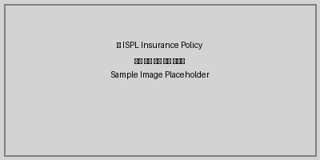

---
document_statistics:
  average_text_length: 41.8
  content_types:
    image: 1
    list_item: 1
    subheader: 2
    title: 1
  total_elements: 5
  total_pages: 2
generated_at: '2025-09-23T23:00:27.017923'
generator: ISPL PDF Processor
language: ko
source_format: PDF
title: Test Policy
---

## 목차

- [보험약관 제1장 총칙](#보험약관-제1장-총칙) (페이지 1)
  - [제1조 (목적) 이 약관은 보험회사와 보험계약자 간의 권리와 의무를 규정함을 목적으로 합니다.](#제1조-목적-이-약관은-보험회사와-보험계약자-간의-권리와-의무를-규정함을-목적으로-합니다) (페이지 1)
  - [제2조 (정의) 이 약관에서 사용하는 용어의 정의는 다음과 같습니다.
1. 보험계약자: 보험회사와 보험계약을 체결하는 자
2. 피보험자: 보험사고의 대상이 되는 자](#제2조-정의-이-약관에서-사용하는-용어의-정의는-다음과-같습니다-1-보험계약자-보험회사와-보험계약을-체결하는-자-2-피보험자-보험사고의-대상이-되는-자) (페이지 1)

# 보험약관 제1장 총칙

### 제1조 (목적) 이 약관은 보험회사와 보험계약자 간의 권리와 의무를 규정함을 목적으로 합니다.

### 제2조 (정의) 이 약관에서 사용하는 용어의 정의는 다음과 같습니다.
1. 보험계약자: 보험회사와 보험계약을 체결하는 자
2. 피보험자: 보험사고의 대상이 되는 자

*보험 가입 절차 안내 이미지*
<!-- 이미지 정보: 품질=good, 타입=diagram, OCR 신뢰도=0.85 -->

- 주의사항: 보험료 납입이 연체될 경우 보험계약이 해지될 수 있습니다.